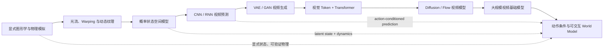

# Video Generation 101

一份面向研究者、工程师和创作者的 **视频生成技术知识地图**：从传统运动建模、深度视频预测，到 diffusion、flow matching 和可交互 world model。

> 这不是一门按周展开的完整课程，也不是产品排行榜。仓库关注技术脉络、关键思想、代表论文、开放实现，以及“视频生成模型何时才算 world model”这个核心问题。

资料更新时间：**2026-08**

## 从哪里开始

| 如果你想了解 | 建议入口 |
|---|---|
| 整个领域如何演化 | [技术时间线](docs/timeline.md) |
| 各类任务、模型和术语的区别 | [任务与方法分类](docs/taxonomy.md) |
| VAE、GAN、Diffusion 如何串成主线 | [生成模型路线](docs/generative-models.md) |
| 视频生成如何进入基础模型阶段 | [大模型路线](docs/foundation-models.md) |
| Video model 和 world model 的边界 | [从视频生成到 World Model](docs/world-models.md) |
| 视频生成能落到哪些真实场景 | [相关应用](docs/applications.md) |
| 如何正确比较模型 | [评测指南](docs/evaluation.md) |
| 应该优先读哪些论文 | [精选阅读列表](docs/reading-list.md) |
| 需要 BibTeX、官方代码和 GitHub Stars | [引用与代码索引](docs/bibliography.md) |
| 可以实际运行哪些开放模型 | [开放模型与代码](resources/open-models.md) |
| 常见训练与评测数据 | [数据集索引](resources/datasets.md) |

## 一张图看懂技术演化



这不是一条“旧方法被新方法完全替代”的直线。今天的 world model 仍然在重新吸收传统模拟器的显式状态、物理约束和可验证性。

## 四条主线

| 主线 | 典型表示 | 生成或预测机制 | 代表工作 | 主要瓶颈 |
|---|---|---|---|---|
| 传统与预测 | 光流、运动场、像素或 latent | Warping、状态空间、CNN/RNN | Video Textures、ConvLSTM、CDNA | 多模态未来与误差累积 |
| 生成模型 | 连续 latent、随机变量、噪声 | VAE、GAN、Diffusion、Flow | MoCoGAN、DVD-GAN、Video Diffusion、Sora | 训练稳定性、采样成本、长程一致性 |
| 大模型 | 时空 token、spacetime patch、多模态 latent | Transformer、masked modeling、foundation model post-training | VideoGPT、MAGVIT、Sora、Cosmos | 数据治理、上下文长度、可控性 |
| 应用与 World Model | 状态、动作、记忆、交互环境 | 条件 rollout、编辑闭环、规划、仿真 | Dreamer、Genie、GameNGen、GWM-1、Cosmos | 因果性、状态持久性、闭环可靠性 |

## 必须分清的三个概念

### 1. 视频生成

学习视觉序列的分布，例如：

$$
p(x_{1:T}\mid c)
$$

其中条件 $c$ 可以是文本、图像、音频或已有视频。目标通常是画质、多样性、文本遵循和时空一致性。

### 2. 视频预测

根据历史观测预测未来：

$$
p(x_{t+1:T}\mid x_{1:t})
$$

它可以用于预测，但未必知道智能体采取了什么动作，也未必适合规划。

### 3. World model

面向决策的 world model 通常还需要建模动作和环境状态：

$$
p(s_{t+1}, o_{t+1}, r_{t+1}\mid s_t,a_t)
$$

除了“生成合理画面”，它还应回答：如果智能体采取另一个动作，会发生什么？其价值最终要通过控制、规划或交互任务验证。

## 里程碑速览

- **2000–2003**：Video Textures、Dynamic Textures，用重组与线性动力系统合成可持续运动。
- **2014–2016**：LSTM、ConvLSTM、Beyond MSE、CDNA，把视频预测变成端到端学习问题。
- **2016–2019**：Video GAN、MoCoGAN、DVD-GAN 探索内容—运动解耦和高分辨率生成。
- **2021–2023**：VideoGPT、Phenaki、MAGVIT 将视频压缩成视觉 token 后用 Transformer 建模。
- **2022–2024**：Video Diffusion、Imagen Video、Make-A-Video、Lumiere、Sora 推动 diffusion 成为主流。
- **2024–2025**：Genie、GameNGen、Genie 3、GWM-1 把焦点推向潜在动作、物理预测和实时交互。
- **2025–2026**：GWM-1、Cosmos 系列等开始统一视频、声音、动作、规划和 Physical AI。

详细版本见 [技术时间线](docs/timeline.md)。

## 推荐阅读路径

### 快速建立全局观

1. 阅读 [任务与方法分类](docs/taxonomy.md)。
2. 阅读 [生成模型路线](docs/generative-models.md)，先把 VAE、GAN、diffusion 和 flow 串起来。
3. 阅读 [大模型路线](docs/foundation-models.md)，理解 tokenizer、Transformer 和 world foundation model 的关系。
4. 从 [精选阅读列表](docs/reading-list.md) 的“最小阅读集”选 8 篇。
5. 阅读 [World Model 专章](docs/world-models.md)，理解生成质量和模拟能力的差别。
6. 用 [相关应用](docs/applications.md) 和 [评测指南](docs/evaluation.md) 分析一个你熟悉的模型。

### 准备做研究

1. 选择一个轴：表示、时序、控制、长程一致性、物理、效率或评测。
2. 在时间线中找出该轴的三代代表方法。
3. 复现一个开放 baseline。
4. 同时报告成功案例、失败案例和反事实测试。

## 仓库结构

```text
.
├── README.md
├── docs/
│   ├── timeline.md
│   ├── taxonomy.md
│   ├── generative-models.md
│   ├── foundation-models.md
│   ├── world-models.md
│   ├── applications.md
│   ├── evaluation.md
│   ├── reading-list.md
│   ├── jepa.md
│   └── bibliography.md
├── bibliography/
│   ├── references.bib
│   ├── registry.json
│   ├── metadata.json
│   └── github-stars.json
├── resources/
│   ├── open-models.md
│   └── datasets.md
├── scripts/
│   └── update_bibliography.py
├── sources/
│   └── papers_20260809_jepa_lineage.md
├── CONTRIBUTING.md
├── CITATION.cff
└── LICENSE
```

## 收录原则

- 优先原始论文、项目页、官方代码和模型卡。
- 产品发布只有在代表新的技术能力或研究方向时才收录。
- 不依据单一厂商的内部榜单给模型排序。
- 对“物理理解”“世界模拟”等强主张，明确区分演示、离线指标和闭环证据。
- 资源状态会变化；涉及许可证、权重和商用条件时，以项目最新说明为准。

## 参与贡献

欢迎补充论文、开放模型、数据集、复现结果和勘误。请先阅读 [CONTRIBUTING.md](CONTRIBUTING.md)。

## License

本仓库以 [MIT License](LICENSE) 发布。论文、数据集、模型及第三方材料仍遵循各自的许可证和使用条款。
