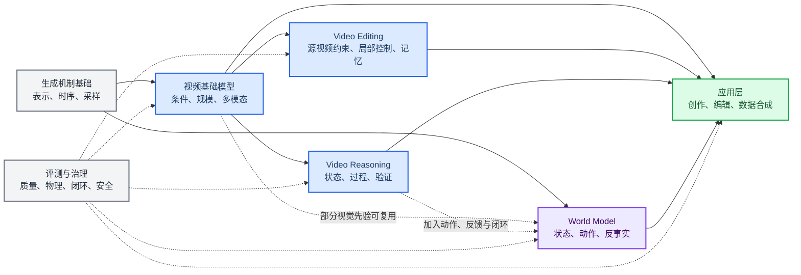
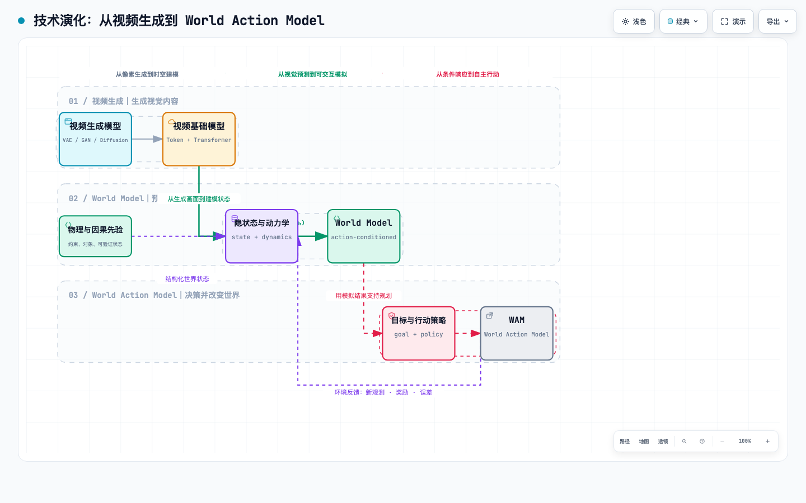

# Video Generation 101

#### Created by Codex and <a href='https://vinthony.github.io/'>Xiaodong Cun (Corresponding Author)</a>, from <a href='https://gvclab.github.io'>GVC Lab, Great Bay University</a>

一份面向初学者、研究者、工程师和创作者的 **视频生成技术知识地图**：从“一句话如何变成一段视频”开始，逐步进入传统运动建模、深度视频预测、diffusion、flow matching、偏好后训练、开放集视频个性化、细粒度控制、多视角/4D、视频退化修复、原生音视频和可交互 world model。

资料更新时间：**2026-08**

## Why Video Generation 101

现阶段，Coding Agent 的技术已经相当成熟，能够高效地搜索和生成大量内容。但 Coding Agent 仍有一个核心问题：**它可以生成，却无法独立保证生成结果的质量、准确性与可靠性。**

这份《Video Generation 101》是一次“**Coding Agent 负责生成，研究员负责校验**”的协作实践。我（<a href='https://vinthony.github.io/'>Xiaodong Cun</a>）投入了大量 token 和时间，对内容逐项 review、核对并重新梳理，最终形成这份系统化的报告。它既适合初学者建立对视频生成领域的整体认识，也可供已有经验的读者查漏补缺。


## 第一次接触视频生成？

如果你第一次接触视频生成，不需要先学习数学、编程或模型术语。请直接从 [零基础入门：一句话如何变成一段视频](docs/getting-started.md) 开始。

这篇入门导览用“一只猫在草地上奔跑”作为贯穿例子，说明：

- 模型在训练阶段怎样从大量视频中学习；
- 点击“生成”后，文字怎样经过理解、去噪和解码变成视频；
- 为什么视频生成比图片生成更难；
- 为什么好看的画面不等于一段可靠的视频；
- 完全外行、创作者、工程师和研究生应该怎样继续阅读。

预计阅读时间：**8–10 分钟**。不要求数学、编程或机器学习基础。

## 按你的背景选择入口

不需要从头到尾阅读。先按背景选择第一站，再沿下面的技术主线继续深入。

| 你现在的背景 | 建议入口 | 读完后能做什么 |
|---|---|---|
| 完全零基础 | [零基础入门](docs/getting-started.md) | 看懂视频生成在做什么，并区分常见输入、输出和应用 |
| 了解 AIGC 产品或内容创作 | [相关应用](docs/applications.md) | 把产品功能对应到技术能力，识别演示效果与可靠能力的差别 |
| 有机器学习或工程基础 | [生成模型路线](docs/generative-models.md) | 理解主要技术机制，并开始模型选择、复现或应用开发 |
| 准备从事研究 | [任务地图](docs/taxonomy.md) 或 [并行技术时间线](docs/timeline.md) | 建立研究谱系，选择论文、baseline 和研究问题 |

## 主叙事：四条技术主线、一个应用层、一套验证框架

四条技术主线回答四个相互关联但目标不同的问题：模型怎样生成视频、怎样扩展为可迁移的多条件多模态系统、怎样把生成的视觉状态用作计算与推演、怎样预测动作对世界的影响。它们可能共享视频 tokenizer/codec 这一表示接口、Transformer/DiT 骨干，以及 diffusion/flow 等目标或采样路径；这些词不在同一分类层。Video Reasoning 还需要结果与过程可验证，World Model 还需要动作条件、反事实和闭环证据；二者都不是画质提升后的自动“下一等级”。

> **分类提醒：**“无条件视频生成”是一种具体任务；pixel、连续 latent 与离散 token 属于 representation，autoregressive 与 masked 属于 factorization，ELBO、adversarial、diffusion/score 与 flow matching 属于 objective，DiT 等则属于 backbone。现代所谓 video VAE 还可能只是 tokenizer/decoder，而不是用 ELBO 独立定义完整生成分布。因此第一条主线称为“生成机制基础”，而不是“不可控视频生成”。Video DiT 内部的 full/factorized/window/sparse/linear attention、条件融合、3D 位置、noise-time MoE 与并行/cache 也不是一个标签，见[骨干扩展专章](docs/generative-models/video-dit-backbones.md)。同理，causal codec、causal generator、streaming commit 与 real-time SLO 是四份独立合同：只读过去的 codec 不保证生成器无未来泄漏，因果生成器不保证输出已越过不可撤回的提交前沿，持续提交也不保证 TTFF、p99、jitter 和 deadline miss 达标；完整的 lookahead、revision、backpressure、恢复与 `StreamFork-1` 反证协议见[因果流式专章](docs/generative-models/causal-streaming-generation.md)。

> **编辑的位置：**Video editing 不是第五种生成机制，也不只是末端应用。它是贯穿图像模型、I2V、T2V、视频基础模型和创作系统的横向控制能力：复用生成先验，同时增加源视频约束、局部可寻址控制、未编辑区域保持和多轮状态管理。



| 结构 | 核心问题 | 主要演进与代表工作 | 学习入口 |
|---|---|---|---|
| **1. 技术基础：视频表示、时序建模与生成机制** | 模型怎样表达时间、运动和多种可能未来？ | 从 Video Textures [[1]](#ref-1)、Dynamic Textures [[2]](#ref-2)、ConvLSTM [[3]](#ref-3)、CDNA [[4]](#ref-4)，到 MoCoGAN [[5]](#ref-5)、DVD-GAN [[6]](#ref-6) 和 Video Diffusion [[10]](#ref-10)；表示从 pixel 扩展到连续 latent 与离散 token，时间分解采用 recurrent、autoregressive 或 masked 路线，训练目标再选择 ELBO、adversarial、diffusion/score 或 flow，骨干再选择 U-Net、full/factorized/sparse/linear/hybrid Video DiT，并可叠加少步蒸馏、偏好后训练、长期记忆和 SLO | [生成模型路线](docs/generative-models.md) · [视频 Tokenizer 与生成式压缩边界](docs/generative-models/video-tokenizers.md) · [Video DiT 与骨干扩展](docs/generative-models/video-dit-backbones.md) · [视频后训练与对齐](docs/generative-models/video-post-training-alignment.md) · [因果流式专章](docs/generative-models/causal-streaming-generation.md) |
| **2. 视频基础模型与创作系统** | 模型怎样从单任务生成器扩展为可迁移、多条件、多模态系统？ | VideoGPT [[7]](#ref-7)、Phenaki [[8]](#ref-8)、MAGVIT [[9]](#ref-9)、Make-A-Video [[11]](#ref-11)、Imagen Video [[12]](#ref-12)、Lumiere [[13]](#ref-13) 与 Sora [[14]](#ref-14) 串起技术前驱与规模化模型。发展应从七个正交维度观察：开放式文本到视频；开放集主体参考与身份—运动绑定；相机、轨迹、姿态与几何控制；相机 × 世界时间的多视角/4D 查询与状态；源视频保持与可寻址编辑；多段 prompt/storyboard 与跨镜头连续；原生联合音视频。所谓“统一”还必须说明是统一接口、流水线、backbone、模型家族还是单一 checkpoint | [视频基础模型路线](docs/foundation-models.md) · [开放集视频个性化](docs/tasks/personalized-video-generation.md) · [细粒度可控生成](docs/tasks/controllable-video-generation.md) · [多视角/4D 生成](docs/tasks/multiview-4d-generation.md) · [原生音视频](docs/tasks/native-audio-video-generation.md) · [视频编辑](docs/tasks/video-to-video.md) |
| **3. Video Reasoning：把视觉生成作为计算介质** | 模型能否用连续视觉状态执行搜索、规则、物理推演与规划；结果和过程怎样验证？ | 以 *Video models are zero-shot learners and reasoners* 为叙事原点：先还原其零样本证据、Chain-of-Frames 假说与黑盒边界，再向前追溯视觉化思维，向后展开 benchmark、VBVR 百万规模监督、Chain-of-Steps、early commitment、verifiable reward、test-time adaptation、层级去噪和 planner—generator—verifier 闭环；不把正确终态等同于忠实推理 | [Video Reasoning 专章](docs/video-reasoning.md) |
| **4. World Model：从未来预测到行动闭环** | 模型能否根据状态和动作预测后果，并进一步支持交互、规划或决策？ | 决策型 latent dynamics 与生成式视觉模型形成两条并行历史，并在 Genie [[15]](#ref-15)、GameNGen [[16]](#ref-16)、Genie 3 [[17]](#ref-17)、GWM-1 [[18]](#ref-18) 和 Cosmos [[19]](#ref-19) 等交互环境与 Physical AI 系统中逐渐汇合；是否达到闭环仍须逐个系统核验 | [从视频生成到 World Model](docs/world-models.md) · [物理一致性的视频生成](docs/physical-consistency.md) |
| **5. 应用层** | 上述能力能解决哪些实际问题？ | 内容创作、视频编辑、视频退化修复、数字人、游戏、数据合成、自动驾驶、机器人和科学可视化；编辑改变指定内容，退化修复则从仍可观测的 blur、noise、低分辨率或压缩视频恢复同一时间轴，不能与 mask 缺失补全共用验收 | [相关应用](docs/applications.md) · [视频编辑](docs/tasks/video-to-video.md) · [视频退化修复](docs/tasks/video-restoration.md) · [任务地图](docs/taxonomy.md) |
| **6. 验证框架** | 应以什么证据证明能力有效？ | 分开检查画质与条件遵循、长程状态、推理结果与过程、物理与反事实、交互延迟、规划或控制闭环，以及安全和治理；“看起来真实”不是理解世界的充分证据 | [评测指南](docs/evaluation.md) · [物理一致性](docs/physical-consistency.md) |

按输入与输出查任务，请使用 [任务地图](docs/taxonomy.md)；参考图只定义开放集主体、不占输出时间轴时进入[开放集视频个性化](docs/tasks/personalized-video-generation.md)；理解生成、编辑与当前基础模型的关系，可直接阅读[视频编辑与 milestones](docs/tasks/video-to-video.md)；需要同时区分相机视角、世界时间、像素网格与可渲染动态状态时进入[多视角/4D 生成](docs/tasks/multiview-4d-generation.md)；处理超分、去模糊、去噪或去压缩时进入[视频退化修复](docs/tasks/video-restoration.md)，缺失区域或对象移除则进入[视频补全](docs/tasks/video-inpainting.md)；按年份查完整论文谱系，请进入 [并行技术时间线](docs/timeline.md)。

## 一张图看懂详细技术演化

[](assets/diagrams/video-to-world-action-model.html)

> 点击图片打开 [Archify 交互版](assets/diagrams/video-to-world-action-model.html)，可切换明暗主题、缩放、聚焦路径并导出 SVG、PNG、JPEG、WebP 或 WebM。结构化源文件见 [workflow JSON](assets/diagrams/video-to-world-action-model.workflow.json)。

这张图展示技术之间的继承和汇合关系，而不是“旧方法被新方法完全替代”的直线。传统模拟器的显式状态与物理约束、视频生成的视觉先验，以及 World Model 的动作和规划目标，今天仍然并行存在。

## 必须分清的四个概念

- **视频生成**学习条件下视觉序列的分布：$p(x_{1:T}\mid c)$。条件 $c$ 可以是文本、图像、音频或已有视频，重点通常是画质、多样性、条件遵循和时空一致性。
- **视频预测**根据历史观测预测未来：$p(x_{t+1:T}\mid x_{1:t})$。它处理一种或多种可能未来，但未必知道智能体采取了什么动作。
- **Video Reasoning**把生成的帧、视觉 token 或去噪 latent 用作问题求解状态。它需要任务结果、过程合法性、OOD 或内部干预证据；一段“看起来像在思考”的视频并不够。
- **World Model**的共同核心是学习动作条件下的状态转移，例如 $p(z_{t+1}\mid z_t,a_t)$；不同方法可以选择是否重建观测、预测奖励、价值或策略。动作条件预测、状态持久和反事实测试可以证明其世界建模能力；若进一步声称支持决策或控制，则需要反复执行“动作 → 环境响应 → 新观测 → 再决策”的闭环验证。

因此，画面逼真不等于理解物理，视频预测也不自动等于可用于决策的 World Model。

## 进阶阅读路径

### 已有机器学习基础：快速建立全局观

1. 用 [任务地图](docs/taxonomy.md) 明确不同任务的输入和输出。
2. 阅读 [生成模型路线](docs/generative-models.md)，先拆开 representation、factorization、objective、backbone 与 deployment；再分别用[视频 Tokenizer 与生成式压缩边界](docs/generative-models/video-tokenizers.md)理解表示接口，用[变分生成](docs/generative-models/variational-generation.md)理解 ELBO 与随机未来。
3. 阅读 [Video DiT 与骨干扩展](docs/generative-models/video-dit-backbones.md)，从 latent token 预算出发，分清 attention topology、条件融合、MoE、并行与 cache，并学会做 matched-backbone / fixed-checkpoint 比较。
4. 用 [因果、流式与实时视频生成](docs/generative-models/causal-streaming-generation.md) 理解少步生成、训练—推理分布、长期记忆和在线系统怎样汇合，并能分别写出 codec、generator、commit 与 SLO 四层合同。
5. 阅读 [视频基础模型路线](docs/foundation-models.md)，理解 tokenizer、Transformer、多模态条件，以及“统一”发生在接口、backbone、模型家族还是 checkpoint 层。
6. 按研究问题进入 [开放集视频个性化](docs/tasks/personalized-video-generation.md)、[细粒度可控生成](docs/tasks/controllable-video-generation.md)、[多视角/4D 生成](docs/tasks/multiview-4d-generation.md)、[视频退化修复](docs/tasks/video-restoration.md)、[原生音视频](docs/tasks/native-audio-video-generation.md)或[视频后训练与对齐](docs/generative-models/video-post-training-alignment.md)，练习区分任务条件、观测证据、相机/时间查询、优化目标与采样成本。
7. 阅读 [Video Reasoning 专章](docs/video-reasoning.md)，区分输出帧、去噪过程和交互闭环三种推理时间，并掌握可验证证据阶梯。
8. 阅读 [World Model 专章](docs/world-models.md)，区分生成质量、环境预测和决策能力。
9. 补充 [物理一致性的视频生成](docs/physical-consistency.md)，理解视觉 plausibility 与真实规律的差别。
10. 用 [相关应用](docs/applications.md) 和 [评测指南](docs/evaluation.md) 分析一个具体模型。

### 准备做研究

1. 从表示、时序、控制、长程一致性、物理、效率或评测中选择一个研究轴。
2. 在 [并行技术时间线](docs/timeline.md) 中找出该轴的三代代表方法，并从 [精选阅读列表](docs/reading-list.md) 选择最小阅读集。
3. 使用 [开放模型与代码](resources/open-models.md) 和 [数据集索引](resources/datasets.md) 复现一个 baseline。
4. 同时报告成功案例、失败案例、反事实测试和评测预算；引用信息见 [引用与代码索引](docs/bibliography.md)。

## 仓库结构

```text
.
├── README.md
├── docs/
│   ├── getting-started.md
│   ├── timeline.md
│   ├── taxonomy.md
│   ├── tasks/
│   │   ├── text-to-video.md
│   │   ├── image-to-video.md
│   │   ├── personalized-video-generation.md
│   │   ├── controllable-video-generation.md
│   │   ├── multiview-4d-generation.md
│   │   ├── native-audio-video-generation.md
│   │   ├── video-restoration.md
│   │   ├── video-inpainting.md
│   │   └── ...
│   ├── generative-models.md
│   ├── generative-models/
│   │   ├── recurrent-prediction.md
│   │   ├── variational-generation.md
│   │   ├── video-tokenizers.md
│   │   ├── adversarial-generation.md
│   │   ├── autoregressive-generation.md
│   │   ├── masked-generation.md
│   │   ├── diffusion-models.md
│   │   ├── flow-consistency-models.md
│   │   ├── video-dit-backbones.md
│   │   ├── video-post-training-alignment.md
│   │   └── causal-streaming-generation.md
│   ├── foundation-models.md
│   ├── video-reasoning.md
│   ├── world-models.md
│   ├── physical-consistency.md
│   ├── applications.md
│   ├── evaluation.md
│   ├── reading-list.md
│   ├── jepa.md
│   └── bibliography.md
├── bibliography/
│   ├── references.bib
│   ├── registry.json
│   ├── metadata.json
│   └── github-stars.json
├── resources/
│   ├── open-models.md
│   └── datasets.md
├── scripts/
│   └── update_bibliography.py
├── sources/
│   └── papers_20260809_jepa_lineage.md
├── CONTRIBUTING.md
├── CITATION.cff
└── LICENSE
```

## 收录原则

- 优先原始论文、项目页、官方代码和模型卡。
- 产品发布只有在代表新的技术能力或研究方向时才收录。
- 不依据单一厂商的内部榜单给模型排序。
- 对“物理理解”“世界模拟”等强主张，明确区分演示、离线指标和闭环证据。
- 资源状态会变化；涉及许可证、权重和商用条件时，以项目最新说明为准。

## 参与贡献

欢迎补充论文、开放模型、数据集、复现结果和勘误。请先阅读 [CONTRIBUTING.md](CONTRIBUTING.md)。

## License

本仓库以 [MIT License](LICENSE) 发布。论文、数据集、模型及第三方材料仍遵循各自的许可证和使用条款。

## 参考文献

<a id="ref-1"></a>[1] [Video textures](https://doi.org/10.1145/344779.345012). Arno Schödl, Richard Szeliski, David H. Salesin, Irfan Essa. SIGGRAPH. 2000.

<a id="ref-2"></a>[2] [Dynamic Textures](https://doi.org/10.1023/A:1021669406132). Gianfranco Doretto, Alessandro Chiuso, Ying Nian Wu, Stefano Soatto. International Journal of Computer Vision. 2003.

<a id="ref-3"></a>[3] [Convolutional LSTM Network: A Machine Learning Approach for Precipitation Nowcasting](https://arxiv.org/abs/1506.04214). Xingjian Shi, Zhourong Chen, Hao Wang, Dit-Yan Yeung, Wai-kin Wong, Wang-chun Woo. NeurIPS. 2015.

<a id="ref-4"></a>[4] [Unsupervised Learning for Physical Interaction through Video Prediction](https://arxiv.org/abs/1605.07157). Chelsea Finn, Ian Goodfellow, Sergey Levine. NeurIPS. 2016.

<a id="ref-5"></a>[5] [MoCoGAN: Decomposing Motion and Content for Video Generation](https://arxiv.org/abs/1707.04993). Sergey Tulyakov, Ming-Yu Liu, Xiaodong Yang, Jan Kautz. CVPR. 2018.

<a id="ref-6"></a>[6] [Adversarial Video Generation on Complex Datasets](https://arxiv.org/abs/1907.06571). Aidan Clark, Jeff Donahue, Karen Simonyan. arXiv preprint. 2019.

<a id="ref-7"></a>[7] [VideoGPT: Video Generation using VQ-VAE and Transformers](https://arxiv.org/abs/2104.10157). Wilson Yan, Yunzhi Zhang, Pieter Abbeel, Aravind Srinivas. arXiv preprint. 2021.

<a id="ref-8"></a>[8] [Phenaki: Variable Length Video Generation from Open Domain Textual Descriptions](https://arxiv.org/abs/2210.02399). Ruben Villegas, Mohammad Babaeizadeh, Pieter-Jan Kindermans, Hernan Moraldo, Han Zhang, Mohammad Taghi Saffar, et al. ICLR. 2023.

<a id="ref-9"></a>[9] [MAGVIT: Masked Generative Video Transformer](https://arxiv.org/abs/2212.05199). Lijun Yu, Yong Cheng, Kihyuk Sohn, José Lezama, Han Zhang, Huiwen Chang, et al. CVPR. 2023.

<a id="ref-10"></a>[10] [Video Diffusion Models](https://arxiv.org/abs/2204.03458). Jonathan Ho, Tim Salimans, Alexey Gritsenko, William Chan, Mohammad Norouzi, David J. Fleet. NeurIPS. 2022.

<a id="ref-11"></a>[11] [Make-A-Video: Text-to-Video Generation without Text-Video Data](https://arxiv.org/abs/2209.14792). Uriel Singer, Adam Polyak, Thomas Hayes, Xi Yin, Jie An, Songyang Zhang, et al. ICLR. 2023.

<a id="ref-12"></a>[12] [Imagen Video: High Definition Video Generation with Diffusion Models](https://arxiv.org/abs/2210.02303). Jonathan Ho, William Chan, Chitwan Saharia, Jay Whang, Ruiqi Gao, Alexey Gritsenko, et al. arXiv preprint. 2022.

<a id="ref-13"></a>[13] [Lumiere: A Space-Time Diffusion Model for Video Generation](https://arxiv.org/abs/2401.12945). Omer Bar-Tal, Hila Chefer, Omer Tov, Charles Herrmann, Roni Paiss, Shiran Zada, et al. SIGGRAPH Asia. 2024.

<a id="ref-14"></a>[14] [Video Generation Models as World Simulators](https://openai.com/index/video-generation-models-as-world-simulators/). OpenAI. Technical report. 2024.

<a id="ref-15"></a>[15] [Genie: Generative Interactive Environments](https://arxiv.org/abs/2402.15391). Jake Bruce, Michael Dennis, Ashley Edwards, Jack Parker-Holder, Yuge Shi, Edward Hughes, et al. ICML. 2024.

<a id="ref-16"></a>[16] [Diffusion Models Are Real-Time Game Engines](https://arxiv.org/abs/2408.14837). Dani Valevski, Yaniv Leviathan, Moab Arar, Shlomi Fruchter. ICLR. 2025.

<a id="ref-17"></a>[17] [Genie 3: A New Frontier for World Models](https://deepmind.google/blog/genie-3-a-new-frontier-for-world-models/). Google DeepMind. Project report. 2025.

<a id="ref-18"></a>[18] [Introducing Runway GWM-1](https://runway.com/research/introducing-runway-gwm-1). Runway. Project report. 2025.

<a id="ref-19"></a>[19] [Cosmos World Foundation Model Platform for Physical AI](https://arxiv.org/abs/2501.03575). Niket Agarwal, Arslan Ali, Maciej Bala, Yogesh Balaji, Erik Barker, Tiffany Cai, et al. arXiv preprint. 2025.
