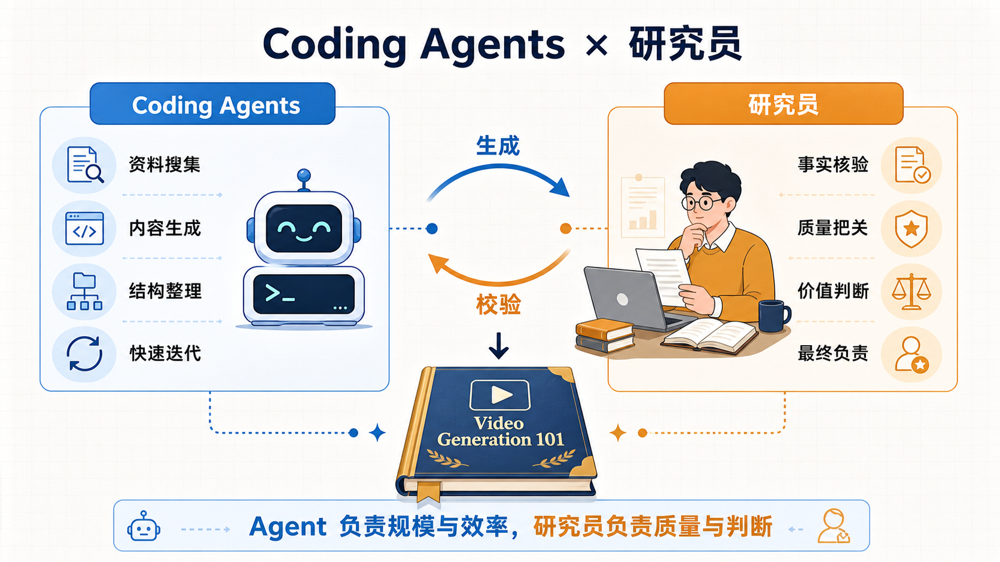
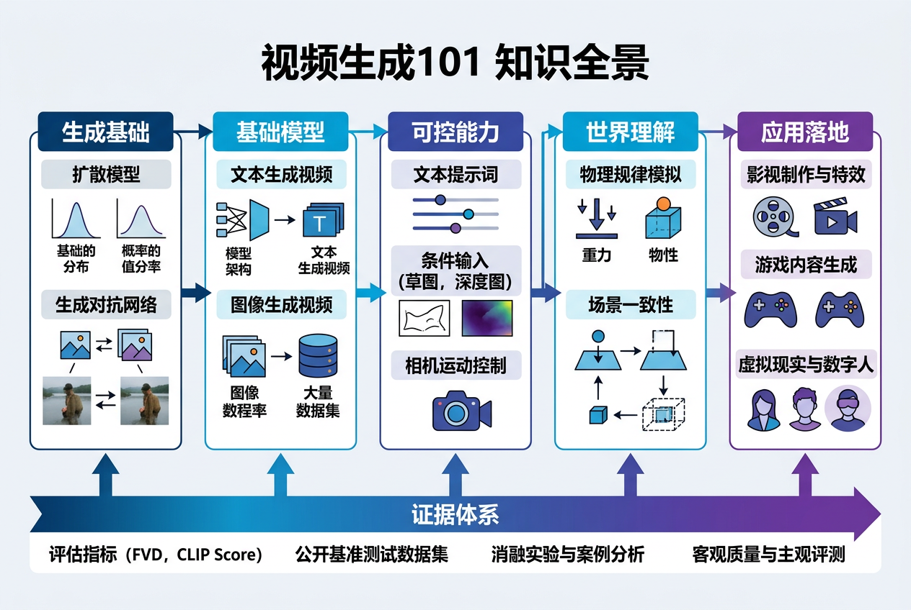

# Video Generation 101

_Created by Codex and <a href="https://vinthony.github.io/">Xiaodong Cun (Corresponding Author)</a>, from <a href="https://gvclab.github.io/">GVC Lab, Great Bay University</a>_

[](https://gvclab.github.io/Video-Generation-101/)
[](docs/taxonomy.md)
[](docs/timeline.md)
[](LICENSE)

> 📖 **在线阅读（带全文搜索）：<https://gvclab.github.io/Video-Generation-101/>**


一份面向初学者、研究者、工程师与创作者的视频生成知识体系。它不以堆叠模型和榜单为目标，而是试图建立一条从**生成原理、系统能力、世界理解到真实应用与验证**的完整学习路径。

> 资料更新时间：**2026-08**

---


<details>
<summary><strong>English summary</strong></summary>

**Video Generation 101** is a structured knowledge base on video generation, written for learners,
researchers, engineers and creators. Rather than ranking models, it builds one continuous path from
generative principles, through system capabilities and world understanding, to real applications and
the evidence needed to believe them.

Five layers organise the material: **generation foundations**, **system capabilities**,
**controllable creation**, **world understanding**, and an **evidence framework**.

Every chapter carries an explicit evidence snapshot date and separates author-reported numbers from
independently reproduced ones. The prose is in Chinese; paper titles, venues and links are in English,
and reference metadata is checked in CI.

</details>

---

## 🎯 项目定位

视频生成正在从“根据条件合成一段画面”，走向能够持续保持状态、接受复杂控制、理解动作后果并服务真实任务的通用视频系统。本仓库围绕六个层面组织内容：

- **生成基础**：视频怎样被表示，时间与运动怎样被建模，生成过程怎样训练和加速
- **基础模型能力**：模型具备哪些视觉、时间、语义、控制、物理、推理与行动能力
- **系统构建**：这些能力怎样经预训练、后训练、蒸馏、编排与部署形成可用系统
- **可控创作**：怎样完成个性化、编辑、多视角、故事、多模态音视频与细粒度控制
- **世界理解**：怎样从视觉合成进一步走向推理、物理一致性、动作条件预测与交互环境
- **证据体系**：怎样通过评测、复现、反事实测试和闭环实验判断能力是否真实成立

仓库本身也是一次人机协作研究实践：Coding Agent 负责广泛检索、结构化整理和初稿生成，研究者负责问题定义、证据核验、边界判断与最终质量控制。



_Coding Agent 扩展研究覆盖面，研究者对结论与证据负责。_

## 🧭 从哪里开始

不需要从头到尾阅读。选择与你当前目标最接近的入口即可；如需按读者身份获得完整的阅读顺序、跳读原则与阶段性产出，请使用[分读者阅读指引](docs/reader-guides.md)。

| 读者与目标 | 建议入口 | 你将获得什么 |
|---|---|---|
| 第一次接触视频生成 | [零基础入门](docs/getting-started.md) | 用直观例子理解视频如何从条件与噪声中生成 |
| 希望建立完整技术框架 | [生成模型路线](docs/generative-models.md) | 串起表示、时序、生成机制、骨干网络与推理系统 |
| 关注模型会什么 | [基础模型能力地图](docs/foundation-model-capabilities.md) | 区分生成、控制、物理、推理、行动能力与后训练机制 |
| 关注模型怎样构建 | [视频基础模型系统](docs/foundation-models.md) | 理解数据、checkpoint、后训练、部署与产品归因 |
| 准备选择研究问题 | [任务地图](docs/taxonomy.md) · [World Action Model](docs/world-action-model.md) | 从输入、输出、约束、行动后果与证据定位研究方向 |
| 希望追踪领域演进 | [技术时间线](docs/timeline.md) | 观察不同路线如何长期并行、汇合与分化 |
| 关注落地与可靠性 | [应用地图](docs/applications.md) · [评测指南](docs/evaluation.md) | 把模型能力映射到真实任务与可验证标准 |

## 🗺️ 知识全景

仓库以“原理 → 能力 → 系统 → 世界 → 应用”为主轴，并让评测与治理贯穿每一层。


### 内容导航

| 板块 | 核心入口 | 延伸专题 |
|---|---|---|
| 生成原理 | [生成模型路线](docs/generative-models.md) | [视频 Tokenizer](docs/generative-models/video-tokenizers.md) · [Video DiT](docs/generative-models/video-dit-backbones.md) · [后训练与对齐](docs/generative-models/video-post-training-alignment.md) · [因果与流式生成](docs/generative-models/causal-streaming-generation.md) |
| 基础模型能力 | [能力地图](docs/foundation-model-capabilities.md) · [基础模型系统](docs/foundation-models.md) | [个性化](docs/tasks/personalized-video-generation.md) · [细粒度控制](docs/tasks/controllable-video-generation.md) · [多视角/4D](docs/tasks/multiview-4d-generation.md) · [原生音视频](docs/tasks/native-audio-video-generation.md) |
| 编辑与时序任务 | [视频编辑](docs/tasks/video-to-video.md) | [视频补全](docs/tasks/video-inpainting.md) · [视频修复](docs/tasks/video-restoration.md) · [视频虚拟试衣](docs/tasks/video-virtual-try-on.md) · [故事与多镜头](docs/tasks/story-multishot.md) |
| 推理与世界模型 | [Video Reasoning](docs/video-reasoning.md) · [World Model](docs/world-models.md) · [World Action Model](docs/world-action-model.md) | [物理一致性](docs/physical-consistency.md) · [动作条件预测](docs/tasks/action-conditioned-prediction.md) · [交互式世界生成](docs/tasks/interactive-world-generation.md) |
| 应用与研究资源 | [应用地图](docs/applications.md) · [评测指南](docs/evaluation.md) | [精选阅读](docs/reading-list.md) · [开放模型](resources/open-models.md) · [数据集](resources/datasets.md) |

## 🎓 推荐学习路径

| 路径 | 建议顺序 |
|---|---|
| 建立直觉 | [零基础入门](docs/getting-started.md) → [应用地图](docs/applications.md) → [任务地图](docs/taxonomy.md) |
| 掌握技术体系 | [生成模型](docs/generative-models.md) → [能力地图](docs/foundation-model-capabilities.md) → [基础模型系统](docs/foundation-models.md) → [评测](docs/evaluation.md) |
| 开展研究 | [任务地图](docs/taxonomy.md) → [World Action Model](docs/world-action-model.md) → [技术时间线](docs/timeline.md) → [精选阅读](docs/reading-list.md) → 具体专题 |
| 面向系统与应用 | 选择任务专题 → [开放模型](resources/open-models.md) → [数据集](resources/datasets.md) → [评测指南](docs/evaluation.md) |
| 按身份获得完整路线 | [分读者阅读指引](docs/reader-guides.md) → 选择通识、创作/产品、工程、研究、世界模型或教学路线 → 完成对应阶段产出 |

## 🗂️ 仓库结构

<!-- markdownlint-disable MD033 -->
<details>
<summary><strong>展开查看仓库结构</strong></summary>

~~~text
Video-Generation-101/
├── README.md                    # 项目总览与学习入口
├── docs/
│   ├── getting-started.md       # 零基础导览
│   ├── reader-guides.md         # 分读者阅读顺序与阶段产出
│   ├── generative-models.md     # 生成机制主线
│   ├── foundation-model-capabilities.md # 基础模型能力地图
│   ├── foundation-models.md     # 视频基础模型系统
│   ├── video-reasoning.md       # 视频推理
│   ├── world-models.md          # 世界模型
│   ├── world-action-model.md    # 世界—动作模型
│   ├── applications.md          # 应用地图
│   ├── evaluation.md            # 评测体系
│   ├── timeline.md              # 技术时间线
│   ├── taxonomy.md              # 任务地图
│   ├── tasks/                   # 任务与能力专题
│   └── generative-models/       # 生成方法与系统专题
├── resources/                   # 开放模型与数据集
├── bibliography/                # 结构化文献元数据
├── sources/                     # 调研记录与证据审计
├── assets/                      # 图片、图表与交互可视化
├── scripts/                     # 文献与内容维护脚本
├── CONTRIBUTING.md
└── LICENSE
~~~

</details>
<!-- markdownlint-enable MD033 -->

---

## 🤝 参与贡献

欢迎补充论文、开放模型、数据集、复现结果和勘误。提交前请阅读 [贡献指南](CONTRIBUTING.md)。

## 📚 Citation

如果本仓库对您的研究、教学或项目有帮助，欢迎引用：

```bibtex
@software{video_generation_101_2026,
  title = {Video Generation 101: From Pixel Animation to World Model},
  author = {Cun, Xiaodong and Video Generation 101 contributors},
  year = {2026},
  version = {0.1.0},
  url = {https://github.com/GVCLab/Video-Generation-101}
}
```

完整引用元数据请参见 [CITATION.cff](CITATION.cff)。

## 📄 License

本仓库以 [MIT License](LICENSE) 发布。论文、数据集、模型及第三方材料仍遵循各自的许可证和使用条款。
