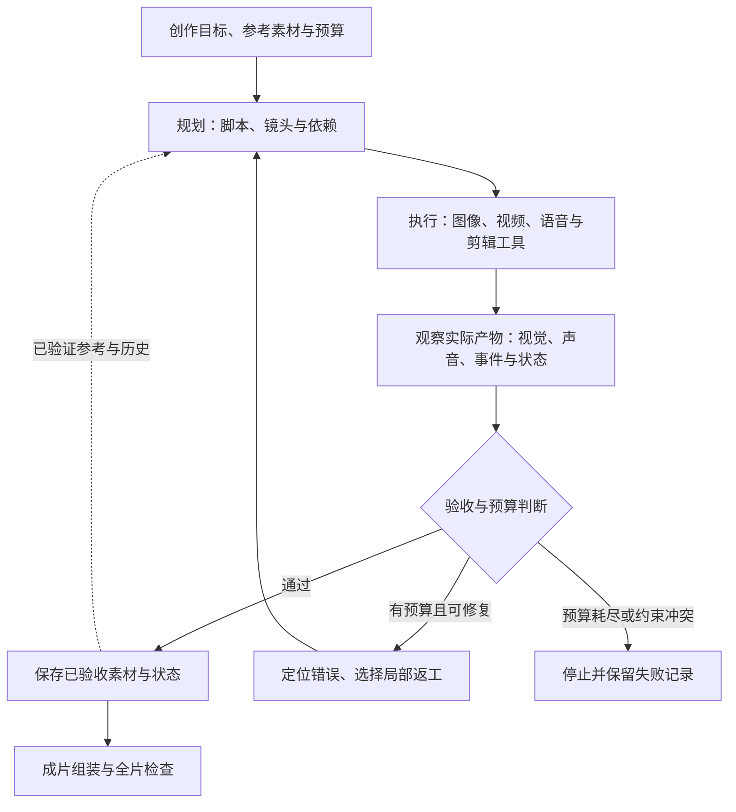

# Agentic Video Generation：从生成片段到规划、检查与返工

> **资料核验：2026-09-20。** 本章聚焦智能体对视频制作过程的规划与控制，收录有论文或作者项目来源的代表方法，不声称穷尽最新工作。论文效果均为作者报告；本次没有运行生成实验。检索、版本与证据边界见[调研记录](../sources/research_20260920_agentic_video_generation.md)。

**核心一句话：Agentic Video Generation 把视频生成器作为工具，由智能体把创作目标拆成可执行计划，并根据实际产物选择、修改或重新生成，直到满足要求或用完预算。**

例如，用户要一个“女孩找回遗失雨伞”的四镜头短片。系统需要决定哪些事件必须出现、每个镜头使用什么人物参考、何时调用图生视频、如何配音，以及发现第三个镜头中的伞变色后应该重做哪部分。生成器负责合成画面，智能体负责组织这些操作。增加多少个“导演”“编剧”角色不是判断能力的充分条件；关键在于它们能观察什么、改变什么，以及改变之后是否更接近原始目标。

## 1. 定义与范围：什么使一个流程具有 agentic 特征

本章采用一个工作定义：智能体维护任务状态，通过工具执行动作，并依据观察结果决定后续操作。它可以由单个控制器实现，也可以由多个分工角色协作实现。这是用于比较系统的分析框架，并非所有论文共享的正式标准。

| 系统形态 | 下一步如何决定 | 适合回答的问题 |
|---|---|---|
| 单次生成 | 输入提示词后直接输出 | 基础生成器能否完成这个请求？ |
| 固定制作流水线 | 按预写顺序执行脚本、关键帧、视频和拼接 | 自动化能减少多少操作？ |
| 规划型智能体 | 根据任务动态制定镜头计划、选择工具或参考 | 能否把开放意图转成可执行制作方案？ |
| 反馈型智能体 | 根据实际候选的检查结果调整提示、工具或计划 | 能否发现错误并有效返工？ |
| 持续学习系统 | 从多次任务或环境反馈中更新共享模型或策略 | 经验能否迁移到未见任务？ |

这些形态可以混合。规划型系统不一定有视觉反馈；多角色讨论脚本不等于检查过生成视频；同一个请求内重写提示词也不等于训练了一个更好的生成器。

### 1.1 与已有章节的分工

| 相邻方向 | 主要研究对象 | 与本章的关系 |
|---|---|---|
| [故事与多镜头](tasks/story-multishot.md) | 切镜、人物一致、叙事状态 | 规定输出应满足什么；agent 是实现方案之一 |
| [长视频生成](generative-models/long-video-generation.md) | 时间跨度、长度外推与长期漂移 | 长度可以靠生成机制扩展，不必引入智能体 |
| [Test-Time Scaling](generative-models/test-time-scaling.md) | 质量随推理预算如何变化 | 智能体可分配预算；是否具有 scaling 效果仍需曲线证明 |
| [视频后训练与对齐](generative-models/video-post-training-alignment.md) | 参数如何从反馈中学习 | 生成后点评、重试本身通常没有更新基础权重 |
| [Video Reasoning](video-reasoning.md) | 视频如何服务理解或推理 | 看懂候选是制作系统的工具能力，不等于交付视频 |
| [World Action Model](world-action-model.md) | 预测如何转为行动并接受环境反馈 | 本章中的“动作”多为工具调用；机器人动作属于另一种验收目标 |

尤其要区分同名工作：Soni 等人的 **VideoAgent: Self-Improving Video Generation** 面向视频计划与具身控制 [[1]](#ref-1)；Liang 等人的 **VideoAgent: Personalized Synthesis of Scientific Videos** 面向科学讲解视频 [[5]](#ref-5)。只写“VideoAgent”会混淆任务、输入和成功标准。

## 2. 一个系统需要维护什么

下面是综合多类方法得到的**参考架构**，不是某篇论文完整实现的复述。实际系统可以省略其中一些组件，但应说明省略后的能力边界。

**图 1：带反馈的视频制作流程。** 规划规定应发生什么，观察记录实际发生什么；两者不一致时，系统才有明确的修复目标。通过的镜头进入资产库，最终仍需检查全片叙事和声画同步。

### 2.1 计划、资产和记忆应当分开

| 状态对象 | 最少记录 | 为什么需要 |
|---|---|---|
| 创作要求 | 原始意图、必需事件、允许修改项、时长和风格 | 防止为了得高分而悄悄删掉困难动作 |
| 镜头计划 | 镜头编号、时长、人物、事件、景别、前后依赖 | 让任务可调度，也让漏拍可检测 |
| 资产库 | 角色/场景参考、音色、版本、使用镜头 | 复用正确素材，避免每个镜头重新发明人物 |
| 观察记录 | 实际视频中的事件、时间位置、置信度和证据帧 | 区分“提示词写了”与“视频确实出现了” |
| 叙事记忆 | 道具归属、衣着变化、已完成事件及有效区间 | 允许故事发展，而非要求所有外观永久不变 |
| 执行账本 | 工具版本、输入、随机种子、耗时、费用与失败 | 支持复现、预算约束与故障定位 |

例如“女孩在镜头 2 换了外套”是一项合法状态更新。若记忆只存最初角色图，后续系统可能把换装错误地修复回去。若直接把失败生成写入记忆，又可能把错误传播到其余镜头。一个可研究的设计是先检查状态变化，再决定是否写入；这项建议需要消融验证，不能仅凭流程图认定有效。

### 2.2 工具调用需要可检查的输入和输出

规划器不应只输出“把这里拍得更感人”，而应把意图转成可执行条件：使用哪些参考、生成多长、保留哪些对象、期望什么动作、接受什么切点。工具返回值也应包含实际文件、规格、完成状态和错误信息。

同一个“人物转身后拿起雨伞”的请求，既可以调用文生视频，也可以先生成关键帧再调用图生视频。工具路由的价值要通过相同候选工具集上的比较验证：如果 agent 组独占更强生成器，就无法把收益归因于路由策略。

## 3. 代表方法与发展脉络

下表按首次 arXiv 提交时间排列；不同任务与渲染后端不能直接合成总排行榜。项目链接用于定位作者实现，不代表已验证完整复现、模型权重或商用许可。

| 时间 / 工作 | 主要任务与做法 | 反馈或协调发生在哪里 | 证据边界 |
|---|---|---|---|
| 2024-10 · VideoAgent [[1]](#ref-1) | 生成用于具身控制的视频计划，以外部反馈改进计划 | 计划细化及执行后的环境数据 | 控制任务证据，不能直接替代影视质量评价 |
| 2024-12 · VideoGen-of-Thought [[2]](#ref-2) | 将故事拆成脚本、关键帧、逐镜头视频和衔接模块 | 分阶段条件传递与一致性维护 | 是模块化规划的重要参照，不能仅据分阶段结构认定具有完整闭环 |
| 2025-01 · FilmAgent [[3]](#ref-3) | 多角色协作，在虚拟 3D 空间安排剧本、演员与摄影 | 脚本与制作决策的反馈和修订 | 依赖可控制的虚拟环境，不是开放域视频扩散模型 |
| 2025-03 · MovieAgent [[4]](#ref-4) | 从剧本和角色库生成分层场景、镜头与摄影计划 | 导演、编剧、分镜等角色的层级规划 | 强调制作自动化；不宜推断具备任意像素级局部修复 |
| 2025-09 · Scientific VideoAgent [[5]](#ref-5) | 将论文素材组织成可个性化的科学讲解视频 | 叙事编排、幻灯片/动画与多模态同步 | 评价包含知识传播，不等价于电影叙事质量 |
| 2025-10 · VISTA [[6]](#ref-6) | 结构化计划、候选比较与提示词迭代 | 视觉、音频、上下文批评驱动提示重写 | 黑盒生成工具上的推理期系统；本章按预印本版本描述 |
| 2026-06 · ViMax [[7]](#ref-7) | 层级叙事、检索上下文与跨镜头视觉依赖 | VLM 候选评估及依赖图组织 | 本章核对 v2 方法；候选选择不等同于通用错误回滚 |

### 3.1 规划路线：先把创作意图变成制作结构

VideoGen-of-Thought 展示了脚本、关键帧与逐镜头生成之间的明确接口 [[2]](#ref-2)。MovieAgent 进一步以多角色和分层规划组织场景、相机与角色交互 [[4]](#ref-4)。这条路线最直接的价值是减少人手编写分镜和组织素材的工作。

但“计划合理”与“视频执行了计划”是两个问题。若生成器无法表现某个复杂交互，增加脚本细节未必有效；系统需要观察实际产物，判断应拆镜、换工具还是返工。评测应分别报告计划覆盖率和视频事件覆盖率。

### 3.2 可控渲染路线：智能体可以调度 3D 场景

FilmAgent 把演员位置、动作、台词和摄影决策放到虚拟 3D 制作流程中 [[3]](#ref-3)。这种环境能提供比自然语言提示更明确的控制接口，但输出范围受场景与动作资产约束。它适合研究制作决策与角色协作，不能把其可控性直接视为自然视频生成器已经解决了运动或身份漂移。

### 3.3 黑盒改进路线：看完视频，再决定如何重试

VISTA 的关键是候选比较、分维度批评和提示重写形成迭代：先选择候选，再针对视觉、声音和上下文问题生成反馈，供下一轮使用 [[6]](#ref-6)。它改变的是请求级生成过程；提示变好并不意味着生成器参数已经学习。

这种方式也暴露出一个瓶颈：批评器可能准确地指出“动作没有完成”，却给不出生成器可执行的修复指令。应把错误识别率、建议可执行率和实际修复成功率分开测量。仅让评估器给下一轮更高分，不能证明视频改善。

### 3.4 长程协调路线：让计划与视觉参考具有依赖关系

ViMax v2 将层级故事拆分与检索上下文结合，并以图结构表达跨镜头视觉依赖；方法中的 VLM 质量控制明确包含 best-of-k 候选选择，另以过渡视频连接场景内视角 [[7]](#ref-7)。这些设计让长视频制作超出逐镜头独立调用。

阅读时应把摘要中的“持续改进”落实到具体操作：生成多个候选并选择、重写条件重新生成、撤销既有资产并重建依赖项，是不同强度的机制。本章不把前者自动表述为后两者，也不把依赖图当作已证明的物理世界状态。

### 3.5 任务专用路线：科学视频要检查知识是否传达

Scientific VideoAgent 从论文中构建素材库，并根据需求编排静态页面与动态动画；其 SciVidEval 包含同步与内容评价，以及基于 Video-Quiz 的知识传播评估 [[5]](#ref-5)。这提示系统应按任务设计验收：科学讲解需要事实和学习效果，广告需要指定信息覆盖，电影需要人物、事件与节奏。通用美学分数无法代替这些目标。

## 4. 最难的部分：诊断、返工与停止

### 4.1 错误发生在哪一层，决定修哪里

| 可见错误 | 首先检查 | 合理的修复动作 | 常见无效做法 |
|---|---|---|---|
| 必须发生的事件没有出现 | 脚本是否漏写，还是视频未执行 | 补计划、拆镜或重生对应片段 | 无差别扩写所有提示词 |
| 某人物身份改变 | 参考绑定、参考版本与实际画面 | 修正绑定并重做受影响镜头 | 只增加“保持一致”几个字 |
| 物品归属或状态反转 | 当前记忆和依赖关系 | 修复源镜头，检查依赖它的后续片段 | 只修最后一个出现错误的镜头 |
| 台词正确但声画错位 | 音频时长、镜头边界、口型条件 | 调整时间轴或重做声画同步 | 重新生成整部影片 |
| 评估器反复要求相反修改 | 目标冲突、采样盲区、判断稳定性 | 保留较好候选，停止无效循环 | 持续提高重试上限 |

表中的诊断与动作是工程分析建议，需在具体生成工具上检验。并不是所有接口都支持局部视频编辑；若只能整段重生，必须把修复范围和附带变化记录下来。

### 4.2 局部返工需要知道哪些结果依赖它

如果镜头 4 用镜头 3 的末帧作为参考，修改镜头 3 之后应重新检查镜头 4；而独立生成的旁白未必需要重做。可将资产关系记录为有向依赖图，区分“必须重算”和“只需重新验收”。

一个值得检验的策略是：优先选择预计修复收益较高、成本较低、影响范围较小的动作；收益不确定时保留旧候选和可恢复版本。它是本章提出的实验设计思路，并非上述方法均已实现的特性。

### 4.3 停止规则也是系统能力

至少明确三种终止状态：达到验收条件；预算耗尽但保留最佳可用候选；约束不可同时满足而停止。不能把第三种情况包装成成功，也不能用重新改写用户目标来消除失败。

对连续多轮无改善、批评意见来回翻转或工具持续失败的情况，应记录原因并结束当前修复分支。研究时还需报告失败请求，不能只统计成功完成的影片。

## 5. 如何评测：证明收益来自智能体

### 5.1 比较时固定什么

最基本的公平比较要求使用相同生成器、参考素材、输出规格和可调用工具。再分别比较固定预算下的质量，以及达到同一验收水平所需的成本。预算至少包含生成调用、VLM 检查、LLM token、失败重试、剪辑与音频处理；同时报告端到端时延和人工干预时间。

| 对照组 | 用来排除的替代解释 |
|---|---|
| 单次调用 | 系统相对基础工具增加了什么 |
| 固定流水线 | 提升是否仅来自分镜、参考与剪辑这些常规步骤 |
| Best-of-N + 相同选择器 | 是否只是多生成几次就能得到同等收益 |
| 单智能体 + 相同工具 | 多角色协作本身是否必要 |
| 去掉反馈 / 记忆 / 依赖管理 | 哪个组件对哪类错误起作用 |
| 有经验的人类使用相同工具 | 自动化节省多少劳动，牺牲了什么控制能力 |

### 5.2 指标要覆盖制作过程与最终成片

- **需求满足**：必需事件、角色、时长和风格的完成比例；硬性要求单独记录。
- **跨镜头连续性**：身份、道具归属、事实状态与事件顺序；同时检查是否靠复制构图获得一致性。
- **视听质量**：运动、画质、台词、声音和同步；指标细分见[评测指南](evaluation.md)。
- **修复能力**：错误定位准确率、一次修复成功率、误修率、修复后的其他要求退化率。
- **效率与可靠性**：总成本、P50/P95 时延、完成率、返工范围、预算超限率、人工修改时间。

内部 critic 可以引导搜索，但最终评价应使用独立检查与盲评。对于人物交互、快速动作和声音事件，只看少数关键帧容易漏检；应保存检查使用的帧和时间区间，让评价过程可追溯。

## 6. 一个可证伪的最小研究方案

**研究问题：在固定总成本下，根据实际视频进行错误定位和局部返工，是否比固定流水线与 Best-of-N 更可靠？** 以下为建议实验，尚未运行。

准备 24 个原创四镜头任务，分别覆盖人物身份、道具转移、动作先后与声画同步，每类 6 个。为每个任务预先写明必需事件、参考素材和失败条件。开发集用于调试提示与阈值，测试集保持独立；使用多个随机种子，记录模型和 API 版本。

比较三组系统：固定计划流水线、相同工具下的 Best-of-N、带反馈和局部返工的智能体。设置至少三个总成本预算点，并增加相同调用次数的辅助比较。每个系统都接受一次中途修改，例如“镜头 2 开始雨伞换成红色，之前仍为蓝色”，测试合法状态更新与受影响镜头重验收。

预注册成功条件：智能体在未见任务上提高独立评价的需求满足率，同时保持画质在预设非劣范围内；中途修改后，未受影响镜头的额外变化更少。报告逐任务结果、失败案例及按任务重采样的置信区间。如果收益只体现在内部 critic 分数，或完全被更多调用解释，就不能支持核心假设。

可进一步研究三个问题：何时反馈值得额外成本；怎样把“视频哪里错了”转成可执行修复；怎样维护随剧情更新、且不吸收生成错误的记忆。它们分别对应预算决策、错误归因和长期状态管理，比单纯增加智能体角色数量更容易形成可检验的贡献。

## 7. 阅读建议与结论

初次阅读可从 VideoGen-of-Thought 和 MovieAgent 理解规划与制作接口，再用 FilmAgent 对照可控 3D 后端，用 VISTA 理解反馈闭环，最后阅读 ViMax 的长程依赖设计。关注科学传播或具身控制时，再分别转向两个任务不同的 VideoAgent。

Agentic Video Generation 的主要价值在于把已有生成能力组织成可检查的制作过程。它能改善任务分解、素材复用和错误处理，但不能保证底层模型完成任意动作，也不能凭多角色对话证明系统更可靠。最终证据应是：在相同工具和预算约束下，交付视频更符合要求，错误更容易修复，人工劳动和无效计算更少。

## 参考文献

[1] [VideoAgent: Self-Improving Video Generation](https://arxiv.org/abs/2410.10076). Achint Soni et al. arXiv, 2024（本章核对 v3，2025-02）；[作者项目](https://video-as-agent.github.io/)。

[2] [VideoGen-of-Thought: Step-by-step generating multi-shot video with minimal manual intervention](https://arxiv.org/abs/2412.02259). Mingzhe Zheng et al. arXiv, 2024（采用当前摘要页标题；早期版本标题不同）。

[3] [FilmAgent: A Multi-Agent Framework for End-to-End Film Automation in Virtual 3D Spaces](https://arxiv.org/abs/2501.12909). Zhenran Xu et al. arXiv, 2025；[作者项目](https://filmagent.github.io/) · [作者仓库](https://github.com/UnitSeeker/FilmAgent)。

[4] [Automated Movie Generation via Multi-Agent CoT Planning](https://arxiv.org/abs/2503.07314). Weijia Wu, Zeyu Zhu, Mike Zheng Shou. arXiv, 2025；[作者项目](https://weijiawu.github.io/MovieAgent/) · [作者仓库](https://github.com/showlab/MovieAgent)。

[5] [VideoAgent: Personalized Synthesis of Scientific Videos](https://arxiv.org/abs/2509.11253). Xiao Liang et al. arXiv, 2025。

[6] [VISTA: A Test-Time Self-Improving Video Generation Agent](https://arxiv.org/abs/2510.15831). Do Xuan Long et al. arXiv, 2025；[Google Research 页面](https://research.google/pubs/vista-towards-test-time-self-improving-video-generation-agent/) 另列 CVPR 2026。本章不混用两处页面的结果数字。

[7] [ViMax: Agentic Video Generation](https://arxiv.org/abs/2606.07649). Lingxuan Huang et al. arXiv, 2026；[v2 方法全文](https://arxiv.org/html/2606.07649v2) · [论文链接的作者仓库](https://github.com/HKUDS/ViMax)。
