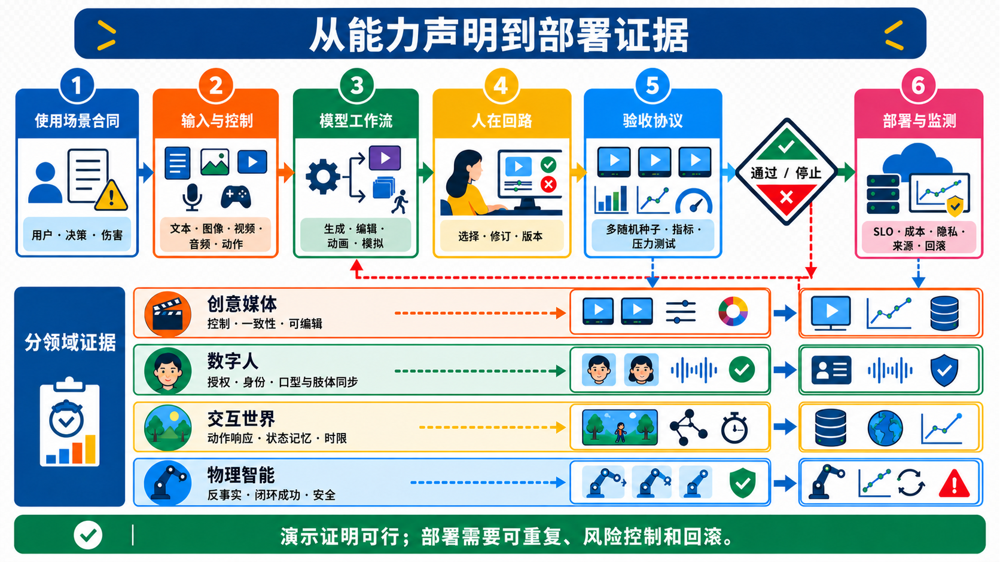
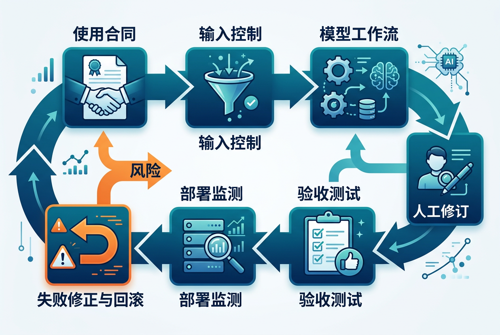
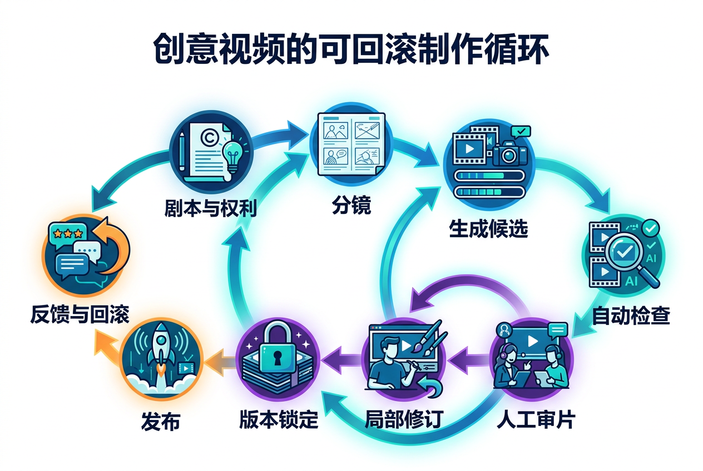

# 视频生成应用：从能力主张到可部署证据

> 一手来源复核截至 **2026-08-30**。本章不按公司或产品排名，而是把能力映射为系统需求、验收协议、风险门槛和回滚条件。检索与图像生成记录见[研究日志](../sources/research_20260830_task_application_taxonomy.md)。

一段演示视频只能证明“某次生成可能成功”。一个真实应用还必须证明：目标用户能稳定控制结果、错误可发现、成本和延迟可承受、素材权利可追溯、失败时能够停止或回滚。

因此，本章采用下面的链条：

```math
\text{use-case contract}
\rightarrow
\text{capability workflow}
\rightarrow
\text{acceptance protocol}
\rightarrow
\text{deployment gate}
\rightarrow
\text{monitoring and rollback}.
```

本章关注系统落地；若要追踪能力来自哪里，行为偏好与奖励优化见[视频后训练与对齐](generative-models/video-post-training-alignment.md)，相机、对象轨迹、姿态与几何条件见[细粒度可控生成](tasks/controllable-video-generation.md)，声画在生成过程中的耦合与同步见[原生音视频生成](tasks/native-audio-video-generation.md)。三者都必须按照本章的任务要求和部署门槛分别验收。

## 1. 一张图看懂“模型能力”为什么还不是“应用”



**图 1：部署是带硬门槛的证据链。** 四条领域证据并不是四个排行榜，而是说明同一个生成模型进入不同场景时，必须换一套成功标准。创作关心可控、连续与可改；数字人增加同意、身份与音画同步；交互世界要求动作响应、状态记忆和 deadline；Physical AI 最终要看反事实、闭环成功和安全。图中没有性能数字，避免把示意值误读成 benchmark 结果。


顺序化文字替代：先写用户、决策和伤害，再写允许使用的文字、图像、视频、音频或动作条件；把基础模型与编辑、音频、安全和版本工具组装成工作流；人工选择和修订后，以多个随机种子、分项指标和压力测试验收。任何硬门槛失败都停止上线。通过后仍需监测服务等级、成本、隐私、来源、事故和分布漂移，并保留回滚入口。

## 2. 五种证据对象不能混用

| 对象 | 它能证明什么 | 它不能自动证明什么 |
|---|---|---|
| 论文 | 作者在特定数据、模型和协议下的方法与结果 | 当前产品仍可用、开放权重可复现、真实用户稳定成功 |
| checkpoint | 固定参数在已知推理代码和硬件下的能力 | 训练数据权利、完整产品后处理、线上服务 SLO |
| API / 产品 | 当前入口暴露的规格和使用政策 | 论文机制就是产品机制、能力来自单一 checkpoint |
| 工作流 | 模型、提示、参考、编辑、审核和版本如何组合 | 在真实负载与风险条件下已经可靠 |
| 部署 | 真实流量下的质量、延迟、成本与事故记录 | 对新分布永久有效或没有长期风险 |

“论文展示了 720p”“官方页面写实时”“仓库开放了代码”分别是不同证据。Genie 3 官方页面把 720p、20–24 FPS 和持续交互列为产品/机构能力主张；在没有公开论文、checkpoint 与独立 SLO 复现时，应保留这一证据边界 [[4]](#ref-4)。

## 3. 先写使用合同，而不是先挑模型

一个最小应用合同至少包含：

| 字段 | 必答问题 | 例子 |
|---|---|---|
| 用户 | 谁创建、谁审核、谁观看或据此行动？ | 剪辑师、教师、驾驶规划器 |
| 决策 | 输出只是灵感，还是会触发真实动作？ | 分镜候选 vs 机器人抓取 |
| 输入权利 | 文字、肖像、声音、源视频和训练素材是否可用？ | 演员授权、企业素材、敏感场景 |
| 任务要求 | 哪些属性必须改变，哪些必须保持？ | 换背景但保留人物与镜头 |
| 时域 | 一次性短片、跨镜头记忆还是闭环？ | 5 秒广告、连续角色剧集、24 FPS 世界 |
| 风险预算 | 哪类错误可修，哪类错误必须阻断？ | logo 轻微变形可返工；身份冒用必须阻断 |
| 退出与回滚 | 如何撤回版本、停用素材或恢复旧模型？ | 资产 hash、模型版本、审批日志 |

NIST AI 600-1 把生成式 AI 风险管理组织为面向生命周期的 govern、map、measure 与 manage；它提供跨行业风险框架，不替代本应用的具体任务指标 [[10]](#ref-10)。

<a id="application-capability-matrix"></a>

## 4. 场景 → 能力链 → 验收门槛

“需验收的 C1–C9 能力族”均反链[能力地图](foundation-model-capabilities.md#capability-cross-table-index)；任务接口、超分、renderer 与低延迟等系统组件另列，避免把“模型会什么”和“系统怎样交付”混为一类。[C8](foundation-model-capabilities.md#capability-c8) / [C9](foundation-model-capabilities.md#capability-c9) 若由外部规划器、控制器或闭环环境提供，还必须按模块归因，不能直接记在 base checkpoint 名下。

| 场景 | 需验收的 C1–C9 能力族 | 任务 / 系统组件 | 系统级验收 | 硬失败 / 安全门 |
|---|---|---|---|---|
| 影视、广告与动态分镜 | [C1](foundation-model-capabilities.md#capability-c1) · [C2](foundation-model-capabilities.md#capability-c2) · [C3](foundation-model-capabilities.md#capability-c3) · [C4](foundation-model-capabilities.md#capability-c4) · [C5](foundation-model-capabilities.md#capability-c5) · [C6](foundation-model-capabilities.md#capability-c6) · [C7](foundation-model-capabilities.md#capability-c7) | T2V / I2V、相机控制、角色参考、多镜头、局部编辑、超分与音频 | 指令遵循、角色/道具连续、镜头可改率、人工分钟/成片秒、版本可重放 | 未授权素材、品牌/人物误用、无法定位生成来源 |
| 虚拟制作、AR/VR 与动态资产 | [C1](foundation-model-capabilities.md#capability-c1) · [C3](foundation-model-capabilities.md#capability-c3) · [C4](foundation-model-capabilities.md#capability-c4) · [C5](foundation-model-capabilities.md#capability-c5) · [C7](foundation-model-capabilities.md#capability-c7) | 多视角视频、4D 重建/生成、相机—时间查询、显式动态状态与实时 renderer | 同刻跨视角、重投影、遮挡、loop closure、未见区域不确定性、构建/查询成本 | 一条相机路径冒充 4D；生成背面冒充真实重建；渲染 FPS 冒充构建实时 |
| 后期、修复与本地化 | [C1](foundation-model-capabilities.md#capability-c1) · [C2](foundation-model-capabilities.md#capability-c2) · [C3](foundation-model-capabilities.md#capability-c3) · [C5](foundation-model-capabilities.md#capability-c5) · [C6](foundation-model-capabilities.md#capability-c6) | V2V、退化修复、inpainting、插帧、重定时、口型/语音、本地字幕 | 观测保真、时间闪烁、生成幻觉、mask 外误差、边界 seam、口型偏移、文字正确率、往返编辑损失 | 未编辑区域被改、生成细节冒充真实证据、来源链丢失 |
| 数字人和虚拟主播 | [C1](foundation-model-capabilities.md#capability-c1) · [C2](foundation-model-capabilities.md#capability-c2) · [C3](foundation-model-capabilities.md#capability-c3) · [C5](foundation-model-capabilities.md#capability-c5) · [C6](foundation-model-capabilities.md#capability-c6) · [C7](foundation-model-capabilities.md#capability-c7) | 身份参考、音频/文字/动作驱动、长时/流式人体动画 | 身份、口型、表情、身体、语义和延迟分项；多人和遮挡压力测试 | 无同意身份、冒用、声音克隆、未成年人或敏感人物风险 |
| 游戏原型与交互世界 | [C1](foundation-model-capabilities.md#capability-c1) · [C3](foundation-model-capabilities.md#capability-c3) · [C4](foundation-model-capabilities.md#capability-c4) · [C7](foundation-model-capabilities.md#capability-c7) · [C8](foundation-model-capabilities.md#capability-c8) · [C9](foundation-model-capabilities.md#capability-c9) | 场景生成、动作条件 rollout、状态记忆、规划器与低延迟输出 | 动作响应、回访一致、状态账本、deadline miss、任务完成 | 动作无效却画面逼真、平均 FPS 掩盖尾延迟、状态不可恢复 |
| 机器人与自动驾驶 | [C3](foundation-model-capabilities.md#capability-c3) · [C4](foundation-model-capabilities.md#capability-c4) · [C7](foundation-model-capabilities.md#capability-c7) · [C8](foundation-model-capabilities.md#capability-c8) · [C9](foundation-model-capabilities.md#capability-c9) | 视频世界模型、反事实 rollout、规划/策略、传感器或多视角条件 | 状态/动作正确性、闭环成功、真实迁移、罕见事件覆盖、安全边界 | 用感知质量替代决策效用；模拟器漏洞被策略利用 |
| 合成数据与仿真 | [C1](foundation-model-capabilities.md#capability-c1) · [C2](foundation-model-capabilities.md#capability-c2) · [C5](foundation-model-capabilities.md#capability-c5) · [C7](foundation-model-capabilities.md#capability-c7) | 条件采样、长尾场景、标签/伪动作恢复、域随机化；只有显式推理或动作闭环才追加 [C8](foundation-model-capabilities.md#capability-c8) / [C9](foundation-model-capabilities.md#capability-c9) | 下游收益、覆盖、校准、真实验证集表现、数据谱系 | synthetic bias、标签错误、训练测试污染、只报生成分数 |
| 教育与科学可视化 | [C1](foundation-model-capabilities.md#capability-c1) · [C2](foundation-model-capabilities.md#capability-c2) · [C3](foundation-model-capabilities.md#capability-c3) · [C5](foundation-model-capabilities.md#capability-c5) · [C7](foundation-model-capabilities.md#capability-c7) · [C8](foundation-model-capabilities.md#capability-c8) | 过程生成、结构/公式约束、交互解释、来源链接 | 事实逐项核验、单位/边界条件、专家复核、可访问性 | 视觉可信但科学错误、无来源的“实验结果” |
| 工业设计与流程预演 | [C1](foundation-model-capabilities.md#capability-c1) · [C3](foundation-model-capabilities.md#capability-c3) · [C4](foundation-model-capabilities.md#capability-c4) · [C5](foundation-model-capabilities.md#capability-c5) · [C7](foundation-model-capabilities.md#capability-c7) | 参考保持、几何/相机控制、多版本比较、数字孪生接口；只有动作闭环才追加 [C9](foundation-model-capabilities.md#capability-c9) | 尺寸/状态约束、变更追踪、与 CAD/模拟器一致性 | 把概念视频当工程验证或合规证据 |

统一模型可以降低部署与交互成本，但不能用“all-in-one”替代分任务验收。VACE 通过 Video Condition Unit 组织 reference、editing 和 mask 条件，并在 12 类任务上做作者实验；部署时仍须分别测试参考保持、编辑泄漏和 mask 外保护 [[1]](#ref-1)。

“修复”还必须拆成两个不同合同：若每帧仍有全帧观测、目标是逆转 blur、downsample、noise 或 compression，进入[视频退化修复](tasks/video-restoration.md)，分别检查 fidelity、时间稳定、感知细节与生成幻觉；若未知支持由时空 mask 指定，进入[视频补全](tasks/video-inpainting.md)，把 mask 外像素保护设为硬门槛。锐利的生成细节不能自动作为档案、新闻、医疗或取证中的真实证据。

空间内容还要区分普通 camera-controlled video、多视角视频与可渲染 4D state：它们分别覆盖一条 camera-time 路径、一个视角—时间网格和可重复查询的动态状态。对应的几何与系统验收见[多视角与 4D 生成](tasks/multiview-4d-generation.md)。

## 5. 四类高影响应用的证据边界

### 5.1 创意媒体：价值来自“可改”，不只来自“可生成”

专业制作的核心循环是：


最低报告项：

- 每个 shot 生成多少候选、采用率和返工次数；
- 角色、服装、道具、地点、镜头和对白分别是否保持；
- 局部修改是否污染非目标区域；
- 人工时间、GPU 时间、端到端成本与最终交付时长；
- prompt、seed、checkpoint、参考资产和后处理版本能否重放。

只报“生成一次用了几秒”会漏掉筛选和返工成本。偏好模型也不是最终真值：MJ-Video 把 alignment、safety、fineness、coherence/consistency 和 bias/fairness 分成细项，说明“总体偏好”内部有不同失败来源；其数据与模型结论仍受作者协议限制 [[12]](#ref-12)。

### 5.2 数字人：身份和同意是系统变量

数字人不是普通 I2V 多一个音频输入。应用需要同时验证：

1. **身份**：面部、发型、服装、身体和个体特征跨姿态、遮挡与时长保持；
2. **同步**：口型、表情、头部、上身/全身与音频节奏和语义一致；
3. **语义表演**：情绪、意图、对象交互和多人轮次符合文字/音频；
4. **系统时延**：离线成片与实时对话采用不同窗口、缓冲和 deadline；
5. **治理**：身份、声音与素材的同意、用途范围、到期、撤回和可追溯记录。

OmniHuman-1.5 用结构化语义条件和 Multimodal DiT 推进“语义表演”，但它是 2025 作者预印本；不能据此跳过长期身份、多人串扰、同意和独立复现 [[2]](#ref-2)。

数字人验收必须用真实业务分布分层：近景/半身/全身、静态/剧烈运动、单人/多人、普通话/方言/跨语言、短句/长段、遮挡/出画再入画。任何平均同步分都不能抵消未经授权的身份生成。

### 5.3 交互世界：平均 FPS 不是交互性

交互系统第 $k$ 轮接收动作 $a_k$ 与当前状态/观测 $s_k,o_k$，在 deadline $d$ 内返回：

```math
(\hat{o}_{k+1},\hat{s}_{k+1})
\sim
p_\theta(\cdot\mid o_{\le k},a_{\le k},m_k).
```

其中 $m_k$ 是压缩记忆。验收至少拆成：

- **动作因果**：固定历史，改动作是否只产生预期差异；
- **状态保持**：对象、拓扑、库存、开关和已发生事件能否回访；
- **时延分布**：TTFF、每步 p50/p95/p99、deadline miss 与抖动；
- **长期退化**：画质、动作响应和状态错误随 rollout 长度的曲线；
- **错误恢复**：无效动作、快速反向、断连、重连和 checkpoint 恢复。

Genie 在 ICML 2024 通过无标签互联网视频学习 latent action space，是任务路线里程碑 [[3]](#ref-3)。UniSim 则把 action-in/video-out 作为统一交互接口，并明确其“universal”指接口范围而不是模拟所有感官和现象 [[5]](#ref-5)。当前产品/机构页面的 Genie 3 规格应作为官方声明单列，不与这两篇论文的实验合并 [[4]](#ref-4)。

### 5.4 Physical AI：视频逼真不等于决策正确

机器人或驾驶中的典型链路是：

```math
\text{observation}
\rightarrow
\text{candidate actions}
\rightarrow
\text{predicted futures}
\rightarrow
\text{cost / verifier}
\rightarrow
\text{action}
\rightarrow
\text{new observation}.
```

每一箭头都会引入误差。漂亮视频可能遗漏碰撞、小物体、接触、交通参与者意图或机器人坐标；策略还可能主动利用模型的系统性错误。因此验收层级必须从 open-loop 画面、状态与动作一致、反事实正确，推进到 closed-loop 任务、真实转移和安全边界。

DreamGen 把适配后的 I2V 世界模型、latent action / inverse dynamics 和 policy training 串联，并报告 DreamGen Bench 与下游策略的相关性；这比只比较视频分数更接近应用证据，但收益仍是作者在特定机器人、数据和任务设置下的结果 [[6]](#ref-6)。Cosmos 平台把数据管线、tokenizer、预训练 world foundation model 与下游 post-training 组织成 Physical AI 平台 [[7]](#ref-7)；Cosmos 3 又把语言、图像、视频、音频和动作合并到 omnimodal 技术报告中 [[8]](#ref-8)。两者都不能替代真实设备的独立闭环安全测试。

### 5.5 合成数据：生成指标不是最终指标

合成数据应报告四层结果：

1. 生成数据的条件覆盖、标签/伪动作正确性和去重；
2. 真实—合成分布差异与已知盲区；
3. 固定训练预算下的下游提升，而非只增加总数据量；
4. 独立真实验证集、真实设备或真实用户上的收益和失败。

若只在合成验证集上提升，可能只是同时拟合了生成器偏差。若伪动作来自 inverse dynamics，还要把视频误差与动作恢复误差分别做消融。

### 5.6 教育、科学与工业可视化：事实优先于观感

这些应用应把生成图像视为**待核验的表达层**：

- 数值、单位、边界条件和因果方向逐项回到来源；
- 生成模型不得补造实验数据、测量曲线或设备结构；
- 说明哪些画面是示意、模拟、重建或真实观测；
- 让领域专家审阅高影响结论，并保留可访问文字替代；
- 概念视频不得冒充工程验证、临床证据或合规证明。

## 6. 验收不是一个加权总分

对应用 $u$，把门槛写成布尔合取而不是平均：

```math
\mathrm{PASS}(u)
=
G_q \land G_c \land G_p \land G_{\text{SLO}}
\land G_s \land G_g,
```

其中 $G_q$ 是质量，$G_c$ 是控制，$G_p$ 是保留/状态，$G_{\text{SLO}}$ 是系统服务等级，$G_s$ 是安全，$G_g$ 是权利与治理。某一项特别高不能抵消另一项硬失败。

### 6.1 统计与样本协议

- 预注册 prompt / 素材集、难度分层、seed 数和停止规则；
- 报告均值、分位数、置信区间、失败率和最坏类别；
- 配对比较固定 prompt、seed、时长、分辨率、后处理和硬件；
- 人评公开指令、随机化、盲法、人数、重复样本和一致性；
- 模型裁判先用人工集校准，并报告题型/群体偏差；
- 失败案例进入 taxonomy，不从结果集中删除。

ITU-T P.910 (07/2026) 是当前有效的多媒体主观视频质量评测建议，可支持观看条件和主观试验设计；它并不覆盖所有生成任务的指令、身份、动作和闭环协议 [[11]](#ref-11)。

### 6.2 服务等级与成本

离线创作至少报告每个**被采用输出**的成本，而不是单次推理成本：

```math
C_{\text{accepted}}
=
\frac{C_{\text{generation}}+C_{\text{selection}}+C_{\text{editing}}+C_{\text{review}}}
{N_{\text{accepted}}}.
```

流式/交互系统至少报告：

- time to first frame / first usable chunk；
- steady-state p50/p95/p99 latency 与 jitter；
- deadline miss、断流和恢复时间；
- 编码、模型、解码、安全检查和网络的分项时延；
- 并发量、硬件、精度、缓存、分辨率和帧率。

## 7. 来源、权利与安全必须贯穿工作流

C2PA 2.4 提供可加密验证的来源与编辑历史结构，适合记录创作、修改和发布链；规范本身明确不对内容“好或坏、真或假”作价值判断，只验证声明与资产的关联、格式和防篡改属性 [[9]](#ref-9)。因此：

- Content Credentials 不能替代事实核查；
- 水印不能替代同意与授权；
- provenance 缺失不能自动证明内容为假；
- provenance 存在也不能证明生成内容符合物理事实；
- 裁切、转码、平台重封装和截图后的凭证存活率必须实测。

建议资产账本记录：来源 URI / hash、权利主体、允许用途、地域与期限、同意与撤回、模型/数据版本、编辑动作、审核者和发布去向。高风险人物内容还要有阻断、申诉和快速撤回流程。

## 8. 2024–2026 的应用路线变化

| 方向 | 代表进展 | 应用意义 | 证据边界 |
|---|---|---|---|
| 统一创作与编辑 | VACE，ICCV 2025 [[1]](#ref-1) | reference、editing、mask 进入统一条件接口，可组合工作流 | 论文 12 任务实验不等于所有产品条件都同样可靠 |
| 语义数字人 | OmniHuman-1.5，2025 预印本 [[2]](#ref-2) | 从音频节奏扩展到图像、音频、文字的语义表演 | 作者技术报告；治理与长期部署需另证 |
| 生成式交互环境 | Genie，ICML 2024；Genie 3 官方页面 [[3]](#ref-3) [[4]](#ref-4) | latent action 学习和实时交互把 open-loop clip 推向 closed-loop | 论文与产品声明必须分开；当前页面规格非独立复现 |
| 统一 action-in/video-out 模拟 | UniSim，ICLR 2024 [[5]](#ref-5) | 多数据域可通过统一接口支持规划器、代理与 VLM 训练 | “universal”有限定，不包含所有模态或现实规律 |
| 神经轨迹训练机器人 | DreamGen，2025 预印本 [[6]](#ref-6) | 生成视频经伪动作恢复进入 policy training | 级联误差与真实迁移仍需逐层审计 |
| Physical AI 平台 | Cosmos 2025；Cosmos 3 2026 [[7]](#ref-7) [[8]](#ref-8) | 数据、tokenizer、world model、post-training 与 action 逐步合并 | 机构技术报告与开放发布面，不等于通用闭环成功 |
| 风险与来源基础设施 | NIST AI 600-1；C2PA 2.4 [[10]](#ref-10) [[9]](#ref-9) | 风险管理和媒体来源进入系统设计，不再是发布后补丁 | 通用框架仍需转译为场景硬门槛 |

## 9. 可直接复制的应用验收卡

~~~text
Use case:
Primary user / affected user:
Decision or action triggered by output:

Inputs and rights:
Required changes:
Must-preserve invariants:
Output duration / fps / resolution:
Open-loop, long-memory or closed-loop:

Quality metrics:
Control / counterfactual tests:
Preservation / outside-region tests:
Human evaluation protocol:
SLO and cost budget:
Safety and privacy hard gates:
Provenance and asset ledger:

Prompt / asset strata:
Number of seeds and repeats:
Confidence interval / failure rate:
Known unsupported cases:

Owner:
Monitoring signals:
Incident response:
Rollback target and recovery time:
~~~

填写后再进入[任务地图](taxonomy.md)选择专章；用[评测指南](evaluation.md)补全统计与证据等级；动作与现实决策场景继续阅读[World Model](world-models.md)和[物理一致性](physical-consistency.md)。

## 参考文献

<a id="ref-1"></a>[1] [VACE: All-in-One Video Creation and Editing](https://openaccess.thecvf.com/content/ICCV2025/html/Jiang_VACE_All-in-One_Video_Creation_and_Editing_ICCV_2025_paper.html). Zeyinzi Jiang, Zhen Han, Chaojie Mao, Jingfeng Zhang, Yulin Pan, Yu Liu. ICCV. 2025.

<a id="ref-2"></a>[2] [OmniHuman-1.5: Instilling an Active Mind in Avatars via Cognitive Simulation](https://arxiv.org/abs/2508.19209). Jianwen Jiang, Weihong Zeng, Zerong Zheng, Jiaqi Yang, Chao Liang, Wang Liao, et al. arXiv preprint. 2025.

<a id="ref-3"></a>[3] [Genie: Generative Interactive Environments](https://proceedings.mlr.press/v235/bruce24a.html). Jake Bruce, Michael D. Dennis, Ashley Edwards, Jack Parker-Holder, Yuge Shi, Edward Hughes, et al. ICML. 2024.

<a id="ref-4"></a>[4] [Genie 3](https://deepmind.google/models/genie/). Google DeepMind. Official system page. 2025–2026 snapshot.

<a id="ref-5"></a>[5] [Learning Interactive Real-World Simulators](https://openreview.net/forum?id=sFyTZEqmUY). Sherry Yang, Yilun Du, Kamyar Ghasemipour, Jonathan Tompson, Leslie Kaelbling, Dale Schuurmans, et al. ICLR. 2024.

<a id="ref-6"></a>[6] [DreamGen: Unlocking Generalization in Robot Learning through Video World Models](https://arxiv.org/abs/2505.12705). Joel Jang, Seonghyeon Ye, Zongyu Lin, Jiannan Xiang, Johan Bjorck, Yu Fang, et al. arXiv preprint. 2025.

<a id="ref-7"></a>[7] [Cosmos World Foundation Model Platform for Physical AI](https://arxiv.org/abs/2501.03575). NVIDIA et al. Technical report. 2025.

<a id="ref-8"></a>[8] [Cosmos 3: Omnimodal World Models for Physical AI](https://arxiv.org/abs/2606.02800). NVIDIA et al. Technical report. 2026.

<a id="ref-9"></a>[9] [C2PA Technical Specification, Version 2.4](https://spec.c2pa.org/specifications/specifications/2.4/specs/C2PA_Specification.html). Coalition for Content Provenance and Authenticity. 2026.

<a id="ref-10"></a>[10] [Artificial Intelligence Risk Management Framework: Generative Artificial Intelligence Profile](https://www.nist.gov/publications/artificial-intelligence-risk-management-framework-generative-artificial-intelligence). Chloe Autio, Reva Schwartz, Jesse Dunietz, Shomik Jain, Martin Stanley, Elham Tabassi, et al. NIST AI 600-1. 2024.

<a id="ref-11"></a>[11] [P.910: Subjective video quality assessment methods for multimedia applications](https://www.itu.int/rec/T-REC-P.910-202607-P/en). ITU-T Recommendation P.910 (07/2026). 2026.

<a id="ref-12"></a>[12] [MJ-Video: Benchmarking and Rewarding Video Generation with Fine-Grained Video Preference](https://proceedings.neurips.cc/paper_files/paper/2025/hash/71ad539a57b1fd49b19e5c80070cb8b9-Abstract-Conference.html). Haibo Tong, Zhaoyang Wang, Zhaorun Chen, Haonian Ji, Shi Qiu, Siwei Han, et al. NeurIPS. 2025.
