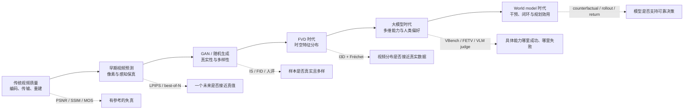

# 视频生成与世界模型评测：方法、历史与实践

> 本文讨论的是“视频生成模型”的 evaluation。检索与整理截至 **2026 年 8 月**。这里的 evaluation 既包括视频样本本身的质量，也包括条件遵循、分布覆盖、安全性，以及模型被称为 world model 时的动作响应、反事实预测和闭环决策价值。

视频生成没有一个类似分类准确率的充分统计量。原因不是指标设计得还不够巧，而是“好视频”同时涉及单帧外观、时间连续性、运动、语义、物理、叙事、多样性和使用风险；对同一个条件又常常存在许多同样合理的未来。一个样本可以逐帧清晰却完全不动，可以文本语义正确却违反重力，也可以作为短片很逼真却无法根据智能体动作预测下一状态。因此，可靠评测必须回答两个问题：**模型声称具有什么能力，以及当前证据真正验证了哪一层能力。**

本文的核心结论是：视频生成评测经历了从“对齐唯一参考答案”到“比较生成分布”，再到“分解开放世界能力”，最后到“验证干预和决策效用”的迁移。后一个阶段并没有淘汰前面的指标，而是把它们降为某些局部属性的诊断工具。

## 1. 一张图看懂评测范式的迁移



这条时间线也对应三种逐渐扩大的评测单位。最早的单位是一个预测帧与一个真实帧；随后变成一组生成视频与一组真实视频；大模型时代则以“prompt—多次采样—多维判断”为单位；world model 的最小评测单位最终变成“初始状态—动作序列—环境后果—策略收益”。

## 2. 为什么视频生成比图像生成更难评

### 2.1 未来本身是多模态的

给定“一个人走到路口”这一历史，左转、右转、停下都可能合理。若测试集只记录了左转，均方误差会把另外两个未来当作错误。更严重的是，最小化多个可能未来的平均像素误差会产生视觉上的“条件均值”，即模糊帧。Mathieu 等人的多尺度视频预测工作明确指出，均方误差不足以刻画清晰的未来，这推动了梯度差异、对抗损失和后来的随机视频预测 [[1]](#ref-1)。

### 2.2 视频同时包含空间、时间和因果结构

逐帧 FID 很好并不意味着视频很好：模型可以生成一组漂亮但顺序随机的帧。反过来，像素误差很大也不意味着动力学错误：相机轻微平移就能造成大面积像素差异。视频评测至少要区分外观质量、短时连续性、长期身份与状态、运动幅度与方向、条件遵循、物理和因果合理性。

### 2.3 生成模型既要质量，也要覆盖

只展示每个 prompt 的最佳样本衡量的是“搜索预算下的上限”，不是模型分布本身。只生成安全、静止、近景主体的视频往往能提高若干质量分，却牺牲运动、多样性和困难条件覆盖。因此，质量、覆盖率、拒绝率和计算预算必须一起报告。

### 2.4 开放世界没有单一参考视频

PSNR、SSIM、VMAF 等 full-reference 指标原本适合比较同一内容的原始视频与压缩、传输或重建版本。文本生成视频则没有逐像素配准的“标准答案”。把压缩质量指标直接用于开放式生成，会把创意差异误判为失真。它们仍适合插帧、超分、视频恢复、可控编辑和确定性较强的短期预测，但不是开放式 T2V 的总分。

### 2.5 评测器本身也可能不懂视频

CLIP 类模型善于识别主体和场景，却可能忽略数量、否定、左右关系、动作顺序和微小物理错误；视频多模态大模型可以给出解释，但会继承训练数据、帧采样和提示词的偏差。FETV 的实验发现 CLIPScore 和 FVD 与人工判断的相关性并不理想 [[14]](#ref-14)。因此，“用更大的模型当裁判”不是评测问题的终点，而是引入了一个需要独立校准的新测量仪器。

## 3. 第一阶段：从传统视频质量到早期视频预测（约 1990s—2016）

### 3.1 传统视频质量评估的遗产

早期视频质量研究主要服务于编码、传输和显示。其问题通常是：给定无失真的参考视频，编码后的视频损失了多少质量？工程上形成了三类方法。

| 类型 | 代表方法 | 需要参考视频 | 实际测量的对象 | 对生成模型的适用边界 |
|---|---|---:|---|---|
| Full-reference | MSE、PSNR、SSIM、MS-SSIM、VMAF | 是 | 相对于同一内容的像素、结构或感知失真 | 适合重建、超分、插帧；不适合开放式生成 |
| Reduced-reference | 部分统计或特征比较 | 部分 | 参考与输出之间的质量变化 | 适合带参考的传输与恢复任务 |
| No-reference | 传统伪影检测、后来的学习式 VQA | 否 | 模糊、噪声、压缩、抖动、美学等可见质量 | 可诊断技术质量，但不判断文本或物理 |
| 主观评测 | MOS、ACR、双刺激、成对比较 | 可选 | 人的总体或分项感知 | 最接近最终体验，但成本高且设计敏感 |

ITU-T P.910 至今仍给出多媒体视频主观质量实验的方法规范 [[2]](#ref-2)。SSIM 将评测从单纯误差转向局部亮度、对比度和结构相似性 [[3]](#ref-3)，VMAF 则通过融合多种特征来预测特定观看条件下的人类质量判断 [[4]](#ref-4)。这些工作给生成模型留下了两个重要遗产：第一，主观质量必须通过受控实验而不是随意观看来测量；第二，任何学习式质量指标都只在其训练失真类型和观看条件内可靠。

### 3.2 确定性视频预测：PSNR、SSIM 与“模糊的高分”

2014—2016 年前后的深度视频预测通常从若干上下文帧预测未来帧。常见数据集包括 Moving MNIST、KTH、UCF-101 和机器人交互视频，输出常以 MSE、PSNR、SSIM 以及人工视觉比较评价。对像素范围为 $[0,L]$ 的帧，PSNR 为：

$$
\mathrm{PSNR}=10\log_{10}\frac{L^2}{\mathrm{MSE}}.
$$

这类指标便于复现，也适合未来接近确定的场景；但它们把所有像素错位同等处理。轻微相机移动会导致低分，而一个把多种未来平均成模糊区域的模型反而可能获得较好的 MSE。2015 年以后，研究开始同时报告梯度差异、锐度和感知判断，并使用对抗损失减少模糊 [[1]](#ref-1)。

### 3.3 随机视频预测：best-of-N、覆盖与校准

当模型显式引入随机 latent 后，评价从“预测是否等于唯一真值”变成“预测分布是否覆盖合理未来”。常见做法是对同一上下文采样 $N$ 个未来，再报告最接近真值的样本：

$$
d_{\text{best-of-}N}=\min_{i\in\{1,\dots,N\}}d(\hat{x}^{(i)}_{1:T},x_{1:T}).
$$

它能检验模型是否有机会覆盖真实未来，但分数会随 $N$ 单调改善，且可能奖励“撒网式”生成。如果不同时报告样本预算、平均质量、样本间多样性和异常样本率，就无法公平比较。Stochastic Video Generation with a Learned Prior 等工作使“质量—多样性”权衡成为视频预测评测的核心问题 [[5]](#ref-5)。

### 3.4 这一阶段留下的正确用法

像素/感知误差没有过时。对于视频插帧、预测未来 100 ms、已知相机轨迹重建或给定参考的视频编辑，它们仍是重要证据。关键是不要把“与某个参考像素接近”解释为“生成分布真实”，也不要把 best-of-N 当作单次生成质量。

## 4. 第二阶段：GAN、分布指标与 FVD（约 2016—2022）

### 4.1 从单样本误差转向真实性与多样性

VideoGAN、MoCoGAN 等生成模型不再承诺重建某个未来，而是学习整个视频数据分布 [[6]](#ref-6)[[7]](#ref-7)。这使两两像素误差失去中心地位，图像生成领域的 Inception Score（IS）和 Fréchet Inception Distance（FID）被移植到视频。

IS 通过分类器输出衡量单个样本类别分布是否尖锐、整个样本集合的边缘类别分布是否多样：

$$
\mathrm{IS}=\exp\left(\mathbb{E}_{x}\left[D_{KL}(p(y\mid x)\Vert p(y))\right]\right).
$$

它不需要真实参考集，但严重依赖分类器和标签域；它可以被类内复制、分类器对抗样本或与视频质量无关的类别多样性误导。FID 则把真实与生成样本的特征近似为高斯分布：

$$
\mathrm{FID}=\lVert\mu_r-\mu_g\rVert_2^2+
\mathrm{Tr}\left(\Sigma_r+\Sigma_g-2(\Sigma_r\Sigma_g)^{1/2}\right).
$$

FID 同时对特征均值和协方差敏感，较 IS 更能检测生成分布与真实分布的偏移 [[8]](#ref-8)[[9]](#ref-9)。但若逐帧计算，它完全不知道帧的先后顺序。

### 4.2 FVD 的出现与影响

2018 年提出的 Fréchet Video Distance（FVD）用 I3D 视频分类器的时空特征替代图像 Inception 特征，再用同一 Fréchet 公式比较真实视频与生成视频分布。原论文通过受控噪声和大规模人工比较说明 FVD 比逐帧指标更能响应视频质量变化 [[10]](#ref-10)。此后，FVD 成为视频 GAN、VQ/Transformer 和 diffusion 模型最常见的聚合指标之一。

FVD 的真正贡献不是提供了“视频质量的真值”，而是把外观、时间动态和分布覆盖放入一个可扩展的统计量。这很适合在同一数据集、同一实现和固定采样协议下做消融实验，却不适合跨论文直接抄表排名。

### 4.3 FVD 的关键局限

2024 年的系统分析进一步暴露了三个问题。首先，I3D 特征分布并不严格满足高斯假设；其次，I3D 由动作分类监督训练，可能更关注内容类别而不是细微时间破坏；再次，均值和协方差估计需要较大样本，有限样本下偏差和方差都很显著 [[11]](#ref-11)。另一项研究发现，通过从大量几乎无运动的生成样本中筛选，可以显著降低 FVD，却没有改善时间真实性，说明经典 I3D-FVD 存在单帧内容偏置 [[12]](#ref-12)。

改进方向主要有两条：一条更换表征，例如使用大规模自监督视频 encoder 或 V-JEPA 特征；另一条更换分布距离，例如以 maximum mean discrepancy（MMD）代替高斯假设下的 Fréchet 距离。Beyond FVD 提出的 JEDi 就组合了 JEPA embedding 与多项式核 MMD，并在其测试中表现出更好的样本效率和人工一致性 [[11]](#ref-11)。不过，更换 backbone 只是改变了“评测在哪个表征空间发生”，并不会自动得到与任务无关的万能指标；新指标仍需经过时间破坏、内容替换、静止视频、重复样本和域外视频的元评测。

因此，报告 FVD 时至少必须固定并披露：

| 必须披露项 | 为什么重要 |
|---|---|
| 特征网络、权重和代码实现 | TensorFlow/PyTorch、I3D 权重与预处理差异会改变绝对值 |
| 真实/生成样本数与重复次数 | FVD 是有限样本估计量，小样本排序可能不稳定 |
| 帧数、FPS、分辨率、裁剪和取帧方式 | 时间重采样会直接改变 I3D 特征 |
| prompt、随机种子和每个 prompt 的样本数 | 防止把 prompt 难度或 best-of-N 预算混入模型差异 |
| 均值之外的 bootstrap 置信区间 | 判断差异是否超过抽样噪声 |

一个常见错误是用各论文自行报告的 FVD 排名模型。只有参考集、视频长度、分辨率、采样数量、预处理和实现全部相同，数值才具有可比性。

### 4.4 感知距离与视频质量模型

LPIPS 使用预训练网络的多层特征距离，通常比像素误差更接近人类对图像 patch 的感知差异 [[13]](#ref-13)。将 LPIPS 逐帧平均可以评价外观重建，将相邻帧 LPIPS 或光流 warping error 用作时间诊断也很常见。不过，这些变体仍不能单独区分“正确运动”与“稳定但静止”。DOVER 一类 no-reference VQA 模型把技术质量与美学质量分开建模，为大模型时代的无参考质量评测提供了工具，但其训练对象主要是用户生成视频质量，而不是文本遵循、物理或生成分布覆盖 [[17]](#ref-17)。

## 5. 第三阶段：视频大模型时代的多维评测（约 2022—2026）

Diffusion、视频 token 和大规模文本—视频预训练让模型从窄数据集短视频，扩展到开放域 T2V/I2V、长视频、多镜头、编辑和联合音频生成。此时 FVD 面临根本性的任务错配：它无法解释一个视频是否遵循指定 prompt，也不能指出失败来自人物身份、数量、空间关系、运动、镜头还是物理。评测因此从“一个总分”转向“prompt 套件 + 能力维度 + 自动评测器 + 人评校准”。

### 5.1 2023—2024：从总体质量到可诊断能力

FETV 在 2023 年将 prompt 按主要内容、属性控制和复杂度分层，并加入视频特有的时间类别；其人工实验也系统检查了自动指标与人工判断的一致性 [[14]](#ref-14)。2024 年，VBench 把视频生成质量拆成 16 个维度，包括主体一致性、背景一致性、闪烁、运动平滑度、动态程度、美学、成像质量、对象类别、多个对象、动作、颜色、空间关系、场景、外观风格和时间风格等 [[15]](#ref-15)。EvalCrafter 使用 700 个 prompt 和 17 个客观指标覆盖视觉、内容、运动和文本对齐，并学习自动指标到用户意见的映射 [[16]](#ref-16)。

这些 benchmark 的历史意义在于，它们不再问“哪个模型 FVD 最低”，而是问“哪个能力导致模型在什么 prompt 上失败”。但维度分解不等于测量已经完美：若某一维仍依赖 CLIP、DINO、RAFT、检测器或 VQA 模型，它就会继承相应 backbone 的盲点。

### 5.2 条件遵循：从 CLIP 相似度到可验证事实

CLIPScore 最初是无参考图像—文本兼容性指标 [[18]](#ref-18)。在视频中，常见实现是逐帧计算文本相似度再聚合，或使用专门的视频—文本 encoder。它对主体和整体场景有效，却容易漏掉“红球在蓝盒左边”“两个人先握手再坐下”“杯子没有掉落”这类组合、数量、否定与时间关系。

后来的评测转向把 prompt 分解为原子事实，再通过检测、跟踪、深度、VideoQA 或 MLLM 验证。T2V-CompBench 覆盖静态/动态属性绑定、空间关系、运动绑定、动作绑定、对象交互和数量七类组合能力 [[22]](#ref-22)；TC-Bench 明确给出初始与最终状态，检查关系或属性转变是否真正完成，而不是只看平均语义相似度 [[21]](#ref-21)。GenAI-Bench 也用组合 prompt 和大规模人类评分检验 text-to-visual 对齐及评测器本身 [[19]](#ref-19)。

这带来了一个重要方法论变化：**语义对齐不应只测“视频里有没有这些词对应的东西”，而应测对象、属性、关系、动作、顺序和状态转移是否绑定正确。**

### 5.3 人类反馈学习出的评测器与 reward model

VideoScore/VideoFeedback 使用来自多个生成模型的 3.76 万条视频多维人工评分训练自动评测器，并报告在同分布与外部 benchmark 上与人类评分的相关性 [[20]](#ref-20)。这类模型比固定的 CLIP 或 FVD 更接近用户偏好，也可以用于 best-of-N 选择和生成模型后训练。

但 reward model 同时带来 Goodhart 风险：一旦生成器针对它优化，评测器的偏差就会成为可利用的奖励漏洞。可靠做法是将“训练奖励”“开发集自动指标”“冻结的外部评测器”和“最终盲测人评”分离，并检查新模型是否只是学会迎合某个 judge。

### 5.4 物理、组合性与长时结构成为专项 benchmark

当视频模型被描述为“世界模拟器”后，评测开始针对过去总分会掩盖的失败。VideoPhy 使用不同材料和真实活动的 prompt，同时评价语义遵循与物理常识 [[23]](#ref-23)；PhyGenBench 将 160 个 prompt 组织为 27 条物理规律，并以分层 VLM/LLM 流程评价 [[24]](#ref-24)；VideoPhy-2 扩展到 200 种动作，并对守恒规律等细粒度规则进行人工与自动评价 [[25]](#ref-25)。这些 benchmark 共同说明：画面真实感提高，并不自动带来接触、碰撞、材料和守恒规律的可靠性。

长视频还需要额外测量身份漂移、场景回访、事件顺序、镜头边界、叙事覆盖和音视频同步。短片上的平均分不能外推到分钟级生成，因为自回归误差、上下文遗忘和跨镜头实体重建会随时间累积。

### 5.5 安全、拒绝与来源也进入评测对象

视频比静态图像多出动作持续、行为模仿和跨帧升级等风险。T2VSafetyBench 将文本生成视频安全拆为 12 个方面，并同时检查恶意 prompt、模型输出和可用性—安全权衡 [[26]](#ref-26)。生产评测还应记录正常 prompt 的误拒率、恶意 prompt 的攻击成功率、肖像与版权风险、未成年人内容、误导性内容以及水印/来源信息在转码、裁剪和上传后的保留率。C2PA 提供的是可验证的媒体来源和编辑历史标准，而不是“画面内容一定真实”的分类器 [[27]](#ref-27)。

### 5.6 大模型时代的 benchmark 谱系

| 年份 | 代表工作 | 评测重心 | 相比上一阶段的推进 | 仍需警惕 |
|---:|---|---|---|---|
| 2018/2019 | FVD | 时空特征分布 | 不再只逐帧评价 | I3D 偏置、样本量、不可解释 |
| 2023 | FETV | prompt 分类、人工细粒度评分 | 检查不同条件下的能力与指标可靠性 | 规模和模型快照会过时 |
| 2024 | VBench | 16 个解耦维度 | 可诊断、可自动化的统一套件 | 代理模型误差、维度聚合权重 |
| 2024 | EvalCrafter | 视觉/内容/运动/对齐，拟合人类意见 | 用真实用户 prompt 与人评校准指标 | 拟合权重可能分布依赖 |
| 2024 | VideoScore | 人类多维反馈学习评测器 | 从手工代理指标转向 human-aligned judge | reward hacking、域外泛化 |
| 2024—2025 | TC-Bench、T2V-CompBench | 时序转变和组合绑定 | 从关键词共现转向关系与状态验证 | 检测/跟踪/VLM 链式误差 |
| 2024—2025 | VideoPhy、PhyGenBench、VideoPhy-2 | 物理常识与规则 | 将“像世界”变成可测试的物理子能力 | 常识判断不等于动作可控模拟 |
| 2024 | T2VSafetyBench | 安全与误拒 | 质量之外评估部署风险 | 攻击面持续变化 |
| 2025 | WorldModelBench | 指令与物理违规、人类偏好 | 直接检验“视频 world model”声明 | 仍主要评价已生成视频，而非规划效用 |
| 2026 | 决策中心评测框架 | 反事实、策略排序、闭环与优化增益 | 将模型价值绑定到实际决策 | 尚未形成单一成熟公共标准 |

## 6. 自动指标到底测什么

为了避免“指标名很多但证据重复”，可以把自动评价分成六类。

### 6.1 有参考的保真指标

PSNR、SSIM、LPIPS、VMAF、关键点误差、轨迹误差属于这一类。它们回答“输出与指定参考有多接近”。适合重建、超分、编辑保持、插帧和受控动作预测，不适合开放式创作的总体质量。对于 stochastic future，应报告 expected score、best-of-N 和样本覆盖，并明确三者含义不同。

### 6.2 无参考的单视频质量指标

美学模型、DOVER、清晰度、闪烁、光流残差、检测置信度和身份相似度回答“这个样本自身是否有可见问题”。它们可以定位模糊、曝光、压缩、抖动、面部变形和对象漂移，但无法判断模型是否覆盖真实数据分布。

### 6.3 分布指标

FID、FVD、KVD/MMD、precision/recall 类指标比较真实与生成样本集合。它们适合衡量总体 fidelity 与 coverage，但高度依赖特征空间。单一 Fréchet 距离把质量和覆盖压成一个数；更稳妥的报告应增加生成 precision（样本是否落在真实流形附近）、recall/coverage（真实模式是否被覆盖）以及按条件切片的结果。

### 6.4 条件一致性指标

CLIP/ViCLIP 相似度、VideoQA、检测/跟踪、caption 后事实核验和 MLLM judge 用来判断文本、图像、姿态、轨迹或音频条件是否得到遵循。最可靠的形式不是一个整体相似度，而是把条件写成可核验谓词，例如：

```yaml
entities:
  - red_ball
  - blue_box
initial_relation: red_ball left_of blue_box
event: red_ball rolls_right
final_relation: red_ball inside blue_box
must_persist:
  - ball_color == red
  - box_color == blue
```

这样可分别计算实体存在、属性绑定、关系、动作方向、事件完成和持久状态，避免平均相似度掩盖关键失败。

### 6.5 人类偏好或学习式 judge

人评、VideoScore 和 MLLM judge 回答“用户认为哪个更好”。它们可以融合难以手工编码的因素，却受标注人群、任务说明、视频播放方式和模型偏见影响。judge 必须在当前 prompt 域和当前模型输出上重新与人工标注做相关性、成对准确率和校准测试；只引用其原论文相关性不足以证明本实验可靠。

### 6.6 任务与闭环指标

机器人成功率、游戏 return、驾驶碰撞率、规划 regret、现实迁移收益回答“使用该模型是否让系统做得更好”。对 world model，这是最高层证据。视觉逼真度可以作为诊断，但不能替代任务结果。

## 7. 人工评测怎样做才可信

### 7.1 先拆问题，再比较模型

“总体哪个更好”把多个不可交换的因素混在一起。更稳定的协议是对同一对视频分别询问：哪一个更遵循条件、哪一个时间上更连贯、哪一个运动/物理更合理、哪一个视觉质量更高、哪一个更愿意直接使用。成对比较通常比 1—10 绝对分更容易校准；若模型都失败，应允许“都不好”和“无法判断”，不要强迫二选一。

### 7.2 控制呈现与抽样

模型名称应隐藏，左右顺序随机，同一视频不能因编码参数不同而暴露来源。播放分辨率、FPS、是否循环、是否允许暂停、是否有声音必须一致。测试集要按 prompt 类别分层随机抽样，不能由研究者挑选“代表样例”。每个 prompt 应固定同等生成次数，并把随机种子而不是模型提供者的 cherry-picked 样本作为评测单位。

### 7.3 报告标注质量和不确定性

应报告标注者数量、每条样本的重复标注数、训练/筛选方式、注意力检查、标注者间一致性以及剔除规则。模型胜率需要给出以 prompt 为聚类单位的 bootstrap 置信区间；当同一标注者评价大量样本时，可使用混合效应 logistic/ordinal 模型控制标注者和 prompt 难度。只有平均 Likert 分而没有置信区间，无法判断小数点后的差异是否真实。

### 7.4 做元评测，而不只是做评测

自动评测器的质量应通过独立的人类 gold set 验证，至少报告 Spearman/Kendall 排序相关、成对偏好准确率、不同能力切片的结果和置信区间。还应加入已知破坏的 sensitivity test：打乱帧序、复制帧、冻结画面、改变速度、交换对象颜色、删除关键事件、制造短暂身份漂移，检查指标是否朝预期方向变化。若指标连这些合成破坏都不敏感，就不应作为相应能力的证据。

## 8. World model 应该如何评测

### 8.1 先区分三种常被混用的“world model”

第一类是**观察预测器**，根据历史生成未来画面；第二类是**动作条件环境模型**，学习 $p(o_{t+1},r_{t+1}\mid o_{\le t},a_{\le t})$；第三类是**面向决策的 latent world model**，未必重建逼真像素，而是预测规划所需的 reward、value、policy 或 latent transition。Sora 一类视频基础模型展示了若干隐式世界规律，但若没有动作条件、反事实和闭环验证，视觉生成证据不能自动提升为第三类证据 [[28]](#ref-28)。

在 model-based RL 传统中，PlaNet 通过学习 latent dynamics 并在 DeepMind Control Suite 中在线规划，以环境 return 和数据效率验证世界模型 [[29]](#ref-29)；MuZero 不追求观测重建，而预测 reward、policy 和 value，并以棋类和 Atari 的规划成绩验证其模型是否“对决策充分” [[30]](#ref-30)；DreamerV3 在 150 多个任务上以固定配置和实际环境回报评价 imagined rollout 的价值 [[31]](#ref-31)。这条传统给视频 world model 的关键提醒是：**像素预测准确不是目标本身，能否支持正确行动才是。**

### 8.2 从视觉 plausibility 到决策价值的证据阶梯

| 等级 | 核心问题 | 推荐指标/实验 | 能支持的声明 | 不能支持的声明 |
|---|---|---|---|---|
| L0 渲染质量 | 单帧是否自然 | VQA、美学、人评、伪影率 | 高质量视频生成 | 理解动力学 |
| L1 时间 plausibility | 视频是否连贯 | FVD、运动/闪烁指标、人评 | 学到常见时间模式 | 动作可控、因果正确 |
| L2 语义与物理诊断 | 事件和规律是否合理 | 事实核验、VideoPhy/PhyGenBench | 某些物理常识表现 | 可用于闭环模拟 |
| L3 状态与动作预测 | 给定动作后状态是否正确 | 多步状态误差、action alignment | 动作条件预测能力 | 规划可靠性 |
| L4 反事实一致性 | 换动作是否只改变应变因素 | 配对干预、branch consistency | 局部因果/干预证据 | 长期闭环稳定 |
| L5 闭环 rollout | 连续交互是否稳定 | horizon 曲线、失败时间、任务成功率 | 可交互模拟能力 | 提高现实决策 |
| L6 规划/策略评价 | 模型能否选对策略 | policy ranking、regret、return gap | 决策相关充分性 | 现实迁移和安全 |
| L7 现实效用 | 使用模型是否改善真实系统 | real-world success、safety、data efficiency | 面向该任务的 world model 价值 | 其他域的普遍世界理解 |

2026 年的决策中心观点论文也强调，world model 的证据应从视觉 plausibility 向反事实动作保真、闭环 rollout、策略排序、优化增益、可利用性和不确定性校准推进 [[35]](#ref-35)。这个阶梯不是说每个研究都必须做到 L7，而是要求论文的能力声明不能高于证据所在层级。

### 8.3 一步预测和自由 rollout 必须分开

Teacher forcing 下的一步预测使用真实历史作为输入，主要测局部拟合；自由 rollout 把模型自己的输出继续送回模型，会暴露误差积累和分布漂移。应绘制指标随 horizon $h$ 的曲线，而不是只给一个平均数：

$$
E(h)=\mathbb{E}\left[d\left(\hat{s}_{t+h},s_{t+h}\right)\right],\qquad h=1,2,\ldots,H.
$$

同时报告首次不可恢复错误时间、状态变量误差、对象存活率、身份保持、几何回环一致性和 reward/value 误差。只在前几帧上评价无法证明长期 world model 能力。

### 8.4 动作遵循需要“干预差分”，不能只看相关性

固定相同初始状态和随机因素，只改变动作 $a$，比较生成后果。一个最小测试可以是：向左推、向右推、不接触。评测既要检查动作影响的目标变量是否按预期变化，也要检查背景、对象身份等不应变化的因素是否保持。可以定义动作效应误差：

$$
E_{\mathrm{effect}}=
d\left(
[f(\hat{s}^{a_1}_{t+h})-f(\hat{s}^{a_0}_{t+h})],
[f(s^{a_1}_{t+h})-f(s^{a_0}_{t+h})]
\right).
$$

这里 $f$ 是可解释状态探针，例如物体位置、抽屉开合、车辆速度或接触状态。这比分别检查两段视频“看起来合理”更能隔离动作因果效应。

### 8.5 状态持久性、空间记忆和回环

对世界模型，状态改变必须在离开视野后仍然存在。可执行“移动物体—遮挡—执行无关动作—再次观察”的测试，测量对象位置、属性和拓扑关系是否保持。空间模型还应测试相机绕行和离开后返回的 loop consistency，以及同一位置从不同视角观察时的几何一致性。漂亮的连续相机运动并不等价于内部存在稳定的 3D 地图。

### 8.6 随机世界需要概率评分和校准

在部分可观测或本质随机的环境中，世界模型不应被要求猜中唯一未来，而应为真实结果分配合理概率。可使用 held-out negative log-likelihood、Brier score、CRPS、coverage-vs-width 曲线、expected calibration error，以及多次 rollout 对真实结果集合的覆盖率。还需区分 aleatoric uncertainty 与 epistemic uncertainty，并按训练分布内、组合分布外和完全分布外场景切片。

“视频看起来合理”只表示样本可能来自某个 plausible mode；校准评测关心模型给各 mode 的概率是否可信，这对风险敏感规划尤其关键。

### 8.7 最终判据：策略排序、规划收益与 model exploitation

一个 world model 可以短期预测很准，却在决策关键的稀有状态上出错。最直接的验证是让多个候选策略在 learned model 中得到预测回报 $\hat{J}(\pi)$，再在真实环境或独立高保真 simulator 中测 $J(\pi)$。应报告：

$$
\rho_{\mathrm{policy}}=
\mathrm{rankcorr}(\hat{J}(\pi),J(\pi)),
$$

以及 top-k 策略选择准确率、planning regret、predicted-to-real return gap 和使用模型后的 optimization lift。若策略只在 learned simulator 中获得高分、到真实环境立即失败，就是 model exploitation。应主动用长规划 horizon、分布外动作和对抗性 planner 搜索这种漏洞。

WorldModelBench 在 2025 年开始专门用指令遵循、物理违规和大规模人工标签评价视频生成模型的 world-model 属性 [[32]](#ref-32)，但它主要仍处在 L1—L2 的生成视频诊断层。Genie 等可交互环境工作把动作响应和可玩性推进到 L3—L5 [[33]](#ref-33)，V-JEPA 2 则把视频表征、动作条件预测和机器人规划放到同一验证链中 [[34]](#ref-34)。判断这些系统时，必须看清它们各自提供的是哪一层证据。

## 9. 推荐的完整评测矩阵

单一 leaderboard 无法服务所有模型。一个面向开放域视频基础模型、同时允许 world model 声明的评测矩阵如下。

| 层 | 维度 | 最低要求 | 强证据 |
|---|---|---|---|
| 样本质量 | 清晰度、美学、伪影 | no-reference VQA + 盲测人评 | 多设备/编码条件下的人类 MOS |
| 时间质量 | 闪烁、平滑、运动幅度 | motion/flow/track 指标 + 人评 | 合成时间破坏的 sensitivity 验证 |
| 分布 | fidelity、coverage、多样性 | 同协议 FVD + precision/recall | 多 backbone、bootstrap CI、分层结果 |
| 条件 | 文本/图像/姿态/轨迹遵循 | 原子事实与约束核验 | 检测、跟踪、VQA、人评交叉验证 |
| 长时结构 | 身份、状态、叙事、镜头 | horizon 切片与失败分类 | 回环、遮挡恢复、跨镜头实体测试 |
| 物理 | 接触、重力、材料、守恒 | 专项 prompt + 物理人评 | 可控状态变量和仿真 ground truth |
| 世界模型 | 动作、反事实、闭环 | paired intervention + rollout | 策略排序、实际任务 optimization lift |
| 安全 | 有害输出、误拒、肖像/版权 | 红队 prompt + refusal/output taxonomy | 持续攻击、人工复核、部署监测 |
| 来源 | 水印、C2PA、日志 | 生成与转码后验证 | 鲁棒性、密钥/签名与审计链测试 |
| 效率 | 延迟、吞吐、成本、能耗 | 统一硬件/API 预算 | 质量—成本 Pareto frontier |

## 10. 一套可复现的评测协议

### 10.1 先写 model claim card

在运行指标前，先写清模型声明：是开放域 T2V、I2V、可控编辑、长视频、联合音频、交互环境，还是用于规划的 action-conditioned world model。每个声明对应成功判据和证据等级。没有这一步，团队很容易选择对模型最有利但与用途无关的指标。

### 10.2 建立分层 prompt 与场景集

至少覆盖单主体简单运动、多主体交互、数量和属性绑定、空间关系、相机运动、遮挡与再次出现、非刚体/流体/材料、文字渲染、时间顺序、长程状态、多镜头叙事、分布外组合和反常/危险物理。world model 还要为每个初始状态准备成组动作、no-op 和反事实分支。

测试集应划分为 public development、private test 和持续刷新的 challenge set，避免 benchmark prompt 被训练数据或后训练策略直接记忆。若模型可能训练过 benchmark，应明确数据污染风险。

### 10.3 固定生成预算，而不仅是输出规格

所有模型使用同一 prompt 集、同一每-prompt 样本数、同一最大重试次数和尽可能一致的分辨率、时长、FPS、音频设置。需要记录 checkpoint/API 版本、访问日期、seed、采样器、步数、guidance、负向 prompt、扩写器、超分、插帧和安全过滤。商业 API 无法控制的变量也要披露，不能默认为相同。

应保存并计入所有输出：成功、拒绝、超时、损坏文件和明显失败。只对成功样本算分会系统性奖励拒绝困难 prompt 的模型。

### 10.4 自动评测、人评和任务评测三角验证

自动指标用于规模化扫描和定位，人评用于校准感知与复杂语义，任务/闭环评测用于验证实际价值。三者结果不一致时不应强行平均，而应调查差异来自指标盲点、标注歧义还是模型的质量—覆盖权衡。

### 10.5 统计报告单位应是 prompt，而不是帧

同一视频的帧高度相关，不能把几万帧当作几万个独立样本。通常应先在视频内聚合，再在 seed 内聚合，以 prompt 为主要独立单位做 paired comparison 和 bootstrap。若 prompt 属于多个类别，可使用层级 bootstrap 或混合效应模型。对大量维度和模型做显著性检验时应控制多重比较。

### 10.6 报告 Pareto frontier，不随意制造总分

视觉质量、动态程度、条件遵循、多样性、安全和成本之间存在真实权衡。若业务必须给总分，应在评测前确定权重，并同时发布各维原始分、归一化方式和权重敏感性分析。更诚实的方式是报告 Pareto frontier：在同等成本下谁更好，或达到同等质量需要多少成本。

## 11. 失败分类比一个总分更能推动研究

建议每个失败样本允许多标签，并至少覆盖：

```yaml
appearance:
  - blur_or_noise
  - anatomy_or_geometry_artifact
  - text_rendering_failure
temporal:
  - flicker
  - motion_stutter
  - identity_drift
  - object_appearance_or_disappearance
  - loop_or_transition_failure
conditioning:
  - missing_entity
  - wrong_attribute_binding
  - wrong_count
  - wrong_spatial_relation
  - wrong_motion_or_action
  - camera_control_failure
physics:
  - contact_failure
  - gravity_or_collision_failure
  - material_failure
  - conservation_failure
world_model:
  - action_ignored
  - action_effect_wrong
  - counterfactual_leakage
  - state_memory_loss
  - rollout_divergence
  - reward_or_value_misprediction
multimodal:
  - audio_visual_desync
  - speech_or_lip_sync_failure
safety:
  - unsafe_output
  - false_refusal
  - identity_or_rights_risk
  - provenance_missing_or_broken
```

除了频率，还应报告严重度、首次出现时间、持续时长和可恢复性。world model 的错误尤其需要区分“视觉上可见但不影响任务”和“看似轻微却改变策略选择”的错误。

## 12. 常见误区与正确解释

| 误区 | 为什么错 | 正确做法 |
|---|---|---|
| FVD 更低，所以模型全面更好 | FVD 混合内容、运动和覆盖，且实现敏感 | 同协议复算，并补充维度、人评和 CI |
| CLIP 分高，所以完全遵循 prompt | 可能忽略数量、关系、否定和时序 | 把 prompt 分解为可核验事实 |
| 画面符合常识，所以是 world model | plausibility 不是 intervention | 固定状态改变动作，做反事实和闭环测试 |
| best-of-16 比单次结果好，所以模型更强 | 额外采样预算本身会提升最好结果 | 同时报单次、平均、best-of-N 与成本 |
| VLM judge 很强，所以无需人评 | judge 可能不懂细微运动且可被迎合 | 在当前域上做人类校准和破坏敏感性测试 |
| 只比较成功生成的视频 | 拒绝和失败被选择性删除 | 计入拒绝、超时、损坏和重试预算 |
| 用模型自己的世界预测评价其策略 | 容易发生 model exploitation | 在真实环境或独立 simulator 中验证 |
| 将所有维度加权成一个榜单 | 权重隐藏了用途与权衡 | 发布分项和 Pareto frontier |

## 13. 最小可复现报告模板

```markdown
## 1. Claims and intended use
- task / modality:
- claimed capabilities:
- evidence level for world-model claims (L0-L7):

## 2. Models
- checkpoint or API version:
- access date:
- inference settings and prompt rewriting:
- safety filters and refusal behavior:

## 3. Evaluation data
- prompt/scenario source and license:
- public/private split and contamination risk:
- category counts:
- number of prompts, seeds, and retries:

## 4. Output specification and budget
- resolution / fps / duration / audio:
- post-processing:
- latency, cost, hardware, energy if available:
- failures, refusals, timeouts included:

## 5. Metrics
- reference-based:
- no-reference quality:
- distributional metrics and exact implementation:
- condition / fact verification:
- human evaluation protocol:
- evaluator meta-evaluation:

## 6. World-model tests, if claimed
- one-step versus free rollout:
- action sensitivity and no-op baseline:
- counterfactual consistency:
- state persistence and loop closure:
- uncertainty calibration:
- policy ranking / regret / optimization lift:
- independent or real-environment validation:

## 7. Statistics
- unit of analysis:
- confidence intervals:
- annotator agreement:
- multiple-comparison handling:

## 8. Failure and safety analysis
- taxonomy and severity:
- representative random cases, not selected demos:
- false refusal / attack success:
- provenance and watermark robustness:
```

## 14. 结论：评测必须跟随声明升级

视频生成评测的发展并不是 PSNR 被 FVD 替代、FVD 又被 VLM 替代。更准确的理解是：PSNR/SSIM 测参考保真，LPIPS 测感知差异，FVD 测某个特征空间中的生成分布，VBench/FETV 等拆解开放域能力，人类与学习式 judge 测偏好和复杂语义，而 world model 的反事实、闭环和规划实验测决策价值。它们回答的是不同问题。

如果模型声称“电影级生成”，就要测镜头、叙事、身份、声音和用户偏好；声称“物理理解”，就要做可控物理状态和反事实干预；声称“world model”，就必须展示动作条件、长期 rollout、不确定性、策略排序和独立环境中的闭环收益。最可信的评测不是找到一个万能分数，而是让每项能力声明都对应一组难以被投机的证据。

## 参考文献

<a id="ref-1"></a>[1] Mathieu, M., Couprie, C., & LeCun, Y. [Deep multi-scale video prediction beyond mean square error](https://arxiv.org/abs/1511.05440). arXiv, 2015.

<a id="ref-2"></a>[2] ITU-T. [P.910: Subjective video quality assessment methods for multimedia applications](https://www.itu.int/rec/T-REC-P.910-202310-I/en). Recommendation P.910, 2023 edition.

<a id="ref-3"></a>[3] Wang, Z., Bovik, A. C., Sheikh, H. R., & Simoncelli, E. P. [Image quality assessment: From error visibility to structural similarity](https://doi.org/10.1109/TIP.2003.819861). IEEE Transactions on Image Processing, 2004.

<a id="ref-4"></a>[4] Netflix. [VMAF: Video Multi-Method Assessment Fusion](https://github.com/Netflix/vmaf). Official implementation and documentation.

<a id="ref-5"></a>[5] Denton, E., & Fergus, R. [Stochastic Video Generation with a Learned Prior](https://arxiv.org/abs/1802.07687). ICML, 2018.

<a id="ref-6"></a>[6] Vondrick, C., Pirsiavash, H., & Torralba, A. [Generating Videos with Scene Dynamics](https://arxiv.org/abs/1609.02612). NeurIPS, 2016.

<a id="ref-7"></a>[7] Tulyakov, S., Liu, M.-Y., Yang, X., & Kautz, J. [MoCoGAN: Decomposing Motion and Content for Video Generation](https://arxiv.org/abs/1707.04993). CVPR, 2018.

<a id="ref-8"></a>[8] Salimans, T., et al. [Improved Techniques for Training GANs](https://arxiv.org/abs/1606.03498). NeurIPS, 2016.

<a id="ref-9"></a>[9] Heusel, M., et al. [GANs Trained by a Two Time-Scale Update Rule Converge to a Local Nash Equilibrium](https://arxiv.org/abs/1706.08500). NeurIPS, 2017.

<a id="ref-10"></a>[10] Unterthiner, T., et al. [Towards Accurate Generative Models of Video: A New Metric & Challenges](https://arxiv.org/abs/1812.01717). arXiv, 2018/2019.

<a id="ref-11"></a>[11] Luo, G. Y., et al. [Beyond FVD: Enhanced Evaluation Metrics for Video Generation Quality](https://arxiv.org/abs/2410.05203). arXiv, 2024.

<a id="ref-12"></a>[12] Ge, S., Mahapatra, A., Parmar, G., Zhu, J.-Y., & Huang, J.-B. [On the Content Bias in Fréchet Video Distance](https://arxiv.org/abs/2404.12391). arXiv, 2024.

<a id="ref-13"></a>[13] Zhang, R., Isola, P., Efros, A. A., Shechtman, E., & Wang, O. [The Unreasonable Effectiveness of Deep Features as a Perceptual Metric](https://openaccess.thecvf.com/content_cvpr_2018/html/Zhang_The_Unreasonable_Effectiveness_CVPR_2018_paper.html). CVPR, 2018.

<a id="ref-14"></a>[14] Liu, Y., et al. [FETV: A Benchmark for Fine-Grained Evaluation of Open-Domain Text-to-Video Generation](https://proceedings.neurips.cc/paper_files/paper/2023/hash/c481049f7410f38e788f67c171c64ad5-Abstract-Datasets_and_Benchmarks.html). NeurIPS Datasets and Benchmarks, 2023.

<a id="ref-15"></a>[15] Huang, Z., et al. [VBench: Comprehensive Benchmark Suite for Video Generative Models](https://openaccess.thecvf.com/content/CVPR2024/html/Huang_VBench_Comprehensive_Benchmark_Suite_for_Video_Generative_Models_CVPR_2024_paper.html). CVPR, 2024.

<a id="ref-16"></a>[16] Liu, Y., et al. [EvalCrafter: Benchmarking and Evaluating Large Video Generation Models](https://openaccess.thecvf.com/content/CVPR2024/html/Liu_EvalCrafter_Benchmarking_and_Evaluating_Large_Video_Generation_Models_CVPR_2024_paper.html). CVPR, 2024.

<a id="ref-17"></a>[17] Wu, H., et al. [Exploring Video Quality Assessment on User Generated Contents from Aesthetic and Technical Perspectives](https://arxiv.org/abs/2211.04894). ICCV, 2023.

<a id="ref-18"></a>[18] Hessel, J., Holtzman, A., Forbes, M., Le Bras, R., & Choi, Y. [CLIPScore: A Reference-free Evaluation Metric for Image Captioning](https://aclanthology.org/2021.emnlp-main.595/). EMNLP, 2021.

<a id="ref-19"></a>[19] Lin, Z., et al. [GenAI-Bench: Evaluating and Improving Compositional Text-to-Visual Generation](https://arxiv.org/abs/2406.13743). arXiv/NeurIPS, 2024.

<a id="ref-20"></a>[20] He, X., et al. [VideoScore: Building Automatic Metrics to Simulate Fine-grained Human Feedback for Video Generation](https://arxiv.org/abs/2406.15252). arXiv, 2024.

<a id="ref-21"></a>[21] Feng, W., et al. [TC-Bench: Benchmarking Temporal Compositionality in Text-to-Video and Image-to-Video Generation](https://arxiv.org/abs/2406.08656). arXiv/ACL, 2024/2025.

<a id="ref-22"></a>[22] Sun, K., et al. [T2V-CompBench: A Comprehensive Benchmark for Compositional Text-to-video Generation](https://openaccess.thecvf.com/content/CVPR2025/html/Sun_T2V-CompBench_A_Comprehensive_Benchmark_for_Compositional_Text-to-video_Generation_CVPR_2025_paper.html). CVPR, 2025.

<a id="ref-23"></a>[23] Bansal, H., et al. [VideoPhy: Evaluating Physical Commonsense for Video Generation](https://arxiv.org/abs/2406.03520). arXiv, 2024.

<a id="ref-24"></a>[24] Meng, F., et al. [Towards World Simulator: Crafting Physical Commonsense-Based Benchmark for Video Generation](https://arxiv.org/abs/2410.05363). arXiv/ICLR, 2024/2025.

<a id="ref-25"></a>[25] Bansal, H., et al. [VideoPhy-2: A Challenging Action-Centric Physical Commonsense Evaluation in Video Generation](https://arxiv.org/abs/2503.06800). arXiv, 2025.

<a id="ref-26"></a>[26] Miao, Y., et al. [T2VSafetyBench: Evaluating the Safety of Text-to-Video Generative Models](https://proceedings.neurips.cc/paper_files/paper/2024/hash/74eed5f568354c2e77dd9b018f38a9d4-Abstract-Datasets_and_Benchmarks_Track.html). NeurIPS Datasets and Benchmarks, 2024.

<a id="ref-27"></a>[27] Coalition for Content Provenance and Authenticity. [C2PA Technical Specification](https://spec.c2pa.org/specifications/specifications/2.2/index.html). Version 2.2.

<a id="ref-28"></a>[28] OpenAI. [Video Generation Models as World Simulators](https://openai.com/index/video-generation-models-as-world-simulators/). Technical report, 2024.

<a id="ref-29"></a>[29] Hafner, D., et al. [Learning Latent Dynamics for Planning from Pixels](https://proceedings.mlr.press/v97/hafner19a.html). ICML, 2019.

<a id="ref-30"></a>[30] Schrittwieser, J., et al. [Mastering Atari, Go, chess and shogi by planning with a learned model](https://www.nature.com/articles/s41586-020-03051-4). Nature, 2020.

<a id="ref-31"></a>[31] Hafner, D., Pasukonis, J., Ba, J., & Lillicrap, T. [Mastering diverse control tasks through world models](https://www.nature.com/articles/s41586-025-08744-2). Nature, 2025; preprint 2023.

<a id="ref-32"></a>[32] Li, D., et al. [WorldModelBench: Judging Video Generation Models As World Models](https://arxiv.org/abs/2502.20694). arXiv, 2025.

<a id="ref-33"></a>[33] Bruce, J., et al. [Genie: Generative Interactive Environments](https://arxiv.org/abs/2402.15391). arXiv, 2024.

<a id="ref-34"></a>[34] Assran, M., et al. [V-JEPA 2: Self-Supervised Video Models Enable Understanding, Prediction and Planning](https://arxiv.org/abs/2506.09985). arXiv, 2025.

<a id="ref-35"></a>[35] Yu, Y., Zhang, S., Sheng, Y., Ren, H., & Lin, H. [How Should World Models Be Evaluated? A Decision-Making-Centric Position](https://arxiv.org/abs/2606.15032). arXiv, 2026.
