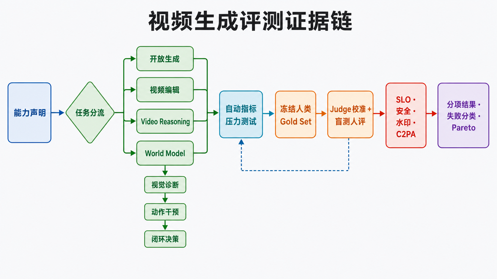
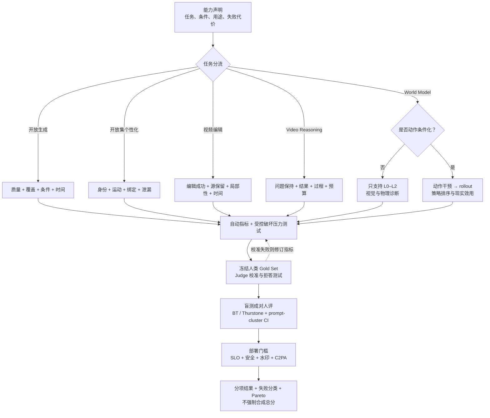

# 视频生成与世界模型评测：方法、历史与实践

> 本文讨论的是“视频生成模型”的 evaluation。检索与整理截至 **2026-08-29**。这里的 evaluation 既包括视频样本本身的质量，也包括条件遵循、分布覆盖、安全性，以及模型被称为 World Model 时的动作响应、反事实预测和闭环决策价值。

视频生成没有一个类似分类准确率的充分统计量。原因不是指标设计得还不够巧，而是“好视频”同时涉及单帧外观、时间连续性、运动、语义、物理、叙事、多样性和使用风险；对同一个条件又常常存在许多同样合理的未来。一个样本可以逐帧清晰却完全不动，可以文本语义正确却违反重力，也可以作为短片很逼真却无法根据智能体动作预测下一状态。因此，可靠评测必须回答两个问题：**模型声称具有什么能力，以及当前证据真正验证了哪一层能力。**

本文的核心结论是：视频生成评测经历了从“对齐唯一参考答案”到“比较生成分布”，再到“分解开放世界能力”，最后到“验证干预和决策效用”的迁移。后一个阶段并没有淘汰前面的指标，而是把它们降为某些局部属性的诊断工具。

对于 T2V 的任务定义、组合性失败模式和 prompt 结构化记录，参见[文本到视频](tasks/text-to-video.md)；本章作为全仓库统一的评测方法与实验协议入口。

## 评测前先记录条件、时间尺度和交互方式

模型的条件可分为语义、视觉、结构与运动、音频和智能体动作。测试时应明确记录文本、参考图、深度、轨迹、相机路径、语音或动作中的哪些条件被提供给模型。

时间能力也应分层评测：帧内结构、短期运动、跨遮挡的场景状态，以及长时间叙事或任务进展。只在前两层表现好，不能证明模型具有长期记忆。

对“可控”的声明，必须区分三层：

1. **Prompt steerability**：修改文字能否改变输出。
2. **Trajectory controllability**：给定轨迹、相机路径或动作后，输出是否按指定路径演化。
3. **Closed-loop interactivity**：模型能否持续接收动作，低延迟响应并保持世界状态。

## 1. 一张图看懂：先分任务，再选择证据



**图 1：评测不是把所有视频送进同一个总分。** 先把能力声明写成可证伪的 claim card，再按任务选择成功条件；开放集个性化须从宏观“开放生成”中另拆身份、运动、绑定与泄漏。自动指标只有通过受控破坏和人类 gold set 校准，才有资格参与最终报告。World Model 分支额外要求动作干预和闭环决策证据。

下面是同一逻辑的可编辑、可搜索版本：



顺序化文字替代：声明任务和失败代价；按开放生成、开放集个性化、编辑、推理或 World Model 分流；先压力测试自动指标，再用冻结人类样本校准；完成人工盲测与部署门槛；最后发布分项结果、置信区间、失败类型和质量—速度—成本 Pareto。

### 1.1 历史范式为什么不断扩大


这条时间线也对应逐渐扩大的评测单位。最早的单位是一个预测帧与一个真实帧；随后变成一组生成视频与一组真实视频；大模型时代以“prompt—多次采样—多维判断”为单位；World Model 的最小评测单位最终变成“初始状态—动作序列—环境后果—策略收益”。

## 2. 为什么视频生成比图像生成更难评

### 2.1 未来本身是多模态的

给定“一个人走到路口”这一历史，左转、右转、停下都可能合理。若测试集只记录了左转，均方误差会把另外两个未来当作错误。更严重的是，最小化多个可能未来的平均像素误差会产生视觉上的“条件均值”，即模糊帧。Mathieu 等人的多尺度视频预测工作明确指出，均方误差不足以刻画清晰的未来，这推动了梯度差异、对抗损失和后来的随机视频预测 [[1]](#ref-1)。

### 2.2 视频同时包含空间、时间和因果结构

逐帧 FID 很好并不意味着视频很好：模型可以生成一组漂亮但顺序随机的帧。反过来，像素误差很大也不意味着动力学错误：相机轻微平移就能造成大面积像素差异。视频评测至少要区分外观质量、短时连续性、长期身份与状态、运动幅度与方向、条件遵循、物理和因果合理性。

### 2.3 生成模型既要质量，也要覆盖

只展示每个 prompt 的最佳样本衡量的是“搜索预算下的上限”，不是模型分布本身。只生成安全、静止、近景主体的视频往往能提高若干质量分，却牺牲运动、多样性和困难条件覆盖。因此，质量、覆盖率、拒绝率和计算预算必须一起报告。

### 2.4 开放世界没有单一参考视频

PSNR、SSIM、VMAF 等 full-reference 指标原本适合比较同一内容的原始视频与压缩、传输或重建版本。文本生成视频则没有逐像素配准的“标准答案”。把压缩质量指标直接用于开放式生成，会把创意差异误判为失真。它们仍适合插帧、[视频退化修复](tasks/video-restoration.md)、可控编辑和确定性较强的短期预测，但不是开放式 T2V 的总分。

### 2.5 评测器本身也可能不懂视频

CLIP 类模型善于识别主体和场景，却可能忽略数量、否定、左右关系、动作顺序和微小物理错误；视频多模态大模型可以给出解释，但会继承训练数据、帧采样和提示词的偏差。FETV 的实验发现 CLIPScore 和 FVD 与人工判断的相关性并不理想 [[14]](#ref-14)。因此，“用更大的模型当裁判”不是评测问题的终点，而是引入了一个需要独立校准的新测量仪器。

## 3. 第一阶段：从传统视频质量到早期视频预测（约 1990s—2016）

### 3.1 传统视频质量评估的遗产

早期视频质量研究主要服务于编码、传输和显示。其问题通常是：给定无失真的参考视频，编码后的视频损失了多少质量？工程上形成了三类方法。

| 类型 | 代表方法 | 需要参考视频 | 实际测量的对象 | 对生成模型的适用边界 |
|---|---|---:|---|---|
| Full-reference | MSE、PSNR、SSIM、MS-SSIM、VMAF | 是 | 相对于同一内容的像素、结构或感知失真 | 适合重建、超分、插帧；不适合开放式生成 |
| Reduced-reference | 部分统计或特征比较 | 部分 | 参考与输出之间的质量变化 | 适合带参考的传输与恢复任务 |
| No-reference | 传统伪影检测、后来的学习式 VQA | 否 | 模糊、噪声、压缩、抖动、美学等可见质量 | 可诊断技术质量，但不判断文本或物理 |
| 主观评测 | MOS、ACR、双刺激、成对比较 | 可选 | 人的总体或分项感知 | 最接近最终体验，但成本高且设计敏感 |

ITU-T P.910 至今仍给出多媒体视频主观质量实验的方法规范 [[2]](#ref-2)。SSIM 将评测从单纯误差转向局部亮度、对比度和结构相似性 [[3]](#ref-3)，VMAF 则通过融合多种特征来预测特定观看条件下的人类质量判断 [[4]](#ref-4)。这些工作给生成模型留下了两个重要遗产：第一，主观质量必须通过受控实验而不是随意观看来测量；第二，任何学习式质量指标都只在其训练失真类型和观看条件内可靠。

### 3.2 确定性视频预测：PSNR、SSIM 与“模糊的高分”

2014—2016 年前后的深度视频预测通常从若干上下文帧预测未来帧。常见数据集包括 Moving MNIST、KTH、UCF-101 和机器人交互视频，输出常以 MSE、PSNR、SSIM 以及人工视觉比较评价。对像素范围为 $[0,L]$ 的帧，PSNR 为：

$$
\mathrm{PSNR}=10\log_{10}\frac{L^2}{\mathrm{MSE}}.
$$

这类指标便于复现，也适合未来接近确定的场景；但它们把所有像素错位同等处理。轻微相机移动会导致低分，而一个把多种未来平均成模糊区域的模型反而可能获得较好的 MSE。2015 年以后，研究开始同时报告梯度差异、锐度和感知判断，并使用对抗损失减少模糊 [[1]](#ref-1)。

### 3.3 随机视频预测：best-of-N、覆盖与校准

当模型显式引入随机 latent 后，评价从“预测是否等于唯一真值”变成“预测分布是否覆盖合理未来”。常见做法是对同一上下文采样 $N$ 个未来，再报告最接近真值的样本：

$$
d_{\text{best-of-}N}=\min_{i\in\{1,\dots,N\}}d(\hat{x}^{(i)}_{1:T},x_{1:T}).
$$

它能检验模型是否有机会覆盖真实未来，但分数会随 $N$ 单调改善，且可能奖励“撒网式”生成。如果不同时报告样本预算、平均质量、样本间多样性和异常样本率，就无法公平比较。Stochastic Video Generation with a Learned Prior 等工作使“质量—多样性”权衡成为视频预测评测的核心问题 [[5]](#ref-5)。

最低协议应把 single sample、sample-average、best-of-$N$、posterior oracle 和完整样本集的 distributional score 分栏；测试只能从不看隐藏未来的 prior 采样。对可枚举事件，还应报告 Brier/NLL、reliability/ECE、rare-mode recall 和 spurious-mode rate。若同一历史只有一个记录未来，则真实条件分布本身不可充分识别，需要多标注或有已知分支概率的 simulator。可执行协议与建议预注册阈值见[变分随机视频生成的 `LatentFork-1`](generative-models/variational-generation.md)。

### 3.4 这一阶段留下的正确用法

像素/感知误差没有过时。对于视频插帧、预测未来 100 ms、已知相机轨迹重建或给定参考的视频编辑，它们仍是重要证据。关键是不要把“与某个参考像素接近”解释为“生成分布真实”，也不要把 best-of-N 当作单次生成质量。

## 4. 第二阶段：GAN、分布指标与 FVD（约 2016—2022）

### 4.1 从单样本误差转向真实性与多样性

VideoGAN、MoCoGAN 等生成模型不再承诺重建某个未来，而是学习整个视频数据分布 [[6]](#ref-6) [[7]](#ref-7)。这使两两像素误差失去中心地位，图像生成领域的 Inception Score（IS）和 Fréchet Inception Distance（FID）被移植到视频。

IS 通过分类器输出衡量单个样本类别分布是否尖锐、整个样本集合的边缘类别分布是否多样：

$$
\mathrm{IS}=\exp\left(\mathbb{E}_{x}\left[D_{KL}(p(y\mid x)\Vert p(y))\right]\right).
$$

它不需要真实参考集，但严重依赖分类器和标签域；它可以被类内复制、分类器对抗样本或与视频质量无关的类别多样性误导。FID 则把真实与生成样本的特征近似为高斯分布：

$$
\mathrm{FID}=\lVert\mu_r-\mu_g\rVert_2^2+
\mathrm{Tr}\left(\Sigma_r+\Sigma_g-2(\Sigma_r\Sigma_g)^{1/2}\right).
$$

FID 同时对特征均值和协方差敏感，较 IS 更能检测生成分布与真实分布的偏移 [[8]](#ref-8) [[9]](#ref-9)。但若逐帧计算，它完全不知道帧的先后顺序。

### 4.2 FVD 的出现与影响

2018 年提出的 Fréchet Video Distance（FVD）用 I3D 视频分类器的时空特征替代图像 Inception 特征，再用同一 Fréchet 公式比较真实视频与生成视频分布。原论文通过受控噪声和大规模人工比较说明 FVD 比逐帧指标更能响应视频质量变化 [[10]](#ref-10)。此后，FVD 成为视频 GAN、VQ/Transformer 和 diffusion 模型最常见的聚合指标之一。

FVD 的真正贡献不是提供了“视频质量的真值”，而是把外观、时间动态和分布覆盖放入一个可扩展的统计量。这很适合在同一数据集、同一实现和固定采样协议下做消融实验，却不适合跨论文直接抄表排名。

### 4.3 FVD 的关键局限

2024 年的系统分析进一步暴露了三个问题。首先，I3D 特征分布并不严格满足高斯假设；其次，I3D 由动作分类监督训练，可能更关注内容类别而不是细微时间破坏；再次，均值和协方差估计需要较大样本，有限样本下偏差和方差都很显著 [[11]](#ref-11)。另一项研究发现，通过从大量几乎无运动的生成样本中筛选，可以显著降低 FVD，却没有改善时间真实性，说明经典 I3D-FVD 存在单帧内容偏置 [[12]](#ref-12)。

改进方向主要有两条：一条更换表征，例如使用大规模自监督视频 encoder 或 V-JEPA 特征；另一条更换分布距离，例如以 maximum mean discrepancy（MMD）代替高斯假设下的 Fréchet 距离。Beyond FVD 提出的 JEDi 就组合了 JEPA embedding 与多项式核 MMD，并在其测试中表现出更好的样本效率和人工一致性 [[11]](#ref-11)。不过，更换 backbone 只是改变了“评测在哪个表征空间发生”，并不会自动得到与任务无关的万能指标；新指标仍需经过时间破坏、内容替换、静止视频、重复样本和域外视频的元评测。

因此，报告 FVD 时至少必须固定并披露：

| 必须披露项 | 为什么重要 |
|---|---|
| 特征网络、权重和代码实现 | TensorFlow/PyTorch、I3D 权重与预处理差异会改变绝对值 |
| 真实/生成样本数与重复次数 | FVD 是有限样本估计量，小样本排序可能不稳定 |
| 帧数、FPS、分辨率、裁剪和取帧方式 | 时间重采样会直接改变 I3D 特征 |
| prompt、随机种子和每个 prompt 的样本数 | 防止把 prompt 难度或 best-of-N 预算混入模型差异 |
| 均值之外的 bootstrap 置信区间 | 判断差异是否超过抽样噪声 |

一个常见错误是用各论文自行报告的 FVD 排名模型。只有参考集、视频长度、分辨率、采样数量、预处理和实现全部相同，数值才具有可比性。

### 4.4 感知距离与视频质量模型

LPIPS 使用预训练网络的多层特征距离，通常比像素误差更接近人类对图像 patch 的感知差异 [[13]](#ref-13)。将 LPIPS 逐帧平均可以评价外观重建，将相邻帧 LPIPS 或光流 warping error 用作时间诊断也很常见。不过，这些变体仍不能单独区分“正确运动”与“稳定但静止”。DOVER 一类 no-reference VQA 模型把技术质量与美学质量分开建模，为大模型时代的无参考质量评测提供了工具，但其训练对象主要是用户生成视频质量，而不是文本遵循、物理或生成分布覆盖 [[17]](#ref-17)。

## 5. 第三阶段：视频大模型时代的多维评测（约 2022—2026）

Diffusion、视频 token 和大规模文本—视频预训练让模型从窄数据集短视频，扩展到开放域 T2V/I2V、长视频、多镜头、编辑和联合音频生成。此时 FVD 面临根本性的任务错配：它无法解释一个视频是否遵循指定 prompt，也不能指出失败来自人物身份、数量、空间关系、运动、镜头还是物理。评测因此从“一个总分”转向“prompt 套件 + 能力维度 + 自动评测器 + 人评校准”。

### 5.1 2023—2024：从总体质量到可诊断能力

FETV 在 2023 年将 prompt 按主要内容、属性控制和复杂度分层，并加入视频特有的时间类别；其人工实验也系统检查了自动指标与人工判断的一致性 [[14]](#ref-14)。2024 年，VBench 把视频生成质量拆成 16 个维度，包括主体一致性、背景一致性、闪烁、运动平滑度、动态程度、美学、成像质量、对象类别、多个对象、动作、颜色、空间关系、场景、外观风格和时间风格等 [[15]](#ref-15)。EvalCrafter 使用 700 个 prompt 和 17 个客观指标覆盖视觉、内容、运动和文本对齐，并学习自动指标到用户意见的映射 [[16]](#ref-16)。

这些 benchmark 的历史意义在于，它们不再问“哪个模型 FVD 最低”，而是问“哪个能力导致模型在什么 prompt 上失败”。但维度分解不等于测量已经完美：若某一维仍依赖 CLIP、DINO、RAFT、检测器或 VQA 模型，它就会继承相应 backbone 的盲点。

### 5.2 条件遵循：从 CLIP 相似度到可验证事实

CLIPScore 最初是无参考图像—文本兼容性指标 [[18]](#ref-18)。在视频中，常见实现是逐帧计算文本相似度再聚合，或使用专门的视频—文本 encoder。它对主体和整体场景有效，却容易漏掉“红球在蓝盒左边”“两个人先握手再坐下”“杯子没有掉落”这类组合、数量、否定与时间关系。

后来的评测转向把 prompt 分解为原子事实，再通过检测、跟踪、深度、VideoQA 或 MLLM 验证。T2V-CompBench 覆盖静态/动态属性绑定、空间关系、运动绑定、动作绑定、对象交互和数量七类组合能力 [[22]](#ref-22)；TC-Bench 明确给出初始与最终状态，检查关系或属性转变是否真正完成，而不是只看平均语义相似度 [[21]](#ref-21)。GenAI-Bench 也用组合 prompt 和大规模人类评分检验 text-to-visual 对齐及评测器本身 [[19]](#ref-19)。

这带来了一个重要方法论变化：**语义对齐不应只测“视频里有没有这些词对应的东西”，而应测对象、属性、关系、动作、顺序和状态转移是否绑定正确。**

### 5.3 人类反馈学习出的评测器与 reward model

VideoScore/VideoFeedback 使用来自多个生成模型的 3.76 万条视频多维人工评分训练自动评测器，并报告在同分布与外部 benchmark 上与人类评分的相关性 [[20]](#ref-20)。这类模型比固定的 CLIP 或 FVD 更接近用户偏好，也可以用于 best-of-N 选择和生成模型后训练。

但 reward model 同时带来 Goodhart 风险：一旦生成器针对它优化，评测器的偏差就会成为可利用的奖励漏洞。可靠做法是将“训练奖励”“开发集自动指标”“冻结的外部评测器”和“最终盲测人评”分离，并检查新模型是否只是学会迎合某个 judge。

### 5.4 物理、组合性与长时结构成为专项 benchmark

当视频模型被描述为“世界模拟器”后，评测开始针对过去总分会掩盖的失败。VideoPhy 使用不同材料和真实活动的 prompt，同时评价语义遵循与物理常识 [[23]](#ref-23)；PhyGenBench 将 160 个 prompt 组织为 27 条物理规律，并以分层 VLM/LLM 流程评价 [[24]](#ref-24)；VideoPhy-2 扩展到 200 种动作，并对守恒规律等细粒度规则进行人工与自动评价 [[25]](#ref-25)。这些 benchmark 共同说明：画面真实感提高，并不自动带来接触、碰撞、材料和守恒规律的可靠性。

长视频还需要额外测量身份漂移、场景回访、事件顺序、镜头边界、叙事覆盖和音视频同步。短片上的平均分不能外推到分钟级生成，因为自回归误差、上下文遗忘和跨镜头实体重建会随时间累积。

### 5.5 安全、拒绝与来源也进入评测对象

视频比静态图像多出动作持续、行为模仿、跨帧语境改变和时序升级等风险。T2VSafetyBench 的 NeurIPS 2024 camera-ready 版本采用 **4 个一级类别、14 个安全方面**，并评测 9 个 T2V 模型 [[26]](#ref-26)。当前 arXiv v3 摘要仍写 12 个方面，与正式会议版存在版本冲突；引用时必须注明所用版本，不能混用数字。

生产评测至少分开四层，任何一层都不能替代其余三层：

1. **行为安全：** 恶意请求攻击成功率、正常请求误拒率、跨帧风险升级、人物/未成年人/版权/隐私风险。
2. **AI 检测：** 真实/生成分类器在域外生成器、重压缩、假水印和去水印条件下的 `TPR@固定FPR`。
3. **水印：** 检测、载荷、定位和抗攻击能力；需要独立测试删除和伪造，而不只是普通压缩。
4. **来源凭证：** C2PA 对签名声明、内容绑定和处理链做加密验证；它不是 deepfake 分类器，也不保证声明本身为真。

生产报告还应保存拒绝、超时和被安全过滤的样本。只对通过过滤的输出打分，会让高拒绝模型看起来既安全又高质量。

### 5.6 大模型时代的 benchmark 谱系

不能把所有 benchmark 排成一个“谁更新谁更好”的榜单。更准确的做法是按它们回答的问题分族：

| 家族 | 2023—2026 代表工作 | 关键规模或设计 | 真正增加的证据 | 仍不能推出 |
|---|---|---|---|---|
| 开放域多维 | FETV、VBench、EvalCrafter | prompt 分类、16 维诊断、真实用户 prompt | 质量问题可定位到内容/运动/条件维度 | 指标代理就是人类真值 |
| 任务扩展 | VBench++ [[36]](#ref-36) | 在 VBench 体系上加入 I2V 与 trustworthiness | 同一套件覆盖更多生成条件 | 与 VBench-2.0 是同一版本 |
| 内在忠实度 | VBench-2.0 [[37]](#ref-37) | Human Fidelity、Controllability、Creativity、Physics、Commonsense 五个一级维度 | 从表面质量转向生成结果的内在忠实度 | 五维总分可替代分项诊断 |
| 组合与世界知识 | T2V-CompBench、T2VWorldBench [[22]](#ref-22) [[38]](#ref-38) | 前者 1,400 prompts/7 类组合；后者 1,200 prompts/6 类、60 子类 | 属性、关系、动作绑定和开放世界知识被单独测量 | 能支持闭环规划 |
| 评测器元评测 | SLVMEval [[39]](#ref-39) | 最长 10,486 秒、10 类受控退化 | 直接检验 evaluator 是否识别长视频错误 | 某个 judge 在新域必然可靠 |
| 人体运动 | HuM-Eval / HuM-Bench [[40]](#ref-40) | 1,000 prompts；VLM 粗评 + 2D pose + 3D motion 细评 | 人体运动不再被整体 VQA 掩盖 | 姿态正确等于接触和动力学正确 |
| 视频编辑 | VE-Bench、FiVE-Bench、IVEBench [[41]](#ref-41) [[42]](#ref-42) [[43]](#ref-43) | 从整体编辑质量推进到对象 mask、长序列和多类指令 | 同时检查“改对”和“未要求部分保住” | 开放式 T2V 覆盖能力 |
| 开放集个性化 | [主体到视频 benchmark 与身份指标谱系](tasks/personalized-video-generation.md) | identity-disjoint 主体拆分、参考集、适配预算与多主体协议 | 身份、运动/prompt、绑定与参考泄漏被分开 | 单帧人脸/全帧相似度足够 |
| 物理与 World Model | VideoPhy、PhyGenBench、VideoPhy-2、Physics-IQ、WorldModelBench、WorldMark [[23]](#ref-23) [[24]](#ref-24) [[25]](#ref-25) [[44]](#ref-44) [[32]](#ref-32) [[45]](#ref-45) | 常识/规律 → 视觉违规 → 动作响应 | 物理和动作响应形成独立证据链 | 视觉 plausibility 自动等于决策效用 |
| Video Reasoning | MME-CoF、TiViBench、Gen-ViRe、V-ReasonBench、VBVR、World Reasoning Arena、VBVR-Pro [[46]](#ref-46) [[47]](#ref-47) [[48]](#ref-48) [[49]](#ref-49) [[50]](#ref-50) [[51]](#ref-51) [[52]](#ref-52) | 结果、过程、预算与可验证状态 | 生成过程可作为推理轨迹被检查 | 漂亮中间帧就是合法推理 |
| 安全与来源 | T2VSafetyBench、VideoMarkBench、SIGMark、C2PA 2.4 [[26]](#ref-26) [[54]](#ref-54) [[55]](#ref-55) [[56]](#ref-56) | 行为风险、水印攻击和来源凭证分层 | 部署风险进入可复现协议 | 有水印/C2PA 就代表内容真实 |

这条谱系的主线是：**单一总分 → 多维诊断 → 任务专项 benchmark → 对 evaluator 本身做压力测试 → 将生成质量与决策、部署证据分开。**

### 5.7 五类任务必须使用不同的成功定义

| 任务 | 基本评测单位 | 必须回答 | 典型指标 | 不能由此推出 |
|---|---|---|---|---|
| 开放生成 | `prompt × seed` | 好看吗、动了吗、条件正确吗、覆盖困难 prompt 吗 | 分项质量、组合事实、时间/物理、拒绝率、人评 | 动作因果或规划价值 |
| 开放集个性化 | `subject × reference set × prompt/control × seed × adaptation budget` | 新情境中还是同一主体吗、动了吗、绑定对了吗、复制参考了吗 | 身份/关键属性、prompt/运动、时间漂移、多主体绑定、泄漏与成本 | I2V 锚点保真或跨镜头状态管理 |
| 视频编辑 | `source × instruction × seed`，mask 可选 | 改对了吗、原视频保住了吗、影响是否越界、时间上稳定吗 | edit success、source fidelity、locality、identity/motion preservation | 开放生成的多样性和覆盖 |
| Video Reasoning | `question/initial state × seed × budget` | 问题约束保留了吗、答案对吗、中间状态合法吗 | exact/program score、process violation、pass@1/pass@k、预算 | 存在可用于控制的 World Model |
| World Model | `initial state × action branch × horizon × policy` | 动作后果、反事实、长 rollout 和策略排序可靠吗 | action alignment、regret、return gap、optimization lift | 跨域通用世界理解 |

#### 视频编辑的三角约束

编辑质量不是“编辑后视频越像 prompt 越好”。如果源视频中的人物、相机、背景和未指定对象全部被重画，文本对齐可能很高但编辑失败。最小三角是：

1. **Edit success：** 指令要求改变的属性、对象或运动是否改变；
2. **Source preservation：** 未指定内容、身份、几何、纹理和运动是否保留；
3. **Locality and temporal stability：** 改动是否局限在目标区域/时间段，是否产生闪烁和跨帧泄漏。

VE-Bench 同时建模文本—编辑结果、源—编辑结果和感知质量；FiVE-Bench 引入对象级指令与 mask；IVEBench 再扩展到 600 个源视频、32–1,024 帧、8 大类/35 子类 [[41]](#ref-41) [[42]](#ref-42) [[43]](#ref-43)。`VE-Bench`（编辑输出质量）不要与 2026 年评估 MLLM 视频编辑知识的 `VEBench` 混写 [[62]](#ref-62)。

#### 开放集个性化要把“像”与“可动、可绑定”分开

个性化的参考不占输出时间轴，因此高相似度可能来自静帧复制、参考姿态/背景泄漏或只对检测成功帧计分。最小协议必须分开身份/属性、prompt/运动、时间稳定、多主体绑定和参考泄漏，并把缺失主体计为失败；适配数据、步数、额外参数/状态和推理成本同时进入 Pareto。完整的五道门、开放集拆分与交换/遮挡反证见[开放集视频个性化](tasks/personalized-video-generation.md)。

#### Video Reasoning 要把“答案”和“过程”分开

同一个正确答案可能来自非法中间状态、状态复制、穿越障碍或最后一帧猜测。Reasoning 报告至少拆成：问题/初始条件保持、最终答案或目标状态、中间状态合法性、读出方式与预算。`best-frame`、`best-of-k` 和多次重试都会扩大搜索预算，必须与 `pass@1` 分开报告。对可程序验证的任务优先使用确定性 scorer，MLLM 只处理无法形式化的开放语义。

### 5.8 自动评测器先接受受控破坏，再评价模型

给一条本来正确的视频构造只破坏单一能力的反事实版本。如果指标声称测该能力，分数应随破坏强度单调恶化，而对无关变化相对稳定。

| 受控破坏 | 目标能力 | 应保持近似不变 | 失效说明 |
|---|---|---|---|
| 帧乱序、局部倒放 | 事件顺序、时间理解 | 单帧画质、对象集合 | 逐帧 CLIP 均值对此天然不敏感 |
| 冻结、重复帧 | 动态程度、运动连续 | 主体和场景语义 | 高画质静态复制可能骗过内容型指标 |
| 速度/FPS 改变 | 运动节奏和动力学 | 事件类别 | evaluator 可能只看稀疏关键帧 |
| 删除关键片段 | 叙事/动作完成 | 开头与结尾外观 | 均匀采帧可能完全漏掉错误 |
| codec 重压缩、resize | 技术质量鲁棒性 | 高层语义与顺序 | judge 可能把压缩伪影误判为语义失败 |
| 颜色/数量交换 | 属性与计数绑定 | 场景、动作 | 整体文本相似度可能仍很高 |
| 关系/动作反转 | 组合语义 | 对象类别和画质 | bag-of-concepts 指标无法判断方向 |
| 短暂身份漂移 | 长时实体一致性 | 大部分帧 | 低频采样与平均分会掩盖短错误 |

SLVMEval 的意义正在于把“评模型”前置为“先评测量仪器”：其论文报告人类成对判断准确率为 84.7%–96.8%，而所测自动 evaluator 在 9/10 个方面落后；这些数字是该论文实验结果，不应外推成所有域的固定差距 [[39]](#ref-39)。

### 5.9 建立版本化 benchmark registry

Benchmark 名称不足以复现结果。仓库或论文附录应为每次运行保存：

```yaml
benchmark:
  name:
  task_family: [generation, personalization, editing, multiview_4d, reasoning, world_model]
  version_or_commit:
  release_date:
  accessed_at:
  prompt_count_and_categories:
  license:
evaluator:
  name_and_checkpoint:
  code_commit:
  frame_sampling:
  resolution_and_codec:
  judge_prompt_hash:
  calibration_gold_set_hash:
  abstention_policy:
generation_protocol:
  model_or_api_version:
  seeds_and_retries:
  duration_fps_resolution_audio:
  prompt_rewrite_and_postprocess:
evidence:
  controlled_corruptions:
  human_protocol:
  contamination_risk:
  limitations:
```

同名 benchmark 的论文版、项目页版和 leaderboard 当前版可能不同；API 模型和 judge 也会静默更新。版本、访问日期和 prompt hash 是结果的一部分，而不是补充信息。

### 5.10 多视角 / 4D 要把 camera 与 world time 拆成测试网格

相机控制视频只沿 camera–time 平面的一条路径采样，不能证明同一时刻的其他视角一致。多视角/4D 报告至少要分成：

1. `seen-view / seen-time` 的输入证据保真；
2. `novel-view / seen-time` 的重投影、epipolar 与 loop closure；
3. `seen-view / novel-time` 的轨迹、显隐与运动；
4. `novel-view / novel-time` 的联合外推和未见区域不确定性；
5. 生成网格与可渲染状态的构建、查询、显存和资产大小。

PSNR/LPIPS/FVD 只能覆盖其中一部分。深度、pose、3D track、surface/Chamfer、遮挡顺序和重复 query 稳定性必须按主张选用；不可见背面还要与有观测支持的区域分 mask。完整的六门证据链和 `GridFork-1` 见[多视角与 4D 生成](tasks/multiview-4d-generation.md)。

## 6. 自动指标到底测什么

为了避免“指标名很多但证据重复”，可以把自动评价分成六类。

| 指标 | 机制上测量什么 | 主要假设 | 典型失效 |
|---|---|---|---|
| IS | 分类器对单样本的置信度与样本集类别边际熵 | 标签域能代表生成质量/多样性 | 不看真实集；不测类内覆盖；可被分类器伪影利用 |
| FID | 图像特征均值与协方差的二阶距离 | 特征近似高斯、backbone 合适 | 有限样本有偏且偏差依模型；逐帧计算不感知顺序 [[53]](#ref-53) |
| FVD | 视频特征上的 Fréchet 距离 | I3D 时空特征与二阶统计代表目标能力 | 内容偏置、预处理敏感、严重时间破坏可能低敏感 |
| CLIPScore | 图像—文本兼容性 | 视觉概念共现足以表示条件遵循 | 帧均值对帧置换不变；数量、否定、关系、动作和状态转移弱 |
| Reward / VLM Judge | 训练分布中的人类评分或语言判定 | judge 泛化到新模型、新 prompt 和新帧采样 | 位置、verbosity/self-preference、域偏移、reward hacking [[60]](#ref-60) [[61]](#ref-61) |

这些指标不是同一把尺子的不同精度，而是在不同特征空间回答不同问题。即使两个分数都与人评相关，也不意味着它们具有相同的因果解释。

### 6.1 有参考的保真指标

PSNR、SSIM、LPIPS、VMAF、关键点误差、轨迹误差属于这一类。它们回答“输出与指定参考有多接近”。适合重建、[视频退化修复](tasks/video-restoration.md)、编辑保持、插帧和受控动作预测，不适合开放式创作的总体质量。对于 stochastic future，应报告 expected score、best-of-N 和样本覆盖，并明确三者含义不同。

对 restoration，full-reference 也只覆盖已配准、已知 ground truth 的设置。真实盲退化还要同时报告：退化器/codec/camera 是否未见、把输出重新退化后能否回到输入、flow/track 对齐后的闪烁、OCR/身份/物体计数是否被生成先验改写，以及多 seed 的高频不确定性。PSNR 高可能过平滑，无参考感知分高也可能来自合理但错误的纹理；至少应把 fidelity、temporal stability、perceptual detail 和 hallucination failure 分开。

### 6.2 无参考的单视频质量指标

美学模型、DOVER、清晰度、闪烁、光流残差、检测置信度和身份相似度回答“这个样本自身是否有可见问题”。它们可以定位模糊、曝光、压缩、抖动、面部变形和对象漂移，但无法判断模型是否覆盖真实数据分布。

### 6.3 分布指标

FID、FVD、KVD/MMD、precision/recall 类指标比较真实与生成样本集合。它们适合衡量总体 fidelity 与 coverage，但高度依赖特征空间。单一 Fréchet 距离把质量和覆盖压成一个数；更稳妥的报告应增加生成 precision（样本是否落在真实流形附近）、recall/coverage（真实模式是否被覆盖）以及按条件切片的结果。

### 6.4 条件一致性指标

CLIP/ViCLIP 相似度、VideoQA、检测/跟踪、caption 后事实核验和 MLLM judge 用来判断文本、图像、姿态、轨迹或音频条件是否得到遵循。最可靠的形式不是一个整体相似度，而是把条件写成可核验谓词，例如：

```yaml
entities:
  - red_ball
  - blue_box
initial_relation: red_ball left_of blue_box
event: red_ball rolls_right
final_relation: red_ball inside blue_box
must_persist:
  - ball_color == red
  - box_color == blue
```

这样可分别计算实体存在、属性绑定、关系、动作方向、事件完成和持久状态，避免平均相似度掩盖关键失败。

### 6.5 人类偏好或学习式 judge

人评、VideoScore 和 MLLM judge 回答“用户认为哪个更好”。它们可以融合难以手工编码的因素，却受标注人群、任务说明、视频播放方式和模型偏见影响；视频专项元评测也观察到 judge 的位置偏差、能力切片差异和分布外可靠性问题 [[60]](#ref-60)，通用 arena 研究则系统讨论了 position、verbosity 与 self-enhancement bias [[61]](#ref-61)。只引用 judge 原论文上的相关性，不足以证明它在当前输出分布可靠。

最低校准闸门包括：

1. 在本次模型、prompt 类别和失败模式上冻结独立 human gold set；
2. 将视频 A/B 左右互换，测 position consistency；
3. 对采帧数、采帧位置、分辨率和 codec 做 sweep；
4. 分别报告视觉、条件、时间、物理等能力切片，不能只给总体相关；
5. 对概率输出做 reliability diagram、Brier/ECE；
6. 允许 `abstain`，报告 coverage—risk，而不是强迫所有样本给结论；
7. 将训练 reward judge、开发 judge 和最终冻结 judge 隔离，避免同一测量目标同时用于优化和验收。

### 6.6 任务与闭环指标

机器人成功率、游戏 return、驾驶碰撞率、规划 regret、现实迁移收益回答“使用该模型是否让系统做得更好”。对 world model，这是最高层证据。视觉逼真度可以作为诊断，但不能替代任务结果。

## 7. 人工评测怎样做才可信

### 7.1 先拆问题，再比较模型

“总体哪个更好”把多个不可交换的因素混在一起。更稳定的协议是对同一对视频分别询问：哪一个更遵循条件、哪一个时间上更连贯、哪一个运动/物理更合理、哪一个视觉质量更高、哪一个更愿意直接使用。成对比较通常比 1—10 绝对分更容易校准；若模型都失败，应允许“都不好”和“无法判断”，不要强迫二选一。

### 7.2 控制呈现与抽样

模型名称应隐藏，左右顺序随机，同一视频不能因编码参数不同而暴露来源。播放分辨率、FPS、是否循环、是否允许暂停、是否有声音必须一致。测试集要按 prompt 类别分层随机抽样，不能由研究者挑选“代表样例”。每个 prompt 应固定同等生成次数，并把随机种子而不是模型提供者的 cherry-picked 样本作为评测单位。

### 7.3 报告标注质量和不确定性

应报告标注者数量、每条样本的重复标注数、训练/筛选方式、注意力检查、标注者间一致性以及剔除规则。模型胜率需要给出以 prompt 为聚类单位的 bootstrap 置信区间；当同一标注者评价大量样本时，可使用混合效应 logistic/ordinal 模型控制标注者和 prompt 难度。只有平均 Likert 分而没有置信区间，无法判断小数点后的差异是否真实。

### 7.4 做元评测，而不只是做评测

自动评测器的质量应通过独立的人类 gold set 验证，至少报告 Spearman/Kendall 排序相关、成对偏好准确率、不同能力切片的结果和置信区间。还应加入已知破坏的 sensitivity test：打乱帧序、复制帧、冻结画面、改变速度、交换对象颜色、删除关键事件、制造短暂身份漂移，检查指标是否朝预期方向变化。若指标连这些合成破坏都不敏感，就不应作为相应能力的证据。

### 7.5 成对比较需要显式统计模型

若模型 $i$ 与 $j$ 的潜在质量分别为 $\theta_i,\theta_j$，Bradley–Terry 模型写为：

$$
P(i \succ j)=\sigma(\theta_i-\theta_j).
$$

也可用 Thurstone/probit 形式。协议必须允许平局、“都差”和“无法判断”，并说明它们是单独建模、丢弃还是拆分权重。模型比较图需要连通，否则不同连通分量的强度不可识别。置信区间应以 prompt 为 cluster bootstrap；若同一标注者反复评样本，再加入 annotator random effect。

公开 arena 还要披露用户来源、时间窗口、模型版本、匹配调度、重复/机器人过滤和位置偏差 [[61]](#ref-61)。Elo 或胜率是特定时间和人群下的相对偏好快照，不是跨版本稳定的绝对质量。

## 8. World model 应该如何评测

### 8.1 先区分三种常被混用的“world model”

第一类是**观察预测器**，根据历史生成未来画面；第二类是**动作条件环境模型**，学习 $p(o_{t+1},r_{t+1}\mid o_{\le t},a_{\le t})$；第三类是**面向决策的 latent world model**，未必重建逼真像素，而是预测规划所需的 reward、value、policy 或 latent transition。Sora 一类视频基础模型展示了若干隐式世界规律，但若没有动作条件、反事实和闭环验证，视觉生成证据不能自动提升为第三类证据 [[28]](#ref-28)。

在 model-based RL 传统中，PlaNet 通过学习 latent dynamics 并在 DeepMind Control Suite 中在线规划，以环境 return 和数据效率验证世界模型 [[29]](#ref-29)；MuZero 不追求观测重建，而预测 reward、policy 和 value，并以棋类和 Atari 的规划成绩验证其模型是否“对决策充分” [[30]](#ref-30)；DreamerV3 在 150 多个任务上以固定配置和实际环境回报评价 imagined rollout 的价值 [[31]](#ref-31)。这条传统给视频 world model 的关键提醒是：**像素预测准确不是目标本身，能否支持正确行动才是。**

### 8.2 从视觉 plausibility 到决策价值的证据阶梯

| 等级 | 核心问题 | 推荐指标/实验 | 能支持的声明 | 不能支持的声明 |
|---|---|---|---|---|
| L0 渲染质量 | 单帧是否自然 | VQA、美学、人评、伪影率 | 高质量视频生成 | 理解动力学 |
| L1 时间 plausibility | 视频是否连贯 | FVD、运动/闪烁指标、人评 | 学到常见时间模式 | 动作可控、因果正确 |
| L2 语义与物理诊断 | 事件和规律是否合理 | 事实核验、VideoPhy/PhyGenBench | 某些物理常识表现 | 可用于闭环模拟 |
| L3 状态与动作预测 | 给定动作后状态是否正确 | 多步状态误差、action alignment | 动作条件预测能力 | 规划可靠性 |
| L4 反事实一致性 | 换动作是否只改变应变因素 | 配对干预、branch consistency | 局部因果/干预证据 | 长期闭环稳定 |
| L5 闭环 rollout | 连续交互是否稳定 | horizon 曲线、失败时间、任务成功率 | 可交互模拟能力 | 提高现实决策 |
| L6 规划/策略评价 | 模型能否选对策略 | policy ranking、regret、return gap | 决策相关充分性 | 现实迁移和安全 |
| L7 现实效用 | 使用模型是否改善真实系统 | real-world success、safety、data efficiency | 面向该任务的 world model 价值 | 其他域的普遍世界理解 |

2026 年的决策中心观点论文也强调，world model 的证据应从视觉 plausibility 向反事实动作保真、闭环 rollout、策略排序、优化增益、可利用性和不确定性校准推进 [[35]](#ref-35)。这个阶梯不是说每个研究都必须做到 L7，而是要求论文的能力声明不能高于证据所在层级。

### 8.3 一步预测和自由 rollout 必须分开

Teacher forcing 下的一步预测使用真实历史作为输入，主要测局部拟合；自由 rollout 把模型自己的输出继续送回模型，会暴露误差积累和分布漂移。应绘制指标随 horizon $h$ 的曲线，而不是只给一个平均数：

$$
E(h)=\mathbb{E}\left[d\left(\hat{s}_{t+h},s_{t+h}\right)\right],\qquad h=1,2,\ldots,H.
$$

同时报告首次不可恢复错误时间、状态变量误差、对象存活率、身份保持、几何回环一致性和 reward/value 误差。只在前几帧上评价无法证明长期 world model 能力。

### 8.4 动作遵循需要“干预差分”，不能只看相关性

固定相同初始状态和随机因素，只改变动作 $a$，比较生成后果。一个最小测试可以是：向左推、向右推、不接触。评测既要检查动作影响的目标变量是否按预期变化，也要检查背景、对象身份等不应变化的因素是否保持。可以定义动作效应误差：

$$
E_{\mathrm{effect}}=
d\left(
[f(\hat{s}^{a_1}_{t+h})-f(\hat{s}^{a_0}_{t+h})],
[f(s^{a_1}_{t+h})-f(s^{a_0}_{t+h})]
\right).
$$

这里 $f$ 是可解释状态探针，例如物体位置、抽屉开合、车辆速度或接触状态。这比分别检查两段视频“看起来合理”更能隔离动作因果效应。

### 8.5 状态持久性、空间记忆和回环

对世界模型，状态改变必须在离开视野后仍然存在。可执行“移动物体—遮挡—执行无关动作—再次观察”的测试，测量对象位置、属性和拓扑关系是否保持。空间模型还应测试相机绕行和离开后返回的 loop consistency，以及同一位置从不同视角观察时的几何一致性。漂亮的连续相机运动并不等价于内部存在稳定的 3D 地图。

### 8.6 随机世界需要概率评分和校准

在部分可观测或本质随机的环境中，世界模型不应被要求猜中唯一未来，而应为真实结果分配合理概率。可使用 held-out negative log-likelihood、Brier score、CRPS、coverage-vs-width 曲线、expected calibration error，以及多次 rollout 对真实结果集合的覆盖率。还需区分 aleatoric uncertainty 与 epistemic uncertainty，并按训练分布内、组合分布外和完全分布外场景切片。

“视频看起来合理”只表示样本可能来自某个 plausible mode；校准评测关心模型给各 mode 的概率是否可信，这对风险敏感规划尤其关键。

### 8.7 最终判据：策略排序、规划收益与 model exploitation

一个 world model 可以短期预测很准，却在决策关键的稀有状态上出错。最直接的验证是让多个候选策略在 learned model 中得到预测回报 $\hat{J}(\pi)$，再在真实环境或独立高保真 simulator 中测 $J(\pi)$。应报告：

$$
\rho_{\mathrm{policy}}=
\mathrm{rankcorr}(\hat{J}(\pi),J(\pi)),
$$

以及 top-k 策略选择准确率、planning regret、predicted-to-real return gap 和使用模型后的 optimization lift。若策略只在 learned simulator 中获得高分、到真实环境立即失败，就是 model exploitation。应主动用长规划 horizon、分布外动作和对抗性 planner 搜索这种漏洞。

WorldModelBench 在 2025 年开始专门用指令遵循、物理违规和大规模人工标签评价视频生成模型的 world-model 属性 [[32]](#ref-32)，但它主要仍处在 L1—L2 的生成视频诊断层。Genie 等可交互环境工作把动作响应和可玩性推进到 L3—L5 [[33]](#ref-33)，V-JEPA 2 则把视频表征、动作条件预测和机器人规划放到同一验证链中 [[34]](#ref-34)。判断这些系统时，必须看清它们各自提供的是哪一层证据。

## 9. 推荐的完整评测矩阵

单一 leaderboard 无法服务所有模型。一个面向开放域视频基础模型、同时允许 world model 声明的评测矩阵如下。

| 层 | 维度 | 最低要求 | 强证据 |
|---|---|---|---|
| 样本质量 | 清晰度、美学、伪影 | no-reference VQA + 盲测人评 | 多设备/编码条件下的人类 MOS |
| 时间质量 | 闪烁、平滑、运动幅度 | motion/flow/track 指标 + 人评 | 合成时间破坏的 sensitivity 验证 |
| 分布 | fidelity、coverage、多样性 | 同协议 FVD + precision/recall | 多个评价特征编码器、bootstrap CI、分层结果 |
| 随机未来 | deployment-valid sampling、mode 频率、校准 | 固定 $N$ 的 single/average/best + event Brier/NLL/ECE + 非法 mode；变分模型另列 prior-only 与 posterior oracle（若定义） | 多未来 ground truth/simulator、latent intervention、prior–posterior gap、horizon 曲线与 paired CI |
| 条件 | 文本/图像/姿态/轨迹遵循 | 原子事实与约束核验 | 检测、跟踪、VQA、人评交叉验证 |
| 开放集个性化 | 身份/属性、运动/prompt、时间、绑定、泄漏 | identity-disjoint 拆分 + 全部帧/主体计分 + 参考交换与遮挡反证 | 多姿态/多背景/多主体压力测试 + 适配质量—成本 Pareto |
| 退化修复 | fidelity、时间稳定、感知细节、幻觉 | paired 指标 + 未见退化 + OCR/身份/闪烁 | 真实设备/codec shift、重退化一致性、多 seed 与高风险人工审计 |
| 编辑 | edit success、源保留、局部性 | source/instruction 双条件 + mask/track 可选 | 真实长序列上的对象级与时间级副作用审计 |
| 推理 | 问题、答案、合法中间状态、预算 | deterministic scorer + process violation | OOD 状态、长链、预算受控的 pass@k |
| 长时结构 | 身份、状态、叙事、镜头 | horizon 切片与失败分类 | 回环、遮挡恢复、跨镜头实体测试 |
| 因果/流式正确性 | future access、commit、revision、condition index | 相同 prefix/seed 下扰动隐藏未来；逐 commit hash 与边界检查 | codec/generator/commit/SLO 四层独立 probe、backpressure/reset 恢复 |
| 生成骨干/架构 | attention topology、position/fusion、active capacity、scaling | 同 tokenizer/data/condition/objective/sampler 下 parameter-matched 与 FLOP-matched；固定 checkpoint 的执行 fork | 长距/绑定/网格外推 + FLOPs/VRAM/latency/communication 联合非劣检验 |
| 物理 | 接触、重力、材料、守恒 | 专项 prompt + 物理人评 | 可控状态变量和仿真 ground truth |
| 世界模型 | 动作、反事实、闭环 | paired intervention + rollout | 策略排序、实际任务 optimization lift |
| 行为安全 | 有害输出、误拒、肖像/版权 | 红队 prompt + refusal/output taxonomy | 持续攻击、人工复核、部署监测 |
| AI 检测 | 真实/生成分类与域外泛化 | `TPR@固定FPR` + 未见生成器/重压缩 | 假水印、去水印、域外真实视频 |
| 水印 | 嵌入、提取、载荷、定位、删除/伪造 | BER、容量、`TPR@固定FPR` + 攻击套件 | 白盒、黑盒、no-box 与屏摄测试 |
| 来源凭证 | C2PA、签名、内容绑定、ingredient | 生成与转码后的独立 validator | 密钥/撤销、篡改、跨工具互操作测试 |
| 效率 | TTFF、尾延迟、吞吐、成本、能耗 | 统一硬件/API 预算和成功率分母 | 质量—速度—能耗—成本 Pareto frontier |

## 10. 一套可复现的评测协议

### 10.1 先写 model claim card

在运行指标前，先写清模型声明：是开放域 T2V、I2V、开放集个性化、可控编辑、长视频、联合音频、交互环境，还是用于规划的 action-conditioned world model。每个声明对应成功判据和证据等级。没有这一步，团队很容易选择对模型最有利但与用途无关的指标。

### 10.2 建立分层 prompt 与场景集

至少覆盖单主体简单运动、多主体交互、数量和属性绑定、空间关系、相机运动、遮挡与再次出现、非刚体/流体/材料、文字渲染、时间顺序、长程状态、多镜头叙事、分布外组合和反常/危险物理。world model 还要为每个初始状态准备成组动作、no-op 和反事实分支。

测试集应划分为 public development、private test 和持续刷新的 challenge set，避免 benchmark prompt 被训练数据或后训练策略直接记忆。若模型可能训练过 benchmark，应明确数据污染风险。

### 10.3 固定生成预算，而不仅是输出规格

所有模型使用同一 prompt 集、同一每-prompt 样本数、同一最大重试次数和尽可能一致的分辨率、时长、FPS、音频设置。需要记录 checkpoint/API 版本、访问日期、seed、采样器、步数、guidance、负向 prompt、扩写器、超分、插帧和安全过滤。商业 API 无法控制的变量也要披露，不能默认为相同。

若比较 backbone 或效率，还必须冻结/记录 latent grid 与 patch 后 token 数 $N$、layers/width/heads、mixer/mask/window/density/state、position、condition fusion、total/active parameters、每次 denoiser FLOPs、训练 tokens/FLOPs、dtype/quantization、kernel、cache、parallelism、设备与互连。Attention FLOPs、每卡 FLOPs、端到端 NFE 成本与 wall latency 是四个字段；任一项都不能替代其余三项。完整模板与 `BackboneFork-1`/`ServeFork-1` 见[Video DiT 与骨干扩展](generative-models/video-dit-backbones.md)。

应保存并计入所有输出：成功、拒绝、超时、损坏文件和明显失败。只对成功样本算分会系统性奖励拒绝困难 prompt 的模型。

### 10.4 自动评测、人评和任务评测三角验证

自动指标用于规模化扫描和定位，人评用于校准感知与复杂语义，任务/闭环评测用于验证实际价值。三者结果不一致时不应强行平均，而应调查差异来自指标盲点、标注歧义还是模型的质量—覆盖权衡。

### 10.5 统计报告单位应是 prompt，而不是帧

同一视频的帧高度相关，不能把几万帧当作几万个独立样本。通常应先在视频内聚合，再在 seed 内聚合，以 prompt 为主要独立单位做 paired comparison 和 bootstrap。若 prompt 属于多个类别，可使用层级 bootstrap 或混合效应模型。对大量维度和模型做显著性检验时应控制多重比较。

### 10.6 报告 Pareto frontier，不随意制造总分

视觉质量、动态程度、条件遵循、多样性、安全和成本之间存在真实权衡。若业务必须给总分，应在评测前确定权重，并同时发布各维原始分、归一化方式和权重敏感性分析。更诚实的方式是报告 Pareto frontier：在同等成本下谁更好，或达到同等质量需要多少成本。

### 10.7 延迟、显存、能耗与 SLO 必须按使用方式测

“生成一个 5 秒视频用了 20 秒”仍不足以复现效率。至少拆成三套协议：

| 使用方式 | 必须报告 | 常见遗漏 |
|---|---|---|
| 离线批量 | 输出 contract、token 数、NFE、FLOPs/forward、cold/warm、videos/hour、生成帧率、`RTF = 计算秒 / 输出视频秒`、峰值 device allocated/reserved、host RAM、offload、通信、墙上能耗 | 只报 attention FLOPs 或最快一批；忽略编解码、加载、通信与失败重试 |
| 交互/streaming | causal codec/generator 边界、commit unit/hash、lookahead/revision、condition effective index、time-to-first-frame/chunk、控制到可见响应、inter-frame p50/p95/p99、jitter、deadline miss、可持续 horizon、GPU/CPU/外存增长、backpressure/reset 与 miss 后恢复 | 只报平均延迟；因果 mask 代替 commit 证据；短 demo 掩盖内存增长和尾延迟 |
| 商业 API | 上传、排队、推理、编码、下载的端到端分解；I2V/编辑还要计源视频上传 | 只使用服务端宣称的 inference time；不计拒绝、超时和网络 |

功耗应与 workload window 同步；优先用墙上功率，同时报告 gross energy 与扣除 idle baseline 后的 net energy。若只有 GPU telemetry，必须标为部分系统能耗。MLPerf Power 提供了同步负载窗口的工程参考 [[58]](#ref-58)；商业 API 可借鉴行业测量按 p05/p25/median/p75/p95 报端到端时间，但应标明其不是同行评审标准 [[59]](#ref-59)。

核心部署量不是最好一次的速度，而是：

$$
\text{time-to-usable-video},\qquad
\text{energy-per-accepted-second},\qquad
\text{cost-per-accepted-video}.
$$

其中分母必须只计满足预设质量和安全门槛的输出，分子则包含拒绝、失败、超时和重试成本。SLO 可写成 `p95 latency ≤ T`，或等价地写“至少 95% 的合格请求在 $T$ 秒内完成”，避免混用比例与分位数，也避免把不可用视频算作吞吐。

对 causal/streaming 声明，还要做三项不依赖感知评分的正确性测试：

1. **future perturbation：**固定 prefix、seed 和当前条件，只改变隐藏 suffix、未来 prompt 或 padding；已提交前缀在声明 revision window 外必须逐元素或逐 hash 一致；
2. **commit trace：**逐单元记录 speculative、decoded、committed、displayed 时间与内容 hash，明确 overlap/crop、lookahead、新条件生效索引和任何有界修订；
3. **load/recovery：**在预注册单流与并发到达过程下运行至少 60 秒，记录 queue、降级、回压、drop/reject、cache reset、断流到恢复以及此后的质量。

这三项分别检查信息不泄漏、输出不静默回改和系统在期限压力下仍遵守协议。causal codec 通过第一层测试，不意味着 generator、commit 或播放 SLO 也自动通过；详细四层合同与 `StreamFork-1` 见[因果、流式与实时专章](generative-models/causal-streaming-generation.md)。

### 10.8 行为安全、水印和 C2PA 2.4 的完整协议

#### 行为安全与生成检测

行为安全应同时报告恶意 prompt 的攻击成功率与正常 prompt 的误拒率，并按内容、法律/权利、社会和时间风险切片。检测器则在固定低 FPR 下报告 TPR，测试未见生成器、重压缩、resize/crop、域外真实视频、假水印和去水印；只在训练生成器上报告 accuracy 会严重高估泛化。

#### 水印既要测“活下来”，也要测“能否被伪造”

至少报告 `TPR@固定FPR`、bit error rate、载荷、定位精度、嵌入/提取时延与感知代价。扰动套件应覆盖 H.264/H.265、resize/crop、overlay、trim/drop/reorder/interpolate、FPS/speed、屏摄和生成式重编辑；攻击者模型分 white-box、black-box 和 no-box，并分别尝试 removal 与 forgery。VideoMarkBench 以多生成器、风格、水印、聚合和 12 类扰动组织这种测试；SIGMark 提供 2026 年的另一条鲁棒水印路线 [[54]](#ref-54) [[55]](#ref-55)。

#### C2PA 2.4 是来源声明，不是内容真伪裁判

截至 2026-08-29，C2PA 官方当前规范为 **2.4（April 2026）** [[27]](#ref-27)。它通过 manifest、content binding、claim signature 和 trust model 提供可验证 provenance。官方规范也明确：系统不应对 provenance 数据作“好/坏”价值判断，只验证断言是否与资产关联、格式正确且未被篡改。因此：

- 没有 C2PA 不等于内容是假的；
- 签名有效不等于画面所表达的事件真实；
- `manifest present` 不等于签名可信或 provenance 完整；
- 环境能耗等签名字段是声明，不自动证明测量方法正确。

作为评测协议而非 C2PA 合规条文，本章建议将审计结果拆成 `manifest presence`、`cryptographic validity`、`trusted signer` 和 `provenance completeness`；后者是本章的覆盖度字段，不是标准 validation status。本章还建议执行两组测试：

1. **正常变换：** transcode、rewrap、resize、crop、trim、concat、overlay、社交平台上传；
2. **对抗变换：** 字节/断言篡改、签名替换、ingredient 删除、过期/撤销/不受信密钥、内容替换，以及直播分段的乱序、删除和重复。

C2PA 2.4 还扩展了 repository receipt、environmental sustainability assertion、crJSON 派生视图与 live-video/dynamic packaging 支持；crJSON 是互操作/报告视图，本身不能脱离原 manifest 独立验证。直播协议宜测试分段连续性和顺序；官方当前 live-video 方案面向 ISO BMFF/CMAF，不应默认 MPEG-TS 具有相同支持 [[56]](#ref-56)。AI/ML 实施还应按官方 guidance 为生成资产记录 `c2pa.created` 与 `trainedAlgorithmicMedia` 等动作/来源类型 [[57]](#ref-57)。作为本章互操作审计建议，至少使用两个独立 generator/validator 交叉验证，防止把单一实现 bug 误写成标准性质。

## 11. 失败分类比一个总分更能推动研究

建议每个失败样本允许多标签，并至少覆盖：

```yaml
appearance:
  - blur_or_noise
  - anatomy_or_geometry_artifact
  - text_rendering_failure
temporal:
  - flicker
  - motion_stutter
  - identity_drift
  - object_appearance_or_disappearance
  - loop_or_transition_failure
backbone:
  - position_or_grid_aliasing
  - attention_horizon_failure
  - condition_leakage_or_binding_failure
  - expert_collapse_or_route_discontinuity
  - fps_aspect_or_padding_extrapolation_failure
conditioning:
  - missing_entity
  - wrong_attribute_binding
  - wrong_count
  - wrong_spatial_relation
  - wrong_motion_or_action
  - camera_control_failure
editing:
  - requested_edit_failed
  - source_identity_or_motion_lost
  - spatial_or_temporal_edit_leakage
personalization:
  - subject_identity_drift_or_drop
  - multi_subject_blending_or_binding_swap
  - reference_pose_background_or_crop_leakage
  - static_copy_or_motion_collapse
reasoning:
  - question_or_constraint_drift
  - wrong_final_state
  - illegal_intermediate_state
  - budget_or_readout_mismatch
physics:
  - contact_failure
  - gravity_or_collision_failure
  - material_failure
  - conservation_failure
world_model:
  - action_ignored
  - action_effect_wrong
  - counterfactual_leakage
  - state_memory_loss
  - rollout_divergence
  - reward_or_value_misprediction
multimodal:
  - audio_visual_desync
  - speech_or_lip_sync_failure
safety:
  - unsafe_output
  - false_refusal
  - identity_or_rights_risk
  - provenance_missing_or_broken
```

除了频率，还应报告严重度、首次出现时间、持续时长和可恢复性。world model 的错误尤其需要区分“视觉上可见但不影响任务”和“看似轻微却改变策略选择”的错误。

## 12. 常见误区与正确解释

| 误区 | 为什么错 | 正确做法 |
|---|---|---|
| FVD 更低，所以模型全面更好 | FVD 混合内容、运动和覆盖，且实现敏感 | 同协议复算，并补充维度、人评和 CI |
| CLIP 分高，所以完全遵循 prompt | 可能忽略数量、关系、否定和时序 | 把 prompt 分解为可核验事实 |
| 画面符合常识，所以是 world model | plausibility 不是 intervention | 固定状态改变动作，做反事实和闭环测试 |
| best-of-16 比单次结果好，所以模型更强 | 额外采样预算本身会提升最好结果 | 同时报单次、平均、best-of-N 与成本 |
| VLM judge 很强，所以无需人评 | judge 可能不懂细微运动且可被迎合 | 在当前域上做人类校准和破坏敏感性测试 |
| 只比较成功生成的视频 | 拒绝和失败被选择性删除 | 计入拒绝、超时、损坏和重试预算 |
| 用模型自己的世界预测评价其策略 | 容易发生 model exploitation | 在真实环境或独立 simulator 中验证 |
| 将所有维度加权成一个榜单 | 权重隐藏了用途与权衡 | 发布分项和 Pareto frontier |

## 13. 最小可复现报告模板

```markdown
## 1. Claims and intended use
- task / modality:
- claimed capabilities:
- falsification criteria and failure cost:
- evidence level for world-model claims (L0-L7):

## 2. Models
- checkpoint or API version:
- access date:
- inference settings and prompt rewriting:
- safety filters and refusal behavior:

## 2a. Backbone and execution, if compared
- codec latent grid / patch / video-token count:
- layers / width / heads / mixer / mask / window or density:
- position encoding / condition fusion:
- total and active parameters:
- dtype / quantization / kernel / cache:
- tensor / sequence-context / pipeline / CFG parallelism:
- FLOPs per denoiser, NFE, peak VRAM, communication and timing boundary:

## 3. Evaluation data
- prompt/scenario source and license:
- public/private split and contamination risk:
- category counts:
- number of prompts, seeds, and retries:

## 4. Output specification and budget
- resolution / fps / duration / audio:
- post-processing:
- cold/warm latency, TTFF, p50/p95/p99 and deadline miss:
- hardware, peak device/host memory and offload:
- gross/net energy, energy per accepted second:
- cost per accepted video:
- failures, refusals, timeouts included:

## 5. Metrics
- reference-based:
- no-reference quality:
- distributional metrics and exact implementation:
- stochastic future, if claimed: deployment-valid sampling / K / single-average-best / event calibration / invalid modes; variational model prior-only and posterior oracle if defined:
- condition / fact verification:
- human evaluation protocol:
- controlled-corruption meta-evaluation:
- judge gold set, calibration, frame sweep and abstention:

## 6. Task-specific tests
- personalization: identity / prompt and motion / temporal drift / binding / leakage / adaptation budget:
- editing: edit success / source preservation / locality:
- reasoning: answer / legal process / pass@1, pass@k / budget:

## 7. World-model tests, if claimed
- one-step versus free rollout:
- action sensitivity and no-op baseline:
- counterfactual consistency:
- state persistence and loop closure:
- uncertainty calibration:
- policy ranking / regret / optimization lift:
- independent or real-environment validation:

## 8. Statistics
- unit of analysis:
- confidence intervals:
- annotator agreement:
- pairwise model and tie handling:
- multiple-comparison handling:

## 9. Failure, safety and provenance
- taxonomy and severity:
- representative random cases, not selected demos:
- false refusal / attack success:
- detection and watermark removal/forgery robustness:
- C2PA presence / validity / trusted signer / completeness:
- deployment SLO and quality-cost Pareto:
```

## 14. 结论：评测必须跟随声明升级

视频生成评测的发展并不是 PSNR 被 FVD 替代、FVD 又被 VLM 替代。更准确的理解是：PSNR/SSIM 测参考保真，LPIPS 测感知差异，FVD 测某个特征空间中的生成分布，VBench/FETV 等拆解开放域能力，编辑 benchmark 测“改对且保住”，reasoning benchmark 测结果与合法过程，人类与学习式 judge 测偏好和复杂语义，而 World Model 的反事实、闭环和规划实验测决策价值。它们回答的是不同问题。

如果模型声称“电影级生成”，就要测镜头、叙事、身份、声音和用户偏好；声称“物理理解”，就要做可控物理状态和反事实干预；声称“World Model”，就必须展示动作条件、长期 rollout、不确定性、策略排序和独立环境中的闭环收益。自动 evaluator 还要先通过受控破坏和冻结人类 gold set。最可信的评测不是找到一个万能分数，而是让每项能力声明都对应一组难以被投机的证据，并把安全、来源、尾延迟、能耗和失败样本纳入同一验收台账。

## 参考文献

<a id="ref-1"></a>[1] [Deep multi-scale video prediction beyond mean square error](https://arxiv.org/abs/1511.05440). Michael Mathieu, Camille Couprie, Yann LeCun. ICLR. 2016.

<a id="ref-2"></a>[2] [P.910: Subjective video quality assessment methods for multimedia applications](https://www.itu.int/rec/T-REC-P.910-202310-I/en). ITU-T. Recommendation P.910 (10/2023). 2023.

<a id="ref-3"></a>[3] [Image quality assessment: from error visibility to structural similarity](https://doi.org/10.1109/TIP.2003.819861). Zhou Wang, Alan C. Bovik, Hamid R. Sheikh, Eero P. Simoncelli. IEEE Transactions on Image Processing. 2004.

<a id="ref-4"></a>[4] [VMAF: Video Multi-Method Assessment Fusion](https://github.com/Netflix/vmaf). Netflix. Official implementation and documentation.

<a id="ref-5"></a>[5] [Stochastic Video Generation with a Learned Prior](https://arxiv.org/abs/1802.07687). Remi Denton, Rob Fergus. ICML. 2018.

<a id="ref-6"></a>[6] [Generating Videos with Scene Dynamics](https://arxiv.org/abs/1609.02612). Carl Vondrick, Hamed Pirsiavash, Antonio Torralba. NeurIPS. 2016.

<a id="ref-7"></a>[7] [MoCoGAN: Decomposing Motion and Content for Video Generation](https://arxiv.org/abs/1707.04993). Sergey Tulyakov, Ming-Yu Liu, Xiaodong Yang, Jan Kautz. CVPR. 2018.

<a id="ref-8"></a>[8] [Improved Techniques for Training GANs](https://arxiv.org/abs/1606.03498). Tim Salimans, Ian Goodfellow, Wojciech Zaremba, Vicki Cheung, Alec Radford, Xi Chen. NeurIPS. 2016.

<a id="ref-9"></a>[9] [GANs Trained by a Two Time-Scale Update Rule Converge to a Local Nash Equilibrium](https://arxiv.org/abs/1706.08500). Martin Heusel, Hubert Ramsauer, Thomas Unterthiner, Bernhard Nessler, Sepp Hochreiter. NeurIPS. 2017.

<a id="ref-10"></a>[10] [Towards Accurate Generative Models of Video: A New Metric & Challenges](https://arxiv.org/abs/1812.01717). Thomas Unterthiner, Sjoerd van Steenkiste, Karol Kurach, Raphael Marinier, Marcin Michalski, Sylvain Gelly. arXiv preprint. 2018.

<a id="ref-11"></a>[11] [Beyond FVD: Enhanced Evaluation Metrics for Video Generation Quality](https://arxiv.org/abs/2410.05203). Ge Ya Luo, Gian Mario Favero, Zhi Hao Luo, Alexia Jolicoeur-Martineau, Christopher Pal. ICLR. 2025.

<a id="ref-12"></a>[12] [On the Content Bias in Fréchet Video Distance](https://arxiv.org/abs/2404.12391). Songwei Ge, Aniruddha Mahapatra, Gaurav Parmar, Jun-Yan Zhu, Jia-Bin Huang. CVPR. 2024.

<a id="ref-13"></a>[13] [The Unreasonable Effectiveness of Deep Features as a Perceptual Metric](https://openaccess.thecvf.com/content_cvpr_2018/html/Zhang_The_Unreasonable_Effectiveness_CVPR_2018_paper.html). Richard Zhang, Phillip Isola, Alexei A. Efros, Eli Shechtman, Oliver Wang. CVPR. 2018.

<a id="ref-14"></a>[14] [FETV: A Benchmark for Fine-Grained Evaluation of Open-Domain Text-to-Video Generation](https://proceedings.neurips.cc/paper_files/paper/2023/hash/c481049f7410f38e788f67c171c64ad5-Abstract-Datasets_and_Benchmarks.html). Yuanxin Liu, Lei Li, Shuhuai Ren, Rundong Gao, Shicheng Li, Sishuo Chen, et al. NeurIPS Datasets and Benchmarks. 2023.

<a id="ref-15"></a>[15] [VBench: Comprehensive Benchmark Suite for Video Generative Models](https://openaccess.thecvf.com/content/CVPR2024/html/Huang_VBench_Comprehensive_Benchmark_Suite_for_Video_Generative_Models_CVPR_2024_paper.html). Ziqi Huang, Yinan He, Jiashuo Yu, Fan Zhang, Chenyang Si, Yuming Jiang, et al. CVPR. 2024.

<a id="ref-16"></a>[16] [EvalCrafter: Benchmarking and Evaluating Large Video Generation Models](https://openaccess.thecvf.com/content/CVPR2024/html/Liu_EvalCrafter_Benchmarking_and_Evaluating_Large_Video_Generation_Models_CVPR_2024_paper.html). Yaofang Liu, Xiaodong Cun, Xuebo Liu, Xintao Wang, Yong Zhang, Haoxin Chen, et al. CVPR. 2024.

<a id="ref-17"></a>[17] [Exploring Video Quality Assessment on User Generated Contents from Aesthetic and Technical Perspectives](https://arxiv.org/abs/2211.04894). Haoning Wu, Erli Zhang, Liang Liao, Chaofeng Chen, Jingwen Hou, Annan Wang, et al. ICCV. 2023.

<a id="ref-18"></a>[18] [CLIPScore: A Reference-free Evaluation Metric for Image Captioning](https://aclanthology.org/2021.emnlp-main.595/). Jack Hessel, Ari Holtzman, Maxwell Forbes, Ronan Le Bras, Yejin Choi. EMNLP. 2021.

<a id="ref-19"></a>[19] [GenAI-Bench: Evaluating and Improving Compositional Text-to-Visual Generation](https://arxiv.org/abs/2406.13743). Baiqi Li, Zhiqiu Lin, Deepak Pathak, Jiayao Li, Yixin Fei, Kewen Wu, et al. CVPR SynData4CV Workshop. 2024.

<a id="ref-20"></a>[20] [VideoScore: Building Automatic Metrics to Simulate Fine-grained Human Feedback for Video Generation](https://arxiv.org/abs/2406.15252). Xuan He, Dongfu Jiang, Ge Zhang, Max Ku, Achint Soni, Sherman Siu, et al. EMNLP. 2024.

<a id="ref-21"></a>[21] [TC-Bench: Benchmarking Temporal Compositionality in Conditional Video Generation](https://arxiv.org/abs/2406.08656). Weixi Feng, Jiachen Li, Michael Saxon, Tsu-Jui Fu, Wenhu Chen, William Yang Wang. Findings of ACL. 2025.

<a id="ref-22"></a>[22] [T2V-CompBench: A Comprehensive Benchmark for Compositional Text-to-video Generation](https://openaccess.thecvf.com/content/CVPR2025/html/Sun_T2V-CompBench_A_Comprehensive_Benchmark_for_Compositional_Text-to-video_Generation_CVPR_2025_paper.html). Kaiyue Sun, Kaiyi Huang, Xian Liu, Yue Wu, Zihan Xu, Zhenguo Li, et al. CVPR. 2025.

<a id="ref-23"></a>[23] [VideoPhy: Evaluating Physical Commonsense for Video Generation](https://arxiv.org/abs/2406.03520). Hritik Bansal, Zongyu Lin, Tianyi Xie, Zeshun Zong, Michal Yarom, Yonatan Bitton, et al. ICLR. 2025.

<a id="ref-24"></a>[24] [Towards World Simulator: Crafting Physical Commonsense-Based Benchmark for Video Generation](https://arxiv.org/abs/2410.05363). Fanqing Meng, Jiaqi Liao, Xinyu Tan, Quanfeng Lu, Wenqi Shao, Kaipeng Zhang, et al. ICML. 2025.

<a id="ref-25"></a>[25] [VideoPhy-2: A Challenging Action-Centric Physical Commonsense Evaluation in Video Generation](https://arxiv.org/abs/2503.06800). Hritik Bansal, Clark Peng, Yonatan Bitton, Roman Goldenberg, Aditya Grover, Kai-Wei Chang. ICLR. 2026.

<a id="ref-26"></a>[26] [T2VSafetyBench: Evaluating the Safety of Text-to-Video Generative Models](https://proceedings.neurips.cc/paper_files/paper/2024/hash/74eed5f568354c2e77dd9b018f38a9d4-Abstract-Datasets_and_Benchmarks_Track.html). Yibo Miao, Yifan Zhu, Lijia Yu, Jun Zhu, Xiao-Shan Gao, Yinpeng Dong. NeurIPS Datasets and Benchmarks. 2024.

<a id="ref-27"></a>[27] [C2PA Technical Specification, Version 2.4](https://spec.c2pa.org/specifications/specifications/2.4/specs/C2PA_Specification.html). Coalition for Content Provenance and Authenticity. April 2026.

<a id="ref-28"></a>[28] [Video Generation Models as World Simulators](https://openai.com/index/video-generation-models-as-world-simulators/). OpenAI. Technical report. 2024.

<a id="ref-29"></a>[29] [Learning Latent Dynamics for Planning from Pixels](https://proceedings.mlr.press/v97/hafner19a.html). Danijar Hafner, Timothy Lillicrap, Ian Fischer, Ruben Villegas, David Ha, Honglak Lee, et al. ICML. 2019.

<a id="ref-30"></a>[30] [Mastering Atari, Go, chess and shogi by planning with a learned model](https://www.nature.com/articles/s41586-020-03051-4). Julian Schrittwieser, Ioannis Antonoglou, Thomas Hubert, Karen Simonyan, Laurent Sifre, Simon Schmitt, et al. Nature. 2020.

<a id="ref-31"></a>[31] [Mastering diverse control tasks through world models](https://www.nature.com/articles/s41586-025-08744-2). Danijar Hafner, Jurgis Pasukonis, Jimmy Ba, Timothy Lillicrap. Nature. 2025.

<a id="ref-32"></a>[32] [WorldModelBench: Judging Video Generation Models As World Models](https://arxiv.org/abs/2502.20694). Dacheng Li, Yunhao Fang, Yukang Chen, Shuo Yang, Shiyi Cao, Justin Wong, et al. NeurIPS Datasets and Benchmarks. 2025.

<a id="ref-33"></a>[33] [Genie: Generative Interactive Environments](https://arxiv.org/abs/2402.15391). Jake Bruce, Michael Dennis, Ashley Edwards, Jack Parker-Holder, Yuge Shi, Edward Hughes, et al. ICML. 2024.

<a id="ref-34"></a>[34] [V-JEPA 2: Self-Supervised Video Models Enable Understanding, Prediction and Planning](https://arxiv.org/abs/2506.09985). Mahmoud Assran, Adrien Bardes, David Fan, Quentin Garrido, Russell Howes, Mojtaba Komeili, et al. arXiv preprint. 2025.

<a id="ref-35"></a>[35] [How Should World Models Be Evaluated for Embodied Decision-Making? A Decision-Making-Centric Position](https://arxiv.org/abs/2606.15032). Yang Yu, Shiyuan Zhang, Yifei Sheng, Haoxiang Ren, Haoxin Lin. arXiv preprint. 2026.

<a id="ref-36"></a>[36] [VBench++: Comprehensive and Versatile Benchmark Suite for Video Generative Models](https://doi.org/10.1109/TPAMI.2025.3633890). Huang et al. IEEE TPAMI. 2025.

<a id="ref-37"></a>[37] [VBench-2.0: Advancing Video Generation Benchmark Suite for Intrinsic Faithfulness](https://arxiv.org/abs/2503.21755). Zheng et al. arXiv preprint. 2025.

<a id="ref-38"></a>[38] [T2VWorldBench: A Benchmark for Evaluating World Knowledge in Text-to-Video Generation](https://openaccess.thecvf.com/content/WACV2026/html/Chen_T2VWorldBench_A_Benchmark_for_Evaluating_World_Knowledge_in_Text-to-Video_Generation_WACV_2026_paper.html). WACV. 2026.

<a id="ref-39"></a>[39] [SLVMEval: Synthetic Meta Evaluation Benchmark for Text-to-Long Video Generation](https://arxiv.org/abs/2603.29186). Matsuda et al. CVPR. 2026.

<a id="ref-40"></a>[40] [HuM-Eval: A Coarse-to-Fine Framework for Human-Centric Video Evaluation](https://arxiv.org/abs/2604.25361). arXiv preprint; accepted to ICME. 2026.

<a id="ref-41"></a>[41] [VE-Bench: Subjective-Aligned Benchmark Suite for Text-Driven Video Editing Quality Assessment](https://ojs.aaai.org/index.php/AAAI/article/view/32763). AAAI. 2025.

<a id="ref-42"></a>[42] [FiVE-Bench: A Fine-grained Video Editing Benchmark for Evaluating Emerging Diffusion and Rectified Flow Models](https://openaccess.thecvf.com/content/ICCV2025/html/Li_FiVE-Bench_A_Fine-grained_Video_Editing_Benchmark_for_Evaluating_Emerging_Diffusion_ICCV_2025_paper.html). ICCV. 2025.

<a id="ref-43"></a>[43] [IVEBench: Modern Benchmark Suite for Instruction-Guided Video Editing Assessment](https://iclr.cc/virtual/2026/poster/10007517). ICLR. 2026.

<a id="ref-44"></a>[44] [Do Generative Video Models Understand Physical Principles?](https://openaccess.thecvf.com/content/WACV2026/html/Motamed_Do_Generative_Video_Models_Understand_Physical_Principles_WACV_2026_paper.html). Physics-IQ. WACV. 2026.

<a id="ref-45"></a>[45] [WorldMark: A Unified Benchmark Suite for Interactive Video World Models](https://arxiv.org/abs/2604.21686). arXiv preprint. 2026.

<a id="ref-46"></a>[46] [Are Video Models Ready as Zero-Shot Reasoners? An Empirical Study with the MME-CoF Benchmark](https://arxiv.org/abs/2510.26802). arXiv preprint. 2025.

<a id="ref-47"></a>[47] [TiViBench: Benchmarking Think-in-Video Reasoning for Video Generative Models](https://arxiv.org/abs/2511.13704). arXiv preprint. 2025.

<a id="ref-48"></a>[48] [Can World Simulators Reason? Gen-ViRe: A Generative Visual Reasoning Benchmark](https://arxiv.org/abs/2511.13853). arXiv preprint. 2025.

<a id="ref-49"></a>[49] [V-ReasonBench: Toward Unified Reasoning Benchmark Suite for Video Generation Models](https://arxiv.org/abs/2511.16668). arXiv preprint. 2025.

<a id="ref-50"></a>[50] [A Very Big Video Reasoning Suite](https://arxiv.org/abs/2602.20159). VBVR. arXiv preprint. 2026.

<a id="ref-51"></a>[51] [World Reasoning Arena](https://arxiv.org/abs/2603.25887). arXiv preprint. 2026.

<a id="ref-52"></a>[52] [VBVR-Pro: A Scalable and Verifiable Suite for Native Visual Reasoning](https://arxiv.org/abs/2608.26105). arXiv preprint. 2026.

<a id="ref-53"></a>[53] [Effectively Unbiased FID and Inception Score and Where to Find Them](https://openaccess.thecvf.com/content_CVPR_2020/html/Chong_Effectively_Unbiased_FID_and_Inception_Score_and_Where_to_Find_CVPR_2020_paper.html). Chong and Forsyth. CVPR. 2020.

<a id="ref-54"></a>[54] [VideoMarkBench: Benchmarking Robustness of Video Watermarking](https://arxiv.org/abs/2505.21620). arXiv preprint. 2025.

<a id="ref-55"></a>[55] [SIGMark: Scalable In-Generation Watermark with Blind Extraction for Video Diffusion](https://proceedings.iclr.cc/paper_files/paper/2026/hash/f3f6f1739b646e0bd20111261ce23adb-Abstract-Conference.html). ICLR. 2026.

<a id="ref-56"></a>[56] [C2PA Specifications 2.4 index](https://spec.c2pa.org/specifications/specifications/2.4/index.html). Coalition for Content Provenance and Authenticity. April 2026.

<a id="ref-57"></a>[57] [C2PA Implementation Guidance, Version 2.4](https://spec.c2pa.org/specifications/specifications/2.4/guidance/Guidance.html). Coalition for Content Provenance and Authenticity. 2026.

<a id="ref-58"></a>[58] [MLPerf Inference: Power Measurement](https://docs.mlcommons.org/inference/power/). MLCommons. Official methodology, accessed 2026-08-29.

<a id="ref-59"></a>[59] [Video Model Benchmark Methodology](https://artificialanalysis.ai/video/methodology). Artificial Analysis. Industry methodology, accessed 2026-08-29.

<a id="ref-60"></a>[60] [Is Your Video Language Model a Reliable Judge?](https://arxiv.org/abs/2503.05977). Ming Liu and Wensheng Zhang. arXiv preprint. 2025.

<a id="ref-61"></a>[61] [Judging LLM-as-a-Judge with MT-Bench and Chatbot Arena](https://arxiv.org/abs/2306.05685). Zheng et al. NeurIPS Datasets and Benchmarks. 2023.

<a id="ref-62"></a>[62] [VEBench: Benchmarking Large Multimodal Models for Real-World Video Editing](https://arxiv.org/abs/2605.03276). CVPR Findings. 2026.
