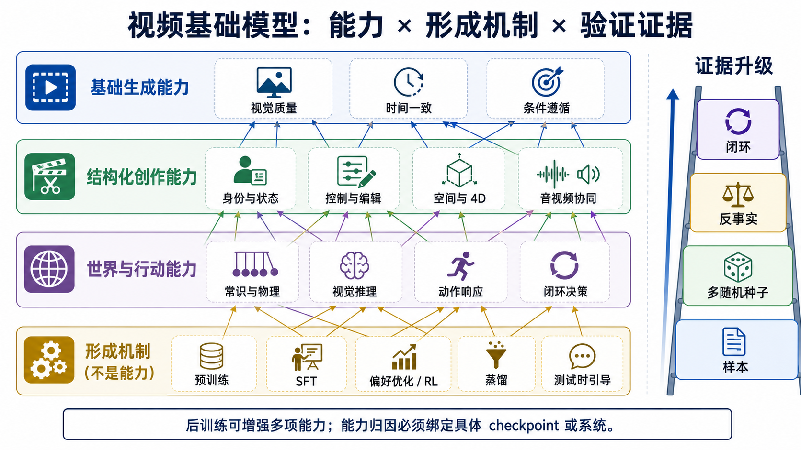

# 视频基础模型能力地图：从生成质量到世界行动

> **资料冻结：2026-09-02（Asia/Shanghai）。** 本页回答“视频基础模型会什么”，并把能力、任务接口、能力获得方式和系统属性分开。这里的能力分类是对现有 benchmark、基础模型与 World Model 文献的综合，不声称已经存在社区唯一标准；新近的 2026 工作尤其需要继续复核。

一句话结论：**物理一致性是模型输出和行为层的能力；后训练是获得、增强或重塑能力的机制。** 如果要描述基础模型是否“容易后训练”，更准确的能力名称是**可适配性 / 可对齐性**，而不是“后训练能力”。Foundation model 的核心判据本来就是广泛预训练后可适配多类下游任务，而非是否采用某一种训练算法 [[1]](#ref-1)。

## 1. 先分清四条正交轴

同一个概念只有先放对轴，后续章节才不会把“模型会什么”和“怎样训练模型”混成一棵树。

| 轴 | 回答的问题 | 例子 | 不应混入 |
|---|---|---|---|
| **能力** | 模型或系统会什么？ | 时间一致、条件遵循、物理一致、动作响应 | SFT、DPO、蒸馏 |
| **任务 / 接口** | 能力通过什么输入输出合同被调用？ | T2V、I2V、V2V、视频编辑、动作条件预测 | 把任务名直接当成内部能力 |
| **获得方式** | 能力在什么阶段、用什么信号形成？ | 预训练、CPT、SFT、偏好优化、RL、测试时引导 | 把使用某算法等同于获得某能力 |
| **系统属性** | 在什么成本、风险与服务条件下运行？ | NFE、延迟、显存、流式、安全、来源与 API | 把 4K、低延迟或过滤器归因给 base checkpoint |

例如，“物理一致性”回答的是输出是否遵守世界规律，属于能力轴；“VideoDPO”回答的是如何用偏好对更新生成器，属于获得方式；“文本到视频”是任务接口；“4 秒首帧延迟”则是系统属性。



**图 1：能力与形成机制是多对多关系。** 同一种后训练方法可改善多项能力，也可能让某些能力退化；同一项能力又可由预训练、结构条件、后训练或外部验证闭环共同提供。图中的箭头表示可能的影响，不表示固定流水线或因果保证。

## 2. 九类核心能力

VBench 将早期生成质量拆成视觉质量、时间一致和条件一致等维度 [[2]](#ref-2)；VBench-2.0 又把 Human Fidelity、Controllability、Creativity、Physics 与 Commonsense 作为更深的 intrinsic faithfulness 维度 [[3]](#ref-3)。UniVBench 则从统一模型的任务表面归纳理解、生成、编辑和重建四类操作 [[4]](#ref-4)。三者观察角度不同：前两者偏向输出属性，后者偏向任务接口。本页不直接照搬任一 benchmark，而将可跨任务复用的行为整理成 C1–C9。

### 2.1 基础生成能力

| 编号 | 能力族 | 核心子能力 | 最低可接受证据 | 不能直接推出 |
|---|---|---|---|---|
| **C1** | **生成质量与分布建模** | 单帧清晰度、纹理与结构、审美、伪影控制、样本多样性与分布覆盖 | 同一条件多随机种子；质量与覆盖分开报告；校准后人评或指标 | 条件正确、时间正确、物理正确 |
| **C2** | **语义与组合遵循** | 对象、数量、属性绑定、空间语言关系、动作绑定、否定、事件顺序和复杂情节 | 把 prompt 拆为原子事实；检查绑定与顺序；记录拒绝和改写 | 关键词出现就代表关系或动作正确 |
| **C3** | **时间动力学与长期状态** | 帧间连续、运动幅度与方向、身份持续、遮挡后恢复、不可逆状态、跨镜头记忆和长时漂移 | frame shuffle / freeze 压力测试；离场再现；按时长和镜头间隔报告退化 | 运动平滑就代表符合力学；可持续采样就代表长期可靠 |

T2V-CompBench 对组合条件的细分说明，名词命中与正确绑定不是一回事 [[5]](#ref-5)。同样，长时能力的单位不应只是“生成了多少秒”，而应看人物、道具、场景和事件状态能否跨时间继续成立。

### 2.2 结构化创作能力

| 编号 | 能力族 | 核心子能力 | 最低可接受证据 | 不能直接推出 |
|---|---|---|---|---|
| **C4** | **空间、几何与多视角一致性** | 深度、遮挡、拓扑、相机运动、同刻多视角、可渲染 3D/4D 状态 | 固定时间变相机、固定相机变时间；新视角和重投影；遮挡与 loop closure | 文本中的“左/右”正确就代表 3D 正确 |
| **C5** | **控制、编辑与个性化** | 文本可控、相机/轨迹/姿态/深度控制、局部与全局编辑、身份绑定、非目标内容保持 | 逐个加入、删除和冲突条件；同时测目标成功与非目标守恒 | UI 接受输入就代表模型使用了条件 |
| **C6** | **多模态音视频协同** | 文本—视频、文本—音频与音频—视频语义一致，事件同步、口型同步、声源/说话人绑定、跨镜头声音状态 | 单模态干预；事件级时间偏移；身份与声源绑定；静音、缺失模态和长时测试 | “输出有声音”就代表原生联合生成 |

SV4D 2.0 表明多视角与时间一致需要联合的 view–time 验证，而不能被一条相机路径替代 [[6]](#ref-6)。VABench 则把同步音视频进一步拆为跨模态语义、事件同步、口型与立体声等维度 [[7]](#ref-7)。对应任务与方法见[细粒度可控生成](tasks/controllable-video-generation.md)、[视频编辑](tasks/video-to-video.md)、[个性化视频](tasks/personalized-video-generation.md)、[多视角与 4D](tasks/multiview-4d-generation.md)和[原生音视频](tasks/native-audio-video-generation.md)。

### 2.3 世界理解与行动能力

| 编号 | 能力族 | 核心子能力 | 最低可接受证据 | 不能直接推出 |
|---|---|---|---|---|
| **C7** | **常识、物理与反事实一致性** | 对象永久性、接触与碰撞、重力、材料、连续介质、守恒、原因—结果和参数响应 | 逐规律诊断；固定初态只改变一个物理因素；检查差分方向和量级 | 单条视频看起来合理就代表学到物理定律 |
| **C8** | **视觉理解与生成式推理** | 感知、分割、视觉操作、affordance、状态推进、规则归纳、问题求解和规划 | 未见任务；最终答案与中间状态双检；固定 pass@$k$、重试和计算预算 | 生成了过程帧就证明内部存在可解释推理算法 |
| **C9** | **动作条件世界建模与决策** | 动作语义、分支未来、状态持续、不确定性、闭环响应、策略排序和真实任务收益 | 同初态动作分支；多步 rollout；闭环控制；独立环境中的 return / regret | 漂亮的未来视频就能支持正确行动 |

物理一致性本身还应分三级：**表面运动合理 → 指定规律下结果正确 → 干预后的因果差分正确**。PhyGenBench 和 VideoPhy-2 能诊断具体可见规律，但仍不能代替动作反事实或决策实验 [[8]](#ref-8) [[9]](#ref-9)；WorldModelBench 也主要评价指令、常识与可见物理违规 [[10]](#ref-10)。完整证据阶梯见[物理一致性](physical-consistency.md)。

生成模型也开始表现出零样本感知、视觉操作和问题求解行为 [[11]](#ref-11)。这些结果支持把 C8 纳入研究地图，但黑盒 prompt rewriter、best-of-$k$ 和外部 judge 都可能贡献结果，因此应写成“生成式视觉推理行为”，而不是直接声称已解释内部机制。动作世界模型则需要更强证据；V-JEPA 2 把 action-free 表征、动作条件 predictor 与规划分开，正说明能力必须归因到具体模块 [[12]](#ref-12)。

## 3. 任务不是能力，但任务会调用多项能力

| 任务表面 | 通常调用的能力 | 仍需单独声明的合同 |
|---|---|---|
| T2V / I2V | C1–C3、C7；复杂控制还需 C5 | 条件来源、seed、时长、拒绝与重试 |
| 视频编辑 / 个性化 | C2、C3、C5 | 哪些内容必须改变，哪些必须保持 |
| 多镜头故事 | C1–C5、C7 | 镜头计划、实体账本、不可逆事件和回滚 |
| 原生音视频 | C1–C3、C6、C7 | 两个模态是否联合采样，还是后配音 |
| 多视角 / 4D | C1、C3、C4 | camera–time 网格、输出是像素还是可查询状态 |
| Video Reasoning | C2、C3、C7、C8 | 答案、过程、预算和外部工具 |
| 动作条件预测 / 交互世界 | C3、C4、C7–C9 | 动作空间、反馈频率、horizon、闭环环境 |

因此，T2V、I2V 或 V2V 适合放在[任务地图](taxonomy.md)，Diffusion、Flow、AR、SFT 或 RL 适合放在[生成模型路线](generative-models.md)，C1–C9 才是“模型会什么”的统一入口。

## 4. 后训练放在哪里

后训练是**横向能力增强机制**。它只说明在预训练 checkpoint 之后又发生了优化，不说明优化了哪项能力，也不保证所有能力同时上升。

| 路线 | 直接改变谁 | 常见能力目标 | 不能自动声称 |
|---|---|---|---|
| continued pretraining / SFT | generator 权重 | 领域覆盖、条件遵循、镜头语言、某类控制接口 | 有偏好对齐、物理推理或更少采样步数 |
| reward model | 独立评价器 | 学会评价质量、运动、语义、物理或安全 | RM 训练完成就改善 generator |
| DPO / RWR / policy-gradient RL | generator 或 prompt policy | 偏好、运动、语义、物理代理、安全行为 | 算法名称本身带来通用能力；训练 reward 可兼任终评 |
| 蒸馏 / consistency / DMD | student 或采样映射 | 更少 NFE、低延迟；与 reward 合训时也可改变偏好 | 更快就等于更强、更安全或更多样 |
| test-time search / guidance / adaptation | 候选、latent 或临时参数 | 当次请求的条件满足、个性化或约束 | 冻结 base checkpoint 永久获得该能力 |
| 外部规划器 / VLM / verifier | 完整系统 | 分解、检查、重试、自我修正和闭环 | 能力可归因给单个视频生成权重 |

VideoDPO 用多维偏好构造视频生成的 DPO 训练 [[13]](#ref-13)；VideoAlign 同时比较训练期 Flow-DPO / Flow-RWR 和推理期 Flow-NRG，说明“更新权重”和“当次引导”必须分开 [[14]](#ref-14)；T2V-Turbo 把 reward 与 consistency distillation 组合，承担“偏好改善”和“少步生成”两份不同合同 [[15]](#ref-15)。完整方法、成本与 reward-hacking 审计见[视频后训练与对齐](generative-models/video-post-training-alignment.md)。

### 4.1 真正可以称为能力的是“可适配性”

若研究问题是“这个 base model 是否适合作为 foundation model”，可以把**可适配性 / 可对齐性**作为元能力，但要用结果定义，而不是用“支持 LoRA”或“做过 SFT”定义。最低报告包括：

1. 固定 base checkpoint、数据与预算，比较全参、adapter / LoRA 和冻结 backbone；
2. 报告单位数据、更新参数和训练 FLOPs 带来的 C1–C9 分项增益；
3. 测试未见任务、未见域和不同条件接口的迁移；
4. 同时报告旧能力遗忘、模式收缩、reward hacking、安全和多样性回退；
5. 将 adapter、post-trained checkpoint 与 base checkpoint 分别命名和归档。

## 5. 能力归因：base、后训练模型与产品系统必须分开

| 观察到的结果 | 正确归属 | 需要的对照 |
|---|---|---|
| base checkpoint 在冻结设置下稳定通过测试 | base 能力 | 固定 tokenizer、scheduler、seed、NFE 与条件编码器 |
| 物理 reward 后专项分数提高 | post-trained checkpoint 的 C7 行为改善 | 同 base、独立 evaluator、反事实与多样性测试 |
| VLM 生成计划、挑选候选并重试后成功 | 编排系统的 C8 / C9 能力 | 去掉 planner、judge、搜索预算的模块消融 |
| upscaler 把结果提升到 4K | 最终 pipeline 的输出规格 | 同时报 base 输出与后处理输出 |
| 服务端过滤有害请求并添加来源声明 | 服务的安全与治理属性 | 固定政策、阈值、版本、误杀/漏检与去除攻击 |

安全、鲁棒性、校准、多样性和跨域泛化应横向检查 C1–C9；延迟、显存、吞吐、能耗、流式和 provenance 则应作为系统属性单列。它们都很重要，但不宜与“物理一致性”并列成同一种认知能力。

## 6. 在本仓库中怎样使用这张地图

| 你要回答的问题 | 入口 |
|---|---|
| 模型会什么，各能力边界在哪里？ | **本页：基础模型能力地图** |
| 一个视频基础模型系统怎样从数据走到服务？ | [视频基础模型系统](foundation-models.md) |
| 一个任务允许什么输入、必须保持什么？ | [任务地图](taxonomy.md) |
| 模型内部用什么表示、目标、骨干和部署机制？ | [生成模型路线](generative-models.md) |
| 后训练到底更新谁、花费什么、改善什么？ | [视频后训练与对齐](generative-models/video-post-training-alignment.md) |
| 一项能力声明需要什么指标和证据？ | [评测指南](evaluation.md) |
| 物理、推理和动作闭环怎样逐级验证？ | [物理一致性](physical-consistency.md) · [Video Reasoning](video-reasoning.md) · [World Model](world-models.md) |

建议每篇模型或产品报告都附一张最小 claim card：

```text
能力族 C? → 任务合同 → base / post-trained / system
→ checkpoint 与预算 → 最低证据 → 失败条件 → 不能推出的结论
```

## 7. 当前最值得继续追踪的缺口

1. **C3 长时状态**：生成长度增长很快，但离场再现、不可逆状态和多镜头记忆仍缺稳定协议。
2. **C7 因果物理**：可见违规 benchmark 增多，单因素干预、参数响应与 OOD 材料仍不足。
3. **C8 生成式推理**：需要把答案、可见过程、内部去噪机制和外部搜索预算分开。
4. **C9 决策效用**：动作响应演示不能替代策略排序、闭环收益和独立环境验证。
5. **元能力可适配性**：需要统一的数据效率、更新参数、遗忘与跨能力干扰报告。
6. **归因边界**：产品越来越多地组合 prompt compiler、多个 checkpoint、音频、SR、judge 与安全模块；单模型能力更难从最终样例反推。

本页的检索范围、证据分级、纳排理由与图像检查记录见[研究日志](../sources/research_20260902_foundation_model_capabilities.md)。

## 参考文献

<a id="ref-1"></a>[1] Bommasani et al. [On the Opportunities and Risks of Foundation Models](https://arxiv.org/abs/2108.07258). arXiv preprint. 2021.

<a id="ref-2"></a>[2] Huang et al. [VBench: Comprehensive Benchmark Suite for Video Generative Models](https://openaccess.thecvf.com/content/CVPR2024/html/Huang_VBench_Comprehensive_Benchmark_Suite_for_Video_Generative_Models_CVPR_2024_paper.html). CVPR. 2024.

<a id="ref-3"></a>[3] Zheng et al. [VBench-2.0: Advancing Video Generation Benchmark Suite for Intrinsic Faithfulness](https://arxiv.org/abs/2503.21755). arXiv preprint. 2025.

<a id="ref-4"></a>[4] Wei et al. [UniVBench: Towards Unified Evaluation for Video Foundation Models](https://openaccess.thecvf.com/content/CVPR2026/html/Wei_UniVBench_Towards_Unified_Evaluation_for_Video_Foundation_Models_CVPR_2026_paper.html). CVPR. 2026.

<a id="ref-5"></a>[5] Sun et al. [T2V-CompBench: A Comprehensive Benchmark for Compositional Text-to-video Generation](https://openaccess.thecvf.com/content/CVPR2025/html/Sun_T2V-CompBench_A_Comprehensive_Benchmark_for_Compositional_Text-to-video_Generation_CVPR_2025_paper.html). CVPR. 2025.

<a id="ref-6"></a>[6] Yao et al. [SV4D 2.0: Enhancing Spatio-Temporal Consistency in Multi-View Video Diffusion for High-Quality 4D Generation](https://openaccess.thecvf.com/content/ICCV2025/html/Yao_SV4D_2.0_Enhancing_Spatio-Temporal_Consistency_in_Multi-View_Video_Diffusion_for_ICCV_2025_paper.html). ICCV. 2025.

<a id="ref-7"></a>[7] Hua et al. [VABench: A Comprehensive Benchmark for Audio-Video Generation](https://openaccess.thecvf.com/content/CVPR2026/html/Hua_VABench_A_Comprehensive_Benchmark_for_Audio-Video_Generation_CVPR_2026_paper.html). CVPR. 2026.

<a id="ref-8"></a>[8] Meng et al. [Towards World Simulator: Crafting Physical Commonsense-Based Benchmark for Video Generation](https://proceedings.mlr.press/v267/meng25c.html). ICML. 2025.

<a id="ref-9"></a>[9] Bansal et al. [VideoPhy-2: A Challenging Action-Centric Physical Commonsense Evaluation in Video Generation](https://proceedings.iclr.cc/paper_files/paper/2026/hash/c02f6a1d5c55e16db50d339dad905b4d-Abstract-Conference.html). ICLR. 2026.

<a id="ref-10"></a>[10] Li et al. [WorldModelBench: Judging Video Generation Models As World Models](https://proceedings.neurips.cc/paper_files/paper/2025/hash/4ec03ed08a3fcb59e1c815b5598beff1-Abstract-Datasets_and_Benchmarks_Track.html). NeurIPS Datasets and Benchmarks. 2025.

<a id="ref-11"></a>[11] Wiedemer et al. [Video models are zero-shot learners and reasoners](https://arxiv.org/abs/2509.20328). arXiv preprint. 2025.

<a id="ref-12"></a>[12] Assran et al. [V-JEPA 2: Self-Supervised Video Models Enable Understanding, Prediction and Planning](https://arxiv.org/abs/2506.09985). arXiv preprint. 2025.

<a id="ref-13"></a>[13] Liu et al. [VideoDPO: Omni-Preference Alignment for Video Diffusion Generation](https://openaccess.thecvf.com/content/CVPR2025/html/Liu_VideoDPO_Omni-Preference_Alignment_for_Video_Diffusion_Generation_CVPR_2025_paper.html). CVPR. 2025.

<a id="ref-14"></a>[14] Wu et al. [Improving Video Generation with Human Feedback](https://proceedings.neurips.cc/paper_files/paper/2025/hash/76227feb18ea0ee40bd15cf02c33e18e-Abstract-Conference.html). NeurIPS. 2025.

<a id="ref-15"></a>[15] Li et al. [T2V-Turbo: Breaking the Quality Bottleneck of Video Consistency Model with Mixed Reward Feedback](https://proceedings.neurips.cc/paper_files/paper/2024/hash/8a57aa8e8b57e64a42e95f7dceb0adb9-Abstract-Conference.html). NeurIPS. 2024.
