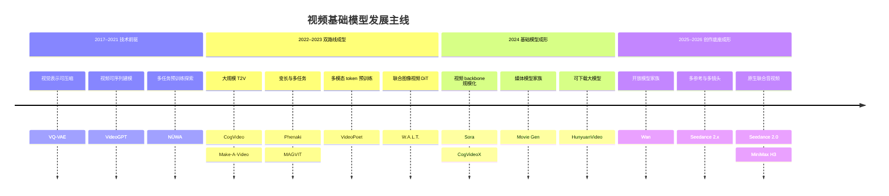

# 视频基础模型发展演进：从视觉 Token 到多模态创作系统

本章按照视频大模型如何一代代演进来组织，而不是按 tokenizer、backbone、训练目标和 decoder 横向拆解。主线是：视频先变成可压缩、可序列建模的对象，随后出现开放域文本到视频和多任务预训练，再扩展为大规模视频 backbone、模型家族，以及多参考、多镜头、原生音视频的创作底座。

本页负责解释“为什么会进入下一代”。各代表节点的 Paper / Report、Project 和官方 Code 见第 7 节快速索引；更完整的逐模型架构、Weights、Demo 与开放状态见[技术时间线](timeline.md)；autoregressive、masked、diffusion 与 flow 的训练和采样原理见[生成模型路线](generative-models.md)。

## 1. 什么变化才算进入视频大模型阶段

Foundation model 的核心不是一个固定参数门槛，而是在广泛数据上预训练一个可复用底座，再迁移到多种下游任务 [[1]](#ref-1)。对视频而言，“大模型发展”主要表现在四种扩展：

1. **数据与知识扩展**：从小型专用视频集扩展到图像、视频、文本和音频的大规模联合学习。
2. **模型与表示扩展**：从短序列生成器扩展到可处理不同时长、分辨率、宽高比和长上下文的共享 backbone。
3. **任务与条件扩展**：从单一 T2V 扩展到 I2V、编辑、延展、个性化、多参考和音视频。
4. **训练与系统扩展**：从一个论文模型扩展到基座模型、后训练、任务版本、推理优化、安全和评测组成的模型家族或平台。

| 概念 | 主要看什么 | 不能自动推出什么 |
|---|---|---|
| 单任务生成模型 | 一个明确输入输出任务 | 能迁移到其他任务 |
| 大规模视频生成器 | 参数、数据、算力和开放域生成 | 已是可复用的 foundation model |
| 视频基础模型 | 共享预训练底座、多条件或跨任务适配 | 所有能力都来自一个 checkpoint |
| 多模态创作系统 | 生成、参考、编辑、音频和安全如何协作 | 后端只有一个模型 |
| World Foundation Model | 动作条件状态转移、反事实、交互或规划 | 画面逼真就足以支持决策 |

## 2. 视频大模型发展主线

_下图是 2017–2026 年视频基础模型的精选发展路线：它展示的是每一代模型的主要转折，而不是完整的产品发布年表。_

这条路线不是“新模型取代旧模型”的直线。离散视觉语言模型和连续值 diffusion 模型长期并行；专用模型、开放权重模型和闭源创作系统也会同时存在。

## 3. 2017–2021：前置条件——视频变成可建模的序列

早期视频生成器往往面向短时预测或一个特定数据集。要把语言模型式的预训练扩展到视频，首先必须解决两件事：如何压缩巨大的时空信号，以及如何把它组织成可由共享模型处理的序列。

| 代表节点 | 这一步改变了什么 | 对大模型的意义 | 当时的边界 |
|---|---|---|---|
| VQ-VAE [[2]](#ref-2) | 把视觉内容压缩为离散 code | 让视觉可以使用类似语言 token 的建模方式 | 它是表示基础，不是成熟视频基础模型 |
| VideoGPT [[3]](#ref-3) | 用 VQ-VAE 压缩视频，再自回归预测 token | 证明 GPT 式概率建模可以直接进入视频 | 序列长、采样串行，分辨率与时长受限 |
| NÜWA [[4]](#ref-4) | 用共享框架处理文本、图像和视频合成 | 较早把“多模态预训练 + 多任务适配”作为目标 | 规模、输出质量和开放域泛化仍受限 |

这一阶段建立了视频大模型的表示与序列化前提，但还没有解决开放域文本控制、大规模训练数据和跨任务能力的问题。因此，更准确的说法是**基础模型的技术前驱**。

## 4. 2022–2023：两条可扩展路线并行成型

这一阶段的关键不是某个生成目标“赢了”，而是视频模型开始复用大规模图文先验、扩大开放域 T2V，并用一个预训练底座承载更多任务。CogVideo 用 9B 自回归 Transformer 继承图像模型 CogView2，是“大规模预训练 T2V”的重要早期节点 [[5]](#ref-5)。

| 发展路线 | 代表节点 | 大模型层面的跃迁 | 主要瓶颈 |
|---|---|---|---|
| 离散视觉语言模型 | Phenaki [[6]](#ref-6)、MAGVIT [[7]](#ref-7)、MAGVIT-v2 [[8]](#ref-8)、VideoPoet [[9]](#ref-9) | 从固定短片扩展到变长 prompt 序列、masked 多任务和文本—图像—视频—音频 token 预训练 | tokenizer 失真、序列过长、自回归或多轮 masked 解码成本 |
| 连续值 diffusion 路线 | Make-A-Video [[10]](#ref-10)、Stable Video Diffusion [[11]](#ref-11)、W.A.L.T. [[12]](#ref-12) | Make-A-Video 先把图像 diffusion 先验迁移到视频；SVD 和 W.A.L.T. 再将数据筛选、分阶段训练与图像—视频 latent diffusion 组织成可扩展路线 | 多步采样、训练成本、长时一致性，以及进入 latent 后的压缩细节损失 |

这两条路线都可以使用 Transformer；分水岭是模型预测离散 code，还是学习连续值去噪。它们也没有互相替代：前者强调统一的 token 序列，后者在高保真视频与并行训练上成为后续规模化路线的主力。速度场和 Flow Matching 的规模化应用，则在 Movie Gen 等后续模型中更清晰。

从大模型角度看，这一代最重要的改变是：**图像预训练、视频运动学习、多任务条件和数据工程开始被组织成可扩展的预训练方案**，而不再只是一个特定 benchmark 的生成器。

## 5. 2024：视频基础模型规模化与系统化

在前一阶段，“大”主要体现为更多数据、更大模型和开放域 T2V。2024 年以后，规模化开始同时要求可变时长与尺寸、高质量 caption、数据治理、分阶段训练、任务后训练、推理优化和安全评测。模型开始从“一个 T2V checkpoint”变成共享底座、任务版本和系统模块组成的完整生态。

| 代表节点 | 这一代的主要变化 | 为什么属于基础模型发展 | 必须保留的边界 |
|---|---|---|---|
| Sora [[13]](#ref-13) | 在压缩视频 latent 上使用空时 patch 和 diffusion Transformer，统一处理不同时长、分辨率与宽高比 | 将语言模型式的大规模数据、参数和计算扩展明确带入视频生成 | 公开的是技术报告与 demo，并未披露完整训练方案或权重 |
| CogVideoX [[14]](#ref-14) | 以 3D VAE、expert Transformer、渐进训练和多分辨率 frame packing 组成代码与权重可下载的视频 DiT | 提供了可研究的大规模视频 backbone 与数据工程路线 | 作者评测下的领先不等于跨协议、跨数据集的普遍优势；不同 checkpoint 的许可也需单独核对 |
| Movie Gen [[15]](#ref-15) | Movie Gen Video 使用 Flow Matching 并通过后训练扩展到个性化与编辑；Movie Gen Audio 是独立的视频到音频模型 | 明确把单个生成器扩展为“媒体基础模型家族” | 论文是一组模型，不是一个 checkpoint 完成全部任务 |
| HunyuanVideo [[16]](#ref-16) | 把大型视频 Transformer、数据处理、训练基础设施与开放权重组成系统框架 | 缩小了开放研究与闭源规模化系统的差距 | 开放代码和权重不等于训练数据与完整配方全部开放 |

这一代确立了“视频基础模型”的主要形态：一个大规模预训练底座被多种条件和任务复用，但最终产品仍可以由多个 checkpoint、decoder、超分和安全模块组成。这也为 2025 年以后的模型家族与多模态创作系统铺平了路径。

## 6. 2025–2026：从模型家族到多模态创作底座

2025 年出现了两个并行信号：一边是可下载的视频模型家族继续扩大，另一边是原生音视频开始进入闭源产品。完整的同期节点与官方来源见[技术时间线](timeline.md)。2026 年的主要变化，则是把多参考、多镜头、音频、延展和局部编辑进一步放进共同的创作上下文。

| 代表节点 | 大模型层面的跃迁 | 当前证据边界 |
|---|---|---|
| Wan 2.1 [[17]](#ref-17) | 以不同规模、任务 checkpoint 和扩展覆盖 T2V、I2V 与编辑等能力 | 任务能力由不同权重或扩展承担，不能笼统归给一个 checkpoint |
| Seedance 2.0 [[18]](#ref-18) | 在同一创作语境中接收文本、图像、视频和音频参考，联合生成画面与音频 | 有官方模型报告，但没有公开完整代码和权重 |
| MiniMax H3 [[19]](#ref-19)、[[20]](#ref-20) | 把文本、图像、视频和音频组织为多模态上下文，并联合预测视频与双声道音频 latent | 完整托管系统、已开放的 H3-Base checkpoint 和未开放组件必须分开记录 |
| Seedance 2.5 [[21]](#ref-21) | 进一步强调长叙事、大量参考素材、延展和时间轴编辑 | 本页依据的是厂商官方发布，不将宣传性能力直接写成独立复现结论 |

资料核查截止日期为 **2026-08-29**。这一阶段应被理解为“多模态创作系统的形成”，不是“所有能力已在一个 checkpoint 中统一”，更不是“已经成为可用于决策的 World Model”。

## 7. 代表模型的 Paper、Project 与 Code

下表只列作者或机构的一手入口。`Code` 只标记官方实现；“官方相关实现”表示它能解释或运行核心组件，但不是完整论文复现。`未公开` 表示截至 **2026-08-29** 未发现一手公开实现，不代表团队内部没有代码。社区复现、Weights、Demo 和许可证见[技术时间线](timeline.md)与[开放模型索引](../resources/open-models.md)。

| 模型 | Paper / Report | Project | Code |
|---|---|---|---|
| 2017 · VQ-VAE | [Paper](https://arxiv.org/abs/1711.00937) | [DeepMind overview](https://deepmind.google/blog/deepmind-papers-at-nips-2017/) | [Sonnet module](https://github.com/google-deepmind/sonnet/blob/v2/sonnet/src/nets/vqvae.py)（官方相关实现） |
| 2021 · VideoGPT | [Paper](https://arxiv.org/abs/2104.10157) | [Project](https://wilsonyan.com/videogpt/index.html) | [Code](https://github.com/wilson1yan/VideoGPT) |
| 2021 · NÜWA | [Paper](https://arxiv.org/abs/2111.12417) | [Project](https://github.com/microsoft/NUWA)（已归档） · [Overview](https://www.microsoft.com/en-us/research/articles/nuwa/) | 未公开 |
| 2022 · CogVideo | [Paper](https://arxiv.org/abs/2205.15868) | [Model page](https://models.aminer.cn/cogvideo/) | [Code](https://github.com/zai-org/CogVideo/tree/CogVideo) |
| 2022 · Make-A-Video | [Paper](https://arxiv.org/abs/2209.14792) | [Project](https://makeavideo.studio/) | 未公开 |
| 2022 · Phenaki | [Paper](https://arxiv.org/abs/2210.02399) | [Project](https://sites.research.google/gr/phenaki/) | 未公开 |
| 2022 · MAGVIT | [Paper](https://arxiv.org/abs/2212.05199) | [Project](https://magvit.cs.cmu.edu/) | [Code](https://github.com/google-research/magvit)（已归档） |
| 2023 · MAGVIT-v2 | [Paper](https://arxiv.org/abs/2310.05737) | [Project](https://magvit.cs.cmu.edu/v2/) | 未公开；MAGVIT v1 仓库不是 v2 实现 |
| 2023 · Stable Video Diffusion | [Paper](https://arxiv.org/abs/2311.15127) | [Official release](https://stability.ai/news/stable-video-diffusion-open-ai-video-model) | [Code](https://github.com/Stability-AI/generative-models) |
| 2023 · W.A.L.T. | [Paper](https://arxiv.org/abs/2312.06662) | [Project](https://walt-video-diffusion.github.io/) | 未公开 |
| 2023 · VideoPoet | [Paper](https://arxiv.org/abs/2312.14125) | [Project](https://sites.research.google/videopoet/) | 未公开 |
| 2024 · Sora | [Technical report](https://openai.com/index/video-generation-models-as-world-simulators/) | [Official release](https://openai.com/index/sora-is-here/) | 未公开 |
| 2024 · CogVideoX | [Paper](https://arxiv.org/abs/2408.06072) | [Project](https://yzy-thu.github.io/CogVideoX-demo/) | [Code](https://github.com/zai-org/CogVideo) |
| 2024 · Movie Gen | [Paper](https://arxiv.org/abs/2410.13720) | [Project](https://ai.meta.com/research/movie-gen/) | 未公开 |
| 2024 · HunyuanVideo | [Paper](https://arxiv.org/abs/2412.03603) | [Project](https://aivideo.hunyuan.tencent.com/) | [Code](https://github.com/Tencent-Hunyuan/HunyuanVideo) |
| 2025 · Cosmos（并行分支） | [Paper](https://arxiv.org/abs/2501.03575) | [Project](https://research.nvidia.com/labs/cosmos-lab/) | [Code](https://github.com/NVIDIA/Cosmos) |
| 2025 · Wan 2.1 | [Paper: Wan](https://arxiv.org/abs/2503.20314) | [Project](https://wan.video/) | [Code](https://github.com/Wan-Video/Wan2.1) |
| 2026 · Seedance 2.0 | [Paper](https://arxiv.org/abs/2604.14148) | [Project](https://seed.bytedance.com/seedance2_0) | 未公开 |
| 2026 · MiniMax H3 | 完整 Technical Report 待发布 | [Official release](https://www.minimax.io/blog/minimax-h3) | [Code](https://github.com/MiniMax-AI/MiniMax-H3)（H3-Base 推理；完整系统未全开放） |
| 2026 · Seedance 2.5 | 独立论文未公开 | [Official release](https://seed.bytedance.com/en/blog/one-take-creation-flexible-referencing-introducing-seedance-2-5) · [Project](https://seed.bytedance.com/seedance2_5) | 未公开 |

## 8. 回看历史：五条能力轴怎样逐步形成

视频大模型的发展不能只用分辨率、时长或参数量排成一个榜单。从上述历史回看，五种能力是在不同阶段逐渐累积的。

| 能力轴 | 早期转折 | 基础模型阶段的扩展 | 必须单独验证什么 |
|---|---|---|---|
| 开放式 T2V | CogVideo、Make-A-Video 扩展开放域文本控制 | Sora、HunyuanVideo、Wan 把大规模训练与可变时空输出结合 | 组合语义、动作顺序、镜头遵循和长尾概念 |
| 多条件与多参考 | MAGVIT、VideoPoet 扩大条件与任务类型 | Seedance 2.0、H3 把图像、视频和音频参考放进同一创作语境 | 每个条件是否独立生效，组合时是否冲突 |
| 源视频保持与可寻址编辑 | [视频编辑路线](tasks/video-to-video.md)从光流/atlas、Tune-A-Video、FateZero 发展到 TokenFlow 等传播、inversion 与 feature control | Movie Gen、Wan、VACE 等把 V2V、mask、reference 和 instruction 纳入基础模型或模型家族 | 编辑是否成功、未编辑区域是否保持、跨帧/跨轮是否一致 |
| 多段 prompt、storyboard 与跨镜头连续 | Phenaki 展示 prompt 序列和分段延展 | Seedance 2.5 进一步把长叙事、参考和时间轴编辑放入工作流 | 人物、场景、对象状态和事件关系是否持续 |
| 原生联合音视频 | VideoPoet、Movie Gen 提供多模态或视频到音频前驱 | Seedance 2.0、H3 将联合音视频生成放到核心能力 | 内容对应、声画同步、说话人身份和长时音频连续性 |

因此，多参考不等于多镜头，接受音频条件不等于原生联合生成，生成更长视频也不等于拥有可寻址、可更新的 persistent memory。

## 9. 从历史看“统一模型”的五种含义

| 统一层级 | 实际共享什么 | 历史中的常见形态 | 不能据此推出什么 |
|---|---|---|---|
| 统一接口 | 同一 UI 或 API | 创作系统接受多种素材 | 后端只有一个模型 |
| 统一流水线 | caption、tokenizer、调度、超分或安全模块 | 多个任务复用部分系统组件 | 生成 backbone 相同 |
| 共享 backbone | 多任务共用主要网络参数 | MAGVIT 式多任务建模 | 所有任务都零样本完成 |
| 模型家族 | 共享架构、数据基础或训练方法 | Movie Gen、Wan 的不同任务或规模版本 | 存在一个万能 checkpoint |
| 单一 checkpoint | 同一组核心权重处理多种条件或任务 | 需通过权重清单和固定权重实验证明 | 各项能力同等成熟或无需外部模块 |

这个区分在大模型后期尤其重要：模型家族和系统越完整，用户越容易把“产品能做什么”误写成“一组权重原生学会了什么”。

## 10. 并行分支：视频基础模型不会自动演化成 World Model

大规模视频预训练能提供强大的视觉与运动先验，但 camera control、prompt steerability 或逼真视频都不足以证明动作动力学。World Foundation Model 是在共享视觉底座上加入动作、状态转移、反事实、交互和规划证据的并行分支，不是创作模型按时间自然到达的“下一级”。

最低证据链应从动作敏感性开始，逐步检查状态持久、反事实一致、连续交互，最后再证明它能在独立环境中改善规划或控制。只有开环视频质量、camera control 或实时 demo，都不足以完成这条证据链。

Cosmos 将 tokenizer、生成模型、数据处理、guardrail 和后训练工具放入 Physical AI 平台 [[22]](#ref-22)，但平台范围不等于每个 checkpoint 已通过机器人闭环验证。动作、memory、planning 和交互模型的完整路线见[World Model 专章](world-models.md)，物理声明见[物理一致性](physical-consistency.md)。

## 11. 怎样判断“下一代”真的进步了

大模型的发展史不应只由官方 demo、分辨率或参数量定义。若声称进入了新一代，至少应做三类对照：

- **底座是否更通用**：固定核心权重，比较零样本、少样本或后训练迁移，而不是数同一产品的 demo 数量。
- **能力是否真的提升**：在同一提示集、采样数和生成预算下比较；多参考要做组合、删除和冲突条件测试，长视频要随 horizon 追踪身份、对象状态和事件。
- **开放范围是否清楚**：分别列出代码、权重、数据、配方、许可证和托管模块，不用“开源”一个标签概括。

完整的指标、统计单位、生成预算和人工评测协议见[评测指南](evaluation.md)。目前跨阶段仍未解决的共同问题是：压缩率与运动细节、多任务统一与专门化、长上下文与持久状态、开放生成与精确控制、生成质量与计算成本，以及数据来源、版权、人物同意和内容安全。

## 最小阅读路径与相邻章节

### 按大模型发展阅读

1. **VQ-VAE → VideoGPT → NÜWA**：理解视频如何变成可压缩、可序列建模、可多任务预训练的对象。
2. **CogVideo → MAGVIT / VideoPoet → W.A.L.T.**：观察大规模 T2V、离散多模态预训练和连续 latent DiT 如何并行成型。
3. **Sora → Movie Gen → HunyuanVideo / Wan**：理解规模化 backbone 怎样扩展为模型家族、后训练和开放生态。
4. **Seedance 2.0 / 2.5 → MiniMax H3**：理解多参考、多镜头、编辑和原生音视频如何汇入多模态创作底座，同时区分论文、官方发布与实际开放组件。

### 继续深入

- 按输入输出找任务：[任务地图](taxonomy.md)。
- 追踪编辑从传播工具到基础模型核心能力的演化：[视频编辑与 milestones](tasks/video-to-video.md)。
- 学习具体生成目标：[生成模型路线](generative-models.md)。
- 查完整年表与资源：[技术时间线](timeline.md)、[引用与代码索引](bibliography.md)、[开放模型与代码](../resources/open-models.md)。
- 进入动作、状态和规划：[World Model 专章](world-models.md)。
- 设计可复现实验：[评测指南](evaluation.md)与[数据集索引](../resources/datasets.md)。

## 参考文献

[1] [On the Opportunities and Risks of Foundation Models](https://arxiv.org/abs/2108.07258). Rishi Bommasani, Drew A. Hudson, Ehsan Adeli, Russ Altman, Simran Arora, Sydney von Arx, et al. arXiv preprint. 2021.

[2] [Neural Discrete Representation Learning](https://arxiv.org/abs/1711.00937). Aaron van den Oord, Oriol Vinyals, Koray Kavukcuoglu. NeurIPS. 2017.

[3] [VideoGPT: Video Generation using VQ-VAE and Transformers](https://arxiv.org/abs/2104.10157). Wilson Yan, Yunzhi Zhang, Pieter Abbeel, Aravind Srinivas. arXiv preprint. 2021.

[4] [NÜWA: Visual Synthesis Pre-training for Neural visUal World creAtion](https://arxiv.org/abs/2111.12417). Chenfei Wu, Jian Liang, Lei Ji, Fan Yang, Yuejian Fang, Daxin Jiang, et al. ECCV. 2022.

[5] [CogVideo: Large-scale Pretraining for Text-to-Video Generation via Transformers](https://arxiv.org/abs/2205.15868). Wenyi Hong, Ming Ding, Wendi Zheng, Xinghan Liu, Jie Tang. ICLR. 2023.

[6] [Phenaki: Variable Length Video Generation from Open Domain Textual Descriptions](https://arxiv.org/abs/2210.02399). Ruben Villegas, Mohammad Babaeizadeh, Pieter-Jan Kindermans, Hernan Moraldo, Han Zhang, Mohammad Taghi Saffar, et al. ICLR. 2023.

[7] [MAGVIT: Masked Generative Video Transformer](https://arxiv.org/abs/2212.05199). Lijun Yu, Yong Cheng, Kihyuk Sohn, José Lezama, Han Zhang, Huiwen Chang, et al. CVPR. 2023.

[8] [Language Model Beats Diffusion -- Tokenizer is Key to Visual Generation](https://arxiv.org/abs/2310.05737). Lijun Yu, José Lezama, Nitesh B. Gundavarapu, Luca Versari, Kihyuk Sohn, David Minnen, et al. ICLR. 2024.

[9] [VideoPoet: A Large Language Model for Zero-Shot Video Generation](https://arxiv.org/abs/2312.14125). Dan Kondratyuk, Lijun Yu, Xiuye Gu, José Lezama, Jonathan Huang, Grant Schindler, et al. ICML. 2024.

[10] [Make-A-Video: Text-to-Video Generation without Text-Video Data](https://arxiv.org/abs/2209.14792). Uriel Singer, Adam Polyak, Thomas Hayes, Xi Yin, Jie An, Songyang Zhang, et al. ICLR. 2023.

[11] [Stable Video Diffusion: Scaling Latent Video Diffusion Models to Large Datasets](https://arxiv.org/abs/2311.15127). Andreas Blattmann, Tim Dockhorn, Sumith Kulal, Daniel Mendelevitch, Maciej Kilian, Dominik Lorenz, et al. arXiv preprint. 2023.

[12] [Photorealistic Video Generation with Diffusion Models](https://arxiv.org/abs/2312.06662). Agrim Gupta, Lijun Yu, Kihyuk Sohn, Xiuye Gu, Meera Hahn, Li Fei-Fei, et al. ECCV. 2024.

[13] [Video Generation Models as World Simulators](https://openai.com/index/video-generation-models-as-world-simulators/). OpenAI. Technical report. 2024.

[14] [CogVideoX: Text-to-Video Diffusion Models with An Expert Transformer](https://arxiv.org/abs/2408.06072). Zhuoyi Yang, Jiayan Teng, Wendi Zheng, Ming Ding, Shiyu Huang, Jiazheng Xu, et al. ICLR. 2025.

[15] [Movie Gen: A Cast of Media Foundation Models](https://arxiv.org/abs/2410.13720). Adam Polyak, Amit Zohar, Andrew Brown, Andros Tjandra, Animesh Sinha, Ann Lee, et al. arXiv preprint. 2024.

[16] [HunyuanVideo: A Systematic Framework For Large Video Generative Models](https://arxiv.org/abs/2412.03603). Weijie Kong, Qi Tian, Zijian Zhang, Rox Min, Zuozhuo Dai, Jin Zhou, et al. arXiv preprint. 2024.

[17] [Wan: Open and Advanced Large-Scale Video Generative Models](https://arxiv.org/abs/2503.20314). Team Wan, Ang Wang, Baole Ai, Bin Wen, Chaojie Mao, Chen-Wei Xie, et al. arXiv preprint. 2025.

[18] [Seedance 2.0: Advancing Video Generation for World Complexity](https://arxiv.org/abs/2604.14148). Team Seedance, De Chen, Liyang Chen, Xin Chen, Ying Chen, Zhuo Chen, et al. arXiv preprint. 2026.

[19] [MiniMax H3: An Open Model Breaking the Boundaries Between Tasks and Modalities](https://www.minimax.io/blog/minimax-h3). MiniMax. Official release. 2026.

[20] [MiniMax H3 Is Now Open Source](https://www.minimax.io/news/minimax-h3-open-source). MiniMax. Official release. 2026.

[21] [One-take Creation, Flexible Referencing: Introducing Seedance 2.5](https://seed.bytedance.com/en/blog/one-take-creation-flexible-referencing-introducing-seedance-2-5). ByteDance Seed Team. Official release. 2026.

[22] [Cosmos World Foundation Model Platform for Physical AI](https://arxiv.org/abs/2501.03575). Niket Agarwal, Arslan Ali, Maciej Bala, Yogesh Balaji, Erik Barker, Tiffany Cai, et al. arXiv preprint. 2025.
