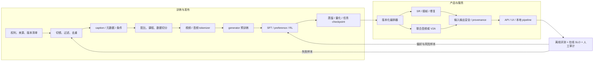
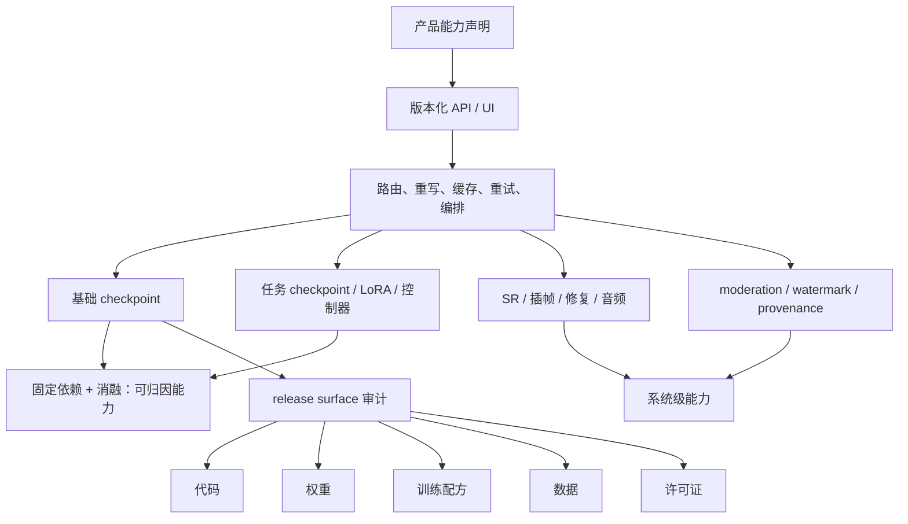

# 视频基础模型：从数据引擎到可审计生成系统

> **资料冻结：2026-08-30。** 本章把论文机制、单个 checkpoint、模型家族、产品系统和托管 API 分开陈述。动态开放状态均以该日期的官方仓库、模型卡、许可证或产品页为准；作者 benchmark 和产品能力不是独立复现结论。

视频基础模型不是“一个更大的 T2V 网络”，而是一条可复用、可后训练、可部署且可审计的链：数据治理产生训练语料，captioner 把视觉事实和创作语言对齐，tokenizer 决定学习空间，generator 学习条件分布，后训练与蒸馏改变行为和成本，超分、插帧、音频、安全及 API 再把 checkpoint 变成服务。Foundation model 的判据是广泛预训练后可跨任务适配，而非固定参数门槛 [[1]](#ref-1)。

本章回答“一个视频基础模型系统怎样成立、证据应归因给哪一层”。表示、factorization、objective、backbone 与 deployment 的正交机制见[生成模型路线](generative-models.md)，其中连续 latent、离散 token、量化与生成式压缩的表示合同见[视频 Tokenizer 与生成式压缩](generative-models/video-tokenizers.md)，Video DiT 的 token 预算、attention topology、条件融合、3D 位置、noise-time MoE、并行与 cache 见[骨干扩展专章](generative-models/video-dit-backbones.md)，causal codec→generator→commit→SLO 的部署合同见[因果、流式与实时](generative-models/causal-streaming-generation.md)；SFT/reward/DPO/RL 的细分见[视频后训练与对齐](generative-models/video-post-training-alignment.md)，相机/轨迹/姿态/几何条件见[细粒度可控生成](tasks/controllable-video-generation.md)，相机 × 世界时间、多视角网格与可渲染动态状态见[多视角与 4D](tasks/multiview-4d-generation.md)，联合声画合同见[原生音视频生成](tasks/native-audio-video-generation.md)，逐年节点见[技术时间线](timeline.md)，动作条件、状态与规划证据见[World Model 专章](world-models.md)。

## 1. 先固定研究对象与证据单位

同一产品名常同时指模型、模型家族和服务。比较之前必须先固定实体，否则“支持 2K”“原生音频”或“已开源”都可能错误落到一个 checkpoint 上。

| 单位 | 可核验对象 | 可以回答 | 不能自动推出 |
|---|---|---|---|
| 论文机制 | 目标函数、结构、训练/推理算法 | 某个机制在论文协议内是否有效 | 官方代码存在、产品正在使用、结论可跨协议泛化 |
| 单 checkpoint | 权重哈希、配置、tokenizer、精度 | 固定权重能处理哪些输入输出 | 同家族其他权重、LoRA、upscaler 或路由器的能力 |
| 模型家族 | 多个尺寸、任务或蒸馏版本 | 架构与训练资产怎样复用 | 存在一个“万能 checkpoint” |
| 产品系统 | 编排、多个模型、检索/重写、后处理、安全 | 用户端最终能完成什么 | 能力由基础权重单独提供 |
| 开放实现 | 代码、权重、训练配方、数据、许可证的交集 | 第三方实际能运行或复训什么 | 仓库可见就等于完整训练可复现或可商用 |
| API | 端点、输入输出 schema、版本、SLO 与政策 | 某日可调用的服务能力 | 后端权重、训练配方或长期稳定性已公开 |

因此，本章使用“Paper / Artifact / Service”三条证据线：

1. **Paper**：正式会议论文优先，其次为预印本或技术报告；只支持其中明确实验过的机制与结果。
2. **Artifact**：官方仓库、模型卡、权重清单、变更日志与许可证；决定实际 release surface。
3. **Service**：官方产品页、API 文档和系统卡；决定托管能力，但不反推单个开放权重。

## 2. 端到端闭环：checkpoint 只是中间件

图的顺序文字替代：

1. 先冻结素材权利、来源和版本，再做切镜、质量/安全过滤与近重复去除。
2. captioner 和元数据管线把镜头、主体、动作、摄影与音频条件结构化，随后按任务、时长和质量分层采样。
3. tokenizer 把视频/音频编码为紧凑表示，generator 在该表示空间预训练；只有含量化、概率模型、熵编码与可解码 bitstream 的 codec 才能把这种紧凑性报告为实际码率。SFT、偏好优化或 RL 再改变条件遵循和输出分布。
4. 蒸馏、量化和任务适配产生可部署 checkpoint；编排器还可能调用超分、插帧、修复和独立音频模块。
5. 输入/输出安全、来源声明和版本化 API 形成服务面；离线评测、在线 SLO 与事故样本回流到数据和后训练。

*系统栈细化图。它表达组件和证据边界，不代表所有产品都采用同一实现，也不把最终输出能力归因给单个基础权重；制作依据与元素级来源见[图示研究日志](../sources/research_20260830_modern_video_system_schematic.md)。*

系统栈细化图的顺序文字替代：

1. 先治理和整理多模态数据，再进入模型训练。
2. 把视频编码为连续 latent 或离散 token，但不预设 generator objective。
3. 在带条件的共享 generator 中选择全序列处理或滚动递归 rollout。
4. 对 generator 做后训练与加速；只有所选蒸馏方法需要时才使用训练期判别器反馈。
5. 解码并按需做超分、插帧或音频同步；decoder 的 adversarial loss 是重建目标，不是 rollout 机制。
6. 在安全与 provenance 控制后部署，同时报告质量和系统证据。
7. 归因产品能力前，逐项审计 release surface 与 checkpoint 边界。

SkyReels-V2 披露了较完整的实例：切镜与多级过滤、去重、专家 caption 蒸馏、渐进预训练、概念均衡 SFT、运动偏好优化、Diffusion Forcing 和高质量 SFT [[2]](#ref-2)。Open-Sora 2.0 报告了数据金字塔、多过滤器、多源 caption、Video DC-AE、flow matching 与蒸馏初始化 [[3]](#ref-3)。Cosmos 则把数据 curator、tokenizer、生成模型、后训练与 guardrail 放进 Physical AI 平台 [[4]](#ref-4)。这些是一手系统报告，不意味着三者公开了相同的数据、权利清单或可复训程度。

## 3. 数据引擎：质量、覆盖与可追责同时优化

原始视频越多不等于训练集越好。视频数据引擎至少同时优化四个目标：法律与伦理可用性、视觉/运动质量、条件可学习性、分布覆盖。只公开过滤阈值而不公开数据版本、去重范围和切分策略，仍无法复核污染或复现训练。

| 环节 | 典型操作 | 最低验收证据 | 常见失败 |
|---|---|---|---|
| 来源与权利 | 来源类别、授权基础、人物同意、地域与删除策略 | 数据卡、来源占比、版本号、可撤回流程 | “公开可访问”被误写成“可训练/可商用” |
| 切镜与标准化 | shot boundary、解码、帧率/色彩/音频规范化 | 工具版本、阈值、失败率与样本审计 | 把跨镜头跳变当作运动；音画错位 |
| 质量与安全过滤 | 黑帧、静帧、模糊、抖动、OCR、水印、拼接、NSFW、身份风险 | 每级保留率、分层抽样 precision/recall | 过滤器偏好“漂亮但静止”，压低真实运动覆盖 |
| 去重与污染控制 | URL/hash、感知指纹、视觉 embedding、片段级近重复 | 去重域、阈值、聚类抽检、train/test 交叉去重 | 只去完全重复；同源裁切仍跨切分泄漏 |
| caption 与元数据 | 主体、动作、时序、镜头、风格、文字、声音 | captioner 版本、提示模板、人工一致率、幻觉率 | caption 省略时序、编造物体或泄露评测标签 |
| 配比与课程 | 图像/视频、时长、分辨率、语言、任务、质量桶 | 每阶段 mixture 与采样权重 | 高质量短片淹没长时结构；稀有动作被过采样噪声主导 |
| 数据切分 | 按来源、人物、事件或语义簇划分 | 不可逆 split manifest、泄漏审计 | 同一人物/事件的近重复进入训练与评测 |

captioner 不是中性标注工具，而是第二个学习系统。SkyReels-V2 用通用 VLM 与镜头、表情、摄影专家构造教师，再蒸馏统一 captioner；Open-Sora 2.0 在不同分辨率阶段使用不同 caption 来源 [[2]](#ref-2) [[3]](#ref-3)。因此必须保存 captioner checkpoint、prompt、采样参数和重写链；否则所谓“文本理解提升”可能只是标注分布改变。

数据集与现成 benchmark 入口见[数据集索引](../resources/datasets.md)。产品验收还需增加权利删除回放：删除一个来源后，应能定位受影响 shard、训练 run、adapter 和已发布版本，而不只是从搜索页面移除链接。

## 4. Tokenizer 与 generator：表示瓶颈决定上限

视频系统通常不在像素域直接生成，而先编码为离散或连续时空 latent。VQ-VAE 建立了离散视觉 code 的基础 [[5]](#ref-5)；MAGVIT 将 masked video token 建模扩展为多任务生成 [[6]](#ref-6)，VideoPoet 又把文本、图像、视频与音频 token 放入自回归多模态序列 [[7]](#ref-7)。另一条主流路线使用连续 VAE latent、DiT 与 diffusion/flow；CogVideoX 是公开研究中的代表 [[8]](#ref-8)。

| 层 | 主要选择 | 对系统的影响 | 不能只看什么 |
|---|---|---|---|
| 视频 tokenizer | 离散 code 或连续 latent；因果/双向；时空网格、dtype 与元素/token 预算；有真实 bitstream 时才含码率 | 序列长度、重建细节、流式可用性、generator 成本 | 单张重建图、平均 PSNR，或把 tensor shape 当作 bpp/bitrate |
| 音频 tokenizer | codec token 或连续 VAE latent；采样率与帧率 | 口型同步、音乐节拍、跨模态 attention 成本 | 音频是否“听起来有声” |
| 条件编码 | 文本编码器、视觉参考、mask、轨迹、相机与音频 | 可控范围、条件冲突、显存与缓存 | UI 能上传某种素材 |
| generator | AR/masked/diffusion/flow factorization/objective；U-Net、full/factorized/sparse/linear/hybrid Video DiT backbone | 质量—延迟、条件融合、可缓存性、长时漂移 | “Transformer”“flow”或“linear”单标签 |
| decoder | 单阶段或分层 VAE、tile decode、细节模块 | 实际分辨率、边界伪影、峰值显存 | base latent 的名义尺寸 |

tokenizer 的验收必须同时覆盖：静态纹理、快速运动、镜头切换、细线与文字、人脸、循环重编码、长片漂移和音画对齐；还应把 tokenizer 重建与下游 generator 质量拆开归因。没有量化、概率模型、熵编码与可解码 bitstream 时，只报告 latent/token 的精确 shape、dtype、时空网格及元素/token 数，不报告 bpp 或 bitrate。完整定义、预算口径与对照实验见[视频 Tokenizer 与生成式压缩](generative-models/video-tokenizers.md)。2026 年的 V-RAE 与 VideoRAE 预印本进一步主张 latent 应同时服务语义可学习性与生成，而非只追求像素重建 [[9]](#ref-9) [[10]](#ref-10)；这是值得验证的前沿假设，不是已经形成的正式共识。

架构命名也不能替代机制分解。例如 Wan2.2-A14B 的 MoE 专家按去噪时间 $\tau$ 阶段路由，而 TI2V-5B 使用更紧凑的 VAE 表示；两者属于同一产品家族，但不是同一 checkpoint 的两个开关 [[11]](#ref-11)。Expert AdaLN、MMDiT/dual→single stream 和 noise-time MoE 也分别属于模态归一化、条件融合与专家路由，不能因都出现“expert/stream”就合并。详细五轴分类与公式见[生成模型路线](generative-models.md)，表示层的量化与 codec 边界见[视频 Tokenizer 与生成式压缩](generative-models/video-tokenizers.md)，骨干内部与执行层分账见[Video DiT 专章](generative-models/video-dit-backbones.md)。

## 5. 预训练之后：行为、成本与最终画面来自不同阶段

### 5.1 后训练与偏好优化

预训练学习广覆盖分布，后训练把概率质量移向产品目标。常见顺序是高质量/概念均衡 SFT，再用人工或合成 pair 训练 reward、DPO 或 RL，最后以困难样本回流。Step-Video 报告了从图像到低/高分辨率视频预训练、SFT 和 Video-DPO 的级联 [[12]](#ref-12)；SkyReels-V2 则明确把运动特定偏好阶段与后续长视频、HQ-SFT 分开 [[2]](#ref-2)。

验收不能只报总偏好胜率。至少分解为文本事实、动作幅度、时序顺序、镜头遵循、主体一致、物理约束、安全和多样性；还要做 reward hacking、模式收缩、拒答率和不同人群偏差测试。2026 年的系统化视频后训练仍主要是预印本证据 [[13]](#ref-13)，应保留独立复现空白。

后训练的反馈来源、优化时点、reference policy、去噪轨迹信用分配、离线/在线边界和独立验收矩阵见[视频后训练与对齐专章](generative-models/video-post-training-alignment.md)。

### 5.2 蒸馏与部署优化

“蒸馏版”可能改变步数、CFG、模型大小、因果方向或输出分布，不能与 base checkpoint 混报。CausVid 把双向 teacher 蒸馏成少步因果 student，展示了质量、时间 factorization 和部署优化的耦合 [[14]](#ref-14)；LTX、HunyuanVideo-1.5、Wan 与 MAGI 又各自发布了不同粒度的蒸馏或任务资产。

每个部署变体至少单列：teacher、student、目标函数、sampling steps 与 hook 得到的真实 NFE、guidance、精度、量化、分辨率/帧数、峰值显存、首帧延迟、稳态吞吐和质量损失。若声称 streaming，还要冻结 commit 单元/hash、lookahead、revision、条件生效点、backpressure 与 cache reset；只报“实时”而没有硬件、batch、预热、编解码、负载、尾延迟和恢复口径，不构成系统结论。

### 5.3 SR、插帧与 refinement

最终像素常由额外阶段产生：

- 空间 SR 提升分辨率，但可能重绘文字、人脸和微小物体；
- 时间插帧提高帧率，但不能补回 generator 未建模的动作因果；
- 关键帧/detailing、局部修复或二次去噪可提升观感，却增加条件漂移与延迟；
- tiled VAE decode 解决显存和大画布解码，不等同于 base generator 在全画布上直接去噪。

因此应同时报告 base 输出和最终输出。LTX-2 v1.3.0 的 4K 是 DFR 管线中的 tiled spatial epilogue 与解码更新，不是“LTX-2.5 22B 单 checkpoint 原生 4K”的证据 [[15]](#ref-15)。HunyuanVideo-1.5 的 few-step SR 也是独立模块；官方 roadmap 中仍未勾选的资产不能因配置文件存在而记为已发布 [[16]](#ref-16)。

### 5.4 音频的三种系统含义

| 形态 | 条件与输出 | 代表 | 必须验证 |
|---|---|---|---|
| 独立 V2A | 先生成视频，再由另一模型配音 | Movie Gen Audio [[17]](#ref-17) | 音频不反向约束画面；跨镜头连续与同步 |
| 双 backbone 联合生成 | 视频与音频分支交叉融合、共同去噪 | Ovi [[18]](#ref-18) | 两分支是否真正联合采样；权重与代码开放范围 |
| 单流/联合 latent 系统 | 一个主干预测视频与立体声音频 latent | LTX-2、MiniMax H3 [[19]](#ref-19) [[20]](#ref-20) | 模态帧率、静音/缺失条件、口型和事件级同步 |

“接受音频参考”“输出有声音”和“原生联合生成”是三个不同声明。评测应同时做语义对应、毫秒级事件同步、说话人/场景身份、长时连续、音频伪影以及仅改变一模态条件的干预测试。

这三类 factorization、跨模态信息交换位置、音视频 codec/噪声时钟、streaming memory、产品发布面与可证伪干预见[原生音视频生成专章](tasks/native-audio-video-generation.md)。

## 6. 从 checkpoint 到 API：能力归因与治理

图的顺序文字替代：

1. 用户看到的能力先属于某个版本的 API 或 UI，而不是自动属于模型权重。
2. API 后的编排器可能组合基础 checkpoint、任务权重/LoRA、超分插帧、音频与安全模块。
3. 只有固定依赖并做模块消融，才能把能力归因给单 checkpoint；否则只能写成系统能力。
4. “开放”也必须拆成代码、权重、训练配方、数据和许可证五个独立字段。

API 验收还应冻结 endpoint、模型版本、seed 语义、上传/保留政策、速率限制、超时/重试、异步 job、成本、内容审核和输出 provenance。Step-Video 的“API service”主要是本地分布式推理中的 caption/VAE 服务，不应误写成公开托管产品 API [[21]](#ref-21)；Cosmos 的 OpenAI-compatible serving 与 NIM 端点也不代表每个 checkpoint 暴露同一任务集合 [[22]](#ref-22)。

安全不是末端单一过滤器。最低链路包括数据权利与人物同意、输入政策、训练去记忆/去污染、输出分类与身份风险、红队、申诉/撤回、可追踪版本和事故响应。C2PA 2.4 可签名记录内容来源和编辑链，但它证明的是声明与资产的加密绑定，不证明画面中的事件为真；缺少 Content Credentials 也不等于内容为假 [[23]](#ref-23)。

## 7. 代表系统的机制与 release surface

下表是截至 2026-08-30 的逐实体快照。“开放权重”不等于完整预训练可复现；仓库许可证、模型权重许可证与托管服务条款也可能不同。

| 实体（单位） | 机制或系统增量 | 2026-08-30 官方发布面 | 不能归因或仍缺失 |
|---|---|---|---|
| LTX-Video（家族） [[24]](#ref-24) [[40]](#ref-40) | 高压缩时空 VAE、DiT、蒸馏与 IC-LoRA；主开发已迁往 LTX-2 | Apache-2.0 仓库；2B/13B 变体、推理、训练/LoRA 与 upscaler 资产按版本列出 | 旧仓库状态不能代表 LTX-2.5 |
| LTX-2 / 2.5（家族+管线） [[19]](#ref-19) [[25]](#ref-25) | 22B 联合音视频主干；Gemma 4 投影、视频/音频 VAE、upscaler、DFR、关键帧和训练包由编排组合 | 代码、若干权重、LoRA/全参训练工作流、本地 pipeline 与官方 API；v1.3.0 为 2026-08-25 | 2.5 采用自定义社区许可证；年收入不低于 1000 万美元的 Commercial Entity 进行商业使用时须另购许可，纯非商业用途仍可依协议第 2.2 节使用。4K 是 DFR 系统能力 [[26]](#ref-26) |
| Mochi 1 preview（checkpoint） [[27]](#ref-27) | 10B AsymmDiT 与高压缩 AsymmVAE | Apache-2.0；推理代码、权重和 LoRA trainer | 未发现对应正式论文或完整预训练数据/配方；本地 Python 接口不是托管 API |
| HunyuanVideo（家族） [[28]](#ref-28) [[41]](#ref-41) | 大型视频 DiT、数据与训练基础设施的系统框架 | 官方代码与权重，具体许可证按仓库/权重卡 | “开放”不含训练数据与所有基础设施 |
| HunyuanVideo-1.5（家族） [[16]](#ref-16) [[29]](#ref-29) | 8.3B、T2V/I2V、3D causal VAE、SSTA、SR；部分 few-step 资产 | 2025-11-20 推理/权重；2025-12-05 训练+LoRA 与 480p I2V step-distilled checkpoint | 不能把 roadmap 所有 720p、稀疏、蒸馏和 SR 行都记为已发布 |
| Wan / Wan2.2（家族） [[30]](#ref-30) [[11]](#ref-11) | Wan 论文描述 2.1；2.2 分为 T2V-A14B、I2V-A14B、TI2V-5B、S2V-14B、Animate-14B | 2.2 于 2025-07-28 发布推理代码/权重，之后按任务增加 S2V 与 Animate；仓库代码 Apache-2.0 | 没有独立 Wan2.2 正式论文；任务能力不属于一个通用 checkpoint，预训练配方/数据未完整发布 |
| Step-Video-T2V（checkpoint+推理栈） [[12]](#ref-12) [[21]](#ref-21) | 30B、Video-VAE、全注意力 DiT、flow matching；SFT、Video-DPO 与 Turbo 蒸馏 | MIT 仓库；主权重、推理、评测与 Turbo 资产 | 论文 benchmark 为作者协议；没有完整数据和可复训预训练发布 |
| Open-Sora 2.0（训练栈） [[3]](#ref-3) [[31]](#ref-31) | 11B、数据金字塔、Video DC-AE、flow matching、蒸馏初始化 | 2025-03-12 发布；Apache-2.0 仓库、checkpoint 与训练代码；同一模型支持 256/768px T2V/I2V | README 说明模型偏向 I2V，高质量 T2V 路径先由 FLUX 生成图像再转视频；不能把完整 T2V 管线归因给 11B checkpoint。“约 20 万美元”和效果对齐均为作者报告 |
| SkyReels-V2（家族+训练报告） [[2]](#ref-2) [[32]](#ref-32) | captioner→渐进预训练→运动偏好→Diffusion Forcing→HQ-SFT；T2V/I2V/长视频分支 | 权重、推理代码、SkyCaptioner-V1；部分 5B、camera、step/guidance-distill 项仍在 TODO | “无限长度”是因果扩展机制/作者表述，不是无漂移保证 |
| SkyReels-V3（任务家族） [[33]](#ref-33) [[34]](#ref-34) | Reference2Video、Video Extension、Talking Avatar 三类专用模型 | 2026-01-29 官方仓库发布推理代码和相应 14B/19B 权重，并列合作 API | 不是一个 14B 通用 checkpoint 同时承担全部任务 |
| MAGI-1（因果块生成家族） [[35]](#ref-35) [[36]](#ref-36) | chunk-wise 自回归去噪；shortcut/CFG 蒸馏；多尺寸与量化 | Apache-2.0；24B/4.5B base、distill、quant 及 MAGI-1.1 部分资产 | 推理代码与权重不等于完整预训练代码/数据；“world model”命名不是闭环证据 |
| Ovi（联合 A/V checkpoint） [[18]](#ref-18) [[37]](#ref-37) | twin-DiT 跨模态融合，视频分支基于 Wan2.2、音频 VAE 来自 MMAudio | Apache-2.0 官方代码与权重，支持 T2V/I2V/T2I2V 路径 | 目前论文为预印本；需独立复核长时声画一致与基础模型继承边界 |
| Movie Gen（模型家族） [[17]](#ref-17) | Video 30B、独立 Audio 13B、个性化与编辑后训练分支 | 论文、项目页与 demo；无完整官方代码/权重 | 不是一个 checkpoint；Audio 是 video-to-audio，不是与视频 latent 联合生成 |
| Cosmos / Cosmos 3（平台+家族） [[4]](#ref-4) [[22]](#ref-22) [[38]](#ref-38) | v1 覆盖 curator/tokenizer/generator/guardrail；v3 组合 AR reasoner、diffusion generator 与多任务 serving | 官方代码、分层权重/配方和多种服务入口按组件发布 | Physical AI 平台范围不等于每个 checkpoint 有动作条件或闭环控制证据；许可证逐资产核对 |
| Seedance 2.0（产品模型） [[39]](#ref-39) [[42]](#ref-42) | 文本、图像、视频、音频条件与联合音视频生成 | 预印本、官方项目与托管 API | 未发现完整公开代码/权重；产品结果不可归为开放 checkpoint 复现 |
| MiniMax H3（开放 base+托管系统） [[20]](#ref-20) | 33B 单流主干联合预测视频/立体声音频 latent；FL2VA 与 Ref2VA 为不同 CFG-distilled 权重 | H3-Base 768p 推理代码和任务权重，自定义社区许可证；官方托管系统/API | H3-Context-IR、H3-Regenerate-2K 与初始 sparse-attention 实现未开放；2K 是完整托管管线能力，不是本地 base checkpoint |

这张表故意不比较官方分数：不同数据、提示集、样本数、NFE、分辨率和人工评测协议下的“领先”不可直接排序。需要横向结论时，应在同一 harness 重跑，并报告置信区间、失败样本和系统成本。

## 8. 2026 前沿：正在改变哪一层

| 方向 | 2026 信号 | 需要的确认 |
|---|---|---|
| 从“重建好”到“可生成的 latent” | V-RAE、VideoRAE 尝试让 representation 同时保留感知与语义结构 [[9]](#ref-9) [[10]](#ref-10) | 同 generator、同数据、同训练预算的 tokenizer 替换实验 |
| 原生音视频成为主路径 | LTX-2、Ovi、Seedance 2.0、H3 分别展示单流、双 backbone 或产品级联合 A/V | 事件同步、说话人一致、跨镜头声音状态和单模态干预 |
| 后训练从单一 SFT 变为行为闭环 | 运动 reward、DPO/RL、难例回流与系统化 post-train 增多 [[2]](#ref-2) [[13]](#ref-13) | reward 数据、标注者、on/off-policy、模式收缩与安全副作用 |
| 因果块与少步 student 服务长视频 | Diffusion Forcing、CausVid、SCD、FlowCache 与 streaming serving 分别改动 noise、训练历史、架构、cache 和系统层 [[14]](#ref-14) [[35]](#ref-35) | codec/generator/commit/SLO 四层 future-leak、hash、horizon、尾延迟、缓存/外存和恢复证据 |
| 模型发布转向可编排包 | DFR、任务权重、LoRA、upscaler、API-compatible serving 被一起交付 | 锁定 manifest 后的端到端复现；模块消融和许可证传递 |

这些方向多数仍以预印本、技术报告或官方 release 为主。2026 的“前沿”表示证据新、系统影响大，不表示已经通过多年同行检验。

## 9. 里程碑：进入下一阶段的判据与未解决项

| 里程碑 | 通过判据 | 仍未解决 |
|---|---|---|
| M0 可审计数据引擎 | 来源/权利、过滤、去重、caption、切分和版本可追踪；污染抽检可复跑 | 大规模权利证明、删除后模型影响、文化/地域偏差 |
| M1 可用时空表示 | 在固定且精确的 shape、dtype、时空网格与元素/token 预算下通过纹理、快速运动、文字、人脸、长时和循环重建测试；仅真实 bitstream codec 可改用固定 bpp/bitrate | 紧凑表示与微运动/几何细节冲突；语义 latent 的通用判据 |
| M2 开放域 base generator | 固定权重在未见概念、组合动作、多时长/宽高比上稳定；训练/采样配置完整；backbone token/grid、mixer/mask、position/fusion、total/active parameters 可审计 | 长尾事实、复杂交互、位置外推、attention horizon 和高计算成本 |
| M3 可适配 foundation model | 同一底座经轻量或明确后训练覆盖至少两类任务，并有 frozen-backbone 对照 | “共享”究竟来自 backbone、数据还是编排；能力干扰 |
| M4 可控后训练系统 | SFT/preference/RL 数据与 reward 可审计，收益跨类别且不过度收缩 | reward hacking、人类偏好偏差、安全与创作自由冲突 |
| M5 可部署模型家族 | base/distill/quant/task/SR 资产有 manifest；质量—延迟—显存 Pareto 可复跑；流式变体另有 commit、负载、尾延迟与恢复 trace | 不同硬件 kernel、长时缓存、版本兼容和许可证组合 |
| M6 原生音视频系统 | 固定版本通过语义、事件同步、身份、长时连续与单模态干预测试 | 高采样率音频成本、对白/音乐版权与多说话人控制 |
| M7 可治理服务 | API/SLO/成本/保留政策、安全、provenance、撤回与事故响应可审计 | 托管漂移、越狱、来源真实性误读、跨地域合规 |
| WM 动作条件分支 | 动作改变未来、状态持久、反事实一致、闭环规划收益均有独立环境证据 | 逼真视频不能替代动力学；详见[World Model 专章](world-models.md) |

M0–M7 不是按年份自动升级：一个闭源产品可能先达到系统部署而缺少开放复现，一个开放 checkpoint 可能达到 M2/M3 却没有产品安全与 SLO。

## 10. 详细验收矩阵

| 层 | 必须冻结 | 核心测试 | 拒绝该声明的条件 |
|---|---|---|---|
| 数据 | snapshot、来源、权利、过滤器、去重域、split | 分层抽检；跨 split 近重复；来源删除回放 | 只给总规模；不能定位来源或污染 |
| caption | checkpoint、prompt、解码参数、语言 | 物体/动作/时序/镜头/声音的事实与幻觉率 | caption 版本未知或以生成 caption 当真值 |
| tokenizer | 权重、shape、dtype、量化方式、时空网格、元素/token 预算、因果性与 decode path；若有 bitstream，再冻结概率模型、熵编码器与 bpp/bitrate | 快动、文字、人脸、切镜、循环与长时误差；固定 generator 的 tokenizer 替换 | 只报平均重建指标或精选画面；无 bitstream 却声称码率 |
| backbone | latent grid/patch、layers/width/heads、mixer/mask、window/density/state、position、condition fusion、total/active params | parameter-matched 与 training-FLOP-matched；长距重现、绑定、FPS/网格外推 | tokenizer、数据、objective、NFE 或训练预算同时变化，却归因给架构 |
| execution | dtype/quantization、kernel、cache、tensor/sequence/context/pipeline/CFG parallel、设备与互连 | fixed-checkpoint 的 FLOPs、峰值显存、cold/warm latency、throughput、通信和逐样本质量差异 | 理论 FLOPs 当 wall time；多卡分摊当总复杂度下降；近似 cache 称精确 |
| base generator | checkpoint hash、条件编码器、scheduler、NFE、seed | 同提示多 seed；组合语义、时序、运动、长尾 | 把 LoRA/SR/重写器结果记为 base 输出 |
| 后训练 | base、数据对、reward、算法、更新范围 | 分类别收益、diversity、安全与 reward hacking | 只报汇总 win-rate；base 同时变化 |
| 蒸馏/量化 | teacher/student、步数、CFG、precision、kernel | 质量—延迟—显存 Pareto；冷/热启动 | “实时”无硬件、batch、编解码口径 |
| 长视频 | chunk、overlap、cache、续写策略、最大 horizon | 随时间的身份/状态/事件/画质漂移曲线 | 只展示可继续采样；无固定长度统计 |
| 因果/流式服务 | codec 与 generator future access、commit unit/hash、lookahead/revision、condition index、playback clock、load/backpressure/reset | future perturbation、1×/2×/6×/12× survival、cold/warm p95/p99、deadline miss、soak 与恢复 | causal codec 代替 generator 证据；平均 FPS 代替 commit/SLO |
| SR/插帧 | 输入 base、模块权重、scale/FPS、tile | base/最终双报；文字、人脸、边界和运动消融 | 把后处理分辨率或 FPS 当作 base 原生能力 |
| 音频 | joint/V2A 类型、codec/VAE、模态帧率 | 事件同步、说话人、跨镜头、静音与条件干预 | “有音频”被写成联合生成；只听主观样例 |
| 多条件/编辑 | 每种条件、优先级、mask/参考编码、轮次 | 加入/删除/冲突条件消融；未编辑区域保持 | UI 接受文件但模型忽略条件 |
| 多视角/4D | camera/time convention、同步、seen/reprojected/hallucinated mask、输出是像素网格还是状态 | freeze-time、freeze-camera、novel-view/time、重投影、遮挡、loop closure、build/query cost | 一条相机路径代替同刻多视角；renderer FPS 代替场景构建 |
| 安全与 provenance | policy、classifier、阈值、watermark/C2PA、日志版本 | 分人群 red-team、误杀/漏检、去水印与申诉 | 用签名替代真实性判断；过滤器不可版本化 |
| API/产品 | endpoint、模型版本、区域、SLO、价格、保留政策 | 超时/重试/idempotency、并发、版本回归 | 无法 pin 版本；产品能力反推开放权重 |
| 开放性 | code、weights、recipe、data、license 五列 | 从干净环境按 manifest 复跑；逐依赖许可 | 仅仓库公开就称“完整开源/可商用” |

完整生成预算、人工评测、统计单位与置信区间见[评测指南](evaluation.md)。任何比较报告都应同时交付输入 manifest、实际输出、失败样本、环境锁定文件和 release-surface 快照。

## 11. 最小阅读路径

1. 先读第 1、2 节，建立“checkpoint ≠ family ≠ product ≠ API”的证据单位。
2. 再读第 3–6 节，沿数据→caption→tokenizer→generator→post-train→部署→治理追踪因果链。
3. 用第 7 节定位官方 artifact，再到[开放模型索引](../resources/open-models.md)核对权重与许可证。
4. 用第 9、10 节设计验收；表示与 codec 转到[视频 Tokenizer 与生成式压缩](generative-models/video-tokenizers.md)，生成机制总图转到[生成模型路线](generative-models.md)，block/attention/MoE/并行与 cache 转到[Video DiT 与骨干扩展](generative-models/video-dit-backbones.md)，commit/backpressure/open horizon 转到[因果、流式与实时](generative-models/causal-streaming-generation.md)，行为优化转到[视频后训练与对齐](generative-models/video-post-training-alignment.md)，创作控制转到[细粒度可控生成](tasks/controllable-video-generation.md)，相机—时间网格与可渲染状态转到[多视角与 4D](tasks/multiview-4d-generation.md)，动作与规划声明转到[World Model 专章](world-models.md)。

本章的检索、筛选、证据分级和 release-surface 逐项记录见[研究日志](../sources/research_20260830_video_foundation_models.md)。

## 参考文献

[1] [On the Opportunities and Risks of Foundation Models](https://arxiv.org/abs/2108.07258). Rishi Bommasani, Drew A. Hudson, Ehsan Adeli, et al. arXiv preprint. 2021.

[2] [SkyReels-V2: Infinite-length Film Generative Model](https://arxiv.org/abs/2504.13074). Guibin Chen, Dixuan Lin, Jiangping Yang, et al. arXiv preprint. 2025.

[3] [Open-Sora 2.0: Training a Commercial-Level Video Generation Model in \$200k](https://arxiv.org/abs/2503.09642). Zangwei Zheng, Xiangyu Peng, Yuxuan Lou, et al. arXiv preprint. 2025.

[4] [Cosmos World Foundation Model Platform for Physical AI](https://arxiv.org/abs/2501.03575). NVIDIA et al. arXiv preprint. 2025.

[5] [Neural Discrete Representation Learning](https://proceedings.neurips.cc/paper/2017/hash/7a98af17e63a0ac09ce2e96d03992fbc-Abstract.html). Aaron van den Oord, Oriol Vinyals, Koray Kavukcuoglu. NeurIPS. 2017.

[6] [MAGVIT: Masked Generative Video Transformer](https://openaccess.thecvf.com/content/CVPR2023/html/Yu_MAGVIT_Masked_Generative_Video_Transformer_CVPR_2023_paper.html). Lijun Yu, Yong Cheng, Kihyuk Sohn, et al. CVPR. 2023.

[7] [VideoPoet: A Large Language Model for Zero-Shot Video Generation](https://proceedings.mlr.press/v235/kondratyuk24a.html). Dan Kondratyuk, Lijun Yu, Xiuye Gu, et al. ICML. 2024.

[8] [CogVideoX: Text-to-Video Diffusion Models with An Expert Transformer](https://openreview.net/forum?id=LQzN6TRFg9). Zhuoyi Yang, Jiayan Teng, Wendi Zheng, et al. ICLR. 2025.

[9] [V-RAE: Rethinking Video Latent Spaces for Generation](https://arxiv.org/abs/2608.13556). Minghui Guo, Shengqiong Wu, Hao Fei. arXiv preprint. 2026.

[10] [VideoRAE: Taming Video Foundation Models for Generative Modeling via Representation Autoencoders](https://arxiv.org/abs/2607.14088). Zhihao Xie, Junfeng Wu, Xinting Hu, et al. arXiv preprint. 2026.

[11] Wan2.2 Official Repository . Wan Team. Official code, weights, model cards, and release notes. 2025–2026.

[12] [Step-Video-T2V Technical Report: The Practice, Challenges, and Future of Video Foundation Model](https://arxiv.org/abs/2502.10248). Guoqing Ma, Haoyang Huang, Kun Yan, et al. arXiv preprint. 2025.

[13] [A Systematic Post-Train Framework for Video Generation](https://arxiv.org/abs/2604.25427). Zeyue Xue, Siming Fu, Jie Huang, et al. arXiv preprint. 2026.

[14] [From Slow Bidirectional to Fast Autoregressive Video Diffusion Models](https://openaccess.thecvf.com/content/CVPR2025/html/Yin_From_Slow_Bidirectional_to_Fast_Autoregressive_Video_Diffusion_Models_CVPR_2025_paper.html). Tianwei Yin et al. CVPR. 2025.

[15] LTX-2 Changelog . Lightricks. Official release log. Version 1.3.0, 2026-08-25.

[16] HunyuanVideo-1.5 Official Repository . Tencent Hunyuan. Official code, weights, training updates, and roadmap. 2025–2026.

[17] [Movie Gen: A Cast of Media Foundation Models](https://arxiv.org/abs/2410.13720). Adam Polyak, Amit Zohar, Andrew Brown, et al. arXiv preprint. 2024.

[18] [Ovi: Twin Backbone Cross-Modal Fusion for Audio-Video Generation](https://arxiv.org/abs/2510.01284). Chetwin Low, Weimin Wang, Calder Katyal. arXiv preprint. 2025.

[19] [LTX-2: Efficient Joint Audio-Visual Foundation Model](https://arxiv.org/abs/2601.03233). Yoav HaCohen, Benny Brazowski, Nisan Chiprut, et al. arXiv preprint. 2026.

[20] MiniMax H3 Official Repository . MiniMax. Official code, open-weight model cards, system boundary, and community license. Verified 2026-08-30.

[21] Step-Video-T2V Official Repository . StepFun. Official code, weights, evaluation, and inference services. 2025.

[22] NVIDIA Cosmos Official Repository . NVIDIA. Official code, model families, post-training, guardrails, and serving. Verified 2026-08-30.

[23] [C2PA Technical Specification 2.4](https://spec.c2pa.org/specifications/specifications/2.4/specs/C2PA_Specification.html). Coalition for Content Provenance and Authenticity. Technical standard. 2026.

[24] [LTX-Video: Realtime Video Latent Diffusion](https://arxiv.org/abs/2501.00103). Yoav HaCohen, Nisan Chiprut, Benny Brazowski, et al. arXiv preprint. 2025.

[25] LTX-2 Official Repository . Lightricks. Official code, weights, training packages, pipelines, and API links. Verified 2026-08-30.

[26] LTX-2.x Community License Agreement . Lightricks. Official license. Effective for LTX-2.5 versions released on or after 2026-08-11.

[27] Mochi Official Repository . Genmo. Official code, weights, model card, and LoRA trainer. Verified 2026-08-30.

[28] [HunyuanVideo: A Systematic Framework For Large Video Generative Models](https://arxiv.org/abs/2412.03603). Weijie Kong, Qi Tian, Zijian Zhang, et al. arXiv preprint. 2024.

[29] [HunyuanVideo 1.5 Technical Report](https://arxiv.org/abs/2511.18870). Bing Wu, Chang Zou, Changlin Li, et al. arXiv preprint. 2025.

[30] [Wan: Open and Advanced Large-Scale Video Generative Models](https://arxiv.org/abs/2503.20314). Team Wan, Ang Wang, Baole Ai, et al. arXiv preprint. 2025.

[31] Open-Sora Official Repository . HPC-AI Tech. Official code, training scripts, and checkpoints. Verified 2026-08-30.

[32] SkyReels-V2 Official Repository . Skywork AI. Official code, weights, captioner, and release roadmap. Verified 2026-08-30.

[33] [SkyReels-V3 Technique Report](https://arxiv.org/abs/2601.17323). Debang Li, Zhengcong Fei, Tuanhui Li, et al. arXiv preprint. 2026.

[34] SkyReels-V3 Official Repository . Skywork AI. Official inference code, task-specific weights, and API links. 2026.

[35] [MAGI-1: Autoregressive Video Generation at Scale](https://arxiv.org/abs/2505.13211). Sand.ai, Hansi Teng, Hongyu Jia, et al. arXiv preprint. 2025.

[36] MAGI-1 Official Repository . Sand.ai. Official code, weights, distilled and quantized variants. Verified 2026-08-30.

[37] Ovi Official Repository . Character.AI. Official code and weights. 2025.

[38] [Cosmos 3: Omnimodal World Models for Physical AI](https://arxiv.org/abs/2606.02800). NVIDIA et al. arXiv preprint. 2026.

[39] [Seedance 2.0: Advancing Video Generation for World Complexity](https://arxiv.org/abs/2604.14148). Team Seedance, De Chen, Liyang Chen, et al. arXiv preprint. 2026.

[40] LTX-Video Official Repository . Lightricks. Official code, weights, training tools, and migration notice. Verified 2026-08-30.

[41] HunyuanVideo Official Repository . Tencent Hunyuan. Official code and weights. Verified 2026-08-30.

[42] [Seedance 2.0 Official Project](https://seed.bytedance.com/seedance2_0). ByteDance Seed. Official model and service page. Verified 2026-08-30.
