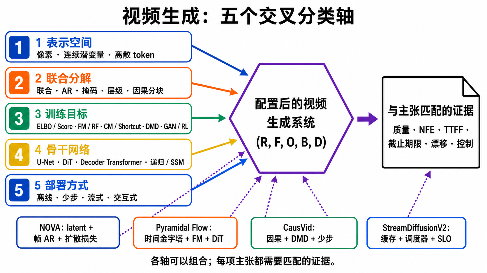

# 视频生成系统：表示 × 分解 × 目标 × 骨干 × 部署

> 一手来源审计截至 **2026-08-30**。本章把 representation、factorization、objective、backbone 和 deployment 分成五个交叉分类轴；2026 年尚未正式发表的系统只按作者技术报告解释，不把演示或作者自报速度当作独立复现。

视频生成模型不是只能贴一个“VAE”“自回归”“Diffusion”“Flow”或“Streaming”标签。一个真实系统通常同时回答五个不同问题：

$$
\text{system configuration}
=
(\text{representation},
\text{factorization},
\text{objective},
\text{backbone},
\text{deployment}).
$$

这五个轴在分析上可分，却不表示统计独立或任意笛卡尔积都可实现：离散 token 通常对应分类式目标，连续状态才适合直接学习 score/velocity；因果分解还会约束可用骨干、缓存方式与流式部署。五轴的用途是拆开问题、显式写出兼容约束，而不是宣称所有取值可以自由拼装。

例如，NOVA 是**连续 latent 表示**、**帧间与帧内集合式自回归分解**、**逐 token diffusion loss**和 Transformer 的组合；Pyramidal Flow 把**连续 latent**、**时间金字塔自回归**、**flow matching**与 DiT 组合；CausVid 则把双向视频 diffusion teacher 蒸馏成**时间因果**、**少步** student [[21]](#ref-21) [[20]](#ref-20) [[23]](#ref-23)。这些系统不能被放进一列互斥“模型家族”而不丢失关键信息。

本章建立全局地图。连续/离散表示、压缩账本、因果 codec 与实际 bitstream 的边界见[视频 Tokenizer 与生成式压缩专章](generative-models/video-tokenizers.md)，ELBO、learned prior 与随机未来见[变分生成专章](generative-models/variational-generation.md)；DDPM、score、SDE/PF-ODE 的完整推导见[扩散模型专章](generative-models/diffusion-models.md)；FM、RF、Consistency、Shortcut 与 DMD 的差异见[Flow 与 Consistency 专章](generative-models/flow-consistency-models.md)；SFT、reward model、DPO/RWR、policy-gradient RL、推理期 guidance 与蒸馏的边界见[视频后训练与对齐专章](generative-models/video-post-training-alignment.md)；在线生成的暴露偏移、缓存和 SLO 见[因果、流式与实时专章](generative-models/causal-streaming-generation.md)。

## 1. 一张图看懂五个交叉分类轴

**图 1：系统不是单标签，claim 也不能脱离证据。** 图中示例只说明组合关系，不代表性能排序。生成图中的虚线用于提示代表系统；下面的 Mermaid 给出确定性连接和可搜索文字。

~~~mermaid
flowchart LR
    accTitle: 视频生成系统的五个交叉分类轴
    accDescr: 表示空间、数据分解、训练目标、网络骨干和部署方式五个分析维度在兼容约束下汇入一个配置后的生成器，系统主张再连接到画质、计算、延迟、漂移和控制等对应证据；NOVA、Pyramidal Flow、CausVid 与 StreamDiffusionV2 只是组合实例，不构成排名。

    R["R · Representation pixel / continuous latent / discrete token"]
    F["F · Factorization joint / AR / masked / hierarchy / causal chunk"]
    O["O · Objective ELBO / adversarial / score / FM-RF / CM-DMD / preference-RL"]
    B["B · Backbone U-Net / DiT / decoder Transformer / recurrent-SSM"]
    D["D · Deployment offline / few-step / streaming / interactive"]

    M["Configured video generator (R, F, O, B, D)"]
    E["Claim-specific evidence quality · NFE · TTFF · deadline · drift · control"]

    R --> M
    F --> M
    O --> M
    B --> M
    D --> M
    M --> E

    X1["NOVA latent + frame/set AR + diffusion loss"] -.-> M
    X2["Pyramidal Flow temporal pyramid + FM + DiT"] -.-> M
    X3["CausVid causal + DMD + few-step"] -.-> M
    X4["StreamDiffusionV2 cache + scheduler + pipeline + SLO"] -.-> E
~~~

顺序化文字替代：先确定生成变量是像素、连续 latent 还是离散 token；再确定联合分布按全片、逐帧、逐 token、mask 块、尺度或因果 chunk 怎样分解；再选择 ELBO、adversarial、denoising/score、flow、consistency/DMD 或偏好目标；由 U-Net、DiT、decoder-only Transformer 或 recurrent/SSM 实现；最后才讨论离线、少步、流式或交互部署。系统声称什么，就必须提供对应的质量、NFE、TTFF、deadline、长期漂移或闭环控制证据。

## 2. 为什么旧式“路线列表”会误导

把 recurrent、VAE、GAN、autoregressive、masked、diffusion、flow 和 streaming 并列，会把不同层的问题压在一起：

| 轴 | 它真正回答的问题 | 常见取值 | 不能由这一轴推出什么 |
|---|---|---|---|
| Representation | 模型在哪种变量空间工作？ | RGB pixel、连续 AE/VAE latent、离散 VQ token、多尺度/混合状态 | 不能推出生成顺序、loss 或是否实时 |
| Factorization | 数据联合分布按什么条件顺序产生或补全？ | full-sequence joint、stepwise state、strict AR、masked/block、hierarchical、causal chunk | 不能推出条件项使用 CE、diffusion 还是 flow |
| Objective | 参数通过什么统计目标学习？ | MLE/ELBO、adversarial、denoising/score、FM/RF、consistency/shortcut、DMD、preference/RL | 不能推出 U-Net/DiT，也不能推出帧的先后 |
| Backbone | 用什么网络实现条件映射、score 或速度场？ | 2D/3D U-Net、DiT、decoder Transformer、RNN/recurrent-state/SSM、cascade/MoE | “DiT”不是与 diffusion/flow 并列的概率家族 |
| Deployment | 输出何时可见，系统受什么运行约束？ | offline multistep、few-step、preview、streaming、interactive、quantized/cached/pipelined | causal mask、低 NFE 或平均 FPS 不能自动证明 SLO |

VAE 还容易同时指两件事：一是用 ELBO 学整个生成分布的潜变量模型；二是现代视频系统中只负责紧凑编码与解码的 tokenizer。后者的上层 generator 完全可以使用 diffusion、flow、AR 或 DMD；若没有量化、概率模型、熵编码器与 bitstream，也不能仅凭 latent shape 声称实际码率压缩。因此，“用了 VAE”往往只回答表示轴的一部分，而不是整个系统属于哪一派 [[1]](#ref-1)。两种角色分别见[变分生成](generative-models/variational-generation.md)与[视频 Tokenizer](generative-models/video-tokenizers.md)。

### 2.1 三条常见兼容配置怎样串起来

**图 2：三条常见配置，不是三个互斥且穷尽的“家族”。** A 路线把 codec 的重建上限、外层数据分解和内层去噪时钟分开；B 路线把词表与 token 数量连接到序列长度、缓存和串行深度；C 路线展示 masked/discrete-diffusion 的并行 refinement。现代系统可以把 frame/chunk AR 放在外层，再在组内运行 diffusion、flow 或 masked head；即使得到少步内循环，也仍要另外实测 TTFF、deadline 和长期漂移。图的语义规范、被拒绝首稿与灰度验收见[生成记录](../sources/research_20260830_token_generation_schematic.md)。

顺序化文字替代：连续路线是 `pixel → causal 3D VAE → continuous latent → joint 或 frame/chunk factorization → diffusion/flow head → decode`；离散自回归路线是 `pixel → VQ/LFQ/BSQ → token IDs → strict 或 grouped AR → categorical CE → decode`；masked 路线从部分 mask 开始，经双向预测、置信度选择和提交，再把不确定位置 remask，循环到完整。三条路线只代表常见兼容配置；表示、分解、条件 head 与部署证据必须分别报告。

## 3. 第一轴：Representation——模型到底生成什么

### 3.1 Pixel space

直接生成 RGB 能避免 codec 丢失，但视频张量随帧数、分辨率和通道数增长。像素空间可以搭配 GAN、AR、diffusion 或 flow；“pixel”只描述变量，不描述 loss。

像素模型的优势是重建上限不受外部 decoder 限制；代价是生成器必须同时承担低频结构、运动和高频纹理，训练与采样成本很高。比较 pixel 与 latent 模型时，必须把 codec 重建误差和 generator 误差分开。

### 3.2 Continuous latent

连续 AE/VAE 将视频

$$
x\in\mathbb{R}^{T\times H\times W\times C}
$$

编码成

$$
z=E(x)\in
\mathbb{R}^{T'\times H'\times W'\times C_z},
\qquad
\hat{x}=D(z).
$$

表示预算应分别报告时间、空间和通道：

$$
r_t=\frac{T}{T'},\qquad
r_s=\frac{HW}{H'W'},\qquad
r_{\mathrm{elem}}=\frac{THWC}{T'H'W'C_z}.
$$

只写“$8\times$ VAE”可能把空间网格比、总元素比和 bitrate 混为一谈。没有量化、熵模型和实际 bitstream 时，只能报告 shape、dtype、网格或元素预算，不能报告 bpp/bitrate。tokenizer 验收至少要包含文字、小物体、快速运动、闪烁、首尾 causal 边界和长段落漂移；完整四本账与生成式 decoder 的幻觉边界见[视频 Tokenizer 专章](generative-models/video-tokenizers.md)。生成器分数再高，也不能可靠恢复 tokenizer 已系统性删除的信息。

### 3.3 Discrete token

VQ 类 tokenizer 将 encoder 输出映射到有限 codebook，生成器可使用 categorical likelihood、masked prediction、discrete diffusion 或其他目标。VQ-VAE 建立了神经离散表示，MAGVIT-v2 进一步展示视频 tokenizer 对语言模型式视觉生成的重要性 [[3]](#ref-3) [[6]](#ref-6)。

离散 token 的 codebook size、时空压缩、利用率、dead codes 和 reconstruction quality 共同决定上限。token 数少会降低序列成本，却可能让快速运动或细粒度对象不可恢复；token 数多则把压力转回上下文长度。

### 3.4 Spacetime patch 不等于离散 token

Sora 报告在压缩 latent 上切 spacetime patches，再由 Transformer diffusion 建模 [[18]](#ref-18)。Patchification 是把连续张量组织成 Transformer 输入单元；除非前置 tokenizer 真的量化到有限 codebook，否则不能写成“离散视觉 token”。

同理，**causal VAE**只表示 tokenizer 在时间上不偷看未来，便于在线编码或解码；它不证明上层生成器 causal，更不证明端到端 streaming。首帧、padding、chunk 与 cache 的详细合同见[视频 Tokenizer 专章](generative-models/video-tokenizers.md)。

## 4. 第二轴：Factorization——联合分布怎样被拆开

为避免符号冲突，本章用 $k$ 表示**视频数据时间**，用 $\tau$ 表示**噪声或运输时间**。

### 4.1 Full-sequence joint / bidirectional

模型一次对整段 latent $z_{1:K}$ 建模，空间和时间 token 可以双向交互。Video Diffusion Models、Lumiere 和许多 DiT 系统属于这一大类的不同实现 [[16]](#ref-16) [[17]](#ref-17)。

优点是能共同修订开头和结尾，短片段内一致性强；缺点是必须预先知道窗口，显存随时空 token 增长，而且完整窗口结束前通常无法稳定发出不可撤回的帧。

### 4.2 Recurrent 与 strict autoregressive

窄义自回归写成：

$$
p(x_{1:K}\mid c)
=
\prod_{k=1}^{K}
p(x_k\mid x_{<k},c).
$$

$x_k$ 可以是像素、离散 token、连续 latent、帧或 chunk。每个条件分布也不必使用 categorical CE；它可以由 diffusion 或 flow head 表示。VideoPoet 展示 decoder-only multimodal token AR，MAR/NOVA 则说明连续 token 与 diffusion loss 也能进入广义 AR 系统 [[7]](#ref-7) [[8]](#ref-8) [[21]](#ref-21)。

严格 AR 天然支持变长输出，但存在串行深度、exposure bias 和长期误差累积。KV cache 减少重复计算，不消除每个 commit 单元依赖前缀的下界。

### 4.3 Masked / block iterative

Masked generation 每轮并行预测一组未知变量，再按置信度或 schedule 提交、重 mask。若第 $j$ 轮提交集合 $X_j$，可写成：

$$
p(X_{1:J}\mid c)
=
\prod_{j=1}^{J}
p(X_j\mid X_{<j},c),
$$

但 $X_j$ 内部通常并行，attention 也可能双向。因此它与逐 token causal AR 在窄义上不同。MaskGIT 将 masked iterative decoding 与 raster AR 对照；MAR 又把 next-set prediction 称为广义 masked autoregression。教材必须声明采用哪一种定义 [[5]](#ref-5) [[8]](#ref-8)。

### 4.4 Hierarchical / next-scale

系统可以先生成低分辨率、关键帧、粗时间层或场景布局，再生成高分辨率与中间时间层。此处“autoregressive”可能发生在尺度而非视频时间。Pyramidal Flow 同时使用时间金字塔、flow matching 与单一 DiT，正说明 factorization 和 objective 可以交叉组合 [[20]](#ref-20)。

### 4.5 Causal chunk / rolling

每个新帧或 chunk 只能看过去；chunk 内部仍可双向联合生成。有限 lookahead 也可以形成流式系统，但必须把可读未来范围、revision window 和最终 commit frontier 写清，不能把它标成严格 causal。这里讨论的是 **data-time information constraint**，不是 noise-time sampler，也不是结构因果模型。

CausVid、Self Forcing 与 Separable Causal Diffusion 分别从蒸馏、自生成历史和“时间推理与迭代去噪解耦”推进这一分支 [[23]](#ref-23) [[24]](#ref-24) [[26]](#ref-26)。这些论文中的 causal 首先表示不访问未来帧，不能自动升级为干预正确或物理因果理解。

实现时还要把四层合同拆开：causal codec → causal generator → streaming commit → real-time SLO；任一层成立都不自动推出下一层。首帧与 chunk codec 细节见[视频 Tokenizer](generative-models/video-tokenizers.md)，commit、backpressure、open-horizon 与反证实验见[因果流式专章](generative-models/causal-streaming-generation.md)。

## 5. 第三轴：Objective——模型用什么统计信号学习

### 5.1 Likelihood、ELBO 与 stochastic latent

VAE 最大化 evidence lower bound：

$$
\log p_\theta(x)
\ge
\mathbb{E}_{q_\phi(z\mid x)}
[\log p_\theta(x\mid z)]
-
D_{\mathrm{KL}}
\left(q_\phi(z\mid x)\Vert p(z)\right).
$$

它显式平衡重建与 latent prior，但会面对 posterior collapse、模糊重建和时间 latent 未被利用。SVG-LP 用 learned prior 建模多模态未来，是 stochastic video prediction 的重要里程碑 [[1]](#ref-1) [[4]](#ref-4)。

### 5.2 Adversarial objective

GAN 通过判别器比较真实与生成分布 [[32]](#ref-32)：

$$
\min_G\max_D
\mathbb{E}_{x\sim p_{data}}\log D(x)
+
\mathbb{E}_{z\sim p(z)}
\log(1-D(G(z))).
$$

视频判别器可看单帧、短片段或完整时空体。MoCoGAN 的内容/运动 latent 解耦属于表示设计，但它的训练 objective 是 adversarial；不能把它当成 VAE 的代表 [[2]](#ref-2)。

GAN 擅长锐利感知质量，却可能 mode collapse、训练不稳。到 diffusion 时代，adversarial loss 没有消失，而是常作为 decoder、蒸馏或 DMD2 的辅助信号。

### 5.3 Denoising、score 与 diffusion

DDPM 学离散反向条件分布；连续 score-SDE 则用同一 score 定义随机 reverse SDE 和共享边缘分布的确定性 probability-flow ODE [[9]](#ref-9) [[10]](#ref-10)。因此：

- ODE 不等于 flow matching；
- $\epsilon$、$x_0$、score 和常见 $v$ prediction 是给定 schedule 下可换算的参数化，不是四个互斥家族；
- DDIM、DPM-Solver 等首先属于 sampler，不是重新训练 objective [[31]](#ref-31) [[30]](#ref-30)。

### 5.4 Flow Matching 与 Rectified Flow

Flow Matching 回归选定概率路径的速度场；Rectified Flow 采用更具体的直线条件 coupling 与 rectification/reflow 思路 [[11]](#ref-11) [[12]](#ref-12)。直线训练插值不意味着近似网络产生的每条 ODE trajectory 都严格直，也不意味着模型天然一步。

### 5.5 Consistency、Shortcut 与 DMD

Consistency 让同一 PF-ODE 轨迹上的点映射到共同端点，可蒸馏，也可 standalone training；Shortcut 让网络额外条件于目标步长，支持不同推理预算 [[13]](#ref-13) [[28]](#ref-28)。

DMD 的核心是 distribution matching：用 target score 与 fake/student score 的差推动 student 分布靠近教师或目标，不要求样本沿同一轨迹一一对应。DMD2 又加入 two-time-scale 更新、GAN loss，以及训练时模拟推理输入的 on-policy multi-step 机制 [[14]](#ref-14) [[15]](#ref-15)。所以 DMD 不是 consistency loss 的别名；这两篇的通用目标定义来自图像实验，视频运动、长时身份和速度收益必须由视频系统另证。

2025 的 sCM 继续解决连续时间 consistency 的稳定与扩展，正式摘要报告两步生成；2026 的 rCM 面向大规模图像/视频教师蒸馏，报告 1–4 步。两者的作者协议结果都不等于所有内容、时长和硬件下无损 [[29]](#ref-29) [[25]](#ref-25)。

### 5.6 Preference、reward 与 RL

偏好优化可以作用于已有 diffusion/flow generator，用人评、VLM、程序约束或 task reward 改变输出分布。它属于后训练 objective；不能从“用了 RL/DPO”推出 foundation objective 已改变，也不能用训练 reward 直接兼任最终裁判。

这一行标签仍不够描述完整系统：SFT 改变条件遵循的初始化，reward model 把人评或程序信号压缩为训练信号，DPO/RWR 使用离线或在线偏好，policy-gradient 方法还要处理采样轨迹和信用分配，推理期 reward guidance 则不更新基础模型。Consistency/DMD 主要改变采样映射或学生分布，也不能因为和 reward 同训就自动归为“对齐”。完整的目标、数据、反馈时点、reference policy、训练成本、reward hacking 与独立验收合同见[视频后训练与对齐专章](generative-models/video-post-training-alignment.md)。

## 6. 第四轴：Backbone——谁来实现条件映射

| Backbone | 典型用法 | 优点 | 主要边界 |
|---|---|---|---|
| 2D/3D U-Net | pixel/latent diffusion、局部时空卷积 | 多尺度局部结构强，成熟稳定 | 大窗口注意力与长程状态成本高 |
| 图像 backbone + temporal blocks | 从 T2I 权重迁移到视频 | 复用强图像先验 | temporal adapter 可能只学局部平滑 |
| DiT / spacetime Transformer | diffusion、FM、RF、consistency | 扩展参数和混合时空 token 灵活 | token 二次复杂度、缓存和长时漂移 |
| Decoder-only Transformer | 离散/连续 token AR、多模态统一 | 变长序列与统一接口 | 严格串行深度和 tokenizer 上限 |
| Recurrent / SSM / rolling cache | causal chunk、在线状态 | 内存可控、适合持续输出 | 状态遗忘、暴露偏移、难以回改过去 |
| Cascade / MoE | 分辨率、时间或能力分工 | 专家化、可分级计算 | 误差传递，端到端归因困难 |

“DiT 模型”“Transformer diffusion”“flow Transformer”不是同一层标签。DiT 只说明 backbone；它可以承载 denoising、score、FM、RF、consistency 或其他目标。

## 7. 第五轴：Deployment——离线、少步、流式和实时不是同义词

| 声明 | 最低操作定义 | 必须报告 | 不能偷换成 |
|---|---|---|---|
| Few-step | 单个输出所需 NFE 明显减少 | NFE、solver、guidance、时长、分辨率、质量/覆盖曲线 | streaming 或长期稳定 |
| Causal | 新输出不读取声明范围外的未来数据 token；若有 finite lookahead 必须单列 | receptive field、块内访问、codec/generator 边界、训练/推理历史、未来扰动测试 | 结构因果理解或 streaming commit |
| Streaming | 完整序列结束前持续提交输出并增量维护状态；输出通常不可撤回，或只允许协议明确规定的有界修订 | commit 单元/hash、lookahead、revision、overlap/crop、条件生效点、backpressure、cache reset | “能生成长视频”或 real-time |
| Interactive | 生成期间可接收新 prompt/action 并在声明预算内生效 | 输入到可见响应延迟、状态保持、反事实控制 | 预先给定整条轨迹 |
| Real-time | 在指定硬件、精度、到达负载和播放时钟下持续满足端到端 deadline | cold/warm TTFF、condition-to-display、p50/p95/p99、miss、jitter、steady-state FPS、并发、soak 与恢复 | 单次平均 FPS |

StreamDiffusionV2 把 TTFF、逐帧 deadline、jitter、SLO-aware batching 和多 GPU pipeline 纳入正式系统评测；论文在 4×H100 的特定设置中报告首帧不超过约 0.5 秒等结果，这些数字不能脱离硬件、模型、分辨率、NFE 和精度外推 [[27]](#ref-27)。

开放时长也必须拆成固定长片、测试长度外推、启动时未知终点和恒定资源架构四层。程序能继续调用 sampler，只证明没有主动停止；只有 quality–time/survival curve、resident/外存斜率、EOS/reset 语义和失败样本，才能判断内容与系统是否真的支持 open horizon。

## 8. 两个时间轴不能混用

最常见的概念错误，是把视频帧时间 $k$ 与去噪/运输时间 $\tau$ 混成一个 $t$。下图右侧的 $\tau$ 链只适用于采用 diffusion、flow 或 consistency 条件头的分支；纯分类式 CE 或其他条件头不会进入这条噪声时间链。

~~~mermaid
flowchart TB
    accTitle: 视频时间与噪声时间的双时钟
    accDescr: 数据时间 k 决定帧或 chunk 怎样依赖过去，噪声或运输时间 tau 决定一个待生成变量怎样从噪声迭代到样本；自回归或因果分解与 diffusion、flow 或 consistency 目标可以交叉组合。

    C["已提交上下文 x&lt;k"] --> F{"data-time factorization"}
    F -->|strict AR / causal chunk| K["当前变量 xk"]
    F -->|joint / masked block| J["当前集合 Xj"]

    N3["τ=1 noise / base"] --> N2["τ2 intermediate"]
    N2 --> N1["τ1 intermediate"]
    N1 --> N0["τ=0 sample"]

    K -. "若采用 diffusion / flow 条件头" .-> N3
    J -. "若采用 diffusion / flow 条件头" .-> N3
    N0 --> O["commit frame / token / chunk"]
    O --> C2["成为 k+1 的上下文 或结束 joint block"]
~~~

顺序化文字替代：factorization 先决定当前要生成第 $k$ 帧、一个 token、一个 chunk 或一个 mask 块；若条件分布采用 diffusion/flow，内部再沿 $\tau$ 从 base noise 走到样本；样本被 commit 后才进入下一个数据时间。因而“autoregressive diffusion”通常是 data-time AR 与 noise-time denoising 的组合，不是一个神秘的第三时钟。

## 9. 2023–2026 的关键里程碑应该怎样读

| 时间 / 工作 | 五轴配置摘要 | 真正推进 | 证据边界 |
|---|---|---|---|
| 2023 首次公开 → ICLR 2024 MAGVIT-v2 [[6]](#ref-6) | discrete video token × masked/LM factorization × Transformer | tokenizer 成为语言模型式视觉生成的关键变量 | tokenizer/图像比较不能替代开放视频生成评测 |
| 2023 首次公开 → ICML 2024 VideoPoet [[7]](#ref-7) | discrete multimodal token × decoder-only AR | 一个 AR 模型统一多种视频输入输出 | 序列长度、tokenizer 和串行成本仍在 |
| 2024 MAR [[8]](#ref-8) | continuous token × next-set AR × diffusion loss | 证明 AR 不要求 VQ 与 CE | 主要是图像证据，不能直接外推视频运动 |
| 2024 Sora report [[18]](#ref-18) | compressed latent × spacetime patch × Transformer diffusion | 统一时长、分辨率和宽高比的 patch 表示 | 技术报告未公开全部架构、参数、sampler 和成本 |
| 2024 Diffusion Forcing [[19]](#ref-19) | sequence factorization × per-token noise | 将 diffusion 与 causal sequence learning 连接 | 不等于商品级视频生成或实时部署 |
| 2025 Pyramidal Flow [[20]](#ref-20) | latent × temporal-pyramid AR × FM × DiT | 一模型跨时间/空间尺度生成 | 作者协议内效率，不证明 FM 天生少步 |
| 2025 NOVA [[21]](#ref-21) | continuous latent × frame/set AR × token diffusion | AR、连续表示和 diffusion objective 明确交叉 | 需要分别报告帧间与帧内串行深度 |
| 2025 MAGI [[22]](#ref-22) | frame-causal × within-frame masked | 分开帧间 causal 与帧内并行生成 | masked AR 命名依论文定义，不等于 strict token AR |
| 2025 CausVid [[23]](#ref-23) | causal student × video DMD × few-step streaming | 从双向教师到因果少步 student | 教师偏差、mode coverage 和长期漂移仍需测 |
| 2025 Self Forcing [[24]](#ref-24) | causal AR × self-rollout training × rolling KV | 直接处理 teacher-forcing exposure gap | “real-time”依具体配置；不证明闭环世界模型 |
| 2026 rCM [[25]](#ref-25) | large video teacher × continuous-time consistency × 1–4 step | 把 consistency 扩展到大规模视频教师 | 作者设置内 15–50× 等数字不可普遍外推 |
| 2026 SCD [[26]](#ref-26) | causal temporal encoder × frame-wise diffusion decoder | 把一次性时间推理与逐步去噪计算解耦 | causal 仍是时间箭头，不是物理因果 |
| 2026 StreamDiffusionV2 [[27]](#ref-27) | generator × cache/scheduler/pipeline × SLO | 从模型 NFE 推进到 TTFF、jitter、deadline 系统证据 | 依赖多 GPU、模型、精度、负载和工程栈 |

三年的主线不是“Diffusion 被 Flow 替代”：

1. **2024：表示与分解解耦。** 连续 token 可以 AR，离散 token 也可 masked；spacetime patch 不等于 VQ。
2. **2025：objective 与数据时间交叉。** Flow 可配时间金字塔，diffusion loss 可作为 AR 条件头，DMD 可蒸馏 causal student。
3. **2026：few-step 与部署证据分开。** 目标函数继续稳定化，系统论文开始报告 TTFF、deadline、jitter 和多 GPU pipeline。

## 10. 如何判定一个新模型应该放在哪里

按以下顺序读论文，不要从标题猜家族：

1. **生成变量是什么？** 找 encoder、quantizer、latent shape、compression 和 decoder。
2. **数据怎样分解？** 找 attention mask、commit 单元、帧/chunk 顺序、mask schedule 和层级。
3. **训练目标是什么？** 找完整 loss，而不是只看“velocity”“one-step”或“autoregressive”。
4. **采样器是什么？** 找 NFE、solver、guidance、随机性和是否需要 teacher。
5. **网络实现是什么？** U-Net、DiT、decoder Transformer、recurrent/SSM 只是实现层。
6. **部署主张是什么？** 对照是否真的报告 TTFF、p95 deadline、jitter、缓存、峰值显存和交互响应。
7. **证据对应哪个 claim？** 画质、人类偏好、长时状态、物理、控制与 SLO 不能互相替代。

一个最小 model card 可以写成：

~~~yaml
representation:
  variable: continuous_video_latent
  codec: causal_vae
  temporal_compression:
  spatial_compression:
factorization:
  data_time: causal_chunk
  commit_unit:
  within_chunk_attention:
objective:
  foundation:
  post_training:
  teacher_dependency:
sampler:
  algorithm:
  nfe:
  stochastic:
backbone:
  family:
  context_and_cache:
deployment:
  mode: offline | few_step | streaming | interactive
  hardware_and_precision:
  ttff_p50_p95:
  frame_deadline_and_miss_rate:
evidence:
  quality_and_coverage:
  drift_and_state:
  control_or_task:
  known_limitations:
~~~

## 11. 常见误区

- **“AR 就是离散 VQ + 交叉熵。”** AR 是条件分解；变量和条件分布都可以连续。
- **“Masked 与 AR 永远互斥。”** 窄义 strict token AR 不同于 masked iterative；广义 next-set 文献会把后者称为 masked AR，必须声明定义。
- **“预测 velocity 就是 Rectified Flow。”** Diffusion 的 $v$ parameterization、FM vector field 和 RF velocity 都使用速度语言。
- **“用了 ODE 就是 Flow Matching。”** Score diffusion 本身有 PF-ODE，DPM-Solver 也积分 diffusion ODE。
- **“Flow Matching 天然一步。”** FM 的训练可 simulation-free，采样通常仍需积分；少步取决于路径、误差和 solver。
- **“Consistency 就是单步教师蒸馏。”** CM 可 standalone training，也常用多步 refinement。
- **“DMD 是 Consistency 的别名。”** 前者重点匹配分布，后者重点约束同一轨迹映射。
- **“少步就等于流式实时。”** Few-step 只减少单个输出的 NFE；TTFF、frame deadline、缓存、长时漂移另测。
- **“Causal attention 证明理解因果。”** 它只限制信息流向，不证明干预、反事实或物理规律。
- **“DiT 是新的概率模型家族。”** DiT 是 backbone，可承载多个 objective。
- **“VAE 分数高，最终视频就不会坏。”** codec 只给上限；generator、sampler、conditioning 和后处理仍会失败。
- **“最新论文的作者速度就是平台能力。”** 速度必须绑定硬件、模型大小、精度、分辨率、时长、NFE、并发和统计口径。

## 12. 页面分工与阅读顺序

| 页面 | 负责回答 | 不应承担 |
|---|---|---|
| 本总览 | 五轴 taxonomy、跨轴组合、历史与选型 | 每个 SDE/ODE 的完整推导 |
| [递归预测](generative-models/recurrent-prediction.md) | 逐步状态、teacher forcing、rollout | 把所有递归模型归成 objective |
| [变分生成](generative-models/variational-generation.md) | stochastic latent、ELBO、多未来 | 把现代 codec 等同完整 VAE generator |
| [视频 Tokenizer 与生成式压缩](generative-models/video-tokenizers.md) | 表示接口、连续/离散/混合 latent、压缩账本、causal codec、重建与下游生成 | 把 latent shape 当实际码率；替代上层 factorization/objective 章节 |
| [对抗生成](generative-models/adversarial-generation.md) | 时空判别器、mode collapse、现代辅助角色 | 把 GAN 与 content/motion representation 混写 |
| [自回归生成](generative-models/autoregressive-generation.md) | strict frame/token/chunk factorization、continuous head | 把 AR 限定为 VQ+CE |
| [掩码生成](generative-models/masked-generation.md) | mask schedule、block commit、双向上下文 | 假定 masked 只能离散 |
| [扩散模型](generative-models/diffusion-models.md) | DDPM→score→SDE/PF-ODE、参数化、sampler | 重复完整 streaming 系统 |
| [Flow 与 Consistency](generative-models/flow-consistency-models.md) | FM/RF/CM/Shortcut/DMD 与 few-step 证据 | 把 causal/streaming 当 objective |
| [因果、流式与实时](generative-models/causal-streaming-generation.md) | codec→generator→commit→SLO 合同、自生成历史、bounded memory、KV/cache、lookahead、backpressure、open horizon | 把低 NFE、因果 mask 或长 demo 自动写成实时 |

推荐先读本章，再按 representation 进入[视频 Tokenizer](generative-models/video-tokenizers.md)，按 objective 进入变分、Diffusion 或 Flow/Consistency；随后根据 factorization 去读 AR、masked 或 causal streaming。最后回到[大模型系统路线](foundation-models.md)、[评测指南](evaluation.md)和[World Models](world-models.md)，检查能力 claim 是否真的由对应证据支持。

## 参考文献

[1] [Auto-Encoding Variational Bayes](https://arxiv.org/abs/1312.6114). Diederik P. Kingma and Max Welling. ICLR. 2014.

[2] [MoCoGAN: Decomposing Motion and Content for Video Generation](https://openaccess.thecvf.com/content_cvpr_2018/html/Tulyakov_MoCoGAN_Decomposing_Motion_CVPR_2018_paper.html). Tulyakov et al. CVPR. 2018.

[3] [Neural Discrete Representation Learning](https://proceedings.neurips.cc/paper/2017/hash/7a98af17e63a0ac09ce2e96d03992fbc-Abstract.html). van den Oord, Vinyals and Kavukcuoglu. NeurIPS. 2017.

[4] [Stochastic Video Generation with a Learned Prior](https://proceedings.mlr.press/v80/denton18a.html). Denton and Fergus. ICML. 2018.

[5] [MaskGIT: Masked Generative Image Transformer](https://openaccess.thecvf.com/content/CVPR2022/html/Chang_MaskGIT_Masked_Generative_Image_Transformer_CVPR_2022_paper.html). Chang et al. CVPR. 2022.

[6] [Language Model Beats Diffusion — Tokenizer is Key to Visual Generation](https://proceedings.iclr.cc/paper_files/paper/2024/hash/036912a83bdbb1fd792baf6532f102d8-Abstract-Conference.html). Yu et al. ICLR. 2024.

[7] [VideoPoet: A Large Language Model for Zero-Shot Video Generation](https://proceedings.mlr.press/v235/kondratyuk24a.html). Kondratyuk et al. ICML. 2024.

[8] [Autoregressive Image Generation without Vector Quantization](https://proceedings.neurips.cc/paper_files/paper/2024/hash/66e226469f20625aaebddbe47f0ca997-Abstract-Conference.html). Li et al. NeurIPS. 2024.

[9] [Denoising Diffusion Probabilistic Models](https://proceedings.neurips.cc/paper/2020/hash/4c5bcfec8584af0d967f1ab10179ca4b-Abstract.html). Ho, Jain and Abbeel. NeurIPS. 2020.

[10] [Score-Based Generative Modeling through Stochastic Differential Equations](https://arxiv.org/abs/2011.13456). Song et al. ICLR Oral. 2021.

[11] [Flow Matching for Generative Modeling](https://openreview.net/forum?id=PqvMRDCJT9t). Lipman et al. ICLR. 2023.

[12] [Flow Straight and Fast: Learning to Generate and Transfer Data with Rectified Flow](https://openreview.net/forum?id=XVjTT1nw5z). Liu, Gong and Liu. ICLR. 2023.

[13] [Consistency Models](https://proceedings.mlr.press/v202/song23a.html). Song et al. ICML. 2023.

[14] [One-step Diffusion with Distribution Matching Distillation](https://openaccess.thecvf.com/content/CVPR2024/html/Yin_One-step_Diffusion_with_Distribution_Matching_Distillation_CVPR_2024_paper.html). Yin et al. CVPR. 2024.

[15] [Improved Distribution Matching Distillation for Fast Image Synthesis](https://proceedings.neurips.cc/paper_files/paper/2024/hash/54dcf25318f9de5a7a01f0a4125c541e-Abstract-Conference.html). Yin et al. NeurIPS. 2024.

[16] [Video Diffusion Models](https://proceedings.neurips.cc/paper/2022/hash/39235c56aef13fb05a6adc95eb9d8d66-Abstract-Conference.html). Ho et al. NeurIPS. 2022.

[17] [Lumiere: A Space-Time Diffusion Model for Video Generation](https://doi.org/10.1145/3680528.3687614). Bar-Tal et al. SIGGRAPH Asia. 2024.

[18] [Video Generation Models as World Simulators](https://openai.com/index/video-generation-models-as-world-simulators/). OpenAI. Technical report. 2024.

[19] [Diffusion Forcing: Next-token Prediction Meets Full-Sequence Diffusion](https://proceedings.neurips.cc/paper_files/paper/2024/hash/2aee1c4159e48407d68fe16ae8e6e49e-Abstract-Conference.html). Chen et al. NeurIPS. 2024.

[20] [Pyramidal Flow Matching for Efficient Video Generative Modeling](https://proceedings.iclr.cc/paper_files/paper/2025/hash/3ab228c4703c4459b1a600ebadc5732c-Abstract-Conference.html). Jin et al. ICLR. 2025.

[21] [Autoregressive Video Generation without Vector Quantization](https://proceedings.iclr.cc/paper_files/paper/2025/hash/6e5112eaa45f8c30b242c5f576213a92-Abstract-Conference.html). Deng et al. ICLR. 2025.

[22] [Taming Teacher Forcing for Masked Autoregressive Video Generation](https://openaccess.thecvf.com/content/CVPR2025/html/Zhou_Taming_Teacher_Forcing_for_Masked_Autoregressive_Video_Generation_CVPR_2025_paper.html). Zhou et al. CVPR. 2025.

[23] [From Slow Bidirectional to Fast Autoregressive Video Diffusion Models](https://openaccess.thecvf.com/content/CVPR2025/html/Yin_From_Slow_Bidirectional_to_Fast_Autoregressive_Video_Diffusion_Models_CVPR_2025_paper.html). Yin et al. CVPR. 2025.

[24] [Self Forcing: Bridging the Train-Test Gap in Autoregressive Video Diffusion](https://proceedings.neurips.cc/paper_files/paper/2025/hash/f4823f831af67a3ef15e41a85434422a-Abstract-Conference.html). Huang et al. NeurIPS. 2025.

[25] [Large Scale Diffusion Distillation via Score-Regularized Continuous-Time Consistency](https://proceedings.iclr.cc/paper_files/paper/2026/hash/0534abc9e6db91683d82186ef0d68202-Abstract-Conference.html). ICLR. 2026.

[26] [Causality in Video Diffusers is Separable from Denoising](https://openaccess.thecvf.com/content/CVPR2026/html/Bai_Causality_in_Video_Diffusers_is_Separable_from_Denoising_CVPR_2026_paper.html). Bai et al. CVPR. 2026.

[27] [StreamDiffusionV2: A Streaming System for Dynamic and Interactive Video Generation](https://proceedings.mlsys.org/paper_files/paper/2026/hash/698cfaf72a208aef2e78bcac55b74328-Abstract-Conference.html). MLSys. 2026.

[28] [One Step Diffusion via Shortcut Models](https://proceedings.iclr.cc/paper_files/paper/2025/hash/559a0998fab1d19b80e7e43a5852401c-Abstract-Conference.html). ICLR. 2025.

[29] [Simplifying, Stabilizing and Scaling Continuous-time Consistency Models](https://proceedings.iclr.cc/paper_files/paper/2025/hash/7e9c2053258b1bdd32ff2654802cd594-Abstract-Conference.html). ICLR. 2025.

[30] [DPM-Solver: A Fast ODE Solver for Diffusion Probabilistic Model Sampling in Around 10 Steps](https://proceedings.neurips.cc/paper_files/paper/2022/hash/260a14acce2a89dad36adc8eefe7c59e-Abstract-Conference.html). Lu et al. NeurIPS. 2022.

[31] [Denoising Diffusion Implicit Models](https://openreview.net/forum?id=St1giarCHLP). Song, Meng and Ermon. ICLR. 2021.

[32] [Generative Adversarial Nets](https://proceedings.neurips.cc/paper/2014/hash/f033ed80deb0234979a61f95710dbe25-Abstract.html). Goodfellow et al. NeurIPS. 2014.
