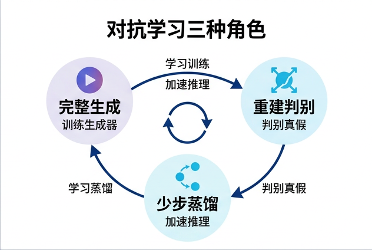
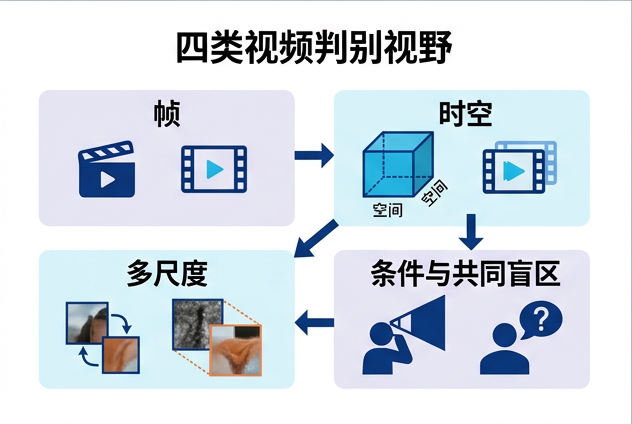

# 视频对抗生成：从完整 GAN 到解码器与少步生成

> 本章证据冻结日为 2026-08-30。“对抗”在本章指可学习 critic 在对抗分类或评分目标下，区分 reference/positive distribution（真实数据或 teacher/self-teacher 输出）与 student/generated distribution，而 student 反向迎合该 critic；因此，名字里有 distribution matching、consistency 或 one-step，并不自动等于使用对抗目标。

视频 GAN 的历史不是“先成功，后被 diffusion 取代”的单线故事。到 2026 年，对抗学习至少有三种彼此独立的角色：

1. **完整生成器**：$G(z,c)$ 从噪声与条件直接产生视频，一个或多个判别器定义主要分布学习信号。VGAN、MoCoGAN、DIGAN 和 StyleGAN-V 属于这一角色 [[2]](#ref-2) [[4]](#ref-4) [[9]](#ref-9) [[10]](#ref-10)。
2. **video tokenizer/decoder 的重建判别器**：判别器帮助 $D_{\mathrm{dec}}(E(x))$ 恢复感知上真实的细节，但上层 diffusion、flow、自回归或 masked model 才学习 latent 先验。此时“用了 GAN loss”不等于“整个系统是 GAN” [[13]](#ref-13) [[14]](#ref-14)。
3. **diffusion/flow 的对抗蒸馏或后训练**：预训练教师供应轨迹、score 或初始化，对抗目标则帮助少步学生的输出分布靠近真实数据或教师分布。ADD 是图像侧前驱；OSV、Seaweed-APT、ADM、ASD、V-PAE 与 AAD-1 提供了直接视频证据 [[18]](#ref-18) [[24]](#ref-24) [[27]](#ref-27) [[28]](#ref-28) [[29]](#ref-29) [[30]](#ref-30) [[31]](#ref-31)。

![现代视频基础模型的六阶段系统图：第一阶段 Data and Governance 将图像、视频、音频和动作流变成去重、标注且受治理的数据；第二阶段 Representation 并列展示连续 causal-VAE latent 与离散视觉 token，并标明 codec 瓶颈与 generator objective 分开；第三阶段 Foundation Generator 接收文本、图像、视频、音频或动作条件，并对照全序列双向去噪与由状态和已提交上下文驱动的滚动帧或块递归；第四阶段 Post-train and Accelerate 包含偏好或奖励对齐、self或causal forcing 和教师到学生蒸馏，只在选中方法确有对抗目标时才有训练期判别器反馈；第五阶段 Decode and Polish 解码并可超分、插帧或音频同步，第二个仅训练期判别器提供感知或对抗重建损失；第六阶段 Deploy and Verify 包含护栏、来源、离线 API 或因果流式服务、系统指标与任务安全评测。底部图例分开完整 GAN、tokenizer或decoder的 GAN loss 和对抗蒸馏；两个 badge 分别提醒产品能力不等于单 checkpoint 能力，以及公开代码、权重、数据与可复现 recipe 是不同发布面](../../assets/diagrams/modern-video-foundation-system-stack.png)

*图 1：这是从 Data & Governance、Representation、Foundation Generator、Post-train & Accelerate、Decode & Polish 到 Deploy & Verify 的组合式系统地图，不是所有系统都必须遵循的通用架构，也不是年代顺序。底部三行明确区分：完整 GAN 用 critic 训练主生成器；codec discriminator 只改善 tokenizer/decoder 重建；对抗蒸馏/后训练则在 diffusion 或 flow 教师后约束少步 student。两个 release-boundary badge 另外限定产品与 checkpoint、开源表面与可复现性的归因。图的证据、构图规则与生成过程见 [现代视频系统示意图研究记录](../../sources/research_20260830_modern_video_system_schematic.md)。*

图 1 顺序化文字替代：

1. 在模型训练前治理和整理图像、视频、音频与动作数据。
2. 将视频编码为连续 latent 或离散 token，不因表示类型预设 generator objective。
3. 在带条件的共享 foundation generator 中选择全序列处理或滚动递归 rollout，而不把两者画成必经串联链。
4. 对 generator 做偏好/奖励对齐、self/causal forcing 或教师到学生蒸馏；只在选定方法确实有对抗目标时使用训练期 critic。
5. 解码并可进行超分、插帧或音频同步；decoder critic 是重建目标，不是 rollout 机制。
6. 在安全与来源控制后部署离线 API 或因果流式服务，并同时报告质量、系统与任务/安全证据。
7. 在把产品能力归给某个 checkpoint 前，分开审计产品/checkpoint 边界以及公开代码、权重、数据与可复现 recipe。


图 2 顺序化文字替代：路径一把噪声和条件送入完整 GAN 生成器，再用真实与生成视频训练视频判别器；路径二把真实视频经编码器和解码器重建，判别器只约束重建，latent 的生成由另一个先验完成；路径三先有 diffusion 或 flow 教师，再用蒸馏信号训练少步学生，仅当方法确实训练了区分真假的 critic 时才进入“对抗”分支。三条路径可在同一系统中同时出现，但它们的优化对象和证据不能混用。

## 1. 什么才算对抗目标

### 1.1 操作性判据

本章采用可复核的操作性定义：训练中存在参数为 $\phi$ 的 critic，它在对抗分类或评分目标下，根据参考正分布 $q_+$ 的样本 $x^+$ 与 student/generated distribution $q_\theta$ 的样本 $\hat x=G_\theta(z,c)$ 改善区分能力；student 则反向更新 $\theta$ 以迎合该 critic。$q_+$ 可以是真实数据，也可以是 teacher 或 self-teacher 的输出；必须在方法记录中明说正样本来源。经典 GAN 取 $q_+=p_{\mathrm{data}}$，其原始 minimax 概念目标是 [[1]](#ref-1)：

```math
\min_G\max_D\;
\mathbb E_{x\sim p_{\mathrm{data}}}\log D(x,c)
+\mathbb E_{z\sim p(z)}\log(1-D(G(z,c),c)).
```

实践中常用 non-saturating softplus 形式。以输出未归一化 logit 的 $D_\phi$ 为例：

```math
\begin{aligned}
\mathcal L_D={}&
\mathbb E_x\!\left[\mathrm{softplus}(-D_\phi(x,c))\right]
+\mathbb E_z\!\left[\mathrm{softplus}(D_\phi(G_\theta(z,c),c))\right]\\
&+\frac{\gamma}{2}\mathbb E_x
\left\|\nabla_xD_\phi(x,c)\right\|_2^2,\\
\mathcal L_G^{\mathrm{adv}}={}&
\mathbb E_z\!\left[\mathrm{softplus}(-D_\phi(G_\theta(z,c),c))\right].
\end{aligned}
```

最后一项是只在真实样本上计算的 R1 梯度正则，它与在真假插值上约束梯度的 gradient penalty 不是同一件事 [[15]](#ref-15)。Hinge GAN 则对真样本惩罚 $\max(0,1-D(x))$，对假样本惩罚 $\max(0,1+D(\hat x))$，生成器最小化 $-D(\hat x)$。报告“使用 GAN loss”时必须同时说明具体形式、每个 critic 的权重、正则与更新比。

### 1.2 三种容易被误认为对抗的信号

* **可微奖励不自动是 critic**。若 reward model 在 student 训练中固定，它是一个可微评估器，不是与 student 同步学习的真假对手。T2V-Turbo 使用 reward-guided consistency distillation，不应被归成视频 GAN [[22]](#ref-22)。
* **fake-score model 不自动是二元判别器**。DMD 从真实与学生分布的 score 差构造梯度，其 fake-score 网络通过去噪 score matching 更新，原始目标没有二元真假 GAN loss [[19]](#ref-19)。DMD2 后来另外加入 GAN loss，所以两者必须分开 [[20]](#ref-20)。
* **consistency 不自动是对抗**。一个方法可以同时有 consistency、score/distillation 和 adversarial 三项损失，也可以只有其中一项。应按优化式和更新算法分类，不按论文标题分类。

## 2. 视频判别器究竟看到什么

判别器并不直接约束“整个真实世界分布”；它只约束自己的输入视野、下采样和条件接口能表达的统计量。因此需把“判别器数量”与“观测设计”分开。


图 3 顺序化文字替代：从候选视频出发，可以抽取单帧送入帧判别器，把连续或带时间戳的 clip 送入时空判别器，把高清短视野与低清长视野送入多尺度判别器，或把视频和文本、首帧、类别、动作联合送入条件判别器。它们分别擅长纹理、局部运动、跨尺度结构和条件匹配，但只要视野没有覆盖整个 rollout，就不能单独保证长期身份、状态与因果一致。

### 2.1 帧与时空判别器

* **Frame/spatial discriminator** 在高分辨率随机帧上检查纹理、边界和物体形状。它能使单帧锋利，却可以对帧间闪烁和速度错误完全不敏感。
* **Spatiotemporal discriminator** 以 3D 卷积、时间注意力或多帧特征观测一个 clip。它能找到局部闪烁、运动断裂和不合理速度，但检查 16 帧不等于检查一分钟的状态保持。

MoCoGAN 用图像判别器约束单帧内容，用视频判别器约束运动，与生成器中固定的 content latent 和由 RNN 演化的 motion latent 形成对应 [[4]](#ref-4)。这个设计是有用的归纳偏置，但并不证明 latent 中存在唯一或可识别的真实“内容—运动”因果分解。

### 2.2 多尺度与稀疏时间视野

多尺度不只是在一个特征金字塔上加多个 head；它还可以是多个观测成本不同的 critic。DVD-GAN 的空间判别器看少量随机抽样的全分辨率帧，时空判别器则在空间降采样后看完整时长，以换取高分辨率视频的可训练性 [[6]](#ref-6)。该工作在本章按 2019 技术报告引用，不写成已接收的 ICLR 2020 论文。

StyleGAN-V 另一种做法是在连续时间生成器中抽取稀疏帧集合，让带时间信息的 holistic discriminator 判断它们是否属于同一条真实轨迹 [[10]](#ref-10)。稀疏训练降低显存与计算，也会留下未被抽中的短时闪烁和长时状态漂移。

### 2.3 条件判别器

条件 critic 必须检查两件事：视频本身是否真实，以及视频是否与 $c$ 匹配。只把文本或首帧送入生成器，但让判别器只看无条件视频，会留下“高真实感但忽略条件”的逃生路径。实现可使用 projection、cross-attention、匹配/不匹配样本或联合嵌入；但仍应分开报告真实感和条件遵循，不用单一总分遮蔽取舍。

## 3. 完整视频 GAN：设计问题如何演化

下表的“里程碑”不以发布时间为唯一标准，而以是否引入了一个可复用的新观测或生成设计为判据。数据集上的局部领先不单独构成里程碑。

| 时间与工作 | 可复用的设计变化 | 里程碑判据 | 仍未解决 |
|---|---|---|---|
| 2016，VGAN [[2]](#ref-2) | 将静态背景与动态前景分流，用 mask 合成视频 | 在固定短 clip 上演示无监督卷积对抗视频生成 | 分辨率与时长很小；静态背景假设不适合移动镜头 |
| 2017，TGAN [[3]](#ref-3) | temporal generator 先产生每帧 latent，image generator 再生成帧 | 把“何时发生什么”与帧级外观变成显式层次 | 固定长度、低分辨率；latent 层次不保证语义可识别 |
| 2018，MoCoGAN [[4]](#ref-4) | 整段固定 content latent，RNN 演化 motion latent，并用 image/video 双 critic | 将内容—运动假设与判别视野成对设计 | 解耦可能只是表示偏置；RNN 长 rollout 会漂移 |
| 2018，SAVP [[5]](#ref-5) | 在条件视频预测中结合随机 VAE 路径和 GAN 路径 | 清晰暴露“多未来覆盖”与“锐利感知质量”的双目标 | 是条件预测而非任意文本生成；本章按 arXiv 预印本引用 |
| 2019，DVD-GAN [[6]](#ref-6) | 全分辨率稀疏帧的 spatial critic，空间降采样全时长的 temporal critic | 在更复杂数据上将高分辨率和时空 critic 成本拆开 | 计算、数据与大 batch 需求高；无可确认的接收 venue |
| 2020，TGANv2 [[7]](#ref-7) | train sparsely, generate densely，为高分辨率时序 GAN 减少训练内存 | 将时空稀疏观测变成可复用的扩展策略 | 训练未见的密集时刻仍需专门评测 |
| 2021，MoCoGAN-HD [[8]](#ref-8) | 固定预训练图像生成器，学习 latent 轨迹，加入多尺度 3D patch critic | 把强图像先验与视频运动学习拆开 | 运动受固定图像流形限制，不是通用长视频解法 |
| 2022，DIGAN [[9]](#ref-9) | 用坐标型隐式神经表示生成视频，用帧 critic 和根据两帧及时间差学动力的 critic | 将连续时间坐标变成生成器的显式输入 | 坐标连续不保证长期事件连续 |
| 2022，StyleGAN-V [[10]](#ref-10) | 连续时间运动表示、稀疏时间抽样和 holistic discriminator | 支持任意时间戳/帧率查询，且保留强图像 GAN 质量 | 连续可查询不等于小时级运动多样性与全局一致 |
| 2022，LongVideoGAN [[11]](#ref-11) | 先生成长时低分辨率视频，再按帧超分，专门处理新内容与持久状态 | 把“长”从可变时间索引推进到跨事件的训练与评测 | 层级超分仍可引入闪烁；域外长时因果不受保证 |
| 2023，PV3D [[12]](#ref-12) | 把 3D-aware portrait 表示与空间/时间 critic 结合 | 表明对抗视频生成继续在结构化垂直域内发展 | 头像几何偏置不能直接外推到通用视频 |

这条路线的重要贡献是把**生成器时间表示**与**判别器时间视野**变成可单独设计的轴。但“可查询任意时间”、“训练时看完整 clip”与“长期有意义地发展”是三个不同命题。

## 4. 角色迁移一：对抗重建的 video tokenizer/decoder

视频 tokenizer 常用组合损失训练编解码器：

```math
\mathcal L_{\mathrm{codec}}=
\lambda_{\mathrm{pix}}\lVert x-D_{\mathrm{dec}}(E(x))\rVert_1
+\lambda_{\mathrm{perc}}\mathcal L_{\mathrm{perc}}
+\lambda_{\mathrm{adv}}\mathcal L_{\mathrm{adv}}
+\lambda_{\mathrm{reg}}\mathcal R(E(x)).
```

$\mathcal L_{\mathrm{perc}}$ 比较固定特征，$\mathcal L_{\mathrm{adv}}$ 由可学习判别器提供，$\mathcal R$ 可以是 KL、量化/codebook 约束或其他 latent 正则。TATS 把 3D-VQGAN tokenizer 与长序列 Transformer 结合；MAGVIT 在 3D video tokenizer 中使用帧级感知损失和时空对抗信号，随后另行训练 masked token generator [[13]](#ref-13) [[14]](#ref-14)。

这里有三条不能跨越的证据边界：

1. **重建锐利不等于输入忠实**。对抗 decoder 可能补出感知上合理却不在原视频中的纹理。因此 LPIPS/FVD 改善不能取代 PSNR、细小文字、人脸身份和高速运动的忠实性检查。
2. **tokenizer 好不等于先验好**。要分别报告 $D_{\mathrm{dec}}(E(x))$ 重建与从上层模型采样 $D_{\mathrm{dec}}(\hat z)$ 的结果；否则无法知道改善来自 codec 还是 latent generator。
3. **这不是 GAN 重新成为整套生成机制**。如果测试时 latent 由 diffusion、flow、AR 或 masked model 产生，对抗损失的作用域是 decoder 重建，不是上层先验。

实验上应固定上层 generator，扫描 $\lambda_{\mathrm{adv}}$，同时报告重建忠实性、感知真实感、时间闪烁与下游生成质量。否则很容易把 decoder 的“合理幻觉”误当成信息恢复。

## 5. 角色迁移二：diffusion/flow 少步学生的对抗训练

从 2024 年起，“对抗”更多出现在已有 diffusion/flow 教师之后：学生希望用一次或少数几次网络调用产生视频，而 critic 补充回归、consistency 或 score 差在输出分布上的不足。这是**教师家族 + student objective**的组合，不是将 student 一概改名为经典 GAN。其与 [Flow、Consistency 与 Few-Step 生成](./flow-consistency-models.md) 中的场、流映射与分布目标是正交分类轴。

下表把“是否显式对抗”与“是否有直接视频实验”拆成两列。“是”不表示结果已被独立复现；它只表示一手论文的方法和实验确实在该轴上提供证据。

| 方法 | 主要训练信号 | 显式对抗目标 | 直接视频证据 | 不应越界的结论 |
|---|---|---:|---:|---|
| ADD，ECCV 2024 [[18]](#ref-18) | score distillation + adversarial loss | 是 | 否，图像 | 是图像侧前驱，不是视频实验 |
| DMD，CVPR 2024 [[19]](#ref-19) | 真实/fake score 差 + 回归 | 否，无二元 GAN critic | 否，图像 | “分布匹配”不自动意味对抗 |
| DMD2，NeurIPS 2024 [[20]](#ref-20) | DMD + two-time-scale update + GAN loss | 是 | 否，图像 | 不能把图像加速数字直接移植到视频 |
| SDXL-Lightning，arXiv 2024 [[21]](#ref-21) | progressive adversarial diffusion distillation | 是 | 否，图像 | 截至冻结日是图像预印本证据 |
| T2V-Turbo，NeurIPS 2024 [[22]](#ref-22) | reward-guided consistency distillation | 否 | 是 | 固定奖励模型不是同步训练的真假 critic |
| AnimateDiff-Lightning，arXiv 2024 [[23]](#ref-23) | progressive adversarial diffusion distillation | 是 | 是 | 直接视频，但是基于 AnimateDiff 的技术报告分支 |
| OSV，CVPR 2025 [[24]](#ref-24) | 第一阶段 LGP（GAN + Huber）；第二阶段 ACD（teacher-generated positive 对 student negative 的可训练 latent discriminator，adversarial term + consistency distance） | 是，两阶段都含对抗项 | 是，image-to-video | latent video discriminator 避免为 critic 解码；一步质量与速度是作者协议结果 |
| CausVid，CVPR 2025 [[25]](#ref-25) | asymmetric DMD，fake score 用 denoising score matching 更新 | 否，方法中无显式二元对抗损失 | 是 | 引用 DMD2 的更新比不等于继承其 GAN loss |
| SnapGen-V，CVPR 2025 [[26]](#ref-26) | 紧凑架构搜索 + 面向 4 denoising steps 的专用对抗微调 | 是 | 是 | iPhone 16 Pro Max 上“5 秒生成 5 秒视频”是作者指定设置，不是跨设备通用 SLO |
| Seaweed-APT，ICML 2025 [[27]](#ref-27) | 从预训练 diffusion 权重开始，用真实视频对抗后训练 | 是 | 是 | 实时/720p 结论必须绑定作者硬件、帧数和实现 |
| ADM，ICCV 2025 [[28]](#ref-28) | diffusion-based discriminators 做 adversarial distribution matching | 是 | 是，CogVideoX 2B/5B | 视频实验是多步蒸馏；不把图像一步结论写成视频一步 |
| ASD，ICLR 2026 [[29]](#ref-29) | $n$ 步学生与 $(n+1)$ 步自教师的 adversarial self-distillation | 是 | 是，因果视频 | 一步 causal 不自动意味无界流式长视频 |
| V-PAE，AAAI 2026 [[30]](#ref-30) | 稳定性预热后进入 self-adversarial equilibrium | 是 | 是，single-step I2V | 一手页支撑 Wan2.1-I2V-14B 设定，不支撑 causal/autoregressive 主张；也不是通用收敛证明 |
| AAD-1，ICML 2026 [[31]](#ref-31) | DMD warm-up + 因果学生对全向 holistic video critic | 是 | 是 | venue 由官方 ICML 2026 program 确认；冻结日时 proceedings 页尚未索引 |

这个表格说明“对抗蒸馏”不是单一算法。critic 可以看解码后 RGB、视频 latent、预训练 diffusion 特征或不同噪声等级的扰动样本。它与教师回归、consistency、DMD 梯度和 reward 可以累加；分类时应逐项阅读 loss 和更新步骤。SnapGen-V 还表明了一个不同于“完整 GAN”和“一步教师蒸馏”的部署路线：先压缩架构，再用对抗微调把多步 denoiser 降到少步 [[26]](#ref-26)。

## 6. 为什么对抗训练仍然难

### 6.1 覆盖度与“精选样本陷阱”

对抗训练的局部梯度可以鼓励生成器把质量集中在少数容易骗过 critic 的模式上。这不表示所有 GAN 都严格最小化 reverse KL；经典 GAN 的理想化散度、有限 critic 和实际双优化动力学不是同一个命题。但结果层面必须检查 mode dropping：人物身份、镜头运动、场景、速度与事件类型是否只剩下少数组合。生成模型的 precision/recall 式评测就是为了把保真度与覆盖度分开 [[32]](#ref-32)。

有效报告至少包含：随机而非精选样本；多个随机种子；在同一条件下的重复采样；类别/动作/摄像机的分层覆盖；nearest-neighbor 泄漏检查；以及与真实集合相同的样本数与预处理。

### 6.2 稳定化工具改变的是什么

* **R1/gradient penalty** 限制 critic 的局部梯度；必须记录计算频率与权重，lazy regularization 会改变有效强度。
* **Spectral normalization** 控制层的谱范数，但不能单独保证整个时空 critic 在所有输入上满足理想 Lipschitz 条件。
* **Two-time-scale/update ratio** 改变生成器与 critic 的跟踪速度。报告时需给出学习率、更新比和是否共享 optimizer step，不只写“用了 TTUR”。
* **时空一致数据增强**可防止小数据上的 critic 过拟合。若每帧独立随机裁剪、翻转或颜色扰动，增强本身会制造虚假运动。
* **EMA 与训练状态**可改善展示 checkpoint 的平滑性，但不修复已经丢失的 mode。不应只报 EMA 生成器的最佳时刻。

多 critic 系统还要报告每个 critic 的梯度范数或损失曲线。只看总损失无法发现“帧 critic 完全主导，时序 critic 几乎不工作”的失衡。

## 7. FVD 应如何报告，又不能证明什么

FVD 将真实与生成 clip 送入视频特征提取器，用两个高斯近似的 Fréchet 距离比较分布 [[16]](#ref-16)：

```math
\mathrm{FVD}=
\lVert\mu_r-\mu_g\rVert_2^2+
\mathrm{Tr}\!\left(
\Sigma_r+\Sigma_g-2(\Sigma_r\Sigma_g)^{1/2}
\right).
```

“FVD 更低”只在协议完全一致时才可比。每个数字应附带下列账本：

1. feature extractor 的精确 checkpoint/实现，包括 I3D 变体与预处理；
2. 真实和生成 clip 数、随机种子、是否复用 real statistics；
3. 分辨率、帧率、clip 长度、起始 offset、采样 stride 与裁剪方式；
4. 生成是一次输出还是长视频上多个窗口，是否把同一长视频的高度相关 clip 当作独立样本；
5. 均值、方差或置信区间，而非单个最优 checkpoint。

若一篇论文报告 $\mathrm{FVD}_{16}$ 而另一篇报告 $\mathrm{FVD}_{128}$，两者已经在不同时间视野上测量，不应混成一个排名。后续对 FVD 的受控研究还表明，它对空间内容的敏感性可以压过对时间变化的敏感性，甚至出现静态样本改善 FVD 的反直觉情况 [[17]](#ref-17)。因此必须加上运动幅度/光流统计、闪烁、条件遵循、precision/recall、人类盲评与长时段事件检查。

## 8. 长视频为什么仍会失败

对抗损失只会惩罚 critic 看得见的错误。对一个训练视野为 $L$ 帧的 critic，两个相隔远大于 $L$ 的局部片段可以各自真实，整条故事却互相矛盾。常见长期失败包括：

* 人物、工具或背景在离开画面后以不同身份返回；
* 动作在局部看起来平滑，却重复成循环，或在 chunk 边界重置；
* 镜头或物理状态慢性漂移，物体数量、尺度和接触关系不再一致；
* 条件在首个短窗口内被满足，后续事件偏离文本、首帧或动作指令；
* 一步 student 在训练 clip 上保真，但连续/自回归调用时输入分布逐步离开训练数据。

因此“任意时间戳可查询”要用随时长增长的运动多样性、身份保持与事件进展验收；“一步视频生成”要另外报告单次输出时长、是否解码计入 wall-clock、是否可连续提交帧以及多 chunk 后的质量。LongVideoGAN 将长时问题明确化，但没有使这些验收项失效 [[11]](#ref-11)。

## 9. 2024–2026 的里程碑判据与开放问题

一个新方法只有在改变了角色、可验收能力或效率边界时，才应被称为里程碑。下表将判据与尚未解决的问题并列。

| 路线转折 | 可验收的里程碑判据 | 目前证据 | 仍然开放的问题 |
|---|---|---|---|
| 完整 GAN → 表示子系统 | 在固定上层生成器时，对抗 decoder 在不破坏输入忠实和时间一致的前提下改善感知重建 | TATS、MAGVIT 等视频 tokenizer 提供直接实例 [[13]](#ref-13) [[14]](#ref-14) | 如何防止解码器幻觉文字、面部和小物体？怎样分离 codec 与 prior 收益？ |
| 图像对抗蒸馏 → 直接视频 | 方法的生成对象、critic 输入和主实验都是视频，而不只是将图像论文列入 related work | AnimateDiff-Lightning、OSV、SnapGen-V、Seaweed-APT、ADM [[23]](#ref-23) [[24]](#ref-24) [[26]](#ref-26) [[27]](#ref-27) [[28]](#ref-28) | 在相同教师、数据、NFE、解码器和硬件下，对抗项的净贡献是多少？ |
| 少步 clip → 一步因果 student | 学生的信息访问确实是 causal，并在长于训练 clip 的 rollout 上验收 | ASD 与 AAD-1 提供一步 causal/autoregressive 对抗协议 [[29]](#ref-29) [[31]](#ref-31) | 一步是否在很长 rollout 上放大暴露偏差？全向 critic 能否指导 causal student 学到可持续状态？ |
| 作者速度报告 → 系统级低延迟 | 报告真实 NFE、每步前向次数、decoder、I/O、batch、精度、硬件和首帧/首块延迟 | 现有工作证明了少步生成可行，但速度数字依赖各自协议 | 如何在同一部署栈比较 one-step、few-step 和经过优化的多步 teacher？ |
| 短窗口真实 → 长期状态正确 | 在递增时长上报告身份、几何、事件完成、多样性和边界连续 | 连续时间 GAN、长视频 GAN 和 causal distillation 都在尝试这一轴 | 什么样的长视野 critic/记忆既能看到违规，又不使训练成本失控？ |

所以，更准确的 2026 结论是：**对抗学习从单一的端到端生成范式，迁移为可插入完整生成器、表示解码器和少步学生的分布约束**。它在锐利感知质量和少步学习上仍有价值，但训练稳定、mode coverage、条件忠实、长时因果和可比评测仍没有被一个 critic 或一个 FVD 数字解决。

## 10. 阅读一篇新论文时的最小核对表

1. **角色**：critic 是完整 generator、codec decoder，还是蒸馏 student 的训练组件？
2. **对手**：是否有用真实/生成样本反向更新的可学习 critic？还是固定 reward、score difference 或 consistency target？
3. **视野**：critic 看 RGB 还是 latent，单帧还是 clip，多长，何种采样、尺度和条件？
4. **损失**：non-saturating、hinge 还是 diffusion-based critic；R1/GP、学习率、更新比和各 critic 权重是什么？
5. **直接证据**：方法是否真正在视频上训练与评测，还是从图像论文外推？
6. **覆盖度**：有没有多样性、precision/recall、同条件多次采样和训练集记忆检查？
7. **FVD 协议**：feature checkpoint、样本数、帧数/FPS/stride、分辨率、预处理、种子和方差是否全部报告？
8. **长时和系统边界**：训练视野多长，测试 rollout 多长；one-step 是一次网络调用还是一个包含 CFG/解码的模糊标签？

本章的检索式、筛选流程、排除原因、证据等级与逐条主张边界见 [2026-08-30 视频对抗生成研究记录](../../sources/research_20260830_adversarial_video_generation.md)。

## 参考文献

<a id="ref-1"></a>[1] [Generative Adversarial Nets](https://papers.nips.cc/paper_files/paper/2014/hash/f033ed80deb0234979a61f95710dbe25-Abstract.html). Ian J. Goodfellow, Jean Pouget-Abadie, Mehdi Mirza, Bing Xu, David Warde-Farley, Sherjil Ozair, Aaron Courville, Yoshua Bengio. NeurIPS. 2014.

<a id="ref-2"></a>[2] [Generating Videos with Scene Dynamics](https://proceedings.neurips.cc/paper_files/paper/2016/hash/04025959b191f8f9de3f924f0940515f-Abstract.html). Carl Vondrick, Hamed Pirsiavash, Antonio Torralba. NeurIPS. 2016.

<a id="ref-3"></a>[3] [Temporal Generative Adversarial Nets with Singular Value Clipping](https://openaccess.thecvf.com/content_iccv_2017/html/Saito_Temporal_Generative_Adversarial_ICCV_2017_paper.html). Masaki Saito, Eiichi Matsumoto, Shunta Saito. ICCV. 2017.

<a id="ref-4"></a>[4] [MoCoGAN: Decomposing Motion and Content for Video Generation](https://openaccess.thecvf.com/content_cvpr_2018/html/Tulyakov_MoCoGAN_Decomposing_Motion_CVPR_2018_paper.html). Sergey Tulyakov, Ming-Yu Liu, Xiaodong Yang, Jan Kautz. CVPR. 2018.

<a id="ref-5"></a>[5] [Stochastic Adversarial Video Prediction](https://arxiv.org/abs/1804.01523). Alex X. Lee, Richard Zhang, Frederik Ebert, Pieter Abbeel, Chelsea Finn, Sergey Levine. arXiv:1804.01523. 2018.

<a id="ref-6"></a>[6] [Adversarial Video Generation on Complex Datasets](https://arxiv.org/abs/1907.06571). Aidan Clark, Jeff Donahue, Karen Simonyan. arXiv:1907.06571 technical report. 2019.

<a id="ref-7"></a>[7] [Train Sparsely, Generate Densely: Memory-Efficient Unsupervised Training of High-Resolution Temporal GAN](https://doi.org/10.1007/s11263-020-01333-y). Masaki Saito, Shunta Saito, Masanori Koyama, Sosuke Kobayashi. International Journal of Computer Vision. 2020.

<a id="ref-8"></a>[8] [A Good Image Generator Is What You Need for High-Resolution Video Synthesis](https://openreview.net/forum?id=6puCSjH3hwA). Yu Tian, Jian Ren, Menglei Chai, Kyle Olszewski, Xi Peng, Dimitris N. Metaxas, Sergey Tulyakov. ICLR. 2021.

<a id="ref-9"></a>[9] [Generating Videos with Dynamics-aware Implicit Generative Adversarial Networks](https://openreview.net/forum?id=Czsdv-S4-w9). Sihyun Yu, Jihoon Tack, Sangwoo Mo, Hyunsu Kim, Junho Kim, Jung-Woo Ha, Jinwoo Shin. ICLR. 2022.

<a id="ref-10"></a>[10] [StyleGAN-V: A Continuous Video Generator with the Price, Image Quality and Perks of StyleGAN2](https://openaccess.thecvf.com/content/CVPR2022/html/Skorokhodov_StyleGAN-V_A_Continuous_Video_Generator_With_the_Price_Image_Quality_CVPR_2022_paper.html). Ivan Skorokhodov, Sergey Tulyakov, Mohamed Elhoseiny. CVPR. 2022.

<a id="ref-11"></a>[11] [Generating Long Videos of Dynamic Scenes](https://papers.nips.cc/paper_files/paper/2022/hash/ce208d95d020b023cba9e64031db2584-Abstract-Conference.html). Tim Brooks, Janne Hellsten, Miika Aittala, Ting-Chun Wang, Timo Aila, Jaakko Lehtinen, Ming-Yu Liu, Alexei A. Efros, Tero Karras. NeurIPS. 2022.

<a id="ref-12"></a>[12] [PV3D: A 3D Generative Model for Portrait Video Generation](https://openreview.net/forum?id=o3yygm3lnzS). Zhongcong Xu, Jianfeng Zhang, Jun Hao Liew, Wenqing Zhang, Song Bai, Jiashi Feng, Mike Zheng Shou. ICLR. 2023.

<a id="ref-13"></a>[13] [Long Video Generation with Time-Agnostic VQGAN and Time-Sensitive Transformer](https://www.ecva.net/papers/eccv_2022/papers_ECCV/html/5950_ECCV_2022_paper.php). Songwei Ge, Thomas Hayes, Harry Yang, Xi Yin, Guan Pang, David Jacobs, Jia-Bin Huang, Devi Parikh. ECCV. 2022.

<a id="ref-14"></a>[14] [MAGVIT: Masked Generative Video Transformer](https://openaccess.thecvf.com/content/CVPR2023/html/Yu_MAGVIT_Masked_Generative_Video_Transformer_CVPR_2023_paper.html). Lijun Yu, Yong Cheng, Kihyuk Sohn, José Lezama, Han Zhang, Huiwen Chang, Alexander G. Hauptmann, Ming-Hsuan Yang, Yuan Hao, Irfan Essa, Lu Jiang. CVPR. 2023.

<a id="ref-15"></a>[15] [Which Training Methods for GANs Do Actually Converge?](https://proceedings.mlr.press/v80/mescheder18a.html). Lars Mescheder, Andreas Geiger, Sebastian Nowozin. ICML. 2018.

<a id="ref-16"></a>[16] [Towards Accurate Generative Models of Video: A New Metric & Challenges](https://arxiv.org/abs/1812.01717). Thomas Unterthiner, Sjoerd van Steenkiste, Karol Kurach, Raphaël Marinier, Marcin Michalski, Sylvain Gelly. arXiv:1812.01717. 2018.

<a id="ref-17"></a>[17] [On the Content Bias in Fréchet Video Distance](https://openaccess.thecvf.com/content/CVPR2024/html/Ge_On_the_Content_Bias_in_Frechet_Video_Distance_CVPR_2024_paper.html). Songwei Ge, Aniruddha Mahapatra, Gaurav Parmar, Jun-Yan Zhu, Jia-Bin Huang. CVPR. 2024.

<a id="ref-18"></a>[18] [Adversarial Diffusion Distillation](https://www.ecva.net/papers/eccv_2024/papers_ECCV/html/11557_ECCV_2024_paper.php). Axel Sauer, Dominik Lorenz, Andreas Blattmann, Robin Rombach. ECCV. 2024.

<a id="ref-19"></a>[19] [One-step Diffusion with Distribution Matching Distillation](https://openaccess.thecvf.com/content/CVPR2024/html/Yin_One-step_Diffusion_with_Distribution_Matching_Distillation_CVPR_2024_paper.html). Tianwei Yin, Michaël Gharbi, Richard Zhang, Eli Shechtman, Frédo Durand, William T. Freeman, Taesung Park. CVPR. 2024.

<a id="ref-20"></a>[20] [Improved Distribution Matching Distillation for Fast Image Synthesis](https://proceedings.neurips.cc/paper_files/paper/2024/hash/54dcf25318f9de5a7a01f0a4125c541e-Abstract-Conference.html). Tianwei Yin, Michaël Gharbi, Taesung Park, Richard Zhang, Eli Shechtman, Frédo Durand, William T. Freeman. NeurIPS. 2024.

<a id="ref-21"></a>[21] [SDXL-Lightning: Progressive Adversarial Diffusion Distillation](https://arxiv.org/abs/2402.13929). Shanchuan Lin, Anran Wang, Xiao Yang. arXiv:2402.13929. 2024.

<a id="ref-22"></a>[22] [T2V-Turbo: Breaking the Quality Bottleneck of Video Consistency Model with Mixed Reward Feedback](https://proceedings.neurips.cc/paper_files/paper/2024/hash/8a57aa8e8b57e64a42e95f7dceb0adb9-Abstract-Conference.html). Jiachen Li, Weixi Feng, Tsu-Jui Fu, Xinyi Wang, Sugato Basu, Wenhu Chen, William Yang Wang. NeurIPS. 2024.

<a id="ref-23"></a>[23] [AnimateDiff-Lightning: Cross-Model Diffusion Distillation](https://arxiv.org/abs/2403.12706). Shanchuan Lin, Xiao Yang. arXiv:2403.12706. 2024.

<a id="ref-24"></a>[24] [OSV: One Step is Enough for High-Quality Image to Video Generation](https://openaccess.thecvf.com/content/CVPR2025/html/Mao_OSV_One_Step_is_Enough_for_High-Quality_Image_to_Video_CVPR_2025_paper.html). Xiaofeng Mao, Zhengkai Jiang, Fu-yun Wang, Jiangning Zhang, Hao Chen, Mingmin Chi, Yabiao Wang, Wenhan Luo. CVPR. 2025.

<a id="ref-25"></a>[25] [From Slow Bidirectional to Fast Autoregressive Video Diffusion Models](https://openaccess.thecvf.com/content/CVPR2025/html/Yin_From_Slow_Bidirectional_to_Fast_Autoregressive_Video_Diffusion_Models_CVPR_2025_paper.html). Tianwei Yin, Qiang Zhang, Richard Zhang, William T. Freeman, Frédo Durand, Eli Shechtman, Xun Huang. CVPR. 2025.

<a id="ref-26"></a>[26] [SnapGen-V: Generating a Five-Second Video within Five Seconds on a Mobile Device](https://openaccess.thecvf.com/content/CVPR2025/html/Wu_SnapGen-V_Generating_a_Five-Second_Video_within_Five_Seconds_on_a_CVPR_2025_paper.html). Yushu Wu, Zhixing Zhang, Yanyu Li, Yanwu Xu, Anil Kag, Yang Sui, Huseyin Coskun, Ke Ma, Aleksei Lebedev, Ju Hu, Dimitris N. Metaxas, Yanzhi Wang, Sergey Tulyakov, Jian Ren. CVPR. 2025.

<a id="ref-27"></a>[27] [Diffusion Adversarial Post-Training for One-Step Video Generation](https://proceedings.mlr.press/v267/lin25m.html). Shanchuan Lin, Xin Xia, Yuxi Ren, Ceyuan Yang, Xuefeng Xiao, Lu Jiang. ICML. 2025.

<a id="ref-28"></a>[28] [Adversarial Distribution Matching for Diffusion Distillation Towards Efficient Image and Video Synthesis](https://openaccess.thecvf.com/content/ICCV2025/html/Lu_Adversarial_Distribution_Matching_for_Diffusion_Distillation_Towards_Efficient_Image_and_ICCV_2025_paper.html). Yanzuo Lu, Yuxi Ren, Xin Xia, Shanchuan Lin, Xing Wang, Xuefeng Xiao, Andy J. Ma, Xiaohua Xie, Jian-Huang Lai. ICCV. 2025.

<a id="ref-29"></a>[29] [Towards One-step Causal Video Generation via Adversarial Self-Distillation](https://proceedings.iclr.cc/paper_files/paper/2026/hash/3ae86071c169649bff21188c536163dc-Abstract-Conference.html). Yongqi Yang, Huayang Huang, Xu Peng, Xiaobin Hu, Donghao Luo, Jiangning Zhang, Chengjie Wang, Yu Wu. ICLR. 2026.

<a id="ref-30"></a>[30] [Phased One-Step Adversarial Equilibrium for Video Diffusion Models](https://ojs.aaai.org/index.php/AAAI/article/view/37318). Jiaxiang Cheng, Bing Ma, Xuhua Ren, Hongyi Henry Jin, Kai Yu, Peng Zhang, Wenyue Li, Yuan Zhou, Tianxiang Zheng, Qinglin Lu. AAAI. 2026.

<a id="ref-31"></a>[31] [AAD-1: Asymmetric Adversarial Distillation for One-Step Autoregressive Video Generation](https://arxiv.org/abs/2606.03972). Haobo Li, Yanhong Zeng, Yunhong Lu, Jiapeng Zhu, Hao Ouyang, Qiuyu Wang, Ka Leong Cheng, Yujun Shen, Zhipeng Zhang. ICML. 2026; [official program listing](https://icml.cc/Downloads/2026); [official project](https://aad-1.github.io/).

<a id="ref-32"></a>[32] [Assessing Generative Models via Precision and Recall](https://papers.nips.cc/paper_files/paper/2018/hash/f7696a9b362ac5a51c3dc8f098b73923-Abstract.html). Mehdi S. M. Sajjadi, Olivier Bachem, Mario Lucic, Andreas Krause. NeurIPS. 2018.
