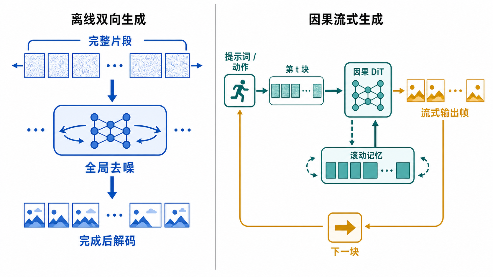
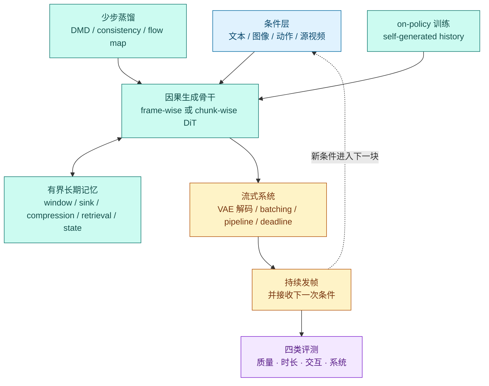
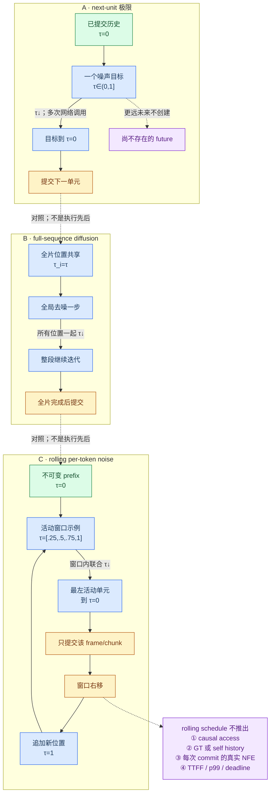
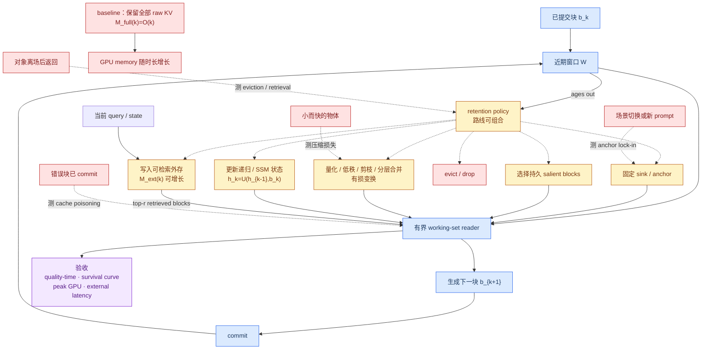
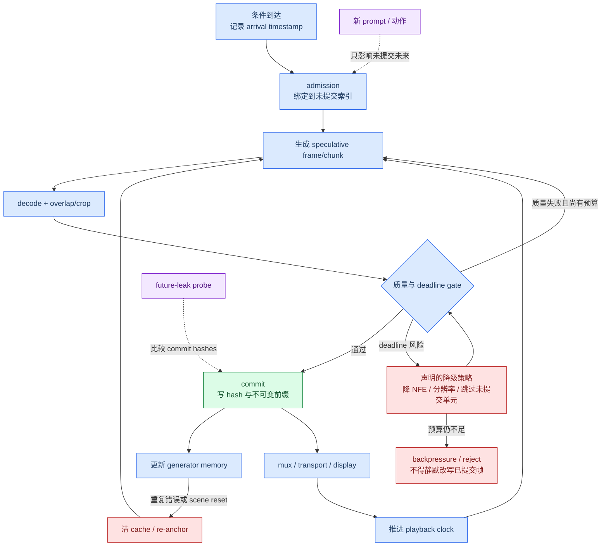

# 因果、流式与实时视频生成：从 Diffusion Forcing 到可交互长视频

离线视频扩散通常先确定一整段 clip，在所有时间位置之间反复交换信息，全部去噪完成后才解码。它适合追求整段一致性，却不适合“画面一边播放，用户一边改变指令”的场景。因果流式生成把视频拆成帧或时间块，只依赖已经生成的历史与当前待生成块，因而可以逐步输出、复用 KV cache，并在未知终止时间下继续生成。

这不是把 attention mask 改成三角形就结束了。真正可用的实时系统必须同时解决四个耦合问题：

1. **分布偏移**：训练时看到真实历史，推理时只能看到自己带误差的历史；
2. **少步生成**：每一帧或每一块若仍需几十次网络调用，因果模型也不会实时；
3. **长期记忆**：全历史 KV cache 会持续增长，短窗口又会忘记身份、布局和早期事件；
4. **系统期限**：平均 FPS 足够不等于流畅；首帧时间、尾延迟、抖动和 deadline miss 同样重要。

本章证据核验截至 **2026-08-30**，重点解释这四条路线怎样汇合，以及论文中的“流式”“长视频”“实时”和“交互式”为什么不能互换。Video DiT 的 full/factorized/window/sparse/linear topology、3D 位置、noise-time MoE、distributed parallelism 与 inter-step cache 由[骨干扩展专章](video-dit-backbones.md)负责；本章只接收其真实 information mask、state/cache 更新和执行成本，再验证 commit 与 SLO。



> 图中右侧是抽象机制，不代表所有模型都严格逐帧。很多方法在块与块之间保持因果性，却在当前块内部联合去噪多帧；这通常称为 **chunk-causal** 或 rolling-window generation。

## 1. 先把容易混用的概念分开

| 概念 | 最小定义 | 它不自动保证什么 |
|---|---|---|
| **Causal（因果访问）** | 生成第 $k$ 个块时不能读取尚未生成的未来干净块 | 不保证快、不保证物理因果正确 |
| **Autoregressive（自回归）** | 将联合分布分解为按帧或按块的条件分布 | 不要求每块是离散 token，也不等于语言模型式 next-token |
| **Streaming（流式）** | 完整视频尚未结束时就能持续发出可播放结果 | 不保证帧率达到播放速度 |
| **Real-time（实时）** | 端到端生成与解码持续满足目标播放 deadline | 不等于只报告一个平均 FPS |
| **Fixed-long（固定长片）** | 启动前已知总长度，并一次请求超过常见短 clip | 不证明能超过训练长度或随时继续 |
| **Length extrapolation（长度外推）** | 测试 rollout 明确超过训练 horizon | 不证明总长度可事后延长，也不证明误差不累积 |
| **Open-horizon（开放时长）** | 启动时总长度未知，支持继续、停止、重置或换条件 | 不证明资源恒定或任意时长都稳定 |
| **Bounded-resource（有界资源）** | 声明的 GPU working set、单块计算或延迟不随已提交时长增长 | 不等于保留了全部历史信息，也不等于总系统成本恒定 |
| **Interactive（交互式）** | 新 prompt、参考或动作能在有界延迟内改变后续结果 | 不保证改变符合真实动力学或可用于控制 |

把视频分成 $K$ 个时间块 $b_1,\ldots,b_K$ 后，块级自回归写成：

$$
p(b_{1:K}\mid c)=\prod_{k=1}^{K}p(b_k\mid b_{<k},c_k).
$$

$c_k$ 可以是固定文本，也可以是在生成过程中更新的 prompt、相机控制或智能体动作。若模型在块 $k$ 的 attention 中只能读取 $b_{\le k}$，它在块级是 causal；但 $b_k$ 内的多帧仍可互相注意和联合去噪。

这里的“因果”首先是 **信息访问约束**，不是“模型已经学会因果规律”。一个只能看过去的模型仍可能让物体穿墙；一个动作条件模型也仍需反事实和闭环测试，才能证明其 world-model 能力。

### 1.1 四层合同：上一层成立，不会自动推出下一层

“因果视频系统”至少要冻结四份可分别证伪的合同。第一层的实现细节由[视频 Tokenizer 与生成式压缩](video-tokenizers.md)专章负责；本章只检查它交给生成器的接口。

| 层 | 必须声明 | 最小反证测试 | 常见错误推论 |
|---|---|---|---|
| **Causal codec** | encoder/decoder 能否读未来像素或 latent；首帧、padding、chunk state、overlap/crop 规则 | 保持原始 prefix 不变，只扰动未来输入；已解码 prefix 应逐元素一致 | codec 只读过去，所以 generator 也只读过去 |
| **Causal generator** | frame/chunk/tile 的访问 mask；块内是否双向；训练历史来自 GT、加噪 GT 还是 self-rollout | 保持历史与随机数不变，只扰动尚不可见 future latent/condition；当前输出应不变 | generator 因果，所以结果已经可边算边播 |
| **Streaming commit** | commit 单元、lookahead、不可变前缀或 revision window、边界裁切、条件生效点 | 给每个已提交单元保存 hash；扰动未来请求后，声明窗口外的 hash 必须不变 | 能持续调用 sampler，所以已经满足实时播放 |
| **Real-time SLO** | 播放时钟、冷/热启动、TTFF、逐帧尾延迟、jitter、miss、并发负载和恢复策略 | 记录端到端原始时间戳；在预注册负载下做长时 soak 与 deadline recovery | 平均 FPS 高于目标帧率，所以尾延迟也合格 |

因此正确的非蕴含链是：

$$
\text{causal codec}
\not\Rightarrow
\text{causal generator}
\not\Rightarrow
\text{streaming commit}
\not\Rightarrow
\text{real-time SLO}.
$$

### 1.2 四个时钟必须分别记账

- **数据时间 $k$**：正在生成第几帧、token 或 chunk；
- **噪声时间 $\tau$**：当前活动单元沿 diffusion/flow 路径走到哪里；
- **提交时间 $j$**：多少个单元已经越过 commit frontier、对用户不可撤回；
- **播放墙钟 $t_{wall}$**：这些单元何时真正完成 decode、传输并显示。

一个 chunk 的 $\tau$ 走完四次网络调用，只能说明该 chunk 使用 4 NFE；它既不表示提交了 4 帧，也不说明四个播放 deadline 都满足。后文所有“步数”“帧率”“首帧”和“持续输出”都按这四个时钟解释。

## 2. 为什么双向视频扩散难以流式输出

标准双向全片 **global dense-attention** DiT 令所有时空 token 互相注意。若每次去噪都重新处理 $N$ 个视频 token，attention 主项约为 $O(N^2d)$；window、sparse、linear 或 hybrid mixer 会改变这笔账，但只要旧 token 仍可读取未来，新增未来帧就可能改变旧上下文，旧计算也不能仅凭“attention 更省”而安全提交。更关键的是：双向模型在第一帧表示中使用了未来位置，完整未来不存在时，第一帧的计算图尚未闭合。

因果 DiT 将视频数据时间 $k$ 上的访问限制到历史与当前块。对可增量执行的 softmax attention，已经发出的块可转成 data-time KV cache，下一块只需计算新的 query 与必要历史 key/value；recurrent/linear state 则可能保存固定维状态。两者都不同于跨噪声时间 $\tau$ 的 PAB/AdaCache 类 inter-step reuse。若 softmax cache 保存全部历史，缓存仍近似随时长线性增长：

$$
M_{KV}\propto L\,N_{history}\,d,
$$

其中 $L$ 是带缓存的层数，$N_{history}$ 是历史 token 数，$d$ 是每层保存的 key/value 宽度。因此“能用 cache”只是起点；窗口、压缩、检索或递归状态决定系统能否在几分钟后继续运行。

## 3. 一张技术栈图：实时不是单个算法



这五层可独立变化。评测发现的暴露偏移、漂移、冻结、遗忘或 deadline miss，应分别反馈到 on-policy 训练、memory policy 或 serving 层。一个论文可能只改训练范式，一个只压缩 KV cache，另一个只做 serving scheduler；比较时必须指出增益来自哪一层，否则容易把多卡系统吞吐误写成生成模型本身的质量进步。

## 4. 训练路线一：Diffusion Forcing 改变“哪些位置有多噪”

传统 next-token 模型把历史视为完全确定、只预测下一个 token；全序列 diffusion 则通常让整段处于统一或相关的噪声阶段。**Diffusion Forcing** 为每个序列 token 采样独立噪声等级，允许历史接近干净、近未来部分去噪、远未来仍很噪 [[1]](#ref-1)。

设第 $i$ 个 token 的噪声等级为 $\tau_i$：

$$
z_i(\tau_i)=\alpha(\tau_i)z_i^0+\sigma(\tau_i)\epsilon_i,
\qquad \tau_i\ \text{可彼此不同}.
$$

### 4.1 逐位置噪声怎样变成滚动提交



顺序文字替代：A 只把一个噪声目标去噪到 $\tau=0$ 后提交，更远未来尚不存在；B 让整段共享同一噪声阶段，所有位置一起下降，最后一次提交全片；C 保留 $\tau=0$ 的不可变前缀，让活动窗口中的位置处于不同噪声等级，最左单元完成后才提交、右移并追加一个 $\tau=1$ 的新位置。图中实线表示去噪或提交，虚线表示四个仍需独立证明的 gate。$[0,0,.25,.5,.75,1]$ 只是单调 rolling schedule 的例子，不是所有 Diffusion Forcing 训练样本的必要形式。

两个反例尤其重要：即使 $\tau_i$ 不同，只要 attention 仍读取未来且系统等待全片才交付，它就不是 causal streaming；“4 denoising steps”描述一次输出单元的网络调用预算，不是“生成或提交 4 帧”。

这带来三个关键能力：

- 用统一模型覆盖 next-token、next-block 与较长窗口联合生成；
- 采用 rolling noise schedule，在一个移动窗口中逐渐把最早位置去噪并发出；
- 在训练长度之外继续 rollout，并保留 diffusion guidance 的接口。

但 Diffusion Forcing 本身没有消除每块多步采样，也没有自动解决自身历史导致的 exposure bias。后续实时方法通常还要叠加少步蒸馏和 on-policy 训练。

**Rolling Forcing** 进一步不把相邻帧强制成严格“一帧完成后再做下一帧”，而是在移动窗口内联合去噪多个噪声递增的帧；它还保留初始帧的 attention sink 作为全局锚点，并在自生成历史上做扩展窗口蒸馏 [[4]](#ref-4)。这是一个重要取舍：稍微放松帧间严格因果性，换取更慢的误差传播和更平滑的运动。

### 4.2 机制路线矩阵：同叫“流式”，改动层并不相同

| 路线 | 主要改动层 | 历史来源与访问 | commit / state | 不能据此推出 |
|---|---|---|---|---|
| Diffusion Forcing [[1]](#ref-1) | per-token noise training | 独立加噪真实序列；noise schedule 本身不规定 self-rollout | rolling schedule 可构造 commit；无内生固定 KV 策略 | few-step、bounded memory、实时 SLO |
| CausVid → Self Forcing [[2]](#ref-2), [[3]](#ref-3) | 因果学生蒸馏；再对齐 self-history | CausVid 主要看 GT/加噪 GT；Self Forcing 才进入自身 rollout | frame/chunk commit + rolling KV | 长期信息无损、端到端实时 |
| Separable Causal Diffusion [[26]](#ref-26) | 把跨帧因果推理与帧内迭代渲染解耦 | causal encoder 每帧运行一次；decoder 仍多步去噪 | encoder KV + 可复用 context latent | self-history 对齐或少步蒸馏 |
| FlowCache [[27]](#ref-27) | training-free feature reuse 与 KV 压缩 | 不改变基础模型的 factorization 或训练历史 | 每个 AR chunk 独立 cache policy；resident KV 有界 | 作者加速数字等于实时 FPS |
| MotionStream [[28]](#ref-28) | 运动条件 teacher → Self-Forcing causal student | self-rollout、固定滑窗、sink 与 rolling KV | 在线轨迹进入未提交未来；固定窗口 | 运动响应已是物理动作因果或闭环控制 |
| Recurrent / SSM state [[16]](#ref-16), [[25]](#ref-25) | 用递归状态替代无限 softmax history | 过去压入固定状态，局部窗口补细节 | $h_k=U(h_{k-1},b_k)$ | 固定状态具有无限无损容量 |

SCD 说明 causal computation 不一定要在每个 denoising step 的每一层重复；FlowCache 则说明 serving 侧加速也不一定改训练目标。它们补的是原有“forcing + KV cache”叙事遗漏的两个正交方向，而不是给现有方法换名字。

## 5. 训练路线二：从双向教师蒸馏因果少步学生

### 5.1 CausVid：把 50 步双向模型变成 4 步因果学生

CausVid 的目标不是从头训练一个小模型，而是把已有高质量双向视频 diffusion teacher 迁移成 causal student [[2]](#ref-2)。其关键组件是：

1. 用 teacher 的 probability-flow ODE 轨迹初始化 student；
2. 用 asymmetric DMD，让双向 teacher 监督因果 student；
3. 将约 50 步采样蒸馏到 4 步，并利用 KV cache 流式生成。

它建立了“**高质量离线教师 → 少步因果学生**”的主线，也暴露了一个后来被重新审视的问题：双向 teacher 的流映射是否真能逐帧、一一对应地初始化因果 student。

### 5.2 Teacher Forcing 为什么会在推理时失效

Teacher Forcing 训练第 $k$ 块时使用真实历史：

$$
\hat b_k=f_\theta(b_{<k},\epsilon_k,c).
$$

推理却只能使用模型历史：

$$
\hat b_k=f_\theta(\hat b_{<k},\epsilon_k,c).
$$

即使每一步只产生很小误差，$b_{<k}$ 与 $\hat b_{<k}$ 的分布差异也会随 rollout 放大。这就是 exposure bias。它在视频里表现为身份渐变、背景漂移、色调累积、运动冻结或边界处突然跳变。

### 5.3 Self Forcing：训练时就活在自己的历史中

Self Forcing 在训练阶段进行带 KV cache 的自回归 rollout，让后续帧真实地条件在前面自生成的结果上，再用整段视频级损失评估生成序列 [[3]](#ref-3)。为了避免完整长 rollout 的反向传播成本，它使用 few-step 模型和 stochastic gradient truncation。

其价值不是一句“使用自己的输出”这么简单，而是把训练状态分布推近真实部署状态。代价是：

- 训练变成串行或部分串行，吞吐下降；
- 被 stop-gradient 的历史虽然更真实，却不能从未来损失学习“应该怎样写入更有用的记忆”；
- 若早期 student 太差，on-policy rollout 可能提供低质量上下文。

### 5.4 Causal Forcing：先修正 teacher–student 架构缝隙

Causal Forcing 指出，用双向 teacher 的 PF-ODE 直接初始化逐帧因果 student 需要 frame-level injectivity；双向 teacher 依赖未来帧时，这一条件不成立，student 可能学到条件期望而非 teacher 的真实 flow map [[7]](#ref-7)。它改为先用 **autoregressive teacher** 做 ODE 初始化，再沿用 Self Forcing 式 DMD。

因此，Causal Forcing 不是“加 causal mask”的泛称，而是一套特定蒸馏流程。它处理的是 **架构不匹配**；Self Forcing 主要处理的是 **历史分布不匹配**，两者不是同一个问题。

### 5.5 2026 年的两个延伸：更少步、更可扩展

- **Causal Forcing++** 用 causal consistency distillation 在线取得相邻时间步监督，避免预计算完整 ODE 轨迹，把后续 frame-wise 生成推到 1–2 step [[8]](#ref-8)。但作者的首 latent frame 仍固定为 4 steps；其 0.27 s 首帧数字来自单 A800 且排除 VAE，不能写成“1-step 自动降低端到端首帧”。
- **Causal-rCM** 将 teacher-forcing consistency model 看作偏 forward-divergence 的初始化，将 self-forcing DMD 看作偏 reverse-divergence 的 on-policy 修正，形成统一的连续时间蒸馏 recipe [[9]](#ref-9)。它也提醒 **sampling steps 不总等于 NFE**：clean-context 协议还要为历史编码增加一次 forward，名义 4/2/1 steps 分别是 5/3/2 NFE；只有特定 noisy-context 2-step 设置才是 2 NFE。

这些结果表明，实时质量不只由最终 DMD 决定；student 怎样初始化、teacher 是否与 causal factorization 对齐、前后两阶段优化的散度方向，都会决定少步极限。

## 6. 训练路线三：长期误差不只是 exposure bias

截至 2026 年，研究开始把长期漂移拆成至少四种不同缝隙：

| 缝隙 | 训练时缺少什么 | 典型表现 | 对应路线 |
|---|---|---|---|
| **history-distribution gap** | 没见过自身带误差的历史 | 短时间内误差滚雪球 | Self Forcing [[3]](#ref-3) |
| **finite-train / open-test gap** | 只训练有限秒数，却测试几分钟 | 超过训练窗口后迅速崩坏 | Rolling Sink [[17]](#ref-17) |
| **context-gradient gap** | 未来损失不能训练早期历史怎样写入 KV | 外观可用但长期身份/布局弱 | Self Gradient Forcing [[21]](#ref-21) |
| **representation-planning gap** | 当前状态只为当前帧服务，没有保留未来所需信息 | 当前看对，后面无法延续身份/运动 | Video-Mirai [[20]](#ref-20) |

**Rolling Sink** 是 training-free 的 cache maintenance：它在仅用短片训练的 Self Forcing 模型上重新组织窗口与 sink，作者展示了远超训练长度的 rollout [[17]](#ref-17)。这说明一部分“长视频能力”来自推理时记忆策略，而不全是模型参数中的长期知识。

**Self Gradient Forcing** 用两遍训练补回历史记忆的梯度。第一遍无梯度 rollout 复现推理分布并记录上下文；第二遍并行重算 context KV，让未来 latent 的损失能够监督早期表示怎样写入记忆 [[21]](#ref-21)。它针对的是 Self Forcing 中“历史真实但被冻结”的缺口。

**Video-Mirai** 则只在训练时引入非因果 foresight encoder：完整 rollout 的未来信息作为 stopped-gradient representation target，监督当前 causal state 保留未来有用的身份、布局和运动线索；推理时丢弃 foresight 模块，计算图仍严格 causal [[20]](#ref-20)。一句话概括：**因果性约束推理输入，不必禁止未来帧参与训练监督。**

## 7. 记忆路线：长期一致性与固定资源的真正矛盾

一个流式模型必须回答两个问题：保留哪些历史，以及用什么表示保留。主流方案不是互斥的。

| 记忆形式 | 保存方式 | 优势 | 主要风险 | 代表路线 |
|---|---|---|---|---|
| **Recent window** | 只保留最近 $W$ 帧/块 | 成本固定、局部运动清楚 | 早期身份与事件被彻底遗忘 | 多数 rolling cache 基线 |
| **Sink / anchor** | 固定保留最初帧或少量锚点 | 身份、色调和全局布局稳定 | 过度依赖可导致冻结、难适应新场景 | Rolling Forcing、LongLive、Rolling Sink [[4]](#ref-4), [[5]](#ref-5), [[17]](#ref-17) |
| **Cache compression** | 合并、量化、低秩化或稀疏化历史 KV | 延长有效上下文并降显存 | 压缩误差可能损伤小物体和运动 | FAST-AR、QVG、Forcing-KV、VideoMLA [[10]](#ref-10), [[11]](#ref-11), [[14]](#ref-14), [[15]](#ref-15) |
| **Persistent sparse blocks** | 学习少量长期 salient blocks，并局部稀疏计算 | 兼顾长期线索与近期细节 | 选择错误会永久丢信息 | Sparse Forcing [[13]](#ref-13) |
| **Hierarchical memory** | 近处密、远处稀，旧块逐级合并 | 在固定预算下保留多时间尺度 | 合并策略决定可逆性与细节 | FadeMem [[18]](#ref-18) |
| **Retrieval memory** | 将全部或压缩历史做可搜索外存，按内容取回 | 能跳过已经漂移的最近窗口，找回非局部事件 | 检索错误、索引和一致性成本 | LongLive-RAG [[19]](#ref-19) |
| **Recurrent / SSM state** | 用固定大小递归状态汇总全历史，局部窗口补细节 | 时间线性、内存固定 | 固定状态可能成为信息瓶颈 | VideoSSM、ARL2 [[16]](#ref-16), [[25]](#ref-25) |

把“显存固定”写成可审计合同，应同时记录 GPU working set 与外部存储：

$$
M_{recent}+M_{anchor}+M_{persistent}+M_{compressed}
+M_{state}+M_{retrieved}
\le M_{GPU\ budget},
$$

而 $M_{ext}(k)$ 可以随已提交时长 $k$ 增长。把检索索引放到 CPU 或磁盘，只证明 resident GPU memory 有界，不能写成总系统成本恒定。



顺序文字替代：已提交块先进入 recent window；过期后可以固定为锚点、选择为持久块、经过有损压缩、汇总进递归状态、写入外部索引或彻底丢弃。下一块只读取 GPU 预算内的 working set，并可按 query 从外存取回 top-$r$ 块；生成、提交后再写回窗口。对象离场回归、场景切换、小快物体和错误块四个 probe 分别检查遗忘、锚点污染、压缩损失和 cache poisoning。窗口恒定但回归身份失败，只能证明 fixed resident memory，不能证明长期记忆。

几条 2026 年路线说明“压 cache”也不是单一问题：

- FAST-AR 的 TempCache 利用跨帧时间对应压缩历史，并用近似最近邻稀疏 cross/self-attention [[10]](#ref-10)；
- Quant VideoGen 用 semantic-aware smoothing 与 progressive residual quantization 做 2-bit KV cache [[11]](#ref-11)；
- Light Forcing 依据时间块贡献分配递增稀疏率，再用帧级与 block 级的层级 mask 保留局部和关键历史 [[12]](#ref-12)；
- Forcing-KV 根据 attention head 的稳定功能分工，对不同 head 采用结构化或动态剪枝 [[14]](#ref-14)；
- VideoMLA 把逐 head KV 改为共享低秩内容 latent 与解耦的 3D-RoPE positional key [[15]](#ref-15)；
- ARL2 将帧内 softmax attention 与跨帧递归 linear state 分开，以固定状态替代无限历史 softmax cache [[25]](#ref-25)。
- FlowCache 为不同 AR chunk 维护独立的 feature reuse policy，并把 KV 保留问题写成 importance–redundancy 优化；作者在 MAGI-1 与 SkyReels-V2 上报告的是长耗时离线加速比，不是 TTFF/FPS 实时证明 [[27]](#ref-27)。

这些方法的公平比较至少要固定基础模型、有效历史范围、分辨率、精度和输出时长。只在 5 秒视频上测峰值显存，不能证明几分钟后的内存仍然有界。

## 8. 系统路线：先定义提交，再谈实时 SLO

### 8.1 Streaming 是提交合同，不是“循环能一直跑”

令 $h$ 为最高已提交索引，$s_{h+1:h+w}$ 为活动的 speculative window。一个实现至少要声明：

- commit 单元是 frame、latent frame、chunk 还是 tile；
- lookahead $\ell$、overlap/crop 与允许回改的 revision window $R$；
- 新 prompt、参考或动作从哪个未提交索引开始生效；
- deadline miss 时是降 NFE、降分辨率、跳过未提交单元、回压还是拒绝请求；
- cache poisoning、场景切换与用户 reset 何时触发 re-anchor 或清空状态。

若 $H_j$ 是第 $j$ 个已提交单元的内容 hash，严格不可变前缀要求：

$$
H_j^{\text{before future perturbation}}
=H_j^{\text{after future perturbation}},
\qquad j\le h-R.
$$



顺序文字替代：条件只能进入未提交未来；speculative 输出经过 decode、边界裁切以及质量/期限 gate 后才 commit、写 hash、更新记忆并显示。失败可以在预算内重做 speculative 单元；逼近期限则按预注册策略降级，仍不足时回压或拒绝。新条件不能静默改写已提交前缀，future-leak probe 通过 hash 直接检查这一点。

### 8.2 Real-time 是带负载与恢复条件的端到端 SLO

模型论文常把每秒生成帧数当作实时性的代名词，但在线流媒体需要同时满足：

$$
\text{TTFF},\quad \text{condition-to-display},\quad
\text{inter-frame latency}_{p50/p95/p99},\quad
\text{jitter},\quad \text{deadline-miss rate},\quad \text{peak memory}.
$$

原始 trace 至少记录 `arrival → queue → model → decode → commit → display` 六个时间点，并分开冷启动/热启动、单流/并发、batch 与请求到达过程。若目标播放率为 $f$，逐帧 deadline 间隔是 $\Delta=1/f$；平均吞吐超过 $f$ 但 p99 反复超过 $\Delta$，用户仍会看到卡顿。断流后恢复时间、60 秒以上 soak、GPU/CPU/外存斜率和条件到可见响应也必须进入同一报告。

StreamDiffusionV2 将问题明确写成 serving SLO：使用 SLO-aware batching、block scheduler、sink-guided rolling cache、motion-aware noise controller，并把 diffusion steps 与网络层跨多卡 pipeline 化 [[6]](#ref-6)。它的重要性在于把“生成算法能跑”提升为“在线系统按期限持续发帧”。

### 8.3 作者报告的速度数字怎样读

下表只转述各论文的原始设置，**不能直接横向排名**：模型规模、分辨率、真实 NFE、GPU、是否含 VAE 解码和多卡并行都不同。

| 工作 | 作者报告 | 必须同时看到的条件 |
|---|---|---|
| CausVid [[2]](#ref-2) | 9.4 FPS；TTFF 1.3 s | 640×352、120 帧/10 s、4-step、单 H100；计 text encoder、DiT 与 VAE |
| Self Forcing [[3]](#ref-3) | chunk-wise 17.0 FPS / 0.69 s；frame-wise 8.9 FPS / 0.45 s | Wan2.1-1.3B、832×480、4 steps、单 H100；VAE 计时边界仍不足以跨论文比较 |
| Rolling Forcing [[4]](#ref-4) | 15.79 FPS；0.76 s | Wan-1.3B、832×480、$T=5$；0.76 s 是 steady-state latency，不是 TTFF，GPU/VAE 边界不完整 |
| LongLive [[5]](#ref-5) | 20.7 FPS；最长展示 240 s | 1.3B、832×480、单 H100；TTFF、precision 与 VAE 口径未充分报告 |
| Causal Forcing++ [[8]](#ref-8) | 后续帧 1/2/4 steps：20.7/14.1/8.69 FPS；首帧均 0.27 s | 单 A800、排除 VAE；首 latent frame 始终 4 steps，不能称纯 1-NFE 端到端 |
| Separable Causal Diffusion [[26]](#ref-26) | 11.1 FPS；0.29 s | 832×480、batch 1、单 H100；是 encoder-once + 多步 frame renderer，不是 few-step 蒸馏 |
| MotionStream [[28]](#ref-28) | full VAE 16.7 FPS / 0.69 s；Tiny VAE 29.5 FPS / 0.39 s | 单 H100、bf16、FlashAttention-3；29.5 FPS 依赖另训 Tiny VAE |
| StreamDiffusionV2 [[6]](#ref-6) | 首帧 <0.5 s；14B 58.28 FPS、1.3B 64.52 FPS | 4×H100、1–4 steps、多卡 pipeline；不能当作单卡模型速度 |
| FlowCache [[27]](#ref-27) | MAGI-1 2.38×；SkyReels-V2 6.7× | A800；原始生成仍以数百至数千秒计，是离线加速比，不是实时 SLO |
| Forcing-KV [[14]](#ref-14) | 单 H200 超过 29 FPS | 480p；论文另报 1080p 的相对 speedup，不能把两项混成同一设置 |
| JoyAI-Video-Edit [[23]](#ref-23) | 约 30 FPS | 单 B200、16B、720p；任务是流式视频编辑而非纯 T2V |

一个更诚实的实时报告应包含：冷启动和热启动 TTFF、逐帧延迟分布、连续 1 分钟以上的 deadline miss、端到端 VAE/传输时间、batch size、精度、编译与量化、GPU 型号与数量、功耗，以及质量随步数变化的曲线。

## 9. 里程碑：技术转折、正式状态与 artifact 分开记

下面只选改变问题定义、训练范式、记忆机制或部署协议的节点。首次预印本、正式发表和可运行 artifact 是三条不同时间轴；论文接收不能代替代码、权重或独立复现。

| 首次公开 → 正式状态 | 里程碑 | 技术转折 | 截至 2026-08-30 的 artifact surface | 仍不能推出 |
|---|---|---|---|---|
| 2024-07 → NeurIPS 2024 | Diffusion Forcing [[1]](#ref-1) | 独立 per-token noise，把 next-unit 与 full-sequence diffusion 放进统一训练接口 | [项目与代码](https://github.com/buoyancy99/diffusion-forcing)公开 | few-step、self-history、实时服务 |
| 2024-12 → CVPR 2025 | CausVid [[2]](#ref-2) | 双向 teacher → 4-step causal student，建立蒸馏与 KV-cached streaming 主线 | [训练、推理与权重](https://github.com/tianweiy/CausVid)公开 | on-policy history 或开放时长稳定 |
| 2025-06 → NeurIPS 2025 | Self Forcing [[3]](#ref-3) | 训练时进入自身 rollout 分布，显式处理 exposure bias | [代码、训练配置与 checkpoint](https://github.com/guandeh17/Self-Forcing)公开 | 历史 KV 可从未来损失端到端学习 |
| 2025-09 → ICLR 2026 | Rolling Forcing [[4]](#ref-4) | 活动窗口联合去噪、sink 与 train-long-test-long；不再要求相邻帧严格串行完成 | [代码、训练与 checkpoint](https://github.com/TencentARC/RollingForcing)公开 | 0.76 s steady-state 是 TTFF，或窗口内严格 frame-causal |
| 2025-09 → ICLR 2026 | LongLive [[5]](#ref-5) | frame sink、短窗口、self-history 长训与 prompt KV-recache 汇合 | [代码与权重](https://github.com/NVlabs/LongLive)公开；论文数字应对应 v1.0 | 240 s 展示全程稳定或任意时长无损 |
| 2025-10/11 → MLSys 2026 | StreamDiffusionV2 [[6]](#ref-6) | 把 TTFF、deadline、jitter、batching 与多卡 pipeline 放到核心系统合同 | [推理代码、PyPI 与 checkpoint](https://github.com/chenfengxu714/StreamDiffusionV2)公开；训练与部分 scheduler 仍未齐 | 多卡 aggregate FPS 等于单流延迟 |
| 2026-02 → ICML 2026 accepted | Causal Forcing [[7]](#ref-7) | 用 AR teacher 修正双向 teacher → 因果 student 的 flow-map 缝隙，再做 self-forcing DMD | [代码、配置与 checkpoint](https://github.com/thu-ml/Causal-Forcing)公开；截至冻结日未定位 PMLR 页面 | 原生 81-frame 配置自动支持开放长视频 |
| 2026-02 → CVPR 2026 | Separable Causal Diffusion [[26]](#ref-26) | once-per-frame causal encoder 与 multi-step frame renderer 解耦 | 正式论文、补充材料与项目页公开；未定位可核验官方代码/checkpoint | causal computation 可分离就等于 self-forcing 或 1-step |
| 2026-02 → ICLR 2026 | FlowCache [[27]](#ref-27) | 每个 AR chunk 独立 feature-cache policy，并联合压缩 KV | [MAGI-1 / SkyReels-V2 代码](https://github.com/mikeallen39/FlowCache)公开 | 2.38×/6.7× 离线加速已达到实时 SLO |
| 2025-11 → ICLR 2026 | MotionStream [[28]](#ref-28) | 在线轨迹/相机控制、Self Forcing、sink 与固定滑窗汇合 | [官方仓库](https://github.com/alex4727/motionstream)仍说明代码在内部审核；无可运行权重 | prompt/trajectory 遵循等于物理动作因果 |
| 2026-05/06 → 预印本/技术报告 | Causal Forcing++ / Causal-rCM [[8]](#ref-8), [[9]](#ref-9) | 相邻时间点 consistency 初始化与统一 TF→SF recipe，把 step/NFE 口径推到核心 | 共享仓库已有部分代码与 checkpoint；正式 venue 未核验 | 名义 1 step 等于 1 NFE 或端到端首帧 1 step |
| 2026 → 混合正式接收与预印本 | memory / sparse / recurrent frontier [[10]](#ref-10)–[[21]](#ref-21), [[25]](#ref-25) | 从 recent window 扩展到量化、低秩、持久块、分层、检索、递归状态与未来表示监督 | release surface 必须逐项查，不能整体继承“开放” | fixed resident memory 等于完整长期记忆 |

Stream4D、MV-Forcing 与 JoyAI-Video-Edit [[22]](#ref-22)–[[24]](#ref-24) 是动态 4D 奖励、多视角和源视频编辑的相邻任务扩展。它们可以复用 causal/streaming backbone，却不应与生成器提交合同混成一张主里程碑表；相应质量还要分别检查几何、跨视角或源视频保持。相机 × 世界时间、像素网格与可渲染状态的完整边界见[多视角与 4D 专章](../tasks/multiview-4d-generation.md)。

## 10. “长视频”不等于“实时”：四个常见误读

### 10.1 展示几分钟，不代表几分钟都稳定

平均质量分可能掩盖“第 37 秒开始崩坏”。长期评测应画出质量随时间的轨迹，并报告首次明显失败时间或 survival curve，而不是只对整段抽样若干帧。

### 10.2 固定显存，不代表记忆没有损失

窗口、压缩或递归状态都能让显存有界，但信息容量也随之受限。应专门测试：对象离场后返回、早期颜色/身份在数分钟后恢复、非局部事件回忆、场景切换后不被旧锚点污染。

### 10.3 支持新 prompt，不代表是 world model

动态 prompting 证明模型能在语义条件变化后继续生成；world model 还需要动作条件的状态转移、反事实一致性、可重复环境响应，以及控制或规划的闭环收益。文字让汽车“左转”与方向盘动作导致正确轨迹不是同一证据。

| 已展示能力 | 最多能支持的声明 | 若要升级，缺少的证据 |
|---|---|---|
| prompt 在后续帧生效 | 在线语义 steering | 同状态下 action / no-op / opposite-action 的配对干预 |
| 相机轨迹或拖拽轨迹被遵循 | 交互式几何/运动控制 | 动作语义、状态转移可重复性与未见组合泛化 |
| logged action 条件预测下一帧 | action-conditioned predictor | 排除数据相关性的反事实干预 |
| 配对动作干预改变未来且方向正确 | 有限 world-model 证据 | fresh observation 回灌与多步误差/不确定性 |
| 在真实或可信环境中提高 policy return | 决策型 world model 证据 | 跨任务、扰动和 model-exploitation 审计 |

完整的动作时钟、干预和闭环协议由[动作条件视频预测](../tasks/action-conditioned-prediction.md)、[交互世界生成](../tasks/interactive-world-generation.md)与 [World Model](../world-models.md)负责；本章只守住生成器的 causal/commit/runtime 边界。

### 10.4 能不停调用 sampler，不代表开放时长主张成立

| 声明层 | 最小证据 | 必须额外报告 |
|---|---|---|
| 固定长片 | 预先指定的长输出完整生成 | 总时长、失败样本与资源曲线 |
| 长度外推 | 测试达到训练窗的 2×/6×/12× | 每个 horizon 的质量、首次失败与 seed 分布 |
| 开放时长 | 启动时未知终点，能继续/停止/reset/换条件 | EOS、reset、condition 生效与 commit 语义 |
| 恒定资源架构 | GPU working set 与单块计算斜率近零 | CPU/外存/索引、查询延迟和长期信息损失 |

公平报告应把“尚未失败”的 rollout 作为右删失样本进入 survival curve，而不是把最长一个 demo 当成平均寿命。固定窗口可以让系统一直被调用，但若第 40 秒后身份已丢失，它只证明程序没有退出，不证明内容仍然有效。

## 11. 长时流式生成的八类失败

1. **Exposure bias**：自身误差进入下一步条件，逐块放大；
2. **Identity / layout drift**：人物、物体和背景慢慢变成另一个状态；
3. **Motion freezing**：为保持外观一致，模型收敛到几乎不动的安全解；
4. **Boundary seam**：块边界的速度、光照或纹理突然跳变；
5. **Cache poisoning**：一个错误块被长期缓存，后续不断强化错误；
6. **Anchor lock-in**：初始 sink 太强，后续新 prompt 或场景变化无法生效；
7. **Memory eviction**：早期事件被窗口移出，对象回归时身份重置；
8. **Deadline collapse**：平均 FPS 尚可，但缓存增长或调度抖动导致尾延迟恶化。

Stream4D 还指出一个更隐蔽的训练捷径：用静态 3D reconstruction critic 奖励动态视频时，真实运动会被当成重建误差，模型反而可通过冻结画面取得高分；其 4D reconstruction reward、motion prior 与 perceptual anchor 尝试让几何一致与自然运动不再互相惩罚 [[22]](#ref-22)。

## 12. 最小公平评测协议

### 12.1 生成质量

- 画质、文本/动作遵循、运动幅度与多样性分开报告；
- 除 VBench/VBench-Long 外，加入人工配对评测和逐时段诊断；
- 固定生成次数与样本选择规则，避免 best-of-many；
- 报告冻结、重复循环、突然剪切和小对象消失的专项比例。

### 12.2 长时稳定

- 至少测试训练长度内、2×、6×、12× 和分钟级时长；
- 每个时长报告身份、背景、布局、颜色和运动，而不是只报总分；
- 加入对象离场—回归、相机绕行、场景切换与早期事件回忆；
- 画质量—时间曲线，并报告首次不可接受失败的分布。

### 12.3 交互性

- 在固定帧注入新 prompt、参考或动作；
- 测量条件到生效帧的 response latency；
- 同时检查新条件遵循与旧状态保留；
- 对 cache recache、prompt blending 和无 recache 基线做消融。

### 12.4 系统性能

- 固定模型、参数量、输出分辨率、帧率、denoising steps、precision 与 batch；
- hook 并报告首块/后续块的真实 denoiser forward，计入 clean-context 编码、CFG 双分支与重算，避免 `steps ≠ NFE`；
- 分开报告 queue、模型 kernel、VAE 解码、边界裁切、mux/传输/display 和完整端到端时间；
- 报 TTFF、p50/p95/p99 inter-frame latency、jitter、deadline miss、峰值显存与功耗；
- 在相同 prefix 下扰动隐藏 suffix、未来 prompt 与 padding，验证 commit hash 在 revision window 外不变；
- 至少持续运行 1 分钟，验证缓存、吞吐和 deadline recovery 不会随时长恶化；
- 分开记录 GPU resident memory、CPU/外存、索引大小与 retrieval latency；
- 同时给单卡与多卡结果，不能用多卡 aggregate FPS 替代单流延迟。

### 12.5 `StreamFork-1`：把四层合同变成可运行的反证实验

`StreamFork-1` 是本仓库提出的**预注册实验草案，尚未实际运行**。它不构成独立复现，也不提高本章 coverage 深度；其作用是把“以后复现一下”变成明确的失败条件。

**冻结 manifest：**

```yaml
model_repo_commit: "<sha>"
checkpoint_sha256: "<sha256>"
codec_and_decoder_sha256: "<sha256>"
resolution_fps_commit_unit: "<H>x<W> @ <fps>; frame-or-chunk"
scheduler_steps_and_measured_nfe: "<config>; <hook count>"
precision_and_compilation: "<bf16/fp8>; <compiler flags>"
hardware_driver_container: "<GPU>; <driver>; <image digest>"
lookahead_revision_overlap: "<ell>; <R>; <crop rule>"
load_profile: "batch=1 plus declared concurrent arrival process"
```

**四组最小实验：**

1. **未来泄漏与 commit。** 相同 prefix、seed 与当前条件，只改变隐藏 suffix、未来 prompt 或 padding；保存每个 decoded commit 的 hash。$j\le h-R$ 仍发生变化即证伪声明的 causal/commit 合同。
2. **history exposure。** 在同 backbone、teacher、cache、有效 NFE 下对比 GT/noised-GT、self-rollout 与混合 rollout；在 1×/2×/6×/12× 训练窗上记录首次不可恢复失败。self-history 比例未记录，或外推 survival 无改善，就不能把收益归因于 exposure matching。
3. **内存与长期回忆。** 连续生成 5 s、1 min、4 min，记录 GPU/CPU/外存斜率，并放入对象离场—回归、场景切换、小快物体和错误块。显存上升证伪 fixed-resident-memory；显存恒定但身份回归失败，则不能声称无损长期记忆。
4. **端到端实时性。** 计入 text encoder、DiT、codec/VAE、queue、传输与 display，分别测 cold/warm、单流/并发、条件到可见响应、p50/p95/p99、jitter、miss、功耗和断流恢复。平均 FPS 达标但预注册 deadline miss 超限，即证伪实时 SLO。

**必须交付的证据包：** `manifest.yaml`、环境锁、完整命令、`trace.jsonl` 原始时间戳、`commits.csv` 与 hashes、全部视频和失败样本、NFE hook 日志、quality–time/survival/memory/latency 图，以及 evaluator 版本。若只交精选 demo、平均 FPS 或作者表格，实验判定为未完成。

## 13. 研究路线怎样选

| 如果你的核心问题是 | 优先复现 | 必做对照 |
|---|---|---|
| 少步因果蒸馏 | CausVid → Self Forcing → Causal Forcing | 同一 teacher、同一 backbone、同一 step 数 |
| 因果推理与渲染解耦 | Separable Causal Diffusion | 同参数/FLOPs/NFE 的 dense causal denoiser；跨帧依赖任务 |
| 超过训练窗口 | Rolling Forcing / Rolling Sink / SGF | 质量随时长曲线、固定 cache 预算 |
| 记忆与显存 | FAST-AR / QVG / FlowCache / Sparse Forcing / VideoMLA | 相同有效历史、resident/外存分账、首次失败时间 |
| prompt 实时切换 | LongLive | recache vs 不 recache，响应延迟与旧状态保持 |
| serving 系统 | StreamDiffusionV2 | TTFF、p99、deadline miss、多卡 scaling efficiency |
| 在线轨迹/相机控制 | MotionStream | 条件生效索引、轨迹误差、视觉跳变、p99 deadline；不得直接升级为 world model |
| action-conditioned streaming | Causal-rCM / Causal Forcing++ 的动作条件扩展 | 动作反事实、环境一致性；若声称 world model 再做闭环控制收益 |
| 流式编辑 | JoyAI-Video-Edit | 源视频保持、编辑成功、长时漂移、端到端 720p 延迟 |
| 几何与动态一致 | Stream4D / MV-Forcing | 4D reconstruction、motion collapse、多视角/长时联合测试 |

## 14. 最小阅读路径

1. **Diffusion Forcing**：理解独立噪声日程怎样连接 next-token 与全序列 diffusion；
2. **CausVid**：理解双向 teacher 到少步 causal student；
3. **Self Forcing**：理解 exposure bias 与 on-policy rollout；
4. **Causal Forcing**：理解 teacher–student 架构缝隙；
5. **Rolling Forcing + LongLive**：理解联合滚动去噪、sink、recache 与 train-long-test-long；
6. **SCD + FlowCache**：区分 architecture 侧的因果推理/渲染解耦与 serving 侧的 feature reuse；
7. **StreamDiffusionV2**：理解模型速度与在线 SLO、commit/backpressure 的区别；
8. **FAST-AR / QVG / VideoMLA / LongLive-RAG**：比较缓存压缩、量化、低秩和检索；
9. **MotionStream + Video-Mirai + Self Gradient Forcing**：进入在线控制、“为未来写表示”和补历史梯度；
10. **Stream4D / MV-Forcing / JoyAI-Video-Edit**：把 4D、多视角和编辑视作使用同类 backbone 的相邻任务，而非主线能力自动升级。

## 15. 证据边界与调研方法

- 本章的速度、分数与最长时长均标为**作者报告**；除正式会议页面外，不把预印本主张写成社区共识。
- 不跨硬件、分辨率、模型规模、步数或是否含 VAE 解码直接排名。
- 正式发表、代码仓库、可下载权重与独立复现分别记账；仓库占位或 TODO 不算可运行 artifact。
- “可开放生成几分钟”“可实时”“可交互”“可作为 world model”分别需要不同证据。
- 检索日期、数据库、查询式、纳入/排除标准和失败的检索接口记录在 [因果流式视频生成调研审计](../../sources/research_20260829_causal_streaming_video.md)。

## 参考文献

<a id="ref-1"></a>[1] [Diffusion Forcing: Next-token Prediction Meets Full-Sequence Diffusion](https://proceedings.neurips.cc/paper_files/paper/2024/hash/2aee1c4159e48407d68fe16ae8e6e49e-Abstract-Conference.html). Boyuan Chen, Diego Marti Monso, Yilun Du, Max Simchowitz, Russ Tedrake, Vincent Sitzmann. NeurIPS. 2024.

<a id="ref-2"></a>[2] [From Slow Bidirectional to Fast Autoregressive Video Diffusion Models](https://openaccess.thecvf.com/content/CVPR2025/html/Yin_From_Slow_Bidirectional_to_Fast_Autoregressive_Video_Diffusion_Models_CVPR_2025_paper.html). Tianwei Yin, Qiang Zhang, Richard Zhang, William T. Freeman, Fredo Durand, Eli Shechtman, Xun Huang. CVPR. 2025.

<a id="ref-3"></a>[3] [Self Forcing: Bridging the Train-Test Gap in Autoregressive Video Diffusion](https://proceedings.neurips.cc/paper_files/paper/2025/hash/f4823f831af67a3ef15e41a85434422a-Abstract-Conference.html). Xun Huang, Zhengqi Li, Guande He, Mingyuan Zhou, Eli Shechtman. NeurIPS. 2025.

<a id="ref-4"></a>[4] [Rolling Forcing: Autoregressive Long Video Diffusion in Real Time](https://openreview.net/forum?id=IAyzXjbfwo). Kunhao Liu, Wenbo Hu, Jiale Xu, Ying Shan, Shijian Lu. ICLR. 2026; first preprint 2025.

<a id="ref-5"></a>[5] [LongLive: Real-time Interactive Long Video Generation](https://proceedings.iclr.cc/paper_files/paper/2026/hash/91a1610c6ed9e02d33f826b46f472b92-Abstract-Conference.html). Shuai Yang, Wei Huang, Ruihang Chu, et al. ICLR. 2026; first preprint 2025.

<a id="ref-6"></a>[6] [StreamDiffusionV2: A Streaming System for Dynamic and Interactive Video Generation](https://proceedings.mlsys.org/paper_files/paper/2026/hash/698cfaf72a208aef2e78bcac55b74328-Abstract-Conference.html). Tianrui Feng, Zhi Li, Shuo Yang, et al. MLSys. 2026.

<a id="ref-7"></a>[7] [Causal Forcing: Autoregressive Diffusion Distillation Done Right for High-Quality Real-Time Interactive Video Generation](https://arxiv.org/abs/2602.02214). Hongzhou Zhu, Min Zhao, Guande He, Hang Su, Chongxuan Li, Jun Zhu. ICML 2026 accepted ([official list](https://icml.cc/Downloads/2026)); technical details cited from arXiv v5 because a PMLR proceedings page was not located by 2026-08-30.

<a id="ref-8"></a>[8] [Causal Forcing++: Scalable Few-Step Autoregressive Diffusion Distillation for Real-Time Interactive Video Generation](https://arxiv.org/abs/2605.15141). Min Zhao, Hongzhou Zhu, Kaiwen Zheng, et al. arXiv preprint. 2026.

<a id="ref-9"></a>[9] [Causal-rCM: A Unified Teacher-Forcing and Self-Forcing Open Recipe for Autoregressive Diffusion Distillation](https://arxiv.org/abs/2606.25473). Kaiwen Zheng, Guande He, Min Zhao, et al. Technical report. 2026.

<a id="ref-10"></a>[10] [Fast Autoregressive Video Diffusion and World Models with Temporal Cache Compression and Sparse Attention](https://arxiv.org/abs/2602.01801). Dvir Samuel, Issar Tzachor, Matan Levy, Michael Green, Gal Chechik, Rami Ben-Ari. ICML 2026 accepted ([official list](https://icml.cc/Downloads/2026)); technical details cited from arXiv.

<a id="ref-11"></a>[11] [Quant VideoGen: Auto-Regressive Long Video Generation via 2-Bit KV-Cache Quantization](https://arxiv.org/abs/2602.02958). Haocheng Xi, Shuo Yang, Yilong Zhao, et al. ICML 2026 accepted ([official list](https://icml.cc/Downloads/2026)); technical details cited from arXiv.

<a id="ref-12"></a>[12] [Light Forcing: Accelerating Autoregressive Video Diffusion via Sparse Attention](https://arxiv.org/abs/2602.04789). Chengtao Lv, Yumeng Shi, Yushi Huang, Ruihao Gong, Shen Ren, Wenya Wang. ICML 2026 accepted ([official list](https://icml.cc/Downloads/2026)); technical details cited from arXiv.

<a id="ref-13"></a>[13] [Sparse Forcing: Native Trainable Sparse Attention for Real-time Autoregressive Diffusion Video Generation](https://arxiv.org/abs/2604.21221). Boxun Xu, Yuming Du, Zichang Liu, et al. arXiv preprint. 2026.

<a id="ref-14"></a>[14] [Forcing-KV: Hybrid KV Cache Compression for Efficient Autoregressive Video Diffusion Models](https://arxiv.org/abs/2605.09681). Yicheng Ji, Zhizhou Zhong, Jun Zhang, et al. arXiv preprint. 2026.

<a id="ref-15"></a>[15] [VideoMLA: Low-Rank Latent KV Cache for Minute-Scale Autoregressive Video Diffusion](https://arxiv.org/abs/2605.30351). Hidir Yesiltepe, Jiazhen Hu, Tuna Han Salih Meral, et al. arXiv preprint. 2026.

<a id="ref-16"></a>[16] [VideoSSM: Autoregressive Long Video Generation with Hybrid State-Space Memory](https://arxiv.org/abs/2512.04519). Yifei Yu, Xiaoshan Wu, Xinting Hu, et al. arXiv preprint. 2025.

<a id="ref-17"></a>[17] [Rolling Sink: Bridging Limited-Horizon Training and Open-Ended Testing in Autoregressive Video Diffusion](https://arxiv.org/abs/2602.07775). Haodong Li, Shaoteng Liu, Zhe Lin, Manmohan Chandraker. arXiv preprint. 2026.

<a id="ref-18"></a>[18] [FadeMem: Distance-Aware Memory Consolidation for Autoregressive Video Diffusion](https://arxiv.org/abs/2606.10671). Yu Lu, Junjie Yang, Piotr Koniusz, YuXin Song, Yi Yang. arXiv preprint. 2026.

<a id="ref-19"></a>[19] [LongLive-RAG: A General Retrieval-Augmented Framework for Long Video Generation](https://arxiv.org/abs/2606.02553). Qixin Hu, Shuai Yang, Wei Huang, Song Han, Yukang Chen. arXiv preprint. 2026.

<a id="ref-20"></a>[20] [Video-Mirai: Autoregressive Video Diffusion Models Need Foresight](https://arxiv.org/abs/2606.03971). Yonghao Yu, Lang Huang, Runyi Li, Zerun Wang, Toshihiko Yamasaki. arXiv preprint. 2026.

<a id="ref-21"></a>[21] [Self Gradient Forcing: Native Long Video Extrapolation](https://arxiv.org/abs/2607.20368). Junhao Zhuang, Shiyi Zhang, Yuxuan Bian, et al. arXiv preprint. 2026.

<a id="ref-22"></a>[22] [Stream4D: 4D-Consistency for Streaming Autoregressive Diffusion Video Models](https://arxiv.org/abs/2608.19556). Yuanhao Ban, Jiaqi Feng, Hengguang Zhou, Xiaohuan Pei, Justin Cui, Cho-Jui Hsieh. arXiv preprint. 2026.

<a id="ref-23"></a>[23] [JoyAI-Video-Edit: Real-Time Open-Ended Video Editing with Autoregressive Diffusion](https://arxiv.org/abs/2608.03974). Yicheng Xiao, Wenxun Dai, Xinran Qin, et al. arXiv preprint. 2026.

<a id="ref-24"></a>[24] [MV-Forcing: Long Multi-View Video Generation via 4D-Grounded Spatio-Temporal Self-Forcing](https://arxiv.org/abs/2607.05376). Gal Fiebelman, Hadar Averbuch-Elor, Sagie Benaim. arXiv preprint; authors report ECCV 2026 acceptance, but an official proceedings page was not located by 2026-08-30.

<a id="ref-25"></a>[25] [Attend Locally, Remember Linearly: Linear Attention as Cross-Frame Memory for Autoregressive Video Diffusion](https://arxiv.org/abs/2605.16579). Kunyang Li, Mubarak Shah, Yuzhang Shang. arXiv preprint. 2026.

<a id="ref-26"></a>[26] [Causality in Video Diffusers is Separable from Denoising](https://openaccess.thecvf.com/content/CVPR2026/html/Bai_Causality_in_Video_Diffusers_is_Separable_from_Denoising_CVPR_2026_paper.html). Xingjian Bai, Guande He, Zhengqi Li, Eli Shechtman, Xun Huang, Zongze Wu. CVPR. 2026.

<a id="ref-27"></a>[27] [Flow Caching for Autoregressive Video Generation](https://proceedings.iclr.cc/paper_files/paper/2026/hash/85dc8f85ff978b9c606d3b2f5b0da69a-Abstract-Conference.html). Yuexiao Ma, Xuzhe Zheng, Jing Xu, et al. ICLR. 2026.

<a id="ref-28"></a>[28] [MotionStream: Real-Time Video Generation with Interactive Motion Controls](https://proceedings.iclr.cc/paper_files/paper/2026/hash/0cece806cd3d1dfad4a893f016ad3d7d-Abstract-Conference.html). Joonghyuk Shin, Zhengqi Li, Richard Zhang, Jun-Yan Zhu, Jaesik Park, Eli Shechtman, Xun Huang. ICLR. 2026.
