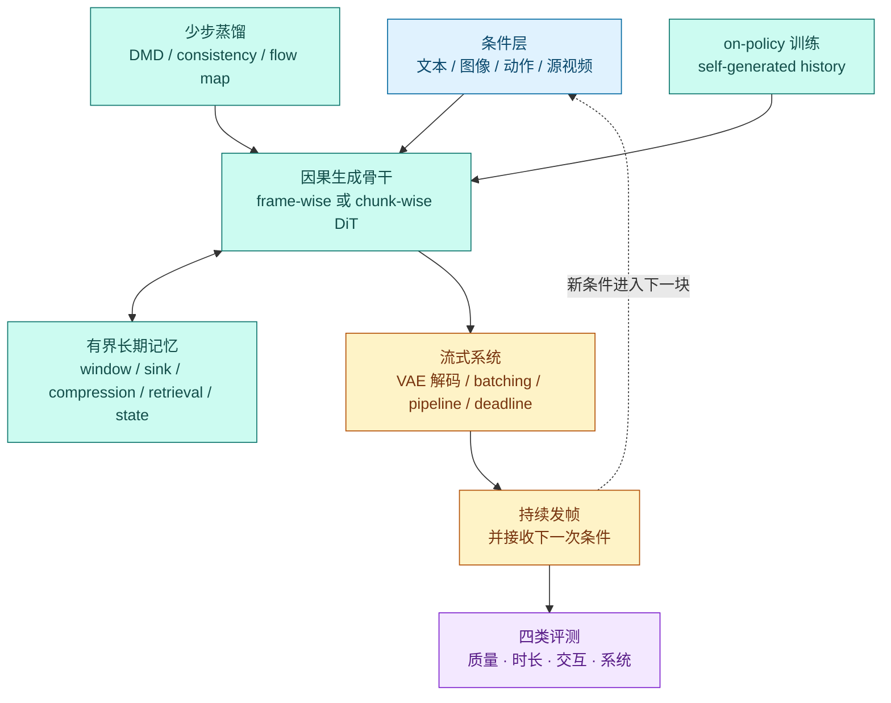

# 因果、流式与实时视频生成：从 Diffusion Forcing 到可交互长视频

离线视频扩散通常先确定一整段 clip，在所有时间位置之间反复交换信息，全部去噪完成后才解码。它适合追求整段一致性，却不适合“画面一边播放，用户一边改变指令”的场景。因果流式生成把视频拆成帧或时间块，只依赖已经生成的历史与当前待生成块，因而可以逐步输出、复用 KV cache，并在未知终止时间下继续生成。

这不是把 attention mask 改成三角形就结束了。真正可用的实时系统必须同时解决四个耦合问题：

1. **分布偏移**：训练时看到真实历史，推理时只能看到自己带误差的历史；
2. **少步生成**：每一帧或每一块若仍需几十次网络调用，因果模型也不会实时；
3. **长期记忆**：全历史 KV cache 会持续增长，短窗口又会忘记身份、布局和早期事件；
4. **系统期限**：平均 FPS 足够不等于流畅；首帧时间、尾延迟、抖动和 deadline miss 同样重要。

本章截至 **2026-08-29**，重点解释这四条路线怎样汇合，以及论文中的“流式”“长视频”“实时”和“交互式”为什么不能互换。

> 图中右侧是抽象机制，不代表所有模型都严格逐帧。很多方法在块与块之间保持因果性，却在当前块内部联合去噪多帧；这通常称为 **chunk-causal** 或 rolling-window generation。

## 1. 先把六个概念分开

| 概念 | 最小定义 | 它不自动保证什么 |
|---|---|---|
| **Causal（因果访问）** | 生成第 $k$ 个块时不能读取尚未生成的未来干净块 | 不保证快、不保证物理因果正确 |
| **Autoregressive（自回归）** | 将联合分布分解为按帧或按块的条件分布 | 不要求每块是离散 token，也不等于语言模型式 next-token |
| **Streaming（流式）** | 完整视频尚未结束时就能持续发出可播放结果 | 不保证帧率达到播放速度 |
| **Real-time（实时）** | 端到端生成与解码持续满足目标播放 deadline | 不等于只报告一个平均 FPS |
| **Long / open-ended（长时或开放时长）** | 能超过训练窗口或在事先未知总长度时继续 rollout | 不保证实时，也不保证越长越不漂移 |
| **Interactive（交互式）** | 新 prompt、参考或动作能在有界延迟内改变后续结果 | 不保证改变符合真实动力学或可用于控制 |

把视频分成 $K$ 个时间块 $b_1,\ldots,b_K$ 后，块级自回归写成：

$$
p(b_{1:K}\mid c)=\prod_{k=1}^{K}p(b_k\mid b_{<k},c_k).
$$

$c_k$ 可以是固定文本，也可以是在生成过程中更新的 prompt、相机控制或智能体动作。若模型在块 $k$ 的 attention 中只能读取 $b_{\le k}$，它在块级是 causal；但 $b_k$ 内的多帧仍可互相注意和联合去噪。

这里的“因果”首先是 **信息访问约束**，不是“模型已经学会因果规律”。一个只能看过去的模型仍可能让物体穿墙；一个动作条件模型也仍需反事实和闭环测试，才能证明其 world-model 能力。

## 2. 为什么双向视频扩散难以流式输出

标准全片 DiT 令所有时空 token 互相注意。若每次去噪都重新处理 $N$ 个视频 token，注意力成本约为 $O(N^2)$；新增未来帧还会改变旧帧的上下文，因此很难把旧计算安全地缓存下来。更关键的是：模型在第一帧的表示中使用了“未来位置”，完整未来不存在时，第一帧的计算图也未闭合。

因果 DiT 将时间注意力限制到历史与当前块。已经发出的块可转成 KV cache，下一块只需计算新的 query 与必要的历史 key/value。若保存全部历史，缓存仍近似随时长线性增长：

$$
M_{KV}\propto L\,N_{history}\,d,
$$

其中 $L$ 是带缓存的层数，$N_{history}$ 是历史 token 数，$d$ 是每层保存的 key/value 宽度。因此“能用 cache”只是起点；窗口、压缩、检索或递归状态决定系统能否在几分钟后继续运行。

## 3. 一张技术栈图：实时不是单个算法

这五层可独立变化。评测发现的暴露偏移、漂移、冻结、遗忘或 deadline miss，应分别反馈到 on-policy 训练、memory policy 或 serving 层。一个论文可能只改训练范式，一个只压缩 KV cache，另一个只做 serving scheduler；比较时必须指出增益来自哪一层，否则容易把多卡系统吞吐误写成生成模型本身的质量进步。

## 4. 训练路线一：Diffusion Forcing 改变“哪些位置有多噪”

传统 next-token 模型把历史视为完全确定、只预测下一个 token；全序列 diffusion 则通常让整段处于统一或相关的噪声阶段。**Diffusion Forcing** 为每个序列 token 采样独立噪声等级，允许历史接近干净、近未来部分去噪、远未来仍很噪 [[1]](#ref-1)。

设第 $i$ 个 token 的噪声等级为 $\tau_i$：

$$
z_i(\tau_i)=\alpha(\tau_i)z_i^0+\sigma(\tau_i)\epsilon_i,
\qquad \tau_i\ \text{可彼此不同}.
$$

这带来三个关键能力：

- 用统一模型覆盖 next-token、next-block 与较长窗口联合生成；
- 采用 rolling noise schedule，在一个移动窗口中逐渐把最早位置去噪并发出；
- 在训练长度之外继续 rollout，并保留 diffusion guidance 的接口。

但 Diffusion Forcing 本身没有消除每块多步采样，也没有自动解决自身历史导致的 exposure bias。后续实时方法通常还要叠加少步蒸馏和 on-policy 训练。

**Rolling Forcing** 进一步不把相邻帧强制成严格“一帧完成后再做下一帧”，而是在移动窗口内联合去噪多个噪声递增的帧；它还保留初始帧的 attention sink 作为全局锚点，并在自生成历史上做扩展窗口蒸馏 [[4]](#ref-4)。这是一个重要取舍：稍微放松帧间严格因果性，换取更慢的误差传播和更平滑的运动。

## 5. 训练路线二：从双向教师蒸馏因果少步学生

### 5.1 CausVid：把 50 步双向模型变成 4 步因果学生

CausVid 的目标不是从头训练一个小模型，而是把已有高质量双向视频 diffusion teacher 迁移成 causal student [[2]](#ref-2)。其关键组件是：

1. 用 teacher 的 probability-flow ODE 轨迹初始化 student；
2. 用 asymmetric DMD，让双向 teacher 监督因果 student；
3. 将约 50 步采样蒸馏到 4 步，并利用 KV cache 流式生成。

它建立了“**高质量离线教师 → 少步因果学生**”的主线，也暴露了一个后来被重新审视的问题：双向 teacher 的流映射是否真能逐帧、一一对应地初始化因果 student。

### 5.2 Teacher Forcing 为什么会在推理时失效

Teacher Forcing 训练第 $k$ 块时使用真实历史：

$$
\hat b_k=f_\theta(b_{<k},\epsilon_k,c).
$$

推理却只能使用模型历史：

$$
\hat b_k=f_\theta(\hat b_{<k},\epsilon_k,c).
$$

即使每一步只产生很小误差，$b_{<k}$ 与 $\hat b_{<k}$ 的分布差异也会随 rollout 放大。这就是 exposure bias。它在视频里表现为身份渐变、背景漂移、色调累积、运动冻结或边界处突然跳变。

### 5.3 Self Forcing：训练时就活在自己的历史中

Self Forcing 在训练阶段进行带 KV cache 的自回归 rollout，让后续帧真实地条件在前面自生成的结果上，再用整段视频级损失评估生成序列 [[3]](#ref-3)。为了避免完整长 rollout 的反向传播成本，它使用 few-step 模型和 stochastic gradient truncation。

其价值不是一句“使用自己的输出”这么简单，而是把训练状态分布推近真实部署状态。代价是：

- 训练变成串行或部分串行，吞吐下降；
- 被 stop-gradient 的历史虽然更真实，却不能从未来损失学习“应该怎样写入更有用的记忆”；
- 若早期 student 太差，on-policy rollout 可能提供低质量上下文。

### 5.4 Causal Forcing：先修正 teacher–student 架构缝隙

Causal Forcing 指出，用双向 teacher 的 PF-ODE 直接初始化逐帧因果 student 需要 frame-level injectivity；双向 teacher 依赖未来帧时，这一条件不成立，student 可能学到条件期望而非 teacher 的真实 flow map [[7]](#ref-7)。它改为先用 **autoregressive teacher** 做 ODE 初始化，再沿用 Self Forcing 式 DMD。

因此，Causal Forcing 不是“加 causal mask”的泛称，而是一套特定蒸馏流程。它处理的是 **架构不匹配**；Self Forcing 主要处理的是 **历史分布不匹配**，两者不是同一个问题。

### 5.5 2026 年的两个延伸：更少步、更可扩展

- **Causal Forcing++** 用 causal consistency distillation 在线取得相邻时间步监督，避免预计算完整 ODE 轨迹，把目标推到 frame-wise 1–2 step，并报告更低首帧延迟与训练成本 [[8]](#ref-8)。
- **Causal-rCM** 将 teacher-forcing consistency model 看作偏 forward-divergence 的初始化，将 self-forcing DMD 看作偏 reverse-divergence 的 on-policy 修正，形成统一的连续时间蒸馏 recipe [[9]](#ref-9)。

这些结果表明，实时质量不只由最终 DMD 决定；student 怎样初始化、teacher 是否与 causal factorization 对齐、前后两阶段优化的散度方向，都会决定少步极限。

## 6. 训练路线三：长期误差不只是 exposure bias

截至 2026 年，研究开始把长期漂移拆成至少四种不同缝隙：

| 缝隙 | 训练时缺少什么 | 典型表现 | 对应路线 |
|---|---|---|---|
| **history-distribution gap** | 没见过自身带误差的历史 | 短时间内误差滚雪球 | Self Forcing [[3]](#ref-3) |
| **finite-train / open-test gap** | 只训练有限秒数，却测试几分钟 | 超过训练窗口后迅速崩坏 | Rolling Sink [[17]](#ref-17) |
| **context-gradient gap** | 未来损失不能训练早期历史怎样写入 KV | 外观可用但长期身份/布局弱 | Self Gradient Forcing [[21]](#ref-21) |
| **representation-planning gap** | 当前状态只为当前帧服务，没有保留未来所需信息 | 当前看对，后面无法延续身份/运动 | Video-Mirai [[20]](#ref-20) |

**Rolling Sink** 是 training-free 的 cache maintenance：它在仅用短片训练的 Self Forcing 模型上重新组织窗口与 sink，作者展示了远超训练长度的 rollout [[17]](#ref-17)。这说明一部分“长视频能力”来自推理时记忆策略，而不全是模型参数中的长期知识。

**Self Gradient Forcing** 用两遍训练补回历史记忆的梯度。第一遍无梯度 rollout 复现推理分布并记录上下文；第二遍并行重算 context KV，让未来 latent 的损失能够监督早期表示怎样写入记忆 [[21]](#ref-21)。它针对的是 Self Forcing 中“历史真实但被冻结”的缺口。

**Video-Mirai** 则只在训练时引入非因果 foresight encoder：完整 rollout 的未来信息作为 stopped-gradient representation target，监督当前 causal state 保留未来有用的身份、布局和运动线索；推理时丢弃 foresight 模块，计算图仍严格 causal [[20]](#ref-20)。一句话概括：**因果性约束推理输入，不必禁止未来帧参与训练监督。**

## 7. 记忆路线：长期一致性与固定资源的真正矛盾

一个流式模型必须回答两个问题：保留哪些历史，以及用什么表示保留。主流方案不是互斥的。

| 记忆形式 | 保存方式 | 优势 | 主要风险 | 代表路线 |
|---|---|---|---|---|
| **Recent window** | 只保留最近 $W$ 帧/块 | 成本固定、局部运动清楚 | 早期身份与事件被彻底遗忘 | 多数 rolling cache 基线 |
| **Sink / anchor** | 固定保留最初帧或少量锚点 | 身份、色调和全局布局稳定 | 过度依赖可导致冻结、难适应新场景 | Rolling Forcing、LongLive、Rolling Sink [[4]](#ref-4), [[5]](#ref-5), [[17]](#ref-17) |
| **Cache compression** | 合并、量化、低秩化或稀疏化历史 KV | 延长有效上下文并降显存 | 压缩误差可能损伤小物体和运动 | FAST-AR、QVG、Forcing-KV、VideoMLA [[10]](#ref-10), [[11]](#ref-11), [[14]](#ref-14), [[15]](#ref-15) |
| **Persistent sparse blocks** | 学习少量长期 salient blocks，并局部稀疏计算 | 兼顾长期线索与近期细节 | 选择错误会永久丢信息 | Sparse Forcing [[13]](#ref-13) |
| **Hierarchical memory** | 近处密、远处稀，旧块逐级合并 | 在固定预算下保留多时间尺度 | 合并策略决定可逆性与细节 | FadeMem [[18]](#ref-18) |
| **Retrieval memory** | 将全部或压缩历史做可搜索外存，按内容取回 | 能跳过已经漂移的最近窗口，找回非局部事件 | 检索错误、索引和一致性成本 | LongLive-RAG [[19]](#ref-19) |
| **Recurrent / SSM state** | 用固定大小递归状态汇总全历史，局部窗口补细节 | 时间线性、内存固定 | 固定状态可能成为信息瓶颈 | VideoSSM、ARL2 [[16]](#ref-16), [[25]](#ref-25) |

几条 2026 年路线说明“压 cache”也不是单一问题：

- FAST-AR 的 TempCache 利用跨帧时间对应压缩历史，并用近似最近邻稀疏 cross/self-attention [[10]](#ref-10)；
- Quant VideoGen 用 semantic-aware smoothing 与 progressive residual quantization 做 2-bit KV cache [[11]](#ref-11)；
- Light Forcing 依据时间块贡献分配递增稀疏率，再用帧级与 block 级的层级 mask 保留局部和关键历史 [[12]](#ref-12)；
- Forcing-KV 根据 attention head 的稳定功能分工，对不同 head 采用结构化或动态剪枝 [[14]](#ref-14)；
- VideoMLA 把逐 head KV 改为共享低秩内容 latent 与解耦的 3D-RoPE positional key [[15]](#ref-15)；
- ARL2 将帧内 softmax attention 与跨帧递归 linear state 分开，以固定状态替代无限历史 softmax cache [[25]](#ref-25)。

这些方法的公平比较至少要固定基础模型、有效历史范围、分辨率、精度和输出时长。只在 5 秒视频上测峰值显存，不能证明几分钟后的内存仍然有界。

## 8. 系统路线：平均 FPS 之外还有 SLO

模型论文常把每秒生成帧数当作实时性的代名词，但在线流媒体需要同时满足：

$$
\text{TTFF},\quad \text{inter-frame latency}_{p50/p95/p99},\quad
\text{jitter},\quad \text{deadline-miss rate},\quad \text{peak memory}.
$$

StreamDiffusionV2 将问题明确写成 serving SLO：使用 SLO-aware batching、block scheduler、sink-guided rolling cache、motion-aware noise controller，并把 diffusion steps 与网络层跨多卡 pipeline 化 [[6]](#ref-6)。它的重要性在于把“生成算法能跑”提升为“在线系统按期限持续发帧”。

### 作者报告的速度数字怎样读

下表只转述各论文的原始设置，**不能直接横向排名**：模型规模、分辨率、步数、GPU、是否含 VAE 解码和多卡并行都不同。

| 工作 | 作者报告 | 必须同时看到的条件 |
|---|---|---|
| CausVid [[2]](#ref-2) | 9.4 FPS | 单 GPU；4-step causal student；摘要未给统一分辨率与完整端到端计时边界 |
| Self Forcing [[3]](#ref-3) | sub-second latency | 单 GPU；摘要未给一个可与他法直接对齐的 FPS 设置 |
| LongLive [[5]](#ref-5) | 20.7 FPS，最长展示 240 s | 单 H100；1.3B 模型；还需查分辨率、精度和解码口径 |
| StreamDiffusionV2 [[6]](#ref-6) | 首帧 <0.5 s；14B 58.28 FPS、1.3B 64.52 FPS | 4×H100；1–4 steps；作者明确称未用 TensorRT/quantization |
| Forcing-KV [[14]](#ref-14) | 单 H200 超过 29 FPS | 480p；论文另报 1080p 的相对 speedup，不能把两项混成同一设置 |
| JoyAI-Video-Edit [[23]](#ref-23) | 约 30 FPS | 单 B200；16B；720p；任务是流式视频编辑而非纯 T2V |

一个更诚实的实时报告应包含：冷启动和热启动 TTFF、逐帧延迟分布、连续 1 分钟以上的 deadline miss、端到端 VAE/传输时间、batch size、精度、编译与量化、GPU 型号与数量、功耗，以及质量随步数变化的曲线。

## 9. 里程碑：按问题定义和能力转折，而不是按论文数量

下面只选改变了问题定义、训练范式、记忆机制或部署协议的节点。它不是“所有相关论文”列表。

| 时间 | 建议里程碑 | 技术转折 | 尚未解决 |
|---|---|---|---|
| 2024 | Diffusion Forcing [[1]](#ref-1) | 独立 per-token noise，把 next-token 的可变长度与全序列 diffusion 的 guidance 放进同一范式 | 推理仍可能多步，长期自身误差未消失 |
| 2024–2025 | CausVid [[2]](#ref-2) | 把双向视频 DiT 蒸馏为 4-step 因果学生，明确面向 streaming 与 KV cache | teacher–student flow map 的架构匹配后来受到质疑 |
| 2025 | Self Forcing [[3]](#ref-3) | 训练时在自生成历史上 rollout，用整段生成质量监督模型 | 历史 KV 被 stop-gradient，长时记忆写入仍弱 |
| 2025 | LongLive / Rolling Forcing [[5]](#ref-5), [[4]](#ref-4) | prompt recache、frame sink、train-long-test-long；联合滚动去噪与 attention sink | 锚点可能僵化，速度/质量设置不统一 |
| 2026 | StreamDiffusionV2 [[6]](#ref-6) | 首次把 TTFF、frame deadline、jitter 与多卡 serving 作为核心系统目标之一 | 多卡结果不代表单卡可部署，基础模型质量仍决定上限 |
| 2026 | Causal Forcing / Causal Forcing++ / Causal-rCM [[7]](#ref-7), [[8]](#ref-8), [[9]](#ref-9) | 从经验蒸馏推进到 causal flow-map 条件、1–2 step initialization 和统一 distillation recipe | 多数结果仍依赖有限 backbone 与作者评测 |
| 2026 | Cache 与稀疏注意力浪潮 [[10]](#ref-10)–[[19]](#ref-19) | 从“滚动窗口”扩展到量化、低秩、分层、递归与检索记忆 | 尚无统一的质量—时长—显存 Pareto benchmark |
| 2026 | Video-Mirai / Self Gradient Forcing [[20]](#ref-20), [[21]](#ref-21) | 分别补未来表示监督与历史 context-gradient，开始训练“会为未来写记忆”的 causal state | 均为新近预印本，跨模型独立复现仍有限 |
| 2026 | Stream4D / MV-Forcing / JoyAI-Video-Edit [[22]](#ref-22)–[[24]](#ref-24) | 把流式 AR 扩展到动态 4D 奖励、多视角和开放时长编辑 | 任务协议不同，不能用单一 VBench 分数概括 |

## 10. “长视频”不等于“实时”：三个常见误读

### 10.1 展示几分钟，不代表几分钟都稳定

平均质量分可能掩盖“第 37 秒开始崩坏”。长期评测应画出质量随时间的轨迹，并报告首次明显失败时间或 survival curve，而不是只对整段抽样若干帧。

### 10.2 固定显存，不代表记忆没有损失

窗口、压缩或递归状态都能让显存有界，但信息容量也随之受限。应专门测试：对象离场后返回、早期颜色/身份在数分钟后恢复、非局部事件回忆、场景切换后不被旧锚点污染。

### 10.3 支持新 prompt，不代表是 world model

动态 prompting 证明模型能在语义条件变化后继续生成；world model 还需要动作条件的状态转移、反事实一致性、可重复环境响应，以及控制或规划的闭环收益。文字让汽车“左转”与方向盘动作导致正确轨迹不是同一证据。

## 11. 长时流式生成的八类失败

1. **Exposure bias**：自身误差进入下一步条件，逐块放大；
2. **Identity / layout drift**：人物、物体和背景慢慢变成另一个状态；
3. **Motion freezing**：为保持外观一致，模型收敛到几乎不动的安全解；
4. **Boundary seam**：块边界的速度、光照或纹理突然跳变；
5. **Cache poisoning**：一个错误块被长期缓存，后续不断强化错误；
6. **Anchor lock-in**：初始 sink 太强，后续新 prompt 或场景变化无法生效；
7. **Memory eviction**：早期事件被窗口移出，对象回归时身份重置；
8. **Deadline collapse**：平均 FPS 尚可，但缓存增长或调度抖动导致尾延迟恶化。

Stream4D 还指出一个更隐蔽的训练捷径：用静态 3D reconstruction critic 奖励动态视频时，真实运动会被当成重建误差，模型反而可通过冻结画面取得高分；其 4D reconstruction reward、motion prior 与 perceptual anchor 尝试让几何一致与自然运动不再互相惩罚 [[22]](#ref-22)。

## 12. 最小公平评测协议

### 12.1 生成质量

- 画质、文本/动作遵循、运动幅度与多样性分开报告；
- 除 VBench/VBench-Long 外，加入人工配对评测和逐时段诊断；
- 固定生成次数与样本选择规则，避免 best-of-many；
- 报告冻结、重复循环、突然剪切和小对象消失的专项比例。

### 12.2 长时稳定

- 至少测试训练长度内、2×、6×、12× 和分钟级时长；
- 每个时长报告身份、背景、布局、颜色和运动，而不是只报总分；
- 加入对象离场—回归、相机绕行、场景切换与早期事件回忆；
- 画质量—时间曲线，并报告首次不可接受失败的分布。

### 12.3 交互性

- 在固定帧注入新 prompt、参考或动作；
- 测量条件到生效帧的 response latency；
- 同时检查新条件遵循与旧状态保留；
- 对 cache recache、prompt blending 和无 recache 基线做消融。

### 12.4 系统性能

- 固定模型、参数量、输出分辨率、帧率、denoising steps、precision 与 batch；
- 分开报告模型 kernel、VAE 解码、调度、传输和完整端到端时间；
- 报 TTFF、p50/p95/p99 inter-frame latency、jitter、deadline miss、峰值显存与功耗；
- 至少持续运行 1 分钟，验证缓存和吞吐不会随时长恶化；
- 同时给单卡与多卡结果，不能用多卡 aggregate FPS 替代单流延迟。

## 13. 研究路线怎样选

| 如果你的核心问题是 | 优先复现 | 必做对照 |
|---|---|---|
| 少步因果蒸馏 | CausVid → Self Forcing → Causal Forcing | 同一 teacher、同一 backbone、同一 step 数 |
| 超过训练窗口 | Rolling Forcing / Rolling Sink / SGF | 质量随时长曲线、固定 cache 预算 |
| 记忆与显存 | FAST-AR / QVG / Sparse Forcing / VideoMLA | 相同有效历史、峰值显存、首次失败时间 |
| prompt 实时切换 | LongLive | recache vs 不 recache，响应延迟与旧状态保持 |
| serving 系统 | StreamDiffusionV2 | TTFF、p99、deadline miss、多卡 scaling efficiency |
| 交互 world model | Causal-rCM / Causal Forcing++ 的 action-conditioned 扩展 | 动作反事实、环境一致性、闭环控制收益 |
| 流式编辑 | JoyAI-Video-Edit | 源视频保持、编辑成功、长时漂移、端到端 720p 延迟 |
| 几何与动态一致 | Stream4D / MV-Forcing | 4D reconstruction、motion collapse、多视角/长时联合测试 |

## 14. 最小阅读路径

1. **Diffusion Forcing**：理解独立噪声日程怎样连接 next-token 与全序列 diffusion；
2. **CausVid**：理解双向 teacher 到少步 causal student；
3. **Self Forcing**：理解 exposure bias 与 on-policy rollout；
4. **Causal Forcing**：理解 teacher–student 架构缝隙；
5. **Rolling Forcing + LongLive**：理解联合滚动去噪、sink、recache 与 train-long-test-long；
6. **StreamDiffusionV2**：理解模型速度与在线 SLO 的区别；
7. **FAST-AR / QVG / VideoMLA / LongLive-RAG**：比较缓存压缩、量化、低秩和检索；
8. **Video-Mirai + Self Gradient Forcing + Stream4D**：进入“为未来写表示”“补历史梯度”和动态 4D 奖励的新问题。

## 15. 证据边界与调研方法

- 本章的速度、分数与最长时长均标为**作者报告**；除正式会议页面外，不把预印本主张写成社区共识。
- 不跨硬件、分辨率、模型规模、步数或是否含 VAE 解码直接排名。
- “可开放生成几分钟”“可实时”“可交互”“可作为 world model”分别需要不同证据。
- 检索日期、数据库、查询式、纳入/排除标准和失败的检索接口记录在 [因果流式视频生成调研审计](../../sources/research_20260829_causal_streaming_video.md)。

## 参考文献

[1] [Diffusion Forcing: Next-token Prediction Meets Full-Sequence Diffusion](https://arxiv.org/abs/2407.01392). Boyuan Chen, Diego Marti Monso, Yilun Du, Max Simchowitz, Russ Tedrake, Vincent Sitzmann. NeurIPS. 2024.

[2] [From Slow Bidirectional to Fast Autoregressive Video Diffusion Models](https://arxiv.org/abs/2412.07772). Tianwei Yin, Qiang Zhang, Richard Zhang, William T. Freeman, Fredo Durand, Eli Shechtman, Xun Huang. CVPR. 2025.

[3] [Self Forcing: Bridging the Train-Test Gap in Autoregressive Video Diffusion](https://arxiv.org/abs/2506.08009). Xun Huang, Zhengqi Li, Guande He, Mingyuan Zhou, Eli Shechtman. NeurIPS Spotlight. 2025.

[4] [Rolling Forcing: Autoregressive Long Video Diffusion in Real Time](https://arxiv.org/abs/2509.25161). Kunhao Liu, Wenbo Hu, Jiale Xu, Ying Shan, Shijian Lu. arXiv preprint. 2025.

[5] [LongLive: Real-time Interactive Long Video Generation](https://arxiv.org/abs/2509.22622). Shuai Yang, Wei Huang, Ruihang Chu, et al. arXiv preprint. 2025.

[6] [StreamDiffusionV2: A Streaming System for Dynamic and Interactive Video Generation](https://proceedings.mlsys.org/paper_files/paper/2026/hash/698cfaf72a208aef2e78bcac55b74328-Abstract-Conference.html). Tianrui Feng, Zhi Li, Shuo Yang, et al. MLSys. 2026.

[7] [Causal Forcing: Autoregressive Diffusion Distillation Done Right for High-Quality Real-Time Interactive Video Generation](https://arxiv.org/abs/2602.02214). Hongzhou Zhu, Min Zhao, Guande He, Hang Su, Chongxuan Li, Jun Zhu. ICML. 2026.

[8] [Causal Forcing++: Scalable Few-Step Autoregressive Diffusion Distillation for Real-Time Interactive Video Generation](https://arxiv.org/abs/2605.15141). Min Zhao, Hongzhou Zhu, Kaiwen Zheng, et al. arXiv preprint. 2026.

[9] [Causal-rCM: A Unified Teacher-Forcing and Self-Forcing Open Recipe for Autoregressive Diffusion Distillation](https://arxiv.org/abs/2606.25473). Kaiwen Zheng, Guande He, Min Zhao, et al. Technical report. 2026.

[10] [Fast Autoregressive Video Diffusion and World Models with Temporal Cache Compression and Sparse Attention](https://arxiv.org/abs/2602.01801). Dvir Samuel, Issar Tzachor, Matan Levy, Michael Green, Gal Chechik, Rami Ben-Ari. ICML. 2026.

[11] [Quant VideoGen: Auto-Regressive Long Video Generation via 2-Bit KV-Cache Quantization](https://arxiv.org/abs/2602.02958). Haocheng Xi, Shuo Yang, Yilong Zhao, et al. ICML. 2026.

[12] [Light Forcing: Accelerating Autoregressive Video Diffusion via Sparse Attention](https://arxiv.org/abs/2602.04789). Chengtao Lv, Yumeng Shi, Yushi Huang, Ruihao Gong, Shen Ren, Wenya Wang. ICML. 2026.

[13] [Sparse Forcing: Native Trainable Sparse Attention for Real-time Autoregressive Diffusion Video Generation](https://arxiv.org/abs/2604.21221). Boxun Xu, Yuming Du, Zichang Liu, et al. arXiv preprint. 2026.

[14] [Forcing-KV: Hybrid KV Cache Compression for Efficient Autoregressive Video Diffusion Models](https://arxiv.org/abs/2605.09681). Yicheng Ji, Zhizhou Zhong, Jun Zhang, et al. arXiv preprint. 2026.

[15] [VideoMLA: Low-Rank Latent KV Cache for Minute-Scale Autoregressive Video Diffusion](https://arxiv.org/abs/2605.30351). Hidir Yesiltepe, Jiazhen Hu, Tuna Han Salih Meral, et al. arXiv preprint. 2026.

[16] [VideoSSM: Autoregressive Long Video Generation with Hybrid State-Space Memory](https://arxiv.org/abs/2512.04519). Yifei Yu, Xiaoshan Wu, Xinting Hu, et al. arXiv preprint. 2025.

[17] [Rolling Sink: Bridging Limited-Horizon Training and Open-Ended Testing in Autoregressive Video Diffusion](https://arxiv.org/abs/2602.07775). Haodong Li, Shaoteng Liu, Zhe Lin, Manmohan Chandraker. arXiv preprint. 2026.

[18] [FadeMem: Distance-Aware Memory Consolidation for Autoregressive Video Diffusion](https://arxiv.org/abs/2606.10671). Yu Lu, Junjie Yang, Piotr Koniusz, YuXin Song, Yi Yang. arXiv preprint. 2026.

[19] [LongLive-RAG: A General Retrieval-Augmented Framework for Long Video Generation](https://arxiv.org/abs/2606.02553). Qixin Hu, Shuai Yang, Wei Huang, Song Han, Yukang Chen. arXiv preprint. 2026.

[20] [Video-Mirai: Autoregressive Video Diffusion Models Need Foresight](https://arxiv.org/abs/2606.03971). Yonghao Yu, Lang Huang, Runyi Li, Zerun Wang, Toshihiko Yamasaki. arXiv preprint. 2026.

[21] [Self Gradient Forcing: Native Long Video Extrapolation](https://arxiv.org/abs/2607.20368). Junhao Zhuang, Shiyi Zhang, Yuxuan Bian, et al. arXiv preprint. 2026.

[22] [Stream4D: 4D-Consistency for Streaming Autoregressive Diffusion Video Models](https://arxiv.org/abs/2608.19556). Yuanhao Ban, Jiaqi Feng, Hengguang Zhou, Xiaohuan Pei, Justin Cui, Cho-Jui Hsieh. arXiv preprint. 2026.

[23] [JoyAI-Video-Edit: Real-Time Open-Ended Video Editing with Autoregressive Diffusion](https://arxiv.org/abs/2608.03974). Yicheng Xiao, Wenxun Dai, Xinran Qin, et al. arXiv preprint. 2026.

[24] [MV-Forcing: Long Multi-View Video Generation via 4D-Grounded Spatio-Temporal Self-Forcing](https://arxiv.org/abs/2607.05376). Gal Fiebelman, Hadar Averbuch-Elor, Sagie Benaim. ECCV. 2026.

[25] [Attend Locally, Remember Linearly: Linear Attention as Cross-Frame Memory for Autoregressive Video Diffusion](https://arxiv.org/abs/2605.16579). Kunyang Li, Mubarak Shah, Yuzhang Shang. arXiv preprint. 2026.
