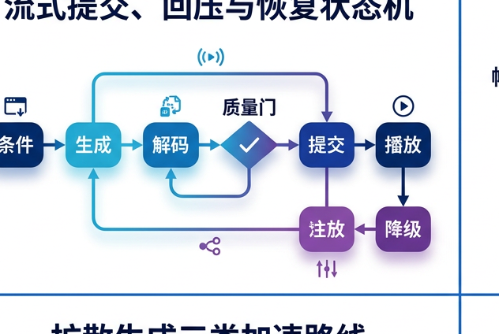
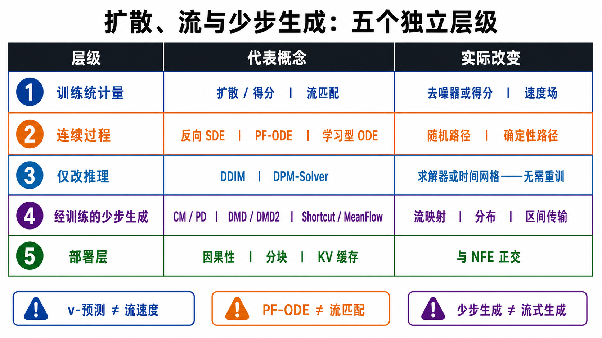
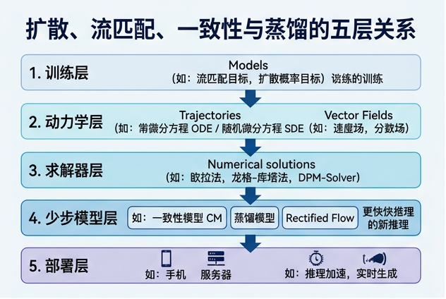
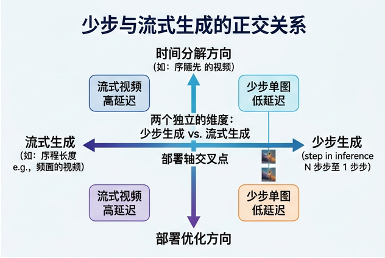

# Flow、Consistency 与 Few-Step 生成：从概率流到分布蒸馏

> 本章截至 2026-08-30，依据正式会议论文与作者官方材料整理。核心目标不是背方法名，而是判断一个方法究竟在学习什么、依赖谁提供监督、采样时真正调用网络多少次，以及它是否真的解决了视频的时间因果与在线服务问题。

## 📋 1. 先建立正确坐标系

Flow matching（FM）、rectified flow（RF）、consistency model（CM）、MeanFlow 与 distribution matching distillation（DMD）常被统称为“少步生成”，但它们优化的对象并不相同：

1. **场（field）**：给定当前位置与时间，预测瞬时速度；FM 与 RF 属于这一类。
2. **区间平均量（interval quantity）**：直接预测一段时间上的平均速度；MeanFlow 属于这一类。
3. **流映射（flow map）**：把轨迹上任一点直接映射到终点或另一时刻；CM、Shortcut、FACM 与 AlphaFlow从不同角度约束这类对象。
4. **分布（distribution）**：让少步学生的输出分布接近教师分布；DMD 与 DMD2 属于这一类。

阅读任何“one-step / few-step”论文时，应依次问五个问题：

- 学的是瞬时场、区间映射，还是输出分布？
- 监督来自解析条件路径、真实数据、预训练教师，还是模型自己的 rollout？
- 论文所说的 step 是否等于真实 neural function evaluation（NFE）？
- 方法只压缩去噪时间，还是也改变了视频帧之间的联合、双向或因果分解？
- 证据来自 ImageNet/文本到图像、离线短视频，还是连续在线视频服务？

为避免两个“时间”混淆，本章用：

- $k=1,\ldots,K$ 表示**视频帧或 latent chunk 的数据时间**；
- $\tau$ 表示 diffusion 的**加噪时间**，通常从数据走向噪声；
- $s$ 表示 flow 的**运输时间**，本章约定 $s=0$ 为先验、$s=1$ 为数据。

“无外部教师”也不等于“没有监督目标”。FM 有解析的条件速度，Shortcut 有自举的一致性目标，MeanFlow 有平均速度恒等式；reflow 则使用前一代模型生成的耦合。反过来，“一步采样”也不等于一步训练：训练往往仍需随机时间、Jacobian-vector product（JVP）、额外判别器或教师 score。

## 🔗 2. Diffusion、score 与 PF-ODE 是理解 flow 的桥

### 2.1 从 DDPM 到连续时间 score

DDPM 先定义逐步加噪的前向马尔可夫链，再学习反向条件分布 [[1]](#ref-1)。连续写法常把任意时刻的扰动核记为

```math
q_\tau(x_\tau\mid x_0)
=
\mathcal N\!\left(
x_\tau;\alpha_\tau x_0,\sigma_\tau^2 I
\right).
```

若网络预测噪声 $\epsilon_\theta$，则它与条件 score 的典型关系为

```math
\nabla_{x_\tau}\log q_\tau(x_\tau\mid x_0)
=
-\frac{\epsilon}{\sigma_\tau}.
```

边缘 score 是 $s_\tau(x)=\nabla_x\log p_\tau(x)$。Score-SDE 把加噪过程写成 [[2]](#ref-2)

```math
\mathrm d x
=
f(x,\tau)\,\mathrm d\tau
+
g(\tau)\,\mathrm dW_\tau.
```

在精确 score 下，可以沿两种动力学返回数据：

```math
\mathrm d x
=
\left[f(x,\tau)-g(\tau)^2s_\tau(x)\right]\mathrm d\tau
+
g(\tau)\,\mathrm d\bar W_\tau,
```

这是反向时间 SDE；或者使用 probability-flow ODE（PF-ODE）

```math
\frac{\mathrm d x}{\mathrm d\tau}
=
f(x,\tau)-\frac{1}{2}g(\tau)^2s_\tau(x).
```

两者在 score 精确、方程求解精确的理想条件下共享各时刻边缘分布，但样本路径不同：前者随机，后者确定。DDIM [[3]](#ref-3) 与 DPM-Solver [[4]](#ref-4) 主要改变**已有 diffusion/score 模型的采样器**；它们本身不是 FM 训练目标。

### 2.2 一张图看清从 score 到 flow


**图的顺序化文字替代：**

1. 数据经离散加噪或前向 SDE 形成噪声边缘族。
2. 网络从噪声样本学习边缘 score。
3. 学得的 score 可驱动随机反向 SDE，也可驱动确定性的 PF-ODE。
4. FM 先按端点或条件变量构造条件概率路径。
5. 条件路径给出容易计算的条件速度。
6. 对条件变量取后验期望得到边缘速度场，再用回归学习它。
7. 对学习场做数值积分才得到模型轨迹；PF-ODE 与该轨迹都是 ODE，但训练来源不同。

### 2.3 必须分开的三层

设条件变量 $Z$ 包含端点或数据条件。第一层是人为选择、且通常可采样的**条件路径**

```math
p_s(x\mid Z),\qquad
p_s(x)=\int p_s(x\mid z)q(z)\,\mathrm dz.
```

第二层是边缘分布真正遵循的**边缘速度场**

```math
u_s(x)
=
\mathbb E\!\left[
u_s(X_s\mid Z)\mid X_s=x
\right].
```

第三层才是网络近似和数值求解产生的**学习 ODE 轨迹**

```math
\frac{\mathrm d\hat X_s}{\mathrm ds}
=
v_\theta(\hat X_s,s),
\qquad
\hat X_0\sim p_{\mathrm{prior}}.
```

这三层不能混写。即使每个端点对的条件路径是直线，不同条件路径在同一位置会发生平均，边缘场未必是常向量；有限数据、有限模型与有限 NFE 又会使学习轨迹偏离理想边缘流。因此，“直线插值”不推出“所有生成轨迹都是直线”，更不推出“一步无损”。

<a id="five-layer-map"></a>

### 2.4 五层地图：不要把 objective、dynamics、solver、student 和 serving 画成一条线

最容易误读的地方不是某个公式，而是同一篇论文可能同时改动多个层次。一个方法至少要回答五个互相独立的问题：网络在训练时拟合什么统计量；该统计量定义或参数化什么连续过程；推理时是否只换数值求解器；是否另训练少步 student；视频数据时间上是否因果、分块并持续交付。下面的 PNG 用五行矩阵帮助记忆，随后 Mermaid 才给出可编辑、可审计的谱系关系。



**图：五层不能压成一个方法名。** 第一、二层描述模型学到的场与对应连续过程；第三层只替换已有模型的积分方法或时间网格；第四层会优化新的参数或 student；第五层处理视频时间 $k$ 上的因果性和系统交付。图中 `CM / PD` 是紧凑记忆标签，不表示二者损失相同；`Shortcut / MeanFlow` 也只表示两者都学习跨区间运输信息。


**顺序化文字替代：** 第一，DDPM/score 训练学习可换算的 denoiser 或 score，既能驱动随机 reverse SDE，也能驱动确定 PF-ODE；第二，FM/RF 回归的是由所选概率路径和耦合诱导的边缘速度，生成时积分 learned ODE；第三，DDIM、DPM-Solver 或新时间网格通常复用已有场，不产生新 student；第四，PD/CD/CM 对齐轨迹或 flow map，DMD/DMD2 对齐教师与学生分布，Shortcut/MeanFlow/$\alpha$-Flow 学习跨步长或区间运输；第五，以上任一路线都还需独立选择 causal attention、chunking、KV cache 和服务流水线，少 NFE 本身不提供 streaming。

| 看到的词 | 它真正改变什么 | 不能据此推出什么 | 最低复现字段 |
|---|---|---|---|
| diffusion 的 $v$ prediction | 同一高斯扰动下的输出参数化 | 采用 RF 或 FM | $\alpha/\sigma$ 约定、目标换算、loss weighting |
| PF-ODE | 从 score-SDE 导出的确定动力学 | 训练目标是 FM | score 参数化、ODE 方程、solver、时间网格 |
| FM / RF | 概率路径、耦合与速度回归目标 | 轨迹天然一步、语义线性 | 条件路径、端点耦合、时间采样、NFE |
| DDIM / DPM-Solver | sampler、solver 或离散节点 | 训练了少步生成器 | checkpoint、NFE、阶数、CFG 调用、容差 |
| PD / CM | 确定性教师轨迹压缩或 flow-map 一致性 | CM 必然有教师、部署必为 1 NFE | CT/CD、teacher、target/EMA、refinement 步数 |
| DMD / DMD2 | 用 target/fake score 做分布蒸馏；DMD2 再加具体稳定化和 GAN 信号 | 与 CM 同一目标、不会丢模式 | teacher、fake-score 更新比、GAN、on-policy 状态、覆盖指标 |
| causal / streaming | 视频时间上的信息可见性、状态缓存与交付协议 | 噪声轴 NFE 自动减少 | chunk、lookahead、KV 状态、首帧延迟、稳态吞吐、无限续写协议 |

这张谱系图的边只表示**常见构造或监督来源**，不是唯一依赖关系。例如 CM 既可做 consistency distillation，也可 standalone consistency training [[7]](#ref-7)；FACM 把 FM 锚点与 shortcut objective 组合，$\alpha$-Flow 则把 trajectory FM、Shortcut 与 MeanFlow 放进统一目标族 [[14]](#ref-14) [[15]](#ref-15)。这类 2026 汇合工作说明边界可以被联合优化，但没有让五个层次变成同义词。

## 📚 3. Flow Matching、Rectified Flow 与 reflow

### 3.1 Flow Matching：回归条件速度，隐式学到边缘场

FM 通过条件路径绕开不可直接获得的边缘速度。其 conditional flow matching 目标可写为 [[5]](#ref-5)

```math
\mathcal L_{\mathrm{CFM}}
=
\mathbb E_{s,Z,X_s}
\left[
\left\|
v_\theta(X_s,s)-u_s(X_s\mid Z)
\right\|_2^2
\right].
```

在合适的可积条件下，平方损失的最优解就是上一节的条件期望 $u_s(x)$。这里“simulation-free training”只表示训练每个样本时无需先解完整 ODE；生成时仍要积分学习场，通常需要多次 NFE。

### 3.2 Rectified Flow：直线条件桥，不是“语义线性”

RF 选择先验样本 $A$ 与数据样本 $B$ 的耦合，并用直线条件路径 [[6]](#ref-6)

```math
X_s=(1-s)A+sB,
\qquad
u_s(X_s\mid A,B)=B-A.
```

网络仍学的是在给定 $X_s$ 后对许多端点速度的条件平均。RF 的优势是目标简单、可与常规回归结合，并倾向于形成更易积分的运输；它不保证真实数据语义沿像素或 latent 直线变化。

### 3.3 Reflow：用模型诱导耦合再“拉直”

初始 RF 可用独立的 $(A,B)$ 耦合。训练出模型后，从 $A$ 出发积分旧模型得到 $\tilde B$，再以 $(A,\tilde B)$ 为新耦合训练直线速度，称为 reflow。它改变的是**端点耦合与轨迹几何**：

- 它通常不需要另一个外部 diffusion 教师；
- 但它依赖上一代 flow 产生的自目标，误差也可能被继承；
- 多轮 reflow 与一步蒸馏不是同义词；
- 轨迹更直只降低数值积分难度，不自动证明分布覆盖或视频运动更好。

| 方法 | 条件路径 / 耦合 | 学习对象 | 外部教师 | 典型采样 |
|---|---|---|---|---|
| FM | 一般可采样概率路径 | 瞬时边缘速度场 | 不需要 | ODE 多步 |
| 初始 RF | 常用独立端点的直线桥 | 瞬时边缘速度场 | 不需要 | ODE 多步，可少步化 |
| Reflow | 旧模型诱导的端点耦合 | 更易积分的速度场 | 无外部教师，但依赖旧模型 | 视训练与求解器而定 |

## 🔄 4. 轨迹与 flow-map 家族

### 4.1 CM：同一参考轨迹上的点应映射到同一终点

CM 学习 $f_\theta(x_\tau,\tau)$，把参考 PF-ODE 轨迹上的任一点映射到接近数据端的 $x_\varepsilon$ [[7]](#ref-7)：

```math
f_\theta(x_\tau,\tau)
\approx
f_\theta(x_{\tau'},\tau'),
\qquad
f_\theta(x_\varepsilon,\varepsilon)=x_\varepsilon.
```

需要区分两条训练路线：

- **Consistency distillation（CD）**：用预训练 diffusion/score 教师给出相邻轨迹点或 ODE 方向，明确依赖教师。
- **Consistency training（CT）**：从数据与加噪过程直接训练，不依赖外部教师，但目标估计和优化更难。

CM 支持一步生成，也可把输出重新加噪后做多步 refinement。于是“consistency model”表示目标结构，不表示部署时必定 1 NFE。

### 4.2 sCM：连续时间、稳定参数化与可扩展训练

Simplified, Stable and Scalable Consistency Models（sCM）把离散时间一致性推广为连续时间目标，并通过参数化、归一化与 JVP 计算改善大规模训练稳定性 [[10]](#ref-10)。仍应区分：

- **sCT** 是独立一致性训练路线；
- **sCD** 是教师蒸馏路线；
- 论文中最强的大规模文本到图像结果采用预训练扩散模型的初始化与蒸馏，不能据此把所有 sCM 都称为“从头训练”。

JVP 是训练成本，不应误算为采样 NFE；反之，一步采样也不能掩盖教师预训练成本。

### 4.3 rCM：用 score 正则把连续时间一致性扩展到大模型

Score-regularized continuous-time consistency model（rCM）从预训练 diffusion/flow 教师蒸馏连续时间一致性函数，并加入 score distillation 作为 long-skip 正则 [[13]](#ref-13)。作者还以适配并行训练的 JVP 实现把方法扩展到 Cosmos-Predict2 与 Wan2.1 等视频骨干，报告了最高 14B 参数、5 秒视频、1–4 步及其测试设置下 15–50 倍加速。

这里的证据边界很重要：

- 这是截至本章日期最直接的大规模 consistency 视频证据之一；
- 加速是作者特定模型、分辨率、硬件和基线设置下的结果，不是所有视频任务的常数；
- 论文把基础连续时间 consistency 的 forward-divergence 倾向解释为 mode-covering，并用更偏 mode-seeking 的 score 正则改善细节；这是一种互补折中，不是对 mode collapse 的绝对保证；
- “更覆盖模式”不是“已证明完全覆盖真实视频分布”。

### 4.4 Shortcut：一个网络适配不同步长

Shortcut Models 把期望步长 $d$ 也作为网络输入，并学习可组合的有限步更新 [[11]](#ref-11)。令

```math
\Phi_\theta(x,t,d)
=
x+d\,s_\theta(x,t,d),
```

其自一致性约束近似为

```math
\Phi_\theta(x,t,2d)
\approx
\Phi_\theta(
\Phi_\theta(x,t,d),t+d,d
).
```

训练同时使用 flow 目标与由小步组合产生的 bootstrap 目标，因此不需要外部生成教师，但会依赖自身或 EMA 目标。部署时同一网络可按预算选择不同步数；这与只能固定在单一 NFE 的蒸馏器不同。正式论文的核心证据主要来自图像生成。

### 4.5 MeanFlow：直接预测区间平均速度

MeanFlow 不把瞬时速度近似为一次大 Euler 步，而是学习区间 $[r,t]$ 的平均速度 [[12]](#ref-12)：

```math
u(z_t,r,t)=\frac{1}{t-r}\int_r^t v(z_\tau,\tau)\,\mathrm d\tau.
```

沿轨迹对时间求全导数可得到连接平均速度与瞬时速度的恒等式，论文据此构造训练目标：

```math
u=v-(t-r)\frac{\mathrm d u}{\mathrm dt}.
```

一次区间更新为

```math
z_r=z_t-(t-r)u_\theta(z_t,r,t).
```

MeanFlow 的正式 NeurIPS 2025 论文强调无需预训练、蒸馏或课程学习，并在 ImageNet 256×256 上给出 1-NFE 证据；这是图像证据，不能直接改写成视频一步生成结论。

### 4.6 FACM 与 AlphaFlow：不要把 2026 方法混成同一条支线

Flow-Anchored Consistency Model（FACM）以一个 FM 轨迹锚点结合流匹配监督与一致性捷径，直接学习当前状态到锚点的平均速度 [[14]](#ref-14)。其公开实验主要蒸馏预训练 LightningDiT，在图像/文本到图像上验证 1–2 NFE；因此“公式可训练”与“论文最强实验依赖教师”必须分开表述。

AlphaFlow 则分析 MeanFlow 训练中轨迹 FM 与轨迹 consistency 两部分的负梯度相关，提出分解与课程策略，并报告从头训练的 1–2 NFE 图像结果 [[15]](#ref-15)。它与 FACM 的共同点是学习跨区间的运输信息；不同点是理论分解、训练配方与公开教师依赖。两者截至本章日期都没有与 rCM 同等级的直接大规模视频证据。

## 🎯 5. DMD 与 DMD2：分布层蒸馏

### 5.1 DMD 优化的是学生分布，不是参考轨迹逐点一致

DMD 令一步生成器 $G_\theta(z)$ 的分布 $p_\theta$ 逼近预训练 diffusion 教师的分布 $p_{\mathrm T}$ [[8]](#ref-8)。其分布匹配梯度可概念化为

```math
\nabla_\theta D_{\mathrm{KL}}
\!\left(p_\theta\|p_{\mathrm T}\right)
\propto
\mathbb E
\left[
w(\tau)
\left(
s_\theta(x_\tau,\tau)
-s_{\mathrm T}(x_\tau,\tau)
\right)
\frac{\partial G_\theta(z)}{\partial\theta}
\right],
```

其中 $s_{\mathrm T}$ 是教师 score，$s_\theta$ 是在线估计学生当前假样本分布的 fake score。原始 DMD 还使用真实数据与教师确定性采样得到的回归配对，以稳定训练。

这个目标是分布层的 reverse KL。它能容忍教师不同轨迹，只要求学生输出分布匹配；代价是 reverse KL 对“学生遗漏而教师仍有概率质量”的惩罚较弱，存在 mode-seeking / mode-dropping 风险。该风险是目标倾向，不代表每个 DMD 模型都必然坍缩。

### 5.2 DMD2 去掉回归数据集，但没有去掉教师

DMD2 的主要变化包括 [[9]](#ref-9)：

1. 用 two-time-scale update rule 更频繁地更新 fake-score 模型，减少 score 估计滞后；
2. 加入 adversarial loss，改善学生未覆盖区域的反馈；
3. 采用 on-policy 多步生成训练，使学生可在少量多步采样中修正自身状态。

它不再需要原始 DMD 的回归数据集，但目标 score 仍由预训练 diffusion 教师提供，所以“data-free regression”不能写成“teacher-free”。DMD2 的正式论文核心证据是图像生成；视频系统若采用 DMD2，还需单独核验视频训练与时间一致性证据。

### 5.3 视频中的直接例子：CausVid

CausVid 把 50-step 双向视频 diffusion 教师蒸馏为 4-step 因果自回归学生，并用 DMD 与判别式训练缓解分布偏移 [[17]](#ref-17)。它同时做了两件事：

- **few-step objective**：把噪声/运输时间上的多步去噪压到 4 步；
- **causal factorization**：把视频数据时间上的双向联合生成改成按帧或 chunk 因果生成。

因此，CausVid 的实时性不能只归因于 DMD；因果注意力、KV cache、chunk 设计、硬件与流水线也共同决定吞吐和首帧延迟。

## 📊 6. 教师、训练信号、NFE 与覆盖横向比较

### 6.1 训练监督对照

| 家族 | 主要学习对象 | 关键训练信号 | 外部教师依赖 | 必须保留的边界 |
|---|---|---|---|---|
| FM | 瞬时边缘速度场 | 解析条件速度回归 | 否 | 采样仍需解 ODE |
| RF | 直线桥诱导的边缘速度场 | 端点差 $B-A$ | 否 | 条件直线不等于边缘轨迹直线 |
| Reflow | 重耦合后的速度场 | 旧模型生成端点对 | 无外部教师，依赖旧模型 | 可能继承旧模型偏差 |
| CM-CD | 终点 flow map | 教师 PF-ODE 相邻点一致性 | 是 | 一步是部署选项，不是定义 |
| CM-CT | 终点 flow map | 数据加噪与自一致性 | 否 | 从头训练通常更难 |
| sCM | 连续时间 consistency function | sCT 或 sCD、JVP | 视路线而定 | 最强大规模结果不能代表全部 teacher-free |
| rCM | score-regularized consistency function | 教师蒸馏、JVP、score 正则 | 是 | 大规模视频证据强，但仍继承教师边界 |
| Shortcut | 步长条件 flow map | FM + 自举组合一致性 | 否 | 自举目标不是外部教师 |
| MeanFlow | 区间平均速度 | 平均速度恒等式与 JVP | 否 | 正式核心证据为图像 |
| FACM | 到锚点的平均速度 / map | FM 锚点 + consistency | 公开最强实验是蒸馏 | 公式路线与实验配方要分开 |
| AlphaFlow | 分解后的区间运输目标 | trajectory FM + consistency + curriculum | 否 | 公开证据为图像 |
| DMD | 学生输出分布 | teacher score − fake score + 回归 | 是 | reverse-KL 有 mode-seeking 倾向 |
| DMD2 | 学生输出分布 | 双时间尺度 fake score + GAN + on-policy | 是 | 去掉回归集不等于去掉教师 |

### 6.2 NFE、覆盖与视频证据

下表中的 NFE 是论文典型目标或公开设置，不是方法的永久上限，也不是跨论文可直接比较的性能指标。

| 方法类别 | 典型部署 NFE | 覆盖风险的主要来源 | 截至 2026-08-29 的直接视频证据 |
|---|---:|---|---|
| FM / RF | 多步；可用低阶求解器减步 | 有限步积分、端点耦合、模型误差 | Pyramidal Flow 使用 FM 训练视频骨干 [[16]](#ref-16) |
| Reflow / Shortcut | 可按训练选 1、2、4 或更多步 | 自目标误差、低 NFE 细节损失 | 核心正式证据仍以图像为主 |
| CM / sCM | 1 或少步 refinement | 教师偏差或独立训练误差 | 通用 CM 论文主要是图像 |
| rCM | 1–4 | 教师偏差、少步细节误差 | 直接覆盖最高 14B、5 秒视频的作者实验 [[13]](#ref-13) |
| MeanFlow / FACM / AlphaFlow | 主要报告 1–2 | 单区间近似、训练目标冲突 | 核心正式证据为图像 / T2I |
| DMD | 通常 1 | reverse-KL mode seeking、fake score 误差 | 视频结论需看具体系统 |
| DMD2 | 1 或少步 | 教师与判别器偏差、on-policy 稳定性 | CausVid 是 4-step 因果视频实例 [[17]](#ref-17) |

**NFE 不等于界面上的“步数”。** Euler 一步通常是一轮场评估，Heun 每步通常要两轮，高阶 Runge–Kutta 可能更多；classifier-free guidance 若不能在同一 batch 合并条件与无条件分支，也会增加实际前向。可靠报告应同时给出：

- 求解器步数、总 NFE 与 guidance 实现；
- 批量、分辨率、帧数、latent 压缩率与硬件；
- 端到端延迟、首帧延迟、稳态吞吐和显存；
- 教师预计算、JVP、判别器等训练成本。

**模式覆盖也不能由单个 FID/FVD 代替。** 至少应联合 precision/recall、density/coverage、类别或文本长尾、多随机种子，以及视频中的运动幅度、对象/身份持久性和罕见事件。DMD 的 mode-seeking 分析与 rCM 的 mode-covering 分析是目标层解释，不是跨数据集的统一实证结论。

## 🔀 7. Few-step objective 与 causal / streaming 是正交轴

“少步”“因果”“流式”“实时”回答四个不同问题：

- **Few-step**：一个样本或 chunk 在噪声/运输时间上需要多少次网络评估？
- **Causal**：第 $k$ 帧能否只依赖过去帧 $`x_{\lt k}`$，而不访问未来？
- **Streaming**：系统能否边接收条件、边生成、边交付，并维持跨 chunk 状态？
- **Real-time**：在明确硬件与服务级目标（SLO）下，首帧、截止期与抖动是否达标？


**图的顺序化文字替代：**

1. 先在噪声/运输时间轴上选择场学习、映射学习或分布蒸馏。
2. 再在视频数据时间轴上选择整段双向、金字塔或因果分解。
3. 最后选择离线批处理、状态化流式执行或带实时 SLO 的服务方式。
4. 三个选择共同构成具体生成系统，任何一轴都不能替代另外两轴。
5. Pyramidal Flow、rCM 与 CausVid 分别展示 FM 金字塔、少步一致性视频和少步因果学生的不同组合。
6. StreamDiffusionV2 说明即使不改变模型训练，也可从服务管线优化流式延迟，但这不改变模型本身的统计分解。

几个直接反例能阻止概念混淆：

- Pyramidal Flow 用 FM 与时空金字塔生成整段视频，但“flow”本身不推出因果。
- Self Forcing 用自回归 rollout 与 DMD 式训练处理 exposure bias，重点是因果学生的 on-policy 分布 [[18]](#ref-18)。
- 2026 年的 Causality in Video Diffusers is Separable from Denoising 明确把 causality 与 denoising 解耦，说明两条轴可独立设计 [[19]](#ref-19)。
- StreamDiffusionV2 是 training-free 视频 diffusion serving pipeline，报告 TTFF、deadline 和 jitter，并支持 1–4 去噪步；它证明服务层优化不等于新的生成目标 [[20]](#ref-20)。

更完整的因果注意力、KV memory、rollout 分布偏移与服务管线讨论见[因果、流式与实时视频生成专章](causal-streaming-generation.md)。

## 📍 8. 2023–2026 里程碑与视频证据边界

### 8.1 方法里程碑

| 年份 | 正式里程碑 | 真正新增的能力或视角 | 不能过度外推的地方 |
|---:|---|---|---|
| 2023 | FM、RF、CM 于 ICLR/ICML 正式发表 [[5]](#ref-5) [[6]](#ref-6) [[7]](#ref-7) | 条件速度回归、直线路径、一步/少步 flow map 成为清晰范式 | 三者不是同一目标 |
| 2024 | DMD（CVPR）、DMD2（NeurIPS）[[8]](#ref-8) [[9]](#ref-9) | 从轨迹拟合转向少步学生分布匹配；DMD2 改善在线 fake score 与多步训练 | 正式核心证据主要是图像 |
| 2025 | sCM、Shortcut（ICLR），MeanFlow（NeurIPS）[[10]](#ref-10) [[11]](#ref-11) [[12]](#ref-12) | 连续时间可扩展 consistency、可变步长 map、区间平均速度 | 公开强证据的教师依赖各不相同 |
| 2025 | Pyramidal Flow、CausVid（ICLR/CVPR）[[16]](#ref-16) [[17]](#ref-17) | FM 直接视频训练；few-step 与因果蒸馏在系统中结合 | 不能把系统收益只归因于单一目标 |
| 2026 | rCM、FACM、AlphaFlow（ICLR）[[13]](#ref-13) [[14]](#ref-14) [[15]](#ref-15) | 大规模少步视频 consistency；锚点平均速度；MeanFlow 目标分解 | FACM/AlphaFlow 的核心公开证据仍以图像/T2I 为主 |
| 2026 | SCD（CVPR）、StreamDiffusionV2（MLSys）[[19]](#ref-19) [[20]](#ref-20) | 因果与去噪解耦；面向持续视频的服务 SLO | 这是 factorization / serving 进展，不是新的通用 few-step objective |

### 8.2 三档证据，不混用宣传口径

| 证据档位 | 可支持的结论 | 代表工作 | 仍需补什么 |
|---|---|---|---|
| 方法定义或图像验证 | 目标可优化、图像上可 1–2 NFE | CM、sCM、Shortcut、MeanFlow、FACM、AlphaFlow、DMD/DMD2 | 视频运动、对象持久性、长序列稳定性 |
| 直接离线视频验证 | 方法在明确视频骨干、时长与分辨率上有效 | Pyramidal Flow、CausVid、rCM | 统一硬件与数据的质量—延迟复核 |
| 连续流式系统验证 | 长时间状态、TTFF、deadline、jitter 可测 | StreamDiffusionV2 及因果视频系统 | 开放工作负载、闭环控制与故障恢复 |

不同论文的 NFE、分辨率、视频长度、guidance、教师、VAE 与硬件不一致，表中数字不可直接横比。本章只把它们当作各自论文设置中的证据，不据此给出统一排行榜。

## ✅ 9. 如何选择与怎样做可信评测

### 9.1 选型路径

1. **从头训练、需要灵活 ODE 轨迹**：先考虑 FM/RF；若极低 NFE 是首要约束，再验证 Shortcut、MeanFlow 或 AlphaFlow。
2. **已有强 diffusion/flow 教师**：CM-CD、sCD、rCM、FACM 或 DMD2 都可能合适，但要将教师生成、JVP/fake-score 与蒸馏成本一并纳入统计。
3. **最关心多样性与长尾覆盖**：不要只看单步 FID/FVD；优先检查 recall/coverage、条件长尾和多种子视频，并比较 consistency 与 DMD 目标的覆盖倾向。
4. **要做交互或无限视频**：few-step 只是必要条件之一，还必须单独设计因果分解、状态记忆、on-policy rollout 与流式服务。
5. **最高离线质量优先**：多步 diffusion/flow 仍可能更稳；不应为“一步”标签牺牲无法接受的细节、运动或条件一致性。

### 9.2 公平比较的最小清单

- 固定教师或基础模型、数据、VAE、分辨率、帧数、条件与 guidance；
- 同时报求解器步数、总 NFE、每个 NFE 的网络结构和实际 wall-clock；
- 画完整的质量—覆盖—延迟 Pareto 曲线，而非只展示最快点；
- 图像质量之外，测运动幅度、轨迹连续性、身份/对象持久性、镜头切换与长段漂移；
- 对因果系统测 prompt/action 到画面的响应、exposure bias、错误恢复和闭环可控性；
- 对流式服务测 time to first frame（TTFF）、稳态 FPS、deadline miss、jitter、显存和多会话并发；
- 报告教师/判别器/JVP/缓存的训练与部署成本，避免把成本移出统计口径。

### 9.3 五个最常见的误判

1. **看到 velocity prediction 就判定为 RF**：diffusion 的 $v$-parameterization 与 RF 目标不是一回事。
2. **看到确定性 ODE 就判定为 FM**：PF-ODE 来自 score-SDE，FM 则由条件路径回归构造边缘场。
3. **看到 consistency 就判定为 teacher-free**：CD、sCD、rCM 与 FACM 的强实验都可能依赖教师。
4. **看到 1 step 就判定为 1 NFE、低延迟**：求解器、CFG、视频长度、缓存和解码都影响真实调用与延迟。
5. **看到 few-step 视频就判定为 streaming**：整段一次生成仍可能访问未来帧，也可能无法持续交付。

## 🔗 10. 参考文献

<a id="ref-1"></a>[1] [Denoising Diffusion Probabilistic Models](https://proceedings.neurips.cc/paper/2020/hash/4c5bcfec8584af0d967f1ab10179ca4b-Abstract.html). Jonathan Ho, Ajay Jain, Pieter Abbeel. NeurIPS. 2020.

<a id="ref-2"></a>[2] [Score-Based Generative Modeling through Stochastic Differential Equations](https://openreview.net/forum?id=PxTIG12RRHS). Yang Song, Jascha Sohl-Dickstein, Diederik P. Kingma, Abhishek Kumar, Stefano Ermon, Ben Poole. ICLR. 2021.

<a id="ref-3"></a>[3] [Denoising Diffusion Implicit Models](https://openreview.net/forum?id=St1giarCHLP). Jiaming Song, Chenlin Meng, Stefano Ermon. ICLR. 2021.

<a id="ref-4"></a>[4] [DPM-Solver: A Fast ODE Solver for Diffusion Probabilistic Model Sampling in Around 10 Steps](https://proceedings.neurips.cc/paper_files/paper/2022/hash/260a14acce2a89dad36adc8eefe7c59e-Abstract-Conference.html). Cheng Lu, Yuhao Zhou, Fan Bao, Jianfei Chen, Chongxuan Li, Jun Zhu. NeurIPS. 2022.

<a id="ref-5"></a>[5] [Flow Matching for Generative Modeling](https://openreview.net/forum?id=PqvMRDCJT9t). Yaron Lipman, Ricky T. Q. Chen, Heli Ben-Hamu, Maximilian Nickel, Matt Le. ICLR. 2023.

<a id="ref-6"></a>[6] [Flow Straight and Fast: Learning to Generate and Transfer Data with Rectified Flow](https://openreview.net/forum?id=XVjTT1nw5z). Xingchao Liu, Chengyue Gong, Qiang Liu. ICLR. 2023.

<a id="ref-7"></a>[7] [Consistency Models](https://proceedings.mlr.press/v202/song23a.html). Yang Song, Prafulla Dhariwal, Mark Chen, Ilya Sutskever. ICML. 2023.

<a id="ref-8"></a>[8] [One-step Diffusion with Distribution Matching Distillation](https://openaccess.thecvf.com/content/CVPR2024/html/Yin_One-step_Diffusion_with_Distribution_Matching_Distillation_CVPR_2024_paper.html). Tianwei Yin, Michaël Gharbi, Richard Zhang, Eli Shechtman, Frédo Durand, William T. Freeman, Taesung Park. CVPR. 2024.

<a id="ref-9"></a>[9] [Improved Distribution Matching Distillation for Fast Image Synthesis](https://proceedings.neurips.cc/paper_files/paper/2024/hash/54dcf25318f9de5a7a01f0a4125c541e-Abstract-Conference.html). Tianwei Yin, Michaël Gharbi, Taesung Park, Richard Zhang, Eli Shechtman, Frédo Durand, William T. Freeman. NeurIPS. 2024.

<a id="ref-10"></a>[10] [Simplifying, Stabilizing and Scaling Continuous-Time Consistency Models](https://proceedings.iclr.cc/paper_files/paper/2025/hash/7e9c2053258b1bdd32ff2654802cd594-Abstract-Conference.html). Yang Song, Prafulla Dhariwal. ICLR. 2025. [作者官方说明](https://openai.com/index/simplifying-stabilizing-and-scaling-continuous-time-consistency-models/).

<a id="ref-11"></a>[11] [One Step Diffusion via Shortcut Models](https://proceedings.iclr.cc/paper_files/paper/2025/hash/559a0998fab1d19b80e7e43a5852401c-Abstract-Conference.html). Kevin Frans, Danijar Hafner, Sergey Levine, Pieter Abbeel. ICLR. 2025.

<a id="ref-12"></a>[12] [Mean Flows for One-step Generative Modeling](https://papers.neurips.cc/paper_files/paper/2025/hash/6d13e085b79d454da5910e4ca82a3d9d-Abstract-Conference.html). Zhengyang Geng, Mingyang Deng, Xingjian Bai, J. Zico Kolter, Kaiming He. NeurIPS. 2025.

<a id="ref-13"></a>[13] [Large Scale Diffusion Distillation via Score-Regularized Continuous-Time Consistency](https://proceedings.iclr.cc/paper_files/paper/2026/hash/0534abc9e6db91683d82186ef0d68202-Abstract-Conference.html). Kaiwen Zheng, Yuji Wang, Qianli Ma, Huayu Chen, Jintao Zhang, Yogesh Balaji, Jianfei Chen, Ming-Yu Liu, Jun Zhu, Qinsheng Zhang. ICLR. 2026.

<a id="ref-14"></a>[14] [FACM: Flow-Anchored Consistency Models](https://proceedings.iclr.cc/paper_files/paper/2026/hash/0d0dac08f4199f0c348dd2feace0305a-Abstract-Conference.html). Yansong Peng, Kai Zhu, Yu Liu, Pingyu Wu, Hebei Li, Xiaoyan Sun, Feng Wu. ICLR. 2026.

<a id="ref-15"></a>[15] [AlphaFlow: Understanding and Improving MeanFlow Models](https://proceedings.iclr.cc/paper_files/paper/2026/hash/e8c20cafe841cba3e31a17488dc9c3f1-Abstract-Conference.html). Huijie Zhang, Aliaksandr Siarohin, Willi Menapace, Michael Vasilkovsky, Sergey Tulyakov, Qing Qu, Ivan Skorokhodov. ICLR. 2026.

<a id="ref-16"></a>[16] [Pyramidal Flow Matching for Efficient Video Generative Modeling](https://proceedings.iclr.cc/paper_files/paper/2025/hash/3ab228c4703c4459b1a600ebadc5732c-Abstract-Conference.html). ICLR. 2025.

<a id="ref-17"></a>[17] [From Slow Bidirectional to Fast Autoregressive Video Diffusion Models](https://openaccess.thecvf.com/content/CVPR2025/html/Yin_From_Slow_Bidirectional_to_Fast_Autoregressive_Video_Diffusion_Models_CVPR_2025_paper.html). Tianwei Yin, Qiang Zhang, Richard Zhang, William T. Freeman, Fredo Durand, Eli Shechtman, Xun Huang. CVPR. 2025.

<a id="ref-18"></a>[18] [Self Forcing: Bridging the Train-Test Gap in Autoregressive Video Diffusion](https://proceedings.neurips.cc/paper_files/paper/2025/hash/f4823f831af67a3ef15e41a85434422a-Abstract-Conference.html). NeurIPS. 2025.

<a id="ref-19"></a>[19] [Causality in Video Diffusers is Separable from Denoising](https://openaccess.thecvf.com/content/CVPR2026/html/Bai_Causality_in_Video_Diffusers_is_Separable_from_Denoising_CVPR_2026_paper.html). CVPR. 2026.

<a id="ref-20"></a>[20] [StreamDiffusionV2: A Streaming System for Dynamic and Interactive Video Generation](https://proceedings.mlsys.org/paper_files/paper/2026/hash/698cfaf72a208aef2e78bcac55b74328-Abstract-Conference.html). Tianrui Feng, Zhi Li, Shuo Yang, Haocheng Xi, Muyang Li, Xiuyu Li, Lvmin Zhang, Keting Yang, Kelly Peng, Song Han, Maneesh Agrawala, Kurt Keutzer, Akio Kodaira, Chenfeng Xu. MLSys. 2026.
