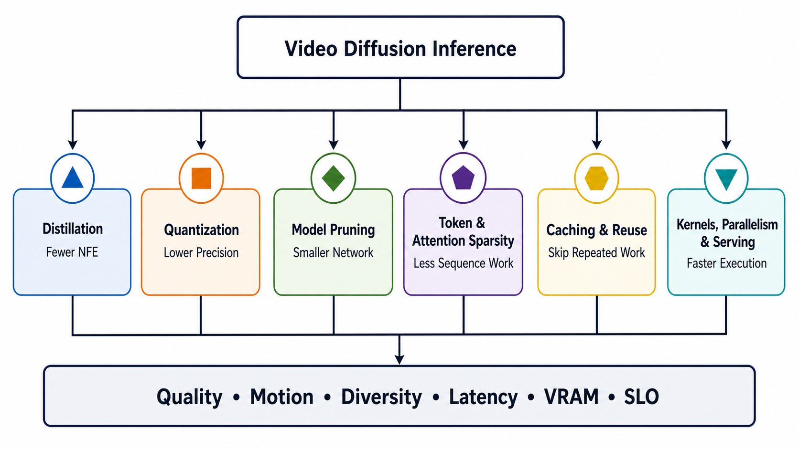

# 视频扩散模型压缩与推理基础设施：综述导航

> **文献更新至 2026-09-02（Asia/Shanghai）。** 本专题按照研究方向分为六篇综述。文献以正式会议论文、作者论文和官方实现为主。文中涉及的速度、显存和质量数据均沿用原论文的模型、输出设置、硬件、精度与计时方式；由于尚未在统一环境中复现，这些数据不用于跨论文排名。

视频扩散推理的计算开销主要取决于三个方面：网络调用次数、单次前向计算量，以及计算在硬件和服务系统中的执行效率。蒸馏、量化、剪枝、稀疏化、缓存和系统优化分别作用于其中不同环节，因此需要先分别考察，再分析多种方法联合使用时的实际收益。



## 1. 专题结构

| 研究方向 | 核心问题 | 主要影响因素 | 独立综述 |
|---|---|---|---|
| 蒸馏与少步生成 | 如何减少去噪网络调用次数，同时接近教师模型的生成分布？ | NFE、CFG 前向次数、学生模型的生成分布 | [蒸馏与少步生成综述](inference-acceleration/distillation.md) |
| 量化 | 如何降低权重、激活与缓存的位宽，并由相应的底层算子实现低比特计算？ | 位宽、存储、带宽、低精度算子 | [量化综述](inference-acceleration/quantization.md) |
| 剪枝与轻量化 | 应删除权重、通道、注意力头、网络块还是网络层，怎样恢复运动能力？ | 参数、网络宽度/深度、每次前向 FLOPs | [剪枝与轻量化综述](inference-acceleration/pruning.md) |
| Token 与注意力稀疏化 | 应减少 token，还是减少 token 之间的连边？ | 序列长度、注意力稠密度、稀疏模式 | [Token 与注意力稀疏化综述](inference-acceleration/sparsity.md) |
| 缓存与特征复用 | 哪些中间结果可以跨去噪步、网络层或视频时间复用？ | 重算频率、缓存大小、刷新与重置规则 | [缓存与特征复用综述](inference-acceleration/caching.md) |
| 底层算子、并行与在线服务 | 如何将理论上的计算节省转化为实际时延、可运行规模和在线服务指标？ | 硬件利用率、通信、内存调度、TTFF/尾延迟 | [系统综述](inference-acceleration/systems.md) |

为便于比较，各篇均依次讨论研究范围、方法分类与演进、代表性工作、已有共识与争议、评测方式以及尚待解决的问题，同时保留独立的阅读线索。

## 2. 统一的成本分析

一次离线视频生成的端到端延迟可写为：

```math
L_{\mathrm{e2e}}
=L_{\mathrm{text}}
+\sum_{i=1}^{N_{\mathrm{NFE}}}
\left(L_{\mathrm{denoiser},i}+L_{\mathrm{guidance},i}\right)
+L_{\mathrm{VAE}}
+L_{\mathrm{post}}
+L_{\mathrm{I/O}}.
```

- 蒸馏和 solver 主要改变 $N_{\mathrm{NFE}}$；其中 solver 不产生新的 student，因此应与蒸馏方法分别统计。
- 剪枝、token/attention 稀疏和量化主要改变每次 denoiser forward 的成本，但对象各不相同。
- 缓存改变哪些 forward/block 可以跳过或复用；系统优化改变剩余计算如何执行。
- 当 denoiser 的调用次数减少至 1–4 步后，文本编码、VAE、后处理和启动开销在总时延中的占比通常会上升。

若 video tokenizer 输出 $T'\times H'\times W'$ 的 latent，patch 大小为 $(p_t,p_h,p_w)$，则 token 数为：

```math
N=
\left\lceil\frac{T'}{p_t}\right\rceil
\left\lceil\frac{H'}{p_h}\right\rceil
\left\lceil\frac{W'}{p_w}\right\rceil.
```

全局密集注意力中的注意力得分计算随 $N^2$ 增长，线性投影和 FFN 则仍包含 $O(Nd^2)$ 成本。因此，attention FLOPs 下降不保证端到端时延按相同比例缩短；参数量下降也不保证显存按同一比例减少。

峰值显存至少拆成：

```math
M_{\mathrm{peak}}
=M_{\mathrm{weights}}
+M_{\mathrm{activations}}
+M_{\mathrm{attention/KV}}
+M_{\mathrm{cache}}
+M_{\mathrm{workspace}}
+M_{\mathrm{runtime}}.
```

上述延迟和显存分解说明，采样步数减少并不必然解决显存问题，模型文件缩小也不必然降低推理时间；同样，FLOPs 的下降只有在相应算子和执行路径中得到实现，才会反映到实际运行时间上。

## 3. 六类方法的概念边界

| 容易混淆的概念 | 正确边界 |
|---|---|
| Solver 与 step distillation | solver 在保留原 checkpoint 的情况下改变数值积分过程；distillation 则需要训练或后训练新的 student/checkpoint。 |
| Size distillation 与 pruning | size distillation 强调 teacher–student 能力迁移；pruning 强调从原结构删除权重或组件。实际工作常组合二者，需给消融。 |
| 参数剪枝与 token pruning | 前者永久改变网络；后者在推理时缩短输入序列，参数量可以完全不变。 |
| Token pruning 与 attention sparsity | 前者删除/合并 token，同时影响 attention、MLP 和 activation；后者保留 token，只删 attention 连边。 |
| Inter-step feature cache 与 causal KV cache | 前者跨 denoising 时间近似复用；后者跨视频时间保存已提交历史，依赖因果接口。 |
| 量化与低比特 kernel | 量化首先定义数值近似；只有硬件、layout、pack 和算子实现与之匹配时，才能据此讨论实际加速。 |
| 显存下降与 latency speedup | offload、tiling 或压缩可让 OOM 任务变得可运行，但可能因搬运/解压更慢。容量收益应单列。 |
| 多卡扩展与复杂度降低 | 并行分摊工作、隐藏通信或提高吞吐；它通常不减少总 FLOPs，还可能增加同步成本。 |

## 4. 整体演进趋势

### 4.1 从通用方法迁移到视频特定设计

早期研究大多从图像扩散模型迁移已有方法，包括减少采样步数、静态量化、参数裁剪和通用 attention kernel。视频模型还需要处理时空 token 数量快速增长，以及误差在**去噪过程**和**视频时序**中的累积。为此，后续工作逐渐引入 motion-aware distillation、timestep/token-aware quantization、运动—外观层敏感性分析、动态稀疏化和自适应缓存更新。

### 4.2 从理论指标转向实际运行性能

评价指标已由参数量、理论 FLOPs、模拟低比特和稀疏率，逐步扩展到 kernel 时延、端到端时延、峰值显存、通信时间和服务级指标。同样的稀疏率可能因数据布局和负载不均产生不同的运行性能；4-bit 表示若频繁触发高精度回退或反量化，也未必带来时延收益。

### 4.3 从单项优化转向系统协同

2025–2026 年的研究开始将 few-step、quantization、sparse attention、cache、kernel 和并行策略结合起来。联合优化更接近实际部署，但也增加了性能归因的难度。此类实验首先支持的是完整配置在给定条件下的性能变化；若缺少逐项消融，不能将总体收益归于其中某一模块。

## 5. 组合方法的性能归因

| 先做的优化 | 后续瓶颈或交互 |
|---|---|
| 将 50 步蒸馏到 4 步 | VAE、文本编码、编译启动与 I/O 占比上升；跨步 cache 的可跳次数下降。 |
| 将 attention 变稀疏 | MLP、投影或通信可能成为瓶颈；动态 pattern 还会造成设备负载不均。 |
| 做结构剪枝 | activation 分布和层形状改变，原量化 calibration、kernel tile 与并行计划可能失效。 |
| 做量化 | 低比特误差可能被 cache 跨步传播；若硬件不支持，dequant 可能抵消理论收益。 |
| 使用多卡并行 | 单卡计算缩短后，通信、同步和 pipeline bubble 的相对占比上升。 |

因此，分别测得的 `2× step`、`2× quant` 和 `2× sparse` 不能直接推算为 `8× end-to-end`。全栈加速比应以最终组合在完整推理流程中的实测结果为准。

## 6. 三类评测设置

### 6.1 固定 checkpoint 的推理优化

固定权重、提示词、随机种子、采样器/NFE、CFG、输出分辨率/帧数/FPS、VAE、基线精度、硬件、批量大小、预热方式与计时范围。一次只改变求解器、缓存、免训练稀疏化、底层算子、内存卸载或并行策略。

### 6.2 涉及模型转换或再训练的压缩方法

比较基础模型与蒸馏、量化或剪枝后的模型，额外报告训练或校准数据、更新步数、GPU-hours、参数变化、转换时间、底层算子支持、质量恢复目标和模型文件哈希。此类实验衡量的是转换后系统在质量、时延和显存之间的权衡，而非固定权重下的纯执行优化。

### 6.3 多种方法联合使用的完整系统

按 `baseline → +少步 → +小模型/量化 → +稀疏/cache → +kernel/parallel → +serving` 逐级测量。每一级至少保留：

```text
model and artifact hashes
prompt set / seeds / resolution / frames / FPS
nominal steps / measured NFE / CFG calls
precision / pruning scope / actual density / cache policy
hardware / interconnect / software / compile / warm-up
forward and total FLOPs / peak VRAM / communication
cold and warm p50/p95 latency / throughput / TTFF / jitter
frame quality / motion / text / consistency / diversity / failures
```

质量不能只用单帧美学分数。至少还要检查快速运动、长程身份与背景一致性、小物体和文字、局部控制、scene cut、提示遵循、跨 seed 多样性及长时漂移。

## 7. 按实际约束选择阅读路线

| 你的约束 | 先读 | 再读 |
|---|---|---|
| batch 1 太慢 | [蒸馏](inference-acceleration/distillation.md) | [量化](inference-acceleration/quantization.md)、[缓存](inference-acceleration/caching.md)、[系统](inference-acceleration/systems.md) |
| 单卡放不下 | [量化](inference-acceleration/quantization.md)、[剪枝](inference-acceleration/pruning.md) | [系统中的显存/VAE](inference-acceleration/systems.md) |
| 长视频 attention 爆炸 | [稀疏化](inference-acceleration/sparsity.md) | [缓存](inference-acceleration/caching.md)、[系统中的并行](inference-acceleration/systems.md) |
| 手机或边缘端 | [剪枝](inference-acceleration/pruning.md) + [量化](inference-acceleration/quantization.md) | [蒸馏](inference-acceleration/distillation.md)、[系统](inference-acceleration/systems.md) |
| 交互流式 | [缓存中的 causal KV](inference-acceleration/caching.md) | [蒸馏中的 causal student](inference-acceleration/distillation.md)、[Serving](inference-acceleration/systems.md) |
| 构建完整加速系统 | 先通过六篇综述明确各方法的适用范围 | 参照[系统综述](inference-acceleration/systems.md)中的组合消融方案设计实验 |

## 8. 现有研究的不足

1. 跨模型、跨长度、跨硬件的统一开源 harness；
2. 面向运动、scene cut、文字、小物体与局部控制的统一失效场景；
3. 可复现的量化 calibration、cache threshold 与动态稀疏配置；
4. 训练/转换 GPU-hours、energy/video、温度与持续负载报告；
5. 多租户 p99、deadline miss、cache 隔离与故障恢复；
6. 对 full-stack 组合逐级消融，而非只公布最终峰值倍数。

本专题属于问题驱动的叙述性范围综述，不声称穷尽所有论文。检索、筛选、证据等级、方法归类与尚未完成的复现实验见[研究日志](../../sources/research_20260902_video_diffusion_infrastructure.md)。
