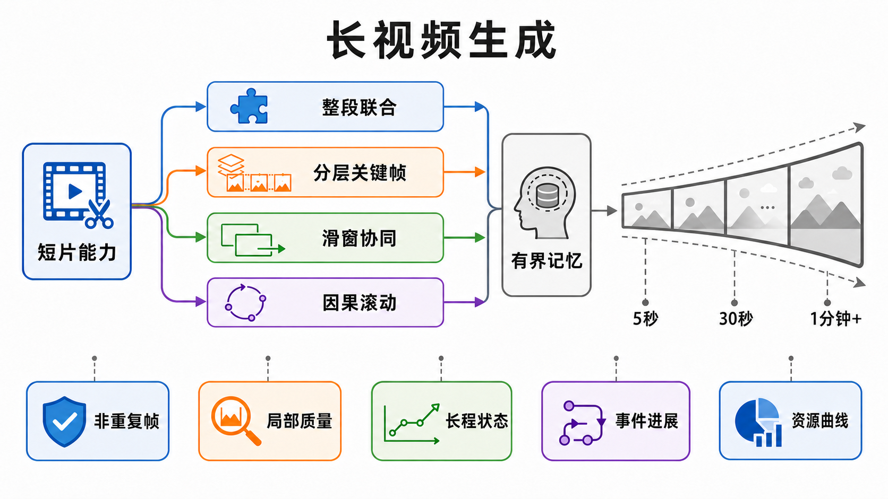

# 长视频生成：从固定长片到开放时域的可验证一致性

> 本章冻结于 **2026-09-02（Asia/Shanghai）**。这里的“长”不是一个固定秒数，而是输出时域相对训练窗口、模型原生窗口和系统资源预算的扩展合同。正文只按一手论文确认机制与作者实验，不把代码可见、权重可得、产品演示或最长选例升级为独立复现；作者展示的分钟级、小时级或“无限长度”结果不自动等于任意时长稳定。

检索日期、纳排规则、逐条一手来源、发布面和图像验收见[配套研究记录](../../sources/research_20260902_long_video_generation.md)。本章负责长时域生成的横向总览；在线提交、future leak、TTFF、deadline 和 backpressure 由[因果、流式与实时专章](causal-streaming-generation.md)负责；显式切镜、故事事实与跨镜头回滚由[故事与多镜头专章](../tasks/story-multishot.md)负责。

## 学习目标

读完本章，应能完成六件事：

1. 区分固定长片、长度外推、开放时域、流式、实时和多镜头叙事；
2. 用训练窗口、输出窗口、帧率、非重复帧和资源曲线写出可证伪的长度合同；
3. 比较整段联合、分层规划、滑窗协同、因果滚动和长期记忆等路线；
4. 解释为什么短视频模型直接“拉长”会出现冻结、循环、漂移和事件停滞；
5. 把局部画质、长期状态、事件进展、首次失败时间和资源增长分开评测；
6. 设计一个不会把精选样片或作者最长演示误当总体能力的长时域实验。

## 1. 先冻结“长”的合同

视频的播放时长为

```math
D_{\mathrm{out}}=\frac{F_{\mathrm{decoded}}}{f_{\mathrm{play}}},
```

其中 $F_{\mathrm{decoded}}$ 是实际解码帧数，$f_{\mathrm{play}}$ 是播放帧率。只报帧数会把 8 FPS 与 24 FPS 的结果混在一起；只报秒数又可能把插帧、静帧复制和低帧率隐藏起来。因此至少还要报告：原生或训练时域 $D_{\mathrm{native}}$、外推倍率

```math
\rho=\frac{D_{\mathrm{out}}}{D_{\mathrm{native}}},
```

以及真正包含新视觉状态的非重复帧比例。这里的 $D_{\mathrm{native}}$ 必须说明是训练 crop、位置编码范围、公开 checkpoint 的默认窗口，还是作者选择的推理窗口；四者不一定相同。

### 1.1 三类长度合同

| 合同 | 最小定义 | 必须冻结 | 不自动保证 |
|---|---|---|---|
| **Fixed-long（固定长片）** | 启动前已知总长度，一次请求明显长于常见短 clip | 请求长度、帧率、分辨率、模型原生窗口、是否整段联合生成 | 超过训练时域、可中途继续或资源有界 |
| **Length extrapolation（长度外推）** | 测试时域明确超过训练或原生时域 | $D_{\mathrm{native}}$、$D_{\mathrm{out}}$、倍率 $\rho$、位置/噪声/窗口改动 | 开放时域、长期语义进展或任意倍率稳定 |
| **Open-horizon（开放时域）** | 启动时终止时间未知，可以继续、停止、重置或更新条件 | commit/重置协议、状态与缓存预算、条件生效点、失败恢复 | 实时、恒定总成本或永不漂移 |

“长视频”还不能由一个绝对门槛定义。对只训练 16 帧的模型，128 帧是 8× 外推；对原生 10 秒模型，12 秒几乎没有检验长期状态。公平报告应同时给绝对时长与相对倍率，并在 1×、2×、6×、12× 等网格上观察退化曲线。

### 1.2 与邻近任务的边界

| 邻近任务 | 它主要回答什么 | 为什么不能代替本章 |
|---|---|---|
| [因果与流式生成](causal-streaming-generation.md) | 帧/块能否只读历史、何时提交、能否满足播放期限 | causal 或 streaming 可以只生成很短；长视频也可以整段离线生成 |
| [故事与多镜头](../tasks/story-multishot.md) | 显式切镜后人物、道具、事实与剧情是否延续 | 多个短镜头拼接可能很长；连续长镜头也可能没有切镜 |
| [视频预测](../tasks/video-prediction.md) | 给定真实过去前缀时，未来怎样分布，并用真实未来作对照与校准 | 它拥有前缀/未来对照与概率合同；本章拥有输出长度、训练窗外推和持续生成合同 |
| [交互式世界生成](../tasks/interactive-world-generation.md) | 动作如何改变可查询状态，系统能否闭环 | 文本驱动的长演示不证明动作可控、反事实正确或状态可恢复 |
| [视频 Tokenizer](video-tokenizers.md) | 表示怎样压缩、重建与因果解码 | codec 能承载长序列，不等于上层 generator 保持长期一致性 |

循环播放、慢动作、插帧和把同一静态画面复制很多次，都能增加 $D_{\mathrm{out}}$，却没有增加有效时域。因而最低验收必须同时检查**非重复内容、持续运动和事件进展**。

## 2. 为什么短片能力不会自然延伸

长视频不是“再多采样几帧”这么简单。时域扩大同时放大五类问题。

### 2.1 token 与全局交互成本

若 latent 网格有 $T'\times H'\times W'$ 个位置，token 数为

```math
N=T'H'W'.
```

全注意力的主要交互成本随 $O(N^2)$ 增长。时长翻倍不仅增加输出，还会增加训练激活、去噪中间状态和通信。线性、稀疏、窗口或 recurrent mixer 可以改变计算增长率，但也会删掉或压缩远距离信息；“复杂度更低”必须与长距召回和小物体保持一起验收。

### 2.2 训练—推理时域差距

模型通常在短 crop 上训练。测试时改变位置范围、噪声相关结构或 attention 窗口，会遇到训练分布外输入。LongDiff 把位置歧义与信息稀释作为整段外推的核心问题；FreeNoise、FreeLong 和 Free-Lunch 则分别从噪声重排、频谱融合与层自适应 OOD 修正处理短模型外推 [[6]](#ref-6) [[8]](#ref-8) [[12]](#ref-12) [[28]](#ref-28)。这些方法说明推理结构可以延长可用范围，却不能证明模型学会了训练数据中不存在的长期事件。

### 2.3 自生成历史与递归误差

把视频分成 $K$ 个块 $b_1,\ldots,b_K$，广义滚动生成可写成

```math
p(b_{1:K}\mid c)
=
\prod_{k=1}^{K}
p(b_k\mid b_{<k},c_k,m_k),
\qquad
m_k=U(m_{k-1},b_k).
```

若训练时条件是干净真实块，推理时条件却是模型自己的输出，早期误差就会成为后续输入。CausVid 把双向 teacher 蒸馏到少步因果 student；Self Forcing 进一步在模型自己的 rollout 历史上训练，直接针对 train–test gap [[14]](#ref-14) [[15]](#ref-15)。这改善的是历史分布匹配，不是“从此误差不会累积”。

### 2.4 长期状态竞争有限记忆

保留全部历史会让 cache、检索或注意力成本继续增长；只保留最近窗口又会忘记首帧身份、房间布局和早期事件。固定 sink、压缩 token、recurrent state 与内容寻址检索都在回答同一问题：**有限预算下，什么信息值得保留，何时读取，在哪一层注入？** FramePack、Mixture of Contexts 和 2026 年的检索式预印本给出了不同答案 [[16]](#ref-16) [[18]](#ref-18) [[24]](#ref-24)–[[27]](#ref-27)。

### 2.5 画质可以掩盖时间失败

单帧漂亮不代表长时正确。常见退化包括：

- 人物和物体属性缓慢漂移；
- 相机或主体运动冻结，靠纹理闪烁制造“仍在动”的假象；
- 周期动作锁定，片段开始循环；
- 离场物体再次出现时身份或数量变化；
- prompt 规定的后续事件迟迟不发生；
- 窗口边界出现跳变、速度突变或重复帧。

这些错误可能只出现在视频中很短的一段。均匀抽几帧、计算一个全局均值，容易把首次严重失败稀释掉。

## 3. 一张图建立方法与证据地图



**图 1：时长只是输出轴，五道证据门必须分别通过。** 四条路线不是互斥类别：系统可以先用全局 token 规划，再按块因果渲染，并同时使用滑窗和检索记忆。图是本综述合成的教学框架，不对应单篇论文，也不表示方法排名。

**顺序化文字替代：** 先冻结短片模型的原生窗口；再判断系统采用整段联合、分层关键帧、滑窗协同或因果滚动中的哪些机制；随后记录长期历史是全保留、窗口化、压缩、递归还是检索；最后沿 5 秒、30 秒、1 分钟及更长网格，分别检查非重复帧、局部质量、长程状态、事件进展和资源曲线。任一门失败，都不能只用“视频仍能继续解码”覆盖。

## 4. 时间演进：长度合同怎样改变

下表按**正式发表年**分组；只有冻结日仍无正式页面的工作才按预印本年份处理。A 表示已有正式会议页面，B 表示冻结日仅按 arXiv/技术报告使用；A 只证明论文身份，不代表结论已独立复现。若论文首次公开早于正式发表年，完整版本时间见配套研究记录，不用这一行推断优先权。

| 阶段 | 代表工作 | 合同或机制的变化 | 证据边界 |
|---|---|---|---|
| 2022：原生长序列 | LongVideoGAN、TATS [[1]](#ref-1) [[2]](#ref-2) | 把长期低分辨率动态与短期高分辨率外观分开，或以 time-agnostic tokenizer + time-sensitive Transformer 建模千帧序列 | A；主要在受控动态场景与当时的数据协议上成立，不等于开放域长叙事 |
| 2023：可变长度与层级 | Phenaki、NUWA-XL、Gen-L-Video [[3]](#ref-3)–[[5]](#ref-5) | 因果 video tokenizer、全局关键帧—局部插值、重叠窗口 temporal co-denoising | 前两者 A、Gen-L-Video B；可继续或多文本不自动等于长期状态稳定 |
| 2024：短模型外推 | FreeNoise、FreeLong、FIFO-Diffusion [[6]](#ref-6)–[[8]](#ref-8) | 噪声重排、频谱融合与斜向去噪队列，使短模型在推理时扩展 | A；“training-free/infinite”描述方法接口，不是任意时长质量保证 |
| 2024：滚动生成基础 | Diffusion Forcing [[9]](#ref-9) | 允许不同时间 token 处于不同噪声水平，连接 full-sequence diffusion 与 next-token 生成 | A；本身不保证少步、实时或已经处理 self-history 偏移 |
| 2025：规划与高效骨干 | ARLON、LinGen、LongDiff、TokensGen [[10]](#ref-10)–[[12]](#ref-12) [[17]](#ref-17) | 粗粒度 AR 计划引导 DiT、线性复杂度骨干、整段位置外推、压缩全局 token | A；分钟级和 one-go 都是各自作者协议，不能跨规格直接排序 |
| 2025：滚动与记忆 | StreamingT2V、CausVid、Self Forcing、FramePack [[13]](#ref-13)–[[16]](#ref-16) | 长短期锚点、少步因果蒸馏、自 rollout 训练、固定上下文压缩 | A；extendable、fast、fixed context 分别是不同合同 |
| 2026：检索与实时长时 | Mixture of Contexts、Rolling Forcing、LongLive、Flow Caching [[18]](#ref-18)–[[20]](#ref-20) [[29]](#ref-29) | 稀疏内容路由、渐变噪声滚动窗口、train-long–test-long、分块特征缓存与 KV 压缩 | A；资源、实时和长期召回仍须按各自硬件与端到端边界读取 |
| 2026：超长演示与纠错 | Stable Video Infinity、LoL、Free-Lunch [[21]](#ref-21) [[22]](#ref-22) [[28]](#ref-28) | error recycling、attention sink collapse 分析、多头 RoPE 扰动与层级 OOD 修正 | A；非循环、小时级或 2×/4× 是论文设置，不是普遍可靠上限 |

这条历史不是从一种方法单线升级到另一种方法。更准确的变化是：研究问题从“能否输出更多帧”，转向“能否在训练窗外继续”，再转向“能否在有界资源和自生成历史下保持可检索状态”。

## 5. 五条可组合的方法路线

### 5.1 原生长序列与整段联合生成

整段方法一次建模完整 $z_{1:T}$，允许开头与结尾双向交换信息。优势是可以在采样过程中共同修订全局结构；代价是总长度通常要预先知道，时空 token 和中间状态随目标时长增加。

TATS 代表早期离散 token 长序列路线；LinGen 通过线性复杂度模块把高分辨率分钟级生成置于中心；LongDiff 则不重新训练模型，而是修改位置映射和信息帧选择，尝试一次生成更长窗口 [[2]](#ref-2) [[11]](#ref-11) [[12]](#ref-12)。三者不能只按“最长秒数”并排：它们改变的分别是表示与序列建模、骨干复杂度、推理时外推机制。

适合这条路线的证据是完整窗口显存、计算量随 $T$ 的增长曲线，以及同一视频前后端的一致性；不适合用 TTFF 或不可撤回 commit 评价其核心贡献。

### 5.2 分层计划：先决定全局，再补局部

分层路线先生成低频时间计划、关键帧或压缩 token，再把相邻锚点之间的细节补出来。NUWA-XL 以全局 diffusion 产生关键帧，再用局部 diffusion 递归插值；ARLON 先自回归产生粗粒度视觉 token，再引导 diffusion Transformer；TokensGen 先形成 condensed global tokens，再逐片段还原 [[4]](#ref-4) [[10]](#ref-10) [[17]](#ref-17)。

它的优势是全局事件与局部渲染可以用不同预算；风险是计划一旦过粗，后续渲染只能把错误“画得更好”。因此要分别评估：

1. 全局计划是否覆盖 prompt 中全部事件；
2. 锚点之间的运动是否连续而非仅做视觉补间；
3. 局部渲染是否改写了人物、数量或不可逆状态；
4. 修改后段计划时，系统是否需要重算整段。

### 5.3 滑窗、重叠与协同去噪

滑窗方法复用短视频模型，在相邻窗口之间共享帧、噪声或 attention，并通过重叠区域减轻接缝。Gen-L-Video 做 temporal co-denoising，FreeNoise 重排长序列的初始噪声并融合窗口 attention，FreeLong 把全局低频与局部高频特征结合 [[5]](#ref-5) [[6]](#ref-6) [[8]](#ref-8)。

这类方法部署门槛低，却容易产生两个误判：接缝平滑不等于远距离身份记忆；多文本切换不等于事件因果成立。报告时必须公开窗口长度、stride、overlap、lookahead、边界 crop 和重复计算比例。若后一个窗口能回看或修订前一窗口，也不能直接称为不可撤回 streaming。

### 5.4 因果、自回归与滚动 diffusion

滚动路线按帧或块逐步生成，在分解上更适合实现未知终止时间；是否真正支持继续、停止、重置、条件更新、位置外推和失败恢复，仍需逐项验证。FIFO-Diffusion 用斜向去噪队列维持固定窗口；Diffusion Forcing 为不同 token 分配不同噪声水平；CausVid、Self Forcing、Rolling Forcing 与 LongLive 又把少步蒸馏、自生成历史训练、attention sink 和 prompt recache 组合起来 [[7]](#ref-7) [[9]](#ref-9) [[14]](#ref-14) [[15]](#ref-15) [[19]](#ref-19) [[20]](#ref-20)。

这里至少有三种不同“窗口”：

- **上下文窗口**：当前预测可读取哪些历史；
- **去噪窗口**：多少待生成帧在不同噪声等级下联合更新；
- **提交窗口**：哪些解码帧已经不可撤回。

三者不相等。滚动 sampler 可以有固定上下文，却仍在当前窗口内部双向去噪；作者报告的 FPS 也可能只覆盖 denoiser，不含文本编码、VAE、传输和显示。完整四层合同与压力测试见[因果、流式与实时专章](causal-streaming-generation.md)。

### 5.5 有界记忆与内容寻址

长期记忆不是把所有 KV 永久留下。常见策略可分为：

| 记忆策略 | 保留方式 | 擅长 | 主要风险 |
|---|---|---|---|
| recent window | 只留最近若干帧/块 | 局部运动连续 | 离场再入场、早期属性遗忘 |
| sink / anchor | 固定首帧、文本或少量锚点 | 身份与全局主题 | 锚点过强会回跳、冻结或 sink collapse |
| compression | 把历史压成 condensed token、固定 frame pack 或 recurrent state | 有界 resident memory | 小物体、精确数量和罕见事件被压掉 |
| retrieval | 按当前 query 选择相关历史块或 token | 长间隔召回 | router 选错、索引/CPU/外存成本被忽略 |
| hybrid | recent + anchor + compressed/retrieved history | 同时覆盖局部与长期 | 组件多，因果归因和消融更难 |

FramePack 按重要性打包固定上下文，Mixture of Contexts 把长期上下文重写为稀疏检索问题；LongLive-RAG、RECAP-Forcing、DensityKV 与 LayerRecall 则分别探索 latent 检索、按外观新颖性保留、逐头 token bank 和按状态/层路由 [[16]](#ref-16) [[18]](#ref-18) [[24]](#ref-24) [[25]](#ref-25) [[26]](#ref-26) [[27]](#ref-27)。后四项在冻结日仍按 2026 预印本处理，适合说明近期方向，不应与正式论文混成已验证结论。

有界 GPU cache 也不等于总系统成本恒定。若历史转移到 CPU、磁盘或向量索引，必须继续报告写入量、索引大小、查询延迟、带宽与错误恢复。

## 6. 数据、训练与发布面必须分账

### 6.1 长数据不是把短片随机拼接

短 clip 数据便于训练，却很少包含跨分钟可追踪的身份、离场再入场和不可逆事件。直接拼接会引入伪切镜；随机裁剪又会让模型只学局部运动。长时域数据至少要标注或可恢复：

- 原始连续段与编辑切点；
- 帧率、实际时长和变速/插帧历史；
- 人物、物体与场景的重现间隔；
- 事件开始、完成、失败和因果先后；
- caption 是全局摘要、分段指令还是时间对齐脚本；
- 数据过滤是否偏向静态、循环或低运动片段。

### 6.2 训练历史来自哪里

滚动模型应说明条件历史是 ground-truth、加噪 ground-truth、teacher 输出还是模型自己的 rollout；是否在多个块之间回传梯度；训练窗口是否真的覆盖测试窗口。只写 “autoregressive training” 无法判断 exposure bias 被怎样处理。

### 6.3 五个发布面

| 发布面 | 能证明什么 | 不能证明什么 |
|---|---|---|
| Paper / proceedings | 方法与作者实验已形成可引用记录 | 代码可运行、权重可得或结果独立复现 |
| Project/demo | 可以观察作者挑选的输出和交互界面 | 总体稳定率、失败分布或最长时长上限 |
| Code | 实现细节与部分协议可审计 | 训练数据、完整 checkpoint 或论文数值可复现 |
| Weights / model card | 指定 checkpoint 可获得，并可能有许可证与限制 | 训练 recipe、长期质量与系统 SLO 已验证 |
| Independent trace | 特定环境下的质量、资源与失败记录 | 自动外推到不同硬件、长度和 prompt 分布 |

## 7. 评测：从一个总分改成随时间的证据

长视频评测的核心不是再加一个平均分，而是问：**哪一种能力在什么时候先坏掉？** SLVMEval 用合成长时退化检验 evaluator 本身是否敏感，它不是生成模型排行榜 [[23]](#ref-23)。因此应先验证测量工具，再比较模型；通用的 evaluator 校准、人评抽样、统计单位与置信区间由[评测指南](../evaluation.md)负责，本节只补长时专用协议。

### 7.1 五道独立证据门

| 证据门 | 最小测试 | 典型失败 |
|---|---|---|
| **非重复帧** | perceptual/flow 相似度、冻结段与周期检测，并人工复核 | 静帧复制、短循环、微小纹理闪烁 |
| **局部质量** | 固定长度滑窗逐段评价画质、运动、文本遵循 | 后段模糊、身体崩坏、边界跳变 |
| **长程状态** | 身份/属性/数量、离场再入场、早期事实回忆 | 主体换脸、道具消失、布局重置 |
| **事件进展** | 时间对齐事件表、完成率、顺序与停滞时间 | 始终停在开场动作、事件倒序或漏做 |
| **资源曲线** | GPU/CPU/外存、wall time、NFE、带宽随时长的斜率 | cache 无界增长、检索变慢、重复计算爆炸 |

### 7.2 三类时间统计

对每个样本，以固定时间 bin 记录局部质量 $q(t)$，并报告：

```math
t_{\mathrm{fail}}
=
\inf\{t:q(t)<\tau_q\ \text{或出现预注册硬失败}\}.
```

其中阈值和硬失败类型必须在看结果前冻结。推荐同时给：

1. **quality–time curve**：每个时间 bin 的分项均值和置信区间；
2. **first-failure distribution**：第一次身份漂移、冻结、循环或事件失败的时间；
3. **survival curve**：到时间 $t$ 仍未出现硬失败的样本比例。

最终一帧正常不能抹去中途失败；一分钟样片也不能和一百个十秒样本的均值直接比较。

### 7.3 最小报告清单

- checkpoint、代码提交、codec、scheduler、随机种子和精度；
- 分辨率、原生/训练帧数、目标帧数、真实帧率、插帧与超分；
- prompt 数、seed 数、是否筛选样片及失败样本是否保留；
- window、stride、overlap、lookahead、sink、重锚定和 reset；
- denoising steps 与实际 NFE；
- 端到端 wall time、峰值与常驻 GPU、CPU、外存和检索索引；
- 1×、2×、6×、12× 及至少一个绝对时长点的分项曲线；
- 人评协议、自动 evaluator 的版本与校准结果。

## 8. 建议实验：LongHorizon-1（尚未执行）

下面是本综述提出的可证伪实验，不是任何论文已经完成的统一 benchmark，也不是本仓库已经跑出的结果。

### 8.1 冻结输入

建立 20 个 prompt，每类 4 个：

1. **持续运动**：主体和相机都不能靠静止维持质量；
2. **不可逆事件**：完整、破碎、倒空、点燃等状态不能无理由回退；
3. **离场再入场**：人物或小物体在长间隔后返回；
4. **多阶段事件**：至少三步，顺序可自动或人工核验；
5. **条件时间表**：请求前冻结在 25%、50%、75% 时刻生效的分段 prompt，同时保留不应改变的状态。

每个 prompt 使用 4 个预注册 seed；长度取原生 1×、2×、6×、12×，并加入 60 秒绝对点。若 60 秒短于 12×，仍保留两个点，不以其一替代另一项。one-go、overlap 和 causal 三轨都接收同一份**预先声明**的时间对齐条件表；只有本来就声明运行中可接收新条件的 causal/streaming 系统，才额外进入“在线 update”子测试，不能让不支持在线输入的 one-go 系统因此判负。

### 8.2 三条匹配轨道

| 轨道 | 纳入系统 | 固定项 | 主要问题 |
|---|---|---|---|
| one-go | 目标长度一次联合生成 | 输出规格、基础 checkpoint、总 NFE 或 wall-time 预算 | 整段访问能否换来更好的首尾一致性 |
| overlap | 短模型 + 窗口/协同去噪 | 基座、窗口、overlap 与重复计算公开 | 接缝与远距状态能否同时保持 |
| causal | 按帧/块滚动并可开放继续 | commit、context、sink/memory、真实 NFE | self-history、资源和长期召回怎样退化 |

不同轨道的合同不兼容，不能压成一个总榜。应先在轨道内比较，再用质量—资源 Pareto 面讨论取舍。

### 8.3 记录与反证

对每个样本保留完整视频而非只保留最佳 seed，并输出：

- `manifest`：模型、数据、窗口、推理与硬件设置；
- 每帧/每块时间戳、NFE、GPU/CPU/外存与检索日志；
- 冻结、循环、接缝、身份、数量、布局和事件的逐时标注；
- quality–time、first-failure、survival 与资源斜率图；
- 成功、失败和边界样本等量的可视化页面。

若 12× 结果主要由重复帧维持、离场物体不能正确回归或事件完成率随时长下降，就必须下调“稳定外推”或“长期记忆”。若**单块**计算、单块延迟或 resident working set 随已提交历史持续增长，则下调“有界资源”或相应实时主张；完整视频的累计 wall time 本来就会随时长增长，不能单独作为反证。只有无法在未知终点下继续、停止、重置或恢复时，才直接否定相应的 open-horizon 接口。一次最长演示不能推翻批量失败分布。

## 9. 常见误读

1. **“能输出一分钟，所以学会了分钟级事件。”** 输出长度只证明解码成功；事件完成和长程状态要另测。
2. **“固定 KV cache，所以资源恒定。”** GPU working set 可能固定，但 CPU、外存、索引、总计算和日志仍增长。
3. **“窗口有 overlap，所以没有边界问题。”** overlap 可以遮接缝，也会增加重复计算、未来依赖和帧复用。
4. **“因果，所以实时。”** causal 是信息约束；实时还需要少步、codec、调度和 deadline 证据。
5. **“多 prompt，所以会讲故事。”** 条件能切换不证明显式镜头语法、事实延续或跨镜头回滚。
6. **“infinite，所以不会漂移。”** 该词常表示 sampler 可以继续运行；质量与资源上限仍是经验问题。
7. **“小时级样片就是小时级成功率。”** 最长选例只能证明至少生成过一个样本，不能给出总体生存率。

## 10. 未来方向

### 10.1 从时间近邻转向内容寻址记忆

只保留最近帧无法处理长间隔回归。近期工作开始按内容、外观新颖性、attention head 或网络层选择记忆 [[18]](#ref-18) [[24]](#ref-24)–[[27]](#ref-27)。下一步不只是更大 cache，而是把记忆写入、合并、检索、冲突和遗忘变成可审计模块。

### 10.2 全局计划与局部物理共同训练

层级计划擅长事件覆盖，滚动生成擅长局部连续；二者仍常被分别训练。更强合同应允许全局事件状态约束局部渲染，同时让局部失败回报到计划层，而不是只在末端拼接。

### 10.3 自历史训练之外的长期纠错

Self-rollout 可以缩小训练—推理差距，但模型仍可能稳定地重复自己的错误。需要显式检测冻结、循环、身份冲突与事件停滞，并定义何时重锚定、局部再生成或回滚；纠错动作本身也要计入延迟和资源。

### 10.4 可审计长数据与 evaluator

长视频需要连续来源、事件表、重现间隔和编辑历史，而不是只增加文件时长。evaluator 也要经受受控冻结、重复、短暂漂移、事件删除和资源曲线等反证；SLVMEval 展示了先测 evaluator 敏感性的方向 [[23]](#ref-23)。

### 10.5 把四个产品主张分开验收

未来系统常同时写 long、streaming、real-time、interactive。更可靠的报告应分别给长期质量、提交正确性、端到端 SLO 与条件/动作响应；一个维度成立不能替另外三个背书。

## 11. 最小阅读路线

若只读六组材料，可以按问题而非榜单排序：

1. TATS 与 LongVideoGAN：长序列表示和时空尺度为什么要拆开 [[1]](#ref-1) [[2]](#ref-2)；
2. Phenaki 与 NUWA-XL：可变长度、因果 tokenizer 与全局—局部分层 [[3]](#ref-3) [[4]](#ref-4)；
3. FreeNoise、FreeLong、LongDiff：短模型的推理时长度外推 [[6]](#ref-6) [[8]](#ref-8) [[12]](#ref-12)；
4. FIFO-Diffusion 与 Diffusion Forcing：开放滚动的噪声/队列抽象 [[7]](#ref-7) [[9]](#ref-9)；
5. CausVid 与 Self Forcing：少步 causal student 和自历史分布差距 [[14]](#ref-14) [[15]](#ref-15)；
6. Mixture of Contexts、Rolling Forcing 与 LongLive：检索记忆、滚动窗口和实时长时系统 [[18]](#ref-18)–[[20]](#ref-20)。

继续研究服务合同时转到[因果、流式与实时](causal-streaming-generation.md)；研究跨切镜的叙事状态时转到[故事与多镜头](../tasks/story-multishot.md)；研究长序列 backbone 的复杂度时转到[Video DiT 与骨干扩展](video-dit-backbones.md)。

## 12. 本章结论

1. **长视频首先是相对训练窗口、输出时长和资源预算的合同，不是一个固定秒数。**
2. **整段联合、分层计划、滑窗协同、因果滚动和内容记忆可以组合，不能按单标签排名。**
3. **“继续生成”只证明接口没有停止；稳定性要由非重复帧、局部质量、长期状态、事件进展和资源曲线共同证明。**
4. **最关键的统计不是最长精选样片，而是质量随时间的退化、首次失败分布与生存率。**
5. **开放时域、流式提交、实时期限和交互控制是四份独立合同。**

## 参考文献

<a id="ref-1"></a>[1] [Generating Long Videos of Dynamic Scenes](https://proceedings.neurips.cc/paper_files/paper/2022/hash/ce208d95d020b023cba9e64031db2584-Abstract-Conference.html). Tim Brooks et al. NeurIPS. 2022.

<a id="ref-2"></a>[2] [Long Video Generation with Time-Agnostic VQGAN and Time-Sensitive Transformer](https://www.ecva.net/papers/eccv_2022/papers_ECCV/html/5950_ECCV_2022_paper.php). Songwei Ge et al. ECCV. 2022.

<a id="ref-3"></a>[3] [Phenaki: Variable Length Video Generation from Open Domain Textual Descriptions](https://iclr.cc/virtual/2023/poster/12256). Ruben Villegas et al. ICLR. 2023.

<a id="ref-4"></a>[4] [NUWA-XL: Diffusion over Diffusion for eXtremely Long Video Generation](https://aclanthology.org/2023.acl-long.73/). Shengming Yin et al. ACL. 2023.

<a id="ref-5"></a>[5] [Gen-L-Video: Multi-Text to Long Video Generation via Temporal Co-Denoising](https://arxiv.org/abs/2305.18264). Fu-Yun Wang et al. arXiv. 2023.

<a id="ref-6"></a>[6] [FreeNoise: Tuning-Free Longer Video Diffusion via Noise Rescheduling](https://proceedings.iclr.cc/paper_files/paper/2024/hash/15ce8e7afe5ee95bad56e3b9be28d3d1-Abstract-Conference.html). Haonan Qiu et al. ICLR. 2024.

<a id="ref-7"></a>[7] [FIFO-Diffusion: Generating Infinite Videos from Text without Training](https://proceedings.neurips.cc/paper_files/paper/2024/hash/a397986e0f34d4b1f0b640686ceaeff7-Abstract.html). Jihwan Kim et al. NeurIPS. 2024.

<a id="ref-8"></a>[8] [FreeLong: Training-Free Long Video Generation with SpectralBlend Temporal Attention](https://proceedings.neurips.cc/paper_files/paper/2024/hash/ed67dff7cb96e7e86c4d91c0d5db49bb-Abstract-Conference.html). Yu Lu et al. NeurIPS. 2024.

<a id="ref-9"></a>[9] [Diffusion Forcing: Next-token Prediction Meets Full-Sequence Diffusion](https://proceedings.neurips.cc/paper_files/paper/2024/hash/2aee1c4159e48407d68fe16ae8e6e49e-Abstract-Conference.html). Boyuan Chen et al. NeurIPS. 2024.

<a id="ref-10"></a>[10] [ARLON: Boosting Diffusion Transformers with Autoregressive Models for Long Video Generation](https://proceedings.iclr.cc/paper_files/paper/2025/hash/e2fb048a8e37ad978fc895528102ce49-Abstract-Conference.html). Zongyi Li et al. ICLR. 2025.

<a id="ref-11"></a>[11] [LinGen: Towards High-Resolution Minute-Length Text-to-Video Generation with Linear Computational Complexity](https://openaccess.thecvf.com/content/CVPR2025/html/Wang_LinGen_Towards_High-Resolution_Minute-Length_Text-to-Video_Generation_with_Linear_Computational_Complexity_CVPR_2025_paper.html). Hongjie Wang et al. CVPR. 2025.

<a id="ref-12"></a>[12] [LongDiff: Training-Free Long Video Generation in One Go](https://openaccess.thecvf.com/content/CVPR2025/html/Li_LongDiff_Training-Free_Long_Video_Generation_in_One_Go_CVPR_2025_paper.html). Zhuoling Li et al. CVPR. 2025.

<a id="ref-13"></a>[13] [StreamingT2V: Consistent, Dynamic, and Extendable Long Video Generation from Text](https://openaccess.thecvf.com/content/CVPR2025/html/Henschel_StreamingT2V_Consistent_Dynamic_and_Extendable_Long_Video_Generation_from_Text_CVPR_2025_paper.html). Roberto Henschel et al. CVPR. 2025.

<a id="ref-14"></a>[14] [From Slow Bidirectional to Fast Autoregressive Video Diffusion Models](https://openaccess.thecvf.com/content/CVPR2025/html/Yin_From_Slow_Bidirectional_to_Fast_Autoregressive_Video_Diffusion_Models_CVPR_2025_paper.html). Tianwei Yin et al. CVPR. 2025.

<a id="ref-15"></a>[15] [Self Forcing: Bridging the Train-Test Gap in Autoregressive Video Diffusion](https://proceedings.neurips.cc/paper_files/paper/2025/hash/f4823f831af67a3ef15e41a85434422a-Abstract-Conference.html). Xun Huang et al. NeurIPS. 2025.

<a id="ref-16"></a>[16] [Frame Context Packing and Drift Prevention in Next-Frame-Prediction Video Diffusion Models](https://proceedings.neurips.cc/paper_files/paper/2025/hash/2bde8fef08f7ebe42b584266cbcfc909-Abstract-Conference.html). Lvmin Zhang et al. NeurIPS. 2025.

<a id="ref-17"></a>[17] [TokensGen: Harnessing Condensed Tokens for Long Video Generation](https://openaccess.thecvf.com/content/ICCV2025/html/Ouyang_TokensGen_Harnessing_Condensed_Tokens_for_Long_Video_Generation_ICCV_2025_paper.html). Wenqi Ouyang et al. ICCV. 2025.

<a id="ref-18"></a>[18] [Mixture of Contexts for Long Video Generation](https://proceedings.iclr.cc/paper_files/paper/2026/hash/94bbcb744bbada8808fda05b9d9290d6-Abstract-Conference.html). Shengqu Cai et al. ICLR. 2026.

<a id="ref-19"></a>[19] [Rolling Forcing: Autoregressive Long Video Diffusion in Real Time](https://proceedings.iclr.cc/paper_files/paper/2026/hash/935151cc6cb5d8b6816133b75233775a-Abstract-Conference.html). Kunhao Liu et al. ICLR. 2026.

<a id="ref-20"></a>[20] [LongLive: Real-time Interactive Long Video Generation](https://proceedings.iclr.cc/paper_files/paper/2026/hash/91a1610c6ed9e02d33f826b46f472b92-Abstract-Conference.html). Shuai Yang et al. ICLR. 2026.

<a id="ref-21"></a>[21] [Stable Video Infinity: Infinite-Length Video Generation with Error Recycling](https://proceedings.iclr.cc/paper_files/paper/2026/hash/2858f8c8683aaa8c12d487354cf328dc-Abstract-Conference.html). Wuyang Li et al. ICLR. 2026.

<a id="ref-22"></a>[22] [LoL: Longer than Longer, Scaling Video Generation to Hour](https://openaccess.thecvf.com/content/CVPR2026/papers/Cui_LoL_Longer_than_Longer_Scaling_Video_Generation_to_Hour_CVPR_2026_paper.pdf). Justin Cui et al. CVPR. 2026.

<a id="ref-23"></a>[23] [SLVMEval: Synthetic Meta Evaluation Benchmark for Text-to-Long Video Generation](https://openaccess.thecvf.com/content/CVPR2026/html/Matsuda_SLVMEval_Synthetic_Meta_Evaluation_Benchmark_for_Text-to-Long_Video_Generation_CVPR_2026_paper.html). Ryosuke Matsuda et al. CVPR. 2026.

<a id="ref-24"></a>[24] [LongLive-RAG: A General Retrieval-Augmented Framework for Long Video Generation](https://arxiv.org/abs/2606.02553). Qixin Hu et al. arXiv. 2026.

<a id="ref-25"></a>[25] [RECAP-Forcing: Retaining Content Appearances for Long Video Generation](https://arxiv.org/abs/2608.26671). Haiyang Xu et al. arXiv. 2026.

<a id="ref-26"></a>[26] [DensityKV: Density-Guided KV Cache Compression for Long Video Generation](https://arxiv.org/abs/2608.27922). Wenqu Zhao et al. arXiv. 2026.

<a id="ref-27"></a>[27] [LayerRecall: A State-Conditioned Memory Router for Long-Horizon Consistency in Video Generation](https://arxiv.org/abs/2608.28460). Yixuan Ding et al. arXiv. 2026.

<a id="ref-28"></a>[28] [Free-Lunch Long Video Generation via Layer-Adaptive O.O.D Correction](https://openaccess.thecvf.com/content/CVPR2026/html/Tian_Free-Lunch_Long_Video_Generation_via_Layer-Adaptive_O.O.D_Correction_CVPR_2026_paper.html). Jiahao Tian et al. CVPR. 2026.

<a id="ref-29"></a>[29] [Flow Caching for Autoregressive Video Generation](https://proceedings.iclr.cc/paper_files/paper/2026/hash/85dc8f85ff978b9c606d3b2f5b0da69a-Abstract-Conference.html). Yuexiao Ma et al. ICLR. 2026.
