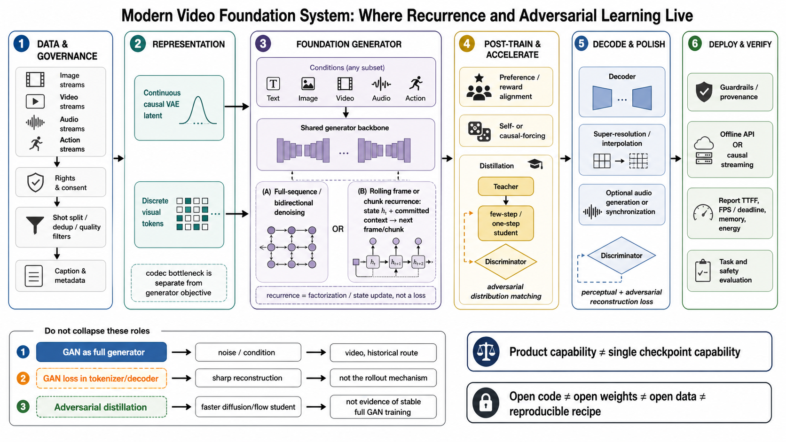
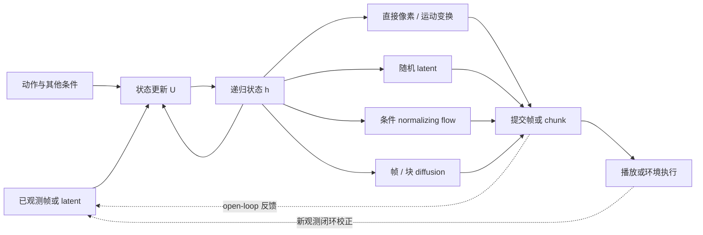
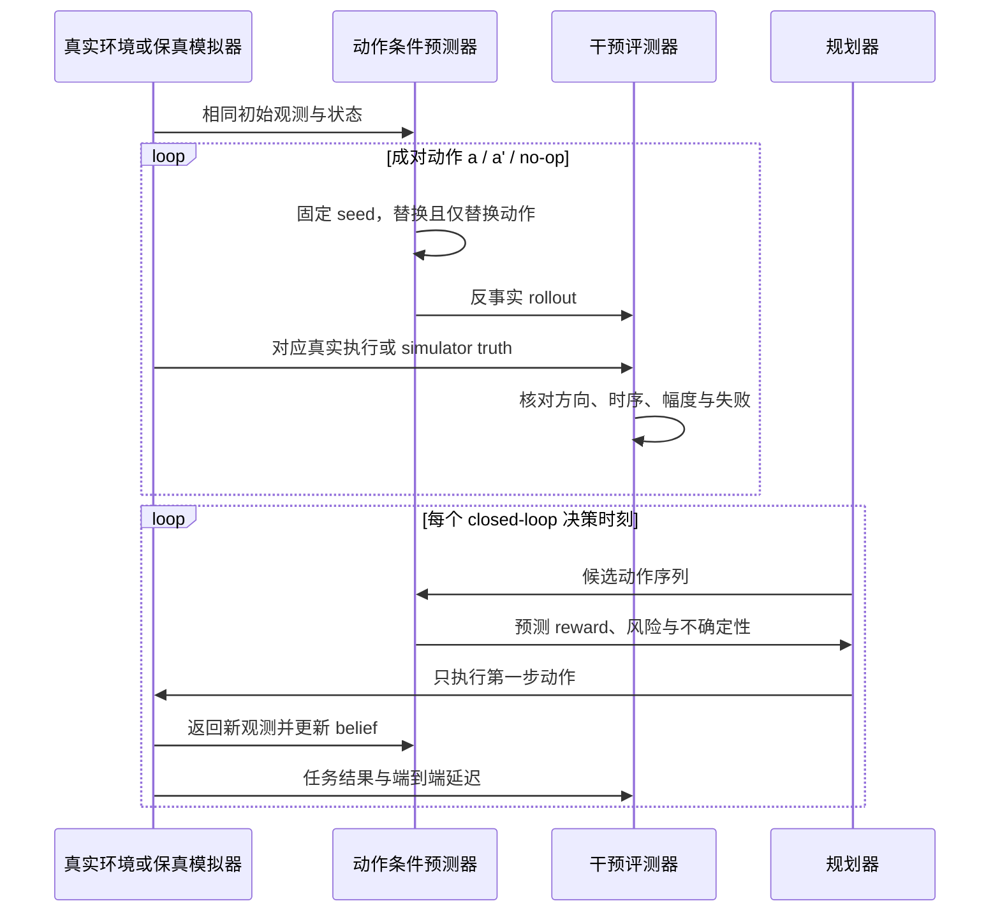

# 递归/循环视频预测：状态更新、随机未来与闭环证据

> 本章资料与会场状态核验截至 **2026-08-30**。这里的 recurrent 首先指跨时间单元反复更新状态或反馈输出；它可以与自回归概率分解、diffusion/flow 条件头、因果访问和流式部署组合，但这些概念不是同义词。

检索式、筛选/排除、OpenAlex 去重、官方 artifact 与证据等级见[配套研究记录](../../sources/research_20260830_recurrent_video_prediction.md)。

## 📋 1. 先分清四个问题

给定已观测历史 $x_{1:C}$、条件 $c$ 与可选动作 $a_t$，典型递归预测器写成

$$
h_t=U_\theta(h_{t-1},\phi(x_t),a_t,c),
\qquad
\hat y_{t+1}\sim G_\theta(\cdot\mid h_t,a_t,c).
$$

$h_t$ 可以是 LSTM feature map、Transformer KV、deterministic–stochastic state，或压缩后的帧集合；$y_{t+1}$ 可以是一帧、一个 latent block 或一个视频 chunk。公式描述的是**状态怎样推进**，不自动说明联合分布、未来可见性或运行速度。

| 问题 | 最小判据 | 常见实现 | 不能由它推出 |
|---|---|---|---|
| **递归状态更新** | 同一更新器反复把旧状态与新输入变成新状态 | ConvLSTM、RSSM、rolling KV、压缩历史 | 不必显式给出概率分解，也不保证因果正确 |
| **自回归概率分解** | $p(y_{1:K}\mid c)=\prod_k p(y_k\mid y_{<k},c)$ | token、frame、set 或 chunk AR | 不要求 RNN；当前单元内部仍可双向联合去噪 |
| **因果访问** | 提交第 $k$ 个单元前不读取未来的干净单元 | causal mask、只保留已提交 KV | 只是信息约束，不等于因果推断、可干预动力学或流式服务 |
| **流式与 deadline** | 全片结束前持续发出结果；每个 deadline 前完成生成、解码与传输 | rolling window、KV cache、异步 VAE | 平均 FPS、论文中的 causal 或“无限长”都不能单独证明 |

还要明确两个不同的时间刻度：外层的 **commit** 决定何时把一帧或一块变成不可回看的历史；内层的 diffusion/flow solver step 只是在求一个条件样本。做了 20 次去噪，不等于时间向前递归了 20 帧。严格 token/frame/chunk AR 的进一步分类见[自回归生成](autoregressive-generation.md)，系统期限和缓存账本见[因果流式生成](causal-streaming-generation.md)。

**图注：** 递归位于生成器的 factorization / state-update 层，不是一种 loss；判别器、蒸馏、解码与部署期限可以独立叠加。图的设计与来源核验见[系统图研究记录](../../sources/research_20260830_modern_video_system_schematic.md)。

**图的顺序化文字替代：** 数据流先经权利治理、清洗与 caption，编码为连续 causal-VAE latent 或离散视觉 token；共享生成骨干选择全序列双向去噪，或以状态和已提交上下文滚动生成下一帧/块；后训练可加入偏好/奖励、self/causal forcing、teacher–student 蒸馏与对抗分布匹配；生成结果再经 decoder、超分/插帧和可选音频同步，最后按离线 API 或因果流式方式部署，并报告首帧、FPS/deadline、内存、能耗和安全评测。GAN 作为完整生成器、codec 中的对抗重建损失、以及加速 diffusion/flow student 的对抗蒸馏，是三种不可折叠的角色。

## 🧭 2. 一套 rollout 外壳，多种预测机制

**图的顺序化文字替代：**

1. 已观测帧或 latent、动作和旧状态共同进入状态更新器。
2. 新状态可连接直接像素/运动变换、随机 latent、normalizing flow 或 diffusion 条件头。
3. 条件头生成一个明确的提交单元：一帧、一个 latent block 或一个视频 chunk。
4. open-loop 预测把已提交结果反馈为下一步历史；交互式系统还可在环境执行后读入真实新观测，重新锚定状态。

因此“递归 VAE”“递归 GAN”“逐帧 diffusion”并不矛盾：递归规定外层状态和反馈，VAE/GAN/flow/diffusion 规定每步怎样表示或学习条件分布。以下路线按这个机制层组织，而不是把论文名称排成互斥家族。

## 🖼️ 3. 确定性像素与运动变换：先解决下一帧是什么

### 3.1 直接像素回归

最直接的模型令解码器从状态输出下一帧，使用 $L_1$、$L_2$ 或感知/对抗损失。若把 $L_2$ 理解为固定方差高斯负对数似然，最优点预测趋向条件均值；当“物体向左”和“物体向右”都合理时，均值可能把两个互斥未来叠成模糊结果 [[1]](#ref-1)。准确边界是：**多峰未来 + 单一点估计 + 像素损失**容易平均化，不是“用了 MSE 就必然模糊”。

这一路线适合作为短时基线，因为误差位置明确、训练简单；但像素重建分数并不告诉我们模型是否覆盖多种未来，也不能证明长期状态或动作效应正确。

### 3.2 DNA、CDNA 与 STP：预测怎样搬运像素

Finn、Goodfellow 与 Levine 不要求网络重绘整帧，而让 action-conditioned recurrent network 预测局部动态卷积核、多个共享卷积核或 spatial transformer 参数，再用 mask 合成变换后的历史像素 [[2]](#ref-2)。概念上可写成

$$
\hat x_{t+1}
=
\sum_{m=1}^{M} M_t^{(m)}\odot
\mathcal T_{\theta_t^{(m)}}(x_t),
\qquad
\sum_m M_t^{(m)}=1.
$$

- **DNA** 为不同输出位置预测局部像素搬运核；
- **CDNA** 预测若干共享动态核，再由 mask 选择；
- **STP** 预测参数化空间变换。

它们把“短期可见运动”作为强归纳偏置，复制纹理通常比重新合成锐利；遮挡后新显露区域、非刚体外观变化和长期离开视野的对象仍需要生成或记忆。论文使用机器人动作条件数据，证明动作能改善该设置中的预测与规划，不等于仅凭视频相关性恢复了真实物理因果结构。

## 🧠 4. 空间递归状态：ConvLSTM、PredNet 与 PredRNN

### 4.1 ConvLSTM：把门控状态留在二维网格上

ConvLSTM 将 LSTM 的 input-to-state 与 state-to-state 映射换成卷积，使 cell/hidden state 保留空间布局；最初在雷达回波临近预报上验证 [[3]](#ref-3)。它确立了一个可复用单元：空间 encoder、门控时间状态、空间 decoder。它解决的是**状态结构**，不是多峰未来、自由 rollout 训练或长期记忆的全部问题。

### 4.2 PredNet：递归传递预测误差

PredNet 将每层拆成表征、预测与误差单元：低层预测当前输入，正负误差向上传递，高层表征再沿时间递归 [[4]](#ref-4)。其贡献是把 predictive-coding hierarchy 具体化，而不是引入一个显式随机未来分布。评测时应区分“下一帧误差更小”与“表征迁移到识别任务更好”这两个证据命题。

### 4.3 PredRNN：时间记忆之外再开一条时空通路

PredRNN 的 Spatiotemporal LSTM 同时维护沿时间传播的 cell state 与跨层、跨时间 zigzag 流动的 spatiotemporal memory [[5]](#ref-5)。它试图缓解深层 recurrent stack 中空间细节与长期动态难以同时传递的问题。更复杂的 memory routing 可以提高固定 benchmark 的 rollout，却仍必须用自由运行曲线验证；不能从单步 teacher-forced 指标推断长期稳定。

这三类网络的共同贡献是把 $U_\theta$ 做得更适合空间序列。它们与输出头是正交的：ConvLSTM 可以连接确定性 warp、VAE latent、GAN 判别器或 diffusion head。

## 🎲 5. 随机未来：SV2P、SVG-LP、SAVP 与 VideoFlow

观测历史通常不能唯一决定未来。随机递归模型在第 $t$ 步引入潜变量：

$$
z_t\sim p_\theta(z_t\mid x_{<t}),
\qquad
x_t\sim p_\theta(x_t\mid x_{<t},z_{\le t}).
$$

训练后验 $q_\phi(z_t\mid x_{\le t})$ 可以看见待解释的真实未来；部署时只能从历史先验 $p_\theta$ 采样。把训练后验样本误当成测试能力，会泄漏未来信息。随机未来 latent、learned prior 与 ELBO 的完整推导见[变分生成](variational-generation.md)；仅负责压缩/重建接口的 latent、离散 token 与 codec 边界见[视频 Tokenizer 与生成式压缩](video-tokenizers.md)。

| 路线 | 随机性放在哪里 | 主要改进 | 必须保留的证据边界 |
|---|---|---|---|
| **SV2P** [[8]](#ref-8) | sequence-level 或随时间变化的变分 latent | 在 action-conditioned 与 action-free 条件预测中采样多种未来 | 测试时必须用只看历史的 prior；单个最好样本不是分布质量 |
| **SVG-LP** [[9]](#ref-9) | 每步 learned prior 与可看真实帧的 posterior | 让先验随历史变化，而非固定标准高斯 | learned prior 不保证 decoder 真使用 $z_t$ |
| **SAVP** [[10]](#ref-10) | 局部 posterior + ConvLSTM 生成器 | 结合 VAE 的覆盖目标与 GAN 的锐利/真实感目标 | 截至冻结日仅按 arXiv 技术报告引用；VAE 与 GAN 优势仍需拆项验证 |
| **VideoFlow** [[11]](#ref-11) | 可逆 conditional flow 的多帧 latent dynamics | 用 change of variables 直接计算条件 likelihood 并采样 | “exact likelihood”只相对所选表示与可逆模型成立，不等于语义或物理正确 |

SV2P 与 SVG-LP 的关键不是“加一点噪声”，而是让未来不可约的不确定性拥有可训练的 prior/posterior 接口。SAVP 再叠加 adversarial objective，常能提高感知锐度；它没有让 best-of-$N$ 结果变成公平的典型样本。VideoFlow 则用可逆变换避免 VAE 的近似 likelihood，但受可逆结构与表示选择约束。

### 5.1 Posterior collapse 不是看一眼 KL 就能结案

当强递归 decoder 无视 $z_t$ 也能预测训练数据时，可能出现

$$
q_\phi(z_t\mid x_{\le t})\approx p_\theta(z_t\mid x_{<t}),
\qquad
I_q(z_t;x_t\mid x_{<t})\approx 0.
$$

这就是视频随机预测中的 latent under-use / posterior collapse 风险 [[23]](#ref-23)。最低限度应同时报告：逐时间步 KL 与 active units；固定历史时重采样 $z$ 的输出变化；prior 与 posterior rollout 的差距；屏蔽或置换 $z$ 后的退化；必要时估计条件互信息。KL 非零也可能只编码无关细节，视觉多样性也可能只是闪烁，因此 latent intervention 必须与语义事件和时间一致性一起看。

## 🪐 6. 潜在状态空间：预测是为了决策，不只是还原像素

状态空间路线把确定性记忆与随机状态分开。例如 PlaNet 的 recurrent state-space model 可抽象为

$$
h_t=f_\theta(h_{t-1},z_{t-1},a_{t-1}),
\qquad
z_t\sim p_\theta(z_t\mid h_t),
\qquad
x_t\sim p_\theta(x_t\mid h_t,z_t).
$$

训练时 posterior 用新观测修正 $z_t$；规划时从当前 belief 对候选动作序列 rollout，并只执行第一步，再读取真实观测 [[12]](#ref-12)。这种模型的“好”首先是状态是否足以支持 reward/terminal prediction 与控制，而不是每个像素是否最锐利。

需要区分三种条件：被动视频只观察相关性；动作条件数据记录 $a_t$；真正的 intervention evidence 还要求从相同或可匹配初始状态主动改变动作。一个 state-space model 即使闭环任务成功，也只在测试环境、动作分布和规划器范围内得到支持。

## 🌫️ 7. Diffusion 成为逐帧/滚动条件头

### 7.1 MCVD：blockwise 条件 diffusion，不是 ConvLSTM 的同义替代

MCVD 用统一的 masked conditional diffusion 处理预测、生成与插帧；论文主干是 non-recurrent 2D convolutional architecture，以历史/未来 mask 控制条件，并可把生成 block 再作为条件继续 rollout [[13]](#ref-13)。因此它的准确分类是：**外层 block-autoregressive rollout + 内层 diffusion sampling**。官方代码提供 one-frame-at-a-time 选项，不应倒推成论文主方法只有逐帧 RNN。

### 7.2 Diffusion Forcing：每个时间位置可以有不同噪声

Diffusion Forcing 为序列中各 token 独立采样噪声等级，把 next-token prediction 与 full-sequence diffusion 放进同一训练框架 [[14]](#ref-14)：

$$
\tilde z_i=\alpha(\tau_i)z_i+\sigma(\tau_i)\epsilon_i,
\qquad
\tau_i\ \text{可随位置独立变化}.
$$

选择“历史近乎干净、近未来逐渐变干净、远未来较噪”的 schedule，可以实现 rolling generation；但 Diffusion Forcing 首先是**噪声与条件训练框架**。它不自动意味着：训练历史来自模型自身、每个单元只需少量 NFE、使用 causal attention、持续满足播放 deadline，或无限 rollout 不漂移。

### 7.3 现代 next-frame 与 rolling 系统：先写清携带状态和提交单元

| 系统 | 跨步携带什么 | 提交单元与内部机制 | 能确认的边界 |
|---|---|---|---|
| **FramePack** [[18]](#ref-18) | 按重要性压缩到固定长度的历史帧上下文 | next-frame/section diffusion；每次提交前重新打包历史 | vanilla 路径可因果；使用末端锚点/反向顺序的 anti-drift 变体不是严格在线因果。固定上下文只界定每步工作量，总代价仍随输出长度增长 |
| **SkyReels-V2** [[19]](#ref-19) | 前一 segment 的末帧/末段条件 | segment 扩展；per-token Diffusion Forcing 与非递减噪声 | “infinite-length”是系统/作者命名；论文结论也承认误差累积限制实际高质量时长，因此应另报最长测量时长、segment 接缝和无重置 drift 曲线 |
| **MAGI-1** [[20]](#ref-20) | 已提交 chunk 的 block-causal KV/上下文 | 24 帧 chunk；块内整体去噪，块间 AR | chunk causal 不等于 frame recurrent；“world model”自称不替代 action intervention 或 closed-loop planning 证据 |
| **LongLive** [[21]](#ref-21) | 短窗口 KV、frame sink；prompt 改变时 KV re-cache | frame-level causal AR diffusion | ICLR 2026 论文设置报告单张 H100 20.7 FPS、最长 240 秒；这些是特定模型、精度、解码与硬件结果，不是一般实时保证 |

FramePack、SkyReels-V2 和 MAGI-1 说明“现代递归”常由**重选历史、缓存或 segment/chunk feedback**实现，而非一个显式 LSTM cell。它们也说明为什么长视频演示不能代替 open-loop 证据：可能有首尾锚点、重叠帧、重编码、prompt 重复或隐藏重置。必须公开这些操作，才知道模型在何处真正承受自身误差。

## 🎓 8. 五种 forcing 改的是不同层

| 名称 | 训练时后续单元看到的历史 | 主要改变 | 没有解决什么 |
|---|---|---|---|
| **Teacher forcing** | 完整 ground-truth 前缀 | 避免训练时反馈早期采样误差，使每步监督更稳定 | 推理时变成自生成历史，留下 exposure gap；RNN 计算本身也不因此变成并行 |
| **Scheduled sampling** [[6]](#ref-6) | 按 curriculum 随机混合 ground truth 与模型输出 | 逐渐增加错误历史暴露 | 不是严格 on-policy rollout；其目标可不对应一致的 sequence likelihood [[7]](#ref-7) |
| **Complete teacher forcing（CTF）** [[15]](#ref-15) | 完整、未 mask 的 ground-truth 历史帧；当前帧仍被 mask/预测 | MAGI 中修正 masked teacher forcing 人为丢失历史信息 | 历史仍来自数据，因此没有消除真实历史与自生成历史差距 |
| **Self Forcing** [[16]](#ref-16) | 模型在训练 rollout 中实际生成并提交的历史 | 直接训练在 test-like history；结合 rolling KV、few-step 与梯度截断 | few-step、DMD 与 history source 是独立变化；不保证无限长无漂移或全模式覆盖 |
| **Causal Forcing** [[17]](#ref-17) | 先构造 AR teacher 做 ODE 初始化，随后沿用 self-forcing 式 DMD | 修复 bidirectional teacher → AR student 的架构/flow-map 不匹配 | 不是 scheduled sampling 的新名字，也不是通用 causal mask、物理因果学习或长期 memory 方法 |

标准 teacher forcing 的训练目标位于真实前缀，部署分布却由模型自己递归产生。Scheduled sampling 是随机混合前缀的课程策略；Huszár 指出它可能对应不一致的统计目标，因此应视为工程折中而非 maximum-likelihood 的无偏修复 [[7]](#ref-7)。CTF 中的“complete”指 ground-truth 历史不再被 mask，不是“完整模拟推理”。

Self Forcing 则真正把生成结果提交为下一步训练历史，但论文同时改变少步采样、DMD 与梯度传播，消融时要分栏。Causal Forcing 的专名更窄：用 autoregressive teacher 满足 frame-level flow-map 初始化所需的结构条件，再做 DMD；其 causal 指生成架构，不是 Pearl 式干预因果。更完整的训练—推理时序和蒸馏细节分别见[自回归生成](autoregressive-generation.md)与[因果流式生成](causal-streaming-generation.md)。

## 📉 9. Open-loop 漂移：把误差来源拆开再测

自由 rollout 的误差不只有 exposure bias。至少要分解：

1. **codec/decoder 误差**：即使 latent 正确，反复编解码也可能丢小物体或累积色偏；
2. **状态压缩误差**：有限 hidden state、窗口、sink 或 context packing 忘记旧事件；
3. **history-distribution gap**：模型从未在训练中见过自身特定错误；
4. **随机过程误差**：独立 latent/noise 造成闪烁，或分布逐步失校准；
5. **commit 边界误差**：frame/chunk 接缝、overlap blending 或缓存更新产生跳变；
6. **条件变化误差**：新动作/prompt 与旧 KV 不一致，响应延迟或覆盖旧语义。

一个可复核的最小协议如下。

| 步骤 | 固定或报告什么 | 输出什么证据 |
|---|---|---|
| **定义 rollout** | observation 长度、commit 粒度、总时长、是否 overlap/re-anchor/reset、memory policy | 完整生成路径，而非只写“long video” |
| **建立三条对照** | codec-only 重建；每步喂真值的 teacher-forced；完全自反馈的 open-loop | 把表示损失、一步建模误差与反馈放大分开 |
| **按 horizon 作图** | 同一数据切分与预处理，在 $1,2,4,8,\ldots$ commits 评测 | 均值、置信区间/分位数、首次预定义失败时间；不只给终点平均 |
| **检查边界与状态** | chunk seam、身份/物体存在、几何、运动、prompt/action 响应；消融 window/sink/packing | 定位漂移发生在提交、记忆还是条件层 |
| **随机重复** | 公开 seed，固定每条件样本数 $N$，同一采样预算 | 典型样本分布与最坏尾部，不以人工挑选视频代替 |
| **冻结系统设置** | 分辨率、FPS、VAE、NFE、guidance、精度、硬件、batch、解码/传输 | 质量曲线与端到端 deadline 曲线可对应 |

“能生成 240 秒”只说明某个样例或设置完成了 240 秒；“在 240 秒内错误曲线仍受控”才是长期稳定证据。对于开放时长主张，应报告到测试上限的 survival curve，并明确上限之外是未测量，不把未观察到终止写成数学上的无限。

## ⚖️ 10. 多样性—准确性与 latent usage 的联合协议

随机未来没有单一“准确答案”。只报 PSNR/SSIM 会奖励接近条件均值的保守预测；只报 FVD 或挑最好样本会隐藏条件错误与低概率失败。建议固定每个历史的采样数 $N$，同时报告：

- **单样本 fidelity**：每个样本与真实未来的感知/结构/任务误差分布；
- **diversity**：同一历史不同样本间的 feature/trajectory 距离，并排除纯像素闪烁；
- **coverage**：对有多条标注未来、可控模拟器或离散事件标签的数据，检查模式召回；
- **calibration**：模型给高概率的事件是否更常发生，区分 aleatoric 与模型未知；
- **average-of-$N$ 与 best-of-$N$**：前者是典型采样，后者只作为搜索上限且必须注明 $N$；
- **latent intervention**：固定历史、动作与外部 noise，只重采样/置换特定 $z_t$，检查事件变化是否稳定、可解释且随时间一致。

所有模型必须用相同 $N$、相同条件与相同筛选规则。若 GAN 路线只展示人工选择样本、VAE 路线只报 best-of-100、flow 路线只报 likelihood，三者没有进入同一个比较问题。

## 🎮 11. 动作干预与 closed-loop planning：从“会续写”到“可用模型”

**图的顺序化文字替代：**

1. 从相同初始状态复制试验，只改变动作，并固定其他条件与随机种子。
2. 预测器分别 rollout 动作、反向动作和 no-op；评测器与真实执行或保真模拟器结果比较动作效应的方向、时序和幅度。
3. 规划器在预测模型中比较候选动作序列，但每轮只向环境执行第一步。
4. 环境返回真实新观测，预测器更新 belief，再规划下一步。
5. 全程记录任务成功、碰撞/约束违反、模型不确定性、规划器利用模型漏洞的失败，以及端到端决策 deadline。

动作证据至少包含 paired intervention、held-out action sequence、no-op/反向动作和作用时延。只比较两个不同自然视频无法隔离动作；只证明像素随控制量变化也无法证明变化方向正确。Finn 等人的 action-conditioned prediction [[2]](#ref-2)、Ebert 等人的 visual MPC [[22]](#ref-22)与 PlaNet 的 latent planning [[12]](#ref-12)提供了从预测到决策的三种早期证据，但结论都绑定各自机器人/模拟任务。

Closed-loop 应与 open-loop action script、model-free/无模型 baseline、oracle dynamics（若有）和不使用不确定性的 planner 对照。尤其要记录 **model exploitation**：规划器可能找到在模型里高回报、真实环境中失败的动作序列。闭环新观测能纠错，也可能掩盖模型长期 rollout 很差，因此 open-loop 动力学曲线与 closed-loop 任务成功率必须同时报告。

## 🗓️ 12. 机制里程碑：判据与仍未解决的问题

这里把“里程碑”定义为改变了可复用的机制或证据接口，不按榜单分数排序。

| 时间与工作 | 机制里程碑判据 | 当时及此后仍未解决 |
|---|---|---|
| 2015 ConvLSTM [[3]](#ref-3) | 递归门控状态从向量变成空间 feature map | 多峰未来、自由 rollout 与长时记忆 |
| 2016 DNA/CDNA/STP [[2]](#ref-2) | 显式预测像素搬运并接入动作条件 | 遮挡、新生内容、离视野对象与干预泛化 |
| 2017 PredNet / PredRNN [[4]](#ref-4) [[5]](#ref-5) | 分别重构误差层级与时空 memory routing | 更好单步/固定 benchmark 是否转化为长期稳定 |
| 2018 SV2P / SVG-LP / SAVP [[8]](#ref-8) [[9]](#ref-9) [[10]](#ref-10) | 从单一未来转向可采样 conditional future distribution | posterior collapse、校准与公平的 diversity–accuracy 评测 |
| 2019 PlaNet [[12]](#ref-12) | deterministic–stochastic latent state 进入 online planning | 模型漏洞、OOD 动作与真实世界闭环安全 |
| 2020 VideoFlow [[11]](#ref-11) | 多帧条件 flow 提供可计算 likelihood | 可逆结构成本与 likelihood—语义质量错位 |
| 2022 MCVD [[13]](#ref-13) | 同一 masked diffusion 统一预测、生成和插帧，可按块续写 | 每块 NFE、反馈漂移和长期 memory |
| 2024 Diffusion Forcing [[14]](#ref-14) | 独立 per-token noise 连接 sequence prediction 与 diffusion | on-policy history、少步、cache 和 deadline 仍是独立问题 |
| 2025 CTF / Self Forcing [[15]](#ref-15) [[16]](#ref-16) | 分别澄清完整真值历史与自生成历史训练 | CTF 仍 off-policy；self rollout 的模式覆盖、成本与超长外推 |
| 2025 FramePack / SkyReels-V2 / MAGI-1 [[18]](#ref-18) [[19]](#ref-19) [[20]](#ref-20) | 以 context packing、segment feedback 或 chunk AR 扩展现代 diffusion | 锚定/重叠是否破坏在线因果，测量 horizon 是否支持长时主张 |
| 2026 Causal Forcing / LongLive [[17]](#ref-17) [[21]](#ref-21) | 分别修复 AR 蒸馏初始化结构、把 bounded KV 与 train-long-test-long 接入实时系统 | 通用硬件 deadline、长期语义/物理漂移和真正 action-closed-loop 证据 |

这条路线没有从 RNN “替换”为 diffusion；更准确的演进是：状态结构、条件分布、训练历史来源、commit 粒度、记忆策略和 serving deadline 逐层叠加。新论文只有明确改变其中一层并用相应协议验收，才应被称为该层的里程碑。

## ✅ 13. 最小复现与报告清单

- **状态**：$h_t$ 是显式 recurrent tensor、stochastic state、KV、窗口还是重新打包的帧？何时更新和清空？
- **提交**：frame、latent block 或 chunk 多大？块内是否双向？overlap、重绘和锚点是否访问未来？
- **分布**：直接像素、transform、VAE latent、flow 或 diffusion head？测试随机变量来自 prior 还是 posterior？
- **历史来源**：TF、scheduled sampling、CTF 还是完整 self rollout？不要只写 forcing。
- **open-loop**：报告无重置 horizon curve、首次失败分布、chunk seam 与 memory ablation。
- **随机性**：固定 $N$ 与 seed 协议，average-of-$N$ 和 best-of-$N$ 分栏，做 latent/noise intervention。
- **动作与规划**：paired action intervention、held-out sequence、真实/保真模拟闭环和 model-exploitation 检查。
- **系统**：分辨率、FPS、NFE、guidance、VAE、精度、硬件、batch、首帧、p50/p95 延迟、deadline miss 和内存随时长曲线。
- **主张**：causal、streaming、real-time、interactive、world model、open-ended/infinite 分别给证据；未测量区间明确写未测。

## 🔍 14. 常见误读

- **“递归 = RNN。”** Transformer KV、context packing 与 segment feedback 也可实现递归 rollout。
- **“AR = 逐帧。”** 提交单元可为 token、set、frame 或 chunk；块内可联合去噪。
- **“causal = 懂因果。”** causal mask 只限制未来访问，动作正确性要靠 intervention。
- **“Diffusion Forcing = Self Forcing。”** 前者改变 per-token noise/条件任务，后者改变训练历史来源并结合蒸馏。
- **“CTF 已解决 exposure bias。”** CTF 仍使用完整真值历史，只修正 masked history 缺失。
- **“exact likelihood = 最好视频。”** VideoFlow 的 likelihood 可计算，但感知、语义与物理质量是不同维度。
- **“固定 context = 总成本常数。”** 它可使每次 commit 的工作量有界；生成更多 commits 的总时间仍增加。
- **“能继续生成 = 长期稳定。”** 必须看无重置 horizon curve、失败尾部和真实测量上限。

## 🔗 15. 参考文献

[1] [Deep Multi-Scale Video Prediction beyond Mean Square Error](https://arxiv.org/abs/1511.05440). Michael Mathieu, Camille Couprie, Yann LeCun. ICLR. 2016.

[2] [Unsupervised Learning for Physical Interaction through Video Prediction](https://proceedings.neurips.cc/paper/2016/hash/d9d4f495e875a2e075a1a4a6e1b9770f-Abstract.html). Chelsea Finn, Ian Goodfellow, Sergey Levine. NeurIPS. 2016.

[3] [Convolutional LSTM Network: A Machine Learning Approach for Precipitation Nowcasting](https://proceedings.neurips.cc/paper_files/paper/2015/hash/07563a3fe3bbe7e3ba84431ad9d055af-Abstract.html). Xingjian Shi, Zhourong Chen, Hao Wang, Dit-Yan Yeung, Wai-kin Wong, Wang-chun Woo. NeurIPS. 2015.

[4] [Deep Predictive Coding Networks for Video Prediction and Unsupervised Learning](https://openreview.net/forum?id=B1ewdt9xe). William Lotter, Gabriel Kreiman, David Cox. ICLR. 2017.

[5] [PredRNN: Recurrent Neural Networks for Predictive Learning using Spatiotemporal LSTMs](https://proceedings.neurips.cc/paper_files/paper/2017/hash/e5f6ad6ce374177eef023bf5d0c018b6-Abstract.html). Yunbo Wang, Mingsheng Long, Jianmin Wang, Zhifeng Gao, Philip S. Yu. NeurIPS. 2017.

[6] [Scheduled Sampling for Sequence Prediction with Recurrent Neural Networks](https://proceedings.neurips.cc/paper_files/paper/2015/hash/e995f98d56967d946471af29d7bf99f1-Abstract.html). Samy Bengio, Oriol Vinyals, Navdeep Jaitly, Noam Shazeer. NeurIPS. 2015.

[7] [How (not) to Train your Generative Model: Scheduled Sampling, Likelihood, Adversary?](https://arxiv.org/abs/1511.05101). Ferenc Huszár. arXiv preprint. 2015.

[8] [Stochastic Variational Video Prediction](https://openreview.net/forum?id=rk49Mg-CW). Mohammad Babaeizadeh, Chelsea Finn, Dumitru Erhan, Roy H. Campbell, Sergey Levine. ICLR. 2018.

[9] [Stochastic Video Generation with a Learned Prior](https://proceedings.mlr.press/v80/denton18a.html). Emily Denton, Rob Fergus. ICML. 2018.

[10] [Stochastic Adversarial Video Prediction](https://arxiv.org/abs/1804.01523). Alex X. Lee, Richard Zhang, Frederik Ebert, Pieter Abbeel, Chelsea Finn, Sergey Levine. arXiv preprint. 2018.

[11] [VideoFlow: A Conditional Flow-Based Model for Stochastic Video Generation](https://openreview.net/forum?id=rJgUfTEYvH). Manoj Kumar, Mohammad Babaeizadeh, Dumitru Erhan, Chelsea Finn, Sergey Levine, Laurent Dinh, Diederik P. Kingma. ICLR. 2020.

[12] [Learning Latent Dynamics for Planning from Pixels](https://proceedings.mlr.press/v97/hafner19a.html). Danijar Hafner, Timothy Lillicrap, Ian Fischer, Ruben Villegas, David Ha, Honglak Lee, James Davidson. ICML. 2019.

[13] [MCVD: Masked Conditional Video Diffusion for Prediction, Generation, and Interpolation](https://proceedings.neurips.cc/paper_files/paper/2022/hash/944618542d80a63bbec16dfbd2bd689a-Abstract-Conference.html). Vikram Voleti, Alexia Jolicoeur-Martineau, Christopher Pal. NeurIPS. 2022.

[14] [Diffusion Forcing: Next-Token Prediction Meets Full-Sequence Diffusion](https://proceedings.neurips.cc/paper_files/paper/2024/hash/2aee1c4159e48407d68fe16ae8e6e49e-Abstract-Conference.html). Boyuan Chen, Diego Martí Monsó, Yilun Du, Max Simchowitz, Russ Tedrake, Vincent Sitzmann. NeurIPS. 2024.

[15] [Taming Teacher Forcing for Masked Autoregressive Video Generation](https://openaccess.thecvf.com/content/CVPR2025/html/Zhou_Taming_Teacher_Forcing_for_Masked_Autoregressive_Video_Generation_CVPR_2025_paper.html). Deyu Zhou, Quan Sun, Yuang Peng, Kun Yan, Runpei Dong, Duomin Wang, Zheng Ge, Nan Duan, Xiangyu Zhang. CVPR. 2025.

[16] [Self Forcing: Bridging the Train-Test Gap in Autoregressive Video Diffusion](https://proceedings.neurips.cc/paper_files/paper/2025/hash/f4823f831af67a3ef15e41a85434422a-Abstract-Conference.html). Xun Huang, Zhengqi Li, Guande He, Mingyuan Zhou, Eli Shechtman. NeurIPS. 2025.

[17] [Causal Forcing: Autoregressive Diffusion Distillation Done Right for High-Quality Real-Time Interactive Video Generation](https://arxiv.org/abs/2602.02214). Hongzhou Zhu, Min Zhao, Guande He, Hang Su, Chongxuan Li, Jun Zhu. ICML. 2026. [ICML 2026 official listing](https://icml.cc/Downloads/2026). [Official code](https://github.com/thu-ml/Causal-Forcing).

[18] [Frame Context Packing and Drift Prevention in Next-Frame-Prediction Video Diffusion Models](https://proceedings.neurips.cc/paper_files/paper/2025/hash/2bde8fef08f7ebe42b584266cbcfc909-Abstract-Conference.html). Lvmin Zhang, Shengqu Cai, Muyang Li, Gordon Wetzstein, Maneesh Agrawala. NeurIPS. 2025.

[19] [SkyReels-V2: Infinite-Length Film Generative Model](https://arxiv.org/abs/2504.13074). Guibin Chen et al. arXiv technical report. 2025. [Official code](https://github.com/SkyworkAI/SkyReels-V2).

[20] [MAGI-1: Autoregressive Video Generation at Scale](https://arxiv.org/abs/2505.13211). Sand.ai et al. arXiv technical report. 2025. [Official code](https://github.com/SandAI-org/MAGI-1).

[21] [LongLive: Real-Time Interactive Long Video Generation](https://openreview.net/forum?id=nCAODkpsPJ). Shuai Yang, Wei Huang, Ruihang Chu, Yicheng Xiao, Yuyang Zhao, Xianbang Wang, Muyang Li, Enze Xie, Yingcong Chen, Yao Lu, Song Han, Yukang Chen. ICLR. 2026. [Official code](https://github.com/NVlabs/LongLive).

[22] [Self-Supervised Visual Planning with Temporal Skip Connections](https://proceedings.mlr.press/v78/frederik-ebert17a.html). Frederik Ebert, Chelsea Finn, Alex X. Lee, Sergey Levine. CoRL. 2017.

[23] [Lagging Inference Networks and Posterior Collapse in Variational Autoencoders](https://openreview.net/forum?id=rylDfnCqF7). Junxian He, Daniel Spokoyny, Graham Neubig, Taylor Berg-Kirkpatrick. ICLR. 2019.
