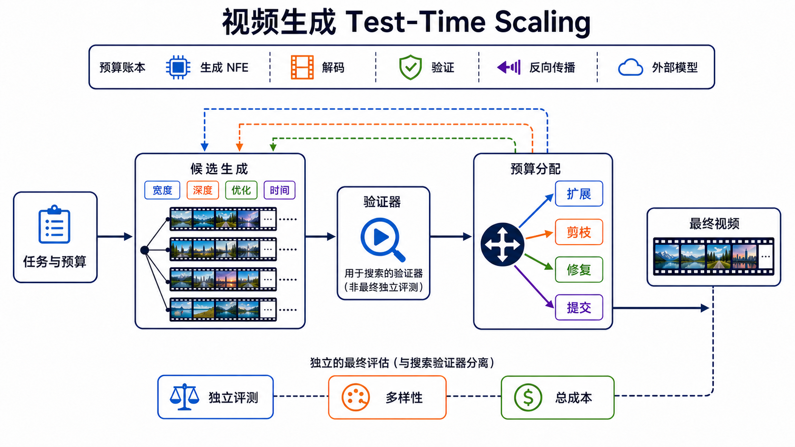

# 视频生成的 Test-Time Scaling：多候选、验证器与自适应推理预算

> 一手来源审计截至 **2026-09-02**。这是一个快速发展的新方向：2025 年的核心证据已有 ICCV、NeurIPS、BMVC 等正式论文支撑，但 2026 年后半段不少方法仍主要来自作者预印本。正文会明确区分正式发表、预印本、作者报告与独立验证。检索式、纳入标准和逐项证据见[调研记录](../../sources/research_20260902_test_time_scaling.md)。

**核心一句话：Test-Time Scaling（TTS）不是单纯“多跑几步”，而是在每个请求到来后，把可调的推理预算分配给候选生成、轨迹搜索、验证、修复或临时适配，并考察最终质量是否随总预算稳定提升。**

这条路线利用了视频生成固有的多解性：同一提示词从不同噪声、不同去噪分支或不同计划出发，可能得到质量差异很大的视频。如果系统能够低成本地产生差异、可靠地辨认好坏，并把剩余预算集中到更有希望的方向，那么不重新训练基础生成器也可能改善最终输出。反过来，只增加候选数却没有可靠验证器，只增加去噪步数却没有匹配训练，或只展示挑出的最好样例，都不能构成可信的 scaling 证据。

## 1. 定义：什么才算 test-time scaling

对输入条件 \(c\)，可以把任意预算化推理过程统一写成：

```math
\hat v_B
=
\mathcal{A}_B(c;\theta,s_\phi),
```

其中 \(\mathcal{A}_B\) 可以是多候选搜索、reward guidance、noise / latent 优化、临时参数适配或多轮修复。当它属于候选选择方法时，才进一步写成：

```math
\hat v_B
=
\arg\max_{v\in\mathcal{C}_B(c)}
s_\phi(c,v).
```

TTS 研究关心的不是某一个固定配置，而是当预算从 \(B_1\) 增长到 \(B_2,\ldots\) 时，**独立质量函数** \(q_{\mathrm{ind}}\) 是否形成可复现的质量—成本曲线：

```math
q_{\mathrm{ind}}(c,\hat v_{B_1})
\;\longrightarrow\;
q_{\mathrm{ind}}(c,\hat v_{B_2})
\;\longrightarrow\;\cdots
```

这里的“独立”很重要：如果搜索和报告结果使用同一个 reward，曲线可能只证明系统越来越会迎合该 reward，而不是视频真的更符合人类意图。

### 1.1 与相邻概念的边界

| 概念 | 主要目标 | 预算怎样变化 | 是否属于本章 |
|---|---|---|---|
| **Test-time scaling** | 用更多或更聪明分配的请求级计算换取更好的选中输出 | 候选数、搜索深度、验证次数、反向传播、外部模型调用或交互轮数可调 | **是**；必须报告质量—总成本曲线 |
| **推理加速** | 在质量大致相当时减少成本 | 降 NFE、压缩单次前向、量化、缓存、并行 | 相邻但目标相反；少步路线见[Flow 与 Consistency](flow-consistency-models.md) |
| **后训练与对齐** | 用数据或反馈持续改变跨请求共享的模型 | SFT、DPO、RWR、RL 等训练预算 | 通常不是；见[后训练与对齐](video-post-training-alignment.md) |
| **Test-time optimization / adaptation** | 针对当前请求更新 latent、噪声、临时参数或记忆 | 增加梯度步、更新轮数与状态 | 可作为 TTS 的一种实现，但必须交代状态生命周期 |
| **长度外推** | 生成比训练窗口更长的视频 | 输出时长与上下文增长 | 本身不是计算 scaling；流式和开放时域边界见[因果、流式与实时](causal-streaming-generation.md) |
| **推理期 guidance** | 每一步用额外信号修正采样路径 | 多一次梯度、分类器或 reward 调用 | 固定配置只是推理优化；扫描预算并验证曲线后才构成 scaling 研究 |
| **Oracle Best-of-\(N\)** | 用真值或最终测试指标从候选中挑最好者 | 候选数增加 | 只能给潜在上界，不能冒充可部署系统 |

基础生成器是否冻结并不是唯一判据。“Training-free”有时只表示不更新基础生成器，却仍训练了 verifier、调用外部 VLM、执行反向传播、更新临时 LoRA 或维护跨轮记忆。可靠报告应逐项说明这些成本和状态，而不是只写一个笼统标签。

### 1.2 只有一个预算点，不宜叫 scaling law

一个固定的 Best-of-4、一次 reward guidance 或一个额外 LoRA 更新可以是有效的推理期方法，但只有比较多个预算点、多个提示难度层级和独立指标后，才能回答“是否随计算扩展”。本章因此区分：

- **test-time optimization**：某个推理期技巧在固定预算下有效；
- **test-time scaling**：质量随可控预算变化，并给出饱和、退化或转折点；
- **scaling law**：还要进一步证明跨模型、数据或任务的规律稳定，当前视频文献通常尚未达到这个证据强度。

## 2. 先建预算账本，再谈效果

视频 TTS 的预算不止候选数 \(N\)。一个更完整的请求级预算向量是：

```math
B
=
\bigl(
N_{\mathrm{cand}},
N_{\mathrm{NFE}},
N_{\mathrm{verify}},
N_{\mathrm{update}},
N_{\mathrm{round}},
N_{\mathrm{external}},
T_{\mathrm{out}}
\bigr),
```

分别表示候选宽度、每条轨迹的生成器前向次数、验证次数、梯度或临时参数更新次数、生成—反馈轮数、外部 VLM/世界模型/Agent 调用，以及输出时长。端到端成本至少应写成：

```math
C_{\mathrm{total}}
=
C_{\mathrm{gen}}
+C_{\mathrm{decode}}
+C_{\mathrm{verify}}
+C_{\mathrm{backward}}
+C_{\mathrm{external}}
+C_{\mathrm{I/O}}
+C_{\mathrm{winner\ rerun}}.
```

最后一项专门覆盖“廉价探索、全成本重生成赢家”一类方法。如果只比较生成器 NFE，却忽略解码、验证器、外部模型、反向传播和重生成，就可能把成本从一栏挪到另一栏后误称为扩展效率。



**图 1：预算—候选—验证—再分配。** 推理预算进入生成深度、候选宽度、优化轮数或输出时长；验证器只负责搜索中的选择、扩展、剪枝、修复与提交；最终结论由与搜索信号隔离的评测、人评或真实任务给出。图中“总成本”包含生成、解码、验证、反向传播和外部模型调用，不把某一项单独当作全部计算。

顺序化文字替代：任务和总预算先进入候选生成；系统可以增加单条轨迹深度、并行候选宽度、优化轮数或长时序窗口；候选经过验证器后，预算控制器选择扩展、剪枝、修复或提交；最终视频交给独立评测。验证器得分、输出多样性与总成本同时记录。

## 3. 额外计算可以投向哪里

### 3.1 深度：增加单条轨迹的 NFE

最直观的做法是增加去噪或 ODE 求解步数。在固定连续动力学与兼容求解器的理想化前提下，它的预期作用主要是降低离散化误差；在真实系统中，额外步骤也可能改变有效采样动力学，并累积模型或 score 误差，所以不会自动修复语义组合、运动规划或物理错误。对专门蒸馏成少步的 consistency 模型，额外步骤甚至可能退化。AnyFlow 的意义正在于：它专门训练一个能在不同 NFE 下工作的视频 diffusion 模型，使增加步数更可能继续改善结果，而不是假定任意生成器都天然支持深度 scaling [[13]](#ref-13)。

因此，“32 步优于 8 步”要同时问三个问题：训练是否覆盖该步数区间？比较是否匹配总成本？增益来自更精确积分，还是来自不同 sampler、guidance 或随机性？

### 3.2 宽度：多随机种子与 Best-of-\(N\)

Video-T1 把最简单的路线写得很清楚：从多个 Gaussian noise 初态独立生成候选，再选择最高分者；候选数就是可调预算 [[3]](#ref-3)。联合音视频 TTS 进一步使用多个 verifier 与自适应 reward 权重，说明画面、音质、语义和同步目标之间不能被一个固定总分无损替代 [[9]](#ref-9)。

Best-of-\(N\) 的优势是黑盒兼容、容易并行；弱点也很直接：

- 成本近似随候选数线性增长；
- 候选高度相关时，新增样本的信息增益迅速饱和；
- 选择器误排会让“候选池更好”无法转化为“交付结果更好”；
- 只报告选中样本，会隐藏单样本可靠性和失败概率。

### 3.3 结构化搜索：在中间轨迹就分支、前瞻与剪枝

DLBS 不等完整视频全部生成完再选择，而是在 diffusion latent 中做带 lookahead 的 beam search，把预算投向更有希望的去噪分支 [[1]](#ref-1)。Video-T1 的 Tree-of-Frames 用帧级扩展与剪枝组织候选 [[3]](#ref-3)；EvoSearch 将选择、变异、交叉和多样性维护引入 diffusion/flow 搜索 [[4]](#ref-4)；LatSearch 则训练能直接评价不同噪声时刻 latent 的 reward model，以减少完整解码后的浪费 [[11]](#ref-11)。

这类方法的核心权衡是：

```math
\text{更早决策}
\Rightarrow
\text{更低验证成本，但更难准确预知最终质量}.
```

BMVC 2025 的 _Verifier Matters_ 直接指出，通用 verifier 在早期带噪状态上可能不可靠；对部分去噪状态做适配后，Greedy、Beam 或 Successive Halving 才更可能有效 [[5]](#ref-5)。所以搜索算法常不是瓶颈，**在什么状态上、用什么信号排序**才是。

### 3.4 引导与在线优化：直接改变当前轨迹

另一条路线不是“生成后挑选”，而是用 reward 对当前采样过程施加梯度或优化：

- Flow-NRG 在 flow 采样时使用 VideoReward 的能量引导，并允许组合不同目标 [[6]](#ref-6)；
- TTOM 为当前组合式提示新增并优化临时参数，还用参数化记忆保存优化上下文 [[8]](#ref-8)；
- Proprio 从冻结生成器在 latent 扰动下的 flow residual 构造自评分，可用于 Best-of-\(N\) 或梯度 refinement [[14]](#ref-14)；
- TANGO 在测试时用自诊断信号优化小型 LoRA；它属于临时参数适配，而不是纯 sampler search [[16]](#ref-16)；
- NoisEasier 直接优化完整随机噪声轨迹，并用多目标 reward 约束方向 [[20]](#ref-20)。

在线优化可能比盲目扩展候选更节省样本，却引入反向传播显存、局部最优、reward hacking 和状态清理问题。若记忆或参数跨请求保留，还要说明它究竟是缓存、个性化状态，还是已经构成在线学习。

### 3.5 长时序闭环：按 chunk 继续、回看和重分配

长视频的错误会随时间累积，TTS 因而从一次性候选选择扩展到持续闭环。ScalingNoise 搜索一步去噪后的噪声候选，并用锚帧相关 reward 支撑长视频延展 [[2]](#ref-2)；Stream-T1 把噪声传播、长短窗口 reward、分块剪枝与 KV-cache memory sinking 放进流式生成 [[12]](#ref-12)。

这里必须把两条曲线分开：

1. **固定时长下，计算增加是否提升质量**；
2. **输出时长增长时，质量、状态漂移和资源怎样变化**。

能够不断追加 chunk 不等于长期稳定，也不等于 test-time compute scaling 已经成立。

### 3.6 Agent、诊断、修复与候选回收

VISTA 用规划、生成、成对比较、视觉/音频/上下文批评和提示重写构成黑盒自改进循环 [[17]](#ref-17)。这类系统容易接入闭源生成器，但必须把 Agent token、外部模型调用和多轮视频生成都纳入账本，系统增益也不能归因成基础生成器参数能力提升。

GEARS 不再把低分候选全部丢弃，而是先用关键帧和多维 reward 诊断，再按阶段保留、修复或淘汰，并通过 prompt/latent 编辑回收“弱但可修”的候选 [[19]](#ref-19)。这代表一个重要方向：未来的 scaling 可能不是简单扩大 \(N\)，而是让每个已付费候选携带的信息被重复利用。

## 4. 验证器决定 scaling 能不能兑现

一个搜索系统至少包含三种角色：

| 角色 | 负责什么 | 不能替代什么 |
|---|---|---|
| **proposal / generator** | 提供多样候选、分支或可优化状态 | 不能自己证明候选质量 |
| **search verifier / reward** | 在有限预算内排序、剪枝、引导或诊断 | 不能单独充当最终证据 |
| **independent evaluator** | 用冻结指标、人评或真实任务验证选中输出 | 不应泄漏回搜索环节 |

### 4.1 验证信号按观察位置分类

| 观察位置 | 例子 | 优点 | 主要风险 |
|---|---|---|---|
| 完整解码视频 | VLM、VideoReward、音视频同步分数 | 信息最完整，黑盒兼容 | 解码和外部模型昂贵 |
| 部分解码帧/关键帧 | Tree-of-Frames、GEARS | 比全片便宜，可早剪枝 | 可能漏掉运动、节奏和后段失败 |
| 带噪 latent | DLBS、Verifier Matters、LatSearch、PRISM | 可在高成本生成完成前决策 | 早期状态与最终质量的对应关系弱 |
| 生成器内部残差 | Proprio、TANGO | 少依赖独立大模型 | 自评分可能放大模型自身盲点 |
| 几何或世界模型 | WMReward、几何一致性信号 | 针对物理/空间约束 | 仍是学习到的代理，不是物理定律证明 |
| 多 verifier 组合 | 联合音视频 TTS、GEARS | 可覆盖语义、画质、运动、同步等多目标 | 权重变化会改变“最好”的定义 |

PRISM 尝试从带噪 latent 直接预测 reward，以避免每个候选都完整解码 [[15]](#ref-15)；WMReward 用 latent world model 评价并引导物理合理性 [[10]](#ref-10)。这两类方法降低或改变了验证成本，但“更便宜的 proxy”必须另外校准：在不同噪声时刻、提示类型、模型家族和预算下，排序是否仍能预测最终人类判断？

### 4.2 最少应报告的选择证据

设独立评测可给候选池中每个视频一个分析分数 \(q_{\mathrm{ind}}\)。除选中结果外，至少报告：

- 单样本结果与随机候选结果；
- 候选池的均值、方差和多样性；
- verifier 选中结果；
- oracle 上界，仅作诊断；
- verifier 的 pairwise accuracy、top-\(k\) recall 或选择 regret；
- 独立指标与人评；
- 失败提示的难度分层，而不是只给平均值。

选择 regret 可以写成：

```math
R_B
=
\max_{v\in\mathcal{C}_B} q_{\mathrm{ind}}(c,v)
-
q_{\mathrm{ind}}(c,\hat v_B).
```

若 oracle 随 \(N\) 上升而实际选择器不升，问题在 verifier；若二者都很快饱和，问题更可能在候选多样性或生成器能力边界。

## 5. 2025—2026：方法怎样演进

下表按首次公开时间组织直接相关工作，只记录本次能核验的发表状态。发表与独立复现是两个维度：正式论文也可能尚无跨团队复现；预印本则只按作者当前公开材料陈述，不把作者结果升级为独立验证。

| 时间 | 工作 | 预算与反馈机制 | 截至 2026-09-02 的证据状态 |
|---|---|---|---|
| 2025-01 | DLBS [[1]](#ref-1) | latent beam search、lookahead、校准 reward | NeurIPS 2025 |
| 2025-03 | ScalingNoise [[2]](#ref-2) | 噪声候选搜索、锚帧 reward、长视频扩展 | 预印本 |
| 2025-03 | Video-T1 [[3]](#ref-3) | 线性 Best-of-\(N\)、Tree-of-Frames | ICCV 2025 |
| 2025-05 | EvoSearch [[4]](#ref-4) | 选择、变异、交叉、多样性维护 | 预印本；公开项目 |
| 2025 | Verifier Matters [[5]](#ref-5) | 对部分去噪状态适配 verifier，再做 Greedy/Beam/Successive Halving | BMVC 2025 |
| 2025 | Flow-NRG [[6]](#ref-6) | inference-time reward / energy guidance | NeurIPS 2025 |
| 2025-10 | TTOM [[8]](#ref-8) | 临时参数优化与参数化记忆 | ICLR 2026 |
| 2025-10 | VISTA [[17]](#ref-17) | 黑盒规划—生成—批评—重写循环 | CVPR 2026 |
| 2026-01 | WMReward [[10]](#ref-10) | latent world-model reward 搜索与引导 | CVPR 2026 |
| 2026-03 | LatSearch [[11]](#ref-11) | 任意噪声时刻 latent reward、重采样与剪枝 | 预印本；作者注明 ECCV 2026 |
| 2026-05 | Stream-T1 [[12]](#ref-12) | 分块搜索、长短窗口 reward、缓存记忆 | 预印本 |
| 2026-05 | AnyFlow [[13]](#ref-13) | 训练可随 NFE 改善的 any-step 模型 | 预印本 |
| 2026-05 | Proprio [[14]](#ref-14) | 生成器自评分、BoN 与梯度 refinement | 预印本 |
| 2026-06 | PRISM [[15]](#ref-15) | 带噪 latent reward，提前排序 | 预印本 |
| 2026-07 | TANGO [[16]](#ref-16) | 自诊断与测试时 LoRA 优化 | 预印本；作者注明 ECCV 2026 |
| 2026-07 | CachedSearch [[18]](#ref-18) | 缓存近似探索、完整重生成赢家 | 预印本 |
| 2026-08 | GEARS [[19]](#ref-19) | 诊断、阶段决策、候选修复与回收 | ACM TOG / SIGGRAPH Asia 2026；DOI 可核验 |
| 2026-08 | NoisEasier [[20]](#ref-20) | 可微多目标 reward 优化完整随机轨迹 | 预印本；作者注明 ECCV 2026 |

这条时间线显示了三个变化：从“完整生成后选一个”走向“中间状态就决策”；从统一加预算走向按难度和诊断分配；从丢弃失败候选走向修复、缓存与复用。但它还没有证明一个跨模型、跨任务稳定的通用 scaling law。

## 6. 哪些任务最适合 TTS

### 6.1 组合语义与复杂动作

当失败是多峰的——人物、数量、左右关系、动作顺序或镜头组合中只有一项出错——多候选与 verifier 容易找到收益。DLBS、Video-T1、Flow-NRG 和 TTOM 主要覆盖这类文本—视频对齐与组合约束 [[1]](#ref-1) [[3]](#ref-3) [[6]](#ref-6) [[8]](#ref-8)。

### 6.2 物理与几何一致性

WMReward、Proprio 等工作尝试让搜索信号关注物体运动和物理合理性 [[10]](#ref-10) [[14]](#ref-14)。但 learned world model、几何估计器和内部残差都是代理信号；某个 benchmark 上升不等于普遍遵守物理定律。更完整的边界见[物理一致性](../physical-consistency.md)。

### 6.3 长视频、流式与交互生成

长时序特别适合自适应预算：简单 chunk 快速提交，身份漂移、场景切换或动作不确定时增加候选和回看。但 commit 后能否撤回、验证窗口能看多远、缓存是否污染后续状态，都要纳入系统协议。相关部署约束见[因果、流式与实时](causal-streaming-generation.md)。

### 6.4 联合音视频

联合生成同时受画面质量、声音质量、语义和同步约束。Inference-Time Scaling for Joint Audio-Video Generation 表明，多 verifier 与自适应权重比固定单一 reward 更符合这一多目标结构 [[9]](#ref-9)。但只在某个 reward 上增益，仍可能牺牲另一个未被充分测量的维度。详见[原生音视频生成](../tasks/native-audio-video-generation.md)。

### 6.5 “生成视频帮助推理”不是同一评价目标

VideoTPO、VISTA 等系统会让模型检查候选、批评结果或重写条件 [[7]](#ref-7) [[17]](#ref-17)。如果最终指标是问答、空间推理或控制成功率，研究对象是“视频作为中间思考介质”的系统级 test-time compute；如果最终指标是交付视频质量，研究对象才是本章的生成 TTS。两者共享搜索结构，但证据不能互换，见[Video Reasoning](../video-reasoning.md)。

## 7. 从统一加预算到自适应计算

平均分配 \(N\) 个候选简单，却会把大量计算浪费在容易提示上。更合理的控制器根据当前不确定性决定继续还是停止：

```math
a_t
\in
\{\text{expand},\text{verify},\text{repair},\text{commit},\text{abstain}\},
\qquad
a_t=\pi(h_t,B_{\mathrm{remain}}).
```

其中 \(h_t\) 可以包含候选间得分间隔、verifier 不确定性、多样性、失败类型、已用预算和剩余时限。可操作的调度策略包括：

1. 先用低成本候选和粗 verifier 探索；
2. 对明显较差的分支做 successive halving；
3. 对分数接近或 verifier 不确定的请求增加验证；
4. 对局部可修错误优先修复，而不是全量重采样；
5. 只有在候选排序稳定后才完整解码或高质量重生成；
6. 达到成本、时限或置信度阈值时提交；无法满足硬约束时允许 abstain。

CachedSearch 将这一思想落实为“低成本缓存探索，再以完整计算重生成赢家”，它依赖的关键假设不是近似候选像素完全准确，而是**候选排序在近似计算下仍被保留** [[18]](#ref-18)。这一假设应针对模型、提示难度和缓存强度逐层校准。

## 8. 公平比较：TestScale-1 最小实验协议

下面是一套可直接用于复现或新论文的最小协议。它不是现有统一标准，而是基于本章证据边界整理的建议。

### 8.1 固定实验合同

- 冻结生成模型、分辨率、帧率、时长、prompt 集与负面提示；
- 记录 sampler、NFE、CFG/reward 权重、随机种子和精度；
- 将提示按组合语义、运动、物理、长程一致性、音视频或交互难度分层；
- 预先声明主指标、独立 evaluator、人评协议和失败标签。

### 8.2 在相同总预算下比较

至少包含：

| 对照 | 用途 |
|---|---|
| 单候选、标准 NFE | 给出真实 pass@1 基线 |
| 单候选、更多 NFE | 检查纯深度 scaling |
| \(N\) 候选、随机选一个 | 分离“多生成”与“会选择” |
| \(N\) 候选、verifier 选择 | 测量实际 TTS |
| 结构化/自适应搜索 | 检查同成本下是否优于朴素 BoN |
| Oracle 选择 | 仅衡量候选池潜力和 verifier regret |

总计算预算应尽量匹配实际 GPU 时间、能耗或可复现的计算代理；峰值显存是需要单独控制和报告的资源约束，不能替代 compute matching。若无法完全匹配，至少公开预算向量、每项时延和显存，避免只匹配 NFE。

### 8.3 画出曲线，不只给一个最好点

对每个方法报告至少 4 个预算点，并同时画出：

- 独立质量—总成本前沿；
- 搜索 reward—总成本曲线；
- oracle 与 verifier 选择结果的差距；
- 多样性与候选相关性；
- 不同难度层级的收益、饱和和退化；
- 平均时延、P95 时延、峰值显存，以及流式系统的首帧延迟和 deadline miss。

如果搜索 reward 单调上升而独立质量下降，应优先判定 reward hacking 或评测泄漏，而不是继续扩大预算。

## 9. 常见失败模式

- **候选没有真实差异。** 多个种子收敛到近似运动和构图，增加 \(N\) 只重复付费。
- **验证器比生成器更弱。** 候选池包含好视频，但早期 latent 或代理 reward 排不出来。
- **赢家诅咒。** 候选越多，越可能选中被 verifier 高估的极端样本。
- **目标塌缩。** 过度追求文本对齐、静态画质或物理 proxy，牺牲运动、风格、声音或多样性。
- **分布外失效。** verifier 在常见提示上校准，在复杂动作、长尾物体或新生成器上误排。
- **成本口径缺项。** 忽略解码、外部 VLM、反向传播、缓存探索、赢家重生成或 Agent token。
- **单样本能力被隐藏。** Best-of-\(N\) 改善交付样本，不等于基础模型 pass@1 或整体可靠性上升。
- **把更多步骤当作普遍规律。** 未经相应训练的少步/consistency 模型可能不会随 NFE 单调改善。
- **评测与搜索同源。** 用同一个 reward 选择并证明提升，无法排除 reward hacking。
- **只展示成功案例。** 精选视频不能替代成组提示、预注册预算和失败率。

## 10. 仍未解决的问题

1. **可迁移 verifier**：能否跨生成器、噪声时刻、时长和任务保持排序校准？
2. **难度感知预算**：怎样在生成前或早期状态准确预测“这个请求值得再花多少算力”？
3. **多目标 Pareto 搜索**：语义、画质、运动、物理、身份和音视频同步不应被固定权重粗暴压成一个数。
4. **候选复用**：能否把失败轨迹中的局部正确结构、运动或记忆安全地回收？
5. **分布级改善**：怎样从“选一个最好”走向真正降低全体输出的失败率，而不是只改变交付选择？
6. **交互与安全**：当用户反馈、自动 verifier 和策略约束冲突时，谁决定继续、修复、拒绝或回退？
7. **统一成本报告**：视频分辨率、时长、NFE、解码和外部模型差异巨大，尚缺少被广泛采用的总成本协议。
8. **独立复现**：截至本章快照，2026 年后半段方法仍以作者预印本为主，跨团队复现不足。

## 11. 阅读顺序

如果只想建立主线，可按下面顺序：

1. Video-T1：理解 Best-of-\(N\) 与 Tree-of-Frames [[3]](#ref-3)；
2. DLBS 与 Verifier Matters：理解中间轨迹搜索为什么依赖校准 verifier [[1]](#ref-1) [[5]](#ref-5)；
3. Flow-NRG 与 TTOM：理解 reward guidance 和临时参数优化 [[6]](#ref-6) [[8]](#ref-8)；
4. WMReward、Stream-T1 与联合音视频 TTS：观察物理、长时序和多目标扩展 [[10]](#ref-10) [[12]](#ref-12) [[9]](#ref-9)；
5. CachedSearch、GEARS 与 NoisEasier：观察 2026 年从盲目扩宽走向廉价探索、诊断回收和全轨迹优化 [[18]](#ref-18) [[19]](#ref-19) [[20]](#ref-20)。

需要降低每次尝试的生成步数，转到[Flow 与 Consistency](flow-consistency-models.md)；需要改变跨请求共享的模型，转到[后训练与对齐](video-post-training-alignment.md)；需要判断指标是否真的支持主张，转到[评测指南](../evaluation.md)。

## 参考文献

<a id="ref-1"></a>[1] [Inference-Time Text-to-Video Alignment with Diffusion Latent Beam Search](https://proceedings.neurips.cc/paper_files/paper/2025/hash/13b501c58ae3bfe9635a259f4414e943-Abstract-Conference.html). Yuta Oshima et al. NeurIPS. 2025.

<a id="ref-2"></a>[2] [ScalingNoise: Scaling Inference-Time Search for Generating Infinite Videos](https://arxiv.org/abs/2503.16400). Haolin Yang et al. arXiv preprint. 2025.

<a id="ref-3"></a>[3] [Video-T1: Test-time Scaling for Video Generation](https://openaccess.thecvf.com/content/ICCV2025/html/Liu_Video-T1_Test-time_Scaling_for_Video_Generation_ICCV_2025_paper.html). Fangfu Liu et al. ICCV. 2025.

<a id="ref-4"></a>[4] [Scaling Image and Video Generation via Test-Time Evolutionary Search](https://arxiv.org/abs/2505.17618). Haoran He et al. arXiv preprint. 2025.

<a id="ref-5"></a>[5] [Verifier Matters: Enhancing Inference-Time Scaling for Video Diffusion Models](https://bmvc2025.bmva.org/proceedings/1006/). Lorenzo Baraldi et al. BMVC. 2025.

<a id="ref-6"></a>[6] [Improving Video Generation with Human Feedback](https://proceedings.neurips.cc/paper_files/paper/2025/hash/76227feb18ea0ee40bd15cf02c33e18e-Abstract-Conference.html). Jie Liu et al. NeurIPS. 2025.

<a id="ref-7"></a>[7] [TiViBench: Benchmarking Think-in-Video Reasoning for Video Generation](https://openaccess.thecvf.com/content/CVPR2026/html/Chen_TiViBench_Benchmarking_Think-in-Video_Reasoning_for_Video_Generation_CVPR_2026_paper.html). Chen et al. CVPR. 2026.

<a id="ref-8"></a>[8] [TTOM: Test-Time Optimization and Memorization for Compositional Video Generation](https://proceedings.iclr.cc/paper_files/paper/2026/hash/727855c31df8821fd18d41c23daebf10-Abstract-Conference.html). Leigang Qu et al. ICLR. 2026.

<a id="ref-9"></a>[9] [Inference-Time Scaling for Joint Audio-Video Generation](https://openreview.net/forum?id=MHNFjjm5nO). Jaemin Jung et al. TMLR. 2026.

<a id="ref-10"></a>[10] [Inference-time Physics Alignment of Video Generative Models with Latent World Models](https://openaccess.thecvf.com/content/CVPR2026/html/Yuan_Inference-time_Physics_Alignment_of_Video_Generative_Models_with_Latent_World_CVPR_2026_paper.html). Jianhao Yuan et al. CVPR. 2026.

<a id="ref-11"></a>[11] [LatSearch: Latent Reward-Guided Search for Faster Inference-Time Scaling in Video Diffusion](https://arxiv.org/abs/2603.14526). Zengqun Zhao et al. arXiv preprint. 2026.

<a id="ref-12"></a>[12] [Stream-T1: Test-Time Scaling for Streaming Video Generation](https://arxiv.org/abs/2605.04461). Yijing Tu et al. arXiv preprint. 2026.

<a id="ref-13"></a>[13] [AnyFlow: Any-Step Video Diffusion Model with On-Policy Flow Map Distillation](https://arxiv.org/abs/2605.13724). Yuchao Gu et al. arXiv preprint. 2026.

<a id="ref-14"></a>[14] [Proprio: Latent Self-Scoring and Inference-Time Refinement for Physically Plausible Video Generation](https://arxiv.org/abs/2605.28230). Mariam Hassan et al. arXiv preprint. 2026.

<a id="ref-15"></a>[15] [Through the PRISM: Preference Representation in Intermediate States of Video Diffusion Models](https://arxiv.org/abs/2606.20310). Haoxuan Wu et al. arXiv preprint. 2026.

<a id="ref-16"></a>[16] [Test-Time Noise Guided Adaptation for Realistic Autoregressive Video Generation](https://arxiv.org/abs/2607.15849). Dimitrios Karageorgiou et al. arXiv preprint. 2026.

<a id="ref-17"></a>[17] [VISTA: A Test-Time Self-Improving Video Generation Agent](https://openaccess.thecvf.com/content/CVPR2026/html/Long_VISTA_A_Test-Time_Self-Improving_Video_Generation_Agent_CVPR_2026_paper.html). Do Xuan Long et al. CVPR. 2026.

<a id="ref-18"></a>[18] [CachedSearch: Training-Free Cached Exploration for Test-Time Search in Video Diffusion](https://arxiv.org/abs/2607.23159). Shreshth Saini et al. arXiv preprint. 2026.

<a id="ref-19"></a>[19] [Test-Time Scaling for Video Diffusion Models via Diagnosis-Guided Candidate Recycling](https://doi.org/10.1145/3842526). Hangzhou He et al. ACM Transactions on Graphics / SIGGRAPH Asia. 2026. [Test-Time Scaling for Video Diffusion Models via Diagnosis-Guided Candidate Recycling (arXiv)](https://arxiv.org/abs/2608.29322).

<a id="ref-20"></a>[20] [NoisEasier: Test-Time Noise Optimization for Text-to-Video Generation](https://arxiv.org/abs/2608.30194). Yujiang Pu and Yu Kong. arXiv preprint; manuscript notes ECCV 2026. 2026.
