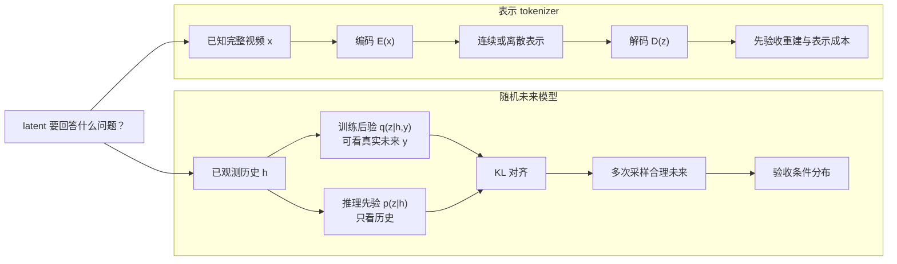
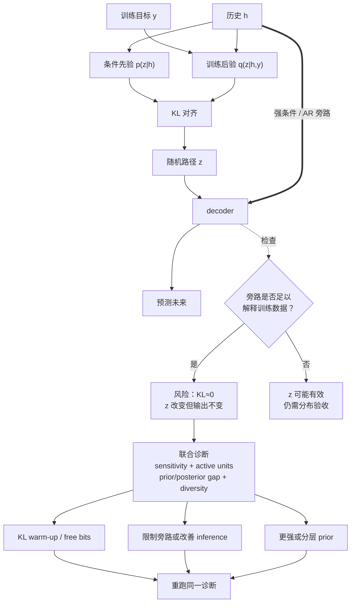

# 变分视频生成：ELBO、条件先验与随机未来

> 本章资料核验截至 **2026-08-30**。这里的 VAE 指用随机潜变量建模条件未来分布的概率生成模型；用 autoencoder 压缩已知视频、供 diffusion / flow / AR 使用的另一种“video VAE”，单独放在[视频 Tokenizer、Codec 与生成式压缩](video-tokenizers.md)中。

## 1. 先写清任务合同：随机未来不是压缩接口

给定相同历史 $h=x_{1:C}$，真实世界可能出现多个合理未来 $y=x_{C+1:K}$。本章研究的是

$$
p_\theta(y\mid h)=\int p_\theta(y\mid h,z)p_\psi(z\mid h)\,\mathrm dz,
$$

其中 $z$ 表达在历史中无法唯一确定的未来因素。训练时可借助看到真实未来的近似后验，推理时只能从只看历史的条件先验采样。

视频系统中的 latent 还有另一个角色：把已知视频编码成较小表示。两者可能都有 encoder、decoder、Gaussian latent 和 KL 项，但问题、信息边界与验收对象都不同。

| 角色 | $z$ 表示什么 | 训练时可见信息 | 推理时 $z$ 的来源 | 首要验收 |
|---|---|---|---|---|
| **随机未来 latent** | 同一历史之后不可约简的未来分叉 | posterior 可看历史与真实未来 | 只看历史的 learned prior | 条件分布、覆盖、多样性、校准、长期 rollout |
| **表示 tokenizer latent** | 已知视频的紧凑可解码表示 | 待编码视频 | encoder 或上层 generator | 重建、shape、压缩账、编解码成本 |

顺序化文字替代：先问 latent 的任务。若要从同一历史采样多个未来，训练后验可以读取真实未来，推理先验只能读取历史，二者经 KL 对齐后评测整个条件分布；若要压缩已知视频，则编码、解码并先验收重建和表示成本。两条路线不是前后继承关系。

## 2. 从不可算后验到可训练下界

### 2.1 ELBO 的三层含义

VAE 假设观测 $x$ 由潜变量 $z$ 产生 [[1]](#ref-1)：

$$
p_\theta(x)=\int p_\theta(x\mid z)p(z)\,\mathrm dz.
$$

真实后验 $p_\theta(z\mid x)$ 通常不可直接计算，于是用编码器 $q_\phi(z\mid x)$ 近似。由 Jensen 不等式得到证据下界：

$$
\log p_\theta(x)
\ge
\underbrace{\mathbb E_{q_\phi(z\mid x)}
\left[\log p_\theta(x\mid z)\right]}_{\text{解释观测}}
-
\underbrace{D_{\mathrm{KL}}\!\left(q_\phi(z\mid x)\Vert p(z)\right)}_{\text{使推理时可从先验采样}}.
$$

对角高斯常用

$$
z=\mu_\phi(x)+\sigma_\phi(x)\odot\epsilon,
\qquad \epsilon\sim\mathcal N(0,I),
$$

把随机采样改写成可反向传播的确定性参数路径加外部噪声。三点必须分开：

- ELBO 是对数似然的下界，不是视频真实度或感知质量本身；
- reconstruction likelihood 隐含误差模型，独立高斯似然常偏好平均化预测；
- KL 约束的是分布关系，不证明 decoder 实际使用了 $z$。

### 2.2 条件视频中的 learned prior

给定历史 $x_{1:C}$，逐步预测未来时，一个概念化条件 ELBO 是

$$
\sum_{k=C+1}^{K}
\mathbb E_{q_\phi(z_k\mid x_{\le k})}
\left[\log p_\theta(x_k\mid x_{<k},z_{\le k})\right]
-
D_{\mathrm{KL}}\!\left(
q_\phi(z_k\mid x_{\le k})
\Vert
p_\psi(z_k\mid x_{<k})
\right).
$$

关键是信息边界，而不是公式长度：

1. 训练 posterior $q_\phi$ 可见当前真实目标，用 $z_k$ 解释这一次实际发生的未来；
2. 部署 prior $p_\psi$ 只能见过去，因为目标未来尚不存在；
3. KL 让只看过去的 prior 覆盖训练 posterior 使用的潜空间；
4. 若二者差距大，就会出现 posterior 重建很好、prior rollout 很差的 **prior–posterior gap**。

VRNN 把 VAE 的随机状态与循环时序建模结合，给出了逐步 latent 的通用框架 [[5]](#ref-5)。在视频上，SV2P 用随机潜变量表达同一过去后的多种可能 [[2]](#ref-2)，SVG-LP 则明确配对逐时刻 learned prior 与训练 posterior [[3]](#ref-3)。

### 2.3 全局、逐步与分层 latent

| 结构 | 适合表达 | 常见失败 | 公平诊断 |
|---|---|---|---|
| 全局 latent | 身份、背景、风格、整体动作意图 | 长视频中新事件不足，早期一次采样锁死未来 | 固定历史后交换全局 $z$，看变化是否跨全段持续 |
| 逐时刻 latent | 局部运动分叉与持续新随机性 | 无时间相关先验时出现抖动或白噪声式变化 | 测 $z_k$ 干预的时间支持范围和 rollout 自相关 |
| 分层 latent | 高层计划与低层局部运动 | 高层被 decoder 绕过，低层吸收全部信息 | 分层 KL、逐层 ablation、跨层交换与预测灵敏度 |
| 内容—运动分支 | 静态身份/场景与动态变化 | 分支命名被误当成语义解耦证据 | swap、干预、probe 与反事实控制 |

Hierarchical Long-term Video Prediction 用分层随机变量处理长时视频预测，说明“层级”应由跨时间尺度的生成与消融来验证，而不是只看网络有几层 [[6]](#ref-6)。

## 3. Posterior collapse：一张因果图比一个 KL 数字更可靠

posterior collapse 指 decoder 几乎不使用 $z$：近似后验贴近 prior，条件生成退化为确定性路径，或由强自回归 decoder 独自解释训练数据。Lagging Inference Networks 指出，强生成网络与滞后的推断网络可形成不利训练动力学 [[4]](#ref-4)。

顺序化文字替代：历史和目标进入训练 posterior，历史单独进入推理 prior，二者经 KL 对齐形成随机路径；历史还可能沿强条件或自回归旁路直接进入 decoder。若旁路足以解释数据，同时观察到 KL 接近零且改变 $z$ 不改变输出，才有较强 collapse 证据。随后联合检查 decoder sensitivity、active units、prior–posterior gap 与条件多样性，再针对性使用 KL 调度、free bits、限制旁路、改善推断网络或更强 prior，并重新运行同一诊断。

### 3.1 最小诊断集

“KL 很小”只是警报，不是充分证据；真实数据可能确实不需要某些潜维。至少联合报告：

- **decoder sensitivity**：固定历史，改变 $z$，输出是否发生与未来结构相关的变化；
- **active units / mutual-information proxy**：多少潜维随数据系统变化；
- **条件样本多样性**：多次 prior 采样是否不同，同时仍服从历史；
- **posterior–prior gap**：训练 posterior 样本与测试 prior 样本质量差多少；
- **时间支持范围**：随机性改变持续的运动分支，还是只造成局部纹理噪声；
- **长期 rollout**：多样性、条件一致性和误差是否随 horizon 同时恶化。

### 3.2 干预不是免费午餐

| 手段 | 目的 | 代价或反例 |
|---|---|---|
| KL warm-up / cyclical schedule | 先学会利用 $z$，再加强先验匹配 | 后期仍可能 collapse；不同 schedule 不可直接比 |
| Free bits / KL floor | 防止 latent group 过早归零 | 过强会扩大 prior–posterior gap |
| 限制 decoder 条件或 AR 能力 | 迫使信息经过 $z$ | 可能牺牲确定性细节与短期精度 |
| 改善 inference network / 更新频率 | 减少 posterior 滞后 | 增加训练成本，不能保证分布覆盖 |
| richer / hierarchical prior | 表达更复杂的未来相关性 | 采样、稳定性与解释成本上升 |
| 显式多样性或对比目标 | 鼓励样本差异 | 可能用无意义外观扰动“刷多样性” |

停止条件不是“KL 变大”，而是：在固定历史下，$z$ 的干预产生可解释且持续的未来差异，prior 样本仍符合条件，且覆盖提升没有靠事实错误或噪声换取。

## 4. 经典路线：改变的是随机性位置，不是单一排行榜

| 首次公开 / 正式状态 | 节点 | 随机性放在哪里 | 贡献 | 必须保留的边界 |
|---|---|---|---|---|
| 2015 / NeurIPS 2015 | VRNN [[5]](#ref-5) | 每个序列步的 stochastic state | VAE 与 RNN 的通用结合 | 不是现代高分辨率视频 benchmark |
| 2017 / ICLR 2018 | SV2P [[2]](#ref-2) | 条件视频预测 latent | 同一历史的多未来预测 | 最佳样本不等于分布校准 |
| 2018 / ICML 2018 | SVG-LP [[3]](#ref-3) | 每步 posterior 与 learned prior | 明确训练—推理分布接口 | learned prior 仍可能漏 mode |
| 2018 / ICML 2018 | Hierarchical Long-term Video Prediction [[6]](#ref-6) | 多时间尺度 latent | 面向长时结构的分层预测 | 层级名不等于已解耦 |
| 2018 / arXiv preprint | SAVP [[7]](#ref-7) | stochastic VAE 路径加 adversarial 目标 | 尝试兼顾多样性与锐利度 | 截止本章核验日仍按预印本标注；锐利不等于忠实 |

这条历史线回答“怎样表达多未来”。现代 latent diffusion 视频生成也采样噪声，但其训练目标、反向过程和高维 latent 语义不同；不能因为两者都有随机变量就把 diffusion 的噪声时间轴称为 VAE posterior。详见[扩散模型](diffusion-models.md)。

## 5. 多未来评测：把“不同”与“正确”同时约束

单一未来数据集中，记录下来的 $y$ 只是条件分布的一次样本。逐像素比较会惩罚未与记录完全一致、但物理上合理的未来；只看多样性又会奖励失控噪声。因此至少分五层：

1. **条件一致性**：样本是否延续身份、场景状态、动作前提和已发生事件；
2. **样本间多样性**：相同历史、不同 seed 的未来是否有结构差异；
3. **覆盖而非 best-of-$N$**：报告整个样本集或 distributional score，不能只挑最接近真值者；
4. **校准**：模型分配的置信与事件频率是否匹配；
5. **随 horizon 的退化**：分别画条件错误、diversity、感知质量和状态漂移曲线。

若数据只有一个未来，可增加多标注或受控模拟环境；否则“覆盖真实条件分布”本身不可充分识别。对开放域视频，人工评测问题也要拆成“是否符合历史”“是否为合理未来”“多个样本是否真正不同”，不能只问“哪个好看”。

## 6. LatentFork-1：最小可证伪实验

这个实验用于判断随机 latent 是否真的承载未来不确定性。

### 6.1 冻结项

- 同一数据快照、历史长度、预测 horizon 与分辨率；
- 同一 deterministic backbone、decoder 容量、训练 FLOPs 和优化步数；
- 同一采样次数、seed 清单与评测脚本；
- 不允许在某一分支额外使用未来帧、更多条件或更强后处理。

### 6.2 仅改变的因素

| 分支 | 随机接口 | 目的 |
|---|---|---|
| A | 无 latent 或固定 $z$ | deterministic 下界 |
| B | posterior 训练，但测试从固定标准 prior 采样 | 暴露 prior 设计不足 |
| C | posterior + learned conditional prior | 检验 prior–posterior 对齐 |
| D | C + 分层或逐步 latent | 检验新增随机容量是否改善长期覆盖 |

### 6.3 必须交付

- posterior 重建与 prior 采样分开报告；
- KL、active units、decoder sensitivity 与同历史多样性同时报告；
- 对每个 horizon 报条件错误、覆盖、多样性和状态漂移；
- 提供 latent swap / intervention 视频，而非只给均值表；
- 记录训练和推理成本，防止把额外容量误归因给 latent 结构。

### 6.4 一票否决

出现任一情况，就不能声称“学到可控多未来”：

- 改变 $z$ 只改变纹理噪声，不改变持续事件或运动分支；
- posterior 样本好看，prior 样本系统性失真；
- 多样性上升但条件一致性显著下降；
- 只报 best-of-$N$，且 $N$ 在方法间不同；
- 分层 latent 没有逐层 ablation、交换或干预证据。

## 7. 失败定位与停止规则

| 症状 | 优先怀疑 | 最小诊断 | 不应立即下的结论 |
|---|---|---|---|
| 所有 seed 几乎相同 | collapse、条件旁路太强 | sensitivity、active units、逐维 KL | “数据本来确定” |
| posterior 好、prior 差 | prior–posterior gap | 两种采样并排、latent 分布距离 | “decoder 不够大” |
| seed 不同但只抖纹理 | $z$ 未承载结构事件 | 时间支持、轨迹/事件 probe | “多样性已经解决” |
| 长期越来越随机 | prior 时间相关不足或误差累积 | horizon 曲线、自相关、状态检查 | “短片分数高所以可长推” |
| 图像锐利但事实漂移 | adversarial/perceptual 目标补细节 | 输入条件审计、对象/数量/状态跟踪 | “感知分数更高即更准确” |

停止继续堆模型的条件：若在相同数据与容量下，posterior–prior gap、条件覆盖或长期状态误差连续两轮没有改善，应先检查数据是否包含可学习的分叉、评测是否能识别多未来，以及 decoder 是否绕过 latent，再决定是否增加层级或 prior 复杂度。

## 8. 与现代生成系统的接口

- 本章的 $z$ 表达**未来不确定性**；[视频 Tokenizer](video-tokenizers.md)的 latent 表达**已知视频表示**。
- 连续 tokenizer 上的 Gaussian [扩散](diffusion-models.md)或 [Flow / Consistency](flow-consistency-models.md)仍是另一层 objective；不要把 tokenizer 的 KL 与 diffusion noise schedule 合并。
- 若 future model 以历史为条件逐块生成，还需单独验收 [causal / streaming](causal-streaming-generation.md) 的 cache、commit 与 SLO；随机时序模型不自动实时。
- 全局坐标系使用 representation × factorization × objective × backbone × deployment，见[生成模型总览](../generative-models.md)。

建议阅读顺序：先用第 1 节判断 latent 角色，再用第 2 节核对训练—推理信息边界，用第 3 节诊断 collapse，最后以第 5–7 节设计可证伪实验。检索、筛选与证据等级见[研究日志](../../sources/research_20260830_video_representation_tokenizers.md)。

## 参考文献

[1] [Auto-Encoding Variational Bayes](https://iclr.cc/archive/2014/old-site/conference-proceedings.html). Diederik P. Kingma, Max Welling. ICLR 2014.

[2] [Stochastic Variational Video Prediction](https://openreview.net/forum?id=rk49Mg-CW). Mohammad Babaeizadeh, Chelsea Finn, Dumitru Erhan, Roy H. Campbell, Sergey Levine. ICLR 2018.

[3] [Stochastic Video Generation with a Learned Prior](https://proceedings.mlr.press/v80/denton18a.html). Emily Denton, Rob Fergus. ICML 2018.

[4] [Lagging Inference Networks and Posterior Collapse in Variational Autoencoders](https://openreview.net/forum?id=ryLDfnCqF7). Junxian He, Daniel Spokoyny, Graham Neubig, Taylor Berg-Kirkpatrick. ICLR 2019.

[5] [A Recurrent Latent Variable Model for Sequential Data](https://proceedings.neurips.cc/paper_files/paper/2015/hash/b618c3210e934362ac261db280128c22-Abstract.html). Junyoung Chung et al. NeurIPS 2015.

[6] [Hierarchical Long-term Video Prediction without Supervision](https://proceedings.mlr.press/v80/wichers18a.html). Nevan Wichers et al. ICML 2018.

[7] [Stochastic Adversarial Video Prediction](https://arxiv.org/abs/1804.01523). Alex X. Lee et al. arXiv preprint, 2018.
