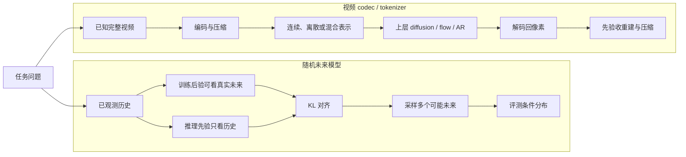
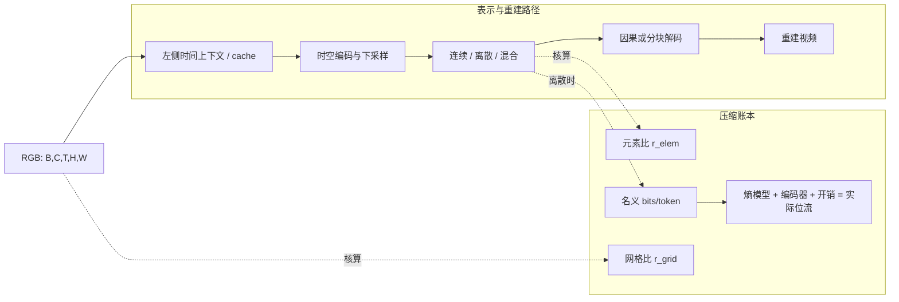

# 变分生成与视频 Tokenizer：两种潜变量角色、一套压缩账本

> 本章资料核验截至 **2026-08-30**。这里的“VAE”可能指概率生成模型，也可能指生成系统前端的压缩器；两者共享编码器—解码器外形，却回答不同问题。全文先分清任务，再讨论结构、训练与评测。

## 1. 先拆开两个常被混淆的角色

视频系统中的潜变量至少承担两类角色。

| 角色 | 要回答的问题 | 推理时的潜变量从哪里来 | 首要验收对象 |
|---|---|---|---|
| **随机未来模型**（stochastic latent future model） | 同一段历史之后可能发生哪些合理未来？ | 从只看历史的条件先验采样 | 条件分布、多样性、覆盖、校准和长期 rollout |
| **视频 codec/tokenizer** | 怎样把一个已知视频变成更小、可解码的表示，供上层模型使用？ | 编码已知视频，或由上层 diffusion/flow/AR 模型生成 | 重建、压缩账本、时序边界、编解码成本和下游生成 |

第一类把随机性当作**未来的不确定性**；第二类把 latent 当作**视频的接口表示**。现代文生视频系统里所谓的 video VAE，大多首先是第二类：它为上层生成器降维，但不独立定义完整的视频生成分布。

顺序化文字替代：先判断任务问题。若目标是由同一历史采样多种未来，训练时用可见真实未来的后验、推理时用只见历史的先验，以 KL 对齐二者，最后评测条件分布；若目标是为上层生成器降维，则编码已知视频得到连续、离散或混合表示，再由上层模型生成 latent 并解码回像素，首先验收重建和压缩。

## 2. VAE：从不可算后验到可训练下界

### 2.1 生成模型、近似后验与 ELBO

VAE 假设观测 $x$ 由潜变量 $z$ 产生 [[1]](#ref-1)：

$$
p_\theta(x)=\int p_\theta(x\mid z)p(z)\,\mathrm dz.
$$

真实后验 $p_\theta(z\mid x)$ 通常难以直接计算，于是编码器 $q_\phi(z\mid x)$ 近似它。由 Jensen 不等式得到证据下界（ELBO）：

$$
\log p_\theta(x)
\ge
\mathbb E_{q_\phi(z\mid x)}
\left[\log p_\theta(x\mid z)\right]
-D_{\mathrm{KL}}\!\left(q_\phi(z\mid x)\Vert p(z)\right).
$$

- 重建项要求 $z$ 保留对 $x$ 有用的信息。
- KL 项要求训练时后验靠近推理时可采样的先验。
- 对角高斯常用重参数化
  $z=\mu_\phi(x)+\sigma_\phi(x)\odot\epsilon$、
  $\epsilon\sim\mathcal N(0,I)$，使采样路径可反向传播。

ELBO 是对数似然的下界，不等于像素质量、感知质量或视频真实度本身。重建似然的选择还隐含了误差模型；简单独立高斯似然往往偏好平均化预测，因此容易得到模糊结果。

### 2.2 条件视频中的 learned prior

给定历史帧 $x_{1:C}$ 预测未来 $x_{C+1:K}$ 时，不可约简的不确定性可由逐步潜变量 $z_k$ 表达。一个概念化的条件 ELBO 是

$$
\sum_{k=C+1}^{K}
\mathbb E_{q_\phi(z_k\mid x_{\le k})}
\left[\log p_\theta(x_k\mid x_{<k},z_{\le k})\right]
-
D_{\mathrm{KL}}\!\left(
q_\phi(z_k\mid x_{\le k})
\Vert
p_\psi(z_k\mid x_{<k})
\right).
$$

关键不在公式长短，而在**信息边界**：

1. 训练后验 $q_\phi$ 可以看到当前真实目标 $x_k$，用于解释这一次实际发生的未来。
2. 推理先验 $p_\psi$ 只能看到过去 $x_{<k}$，因为目标未来尚不存在。
3. KL 使先验学会覆盖后验所使用的潜空间；如果二者缺口过大，就会出现“后验重建好、先验采样差”。

SV2P 将随机潜变量引入视频预测，用来表示同一过去之后的多种可能 [[2]](#ref-2)；SVG-LP 则把每一步的 learned prior 与训练后验明确配对，成为随机视频预测的经典范式 [[3]](#ref-3)。

### 2.3 全局、逐步与分层潜变量

- **全局 latent**：整段视频共享，适合身份、背景、风格和总体动作意图；但单个变量可能难以表达长视频中不断出现的新随机事件。
- **逐时刻 latent**：每一步都可注入新随机性，适合局部运动分叉；若先验缺少时间依赖，容易抖动。
- **分层 latent**：高层变量描述长期计划，低层变量描述局部运动和纹理；代价是后验、先验和训练调度更复杂。
- **内容—运动分解**：可以作为结构先验，但“两个 latent 分支”不自动等于语义解耦。需要干预、交换、线性探测或受控生成证据。

## 3. Posterior collapse：不要只看 KL 数字

posterior collapse 指解码器几乎不使用 $z$，使 $q_\phi(z\mid x)$ 接近先验，条件生成退化为确定性或由自回归解码器自行解释数据。Lagging Inference Networks 的分析指出，强解码器与滞后的推断网络会形成不利训练动力学 [[4]](#ref-4)。

### 3.1 诊断

“KL 很小”是警报，但不是充分证据；真实数据本来就可能不需要某些维度。至少联合检查：

- **decoder sensitivity**：固定历史，改变 $z$，输出是否发生与未来相关的变化；
- **active units / mutual-information proxy**：多少潜维随数据系统变化；
- **条件样本多样性**：多次先验采样是否产生不同但仍符合历史的结果；
- **posterior–prior gap**：训练后验样本与测试先验样本的质量差异；
- **长期 rollout**：随机性是否只是局部纹理噪声，还是能表达持续的运动分支。

### 3.2 常见缓解手段及代价

- KL warm-up 或 cyclical schedule 让模型先学会重建，再逐步加强先验约束；调度不当仍可能后期 collapse。
- Free bits / KL floor 防止每个 latent group 被过早压到零；过强会损害先验匹配。
- 降低自回归解码器能力、缩短其可见上下文，迫使信息经过 $z$；也可能降低确定性细节建模能力。
- 分层先验或 richer prior 提高表达力；计算、稳定性和采样成本随之增加。
- 显式多样性或对比目标可鼓励 $z$ 有效，但须防止模型用无意义外观扰动“刷多样性”。

## 4. Tokenizer：生成系统里的表示接口

### 4.1 连续 latent

连续 tokenizer 输出

$$
z\in\mathbb R^{B\times C_z\times T'\times H'\times W'}.
$$

上层 Gaussian diffusion 或 flow 通常直接在这个欧氏空间建模。优点是无离散量化误差、梯度路径直接；代价是 latent 的数值尺度、通道数和浮点精度都会影响训练，而且没有量化与熵编码就不能声称得到实际 bitrate。

CV-VAE 以连续 3D VAE 对齐现有 image-VAE latent，重点是让视频表示兼容已有 latent generator [[10]](#ref-10)。OmniTokenizer 则用 spatial window attention 与 temporal causal attention 联合处理图像和视频，并分别给出 VAE 与 VQVAE 模式 [[11]](#ref-11)。“一个项目同时支持连续和离散 checkpoint”不等于单个样本采用混合 latent。

### 4.2 离散 token：VQ、lookup-free 与二值量化

VQ-VAE 将编码器输出 $z_e(x)$ 映射到最近的 codebook 向量 [[5]](#ref-5)：

$$
j^*=\arg\min_j\lVert z_e(x)-e_j\rVert_2^2,
\qquad z_q(x)=e_{j^*}.
$$

典型目标写作

$$
\mathcal L_{\mathrm{VQ}}
=\mathcal L_{\mathrm{rec}}
+\lVert \operatorname{sg}[z_e]-e_{j^*}\rVert_2^2
+\beta\lVert z_e-\operatorname{sg}[e_{j^*}]\rVert_2^2,
$$

其中 $\operatorname{sg}$ 表示 stop-gradient。第二项更新 codebook，第三项约束 encoder 对选中 code 的承诺；通过 straight-through estimator 将 decoder 梯度传回 encoder。

离散表示适合 categorical AR、masked prediction 或离散 diffusion，但会引入量化误差、dead codes、code usage 不均和长序列成本。VQGAN 用感知与对抗目标提高离散重建的感知锐度 [[6]](#ref-6)；这可能生成看似真实的新细节，因此不应把锐利度等同于输入忠实度。

离散化也不必依赖一个显式、可检索的大 codebook。MAGVIT-v2 以 lookup-free quantization 扩展视觉词表 [[9]](#ref-9)；BSQ-ViT 以 binary spherical quantization 避免显式 codebook，并在自回归先验与算术编码后报告实际压缩表现 [[13]](#ref-13)。只有后者这类明确包含概率模型、熵编码和 bitstream 的设置，才把“token”完整连接到 bpp。

### 4.3 混合 latent：必须说明混合发生在哪里

“混合”至少有三种不同含义：

1. **离散粗表示 + 连续残差**：HART 以离散 token 表示主要语义，再用连续 residual diffusion 补细节 [[14]](#ref-14)。其正式证据主要来自图像，不能直接外推为视频运动一致性。
2. **离散流 + 连续流**：TVC 在超低码率视频压缩中将两条互补表示共同编码，并实际评估位流 [[20]](#ref-20)。这是 codec 证据，不是视频生成排名。
3. **一个仓库提供两类 checkpoint**：continuous 与 discrete 型号是二选一的接口，不应写成每个样本同时包含两部分。

Divot 输出 continuous video representation，并用 diffusion 作为生成式 de-tokenizer，再让语言模型以混合高斯建模连续特征 [[15]](#ref-15)。这里“diffusion decoder”描述的是解码机制，不会自动把 latent 变成离散—连续混合代码，也不要把其扩散噪声时间与视频帧时间混为一谈。

## 5. 张量形状与压缩率：至少分清四本账

设 RGB 视频与连续 latent 分别为

$$
x\in\mathbb R^{B\times C\times T\times H\times W},
\qquad
z\in\mathbb R^{B\times C_z\times T'\times H'\times W'},
$$

离散 token map 为

$$
i\in\{1,\ldots,K_c\}^{B\times T'\times H'\times W'}.
$$

应分别报告：

$$
r_t=\frac{T}{T'},\qquad
r_{hw}=\frac{HW}{H'W'},\qquad
r_{grid}=\frac{THW}{T'H'W'},
$$

$$
r_{elem}=\frac{CTHW}{C_zT'H'W'}.
$$

它们回答不同问题：

- $r_t$ 是该有限 clip 的实际时间网格比；它可能不同于配置名中的 nominal temporal factor。
- $r_{hw}$ 是每帧空间位置数的降幅。
- $r_{grid}$ 是时空位置总数的降幅，常被简写成 $f_t\times f_h\times f_w$。
- $r_{elem}$ 还计入输入通道 $C$ 和 latent 通道 $C_z$。

例如 nominal $4\times8\times8$、$C_z=16$ 的 RGB continuous VAE，长视频渐近网格降幅是 $256$，但元素数降幅是

$$
\frac{3\times4\times8\times8}{16}=48,
$$

不能写成“压缩 256 倍数据”。如果 latent 使用 FP16，原视频却用 8-bit RGB，字节账还会再次改变。

对于离散 token，$\log_2K_c$ 只给出固定长度代码的 nominal bits/token。真正的 bpp 或 bitrate 还需要：

1. token 的概率模型；
2. 算术编码等熵编码器；
3. header、索引和分块等 bitstream 开销；
4. 帧率、分辨率与实际 clip 长度。

因此应把**网格压缩**、**元素数压缩**、**token 数**和**实际位流**分栏，不能用一个“compression ratio”代替全部。

## 6. Causal 3D VAE：因果边界、首帧与分块

### 6.1 “Causal”只说明信息访问方向

在 codec 中，temporal-causal 表示时刻 $k$ 的编码或解码不读取 $k$ 之后的帧。3D 卷积通常用左侧时间填充或等价 cache；block-causal Transformer 则限制当前时间块只注意当前及过去块。

一种常见的首帧锚定映射是

$$
T'=1+\left\lfloor\frac{T-1}{f_t}\right\rfloor
=\left\lceil\frac{T}{f_t}\right\rceil.
$$

它保留第一个 temporal token 对首帧的直接表示，然后对后续帧按 $f_t$ 下采样。但不同实现的 padding、stride 与 crop 约定并不相同，必须报告实际 API 输出形状。

Cosmos Tokenizer 的官方示例把 `[1, 3, 9, 512, 512]` 编码为 continuous `[1, 16, 3, 64, 64]` 或 discrete index `[1, 3, 64, 64]`，并明确第一个 temporal token 表示第一帧 [[24]](#ref-24)。这个短 clip 的实际 $r_t=9/3=3$，不能因为型号 nominal factor 是 4 就写成 $r_t=4$。

### 6.2 因果 codec 不等于流式生成器

因果编码/解码只消除了 codec 对未来帧的依赖。它不自动证明：

- 上层 diffusion 或 flow 也只看过去；
- decoder 无 chunk 预热或重叠区；
- cache reset 后边界无闪烁；
- 系统满足首帧延迟、稳态帧率或显存 SLO。

ICLR 2025 的 joint image-video Causal VAE 使用 causal 3D convolution、spatiotemporal sampling 和 motion-oriented regularization，目标是兼顾图像与视频 tokenization [[12]](#ref-12)。HunyuanVideo 的公开实现则明确给出 CausalConv3D VAE、时间 $4\times$、空间 $8\times$、16 latent channels [[25]](#ref-25)；这些参数足以核算张量形状，却不足以推出实际码率或端到端实时性。

顺序化文字替代：RGB 视频首先进入只允许读取当前与过去的时间上下文或 cache，再经时空编码和下采样得到连续、离散或混合表示，随后由因果或分块 decoder 重建视频。与此同时分别核算时空网格比、包含通道的元素比、离散 token 的名义位数；只有再加入概率模型、熵编码器与位流开销，才能得到实际码率。

### 6.3 图像—视频联合训练的真正难点

图像可以看作 $T=1$ 的特殊视频，但“放在同一 batch 里”并不足以得到统一 tokenizer。需要处理：

- 首帧与后续帧不同的时间边界；
- 图像数据与视频数据量级、质量和运动分布不平衡；
- 空间细节与时间压缩之间的容量竞争；
- 任意长度、任意尺寸和分块推理中的 pad/crop 一致性。

OmniTokenizer 的 progressive image-video training、ICLR 2025 Causal VAE 的 joint training，以及 Cosmos 的首 temporal token 设计，代表三种公开可核验的处理方式；它们并不保证 checkpoint 可互换。

## 7. Reconstruction ceiling：既是上限，也不是“美学上限”

固定编码器 $E$ 与解码器 $D$ 后，$D(E(x))$ 决定哪些输入信息还能被可靠恢复。如果细小文字、小物体、高速运动或微小视差在 latent 中已经不可区分，上层 generator 无法从同一个 latent 稳定还原原始事实。这是 tokenizer 对**输入忠实度**设定的表示上限。

但它不是主观美学分数的严格数学上界。对抗 decoder 或 diffusion de-tokenizer 可以补出锐利、合理却并非输入中真实存在的纹理。应同时报告：

- 像素忠实：PSNR、SSIM 等；
- 感知相似：LPIPS 等；
- 时间一致：运动边缘、闪烁、时间分布指标；
- 语义/细节保留：OCR、人脸、小物体、数量与关系；
- 人评：分别询问“像不像真实视频”和“是否忠实于输入”。

更高 reconstruction score 也不保证更好 generation：潜空间可能高度不规则、尺度不稳定或序列过长，使上层模型更难学习。正确对照是在固定 generator、训练预算和采样协议下更换 tokenizer，同时分别报告重建与生成。

## 8. 2025–2026：从固定网格走向四条正交分支

这些路线不是单一排行榜，而是在不同设计轴上改变“一个 token 是什么、给多少 token、怎样让它可生成”。

### 8.1 Fixed-grid：规则时空网格仍是主干

固定的 $T'\times H'\times W'$ 网格最容易 batch、并行和对齐位置。Causal VAE、BSQ-ViT 以及多数开放 continuous video VAE 都属于这一主干。它的弱点是所有内容使用相同预算：静止背景和快速运动获得相同 token 密度。

2022 年 TATS 用 3D-VQGAN 与 time-sensitive Transformer 组织长视频生成 [[7]](#ref-7)；2023 年 MAGVIT 把 3D tokenizer 接入 masked parallel generation [[8]](#ref-8)。这些系统说明 tokenizer 和 generator 是两个可组合模块，也提醒评测必须拆分二者贡献。

### 8.2 Adaptive budget：从 fixed-rate 到按内容分配

Adaptive tokenizer 不再让每段内容都占相同 token 数。

- ElasticTok 训练时随机丢弃每帧尾部 token，使模型学会按既往帧和当前复杂度使用可变长度表示 [[16]](#ref-16)。
- InfoTok 以信息论/ELBO 视角学习 router；官方摘要在其协议下报告：不影响性能时节省 20% token，并在 2.3 倍压缩率下仍优于先前的启发式自适应方法 [[21]](#ref-21)。这些是作者协议数值，不应外推为同比端到端加速。
- AdapTok 采用 block-wise tail-token masking、causal quality scorer，并在预算约束下求内容自适应分配 [[22]](#ref-22)。

验收 adaptive 路线时必须同时报告 token 分布、最坏情况长度、router/scorer 开销、变长 batching 利用率、显存和 wall-clock；只报平均 token reduction 不足以证明系统更快。

### 8.3 Structured latent：改变潜变量的几何组织

Structured latent 不只减少网格，而是重组表示单元。

- CoordTok 用 $xy$、$yt$、$xt$ 三个 coordinate plane 与坐标查询重建长视频；作者在特定 128-frame、128×128 协议下以 1280 tokens 对比若干 6144/8192-token 基线 [[18]](#ref-18)。数值只在该协议内成立。
- VidTwin 将结构与动态压到不同 latent 分支 [[19]](#ref-19)。分支命名体现设计意图，不等于语义解耦已经被严格证明。
- NeRV-Diffusion 把整段视频编码为实例专属 INR 的网络权重，再让 DiT 在 weight latent 上去噪 [[23]](#ref-23)。它从 feature-map latent 转向 INR-weight latent，改变了 denoiser 的几何先验，但没有证明规则网格已经过时。

### 8.4 Generator-aware tokenizer：为上层建模难度而训练

只优化 reconstruction 的 tokenizer 可能产生难以预测的 latent。Generator-aware 路线把上层 prior/generator 的可学习性纳入 tokenizer 训练：

- LARP 在 tokenizer 训练期加入轻量 autoregressive prior，促使表示更适合后续 AR 建模 [[17]](#ref-17)。
- Divot 同时面向视频理解与生成，以连续语义表示、GMM prior 和 diffusion de-tokenizer 配合 [[15]](#ref-15)。

这类方法应在固定上层模型或等算力下验收，否则“tokenizer 更好”可能只是训练时额外 generator 提供了更多容量。

## 9. 里程碑矩阵：按设计轴读历史

| 年份 | 正式节点 | 表示 / 压缩 | 上层因子分解 | 主要贡献 | 必须保留的边界 |
|---|---|---|---|---|---|
| 2018 | SV2P，ICLR；SVG-LP，ICML | 随机连续 latent | 条件时序生成 | 多未来与 learned prior | 这是未来预测，不是 tokenizer 排名 |
| 2022 | TATS，ECCV | 3D-VQGAN fixed-grid | AR Transformer | 时空量化与长序列结合 | 长 rollout 不等于无漂移 |
| 2023 | MAGVIT，CVPR | 3D 离散 token | masked parallel | 统一多类视频生成任务 | 速度依赖硬件与任务协议 |
| 2024 | MAGVIT-v2，ICLR | lookup-free 离散 token | LM / masked | 更强 tokenizer 支撑 LM 视觉生成 | 论文标题不是普遍的 LM-vs-diffusion 定理 |
| 2024 | CV-VAE；OmniTokenizer，NeurIPS | 连续兼容 latent；连续/离散可选 | latent generator | 图像—视频兼容与联合 tokenization | 兼容性不等于任意 checkpoint 无损互换 |
| 2025 | Causal VAE；BSQ-ViT；ElasticTok；LARP，ICLR | fixed-grid、二值量化、变长 token | codec 或 AR-aware | 因果联合编码、自适应预算、可生成性 | 需逐篇区分 codec、tokenizer 和 prior |
| 2025 | CoordTok；VidTwin；Divot，CVPR | triplane、结构/动态双分支、连续语义表示 | coordinate decoder / diffusion decoder | structured 与 generator-aware 表示 | 不能跨协议直接比较 token 数 |
| 2026 | InfoTok，ICLR；AdapTok，CVPR | 自适应离散 / 1D latent | router / causal scorer | 内容自适应 token budget | token 节省不自动变成延迟收益 |
| 2026 | NeRV-Diffusion，ICLR | INR-weight latent | DiT on weights | 从局部网格转到实例网络权重 | 作者效率结果不是任意时长保证 |
| 2026-08 | KVAE，技术报告 | causal continuous fixed-grid | latent generator 接口 | 公开 $4\times8\times8$ 与 $4\times16\times16$ 变体 | 截止日无正式 venue [[26]](#ref-26) |

## 10. 代表开放实现：只写公开可证细节

| 实现 | 截止日状态 | 公开可核验内容 | 不应据此推断 |
|---|---|---|---|
| [CV-VAE](https://github.com/AILab-CVC/CV-VAE) | NeurIPS 2024；官方代码与权重 | continuous video VAE；仓库列出与若干 image-VAE latent 兼容的模型 | 对所有未公开 image VAE 都可无损替换 |
| [OmniTokenizer](https://github.com/FoundationVision/OmniTokenizer) | NeurIPS 2024；官方仓库 | joint image-video；VQVAE 与 VAE 配置 | 两种 checkpoint 自动构成 hybrid latent |
| [Cosmos Tokenizer](https://github.com/NVIDIA/Cosmos-Tokenizer) | 官方仓库，已指向后续 Cosmos；代码与模型有不同 license | image/video continuous、discrete 变体；temporal 4/8、spatial 8/16；API 形状 | README 的速度或质量宣传已被独立复现 |
| [HunyuanVideo](https://github.com/Tencent-Hunyuan/HunyuanVideo) | 作者技术报告；官方代码与权重 | CausalConv3D VAE；$4\times8\times8$ nominal 网格；16 channels | 256 倍实际元素压缩或实际 bitrate |
| [VidTok](https://www.microsoft.com/en-us/research/publication/vidtok-a-versatile-and-open-source-video-tokenizer/) | 作者稿；Microsoft 项目与模型公开 | continuous 和 FSQ-based discrete 变体，多种压缩配置 [[27]](#ref-27) | 截止日已在某会议正式发表 |
| [KVAE](https://github.com/kandinskylab/kvae) | arXiv 2608.05798；官方代码/权重 | video 2.0 的 $t4s8$、$t4s16$ 变体与 causal cache/chunk 接口 | 已经过正式同行评审 |

开放程度也要拆开：有推理代码不等于有训练代码；有权重不等于训练数据和配方公开；代码 license 与模型 license 可能不同。

## 11. 一套可执行的评测协议

### 11.1 若任务是随机未来

1. 固定同一历史，生成多次样本；不要只报 best-of-$N$。
2. 分开评估条件一致性、样本间多样性、真实未来覆盖和长期漂移。
3. 分别用训练 posterior 和测试 learned prior 采样，量化 prior–posterior gap。
4. 联合报告 KL、decoder sensitivity、active units/互信息代理与条件多样性。
5. 对多模态真实未来，避免用单一像素误差惩罚所有未与数据记录一致、但仍合理的结果。

### 11.2 若任务是 tokenizer / codec

1. 写明输入和输出完整 shape、dtype、$C_z$、量化方式、nominal 与 exact 压缩比。
2. 分栏报告像素忠实、感知质量、时间一致、OCR/人脸/小物体和快速运动。
3. 覆盖短 clip、训练长度内外、首末帧、非整除尺寸、chunk 边界和 cache reset。
4. 报告 encode/decode wall-clock、峰值显存、设备、batch、帧数、分辨率和精度。
5. 只有真正生成 bitstream 时才报告 bpp/bitrate；否则只报告 latent/token 账本。
6. 固定同一上层 generator、训练预算和采样器做 downstream 对照。

### 11.3 若使用 adaptive 或 structured latent

- Adaptive：增加 token 长度分布、尾延迟、padding 浪费、router 成本和最坏情况质量。
- Structured：增加表示交换/干预实验，证明结构分支是否真的承担声称的语义。
- INR-weight：增加权重尺度、排列/对称性处理、实例拟合误差与跨时长泛化。
- Generator-aware：将 tokenizer 额外训练成本与上层 generator 收益分别核算。

## 12. 常见误解与快速判别

### 误解一：“有 KL 就是随机未来模型”

不对。KL 也可以只是把已知视频压到规则 latent 分布。检查推理时 $z$ 是从历史条件先验采样，还是由 encoder 编码已知视频。

### 误解二：“$4\times8\times8$ 就是 256 倍压缩”

只对时空网格位置的渐近比成立。通道数、dtype、首帧映射、量化与 entropy coding 都会改变元素数和位流。

### 误解三：“Causal VAE 就能实时流式生成”

它只证明 codec 不偷看未来。上层生成器、cache、chunk、首帧延迟和吞吐仍需独立验收。

### 误解四：“diffusion decoder 就是 diffusion latent”

decoder 的生成机制与 latent 的数据类型是两条轴。Divot 仍是 continuous representation；扩散过程发生在反解码路径。

### 误解五：“重建更锐利，信息就保留得更多”

感知/对抗 decoder 可能补出合理但不忠实的纹理。必须把感知真实度与输入事实保留分开。

## 13. 与其他生成机制的接口

Tokenizer 是表示层，不决定上层如何因子分解联合分布：

- 连续 latent 常接 [扩散模型](diffusion-models.md) 或 [Flow / Consistency 模型](flow-consistency-models.md)。
- 离散 token 常接 [自回归生成](autoregressive-generation.md) 或 [掩码生成](masked-generation.md)。
- causal codec 只有与 causal backbone、cache 和提交协议共同设计时，才构成 [因果流式生成](causal-streaming-generation.md)。
- 若要从全局坐标系理解 representation × factorization × objective × backbone × deployment，请回到 [生成模型总览](../generative-models.md)。

最稳妥的阅读顺序始终是：先问 latent 代表什么，再核算 shape 和压缩，随后检查上层 generator，最后看端到端像素结果。

## 参考文献

[1] [Auto-Encoding Variational Bayes](https://iclr.cc/archive/2014/old-site/conference-proceedings.html). Diederik P. Kingma, Max Welling. ICLR 2014.

[2] [Stochastic Variational Video Prediction](https://openreview.net/forum?id=rk49Mg-CW). Mohammad Babaeizadeh, Chelsea Finn, Dumitru Erhan, Roy H. Campbell, Sergey Levine. ICLR 2018.

[3] [Stochastic Video Generation with a Learned Prior](https://proceedings.mlr.press/v80/denton18a.html). Emily Denton, Rob Fergus. ICML 2018.

[4] [Lagging Inference Networks and Posterior Collapse in Variational Autoencoders](https://openreview.net/forum?id=ryLDfnCqF7). Junxian He, Daniel Spokoyny, Graham Neubig, Taylor Berg-Kirkpatrick. ICLR 2019.

[5] [Neural Discrete Representation Learning](https://papers.nips.cc/paper/2017/hash/7a98af17e63a0ac09ce2e96d03992fbc-Abstract.html). Aaron van den Oord, Oriol Vinyals, Koray Kavukcuoglu. NeurIPS 2017.

[6] [Taming Transformers for High-Resolution Image Synthesis](https://openaccess.thecvf.com/content/CVPR2021/html/Esser_Taming_Transformers_for_High-Resolution_Image_Synthesis_CVPR_2021_paper.html). Patrick Esser, Robin Rombach, Björn Ommer. CVPR 2021.

[7] [Long Video Generation with Time-Agnostic VQGAN and Time-Sensitive Transformer](https://www.ecva.net/papers/eccv_2022/papers_ECCV/html/5950_ECCV_2022_paper.php). Songwei Ge et al. ECCV 2022.

[8] [MAGVIT: Masked Generative Video Transformer](https://openaccess.thecvf.com/content/CVPR2023/html/Yu_MAGVIT_Masked_Generative_Video_Transformer_CVPR_2023_paper.html). Lijun Yu et al. CVPR 2023.

[9] [Language Model Beats Diffusion - Tokenizer is key to visual generation](https://proceedings.iclr.cc/paper_files/paper/2024/hash/036912a83bdbb1fd792baf6532f102d8-Abstract-Conference.html). Lijun Yu et al. ICLR 2024.

[10] [CV-VAE: A Compatible Video VAE for Latent Generative Video Models](https://proceedings.neurips.cc/paper_files/paper/2024/hash/1787533e171dcc8549cc2eb5a4840eec-Abstract-Conference.html). Sijie Zhao et al. NeurIPS 2024.

[11] [OmniTokenizer: A Joint Image-Video Tokenizer for Visual Generation](https://proceedings.neurips.cc/paper_files/paper/2024/hash/31994923f58ae5b2d661b300bd439107-Abstract-Conference.html). Junke Wang et al. NeurIPS 2024.

[12] [High-Quality Joint Image and Video Tokenization with Causal VAE](https://proceedings.iclr.cc/paper_files/paper/2025/hash/03df5246cc78af497940338dd3eacbaa-Abstract-Conference.html). Dawit Mureja Argaw et al. ICLR 2025.

[13] [Image and Video Tokenization with Binary Spherical Quantization](https://proceedings.iclr.cc/paper_files/paper/2025/hash/e25198b6a75f74277ee3a2bd4165d9ef-Abstract-Conference.html). Yue Zhao, Yuanjun Xiong, Philipp Krähenbühl. ICLR 2025.

[14] [HART: Efficient Visual Generation with Hybrid Autoregressive Transformer](https://proceedings.iclr.cc/paper_files/paper/2025/hash/ab4e1e704c68b0f476c265996f08d283-Abstract-Conference.html). Haotian Tang et al. ICLR 2025.

[15] [Divot: Diffusion Powers Video Tokenizer for Comprehension and Generation](https://openaccess.thecvf.com/content/CVPR2025/html/Ge_Divot_Diffusion_Powers_Video_Tokenizer_for_Comprehension_and_Generation_CVPR_2025_paper.html). Yuying Ge et al. CVPR 2025.

[16] [ElasticTok: Adaptive Tokenization for Image and Video](https://proceedings.iclr.cc/paper_files/paper/2025/hash/5e6cec2a9520708381fe520246018e8b-Abstract-Conference.html). Wilson Yan et al. ICLR 2025.

[17] [LARP: Tokenizing Videos with a Learned Autoregressive Generative Prior](https://proceedings.iclr.cc/paper_files/paper/2025/hash/97c903fbf21a7d863af2015d8803ca8f-Abstract-Conference.html). Hanyu Wang et al. ICLR 2025.

[18] [Efficient Long Video Tokenization via Coordinate-based Patch Reconstruction](https://openaccess.thecvf.com/content/CVPR2025/html/Jang_Efficient_Long_Video_Tokenization_via_Coordinate-based_Patch_Reconstruction_CVPR_2025_paper.html). Huiwon Jang et al. CVPR 2025.

[19] [VidTwin: Video VAE with Decoupled Structure and Dynamics](https://openaccess.thecvf.com/content/CVPR2025/html/Wang_VidTwin_Video_VAE_with_Decoupled_Structure_and_Dynamics_CVPR_2025_paper.html). Yuchi Wang et al. CVPR 2025.

[20] [TVC: Tokenized Video Compression with Ultra-Low Bit Rate](https://link.springer.com/article/10.1007/s44267-025-00098-7). Visual Intelligence, 2025.

[21] [InfoTok: Adaptive Discrete Video Tokenizer via Information-Theoretic Compression](https://proceedings.iclr.cc/paper_files/paper/2026/hash/432f048a844654ba981953491e6dc80e-Abstract-Conference.html). Haotian Ye et al. ICLR 2026.

[22] [AdapTok: Learning Adaptive and Temporally Causal Video Tokenization in a 1D Latent Space](https://openaccess.thecvf.com/content/CVPR2026/html/Li_AdapTok_Learning_Adaptive_and_Temporally_Causal_Video_Tokenization_in_a_CVPR_2026_paper.html). Yan Li et al. CVPR 2026.

[23] [NeRV-Diffusion: Diffuse Implicit Neural Representation for Video Synthesis](https://proceedings.iclr.cc/paper_files/paper/2026/hash/1a17a06de88cf77f25cda0da91615a54-Abstract-Conference.html). Yixuan Ren et al. ICLR 2026.

[24] [Cosmos Tokenizer](https://research.nvidia.com/labs/cosmos-lab/cosmos-tokenizer/). NVIDIA Research. Official project and repository documentation, accessed 2026-08-30.

[25] [HunyuanVideo: A Systematic Framework For Large Video Generation Model](https://github.com/Tencent-Hunyuan/HunyuanVideo). Tencent Hunyuan. Author technical report and official repository, accessed 2026-08-30.

[26] [KVAE: Family of Tokenizers for Multimodal Generative Models](https://arxiv.org/abs/2608.05798). arXiv:2608.05798, preprint, 2026.

[27] [VidTok: A Versatile and Open-Source Video Tokenizer](https://www.microsoft.com/en-us/research/publication/vidtok-a-versatile-and-open-source-video-tokenizer/). Microsoft Research author publication page; arXiv:2412.13061, preprint.
