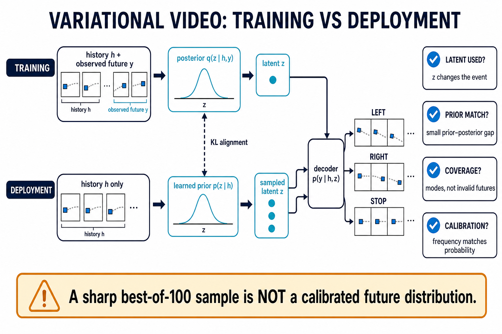
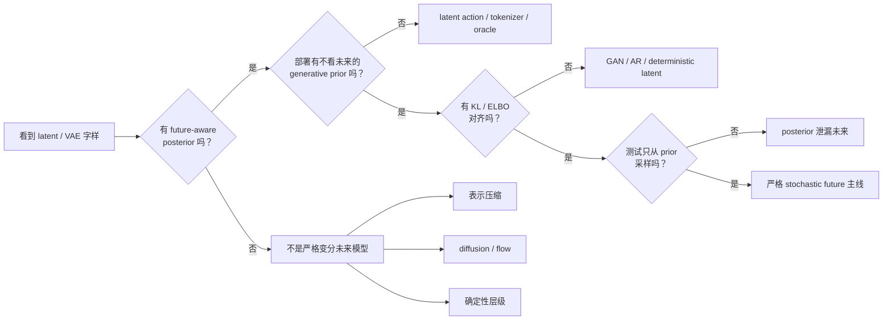
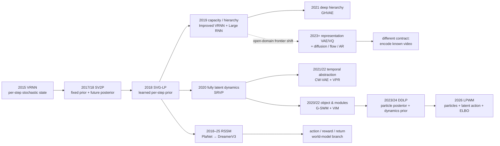
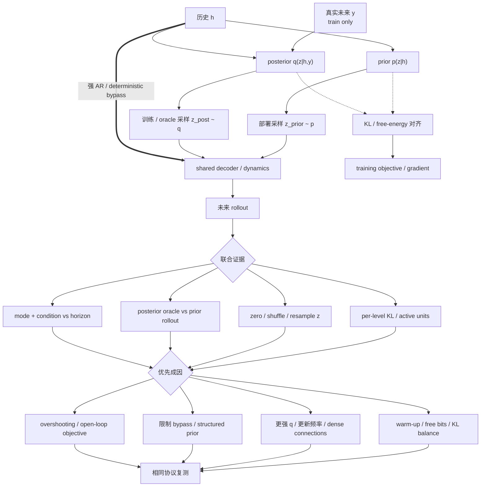

# 变分随机视频生成：从 learned prior 到对象粒子世界模型

> 本章资料核验截至 **2026-08-30**。这里的 VAE 指用训练 posterior 与部署 prior 建模**同一历史之后的随机未来**；把已知完整视频压缩成 latent、供 diffusion / flow / AR 使用的“video VAE”属于[视频 Tokenizer、Codec 与生成式压缩](video-tokenizers.md)，不是本章同一个概率合同。

本章先回答一个比“模型名里有没有 latent/VAE”更严格的问题：**部署时，随机变量究竟从哪里来？** 若它来自不看未来的 generative prior（可固定，也可由历史和合法条件学习），并在训练中由能看真实未来的 posterior 通过 KL/ELBO 对齐，才进入严格主线。

## 1. 先冻结任务合同：预测未知未来，不是编码已知视频

给定相同历史 $h=x_{1:C}$，真实世界可能出现多个合理未来 $y=x_{C+1:K}$。本章研究

$$
p_\theta(y\mid h,c)
=
\int p_\theta(y\mid h,c,z)
p_\psi(z\mid h,c)\,\mathrm dz,
$$

其中 $c$ 可包含合法动作、语言或目标，$z$ 表达历史和条件仍未唯一决定的未来因素。训练时可以用真实未来形成 posterior $q_\phi(z\mid h,y,c)$；部署时未来尚不存在，只能从 $p_\psi(z\mid h,c)$ 采样。固定标准先验是 $p_\psi$ 的特例；图 1 展示的是信息利用更充分的 learned-prior 版本。



_图 1：future-aware posterior 只属于训练；history-only prior 才是部署接口。生成“左/右/停”三个样本还不够，必须继续检查 latent 使用、prior gap、有效覆盖和频率校准。_

顺序化文字替代：训练时，历史和已发生的真实未来进入 posterior，得到用于解释该未来的 $z$；部署时，从不看未来的 generative prior（固定或 learned）多次采样不同 $z$。二者通过 KL 对齐，并共享 decoder。decoder 可产生 left、right、stop 等分支，但只有当改变 $z$ 会改变持续事件、prior 样本接近 posterior 能力、样本覆盖合法 mode 且频率匹配真实概率时，才有“学到未来分布”的证据。挑出 100 个样本里最锐利的一个不满足这些条件。

### 1.1 五问分类门

| 判定问题 | 严格主线需要的答案 | 常见伪阳性 |
|---|---|---|
| 随机量是什么？ | 未被历史与合法条件决定的未来状态/事件 | 已知视频的压缩 latent、diffusion noise、GAN seed |
| 训练 posterior 看什么？ | 历史 + 待解释的真实未来/新观测 | 只编码当前帧，或根本没有 amortized posterior |
| 部署 prior 看什么？ | 固定，或只看历史 + 合法 action/language/goal；绝不能看隐藏未来 | 测试仍用 posterior、看终点帧、人工给 latent action |
| 怎样对齐？ | KL、ELBO 或等价 variational free energy | 只有 reconstruction/VQ/GAN/contrastive loss |
| 验收什么？ | 条件分布、mode 频率、calibration、open-loop horizon | 只看 reconstruction、单样本锐度或 token 压缩率 |

### 1.2 同名 latent 的角色不能合并

| 角色 | 随机/潜变量表示什么 | 部署来源 | 首要验收 | 所属章节 |
|---|---|---|---|---|
| **stochastic future latent** | 同一历史后的不可约未来分叉 | history-conditioned prior | 覆盖、校准、条件一致、horizon | 本章 |
| **representation tokenizer** | 已知视频的紧凑表示 | encoder 或上层 generator | 重建、shape、压缩账、codec 成本 | [Video Tokenizer](video-tokenizers.md) |
| **belief / RSSM state** | 部分可观测环境的 belief 与动力学随机性 | action-conditioned dynamics prior | reward/continue、return、model exploitation | [World Models](../world-models.md) |
| **latent action / plan** | 对未来转移的控制码或技能 | 人、policy 或 conditional plan prior | controllability、policy agreement、任务成功 | [可控与交互路线](../tasks/action-conditioned-prediction.md) |
| **diffusion / flow noise** | 生成路径上的随机状态 | noise schedule / base distribution | score/flow objective、sampler、生成分布 | [Diffusion](diffusion-models.md) / [Flow](flow-consistency-models.md) |



顺序化文字替代：遇到 latent/VAE 名称，先找能看真实未来的训练 posterior；再找固定或只看历史与合法条件、绝不看未来的部署 prior；再核对 KL/ELBO；最后确认测试确实从 prior 采样。四项都成立才进入严格随机未来主线。缺任一项时分别检查 tokenizer、diffusion/flow、确定性层级、latent action 或 posterior oracle。

## 2. 从不可算 posterior 到顺序条件 ELBO

### 2.1 静态 VAE 只是起点

VAE 用 $q_\phi(z\mid x)$ 近似通常不可直接计算的 $p_\theta(z\mid x)$ [[1]](#ref-1)：

$$
\log p_\theta(x)
\ge
\underbrace{\mathbb E_{q_\phi(z\mid x)}
[\log p_\theta(x\mid z)]}_{\text{distortion / 解释观测}}
-
\underbrace{D_{\mathrm{KL}}[q_\phi(z\mid x)\Vert p(z)]}_{\text{rate / 使 prior 可采样}}.
$$

对角 Gaussian 常用重参数化

$$
z=\mu_\phi(x)+\sigma_\phi(x)\odot\epsilon,
\qquad \epsilon\sim\mathcal N(0,I).
$$

这只是可微采样技巧。ELBO 不是视觉质量分数；Gaussian likelihood 的均值预测可能平均多个 mode；KL 非零也不证明 decoder 使用了对任务有意义的 $z$。

### 2.2 顺序视频的生成分解

一种通用顺序模型写成

$$
p_\theta(y,z\mid h,c)
=
\prod_{t=C+1}^{K}
p_\psi(z_t\mid z_{<t},x_{<t},c)
p_\theta(x_t\mid x_{<t},z_{\le t},c),
$$

训练 posterior 则是

$$
q_\phi(z\mid h,y,c)
=
\prod_{t=C+1}^{K}
q_\phi(z_t\mid z_{<t},x_{\le t},c).
$$

对应条件 ELBO：

$$
\mathcal L_{\mathrm{ELBO}}
=
\sum_{t=C+1}^{K}
\mathbb E_q\log p_\theta(x_t\mid x_{<t},z_{\le t},c)
-
\sum_{t=C+1}^{K}
\mathbb E_{q_\phi(z_{<t}\mid x_{<t},c)}
D_{\mathrm{KL}}
\left[q_\phi(z_t\mid z_{<t},x_{\le t},c)
\Vert
p_\psi(z_t\mid z_{<t},x_{<t},c)
\right].
$$

VRNN 给出逐步 latent 的通用序列框架 [[2]](#ref-2)；SV2P 将其用于多未来视频预测 [[3]](#ref-3)；SVG-LP 的关键推进是让部署 prior 显式随历史变化 [[4]](#ref-4)。

### 2.3 β、free bits 与额外目标改变了什么

实践常优化

$$
\mathcal J
=
\mathbb E_q\log p_\theta(y\mid h,z,c)
-\beta D_{\mathrm{KL}}(q\Vert p)
-\lambda_{\mathrm{adv}}\ell_{\mathrm{adv}}
-\lambda_{\mathrm{aux}}\ell_{\mathrm{aux}},
$$

其中 $\ell_{\mathrm{adv}}$ 与 $\ell_{\mathrm{aux}}$ 按“待最小化 loss”定义；若文献把它们定义成 reward，符号应相反。

- β=1 且没有破坏概率解释的额外项时，才是原模型的标准 ELBO。
- β<1 常让 latent 更容易携带信息，却可能扩大部署 prior gap；β>1 可能强化正则，也可能更快 collapse。
- free bits 在目标中不再继续压低阈值以下的 KL，使 latent 通道有机会形成；它不保证实际 KL 达到某个下限，也不证明通道承载的是语义事件。
- adversarial/perceptual loss 可提高锐利度，但会改变 likelihood 解释；SAVP 正是 VAE + GAN 的代表 [[5]](#ref-5)。
- masked、flow、landmark、reward 等辅助目标能改变 representation；下游收益必须和未来分布校准分开。

### 2.4 五种 gap 必须分账

| gap | 定义 | 最小诊断 | 常见误判 |
|---|---|---|---|
| **model / likelihood gap** | $p_\theta$ 家族本身表达不足或像素 likelihood 不合适 | 提升 decoder/likelihood、控制 latent 不变 | 把所有模糊都叫 posterior collapse |
| **approximation gap** | 选定 $q$ 家族无法逼近真实 posterior | richer posterior / hierarchy / flow ablation | 只增加 decoder 容量 |
| **amortization gap** | 共享 inference network 未达到每样本最优 | per-instance refinement 与 amortized $q$ 比较 | 把它与 prior gap 混为一谈 |
| **prior–posterior gap** | 部署 $p(z\mid h)$ 未覆盖训练 $q(z\mid h,y)$ | posterior oracle 与 prior rollout 并排、mode JS/KL | 用 posterior 样本代表测试能力 |
| **open-loop / exposure gap** | 训练读真实状态，部署读自身预测后分布漂移 | horizon 曲线、multi-step/overshooting | 短期重建好就称长期可靠 |

Improved Conditional VRNNs 将一部分模糊定位为 hierarchy 与 likelihood capacity 不足 [[7]](#ref-7)；PlaNet 的 latent overshooting 则直接针对多步 prior 对齐 [[9]](#ref-9)。二者修的不是同一个 gap。

## 3. latent 放在哪里：六条技术路线

### 3.1 结构与验证方式

| 结构 | 主要表达 | 代表节点 | 常见失败 | 必须做的干预 |
|---|---|---|---|---|
| sequence/global $z_g$ | 身份、背景、整体意图 | SV2P | 一次采样锁死长视频，新事件不足 | 跨整段 swap $z_g$，检查身份与事件是否分离 |
| per-step $z_t$ | 持续出现的局部分叉 | SVG-LP、VRNN | 无时序先验时抖动，AR 漂移 | 单步/连续区间替换 $z_t$，看时间支持范围 |
| deep hierarchy $z_t^{1:L}$ | 多尺度随机因素和 richer posterior | Improved VRNN、GHVAE | 高层被低层/decoder 绕过 | per-level KL、active units、逐层 ablation |
| temporal hierarchy | 慢计划与快细节 | CW-VAE、VPR | fixed clock 错过事件；event gate 过拟合 | 改 clock/event threshold，比较 boundary 与 rollout |
| static/dynamic 或 appearance/motion | 内容与运动的结构先验 | S3VAE、SLAMP | 命名不等于可识别解耦 | swap、反事实、probe、遮挡/相机运动测试 |
| object/module/particle | 对象状态、交互机制与 latent action | G-SWM、VIM、DDLP、LPWM | slot identity 漂移、对象数/相机运动失败；VIM 主要结果依赖 posterior-assisted inference | count/ID/collision、对象消失/新生、prior-only OOD 组合 |

SRVP 把完整时序演化移到 latent residual process，frame generator 只负责渲染 [[10]](#ref-10)。这不是“再堆一层 latent”，而是把动力学和像素回灌解耦。



顺序化文字替代：VRNN 建立逐步随机状态，SV2P 将未来 posterior 与固定 prior 接到视频，SVG-LP 改为历史条件 learned prior。随后一支提升容量和 latent 深度，一支把 dynamics 完全移入 latent；再分别发展成贪心深层、固定/事件时间抽象和 object/module 结构。DDLP 在 2023/2024 把粒子 posterior 与 Transformer dynamics prior 接成直接对象粒子预测，LPWM 在 2026 再加入 latent action 与多条件控制。PlaNet–Dreamer 则把同类数学接到 action/reward/return。开放域高保真生成的另一主流转向表示 VAE/VQ 加 diffusion/flow/AR，那是不同合同。

### 3.2 prior 不是只有“固定或 learned”两档

| prior 家族 | 优点 | 风险 | 公平比较 |
|---|---|---|---|
| fixed isotropic Gaussian | 简单稳定、便于定位 decoder | 与 history-dependent posterior 错配 | 与 learned prior 匹配容量/FLOPs |
| learned diagonal Gaussian | 随历史改变均值/方差 | 仍可能单峰漏 mode | mode event proper score，不只 best-of-$K$ |
| hierarchical conditional | 多尺度容量与依赖 | 高层 under-use、优化困难 | per-level KL 与预算匹配 |
| mixture / flow prior | 更复杂多峰或非 Gaussian | 采样/训练成本、component collapse | 等推理预算与相同 sample 数 |
| categorical prior | 适合离散 belief 或 mechanism | code collapse、straight-through 偏差 | usage/perplexity、unimix/free-bits ablation |
| structured object/particle prior | 对象交互和 birth/death 可解释 | identity、count、occlusion、camera motion | object metric + frame metric + OOD |

“learned prior”只证明参数依赖历史，不证明它覆盖 posterior，更不证明 rollout 频率正确。

## 4. 不确定性：aleatoric、epistemic 与 partial observability

| 类型 | 来源 | 单 checkpoint 重采样能否充分测到 | 推荐证据 |
|---|---|---|---|
| **aleatoric / future branching** | 世界本身随机，或历史不足以唯一决定未来 | 通常是本章 $z$ 的主要对象 | 多标注/模拟真分布、event frequency、Brier/NLL/coverage |
| **partial observability / belief** | 隐藏状态未被历史完全观察 | 可由 RSSM posterior/prior 部分表达 | 新观测校正、belief calibration、action-conditioned rollout |
| **epistemic / model uncertainty** | 数据有限、参数或模型结构不确定 | 单 checkpoint 的 latent sampling 通常不够 | bootstrap/ensemble、训练 seed 方差、Bayesian/OOD stress |

NUQ 用层级变分网络从 latent variance 构造 predictive uncertainty 并加权 MSE [[16]](#ref-16)。这说明“模型不确定时如何训练”是独立问题，但 latent-space uncertainty 未经事件频率或输出空间 reliability 验证时，不能自动称为 calibrated epistemic uncertainty。

最低报告要求：把**同一 checkpoint 内 seed 方差**与**不同数据重采样/训练 seed/模型成员方差**分开。前者主要反映 learned stochasticity，后者才更接近 epistemic component。

## 5. Posterior collapse：因果图、诊断与修复

posterior collapse 指 decoder 或 deterministic recurrence 能绕过 $z$，使 $q\approx p$、KL 接近零、改变 $z$ 也不改变有意义的未来。Lagging Inference Networks 说明强生成网络与滞后 inference network 可能形成不利训练动力学 [[6]](#ref-6)。



顺序化文字替代：历史进入 prior，并从 prior 采样部署 latent；历史和真实未来进入训练 posterior，并从 posterior 采样训练/oracle latent。二者各自把样本送入共享 decoder，KL 只负责形成训练对齐损失，并不“生成” latent；历史也可能沿强 AR/确定性旁路直达 decoder。随后联合检查逐层 KL/active units、置零/打乱/重采样 $z$、posterior-oracle 与 prior rollout 差距，以及 mode/条件随 horizon 的变化。只有多项证据一致时才定位 collapse，再按成因选择 KL 调度、改善 inference、限制旁路/结构化 prior 或多步对齐，并按原协议复测。

### 5.1 最小诊断集

- **per-time / per-level KL**：总 KL 会掩盖“只有一层在工作”。
- **active units/channels**：例如 Improved Conditional VRNN 以平均 KL 阈值定义 active channel；阈值必须披露，不能当通用物理常数。
- **decoder sensitivity**：固定 $h$，zero/shuffle/resample $z$，看输出是否改变持续事件而非纹理噪声。
- **prior–posterior rollout gap**：相同 decoder 下分别从 $q$ 与 $p$ 采样。
- **conditional mutual-information proxy**：估计 $I_q(z;y\mid h,c)$，检查在固定历史/条件后 $z$ 是否仍携带未来信息；普通 $I(z;\text{data})$ 可能只证明 latent 编码了历史，非零条件 MI 也仍需语义干预。
- **hidden-future leakage test**：只改变隐藏未来，部署 prior 输出必须逐 bit/统计不变。
- **horizon profile**：短期有用不代表长时仍有用。

### 5.2 修复与代价

| 手段 | 代表路线 | 修什么 | 代价/反例 |
|---|---|---|---|
| KL warm-up / cyclical schedule | Improved VRNN | 避免 inference 尚未学会时被 prior 压平 | 后期仍可能 collapse，schedule 也改变预算 |
| free bits / KL floor | DreamerV3 | 阈值以下不继续用 KL 梯度压缩 latent group | 不保证实际 KL 下限；更大 KL 也不等于更有意义 |
| stop-gradient KL balance | DreamerV2/3 [[31]](#ref-31) | 分开训练 prior 与 representation | 权重改变 rate–distortion，不是标准 ELBO |
| dense hierarchy / richer q,p | Improved VRNN | approximation 与 high-level under-use | 参数/显存/采样成本上升 |
| greedy layerwise training | GHVAE | 层级联合优化与显存瓶颈 | 不是联合 end-to-end optimum |
| structured state→attribute path | G-SWM | 阻断 observation shortcut | 结构假设不适合所有场景 |
| latent overshooting | PlaNet | 多步 prior 对齐 | 额外 rollout 计算，仍会 model exploitation |
| adversarial/diversity objective | SAVP | 锐利度或样本差异 | mode collapse、无意义噪声、多目标难比较 |

停止条件不是“KL 变大”，而是：$z$ 干预产生可解释且持续的事件变化，prior 样本符合历史，覆盖提升没有靠事实错误或噪声换取。

## 6. 2015–2026 milestone：首次公开、正式状态与边界

| 首次公开 / 正式状态 | 节点 | 核心变化 | 协议锚点 | 不可越界的结论 |
|---|---|---|---|---|
| 2015 / NeurIPS 2015 | VRNN [[2]](#ref-2) | 每步 stochastic state | 主要为语音/手写序列 | 是序列前史，不是视频 SOTA |
| 2017 / ICLR 2018 | SV2P [[3]](#ref-3) | future posterior + fixed prior | 100 samples 按最高 PSNR 选 oracle 样本并报告相应 PSNR/SSIM | 该 oracle 不是 calibration |
| 2018 / ICML 2018 | SVG-LP [[4]](#ref-4) | per-step learned prior | SM-MNIST/KTH/BAIR | learned prior 仍会漏 mode |
| 2018 / arXiv preprint | SAVP [[5]](#ref-5) | VAE + prior-sampled GAN | best/avg/worst over 100 | 锐利与人评不等于分布忠实 |
| 2019 / ICCV 2019 | Improved Conditional VRNN [[7]](#ref-7) | deep latent hierarchy + higher-capacity likelihood | BAIR 2→10 train、2→28 test；$K=100$ | hierarchy 与 capacity 效应缠绕 |
| 2019 / NeurIPS 2019 | Large Stochastic RNN [[8]](#ref-8) | 少手工 flow/mask、扩大 stochastic RNN | 交互/人体/驾驶三数据域 | scale 是混杂，不是新 uncertainty 语义 |
| 2018 / ICML 2019 | PlaNet [[9]](#ref-9) | RSSM + latent overshooting | 6 个 64×64 控制任务 | 样本效率/return 不是开放视频质量 |
| 2020 / ICML 2020 | SRVP [[10]](#ref-10) | fully latent residual dynamics | 每 context 100 futures；FVD 独立生成集 | 一阶 latent update 仍有限 |
| 2020 / CVPR 2020 | S3VAE [[11]](#ref-11) | static/dynamic self-supervised sequential VAE | SM-MNIST/Sprite/MUG | probe/IS 不证明因果解耦 |
| 2020 / ICML 2020 | G-SWM [[12]](#ref-12) | object/global stochastic world model | 合成碰撞和 CLEVR-like 场景 | toy object 不能外推自然视频 |
| 2020 / ICLR 2021 | DreamerV2 [[31]](#ref-31) | categorical RSSM + KL balancing | Atari 55 tasks + continuous-control transfer | discrete state 的里程碑不应误归给 V3 |
| 2021 / CVPR 2021 | GHVAE [[13]](#ref-13) | greedy modular hierarchy | 4 视频集 + 机器人规划 | 作者任务增益不可跨协议硬排 |
| 2021 / NeurIPS 2021 | CW-VAE [[14]](#ref-14) | slow-clock latent hierarchy | 最长 1000-frame 受控 rollout | 固定 clock 不是事件理解 |
| 2021 / ICCV 2021 | SLAMP [[15]](#ref-15) | stochastic appearance/motion + history | KTH/KITTI/Cityscapes | 分支命名不证明解耦 |
| 2021 / ICCV 2021 | NUQ [[16]](#ref-16) | variational predictive uncertainty | 3 个 final-version benchmark | latent variance 不自动 calibrated |
| 2021 / arXiv | FitVid [[17]](#ref-17) | 简单大容量 VAE、过拟合审计 | H3.6M/KITTI/RoboNet/BAIR | 不冒充 ICLR 正式接收 |
| 2021 / ICLR 2022 | VPR [[18]](#ref-18) | event-triggered temporal hierarchy | 主要合成事件数据 | 不外推开放域长视频 |
| 2022 / CLeaR 2022 | VIM [[19]](#ref-19) | object + categorical mechanism + Gaussian residual | 32×32 Random-Walk toy | 主要结果用 inference network 读当前目标观测，是 posterior-assisted reconstruction，不能当 prior-only deployment 生成证据 |
| 2023 / ICLR 2023 | VP² [[20]](#ref-20) | 固定 planner 的控制中心 benchmark | 11 类、310 task instances | 是评测里程碑，不是新 VAE |
| 2023 / TMLR 2024 | DDLP [[30]](#ref-30) | particle tracking posterior + Transformer dynamics prior | object-centric prediction / what-if / compact diffusion | 是 LPWM 的直接粒子前身；仍依赖对象化场景 |
| 2024 / ICML 2024 | RSP [[21]](#ref-21) | categorical future latent 用于表示学习 | Kinetics-400 预训、单 future frame | 下游表示收益不等于生成校准 |
| 2023 / Nature 2025 | DreamerV3 [[22]](#ref-22) | categorical RSSM + split KL/free bits/unimix | 150+ 控制任务；5→45 action rollout | return 不是 uncertainty calibration |
| 2026 / ICLR 2026 Oral | LPWM [[23]](#ref-23) | particles + latent action + variational dynamics | 多个机器人/游戏数据，开放代码/权重 | 对象粒子前沿，不是通用 camera-motion 解法 |
| 2026 / Neural Networks | Implicit hierarchical temporal–spatial residual model [[24]](#ref-24) | prior–posterior residual + spatial hierarchy | 3 个长预测数据集，作者协议 | 正式延续不等于重回 foundation-model 主干 |

一个重要纠错：**Hierarchical Long-term Video Prediction without Supervision** 使用高层 feature prediction、feature-space adversarial loss 和 decoder/mask，没有上述 q/p/ELBO 合同 [[25]](#ref-25)。它仍是层级长预测历史节点，但必须从“分层随机 latent”表中移出。

## 7. 详细 paper review：按问题而非排行榜阅读

### 7.1 SV2P → SVG-LP → SAVP：先解决部署随机接口

**SV2P** 的价值是承认给定同一过去时未来多峰，并让 posterior 在训练解释实际未来；其 fixed $N(0,I)$ prior 简单，却容易与聚合 posterior 错配。论文图 6 从 100 个样本中按最高 PSNR 选择 oracle 样本，并报告该样本的 PSNR/SSIM；这只能回答“样本集合里是否有一个接近记录真值”，不能分别把两项都解释成校准指标。

**SVG-LP** 将 $p(z_t)$ 改为 $p(z_t\mid x_{<t})$，让历史改变未来 latent 分布。它把 deterministic path 与 stochastic residual 接在逐步预测上，但 teacher-forced 对齐不保证 long open-loop prior 仍校准。

**SAVP** 为 prior sample 加 video discriminator，尝试同时保留 VAE coverage 与 GAN sharpness。论文还展示远超训练 future=10 的长 rollout；这类质性外推可用于发现失败，不能当作 500-step 定量保证。

### 7.2 Improved VRNN、Large RNN、GHVAE：模糊不只是一条 MSE 故事

Improved Conditional VRNN 在每时刻引入多层 Gaussian prior/posterior、dense latent connections 与高容量 likelihood。作者 BAIR 表中 hierarchical 模型的 FVD/LPIPS 优于 SVG-LP，但 LPIPS/SSIM 是 best-of-100，FVD 是从 100 中随机取样后多次估计；两种 aggregation 回答不同问题，不能合成“全面更好”。

Large Stochastic RNN 去掉部分 flow/mask/foreground-background 手工偏置，以大容量网络检验简单归纳偏置是否足够 [[8]](#ref-8)。它说明 capacity 是视频预测的重要轴，也提醒后续比较必须匹配参数和训练 FLOPs。

GHVAE 不再强求整套 deep hierarchical VAE 一次装入显存并联合收敛，而是逐层冻结、顺序增加 module。作者报告 17–55% prediction gains 和 35–40% 更高机器人任务成功率；这应写为“作者协议下的扩展证据”，不是跨数据集统一百分比。

### 7.3 SRVP、CW-VAE、VPR：从像素循环到 latent 时间结构

SRVP 使用 $s_{t+1}=s_t+f(s_t,z_{t+1})$ 一类 residual latent update，再由独立 generator 渲染；这里用 $s_t$ 表示 latent state，避免与本章的未来视频 $y$ 混淆。这减少“预测帧→重新编码→再预测”的像素反馈依赖，使 dynamics 可单独研究。其 frame metrics 仍常 oracle over 100，FVD 则基于独立生成集合和置信区间；报告时必须保留这一差别。

CW-VAE 让高层按 $k^{l-1}$ 的慢时钟更新，非活跃时刻 copy latent；它在 MineRL、KTH、GQN Mazes、Moving-MNIST 等验证长依赖。最长 1000 帧的 identity/结构保持主要来自受控域，不能写成自然视频 1000 帧普适能力。

VPR 不使用固定 clock，而由 latent change detection 触发 renewal，适合事件边界不均匀的序列。它补的是**何时更新高层**，不是提高开放域像素 fidelity 的直接证据。

### 7.4 S3VAE、SLAMP、G-SWM、VIM：结构先验必须接受反事实

S3VAE 将 sequence latent 拆成 static $z_f$ 与 dynamic $z_{1:T}$，加光流/landmark/audio 等自监督信号；SLAMP 则以 appearance 与 flow/motion 两个随机分支生成并融合。两者的分支名称都是假设，只有 swap、counterfactual、probe 与 OOD 才能证明各分支稳定承载预期因素。

G-SWM 的关键不是 slot 数，而是让观测 posterior 先产生 high-level stochastic state，再由 state 生成 what/where/presence/depth attributes，从结构上减少 attribute 直接绕过 state。VIM 进一步为对象选择可复用 categorical transition module，并加 Gaussian residual；但论文主要结果在测试时使用 inference network 读当前目标观测，更接近 posterior-assisted reconstruction，不能作为 prior-only deployment generation 的充分证据。DDLP 则用 particle-tracking posterior 对齐跨帧对象，以 Transformer dynamics 作为只看过去粒子的 variational prior；它是 LPWM 的直接对象粒子前身 [[30]](#ref-30)。这些工作对对象交互的证据强于无结构像素模型，但数据规模、遮挡、对象 birth/death 和相机运动仍限制明显。

### 7.5 FitVid：benchmark 能被记住，强基线也会误导

FitVid 用简单 fixed-prior convolutional VAE + LSTM 扩大容量，并系统展示常见视频预测集可过拟合或记住训练身份 [[17]](#ref-17)。H3.6M/KITTI 使用 5→25，RoboNet 2→10 + actions，BAIR 1→16；best-of-100 PSNR/SSIM/LPIPS 与使用全部样本的 FVD 不能互换。它是 benchmark contamination/augmentation 里程碑，不是新 learned-prior 理论。

### 7.6 PlaNet → DreamerV2 → DreamerV3：变分 state 进入决策闭环

PlaNet 将 deterministic recurrent state 与 stochastic state 组合，posterior 用新观测校正，prior 按动作想象；latent overshooting 直接约束多步 dynamics。DreamerV2 才是把 categorical/discrete RSSM state 与 KL balancing 推到 Atari 55-task 规模的关键节点 [[31]](#ref-31)；DreamerV3 在此基础上加入 split KL、free bits、1% uniform mixture 和跨域稳定化设计。

这条路线把“视频是否好看”降为中间证据，最终看 reward、continue、policy return 和 model exploitation。Nature 论文展示 5 context frames + actions 后预测 45 frames，但 150+ task return 才是主证据 [[22]](#ref-22)。因此它应在本章讲变分接口，在 [World Models](../world-models.md) 讲控制效用。

### 7.7 2024–2026：分流而不是“VAE 消失”

RSP 在 Kinetics-400 上用 32×32 categorical future latent 与 masked-image objective 学表示，作者明确承认生成质量不高、只预测单个 future frame、未扩到大模型/多帧 [[21]](#ref-21)。这是“随机预测作为 representation learning signal”的复兴，不是高保真视频生成里程碑。

2023 后开放域高保真生成更多采用**表示 VAE/VQ + diffusion/flow/AR**。这里 VAE 编码已知视频，随机性主要由上层 generator 提供。CVPR 2025 的 Improved Video VAE 即使含 KL，仍是 latent video diffusion 的 tokenizer，而不是 stochastic future posterior [[28]](#ref-28)。

LPWM 在 2026 重新把显式 stochastic ELBO、对象粒子和 latent action 接到真实机器人/游戏数据：训练 inverse-action posterior 看转移，部署 policy prior 从历史/条件采样，particle posterior 与 dynamics prior 也对齐 [[23]](#ref-23)。这是严格且重要的新接口；对象数、identity、bounded movement 与开放相机运动仍是边界。

同年 Neural Networks 的 implicit hierarchical temporal–spatial residual model 直接建模 prior–posterior residual 并做 spatial hierarchy [[24]](#ref-24)。它说明 direct variational long-term prediction 仍在发展；目前证据不足以声称其重新成为通用视频 foundation model 的主 backbone/objective。

## 8. 多未来评测：不同、正确、频率正确必须同时成立

### 8.1 四种样本汇总必须分栏

设 $d(\hat y,y)$ 越小越好：

$$
\text{Avg}_K=\frac1K\sum_{k=1}^K d(\hat y^{(k)},y),
\qquad
\text{Best}_K=\min_{1\le k\le K}d(\hat y^{(k)},y).
$$

$\text{Best}_K$ 随 $K$ 增大天然更容易改善；它不是 proper scoring rule，可能奖励过宽或带噪分布。最低限度同时报告：single sample、sample-average、best-of-$K$ 及 $K$、posterior oracle、完整样本集的 distributional score。

### 8.2 事件级 proper score

对可枚举事件 $m\in\{1,\ldots,M\}$，模型概率为 $\pi$，真实 one-hot 为 $o$，Brier score：

$$
\operatorname{Brier}(\pi,o)=\sum_{m=1}^{M}(\pi_m-o_m)^2.
$$

它同时惩罚漏掉真实 mode 和给虚假 mode 过高概率。应再报告 NLL、reliability diagram/ECE、rare-mode recall 与 spurious-mode rate。若真实数据每个历史只有一个未来，无法充分识别条件分布；需要多标注、受控 simulator 或明确承认不可识别边界。

### 8.3 视频级 sample score 也要选语义空间

sample-based energy score 可写成

$$
\operatorname{ES}
=
\mathbb E\,d(X,y)
-\frac12\mathbb E\,d(X,X'),
\qquad X,X'\sim p_\theta(\cdot\mid h).
$$

第一项约束准确，第二项奖励有根据的 spread。其 proper-score 保证要求 $d$ 是 negative-type semimetric；任意 learned embedding 距离不自动继承该保证。即使条件满足，若 $d$ 只是高维像素距离，语义事件仍可能被背景主导。更稳妥的是同时在 object/trajectory/event embedding 与 perceptual video embedding 中计算，并报告非法未来。

FVD 也不能单独定义成功。研究已显示 I3D-FVD 存在 content bias，对 frame content 可能比 temporal realism 更敏感 [[26]](#ref-26)；VBench 将生成质量拆成 16 个维度，也说明一个总分会掩盖明显强弱项 [[27]](#ref-27)。因此至少并列：

- 条件身份、数量、动作前提和已发生事件是否延续；
- mode coverage/precision、事件频率和 calibration；
- sample-average 与 oracle best-of-$K$；
- 对象轨迹、collision/interaction、状态漂移随 horizon；
- FVD、video precision/recall、LPIPS 等视觉指标及生成样本数；
- world model 的 reward/continue、固定 planner return 与 OOD exploitation。

### 8.4 可复核 protocol manifest

```text
data: snapshot/hash; split unit; repeated-future availability; leakage audit
condition: context frames; action/language/goal; train-only future paths
horizon: train/test context→future; fps; resolution; crop
model: prior/posterior family; latent levels; decoder; forcing; checkpoint hash
sampling: K; temperature; deterministic/stochastic seeds; sampler steps
metrics: single; average; best-of-K; posterior oracle; proper scores; horizon curves
statistics: training seeds; sample seeds; bootstrap unit; CI; multiple comparisons
compute: params; active FLOPs; train FLOPs; wall-clock; hardware; memory
```

## 9. `LatentFork-1`：有真分布、等预算和否证阈值的实验

> 状态：**协议草案，尚未运行**。下述阈值用于 private test 前预注册，不是论文结果或领域公认标准。

### 9.1 机制集 `Forking-Squares-v1`

- 64×64；8 context + 24 future。
- 同一 prefix 的 64 个重复未来完全共享前 8 帧；prefix 中有可见 cue $g\in\{\text{cyan},\text{amber},\text{violet}\}$，对应 **left/right/stop** 真分布分别为 $(0.6,0.3,0.1)$、$(0.2,0.7,0.1)$、$(0.1,0.2,0.7)$。三种 cue 在 split 内平衡，模型不得读取未来随机数。
- 按初始状态分组切分 10,000 train / 2,000 val / 2,000 test，禁止同一初始参数跨 split。
- 每个 test prefix 由 simulator 生成 64 个真实 futures，并保存 mode、概率、轨迹、identity 和 validity。
- generator、manifest、split 与输出 hash 在训练前冻结；隐藏未来被替换时，部署 prior 输出不得变化。

外部效用 smoke test 使用 VP² RoboDesk 官方数据、任务实例、planner 与公开 SVG′ checkpoint 作锚点 [[20]](#ref-20)。所有 fork 仍须等预算重训；checkpoint 只用于 pipeline smoke test，不能与新训练分支直接排名。

### 9.2 四个等预算 fork + 一个 oracle

| Fork | 唯一变化 | 问题 |
|---|---|---|
| A | 无 stochastic latent；容量回填 deterministic residual adapter | deterministic 下界 |
| B | posterior + fixed $N(0,I)$ prior + KL | fixed prior 能否覆盖 |
| C | posterior + history/action-conditioned learned prior | 在与 B 都可表达条件分布时，learned prior 是否更易优化到校准分布 |
| D | global $z_g$ + per-step $z_t$ hierarchy；缩其他宽度 | hierarchy 是否改善长时覆盖 |
| Q | posterior-oracle，量 posterior-assisted 上限与 deployment-prior gap | 禁止当部署结果 |

预算约束：参数 ±1%，单 rollout active FLOPs ±5%，总训练 FLOPs ±2%；同数据顺序、优化步数、增强、decoder、forcing 和 **5 training seeds**。每个 prefix 固定 **$K=64$** 个部署样本；checkpoint 内 sample variance 与训练 seed variance 分开。由于 B 的 history-conditioned decoder 理论上也能把固定 Gaussian 映射成 cue-dependent mode，C–B 只能支持**优化/校准收益**，不能证明 learned prior 在表达能力上必不可少。

### 9.3 固定报告

- single、sample-average、best-of-64、Q oracle；
- event Brier/NLL/ECE、mode coverage、rare-mode recall、spurious-mode rate；
- prior event distribution 对 simulator truth 的 per-prefix JS（主指标）；同一 $h$ 的 64 个真实未来分别经 posterior 后再聚合的 event distribution，与 prior samples 的 JS（次指标）；禁止拿单个真实未来的集中 posterior 直接对混合 prior；
- per-level KL、active units、$I_q(z;y\mid h,c)$ proxy、zero/shuffle/resample/swap $z$ 视频与持续事件分类；
- 条件违规、identity、轨迹误差、perceptual error 与 horizon 曲线；
- VP² 中同 planner、候选 action 数、rollout 数、wall-clock 的成功率。

### 9.4 建议的预注册保留阈值

- C 相对 B 的 Brier 至少改善 **0.02**，paired-bootstrap 95% CI 下界 (>0)。
- 概率 0.1 的 rare mode：recall@64 ≥ **0.80**；spurious mode ≤ **1%**。
- 条件违规相对 A/B 增幅 ≤ **1 个百分点**；expected state/perceptual error 劣化 ≤ **3%**。
- per-prefix $\operatorname{JS}(p_{\mathrm{prior}}(m\mid h),p_{\mathrm{sim}}(m\mid h))\le\mathbf{0.05}$；聚合 posterior–prior event JS 作为诊断另报，不对单样本 posterior 设混合分布阈值。
- 重采样 $z$ 至少在 **30%** test histories 中改变持续事件；相同 $(h,z)$ 重跑一致率 ≥ **99%**。
- D 只有在 horizon-24 coverage 比 C 提高 ≥ **5 个百分点**，且质量/违规通过非劣界时，才能写“层级改善长期覆盖”。
- VP² 的“有助规划”声明要求成功率至少 **+5 个百分点** 且 95% CI 排除 0。

### 9.5 一票否决

- 收益只存在于 Q 或 best-of-$K$；
- $z$ 只改变纹理/闪烁，不改变持续事件；
- coverage 来自非法或条件冲突 mode；
- 参数/FLOP 匹配后 D 的收益消失；
- learned prior 未改善 fixed prior 的 proper score；
- 控制收益只来自更多 planner rollouts；
- 把同一 checkpoint 的 aleatoric sampling 当成 epistemic uncertainty。

## 10. 失败定位、停止规则与现代接口

| 症状 | 优先怀疑 | 最小诊断 | 不应立即下的结论 |
|---|---|---|---|
| 所有 seed 几乎相同 | collapse、旁路太强 | per-level KL + intervention + active units | “数据本来确定” |
| posterior 好、prior 差 | prior–posterior gap | Q 与 prior 并排、mode JS、hidden-future test | “decoder 不够大” |
| seed 不同但只抖纹理 | $z$ 未承载结构事件 | event classifier、时间支持、轨迹 probe | “多样性已解决” |
| 长期越来越随机 | prior 时序相关不足、exposure gap | horizon curves、overshooting ablation | “短片分数高即可长推” |
| 图像锐利但事实漂移 | adversarial/perceptual 补了纹理 | identity/count/state/condition audit | “感知分数高即更准确” |
| object slot 频繁换 ID | assignment/occlusion/birth-death 失败 | tracking ID、count、遮挡恢复 | “对象模型更可解释” |
| return 提升但 calibration 变差 | planner 利用模型偏差 | fixed-budget OOD/model exploitation | “控制成功证明世界模型正确” |

连续两轮在同数据、容量和采样预算下，prior gap、proper score、条件覆盖与 long-horizon state error 都没有改善时，应先检查数据是否真的包含可学习分叉、评测是否能识别 mode、decoder 是否旁路 latent，以及 split 是否泄漏，再决定是否增加 hierarchy/prior complexity。

现代系统接口边界：

- stochastic future $z$ 表达**未知未来**；tokenizer latent 表达**已知视频**。
- diffusion/flow 在 tokenizer latent 上生成，不会把 tokenizer KL 与 score/flow objective 合成一个 posterior。
- RSSM 的变分接口可在本章复用；action/reward/value、planning 和 return 留在 [World Models](../world-models.md)。
- latent action 只有在 inverse posterior 与 deployment policy/generative prior 有变分对齐时，才进入本章的交叉区域；PlaySlot 这类无该合同的方法应留在可控路线 [[29]](#ref-29)。
- causal/streaming 还需独立验收 cache、commit、latency 与 SLO，见 [Causal / Streaming](causal-streaming-generation.md)。

## 11. 阅读与复现顺序

1. 用第 1 节五问门判断“latent”属于哪一角色。
2. 用第 2 节写出训练 posterior 和部署 prior 的可见信息，不先看模型图。
3. 用第 3–5 节定位 latent placement、uncertainty type 与 collapse/gap。
4. 按第 7 节的问题链读 paper，而不是按 best-of-100 排榜。
5. 用第 8 节重建 protocol manifest；协议不同的数字不横排。
6. 先跑 `Forking-Squares-v1` 证伪接口，再决定是否进入 VP² 或真实视频。

检索式、首次公开/正式状态、作者协议、近似项排除与教学图生成记录见[专项研究轨迹](../../sources/research_20260830_variational_video_generation.md)。

## 参考文献

<a id="ref-1"></a>[1] Diederik P. Kingma, Max Welling. [Auto-Encoding Variational Bayes](https://iclr.cc/archive/2014/old-site/conference-proceedings.html). ICLR, 2014.

<a id="ref-2"></a>[2] Junyoung Chung et al. [A Recurrent Latent Variable Model for Sequential Data](https://proceedings.neurips.cc/paper_files/paper/2015/hash/b618c3210e934362ac261db280128c22-Abstract.html). NeurIPS, 2015.

<a id="ref-3"></a>[3] Mohammad Babaeizadeh et al. [Stochastic Variational Video Prediction](https://iclr.cc/virtual/2018/poster/162). ICLR, 2018.

<a id="ref-4"></a>[4] Emily Denton, Rob Fergus. [Stochastic Video Generation with a Learned Prior](https://proceedings.mlr.press/v80/denton18a.html). ICML, 2018.（作者名沿正式 PMLR 版本的 published byline。）

<a id="ref-5"></a>[5] Alex X. Lee et al. [Stochastic Adversarial Video Prediction](https://arxiv.org/abs/1804.01523). arXiv preprint, 2018.

<a id="ref-6"></a>[6] Junxian He et al. [Lagging Inference Networks and Posterior Collapse in Variational Autoencoders](https://openreview.net/forum?id=ryLDfnCqF7). ICLR, 2019.

<a id="ref-7"></a>[7] Lluis Castrejon, Nicolas Ballas, Aaron Courville. [Improved Conditional VRNNs for Video Prediction](https://openaccess.thecvf.com/content_ICCV_2019/html/Castrejon_Improved_Conditional_VRNNs_for_Video_Prediction_ICCV_2019_paper.html). ICCV, 2019.

<a id="ref-8"></a>[8] Ruben Villegas et al. [High Fidelity Video Prediction with Large Stochastic Recurrent Neural Networks](https://proceedings.neurips.cc/paper_files/paper/2019/hash/f7177163c833dff4b38fc8d2872f1ec6-Abstract.html). NeurIPS, 2019.

<a id="ref-9"></a>[9] Danijar Hafner et al. [Learning Latent Dynamics for Planning from Pixels](https://proceedings.mlr.press/v97/hafner19a.html). ICML, 2019.

<a id="ref-10"></a>[10] Jean-Yves Franceschi et al. [Stochastic Latent Residual Video Prediction](https://proceedings.mlr.press/v119/franceschi20a.html). ICML, 2020.

<a id="ref-11"></a>[11] Yizhe Zhu et al. [S3VAE: Self-Supervised Sequential VAE for Representation Disentanglement and Data Generation](https://openaccess.thecvf.com/content_CVPR_2020/html/Zhu_S3VAE_Self-Supervised_Sequential_VAE_for_Representation_Disentanglement_and_Data_Generation_CVPR_2020_paper.html). CVPR, 2020.

<a id="ref-12"></a>[12] Zhixuan Lin et al. [Improving Generative Imagination in Object-Centric World Models](https://proceedings.mlr.press/v119/lin20f.html). ICML, 2020.

<a id="ref-13"></a>[13] Bohan Wu et al. [Greedy Hierarchical Variational Autoencoders for Large-Scale Video Prediction](https://openaccess.thecvf.com/content/CVPR2021/html/Wu_Greedy_Hierarchical_Variational_Autoencoders_for_Large-Scale_Video_Prediction_CVPR_2021_paper.html). CVPR, 2021.

<a id="ref-14"></a>[14] Vaibhav Saxena, Jimmy Ba, Danijar Hafner. [Clockwork Variational Autoencoders](https://proceedings.neurips.cc/paper/2021/hash/f490d0af974fedf90cb0f1edce8e3dd5-Abstract.html). NeurIPS, 2021.

<a id="ref-15"></a>[15] Adil Kaan Akan et al. [SLAMP: Stochastic Latent Appearance and Motion Prediction](https://openaccess.thecvf.com/content/ICCV2021/html/Akan_SLAMP_Stochastic_Latent_Appearance_and_Motion_Prediction_ICCV_2021_paper.html). ICCV, 2021.

<a id="ref-16"></a>[16] Moitreya Chatterjee, Narendra Ahuja, Anoop Cherian. [A Hierarchical Variational Neural Uncertainty Model for Stochastic Video Prediction](https://openaccess.thecvf.com/content/ICCV2021/html/Chatterjee_A_Hierarchical_Variational_Neural_Uncertainty_Model_for_Stochastic_Video_Prediction_ICCV_2021_paper.html). ICCV, 2021.

<a id="ref-17"></a>[17] Mohammad Babaeizadeh et al. [FitVid: Overfitting in Pixel-Level Video Prediction](https://arxiv.org/abs/2106.13195). arXiv / CoRR, 2021.

<a id="ref-18"></a>[18] Alexey Zakharov, Qinghai Guo, Zafeirios Fountas. [Variational Predictive Routing with Nested Subjective Timescales](https://openreview.net/forum?id=JxFgJbZ-wft). ICLR, 2022.

<a id="ref-19"></a>[19] Rim Assouel et al. [VIM: Variational Independent Modules for Video Prediction](https://proceedings.mlr.press/v177/assouel22a.html). CLeaR, 2022.

<a id="ref-20"></a>[20] Stephen Tian, Chelsea Finn, Jiajun Wu. [A Control-Centric Benchmark for Video Prediction](https://iclr.cc/virtual/2023/poster/10863). ICLR, 2023.

<a id="ref-21"></a>[21] Huiwon Jang et al. [Visual Representation Learning with Stochastic Frame Prediction](https://proceedings.mlr.press/v235/jang24c.html). ICML, 2024.

<a id="ref-22"></a>[22] Danijar Hafner et al. [Mastering Diverse Control Tasks through World Models](https://www.nature.com/articles/s41586-025-08744-2). Nature, 2025.

<a id="ref-23"></a>[23] Tal Daniel et al. [Latent Particle World Models: Self-supervised Object-centric Stochastic Dynamics Modeling](https://openreview.net/forum?id=lTaPtGiUUc). ICLR Oral, 2026. [Official project and code](https://taldatech.github.io/lpwm-web/).

<a id="ref-24"></a>[24] Guiqin Wang et al. [Implicit Hierarchical Temporal-Spatial Residual Model for Long-Term Video Prediction](https://doi.org/10.1016/j.neunet.2026.108732). Neural Networks 199:108732, 2026.

<a id="ref-25"></a>[25] Nevan Wichers et al. [Hierarchical Long-term Video Prediction without Supervision](https://proceedings.mlr.press/v80/wichers18a.html). ICML, 2018.

<a id="ref-26"></a>[26] Songwei Ge et al. [On the Content Bias in Fréchet Video Distance](https://openaccess.thecvf.com/content/CVPR2024/html/Ge_On_the_Content_Bias_in_Frechet_Video_Distance_CVPR_2024_paper.html). CVPR, 2024.

<a id="ref-27"></a>[27] Ziqi Huang et al. [VBench: Comprehensive Benchmark Suite for Video Generative Models](https://openaccess.thecvf.com/content/CVPR2024/html/Huang_VBench_Comprehensive_Benchmark_Suite_for_Video_Generative_Models_CVPR_2024_paper.html). CVPR, 2024.

<a id="ref-28"></a>[28] Jinbo Wu et al. [Improved Video VAE for Latent Video Diffusion Model](https://openaccess.thecvf.com/content/CVPR2025/html/Wu_Improved_Video_VAE_for_Latent_Video_Diffusion_Model_CVPR_2025_paper.html). CVPR, 2025.

<a id="ref-29"></a>[29] Ángel Villar-Corrales, Sven Behnke. [PlaySlot: Learning Inverse Latent Dynamics for Controllable Object-Centric Video Prediction and Planning](https://proceedings.mlr.press/v267/villar-corrales25a.html). ICML, 2025.

<a id="ref-30"></a>[30] Tal Daniel, Aviv Tamar. [DDLP: Unsupervised Object-Centric Video Prediction with Deep Dynamic Latent Particles](https://openreview.net/forum?id=Wqn8zirthg). TMLR, 2024. [Official project and code](https://taldatech.github.io/ddlp-web/).

<a id="ref-31"></a>[31] Danijar Hafner, Timothy Lillicrap, Mohammad Norouzi, Jimmy Ba. [Mastering Atari with Discrete World Models](https://iclr.cc/virtual/2021/poster/2742). ICLR, 2021.
