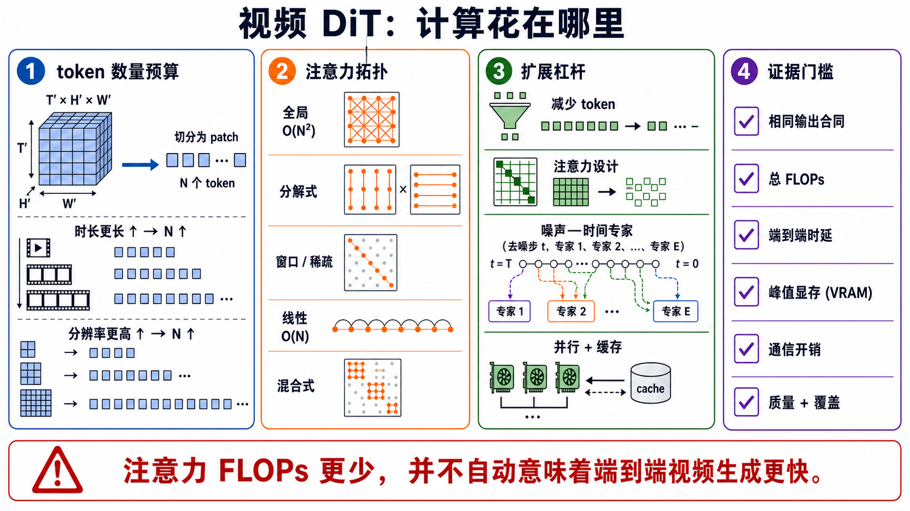

# Video DiT 与骨干扩展：Token、注意力、融合、MoE、并行与缓存

> **证据快照：2026-08-30。** 本章只采用正式 proceedings、作者论文/技术报告和官方代码或模型页。论文里的速度、显存与质量数字均保留作者协议限定；产品名、演示样例和 README 宣传不能反推出未公开的骨干细节。2026 年预印本、尚未正式发表的系统和只在官方仓库出现的实现会明确标注。

一句话先说清：**Video DiT 是把带噪视频表示、噪声/运输时间和条件映射为预测目标的网络骨干；它不是 tokenizer，不是 diffusion/flow objective，也不自动等于少步、流式或实时。**

本章回答六个容易混在一起的问题：

1. 一段视频到底会变成多少个 backbone token？
2. full、factorized、window、sparse、linear、recurrent 和 hybrid attention 分别改变了什么连边？
3. 文本、时间步、图像、音频和控制条件在哪里进入 block？
4. 3D 位置编码、frame packing、FPS 与宽高比条件为什么会决定网格外推？
5. depth/width、noise-time MoE、并行、量化、缓存和减少采样步数分别改变哪一笔成本？
6. 怎样做公平且可证伪的 backbone 比较，而不是把 tokenizer、数据、objective 或硬件收益错记到架构头上？

## 1. 先冻结章节边界

令视频 tokenizer 输出连续 latent：

```math
z\in\mathbb{R}^{B\times C_z\times T'\times H'\times W'},
```

在噪声或运输时间 $\tau$ 上，骨干实现的是某个条件映射：

```math
f_\theta(z_\tau,\tau,c;m)
\rightarrow
\widehat y_\tau,
```

其中 $c$ 是文本、图像、音频、相机或其他条件，$m$ 是可选的 attention mask，$\widehat y_\tau$ 可以是 $\epsilon$、$x_0$、score、常见 $v$、flow velocity 或蒸馏目标。**输出头预测什么由 objective 决定；内部怎样混合 token 才由 backbone 决定。**

| 相邻层 | 它负责什么 | 本章只接收什么接口 | 不能从 backbone 推出的结论 |
|---|---|---|---|
| [视频 Tokenizer](video-tokenizers.md) | pixel 与连续/离散表示、压缩、重建和 causal codec | latent shape、通道、时间/空间压缩与边界约定 | patch 数少不等于真实 bitrate 低；骨干也不能恢复 tokenizer 已删除的信息 |
| [Diffusion](diffusion-models.md) / [Flow 与 Consistency](flow-consistency-models.md) | 概率路径、训练 target、solver/sampler、NFE | $z_\tau$、$\tau$、target type 与 loss weighting | DiT 不等于 diffusion；flow Transformer 也不是一种新 attention |
| Factorization | full-sequence、AR、masked、hierarchy 或 causal chunk | 数据时间 $k$ 上谁能读取谁 | causal attention 不自动证明可持续 commit |
| 本章：Backbone | patch、位置、mixer、条件融合、FFN/MoE、路由与执行图 | 给定输入和目标后的网络实现 | 参数更多、attention FLOPs 更少或 GPU 更多都不自动等于更好/更快 |
| [因果、流式与实时](causal-streaming-generation.md) | history exposure、lookahead、revision、commit、backpressure 与 SLO | 骨干的实际 mask、cache 和状态更新规则 | causal mask 不自动推出 TTFF、p99、jitter 或 deadline 达标 |

## 2. 一张图看懂计算去了哪里



**图 1：先记 token 账，再讨论“高效”。** 原始教学图，不复刻任何论文结构图。Attention topology 决定 token 之间怎样通信；token reduction、noise-time experts、distributed parallelism、denoising-step reduction 和 caching 不能互换。底部警告是本章最重要的工程边界：attention FLOPs 下降，不保证端到端视频生成更快。生成提示词、SHA-256、来源边界和视觉验收见[研究记录](../../sources/research_20260830_video_dit_backbones.md)。

### 2.1 Token 预算

若在 latent 网格上使用 patch size $(p_t,p_h,p_w)$，序列长度是：

```math
N=
\left\lceil\frac{T'}{p_t}\right\rceil
\left\lceil\frac{H'}{p_h}\right\rceil
\left\lceil\frac{W'}{p_w}\right\rceil.
```

这条式子把三个常被混用的词拆开：

- **tokenizer compression** 决定 $T',H',W',C_z$；
- **patchification** 决定每个 backbone token 覆盖多少 latent cell；
- **attention topology** 决定这些 token 之间建立多少连边。

例如把视频时长翻倍、其余不变，$N$ 近似翻倍；dense global attention 的 score matrix 元素数则近似变为四倍。若同时把高和宽各翻倍，$N$ 近似变为四倍，dense score matrix 近似变为十六倍。这里尚未计入文本 token、padding、frame packing、多个条件流和 CFG 的额外前向。

### 2.2 不能只报 attention 的 $O(N^2)$

对单层 dense self-attention，若 hidden width 为 $d$，head 数为 $h$，粗略主项包括：

```math
\underbrace{O(Nd^2)}_{QKV\text{ 与输出投影}}
+
\underbrace{O(N^2d)}_{QK^\top\text{ 与 }AV}
+
\underbrace{O(N^2)}_{\text{score/probability storage}}.
```

因此“attention 是二次复杂度”只描述 global dense attention 的一部分。在较短序列或很宽的模型上，$Nd^2$ 投影与 FFN 仍可能占主要时间；在多卡长序列上，all-to-all、all-gather 和 kernel launch 可能主导 wall time。一个可信的效率结论必须同时报告：

```math
(N,\ d,\ L,\ P_{total},\ P_{active},\ \text{FLOPs/forward},\ \text{NFE},\
\text{peak VRAM},\ \text{latency},\ \text{throughput},\ \text{communication}).
```

## 3. Video DiT block 到底做什么


**图 2：同一个 block 可以承载不同 objective。** 顺序化文字替代：pixel video 先由 codec 变成 latent grid；patch embedding 加入时空、FPS 和 modality 位置后成为 $N$ 个视频 token。噪声时间可以经 AdaLN/FiLM 调制 block，文本、图像、音频或控制可经 cross-attention 或 joint/dual stream 融合。时空 mixer 与 FFN/experts 重复 $L$ 层，输出再 unpatchify；最终预测 $\epsilon$、$x_0$、score、$v$ 还是 flow velocity 由 objective 决定，solver/NFE 属于采样层。

### 3.1 Mixer、FFN 与 residual 是三笔不同计算

标准 Transformer block 可抽象为：

```math
u_{\ell}=x_{\ell}+M_\ell(\mathrm{Norm}(x_{\ell});c,\tau,m),
```

```math
x_{\ell+1}=u_{\ell}+F_\ell(\mathrm{Norm}(u_{\ell});c,\tau),
```

其中 $M_\ell$ 是 attention/linear mixer，$F_\ell$ 是 FFN 或 MoE。替换 mixer 不会自动减少 FFN 成本；路由 FFN 专家也不会自动改变 attention 连边。实现报告至少要拆出 mixer、FFN、condition modules 和 output head 的参数与耗时。

### 3.2 两个时间坐标不能混

- $k$：视频数据时间，对应第几帧/latent slice；causal、bidirectional、window 和 temporal RoPE 都约束这一轴。
- $\tau$：diffusion/flow 的噪声或运输时间，对应第几次 denoiser 调用；AdaLN 的 timestep conditioning、noise-time MoE 和 inter-step cache 约束这一轴。

Wan2.2 的高噪声/低噪声 expert 是沿 $\tau$ 路由，不是把视频前半段交给一个 expert、后半段交给另一个。相反，causal temporal attention 限制的是 $k$ 上能否读取未来帧。把两者都叫“temporal routing”会产生根本性误读。

## 4. 时空 attention 拓扑：少连边不等于少能力，也不等于无损

设每个时间位置有 $S=H_pW_p$ 个空间 token，总长度 $N=T_pS$。

### 4.1 Full spatiotemporal attention

所有视频 token 在一层中两两交互，attention 主项为：

```math
O(N^2d)=O(T_p^2S^2d).
```

优点是单层 receptive field 全局，便于远距离身份、场景与事件通信；缺点是 score matrix 随时长和分辨率平方增长。Step-Video-T2V 的技术报告明确采用 3D full attention，HunyuanVideo 的双流到单流 block 也在统一 token 序列上做全注意力；这些设计证明“大模型可以采用 full attention”，却不能证明 full attention 在固定预算下总是最佳 [[8]](#ref-8) [[9]](#ref-9)。

### 4.2 Factorized / axial space–time attention

先在每个时间切片内做空间 attention，再让同一空间位置跨时间交互，主项近似：

```math
O(T_pS^2d)+O(ST_p^2d).
```

相对 full attention，它删除了一层内任意时空位置的直接连边；多层交替后仍可传播到全局。Latte 系统比较了四种时空分解变体；早期 video diffusion 与大量图像模型视频化方法也常把 spatial 与 temporal block 分开 [[2]](#ref-2) [[5]](#ref-5)。公平比较必须匹配层数、宽度和计算，否则“分解更好”可能只是更深网络或更强图像初始化的收益。

### 4.3 Window / local / shifted attention

每个 query 只读大小为 $w$ 的局部窗口，attention 主项近似 $O(Nwd)$。W.A.L.T. 将 spatial window 与 spatiotemporal window 组合，用局部连边控制成本 [[3]](#ref-3)。窗口化的真实问题不是“能不能生成”，而是：

- 跨窗口信息要经过多少层、shift 或 global token 才能相遇？
- 快速主体跨越窗口边界时会不会出现身份、纹理或轨迹断裂？
- padding、非方形宽高比和可变帧数下，窗口覆盖是否改变？

### 4.4 Dynamic sparse / block sparse attention

若每个 query 实际保留 $k\ll N$ 个 key，attention 乘法可降到约 $O(Nkd)$。但只有在候选选择、mask 构造和 sparse kernel **也避免生成完整 $N\times N$ score** 时，端到端复杂度才真正下降。否则只是先花 $O(N^2)$ 找稀疏模式，再少做一部分 $AV$。

RAPID 复用早期 denoising step 得到的 attention importance，并跨 step 调整稀疏密度；DSA、AdaCluster、VMoBA 和 VecAttention 则从 distributed sparse attention、query-key clustering、mixture-of-block 与 vector-wise sparsity 等方向改变稀疏选择 [[20]](#ref-20) [[22]](#ref-22) [[23]](#ref-23) [[24]](#ref-24)。这些方法的共同验收点是：**实际 kernel density、selector overhead、通信量和质量非劣界**，不能只报理论 $k/N$。

### 4.5 Linear / recurrent attention

线性 attention 通常利用特征映射或结合律，把

```math
\mathrm{softmax}(QK^\top)V
```

替换为可先聚合 $K,V$ 状态的形式。其复杂度可能写成 $O(Nrd)$ 或 $O(Nd^2)$，取决于 feature rank、head width 和 kernel；“linear”描述对序列长度的渐近关系，不表示常数小，也不保证有限精度下与 softmax 等价。

LinGen 以线性复杂度架构面向高分辨率分钟级视频；SANA-Video 用 block-wise linear DiT 和 cumulative KV state；ReHyAt 用 recurrent hybrid attention 将局部 dense 交互与可传递状态结合 [[12]](#ref-12) [[15]](#ref-15) [[26]](#ref-26)。这条路线最需要验证的是：长距、小物体重现、属性绑定和快速运动是否被低秩/压缩状态抹掉。

### 4.6 Hybrid attention

Hybrid block 在部分层、head、token 或 chunk 上保留 dense softmax，其余走 linear/sparse 路径。若 dense 比例为 $\alpha$，粗略账本应写成：

```math
C_{mix}
\approx
\alpha C_{dense}
+
(1-\alpha)C_{efficient}
+
C_{routing/state}.
```

SANA-Video 2.0 的公开设计是 75% gated bidirectional linear attention 与 25% dense softmax anchor，并加入跨网络深度复用 completed-block feature 的 AttnRes；官方文档截至本章快照日公开的是 5B 720p checkpoint，而 14B 配置/权重仍标为 coming soon [[16]](#ref-16) [[17]](#ref-17)。因为四分之一层仍是 dense softmax，这一固定比例架构的**严格渐近复杂度仍含 $O(N^2)$ 项**；“以线性层为主”不能缩写成“整个模型严格 $O(N)$”。Attention Surgery、BLADE 与 ReHyAt 分别从 post-training linearization、block-sparse + step distillation 和 recurrent hybrid 方向说明：2026 年的前沿不再只是“把 softmax 全部换掉”，而是学习**哪些位置仍值得保留昂贵交互** [[25]](#ref-25)–[[27]](#ref-27)。

### 4.7 Causal / bidirectional / lookahead 是 mask 轴

Mask 与 mixer 类型正交：dense、window、sparse、linear 或 hybrid 都可以是双向、严格 causal 或有限 lookahead。对视频数据时间 $k$：

```math
m_{ij}=
\begin{cases}
0, & k_j\le k_i+\ell,\\
-\infty, & k_j>k_i+\ell,
\end{cases}
```

其中 $\ell=0$ 是严格 causal，$`\ell\gt0`$ 是有限 lookahead。这个 mask 只定义信息可见性；要声称 streaming，还必须给出 chunk 输入、state/cache 更新、revision window、commit frontier、backpressure 和真实 SLO。

## 5. 位置、packing 与条件融合

### 5.1 位置不是“加一个编号”

视频 token 至少有 $(k,h,w)$ 三个几何坐标，还可能需要：

- 实际 FPS 或 frame interval，区分“相同帧数但不同物理时长”；
- 原始宽高比与 resize/crop/pad 元数据；
- 文本、视频、音频、reference 等 modality/type；
- chunk offset、camera/view 与噪声时间 $\tau$。

3D RoPE 把旋转位置编码分配到时间、高和宽维；它能让 attention score 感知相对坐标，但不会自动解决训练网格外的频率外推。Open-Sora 报告 temporal RoPE 与可变尺寸 conditioning，CogVideoX 使用 frame packing 训练多分辨率视频，SANA-Video 2.0 官方文档写明沿用 Wan 风格 3D RoPE [[7]](#ref-7) [[11]](#ref-11) [[17]](#ref-17) [[30]](#ref-30)。必须分别测试：训练外帧数、FPS、宽高比、padding offset 和 mixed-image/video batch。

### 5.2 三类常见条件入口

| 条件入口 | 机制 | 强项 | 典型风险 |
|---|---|---|---|
| Cross-attention | 视频 query 读取文本/参考条件的 key/value | 条件和视频流分开，易插拔 | 条件只在少数层进入，细粒度绑定可能弱 |
| AdaLN / FiLM / gating | 由 $\tau$、文本池化或其他条件生成 scale/shift/gate | 低额外 token 成本，适合全层调制 | 池化会压缩词级关系；gate 饱和会让条件失效 |
| Joint / dual-stream tokens | 条件 token 与视频 token 分流后合流，或在同一 self-attention 中交互 | 双向细粒度通信 | 序列更长、condition leakage 与模态不平衡 |

图像 Stable Diffusion 3 的 MMDiT 使用文本与图像各自权重并允许双向信息流，是后来多模态双流/合流设计的重要架构祖先；它本身不是视频时序证据 [[4]](#ref-4)。CogVideoX 的 expert transformer 为文本与视频使用 expert adaptive LayerNorm；HunyuanVideo 则采用双流后接单流的结构 [[7]](#ref-7) [[8]](#ref-8)。比较融合方式时，应做**条件交换、条件删除、局部控制和非目标泄漏**测试，而不是只看平均 prompt score。

## 6. 六种 scaling 杠杆必须分账

### 6.1 减少 token：改变 $N$

更强 tokenizer 压缩、更大 patch、pyramid、token merge/prune 都能减少 $N$。它们最直接地降低后续每层成本，却可能删掉文字、小物体、快速运动与视差。LTX-Video 把高时空压缩和全时空 attention 组合起来，说明“能用 full attention”有时来自前置 token 预算，而不是 attention 本身突然廉价 [[10]](#ref-10)。报告必须同时给出 codec reconstruction ceiling，不能把 generator 的模糊归罪于 backbone，也不能把生成式 decoder 的锐利幻觉算成忠实恢复。

### 6.2 Depth / width：改变每 token 容量

DiT 的图像实验建立了随模型 GFLOPs 增长而改善的 scaling 观察 [[1]](#ref-1)。视频上还要同时扩展时空 token、数据质量和并行系统，因此不能从图像 scaling curve 外推“参数翻倍必然改善运动”。至少报告 $L,d,h,d_{ff}$、训练 token/样本数、每样本网格与总训练 FLOPs。

### 6.3 Noise-time MoE：改变 total 与 active parameters

Wan2.2 官方实现沿 denoising timestep 切换 high-noise 与 low-noise expert：前者负责高噪声阶段的整体布局，后者负责低噪声阶段的细节；官方仓库将其描述为约 27B 总参数、每个 denoising step 激活约 14B [[18]](#ref-18) [[19]](#ref-19)。正确账本是：

```math
P_{total}\ne P_{active/step},
```

但这**不表示每个 active expert 内部 attention 已变便宜**。还要报告两个 expert 是否同时常驻显存、是否 CPU/offload、切换开销、每个 $\tau$ 区间的利用率，以及切换边界是否产生质量不连续。若路由只由预定 timestep 阈值决定，也不能写成 content-adaptive MoE。

### 6.4 分布式并行：改变 wall time 与每卡内存，不删除总工作

| 并行轴 | 常见切分 | 主要通信 | 关键边界 |
|---|---|---|---|
| Data parallel / FSDP | batch、参数/梯度/optimizer state | all-reduce / all-gather | 不扩大单样本 attention context；训练与推理作用不同 |
| Tensor parallel | head、channel、FFN | 每层 collective | 小 batch 或慢互连时通信占比高 |
| Sequence/context parallel | 时间/空间 token | attention 所需 K/V 或 partial result 交换 | 能容纳长视频，但 total FLOPs 未消失 |
| Pipeline / PipeFusion | layer、patch 或 denoising stage | stage activation、bubble/stale context | micro-batch、调度与近似上下文改变延迟 |
| CFG parallel | conditional/unconditional branch | 末端合并 | 只在启用 CFG 时有对应工作可并行 |

ScaleFusion 针对视频 DiT 的时空 attention 做分布式切分与通信重叠；xDiT 组合 sequence parallel、PipeFusion 与 CFG parallel [[29]](#ref-29) [[31]](#ref-31)。论文中的强扩展数字只能在给定模型、GPU 数、互连、序列、batch 和精度下成立。应同时报告单卡不可运行时的 **scale-up capacity** 与固定问题规模下的 **strong scaling efficiency**。

### 6.5 Inter-step cache：利用 $\tau$ 相邻，不是视频 KV cache 的同义词

同一采样轨迹中，相邻 denoising step 的 activation/attention 常相似，因而可复用：

- PAB 按不同 block 的差异曲线广播旧 attention 输出，并结合 broadcast sequence parallel [[13]](#ref-13)；
- AdaCache 根据内容与运动变化自适应决定 cache schedule [[14]](#ref-14)；
- FasterCache 复用条件/无条件等特征，属于作者预印本路线 [[28]](#ref-28)；
- RAPID 复用的是 attention sparsity/importance，并随 step 自适应改变密度 [[20]](#ref-20)。

它们与 causal AR 的 **data-time KV cache** 不同：后者复用历史 frame/token 的 $K,V$；inter-step cache 复用同一个 noisy sample 在相邻 $\tau$ 的中间量。若声称“精确 cache”，应在相同 seed 下与 full recompute 做数值容差比较；若是近似 cache，则必须按高/低噪声、运动速度、scene cut、prompt/control 改变和多样性分层报告误差。

### 6.6 量化与减少 NFE：另两条执行轴

ViDiT-Q、QuantSparse 和 DeltaQuant 分别探索视频 DiT 量化、量化与稀疏协同、时空 delta smoothing [[32]](#ref-32) [[33]](#ref-33) [[34]](#ref-34)。量化改变算术精度、权重/activation bytes 和 kernel；减少 NFE 则减少 backbone 被调用的次数。端到端成本近似：

```math
C_{sample}
\approx
\sum_{i=1}^{\mathrm{NFE}}
C_{backbone}(N_i,d,L,\rho_i,q_i,\text{hardware})
+C_{codec}+C_{scheduler}+C_{I/O}.
```

这里 $\rho_i$ 是第 $i$ 步实际 attention density，$q_i$ 是精度。把一个 4-step sparse/quantized 系统与 50-step dense FP16 baseline 比较可以说明“整套系统更快”，却不能单独归因于 attention、quantization 或 distillation。

## 7. 2022–2026 机制里程碑：首次公开与正式发表分开

| 首次公开 → 正式状态 | 机制节点 | 它真正推进了什么 | 证据边界 |
|---|---|---|---|
| 2022-12 → ICCV 2023 | DiT [[1]](#ref-1) | 把 latent patch Transformer 作为 diffusion backbone，并做图像尺度化实验 | 图像结果不证明视频时序；“DiT”不指定视频 attention topology |
| 2023-12 → ECCV 2024 | W.A.L.T. [[3]](#ref-3) | 共享图像/视频 latent；空间与时空 window attention | 局部窗口不是全局 dense；三级生成系统的收益不能只归因于 backbone |
| 2024-01 → TMLR 2025 | Latte [[5]](#ref-5) | 系统比较四种 factorized Video DiT 变体 | 论文配置与数据规模不代表所有大模型排序 |
| 2024-02 → 技术报告 | Sora report [[6]](#ref-6) | compressed latent 上的 spacetime patch Transformer，支持多时长/分辨率/宽高比 | 未公开完整 block、参数、训练或 sampler；不能据演示补全架构 |
| 2024-03 → ICML 2024 | Stable Diffusion 3 / MMDiT [[4]](#ref-4) | separate modality weights 与 joint bidirectional fusion | 图像多模态架构祖先，不是视频运动实验 |
| 2024-08 → ICLR 2025 | CogVideoX [[7]](#ref-7) | 3D VAE、expert adaptive LayerNorm、frame packing 与开放视频 DiT | “expert”指模态专用归一化/路径，不能和 timestep MoE 混称 |
| 2024-12 → 作者报告/开放实现 | HunyuanVideo [[8]](#ref-8) | >13B dual-stream→single-stream full-attention flow Transformer | 作者人评和工程报告需独立复现；模型家族/版本不可混用 |
| 2024-12 → 作者预印本/开放实现 | LTX-Video [[10]](#ref-10) | 高压缩 latent + full spatiotemporal attention 的实时取向 | H100 上作者速度受分辨率、时长、步数和精度限定 |
| 2025-02 → 作者技术报告 | Step-Video-T2V [[9]](#ref-9) | 30B、3D full-attention DiT、204-frame 系统报告 | 系统结果同时来自 VAE、数据、objective、DPO 与并行，不是纯 backbone ablation |
| 2025 → CVPR 2025 | LinGen [[12]](#ref-12) | 线性复杂度长视频生成路线 | “分钟级”是作者协议；质量与长距覆盖仍需匹配实验 |
| 2025 → ICLR 2025 | PAB [[13]](#ref-13) | 跨 denoising step 的 attention output broadcast/cache | 最高加速是特定模型/任务协议，不是精确等价 |
| 2025 → ICCV 2025 | AdaCache [[14]](#ref-14) | 内容/运动感知的自适应 cache schedule | 需分层检查高速运动与 scene cut，而非只报平均加速 |
| 2025 → MLSys 2025 | ScaleFusion [[29]](#ref-29) | 分布式视频 attention 与通信重叠 | 多卡速度不等于总 FLOPs 降低 |
| 2025-07 官方仓库/权重 | Wan2.2 [[18]](#ref-18) [[19]](#ref-19) | high/low-noise 两 expert 按 $\tau$ 阈值切换 | 未核验到 Wan2.2 独立正式论文；仓库 citation 仍指基础 Wan 报告，不是 content-adaptive token MoE |
| 2025 → ICLR 2026 | SANA-Video [[15]](#ref-15) | block linear DiT 与 cumulative KV state | 一分钟/720p、训练成本与速度均为作者协议 |
| 2026-07 → 预印本/部分开放 | SANA-Video 2.0 [[16]](#ref-16) [[17]](#ref-17) | 3:1 linear/softmax hybrid、AttnRes、5B/14B 设计 | 快照日仅 5B checkpoint 可核验；不能把 14B “coming soon”写成已发布 |
| 2026 → CVPR 2026 | LinVideo [[21]](#ref-21) | 以 post-training 把既有视频 DiT 选择性转为线性 attention | 作者 1.43–1.71×、配合 4-step 15.9–20.9× 是具体协议，不是所有 checkpoint 通则 |
| 2026 → CVPR 2026 | RAPID / TimeRipples [[20]](#ref-20) [[35]](#ref-35) | RAPID 跨 denoising step 复用 sparse mask/score；TimeRipples 在同一次 attention 内复用相邻时空 latent 的部分计算 | 后者论文速度含 attention saving 的比例估算，不能冒充已由结构化 kernel 端到端实测 |
| 2026 → ICLR/CVPR 2026 | DSA、BLADE、Attention Surgery、ReHyAt [[22]](#ref-22) [[25]](#ref-25)–[[27]](#ref-27) | distributed sparse、稀疏+蒸馏、linearization 与 recurrent hybrid | kernel、训练/微调预算、NFE 和硬件必须分别报告 |

这里的时间按“首次可核验公开材料 → 正式 venue”写，不用正式发表年份倒置技术先后。预印本或官方仓库节点不被冒充为同行评审结论。

## 8. 论文精读：按机制问题组织，而不是列模型 Logo

### 8.1 Full、factorized、window：谁负责全局通信？

**问题。** 视频既需要邻近运动连续，也需要远距离身份与场景状态。全局连边昂贵，局部连边又可能让信息传播路径过长。

**三种代表回答。** W.A.L.T. 用空间/时空窗口控制直接邻域；Latte 用空间与时间 attention 的不同排列系统化 factorization；Step-Video-T2V/HunyuanVideo 选择 full spatiotemporal attention，并把扩展压力交给 token budget 与并行 [[3]](#ref-3) [[5]](#ref-5) [[8]](#ref-8) [[9]](#ref-9)。HunyuanVideo 作者实验报告 full attention 优于 divided spatiotemporal attention，CogVideoX 的作者消融也报告 2D+1D 分解训练更不稳定且 FVD 更差；这是各自配置内的证据，不是跨模型定理 [[7]](#ref-7) [[8]](#ref-8)。

**不能直接下的结论。** 这些系统没有在完全相同 tokenizer、数据、参数、训练 FLOPs 和 sampler 下形成总排名。full 模型更大、数据更多，或 window/factorized 模型能训练更长，都可能改变结果。

**应做的反证。** 构造“物体离开画面后再次出现”“远距属性复现”“两事件顺序交换”“主体跨窗口快速移动”四类 probe；同时匹配参数和训练 FLOPs。若 full attention 没有预注册的远距增益，就不能声称全局连边带来可测长程优势。

### 8.2 Linear/hybrid：渐近复杂度怎样变成实际收益？

**问题。** 当 $N$ 足够大，dense attention score matrix 成为显存与通信瓶颈；但纯线性状态可能丢失选择性回忆。

**代表回答。** LinGen 与 SANA-Video 探索线性复杂度主干；SANA-Video 2.0、Attention Surgery 与 ReHyAt 保留部分 dense anchor 或 recurrent local interaction；LinVideo 则从已有 checkpoint 出发做选择性 post-training linearization [[12]](#ref-12) [[15]](#ref-15)–[[17]](#ref-17) [[21]](#ref-21) [[26]](#ref-26) [[27]](#ref-27)。

**最关键的读法。** 先问是 from-scratch architecture、post-training conversion 还是 inference-only kernel；再问 dense 比例、state/rank、训练或蒸馏数据、是否改变 NFE；最后才看 wall speed。把这三种证据合并成“linear attention 已取代 softmax”是不成立的。

**应做的反证。** 在 $T,H,W$ 多个网格上拟合 peak memory 与 latency 对 $N$ 的斜率；同时设置等参数、等 FLOPs和固定 checkpoint 三种比较。若理论线性方法在实际范围没有改善斜率，或长距/小物体质量超过预设非劣界，则“无损扩展”声明失败。

### 8.3 Sparse/reuse：稀疏模式是每步重算，还是可复用？

**问题。** 视频 token 关系和相邻 $\tau$ activation 都有冗余，但冗余不必在高噪声、低噪声、快速运动和 scene cut 上相同。

**代表回答。** RAPID 用早期 importance 初始化并跨 step 自适应 sparsity；DSA 强调多卡 sparse attention 的调度与执行；BLADE 把 block sparsity 与 step distillation 联合；AdaCluster/VMoBA/VecAttention 改变候选粒度 [[20]](#ref-20) [[22]](#ref-22)–[[25]](#ref-25)。TimeRipples 是另一类：它在**同一次 attention** 内依据 $Q/K$ 的局部时空相关性复用部分 score 计算，并非跨 $\tau$ 的 feature cache；论文还明确指出现有 FlashAttention 不支持其非结构稀疏，因此表中的 2.31–2.66× 属于按 attention saving 估算的作者结果，不能写成已部署 kernel 的端到端实测 [[35]](#ref-35)。

**最危险的混淆。** mask density 不是实际 FLOP，理论 FLOP 不是 kernel time，kernel time不是端到端 sample latency。若 selector 本身读过 dense score，或稀疏 kernel 利用率低，理论收益可能消失。

**应做的反证。** 报告每层/每步 density、selector time、attention kernel time、通信、总 denoiser time；按噪声区间、运动、镜头切换与条件改变分桶。若 sparsity 只在静态或低运动 prompt 上成立，不能写成通用视频冗余。

### 8.4 Noise-time experts：容量扩展还是计算缩减？

**问题。** 高噪声阶段更依赖全局布局，低噪声阶段更依赖细节；单一参数集合是否必须同时优化两类行为？

**代表回答。** Wan2.2 的官方代码在预定 timestep boundary 切换两个 transformer expert [[18]](#ref-18) [[19]](#ref-19)。它提高 total capacity，同时让每一步只激活一个 expert。

**边界。** 这不是 token-level top-$k$ routing，也不是内容自适应；总参数、常驻显存和每步 active parameters 必须分开。若两个专家同时装入 GPU，参数内存不会因为“每步只运行一个”而自动减半。

**应做的反证。** 对切换阈值做邻域 sweep；按 $\tau$ 分桶比较两个 expert 的 target error 和互换性能；检查阈值附近的输出/梯度不连续。若一个 expert 覆盖全区间同样好，或路由收益来自额外参数而非分工，就不能声称 noise specialization 已被证明。

### 8.5 Parallelism/cache：容量、吞吐和单样本延迟要拆开

**问题。** 单卡放不下长视频，不代表多卡会线性加速；相邻 denoising step 相似，也不代表中间量可以无损复用。

**代表回答。** ScaleFusion/xDiT 通过 sequence/context、pipeline 与 CFG 等并行扩大可运行规模；PAB/AdaCache/FasterCache 利用 inter-step similarity；RAPID 复用稀疏结构 [[13]](#ref-13) [[14]](#ref-14) [[20]](#ref-20) [[28]](#ref-28) [[29]](#ref-29) [[31]](#ref-31)。

**应做的反证。** 并行系统报告 1/2/4/8/... GPU 的 latency、throughput、峰值显存、通信和扩展效率；cache 系统与 full recompute 用相同 checkpoint、prompt、seed、sampler/NFE、输出 shape 比较，并给出逐 prompt 差异而非只报平均分。

## 9. Backbone 评测合同

### 9.1 最小模型卡

~~~yaml
representation:
  codec_checkpoint: ...
  latent_shape: [Cz, T_prime, H_prime, W_prime]
  patch_size: [pt, ph, pw]
  video_tokens: N
backbone:
  layers_width_heads: [L, d, h]
  mixer: full | factorized | window | sparse | linear | hybrid | recurrent
  attention_mask: bidirectional | causal | lookahead
  window_or_density: ...
  position: absolute | rope_3d | relative | ...
  condition_fusion: cross_attention | adaln | dual_to_single | joint
  total_parameters: ...
  active_parameters_per_step: ...
execution:
  dtype_quantization: ...
  cache: none | exact | approximate
  parallelism: [data, fsdp, tensor, sequence_context, pipeline, cfg]
  hardware_interconnect_kernel: ...
objective_sampling:
  target_schedule: ...
  sampler_nfe_cfg: ...
output_contract:
  frames_fps_resolution_duration: ...
cost:
  flops_per_forward: ...
  peak_vram: ...
  latency_ttff_or_total: ...
  throughput: ...
  communication_bytes_or_time: ...
~~~

### 9.2 四组必须同时有的测试

| 测试组 | 最低内容 | 主要反证对象 |
|---|---|---|
| 质量与覆盖 | fidelity、diversity/coverage、prompt alignment、时序一致，不用单一平均分封榜 | 更快是否靠 mode collapse、静态化或 tokenizer 模糊 |
| 长程与绑定 | 离场重现、事件顺序、属性交换、跨窗口运动、scene cut | full/global、linear state、sparse pattern 的能力主张 |
| 网格外推 | 训练内/外的帧数、FPS、分辨率、宽高比、padding 与 mixed image/video | 3D RoPE、packing、位置外推主张 |
| 系统成本 | FLOPs、NFE、VRAM、latency、throughput、通信、启动/编解码 | 理论复杂度、多卡、cache、量化和少步收益归因 |

### 9.3 作者协议数字怎样引用

本章保留若干数字只为展示“结论必须带 protocol”：例如 LinVideo 在单 H100、batch 1、50-step 作者设置中报告 1.43–1.71×，结合 4-step variant 报告 15.9–20.9×；RAPID 在单 A100 的作者设置下，Turbo 版本报告对 Wan2.1-14B 1.79×、对 HunyuanVideo 2.01×；DSA 在 8 GPU 作者设置下报告相对既有 distributed 方法 1.43×、相对 single GPU 10.79× [[20]](#ref-20)–[[22]](#ref-22)。这些数字**不能横向排序或相乘**，因为模型、NFE、输出、硬件、baseline、精度和质量容差都不同。

## 10. 两个可证伪协议

### 10.1 `BackboneFork-1`：从头训练的结构比较（尚未运行）

**目的：** 判断 mixer、position 或 condition fusion 本身是否带来预注册收益。

| 冻结项 | 分叉项 | 两套公平配对 | 报告项 |
|---|---|---|---|
| codec/latent、patch、数据及顺序、文本 encoder、条件 dropout、objective/loss weighting、sampler/NFE/CFG、输出、训练 tokens、精度与硬件 | U-Net、full、factorized、window/sparse、linear/recurrent；position 和 fusion 另做单变量 fork | parameter-matched；training-FLOP-matched | 按 $\tau$ 分桶 target error；质量/覆盖；长程/绑定/网格 probe；forward FLOPs、VRAM、tokens/s、端到端成本 |


顺序化文字替代：先冻结 codec、数据、objective、sampler 和输出；再分叉 full、factorized、window/sparse 与 linear/recurrent 骨干；每个分叉都做等参数和等训练 FLOPs 两套比较；随后同时运行质量/覆盖、长程/绑定、网格外推和资源斜率探针。只有达到预注册质量非劣界并出现所声称收益时保留有限结论，否则驳回或收窄。

预注册反证：

- 若 full attention 在匹配预算的远距 probe 上无增益，则“全局连边改善长程一致”不成立。
- 若 sparse/linear 的实际 latency 或显存对 $N$ 的斜率未改善，或质量超出非劣界，则“无损扩展”不成立。
- 若 3D position 在未见 FPS、时长、宽高比或 padding 上发生 aliasing，则“可变网格支持”不成立。
- 若交换/删除条件不能产生局部定向响应，或引起严重非目标泄漏，则“融合改善绑定”不成立。
- 若 MoE 专家互换或单专家覆盖全 $\tau$ 仍无损，则“noise specialization”证据不足。

### 10.2 `ServeFork-1`：固定 checkpoint 的执行比较（尚未运行）

**目的：** 判断 sparse/cache/quantization/parallelism 的实际部署收益，不把再训练收益混进来。

冻结 checkpoint 权重、prompt、seed、sampler、NFE、CFG、输出、decode、warm-up、精度基线和计时边界；需要参数更新或结构转换的方法不得混入这一固定权重分叉。依次只改变一项：

1. dense attention 实现 → 等价 fused kernel，或无需训练的 sparse 近似执行；后者必须另报 selector、density 和逐样本质量差异；
2. full recompute → inter-step cache；
3. BF16/FP16 → 指定量化；
4. 单卡 → 2/4/8 卡并行；
5. 最后再测试允许多项组合的 serving recipe。

每项报告 compile/warm-up 与 steady-state，batch 1 latency 与吞吐，host/device transfer，peak allocated/reserved VRAM，通信时间，逐 prompt 质量差异和失败桶。若相同 seed 的“exact cache”超过数值容差，则应改标 approximate；若 wall time 没改善，即使理论 FLOPs 下降，也不能保留“更快”主张。

若 linearized attention、learned sparse router 或其他方法需要校准、蒸馏或后训练优化，则进入独立的 `ServeFork-1b`：允许生成 converted checkpoint，但必须另报校准数据、更新步数、训练 FLOPs、参数变化和转换时间，并同时对照原 checkpoint 的 dense serving。它证明的是“后训练转换后的系统收益”，不能记作固定 checkpoint 的纯 kernel 加速。

## 11. 常见误读与快速诊断

| 误读 | 为什么错 | 快速追问 |
|---|---|---|
| “DiT 比 diffusion 更新” | DiT 是网络；diffusion 是 objective/概率路径 | 这个 DiT 预测什么 target，用什么 sampler？ |
| “所有 DiT 都是 $O(N^2)$” | 只对 global dense attention 主项成立 | mixer 是 full、window、sparse、linear 还是 hybrid？ |
| “linear attention 所以一定更快” | kernel 常数、width、state、FFN 和通信可能主导 | 实际 $N$ 范围的 latency/VRAM 斜率是什么？ |
| “MoE 27B，但每步只算 14B，所以只占 14B 内存” | active compute 与 resident parameters 不同 | 两 expert 是否同时常驻？有无 offload/switch cost？ |
| “多卡把复杂度降低了” | 多卡通常分摊工作，并增加通信 | total FLOPs、通信时间和 strong-scaling efficiency 呢？ |
| “cache 是无损加速” | 多数 inter-step reuse 是近似 | 同 seed 对 full recompute 的逐样本误差和失败桶呢？ |
| “causal attention 就是 streaming” | mask 不定义 commit、revision 和 SLO | lookahead、state、commit frontier、TTFF/p99 呢？ |
| “Sora 用 spacetime patch，因此是离散 token AR” | patch 可以来自连续 latent，且报告称 diffusion Transformer | 是否存在有限 codebook 与 categorical AR likelihood？ |

## 12. 建议阅读顺序

1. 先读 DiT，理解 latent patch Transformer 与 objective 的接口 [[1]](#ref-1)。
2. 对照 W.A.L.T.、Latte、CogVideoX、HunyuanVideo 和 Step-Video-T2V，比较 window、factorized、expert normalization、dual→single 与 full attention [[3]](#ref-3) [[5]](#ref-5) [[7]](#ref-7)–[[9]](#ref-9)。
3. 再读 LinGen、SANA-Video、SANA-Video 2.0 与 LinVideo，区分 from-scratch linear、hybrid anchor 和 post-training conversion [[12]](#ref-12) [[15]](#ref-15)–[[17]](#ref-17) [[21]](#ref-21)。
4. 读 RAPID、DSA、BLADE、AdaCluster/VMoBA/VecAttention，逐项追问 sparsity selector、kernel、通信与质量容差 [[20]](#ref-20) [[22]](#ref-22)–[[25]](#ref-25)。
5. 最后读 PAB、AdaCache、ScaleFusion 与 xDiT，分清 inter-step reuse、sequence/context parallel、pipeline 与 CFG parallel [[13]](#ref-13) [[14]](#ref-14) [[29]](#ref-29) [[31]](#ref-31)。
6. 用 `BackboneFork-1` 或 `ServeFork-1` 复核一条有限主张；不要以“跑出了视频”代替反证。

## 参考文献

<a id="ref-1"></a>[1] [Scalable Diffusion Models with Transformers](https://openaccess.thecvf.com/content/ICCV2023/html/Peebles_Scalable_Diffusion_Models_with_Transformers_ICCV_2023_paper.html). William Peebles, Saining Xie. ICCV. 2023. 首次公开于 2022-12。

<a id="ref-2"></a>[2] [Video Diffusion Models](https://arxiv.org/abs/2204.03458). Jonathan Ho et al. 2022.

<a id="ref-3"></a>[3] [W.A.L.T.: Photorealistic Video Generation with Diffusion Models](https://www.ecva.net/papers/eccv_2024/papers_ECCV/html/10270_ECCV_2024_paper.php). Agrim Gupta et al. ECCV. 2024. 首次公开于 2023-12。

<a id="ref-4"></a>[4] [Scaling Rectified Flow Transformers for High-Resolution Image Synthesis](https://proceedings.mlr.press/v235/esser24a.html). Patrick Esser et al. ICML. 2024.

<a id="ref-5"></a>[5] [Latte: Latent Diffusion Transformer for Video Generation](https://openreview.net/forum?id=ntGPYNUF3t). Xin Ma et al. TMLR. 2025. 首次公开于 2024-01。

<a id="ref-6"></a>[6] [Video Generation Models as World Simulators](https://openai.com/index/video-generation-models-as-world-simulators/). OpenAI. Technical report. 2024.

<a id="ref-7"></a>[7] [CogVideoX: Text-to-Video Diffusion Models with An Expert Transformer](https://proceedings.iclr.cc/paper_files/paper/2025/file/ce31378e9f41d8907e97dab172b6c559-Paper-Conference.pdf). Zhuoyi Yang et al. ICLR. 2025. 首次公开于 2024-08。

<a id="ref-8"></a>[8] [HunyuanVideo: A Systematic Framework For Large Video Generative Models](https://arxiv.org/abs/2412.03603). Weijie Kong et al. Author technical report and official open implementation. 2024.

<a id="ref-9"></a>[9] [Step-Video-T2V Technical Report: The Practice, Challenges, and Future of Video Foundation Model](https://arxiv.org/abs/2502.10248). Yingwei Ma et al. Author technical report. 2025.

<a id="ref-10"></a>[10] [LTX-Video: Realtime Video Latent Diffusion](https://arxiv.org/abs/2501.00103). Lightricks team. Author preprint and official open implementation. First public 2024-12.

<a id="ref-11"></a>[11] Open-Sora 1.2 Report [](https://github.com/hpcaitech/Open-Sora/blob/main/docs/report_02.md). HPC-AI Tech. Official technical report and code. 2024.

<a id="ref-12"></a>[12] [LinGen: Towards High-Resolution Minute-Length Text-to-Video Generation with Linear Computational Complexity](https://openaccess.thecvf.com/content/CVPR2025/papers/Wang_LinGen_Towards_High-Resolution_Minute-Length_Text-to-Video_Generation_with_Linear_Computational_Complexity_CVPR_2025_paper.pdf). Fu-Yun Wang et al. CVPR. 2025.

<a id="ref-13"></a>[13] [PAB: Real-Time Video Generation with Pyramid Attention Broadcast](https://proceedings.iclr.cc/paper_files/paper/2025/hash/092c2d45005ea2db40fc24c470663416-Abstract-Conference.html). Xuanlei Zhao et al. ICLR. 2025.

<a id="ref-14"></a>[14] [Adaptive Caching for Faster Video Generation with Diffusion Transformers](https://openaccess.thecvf.com/content/ICCV2025/html/Kahatapitiya_Adaptive_Caching_for_Faster_Video_Generation_with_Diffusion_Transformers_ICCV_2025_paper.html). Kumara Kahatapitiya et al. ICCV. 2025.

<a id="ref-15"></a>[15] [SANA-Video: Efficient Video Generation with Block Linear Diffusion Transformer](https://proceedings.iclr.cc/paper_files/paper/2026/hash/41b93c59da0d0f835907fd661d419db2-Abstract-Conference.html). Junsong Chen et al. ICLR. 2026.

<a id="ref-16"></a>[16] [SANA-Video 2.0: Hybrid Linear Attention with Attention Residuals for Efficient Video Generation](https://arxiv.org/abs/2607.21553). Junsong Chen et al. Preprint. 2026.

<a id="ref-17"></a>[17] [SANA-Video 2.0 Official Documentation](https://nvlabs.github.io/Sana/docs/sana_video2/). NVIDIA Research. Official documentation and release surface. 2026.

<a id="ref-18"></a>[18] Wan2.2 Official Repository [](https://github.com/Wan-Video/Wan2.2). Wan Team. Official code, model cards and weights. 2025.

<a id="ref-19"></a>[19] Wan2.2 timestep expert routing implementation [](https://github.com/Wan-Video/Wan2.2/blob/main/wan/text2video.py). Wan Team. Official code. 2025.

<a id="ref-20"></a>[20] [RAPID: Reusing Attention Sparsity with Inter-step Adaptation for Efficient Video Generation](https://openaccess.thecvf.com/content/CVPR2026/papers/Lin_RAPID_Reusing_Attention_Sparsity_with_Inter-step_Adaptation_for_Efficient_Video_CVPR_2026_paper.pdf). CVPR. 2026.

<a id="ref-21"></a>[21] [LinVideo: A Post-Training Framework towards O(n) Attention in Efficient Video Generation](https://openaccess.thecvf.com/content/CVPR2026/html/Huang_LinVideo_A_Post-Training_Framework_towards_On_Attention_in_Efficient_Video_CVPR_2026_paper.html). CVPR. 2026.

<a id="ref-22"></a>[22] [DSA: Efficient Inference For Video Generation Models via Distributed Sparse Attention](https://proceedings.iclr.cc/paper_files/paper/2026/hash/c3728248f3c627d1f16ca5726cdf83f5-Abstract-Conference.html). Shenggui Li et al. ICLR. 2026.

<a id="ref-23"></a>[23] [AdaCluster: Adaptive Query-Key Clustering for Sparse Attention in Video Generation](https://openaccess.thecvf.com/content/CVPR2026/html/Tan_AdaCluster_Adaptive_Query-Key_Clustering_for_Sparse_Attention_in_Video_Generation_CVPR_2026_paper.html). CVPR. 2026.

<a id="ref-24"></a>[24] [VecAttention: Vector-wise Sparse Attention for Accelerating Long-Context Inference](https://openaccess.thecvf.com/content/CVPR2026/html/Liu_VecAttention_Vector-wise_Sparse_Attention_for_Accelerating_Long_Context_Inference_CVPR_2026_paper.html). CVPR. 2026. See also [VMoBA](https://proceedings.iclr.cc/paper_files/paper/2026/hash/d6c4014ff8d95025aa35d831c0f81faa-Abstract-Conference.html), ICLR 2026.

<a id="ref-25"></a>[25] [BLADE: Block-Sparse Attention Meets Step Distillation for Efficient Video Generation](https://proceedings.iclr.cc/paper_files/paper/2026/hash/5bcb807ae43ad0851a6ba6162a866404-Abstract-Conference.html). Youping Gu et al. ICLR. 2026.

<a id="ref-26"></a>[26] [Attention Surgery: An Efficient Recipe to Linearize Your Video Diffusion Transformer](https://openaccess.thecvf.com/content/CVPR2026/html/Ghafoorian_Attention_Surgery_An_Efficient_Recipe_to_Linearize_Your_Video_Diffusion_CVPR_2026_paper.html). CVPR. 2026.

<a id="ref-27"></a>[27] [ReHyAt: Recurrent Hybrid Attention for Video Diffusion Transformers](https://openaccess.thecvf.com/content/CVPR2026/html/Ghafoorian_ReHyAt_Recurrent_Hybrid_Attention_for_Video_Diffusion_Transformers_CVPR_2026_paper.html). CVPR. 2026.

<a id="ref-28"></a>[28] [FasterCache: Training-Free Video Diffusion Model Acceleration with High Quality](https://arxiv.org/abs/2410.19355). Author preprint. 2024.

<a id="ref-29"></a>[29] [ScaleFusion: Fusing Model and Parallelism for Efficient Video Diffusion Transformers](https://openreview.net/pdf?id=anZWBeWnWh). MLSys. 2025.

<a id="ref-30"></a>[30] Open-Sora official repository [](https://github.com/hpcaitech/Open-Sora). HPC-AI Tech. Official code and reports.

<a id="ref-31"></a>[31] [xDiT: an Inference Engine for Diffusion Transformers with Massive Parallelism](https://arxiv.org/abs/2411.01738). Author preprint and official implementation. 2024.

<a id="ref-32"></a>[32] [ViDiT-Q: Efficient and Accurate Quantization of Diffusion Transformers for Image and Video Generation](https://proceedings.iclr.cc/paper_files/paper/2025/hash/a4a1ee071ce0fe63b83bce507c9dc4d7-Abstract-Conference.html). ICLR. 2025.

<a id="ref-33"></a>[33] [QuantSparse: Comprehensively Compressing Video Diffusion Transformer with Model Quantization and Attention Sparsification](https://proceedings.iclr.cc/paper_files/paper/2026/hash/94359ca6e248af69b8b6854668ae9782-Abstract-Conference.html). Weilun Feng et al. ICLR. 2026.

<a id="ref-34"></a>[34] [DeltaQuant: 4-bit Video Diffusion Models with Spatiotemporal Delta Smoothing](https://openaccess.thecvf.com/content/CVPR2026/html/Li_DeltaQuant_4-bit_Video_Diffusion_Models_with_Spatiotemporal_Delta_Smoothing_CVPR_2026_paper.html). CVPR. 2026.

<a id="ref-35"></a>[35] [TimeRipples: Accelerating vDiTs by Understanding the Spatio-Temporal Correlations in Latent Space](https://openaccess.thecvf.com/content/CVPR2026/html/Mao_TimeRipples_Accelerating_vDiTs_by_Understanding_the_Spatio-Temporal_Correlations_in_Latent_CVPR_2026_paper.html). CVPR. 2026.
