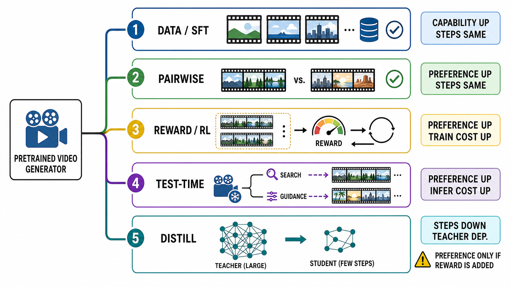
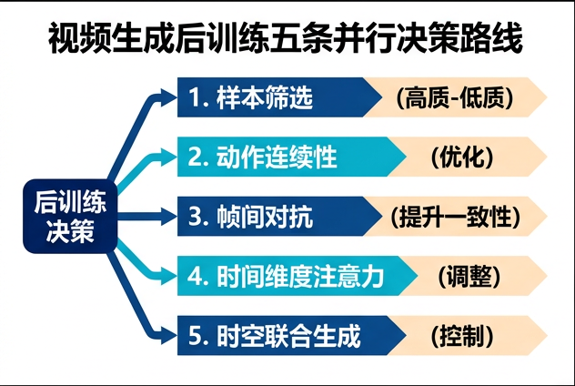

# 视频生成后训练、偏好对齐与少步适配

> 检索截至 **2026-08-30（Asia/Shanghai）**。本章把“后训练”视为多个可组合但互不等价的优化合同，而不是一种算法。除可由论文机制直接核对的定义外，质量、效率与胜率均标为作者自报；本章没有独立训练这些大模型。完整检索、证据分级与图像审计见[研究记录](../../sources/research_20260830_video_posttraining.md)。

在全仓库的分类中，后训练属于**能力获得方式**，不与物理一致性、时间一致或推理并列；若要讨论基础模型是否容易获得新行为，应使用“可适配性 / 可对齐性”这一元能力。统一定义与 C1–C9 能力族见[基础模型能力地图](../foundation-model-capabilities.md)。

## 1. 先问两个问题：改偏好，还是改采样成本？

视频生成的基础训练通常在大规模视频上学习条件分布；后训练则在已有生成器上追加数据、偏好、奖励、在线 rollout、推理时搜索或教师蒸馏。它们可能共享同一个 checkpoint，却改变不同对象：

<a id="post-training-capability-matrix"></a>

“常见目标能力”中的 C1–C9 均反链[基础模型能力地图](../foundation-model-capabilities.md#capability-cross-table-index)。这里记录优化信号通常瞄准什么，不表示采用该路线就必然获得相应能力；蒸馏还必须逐项复测能力保持。

| 路线 | 主要优化目标 / 信号 | 常见目标能力 | 默认改变偏好？ | 默认降低采样步数？ | 主要新增成本 |
|---|---|---|---:|---:|---|
| continued pretraining / SFT | 数据似然、flow 或 denoising 目标 | [C1](../foundation-model-capabilities.md#capability-c1) · [C2](../foundation-model-capabilities.md#capability-c2) · [C3](../foundation-model-capabilities.md#capability-c3) · [C5](../foundation-model-capabilities.md#capability-c5) · [C6](../foundation-model-capabilities.md#capability-c6) | 间接、取决于数据 | 否 | 数据清洗与训练算力 |
| reward model（RM） | 视频或视频对的分数/排序 | 评价 [C1](../foundation-model-capabilities.md#capability-c1) · [C2](../foundation-model-capabilities.md#capability-c2) · [C3](../foundation-model-capabilities.md#capability-c3) · [C5](../foundation-model-capabilities.md#capability-c5) · [C7](../foundation-model-capabilities.md#capability-c7)；不直接改变生成器 | **单独训练 RM 不会**改变生成器 | 否 | 标注、视频编码与校准 |
| reward shaping | 把总分拆成帧、段、时间步或集合回报 | [C2](../foundation-model-capabilities.md#capability-c2) · [C3](../foundation-model-capabilities.md#capability-c3) · [C5](../foundation-model-capabilities.md#capability-c5) · [C7](../foundation-model-capabilities.md#capability-c7) | 只有接入优化或引导才会 | 否 | 信号设计、额外 reward 调用 |
| DPO / IPO / ORPO 类 | 偏好对上的相对概率或 odds | [C1](../foundation-model-capabilities.md#capability-c1) · [C2](../foundation-model-capabilities.md#capability-c2) · [C3](../foundation-model-capabilities.md#capability-c3) · [C5](../foundation-model-capabilities.md#capability-c5) · [C7](../foundation-model-capabilities.md#capability-c7) | 是，目标如此；效果需实证 | 否 | 偏好对与参考/隐式基准 |
| policy-gradient / RL | 当前策略 rollout 的期望回报 | [C2](../foundation-model-capabilities.md#capability-c2) · [C3](../foundation-model-capabilities.md#capability-c3) · [C5](../foundation-model-capabilities.md#capability-c5) · [C7](../foundation-model-capabilities.md#capability-c7) · [C9](../foundation-model-capabilities.md#capability-c9) | 是，目标如此；风险也最高 | 否 | 多样本生成、log-prob、reward 与反传 |
| verifiable reward / test-time adaptation | 单次请求的搜索、梯度或小参数 | [C2](../foundation-model-capabilities.md#capability-c2) · [C5](../foundation-model-capabilities.md#capability-c5) · [C7](../foundation-model-capabilities.md#capability-c7) · [C8](../foundation-model-capabilities.md#capability-c8) | 当次输出可能改变；权重未必持久改变 | 否，通常反而增加推理工作 | best-of-$N$、reward 查询或每请求优化 |
| consistency / DMD / distillation | 少步 student、flow map 或输出分布 | 不默认新增能力；对 teacher 已声明能力做逐项保持性复测 | 默认否 | **是** | 教师、student 训练与蒸馏稳定性 |
| reward-guided distillation | 少步 student + reward | [C1](../foundation-model-capabilities.md#capability-c1) · [C2](../foundation-model-capabilities.md#capability-c2) · [C3](../foundation-model-capabilities.md#capability-c3) · [C5](../foundation-model-capabilities.md#capability-c5) · [C7](../foundation-model-capabilities.md#capability-c7) | 是 | 是 | 教师与 reward 的双重依赖 |

因此，“用了 reward”不等于“做了 RL”，“online”不等于 policy gradient，“一步视频”也不等于“已经偏好对齐”。DPO 的原始形式把 Bradley–Terry 偏好模型化成参考策略下的直接分类目标，不必先训练显式 reward model，也不需要在线从策略采样 [[1]](#ref-1)；Identity Preference Optimization（IPO）是 $Psi$PO 理论中的 identity 映射实例 [[2]](#ref-2)，ORPO 则把 odds-ratio 惩罚并入单阶段 SFT [[3]](#ref-3)。这三项的奠基证据来自语言模型，不能自动当作视频生成实证。

同名尤其危险：ICLR 2026 的 **Dual-IPO** 中 IPO 指 *Dual-Iterative Preference Optimization*，是交替更新视频 reward model 与生成器的框架 [[24]](#ref-24)，不是 AISTATS 2024 的 Identity Preference Optimization。

## 2. 五条并行路线，而不是一条流水线

下图把五种选择画成并行分支。它是**决策地图**，不表示必须先 SFT、再 DPO、再 RL、再测试时引导、最后蒸馏。



**图的证据边界：** `STEPS SAME` 只表示该路线本身不压缩基础 sampler 的 NFE；`PREFERENCE UP` 是优化意图，不是对所有提示词的保证；测试时搜索常增加而非减少端到端推理成本；蒸馏常依赖教师，但并非逻辑上永远需要外部教师。只有显式加入偏好或 reward 的蒸馏，才同时承担“对齐”和“加速”两份合同。


**顺序化文字替代：**

1. 从同一个预训练视频生成器出发，不预设后训练顺序。
2. 数据或 SFT 分支用精选视频和条件数据改变能力、领域或接口，但不自行减少采样步数。
3. 成对偏好分支比较 chosen 与 rejected，直接改变相对概率目标，但不自行减少采样步数。
4. reward / RL 分支从 rollout 得到评分与反馈，主要改变偏好，同时显著增加训练时生成和 reward 评估成本。
5. test-time 分支保持基础权重冻结或仅优化临时小参数，用搜索、引导或适配改善当次输出，通常增加推理成本。
6. distillation 分支把多步教师压成少步 student，直接减少 NFE；若未加入 reward 或偏好监督，它不自动改变人类偏好。

## 3. 数据路线：continued pretraining、SFT 与 preference pair 不可混写

### 3.1 Continued pretraining 与 SFT 的合同

Continued pretraining（CPT）通常继续使用 denoising、flow matching 或 autoregressive next-token 目标，让模型吸收新的领域分布；SFT 则用较精选、条件更清楚的数据强化 prompt adherence、镜头语言、人物/风格或特定接口。二者都可能提升主观质量，但监督信号仍来自“这个样本应被拟合”，而不是“样本 A 比 B 更好”。SkyReels-V2 的技术报告把多阶段预训练、概念均衡 SFT、运动强化学习与最终高质量 SFT分开列为不同阶段，正说明同一配方中也应逐段审计 [[30]](#ref-30)。该项截至检索日仍是预印本，结果仅为作者自报。

VideoUFO 的数据集论文报告收集 1291 个用户导向主题、约 109 万个短视频，可为 CPT/SFT 的 prompt 与内容覆盖提供数据证据 [[29]](#ref-29)；它不是 preference-pair 数据集。相反，VideoFeedback/VideoScore 由 37.6K 个生成视频和多维人工分数组成 [[7]](#ref-7)，VideoAlign 则显式收集 pairwise tie 与 1–5 分数 [[13]](#ref-13)。训练样本都叫“视频数据”，优化合同却不同。

### 3.2 Pair 的构造决定模型学到什么

| Pair 来源 | chosen / rejected 如何得到 | 能回答什么 | 主要偏差 |
|---|---|---|---|
| 人工 A/B/tie | 相同提示词下由人比较 | 目标人群的相对偏好 | 昂贵、标注者差异、位置偏差 |
| MLLM 自动标注 | VLM 对候选打分或排序 | 可扩规模的代理偏好 | 模型偏见被复制成监督 |
| 多指标合成 | 按运动、美学、文本等加权选高低 | 显式控制维度 | 权重即价值判断；指标可被投机 |
| 同源扰动 | 从同一真实视频制造退化版 | 控制内容与运动差异 | 退化分布未必像真实模型错误 |
| 当前策略在线采样 | 训练中生成候选，再由 RM 排序 | 降低旧数据与当前策略错配 | 昂贵；RM 与策略可形成反馈环 |
| continuation 顺序 | 相同视频、不同参考前缀长度 | 无需人工标签的动态性代理 | “更多上下文必然更好”只是构造假设 |

VideoRM/VideoPrefer 使用 MLLM 生成 135K 条两维偏好标注，并训练直接读视频的 reward model [[8]](#ref-8)；这能扩大规模，但 MLLM 标签不是自动等价于人类真值。VideoDPO 对每个提示生成多个候选，再按运动平滑、闪烁、主体一致性、成像、美学、动态程度与文视频一致性构造和重加权 pair [[11]](#ref-11)。DenseDPO 从同一真实视频制造运动对齐的退化副本，并把偏好落到时序 segment；作者报告用约三分之一标注量达到相当或更好的结果 [[14]](#ref-14)。

CVPR 2026 的 DynamicsBoost 让不同长度的真实参考前缀续写到同一总长度，以“参考更多、生成更少”的 continuation 作为较优样本，并从 DPO 损失中排除共享条件前缀 [[22]](#ref-22)。它确实不需要人工标签或外部 RM，但“排序无标注”不代表“排序无假设”。

## 4. Reward model 与 reward shaping：先测什么，再决定奖给谁

### 4.1 Reward model 是测量器，不是更新器

给 prompt $c$ 与视频 $v$，reward model 可写成 $r_\phi(c,v)$。只训练或部署 $r_\phi$ 不会自动改变生成器 $p_\theta(v\mid c)$；它必须进入数据筛选、RWR、DPO、policy gradient、guidance 或 best-of-$N$ 才产生行为变化。

视频 reward 至少应区分：

- **视觉质量**：清晰度、伪影、曝光、美学；
- **时间质量**：闪烁、身份稳定、形变与镜头连续；
- **运动质量**：动态幅度、轨迹合理性、速度与加速度；
- **语义一致性**：主体、属性、动作、空间关系与提示词；
- **任务特定约束**：相机轨迹、物理、音画同步或安全。

VideoScore 的人工数据以多个维度训练自动评价器，并由作者在域内与留出设置报告相关性 [[7]](#ref-7)。VideoAlign/VideoReward 收集 16K prompts、12 个模型、108K 视频与 182K 标注 triplets，使用视觉质量、运动质量与文本一致性三个维度，同时保留 tie [[13]](#ref-13)。这些规模和指标是论文自报的 dataset/model-card 事实，不等价于跨未来生成器的永久校准。

### 4.2 Reward shaping 是分配规则

若一段视频经过 $K$ 个去噪/flow 时间步才得到终态 $x_0$，最粗的做法是把终态分数 $R(x_0)$ 广播给所有动作：

```math
\hat A_k = R(x_0)-b,
\qquad k=1,\ldots,K.
```

它把“整段视频好/坏”归因给每一步，方差高且因果定位弱。视频还有第二条时间轴：帧或 segment 时间 $t_v$。所以 credit assignment 同时要回答：坏运动发生在哪一帧/段，以及哪段 denoising trajectory 导致它。

InstructVideo 把视频 reward 接入部分 DDIM 链，并用随时间衰减的 frame/segment 信号进行作者所称的 human-feedback fine-tuning [[6]](#ref-6)。DenseDPO 使用 segment-level pair [[14]](#ref-14)。ICLR 2026 的 Consistent Noisy Latent Rewards 训练可在噪声 latent 上评价的 reward model，再用 TAPO 在多个 diffusion 时间点检查排序一致性 [[25]](#ref-25)。BranchGRPO 共享早期 trajectory prefix，在分叉深度融合优势并剪枝，作者在一个 WanX 视频设置报告训练迭代时间与混合任务效率改善 [[26]](#ref-26)。这些工作共同把 credit 从“一个终态标量”移向“segment、噪声时间点与分支深度”，但尚未证明可恢复真实的逐步因果贡献。

## 5. 四类偏好更新：离线 direct、online direct、RWR 与 policy gradient

### 5.1 离线 DPO/IPO/ORPO 类

对离线 pair $(c,v^+,v^-)$，DPO 型目标比较 policy 与 reference 对 chosen/rejected 的对数似然差：

```math
\mathcal L_{\mathrm{DPO}}
=
-\mathbb E\log\sigma\!\left[
\beta\left(
\log\frac{p_\theta(v^+\mid c)}{p_{\mathrm{ref}}(v^+\mid c)}
-
\log\frac{p_\theta(v^-\mid c)}{p_{\mathrm{ref}}(v^-\mid c)}
\right)
\right].
```

Diffusion-DPO 把该思想转写到扩散模型训练目标，并在文本到图像上给出奠基实证 [[5]](#ref-5)。VideoDPO 将其扩到视频多维 pair [[11]](#ref-11)，VideoAlign 则为 rectified-flow 视频模型给出 Flow-DPO [[13]](#ref-13)。离线 direct optimization 的优点是可复用固定数据、无需在每一步训练现场生成候选；缺点是 pair 支持域会逐渐落后于更新后的策略，而且 likelihood surrogate、reference 与时间权重的设计会改变真实优化强度。

VideoAlign 论文报告，按 rectified-flow 推导得到的随时间系数在其实验中产生 reward hacking 与伪影，常数 $\beta$ 反而更稳 [[13]](#ref-13)。这是一条重要反例：数学上“更贴近推导”的权重不保证有限模型、有限 reward 下更安全。

### 5.2 Online preference，不一定是 policy gradient

WACV 2026 的 OnlineVPO 在训练过程中由当前视频模型现场采样，再由 video-centric VQA reward 排序，并使用课程式 reference 更新 [[21]](#ref-21)。因此它是 **online data collection + DPO-style update**，不是因为有 “online” 就自动变成 policy-gradient RL。它减少固定 pair 的陈旧性，却增加视频生成、reward 评估和自反馈偏差。

Dual-IPO 进一步交替更新 reward model 与视频生成器，并用推理链、投票与置信度构造反馈 [[24]](#ref-24)。这使 evaluator 能跟随 generator 演化，也使二者可能共同漂移；需要冻结人工 gold set 才能判断是真改善，还是共同学会了同一套捷径。

### 5.3 RWR：reward-weighted 回归

RWR 仍回归已有训练目标，但用 reward 改变样本权重，例如

```math
w_i
=
\frac{\exp(r_i/\tau)}{\sum_j\exp(r_j/\tau)},
\qquad
\mathcal L_{\mathrm{RWR}}
=
\sum_i w_i\mathcal L_{\mathrm{flow/denoise}}(v_i,c_i).
```

VideoAlign 的 Flow-RWR 是正式的视频实证 [[13]](#ref-13)。它不需要把完整去噪链写成 policy-gradient 轨迹，但 reward 温度过低会让少数高分样本主导更新，造成有效样本量下降和模式收缩。

### 5.4 Policy-gradient / RL

DDPO 把扩散去噪视为多步决策过程，用 policy gradient 直接最大化最终 reward；其正式证据来自图像生成 [[4]](#ref-4)。在视频中，GRPO 类方法常对同一 prompt 采样一组 $G$ 个视频，以组内标准化 reward 形成优势：

```math
A_i
=
\frac{r_i-\bar r}{s_r+\epsilon}.
```

它省去单独 value network，却需要 $G$ 次长视频 rollout。若组内 reward 全相同，优势接近零；若 RM 有可利用漏洞，组内竞争会放大该方向。BranchGRPO 通过共享 prefix 和分支减少重复计算，并做深度 credit [[26]](#ref-26)；TempFlow-GRPO 还提出噪声感知时间权重与 seed 分组，但正式实验主要是图像，不能把它直接写成视频结果 [[27]](#ref-27)。

截至本章截点，一篇名为 *A Systematic Post-Training Framework for Video Generation* 的工作把 SFT、GRPO-RLHF、prompt enhancement 与推理优化组合起来，但仍是 2026 预印本 [[31]](#ref-31)。它可说明配方趋于系统化，不可升级为正式会议共识。

## 6. Verifiable reward 与 test-time adaptation：验证器也可能只是估计器

“Verifiable” 应按可核验对象分层：

1. **程序或解析约束**：例如布局边界、计数、已知渲染几何；
2. **感知估计器**：相机位姿、深度、光流、身份或动作识别；
3. **VLM judge**：用语言/视觉模型解释并打分。

只有第一类接近可重复程序验证；后两类仍有模型误差和域偏移。相机控制预印本使用 3D 模型估计生成视频与参考的相机轨迹，再按 segment 相对位姿构造 reward [[34]](#ref-34)。这比纯审美分数更结构化，但“由估计器测量”不是“拿到真实相机 ground truth”。World-R1 以预训练 3D/VLM reward 做 Flow-GRPO，并周期性交替训练 [[35]](#ref-35)；截至检索日同样是预印本。

Test-time 方法不一定改权重。Free2Guide 用黑盒 image LVLM 对中间候选进行训练免费、无梯度的路径积分式引导，并通过多帧拼接形成视频判断 [[18]](#ref-18)；它节省离线训练，却增加每次请求的 reward 调用。VideoAlign 的 Flow-NRG 在每个 flow 步对 latent reward 求梯度并修改方向 [[13]](#ref-13)，会增加推理反传。TTOM 为长视频在测试时优化新参数与 layout attention，并把结果保留为 parametric memory；基础模型可不重训，但每请求/每段仍发生优化 [[23]](#ref-23)。

如果问题从“这种对齐信号是什么”转向“怎样让质量随候选、搜索、验证或更新预算变化”，以及如何隔离搜索 reward 与最终 evaluator，应进入[Test-Time Scaling 专章](test-time-scaling.md)。

Align-A-Video 则在一致视频编辑任务中固定随机性并做确定性 reward tuning，论文报告的是按样例花费分钟级优化的设置 [[19]](#ref-19)；它不是通用文本到视频生成器完成一次离线后训练后即可零额外成本部署的证据。

因此部署报告必须把 base-model NFE、CFG 双前向、decoder、reward/VLM 调用、best-of-$N$、梯度反传与临时适配迭代全部计入，不能只写 sampler steps。

## 7. DMD、consistency 与蒸馏：减少 NFE，不自动等于对齐

Consistency Models 学习从轨迹任意点直接映射到数据端，可独立训练或从预训练扩散模型蒸馏 [[9]](#ref-9)。DMD 让一步 student 的输出分布匹配教师分布 [[10]](#ref-10)，DMD2 进一步处理训练不稳定和分布覆盖 [[12]](#ref-12)。这些机制首先回答“怎样少调用网络”，不是“人更喜欢什么”。详见[Flow、Consistency 与 Few-Step 生成](flow-consistency-models.md)。

视频方法可以把两份合同合并：

- T2V-Turbo 在 consistency distillation 中加入 reward feedback，作者报告四步生成与质量改善 [[15]](#ref-15)，且提供了官方实现作为可检查的发布面 [[20]](#ref-20)；
- T2V-Turbo-v2 结合精选数据、多 reward、条件与运动 guidance，作者同时报告质量和少步结果，但也指出教师、文本编码器和 reward 上下文长度限制 [[16]](#ref-16)；
- DOLLAR 把 variational score distillation、consistency distillation 与 latent reward optimization 组合，作者报告 1/4-step 视频结果 [[17]](#ref-17)。

这类方法兼顾偏好与采样成本，但审计时要分别消融：没有 reward 时 student 是否仍加速？同样 NFE 下加入 reward 是否改善独立人评？同一 reward 下多步 teacher 与少步 student 的多样性、运动和伪影差多少？否则一个总分无法区分“压缩成功”与“reward 过拟合”。

教师依赖也要拆成四层：teacher 生成伪数据、teacher 提供 score/trajectory、teacher 充当 reward、teacher 决定 architecture/decoder。少步 student 可能继承教师的内容盲区和模式，同时因容量与一步映射进一步丢失尾部模式。Reward-Forcing 预印本尝试为自回归视频用 reward 直接训练少步模型、降低强教师依赖，但结论仍是作者自报 [[36]](#ref-36)。

## 8. 风险：reward hacking、模式坍塌与 evaluator–generator 共谋

### 8.1 常见 hacking 路径

- **静止捷径**：少运动可减少闪烁和形变，让视觉稳定分高，却违背“跑、跳、镜头推进”。
- **审美捷径**：高饱和、浅景深或居中主体抬高通用美学分，牺牲提示词细节。
- **帧采样漏洞**：只看少数帧的 RM 可能漏掉中间跳变、身份交换或周期性闪烁。
- **文本捷径**：judge 只确认名词出现，忽略关系、动作顺序和否定词。
- **同源评价**：训练 RM 同时挑 pair、优化 generator、又报告最终分数，形成闭环。
- **动态 RM 共漂移**：RM 与 generator 共同更新后，分数上升但冻结人类 gold 不升。

VideoAlign 对时间权重导致伪影的报告提供了正式反例 [[13]](#ref-13)。RewardDance 以更大生成式 reward model、更多上下文和动态 reward variance 来缓解 hacking 与 collapse，但截至检索日是预印本，相关结论只能写为作者自报 [[32]](#ref-32)。“Video Generation Models Are Good Latent Reward Models” 用生成器内部 noisy latent 信号避免每次解码，并报告效率与全链反馈优势；它同样还是预印本 [[33]](#ref-33)。

### 8.2 多维与集合 reward 不等于问题消失

多维 reward 可暴露 trade-off，但加权和仍会把价值选择藏进权重。应报告 Pareto 变化：运动提高时清晰度、身份和语义是否下降。DPP-GRPO 用 determinantal point process 的 log-determinant 奖励候选集合的相关性与多样性 [[28]](#ref-28)，但它优化的是向黑盒视频生成器提交的 **LLM prompt policy**，不是视频 backbone 权重。它能缓解候选 prompt 集合的重复，不能直接证明生成器分布不坍塌。

## 9. 训练与部署成本：统一记账

一项对齐实验至少报告：

| 阶段 | 必报项 | 容易漏掉的成本 |
|---|---|---|
| 数据 | 原始视频数、有效 pair、人工/MLLM 比例、tie、过滤率 | 重复视频、版权/许可、解码与光流/VLM 预计算 |
| 训练 | 更新参数量、视频分辨率/时长、batch、优化步、硬件时长 | 每 prompt rollout 数、reference forward、reward forward、VAE decode、反向存储 |
| 推理 | base NFE、CFG forward、分辨率/帧数、精度、设备 | best-of-$N$、reward/VLM 查询、gradient guidance、每请求 LoRA/参数优化 |
| 蒸馏 | teacher/student NFE、教师调用、伪数据量 | teacher 预计算、判别器/fake score、decoder 改动 |

对 GRPO，粗略训练生成成本随 $B\times G\times K$ 增长，其中 $B$ 是 prompt batch，$G$ 是组大小，$K$ 是去噪/flow 步数；视频长度、空间分辨率与 attention 实现又决定单次 forward 成本。BranchGRPO 的共享 prefix 能减少重复轨迹，但作者报告的约 55% iteration-time 降低与混合任务 4.7 倍效率属于特定实现和设置 [[26]](#ref-26)，不可当作通用常数。

少步模型也不能只报 “4 steps”。应报告 NFE、CFG 是否双倍 forward、是否需要 reward-gradient、VAE decode、首帧延迟、完整视频延迟、吞吐和峰值显存。若服务目标是连续视频，还要另看 causal factorization、chunking 与 KV cache；少步不是 streaming。相关部署轴见[因果/流式生成](causal-streaming-generation.md)。

## 10. 评测：训练 RM 不能兼任唯一裁判

### 10.1 Reward model 评测

1. 冻结、人工标注且不参与 pair 构造的 gold set；
2. pairwise accuracy 必须把 tie 当独立结果，而不是强拆胜负；
3. 分维报告 Spearman/Kendall、校准误差和不确定性；
4. 按未见 generator、时间、风格、语言与分辨率做 OOD 切分；
5. 用 frame shuffle、freeze、duplicate、速度改变、主体替换、动作顺序与文本否定做 stress test；
6. 报告 RM 规模、输入帧数、帧采样和上下文长度。

### 10.2 Generator 评测

1. 同提示、同预算、盲测 A/B/tie，随机左右顺序；
2. 至少一个与训练 RM 独立的 evaluator，并把 training-RM score 单列；
3. 质量、运动、语义、物理和安全分维；可参考[评测](../evaluation.md)与[物理一致性](../physical-consistency.md)；
4. 同一 prompt 多 seed，报告多样性、precision/recall、失败率与 invalid rate；
5. 同时给全体 prompt 与困难子集，避免平均分掩盖运动退化；
6. 用固定 wall-clock 或固定总 forward 的 budget-matched 比较 test-time 方法；
7. 蒸馏需在同 teacher、数据、decoder、硬件与 NFE 定义下比较。

VideoDPO 使用多个视觉模型构造 OmniScore，论文补充材料也承认计算开销 [[11]](#ref-11)；VideoAlign 既报告自动分数也做盲人评 [[13]](#ref-13)。即便如此，若训练 pair 与最终自动分数共享同一 RM，仍须把它标成潜在循环评价，而不能用人评样本替代全量 OOD 审计。

## 11. 里程碑与 2025–2026 frontier

| 时间 | 里程碑 | 主要优化增量 | 边界 |
|---|---|---|---|
| 2023–2024 | DPO、DDPO、Diffusion-DPO、InstructVideo | 把 direct preference 与 policy gradient 引入生成模型/视频 | 多数基础机制先在语言或图像验证 [[1]](#ref-1) [[4]](#ref-4) [[5]](#ref-5) [[6]](#ref-6) |
| 2024 | VideoScore、VideoRM、VideoDPO 数据形成 | 从单帧美学走向直接视频、多维评价与 pair | MLLM 标签、指标权重与域偏移仍在 [[7]](#ref-7) [[8]](#ref-8) [[11]](#ref-11) |
| 2024–2025 | T2V-Turbo 系列、DOLLAR | reward 与 consistency/DMD 类少步压缩结合 | 同时依赖教师与 reward，需双重消融 [[15]](#ref-15) [[16]](#ref-16) [[17]](#ref-17) |
| 2025 | VideoAlign、DenseDPO、Free2Guide | 多维人类反馈、segment pair、inference guidance | offline pair 与训练/评价闭环未消失 [[13]](#ref-13) [[14]](#ref-14) [[18]](#ref-18) |
| 2026 | OnlineVPO、Dual-IPO | offline 固定数据走向 online feedback 与 RM–generator 共演化 | 生成成本和共同漂移上升 [[21]](#ref-21) [[24]](#ref-24) |
| 2026 | DynamicsBoost | 用 continuation 构造无人工标注 pair | 代理排序依赖上下文假设 [[22]](#ref-22) |
| 2026 | noisy-latent reward、BranchGRPO | terminal scalar 走向多时间点与分支 credit | 仍是近似归因，不是因果证明 [[25]](#ref-25) [[26]](#ref-26) |
| 2026 | DPP-GRPO | scalar/sample reward 走向 set-level diversity | 直接更新的是 prompt policy [[28]](#ref-28) |

最值得跟踪的三条演进是：**offline $\rightarrow$ online feedback**、**terminal scalar $\rightarrow$ multi-dimensional / segment / noisy-latent / branch / set-level reward**、**只改 generator 权重 $\rightarrow$ inference guidance 与临时适配**。同时，偏好对齐与少步生成开始共训，但评测必须继续拆分“人更喜欢”与“更少 NFE”。

## 12. 不在本章证据范围：视频推理 RL

“视频生成模型用于推理”与“让视频生成器更符合人类偏好”不是同一任务。Wan-R1 等工作训练或评估的是视频理解/推理模型的 reasoning 行为 [[37]](#ref-37)；VLM 作为 test-time teacher 的工作也主要改善视频语言推理 [[38]](#ref-38)。除非论文明确更新生成器、输出生成视频并以生成质量/偏好评测，否则不能把 reasoning benchmark 的增益写成视频生成对齐证据。相关路线见[视频推理](../video-reasoning.md)。

## 13. 一份可执行的选择清单

面对一个新方法，依次填写：

1. **更新谁？** generator、RM、prompt policy、临时参数，还是 few-step student？
2. **数据从哪来？** 人工 pair、MLLM、指标合成、同源扰动、当前策略 rollout，还是 continuation 假设？
3. **online 的含义？** 在线采数据、在线更新 RM、policy gradient，还是仅测试时优化？
4. **reward 在哪一层？** 最终视频、frame/segment、noisy latent、denoising step、branch，还是候选集合？
5. **真正减少什么？** sampler NFE、CFG forward、decoder 次数，还是只减少离线训练？
6. **谁是裁判？** 训练 RM、独立 RM、程序 verifier、感知估计器，还是盲人评？
7. **失败时会怎样？** 静止、过饱和、文本捷径、模式收缩、teacher ceiling、共同漂移，还是推理超时？
8. **证据等级？** 正式论文、预印本、官方代码/权重，还是产品页面？

只有把这八项与训练/推理账单同时写清，才能判断方法是在改变偏好、压缩采样，还是把成本和偏差移动到另一个模块。

## 参考文献

<a id="ref-1"></a>[1] Rafailov et al. [Direct Preference Optimization: Your Language Model Is Secretly a Reward Model](https://proceedings.neurips.cc/paper_files/paper/2023/hash/a85b405ed65c6477a4fe8302b5e06ce7-Abstract-Conference.html). NeurIPS, 2023.

<a id="ref-2"></a>[2] Azar et al. [A General Theoretical Paradigm to Understand Learning from Human Preferences](https://proceedings.mlr.press/v238/gheshlaghi-azar24a.html). AISTATS, 2024.

<a id="ref-3"></a>[3] Hong et al. [ORPO: Monolithic Preference Optimization without Reference Model](https://aclanthology.org/2024.emnlp-main.626/). EMNLP, 2024.

<a id="ref-4"></a>[4] Black et al. [Training Diffusion Models with Reinforcement Learning](https://proceedings.iclr.cc/paper_files/paper/2024/hash/14f75513f0f1ca01de1e826b52e6b840-Abstract-Conference.html). ICLR, 2024.

<a id="ref-5"></a>[5] Wallace et al. [Diffusion Model Alignment Using Direct Preference Optimization](https://openaccess.thecvf.com/content/CVPR2024/html/Wallace_Diffusion_Model_Alignment_Using_Direct_Preference_Optimization_CVPR_2024_paper.html). CVPR, 2024.

<a id="ref-6"></a>[6] Yuan et al. [InstructVideo: Instructing Video Diffusion Models with Human Feedback](https://openaccess.thecvf.com/content/CVPR2024/html/Yuan_InstructVideo_Instructing_Video_Diffusion_Models_with_Human_Feedback_CVPR_2024_paper.html). CVPR, 2024.

<a id="ref-7"></a>[7] He et al. [VideoScore: Building Automatic Metrics to Simulate Fine-grained Human Feedback for Video Generation](https://aclanthology.org/2024.emnlp-main.127/). EMNLP, 2024.

<a id="ref-8"></a>[8] Zhang et al. [VideoReward: A Large-Scale Human Preference Dataset for Video Generation](https://proceedings.neurips.cc/paper_files/paper/2024/hash/fbe2b2f74a2ece8070d8fb073717bda6-Abstract-Conference.html). NeurIPS, 2024.（论文页面标题与正文所用 VideoRM/VideoPrefer 命名以原文为准。）

<a id="ref-9"></a>[9] Song et al. [Consistency Models](https://proceedings.mlr.press/v202/song23a.html). ICML, 2023.

<a id="ref-10"></a>[10] Yin et al. [One-step Diffusion with Distribution Matching Distillation](https://openaccess.thecvf.com/content/CVPR2024/html/Yin_One-step_Diffusion_with_Distribution_Matching_Distillation_CVPR_2024_paper.html). CVPR, 2024.

<a id="ref-11"></a>[11] Liu et al. [VideoDPO: Omni-Preference Alignment for Video Diffusion Generation](https://openaccess.thecvf.com/content/CVPR2025/html/Liu_VideoDPO_Omni-Preference_Alignment_for_Video_Diffusion_Generation_CVPR_2025_paper.html). CVPR, 2025.

<a id="ref-12"></a>[12] Yin et al. [Improved Distribution Matching Distillation for Fast Image Synthesis](https://proceedings.neurips.cc/paper_files/paper/2024/hash/54dcf25318f9de5a7a01f0a4125c541e-Abstract-Conference.html). NeurIPS, 2024.

<a id="ref-13"></a>[13] Wu et al. [Improving Video Generation with Human Feedback](https://proceedings.neurips.cc/paper_files/paper/2025/hash/76227feb18ea0ee40bd15cf02c33e18e-Abstract-Conference.html). NeurIPS, 2025.

<a id="ref-14"></a>[14] Zhao et al. [DenseDPO: Fine-Grained Temporal Preference Optimization for Video Diffusion Models](https://proceedings.neurips.cc/paper_files/paper/2025/hash/fa9755043814e7f08d859a286bb83c35-Abstract-Conference.html). NeurIPS, 2025.

<a id="ref-15"></a>[15] Li et al. [T2V-Turbo: Breaking the Quality Bottleneck of Video Consistency Model with Mixed Reward Feedback](https://proceedings.neurips.cc/paper_files/paper/2024/hash/8a57aa8e8b57e64a42e95f7dceb0adb9-Abstract-Conference.html). NeurIPS, 2024.

<a id="ref-16"></a>[16] Li et al. [T2V-Turbo-v2: Enhancing Video Generation Model Post-Training through Data, Reward, and Conditional Guidance Design](https://proceedings.iclr.cc/paper_files/paper/2025/hash/e68af7d8a44bc1964f6be4de464e38f9-Abstract-Conference.html). ICLR, 2025.

<a id="ref-17"></a>[17] Ding et al. [DOLLAR: Few-Step Video Generation via Distillation and Latent Reward Optimization](https://openaccess.thecvf.com/content/ICCV2025/html/Ding_DOLLAR_Few-Step_Video_Generation_via_Distillation_and_Latent_Reward_Optimization_ICCV_2025_paper.html). ICCV, 2025.

<a id="ref-18"></a>[18] Kim et al. [Free2Guide: Training-Free Text-to-Video Alignment using Image LVLM](https://openaccess.thecvf.com/content/ICCV2025/html/Kim_Free2Guide_Training-Free_Text-to-Video_Alignment_using_Image_LVLM_ICCV_2025_paper.html). ICCV, 2025.

<a id="ref-19"></a>[19] Wang et al. [Align-A-Video: Deterministic Reward Tuning of Image Diffusion Models for Consistent Video Editing](https://openaccess.thecvf.com/content/CVPR2025/html/Wang_Align-A-Video_Deterministic_Reward_Tuning_of_Image_Diffusion_Models_for_Consistent_CVPR_2025_paper.html). CVPR, 2025.

<a id="ref-20"></a>[20] Li et al. T2V-Turbo official code [](https://github.com/Ji4chenLi/t2v-turbo). Official repository, accessed 2026-08-30.

<a id="ref-21"></a>[21] Zhang et al. [Align Video Diffusion Model with Online Video-Centric Preference Optimization](https://openaccess.thecvf.com/content/WACV2026/html/Zhang_Align_Video_Diffusion_Model_with_Online_Video-Centric_Preference_Optimization_WACV_2026_paper.html). WACV, 2026.

<a id="ref-22"></a>[22] Li et al. [DynamicsBoost: Dynamic Plausible Video Generation via Annotation-Free Continuation Preference Optimization](https://openaccess.thecvf.com/content/CVPR2026/html/Li_DynamicsBoost_Dynamic_Plausible_Video_Generation_via_Annotation-Free_Continuation_Preference_Optimization_CVPR_2026_paper.html). CVPR, 2026.

<a id="ref-23"></a>[23] Qu et al. [TTOM: Test-Time Optimization for Video Generation](https://proceedings.iclr.cc/paper_files/paper/2026/hash/727855c31df8821fd18d41c23daebf10-Abstract-Conference.html). ICLR, 2026.

<a id="ref-24"></a>[24] Zhang et al. [Dual-IPO: Dual-Iterative Preference Optimization for Text-to-Video Generation](https://proceedings.iclr.cc/paper_files/paper/2026/hash/8a0d3f77bb435817807d463c5dcef1ab-Abstract-Conference.html). ICLR, 2026.

<a id="ref-25"></a>[25] Li et al. [Consistent Noisy Latent Rewards for Reinforcing Video Generation](https://proceedings.iclr.cc/paper_files/paper/2026/hash/0b408293619f725fd30162af057e531a-Abstract-Conference.html). ICLR, 2026.

<a id="ref-26"></a>[26] Huang et al. [BranchGRPO: Stable and Efficient GRPO with Structured Branching in Diffusion Models](https://proceedings.iclr.cc/paper_files/paper/2026/hash/233d16f17f809981763db2f01b7f9603-Abstract-Conference.html). ICLR, 2026.

<a id="ref-27"></a>[27] Ma et al. [TempFlow-GRPO: When Timing Matters for GRPO in Flow Models](https://proceedings.iclr.cc/paper_files/paper/2026/hash/d75f561eaaf2cb754bc8d7e36d8af362-Abstract-Conference.html). ICLR, 2026.

<a id="ref-28"></a>[28] Kazimi et al. [Diverse Video Generation with Determinantal Point Process-Guided Policy Optimization](https://openaccess.thecvf.com/content/CVPR2026/html/Kazimi_Diverse_Video_Generation_with_Determinantal_Point_Process-Guided_Policy_Optimization_CVPR_2026_paper.html). CVPR, 2026.

<a id="ref-29"></a>[29] Lee et al. [VideoUFO: A Million-Scale User-Focused Dataset for Text-to-Video Generation](https://proceedings.neurips.cc/paper_files/paper/2025/hash/1e6057620ed314b0020b3a30284b0f83-Abstract-Datasets_and_Benchmarks_Track.html). NeurIPS Datasets and Benchmarks, 2025.

<a id="ref-30"></a>[30] Chen et al. [SkyReels-V2: Infinite-length Film Generative Model](https://arxiv.org/abs/2504.13074). arXiv preprint, 2025.

<a id="ref-31"></a>[31] Xue et al. [A Systematic Post-Train Framework for Video Generation](https://arxiv.org/abs/2604.25427). arXiv preprint, 2026.

<a id="ref-32"></a>[32] Wu et al. [RewardDance: Reward Scaling in Visual Generation](https://arxiv.org/abs/2509.08826). arXiv preprint, 2025.

<a id="ref-33"></a>[33] Mi et al. [Video Generation Models Are Good Latent Reward Models](https://arxiv.org/abs/2511.21541). arXiv preprint, 2025.

<a id="ref-34"></a>[34] Wang et al. [Taming Camera-Controlled Video Generation with Verifiable Geometry Reward](https://arxiv.org/abs/2512.02870). arXiv preprint, 2025.

<a id="ref-35"></a>[35] Wang et al. [World-R1: Reinforcing 3D Constraints for Text-to-Video Generation](https://arxiv.org/abs/2604.24764). arXiv preprint, 2026.（arXiv 页面标注 ICML 2026；本章保守按预印本引用。）

<a id="ref-36"></a>[36] Zhang et al. [Reward-Forcing: Autoregressive Video Generation with Reward Feedback](https://arxiv.org/abs/2601.16933). arXiv preprint, 2026.

<a id="ref-37"></a>[37] Liu et al. [Wan-R1: Verifiable-Reinforcement Learning for Video Reasoning](https://arxiv.org/abs/2603.27866). arXiv preprint, 2026.（本章仅用于排除任务边界。）

<a id="ref-38"></a>[38] Cheng et al. [VLMs are Good Teachers for Video Reasoning via Adaptive Test-Time Optimization](https://arxiv.org/abs/2606.02564). arXiv preprint, 2026.（本章仅用于排除任务边界。）
