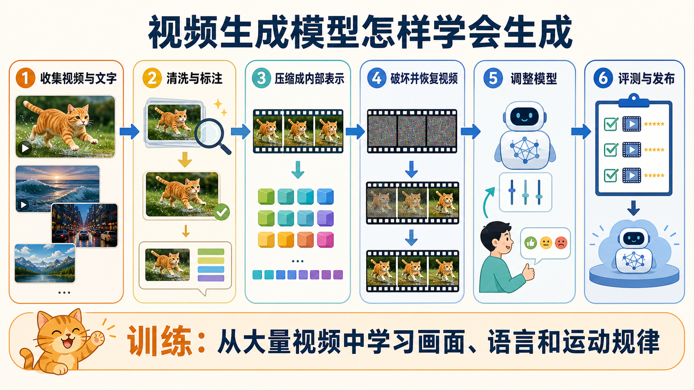
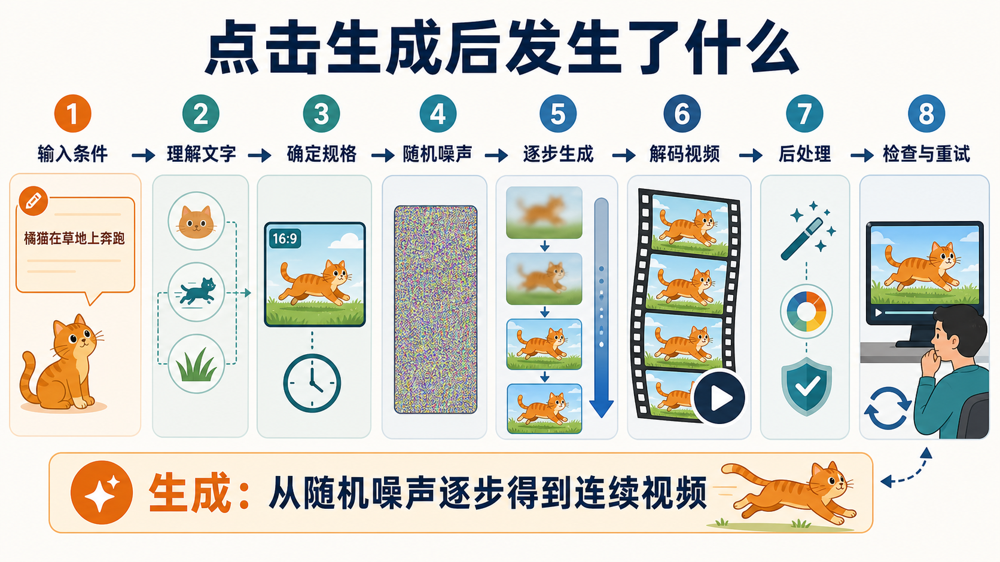
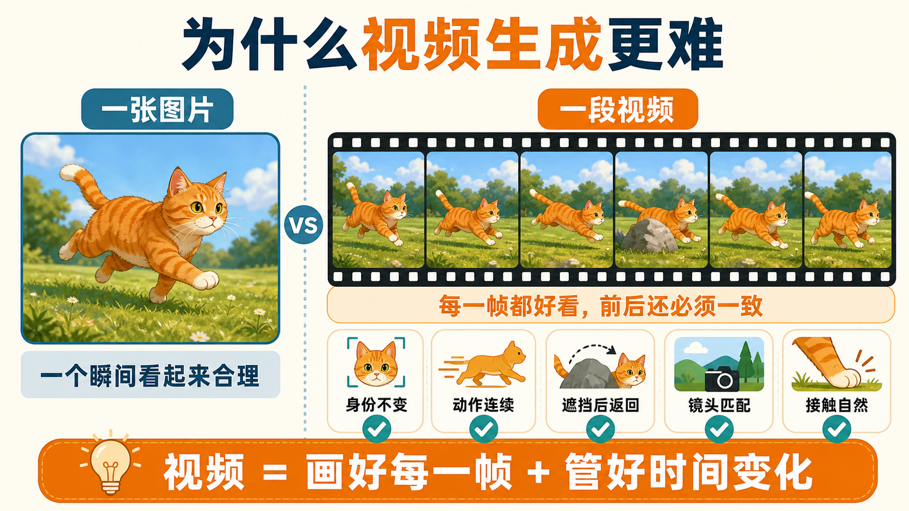
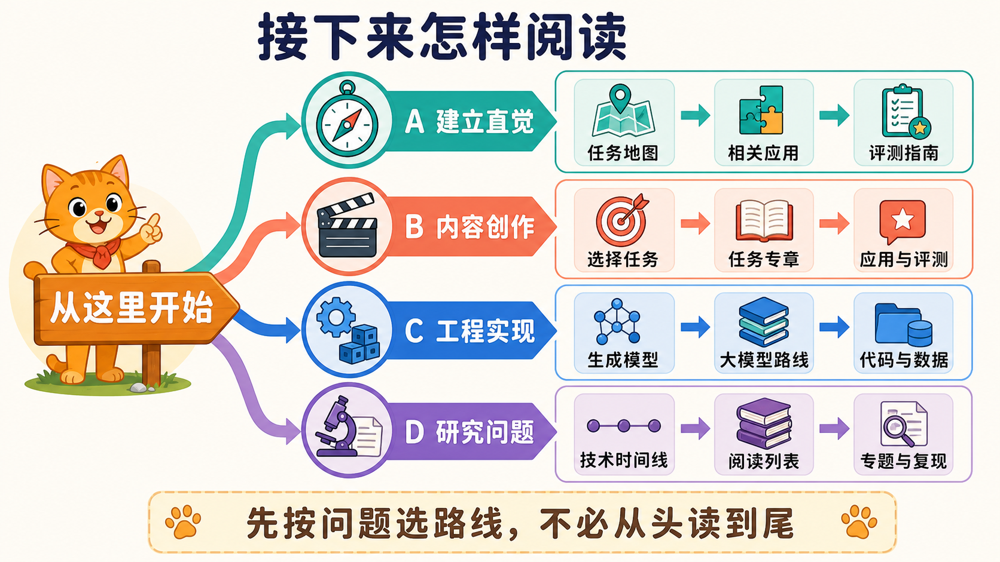

# 零基础入门：一句话怎样变成一段视频

这是一篇写给完全外行的入口。你不需要了解数学、编程或人工智能术语，只需要先记住一句话：

> 视频生成模型先从大量视频中学习“什么东西长什么样、通常怎样运动”，再根据你的文字或图片，从一团随机噪声中逐步做出一段视频。

下面继续用同一个例子：

> 一只橘猫在雨后的草地上奔跑，镜头从侧面跟随。

我们先看模型在生成按钮背后做了什么，再决定这个仓库应该怎样读。

## 一、先分清两个阶段

一段 AI 视频的产生可以分为两个完全不同的阶段：

1. **训练阶段**：模型观看大量已有视频，学习画面、语言和运动规律。这个阶段通常由模型开发者完成，成本很高。
2. **生成阶段**：用户输入一句话、一张图片或一段视频，训练好的模型据此生成新视频。我们平时使用视频产品时看到的是这个阶段。

可以把它类比成学习画画：训练阶段是长期看作品、练习人物和动作；生成阶段是接到“一只猫在草地上奔跑”的要求后，现场完成一幅新作品。

## 二、训练阶段：模型是怎样学会生成视频的



> 先看图建立整体印象：训练不是让模型记住一条视频，而是让它从大量例子中反复学习画面、语言和运动之间的关系。

### 第 1 步：收集视频和说明

模型首先需要大量训练资料，例如人、动物、车辆、自然现象、镜头运动和各种日常活动的视频。视频最好带有标题、字幕或文字说明，模型才能把“橘猫”“奔跑”“侧面跟随”等语言与画面对应起来。

这里会遇到第一个根本问题：互联网上的视频并不是为训练模型拍摄的。说明可能不准确，视频可能被剪辑，也很少记录物体的速度、深度、质量和受力。因此，模型学到的主要是大量视觉规律，而不是一本精确的物理定律手册。

### 第 2 步：清洗和整理资料

训练前通常要删除损坏、重复、低质量或不适合使用的内容，并统一视频的尺寸、时长和帧率。还可能用其他模型补充视频说明，标出主体、动作、镜头、场景和声音。

这一步会直接影响模型最后擅长什么。如果训练资料里有很多近景人物，却很少有复杂机械运动，模型往往更擅长生成人物，而不擅长精确模拟机器。

### 第 3 步：把视频压缩成模型能处理的表示

原始视频非常大。十秒视频包含几百张图片，每张图片又有大量像素。模型通常先用一个“视频压缩器”把它变成更小的内部表示，常被称为 **latent** 或 **token**。

可以把它理解成：模型不逐像素背诵整段视频，而是先写成一份紧凑的内部速记，保留人物、场景、运动和变化所需的信息。

### 第 4 步：反复练习恢复视频

现代视频生成模型常用的训练方法，是故意把视频的内部表示打乱、遮住或加入噪声，再让模型尝试恢复它。模型做错后，训练程序会告诉它误差有多大，并调整内部参数。

经过大量练习，它逐渐学会：

- “橘猫”通常具有哪些外观特征；
- 奔跑时四肢和身体怎样连续变化；
- 草地、雨水和光线如何共同出现；
- 镜头从侧面跟随时，主体和背景应怎样相对移动；
- 文字中的对象、动作和场景怎样组合成视频。

模型并不是把训练视频原样存进去，也不是先写出完整的物理方程。它学到的是一套非常庞大的统计规律，并把这些规律保存在模型参数中。

### 第 5 步：检查、调整和发布

基础训练完成后，开发者还会用更高质量的数据、人工偏好或专门任务继续调整模型，使它更听指令、画面更稳定，并减少不安全内容。之后还要评测画质、动作、文字遵循、物理合理性和生成风险，才能做成用户可以使用的模型或产品。

训练流程可以压缩成：

```text
收集视频与文字
      ↓
清洗、标注和统一格式
      ↓
把视频压缩成内部表示
      ↓
让模型反复练习恢复被破坏的视频
      ↓
用高质量数据和人工反馈继续调整
      ↓
评测并发布模型
```

## 三、生成阶段：点击“生成”之后发生了什么

训练完成后，用户不需要重新教模型。输入一句话并点击生成，通常会经过下面八步。



> 图中的橘猫从头到尾代表同一个生成目标。模型既要理解“猫在奔跑”，也要让它在连续画面中保持同一身份和自然动作。

### 第 1 步：接收你的条件

最常见的输入是文字，但也可以是一张参考图、一段已有视频、人物动作、声音、草图或镜头轨迹。

我们的例子包含四项信息：

- 主体：一只橘猫；
- 动作：奔跑；
- 场景：雨后的草地；
- 镜头：从侧面跟随。

输入不同，任务也不同：只有文字通常叫文生视频；给一张图片让它动起来叫图生视频；修改已有视频则属于视频编辑。

### 第 2 步：理解文字

文字编码器把句子转换成模型内部能使用的数字表示。它不只是查找“猫”这个词，还要尽量保留“谁在做什么、在哪里做、镜头怎样拍”等关系。

如果模型只理解了“猫”和“草地”，却没有理解“奔跑”或“侧面跟随”，最终视频即使漂亮，也没有真正遵循要求。

### 第 3 步：确定视频的基本规格

系统根据用户选择或产品限制，确定视频的时长、画面比例、分辨率和帧率。例如生成一段 5 秒、16:9 的视频。时长越长、尺寸越大，需要同时保持一致的信息越多，生成也通常更困难。

### 第 4 步：从随机噪声或已有画面开始

文生视频通常从一团随机噪声开始，类似满屏没有内容的雪花点；图生视频则会以参考图片的内部表示为起点，同时加入一定噪声，让画面可以发生变化。

随机起点也是为什么同一句话生成两次，结果通常不会完全一样。

### 第 5 步：逐步形成画面和运动

生成模型会进行多轮计算，每一轮都去掉一部分噪声，让视频逐渐清晰：

```text
随机噪声
  → 大致颜色和构图
  → 猫与草地的轮廓
  → 奔跑姿态和镜头运动
  → 毛发、雨水、光影等细节
  → 完整的视频内部表示
```

这里不是先生成一张完美图片，再简单复制成很多帧。视频模型需要同时考虑空间与时间：这一帧中的猫在哪里，下一帧应该移动到哪里，外观是否仍是同一只猫，背景又应怎样随镜头变化。

### 第 6 步：把内部表示还原成视频帧

生成完成的仍是压缩后的内部表示。视频解码器会把它还原成一帧帧可见图像，再按时间顺序组成视频。

压缩能大幅减少计算量，但也可能丢失细小文字、手指、快速运动或精细纹理。这就是有些错误不仅来自“模型没理解”，也可能来自压缩与还原过程。

### 第 7 步：后处理与安全检查

产品可能继续进行放大、补帧、降噪、色彩调整、音频生成、水印或内容安全检查。有些看起来像“模型一次完成”的效果，实际上是多个模块串联的结果。

### 第 8 步：用户检查并再次生成

最终视频不一定第一次就正确。用户需要检查：

- 内容是否出现：是不是橘猫、草地和奔跑？
- 指令是否执行：镜头真的从侧面跟随吗？
- 时间是否连贯：猫的外观、数量和位置有没有突然变化？
- 运动是否自然：脚是否接触地面，有没有滑行、穿透或不合理跳跃？
- 多次是否稳定：换几个随机结果后，成功是常态还是偶然？

如果有问题，最好一次只修改一个条件。例如先补充“全身入镜”，再单独调整“慢速侧面跟拍”。这样才能知道哪项修改真正起作用。

完整生成流程是：

```text
文字 / 图片 / 视频等输入
          ↓
理解输入条件
          ↓
确定时长、尺寸和帧率
          ↓
建立随机噪声或带噪参考画面
          ↓
多轮计算，逐渐生成画面与运动
          ↓
解码为连续视频帧
          ↓
放大、补帧、音频与安全处理
          ↓
用户检查、修改条件、重新生成
```

## 四、为什么视频生成比图片生成难



一张图片只要某个瞬间合理，视频却要求许多瞬间同时合理。

假设视频有 100 帧，模型不仅要画好 100 张图，还要保证：

- 同一只猫在每一帧中仍是同一只猫；
- 奔跑动作连续，而不是每帧随机换姿势；
- 猫被遮挡后再次出现时，外观和位置仍然合理；
- 相机移动、背景变化和主体运动相互匹配；
- 接触、重力、碰撞和材料变化不过分违反常识；
- 几秒前发生的事不会被模型忘记。

因此，清晰度高只是视频生成的一部分。一个视频可以每帧都很好看，却在播放时出现变形、漂移、瞬移或错误因果。

## 五、几个常见误解

### “模型是在数据库里找到一段现成视频吗？”

通常不是。生成模型根据训练中学到的规律，从新的随机起点合成结果。但训练数据仍会影响模型能生成什么，也需要关注版权、隐私和数据来源。

### “模型真的理解物理世界吗？”

模型可以从大量视频中学到常见运动规律，但“看起来合理”不等于掌握了可验证的物理定律。判断物理能力需要改变质量、外力或动作，检查模型是否产生正确的不同结果。专题说明见 [物理一致性的视频生成](physical-consistency.md)。

### “同一句话为什么每次结果不同？”

生成从随机噪声开始，而一句话也可能对应许多合理画面。随机性带来多样性，也意味着不能只用一个最好样例评价模型。

### “视频越长，模型只是多生成一些帧吗？”

不只是。时间越长，模型越容易忘记人物、物体位置和早先事件。长视频还涉及镜头、故事和状态延续，难度会快速增加。

### “视频模型就是 world model 吗？”

不一定。普通视频模型主要生成看起来合理的画面；面向决策的 world model 还要接受动作，保持环境状态，并能预测不同动作的不同后果。具体边界见 [从视频生成到 World Model](world-models.md)。

## 六、现在应该怎样阅读这个仓库

不建议按文件顺序从头读到尾。先建立全流程，再根据自己的问题选择路线。



> 四条路线没有高低之分。先选择与你当前问题最接近的一条，需要时再横向进入其他专题。

### 路线 A：我只想建立完整直觉

1. 读完本页，记住“训练”和“生成”是两个阶段。
2. 阅读 [视频生成的任务地图](taxonomy.md)，了解文字、图片、视频和动作分别能作为怎样的输入。
3. 阅读 [相关应用](applications.md)，把技术任务对应到创作、数字人、机器人等实际用途。
4. 阅读 [评测指南](evaluation.md) 的开头部分，学会区分“画面漂亮”和“能力可靠”。

读完后，你应该能看懂一个视频生成产品在做什么，也能说出它的输入、输出和主要失败。

### 路线 B：我是内容创作者或产品使用者

1. [任务地图](taxonomy.md)：先确定自己需要文生视频、图生视频、视频编辑、数字人、原生音视频还是显式相机/轨迹控制。
2. 对应任务专章：例如 [文生视频](tasks/text-to-video.md)、[图生视频](tasks/image-to-video.md)、[视频到视频](tasks/video-to-video.md)、[数字人](tasks/digital-human.md)、[原生音视频](tasks/native-audio-video-generation.md)或[细粒度可控生成](tasks/controllable-video-generation.md)。
3. [相关应用](applications.md)：了解工作流怎样落到真实场景。
4. [评测指南](evaluation.md)：建立自己的测试提示、失败标签和多次生成协议。

这条路线不要求先学习模型公式。

### 路线 C：我是工程师，想知道模型内部怎样实现

1. [生成模型路线](generative-models.md)：理解 VAE、GAN、Diffusion 和 Flow 的关系。
2. [大模型路线](foundation-models.md)：理解视频压缩、token、Transformer 和基础模型。
3. [视频后训练与对齐](generative-models/video-post-training-alignment.md)：区分 SFT、reward、DPO/RL、推理 guidance 与少步蒸馏。
4. [开放模型与代码](../resources/open-models.md)：选择可以实际运行的模型。
5. [数据集索引](../resources/datasets.md)：了解训练与评测数据。
6. [评测指南](evaluation.md)：设计可重复的比较实验。

建议先理解每种方法解决了什么问题，再进入公式和代码。

### 路线 D：我是研究生，想寻找研究问题

1. [技术时间线](timeline.md)：理解这个领域为什么从运动预测走向 Diffusion 和 world model。
2. [精选阅读列表](reading-list.md)：从最小阅读集开始，不要一开始追求读完所有论文。
3. 选择一个具体轴：长时一致性、控制、物理、效率、评测或交互。
4. 阅读对应专题，例如 [视频预测](tasks/video-prediction.md)、[视频后训练与对齐](generative-models/video-post-training-alignment.md)、[细粒度可控生成](tasks/controllable-video-generation.md)、[原生音视频](tasks/native-audio-video-generation.md)、[物理一致性](physical-consistency.md)或 [World Model](world-models.md)。
5. 用 [引用与代码索引](bibliography.md) 找论文、官方代码和可复现 baseline。

研究时不要只收集“最新模型”。更重要的是明确任务、比较对象、失败条件和验证证据。

## 七、读完本页后应该带走什么

如果暂时只记住五点，就记住这些：

1. 视频模型先从大量视频中学习，再根据用户条件生成新视频。
2. 现代模型通常先在压缩空间中生成，最后才解码为可见画面。
3. 它要同时解决“每帧画得好”和“前后变化正确”两个问题。
4. 画面真实、时间连贯、物理正确和动作可控是不同层次的能力。
5. 阅读本仓库时，先按自己的问题选择路线，不需要从所有算法和论文开始。

下一步，建议完全外行直接进入 [视频生成的任务地图](taxonomy.md)。在那里，你会看到这个领域究竟包含哪些输入、输出和具体任务。
