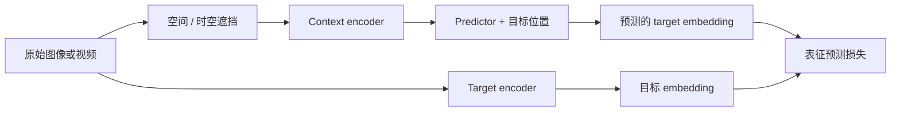
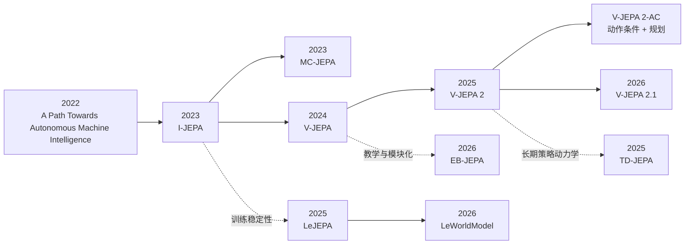

# JEPA 参考阅读：从表征预测到可规划 World Model

JEPA（Joint-Embedding Predictive Architecture，联合嵌入预测架构）的核心主张是：**不要强迫模型预测未来世界的每个像素，而是在表征空间中预测那些稳定、可预测、对理解与行动有用的结构。**

这条路线与 diffusion 视频生成并行发展。Diffusion 追求从条件中还原完整视觉分布；JEPA 首先追求一个适合感知、预测和规划的 latent space。两者都可以处理视频，但优化目标、输出形式和验证方法不同。

> 一句话定位：JEPA 首先是一个自监督预测架构，不是某个固定网络，也不天然等于生成模型或完整 world model。

本章引用的标准 BibTeX、仓库类型与 GitHub Star 快照见 [引用与代码索引](bibliography.md)。

## 1. 核心机制

给定同一观测的上下文部分 $x$ 与目标部分 $y$，JEPA 通常包含三个组件：

- context encoder $f_\theta$：只编码模型可见的上下文；
- target encoder $f_{\bar\theta}$：产生模型需要预测的目标表征；
- predictor $g_\phi$：结合上下文表征和目标位置，预测目标表征。

一个抽象目标可以写为：

\[
z_x=f_\theta(x),\qquad
z_y=f_{\bar\theta}(y),\qquad
\hat z_y=g_\phi(z_x,m)
\]

\[
\mathcal{L}_{\text{pred}} = d\left(\hat z_y,\operatorname{stopgrad}(z_y)\right)
\]

其中 $m$ 表示被遮挡目标的位置或时空坐标，$d$ 可以是 L1、L2 或其他表征距离。实际方法还需要防止所有输入都映射到同一个常数向量的 **representation collapse**。

这与像素生成最关键的差别是：目标 $z_y$ 可以主动忽略纹理噪声、精确光照或其他不可预测细节。模型不必因为“猫毛具体朝哪边”预测错误而受罚，但仍应保留对象、运动、交互和场景结构。

## 2. 主线谱系

| 年份 | 工作 | 主要预测对象 | 历史角色 |
|---:|---|---|---|
| 2022 | [A Path Towards Autonomous Machine Intelligence](https://openreview.net/forum?id=BZ5a1r-kVsf) | 分层抽象状态与行动结果 | 提出以 JEPA、能量模型和分层规划构造自主智能体的研究蓝图 |
| 2023 | [I-JEPA](https://arxiv.org/abs/2301.08243) | 图像中被遮挡区域的 embedding | 证明不重建像素也能学习强图像语义表征 |
| 2023 | [MC-JEPA](https://arxiv.org/abs/2307.12698) | 内容表征与光流 | 将“是什么”和“如何移动”放入共享 encoder |
| 2024 | [V-JEPA](https://arxiv.org/abs/2404.08471) | 视频中缺失时空区域的 embedding | 将 masked latent prediction 系统扩展到视频 |
| 2025 | [V-JEPA 2](https://arxiv.org/abs/2506.09985) | 大规模视频的时空表征 | 从视频表征学习走向物理理解、预测和规划 |
| 2025 | [V-JEPA 2-AC](https://arxiv.org/abs/2506.09985) | 给定动作后的未来 latent | 用少量机器人数据把被动视频预训练连接到动作条件规划 |
| 2026 | [V-JEPA 2.1](https://arxiv.org/abs/2603.14482) | 更密集、更稳定的图像与视频特征 | 用 dense predictive loss、deep self-supervision 等方法强化 dense feature |

## 3. 2022：JEPA 作为自主智能架构蓝图

Yann LeCun 的 [A Path Towards Autonomous Machine Intelligence](https://openreview.net/forum?id=BZ5a1r-kVsf) 不是一篇常规 benchmark 论文，而是一份架构提案。它设想的智能体包含感知、world model、短期记忆、actor、cost 和 configurator，并在多个抽象层级上预测与规划。

这份提案中最重要的判断是：真实世界包含大量不可预测细节。如果模型被要求生成所有细节，它可能把容量浪费在对行动无关的像素上；在抽象表征空间预测，才可能让模型专注于可预测的高层结构。

因此，后来的 I-JEPA 和 V-JEPA 只能算这份蓝图的部分实现：它们验证了 latent prediction 能否学习表征，但并没有一次性实现分层规划、长期记忆、内在成本和完整自主智能体。

## 4. 2023：I-JEPA 证明“预测语义而非像素”可行

[I-JEPA](https://arxiv.org/abs/2301.08243) 从一张图像中采样一个较大的 context block 和多个 target block。context encoder 看不到 target 内容，predictor 根据 context token 和目标位置 token 预测 target encoder 产生的表征。

关键设计包括：

- target block 要足够大，使预测任务偏向对象级语义，而不是局部纹理补全；
- context 要有足够分散的信息，同时不能泄漏 target 像素；
- target encoder 通过 context encoder 的指数滑动平均更新，形成非对称 teacher–student 结构；
- 不使用负样本，也不要求 decoder 重建像素。

I-JEPA 的意义不是“会生成缺失图像”，而是证明 masked prediction 可以在 latent space 中学习可迁移视觉特征。它仍然是**静态图像表征模型**，没有时间、动作和 rollout，不能单独视为决策型 world model。

- Paper：[`assran2023selfsupervised`](../bibliography/references.bib)
- Official code：[facebookresearch/ijepa](https://github.com/facebookresearch/ijepa)（已归档）

## 5. 2023：MC-JEPA 显式连接内容与运动

[MC-JEPA](https://arxiv.org/abs/2307.12698) 处在 I-JEPA 与 V-JEPA 之间。它将自监督内容表征和光流估计放进共享 encoder，希望运动任务帮助模型保留位置与动态，内容任务则帮助运动估计理解对象边界和语义。

它的重要性在于指出：对视频而言，仅学习“帧里有什么”不够；一个有用的预测表征还应编码“什么在移动、朝哪里移动”。不过 MC-JEPA 更接近联合表征与 optical flow 学习，还不是长时间 latent rollout 或动作条件 world model。

- Paper：[`bardes2023mcjepa`](../bibliography/references.bib)
- Code：截至 2026-08 未发现作者公开的论文专属 GitHub 仓库

## 6. 2024：V-JEPA 将目标扩展到时空区域

[V-JEPA](https://arxiv.org/abs/2404.08471) 不再只遮挡二维图像块，而是从视频中遮挡大面积时空区域，让 predictor 根据可见视频上下文预测缺失区域的 latent representation。

V-JEPA 的训练目标有几个重要边界：

- 只使用视频像素，不依赖文本、人工标签、负样本或预训练图像 encoder；
- predictor 输出 feature，不输出 RGB 帧；
- 论文中的可视化像素来自额外训练的 decoder，decoder 不属于 JEPA 预训练目标；
- 主要证据来自 frozen backbone 加轻量 probe 的动作识别、动作预判等任务。

因此，V-JEPA 可以学习运动和时间结构，但它首先仍是 **video representation learner**。没有动作输入时，它不能回答“采取另一个动作会怎样”；没有闭环规划实验时，也不能仅凭 feature prediction 被判定为决策 world model。

- Paper：[`bardes2024revisiting`](../bibliography/references.bib)
- Official code：[facebookresearch/jepa](https://github.com/facebookresearch/jepa)

## 7. 2025：V-JEPA 2 从理解走向预测与规划

[V-JEPA 2](https://arxiv.org/abs/2506.09985) 将被动视频自监督扩展到超过一百万小时的互联网视频与图像数据。它先训练通用 action-free encoder，再通过不同下游接口评估运动理解、动作预判、视频问答和物理推理。

真正让它进入 world model 讨论的是 **V-JEPA 2-AC**：

1. 从 action-free V-JEPA 2 表征开始；
2. 使用少于 62 小时的机器人轨迹视频进行动作条件后训练；
3. 学习给定当前视觉状态和候选动作后的 future latent；
4. 在 latent space rollout 多个候选动作序列；
5. 选择预测 latent 最接近图像目标的动作并执行。

这条路径说明大规模被动视频可以提供视觉先验，而少量带动作数据负责把相关性连接到可干预动力学。但这里仍需区分两部分：**V-JEPA 2 encoder 本身不是动作模型；V-JEPA 2-AC 的 action-conditioned predictor 才承担规划所需的 dynamics。**

- Paper：[`assran2025vjepa2`](../bibliography/references.bib)
- Official code：[facebookresearch/vjepa2](https://github.com/facebookresearch/vjepa2)

## 8. 2026：V-JEPA 2.1 强化 dense feature

[V-JEPA 2.1](https://arxiv.org/abs/2603.14482) 并不是 V-JEPA 3，也不是新的动作条件 world model。它主要改进 V-JEPA 2 的自监督训练 recipe，使表征同时适合全局理解与密集预测：

- **Dense Predictive Loss**：让可见 context token 和 masked token 都参与预测目标；
- **Deep Self-Supervision**：在多个中间层施加自监督信号；
- **Multi-Modal Tokenizers**：统一处理静态图像与视频输入；
- **Model and data scaling**：继续考察架构和数据规模的收益。

它在路线中的角色是提升 encoder 的空间细节和时间一致性，而不是替代 V-JEPA 2-AC 的动作条件规划模块。

- Paper：[`murlabadia2026vjepa21`](../bibliography/references.bib)
- Official code：与 V-JEPA 2 共用 [facebookresearch/vjepa2](https://github.com/facebookresearch/vjepa2)

## 9. 训练稳定性与可规划分支

### LeJEPA：用显式分布约束替代 teacher–student 启发式

[LeJEPA](https://arxiv.org/abs/2511.08544) 重新讨论 representation collapse。它提出 Sketched Isotropic Gaussian Regularization（SIGReg），直接约束 embedding 接近各向同性高斯分布，从而减少 stop-gradient、EMA teacher 和复杂 scheduler 等机制依赖。

它首先解决的是 **JEPA 如何稳定、简洁地学表征**，不是直接解决视频生成。

- Paper：[`balestriero2025lejepa`](../bibliography/references.bib)
- Official code：[galilai-group/lejepa](https://github.com/galilai-group/lejepa)

### LeWorldModel：从 raw pixels 端到端学习 latent dynamics

[LeWorldModel](https://arxiv.org/abs/2603.19312) 将 JEPA prediction 与 SIGReg 用于动作条件 world model。模型从原始像素训练 encoder 和 dynamics，用 future latent prediction 支持 model predictive control，而不需要像素 decoder 参与规划。

这项工作代表另一种通向 world model 的路径：不先训练超大视频 foundation model，再用机器人数据后训练；而是在较小控制环境中从头学习对规划有用的 latent state 与 action dynamics。

- Paper：[`maes2026leworldmodel`](../bibliography/references.bib)
- Official code：[lucas-maes/le-wm](https://github.com/lucas-maes/le-wm)

### EB-JEPA：把架构拆成可复现教学组件

[EB-JEPA](https://arxiv.org/abs/2602.03604) 是 Meta FAIR 发布的轻量库，覆盖图像表征、Moving MNIST 视频多步预测和动作条件导航规划。它的价值不在于刷新大规模 benchmark，而在于用单卡、数小时级实验展示 context encoder、predictor、collapse regularization 和 latent planning 如何连接。

- Paper：[`terver2026lightweight`](../bibliography/references.bib)
- Official code：[facebookresearch/eb_jepa](https://github.com/facebookresearch/eb_jepa)

### TD-JEPA：用 temporal difference 学长期策略动力学

[TD-JEPA](https://arxiv.org/abs/2510.00739) 面向 reward-free offline transitions 和 zero-shot reinforcement learning。它不只做单步 future embedding prediction，而是通过 temporal-difference 目标学习多策略下的长期 latent dynamics，并在测试时适配新的 reward function。

它展示了 JEPA 思想可以从视觉 masked prediction 延伸到 policy-conditioned representation learning，但任务设定与 V-JEPA 的互联网视频预训练不同。

- Paper：[`bagatella2025tdjepa`](../bibliography/references.bib)
- Official code：[facebookresearch/td_jepa](https://github.com/facebookresearch/td_jepa)

## 10. JEPA、视频生成和其他 World Model 的区别

| 路线 | 训练目标 | 模型主要输出 | 是否直接生成像素 | 不确定性表达 | 主要验证方式 |
|---|---|---|---|---|---|
| Video diffusion | 匹配完整视频数据分布 | RGB 或 video latent | 是 | 较强，可采样多个未来 | 画质、文本遵循、运动、人工偏好 |
| Token video model | 预测离散视觉 token | token 序列 | 经 decoder 生成 | 可通过自回归分布表达 | likelihood、FVD、生成质量 |
| I-JEPA / V-JEPA | 预测缺失区域表征 | image / video feature | 否 | 通常不是显式概率分布 | frozen probe、迁移、预测一致性 |
| V-JEPA 2-AC / LeWorldModel | 预测动作后的 future latent | action-conditioned state | 否 | 依实现而定，通常有限 | rollout、MPC、真实任务成功率 |
| Dreamer-style model | 学 latent transition、reward 与 value | stochastic latent state | 可选 decoder | 显式或隐式随机 latent | 样本效率、控制回报、任务成功率 |

三个结论尤其重要：

1. **不生成像素不等于不能建模世界。** 对规划而言，正确的 latent dynamics 可能比逼真的 RGB 更有用。
2. **能预测 feature 不等于已经具备因果动作模型。** 需要动作条件数据和干预测试。
3. **JEPA 与 diffusion 可以组合。** 可以用 JEPA 学状态或评价预测，再用生成 decoder 负责可视化；也可以让生成模型提供数据或视觉先验。

## 11. 应该怎样评测 JEPA World Model

### Representation quality

冻结 encoder，只训练轻量 probe，测试动作识别、动作预判、深度、分割和对象状态等任务。该评测回答“latent 是否有用”，不回答“rollout 是否准确”。

### Latent prediction

在不同预测跨度、遮挡比例和场景分布下计算 feature error，并检查误差是否随 rollout 长度快速累积。

### Action sensitivity

保持当前观测相同，只改变动作；预测 latent 应产生方向正确、幅度合理的差异。

### Goal-conditioned planning

在统一候选动作预算下比较 JEPA planner、无模型策略、oracle simulator 和其他 learned world model 的成功率、规划时间与真实执行次数。

### State sufficiency

通过 linear probe、反事实任务和失败案例检查 latent 是否丢失接触、速度、遮挡对象、关节状态等对控制关键的信息。

### Uncertainty and out-of-distribution behavior

确定性 feature predictor 可能把多个未来平均成一个 latent。需要测试陌生对象、罕见碰撞和不可预测事件，并检查模型是否能表达“不知道”。

## 12. 常见误解

- **“V-JEPA 能生成视频。”** 核心模型预测 latent；论文中的像素可视化依赖额外 decoder。
- **“JEPA 完全不需要防坍塌设计。”** I-JEPA/V-JEPA 使用 EMA target encoder 等非对称机制；LeJEPA/LeWorldModel 则使用显式 embedding regularization。
- **“任何 masked autoencoder 都是 JEPA。”** 如果目标是直接重建像素或 token，它更接近生成式 masked modeling；JEPA 的关键是 target embedding prediction。
- **“V-JEPA 2 就是机器人控制模型。”** 通用 encoder 是 action-free；V-JEPA 2-AC 才加入动作条件 dynamics 和规划。
- **“latent 越抽象越好。”** 如果抽象过程丢掉速度、接触或对象永久性，规划会失败。
- **“闭环成功说明模型理解了完整物理。”** planner 可能只在窄数据分布中有效，仍需跨环境、反事实和 OOD 测试。

## 13. 推荐复现路径

1. **先跑 EB-JEPA 图像示例**：理解 predictor、target encoder 和 collapse regularization。
2. **阅读并运行 I-JEPA checkpoint**：比较 feature prediction 与 pixel reconstruction 的差异。
3. **使用 V-JEPA / V-JEPA 2 预训练模型做 frozen probing**：不要一开始尝试从头复现超大规模训练。
4. **在小型环境运行 EB-JEPA action-conditioned 或 LeWorldModel**：观察 latent rollout 如何进入 MPC。
5. **设计 action intervention 测试**：同一初始状态替换动作，检查模型是否预测正确的反事实结果。
6. **最后再接生成 decoder**：将“规划 latent 是否正确”和“生成画面是否逼真”分开评价。

## 14. 最小阅读集

如果只读六项，建议按这个顺序：

1. [A Path Towards Autonomous Machine Intelligence](https://openreview.net/forum?id=BZ5a1r-kVsf)：理解完整研究设想。
2. [I-JEPA](https://arxiv.org/abs/2301.08243)：理解图像 latent prediction。
3. [V-JEPA](https://arxiv.org/abs/2404.08471)：理解时空遮挡与视频表征。
4. [V-JEPA 2](https://arxiv.org/abs/2506.09985)：理解规模化视频预训练与动作条件后训练。
5. [LeJEPA](https://arxiv.org/abs/2511.08544)：理解 collapse 与训练稳定性的另一种解法。
6. [LeWorldModel](https://arxiv.org/abs/2603.19312)：理解 latent prediction 如何真正进入规划。

论文与仓库核验记录保存在 [JEPA research audit](../sources/papers_20260809_jepa_lineage.md)。
