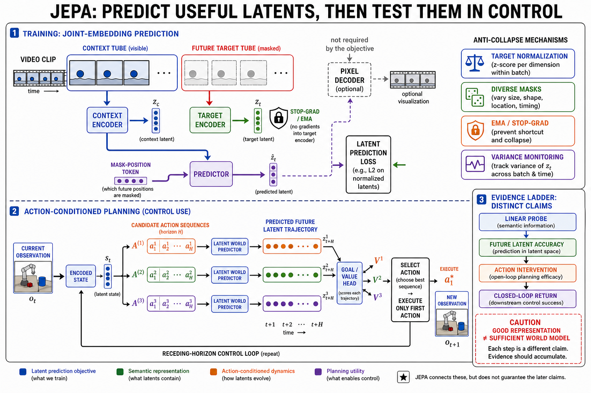

# JEPA：从联合嵌入预测到可规划的潜变量世界模型

> **证据冻结日：2026-08-30。** 本页把 JEPA 当作一类架构合同，而不是某个固定模型名。核心模型预测表征兼容性；只有再加入动作、可滚动动力学、目标或代价、搜索与闭环重规划，才构成可检验的控制型 world model。像素可视化 decoder、生成式导航头和 probe 都是独立模块，不能倒推为基础 JEPA 的能力。

## 1. 先给结论

- **I-JEPA 与 V-JEPA 是非生成式表征学习器。** 它们预测被遮挡图像或视频区域的 target embedding，而不是 RGB；V-JEPA 论文中的像素可视化由另训的条件 diffusion decoder 完成。[[3]](#ref-3), [[4]](#ref-4)
- **V-JEPA 2 与 V-JEPA 2-AC 不是同一个能力层。** 前者是 action-free 视频 encoder；后者冻结视觉 encoder，再用不到 62 小时的 DROID 机器人轨迹训练约 3 亿参数的动作条件 predictor，并以 latent energy、CEM 和 MPC 规划。[[6]](#ref-6), [[7]](#ref-7)
- **V-JEPA 2.1 主要升级 dense representation recipe。** 它不是新的动作模型；机器人结果来自以 2.1 encoder 重训动作 predictor。论文中抓取从 60% 到 80% 的配置同时改变了规划 horizon 与采样数，不能把全部增益单独归因给 encoder。[[9]](#ref-9)
- **高 probe 分数只证明表征可读。** frozen probe、全量 finetune、latent prediction、动作反事实、状态充分性、闭环效用和 OOD 是不同证据，不能把分类或分割成绩外推成“学到了物理规律”。
- **确定性 L1 JEPA 不自动表达多未来。** 原始 V-JEPA 的最优点预测可趋向条件中位数；分支集合、变分 latent 或下游 diffusion 可以表达多模态，但需要 proper score、覆盖率、校准和闭环效用另行验证。[[4]](#ref-4), [[16]](#ref-16), [[17]](#ref-17)

## 2. 精确的 JEPA 训练合同

设完整样本为 `x`，上下文索引为 `C`，目标索引为 `T`，目标位置或掩码查询为 `q_T`。典型 teacher–student JEPA 写成：

```math
z_C=f_\theta(x_C),\qquad
z_T=\mathrm{sg}\!\left(f_{\bar\theta}(x)_{T}\right),
```

```math
\hat z_T=g_\phi(z_C,q_T[,a_{1:H}]),\qquad
\mathcal L_{\mathrm{pred}}
=\frac{1}{|T|}\sum_{i\in T}d(\hat z_i,z_i),
```

```math
\bar\theta\leftarrow \tau\bar\theta+(1-\tau)\theta .
```

方括号里的动作只在 action-conditioned 变体出现。各组件的责任边界如下。

| 组件 | 可见信息与更新方式 | 它不代表什么 |
|---|---|---|
| context encoder `f_\theta` | 只读取未遮挡 context token；由预测损失梯度更新 | 不能看到被遮挡像素，否则发生 target leakage |
| target encoder `f_{\bar\theta}` | 通常读取完整、未遮挡样本，再只抽取 target 位置；输出经 stop-gradient | 不是可训练的 RGB decoder |
| predictor `g_\phi` | 读取 context embedding 和目标时空位置；动作模型还读动作与 proprioception | 不一定是概率分布，也不自动可生成像素 |
| mask / query `q_T` | 指定“预测哪里、何时”；I-JEPA 用大 target blocks，V-JEPA 用大比例时空 multi-block mask | mask 不是缺失内容本身，不能携带目标像素 |
| stop-gradient `sg` | 阻断 target 分支的反向梯度，使在线 encoder/predictor 对齐一个暂时固定的目标 | 单独使用不构成防坍塌定理 |
| EMA target | 用在线 encoder 的指数滑动平均更新 target encoder | 不是独立优化的第二个模型，也不是概率平均 |
| 距离 `d` | I-JEPA 使用 target feature 的 L2 距离；V-JEPA / V2 常用逐 token L1；其他变体可换相似度或 energy | 低 feature error 不等于低像素误差或高控制回报 |

I-JEPA 通过“大目标块 + 空间分散的 context”把任务推向对象级语义；V-JEPA 将 mask 扩展到时空 tube，并在论文配置中遮住约 90% token。target encoder 看完整视频，context encoder 丢弃 masked token，损失只在 target 位置计算。[[3]](#ref-3), [[4]](#ref-4)


**文字替代：** 完整样本分成可见 context 与被遮挡 target；在线 encoder 只看 context，predictor 再接收 target 位置。完整样本由 EMA target encoder 编码，target 输出被 stop-gradient 截断。两路表征在 target 位置比较，梯度只回到在线 encoder 和 predictor，在线权重再以 EMA 更新 target encoder。

### 2.1 “能量”到底是什么

能量模型用一个标量衡量变量之间的兼容性：

```math
E_\psi(x,y)\in\mathbb R,\qquad
\hat y=\arg\min_y E_\psi(x,y).
```

它不要求把所有 `y` 归一化成概率。普通 JEPA 可把 `E=d(g_\phi(z_C,q_T),z_T)` 视作兼容性能量；动作规划则可写成：

```math
E(a_{1:H};z_t,s_t,z_g)
=\left\|P_\phi(z_t,s_t,a_{1:H})-z_g\right\|_1 .
```

低能量只表示“按训练目标更兼容”，不天然等于高概率、已校准置信度或正确物理。要把 energy 当不确定性使用，仍需单独的归一化、校准或 proper-scoring 验证。[[2]](#ref-2), [[6]](#ref-6)

## 3. 与像素生成和控制型 world model 的边界

| 系统 | 训练时主要目标 | 部署时直接输出 | 多未来 | 能否仅凭该模块闭环规划 |
|---|---|---|---|---|
| I-JEPA / V-JEPA | masked target embedding prediction | 图像或视频 feature | 通常为确定性点预测 | 否：没有动作动力学、目标代价和 planner |
| V-JEPA 像素可视化 | 冻结 JEPA 后另训条件 diffusion decoder | 条件 RGB 样本 | decoder 可采样 | 否：只是解释 feature 预测内容 |
| V-JEPA 2 | action-free 视频表征预训练 | 视频 feature | 通常为确定性 encoder | 否：不能回答动作干预 |
| V-JEPA 2-AC | 给定动作与 proprioception 的 future latent | action-conditioned rollout | 基础 predictor 仍为确定性 | 是：需再接 goal energy、CEM 与 MPC |
| V-JEPA 2.1 | masked + visible context 的多层表征预测 | 更密集的 feature | 基础模型无显式分布 | 否：动作头需另训 |
| 像素 / video-latent 生成式 world model | 条件视频分布或视觉 token likelihood | RGB、视觉 token 或可解码 latent | 可通过采样表达 | 只有动作、代价、搜索和闭环都存在时才是 |
| LeWorldModel / EB-JEPA action 示例 | 从动作预测 future state embedding，并约束 latent | 可规划 latent | 依具体 predictor | 是：在各自小规模控制协议内验证 |



**图注：** 上半部分是 representation objective，不要求 RGB decoder；右侧四项是经验性的防坍塌监测与机制。下半部分才加入动作序列、latent world predictor、目标/价值和 receding-horizon control。最右证据阶梯强调：linear probe、future latent accuracy、action intervention 与 closed-loop return 是四项递进声明，JEPA 连接它们，但不自动保证后三级。

**图的顺序化文字替代：**

1. 视频被分成可见 context tube 与 masked target tube；context encoder 产生 $z_C$，EMA target encoder 产生 stop-gradient 的 $z_T$。
2. predictor 使用 $z_C$ 与 mask-position token 预测 $\hat z_T$，latent loss 只比较 $\hat z_T$ 和 $z_T$；可选 pixel decoder 从 $\hat z_T$ 解码可视化，不进入基础目标。
3. 控制阶段把同一当前状态与多条候选动作序列送入动作条件 latent predictor，得到不同 future latent trajectory，再由目标或价值头评分。
4. planner 选择最佳序列，但只执行第一步；真实新观测重新编码后进入下一轮规划。
5. 证据必须从表征可读性、未来 latent 准确性、动作干预逐级累积到闭环回报，不能由上游 probe 跨级替代。

这里最容易混淆的是“latent”。生成模型的 video latent 往往是为了经 decoder 还原 RGB；JEPA latent 的首要合同是保留可预测、可迁移或可规划的信息，并不承诺可逆。二者可以组合，但“同样不在像素空间”并不让它们成为同一种模型。

## 4. 防坍塌：经验非对称与显式分布约束

如果所有输入都映射到同一常数，预测损失也可能很低。不同路线解决的是同一个失败，却有不同保证。

1. **I/V-JEPA 的经验 recipe。** stop-gradient、EMA teacher、predictor 非对称、大范围 mask 与训练调度共同避免平凡解；它们在报告设置中有效，但不是“任意数据与网络都不会坍塌”的数学保证。[[3]](#ref-3), [[4]](#ref-4)
2. **LeJEPA 的 SIGReg。** 该方法以随机一维投影的特征函数约束 embedding 接近各向同性高斯，并把预测与分布正则联合优化；作者在论文假设下给出保证，不再依赖 stop-gradient 或 EMA teacher。保证不能无条件外推到任意动作模型。[[10]](#ref-10)
3. **LeWorldModel 的端到端控制。** encoder 与 action predictor 从像素共同训练，使用 prediction + SIGReg，无预训练视觉 encoder、EMA 或 stop-gradient；证据来自较小控制环境。论文同时承认高维 SIGReg 目标在简单数据上可能弱化，紧凑 latent 也可能丢失规划信息。[[11]](#ref-11)
4. **EB-JEPA 的模块化正则。** 教程库展示 VICReg / SIGReg 等正则及动作条件 Two Rooms；其消融中移除 inverse-dynamics 类正则会破坏随机环境规划，说明“batch 方差不坍塌”与“动作因果可辨”不是同一要求。[[12]](#ref-12)

建议同时记录至少四个健康度量：每维标准差、协方差谱或 effective rank、样本间最近邻多样性、与已知状态变量的可读性。只看训练 loss 无法排除常数解或低秩解。

## 5. Dense feature 与 semantic feature 的真实权衡

原始 masked JEPA 只在被遮挡 target 上给监督，容易偏向全局语义；dense prediction 还需要边界、位置和局部纹理。V-JEPA 2.1 的三项改动是：

- **Dense Predictive Loss：** masked loss 之外，对可见 context token 也预测 target feature；context 权重随其到最近 mask 的时空距离增大而衰减。
- **Deep Self-Supervision：** 融合在线 encoder 的多个中间层，让 predictor 同时对齐 target encoder 的多个层级。
- **Multi-Modal Tokenizer：** 图像用 2D 卷积、视频用 3D 卷积，并加入 modality token，避免把静态图复制成伪视频。

关键消融不是“dense loss 全面更强”：在论文设置中，context loss 令 ADE20K mIoU 从 22.2 升至 33.8，却把 Something-Something-v2 从 72.8 降到 62.5；加入 deep self-supervision 后分别达到 38.6 与 72.1。它证明局部可读性与时序语义会发生竞争，也说明中间层监督是恢复平衡的机制，而非单调扩大模型即可解决。[[9]](#ref-9)

因此应把 probe 拆开报告：

- frozen backbone + 线性或 attentive probe：测“现成表征可读性”；
- 部分或全量 finetune：测“可适配性 + 优化预算”；
- dense head：测空间局部信息；
- action predictor finetune：测动作数据和动力学头的联合结果。

这些协议不能混排成一个总榜。

## 6. 可检验能力里程碑


**文字替代：** 主线从图像 masked embedding、视频时空表征、大规模 action-free encoder、动作条件 rollout，依次进入目标能量、CEM 和 MPC 闭环。V-JEPA 2.1 解决 dense feature；LeJEPA / LeWorldModel 解决另一类稳定训练与端到端控制；TD-JEPA 研究长期策略动力学；Branch-JEPA / Var-JEPA 研究多未来。横向分支没有闭环证据时不能自动升到控制层。

| 可检验能力 | 代表里程碑 | 当时新增证据 | 仍不能声称 |
|---|---|---|---|
| 静态 semantic feature | I-JEPA，CVPR 2023 [[3]](#ref-3) | 非像素 masked prediction；图像 frozen / finetune 迁移 | 时间动力学、动作因果、生成 |
| 内容与运动联合 | MC-JEPA，2023 [[19]](#ref-19) | 内容自监督与 optical flow 共用 encoder | 长 rollout 或控制 |
| 视频时空表征 | V-JEPA，TMLR 2024 [[4]](#ref-4) | 大时空遮挡；frozen video probes；点预测分析 | 动作反事实与规划 |
| 规模化视频先验 | V-JEPA 2，2025 [[6]](#ref-6) | 超过百万小时视频 / 图像预训练；理解与预测 probe | encoder 本身不是动作模型 |
| 真实机器人 latent MPC | V-JEPA 2-AC，2025 [[6]](#ref-6) | DROID 后训练；两实验室的 reach / grasp / pick-place | 跨 embodiment、长时任务或已校准不确定性 |
| 显式分布正则 | LeJEPA，2025 [[10]](#ref-10) | SIGReg 与论文假设下的防坍塌分析 | 自动获得 world-model 能力 |
| 长期策略 latent | TD-JEPA，ICLR 2026 [[13]](#ref-13) | reward-free offline transitions；13 个数据集的 zero-shot reward adaptation | 通用视频生成或真实机器人部署 |
| 单卡教学与动作示例 | EB-JEPA，ICLR 2026 World Models Workshop [[12]](#ref-12) | 图像、视频、Two Rooms 的统一组件 | 大规模 foundation benchmark |
| dense 多层表征 | V-JEPA 2.1，2026 [[9]](#ref-9) | context loss、deep supervision、多模态 tokenizer；dense / semantic 消融 | 基础 encoder 自带 action dynamics |
| 端到端像素到 MPC | LeWorldModel，2026 [[11]](#ref-11) | 小型 action world model；CEM / MPC 与物理 probe | 互联网规模泛化 |
| 轻量单 encoder 视频表征 | LeVJEPA，2026-08 预印本 [[15]](#ref-15) | SIGReg、token dropping、block-causal attention；代码与权重 | 尚无正式会议结论或动作规划 |

DINO-WM 是重要邻近基线：它冻结 DINOv2 patch feature，学习动作条件 latent dynamics，并在六个环境通过动作优化完成 visual goal；它证明“可规划的预训练 feature”并不专属于 JEPA 训练。[[14]](#ref-14)

## 7. 从动作条件预测到 MPC

V-JEPA 2-AC 冻结 V-JEPA 2 ViT-g frame encoder，在少于 62 小时 DROID 轨迹上训练 block-causal predictor。输入含视觉 feature、7D 末端执行器动作与 proprioceptive state；训练包含 teacher-forced 单步预测和两步 rollout loss。部署时，视觉目标编码成 `z_g`，CEM 在固定候选预算内最小化终点 latent 与目标的 L1 energy，只执行首个动作，再用新观测重规划。[[6]](#ref-6)


**文字替代：** 训练环用真实动作序列预测未来 target latent；部署环从当前 latent 和机器人状态出发，用 CEM 反复采样动作序列、latent rollout、按目标 energy 排序，只执行最佳序列第一步。环境的新观测回到 encoder，形成 receding-horizon MPC。

“zero-shot”在这项机器人实验里有严格限定：部署实验室、具体对象和任务没有提供任务奖励或环境特定训练轨迹，但动作模型见过 DROID 的同类 Franka embodiment，且长任务需要人工提供视觉子目标。论文在两个实验室、每项 10 次试验下报告 reach 100%、cup / box grasp 65% / 25%、cup / box pick-place 80% / 65%；这些是小样本协议结果，不是跨机器人通用成功率。[[6]](#ref-6), [[7]](#ref-7)

还应记录系统预算。论文示例中 V-JEPA 2-AC 在 RTX 4090 上以 800 个样本、10 次 CEM iteration、horizon 1 约需 16 秒/动作；该数字依赖硬件与实现，不能当作架构常数。长 horizon 会同时带来 rollout 误差累积与搜索空间爆炸。[[6]](#ref-6)

## 8. 不确定性与多模态未来

基础 V-JEPA 的确定性 L1 predictor 对同一 context 输出一个 target。若未来有多种合理结果，单点目标可能落在表示空间的“折中”位置。可选路线包括：

| 路线 | 表达对象 | 必须补充的验证 |
|---|---|---|
| 多个 latent 分支 + 权重 | Branch-JEPA 用有限 successor set 表示多个结果 [[16]](#ref-16) | Energy Score、分支利用率、覆盖与校准；不能只报 oracle best-of-K |
| 变分 latent | Var-JEPA 以变分目标表达 latent 不确定性 [[17]](#ref-17) | 截至冻结日主要是理论与表格实例，不能外推为视频 / 控制证据 |
| latent diffusion 下游头 | V-JEPA 2.1 导航实验用 conditional diffusion Transformer 生成轨迹 [[9]](#ref-9) | 多样性、可行性、碰撞率与闭环导航；能力归属于下游生成头 |
| 像素 diffusion decoder | V-JEPA 的另训 decoder 将 feature prediction 可视化 [[4]](#ref-4) | 只能解释 feature 中保留的内容，不改变基础 JEPA 目标 |
| ensemble / energy landscape | 多模型或多候选的分歧 | 需校准到真实错误，不能把 energy 数值直接叫概率 |

对控制最危险的不是“画面不够逼真”，而是 predictor 对 OOD 状态过度自信，planner 进一步利用模型误差。应报告 coverage–risk 曲线、模型分歧、动作序列下的误差增长，以及拒绝或回退策略。

## 9. 评测矩阵：每个主张只接受对应证据

| 主张 | 最低协议 | 关键对照与报告项 | 不能由什么替代 |
|---|---|---|---|
| latent 含语义 | 冻结 encoder；线性或固定容量 attentive probe | probe 参数、训练数据、增强、分辨率、5 seeds | 全量 finetune |
| 表征可适配 | 明确 finetune 层数和训练预算 | 同 backbone / 同 optimizer / 同数据 | frozen probe 排名 |
| 能预测未来 latent | horizon 1 / 4 / 8 的 held-out target feature error | persistence、copy-last、action-free、pixel / latent baseline | 动作分类分数 |
| 对动作敏感 | 同一初始状态的配对动作干预 | 动作置换、动作取反、no-action；方向与幅值误差 | 自然视频相关性 |
| latent 状态充分 | frozen readout 预测位置、速度、接触、遮挡对象和 proprioception | 线性与小 MLP 分开；报告不可读变量 | 只报全局分类 |
| 规划有用 | 固定 CEM 样本、iteration、horizon 与墙钟预算的闭环任务 | reactive policy、oracle dynamics、随机 planner、消融 | open-loop feature loss |
| 学到可迁移规律 | 受控 OOD：材质、质量、相机、动力学、embodiment 分开移动 | ID / OOD 差值、置信区间、失败视频 | 单一 benchmark 平均分 |
| 会表达未知 | calibrated likelihood / proper score、coverage–risk 或 ensemble error correlation | 与真实错误校准；拒绝策略 | 原始 L1 energy |

probe 分数只说明某个有限容量读出器能恢复标签。它既可能来自外观捷径，也不要求 predictor 对动作干预、碰撞或长期 rollout 正确。反过来，控制有用的紧凑 latent 也未必在线性语义 benchmark 上最优。证据必须停在实际通过的层级。

## 10. 最小可复现实验与证伪门

下面是一套单机可执行的小型实验设计；具体数值是**预注册示例门槛**，应在看结果前按任务难度固定，而不是文献中的通用阈值。

### 10.1 数据与模型

1. 在可复位的 2D 推物或 Two Rooms 环境采集 5 个随机种子；每个初始状态执行成对的相反动作，保存 RGB、动作、位置、速度、接触和目标。
2. 按场景 seed 划分训练 / ID test；OOD test 分别只改变纹理、相机、对象质量和摩擦，避免把多种 shift 混在一起。
3. 训练同容量的三组模型：EMA + stop-gradient JEPA、去除关键防坍塌组件的 ablation、动作不可见的 predictor。若算力允许，再加 pixel-prediction 或 DINO feature dynamics 基线。
4. 不训练像素 decoder；可视化只使用最近邻 target frame，防止把 decoder 画质误当动力学准确性。

### 10.2 预注册门槛

- **泄漏门：** context 输入中 target token 数必须为 0；用目标区域随机替换后，context embedding 不应变化。失败即停止。
- **坍塌门：** held-out embedding 的 effective rank 至少为 `max(8, 0.1d)`，且每维标准差中位数不得接近数值精度；ablation 应能暴露 loss 低而谱坍塌的反例。失败则不得报告 probe。
- **动作门：** 在配对干预中，预测的状态变化方向准确率至少 80%，并比 no-action / shuffled-action 高至少 15 个百分点，bootstrap 95% CI 不跨 0。失败则只能声称 action correlation。
- **状态门：** frozen linear readout 对位置 / 速度的归一化误差和接触 AUC 必须预先达标；小 MLP 成功而线性失败要单独标注，不能合并。
- **rollout 门：** 同时报 horizon 1 / 4 / 8 的 median、P90 与失败率；若长程改善只来自 teacher forcing，或 closed-loop rollout 显著崩溃，则否定“可滚动动力学”。
- **规划门：** 固定 CEM 预算后，MPC 成功率相对 reactive 与 random-shooting 基线至少提高 15 个百分点，且 95% CI 不跨 0；同时报告真实交互数、墙钟延迟与碰撞。
- **OOD 门：** 每种单因素 shift 都报告相对跌幅；若 feature probe 保持而动作或规划跌幅超过预注册阈值，只保留“表征迁移”声明。

最关键的否证模式是：**frozen probe 很高，但动作置换不改变预测，或 MPC 不优于 no-action baseline。** 这时模型是有用的视觉表征器，却不是已验证的动作 world model。相反，若 pixel 预测更模糊但 latent MPC 更强，应把结论限定为“规划充分”，而不是“生成更真实”。

## 11. 截至冻结日的发布面

| 项目 | 代码 / 权重 / 配置 / 训练评测 | 冻结日核验与边界 |
|---|---|---|
| I-JEPA [[5]](#ref-5) | 官方训练代码、配置、日志和多个 checkpoint | 仓库已 archived；HEAD `52c1ae9`。GitHub API 未给出明确 SPDX，不能仅凭仓库名宣称许可证 |
| V-JEPA [[5]](#ref-5) | 官方预训练 / 评测代码、配置和 checkpoints | HEAD `51c59d5`；像素 decoder 是解释工具，不是基础模型生成接口 |
| V-JEPA 2 / 2-AC [[8]](#ref-8) | V2 300M / 600M / 1B / 1B@384，2-AC checkpoint，训练评测代码与 PyTorch Hub | HEAD `204698b`；仓库说明主体为 MIT，部分文件另列 Apache-2.0 |
| V-JEPA 2.1 [[8]](#ref-8) | 80M / 300M / 1B / 2B@384 的直链权重与配置；同仓库代码 | 2026-03-16 release；README 的 2.1 论文链接仍残留 `arxiv.org/abs/TODO`，应以正式 arXiv 号 2603.14482 为准 |
| 官方 Hugging Face [[18]](#ref-18) | 冻结日 collection 列出 V2 encoder / probe cards | 未列 V2.1 card；这不等于 2.1 未开放，因为官方仓库已有直链权重 |
| LeJEPA / LeWorldModel [[10]](#ref-10), [[11]](#ref-11) | 作者仓库提供代码；LeWorldModel 给 checkpoint / data 链接 | 分别 HEAD `c293d29` / `8edfeb3`；结果协议小于 V-JEPA foundation scale |
| EB-JEPA [[12]](#ref-12) | Apache-2.0 官方教程库与可运行示例 | HEAD `966e61e`；论文是 ICLR 2026 World Models Workshop，不是 ICLR main track |
| LeVJEPA [[15]](#ref-15) | 作者代码和 VideoMix-Large 权重 | HEAD `941526c`；代码总体 MIT，但适配文件与权重另有条款，加载卡要求 `trust_remote_code=True`，应先审计 |

发布面必须拆成五列理解：论文、推理代码、训练代码、权重、数据 / 许可证。存在模型名或项目页不等于五项都开放；GitHub HEAD 也只是冻结日快照，不是永久版本。

## 12. 研究问题与阅读顺序

### 仍未解决

1. 什么 latent 粒度能同时保留语义、接触与速度，又不把不可预测纹理带入规划？
2. 大规模被动视频提供的是视觉先验，还是可经少量交互可靠转化的动作因果结构？
3. 如何把多模态 successor、校准 uncertainty 与实时 MPC 结合，而不让搜索成本爆炸？
4. 如何区分“planner 利用模型漏洞”与“模型学到可迁移规律”？
5. 跨相机、实验室、embodiment 与长任务时，成功率如何随 shift 逐项退化？

### 最小阅读顺序

1. 蓝图与能量定义：LeCun 2022、energy-based learning tutorial。[[1]](#ref-1), [[2]](#ref-2)
2. 表征机制：I-JEPA、V-JEPA。[[3]](#ref-3), [[4]](#ref-4)
3. 动作与规划：V-JEPA 2 / 2-AC、DINO-WM。[[6]](#ref-6), [[14]](#ref-14)
4. dense / collapse：V-JEPA 2.1、LeJEPA。[[9]](#ref-9), [[10]](#ref-10)
5. 小型可复现 world model：EB-JEPA、LeWorldModel。[[12]](#ref-12), [[11]](#ref-11)
6. 长期与多未来：TD-JEPA、Branch-JEPA、Var-JEPA。[[13]](#ref-13), [[16]](#ref-16), [[17]](#ref-17)

检索式、纳排理由、版本快照、逐项来源和负面核验见 [JEPA research audit](../sources/research_20260830_jepa.md)。

## 参考文献

<a id="ref-1"></a>[1] Yann LeCun. [A Path Towards Autonomous Machine Intelligence](https://openreview.net/forum?id=BZ5a1r-kVsf). OpenReview working paper, v0.9.2, 2022.

<a id="ref-2"></a>[2] Yann LeCun, Sumit Chopra, Raia Hadsell, Marc'Aurelio Ranzato, Fu Jie Huang. [A Tutorial on Energy-Based Learning](http://yann.lecun.com/exdb/publis/pdf/lecun-06.pdf). Predicting Structured Data, 2006.

<a id="ref-3"></a>[3] Mahmoud Assran et al. [Self-Supervised Learning from Images with a Joint-Embedding Predictive Architecture](https://openaccess.thecvf.com/content/CVPR2023/html/Assran_Self-Supervised_Learning_From_Images_With_a_Joint-Embedding_Predictive_Architecture_CVPR_2023_paper.html). CVPR, 2023.

<a id="ref-4"></a>[4] Adrien Bardes et al. [Revisiting Feature Prediction for Learning Visual Representations from Video](https://openreview.net/forum?id=QaCCuDfBk2). TMLR, 2024. [arXiv:2404.08471](https://arxiv.org/abs/2404.08471).

<a id="ref-5"></a>[5] Meta FAIR. I-JEPA official repository [](https://github.com/facebookresearch/ijepa); V-JEPA official repository [](https://github.com/facebookresearch/jepa). Accessed 2026-08-30.

<a id="ref-6"></a>[6] Mahmoud Assran et al. [V-JEPA 2: Self-Supervised Video Models Enable Understanding, Prediction and Planning](https://arxiv.org/abs/2506.09985). arXiv, 2025. [Meta research page](https://ai.meta.com/research/publications/v-jepa-2-self-supervised-video-models-enable-understanding-prediction-and-planning/).

<a id="ref-7"></a>[7] Meta AI. [V-JEPA 2: A world model for physical reasoning](https://ai.meta.com/blog/v-jepa-2-world-model-benchmarks/). Official project / release article, 2025.

<a id="ref-8"></a>[8] Meta FAIR. V-JEPA 2, V-JEPA 2-AC and V-JEPA 2.1 official repository [](https://github.com/facebookresearch/vjepa2). Accessed 2026-08-30.

<a id="ref-9"></a>[9] Lorenzo Mur-Labadia et al. [V-JEPA 2.1: Unlocking Dense Features in Video Self-Supervised Learning](https://arxiv.org/abs/2603.14482). arXiv, 2026.

<a id="ref-10"></a>[10] Randall Balestriero, Yann LeCun. [LeJEPA: Provable and Scalable Self-Supervised Learning Without the Heuristics](https://arxiv.org/abs/2511.08544). arXiv, 2025. Official repository [](https://github.com/galilai-group/lejepa).

<a id="ref-11"></a>[11] Lucas Maes et al. [LeWorldModel: Stable End-to-End Joint-Embedding Predictive Architecture from Pixels](https://arxiv.org/abs/2603.19312). arXiv, 2026. Official repository [](https://github.com/lucas-maes/le-wm).

<a id="ref-12"></a>[12] Basile Terver et al. [A Lightweight Library for Energy-Based Joint-Embedding Predictive Architectures](https://openreview.net/forum?id=ZVAMdXGCUC). ICLR 2026 Workshop on World Models. Official repository [](https://github.com/facebookresearch/eb_jepa).

<a id="ref-13"></a>[13] Marco Bagatella et al. [TD-JEPA: Latent-predictive Representations for Zero-Shot Reinforcement Learning](https://openreview.net/forum?id=SzXDuBN8M1). ICLR, 2026. Official repository [](https://github.com/facebookresearch/td_jepa).

<a id="ref-14"></a>[14] Philippe Hansen-Estruch et al. [DINO-WM: World Models on Pre-trained Visual Features Enable Zero-shot Planning](https://arxiv.org/abs/2411.04983). ICML, 2025. Official repository [](https://github.com/gaoyuezhou/dino_wm).

<a id="ref-15"></a>[15] Andreas Kuhn et al. [LeVJEPA: A Lean Video Joint-Embedding Predictive Architecture without the Heuristics](https://arxiv.org/abs/2608.27395). arXiv preprint, submitted 2026-08-27. Official repository [](https://github.com/MLO-lab/LeVJEPA); [official model card](https://huggingface.co/galilai-group/LeVJEPA-VideoMix-Large).

<a id="ref-16"></a>[16] [Branch-JEPA: Branching Joint-Embedding Predictive Architectures](https://arxiv.org/abs/2607.05238). arXiv preprint, v2, 2026.

<a id="ref-17"></a>[17] [Var-JEPA: Variational Joint-Embedding Predictive Architectures](https://arxiv.org/abs/2603.20111). arXiv preprint, 2026.

<a id="ref-18"></a>[18] Meta. [V-JEPA 2 official Hugging Face collection](https://huggingface.co/collections/facebook/v-jepa-2); [V-JEPA 2 ViT-H model card](https://huggingface.co/facebook/vjepa2-vith-fpc64-256). Accessed 2026-08-30.

<a id="ref-19"></a>[19] Adrien Bardes, Jean Ponce, Yann LeCun. [MC-JEPA: A Joint-Embedding Predictive Architecture for Self-Supervised Learning of Motion and Content Features](https://arxiv.org/abs/2307.12698). arXiv preprint, 2023.
