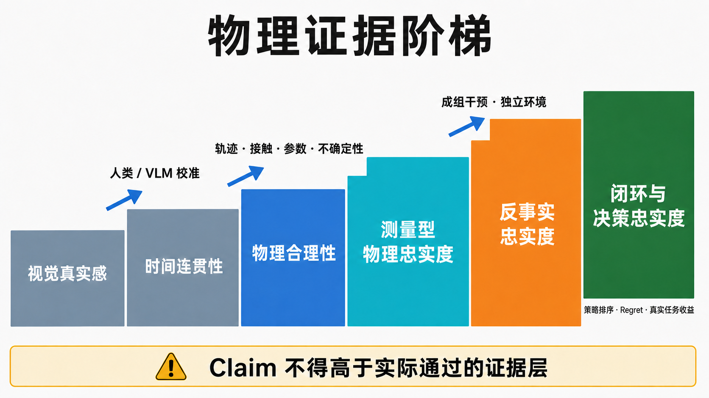
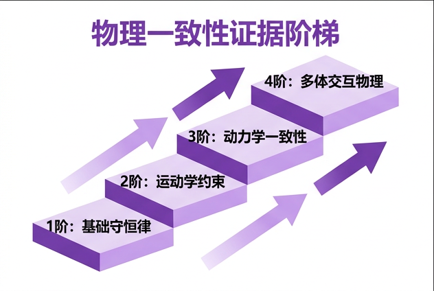
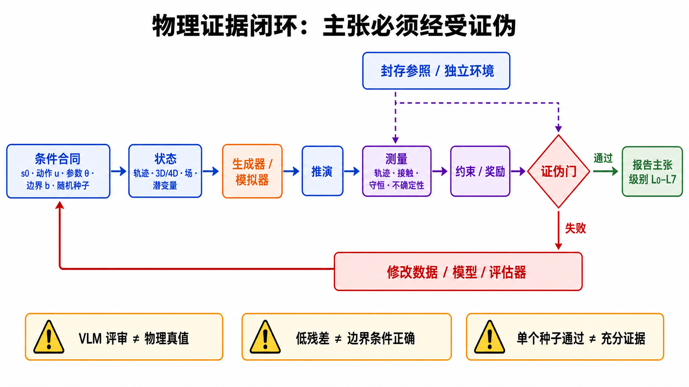
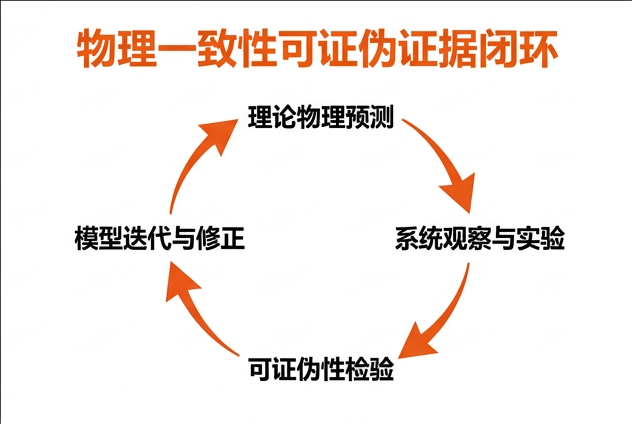
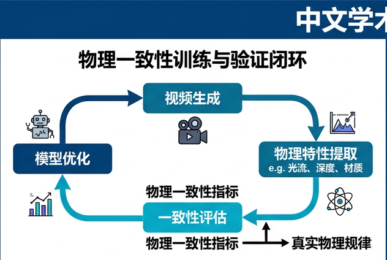

# 物理一致性的视频生成

> 一手来源审计截至 **2026-08-30**。本文把视觉真实感、时间连贯性、物理合理性、物理一致性、物理忠实度和决策忠实度分开；所有 2026 年未正式发表的工作均按预印本解释，不把作者自报结果当作独立复现。

视频生成中的“物理一致性”不是让画面看起来足够真实，而是让对象、材料和环境在时间演化中遵守可检验的约束：物体应当持续存在，接触应当产生合理后果，运动应当与重力、惯性、碰撞、摩擦和材料属性相符，同一初始状态在不同外力或动作下还应产生正确的不同未来。

本页讨论的是 **physically consistent / physics-grounded video generation**。它与一般的时间连贯性、视频预测和 world model 相邻，但并不等同。

## 1. 最小定义

普通条件视频生成通常建模：

```math
p(x_{1:T}\mid c),
```

其中 $c$ 可以是文本、图像或已有视频。物理一致性生成还希望输出满足某组物理约束 $\mathcal{C}$：

```math
x_{1:T}\sim p_\theta(x_{1:T}\mid c),\qquad
\mathcal{C}(x_{1:T},z_{1:T},u_{1:T})\approx 0.
```

- $x_{1:T}$：最终可见的视频帧；
- $z_{1:T}$：几何、质量、速度、材质等显式或隐式状态；
- $u_{1:T}$：外力、相机、用户或智能体动作；
- $\mathcal{C}$：接触、动力学、守恒、材料响应或场景边界等约束。

关键难点在于：仅从 RGB 帧通常无法唯一恢复质量、摩擦系数、深度和外力；同一个开头也可能对应多个合理未来。因此，目标不是逐像素复现唯一答案，而是在条件允许的范围内生成 **物理可行、状态连续且与控制相符** 的未来。

若目标提升到“物理忠实度”，还需要一个声明清楚的参照系统：

```math
s_{t+1}=F(s_t,u_t,\theta,b,\xi_t),
\qquad
y_t=H(s_t,v)+\epsilon_t,
```

- $s_t$：位置、速度、姿态、形变、温度或场变量；
- $u_t$：力、机器人控制、车辆控制或其他干预；
- $\theta$：质量、摩擦、恢复系数、刚度、黏度等物性；
- $b$：支撑、容器、接触和其他边界条件；
- $v$：相机与成像条件；
- $\xi_t,\epsilon_t$：过程随机性和测量噪声。

视频模型输出 $\hat{x}_{1:T}$ 后，评测器通过测量算子 $M_k$ 提取轨迹、接触或场量。归一化误差可写成：

```math
E_k=
\frac{d_k\!\left(M_k(\hat{x}_{1:T}),y^*_{k,1:T}\right)}
{\sigma_k+\varepsilon},
```

其中 $y^*_{k,1:T}=M_k(x^*_{1:T})$ 表示从标定真实系统或高可信模拟参照中取得的第 $k$ 类观测量，$\sigma_k$ 是参照和测量链的不确定性。只有同时报告单位、时间尺度、相机标定、测量覆盖率和误差条带，结果才接近 **fidelity**，而不只是“看起来 plausible”。

## 2. 必须分清的六个层次

| 层次 | 操作性问题 | 最低证据 | 仍不能声称什么 |
|---|---|---|---|
| 视觉真实感 `visual fidelity` | 单帧或局部外观是否接近照片/参考 | 人评、图像质量、参考相似度 | 时序或动力学正确 |
| 时间连贯性 `temporal coherence` | 身份、纹理、几何是否连续 | 长时跟踪、时序指标、人评 | 接触、守恒和参数正确 |
| 物理合理性 `physical plausibility` | 观察者是否认为“可能发生” | 人类/VLM rubric、逐规则违规 | 唯一动力学、参数恢复、可控响应 |
| 物理一致性 `physical consistency` | 生成状态是否内部自洽并满足已声明约束 | 对象持续、接触、约束残差、事件顺序 | 与指定现实系统数值一致 |
| 物理忠实度 `physical fidelity` | 给定初态、动作、物性和边界，预测是否在不确定性内匹配标定参照 | 轨迹、接触、参数、场量和成组反事实 | 一定对规划有用或现实部署安全 |
| 决策忠实度 `decision fidelity` | 模型是否保持动作后果、策略排序、回报与风险 | 闭环 rollout、regret、policy ranking、真实成功率 | 开放世界全域的物理完备性 |

一条形状正确但重力加速度错误的抛物线，可以“合理”却不“忠实”；一个轨迹误差很小的模型，也可能在稀有但决策关键的状态上给出错误策略排序。层次之间不能靠术语自动升级。



**图 1：Claim 不得高于证据。** 图中的阶梯不是“模型自然会一路升级”，而是每升一级都多一个独立验证 gate。PNG 将 L0、L1、L2、L3、L4 和 L5–L7 六个宏台阶画在一起；下面的可编辑版本把最后一个宏台阶继续拆成可执行性、决策忠实度和真实效用，因此共有 L0–L7 八级。全文只使用这套 L0–L7 编号。


顺序化文字替代：外观与平滑只到 L1；开放域人/VLM 常识判断到 L2；有标定状态和程序测量才到 L3；系统改变动作或参数并得到正确差分到 L4；独立环境持续执行到 L5；策略排序、regret 和真实收益分别推进到 L6–L7。

## 3. 物理一致性具体包含什么

### 3.1 对象与空间状态

- 对象在遮挡前后保持身份、数量、形状和位置关系；
- 刚体不应无故变形、合并、消失或穿透；
- 相机运动不能被误当作物体运动；
- 2D 画面中的运动应与隐含的 3D 几何和深度相容。

### 3.2 运动与接触

- 无外力时速度变化应有原因；
- 重力、支撑、摩擦和阻力的方向与尺度应合理；
- 碰撞发生在正确的接触时刻和位置，并产生符合质量、速度和恢复系数的后果；
- 多对象因果链应按正确顺序传播，而不是只生成“碰撞风格”的视觉效果。

### 3.3 材料与连续介质

- 软体、布料、头发应呈现与刚度、弹性和约束相符的形变；
- 液体应保持大致体积连续，正确处理流动、飞溅和容器边界；
- 烟、火等现象需要兼顾输运、扩散、浮力和外部环境；
- 透明、反射、折射和阴影的变化要与几何、材质和光照相容。

### 3.4 守恒与因果

- **先声明系统边界。** 开放系统或存在外力时，总动量可以改变；应比较动量变化与外部冲量，而不是机械要求零残差。
- **区分机械能与总能量。** 有摩擦、阻尼和塑性时，机械能会转化为热或不可逆形变；“机械能不守恒”不一定是错误。
- **不要把外观代理偷换成物理量。** RGB 中对象外观稳定只支持对象持续，不能直接证明质量守恒；2D 面积稳定也不是流体体积守恒。
- 原因必须先于结果，接触点、受力对象和运动方向应匹配；改变初始速度、材质、外力或动作时，结果应以可解释方式变化。
- 对不可观测属性或随机事件，模型应表达不确定性，而不是始终给出一个过度自信的唯一未来。

| 约束类型 | 示例 | 合适检查 | 常见误用 |
|---|---|---|---|
| 硬等式 | 刚体长度、不可压缩体积、无源连续性 | 几何/体积/PDE 残差 | 把像素身份稳定当质量守恒 |
| 接触互补与不等式 | 不穿透、法向力非负、接触/分离互斥 | 接触时刻、signed distance、冲量 | 只看慢动作是否平滑 |
| 动量与能量账 | 外力冲量、碰撞、功、热、耗散 | 指定系统边界内的残差 | 要求有摩擦时机械能也不变 |
| 随机/统计规律 | 飞溅、湍流、材料微结构 | 分布、覆盖率、校准 | 要求逐像素复现唯一未来 |
| 学习先验 | 人体动作、复杂材料响应 | OOD、干预、失败覆盖 | 将高似然解释成物理定律 |
| 决策约束 | 动作可执行、避碰、完成任务 | 闭环成功、regret、安全 | 用 FVD 代替控制效果 |

## 4. 七条主要技术路线

### 4.1 从大规模视频中隐式学习

大型 T2V/I2V 模型通过预测视频分布，能够学到重力、运动和常见交互的统计规律。优点是开放域覆盖广、视觉质量高；缺点是互联网视频很少提供质量、力、摩擦和 3D 状态标签，模型容易学会“看起来像物理”的相关性，而非可干预的动力学。

这条路线适合建立强视觉先验，但规模增长本身并不能保证守恒、罕见碰撞和分布外材料行为正确。VideoPhy、PhyGenBench 与 VideoPhy-2 都观察到，较强的视频模型仍会在物理专项测试中显著失败 [[1]](#ref-1), [[2]](#ref-2), [[3]](#ref-3)。

### 4.2 物理感知的提示、规划与推理

先让 LLM/VLM 把文本条件展开为对象、阶段、轨迹和物理规则，再用这些中间条件引导视频模型。PhyT2V 通过物理规则生成与迭代自修正改善现有 T2V 模型 [[4]](#ref-4)；VLIPP 使用视觉—语言模型规划粗粒度运动，再将轨迹或变化交给视频扩散模型 [[5]](#ref-5)。

这类方法无需重训完整基础模型，适合快速增强和 OOD 提示；但语言推理只能提出约束，不能保证生成器逐帧执行正确，也难以精确处理连续接触、流体和多物体耦合。

### 4.3 轨迹、几何与结构条件

将点轨迹、光流、深度、分割、姿态、场景图或 3D 表示作为生成条件，可以把“往哪里运动”和“长什么样”部分解耦。结构控制能减少瞬移、穿透和对象漂移，也是连接视觉生成与显式模拟的常用接口。

它的上限取决于中间表示：稀疏轨迹无法表达材料形变，错误深度会把物理误差传给生成器，而满足几何约束也不等于满足力学规律。

### 4.4 显式物理模拟器与生成模型结合

先从图像估计几何、材质和物理参数，在刚体、软体或流体模拟器中计算状态，再由视频生成模型负责渲染、补全和视觉细化。PhysGen 在图像空间中组合场景理解、刚体模拟和视频扩散 [[6]](#ref-6)；PhysGen3D / MiniTwin 将单图重建为可交互的 3D 小世界，再根据速度、材质等初始条件模拟 [[7]](#ref-7)。

这条路线的优势是约束明确、可控且容易做反事实；瓶颈是单图 3D 与物性估计不适定，模拟器覆盖的规律有限，并且模拟结果与生成渲染之间仍可能不一致。

### 4.5 物理状态与视觉 latent 联合建模

模型不一定显式输出完整的质量、速度和力，也可以学习一个对动力学有用的物理 latent，并让它与视频 latent 共同演化。PHANTOM 将潜在物理状态预测直接纳入视频生成 [[8]](#ref-8)。这一路线的设计动机，是在纯像素建模与完整 3D 重建之间建立状态瓶颈；是否真的更易保持动力学、同时保留更强灵活性，仍需在统一数据、参数量和协议下做对照。

风险在于 latent 的语义可能不可辨认：在测试分布内表现好，不代表它真正编码了可迁移的物性。需要用属性干预、反事实 rollout 和 OOD 组合来验证。

### 4.6 物理监督、奖励优化与闭环校正

使用模拟数据提供可控物性标签，或以物理检测器、VLM 裁判、可微模拟器和守恒残差作为训练奖励。其一般形式可以写为：

```math
\mathcal{L}=\mathcal{L}_{\text{video}}
+\lambda_{s}\mathcal{L}_{\text{state}}
+\lambda_{c}\mathcal{L}_{\text{constraint}}
+\lambda_{r}\mathcal{L}_{\text{reward}}.
```

视觉损失维持画质，状态损失监督轨迹或物性，约束损失惩罚物理违规，奖励项则鼓励最终视频通过专项评测。2026 年的 PhyCo 进一步用系统变化的摩擦、恢复系数、形变和外力数据训练可控物理先验 [[9]](#ref-9)。这一路线可扩展，但必须防止模型投机自动裁判，并检查模拟到真实的迁移。

后训练和推理时对齐在 2025–2026 年迅速分化为几类：PISA 用窄自由落体模拟数据做 SFT/reward 诊断 [[35]](#ref-35)；NewtonRewards 用光流和外观特征构造可验证奖励 [[27]](#ref-27)；Inference-time Physics Alignment 以 latent world-model reward 搜索多条去噪轨迹 [[28]](#ref-28)；NS-Diff 把 jerk 和简化流体 divergence 用于 RL [[29]](#ref-29)；DynamicsBoost 从共享真实 prefix 的 continuation 构造无需人工标签的偏好 [[30]](#ref-30)；PhyWorld 2026 则把续写 fine-tune 与 physics-preference DPO 分成两阶段 [[31]](#ref-31)。这些作者实验表明，特定代理能够改善相应任务或指标，但尚不证明代理可普遍提升 physical fidelity：低 jerk 不等于受力正确，低 divergence 也不等于完整 Navier–Stokes；训练代理必须由独立程序测量和人评复核。

### 4.7 动作条件与闭环系统

动作条件是从视频生成走向 World Model 的必要条件，但“动作”至少有四种不同语义：相机/ego 控制、从视频聚类出的 latent action、语言事件，以及具有单位和执行器约束的连续机器人/车辆动作。可检验性不由类别名称决定：相机/ego 控制若接口与单位明确就是干预，latent action 若有冻结映射和对照也可测试；反过来，语言事件若没有可重复的执行语义并不自动成为标定干预。真正的判据是动作语义、环境到条件的映射、单位与执行器约束、重复性，以及是否能构造成组反事实。

V-JEPA 2-AC 用少量无标签机器人视频后训练 action-conditioned latent model，并在实验室 Franka image-goal pick-and-place 中做规划验证 [[32]](#ref-32)；DreamZero 联合建模视频与动作并报告真实机器人闭环 [[33]](#ref-33)；GenieDrive 以控制 → 4D occupancy → 多视角视频建立驾驶状态瓶颈 [[41]](#ref-41)；RoboWM-Bench 则把生成行为经 inverse dynamics/retargeting 转成动作，在重建仿真环境执行 [[18]](#ref-18)。

这些证据仍需拆开：world model、inverse dynamics、action retargeting、planner、simulator 和执行器都可能造成最终成功或失败。仿真可执行性不是现实可执行性，视频质量也不能替代 collision、regret、任务成功与安全约束。

### 4.8 2024–2026 技术路线对照

| 路线 | 代表工作 | 物理注入位置 | 2024–2026 推进 | 最关键瓶颈 |
|---|---|---|---|---|
| 隐式 scaling | Video foundation models、PhyWorld scaling [[11]](#ref-11) | 数据与模型规模 | 分开 ID、组合和物理 OOD | 常见相关性不等于 OOD 定律 |
| 语言/事件规划 | PhyT2V、VLIPP、CoECT [[4]](#ref-4) [[5]](#ref-5) [[36]](#ref-36) | 生成前规则、事件链、粗轨迹 | 从孤立规则推进到 event-centric causal chain | 文字规划不能强制连续动力学 |
| 轨迹/物性控制 | PhysCtrl、PhyCo、Goal Force [[26]](#ref-26) [[9]](#ref-9) [[38]](#ref-38) | 3D 轨迹、property map、force vector | 可扫描摩擦、恢复、形变与外力 | 合成域差和参数响应未标定 |
| 显式模拟 + 生成 | PhysGen、PhysGen3D、PSIVG [[6]](#ref-6) [[7]](#ref-7) [[37]](#ref-37) | geometry → system ID → solver → renderer | 从 2D 刚体推进到 3D/4D test-time loop | 每一阶段误差会传递；求解器可能精确地错 |
| 动态 3D/4D 表示 | PhysGaussian、PhysDreamer、PhysFlow、WonderPlay、TRACE [[21]](#ref-21) [[22]](#ref-22) [[23]](#ref-23) [[24]](#ref-24) [[25]](#ref-25) | 3D Gaussian、MPM、可微反演 | 视觉先验与 system identification 融合 | 单目可辨识性、材料/求解器覆盖 |
| Physics latent | PHANTOM、physics probe、LDR [[8]](#ref-8) [[40]](#ref-40) [[39]](#ref-39) | 视频 latent 或结构化动力学 latent | 可读物理子空间、低阶积分 + residual | probe 可读不等于模型因果使用 |
| 后训练/推理时验证 | PISA、NewtonRewards、NS-Diff、WMReward [[35]](#ref-35) [[27]](#ref-27) [[29]](#ref-29) [[28]](#ref-28) | SFT、DPO/RL、candidate search | 用 verifiable proxy 修基础模型 | reward hacking、代理偷换、计算成本 |
| 动作条件 / 闭环 | V-JEPA 2-AC、DreamZero、GenieDrive [[32]](#ref-32) [[33]](#ref-33) [[41]](#ref-41) | action-conditioned transition / 4D state | 分开报告条件生成、规划和实际闭环证据 | 不能把 action-conditioned 视频自动写成已验证闭环；仍有 embodiment、真实风险与独立复现问题 |

显式模拟路线应始终按以下链条分别做消融：

```text
geometry → system identification → solver → renderer/generator → measurement
```

只报告最终视频偏好，无法判断改进来自更正确的物理、较好的纹理，还是更有利的相机视角。

## 5. 数据应该怎样构建

| 数据来源 | 能提供什么 | 主要缺口 |
|---|---|---|
| 互联网视频 | 外观和开放世界事件覆盖 | 缺少状态、力和反事实；剪辑与相机偏差严重 |
| 实验室真实视频 | 可校准的碰撞、材料和测量 | 场景窄、采集昂贵 |
| 物理模拟数据 | 精确状态、物性和成组干预 | sim-to-real 外观与动力学差距 |
| 游戏与机器人日志 | 动作—状态—后果和闭环数据 | embodiment 与环境分布有限 |
| 人工规则与偏好 | 可覆盖常识和开放域错误 | 标注主观，难以精确测量连续动力学 |

理想数据不是大量互不相关的漂亮视频，而是 **成组实验**：保持场景不变，系统改变质量、摩擦、初速度、外力或动作；同时保存 RGB、深度、对象 mask、轨迹、接触、物性和状态。只有这样，模型才较难靠背景和文本捷径猜答案。

### 5.1 数据单元应是“干预组”，不是孤立 clip

一个最小干预组应共享 `scene_id`、相机、对象外观和随机种子集合，只改变一个目标变量。刚体可以扫描质量、初速度、摩擦和恢复系数；软体需刚度、阻尼、边界固定点；流体需黏度、密度、入口/出口和容器边界。若同时改变背景、prompt 和物性，就无法把结果差异归因到物理变量。

建议保存：

```yaml
intervention_group:
  group_id:
  fixed:
    scene_geometry_hash:
    camera_calibration:
    object_identity_and_texture:
    prompt_template:
  varied:
    control_u:
    physical_parameters_theta:
    boundary_conditions_b:
  observations:
    rgb_video:
    depth_and_masks:
    object_pose_and_tracks:
    contacts_and_forces:
    mesh_or_field_state:
  provenance:
    real_or_simulator:
    simulator_and_solver_version:
    units_and_time_step:
    measurement_uncertainty:
    random_seed:
```

### 5.2 训练、开发和评测必须按物理组划分

划分单位应是对象/场景/参数族/事件组，而不是随机 clip。否则同一模拟场景的小幅参数变化会同时进入 train/test，造成近重复泄漏。至少准备四种切片：

1. **ID：** 已见对象、场景和参数范围；
2. **Compositional OOD：** 已见因素的新组合；
3. **Parameter OOD：** 超出训练范围的质量、摩擦、刚度或速度；
4. **Mechanism OOD：** 新接触拓扑、新材料机制或新边界条件。

PhysInOne 提供 2M 合成视频、153,810 个动态 3D 场景和 71 个基础现象，并同时给出几何、运动和物性标签 [[14]](#ref-14)；PhysCtrl 以 550K 物理模拟动画支持四类材料与外力/物性控制 [[26]](#ref-26)。这类规模有利于干预学习，但不能用样本量替代 sim-to-real、机制覆盖和真实标定。

## 6. 如何评测

### 6.1 先分解能力，不报一个总分

建议至少分别报告：

1. **条件遵循**：对象、数量、动作和阶段是否出现；
2. **状态连续**：身份、形状、数量和遮挡后状态是否保持；
3. **运动正确**：方向、速度、加速度和轨迹是否合理；
4. **接触与材料**：碰撞时刻、反弹、摩擦、形变和流动是否合理；
5. **守恒与因果**：质量、动量、能量和事件顺序是否违反规则；
6. **反事实响应**：改变初始条件或动作后，结果是否正确变化；
7. **视觉质量**：清晰度、闪烁、伪影和审美质量。

视觉质量应作为独立维度，而不能与物理正确性平均后掩盖失败。

### 6.2 2024–2026 benchmark 注册表

| Benchmark | 状态与规模 | 核心测量 | 最高可支持证据 | 关键边界 |
|---|---|---|---|---|
| VideoPhy [[1]](#ref-1) | ICLR 2025；688 captions、138 actions、12 模型、11,330 视频、36,500 人类标注 | semantic adherence + physical commonsense | 开放域材料交互的 L2 常识违规 | 二元/分类判断，不能恢复重力、摩擦、质量 |
| PhyGenBench [[2]](#ref-2) | ICML 2025；160 prompts、27 条定律、4 域；论文实验 8 模型/1,280 视频 | 分层 VLM/LLM + 规则问题 | 逐定律 L2 诊断 | 小规模且依赖视觉语言裁判 |
| Physics-IQ [[10]](#ref-10) | WACV 2026；66 场景 × 3 视角 × 2 拍摄 = 396 真实参考；3 秒条件、5 秒预测 | Spatial/Spatiotemporal IoU、Weighted IoU、MSE | 比纯 L2 多了真实参照下的程序化像素运动测量，但仍不足 L3 | 静态相机下的像素运动 mask，不含已知/扫描的动作、物性和边界，也不直接测有单位的状态或接触；不同版本聚合不可混用 |
| WorldModelBench [[34]](#ref-34) | NeurIPS 2025；7 domains、56 subdomains、350 条件、14 模型、67K 人类标签 | instruction、5 类物理违规、commonsense、2B judge | 应用域 L2 违规诊断 | 仍评生成视频，不测试动作规划 |
| VideoPhy-2 [[3]](#ref-3) | ICLR 2026；200 actions、接受版 4,000 detailed prompts | 1–5 人评、逐规则 grounding、AutoEval | 更困难的 action-centric L2 | 200 是动作数不是 prompt 数；hard subset 22% 是论文快照 |
| Physics-IQ Verified [[12]](#ref-12) | 2026 预印本；修订 57.6% 样本、改善 34.8% prompts；6 模型排名 Kendall $\tau=0.46$ | ground truth、prompt、权重和聚合审计 | 证明 benchmark 版本足以改变结论 | 旧榜与 Verified 榜不能混合；建议 4 runs 报均值/标准差 |
| PAI-Bench [[13]](#ref-13) | CVPR 2026；2,808 real-world cases | 生成、条件生成、理解统一诊断 | Physical AI 感知/预测切片 | 不等于真实机器人闭环 |
| Physion-Eval [[15]](#ref-15) | 2026 预印本；5 模型、10,990 专家 reasoning traces、22 细类、ego/exo | 逐时刻 glitch 与原因 | 从总分推进到可定位 L2 失败 | 专家解释仍是观察性判断 |
| PhyGround [[16]](#ref-16) | 2026 预印本；250 prompts、13 laws、8 模型；459 标注者、5,796 完整标注、>37.4K labels | 逐定律 observable sub-question + PhyJudge-9B | 细粒度、可复核 L2 | judge 仍需冻结和人类校准 |
| GAUGE [[17]](#ref-17) | 2026-08 新预印本；22 受控任务族；3 引擎评 14 族，6 I2V 模型评 5 个刚体任务 | 标定轨迹、物理 metadata、不确定性、generalized trajectory error | 本表所审计公开协议中，最接近 L3 physical fidelity 的测量方案 | 最新预印本，视频模型部分只覆盖 5 个刚体任务，待独立复现 |
| RoboWM-Bench [[18]](#ref-18) | CVPR 2026 Workshop | 生成视频 → inverse dynamics/retargeting → real-to-sim 执行 | embodiment-grounded step executability 与 task success；低于完整 L5 闭环 | 未建立持续反馈、重规划和失败恢复；联合管线误差，且仿真成功不等于现实成功 |
| Apple-PI [[19]](#ref-19) | 2026 预印本；400 视频、10 个经典力学任务、11 模型 | Perception → Formulation → Deduction | 物理推理阶段定位 | 可见帧链不证明内部因果机制 |
| YoCausal [[20]](#ref-20) | 2026 预印本；真实视频时间反转，评 13 个 VDM | 时间箭头 RSI + 分层因果 CCI | 因果/非因果时间方向诊断 | 反向异常不等于完整因果理解；CCI 依赖 VLM |

最重要的里程碑不是表格越来越长，而是证据从“人/VLM 觉得合理”推进到真实实验续写、程序测量、逐时刻诊断、成组反事实和可执行任务。不同版本必须记录 `benchmark tag + evaluator/checkpoint + prompt + frame sampler + seeds`。

### 6.3 三类证据的最简版

这里的 E1–E3 是实验类型，不是另一套能力等级；它们分别大致覆盖上文 L0–L2、L3–L4 和 L5–L7，最终 claim 仍按 L0–L7 判定。

| 实验类型 | 方法 | 能证明什么 | 不能证明什么 |
|---|---|---|---|
| E1：生成视频诊断 | VideoPhy、PhyGenBench、VideoPhy-2、人评/VLM 评审 | 开放域物理常识与可见违规，最高通常到 L2 | 精确状态、可控动力学 |
| E2：状态与反事实 | 模拟 ground truth、轨迹/接触误差、参数扫描、成组干预 | 初始条件到后果的动力学关系，对应 L3–L4 | 对真实开放世界的普遍泛化 |
| E3：闭环任务 | 机器人成功率、规划 regret、碰撞率、策略收益 | 在协议实际包含反馈与重规划时，可推进到 L5–L7 | 不能由漂亮离线样例或单步执行替代 |

Physics-IQ 将流体、光学、固体、磁学和热学等原理纳入专项测试 [[10]](#ref-10)。但任何自动评测器都可能受帧采样、视觉识别和语言先验影响，因此仍需人工校准，并公开“无法判断”和“所有样本都失败”的情况。

### 6.4 一个最小可复现实验

以“球落地并反弹”为例：

1. 固定场景、相机、球和提示词，只改变释放高度、重力或恢复系数；
2. 每个条件生成多个随机种子，避免用单个幸运样本下结论；
3. 跟踪球心、首次接触时刻、反弹高度和对象完整性；
4. 检查反弹高度是否随释放高度和恢复系数单调变化；
5. 同时报告轨迹误差、物理违规率、视觉质量和失败案例；
6. 用未见过的球材质、背景和参数范围测试 OOD 泛化。

比起询问“视频是否逼真”，这种参数扫描更接近对动力学模型的检验。

### 6.5 程序化测量必须声明提取器误差

| 目标 | 推荐观测量 | 示例指标 | 提取器风险 |
|---|---|---|---|
| 刚体运动 | 2D/3D 位置、姿态、速度、加速度 | trajectory RMSE、generalized trajectory error、拟合 $g$ | tracker 漂移、相机标定、深度尺度 |
| 接触与碰撞 | 接触时刻/法向、碰撞前后速度 | contact-time error、恢复系数、momentum residual | 遮挡、帧率、接触点不可见 |
| 对象持续 | mask、体积、拓扑、身份 | count error、volume drift、identity survival | segmentation 错误、单视角体积歧义 |
| 软体/布料 | mesh/point trajectory、strain、self-contact | vertex/Chamfer、strain error、penetration | 重建误差和拓扑对应 |
| 流体 | 速度场、体积分数、边界通量 | divergence、volume/flow-field error | optical flow 不是流体速度；透明/遮挡 |
| 光学/热学/磁学 | 光路、温度代理、磁体位姿 | task-specific residual、event timing | RGB 可观察性弱，需专门传感/标定 |
| 反事实 | 干预前后同一测量量 | monotonicity、effect-size error、branch locality | prompt/seed 变化混入干预效应 |
| 决策 | 动作、回报、碰撞、任务结果 | policy ranking、regret、success、安全违规 | planner 利用模型漏洞、sim-to-real |

三个常见代理偷换需要显式禁止：低 jerk 只表示平滑，匀速穿透也可有低 jerk；低 divergence 只是不可压缩流的一部分条件，不证明完整方程与边界；外观特征稳定支持身份/形状保持，不是质量守恒的直接测量。

### 6.6 反事实忠实度测的是“差分是否正确”

固定初始状态、相机、外观和随机种子集合，只改变动作或一个物理参数。对干预 $u\rightarrow u'$，检查：

```math
\Delta^{\mathrm{model}}_{u\rightarrow u'}
=M(\hat{x}\mid u')-M(\hat{x}\mid u)
\approx
M(x^*\mid u')-M(x^*\mid u).
```

除了目标变量的 effect-size error，还要测 **branch locality**：没有被干预的对象、背景和身份是否保持。每个参数点生成多个 seed，报告均值、标准差、测量缺失率和失败覆盖；不要静默删除 tracker 失败或生成失败。OOD 至少覆盖新材质、新尺度、新相机和超出训练范围的参数。

### 6.7 闭环评测必须隔离联合管线

1. 对同一初态提供 no-op 和至少两个动作，检查分支是否正确且局部；
2. 区分 teacher-forced one-step 与 free rollout，并画误差随 horizon 的曲线；
3. 比较模型内策略排序与真实/独立环境排序，而不是只测像素；
4. 主动让 planner 搜索 model exploitation，检查虚假高回报；
5. 分开报告 world model、inverse dynamics、retargeting、planner、simulator 和执行器误差；
6. 报告 off-policy/OOD、长时累积、不确定性校准、失败恢复和安全约束。

最高层证据是使用模型是否改善真实任务成功、数据效率、碰撞率或 planning regret，而不是 model rollout 本身看起来像真视频。

### 6.8 VLM Judge 是测量仪器，不是物理真值

VLM 适合开放域事件、宏观顺序和显眼穿透/悬浮的筛查；它不适合单独判断瞬时接触、隐藏质量、实际单位、高频振荡和同样 plausible 的不同参数系统。最低复现字段包括 judge/checkpoint 或 API 日期、完整 prompt/rubric、帧采样、压缩、最大时长、`abstain` 规则、解析失败率，以及每类样本的人类混淆矩阵。

Physics-IQ Verified 说明 ground truth、prompt 和聚合方式的修订足以改变模型排序 [[12]](#ref-12)。因此冻结 judge 后，还应加入已知正确/违规反事实，检查帧采样敏感性、左右位置偏差、概率校准和 coverage—risk；已用于训练 reward 的 judge 不得直接兼任最终裁判。

## 7. 训练、后训练与验证闭环

### 7.1 先冻结 claim contract，再允许模型看训练 reward

“物理更好”无法被证伪，因此也不是合格实验声明。运行实验前应冻结一个 claim contract：

```math
\mathcal C=
(\mathcal D,H,c,\mathcal O,M,\delta,\alpha,\ell),
```

其中 $\mathcal D$ 是对象、材料和场景域，$H$ 是预测或控制 horizon，$c=(s_0,u,\theta,b)$ 包含初态、动作、物性和边界，$\mathcal O$ 是可观察量，$M$ 是连同提取器版本一起冻结的测量程序，$\delta$ 是每个误差门槛，$\alpha$ 是不确定性或置信约定，$\ell$ 是声明不得超过的 L0–L7 证据级别。任何一项在看过 test 结果后才补写，都会把验证变成事后解释。



**图：claim 必须在独立证据上存活。** 训练 reward 可以帮助改模型，却不能自动充当终评；封存参照或独立环境只流向测量与证伪 gate，不回流给生成器。图中的“换 evaluator”不是调到结果变好，而是当提取器或标注协议被校准样本证明失效时，版本化修正并重新评估全部模型。


顺序化文字替代：第一，冻结初态、动作、物性、边界、种子和允许的 claim；第二，把条件转换为适合材料的显式或 latent 状态；第三，用冻结配置生成 rollout，并保留生成失败和测量缺失；第四，用带提取器误差的程序测量得到轨迹、接触、守恒账与反事实差分；第五，把各项约束、reward 或诊断分开；第六，封存真实参照或独立环境只在终评时进入测量和 gate；第七，所有必要 gate 通过才报告相应 L0–L7，任一失败就定位 condition、state、model、extractor 或 evaluator，版本化修改后从合同重跑。

一个 gate 不应把七个维度先加权平均。若接触时刻完全错误，较高的清晰度不能把它“平均及格”；若 tracker 在困难样本上失效，删除这些样本会制造选择偏差。至少同时报告：每项误差的分布与置信区间、有效测量 coverage、失败率、多个 seed、ID 与 OOD 切片，以及所有必要 gate 的逐项通过率。GAUGE 把真实标定轨迹、物理 metadata 和不确定性一起纳入协议，说明“方程形状看似正确”仍可能恢复出错误加速度、动量传递或振荡时刻 [[17]](#ref-17)。

| 预注册 claim | 必须固定的条件 | 合格终评 | 能达到的最高层级 |
|---|---|---|---|
| “开放域视频较少显眼物理错误” | prompt、模型/API 日期、采样、VLM/human rubric | 人类校准的逐规则违规率、`abstain` 与解析失败 | L2；不能写成 physical fidelity |
| “给定重力/恢复系数时动力学忠实” | 标定相机、$s_0$、参数范围、系统边界、多个 seed | 轨迹/接触/参数误差、提取器不确定性、成组干预和 OOD | 通过测量到 L3，正确反事实到 L4 |
| “world model 改善决策” | 动作空间、planner 预算、环境版本、风险和 stopping rule | 独立环境中的 policy ranking、regret、成功率、碰撞和失败恢复 | 持续反馈到 L5，决策到 L6，真实收益才到 L7 |

训练 evaluator 与封存 evaluator 必须物理和治理上分离。前者可反复查询并参与 SFT、DPO/RL、search 或 rejection；后者要冻结 checkpoint/API 日期、prompt、frame sampler、解析器与阈值，并用已知正确/违规的校准组验证。Physics-IQ Verified 已显示 ground truth、prompt、权重和聚合修订足以改变模型排序 [[12]](#ref-12)；因此“换 judge 后仍更好”只有在预先定义的版本迁移和全量重跑下才是证据，而不是选择最有利裁判。

### 7.2 约束可以在哪里注入，终评证据必须独立汇合


推荐顺序：先写可证伪 claim；再建立成组干预数据；按材料选择状态瓶颈；决定物理进入训练、后训练还是推理；冻结训练用 evaluator，同时封存独立终评器；最后让人/VLM、程序测量、反事实和闭环四路证据各自报告，不用加权平均掩盖某一路完全失败。

刚体适合 3D pose/trajectory；软体需要 mesh/point/strain；流体需要速度、体积分数或其他场量。用同一个稀疏点轨迹覆盖所有材料，会把“接口简单”误写成“物理统一”。

## 8. 常见误区

- **时间平滑等于物理正确。** 慢速穿透也可以非常平滑。
- **文本中写出物理规律，模型就会遵守。** Prompt 只能提供条件，不能保证生成执行。
- **VLM 判为合理，就不存在物理错误。** 裁判可能漏看短暂接触、数量变化和细粒度守恒。
- **模拟器参与就一定真实。** 错误的几何、材质或边界条件会得到精确但错误的结果。
- **模拟器 state 就是现实真值。** 它只对该 solver 和参数设定为真；GAUGE 显示不同引擎在快速接触、织物和体积形变上也会偏离真实标定 [[17]](#ref-17)。
- **单一参考视频是唯一真值。** 开放世界未来通常是多模态的，应评价可行域和统计规律。
- **Latent 可被 probe 读出，所以模型因果地使用了物理变量。** 可读性只是 representation evidence，还需 activation/属性干预与输出后果。
- **守恒残差越接近零越好。** 没有声明系统边界、外力、耗散和测量误差时，残差没有明确物理意义。
- **物理 benchmark 高分等于 world model。** 决策型 world model 还需要动作条件、长期状态、反事实和闭环收益。

## 9. 与相邻方向的关系

```text
时间连贯性
    ↓ 加入对象、接触、材料和守恒约束
物理一致的视频生成
    ↓ 加入状态、动作、反事实和长期记忆
动作条件 world model
    ↓ 加入规划、策略和真实环境反馈
Physical AI 闭环系统
```

- [视频预测](tasks/video-prediction.md) 关注从历史到未来，物理一致性是其中的重要但非唯一要求。
- [动作条件预测](tasks/action-conditioned-prediction.md) 更直接检验“动作是否导致正确后果”。
- [从视频生成到 World Model](world-models.md) 讨论状态、记忆、动作、反事实和闭环证据。
- [评测指南](evaluation.md) 给出 FVD、VBench、物理 benchmark、人评与 world-model 分层协议。

## 10. 值得继续研究的问题

1. 如何从 RGB 视频中辨识不可观测的质量、摩擦、刚度和外力，并表达多解性？
2. 应该学习像素、对象状态、3D 场、物理参数，还是可规划的 latent？
3. 怎样把模拟器的可控性与基础视频模型的开放世界外观覆盖结合起来？
4. 如何让物理约束在 diffusion / flow 的整个采样轨迹中生效，而不是只做结果筛选？
5. 如何覆盖刚体之外的软体、流体、烟火、热学、电磁和复杂接触？
6. 如何建立不容易被 VLM 裁判投机、又能与人工和闭环收益一致的评测？
7. 模型何时应生成多个未来，何时应承认当前观测不足以确定结果？
8. 物理一致性的提升是否真的改善机器人规划、数据生成或科学模拟？

## 11. 建议阅读顺序

1. 用 VideoPhy 和 PhyGenBench 理解“物理合理性如何被拆成可测试问题” [[1]](#ref-1), [[2]](#ref-2)；
2. 用 Physics-IQ/Verified 和 GAUGE 理解从 VLM 常识到真实续写、测量不确定性和 fidelity 的升级 [[10]](#ref-10), [[12]](#ref-12), [[17]](#ref-17)；
3. 用 PhyT2V / VLIPP / CoECT 理解规则、事件链和粗运动规划的轻量路线 [[4]](#ref-4), [[5]](#ref-5), [[36]](#ref-36)；
4. 用 PhysGen / PhysGen3D / PSIVG 理解几何、系统辨识、求解器和视频生成器如何分工 [[6]](#ref-6), [[7]](#ref-7), [[37]](#ref-37)；
5. 用 PHANTOM / PhyCo / LDR 理解物理 latent、可控模拟监督和结构化动力学 [[8]](#ref-8), [[9]](#ref-9), [[39]](#ref-39)；
6. 用 V-JEPA 2-AC、RoboWM-Bench 和 DreamZero 检查动作、执行与闭环证据 [[32]](#ref-32), [[18]](#ref-18), [[33]](#ref-33)；
7. 最后回到 [World Model 专章](world-models.md)，检查 claim 是否真的达到反事实、策略排序和真实效用层。

## 参考文献

<a id="ref-1"></a>[1] [VideoPhy: Evaluating Physical Commonsense for Video Generation](https://arxiv.org/abs/2406.03520). Hritik Bansal, Zongyu Lin, Tianyi Xie, Zeshun Zong, Michal Yarom, Yonatan Bitton, et al. ICLR. 2025.

<a id="ref-2"></a>[2] [Towards World Simulator: Crafting Physical Commonsense-Based Benchmark for Video Generation](https://arxiv.org/abs/2410.05363). Fanqing Meng, Jiaqi Liao, Xinyu Tan, Quanfeng Lu, Wenqi Shao, Kaipeng Zhang, et al. ICML. 2025.

<a id="ref-3"></a>[3] [VideoPhy-2: A Challenging Action-Centric Physical Commonsense Evaluation in Video Generation](https://arxiv.org/abs/2503.06800). Hritik Bansal, Clark Peng, Yonatan Bitton, Roman Goldenberg, Aditya Grover, Kai-Wei Chang. ICLR. 2026.

<a id="ref-4"></a>[4] [PhyT2V: LLM-Guided Iterative Self-Refinement for Physics-Grounded Text-to-Video Generation](https://openaccess.thecvf.com/content/CVPR2025/html/Xue_PhyT2V_LLM-Guided_Iterative_Self-Refinement_for_Physics-Grounded_Text-to-Video_Generation_CVPR_2025_paper.html). Qiyao Xue, Xiangyu Yin, Boyuan Yang, Wei Gao. CVPR. 2025.

<a id="ref-5"></a>[5] [VLIPP: Towards Physically Plausible Video Generation with Vision and Language Informed Physical Prior](https://openaccess.thecvf.com/content/ICCV2025/html/Yang_VLIPP_Towards_Physically_Plausible_Video_Generation_with_Vision_and_Language_ICCV_2025_paper.html). Xindi Yang, Baolu Li, Yiming Zhang, Zhenfei Yin, Lei Bai, Liqian Ma, et al. ICCV. 2025.

<a id="ref-6"></a>[6] [PhysGen: Rigid-Body Physics-Grounded Image-to-Video Generation](https://arxiv.org/abs/2409.18964). Shaowei Liu, Zhongzheng Ren, Saurabh Gupta, Shenlong Wang. ECCV. 2024.

<a id="ref-7"></a>[7] [PhysGen3D: Crafting a Miniature Interactive World from a Single Image](https://openaccess.thecvf.com/content/CVPR2025/html/Chen_PhysGen3D_Crafting_a_Miniature_Interactive_World_from_a_Single_Image_CVPR_2025_paper.html). Boyuan Chen, Hanxiao Jiang, Shaowei Liu, Saurabh Gupta, Yunzhu Li, Hao Zhao, et al. CVPR. 2025.

<a id="ref-8"></a>[8] [PHANTOM: Physics-Infused Video Generation via Joint Modeling of Visual and Latent Physical Dynamics](https://openaccess.thecvf.com/content/CVPR2026/html/Shen_PHANTOM_Physics-Infused_Video_Generation_via_Joint_Modeling_of_Visual_and_CVPR_2026_paper.html). Ying Shen, Jerry Xiong, Tianjiao Yu, Ismini Lourentzou. CVPR. 2026.

<a id="ref-9"></a>[9] [PhyCo: Learning Controllable Physical Priors for Generative Motion](https://openaccess.thecvf.com/content/CVPR2026/html/Narayanan_PhyCo_Learning_Controllable_Physical_Priors_for_Generative_Motion_CVPR_2026_paper.html). Sriram Narayanan, Ziyu Jiang, Srinivasa G. Narasimhan, Manmohan Chandraker. CVPR. 2026.

<a id="ref-10"></a>[10] [Do Generative Video Models Understand Physical Principles?](https://openaccess.thecvf.com/content/WACV2026/html/Motamed_Do_Generative_Video_Models_Understand_Physical_Principles_WACV_2026_paper.html). Saman Motamed, Laura Culp, Kevin Swersky, Priyank Jaini, Robert Geirhos. WACV. 2026.

<a id="ref-11"></a>[11] [How Far Is Video Generation from World Model: A Physical Law Perspective](https://arxiv.org/abs/2411.02385). arXiv preprint. 2024.

<a id="ref-12"></a>[12] [Physics-IQ Verified](https://arxiv.org/abs/2606.18943). arXiv preprint. 2026. Official benchmark repository [](https://github.com/google-deepmind/physics-IQ-benchmark).

<a id="ref-13"></a>[13] [PAI-Bench: A Comprehensive Benchmark For Physical AI](https://openaccess.thecvf.com/content/CVPR2026/html/Zhou_PAI-Bench_A_Comprehensive_Benchmark_For_Physical_AI_CVPR_2026_paper.html). CVPR. 2026.

<a id="ref-14"></a>[14] [PhysInOne: Visual Physics Learning and Reasoning in One Suite](https://openaccess.thecvf.com/content/CVPR2026/html/Zhou_PhysInOne_Visual_Physics_Learning_and_Reasoning_in_One_Suite_CVPR_2026_paper.html). CVPR. 2026.

<a id="ref-15"></a>[15] [Physion-Eval](https://arxiv.org/abs/2603.19607). arXiv preprint. 2026.

<a id="ref-16"></a>[16] [PhyGround](https://arxiv.org/abs/2605.10806). arXiv preprint. 2026.

<a id="ref-17"></a>[17] [GAUGE](https://arxiv.org/abs/2608.05948). arXiv preprint. 2026-08.

<a id="ref-18"></a>[18] [RoboWM-Bench: A Benchmark for Evaluating World Models in Robotic Manipulation](https://openaccess.thecvf.com/content/CVPR2026W/GigaBrainChallenge/html/Jiang_RoboWM-Bench_A_Benchmark_for_Evaluating_World_Models_in_Robotic_Manipulation_CVPRW_2026_paper.html). CVPR Workshop. 2026.

<a id="ref-19"></a>[19] [Apple-PI](https://arxiv.org/abs/2607.16401). arXiv preprint. 2026.

<a id="ref-20"></a>[20] [YoCausal](https://arxiv.org/abs/2605.30346). arXiv preprint. 2026.

<a id="ref-21"></a>[21] [PhysGaussian: Physics-Integrated 3D Gaussians for Generative Dynamics](https://openaccess.thecvf.com/content/CVPR2024/html/Xie_PhysGaussian_Physics-Integrated_3D_Gaussians_for_Generative_Dynamics_CVPR_2024_paper.html). CVPR. 2024.

<a id="ref-22"></a>[22] [PhysDreamer: Physics-Based Interaction with 3D Objects via Video Generation](https://arxiv.org/abs/2404.13026). ECCV. 2024.

<a id="ref-23"></a>[23] [PhysFlow](https://openaccess.thecvf.com/content/CVPR2025/html/Liu_Unleashing_the_Potential_of_Multi-modal_Foundation_Models_and_Video_Diffusion_CVPR_2025_paper.html). CVPR. 2025.

<a id="ref-24"></a>[24] [WonderPlay: Dynamic 3D Scene Generation from a Single Image and Actions](https://openaccess.thecvf.com/content/ICCV2025/html/Li_WonderPlay_Dynamic_3D_Scene_Generation_from_a_Single_Image_and_ICCV_2025_paper.html). ICCV. 2025.

<a id="ref-25"></a>[25] [TRACE: Learning 3D Gaussian Physical Dynamics from Multi-view Videos](https://openaccess.thecvf.com/content/ICCV2025/html/Li_TRACE_Learning_3D_Gaussian_Physical_Dynamics_from_Multi-view_Videos_ICCV_2025_paper.html). ICCV. 2025.

<a id="ref-26"></a>[26] [PhysCtrl](https://proceedings.neurips.cc/paper_files/paper/2025/hash/f53fd88a4340063ecd258c0ae9948b40-Abstract-Conference.html). NeurIPS. 2025.

<a id="ref-27"></a>[27] [What about gravity in video generation? Post-Training Newton's Laws with Verifiable Rewards](https://arxiv.org/abs/2512.00425). NewtonRewards. arXiv preprint. 2025.

<a id="ref-28"></a>[28] [Inference-time Physics Alignment of Video Generative Models with Latent World Models](https://openaccess.thecvf.com/content/CVPR2026/html/Yuan_Inference-time_Physics_Alignment_of_Video_Generative_Models_with_Latent_World_CVPR_2026_paper.html). CVPR. 2026.

<a id="ref-29"></a>[29] [NS-Diff: Fluid Navier-Stokes Guided Video Diffusion via Reinforcement Learning](https://openaccess.thecvf.com/content/CVPR2026/html/Deng_NS-Diff_Fluid_Navier-Stokes_Guided_Video_Diffusion_via_Reinforcement_Learning_CVPR_2026_paper.html). CVPR. 2026.

<a id="ref-30"></a>[30] [DynamicsBoost: Dynamic Plausible Video Generation via Annotation-Free Continuation Preference Optimization](https://openaccess.thecvf.com/content/CVPR2026/html/Li_DynamicsBoost_Dynamic_Plausible_Video_Generation_via_Annotation-Free_Continuation_Preference_Optimization_CVPR_2026_paper.html). CVPR. 2026.

<a id="ref-31"></a>[31] [PhyWorld: Physics-Faithful World Model](https://arxiv.org/abs/2605.19242). arXiv preprint. 2026.

<a id="ref-32"></a>[32] [V-JEPA 2: Self-Supervised Video Models Enable Understanding, Prediction and Planning](https://arxiv.org/abs/2506.09985). Official preprint/release. 2025.

<a id="ref-33"></a>[33] [World Action Models are Zero-shot Policies](https://arxiv.org/abs/2602.15922). DreamZero. arXiv preprint. 2026.

<a id="ref-34"></a>[34] [WorldModelBench: Judging Video Generation Models As World Models](https://arxiv.org/abs/2502.20694). NeurIPS Datasets and Benchmarks. 2025.

<a id="ref-35"></a>[35] [PISA Experiments: Exploring Physics Post-Training for Video Diffusion Models by Watching Stuff Drop](https://proceedings.mlr.press/v267/li25bu.html). ICML. 2025.

<a id="ref-36"></a>[36] [Chain of Event-Centric Causal Thought for Physically Plausible Video Generation](https://openaccess.thecvf.com/content/CVPR2026/html/Wang_Chain_of_Event-Centric_Causal_Thought_for_Physically_Plausible_Video_Generation_CVPR_2026_paper.html). CoECT. CVPR. 2026.

<a id="ref-37"></a>[37] [Physical Simulator In-the-Loop Video Generation](https://openaccess.thecvf.com/content/CVPR2026/html/Foo_Physical_Simulator_In-the-Loop_Video_Generation_CVPR_2026_paper.html). PSIVG. CVPR. 2026.

<a id="ref-38"></a>[38] [Goal Force: Teaching Video Models To Accomplish Physics-Conditioned Goals](https://openaccess.thecvf.com/content/CVPR2026/html/Gillman_Goal_Force_Teaching_Video_Models_To_Accomplish_Physics-Conditioned_Goals_CVPR_2026_paper.html). CVPR. 2026.

<a id="ref-39"></a>[39] [Latent Dynamics Reasoning](https://arxiv.org/abs/2608.09926). arXiv preprint. 2026-08.

<a id="ref-40"></a>[40] [Interpreting Physics in Video World Models](https://arxiv.org/abs/2602.07050). arXiv preprint. 2026.

<a id="ref-41"></a>[41] [GenieDrive: Towards Physics-Aware Driving World Model with 4D Occupancy Guided Video Generation](https://openaccess.thecvf.com/content/CVPR2026/html/Yang_GenieDrive_Towards_Physics-Aware_Driving_World_Model_with_4D_Occupancy_Guided_CVPR_2026_paper.html). CVPR. 2026.
