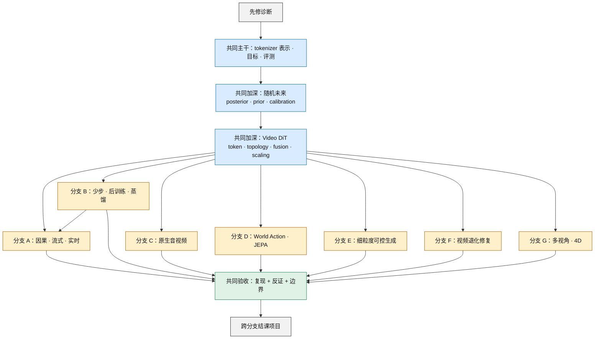
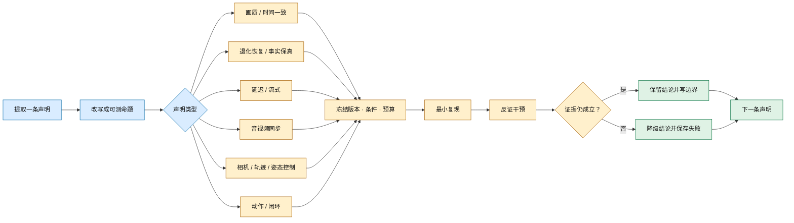

# 视频生成论文阅读课程：从会生成到可验证

这不是按年份堆论文的 awesome list，而是一门可以执行、留痕和被证伪的路线式课程。目标不是“读过多少篇”，而是最终能回答四个问题：模型表示了什么、怎样沿时间生成、证据真正支持什么、下一次实验怎样推翻自己的判断。

本页证据冻结于 **2026-08-30（Asia/Shanghai）**。检索式、纳入排除、正式发表状态和关键断言见[阅读路线研究日志](../sources/research_20260830_reading_routes.md)，新增结构性技术轴的选择依据见[缺口审计](../sources/research_20260830_missing_subfields_integration.md)、[Video DiT / backbone 研究日志](../sources/research_20260830_video_dit_backbones.md)、[多视角/4D 研究日志](../sources/research_20260830_multiview_4d_generation.md)与[退化修复研究日志](../sources/research_20260830_video_restoration.md)。完整书目信息与仓库索引仍见[引用与代码索引](bibliography.md)；专题细节分别见[生成模型](generative-models.md)、[视频 Tokenizer 与生成式压缩](generative-models/video-tokenizers.md)、[Video DiT 与骨干扩展](generative-models/video-dit-backbones.md)、[视频后训练与对齐](generative-models/video-post-training-alignment.md)、[因果流式生成](generative-models/causal-streaming-generation.md)、[原生音视频](tasks/native-audio-video-generation.md)、[细粒度可控生成](tasks/controllable-video-generation.md)、[多视角/4D 生成](tasks/multiview-4d-generation.md)、[视频退化修复](tasks/video-restoration.md)、[评测](evaluation.md)、[World Model](world-models.md)与 [JEPA](jepa.md)。

## 0. 课程规则与证据标签

先读共同主干，再选择一条主修分支和一条交叉分支。建议主干用 4 个半天，每条分支用 3–5 个半天；每次只交付一张 claim card、一份最小实验记录和一个“当前仍不知道什么”的列表。

本页对论文状态使用固定标签：

| 标签 | 含义 | 可以怎样写 | 不可以怎样写 |
|---|---|---|---|
| **A·正式发表** | 已在正式 proceedings、期刊或同行评审入口出现 | “论文提出/报告；发表于……” | 把作者实验写成独立复现 |
| **A*·正式接收** | 官方会议名单可核验接收，但冻结日未定位到正式 proceedings 页面 | “已被会议接收；正文当前见作者稿” | 把作者稿误写成已经出版的版本 |
| **B·预印本** | 作者 arXiv 论文，可能附代码或权重 | “作者提出/报告；截至冻结日为预印本” | 写成同行评审共识或统一 SOTA |
| **C·技术报告** | 机构或团队技术报告，无同等级正式论文 | “报告披露/展示” | 由报告反推完整训练配方或可复现性 |
| **D·官方发布** | 官方 system card、项目页、模型卡或仓库；不是论文 | “提供方声明/发布” | 当作论文机制证据或开放 checkpoint 证明 |
| **S·课程综合** | 本页设计的路线、实验或判断规则 | “本课程要求” | 冒充论文结论 |

代码、权重和数据是 release surface，不是证据等级。一个 B 级预印本可以有完整工件，一个 A 级论文也可能没有可运行代码。

## 1. 先修诊断：不过关就先补，不要硬读

| 先修能力 | 30 分钟自测 | 不通过时先读 |
|---|---|---|
| 概率与生成建模 | 能解释联合分布与自回归分解的差别，并说明“多种合理未来”为何使逐像素 MSE 变模糊 | [生成模型总览](generative-models.md) |
| 视频表示 | 能区分 pixel、连续 latent、离散 token、结构化 state，并分别写出 shape、dtype、时空网格、元素/token 预算；知道何时才存在可报告的 bitstream 码率 | [视频 Tokenizer 与生成式压缩](generative-models/video-tokenizers.md) |
| Diffusion / flow | 能画出 data → noise → data，并区分“训练目标”“数值求解步数”“网络调用次数” | [Diffusion](generative-models/diffusion-models.md)与 [Flow / consistency](generative-models/flow-consistency-models.md) |
| Video backbone | 能由 latent grid 和 patch 算出 $N$，并区分 full/factorized/window/sparse/linear attention、3D RoPE、Expert AdaLN、noise-time MoE 与多卡并行 | [Video DiT 与骨干扩展](generative-models/video-dit-backbones.md) |
| 序列与系统 | 能解释 causal mask、KV cache、首帧时间、平均 FPS、p95 帧延迟为什么不是同一个量 | [因果流式生成](generative-models/causal-streaming-generation.md) |
| 控制 | 能区分 observation、state、action、reward、open-loop rollout 与 receding-horizon control | [World Model](world-models.md) |
| 视觉控制坐标 | 能区分 2D 像素轨迹、3D 世界轨迹、相机内外参、pose/depth/flow，并说明它们为何不是环境 action | [任务地图](taxonomy.md) |
| 视角—时间几何 | 能解释一条相机路径为什么只覆盖 camera–time 平面的一条对角线，并区分像素网格与可渲染状态 | [多视角与 4D](tasks/multiview-4d-generation.md) |
| 音视频时间轴 | 能把 24 FPS 视频与 48 kHz 音频放到同一秒表上，并定义事件 onset 偏差 | [文生视频的音视频边界](tasks/text-to-video.md) |
| 退化逆问题 | 能写出观测视频由 blur、downsample、noise 与 compression 组合而来，并区分“恢复观测证据”与“生成合理细节” | [视频退化修复](tasks/video-restoration.md) |

最低入口产物是一页术语表：每个术语必须同时写“定义”“反例”和“怎样测”。如果只能写定义，说明还不能进入分支。

## 2. 总路线图：共同主干与加深单元，七条任务分支



文字替代：先通过先修诊断，再完成 tokenizer/目标/评测共同主干；随后补齐随机未来的 posterior/prior、collapse 与 calibration，并完成 Video DiT 的 token、attention、fusion、scaling 加深单元。表示、随机未来概率合同与 backbone 都是七条任务分支共享的技术先修，不另算应用分支；之后才选一条主修分支。少步蒸馏又是流式生成的常见前提，因此分支 B 连接分支 A。七条分支都必须经过同一套“复现、反证、证据边界”验收，最后再做跨分支项目。颜色只辅助分组，节点标签和箭头已经给出全部语义。

### 怎样选主修分支

| 你真正想回答的问题 | 主修 | 建议交叉分支 |
|---|---|---|
| 怎样边生成边播放，并接受中途条件变化？ | A 因果/流式 | B 少步/蒸馏 |
| 怎样减少网络调用，同时避免奖励投机与多样性坍缩？ | B 少步/后训练 | A 因果/流式 |
| 声音是否与画面共同生成，而不是事后配音？ | C 原生音视频 | B 后训练 |
| 好看的 rollout 何时才对决策有用？ | D World Action/JEPA | A 因果/流式 |
| 怎样精确指定相机、对象轨迹、姿态或几何，同时避免控制串扰？ | E 细粒度可控生成 | B 后训练或 A 因果/流式 |
| 怎样从模糊、噪声、低分辨率或压缩观测恢复同一段视频，又不把生成细节冒充证据？ | F 视频退化修复 | A 因果/流式或 B 后训练 |
| 怎样让同一动态场景在多个相机与多个时间都一致，并输出可查询状态？ | G 多视角/4D | E 细粒度控制或 A 因果/流式 |

## 3. 共同主干：表示、目标、时间与证据

### 为什么先读这条主干

七个前沿分支常把不同层级的词混在一起：tokenizer 是表示，autoregressive/masked 是概率 factorization，diffusion/flow 是 objective 与采样路径，DiT 是骨干，causal 是信息访问约束，DPO 是后训练，restoration 是观测逆问题，4D 是相机—时间查询/状态合同，world model 是动作—状态任务合同。主干的作用是先把这些坐标拆开，否则读新论文时很容易把“换了 objective”误写成“换了整个系统”。

### 阅读顺序

| 顺序 | 论文 | 带着什么问题读 | 证据 |
|---:|---|---|---|
| 1 | [Deep Multi-Scale Video Prediction Beyond Mean Square Error](https://arxiv.org/abs/1511.05440)（[ICLR 2016 目录](https://iclr.cc/archive/www/2016.html)） | 单一像素回归怎样平均掉多种未来？感知锐利是否等于动力学正确？ | **A·正式发表** |
| 2 | [Neural Discrete Representation Learning / VQ-VAE](https://proceedings.neurips.cc/paper/2017/hash/7a98af17e63a0ac09ce2e96d03992fbc-Abstract.html) | 压缩让序列变短时，哪些细节和动作信息被丢掉？ | **A·正式发表** |
| 3 | [Denoising Diffusion Probabilistic Models](https://proceedings.neurips.cc/paper/2020/hash/4c5bcfec8584af0d967f1ab10179ca4b-Abstract.html) | 训练时预测什么？采样慢来自哪里？ | **A·正式发表** |
| 4 | [Flow Matching for Generative Modeling](https://openreview.net/forum?id=PqvMRDCJT9t) | 向量场回归与 diffusion path 有什么关系？ODE 步数为何仍需单独报告？ | **A·正式发表** |
| 5 | [Video Diffusion Models](https://proceedings.neurips.cc/paper_files/paper/2022/hash/39235c56aef13fb05a6adc95eb9d8d66-Abstract-Conference.html) | 图像扩散加上时间维后，联合生成、续写与级联分别承担什么？ | **A·正式发表** |
| 6 | [MAGVIT](https://openaccess.thecvf.com/content/CVPR2023/html/Yu_MAGVIT_Masked_Generative_Video_Transformer_CVPR_2023_paper.html) | tokenizer、masked generation 与多任务条件怎样组合？ | **A·正式发表** |
| 7 | [VBench](https://openaccess.thecvf.com/content/CVPR2024/html/Huang_VBench_Comprehensive_Benchmark_Suite_for_Video_Generative_Models_CVPR_2024_paper.html) | 一个总分掩盖了哪些失败？自动指标与人工判断怎样对齐？ | **A·正式发表** |

### 表示加深单元：共同先修，不是任务分支

主干第 2、6 篇建立离散 token 与视频 token 建模入口；下面三篇分别补齐连续兼容表示、真实 bitstream 和自适应预算。它们仍属于所有七条任务分支共享的 representation 层。详细机制、更多里程碑和统一记账口径见[视频 Tokenizer 与生成式压缩](generative-models/video-tokenizers.md)。

| 表示问题 | 论文 | 阅读时必须核对 | 证据 |
|---|---|---|---|
| 连续 video latent 怎样接入既有生成器 | [CV-VAE](https://proceedings.neurips.cc/paper_files/paper/2024/hash/1787533e171dcc8549cc2eb5a4840eec-Abstract-Conference.html) | “兼容”是训练约束与特定 checkpoint 协议，不是任意 VAE 可无损互换 | **A·正式发表，NeurIPS 2024** |
| 离散 token 何时成为实际码流 | [Image and Video Tokenization with Binary Spherical Quantization](https://proceedings.iclr.cc/paper_files/paper/2025/hash/e25198b6a75f74277ee3a2bd4165d9ef-Abstract-Conference.html) | 只有接上先验、概率模型与算术编码后，bpp 才是 bitstream 证据 | **A·正式发表，ICLR 2025** |
| 固定网格怎样变成内容自适应预算 | [InfoTok](https://proceedings.iclr.cc/paper_files/paper/2026/hash/432f048a844654ba981953491e6dc80e-Abstract-Conference.html) | token 节省要连同 router、变长 batching、最坏长度和下游质量报告 | **A·正式发表，ICLR 2026** |

### 随机未来加深单元：先验收部署分布，再读世界模型

这组阅读解决一个经常被 tokenizer 和 diffusion 掩盖的问题：同一真实历史存在多个合理未来时，训练 posterior 可以看真实未来，部署 prior 不能。完整数学、2015–2026 谱系与 `LatentFork-1` 见[变分随机视频生成](generative-models/variational-generation.md)。

| 阶段 | 论文 | 带着什么问题读 | 证据 |
|---|---|---|---|
| fixed prior | [SV2P](https://iclr.cc/virtual/2018/poster/162) | future-aware posterior 怎样把多未来放进 latent？best-of-100 为什么不是校准？ | **A·ICLR 2018** |
| learned prior | [SVG-LP](https://proceedings.mlr.press/v80/denton18a.html) | history-conditioned prior 比固定 Gaussian 改了什么部署接口？ | **A·ICML 2018** |
| fully latent dynamics | [SRVP](https://proceedings.mlr.press/v119/franceschi20a.html) | 把 dynamics 与 frame synthesis 解耦后，哪些误差不再来自像素回灌？ | **A·ICML 2020** |
| hierarchy 与规模 | [GHVAE](https://openaccess.thecvf.com/content/CVPR2021/html/Wu_Greedy_Hierarchical_Variational_Autoencoders_for_Large-Scale_Video_Prediction_CVPR_2021_paper.html)；[CW-VAE](https://proceedings.neurips.cc/paper/2021/hash/f490d0af974fedf90cb0f1edce8e3dd5-Abstract.html) | 贪心层级和慢时钟分别解决优化/显存还是时间抽象？ | **A·CVPR / NeurIPS 2021** |
| 控制中心评测 | [VP²](https://iclr.cc/virtual/2023/poster/10863) | 感知指标为什么可能不能预测固定 planner 的任务成功？ | **A·ICLR 2023** |
| 对象粒子前沿 | [LPWM](https://openreview.net/forum?id=lTaPtGiUUc) | inverse-action posterior、policy prior、particle dynamics prior 怎样形成两层变分接口？ | **A·ICLR 2026 Oral** |

通关产物是三张表：`train-only information / deployment information / forbidden leakage`，`single / average / best-of-K / posterior oracle`，以及 `aleatoric / epistemic / partial observability`。若论文只写 latent/VAE、却无法填出 future-aware posterior、history-only prior 和 KL/ELBO，就不能收入严格主线。

### Backbone 加深单元：共同先修，不是第八条分支

这组阅读不要求背模型名，而是用同一张账回答：latent/patch 后有多少 token、谁能读取谁、条件在哪里融合、位置怎样编码、每步激活多少参数、算法 FLOPs 怎样落到 kernel/通信和端到端 NFE。完整公式、精读与 `BackboneFork-1`/`ServeFork-1` 见[Video DiT 与骨干扩展](generative-models/video-dit-backbones.md)。

| 阶段 | 一手论文/发布 | 带着什么问题读 | 证据 |
|---|---|---|---|
| 图像架构桥梁 | [DiT](https://openaccess.thecvf.com/content/ICCV2023/html/Peebles_Scalable_Diffusion_Models_with_Transformers_ICCV_2023_paper.html) | latent patch、adaLN-Zero、depth/width/token GFLOPs 怎样组成 backbone scaling？为什么图像结果不证明视频时序？ | **A·ICCV 2023，首次公开 2022** |
| window 与 factorization | [W.A.L.T.](https://www.ecva.net/papers/eccv_2024/papers_ECCV/html/10270_ECCV_2024_paper.php)；[Latte](https://openreview.net/forum?id=ntGPYNUF3t) | window 与 space/time 交替删掉哪些直接连边？跨窗口和快速运动需要多少层传播？ | **A·ECCV 2024 / TMLR 2025** |
| joint 与 expert normalization | [CogVideoX](https://proceedings.iclr.cc/paper_files/paper/2025/hash/ce31378e9f41d8907e97dab172b6c559-Abstract-Conference.html) | joint full attention、3D RoPE、frame packing 与 Expert AdaLN 分别改变什么？为何 Expert AdaLN 不是 MoE？ | **A·ICLR 2025** |
| dual→single 与 full attention | [HunyuanVideo](https://arxiv.org/abs/2412.03603)；[Step-Video-T2V](https://arxiv.org/abs/2502.10248) | 文本/视频双流何时合并？“视觉 full self-attention + 文本 cross-attention”和 joint sequence 有何差别？ | **B·作者技术报告/开放实现** |
| noise-time experts | [Wan2.2 official repository](https://github.com/Wan-Video/Wan2.2) | high/low-noise expert 沿 $\tau$ 怎样切换？total、active 与 resident parameters 为什么是三本账？ | **D·官方发布；无独立正式 Wan2.2 论文** |
| linear 与 hybrid | [SANA-Video](https://proceedings.iclr.cc/paper_files/paper/2026/hash/41b93c59da0d0f835907fd661d419db2-Abstract-Conference.html)；[SANA-Video 2.0](https://arxiv.org/abs/2607.21553) | cumulative state 怎样控制长序列内存？保留 25% softmax anchor 后为什么严格渐近仍含 $O(N^2)$？ | **A·ICLR 2026 / B·2026 预印本** |
| post-training linearization | [LinVideo](https://openaccess.thecvf.com/content/CVPR2026/html/Huang_LinVideo_A_Post-Training_Framework_towards_On_Attention_in_Efficient_Video_CVPR_2026_paper.html) | 从已有 checkpoint 替换部分 attention 与 from-scratch linear architecture 有何不同？4-step 数字为何不能归给 attention alone？ | **A·CVPR 2026** |
| sparse 与 reuse | [RAPID](https://openaccess.thecvf.com/content/CVPR2026/papers/Lin_RAPID_Reusing_Attention_Sparsity_with_Inter-step_Adaptation_for_Efficient_Video_CVPR_2026_paper.pdf)；[DSA](https://proceedings.iclr.cc/paper_files/paper/2026/hash/c3728248f3c627d1f16ca5726cdf83f5-Abstract-Conference.html)；[TimeRipples](https://openaccess.thecvf.com/content/CVPR2026/html/Mao_TimeRipples_Accelerating_vDiTs_by_Understanding_the_Spatio-Temporal_Correlations_in_Latent_CVPR_2026_paper.html) | 跨 denoising step 的 mask/score reuse、distributed sparse execution 与同一次 attention 内局部复用怎样区分？selector/kernel/通信谁主导？ | **A·CVPR/ICLR 2026** |

通关产物是一张七轴 manifest：`representation / factorization / objective / backbone / conditions / execution / evidence`。速度必须绑定输出、NFE、precision、hardware、warm-up 和计时边界；稀疏、cache、量化、少步与多卡的倍数不能相乘。

### 主干阅读问题

1. 论文建模的随机变量究竟是 RGB、latent、token、state，还是 action？
2. 时间依赖是 recurrent、autoregressive、masked、bidirectional denoising，还是 rolling window？
3. 一次“step”是求解器步、denoiser 前向、视频块，还是环境动作？
4. 训练、采样、解码、超分、插帧和安全过滤分别花了多少时间？
5. 指标证明了画质、提示遵循、时间稳定、多样性中的哪一项？又漏掉哪一项？

### 最小复现与反证任务

用 `Forking-Squares-v1`：64×64、8 帧历史、24 帧未来；同一 prefix 的重复未来共享前缀，可见 cue 为 cyan/amber/violet 时，left/right/stop 真概率分别为 0.6/0.3/0.1、0.2/0.7/0.1、0.1/0.2/0.7：

1. 对齐专章 fork：A 为无 latent 的 MSE/deterministic predictor，B 为 posterior + fixed Gaussian prior，C 为 history-conditioned learned prior，D 为 global + per-step hierarchy；Q 只作 posterior-assisted oracle，不进入部署排名。模型可以很小，但数据划分、decoder、预算和随机种子必须固定；C–B 只能解释为整系统优化/归纳偏置差异，不能单独证明 learned prior 的表达能力必要性。
2. 每个历史固定 64 个样本，同报 single、sample-average、best-of-64、event Brier/NLL/ECE、rare-mode recall、spurious-mode rate 与 posterior oracle；观察 MSE 是否用模糊平均换取更低误差，也检查 best-of-64 是否靠撒网改善。
3. 对同一段 32 帧序列（8 context + 24 future）做 tokenizer 重建，报告 latent/token 的 shape、dtype、时空网格、元素/token 数、重建误差和运动事件是否保存；只有实际产生可解码 bitstream 时才报告 bpp/bitrate。
4. 固定同一个 generator、数据与训练预算替换 tokenizer，拆分“重建更好”与“下游生成更好”。
5. 写一张七轴模型卡：`representation / temporal factorization / objective / backbone / conditions / execution / evidence`；其中 stochastic future 还必须填 posterior/prior 可见信息、per-level KL、latent intervention 和 prior–posterior gap，backbone 至少填 patch/grid、mixer/mask、position/fusion 和 total/active parameters，execution 至少填 NFE、precision、cache、parallelism 与硬件。

**反证条件：** 如果你无法仅凭方法和实验部分填完七轴，或把重建误差当成生成质量、把 attention FLOPs 当成端到端 latency，就不能进入分支。主干通关产物不是排行榜，而是一张能容纳后续所有论文的比较表。

## 4. 分支 A：因果、流式与实时视频

**入口依赖：** 完成主干，并能解释 causal attention、teacher forcing、KV cache、denoising step 和端到端播放 deadline。

**为什么读：** 这条线不是把全片 diffusion 的 mask 改成三角形，而是同时处理信息因果性、自生成历史、少步采样、长期记忆和在线 serving。论文之间的速度数字不能直接横比；真正的研究对象是质量—延迟—时长—交互四者的耦合。

### 阅读顺序

| 阶段 | 论文 | 在路线中的作用 | 证据 |
|---|---|---|---|
| 因果训练起点 | [Diffusion Forcing](https://proceedings.neurips.cc/paper_files/paper/2024/hash/2aee1c4159e48407d68fe16ae8e6e49e-Abstract-Conference.html) | 用 per-token noise 统一变长、rolling 与可引导序列生成 | **A·正式发表** |
| 教师到学生 | [CausVid](https://openaccess.thecvf.com/content/CVPR2025/html/Yin_From_Slow_Bidirectional_to_Fast_Autoregressive_Video_Diffusion_Models_CVPR_2025_paper.html) | 双向教师、因果学生、DMD、4-step 与 KV cache 的组合 | **A·正式发表** |
| 训练—推理对齐 | [Self Forcing](https://proceedings.neurips.cc/paper_files/paper/2025/hash/f4823f831af67a3ef15e41a85434422a-Abstract-Conference.html) | 在自生成历史上训练，直接研究 exposure bias | **A·正式发表** |
| 因果初始化 | [Causal Forcing](https://arxiv.org/abs/2602.02214)（[ICML 2026 官方名单](https://icml.cc/Downloads/2026)） | 先训练 AR teacher，再做 causal flow-map/ODE 初始化 | **A*·正式接收** |
| 架构解耦 | [Separable Causal Diffusion](https://openaccess.thecvf.com/content/CVPR2026/html/Bai_Causality_in_Video_Diffusers_is_Separable_from_Denoising_CVPR_2026_paper.html) | once-per-frame causal encoder 与 multi-step frame renderer 分工 | **A·正式发表；未核验开放代码/权重** |
| 在线系统 | [StreamDiffusionV2](https://proceedings.mlsys.org/paper_files/paper/2026/hash/698cfaf72a208aef2e78bcac55b74328-Abstract-Conference.html) | 把 TTFF、deadline、jitter、调度与多 GPU pipeline 纳入问题 | **A·正式发表** |
| 长时与 rolling | [LongLive](https://proceedings.iclr.cc/paper_files/paper/2026/hash/91a1610c6ed9e02d33f826b46f472b92-Abstract-Conference.html)与 [Rolling Forcing](https://openreview.net/forum?id=IAyzXjbfwo) | prompt recache、sink、rolling window 与 train-long-test-long | **A·ICLR 2026 正式发表** |
| training-free cache | [FlowCache](https://proceedings.iclr.cc/paper_files/paper/2026/hash/85dc8f85ff978b9c606d3b2f5b0da69a-Abstract-Conference.html) | per-chunk feature reuse 与 KV 压缩；速度比不自动等于实时 | **A·ICLR 2026；代码公开** |
| 在线运动控制 | [MotionStream](https://proceedings.iclr.cc/paper_files/paper/2026/hash/0cece806cd3d1dfad4a893f016ad3d7d-Abstract-Conference.html) | Self Forcing + 固定滑窗 + 在线轨迹/相机控制 | **A·ICLR 2026；仓库占位，代码/权重未放出** |
| 少步前沿 | [Causal Forcing++](https://arxiv.org/abs/2605.15141)与 [Causal-rCM](https://arxiv.org/abs/2606.25473) | frame-wise 1–2 step 与 teacher-/self-forcing 组合 recipe | **B·预印本** |

### 带着这些问题读

1. causal codec、causal generator、streaming commit 与 real-time SLO 四层各自怎样证明？哪一层只靠命名继承？
2. “causal”约束的是 attention 访问，还是作者真的做了动作反事实与物理因果测试？有限 lookahead 和块内双向是否明示？
3. 模型训练时看到 ground-truth history、带噪 history，还是完整的 self-generated history？梯度跨多少块？
4. 少步来自 consistency、DMD、flow-map 初始化还是缓存；sampling steps 与包含 context/CFG 的真实 NFE 是否相同？
5. 历史是全保留、窗口、sink、压缩、检索还是递归 state？GPU resident memory、CPU/外存和查询延迟怎样随时长增长？
6. commit 单元、hash、lookahead、revision、条件生效点、backpressure 与 cache reset 是什么？
7. “实时”是否包含文本编码、VAE decode、调度、传输与 display；是否给 cold/warm TTFF、p95/p99、deadline miss、负载、soak 和恢复？

### 最小复现与证伪任务

固定 8 个 prompt、3 个 seed、同一分辨率/帧率和同一 GPU，比较一个离线基线与一个因果 checkpoint：

1. 冻结 model/code/codec/scheduler/NFE/precision/GPU/driver/commit manifest；为每个已提交单元保存 hash。
2. 对相同 prefix/seed 只扰动隐藏 suffix、未来 prompt 或 padding；revision window 外任何 commit hash 变化都算 future-leak/commit 失败。
3. 生成训练窗口内、2×、6×、12× 和分钟级长度；逐块记录 GPU/CPU/外存、首帧时间、p50/p95/p99、实际 deadline miss，并画 first-failure survival curve。
4. 对同一模型分别用 ground-truth/noised history 与 self-generated history，画出误差或人工失败率随 rollout 长度的曲线，并 hook 首块/后续块真实 NFE。
5. 在第 25%、50%、75% 时刻切换 prompt，测条件变化到可见响应的帧数，并记录旧身份/布局是否被错误重置。
6. 在单流与预注册并发/拥塞负载下运行至少 60 秒，记录 backpressure、降级、断流恢复；给每个结果标第一处身份漂移、冻结、循环、几何崩坏和停顿。

**反证条件：** 未来输入改变已提交 hash、解码后达不到目标播放 deadline、resident memory 随时长无界增长、超出训练窗后失败率陡升、miss 后不能恢复，或 prompt 切换只改变纹理而不改变预期事件时，都要下调“causal”“streaming”“实时”“开放时长”或“交互式”的对应表述。

**通关产物：** 一份 commit/hash trace、一张 latency breakdown、一张 drift/survival curve、一份硬件与计时口径完整的失败日志。不能再用单个 FPS 概括系统。

## 5. 分支 B：少步生成、后训练与蒸馏

**入口依赖：** 完成 DDPM、flow matching 与 VBench；能区分 teacher trajectory matching、distribution matching、consistency 与 preference optimization。

**为什么读：** 少步回答“怎样更快采样”，后训练回答“模型更偏向什么输出”。两者可以联合，但目标不同：把 50 步压到 4 步不自动改善提示遵循；提高 reward 也可能损害运动、多样性和安全。

### 两条并行阅读线

| 线路 | 论文 | 在路线中的作用 | 证据 |
|---|---|---|---|
| 少步基础 | [Consistency Models](https://proceedings.mlr.press/v202/song23a.html) | 一步/少步映射、蒸馏与独立训练的共同起点 | **A·正式发表** |
| 少步基础 | [DMD2](https://proceedings.neurips.cc/paper_files/paper/2024/hash/54dcf25318f9de5a7a01f0a4125c541e-Abstract-Conference.html) | 分布匹配、two-time-scale 更新与 train–test input mismatch | **A·正式发表** |
| 视频基线 | [VideoLCM](https://arxiv.org/abs/2312.09109) | 将 latent consistency 迁移到视频的简单基线 | **B·预印本** |
| 少步 + 奖励 | [T2V-Turbo](https://proceedings.neurips.cc/paper_files/paper/2024/hash/8a57aa8e8b57e64a42e95f7dceb0adb9-Abstract-Conference.html) | consistency distillation 与混合可微 reward 同训 | **A·正式发表** |
| 少步 + 因果 | [CausVid](https://openaccess.thecvf.com/content/CVPR2025/html/Yin_From_Slow_Bidirectional_to_Fast_Autoregressive_Video_Diffusion_Models_CVPR_2025_paper.html) | 4-step 蒸馏进入流式因果学生 | **A·正式发表** |
| 奖励微调 | [InstructVideo](https://openaccess.thecvf.com/content/CVPR2024/html/Yuan_InstructVideo_Instructing_Video_Diffusion_Models_with_Human_Feedback_CVPR_2024_paper.html) | 用局部采样链和图像 reward 做早期视频反馈微调 | **A·正式发表** |
| 奖励建模 | [VideoPrefer / VideoRM](https://proceedings.neurips.cc/paper_files/paper/2024/hash/fbe2b2f74a2ece8070d8fb073717bda6-Abstract-Conference.html) | MLLM 偏好数据与视频 reward model | **A·正式发表** |
| 偏好优化 | [VideoDPO](https://openaccess.thecvf.com/content/CVPR2025/html/Liu_VideoDPO_Omni-Preference_Alignment_for_Video_Diffusion_Generation_CVPR_2025_paper.html) | 将多维 preference pair 用于 diffusion DPO | **A·正式发表** |
| 无标注动态偏好 | [DynamicsBoost](https://openaccess.thecvf.com/content/CVPR2026/html/Li_DynamicsBoost_Dynamic_Plausible_Video_Generation_via_Annotation-Free_Continuation_Preference_Optimization_CVPR_2026_paper.html) | 用不同 continuation 条件量构造动态偏好顺序 | **A·正式发表** |

### 带着这些问题读

1. 学生拟合教师的单条 ODE 轨迹、边缘分布，还是同一轨迹上的一致映射？
2. 一步模型的多样性、CFG 可控性和编辑能力是否保留？
3. 训练时的 student input 是否来自推理分布，还是仍依赖教师生成的干净配对？
4. reward 数据、调参 prompt 与最终测试 prompt 是否隔离？reward model 是否参与最终评价？
5. 偏好只覆盖画质/语义，还是覆盖运动、时间关系、音视频同步、安全和多样性？

### 最小复现与证伪任务

建立 32 个 prompt 的冻结测试集，每个 prompt 至少 4 个 seed：

1. 比较同一 teacher 的 25/50-step 输出与 student 的 1/2/4-step 输出；固定 VAE、分辨率、时长、CFG、精度和硬件。
2. 报告 denoiser 调用数、完整 wall time、VAE decode 时间、显存、能耗代理、逐维质量与 seed 间多样性。
3. 把 prompt 分为 reward-train、开发与最终测试三组；最终评价器不得与训练 reward 相同。
4. 随机抽取 reward 上升最大与下降最大的各 20 对，做盲评并查找语义篡改、静态化、重复运动、过饱和和安全拒绝变化。

**反证条件：** 加上 decode/后处理后速度优势消失、reward 上升但盲评下降、seed 间结果趋同，或 prompt optimizer 改写了任务语义，都不能称为“无损加速”或“整体对齐改善”。

**通关产物：** 一张 Pareto 图（质量—延迟—多样性）、一个 reward disagreement 表和至少五个失败样例。不能只报 teacher 与 student 的单一总分。

## 6. 分支 C：原生音视频，不把后配音写成联合生成

**入口依赖：** 能把音频 waveform/latent 与视频 frame/latent 映射到同一时间轴；能写出 `p(v | y)p(a | v,y)` 与 `p(v,a | y)` 的差别。

**为什么读：** “视频有声音”可能来自视频到音频、统一 token 的多任务模型、耦合双流、单流联合 latent，或不透明产品后端。只有在生成过程中两种模态共享或交换信息，才有资格讨论 joint/native AV；同步仍需单独测。

### 阅读顺序

| 阶段 | 论文/官方材料 | 在路线中的作用 | 证据 |
|---|---|---|---|
| 统一多模态 token | [VideoPoet](https://proceedings.mlr.press/v235/kondratyuk24a.html) | 理解统一输入/输出 token 与多任务生成；不等于同时联合采样 AV | **A·正式发表** |
| staged 对照 | [Movie Gen](https://arxiv.org/abs/2410.13720) | Video 与独立 Audio 模型家族，建立“先视频、后音频”的强对照 | **C·技术报告** |
| staged 音频基线 | [MMAudio](https://openaccess.thecvf.com/content/CVPR2025/html/Cheng_MMAudio_Taming_Multimodal_Joint_Training_for_High-Quality_Video-to-Audio_Synthesis_CVPR_2025_paper.html) | 给定视频和可选文本生成同步音频；“joint training”不等于联合生成视频 | **A·正式发表** |
| 联合双塔 | [Ovi](https://arxiv.org/abs/2510.01284) | twin-DiT、逐块双向跨模态融合 | **B·预印本** |
| 非对称双流 | [LTX-2](https://arxiv.org/abs/2601.03233) | 不同容量的 audio/video stream、双向 cross-attention 与共享时间条件 | **B·预印本** |
| 单流开放发布 | [MiniMax H3](https://www.minimax.io/blog/minimax-h3)与[官方仓库](https://github.com/MiniMax-AI/MiniMax-H3) | 33B 单流联合 AV 与开放 Base/托管完整系统的边界 | **D·官方发布；未定位正式论文** |
| 产品证据边界 | [Sora 2 system card](https://openai.com/index/sora-2-system-card/) | 练习怎样只引用提供方声明；页面同时记录产品已于 2026-04-26 停止可用 | **D·官方发布；不是论文** |

### 带着这些问题读

1. 系统是在采样前、每层、每 block，还是只在解码后交换 AV 信息？
2. 两种模态的 token rate、噪声时间和 CFG 怎样对齐？容量是否对称？
3. 对白、音效、环境声与音乐的控制信号来自同一 prompt 还是独立条件？
4. 论文测的是 onset 同步、语义匹配、说话人绑定、声源方向，还是只有整体偏好？
5. 公开的是论文 checkpoint、后续版本、部分 VAE/LoRA，还是完整生产 pipeline？

### 最小复现与证伪任务

设计 12 个带秒级事件的 prompt，例如“1.5 秒关门、随后两拍静默、右侧人物再说话”，每个 prompt 4 个 seed：

1. 无大 GPU 时，用论文/官方发布的完整样例做盲评；能运行开放 checkpoint 时，再固定版本和 seed 重做。
2. 标注事件—音效 onset 偏差、口型—语音同步、说话人绑定、声源方向、静默违例、音乐节拍和视觉质量。
3. 做三种干预：交换两条音频条件、打乱音频时间、把 prompt 中声音事件删除；观察视频节奏与音频是否双向响应。
4. 把“论文模型”“当前仓库 checkpoint”“托管产品”分成三行，禁止合并结果。

**反证条件：** 若音频只追随已经固定的视频、交换音频条件不改变视觉时序，或只展示带声样例却没有联合机制证据，就降级为 staged/video-to-audio，而不是 native joint AV。

**通关产物：** 一张 AV factorization 图、一份时间戳误差表和一张 release-surface 表。不能用“有同步声音”替代架构与干预测试。

## 7. 分支 D：World Action Model 与 JEPA

**入口依赖：** 能区分 forward dynamics、inverse dynamics、policy、planner、reward/value model 与环境；能解释 feature probe 不等于闭环控制。

**为什么读：** 这条路线专门防止“能生成未来画面”被直接升级为“理解世界并能行动”。决策型 world model、交互视频生成器、latent predictor、JEPA representation learner 与 joint video-action policy 可以互相借用组件，但证据合同不同。

### 四级阅读阶梯

| 阶段 | 论文 | 带着什么问题读 | 证据 |
|---|---|---|---|
| 控制根基 | [PlaNet](https://proceedings.mlr.press/v97/hafner19a.html) | RSSM 怎样同时保留随机与确定性状态，CEM 怎样只执行第一步再规划？ | **A·正式发表** |
| 控制根基 | [DreamerV3 / Mastering Diverse Control Tasks through World Models](https://www.nature.com/articles/s41586-025-08744-2) | learned dynamics、actor、critic 与 imagination 各自负责什么？ | **A·正式发表** |
| 生成式 simulator | [Genie](https://proceedings.mlr.press/v235/bruce24a.html) | 无动作标签视频怎样学习 latent action？latent action 是否等同机器人控制量？ | **A·正式发表** |
| 生成式 simulator | [DIAMOND](https://proceedings.neurips.cc/paper_files/paper/2024/hash/6bdde0373d53d4a501249547084bed43-Abstract-Conference.html) | 视觉细节何时影响 agent，模型漏洞又怎样被 policy 利用？ | **A·正式发表** |
| 生成式 simulator | [GameNGen](https://openreview.net/forum?id=P8pqeEkn1H) | action-conditioned diffusion 的实时交互证据是否超出单一游戏？ | **A·正式发表** |
| JEPA 表征 | [V-JEPA](https://openreview.net/forum?id=QaCCuDfBk2) | masked latent prediction、EMA target 与非生成式边界是什么？ | **A·正式发表（TMLR）** |
| latent planning | [DINO-WM](https://proceedings.mlr.press/v267/zhou25t.html) | frozen visual feature + action dynamics + visual-goal planning 能否替代 RGB 重建？ | **A·正式发表** |
| action-conditioned JEPA | [V-JEPA 2 / V-JEPA 2-AC](https://arxiv.org/abs/2506.09985) | action-free encoder 与 action predictor 怎样分工？MPC 的 energy 从哪里来？ | **B·预印本** |
| dense / end-to-end 前沿 | [V-JEPA 2.1](https://arxiv.org/abs/2603.14482)与 [LeWorldModel](https://arxiv.org/abs/2603.19312) | dense feature、下游生成头和端到端 action latent 各改变了哪一层？ | **B·预印本** |
| world model → 数据 → policy | [DreamGen](https://proceedings.mlr.press/v305/jang25a.html) | synthetic video、pseudo-action 与 policy training 是离线数据路线还是在线 planner？ | **A·正式发表** |
| WAM 汇合 | [DreamZero / World Action Models are Zero-shot Policies](https://arxiv.org/abs/2602.15922) | joint video-action prediction 何时能直接成为闭环 policy？ | **B·预印本** |

### 带着这些问题读

1. action 是真实控制量、离散键位、latent action、相机控制，还是只是一段文本？
2. predictor 预测 RGB、latent、reward/value、action，还是它们的联合分布？
3. 规划使用真实环境反馈、模型 rollout、oracle goal，还是离线生成数据？
4. 表征 probe、held-out prediction、paired action intervention、MPC success 和真实机器人成功率分别在哪一级？
5. “zero-shot”没有见过的是任务、对象、场景、实验室还是 embodiment？训练数据是否仍含同类机器人？
6. 像素更真实是否真的提高决策，还是只让人类更难看出 simulator 是假的？

### 最小复现与证伪任务

选择一个可复现的二维环境或小型控制任务，冻结训练/验证/测试布局：

1. 对同一初始 observation 配对至少两个相反 action，检查 predicted next state/latent 是否显著分开；再做 action shuffle 负对照。
2. 比较 pixel predictor 与 latent predictor 的一步误差、多步误差、state readout 和固定预算 CEM/MPC 成功率。
3. JEPA 路线必须审计 target 是否泄漏、embedding 是否 collapse、decoder 是否只是后接可视化模块；把 V-JEPA encoder 与 V-JEPA 2-AC predictor 分开记账。
4. 部署时只执行规划序列第一步并读取真实新 observation；与 open-loop 全序列执行比较失败率。
5. 记录 model exploitation：如果 agent 在 learned simulator 得高分却在真实/原始环境失败，保存轨迹而不是删掉异常值。

**反证条件：** action shuffle 后预测几乎不变、feature probe 高但控制不改善、planner 偷看真实未来，或 learned-simulator 成绩不能迁移到原环境，都不能称为可行动 world model。

**通关产物：** 一张能力阶梯表（representation → action dynamics → planner → closed-loop policy）、一组 paired-action 反事实和真实/模型环境 transfer gap。

## 8. 分支 E：细粒度可控视频——先写坐标系，再谈遵循

**入口依赖：** 能区分像素、相机、世界和人体坐标；知道 camera extrinsics/intrinsics、2D/3D trajectory、pose、depth、flow 与 mask 分别携带什么，也能解释这些视觉条件为何不自动成为环境 action。

**为什么读：** “可控”不是一个总分。相机可能准确而对象漂移，对象轨迹可能准确而背景被拖动，姿态可能吻合而身份丢失；同一控制器还可能在遮挡、出画再入画或多条件冲突时失效。真正的技术路线要同时写清控制信号、坐标系、时间采样、注入位置、基础模型是否冻结，以及条件遵循与非目标保持怎样分账。

### 阅读顺序

| 阶段 | 论文 | 在路线中的作用 | 证据 |
|---|---|---|---|
| 组合条件接口 | [VideoComposer](https://proceedings.neurips.cc/paper_files/paper/2023/hash/180f6184a3458fa19c28c5483bc61877-Abstract-Conference.html) | 把文字、空间序列、运动向量与多类条件放入统一时空编码接口 | **A·正式发表** |
| 相机/对象解耦 | [MotionCtrl](https://wzhouxiff.github.io/projects/MotionCtrl/) | 用 camera poses 与 object trajectories 分开控制两类运动，并展示多底座适配 | **A·SIGGRAPH 2024 正式论文；项目页含工件** |
| DiT 轨迹注入 | [Tora](https://openaccess.thecvf.com/content/CVPR2025/html/Zhang_Tora_Trajectory-oriented_Diffusion_Transformer_for_Video_Generation_CVPR_2025_paper.html) | 把轨迹压成多层时空 motion patches，再注入 DiT blocks | **A·正式发表** |
| 稀疏/稠密 motion prompt | [Motion Prompting](https://openaccess.thecvf.com/content/CVPR2025/html/Geng_Motion_Prompting_Controlling_Video_Generation_with_Motion_Trajectories_CVPR_2025_paper.html) | 用任意数量、稀疏度和对象/全局范围的轨迹统一表示运动请求 | **A·正式发表** |
| 3D cache 与精确相机 | [GEN3C](https://openaccess.thecvf.com/content/CVPR2025/html/Ren_GEN3C_3D-Informed_World-Consistent_Video_Generation_with_Precise_Camera_Control_CVPR_2025_paper.html) | 将深度/历史形成的点云 cache 按目标相机渲染后再条件生成 | **A·正式发表** |
| 语言到显式运动程序 | [LAMP](https://openaccess.thecvf.com/content/CVPR2026/html/Kizil_LAMP_Language-Assisted_Motion_Planning_for_Controllable_Video_Generation_CVPR_2026_paper.html) | 把摄影语言先编译为可检查 DSL 和 3D 对象/相机轨迹，再交给生成器 | **A·正式发表** |
| 时间—视角解耦 | [BulletTime](https://openaccess.thecvf.com/content/CVPR2026/html/Wang_BulletTime_Decoupled_Control_of_Time_and_Camera_Pose_for_Video_Generation_CVPR_2026_paper.html) | 把 world time 与 camera pose 作为独立连续条件，测试同一事件的时间与视角重定向 | **A·正式发表** |
| 少步控制适配 | [FlashMotion](https://openaccess.thecvf.com/content/CVPR2026/html/Li_FlashMotion_Few-Step_Controllable_Video_Generation_with_Trajectory_Guidance_CVPR_2026_paper.html) | 说明先蒸馏基础生成器会损伤原控制器，需要在 few-step student 上重新适配 | **A·正式发表** |
| 在线 4D 前沿 | [4DStreamCtrl](https://arxiv.org/abs/2608.25479) | 将 3D 对象/相机控制、因果流式输出与长 rollout 放在同一系统合同中 | **B·2026-08-26 预印本；速度与时长均为作者协议** |

### 带着这些问题读

1. 控制量在哪个坐标系、用什么单位、以什么频率采样；相机内参与外参是否同时固定？
2. 条件由额外通道、ControlNet/adapter、cross-attention、adaptive normalization、feature injection、latent optimization 还是推理期 guidance 注入？
3. 基础生成器是否冻结；controller 在哪个底座与版本训练，迁移到蒸馏/量化/student 后是否重新校准？
4. 多个控制互相矛盾时，系统拒绝、加权、投影到可行集，还是静默牺牲某一条件？
5. 轨迹误差由哪个 tracker/depth/pose estimator 测得；评估器换模型、遇到遮挡或外观变化时结论是否稳定？
6. 论文只读取预先给定的完整控制序列，还是允许生成中途修改并报告输入到画面响应延迟？后者才涉及在线控制，但仍不自动是 world model。

### 最小复现与证伪任务

冻结 12 个场景、4 个 seed、同一基础 checkpoint 与采样预算，建立三组可解析控制：相机 orbit/dolly、单对象 2D/3D 轨迹、pose/depth 等稠密结构条件。

1. 对每组运行 `无控制 / 正常控制 / 时间反转 / 空间平移 / 强度缩放`，确认输出差异确由条件而非随机 seed 造成。
2. 同时报 camera pose/trajectory error、对象跟踪误差、身份与背景保持、遮挡恢复、出画再入画、多样性和端到端延迟；评估器失败样例单独人工复核。
3. 构造相机与对象轨迹冲突、pose 与 depth 冲突、两对象交叉遮挡三类压力测试，记录系统优先级和第一处串扰帧。
4. 若有 adapter，分别在原多步底座与蒸馏 student 上测试；不允许把底座加速后的画质下降归因给 controller，也不能把 controller 失准藏在平均质量分里。
5. 若声称 online/interactive，在 25%、50%、75% 时刻修改控制量，报告 TTFF、响应延迟、deadline miss、旧状态保持与修订窗口。

**反证条件：** 空控制与目标控制差异不显著、控制误差下降但非目标内容大幅漂移、tracker 更换后排名翻转、遮挡后对象永久丢失，或“在线”系统只预读完整轨迹时，都要降级相应的精确、鲁棒、通用或交互主张。

**通关产物：** 一张 `signal → coordinate → injection → effect → metric` 表、一组单变量控制干预、一个冲突矩阵和至少五个失败样例。不能用精选视频证明精确控制。

## 9. 分支 F：视频退化修复——先守住观测证据，再谈生成细节

**入口依赖：** 能把低质观测写成 $Y=\mathcal D_\phi(X)+\epsilon$，并说明 blur kernel、downsampling、noise、codec/bitstream、相机 ISP 和算子次序都属于退化协议；能区分 full-frame degradation restoration、mask inpainting、frame interpolation、semantic editing 与一般 enhancement。

**为什么读：** 多帧提供亚像素位移和互补可见性，也会把错位、遮挡和压缩伪影传播到整段视频。现代生成先验能补出锐利高频，却不保证文字、人脸和对象部件来自观测。因此这条路线不能只看“更清楚”，而要把 fidelity、temporal stability、perceptual detail 与 hallucination 四栏分开。

### 阅读顺序

| 阶段 | 论文 | 在路线中的作用 | 证据 |
|---|---|---|---|
| 跨帧证据 | [Deep Video Deblurring](https://openaccess.thecvf.com/content_cvpr_2017/html/Su_Deep_Video_Deblurring_CVPR_2017_paper.html)与 [EDVR](https://openaccess.thecvf.com/content_CVPRW_2019/html/NTIRE/Wang_EDVR_Video_Restoration_With_Enhanced_Deformable_Convolutional_Networks_CVPRW_2019_paper.html) | 建立邻帧聚合、显式多尺度对齐与融合的基本问题 | **A·正式发表** |
| 组件基线 | [BasicVSR](https://openaccess.thecvf.com/content/CVPR2021/html/Chan_BasicVSR_The_Search_for_Essential_Components_in_Video_Super-Resolution_and_CVPR_2021_paper.html) | 用 propagation、alignment、aggregation、upsampling 四组件组织 VSR | **A·正式发表** |
| 真实退化与增强传播 | [BasicVSR++](https://openaccess.thecvf.com/content/CVPR2022/html/Chan_BasicVSR_Improving_Video_Super-Resolution_With_Enhanced_Propagation_and_Alignment_CVPR_2022_paper.html)与 [RealBasicVSR](https://openaccess.thecvf.com/content/CVPR2022/html/Chan_Investigating_Tradeoffs_in_Real-World_Video_Super-Resolution_CVPR_2022_paper.html) | 比较二阶传播、预清洗和真实低质训练的收益与债务 | **A·正式发表** |
| Transformer 枢纽 | [RVRT](https://proceedings.neurips.cc/paper_files/paper/2022/hash/02687e7b22abc64e651be8da74ec610e-Abstract-Conference.html) | clip 内并行、clip 间递归，并在 SR、deblur、denoise 上检验通用性 | **A·正式发表** |
| 生成先验 | [SATeCo](https://openaccess.thecvf.com/content/CVPR2024/html/Chen_Learning_Spatial_Adaptation_and_Temporal_Coherence_in_Diffusion_Models_for_CVPR_2024_paper.html)与 [Upscale-A-Video](https://openaccess.thecvf.com/content/CVPR2024/html/Zhou_Upscale-A-Video_Temporal-Consistent_Diffusion_Model_for_Real-World_Video_Super-Resolution_CVPR_2024_paper.html) | 冻结图像 diffusion prior、加入时空适配，并暴露 fidelity–generation 权衡 | **A·正式发表** |
| 高分辨率、复杂退化与少步 | [VideoGigaGAN](https://openaccess.thecvf.com/content/CVPR2025/html/Xu_VideoGigaGAN_Towards_Detail-rich_Video_Super-Resolution_CVPR_2025_paper.html)、[DiffVSR](https://openaccess.thecvf.com/content/ICCV2025/html/Li_DiffVSR_Revealing_an_Effective_Recipe_for_Taming_Robust_Video_Super-Resolution_ICCV_2025_paper.html)与 [TurboVSR](https://openaccess.thecvf.com/content/ICCV2025/html/Wang_TurboVSR_Fantastic_Video_Upscalers_and_Where_to_Find_Them_ICCV_2025_paper.html) | 分别研究感知细节、复杂退化 curriculum 与系统效率 | **A·正式发表** |
| 一步与 streaming 前沿 | [SeedVR2](https://proceedings.iclr.cc/paper_files/paper/2026/hash/444d69470b24ded080183c907b711bbf-Abstract-Conference.html)与 [FlashVSR](https://openaccess.thecvf.com/content/CVPR2026/html/Zhuang_FlashVSR_Towards_Real-time_Diffusion-Based_Streaming_Video_Super_Resolution_CVPR_2026_paper.html) | 区分 adversarial 一步后训练与因果稀疏注意的 streaming 系统合同 | **A·正式发表** |
| 观测与结构守恒 | [DGAF-VSR](https://openaccess.thecvf.com/content/CVPR2026/html/Xu_Rethinking_Diffusion_Model-Based_Video_Super-Resolution_Leveraging_Dense_Guidance_from_Aligned_CVPR_2026_paper.html)、[STCDiT](https://openaccess.thecvf.com/content/CVPR2026/html/Chen_STCDiT_Spatio-Temporally_Consistent_Diffusion_Transformer_for_High-Quality_Video_Super-Resolution_CVPR_2026_paper.html)与 [DTG-Restore](https://openaccess.thecvf.com/content/CVPR2026/html/Yesiltepe_DTG-Restore_Training-Free_Diffusion_Refinement_for_Generative_Video_Super-Resolution_CVPR_2026_paper.html) | dense aligned evidence、anchor-frame structure 与生成视频伪影 refinement 的三种约束 | **A·正式发表** |

### 带着这些问题读

1. 训练和测试的退化算子、参数分布、组合次序、codec 与相机是否匹配；“real-world”是否只有无 GT demo？
2. 支持帧怎样对齐，遮挡与出画区域怎样降权；错误传播在第几帧首次出现？
3. 生成先验接收多少低质证据；相同输入换 seed 后，小字、人脸和重复纹理是否改变？
4. 双向、整段、滑窗、recurrent 与 causal streaming 分别能看到哪些未来；显存与延迟怎样随片长增长？
5. PSNR/SSIM、LPIPS、人评、no-reference VQA、warp/flicker 和 OCR/ID 各自证明什么，又漏掉什么？
6. “一步”“实时”“training-free”“任意长度”分别约束 NFE、端到端服务、参数更新还是接口；是否被作者混写？

### 最小复现与证伪任务

冻结同一组干净视频、帧率、裁切和 seed，生成 matched synthetic、未见算子组合、codec/camera shift 与真实无 GT 四层测试：

1. 至少比较逐帧、传播/对齐、Transformer/hybrid 与生成先验四类路线；同时固定输出分辨率、输入帧数和计时边界。
2. paired 层分开报告 PSNR/SSIM、LPIPS 与时间误差；真实层加入盲人评、OCR/ID、一致性、失败率和人工复核。
3. 对生成式方法做 re-degradation consistency 与多 seed 审计；输出新增可辨文字、面孔或部件时记录为事实性失败，而不是“更多细节”。
4. 将平移、遮挡、scene cut、周期纹理、滚动快门和 bitstream corruption 分桶，画第一处失败位置与长时 drift。
5. 若声称 streaming，禁止读取未来帧，报告 cold/warm TTFF、端到端 p50/p95、deadline miss、显存随时长曲线与断流恢复。

**反证条件：** 只在 bicubic 上领先、换 codec/相机后排名翻转、锐利输出无法重退化回观测、多 seed 改写文字/身份、时间指标恶化，或速度数字省略 VAE/I/O 时，都要降级“真实、忠实、稳定或实时”的主张。

**通关产物：** 一份版本化 degradation manifest、一张四轴指标表、一组 hallucination counterexamples、一条长视频 drift 曲线和完整 latency breakdown。详细机制、里程碑与 RestorationFork-1 协议见[视频退化修复专章](tasks/video-restoration.md)。

## 10. 分支 G：多视角与 4D——把相机路径升级为可查询动态状态

**入口依赖：** 能区分 camera intrinsics/extrinsics、world time、diffusion time、像素视图与场景状态；知道普通视频只覆盖 camera–time 平面的一条路径，多视角静态图只覆盖一个时间切片。

**为什么读：** 一条相机控制视频可以很漂亮，却让同一时刻的另一视角完全矛盾；一个动态 Gaussian 可以实时渲染，却经过数小时 per-scene optimization；生成模型还能为不可见背面“补出”没有观测证据的内容。该分支把 reconstruction、generative completion、multi-view video diffusion、explicit 4D state 与 streaming 4D claim 分开。

### 阅读顺序

| 阶段 | 论文 | 在路线中的作用 | 证据 |
|---|---|---|---|
| 动态坐标场 | [D-NeRF](https://openaccess.thecvf.com/content/CVPR2021/html/Pumarola_D-NeRF_Neural_Radiance_Fields_for_Dynamic_Scenes_CVPR_2021_paper.html)与 [Nerfies](https://openaccess.thecvf.com/content/ICCV2021/html/Park_Nerfies_Deformable_Neural_Radiance_Fields_ICCV_2021_paper.html) | canonical state + deformation，把相机与时间变成独立查询 | **A·正式发表** |
| Text-to-4D | [MAV3D](https://proceedings.mlr.press/v202/singer23a.html) | 用 T2V score distillation 在无配对 4D 数据时优化 dynamic NeRF | **A·ICML 2023 正式发表** |
| 显式动态表示 | [4D Gaussian Splatting](https://openaccess.thecvf.com/content/CVPR2024/html/Wu_4D_Gaussian_Splatting_for_Real-Time_Dynamic_Scene_Rendering_CVPR_2024_paper.html) | 3D Gaussians + 4D voxels + deformation，分离构建与实时渲染 | **A·正式发表** |
| 视角—时间条件生成 | [4DiM](https://openreview.net/forum?id=d2UrCGtntF)与 [SV4D](https://proceedings.iclr.cc/paper_files/paper/2025/hash/5297e56ac65ba2bfa70ee9fc4818c042-Abstract-Conference.html) | metric camera/time query 与 multi-frame/multi-view diffusion | **A·ICLR 2025 正式发表** |
| 网格到状态 | [CAT4D](https://openaccess.thecvf.com/content/CVPR2025/html/Wu_CAT4D_Create_Anything_in_4D_with_Multi-View_Video_Diffusion_Models_CVPR_2025_paper.html) | 单目视频 → camera-time 网格 → deformable 3D Gaussian | **A·正式发表** |
| 泛化与大运动 | [4Real-Video](https://openaccess.thecvf.com/content/CVPR2025/html/Wang_4Real-Video_Learning_Generalizable_Photo-Realistic_4D_Video_Diffusion_CVPR_2025_paper.html)与 [SV4D 2.0](https://openaccess.thecvf.com/content/ICCV2025/html/Yao_SV4D_2.0_Enhancing_Spatio-Temporal_Consistency_in_Multi-View_Video_Diffusion_for_ICCV_2025_paper.html) | 从逐场景优化走向可泛化 view-time generation，并处理遮挡与大运动 | **A·正式发表** |
| 稀疏、无 pose 与长时 | [4C4D](https://openaccess.thecvf.com/content/CVPR2026/html/Zhou_4C4D_4_Camera_4D_Gaussian_Splatting_CVPR_2026_paper.html)、[DGGT](https://openaccess.thecvf.com/content/CVPR2026/html/Chen_DGGT_Feedforward_4D_Reconstruction_of_Dynamic_Driving_Scenes_using_Unposed_CVPR_2026_paper.html)、[MoRel](https://openaccess.thecvf.com/content/CVPR2026/html/Kwak_MoRel_Long-Range_Flicker-Free_4D_Motion_Modeling_via_Anchor_Relay-based_Bidirectioanl_CVPR_2026_paper.html) | 极稀疏相机、pose-as-output、长时 anchor relay 与内存边界 | **A·CVPR 2026 正式发表** |
| 长多视角与在线前沿 | [MV-Forcing](https://arxiv.org/abs/2607.05376)、[Stream4D](https://arxiv.org/abs/2608.19556)、[4DStreamCtrl](https://arxiv.org/abs/2608.25479) | 3D bridge/self-forcing、动态 4D reward、在线 3D point-track control | **B·2026 预印本；作者结果** |

### 带着这些问题读

1. 输入是同步多相机、带 pose 单目视频、无 pose 图像、单图还是文字；目标区域有多少直接观测支持？
2. 输出是独立像素 query、联合 $V\times T$ 网格、dynamic NeRF/Gaussian/surface，还是只是一条 camera path？
3. 相机与对象运动怎样分解；坐标、尺度、时间同步和 rolling shutter 是否公开？
4. 未见背面、遮挡后区域与未来状态由几何重投影还是生成先验产生；是否分 mask 报告？
5. 同一 $(v,t)$ 重复查询、冻结世界时间移动相机、冻结相机推进时间和相机闭环时，结果是否一致？
6. scene build、生成、4D optimization、renderer FPS 与端到端 streaming SLO 是否被分别计时？

### 最小复现与证伪任务

冻结一个开放 checkpoint、12 个 scene-held-out 动态场景、至少 4 个同步相机与 32 个时间点：

1. 比较独立视图生成、同刻 joint-view、完整 view-time block 与“网格后优化 4D state”四种方案。
2. 按 `seen / reprojected / hallucinated` 三类区域分开报保真、重投影、depth/pose、3D track、LPIPS 与人评。
3. 做 freeze-time、freeze-camera、novel-view/novel-time、离开后回到旧视点和对象出画再入画五类压力测试。
4. 用独立 depth/track/pose evaluator；训练 reward 与终评模型不得相同。
5. 同时报 scene build time、首个可见结果、query latency、renderer FPS、VRAM 与资产大小。

**反证条件：** 相机路径准确但同刻视图冲突、显式状态只提高训练视图 PSNR、静态 3D reward 通过冻结运动变高、不可见背面换 seed 完全改写却不报告不确定性，或“实时”只指优化后的 renderer 时，都要降低 4D、一致、重建或实时主张。

**通关产物：** 一张 camera × time coverage 图、一份 query manifest、六门证据表、三类区域 mask、相机 loop-closure 视频和构建/查询成本分解。完整机制与 `GridFork-1` 见[多视角与 4D 专章](tasks/multiview-4d-generation.md)。

## 11. 所有分支共用的验证回路



文字替代：先从论文中只取一条声明，把它改写为可测命题；根据声明属于画质、退化恢复、延迟、音视频同步、相机/轨迹/姿态控制还是动作闭环，选择相应协议。冻结模型版本、输入条件、预算和硬件后做最小复现，再加入最可能推翻结论的干预。证据仍成立时保留带适用边界的结论；不成立时降级结论并保存失败，两者都进入下一条声明。

## 12. 跨分支结课项目

至少选择两个分支，不训练大模型也可以完成。交付一个可复核目录，包含 `claim-card.md`、配置、原始结果、失败样例、环境信息和结论。

| 组合 | 最小项目 | 关键否证 |
|---|---|---|
| A 因果 + B 少步 | 同一 causal student 比较 1/2/4 step 的端到端直播 deadline 与长时 drift | 更少 step 只提高平均 FPS，却增加 p95 卡顿或长期崩坏 |
| B 后训练 + C 音视频 | 对联合 AV checkpoint 做同步 reward 微调前后盲评 | reward 提高但说话人绑定、静默或视觉多样性恶化 |
| A 因果 + D World Action | 在 prompt/action 中途切换时测响应延迟与闭环成功率 | 画面立即变化，但动作后果不符合环境或 replanning 无收益 |
| C 音视频 + D World Action | 把声音事件作为可干预环境变量，比较 joint model 与 staged pipeline | 声音只装饰画面，对状态、动作或未来预测没有影响 |
| B 后训练 + E 细粒度控制 | 用轨迹/相机 adherence reward 后训练同一 controller，比较控制误差与非目标保持 | reward 改善 tracker 分数，却造成身份、背景、多样性或遮挡恢复退化 |
| A 因果 + E 细粒度控制 | 在流式生成中途反转相机或对象轨迹，测条件响应、deadline 与旧状态保持 | 系统预读整条轨迹，或快速响应只是重置场景而不是连续控制 |
| D World Action + E 细粒度控制 | 对同一初态比较“摄影机轨迹”和“环境动作”两种条件的反事实 | 视觉控制精确，却无法预测 action 对状态的因果后果 |
| E 细粒度控制 + G 多视角/4D | 对同一 camera path 同时生成额外同步视角，再优化可渲染状态 | 原路径准确，但额外视图重投影、遮挡或 loop closure 失败 |
| A 因果 + G 多视角/4D | 在长时多视角生成中比较独立 view cache 与 3D bridge | 平均画质不变，却跨视角漂移、motion collapse 或显存无界增长 |
| B 后训练 + F 退化修复 | 比较同一 restoration teacher 蒸馏/对抗后训练前后的一致性、速度与幻觉 | 一步输出更锐利，却更改文字、身份或重退化一致性 |
| A 因果 + F 退化修复 | 将同一离线 restoration 改为只读历史的 streaming 协议 | 平均 FPS 达标，但未来帧泄漏、p95 卡顿或长时 drift 失控 |

最终结论只能落在以下四种之一：`复现`、`部分复现`、`未复现`、`证据不足`。`看起来不错`不是第五种。

## 13. 一页论文笔记模板

```markdown
# Paper title

## Status and source
A / A* / B / C / D；正式入口、作者稿、代码与 checkpoint 分开列。

## Claim under test
只写一个可测量主张；注明适用任务、版本、硬件和时长。

## Prerequisites
读懂本论文必须先知道的表示、objective、时间机制与控制概念。

## Model contract
- Representation: pixel / continuous latent / discrete token / structured state；shape、dtype、量化、时空网格、元素/token 预算；是否存在可解码 bitstream
- Temporal factorization:
- Objective:
- Conditions:
- Outputs:
- Train-time history:
- Inference-time history:

## Evidence
论文数据、指标、人工评测、系统测量与闭环任务各证明了什么？

## Minimum reproduction
固定数据、prompt、seed、版本、硬件、预算和成功标准。

## Falsifier
最可能推翻主张的干预、负对照或超出训练窗测试。

## Result
复现 / 部分复现 / 未复现 / 证据不足。

## Boundary
哪些结论不能从本论文推出？下一项最有信息量的实验是什么？
```

读完一条路线后，回看笔记中的 falsifier。如果所有实验都只能“证明论文正确”，路线尚未完成。
