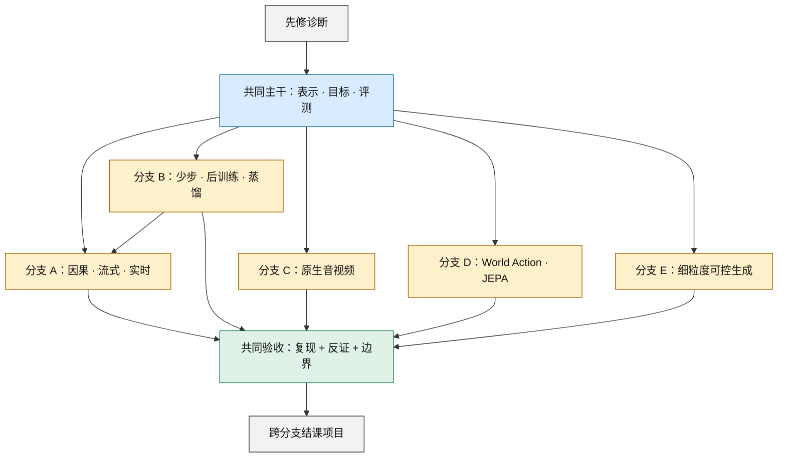
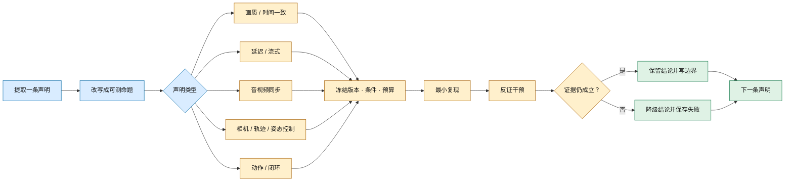

# 视频生成论文阅读课程：从会生成到可验证

这不是按年份堆论文的 awesome list，而是一门可以执行、留痕和被证伪的路线式课程。目标不是“读过多少篇”，而是最终能回答四个问题：模型表示了什么、怎样沿时间生成、证据真正支持什么、下一次实验怎样推翻自己的判断。

本页证据冻结于 **2026-08-30（Asia/Shanghai）**。检索式、纳入排除、正式发表状态和关键断言见[阅读路线研究日志](../sources/research_20260830_reading_routes.md)，新增三条结构性技术轴的选择依据见[缺口审计](../sources/research_20260830_missing_subfields_integration.md)。完整书目信息与仓库索引仍见[引用与代码索引](bibliography.md)；专题细节分别见[生成模型](generative-models.md)、[视频后训练与对齐](generative-models/video-post-training-alignment.md)、[因果流式生成](generative-models/causal-streaming-generation.md)、[原生音视频](tasks/native-audio-video-generation.md)、[细粒度可控生成](tasks/controllable-video-generation.md)、[评测](evaluation.md)、[World Model](world-models.md)与 [JEPA](jepa.md)。

## 0. 课程规则与证据标签

先读共同主干，再选择一条主修分支和一条交叉分支。建议主干用 4 个半天，每条分支用 3–5 个半天；每次只交付一张 claim card、一份最小实验记录和一个“当前仍不知道什么”的列表。

本页对论文状态使用固定标签：

| 标签 | 含义 | 可以怎样写 | 不可以怎样写 |
|---|---|---|---|
| **A·正式发表** | 已在正式 proceedings、期刊或同行评审入口出现 | “论文提出/报告；发表于……” | 把作者实验写成独立复现 |
| **A*·正式接收** | 官方会议名单可核验接收，但冻结日未定位到正式 proceedings 页面 | “已被会议接收；正文当前见作者稿” | 把作者稿误写成已经出版的版本 |
| **B·预印本** | 作者 arXiv 论文，可能附代码或权重 | “作者提出/报告；截至冻结日为预印本” | 写成同行评审共识或统一 SOTA |
| **C·技术报告** | 机构或团队技术报告，无同等级正式论文 | “报告披露/展示” | 由报告反推完整训练配方或可复现性 |
| **D·官方发布** | 官方 system card、项目页、模型卡或仓库；不是论文 | “提供方声明/发布” | 当作论文机制证据或开放 checkpoint 证明 |
| **S·课程综合** | 本页设计的路线、实验或判断规则 | “本课程要求” | 冒充论文结论 |

代码、权重和数据是 release surface，不是证据等级。一个 B 级预印本可以有完整工件，一个 A 级论文也可能没有可运行代码。

## 1. 先修诊断：不过关就先补，不要硬读

| 先修能力 | 30 分钟自测 | 不通过时先读 |
|---|---|---|
| 概率与生成建模 | 能解释联合分布与自回归分解的差别，并说明“多种合理未来”为何使逐像素 MSE 变模糊 | [生成模型总览](generative-models.md) |
| 视频表示 | 能区分 pixel、连续 latent、离散 token、结构化 state，并写出压缩率与重建误差的取舍 | [分类体系](taxonomy.md) |
| Diffusion / flow | 能画出 data → noise → data，并区分“训练目标”“数值求解步数”“网络调用次数” | [Diffusion](generative-models/diffusion-models.md)与 [Flow / consistency](generative-models/flow-consistency-models.md) |
| 序列与系统 | 能解释 causal mask、KV cache、首帧时间、平均 FPS、p95 帧延迟为什么不是同一个量 | [因果流式生成](generative-models/causal-streaming-generation.md) |
| 控制 | 能区分 observation、state、action、reward、open-loop rollout 与 receding-horizon control | [World Model](world-models.md) |
| 视觉控制坐标 | 能区分 2D 像素轨迹、3D 世界轨迹、相机内外参、pose/depth/flow，并说明它们为何不是环境 action | [任务地图](taxonomy.md) |
| 音视频时间轴 | 能把 24 FPS 视频与 48 kHz 音频放到同一秒表上，并定义事件 onset 偏差 | [文生视频的音视频边界](tasks/text-to-video.md) |

最低入口产物是一页术语表：每个术语必须同时写“定义”“反例”和“怎样测”。如果只能写定义，说明还不能进入分支。

## 2. 总路线图：一条主干，五条分支



文字替代：先通过先修诊断，再完成共同主干。主干之后选一条主修分支；少步蒸馏又是流式生成的常见前提，因此分支 B 连接分支 A。五条分支都必须经过同一套“复现、反证、证据边界”验收，最后再做跨分支项目。颜色只辅助分组，节点标签和箭头已经给出全部语义。

### 怎样选主修分支

| 你真正想回答的问题 | 主修 | 建议交叉分支 |
|---|---|---|
| 怎样边生成边播放，并接受中途条件变化？ | A 因果/流式 | B 少步/蒸馏 |
| 怎样减少网络调用，同时避免奖励投机与多样性坍缩？ | B 少步/后训练 | A 因果/流式 |
| 声音是否与画面共同生成，而不是事后配音？ | C 原生音视频 | B 后训练 |
| 好看的 rollout 何时才对决策有用？ | D World Action/JEPA | A 因果/流式 |
| 怎样精确指定相机、对象轨迹、姿态或几何，同时避免控制串扰？ | E 细粒度可控生成 | B 后训练或 A 因果/流式 |

## 3. 共同主干：表示、目标、时间与证据

### 为什么先读这条主干

四个前沿分支常把不同层级的词混在一起：tokenizer 是表示，DiT 是骨干，diffusion/flow 是训练与采样路径，causal 是信息访问约束，DPO 是后训练，world model 是任务合同。主干的作用是先把这些坐标拆开，否则读新论文时很容易把“换了 objective”误写成“换了整个系统”。

### 阅读顺序

| 顺序 | 论文 | 带着什么问题读 | 证据 |
|---:|---|---|---|
| 1 | [Deep Multi-Scale Video Prediction Beyond Mean Square Error](https://arxiv.org/abs/1511.05440)（[ICLR 2016 目录](https://iclr.cc/archive/www/2016.html)） | 单一像素回归怎样平均掉多种未来？感知锐利是否等于动力学正确？ | **A·正式发表** |
| 2 | [Neural Discrete Representation Learning / VQ-VAE](https://proceedings.neurips.cc/paper/2017/hash/7a98af17e63a0ac09ce2e96d03992fbc-Abstract.html) | 压缩让序列变短时，哪些细节和动作信息被丢掉？ | **A·正式发表** |
| 3 | [Denoising Diffusion Probabilistic Models](https://proceedings.neurips.cc/paper/2020/hash/4c5bcfec8584af0d967f1ab10179ca4b-Abstract.html) | 训练时预测什么？采样慢来自哪里？ | **A·正式发表** |
| 4 | [Flow Matching for Generative Modeling](https://openreview.net/forum?id=PqvMRDCJT9t) | 向量场回归与 diffusion path 有什么关系？ODE 步数为何仍需单独报告？ | **A·正式发表** |
| 5 | [Video Diffusion Models](https://proceedings.neurips.cc/paper_files/paper/2022/hash/39235c56aef13fb05a6adc95eb9d8d66-Abstract-Conference.html) | 图像扩散加上时间维后，联合生成、续写与级联分别承担什么？ | **A·正式发表** |
| 6 | [MAGVIT](https://openaccess.thecvf.com/content/CVPR2023/html/Yu_MAGVIT_Masked_Generative_Video_Transformer_CVPR_2023_paper.html) | tokenizer、masked generation 与多任务条件怎样组合？ | **A·正式发表** |
| 7 | [VBench](https://openaccess.thecvf.com/content/CVPR2024/html/Huang_VBench_Comprehensive_Benchmark_Suite_for_Video_Generative_Models_CVPR_2024_paper.html) | 一个总分掩盖了哪些失败？自动指标与人工判断怎样对齐？ | **A·正式发表** |

### 主干阅读问题

1. 论文建模的随机变量究竟是 RGB、latent、token、state，还是 action？
2. 时间依赖是 recurrent、autoregressive、masked、bidirectional denoising，还是 rolling window？
3. 一次“step”是求解器步、denoiser 前向、视频块，还是环境动作？
4. 训练、采样、解码、超分、插帧和安全过滤分别花了多少时间？
5. 指标证明了画质、提示遵循、时间稳定、多样性中的哪一项？又漏掉哪一项？

### 最小复现与反证任务

用一个“移动方块在岔路口向左或向右”的小数据集，固定相同历史但保留两个合理未来：

1. 实现或复用 MSE predictor、离散分类/混合分布和 stochastic generator 三类最小模型；模型可以很小，但数据划分与随机种子必须固定。
2. 同时报 pixel error、分支覆盖率、最优样本与平均样本；观察 MSE 是否用模糊平均换取更低误差。
3. 对同一段 16 帧视频做 codec 重建，报告压缩后 token 数、重建误差和运动事件是否保存。
4. 写一张六列模型卡：`representation / temporal factorization / objective / conditions / network calls / evidence`。

**反证条件：** 如果你无法仅凭方法和实验部分填完六列，或把重建误差当成生成质量，就不能进入分支。主干通关产物不是排行榜，而是一张能容纳后续所有论文的比较表。

## 4. 分支 A：因果、流式与实时视频

**入口依赖：** 完成主干，并能解释 causal attention、teacher forcing、KV cache、denoising step 和端到端播放 deadline。

**为什么读：** 这条线不是把全片 diffusion 的 mask 改成三角形，而是同时处理信息因果性、自生成历史、少步采样、长期记忆和在线 serving。论文之间的速度数字不能直接横比；真正的研究对象是质量—延迟—时长—交互四者的耦合。

### 阅读顺序

| 阶段 | 论文 | 在路线中的作用 | 证据 |
|---|---|---|---|
| 因果训练起点 | [Diffusion Forcing](https://proceedings.neurips.cc/paper_files/paper/2024/hash/2aee1c4159e48407d68fe16ae8e6e49e-Abstract-Conference.html) | 用 per-token noise 统一变长、rolling 与可引导序列生成 | **A·正式发表** |
| 教师到学生 | [CausVid](https://openaccess.thecvf.com/content/CVPR2025/html/Yin_From_Slow_Bidirectional_to_Fast_Autoregressive_Video_Diffusion_Models_CVPR_2025_paper.html) | 双向教师、因果学生、DMD、4-step 与 KV cache 的组合 | **A·正式发表** |
| 训练—推理对齐 | [Self Forcing](https://proceedings.neurips.cc/paper_files/paper/2025/hash/f4823f831af67a3ef15e41a85434422a-Abstract-Conference.html) | 在自生成历史上训练，直接研究 exposure bias | **A·正式发表** |
| 因果初始化 | [Causal Forcing](https://arxiv.org/abs/2602.02214)（[ICML 2026 官方名单](https://icml.cc/Downloads/2026)） | 先训练 AR teacher，再做 causal flow-map/ODE 初始化 | **A*·正式接收** |
| 在线系统 | [StreamDiffusionV2](https://proceedings.mlsys.org/paper_files/paper/2026/hash/698cfaf72a208aef2e78bcac55b74328-Abstract-Conference.html) | 把 TTFF、deadline、jitter、调度与多 GPU pipeline 纳入问题 | **A·正式发表** |
| 长时前沿 | [LongLive](https://arxiv.org/abs/2509.22622)与 [Rolling Forcing](https://arxiv.org/abs/2509.25161) | prompt recache、sink、rolling window 与 train-long-test-long | **B·预印本** |
| 少步前沿 | [Causal Forcing++](https://arxiv.org/abs/2605.15141)与 [Causal-rCM](https://arxiv.org/abs/2606.25473) | frame-wise 1–2 step 与 teacher-/self-forcing 组合 recipe | **B·预印本** |

### 带着这些问题读

1. “causal”约束的是 attention 访问，还是作者真的做了动作反事实与物理因果测试？
2. 模型训练时看到 ground-truth history、带噪 history，还是完整的 self-generated history？梯度跨多少块？
3. 少步来自 consistency、DMD、flow-map 初始化还是缓存；哪一项改变画质，哪一项只改变系统吞吐？
4. 历史是全保留、窗口、sink、压缩、检索还是递归 state？显存怎样随时长增长？
5. “实时”是否包含文本编码、VAE decode、调度和输出；是否给 TTFF、p95/p99 与 deadline miss？

### 最小复现与证伪任务

固定 8 个 prompt、3 个 seed、同一分辨率/帧率和同一 GPU，比较一个离线基线与一个因果 checkpoint：

1. 生成训练窗口内、4 倍窗口和 12 倍窗口三档长度；逐块记录显存、首帧时间、p50/p95 帧间隔、实际播放 deadline miss。
2. 对同一模型分别用 ground-truth history 与 self-generated history，画出误差或人工失败率随 rollout 长度的曲线。
3. 在第 25%、50%、75% 时刻切换 prompt，测条件变化到可见响应的帧数，并记录旧身份/布局是否被错误重置。
4. 给每个结果标第一处身份漂移、冻结、循环、几何崩坏和声音/画面停顿；不要只挑最好样例。

**反证条件：** 解码后达不到目标播放 deadline、显存随时长无界增长、超出训练窗后失败率陡升，或 prompt 切换只改变纹理而不改变预期事件时，都要下调“实时”“开放时长”或“交互式”的表述。

**通关产物：** 一张 latency breakdown、一张 drift curve、一份硬件与计时口径完整的失败日志。不能再用单个 FPS 概括系统。

## 5. 分支 B：少步生成、后训练与蒸馏

**入口依赖：** 完成 DDPM、flow matching 与 VBench；能区分 teacher trajectory matching、distribution matching、consistency 与 preference optimization。

**为什么读：** 少步回答“怎样更快采样”，后训练回答“模型更偏向什么输出”。两者可以联合，但目标不同：把 50 步压到 4 步不自动改善提示遵循；提高 reward 也可能损害运动、多样性和安全。

### 两条并行阅读线

| 线路 | 论文 | 在路线中的作用 | 证据 |
|---|---|---|---|
| 少步基础 | [Consistency Models](https://proceedings.mlr.press/v202/song23a.html) | 一步/少步映射、蒸馏与独立训练的共同起点 | **A·正式发表** |
| 少步基础 | [DMD2](https://proceedings.neurips.cc/paper_files/paper/2024/hash/54dcf25318f9de5a7a01f0a4125c541e-Abstract-Conference.html) | 分布匹配、two-time-scale 更新与 train–test input mismatch | **A·正式发表** |
| 视频基线 | [VideoLCM](https://arxiv.org/abs/2312.09109) | 将 latent consistency 迁移到视频的简单基线 | **B·预印本** |
| 少步 + 奖励 | [T2V-Turbo](https://proceedings.neurips.cc/paper_files/paper/2024/hash/8a57aa8e8b57e64a42e95f7dceb0adb9-Abstract-Conference.html) | consistency distillation 与混合可微 reward 同训 | **A·正式发表** |
| 少步 + 因果 | [CausVid](https://openaccess.thecvf.com/content/CVPR2025/html/Yin_From_Slow_Bidirectional_to_Fast_Autoregressive_Video_Diffusion_Models_CVPR_2025_paper.html) | 4-step 蒸馏进入流式因果学生 | **A·正式发表** |
| 奖励微调 | [InstructVideo](https://openaccess.thecvf.com/content/CVPR2024/html/Yuan_InstructVideo_Instructing_Video_Diffusion_Models_with_Human_Feedback_CVPR_2024_paper.html) | 用局部采样链和图像 reward 做早期视频反馈微调 | **A·正式发表** |
| 奖励建模 | [VideoPrefer / VideoRM](https://proceedings.neurips.cc/paper_files/paper/2024/hash/fbe2b2f74a2ece8070d8fb073717bda6-Abstract-Conference.html) | MLLM 偏好数据与视频 reward model | **A·正式发表** |
| 偏好优化 | [VideoDPO](https://openaccess.thecvf.com/content/CVPR2025/html/Liu_VideoDPO_Omni-Preference_Alignment_for_Video_Diffusion_Generation_CVPR_2025_paper.html) | 将多维 preference pair 用于 diffusion DPO | **A·正式发表** |
| 无标注动态偏好 | [DynamicsBoost](https://openaccess.thecvf.com/content/CVPR2026/html/Li_DynamicsBoost_Dynamic_Plausible_Video_Generation_via_Annotation-Free_Continuation_Preference_Optimization_CVPR_2026_paper.html) | 用不同 continuation 条件量构造动态偏好顺序 | **A·正式发表** |

### 带着这些问题读

1. 学生拟合教师的单条 ODE 轨迹、边缘分布，还是同一轨迹上的一致映射？
2. 一步模型的多样性、CFG 可控性和编辑能力是否保留？
3. 训练时的 student input 是否来自推理分布，还是仍依赖教师生成的干净配对？
4. reward 数据、调参 prompt 与最终测试 prompt 是否隔离？reward model 是否参与最终评价？
5. 偏好只覆盖画质/语义，还是覆盖运动、时间关系、音视频同步、安全和多样性？

### 最小复现与证伪任务

建立 32 个 prompt 的冻结测试集，每个 prompt 至少 4 个 seed：

1. 比较同一 teacher 的 25/50-step 输出与 student 的 1/2/4-step 输出；固定 VAE、分辨率、时长、CFG、精度和硬件。
2. 报告 denoiser 调用数、完整 wall time、VAE decode 时间、显存、能耗代理、逐维质量与 seed 间多样性。
3. 把 prompt 分为 reward-train、开发与最终测试三组；最终评价器不得与训练 reward 相同。
4. 随机抽取 reward 上升最大与下降最大的各 20 对，做盲评并查找语义篡改、静态化、重复运动、过饱和和安全拒绝变化。

**反证条件：** 加上 decode/后处理后速度优势消失、reward 上升但盲评下降、seed 间结果趋同，或 prompt optimizer 改写了任务语义，都不能称为“无损加速”或“整体对齐改善”。

**通关产物：** 一张 Pareto 图（质量—延迟—多样性）、一个 reward disagreement 表和至少五个失败样例。不能只报 teacher 与 student 的单一总分。

## 6. 分支 C：原生音视频，不把后配音写成联合生成

**入口依赖：** 能把音频 waveform/latent 与视频 frame/latent 映射到同一时间轴；能写出 `p(v | y)p(a | v,y)` 与 `p(v,a | y)` 的差别。

**为什么读：** “视频有声音”可能来自视频到音频、统一 token 的多任务模型、耦合双流、单流联合 latent，或不透明产品后端。只有在生成过程中两种模态共享或交换信息，才有资格讨论 joint/native AV；同步仍需单独测。

### 阅读顺序

| 阶段 | 论文/官方材料 | 在路线中的作用 | 证据 |
|---|---|---|---|
| 统一多模态 token | [VideoPoet](https://proceedings.mlr.press/v235/kondratyuk24a.html) | 理解统一输入/输出 token 与多任务生成；不等于同时联合采样 AV | **A·正式发表** |
| staged 对照 | [Movie Gen](https://arxiv.org/abs/2410.13720) | Video 与独立 Audio 模型家族，建立“先视频、后音频”的强对照 | **C·技术报告** |
| staged 音频基线 | [MMAudio](https://openaccess.thecvf.com/content/CVPR2025/html/Cheng_MMAudio_Taming_Multimodal_Joint_Training_for_High-Quality_Video-to-Audio_Synthesis_CVPR_2025_paper.html) | 给定视频和可选文本生成同步音频；“joint training”不等于联合生成视频 | **A·正式发表** |
| 联合双塔 | [Ovi](https://arxiv.org/abs/2510.01284) | twin-DiT、逐块双向跨模态融合 | **B·预印本** |
| 非对称双流 | [LTX-2](https://arxiv.org/abs/2601.03233) | 不同容量的 audio/video stream、双向 cross-attention 与共享时间条件 | **B·预印本** |
| 单流开放发布 | [MiniMax H3](https://www.minimax.io/blog/minimax-h3)与[官方仓库](https://github.com/MiniMax-AI/MiniMax-H3) | 33B 单流联合 AV 与开放 Base/托管完整系统的边界 | **D·官方发布；未定位正式论文** |
| 产品证据边界 | [Sora 2 system card](https://openai.com/index/sora-2-system-card/) | 练习怎样只引用提供方声明；页面同时记录产品已于 2026-04-26 停止可用 | **D·官方发布；不是论文** |

### 带着这些问题读

1. 系统是在采样前、每层、每 block，还是只在解码后交换 AV 信息？
2. 两种模态的 token rate、噪声时间和 CFG 怎样对齐？容量是否对称？
3. 对白、音效、环境声与音乐的控制信号来自同一 prompt 还是独立条件？
4. 论文测的是 onset 同步、语义匹配、说话人绑定、声源方向，还是只有整体偏好？
5. 公开的是论文 checkpoint、后续版本、部分 VAE/LoRA，还是完整生产 pipeline？

### 最小复现与证伪任务

设计 12 个带秒级事件的 prompt，例如“1.5 秒关门、随后两拍静默、右侧人物再说话”，每个 prompt 4 个 seed：

1. 无大 GPU 时，用论文/官方发布的完整样例做盲评；能运行开放 checkpoint 时，再固定版本和 seed 重做。
2. 标注事件—音效 onset 偏差、口型—语音同步、说话人绑定、声源方向、静默违例、音乐节拍和视觉质量。
3. 做三种干预：交换两条音频条件、打乱音频时间、把 prompt 中声音事件删除；观察视频节奏与音频是否双向响应。
4. 把“论文模型”“当前仓库 checkpoint”“托管产品”分成三行，禁止合并结果。

**反证条件：** 若音频只追随已经固定的视频、交换音频条件不改变视觉时序，或只展示带声样例却没有联合机制证据，就降级为 staged/video-to-audio，而不是 native joint AV。

**通关产物：** 一张 AV factorization 图、一份时间戳误差表和一张 release-surface 表。不能用“有同步声音”替代架构与干预测试。

## 7. 分支 D：World Action Model 与 JEPA

**入口依赖：** 能区分 forward dynamics、inverse dynamics、policy、planner、reward/value model 与环境；能解释 feature probe 不等于闭环控制。

**为什么读：** 这条路线专门防止“能生成未来画面”被直接升级为“理解世界并能行动”。决策型 world model、交互视频生成器、latent predictor、JEPA representation learner 与 joint video-action policy 可以互相借用组件，但证据合同不同。

### 四级阅读阶梯

| 阶段 | 论文 | 带着什么问题读 | 证据 |
|---|---|---|---|
| 控制根基 | [PlaNet](https://proceedings.mlr.press/v97/hafner19a.html) | RSSM 怎样同时保留随机与确定性状态，CEM 怎样只执行第一步再规划？ | **A·正式发表** |
| 控制根基 | [DreamerV3 / Mastering Diverse Control Tasks through World Models](https://www.nature.com/articles/s41586-025-08744-2) | learned dynamics、actor、critic 与 imagination 各自负责什么？ | **A·正式发表** |
| 生成式 simulator | [Genie](https://proceedings.mlr.press/v235/bruce24a.html) | 无动作标签视频怎样学习 latent action？latent action 是否等同机器人控制量？ | **A·正式发表** |
| 生成式 simulator | [DIAMOND](https://proceedings.neurips.cc/paper_files/paper/2024/hash/6bdde0373d53d4a501249547084bed43-Abstract-Conference.html) | 视觉细节何时影响 agent，模型漏洞又怎样被 policy 利用？ | **A·正式发表** |
| 生成式 simulator | [GameNGen](https://openreview.net/forum?id=P8pqeEkn1H) | action-conditioned diffusion 的实时交互证据是否超出单一游戏？ | **A·正式发表** |
| JEPA 表征 | [V-JEPA](https://openreview.net/forum?id=QaCCuDfBk2) | masked latent prediction、EMA target 与非生成式边界是什么？ | **A·正式发表（TMLR）** |
| latent planning | [DINO-WM](https://proceedings.mlr.press/v267/zhou25t.html) | frozen visual feature + action dynamics + visual-goal planning 能否替代 RGB 重建？ | **A·正式发表** |
| action-conditioned JEPA | [V-JEPA 2 / V-JEPA 2-AC](https://arxiv.org/abs/2506.09985) | action-free encoder 与 action predictor 怎样分工？MPC 的 energy 从哪里来？ | **B·预印本** |
| dense / end-to-end 前沿 | [V-JEPA 2.1](https://arxiv.org/abs/2603.14482)与 [LeWorldModel](https://arxiv.org/abs/2603.19312) | dense feature、下游生成头和端到端 action latent 各改变了哪一层？ | **B·预印本** |
| world model → 数据 → policy | [DreamGen](https://proceedings.mlr.press/v305/jang25a.html) | synthetic video、pseudo-action 与 policy training 是离线数据路线还是在线 planner？ | **A·正式发表** |
| WAM 汇合 | [DreamZero / World Action Models are Zero-shot Policies](https://arxiv.org/abs/2602.15922) | joint video-action prediction 何时能直接成为闭环 policy？ | **B·预印本** |

### 带着这些问题读

1. action 是真实控制量、离散键位、latent action、相机控制，还是只是一段文本？
2. predictor 预测 RGB、latent、reward/value、action，还是它们的联合分布？
3. 规划使用真实环境反馈、模型 rollout、oracle goal，还是离线生成数据？
4. 表征 probe、held-out prediction、paired action intervention、MPC success 和真实机器人成功率分别在哪一级？
5. “zero-shot”没有见过的是任务、对象、场景、实验室还是 embodiment？训练数据是否仍含同类机器人？
6. 像素更真实是否真的提高决策，还是只让人类更难看出 simulator 是假的？

### 最小复现与证伪任务

选择一个可复现的二维环境或小型控制任务，冻结训练/验证/测试布局：

1. 对同一初始 observation 配对至少两个相反 action，检查 predicted next state/latent 是否显著分开；再做 action shuffle 负对照。
2. 比较 pixel predictor 与 latent predictor 的一步误差、多步误差、state readout 和固定预算 CEM/MPC 成功率。
3. JEPA 路线必须审计 target 是否泄漏、embedding 是否 collapse、decoder 是否只是后接可视化模块；把 V-JEPA encoder 与 V-JEPA 2-AC predictor 分开记账。
4. 部署时只执行规划序列第一步并读取真实新 observation；与 open-loop 全序列执行比较失败率。
5. 记录 model exploitation：如果 agent 在 learned simulator 得高分却在真实/原始环境失败，保存轨迹而不是删掉异常值。

**反证条件：** action shuffle 后预测几乎不变、feature probe 高但控制不改善、planner 偷看真实未来，或 learned-simulator 成绩不能迁移到原环境，都不能称为可行动 world model。

**通关产物：** 一张能力阶梯表（representation → action dynamics → planner → closed-loop policy）、一组 paired-action 反事实和真实/模型环境 transfer gap。

## 8. 分支 E：细粒度可控视频——先写坐标系，再谈遵循

**入口依赖：** 能区分像素、相机、世界和人体坐标；知道 camera extrinsics/intrinsics、2D/3D trajectory、pose、depth、flow 与 mask 分别携带什么，也能解释这些视觉条件为何不自动成为环境 action。

**为什么读：** “可控”不是一个总分。相机可能准确而对象漂移，对象轨迹可能准确而背景被拖动，姿态可能吻合而身份丢失；同一控制器还可能在遮挡、出画再入画或多条件冲突时失效。真正的技术路线要同时写清控制信号、坐标系、时间采样、注入位置、基础模型是否冻结，以及条件遵循与非目标保持怎样分账。

### 阅读顺序

| 阶段 | 论文 | 在路线中的作用 | 证据 |
|---|---|---|---|
| 组合条件接口 | [VideoComposer](https://proceedings.neurips.cc/paper_files/paper/2023/hash/180f6184a3458fa19c28c5483bc61877-Abstract-Conference.html) | 把文字、空间序列、运动向量与多类条件放入统一时空编码接口 | **A·正式发表** |
| 相机/对象解耦 | [MotionCtrl](https://wzhouxiff.github.io/projects/MotionCtrl/) | 用 camera poses 与 object trajectories 分开控制两类运动，并展示多底座适配 | **A·SIGGRAPH 2024 正式论文；项目页含工件** |
| DiT 轨迹注入 | [Tora](https://openaccess.thecvf.com/content/CVPR2025/html/Zhang_Tora_Trajectory-oriented_Diffusion_Transformer_for_Video_Generation_CVPR_2025_paper.html) | 把轨迹压成多层时空 motion patches，再注入 DiT blocks | **A·正式发表** |
| 稀疏/稠密 motion prompt | [Motion Prompting](https://openaccess.thecvf.com/content/CVPR2025/html/Geng_Motion_Prompting_Controlling_Video_Generation_with_Motion_Trajectories_CVPR_2025_paper.html) | 用任意数量、稀疏度和对象/全局范围的轨迹统一表示运动请求 | **A·正式发表** |
| 3D cache 与精确相机 | [GEN3C](https://openaccess.thecvf.com/content/CVPR2025/html/Ren_GEN3C_3D-Informed_World-Consistent_Video_Generation_with_Precise_Camera_Control_CVPR_2025_paper.html) | 将深度/历史形成的点云 cache 按目标相机渲染后再条件生成 | **A·正式发表** |
| 语言到显式运动程序 | [LAMP](https://openaccess.thecvf.com/content/CVPR2026/html/Kizil_LAMP_Language-Assisted_Motion_Planning_for_Controllable_Video_Generation_CVPR_2026_paper.html) | 把摄影语言先编译为可检查 DSL 和 3D 对象/相机轨迹，再交给生成器 | **A·正式发表** |
| 时间—视角解耦 | [BulletTime](https://openaccess.thecvf.com/content/CVPR2026/html/Wang_BulletTime_Decoupled_Control_of_Time_and_Camera_Pose_for_Video_Generation_CVPR_2026_paper.html) | 把 world time 与 camera pose 作为独立连续条件，测试同一事件的时间与视角重定向 | **A·正式发表** |
| 少步控制适配 | [FlashMotion](https://openaccess.thecvf.com/content/CVPR2026/html/Li_FlashMotion_Few-Step_Controllable_Video_Generation_with_Trajectory_Guidance_CVPR_2026_paper.html) | 说明先蒸馏基础生成器会损伤原控制器，需要在 few-step student 上重新适配 | **A·正式发表** |
| 在线 4D 前沿 | [4DStreamCtrl](https://arxiv.org/abs/2608.25479) | 将 3D 对象/相机控制、因果流式输出与长 rollout 放在同一系统合同中 | **B·2026-08-26 预印本；速度与时长均为作者协议** |

### 带着这些问题读

1. 控制量在哪个坐标系、用什么单位、以什么频率采样；相机内参与外参是否同时固定？
2. 条件由额外通道、ControlNet/adapter、cross-attention、adaptive normalization、feature injection、latent optimization 还是推理期 guidance 注入？
3. 基础生成器是否冻结；controller 在哪个底座与版本训练，迁移到蒸馏/量化/student 后是否重新校准？
4. 多个控制互相矛盾时，系统拒绝、加权、投影到可行集，还是静默牺牲某一条件？
5. 轨迹误差由哪个 tracker/depth/pose estimator 测得；评估器换模型、遇到遮挡或外观变化时结论是否稳定？
6. 论文只读取预先给定的完整控制序列，还是允许生成中途修改并报告输入到画面响应延迟？后者才涉及在线控制，但仍不自动是 world model。

### 最小复现与证伪任务

冻结 12 个场景、4 个 seed、同一基础 checkpoint 与采样预算，建立三组可解析控制：相机 orbit/dolly、单对象 2D/3D 轨迹、pose/depth 等稠密结构条件。

1. 对每组运行 `无控制 / 正常控制 / 时间反转 / 空间平移 / 强度缩放`，确认输出差异确由条件而非随机 seed 造成。
2. 同时报 camera pose/trajectory error、对象跟踪误差、身份与背景保持、遮挡恢复、出画再入画、多样性和端到端延迟；评估器失败样例单独人工复核。
3. 构造相机与对象轨迹冲突、pose 与 depth 冲突、两对象交叉遮挡三类压力测试，记录系统优先级和第一处串扰帧。
4. 若有 adapter，分别在原多步底座与蒸馏 student 上测试；不允许把底座加速后的画质下降归因给 controller，也不能把 controller 失准藏在平均质量分里。
5. 若声称 online/interactive，在 25%、50%、75% 时刻修改控制量，报告 TTFF、响应延迟、deadline miss、旧状态保持与修订窗口。

**反证条件：** 空控制与目标控制差异不显著、控制误差下降但非目标内容大幅漂移、tracker 更换后排名翻转、遮挡后对象永久丢失，或“在线”系统只预读完整轨迹时，都要降级相应的精确、鲁棒、通用或交互主张。

**通关产物：** 一张 `signal → coordinate → injection → effect → metric` 表、一组单变量控制干预、一个冲突矩阵和至少五个失败样例。不能用精选视频证明精确控制。

## 9. 所有分支共用的验证回路



文字替代：先从论文中只取一条声明，把它改写为可测命题；根据声明属于画质、延迟、音视频同步、相机/轨迹/姿态控制还是动作闭环，选择相应协议。冻结模型版本、输入条件、预算和硬件后做最小复现，再加入最可能推翻结论的干预。证据仍成立时保留带适用边界的结论；不成立时降级结论并保存失败，两者都进入下一条声明。

## 10. 跨分支结课项目

至少选择两个分支，不训练大模型也可以完成。交付一个可复核目录，包含 `claim-card.md`、配置、原始结果、失败样例、环境信息和结论。

| 组合 | 最小项目 | 关键否证 |
|---|---|---|
| A 因果 + B 少步 | 同一 causal student 比较 1/2/4 step 的端到端直播 deadline 与长时 drift | 更少 step 只提高平均 FPS，却增加 p95 卡顿或长期崩坏 |
| B 后训练 + C 音视频 | 对联合 AV checkpoint 做同步 reward 微调前后盲评 | reward 提高但说话人绑定、静默或视觉多样性恶化 |
| A 因果 + D World Action | 在 prompt/action 中途切换时测响应延迟与闭环成功率 | 画面立即变化，但动作后果不符合环境或 replanning 无收益 |
| C 音视频 + D World Action | 把声音事件作为可干预环境变量，比较 joint model 与 staged pipeline | 声音只装饰画面，对状态、动作或未来预测没有影响 |
| B 后训练 + E 细粒度控制 | 用轨迹/相机 adherence reward 后训练同一 controller，比较控制误差与非目标保持 | reward 改善 tracker 分数，却造成身份、背景、多样性或遮挡恢复退化 |
| A 因果 + E 细粒度控制 | 在流式生成中途反转相机或对象轨迹，测条件响应、deadline 与旧状态保持 | 系统预读整条轨迹，或快速响应只是重置场景而不是连续控制 |
| D World Action + E 细粒度控制 | 对同一初态比较“摄影机轨迹”和“环境动作”两种条件的反事实 | 视觉控制精确，却无法预测 action 对状态的因果后果 |

最终结论只能落在以下四种之一：`复现`、`部分复现`、`未复现`、`证据不足`。`看起来不错`不是第五种。

## 11. 一页论文笔记模板

```markdown
# Paper title

## Status and source
A / A* / B / C / D；正式入口、作者稿、代码与 checkpoint 分开列。

## Claim under test
只写一个可测量主张；注明适用任务、版本、硬件和时长。

## Prerequisites
读懂本论文必须先知道的表示、objective、时间机制与控制概念。

## Model contract
- Representation:
- Temporal factorization:
- Objective:
- Conditions:
- Outputs:
- Train-time history:
- Inference-time history:

## Evidence
论文数据、指标、人工评测、系统测量与闭环任务各证明了什么？

## Minimum reproduction
固定数据、prompt、seed、版本、硬件、预算和成功标准。

## Falsifier
最可能推翻主张的干预、负对照或超出训练窗测试。

## Result
复现 / 部分复现 / 未复现 / 证据不足。

## Boundary
哪些结论不能从本论文推出？下一项最有信息量的实验是什么？
```

读完一条路线后，回看笔记中的 falsifier。如果所有实验都只能“证明论文正确”，路线尚未完成。
