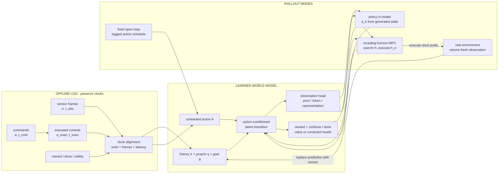
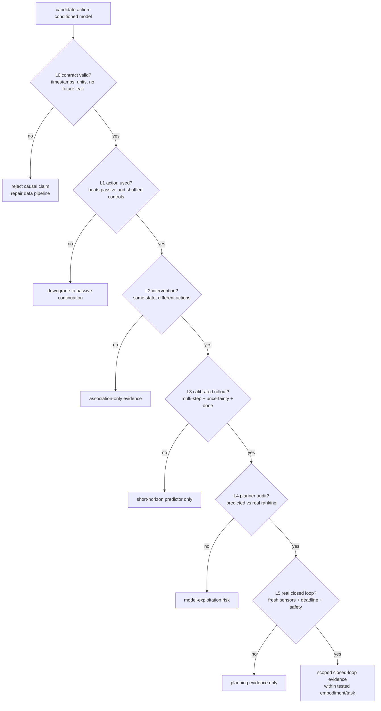
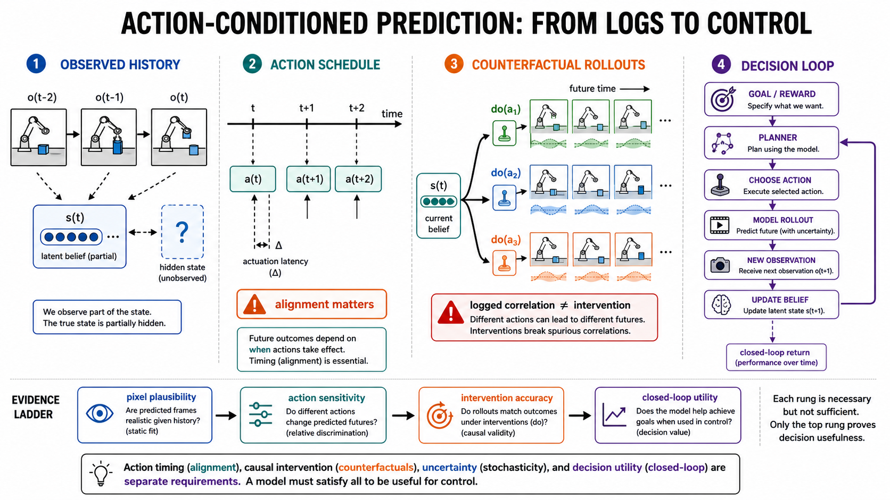

# 动作条件预测：从相关性续写到可干预的闭环世界模型

> 本章冻结于 **2026-08-30（Asia/Shanghai）**。这里的“动作条件”不是在视频 prompt 里加入一个动作词，而是给出有单位、有时间戳、有执行语义的控制量，并检验换动作是否导致正确的不同后果。画面逼真、动作可从视频反推、甚至离线回报很高，都不能单独证明模型是可用于控制的因果世界模型。

检索式、纳排规则、证据等级、逐项来源、仓库版本、负面核验与验证命令见[配套研究记录](../../sources/research_20260830_action_conditioned_prediction.md)。被动未来预测见[视频预测](video-prediction.md)，实时交互系统见[交互式世界生成](interactive-world-generation.md)，更广义的决策模型见[World Model](../world-models.md)。

## 🎯 学习目标

读完本章，应能完成六件事：

1. 严格区分 passive video prediction、action-conditioned observation/world model、policy-conditioned rollout、inverse dynamics 与 joint world-action model；
2. 写清视频、动作、proprioception、reward、termination 的 tensor、概率和时间合同；
3. 判断一个动作条件模型学到的是行为策略相关性，还是经受过干预、换动作和跨策略检验；
4. 分开 pixel、probabilistic latent、task latent、representation 与 token/diffusion 路线的输出和证据出口；
5. 识别 model exploitation、未知动作、随机多未来、延迟和 action chunk 带来的闭环风险；
6. 用最小复现实验和预注册证伪门审查“可规划”“zero-shot policy”或“实时世界模型”主张。

## 📐 1. 先写合同：六种相邻任务不是同一个问题

设部署时已观测的 RGB 历史为

$$
X=o_{1:T_c}\in[0,1]^{B\times T_c\times V\times C\times H\times W},
$$

其中 $V$ 是相机数；未来观测为 $Y=o_{T_c+1:T_c+T_h}$。动作命令不是视频帧的附属标签，而是带执行时刻的序列

$$
A=\{(a_j,t_j^{\mathrm{cmd}},t_j^{\mathrm{exec}})\}_{j=1}^{H_a},
\qquad a_j\in\mathbb R^{d_a}.
$$

离散游戏可用 one-hot 或 token；机器人动作还必须声明绝对/增量、joint/Cartesian、位置/速度/力、坐标系、单位、夹爪编码、控制频率和裁剪范围。缺少这些字段时，$d_a$ 相同也不代表动作语义相同。

| 任务 | 部署条件 | 学习目标或输出 | 它能证明什么 | 不能偷换成什么 |
|---|---|---|---|---|
| **Passive video prediction** | $X$ | $p_\theta(Y\mid X)$ | 观测分布的时间延续 | 换动作后的反事实 |
| **Action-conditioned observation model** | $X,A$ | $p_\theta(Y\mid X,A)$ | 已覆盖行为分布内的动作—观测关联 | 自动等于 $p(Y\mid X,\mathrm{do}(A))$ |
| **Action-conditioned world model** | $X,A$，常含 proprioception/goal | latent transition，加 observation、reward、continue/done 等头 | 若接入并验证 planning，可支持决策 | 仅凭生成视频就称可规划 |
| **Policy-conditioned rollout** | $X,g,\pi$；动作由 rollout 中的状态逐步选择 | $p_\theta^\pi(\tau\mid X,g)$ | policy 在模型内诱导的轨迹分布 | 给定一条固定动作脚本的 open-loop 续写 |
| **Inverse dynamics** | $o_t,o_{t+1}$ 或一段视频 | $q_\phi(a_t\mid o_t,o_{t+1})$ | 从状态变化恢复动作或伪标签 | 正向预测、因果效应或 policy 本身 |
| **Joint world-action model** | $X,g$，训练时可有 $Y,A$ | $p_\theta(Y,A\mid X,g)$ 或耦合的 video/action heads | 视觉 dynamics 与动作生成可共享表示 | 两个头同时存在就已闭环成功 |

最小 world-model 分解可写为

$$
\begin{aligned}
z_t &= E_\theta(o_{\le t},q_{\le t}),\\
z_{t+1} &\sim p_\theta(z_{t+1}\mid z_t,a_t),\\
o_{t+1} &\sim p_\theta(o_{t+1}\mid z_{t+1}),\\
r_t &\sim p_\theta(r_t\mid z_t,a_t),\\
c_t &\sim p_\theta(c_t\mid z_t,a_t),\qquad c_t=1-d_t.
\end{aligned}
$$

$q_t$ 表示 proprioception，$r_t$ 是 reward，$d_t$ 是 termination，$c_t$ 是 continue。decoder 不是所有路线的必需项：MuZero 与 TD-MPC2 直接学习任务相关的 latent、reward/value 或 Q，而不以像素重建为唯一目标 [[6]](#ref-6), [[7]](#ref-7)。但若论文声称“预测的画面正确”，就必须提供 observation decoder 或独立可读的观测预测，不能用 latent control return 替代像素证据。

### 1.1 Open-loop、模型闭环与真实闭环

| 模式 | 动作从哪里来 | 下一步观测从哪里来 | 主要用途 | 最大陷阱 |
|---|---|---|---|---|
| **Fixed open-loop** | 数据集给定 $A_{t:t+H-1}$ | 全部由模型生成 | 测长程动作跟随和漂移 | 与模型无关的固定动作不会暴露 planner exploitation |
| **Policy-in-model rollout** | $a_k\sim\pi(\cdot\mid\hat h_k,g)$ | 模型生成 $\hat o_{k+1}$ | policy ranking、imagined training、search | policy 会主动寻找模型盲点 |
| **Receding-horizon MPC** | 在模型中搜索 $H$ 步，只执行前 $h_e$ 步 | 执行后回读真实传感器 | 抑制累计误差并不断重规划 | sense-to-act 延迟可能超过控制周期 |
| **Real closed-loop policy** | $a_k\sim\pi(\cdot\mid h_k,g)$ | 真实环境返回 $o_{k+1}$ | 最终任务效用与安全证据 | 不能用离线重放或模拟 retargeting 代替 |

policy-conditioned 模型 rollout 是

$$
p_\theta^\pi(\tau\mid X,g)=
\prod_{k=0}^{H-1}
\pi(a_k\mid\hat h_k,g)
p_\theta(\hat o_{k+1},\hat r_k,\hat c_k\mid\hat h_k,a_k),
$$

其中 $\hat h_{k+1}=U(\hat h_k,a_k,\hat o_{k+1})$。真实闭环则把第二项换成未知的 $p_{\rm env}$，并在每次执行后以真实观测更新历史。PlaNet 已把 latent dynamics 接入在线规划；Dreamer 则在 latent imagination 中学习 actor/critic [[3]](#ref-3), [[4]](#ref-4)。DreamerV3 的统一配置进一步同时建模 observation、reward 和 continue flag，并在广泛控制任务上验证 [[5]](#ref-5)。这些是“预测进入决策”的证据，不等于生成逼真长视频。

## ⏱️ 2. 动作时钟、执行延迟与 action chunk

动作条件视频最常见、也最隐蔽的错误是把“第 $j$ 个动作”和“第 $j$ 帧”按数组下标对齐。若相机以 $f_o$ Hz 采样、控制器以 $f_a$ Hz 更新，命令还有延迟

$$
\delta_j=t_j^{\mathrm{exec}}-t_j^{\mathrm{cmd}},
$$

则未来帧 $o_i$ 应条件于在曝光区间内**实际生效**的动作，而不是刚发出的动作。用映射

$$
\alpha(i)=\max\{j:t_j^{\mathrm{exec}}\le t_i^{\mathrm{obs}}\}
$$

指定帧 $i$ 对应的最近已执行命令；若控制器采用 zero-order hold，还要记录 $a_j$ 的保持区间。多相机不同步、rolling shutter、网络排队和执行器爬升都会使单一 $\delta$ 不够，此时应保存每个传感器与执行器的原始时间戳并重新采样。

action chunk $A_{k:k+L-1}$ 同时改变三个合同：模型一次预测/输出的动作数 $L$、实际执行的前缀 $h_e$、以及下一次真实观测到来前的盲飞时间。所谓“7 Hz”可能指 action head 更新、视频 token 解码、完整 chunk 生成或真实 robot control；除非同时给出 batch、硬件、分辨率、上下文、去噪步数、chunk 长度、异步流水和 p50/p95 sense-to-act latency，否则不同论文的 Hz 不可横比。ViPRA 的项目页分别给出 action chunk 与视频生成速率；DreamZero 的技术材料则把原始 chunk 延迟、并行 CFG、KV cache 和异步执行分开报告 [[19]](#ref-19), [[21]](#ref-21)。

**顺序化文字替代：**

1. 记录原始观测时刻、命令时刻、实际执行时刻、reward、done 和安全事件。
2. 先统一单位、坐标系与时钟，再形成观测历史和未来动作条件。
3. world model 更新 latent，并分别输出观测与任务头。
4. fixed open-loop 使用记录动作；policy-in-model 根据生成状态选下一动作。
5. MPC 在模型中搜索多个候选，只把短前缀交给真实环境；新传感器观测必须替换生成状态再重规划。

## 🧪 3. 条件概率不是自动的因果干预

离线机器人数据通常由行为策略 $\mu$ 采集。若隐藏变量 $u_t$ 同时影响动作与结果，例如操作员只在物体将滑落时收紧夹爪，则

$$
p(o_{t+1}\mid o_t,a_t)
\neq
p(o_{t+1}\mid o_t,\mathrm{do}(a_t)).
$$

高容量模型可能只从场景、操作者或任务阶段猜出“常见动作之后常见的画面”。要把主张提升到可干预 dynamics，至少需要：

1. **动作支持度：** 同一类状态附近存在多个动作，而不是每个状态只出现一种专家动作；
2. **配对分支：** 从相同 simulator state 或可重复 reset 的真实状态执行不同动作，比较分支方向与幅度；
3. **跨策略切分：** 训练行为策略与测试策略不同，避免随机帧切分把同一轨迹模板泄漏到测试集；
4. **负对照：** action shuffle、time shift、zero action、单位/坐标扰动，以及完全不看动作的 passive baseline；
5. **机制可读性：** 报告接触、遮挡、相机运动与执行器饱和时的条件误差，而不是只给全局 FVD。

inverse dynamics 在这里是工具而不是答案。Genie 从无动作标签视频学习 latent action，DreamGen 用 latent action/inverse dynamics 给合成视频恢复伪动作；这能扩充交互表征或训练数据，却不能证明伪动作等于某台机器人的可执行命令 [[10]](#ref-10), [[17]](#ref-17)。只有 forward branch 在同状态、不同真实动作下预测正确，并最终经受 policy 或 MPC 选择，才构成更强证据。

## 🧭 4. 五条技术路线：表示与用途决定验收方式

### 4.1 Pixel motion：动作直接改变可见内容

Oh 等人在 Atari 中把动作变换嵌入卷积编码—解码网络，证明同一历史在不同游戏动作下可产生不同未来帧 [[1]](#ref-1)。Finn 等人的 DNA、CDNA、STP 则让机器人动作驱动像素搬运或空间变换，在真实 pushing 数据上强化物体延续先验 [[2]](#ref-2)。这类方法的优势是动作效应可视、debug 直接；局限是新显露区域、复杂接触、长程遮挡与多峰未来容易模糊或漂移。

### 4.2 Probabilistic latent：把不确定动力学与任务头放进状态空间

PlaNet 的 recurrent state-space model 组合 stochastic 与 deterministic latent transition，并用在线规划选择动作 [[3]](#ref-3)。Dreamer 系列把 policy/value 学习搬到 latent imagination，DreamerV3 明确预测 observation、reward 与 continue [[4]](#ref-4), [[5]](#ref-5)。这条路线的关键不是“latent 比像素高级”，而是 posterior/prior、reward calibration、termination 和 rollout state 都有可训练概率合同；若只重建短视频而不校验 reward/done，planner 仍可能被虚假高回报或永不终止的轨迹欺骗。

### 4.3 Task latent：只保留决策需要的信息

MuZero 学习用于 planning 的 latent dynamics、reward、policy 与 value，而不要求恢复完整像素 [[6]](#ref-6)。TD-MPC2 用 decoder-free latent world model、短视野规划和价值函数覆盖多种连续控制任务 [[7]](#ref-7)。其强项是把模型容量投向任务充分统计量；风险是任务改变后，先前被丢弃的几何、对象身份或安全变量无法恢复。因此“control 成功”只支持给定 reward/task，不自动支持通用视觉模拟。

### 4.4 Representation prediction：借视觉先验降低动作数据需求

DINO-WM 冻结 DINOv2 patch feature，用离线轨迹学习 action-conditioned feature dynamics，并在测试时优化动作序列；正式论文把证据限制在六个环境和相应规划协议，官方仓库提供实现 [[8]](#ref-8), [[9]](#ref-9)。V-JEPA 2 先用超过百万小时 action-free 视频训练视觉 encoder，再用少量带动作机器人数据后训练 V-JEPA 2-AC；必须把“基础 encoder 的无动作预训练”和“AC predictor 的机器人规划结果”分开 [[15]](#ref-15), [[16]](#ref-16)。LeWorldModel 则探索小型端到端 JEPA 与 latent MPC，但截至冻结日仍是预印本，证据面不应写成已正式同行评审 [[29]](#ref-29)。

### 4.5 Token/diffusion 与 joint world-action：生成未来，也生成动作

Genie 把视频 token、latent action 与 autoregressive dynamics 组合成可交互环境；DIAMOND 和 GameNGen 进一步展示 diffusion environment model 可支撑游戏 agent 训练或实时交互，DIAMOND 另有官方代码与 playable artifact 入口 [[10]](#ref-10), [[11]](#ref-11), [[12]](#ref-12), [[13]](#ref-13)。这些结果证明生成模型可以进入交互回路，但游戏中的离散、低延迟动作不等于机器人中有单位、受接触和安全约束的连续控制。

2025–2026 的 world-action 路线开始让视频与动作互相约束：ViPRA 先学习 future observation 与 motion-centric latent action，再用少量演示把 latent action 解码为连续 action chunk [[19]](#ref-19)；DreamZero 用联合 video-action diffusion 直接输出动作，并在执行后以真实观测刷新缓存 [[21]](#ref-21)；GigaWorld-Policy 让 action token 不读取 future-video token，强调部署时可只走 action path [[23]](#ref-23)。A2World 扩展多 embodiment、多视角预训练，MultiWorld 扩展多智能体、多视角条件 [[25]](#ref-25), [[27]](#ref-27)。共同难题不是再加一个 action head，而是避免 future video 泄漏、统一不同 action space，并证明生成分支确实改善而非拖慢闭环策略。

## 🪜 5. 里程碑是能力转折，不是论文年份清单

| 能力转折 | 代表证据 | 新获得的能力 | 仍未解决的门 |
|---|---|---|---|
| **动作进入视觉转移** | Atari action-conditioned frames；机器人 pixel transformation [[1]](#ref-1), [[2]](#ref-2) | 同一历史可按动作分叉 | 长程、多峰、跨场景和真实控制效用 |
| **latent imagination 接上 planning** | PlaNet、Dreamer [[3]](#ref-3), [[4]](#ref-4) | 预测模型从观测器变成决策组件 | reward/done 偏差与 planner exploitation |
| **任务充分而非像素完整** | MuZero、TD-MPC2 [[6]](#ref-6), [[7]](#ref-7) | 无需重建每个像素也能规划 | 新任务、可解释性和安全变量是否保留 |
| **无标签视频获得可交互 token/latent action** | Genie [[10]](#ref-10) | 从 action-free 视频挖交互结构 | latent action 到真实执行器的标定 |
| **生成环境进入 agent 训练或实时游戏** | DIAMOND、GameNGen [[11]](#ref-11), [[13]](#ref-13) | policy 真正消费生成状态 | 单游戏窄域、真实物理与端到端延迟 |
| **视觉基础模型 + 少量动作后训练** | V-JEPA 2-AC、DINO-WM [[8]](#ref-8), [[15]](#ref-15) | 减少带动作视觉数据需求 | 跨 embodiment、动作 OOD 与隐藏接触 |
| **世界模型生成数据训练策略** | DreamGen [[17]](#ref-17) | 把视频生成转成离线 policy 数据增益 | 它不是在线 MPC 或真实 sensor 闭环 |
| **joint video-action 直接部署动作** | ViPRA、DreamZero、GigaWorld-Policy [[19]](#ref-19), [[21]](#ref-21), [[23]](#ref-23) | 视觉 dynamics 与 action chunk 共用生成主干 | 因果隔离、实时性、长程纠错和 release 可复现性 |

## 🔭 6. 2025–2026 前沿：结果面与 release surface 必须同表阅读

下表的“正式”只指可定位的正式 proceedings/journal；“预印本”不等于结果无效，但其主张、版本和工件要单独冻结。官方项目页是作者演示面，官方仓库/模型卡才回答能否复现；三者不可互相代替。

| 工作 | 截止冻结日的公开状态 | 核心合同 | release surface | 本章采用的证据边界 |
|---|---|---|---|---|
| **DINO-WM** | ICML 2025 正式论文 | frozen visual features + action-conditioned latent dynamics + test-time planning | 官方代码仓库 | 支持论文六个环境内的离线动力学与规划，不外推像素级通用模拟 [[8]](#ref-8), [[9]](#ref-9) |
| **DreamGen** | CoRL 2025 正式论文 | video WM 生成视频，IDM/latent action 恢复伪动作，再训练 policy | 官方项目页与代码 | 支持离线数据增强和作者报告的 policy 改善；不称在线 world-model control [[17]](#ref-17), [[18]](#ref-18) |
| **V-JEPA 2 / 2-AC** | 2025 arXiv；官方研究页/代码 | action-free encoder 预训练；AC predictor 接机器人动作 | 代码与 checkpoints | 只把机器人规划归因于 AC 后训练，不把基础模型本身称 action-conditioned [[15]](#ref-15), [[16]](#ref-16) |
| **ViPRA** | ICLR 2026 正式论文 | joint future observation + latent action；flow decoder 输出 action chunks | 官方项目、代码、模型与数据 | 形式上闭合且有 release；不同页面的 Hz 按各自合同保留，不合并成单一实时数字 [[19]](#ref-19), [[20]](#ref-20) |
| **DreamZero** | 2026 arXiv | 14B joint video-action diffusion；真实观测回灌 | 官方项目与仓库 | 作者报告真实闭环与约 7 Hz；“zero-shot”仅限其预训练、机器人和任务分布，不写成任意机器人通用 [[21]](#ref-21), [[22]](#ref-22) |
| **GigaWorld-Policy / 0.5** | 2026 两个独立 arXiv 版本 | action-centered causal attention；可选 video generation；0.5 另有部署栈 | 官方仓库、weights 与 runtime 入口 | 原论文与 0.5 不混版本；仓库延迟数字只作为作者 release 声明 [[23]](#ref-23), [[24]](#ref-24) |
| **A2World** | 2026 arXiv；arXiv comments 与仓库标注 ECCV 2026 accepted | 多 embodiment、多视角 action-conditioned diffusion；另有 policy 变体 | 官方代码与模型卡 | 截止冻结日未以官方 proceedings 独立核到会议页面，因此正文仍以预印本为技术来源，并把会议状态限定为作者元数据 [[25]](#ref-25), [[26]](#ref-26) |
| **MultiWorld** | 2026 arXiv | multi-agent、multi-view action-conditioned video | 官方代码、训练/数据/权重入口 | 支持作者实验域内扩展；多视角一致不自动等于多主体因果归因 [[27]](#ref-27), [[28]](#ref-28) |
| **LeWorldModel** | 2026 arXiv | compact end-to-end JEPA + latent MPC | 官方代码、checkpoint/data 入口 | 作为紧凑 representation 路线候选，不称正式 venue 结论 [[29]](#ref-29) |
| **Genie 3** | 2025 官方研究预览 | text/image-conditioned interactive world demo | 有限研究预览；未见论文与公开 checkpoint | 只报告官方演示的 720p、24 FPS、数分钟一致性及有限动作空间；不列为可复现模型 [[14]](#ref-14) |

release surface 还要冻结精确 commit、license、权重是否真的可下载、训练代码还是仅 inference demo。配套研究记录给出了本章逐仓库的 2026-08-30 HEAD；正文不把“仓库存在”简写为“论文完全可复现”。

## 🎲 7. 多模态、不确定性与 model exploitation

### 7.1 两种不确定性必须分开

即使动作已知，未来仍可能因遮挡物体、未观测速度、接触摩擦、其他 agent 与传感噪声而多峰。这是 aleatoric uncertainty；用单个 L2 像素点估计会把互斥结果平均。动作超出训练支持、相机/机器人改变或模型参数数据不足，则主要是 epistemic uncertainty。可用随机 latent/diffusion 表示前者，用 ensemble、密度比、action support estimator 或 disagreement 暴露后者；一个“更模糊”的样本不能代替二者校准。

对候选动作序列 $A$，风险敏感规划可写为

$$
J(A)=
\mathbb E_\theta\!\left[\sum_{k=0}^{H-1}\gamma^k r_k\right]
-\beta\sqrt{\mathrm{Var}_\theta(R(A))}
-\lambda U_{\mathrm{OOD}}(A),
$$

或直接优化 return 的下分位数/CVaR。无论选择哪种形式，都要分别报告生成随机性、模型 ensemble 与 planner 随机性的 seed 和样本数；best-of-$K$ 视觉样本不能用来计算 policy 实际可获得的期望回报。

### 7.2 Planner 会把小误差变成系统性漏洞

open-loop 平均误差小，不代表可规划。优化器会在大量候选中挑出被模型**过高估计**但现实中失败的动作：穿过物体、利用未建模接触、让 reward head 永不终止，或走向训练分布外的极端控制。RLVR-World 表明可用可验证 reward 后训练 tokenized world model，但它同时提醒评估目标本身必须可验证；代理 reward 被优化并不等于物理正确 [[33]](#ref-33)。

最小 exploitation audit 应保存每轮 MPC 的全部候选、模型预测 return、uncertainty、最终选择和真实 return，并检查：

- 预测排序与真实排序的 Spearman 相关，而不只是 top-1 成功样例；
- 被选择动作是否比行为数据更 OOD、更饱和或更抖动；
- 预测 return 与真实 return 的 optimism gap 是否随搜索预算增加；
- 增大候选数时表现是否先升后降；若下降，planner 正在更有效地寻找模型漏洞；
- uncertainty penalty、短 horizon 或真实观测回灌能否关闭该缺口。

## 📏 8. 评测：从动作敏感到真实闭环的证据阶梯

WorldGym 用 autoregressive action-conditioned video、Monte Carlo policy rollout 与视觉语言 reward 评估策略排序；作者发现排序可与真实表现相关，但也明确暴露现实物体交互不足，因此 policy ranking 不能升级为绝对物理精度或安全认证 [[30]](#ref-30)。RoboWM-Bench 把生成行为经 inverse dynamics/retargeting 后送入物理模拟执行，能发现接触和空间错误，但这个链路仍不是“原始模型直接控制真实机器人” [[31]](#ref-31)。MiraBench 把 physics adherence、action-following fidelity 与 optimism bias 分开，并显示视觉保真不能可靠替代动作正确性 [[32]](#ref-32)。

**顺序化文字替代：**

1. 先检查时间戳、单位、坐标和未来信息泄漏；失败时不能讨论因果。
2. 动作条件模型必须胜过 passive、action-shuffle 和 time-shift 对照。
3. 再从相同状态执行不同动作，检查预测分支的方向与幅度。
4. 通过后才评价长 rollout、分布校准、reward 与 done。
5. planning 阶段比较模型排序和真实排序，寻找 model exploitation。
6. 最后在实时 deadline 内回灌真实传感器并测安全；结论只覆盖已测 embodiment 和任务。

### 8.1 十个 benchmark trap

1. **视觉指标代替动作指标：** FVD、LPIPS 或 VLM 偏好可能忽略“左/右动作结果相同”。
2. **随机帧切分泄漏策略：** 同一场景、操作者和轨迹模板进入 train/test，使模型靠上下文猜动作。
3. **只测记录动作：** fixed open-loop 没有 policy selection，无法暴露搜索诱发的模型漏洞。
4. **action index 假对齐：** 忽略命令—执行延迟、帧曝光或 action hold，模型被迫学习相移。
5. **坐标和归一化不透明：** 机器人 base/tool/camera frame 或 absolute/delta 混淆可让复制结果完全相反。
6. **best-of-$K$ 冒充期望：** 事后挑最像真值的样本不是 policy 在线能选到的结果。
7. **inverse dynamics 链路遮蔽错误：** retargeter 或 simulator 修正了生成视频，不代表原模型动作可执行。
8. **Hz 偷换：** token、frame、chunk、policy update 与 actuator rate 不同；平均 throughput 也不是 p95 latency。
9. **“zero-shot”不写分母：** 是否见过任务语言、对象、机器人、相机、动作 tokenizer 和同源数据必须列清。
10. **终止与安全缺席：** 画面可继续生成，但任务可能已失败、碰撞或越界；无 done/safety audit 不能做长程控制主张。

## 🧰 9. 最小复现实验：ActionFork-2D

这个实验不是新排行榜，而是一套可在单卡或 CPU 小模型上完成的**因果冒烟测试**。目标是先证明模型真的使用动作，再谈大规模视频先验。

### 9.1 环境与数据

- 构造可精确 reset 的 $64\times64$ 俯视 2D puck-pushing 环境：一个 agent、一个可推动圆盘、一个目标区和一面障碍；保存内部状态仅用于评价，模型只看 RGB。
- 相机 16 Hz，控制 4 Hz；每个动作 $a_t=(\Delta x,\Delta y)$ 保持 4 帧。人工加入固定 1 帧或随机 $\{0,1,2\}$ 帧执行延迟，并保存 `t_obs/t_cmd/t_exec`。
- 每条轨迹观测前缀 $T_c=8$ 帧，预测 $T_h=16$ 帧；动作 horizon $H_a=4$。训练至少含随机、目标导向和避障三种行为策略。
- 从 200 个完全相同的 reset state 各执行左/右、推/停等成对动作，形成独立 intervention test；另留出较大动作幅度、不同摩擦和未见障碍位置作为 OOD。
- 按初始 state、场景 seed 和行为策略分组切分，不按帧随机切分；运行 5 个模型 seed，公开原始轨迹与时间对齐脚本。

### 9.2 四个基线与同预算模型

1. **Passive：** $p(Y\mid X)$，完全不读动作；
2. **Shuffled：** 同架构但在 batch 内打乱 $A$；
3. **Action-aware：** $p(Y\mid X,A)$，可用小型 ConvGRU 或 latent transition；
4. **Oracle-state：** 读取模拟器内部状态的已知动力学或 MLP，给出可达到的上界。

所有学习模型使用相同训练轨迹、参数量级、更新步数和 rollout horizon。随机模型每个输入固定采样 $K=20$；必须同时报 sample-average 与 best-of-$K$，闭环 planner 只能使用在部署时可计算的期望/风险分数。

### 9.3 指标、MPC 与证伪门

从真值和生成帧用同一冻结的几何解析器提取 agent/puck 坐标，报告：

- open-loop ADE/FDE、碰撞/穿透率、puck 位移方向和 action sensitivity；
- 成对干预的 branch accuracy，以及预测位移差与真实位移差的误差；
- 50%、80%、90% predictive region 的 empirical coverage 和 sharpness；
- reward/done 的 Brier score、ECE 与提前/延迟终止误差；
- MPC horizon $H=8$、每轮 256 个候选、只执行 $h_e=1$ 后回读真实帧的 success、return、碰撞和 p95 sense-to-act latency；
- 候选 predicted return 与真实 counterfactual return 的 Spearman 相关、top-1 optimism gap，并画出候选数从 16 到 1024 时的 exploit curve。

在训练前预注册以下**仅针对这个受控环境**的门：

1. 时间对齐单元测试 100% 通过，任一 future frame/action 泄漏即停止；
2. action-aware 的 paired-branch accuracy 至少 90%，且其 FDE 相比 shuffled 中位改善至少 30%，5-seed bootstrap 95% CI 不跨 0；
3. 将动作整体平移一格或交换左右后性能显著下降，否则判定模型忽略或错位使用动作；
4. 90% predictive region 的 coverage 位于 85%–95%，并同时报告区域大小，防止无限变宽过关；
5. MPC success 距 oracle-state 不超过 10 个百分点、比 passive 高至少 20 个百分点，p95 latency 小于 250 ms 控制周期；
6. 256 候选下 predicted/real return 的 Spearman $\rho\ge0.7$，top-1 optimism gap 不超过归一化 reward range 的 10%；若增加搜索预算反而恶化真实 return，model-exploitation 门失败；
7. OOD action/摩擦上若误差上升，uncertainty 也必须上升；否则只能声称 ID 预测，不能声称安全 OOD planning。

通过这些门只证明“小型受控环境中，动作因果对齐可复现”。它不能推出真实机器人、互联网视频或开放世界泛化；扩大主张必须逐级增加 embodiment、相机、策略、对象、接触和真实闭环证据。

**图注：** 左侧提醒部分可观测性；第二栏把动作命令放到独立时钟并显式标出执行延迟；第三栏从同一当前 belief 施加不同 `do(a)`，要求未来随动作正确分叉；右侧只有在 goal/reward、planner、rollout、真实新观测和 belief update 闭合后才报告 return。该图给出最短主线，inverse dynamics、reward/done 校准、planner exploitation 与三种 rollout 的精确分支仍以第 2 节 Mermaid 和第 7–9 节文字为准。

**图的顺序化文字替代：**

1. 多帧观测只能形成部分 belief，真实状态可能仍有未观测变量。
2. $a(t)$、$a(t+1)$ 与观测有各自时钟；执行延迟 $\Delta$ 错一格就会污染条件合同。
3. 从同一 $s(t)$ 分别执行 $\mathrm{do}(a_1)$、$\mathrm{do}(a_2)$、$\mathrm{do}(a_3)$，模型应给出不同且带不确定性的未来；日志相关性不能替代干预。
4. 规划器比较 rollout 后只执行选择的动作，真实新观测更新 belief 并进入下一轮。
5. 证据依次检查 pixel plausibility、action sensitivity、intervention accuracy 与 closed-loop utility；前三级都不能替代最终决策效用。

## ✅ 10. 阅读任何新工作时的最小核对表

- [ ] 输入动作是否有单位、坐标系、频率、时间戳、延迟和 chunk 语义？
- [ ] 测试时是否只使用历史观测、goal 和可用动作，没有 future-video/token 泄漏？
- [ ] 任务是 fixed action continuation、policy-in-model、MPC，还是 fresh-sensor real closed-loop？
- [ ] inverse dynamics/latent action 是否被误写成 forward dynamics 或可执行 policy？
- [ ] 是否有 passive、action-shuffle、time-shift 与同状态异动作对照？
- [ ] aleatoric 多未来与 epistemic/OOD uncertainty 是否分别评估？
- [ ] reward、termination、constraint 与 pixel/latent prediction 是否各自校准？
- [ ] planner 搜索预算增加时，真实回报是否因 exploitation 下降？
- [ ] “实时”“zero-shot”“跨 embodiment”是否写出硬件、延迟分位数和未见数据的精确分母？
- [ ] 正式论文、arXiv 版本、项目页、代码、weights、数据和 license 是否逐项核验？

## 🔗 11. 与本站其他章节的关系

- [视频预测](video-prediction.md)给出 past-only、随机未来、forcing 和 rollout 的通用合同；本章只增加动作、干预和决策回路。
- [交互式世界生成](interactive-world-generation.md)关注持续实时响应、状态持久性和端到端体验；动作条件短 rollout 只是其一个组件。
- [World Model](../world-models.md)讨论更广泛的 representation、planning 与控制；本章提供动作视频模型的证伪细节。
- [JEPA](../jepa.md)解释 representation prediction；本章强调 action-conditioned predictor 与 action-free encoder 不能混写。
- [评测指南](../evaluation.md)提供视频质量指标；本章要求在其上增加 paired intervention、policy ranking、latency、reward/done 与真实闭环。

## 📚 参考文献

[1] Junhyuk Oh, Xiaoxiao Guo, Honglak Lee, Richard Lewis, Satinder Singh. [Action-Conditional Video Prediction using Deep Networks in Atari Games](https://proceedings.neurips.cc/paper_files/paper/2015/hash/6ba3af5d7b2790e73f0de32e5c8c1798-Abstract.html). NeurIPS. 2015.

[2] Chelsea Finn, Ian Goodfellow, Sergey Levine. [Unsupervised Learning for Physical Interaction through Video Prediction](https://proceedings.neurips.cc/paper/2016/hash/d9d4f495e875a2e075a1a4a6e1b9770f-Abstract.html). NeurIPS. 2016.

[3] Danijar Hafner, Timothy Lillicrap, Ian Fischer, Ruben Villegas, David Ha, Honglak Lee, James Davidson. [Learning Latent Dynamics for Planning from Pixels](https://proceedings.mlr.press/v97/hafner19a.html). ICML. 2019.

[4] Danijar Hafner, Timothy Lillicrap, Jimmy Ba, Mohammad Norouzi. [Dream to Control: Learning Behaviors by Latent Imagination](https://openreview.net/forum?id=S1lOTC4tDS). ICLR. 2020.

[5] Danijar Hafner, Jurgis Pasukonis, Jimmy Ba, Timothy Lillicrap. [Mastering diverse control tasks through world models](https://www.nature.com/articles/s41586-025-08744-2). Nature 640, 647–653. 2025.

[6] Julian Schrittwieser et al. [Mastering Atari, Go, chess and shogi by planning with a learned model](https://www.nature.com/articles/s41586-020-03051-4). Nature 588, 604–609. 2020.

[7] Nicklas Hansen, Hao Su, Xiaolong Wang. [TD-MPC2: Scalable, Robust World Models for Continuous Control](https://openreview.net/forum?id=Oxh5CstDJU). ICLR. 2024.

[8] Gaoyue Zhou et al. [DINO-WM: World Models on Pre-trained Visual Features enable Zero-shot Planning](https://proceedings.mlr.press/v267/zhou25a.html). ICML. 2025.

[9] DINO-WM authors. [Official DINO-WM repository](https://github.com/gaoyuezhou/dino_wm). GitHub. Accessed 2026-08-30.

[10] Jake Bruce et al. [Genie: Generative Interactive Environments](https://proceedings.mlr.press/v235/bruce24a.html). ICML. 2024.

[11] Eloi Alonso, Adam Jelley, Vincent Micheli, Anssi Kanervisto, Amos Storkey, Tim Pearce, François Fleuret. [Diffusion for World Modeling: Visual Details Matter in Atari](https://proceedings.neurips.cc/paper_files/paper/2024/hash/6bdde0373d53d4a501249547084bed43-Abstract-Conference.html). NeurIPS. 2024.

[12] DIAMOND authors. [Official DIAMOND repository](https://github.com/eloialonso/diamond). GitHub. Accessed 2026-08-30.

[13] Dani Valevski, Yaniv Leviathan, Moab Arar, Shlomi Fruchter. [Diffusion Models Are Real-Time Game Engines](https://openreview.net/forum?id=P8pqeEkn1H). ICLR. 2025.

[14] Google DeepMind. [Genie 3: A new frontier for world models](https://deepmind.google/blog/genie-3-a-new-frontier-for-world-models/). Official research preview. 2025-08-05.

[15] Mahmoud Assran et al. [V-JEPA 2: Self-Supervised Video Models Enable Understanding, Prediction and Planning](https://arxiv.org/abs/2506.09985). arXiv:2506.09985. 2025.

[16] Meta AI Research. [Official V-JEPA 2 repository](https://github.com/facebookresearch/vjepa2). GitHub. Accessed 2026-08-30.

[17] Joel Jang et al. [DreamGen: Unlocking Generalization in Robot Learning through Video World Models](https://proceedings.mlr.press/v305/jang25a.html). CoRL. 2025.

[18] NVIDIA GEAR. [DreamGen project and GR00T-Dreams release](https://research.nvidia.com/labs/gear/dreamgen/). Official project page. Accessed 2026-08-30.

[19] Sandeep Routray, Hengkai Pan, Unnat Jain, Shikhar Bahl, Deepak Pathak. [ViPRA: Video Prediction for Robot Actions](https://openreview.net/forum?id=w3Ik8HUyTT). ICLR. 2026.

[20] ViPRA authors. [Official ViPRA project and release](https://vipra-project.github.io/). Accessed 2026-08-30.

[21] Seonghyeon Ye et al. [World Action Models are Zero-shot Policies](https://arxiv.org/abs/2602.15922). arXiv:2602.15922. 2026.

[22] DreamZero authors. [Official DreamZero project and code](https://dreamzero0.github.io/). Accessed 2026-08-30.

[23] Angen Ye et al. [GigaWorld-Policy: An Efficient Action-Centered World-Action Model](https://arxiv.org/abs/2603.17240). arXiv:2603.17240. 2026.

[24] GigaAI team. [GigaWorld-Policy-0.5](https://arxiv.org/abs/2607.13960) and [official release repository](https://github.com/open-gigaai/giga-world-policy). 2026.

[25] Ze Huang, Jiahui Zhang, Hairuo Liu, Chenxi Zhang, Ran Cheng, Li Zhang. [Learning Transferable Dynamics Priors from Action to World Modeling](https://arxiv.org/abs/2606.29501). arXiv:2606.29501. 2026.

[26] A2World authors. [Official A2World repository](https://github.com/LogosRoboticsGroup/A2World) and [model card](https://huggingface.co/Fleurrr/A2World-World-Model). Accessed 2026-08-30.

[27] Haoyu Wu, Jiwen Yu, Yingtian Zou, Xihui Liu. [MultiWorld: Scalable Multi-Agent Multi-View Video World Models](https://arxiv.org/abs/2604.18564). arXiv:2604.18564. 2026.

[28] MultiWorld authors. [Official MultiWorld repository](https://github.com/CIntellifusion/MultiWorld). GitHub. Accessed 2026-08-30.

[29] Lucas Maes, Quentin Le Lidec, Damien Scieur, Yann LeCun, Randall Balestriero. [LeWorldModel: Stable End-to-End Joint-Embedding Predictive Architecture from Pixels](https://arxiv.org/abs/2603.19312) and [official repository](https://github.com/lucas-maes/le-wm). 2026.

[30] WorldGym authors. [WorldGym: World Model as an Environment for Policy Evaluation](https://openreview.net/forum?id=hidBHy1CAw) and [official project page](https://world-model-eval.github.io/). ICLR. 2026.

[31] RoboWM-Bench authors. [RoboWM-Bench: A Benchmark for Evaluating World Models in Robotic Manipulation](https://openaccess.thecvf.com/content/CVPR2026W/GigaBrainChallenge/html/Jiang_RoboWM-Bench_A_Benchmark_for_Evaluating_World_Models_in_Robotic_Manipulation_CVPRW_2026_paper.html). CVPR Workshops. 2026.

[32] Tianzhuo Yang et al. [MiraBench: Evaluating Action-Conditioned Reliability in Robotic World Models](https://arxiv.org/abs/2605.29360). arXiv:2605.29360. 2026.

[33] RLVR-World authors. [RLVR-World: Training World Models with Reinforcement Learning](https://proceedings.neurips.cc/paper_files/paper/2025/hash/b63a24a1832bd14fa945c71f535c0095-Abstract-Conference.html). NeurIPS. 2025.
