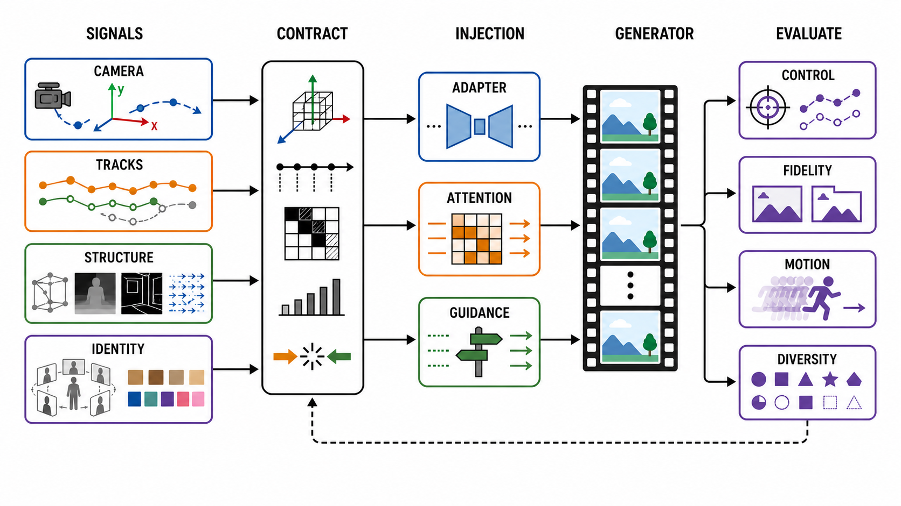
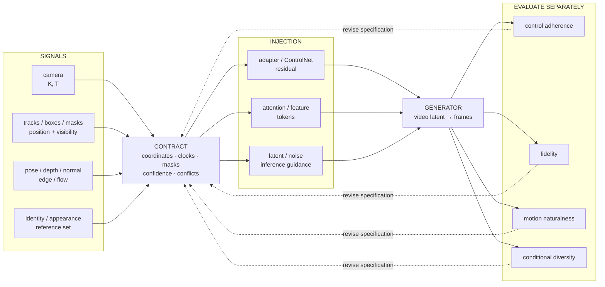

# 细粒度可控视频生成：从控制信号到可证伪的条件合同

> 本章冻结于 **2026-08-30（Asia/Shanghai）**。“可控”不是一个形容词，而是一份可执行合同：用户给了什么信号，信号使用什么坐标和时间基准，从哪个位置进入生成器，与其他条件冲突时谁优先，以及如何证明输出真的遵循了它。

检索式、纳排标准、发表/代码/权重/产品状态核验、逐篇证据等级与图像审计见[配套研究记录](../../sources/research_20260830_controllable_video.md)。

## 🎯 1. 学习目标

读完本章，应能完成七件事：

1. 用输入、输出和保真对象区分可控生成、I2V、V2V editing、story/multishot 与 action-conditioned world model；
2. 为相机、点轨迹、框/掩码、骨架、深度/法线/边缘/光流和外观参考写出带形状、坐标、可见性和时钟的 tensor 合同；
3. 判断条件经过 training-time adapter/ControlNet、attention/feature injection、latent/noise optimization，还是 inference-time guidance；
4. 解释控制遵循、参考保真、运动自然性和条件多样性为何不能压成一个总分；
5. 将轨迹串身、多对象冲突、身份漂移、遮挡失败和新视角坍塌定位到具体信号或注入路径；
6. 对一篇新论文分别核验首发、正式发表、代码、权重、数据/评测集与产品可用性；
7. 设计一个会在错误控制下失败、而不是只会奖励漂亮 demo 的复现协议。

## 🧭 2. 任务边界：可控不等于任何带条件的视频

本章把**细粒度可控视频生成**定义为：给定文本、可选图像锚点与一个或多个显式时空控制信号 $C$，学习或采样

```math
Y\sim p_\theta(Y\mid c_{\mathrm{text}},R,C),
```

其中 $C$ 必须能映射到可观测的相机、对象、姿态、结构或外观属性，并允许对“信号是否生效”做独立测量。只有文本 prompt 的 T2V 也是条件生成，但通常不属于本章所说的细粒度控制。

| 相邻任务 | 输入时间轴 | 主要保真对象 | 本章与它的交集 | 不能混写的证据 |
|---|---|---|---|---|
| [I2V](image-to-video.md) | 一张/多张图像是输出中已知时刻 | 锚点帧、身份、可见内容 | I2V + 相机/轨迹/姿态控制是可控生成子集 | 首帧相似不证明轨迹生效 |
| [开放集视频个性化](personalized-video-generation.md) | 主体参考通常不占输出时间轴 | 开放集主体身份与关键属性 | identity / appearance 可作为一类控制条件 | identity score 不证明 prompt/运动、多主体绑定或无泄漏 |
| [V2V editing](video-to-video.md) | 完整源视频已给定 | 未编辑区域、原运动/时序 | 可用轨迹或相机信号改动源视频 | 只有首帧时不能宣称守住了源运动 |
| [story/multishot](story-multishot.md) | 多镜头状态与切镜计划 | 角色、道具、关系和叙事状态 | 每个镜头可有相机/对象控制 | 单镜头轨迹成功不证明跨镜头连续 |
| [action-conditioned prediction](action-conditioned-prediction.md) | 历史观测 + 环境可执行 action | 状态转移、动作后果 | 动作可编码为视觉控制，但还需环境语义 | 拖动一个点不等于执行机器人 action |
| [interactive world generation](interactive-world-generation.md) | 在线 action、观测、记忆循环 | 持久状态与反事实可达性 | 实时可控视频可作前端 | 作者报告 FPS 不证明闭环可玩性 |

ReCapture 接收用户完整视频并在新相机轨迹下重生成，因而它是**相机可控的 V2V**，不是无源视频的 camera-conditioned generation [[18]](#ref-18)。2026 年的 3D point-track motion editing 同时给源视频和源/目标 3D tracks，也应在 V2V 守恒合同下验收 [[33]](#ref-33)。

EgoControl 虽以 3D 全身姿态控制第一人称未来视频，但输入仍是视觉姿态，而不是环境可执行 action；因此它是 egocentric pose-conditioned generation，不能仅凭“第一人称”和“未来预测”改写成闭环 world model [[32]](#ref-32)。

## 📐 3. 先写控制合同，再谈模型

对第 $k$ 类条件，用一个八元组保存它的真实语义：

```math
C_k=(s_k,\tau_k,\mathcal F_k,v_k,m_k,q_k,w_k,\pi_k).
```

- $s_k$：原始信号；
- $\tau_k$：帧时间或世界时间；
- $\mathcal F_k$：pixel、normalized image、camera 或 world 坐标系；
- $v_k$：可见性/遮挡状态；
- $m_k$：有效区域或对象归属；
- $q_k$：置信度/标注质量；
- $w_k$：条件强度与时间 schedule；
- $\pi_k$：与其他条件冲突时的优先级和退让规则。

两篇论文即使都写“trajectory control”，只要一篇的 $s_k$ 是无深度的 2D point track，另一篇是带 6DoF 姿态的 3D entity trajectory，它们就不是同一合同。3DTrajMaster 显式输入多对象 6DoF 序列，注入位置是 gated self-attention 的 3D-motion grounded object injector [[20]](#ref-20)；Motion Prompting 的表示则可稀疏、稠密、对象级或全局，但仍是时空轨迹提示 [[15]](#ref-15)。

### 3.1 一张图读懂“信号—合同—注入—验收”





**图的顺序化文字替代：**

1. 输入分成四类：相机内外参、对象轨迹/框/掩码、姿态/深度/法线/边缘/光流结构序列，以及身份/外观参考。
2. 所有信号必须先进入合同层，统一坐标、时钟、有效掩码、可见性、置信度与冲突优先级。
3. 规范化后的条件经三类路径进入模型：adapter/ControlNet residual、attention/feature tokens，latent/noise 操作或推理 guidance。
4. 生成器输出视频，但不使用一个总分验收。
5. 控制遵循、参考保真、运动自然性和条件多样性分别过门。
6. 任一门失败时，先回到合同层定位语义、时钟、冲突或注入问题；该反馈箭头不表示自动训练更新。

## 🎥 4. 控制信号的五条技术路线

### 4.1 Camera：extrinsics 和 intrinsics 必须分开

一条最小相机合同包含

```math
K_t=\begin{bmatrix}f_x&0&c_x\\0&f_y&c_y\\0&0&1\end{bmatrix},
\qquad T_{w\rightarrow c,t}=[R_t\mid t_t]\in SE(3),
```

并声明 $T$ 是 world-to-camera 还是 camera-to-world、右手还是左手系、平移是 metric 还是 scale-ambiguous，以及 $K_t$ 是真实焦距、视场角还是 crop 后的有效内参。只用 `pan/zoom/orbit` 文本标签可以做弱控制，却不能与 metric camera path 横排误差。

CameraCtrl 将相机轨迹参数化并通过 plug-and-play pose module 注入冻结视频扩散模型 [[12]](#ref-12)；MotionCtrl 把相机运动与物体轨迹分成可独立或组合的控制路径 [[6]](#ref-6)。GEN3C 不只把pose当数值 token，而是把初始图/已生成帧估计为 3D point-cloud cache，再沿目标相机投影成 2D guidance，将“记住历史”部分移给显式几何 [[17]](#ref-17)。

2026 年后的关键变化是不再把相机当成单一轴：UCPE 分解相对运动与初始绝对方位，通过轻量 spatial-attention adapter 注入 DiT [[28]](#ref-28)；BulletTime 把连续 world-time 与 camera pose 分开，分别使用 4D positional encoding 和 adaptive normalization，因而能一边冻结/慢放动态，一边移动视点 [[27]](#ref-27)。WorldStereo 则增加全局几何记忆与 spatial-stereo memory，目标不只是 pose adherence，还包括多视角空间一致和后续重建 [[29]](#ref-29)。

这一步开始越过普通 camera control 的边界：一条相机路径只覆盖“每个时间选择一个视角”，而多视角视频要求同一时间的多个视图彼此一致，可渲染 4D 状态还要支持重复的任意 $(v,t)$ 查询。相机 × 世界时间坐标图、动态表示和几何证据详见[多视角与 4D 专章](multiview-4d-generation.md)。

### 4.2 Object trajectory / drag / box / mask / keypoint

用户画的一条线至少需要展开为

```math
P\in\mathbb R^{B\times F\times N\times d},
\quad V\in\{0,1\}^{B\times F\times N},
\quad A\in\{0,\ldots,M\}^{B\times N},
```

其中 $d=2$ 或 $3$，$V$ 表示可见/遮挡，$A$ 表示点属于哪个对象。如果不有效编码 $V$ 与 $A$，点出画后往往被错误解释为“物体缩小/消失”，两条轨迹交叉时也容易发生身份交换。

| 信号 | 优点 | 结构性歧义 | 代表转折 |
|---|---|---|---|
| 单点/稀疏 2D track | 交互成本低 | 不含尺度、旋转、深度顺序 | DragAnything、Motion Prompting [[9]](#ref-9), [[15]](#ref-15) |
| 框序列 | 同时指定位置和大致尺度 | 框内哪些像素真在运动仍未定 | Boximator、MotionPro [[7]](#ref-7), [[16]](#ref-16) |
| 掩码时序 | 形状和对象归属明确 | 用户标注贵；错掩码会直接塑形 | Peekaboo、MagicMotion [[8]](#ref-8), [[21]](#ref-21) |
| 2D dense/sparse point map | 可在稀疏拖动与稠密运动传递间统一 | 新视角和遮挡仍是 2D 投影歧义 | FlexTraj [[24]](#ref-24) |
| 3D point/entity trajectory | 显式表达深度、旋转与多对象 | 需要几何或合成监督，会有 sim-to-real gap | 3DTrajMaster、LAMP [[20]](#ref-20), [[26]](#ref-26) |

MagicMotion 用 `mask → dense boxes → sparse boxes` 的渐进训练来降低稀疏条件难度，并发布了与之对应的 MagicData/MagicBench [[21]](#ref-21)。FlashMotion 揭示了另一个容易被忽略的错配：为多步 teacher 训的 trajectory adapter 不能直接插到少步 student 上；它需要在快速生成器上重新对齐，否则速度提升会同时损失轨迹精度与画质 [[25]](#ref-25)。

Image Conductor 将点拖动、框与相机运动组织为交互式精确控制 [[14]](#ref-14)；IM-Zero 则在零样本设置下处理实例级运动 [[19]](#ref-19)。它们补足了“交互信号如何进入既有生成先验”这条路线，但都不能绕过对象绑定、遮挡和冲突条件的独立验收。

### 4.3 Pose / depth / normal / edge / flow：结构序列不是同义词

| 结构信号 | 它强约束什么 | 它丢掉什么 | 正确的负例 |
|---|---|---|---|
| pose/keypoints | 关节拓扑和局部位置 | 体积、衣物、接触面与自遮挡 | 交叉手脚、转身、坐下接触 |
| depth | 视点下的相对/度量距离 | 颜色、切线方向、遮挡后表面 | 薄结构、反射面、大新视角 |
| normal | 局部表面方向 | 绝对深度和连通性 | 平行表面深度交换 |
| edge/sketch | 边界、线稿和轮廓 | 区域归属、深度与运动 | 纹理边缘、断线、新显露区 |
| optical flow | 两帧间的投影位移 | 3D 运动分解、遮挡后真实路径 | 出画再入画、旋转、运动边界 |

VideoComposer 将文本、sketch/depth、reference video/image 与压缩视频 motion vector 通过 STC encoder 统一组合，是“多结构条件”的早期系统转折 [[3]](#ref-3)。Control-A-Video 训练 Video-ControlNet 处理 edge/depth 序列 [[4]](#ref-4)；ControlVideo 则在不训练新视频模型的设置下复用图像 ControlNet，加入 fully cross-frame interaction、latent 插帧平滑与 hierarchical sampler [[5]](#ref-5)。两者名字相似，但“训一个视频控制分支”与“推理时复用已训图像 ControlNet”是不同证据合同。

MOFA-Video 先把人工轨迹、人脸 landmark 或 driving video 转成生成式 motion field，再通过 domain-aware adapters 驱动冻结 I2V prior；不同 adapter 还可零样本组合 [[10]](#ref-10)。这种统一中间表示减少了模型分叉，但也会把 landmark/trajectory 误差变成稠密 field 误差，不能只验收最终帧。

### 4.4 Reference identity / appearance：守住“谁”不等于复制“哪个姿势”

参考集应写成

```math
R=\{(I_j,a_j,r_j)\}_{j=1}^{J},
```

其中 $a_j$ 表示身份/服饰/材质/局部属性，$r_j$ 声明它是时间锚点、纯外观参考，还是驱动帧。Animate Anyone 使用 ReferenceNet 保留外观细节，Pose Guider 给姿态，temporal layers 处理时序；这正是将 identity 与 pose 拆开的代表 [[11]](#ref-11)。

参考条件过强会把源姿势、光照甚至背景一起复制；过弱则在大姿态、遮挡和转身时丢失身份。因此身份评测必须按姿态幅度、可见面、遮挡和时间分层；“全帧 CLIP 相似度高”无法排除静帧复制。FaceCam 进一步说明人像相机控制有特殊尺度歧义；其 scale-aware camera representation 专门处理单目人像的几何变形和身份/运动保留 [[31]](#ref-31)。

本节只拥有 identity signal 的坐标、时钟、注入和与其他控制信号的冲突合同；逐主体适配、开放集拆分、多主体绑定与参考泄漏由[开放集视频个性化](personalized-video-generation.md)验收。

### 4.5 Multi-control composition：同时接收不等于同时遵循

对多条件模型，最小消融不是 `all controls on/off`，而是

```math
\{\varnothing,C_i,C_j,C_i+C_j,C_i+\widetilde C_j\},
```

其中 $\widetilde C_j$ 是与 $C_i$ 刻意冲突的条件。例如相机要向右平移，而背景点轨迹要向右运动；若不声明点位于世界还是画面坐标，两个条件可能物理上互相抵消。

VideoComposer 的 STC interface [[3]](#ref-3)、MOFA-Video 的 adapter composition [[10]](#ref-10)和 VACE 的 Video Condition Unit + Context Adapter [[22]](#ref-22)分别代表“统一编码”、“专家组合”和“任务形式化”三条路线。LAMP 在更上层用 motion DSL 把自然语言编译成对象和相机的显式 3D 程序 [[26]](#ref-26)。但 DSL 解决的是“用户意图如何变成轨迹”，不自动解决生成器对冲突轨迹的可实现性。

## 🧩 5. 条件从哪里进入生成器

### 5.1 Training-time adapter / ControlNet residual

ControlNet 的经典做法是冻结预训主干，用可训分支编码结构条件，再经 zero-initialized layers 将 residual 加回多层主干 [[1]](#ref-1)。视频扩展的优点是保留原生成 prior，且可用少量参数换控制精度；代价是 adapter 与 backbone、采样步数、latent 尺度和训练信号分布绑定。MagicMotion 中的 Trajectory ControlNet 复制 DiT blocks，将编码后的轨迹 latent 经 zero convolution 加到对应主干块 [[21]](#ref-21)；FlashMotion 说明换成少步 backbone 后还需重新对齐 adapter [[25]](#ref-25)。

### 5.2 Attention / feature injection

条件可以变成 tokens，作为 cross-attention 的 key/value，也可在 self-attention 中与 video tokens 共同建模。这类路线容易表达“哪个对象带哪条轨迹”，但若没有局部 mask/对象 ID，attention 可把一个对象的运动泄漏到全局。Tora 先将轨迹压缩为分层 spacetime motion patches，再经 Motion-guidance Fuser 与 DiT 特征交互 [[13]](#ref-13)；3DTrajMaster 则通过 gated self-attention 融合对象外观与 3D 轨迹 [[20]](#ref-20)。

### 5.3 Latent / noise optimization

不更新模型参数时，可直接改变初始噪声、中间 latent 或每步 denoising state。Text2Video-Zero 对初始 latent 添加运动动力学，并将帧内 self-attention 改为跨帧与首帧交互，不需额外视频训练 [[2]](#ref-2)。FreeTraj 在初始噪声构造和 attention 两处施加轨迹 guidance，属于 tuning-free 推理操作 [[23]](#ref-23)。这类方法迁移快，但控制与生成 prior 冲突时，容易以贴图、拉伸或静态化来降低 guidance loss。

### 5.4 Inference guidance

Inference guidance 通常为每个扩散步定义条件误差 $L_C(z_t)$，用 $\nabla_{z_t}L_C$ 或条件/无条件分支差值改变更新方向。Peekaboo 在 masked attention 中施加时空区域控制，无需额外训练且不增加作者设置下的推理延迟 [[8]](#ref-8)。PoseAnything 的 Subject and Camera Motion Decoupled CFG 则把主体与相机信息放入不同 CFG anchors，避免 pose 跟着镜头一起漂 [[30]](#ref-30)。

| 注入方式 | 需要重训 | 主要优势 | 最常见假象 | 必做消融 |
|---|---:|---|---|---|
| adapter / ControlNet | 是，但可冻结主干 | 控制强、多尺度 residual | 条件突破只是训练域记忆 | 去 adapter、扫 residual scale |
| attention / feature | 通常需训，也可推理改写 | 对象关系和长程交互 | attention map 好看但像素不遵循 | 打乱 object ID、交换 K/V |
| latent / noise | 否或只优化个例 | 可迅速迁移 backbone | 以降画质/多样性换 adherence | 固定 seed 比较原噪声/导引噪声 |
| inference guidance / CFG | 否 | 可调强度、便于冲突试验 | 过强后锐化、粘连、模态坍塌 | 完整 scale–quality–diversity 曲线 |

## 🔬 6. 八篇代表工作的深读

### 6.1 VideoComposer：统一的是条件接口，不是评测语义

**核心问题。** 文本只能粗略描述运动；不同空间/时间信号若各自建模，组合成本很高。

**方法。** 方法使用 STC encoder 编码 sketch、depth、reference image/video 等序列，并将压缩视频 motion vector 作为显式时间条件，从而支持组合式生成 [[3]](#ref-3)。

**真正的转折。** 它把 controllability 从“一个模型一种 control”推向 compositional interface。

**限制与反证。** 同一 encoder 接收多信号不代表它们在冲突时可校准；应构造 depth 与 sketch 不兼容、motion vector 与物体掩码不一致的成对反例，分别报告每个条件的遵循率。

### 6.2 MotionCtrl：首次系统拆开 camera motion 与 object motion

**方法。** 相机用 pose 序列，物体用轨迹，两个 controller 可独立或联合加到 VideoCrafter/AnimateDiff/SVD 系列主干 [[6]](#ref-6)。

**价值。** 它把“画面中所有东西都在动”分解成视点运动与世界内部运动，成为之后 camera/object composition 的基准。

**限制与反证。** 2D object track 不包含遮挡后深度；应用“对象围绕另一对象 + 相机反向 orbit”检查是否只学了画面平移。官方仓库已提供多主干推理/训练实现与模型，但复现时仍必须锁定具体 backbone 和权重版本 [[39]](#ref-39)。

### 6.3 Boximator：用 hard/soft box 把交互约束显式化

**方法。** Hard box 绑定条件帧中的对象，soft/hard future boxes 给出未来位置、大小或路径；原始主干冻结，只训 control module，self-tracking 用来学 box–object 对应 [[7]](#ref-7)。

**价值。** 框比单点多了尺度和粗形状约束，同时仍比逐帧掩码便宜。

**限制与反证。** 高 box IoU 可由“框内重新生成一个相似物体”实现，不保证同一实例连续；应同时检查 instance feature、轮廓、遮挡重现与框外守恒。

### 6.4 Motion Prompting：轨迹从结果标注变成运动语言

**方法。** 方法训练视频生成器接收任意数量、时间稀疏/稠密、对象级/全局的 motion trajectories，并将高层用户请求扩展为更详细的 semi-dense motion prompts [[15]](#ref-15)。

**价值。** 同一表示可描述相机、对象、motion transfer 和对图像的“交互”，让运动提示类似文本 prompt 的通用界面。

**证据边界。** 论文展示的仿佛物理现象是作者实验观察，不是对封闭物理规则或反事实动力学的证明。

### 6.5 3DTrajMaster：从 2D 投影路径到多对象 6DoF

**方法。** 对每个对象输入 3D 位置和旋转序列，用 gated self-attention injector 融合对象与轨迹；domain adaptor 与 annealed sampling 用来降低合成 360° 运动数据与真实视频之间的域差 [[20]](#ref-20)。

**价值。** 对象“走到后面”、“转身”和“绕行”不再被压成一条 2D 线。

**限制与反证。** 该路线依赖 3D assets/轨迹监督；应在非刚体、接触、自遮挡和不完整参考外观上单独报告 sim-to-real 失败。

### 6.6 GEN3C：把几何记忆放在生成器外部

**方法。** 从种子图像/已生成帧估深度，反投影为 3D cache，沿目标相机渲染条件帧，视频模型主要负责修复投影伪影、补全 disocclusion 与推进动态 [[17]](#ref-17)。

**价值。** 相机控制不再完全依赖网络从 pose token 自行推断像素应放在哪里，回访旧视区时可使用显式历史。

**限制与反证。** 深度错误会直接变成错几何；应用镜面、纹理弱、薄结构、动态前景和前进—后退闭环测试，并把 pose error 与外观补全错误分开。

### 6.7 MagicMotion 与 FlashMotion：可控性也有训练课程和采样状态

MagicMotion 的核心不只是“支持三种信号”，而是用 mask→box→sparse box 的 curriculum 先学对象边界，再减少监督密度 [[21]](#ref-21)。FlashMotion 则将问题延伸到少步：先训 slow adapter，再蒸馏 generator，最后用 diffusion + adversarial objectives 对齐 fast adapter [[25]](#ref-25)。

两者共同提醒：条件表示、主干采样轨迹和 adapter 训练状态是一个整体。只把轨迹编码器移植到更新的 backbone，即使代码能跑，也不等于精度保持。

### 6.8 BulletTime 与 WorldStereo：时间解耦与空间记忆是两条不同前沿

BulletTime 回答“场景内时间如何与相机时间分开”，以便做冻结、慢放、反向或非均匀时间曲线 [[27]](#ref-27)。WorldStereo 回答“相机离开后再回来，如何仍看见同一空间”，用全局 point-cloud memory 和 3D correspondence-constrained attention 支持多视角一致 [[29]](#ref-29)。

两者不能用同一个 camera error 相互替代：前者必须测试同一 camera path 下不同 world-time curve，后者必须测试 loop closure、novel-view geometry 和重建。

## 🗓️ 7. 里程碑：能力转折、发表层和 release surface 分开

| 首次公开 | 正式发表 | 工作 | 实际能力转折 | 2026-08-30 公开面/边界 |
|---:|---:|---|---|---|
| 2023 | ICCV 2023 | Text2Video-Zero [[2]](#ref-2) | 不训视频模型，改 latent 和 cross-frame attention | 正式论文 + 官方代码；早期低容量 backbone |
| 2023 | NeurIPS 2023 | VideoComposer [[3]](#ref-3) | 空间、时间、参考信号组合接口 | 正式论文 + 代码/模型 |
| 2023 | 仅预印本 | Control-A-Video [[4]](#ref-4) | video ControlNet + edge/depth + motion-aware noise | 有官方代码/控制权重；不写成顶会论文 |
| 2023 | SIGGRAPH 2024 | MotionCtrl [[6]](#ref-6) | 相机与物体运动独立/联合控制 | 正式论文 + 训练/推理代码 + 多主干权重 [[39]](#ref-39) |
| 2024 | ICML 2024 | Boximator [[7]](#ref-7) | hard/soft box 插件 | 正式论文；评测仍要排除实例替换 |
| 2024 | CVPR 2024 | Peekaboo [[8]](#ref-8) | 无训练 masked attention 时空布局 | 正式论文 + 代码/基准 |
| 2024 | ECCV 2024 | DragAnything / MOFA-Video [[9]](#ref-9), [[10]](#ref-10) | entity trajectory 与可组合 motion-field adapters | 正式论文；合同分别是拖动与 I2V animation |
| 2024 | ICLR 2025 | CameraCtrl / 3DTrajMaster [[12]](#ref-12), [[20]](#ref-20) | camera pose adapter 与多对象 6DoF 轨迹 | 正式论文；代码/数据覆盖面不同 |
| 2024 | CVPR 2025 | Tora / Motion Prompting [[13]](#ref-13), [[15]](#ref-15) | DiT 轨迹 patches 与通用 motion prompt | 正式论文；Tora 有官方代码/权重 [[40]](#ref-40) |
| 2025 | CVPR/ICCV 2025 | GEN3C / MagicMotion / VACE [[17]](#ref-17), [[21]](#ref-21), [[22]](#ref-22) | 3D cache、dense-to-sparse curriculum、生成编辑统一接口 | 均已正式发表；不同子任务不做单排行 |
| 2025 | CVPR 2026 | LAMP / BulletTime [[26]](#ref-26), [[27]](#ref-27) | 语言→3D motion program；world-time/camera 解耦 | 正式论文 + 公开仓库；BulletTime 含 checkpoint/数据/工具 [[41]](#ref-41) |
| 2026 | CVPR 2026 | FlexTraj / FlashMotion [[24]](#ref-24), [[25]](#ref-25) | 稀疏—稠密点表示；少步控制对齐 | 正式论文；仓库有 code/checkpoint/benchmark 入口 [[42]](#ref-42), [[43]](#ref-43) |
| 2026 | CVPR 2026 | UCPE / WorldStereo [[28]](#ref-28), [[29]](#ref-29) | 统一相机编码；几何记忆+空间对应 | 正式论文；WorldStereo 2.0 代码/权重已公开，数据预处理仍有 TODO [[44]](#ref-44) |
| 2026-08 | 仅 arXiv v1 | 4DStreamCtrl [[35]](#ref-35) | 相机+对象+深度统一 3D point tracks，因果少步流式 | 作者项目页在冻结日仍标记 paper/code coming soon [[45]](#ref-45) |

## 🔭 8. 2025–2026 frontier：前沿不再只是“更准的 2D 拖动”

### 8.1 2D 轨迹→3D 对象/相机共同坐标

3DTrajMaster 使用 entity 6DoF，LAMP 用 DSL 编译对象和相机 3D 路径，GEN3C/WorldStereo 用外部几何 cache 保持空间 [[20]](#ref-20), [[26]](#ref-26), [[17]](#ref-17), [[29]](#ref-29)。这些路线共同将控制从 image-plane correspondence 推向 world-coordinate intent，但它们的 3D 来源分别是合成资产、程序轨迹、单目深度和增量重建，不能把误差源混为“几何失败”。

WorldForge 从另一个方向在不重训视频主干的前提下，用零样本相机控制把视频模型用于 3D/4D 生成 [[34]](#ref-34)。这可作为 inference-time camera manipulation 的正式发表证据，却不等于模型具有可持续的在线状态或 action-conditioned dynamics。

### 8.2 相机→相机 + 世界时间 + 内参

BulletTime 明确分开 world time 和 camera pose [[27]](#ref-27)；UCPE 将相对位移/旋转、初始方位和镜头内参的编码问题系统化 [[28]](#ref-28)；FaceCam 显示人像领域中尺度歧义会放大头脸几何失真 [[31]](#ref-31)。所以今后“camera control”的最小复现字段必须加上 intrinsics、world-time 和 scale convention。

### 8.3 多步→少步，但不牺牲控制

FlashMotion 的正式 CVPR 2026 证据支持“few-step trajectory control 需要专门对齐 adapter 与 fast generator”，但其速度、显存和质量数字仍必须与作者硬件、分辨率、帧数和 denoising-only 计时绑定 [[25]](#ref-25), [[43]](#ref-43)。不能把 NFE 降低直接改写成端到端实时。

### 8.4 Offline fixed clip→online 4D stream：仍是待独立复现的预印本前沿

4DStreamCtrl 将 camera motion、object trajectories 和 depth 统一成 3D point-track representation，用可时间分离的 Geometric Motion Head 接入预训 VDM，并蒸馏为四步因果流式 student [[35]](#ref-35)。作者报告 480p、20 FPS、单高端 GPU 和数百帧一致；这些数字属于**预印本作者协议下的自报结果**，冻结日项目页仍未公开论文与代码下载，因而不能当作已独立复现的实时世界模型 [[45]](#ref-45)。

这里的“4D”既涉及在线 3D 控制，也涉及跨视角/时间一致性；后者必须额外测试 freeze-time 多视角、重投影、遮挡与 loop closure，不能由轨迹误差或 FPS 代替。对应的 `GridFork-1` 协议见[多视角与 4D 专章](multiview-4d-generation.md)。

## ⚖️ 9. 四方权衡：control–fidelity–motion–diversity

对固定输入 $x$ 与条件 $C$，不应最大化一个神秘总分，而应保存向量

```math
S(x,C)=\big(A_C,F_R,N_M,D_{Y\mid x,C}\big),
```

其中 $A_C$ 是控制遵循，$F_R$ 是参考/未变属性保真，$N_M$ 是运动自然性，$D_{Y\mid x,C}$ 是在**同一条件**下的合理多样性。

- 提高 guidance/adapter scale 往往提升 $A_C$，却可能使轮廓硬化、纹理漂移或降低 $D_{Y\mid x,C}$。
- 强参考 attention 可以提升 $F_R$，却可能让运动变小，或将源姿势误当身份复制。
- 更大光流幅度不等于 $N_M$ 更高；相机抖动和背景漂移也会增加 dynamic degree。
- 多样性必须在轨迹/相机/姿态误差过门后计算；偏离条件的样本不是有益多样性。

## 🧯 10. 失败模式：从症状回到控制路径

| 症状 | 优先怀疑 | 最小定位实验 | 不充分的“修复” |
|---|---|---|---|
| 点走了，物体没走 | 轨迹与 entity/mask 未绑定 | 交换两个 object ID；显示 attention/mask overlap | 只提高 trajectory scale |
| 多对象交叉后换身份 | 无 persistent ID，遮挡 $V$ 缺失 | 设计前后穿越 + 遮挡后重现 | 只看每帧 box IoU |
| 相机和物体一起漂 | 画面/世界坐标混用，camera/object branch 泄漏 | 静态背景 + 反向对象轨迹 | prompt 写 `locked camera` |
| 新视角出现纹理复制/空洞 | depth/cache 错误，没有 disocclusion prior | 薄结构、反光面、前进—后退闭环 | 只做时间平滑 |
| 姿态准但人变了 | pose 注入覆盖 reference identity | 扫 pose/reference scales；按身体部件计算相似 | 只加全帧 CLIP loss |
| 参考很像但几乎不动 | identity/reference dominance | 固定 seed 扫参考强度，画 fidelity–motion Pareto | 为结果增加镜头抖动 |
| 条件突然在 chunk 边界失效 | 控制时钟/历史缓存重置 | 记录 seam 两侧 latent、condition indices 和 VAE context | 插帧掩盖 seam |
| 冲突条件时任选一个 | 没有优先级 $\pi_k$ 或训练未见冲突 | 构造成对冲突，交换优先级 | 报告非冲突平均分 |
| 少步后轨迹失真 | slow adapter / fast generator 状态不匹配 | 固定 generator，比 slow/realigned fast adapter | 只增加 CFG |

## 📏 11. 评测：先测条件，再测画面

### 11.1 六类控制各用自己的度量

| 控制 | 主指标 | 必须同时报告 | 不能单独作证据的分数 |
|---|---|---|---|
| camera | rotation error、translation direction/scale error、ATE、loop closure | 回估器版本、度量/相对 scale、intrinsics | 只用文本“像 pan”的人评 |
| point trajectory | visible-point ADE/FDE、survival/re-entry rate | 可见性 mask、对象 ID、跟踪器失败率 | 将遮挡点强行当可见的平均误差 |
| boxes/masks | box IoU、mask IoU、identity-conditioned IoU | 框/掩码外守恒，实例特征连续 | 只有 mIoU |
| pose/keypoints | PCK/OKS、骨长变化、接触/穿透 | 人/非人、视角、遮挡、检测失败 | pose estimator 在合成域的单模型分数 |
| depth/normal/edge/flow | scale-aligned depth、angular error、edge F-score、EPE/warp | 估计器、尺度对齐、运动边界/遮挡子集 | 平滑区占多数的全图平均 |
| identity/appearance | face/instance/DINO similarity、local patch/material score | 姿态幅度、新可见面、时间漂移曲线 | 首帧或全帧 CLIP-I |

### 11.2 三个不能省的高难子集

1. **Occlusion / re-entry**：对象完全遮挡后重现，与另一对象交叉，出画后再入画。只在 visible frames 计位置误差，另报身份恢复与遮挡判断。
2. **Novel view**：超出初始帧可见范围，大 orbit、前进/后退、回到旧视点。报 pose error、geometry consistency、loop closure 与 disocclusion 质量，不只报视频美学。
3. **Conflict**：相机与对象轨迹相抵、两个对象争夺同一空间、pose 与 mask 不匹配、外观参考相互矛盾。验证模型是遵循 $\pi_k$、拒绝，还是静默丢弃条件。

### 11.3 多样性必须是 conditional diversity

每个输入至少生成 $K\ge8$ 个预先公布的 seeds，先以控制阈值筛出有效样本，再在有效集中计算 pairwise video-feature distance、运动路径的允许自由度和人类偏好。若 8 个样本只有 1 个过轨迹门，不能用另外 7 个的差异宣称“多样”。

## 🧪 12. 一套可复现、可归因的实验

### 12.1 ControlContract-120

建立 120 个固定 case，六类信号各 20 个：

- camera：相对/metric，内参变化，前进—后退、orbit 和 loop closure；
- point/box/mask：单对象、多对象、交叉、遮挡、出画重返；
- pose：人/动物/刚体骨架，接触与转身；
- depth/normal/edge/flow：薄结构、断线、弱纹理、运动边界；
- identity/appearance：单参考、多视图、冲突参考、大姿态；
- multi-control：相容和冲突条件各半。

### 12.2 固定并公布的运行账本

1. 模型、权重 commit/hash、VAE、text/reference encoder、control adapter 版本。
2. $F,H,W,fps$、时间压缩、crop/resize、相机坐标系、轨迹插值和 visibility convention。
3. sampler、steps、每类 guidance scale、schedule、seeds、是否重采样/精选。
4. GPU、精度、显存、warm-up、是否包含 encoder/VAE/I/O、批大小。
5. 条件来自人工、估计器还是 ground truth；估计器版本和置信度。

### 12.3 五个必做对照

1. Base generator：无显式控制。
2. Prompt-only：把轨迹/相机改写成文本。
3. Single-control：每次只打开一类条件。
4. Full-control：按默认优先级组合。
5. Conflict-control：显式给出不兼容条件，检查优先级/拒绝/失效。

每个对照在同一 seeds 上运行，同时扫条件强度；画出 control–fidelity–motion–diversity Pareto 面。停止规则是：若控制改变与输出误差没有单调或局部可解释关系，先停止宣称 controllability，定位信号绑定与评估器。

## 📦 13. 论文、代码、权重与产品不是一个发布面

截至冻结日，公开产品已经暴露了与论文不完全相同的控制接口：Adobe Firefly 官方文档允许上传 5–10 秒参考视频提取 pan/zoom/tilt/path 等相机运动 [[36]](#ref-36)；Kling VIDEO 3.0 Motion Control 官方指南的合同是“角色图像 + 驱动视频/动作库”，主要复制角色动作和表情，不是通用 3D object trajectory [[37]](#ref-37)；Runway Gen-4 官方指南主要通过文本描述主体、场景与相机运动 [[38]](#ref-38)。

这些产品页可证明**当日 UI/API 中存在某个入口**，不能证明底层使用了某篇论文的 adapter/attention/3D cache，也不能与开放权重方法做可复现性等价。产品能力会更新或下线，因而必须带日期回读，不把宣传视频当 benchmark。

## 🚀 14. 结论与开放问题

本领域的主线已从“给每帧一张 edge/depth map”，经历“用点、框、掩码控对象”、“相机/对象运动解耦”和“2D 轨迹升级为 3D 几何”，走向“相机、对象、深度、世界时间与流式采样的共同合同”。但仍有六个未解的核心问题：

1. 如何让点/框在遮挡、分裂、合并与出画后仍绑定同一实例？
2. 如何用可编辑的 4D 表示同时处理 camera、geometry、non-rigid object motion 与 disocclusion？
3. 多条件矛盾时，模型能否显式解释优先级、进行拒绝，而不是静默丢弃一个条件？
4. 如何在强 identity/reference 保真下仍允许大姿态、新视角与材质的物理变化？
5. 少步/流式生成能否在有限延迟下保持多条件的可校准性，而不把误差积累到历史？
6. 是否能建立包含可见性、冲突、失败尾部和条件多样性的公共 benchmark，而不是每篇论文一套不可横比协议？

最终判断可以浓缩为一句话：**可控性不是“结果看起来像命令”，而是改变条件时，输出按声明的坐标、时钟、优先级和不变量发生可预测、可测量、可反证的变化。**

## 参考文献

<a id="ref-1"></a>[1] [Adding Conditional Control to Text-to-Image Diffusion Models](https://openaccess.thecvf.com/content/ICCV2023/html/Zhang_Adding_Conditional_Control_to_Text-to-Image_Diffusion_Models_ICCV_2023_paper.html). Lvmin Zhang, Maneesh Agrawala. ICCV. 2023.

<a id="ref-2"></a>[2] [Text2Video-Zero: Text-to-Image Diffusion Models are Zero-Shot Video Generators](https://openaccess.thecvf.com/content/ICCV2023/html/Khachatryan_Text2Video-Zero_Text-to-Image_Diffusion_Models_are_Zero-Shot_Video_Generators_ICCV_2023_paper.html). Levon Khachatryan, Andranik Movsisyan, Vahram Tadevosyan, et al. ICCV. 2023.

<a id="ref-3"></a>[3] [VideoComposer: Compositional Video Synthesis with Motion Controllability](https://proceedings.neurips.cc/paper_files/paper/2023/hash/180f6184a3458fa19c28c5483bc61877-Abstract-Conference.html). Xiang Wang, Hangjie Yuan, Shiwei Zhang, et al. NeurIPS. 2023. DOI: `10.52202/075280-0334`.

<a id="ref-4"></a>[4] [Control-A-Video: Controllable Text-to-Video Diffusion Models with Motion Prior and Reward Feedback Learning](https://arxiv.org/abs/2305.13840). Weifeng Chen, Yatai Ji, Jie Wu, et al. arXiv preprint. 2023.

<a id="ref-5"></a>[5] [ControlVideo: Training-free Controllable Text-to-Video Generation](https://openreview.net/forum?id=5a79AqFr0c). Yabo Zhang, Yuxiang Wei, Dongsheng Jiang, Xiaopeng Zhang, Wangmeng Zuo, Qi Tian. ICLR. 2024.

<a id="ref-6"></a>[6] [MotionCtrl: A Unified and Flexible Motion Controller for Video Generation](https://doi.org/10.1145/3641519.3657518). Zhouxia Wang, Ziyang Yuan, Xintao Wang, et al. ACM SIGGRAPH Conference Papers. 2024.

<a id="ref-7"></a>[7] [Boximator: Generating Rich and Controllable Motions for Video Synthesis](https://proceedings.mlr.press/v235/wang24cr.html). Jiawei Wang, Yuchen Zhang, Jiaxin Zou, et al. ICML. 2024.

<a id="ref-8"></a>[8] [PEEKABOO: Interactive Video Generation via Masked-Diffusion](https://openaccess.thecvf.com/content/CVPR2024/html/Jain_PEEKABOO_Interactive_Video_Generation_via_Masked-Diffusion_CVPR_2024_paper.html). Yash Jain, Anshul Nasery, Vibhav Vineet, Harkirat Behl. CVPR. 2024.

<a id="ref-9"></a>[9] [Drag Anything: Motion Control for Anything using Entity Representation](https://eccv.ecva.net/virtual/2024/poster/1397). Weijia Wu, Zhuang Li, Yuchao Gu, et al. ECCV. 2024.

<a id="ref-10"></a>[10] [MOFA-Video: Controllable Image Animation via Generative Motion Field Adaptions in Frozen Image-to-Video Diffusion Model](https://www.ecva.net/papers/eccv_2024/papers_ECCV/papers/02842.pdf). Muyao Niu, Xiaodong Cun, Xintao Wang, et al. ECCV. 2024.

<a id="ref-11"></a>[11] [Animate Anyone: Consistent and Controllable Image-to-Video Synthesis for Character Animation](https://openaccess.thecvf.com/content/CVPR2024/html/Hu_Animate_Anyone_Consistent_and_Controllable_Image-to-Video_Synthesis_for_Character_Animation_CVPR_2024_paper.html). Li Hu, Xin Gao, Peng Zhang, Ke Sun, Bang Zhang, Liefeng Bo. CVPR. 2024.

<a id="ref-12"></a>[12] [CameraCtrl: Enabling Camera Control for Video Diffusion Models](https://openreview.net/forum?id=Z4evOUYrk7). Hao He, Yinghao Xu, Yuwei Guo, Gordon Wetzstein, Bo Dai, Hongsheng Li, Ceyuan Yang. ICLR. 2025; arXiv v1 2024.

<a id="ref-13"></a>[13] [Tora: Trajectory-oriented Diffusion Transformer for Video Generation](https://openaccess.thecvf.com/content/CVPR2025/html/Zhang_Tora_Trajectory-oriented_Diffusion_Transformer_for_Video_Generation_CVPR_2025_paper.html). Zhenghao Zhang, Junchao Liao, Menghao Li, et al. CVPR. 2025; arXiv v1 2024.

<a id="ref-14"></a>[14] [Image Conductor: Precision Control for Interactive Video Synthesis](https://ojs.aaai.org/index.php/AAAI/article/view/32533). Yaowei Li, Xintao Wang, Zhaoyang Zhang, et al. AAAI. 2025; arXiv v1 2024.

<a id="ref-15"></a>[15] [Motion Prompting: Controlling Video Generation with Motion Trajectories](https://openaccess.thecvf.com/content/CVPR2025/html/Geng_Motion_Prompting_Controlling_Video_Generation_with_Motion_Trajectories_CVPR_2025_paper.html). Daniel Geng, Charles Herrmann, Junhwa Hur, et al. CVPR. 2025; arXiv v1 2024.

<a id="ref-16"></a>[16] [MotionPro: A Precise Motion Controller for Image-to-Video Generation](https://openaccess.thecvf.com/content/CVPR2025/html/Zhang_MotionPro_A_Precise_Motion_Controller_for_Image-to-Video_Generation_CVPR_2025_paper.html). Zhongwei Zhang, Fuchen Long, Zhaofan Qiu, et al. CVPR. 2025.

<a id="ref-17"></a>[17] [GEN3C: 3D-Informed World-Consistent Video Generation with Precise Camera Control](https://openaccess.thecvf.com/content/CVPR2025/html/Ren_GEN3C_3D-Informed_World-Consistent_Video_Generation_with_Precise_Camera_Control_CVPR_2025_paper.html). Xuanchi Ren, Tianchang Shen, Jiahui Huang, et al. CVPR. 2025.

<a id="ref-18"></a>[18] [ReCapture: Generative Video Camera Controls for User-Provided Videos using Masked Video Fine-Tuning](https://openaccess.thecvf.com/content/CVPR2025/html/Zhang_ReCapture_Generative_Video_Camera_Controls_for_User-Provided_Videos_using_Masked_CVPR_2025_paper.html). David Junhao Zhang, Roni Paiss, Shiran Zada, et al. CVPR. 2025.

<a id="ref-19"></a>[19] [IM-Zero: Instance-level Motion Controllable Video Generation in a Zero-shot Manner](https://openaccess.thecvf.com/content/CVPR2025/html/Huang_IM-Zero_Instance-level_Motion_Controllable_Video_Generation_in_a_Zero-shot_Manner_CVPR_2025_paper.html). Yuyang Huang, Yabo Chen, Li Ding, et al. CVPR. 2025.

<a id="ref-20"></a>[20] [3DTrajMaster: Mastering 3D Trajectory for Multi-Entity Motion in Video Generation](https://openreview.net/forum?id=Gx04TnVjee). Xiao Fu, Xian Liu, Xintao Wang, et al. ICLR. 2025; arXiv v1 2024.

<a id="ref-21"></a>[21] [MagicMotion: Controllable Video Generation with Dense-to-Sparse Trajectory Guidance](https://openaccess.thecvf.com/content/ICCV2025/html/Li_MagicMotion_Controllable_Video_Generation_with_Dense-to-Sparse_Trajectory_Guidance_ICCV_2025_paper.html). Quanhao Li, Zhen Xing, Rui Wang, Hui Zhang, Qi Dai, Zuxuan Wu. ICCV. 2025.

<a id="ref-22"></a>[22] [VACE: All-in-One Video Creation and Editing](https://openaccess.thecvf.com/content/ICCV2025/html/Jiang_VACE_All-in-One_Video_Creation_and_Editing_ICCV_2025_paper.html). Zeyinzi Jiang, Zhen Han, Chaojie Mao, Jingfeng Zhang, Yulin Pan, Yu Liu. ICCV. 2025.

<a id="ref-23"></a>[23] [FreeTraj: Tuning-Free Trajectory Control in Video Diffusion Models](https://arxiv.org/abs/2406.16863). Haonan Qiu, Zhaoxi Chen, Zhouxia Wang, Yingqing He, Menghan Xia, Ziwei Liu. arXiv preprint. 2024.

<a id="ref-24"></a>[24] [FlexTraj: Image-to-Video Generation with Flexible Point Trajectory Control](https://openaccess.thecvf.com/content/CVPR2026/html/Zhang_FlexTraj_Image-to-Video_Generation_with_Flexible_Point_Trajectory_Control_CVPR_2026_paper.html). Zhiyuan Zhang, Can Wang, Dongdong Chen, Jing Liao. CVPR. 2026.

<a id="ref-25"></a>[25] [FlashMotion: Few-Step Controllable Video Generation with Trajectory Guidance](https://openaccess.thecvf.com/content/CVPR2026/html/Li_FlashMotion_Few-Step_Controllable_Video_Generation_with_Trajectory_Guidance_CVPR_2026_paper.html). Quanhao Li, Zhen Xing, Rui Wang, et al. CVPR. 2026.

<a id="ref-26"></a>[26] [LAMP: Language-Assisted Motion Planning for Controllable Video Generation](https://openaccess.thecvf.com/content/CVPR2026/html/Kizil_LAMP_Language-Assisted_Motion_Planning_for_Controllable_Video_Generation_CVPR_2026_paper.html). Muhammed Burak Kizil, Enes Sanli, Niloy J. Mitra, et al. CVPR. 2026.

<a id="ref-27"></a>[27] [BulletTime: Decoupled Control of Time and Camera Pose for Video Generation](https://openaccess.thecvf.com/content/CVPR2026/html/Wang_BulletTime_Decoupled_Control_of_Time_and_Camera_Pose_for_Video_CVPR_2026_paper.html). Yiming Wang, Qihang Zhang, Shengqu Cai, et al. CVPR. 2026.

<a id="ref-28"></a>[28] [Unified Camera Positional Encoding for Controlled Video Generation](https://openaccess.thecvf.com/content/CVPR2026/html/Zhang_Unified_Camera_Positional_Encoding_for_Controlled_Video_Generation_CVPR_2026_paper.html). Cheng Zhang, Boying Li, Meng Wei, et al. CVPR. 2026.

<a id="ref-29"></a>[29] [WorldStereo: Bridging Camera-Guided Video Generation and Scene Reconstruction via 3D Geometric Memories](https://openaccess.thecvf.com/content/CVPR2026/html/Zhang_WorldStereo_Bridging_Camera-Guided_Video_Generation_and_Scene_Reconstruction_via_3D_CVPR_2026_paper.html). Yisu Zhang, Chenjie Cao, Tengfei Wang, et al. CVPR. 2026.

<a id="ref-30"></a>[30] [PoseAnything: General Pose-guided Video Generation with Part-aware Temporal Coherence](https://openaccess.thecvf.com/content/CVPR2026/html/Wang_PoseAnything_General_Pose-guided_Video_Generation_with_Part-aware_Temporal_Coherence_CVPR_2026_paper.html). Ruiyan Wang, Teng Hu, Kaihui Huang, et al. CVPR. 2026.

<a id="ref-31"></a>[31] [FaceCam: Portrait Video Camera Control via Scale-Aware Conditioning](https://openaccess.thecvf.com/content/CVPR2026/html/Lyu_FaceCam_Portrait_Video_Camera_Control_via_Scale-Aware_Conditioning_CVPR_2026_paper.html). Weijie Lyu, Ming-Hsuan Yang, Zhixin Shu. CVPR. 2026.

<a id="ref-32"></a>[32] [EgoControl: Controllable Egocentric Video Generation via 3D Full-Body Poses](https://openaccess.thecvf.com/content/CVPR2026/html/Pallotta_EgoControl_Controllable_Egocentric_Video_Generation_via_3D_Full-Body_Poses_CVPR_2026_paper.html). Enrico Pallotta, Sina Mokhtarzadeh Azar, Lars Doorenbos, et al. CVPR. 2026.

<a id="ref-33"></a>[33] [Generative Video Motion Editing with 3D Point Tracks](https://openaccess.thecvf.com/content/CVPR2026/html/Lee_Generative_Video_Motion_Editing_with_3D_Point_Tracks_CVPR_2026_paper.html). Yao-Chih Lee, Zhoutong Zhang, Jiahui Huang, et al. CVPR. 2026.

<a id="ref-34"></a>[34] [Taming Video Models for 3D and 4D Generation via Zero-Shot Camera Control](https://openaccess.thecvf.com/content/CVPR2026/html/Song_Taming_Video_Models_for_3D_and_4D_Generation_via_Zero-Shot_CVPR_2026_paper.html). Chenxi Song, Yanming Yang, Tong Zhao, Ruibo Li, Chi Zhang. CVPR. 2026.

<a id="ref-35"></a>[35] [4DStreamCtrl: Interactive Video Generation with Online 4D Control](https://arxiv.org/abs/2608.25479). Shiqian Li, Chenguo Lin, Zhiguang Liu, Yu Tang, Jiarong Ou, Rui Chen, Yixin Zhu. arXiv preprint v1. 2026-08-26.

<a id="ref-36"></a>[36] [Match camera motion to reference video](https://helpx.adobe.com/firefly/web/work-with-audio-and-video/work-with-video/match-camera-motion-to-reference-video.html). Adobe Firefly Help. Updated 2026-06-09; accessed 2026-08-30.

<a id="ref-37"></a>[37] [Kling VIDEO 3.0 Motion Control User Guide](https://kling.ai/quickstart/motion-control-user-guide). Kling AI. Published 2026-03-05; accessed 2026-08-30.

<a id="ref-38"></a>[38] [Gen-4 Video Prompting Guide](https://help.runwayml.com/hc/en-us/articles/39789879462419-Gen-4-Video-Prompting-Guide). Runway. Accessed 2026-08-30.

<a id="ref-39"></a>[39] MotionCtrl official repository [](https://github.com/TencentARC/MotionCtrl). Tencent ARC. Repository snapshot accessed 2026-08-30.

<a id="ref-40"></a>[40] Tora official repository [](https://github.com/alibaba/Tora). Alibaba. Repository snapshot accessed 2026-08-30.

<a id="ref-41"></a>[41] BulletTime official repository [](https://github.com/19reborn/BulletTime). Repository snapshot accessed 2026-08-30.

<a id="ref-42"></a>[42] FlexTraj official repository [](https://github.com/bestzzhang/FlexTraj_code). Repository snapshot accessed 2026-08-30.

<a id="ref-43"></a>[43] FlashMotion official repository [](https://github.com/quanhaol/FlashMotion). Repository snapshot accessed 2026-08-30.

<a id="ref-44"></a>[44] WorldStereo official repository [](https://github.com/FuchengSu/WorldStereo). Repository snapshot accessed 2026-08-30.

<a id="ref-45"></a>[45] [4DStreamCtrl project page](https://4dstreamctrl.github.io/). Project snapshot accessed 2026-08-30.
