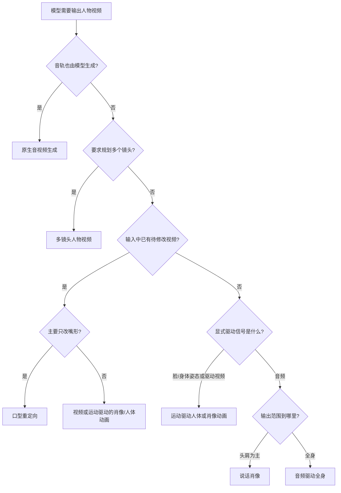
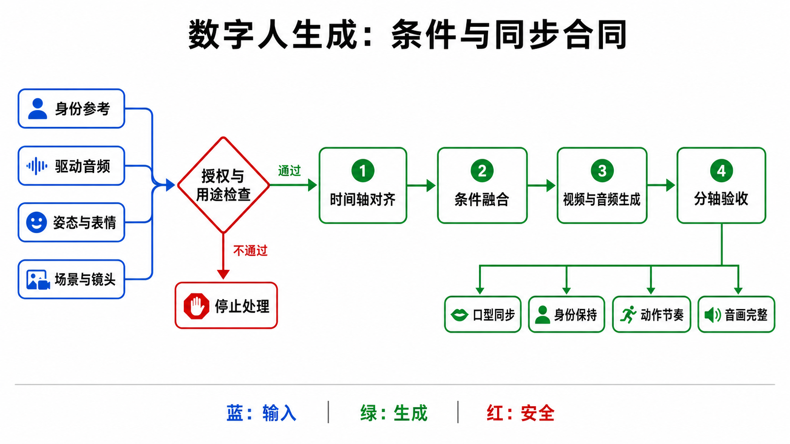
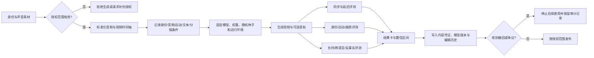

# 数字人视频生成：任务边界、条件契约与可审计评测

“数字人”不是一个单一任务。只改嘴形、从单张照片生成说话头像、用姿态驱动全身、让模型同时生成声音和画面，以及跨镜头保持同一角色，所需输入、可辨识信息和验收标准都不同。把它们混成一个排行榜，会把“声音驱动”“运动复制”“身份保持”和“视频叙事”四种能力错误地归给同一模型。

本文冻结于 **2026-08-30**。时间、venue 和 release surface 以论文初版、正式 proceedings、官方项目页与官方仓库交叉核验；未公开代码或权重不等于不可研究，但不应写成“开源”。检索式、证据分级和逐项审计见[研究日志](../../sources/research_20260830_digital_human.md)。

## 1. 先判断到底是哪一个任务

### 1.1 七类任务不能互换

| 任务 | 最小输入 | 允许模型改变什么 | 主要输出 | 不应被声称的能力 |
|---|---|---|---|---|
| **Lip-sync / 口型重定向** | 已有视频 + 新音频 | 口腔及邻近区域，必要时少量下颌 | 与原视频同时间轴的视频 | 不能由口型正确推出头动、情绪或全身动作正确 |
| **Talking portrait / 说话肖像** | 单张/少量身份图 + 音频 | 嘴、表情、头姿，通常到肩部 | 单镜头说话头像 | 不是任意动作的人体动画，也不是原生音频生成 |
| **Portrait animation / 肖像动画** | 身份图 + 驱动视频、关键点或运动序列 | 由显式 motion condition 指定的脸与头部运动 | 被驱动的肖像视频 | 驱动信号若来自视频，不能把结果归因于音频理解 |
| **Full-body audio-driven / 音频驱动全身** | 身份参考 + 音频，可带文本/场景 | 口型、表情、头、手势、躯干乃至位移 | 单镜头或连续全身人物 | 音频通常不能唯一决定手势、接触和走位 |
| **Motion-driven human animation / 运动驱动人体** | 人物参考 + 姿态、SMPL-X、轨迹或驱动视频 | 显式运动条件覆盖的全身运动 | 身份迁移后的人体视频 | 不要求音频存在，更不能据此宣称语音—动作推理 |
| **Native audio-video generation / 原生音视频生成** | 文本、身份/场景参考，可选上下文 | 模型共同决定声音事件与视觉事件 | 同时生成的音轨与视频 | “先给音频再配画面”不是原生联合生成 |
| **Multi-shot human video / 多镜头人物视频** | 人物/场景参考 + 台词、分镜或编辑计划 | 镜头边界、景别、视角、时空连续性 | 多镜头成片 | 单个长镜头或剪切数据集本身不等于多镜头生成器 |

若输入只是任意人物、动物或物体的主体参考，主要目标是在新场景/动作中守住身份，且音频、姿态或 driving video 不是主驱动，则属于[开放集视频个性化](personalized-video-generation.md)。本章保留人体动画、音频/姿态同步和人物授权的任务所有权。

下面的决策树先按**控制信号来自哪里**分类，而不是按宣传名称分类。

### 1.2 TalkCuts 是数据与评测基础设施，不是新的生成范式

TalkCuts 收集剪切后的说话人物片段，并提供文字、2D 关键点和 3D SMPL-X 等标注；正式记录是 NeurIPS 2025 Datasets & Benchmarks [[26]](#ref-26)。官方仓库称数据规模约 164,000 个片段、500 小时和 10,000 余身份，但访问需申请，数据许可限定研究/非商业用途并禁止再分发 [[27]](#ref-27)。因此它可以支持单镜头、镜头切换与人体动作研究，却不能仅凭数据集名称证明某方法会规划多镜头。

## 2. 一个可复现的生成合同

**图 1：条件与同步合同的最短主链。** 授权门不能被模型调用绕过；通过后，输入才进入统一时间轴。最终验收必须拆成口型同步、身份保持、动作节奏和音画完整，而不是用一个“数字人质量分”掩盖不同失败。

### 2.1 条件、时间轴与输出

把一次运行写成：

$$
Y_{0:T-1},\ \hat A
\sim p_\theta\!\left(\cdot\mid
A, I_{1:K}, X, M, P, S, E, R\right).
$$

- $A$：输入音频；原生音视频任务中可为空，输出音频为 $\hat A$。
- $I_{1:K}$：一张或多张身份/服装/场景参考图，必须标明每张约束什么；通用开放集主体编码、绑定与泄漏协议见[开放集视频个性化](personalized-video-generation.md)。
- $X$：待改视频；$M$：mask；$P$：姿态、SMPL-X、轨迹等显式运动。
- $S$：台词或语义条件；$E$：分镜与镜头编辑计划。
- $R$：授权、用途、地域、期限、撤回状态与输出标识策略。

视频帧时间戳为 $t_i=i/f_v$，音频采样点为 $u_j=j/f_a$。第 $i$ 帧只能使用声明窗口

$$
W_i=A[t_i-\ell_{\mathrm{past}},\ t_i+\ell_{\mathrm{lookahead}}],
$$

并报告总延迟

$$
L_{\mathrm{total}}=L_{\mathrm{lookahead}}+L_{\mathrm{compute}}+L_{\mathrm{buffer}}.
$$

“实时”必须同时给出硬件、分辨率、帧率、batch、首帧时间、稳定吞吐和 look-ahead；离线整段可见的 40 FPS 与因果流式 25 FPS 不是同一条件。VASA-1 报告的 512×512、最高 40 FPS 是作者协议下的系统结果，不是所有硬件上的通用保证 [[15]](#ref-15)。

### 2.2 同步、身份与授权不是一句“保持一致”

完整合同至少声明：

1. **同步合同**：音频重采样、静音处理、声画起点、允许的全局偏移 $\delta$、是否校准显示/编码延迟、是否允许未来帧。
2. **身份合同**：参考图数量、视角覆盖、是否允许美化/年龄变化、脸外的发型、服装和身体比例是否属于身份约束。
3. **运动合同**：动作来自音频、文本、随机采样还是外部 pose；若混合，报告各条件的优先级与冲突处理。
4. **镜头合同**：单镜头还是多镜头；切镜时身份、服装、道具、空间方向和音频连续性分别如何继承。
5. **授权合同**：谁授权了身份与声音、允许的用途与期限、如何撤回、生成物如何标识和追踪。

## 3. 音频到底能告诉模型什么

语音不是动作的完整剧本。给定同一句音频，可以点头、摇头、静止或做许多同样合理的手势；因此除嘴形外，许多视觉变量是**一对多**的。单个参考视频只展示一种选择，不等于唯一真值。

| 音频因素 | 可较强辨识的视觉量 | 只能弱约束或统计相关的量 | 音频单独无法确定的量 |
|---|---|---|---|
| 语音内容：音素、音节、停顿 | 嘴唇闭合、张口时刻、粗粒度发音阶段 | 舌齿细节、协同发音、眨眼 | 身体位置、镜头、道具操作 |
| 韵律：时长、重音、能量、$F_0$ | 动作节拍、幅度分布、呼吸/停顿附近的运动概率 | 点头、眉动和手势的具体选择 | 唯一手势轨迹与接触对象 |
| 情绪声学线索 | 情绪强度和唤醒度的概率分布 | 表情类别、姿态开放程度 | 真实心理状态、文化一致的唯一表达 |
| 词义与对话语义 | 若有 ASR/语言模型，可约束指示性动作的概率 | 话轮、注视与语义手势 | 场景中未提供的物体位置和物理后果 |
| 音乐、环境声、多人混响 | 节奏与事件时刻 | 发声者归属、镜头节奏 | 哪个人动作、事件具体长什么样 |

这带来三个评测边界：

- **嘴形可以做时序对齐评测**，但同步网络自身有语言、画质和裁切偏差；SyncNet 应被视为代理测量而非真理 [[45]](#ref-45)。
- **手势不能只对单一真值算逐帧距离**。还需测多样性、语义适切度、节奏一致性和人体可行性。
- **情绪不能从声学标签直接推定**。MEAD 等受控情绪数据可用于比较，但演员表演、标签和真实情绪不是同一个变量 [[41]](#ref-41)。

## 4. 技术路线：表示决定了模型容易守住什么

| 路线 | 核心表示与控制 | 擅长 | 固有限制 |
|---|---|---|---|
| **2D warp / keypoint** | 光流、稀疏关键点、局部仿射、feature warping | 训练和推理高效；保留参考纹理 | 大转头、遮挡、牙齿/舌头与未见区域会拉伸或幻觉；FOMM 是代表节点 [[5]](#ref-5) |
| **3DMM + renderer** | 身份/表情/姿态系数与显式投影 | 参数可解释，适合姿态和口型解耦 | 线性表情空间和贴图难覆盖头发、口腔与强非刚体；SadTalker 以 3D motion coefficients 驱动肖像 [[10]](#ref-10) |
| **NeRF / 3DGS avatar** | 人物规范空间、体渲染或高斯基元 | 多视角几何、特定人物高保真 | 往往需要每人训练/优化或多视角数据；泛化、编辑和实时性彼此牵制；AD-NeRF 展示了音频条件 NeRF 头像 [[8]](#ref-8) |
| **GAN / neural renderer** | 条件生成器、判别器、感知与身份损失 | 锐利、高效、成熟的唇部重绘 | 对抗训练不稳，长时和分布外姿态易漂移；Wav2Lip 用专家同步判别器强化口型 [[7]](#ref-7) |
| **Diffusion / latent diffusion** | 在像素或 latent 中逐步去噪，注入音频与参考 attention | 细节、多样性、强生成先验 | 采样昂贵；参考泄漏、身份漂移和帧间闪烁仍需专门约束；Hallo、VASA-1 和 DiffTalk 属于不同实现 [[12]](#ref-12), [[13]](#ref-13), [[15]](#ref-15) |
| **Video DiT / flow matching** | 时空 token、跨模态 token 与扩散/流目标 | 可扩展到长视频、全身和多条件 | 计算/数据需求大，条件冲突难诊断；OmniHuman-1 用混合运动相关条件扩展一阶段人体动画 [[22]](#ref-22) |
| **Causal / streaming diffusion** | 分块缓存、有限 look-ahead、蒸馏或少步采样 | 交互式连续生成 | 边界跳变、误差累积、首帧延迟与未来信息泄漏；StreamAvatar明确面向流式交互 [[29]](#ref-29) |
| **Joint audio-video tokens** | 声学 token 与视觉 token 联合/交替建模 | 可生成原生声音事件与画面 | 对齐和因果归属更难；不能用“音频驱动画面”的指标单独验收 |

这些路线不是互斥标签。系统常以 3DMM 提供可控运动，以 diffusion/DiT 合成细节，再用 2D warp 或 neural renderer 保留纹理；应报告真正参与训练和推理的组件，而不是只按 backbone 命名。

## 5. 从“会动”到长时、全身和交互的时间线

早期 Video Rewrite 将新的音频与口型单元组合到已有视频 [[1]](#ref-1)；Synthesizing Obama 与 Deep Video Portraits 分别推动了高质量语音重定向和可控全头重演 [[2]](#ref-2), [[3]](#ref-3)。随后关键点/warp、3D 参数、NeRF、GAN 和 diffusion 逐渐把输入从已有视频放宽到单图，把输出从嘴部扩展到头肩和全身。

| 首次公开 | 工作与正式状态（截至冻结日） | 它真正覆盖的任务 | 官方可获得的 surface |
|---|---|---|---|
| 2020 | Wav2Lip，ACM Multimedia 2020 [[7]](#ref-7) | 已有视频的 lip-sync | 论文；官方代码/模型另见论文项目 |
| 2022-11-22 | SadTalker，后发表于 CVPR 2023 [[10]](#ref-10) | 单图 + 音频的 talking portrait | 官方仓库提供推理、检查点与训练相关资源，Apache-2.0 [[11]](#ref-11) |
| 2024-04-16 | VASA-1，NeurIPS 2024 Oral [[15]](#ref-15) | 单图 + 音频的高表现力 talking face | 微软项目演示；未找到官方研究代码、权重或 API |
| 2024-06-13 | Hallo v1，arXiv 预印本；未核到 v1 的正式 proceedings [[13]](#ref-13) | 音频驱动 talking portrait | 官方仓库于 2024-06-15 发布权重/推理，2024-06-28 发布训练代码；MIT [[14]](#ref-14) |
| 2025 | Hallo2，ICLR 2025 [[18]](#ref-18)；Hallo3，CVPR 2025 [[19]](#ref-19) | 长时/分层音频肖像；文本与音频控制肖像 | 两者是后续独立工作，不能倒填为 Hallo v1 的 venue |
| 2025-02-03 | OmniHuman-1，ICCV 2025 [[22]](#ref-22) | 单图 + 音频/姿态等条件的人体动画 | 官方项目页提供论文与演示，未链接研究代码或权重 [[23]](#ref-23) |
| 2025-06-23 | OmniAvatar，arXiv 预印本；冻结日未核到正式 venue [[24]](#ref-24) | 音频驱动、可流式的肖像/半身视频 | 官方仓库提供代码及 Wan2.1 14B/1.3B LoRA/音频权重，Apache-2.0 [[25]](#ref-25) |
| 2025-08-26 | OmniHuman-1.5，后发表于 ICLR 2026 Oral [[28]](#ref-28) | 强调语义与环境交互的音频驱动人体 | 正式论文与项目演示；与 OmniHuman-1 的 release surface 分开记录 |
| 2025-10-08 | TalkCuts，NeurIPS 2025 Datasets & Benchmarks [[26]](#ref-26) | 数据集：说话人物剪切、姿态与 SMPL-X | 2025-12-14 宣布数据/代码；数据需申请且受非商业研究许可约束 [[27]](#ref-27) |
| 2026 | StreamAvatar、InfinityHuman、AudioAvatar，CVPR 2026 [[29]](#ref-29), [[30]](#ref-30), [[31]](#ref-31) | 分别面向流式交互、长时音频全身、个性化全身 | 正式 CVF 论文；开源状态必须逐项目核验 |
| 2026 | SpeakerVid-5M，ICLR 2026 [[32]](#ref-32) | 数据/benchmark：独白、倾听、双人和多轮对话 | 正式论文；报告约 5.2M clips、8,743+ 小时及 VidChatBench |

### 5.1 2026 年候选必须分开写“论文存在”和“资产可用”

- **Hallo-Live**：arXiv 初版 2026-04-26；官方仓库提供推理、训练、合成 prompts 和阶段检查点，并标注 ACM Multimedia 2026 接收。冻结日尚未用正式 proceedings 独立核实该 venue，故正文仍以预印本 + 作者仓库记录 [[33]](#ref-33), [[34]](#ref-34)。
- **AptAvatar**：arXiv 初版 2026-07-27。仓库 checklist 与正文对权重状态表述不一致，示例命令仍有占位符；保守记录为“推理代码可见、完整权重不可确认” [[35]](#ref-35), [[36]](#ref-36)。
- **Omni-LiveAvatar**：arXiv 初版 2026-08-07；论文摘要写 code available，但官方仓库的 code/checkpoint 仍为 TODO。冻结日按“论文/项目页，无可复现代码权重”处理 [[37]](#ref-37), [[38]](#ref-38)。
- **LongCat-Video-Avatar 1.5**：预印本与官方仓库可见，仓库提供代码、权重与少步推理配置；这比只有演示页的 release surface 更强 [[39]](#ref-39), [[40]](#ref-40)。
- **EfficientSync、DynaForcing、OmniMate** 等临近冻结日的新预印本只作为前沿信号，不把尚未经过正式 proceedings 或充分复现的结论写入主线 [[50]](#ref-50), [[51]](#ref-51), [[52]](#ref-52)。

## 6. 训练目标为什么会互相打架

常见目标可写成

$$
\mathcal L=
\lambda_{\mathrm{rec}}\mathcal L_{\mathrm{rec}}+
\lambda_{\mathrm{sync}}\mathcal L_{\mathrm{sync}}+
\lambda_{\mathrm{id}}\mathcal L_{\mathrm{id}}+
\lambda_{\mathrm{motion}}\mathcal L_{\mathrm{motion}}+
\lambda_{\mathrm{temp}}\mathcal L_{\mathrm{temp}}+
\lambda_{\mathrm{adv/diff}}\mathcal L_{\mathrm{adv/diff}}.
$$

这不是“多加几个 loss 就更好”，因为不同目标的最优解可能相反。

| 冲突 | 表现 | 必须做的诊断 |
|---|---|---|
| 重建 vs. 多样性 | 逐帧贴近训练视频时动作变保守；鼓励多样性时偏离单一 GT | 同一音频多 seed，分别报告分布覆盖与条件一致性 |
| 身份 vs. 表情/姿态 | 强身份损失把脸“冻住”；大角度和夸张表情降低 face-embedding 相似度 | 按姿态/表情分层报告，不用单一均值 |
| 口型同步 vs. 视觉质量 | 局部嘴形优化产生锐利但不自然的口腔，或牺牲全脸纹理 | 同步、口腔局部质量和全局质量分开测 |
| 短时平滑 vs. 快速动作 | temporal loss 抑制闪烁，也可能抹掉辅音闭口、眨眼和手势峰值 | 按运动速度分桶，检查过度平滑 |
| 音频控制 vs. motion prior | 强先验生成自然但与音频无关的手势；强条件导致机械重复 | 音频交换/静音/节奏扰动反事实 |
| 参考保真 vs. 可编辑性 | cross-attention 复制背景/姿态；降低参考又导致身份漂移 | 分离脸、头发、服装、背景的保留指标 |
| 长时一致 vs. 响应性 | 缓存与历史状态减少跳变，却放大早期错误并增加延迟 | 分时段漂移曲线和状态重置实验 |

建议同时报告各 loss 梯度余弦或消融，不只报告最终加权和；如果权重在训练中动态变化，还要公布调度规则。

## 7. 数据泄漏与公平协议

### 7.1 最低限度的拆分

1. **先按原始视频/节目/拍摄 session 分组，再切 train/val/test**。同一长视频切成相邻 clip 后随机划分，会把背景、服装、压缩和口型直接泄漏到测试集。
2. **身份泛化必须 identity-disjoint**。用人脸 embedding 聚类并人工复核艺名、别名、配音和换装；“文件名不同”不是身份隔离。
3. **音频与文本去重**。对 waveform fingerprint、ASR 文本和字幕时间轴去重，避免同一句台词或再编码副本跨 split。
4. **多镜头按 source episode/scene 分组**。不能让同一场景的相邻 shot 同时进入训练和测试。
5. **预训练污染单列**。对互联网预训练模型，公布已知数据源与近重复审计；无法证明未见过时，称“held-out benchmark”，不要称“严格 zero-shot”。
6. **超参数选择只看 validation**。SyncNet 阈值、裁脸策略、最佳 checkpoint 与人工筛选规则都要在测试前冻结。

LRS3、VoxCeleb 与 HDTF 分别代表大规模视听语音、说话人身份和高分辨率 talking-face 场景，但其采集来源、许可、身份重叠与语言分布不同，不能简单拼接后仍沿用原 split 名称 [[42]](#ref-42), [[43]](#ref-43), [[44]](#ref-44)。

### 7.2 报告矩阵

最少公开四个互不替代的设置：

- seen identity / seen language；
- unseen identity / seen language；
- seen identity / unseen language；
- unseen identity / unseen language。

再对年龄表现、肤色、口音、发型遮挡、侧脸、眼镜、胡须、低照度和音频噪声分层。跨身份结果若仍用训练人物的背景、声音或服装，不算干净的身份外推。

## 8. 指标的最小充分集合

不存在一个“数字人总分”。最低报告集应覆盖彼此独立的失败轴，并给出 bootstrap 置信区间、样本数、裁切/重采样实现与失败样本比例。

| 轴 | 最低指标与检查 | 关键限制 |
|---|---|---|
| 声画同步 | SyncNet/LSE 类偏移与置信度；人工音素边界抽检；全局 delay sweep | 同步模型可能偏语言、脸型和裁切；不能代替口腔视觉质量 |
| 身份 | ArcFace 等 embedding 相似度 + 人工配对；按姿态/表情分层 [[46]](#ref-46) | embedding 相似不保证发型、服装、身体或授权身份正确 |
| 视觉与时间质量 | FVD/视频感知指标 + 闪烁、运动边界、局部口腔质量 [[47]](#ref-47) | FVD 对样本数、encoder 与实现敏感，不能证明条件被遵守 |
| 动作 | 2D/3D pose、关节速度/加速度、穿插、脚滑与接触；动作分布覆盖 | 对单一 GT 的逐帧误差会惩罚合理的另一种手势 |
| 条件遵循 | 音频/文本/pose/分镜分别做检索或分类准确率与人工盲评 | 高相关不等于因果控制，必须配反事实 |
| 长时稳定 | 身份、背景、服装、姿态和声画 offset 随时间的曲线 | 只报 5–10 秒平均值看不到 1–10 分钟的累积漂移 |
| 流式性能 | 首帧时间、平均/尾延迟、steady FPS、显存、look-ahead、掉帧 | 离线吞吐不能冒充交互延迟 |
| 原生音频质量 | 语音可懂度、说话人相似、音频质量、事件时序与唇动联合评测 | 只测画面会遗漏噪声、混音、说话人归属错误 |
| 人类偏好与安全 | 成对盲评、效应量、受试者协议；未授权身份/声音压力测试 | MOS 需报告置信区间，且不能替代授权与来源审计 |

不要把这些轴未经校准地加成一个分数。一个模型可能同步更好、身份更差、动作更多样；加权平均会隐藏真实取舍。

## 9. 必做的反事实与外推实验

### 9.1 音频因果性

- **内容交换**：保持说话人、韵律和时长近似，只换音素/词义；嘴形应变，身份和非语义背景不应变。
- **韵律交换**：保持文本，改变语速、重音、$F_0$ 或停顿；动作节奏可变，但不能虚构场景事件。
- **静音/倒放/时间移位**：测模型是否只靠数据先验生成“看似自然”的嘴形；画出输入 offset 与输出最佳 offset 的响应曲线。
- **说话人交换**：同一句话换声音；若任务不要求 speaker style，身份不应随声音漂移。
- **冲突条件**：音频、文本、pose 给出不一致指令，事先声明谁优先，检查模型是否稳定遵循合同。

### 9.2 长时、跨语言与跨身份

- 在 10 秒、1 分钟、5 分钟和 10 分钟上报告同一套漂移曲线，而不是只展示成功片段。
- 语言测试至少包含训练主语言、未见语言、代码切换、快速语速、耳语、歌唱和非语音声；音素覆盖比语言名称更有解释力。
- 身份测试固定音频与运动，交换年龄表现、肤色、脸型、发型、眼镜、胡须和视角；检查质量差异及模板化“平均脸”。
- 全身测试加入手—脸遮挡、持物、坐站转换、出画再入画、快速转身和脚部接触。
- 多镜头测试固定角色与台词，交换镜头顺序、景别和视角；分别测切镜正确、跨镜身份、空间方向与音频连续。

每个反事实至少多 seed，并公开未经人工挑选的样本索引。若论文只展示项目页 cherry-picked demo，应明确证据等级而不是据此宣称稳健。

## 10. 安全、授权与溯源

数字人系统最容易把“技术上能复现一个人”误写成“有权代表这个人”。上线前最低要求是：

1. **可验证同意**：身份与声音分别授权；代理人授权、未成年人、已故人物和公众人物需要额外规则。
2. **目的限制**：训练、内部测试、广告、政治传播、成人内容、客服和实时直播不是同一授权范围。
3. **撤回与保留**：记录素材、embedding、微调权重、生成物和备份的删除/停用路径；撤回不能只删网页链接。
4. **滥用防护**：对冒充、诈骗、无同意色情内容和规避水印做红队；高风险实时 impersonation 默认拒绝或升级审核。
5. **可见标识 + 机器可读来源**：在不误导的展示场景加清晰标识，并把模型版本、输入权利声明、编辑链和哈希写入 provenance manifest。
6. **证据边界**：C2PA Content Credentials 可以绑定声明、签名与编辑历史，但不能证明画面为真、当事人同意或声明本身诚实 [[48]](#ref-48)。NIST 的生成式 AI 风险框架可用于组织治理与测量，但不替代当地法律意见 [[49]](#ref-49)。

最终结果卡应能回答：谁授权了什么、模型见过什么、输入条件是什么、生成时看到了多少未来、在哪些人群和场景失败、输出如何被识别与撤回。做不到这些，就只能称为演示，不能称为可审计系统。

## 参考资料

[1] Bregler, Covell, and Slaney. [Video Rewrite: Driving Visual Speech with Audio](https://doi.org/10.1145/258734.258880). SIGGRAPH, 1997.

[2] Suwajanakorn, Seitz, and Kemelmacher-Shlizerman. [Synthesizing Obama: Learning Lip Sync from Audio](https://doi.org/10.1145/3072959.3073640). ACM TOG / SIGGRAPH, 2017.

[3] Kim et al. [Deep Video Portraits](https://doi.org/10.1145/3197517.3201283). ACM TOG / SIGGRAPH, 2018.

[5] Siarohin et al. [First Order Motion Model for Image Animation](https://proceedings.neurips.cc/paper/2019/hash/31c0b36aef265d9221af80872ceb62f9-Abstract.html). NeurIPS, 2019.

[7] Prajwal et al. [A Lip Sync Expert Is All You Need for Speech to Lip Generation in the Wild](https://doi.org/10.1145/3394171.3413532). ACM Multimedia, 2020.

[8] Guo et al. [AD-NeRF: Audio Driven Neural Radiance Fields for Talking Head Synthesis](https://openaccess.thecvf.com/content/ICCV2021/html/Guo_AD-NeRF_Audio_Driven_Neural_Radiance_Fields_for_Talking_Head_Synthesis_ICCV_2021_paper.html). ICCV, 2021.

[10] Zhang et al. [SadTalker: Learning Realistic 3D Motion Coefficients for Stylized Audio-Driven Single Image Talking Face Animation](https://openaccess.thecvf.com/content/CVPR2023/html/Zhang_SadTalker_Learning_Realistic_3D_Motion_Coefficients_for_Stylized_Audio-Driven_Single_Image_CVPR_2023_paper.html). CVPR, 2023; first arXiv version 2022-11-22.

[11] OpenTalker. [SadTalker official repository](https://github.com/OpenTalker/SadTalker).

[12] Shen et al. [DiffTalk: Crafting Diffusion Models for Generalized Audio-Driven Portraits Animation](https://openaccess.thecvf.com/content/CVPR2023/html/Shen_DiffTalk_Crafting_Diffusion_Models_for_Generalized_Audio-Driven_Portraits_Animation_CVPR_2023_paper.html). CVPR, 2023.

[13] Xu et al. [Hallo: Hierarchical Audio-Driven Visual Synthesis for Portrait Image Animation](https://arxiv.org/abs/2406.08801). arXiv:2406.08801, first submitted 2024-06-13.

[14] Fudan Generative Vision. [Hallo official repository](https://github.com/fudan-generative-vision/hallo).

[15] Xu et al. [VASA-1: Lifelike Audio-Driven Talking Faces Generated in Real Time](https://proceedings.neurips.cc/paper_files/paper/2024/hash/014fe398da515cd552fa6e1f33e0565e-Abstract-Conference.html). NeurIPS, 2024; first arXiv version 2024-04-16.

[18] Cui et al. [Hallo2: Long-Duration and High-Resolution Audio-Driven Portrait Image Animation](https://proceedings.iclr.cc/paper_files/paper/2025/hash/e4be7e9867ef163563f4a5e90cec478f-Abstract-Conference.html). ICLR, 2025.

[19] Cui et al. [Hallo3: Highly Dynamic and Realistic Portrait Image Animation with Video Diffusion Transformer](https://openaccess.thecvf.com/content/CVPR2025/html/Cui_Hallo3_Highly_Dynamic_and_Realistic_Portrait_Image_Animation_with_Video_CVPR_2025_paper.html). CVPR, 2025.

[22] Lin et al. [OmniHuman-1: Rethinking the Scaling-Up of One-Stage Conditioned Human Animation Models](https://openaccess.thecvf.com/content/ICCV2025/html/Lin_OmniHuman-1_Rethinking_the_Scaling-Up_of_One-Stage_Conditioned_Human_Animation_Models_ICCV_2025_paper.html). ICCV, 2025; first arXiv version 2025-02-03.

[23] ByteDance. [OmniHuman-1 official project page](https://omnihuman-lab.github.io/).

[24] Chen et al. [OmniAvatar: Efficient Audio-Driven Avatar Video Generation with Adaptive Body Animation](https://arxiv.org/abs/2506.18866). arXiv:2506.18866, first submitted 2025-06-23.

[25] Omni-Avatar. [OmniAvatar official repository](https://github.com/Omni-Avatar/OmniAvatar).

[26] Duan et al. [TalkCuts: A Large-Scale Dataset for Multi-Shot Talking-Head Video](https://openreview.net/forum?id=4a0w7AkrY7). NeurIPS 2025 Datasets and Benchmarks Track; first arXiv version 2025-10-08.

[27] UMass Embodied AGI. [TalkCuts official repository and data license](https://github.com/UMass-Embodied-AGI/TalkCuts).

[28] Lin et al. [Instilling an Active Mind in Avatars via Cognitive Simulation](https://proceedings.iclr.cc/paper_files/paper/2026/hash/be91eb86eb74efc055cff83e953f86ce-Abstract-Conference.html). ICLR, 2026 (OmniHuman-1.5; Oral); first arXiv version 2025-08-26.

[29] Sun et al. [StreamAvatar: Streaming Diffusion Models for Real-Time Interactive Human Avatars](https://openaccess.thecvf.com/content/CVPR2026/html/Sun_StreamAvatar_Streaming_Diffusion_Models_for_Real-Time_Interactive_Human_Avatars_CVPR_2026_paper.html). CVPR, 2026.

[30] Li et al. [InfinityHuman: Towards Long-Term Audio-Driven Human Animation](https://openaccess.thecvf.com/content/CVPR2026/html/Li_InfinityHuman_Towards_Long-Term_Audio-Driven_Human_Animation_CVPR_2026_paper.html). CVPR, 2026.

[31] Lee et al. [AudioAvatar: Personalized Audio-Driven Whole-Body Talking Avatars](https://openaccess.thecvf.com/content/CVPR2026/html/Lee_AudioAvatar_Personalized_Audio-driven_Whole-body_Talking_Avatars_CVPR_2026_paper.html). CVPR, 2026.

[32] SpeakerVid authors. [SpeakerVid-5M: A Large-Scale High-Quality Dataset for Audio-Visual Dyadic Interactive Human Generation](https://proceedings.iclr.cc/paper_files/paper/2026/hash/bf7dbac50ed7f6e12ad529c5b9396bc4-Abstract-Conference.html). ICLR, 2026.

[33] Cui et al. [Hallo-Live: Real-Time and High-Fidelity Audio-Driven Portrait Image Animation](https://arxiv.org/abs/2604.23632). arXiv:2604.23632, first submitted 2026-04-26.

[34] Fudan Generative Vision. [Hallo-Live official repository](https://github.com/fudan-generative-vision/hallo-live).

[35] TaoLive AIGC. [AptAvatar](https://arxiv.org/abs/2607.24013). arXiv:2607.24013, first submitted 2026-07-27.

[36] TaoLive AIGC. [AptAvatar official repository](https://github.com/TaoLiveAIGC/AptAvatar).

[37] Omni-LiveAvatar authors. [Omni-LiveAvatar](https://arxiv.org/abs/2608.13602). arXiv:2608.13602, first submitted 2026-08-07.

[38] Omni-LiveAvatar authors. [Omni-LiveAvatar official repository](https://github.com/Omni-LiveAvatar/Omni-LiveAvatar).

[39] LongCat team. [LongCat-Video-Avatar 1.5](https://arxiv.org/abs/2605.26486). arXiv:2605.26486, 2026.

[40] Meituan. [LongCat-Video-Avatar official repository](https://github.com/meituan-longcat/LongCat-Video-Avatar).

[41] Wang et al. [MEAD: A Large-Scale Audio-Visual Dataset for Emotional Talking-Face Generation](https://wywu.github.io/projects/MEAD/MEAD.html). ECCV, 2020.

[42] Afouras et al. [LRS3-TED: A Large-Scale Dataset for Visual Speech Recognition](https://arxiv.org/abs/1809.00496). arXiv:1809.00496, 2018.

[43] Nagrani, Chung, and Zisserman. [VoxCeleb: A Large-Scale Speaker Identification Dataset](https://www.robots.ox.ac.uk/~vgg/data/voxceleb/). INTERSPEECH, 2017.

[44] Zhang et al. [Flow-Guided One-Shot Talking Face Generation with a High-Resolution Audio-Visual Dataset](https://openaccess.thecvf.com/content/CVPR2021/html/Zhang_Flow-Guided_One-Shot_Talking_Face_Generation_With_a_High-Resolution_Audio-Visual_Dataset_CVPR_2021_paper.html). CVPR, 2021 (HDTF).

[45] Chung and Zisserman. [Out of Time: Automated Lip Sync in the Wild](https://arxiv.org/abs/1603.04433). ACCV Workshops, 2016.

[46] Deng et al. [ArcFace: Additive Angular Margin Loss for Deep Face Recognition](https://openaccess.thecvf.com/content_CVPR_2019/html/Deng_ArcFace_Additive_Angular_Margin_Loss_for_Deep_Face_Recognition_CVPR_2019_paper.html). CVPR, 2019.

[47] Unterthiner et al. [Towards Accurate Generative Models of Video: A New Metric and Challenges](https://openreview.net/forum?id=r1E9O1Obg). ICLR Workshop, 2019 (Fréchet Video Distance).

[48] Coalition for Content Provenance and Authenticity. [C2PA Technical Specification 2.4](https://spec.c2pa.org/specifications/specifications/2.4/specs/C2PA_Specification.html). April 2026.

[49] NIST. [Artificial Intelligence Risk Management Framework: Generative Artificial Intelligence Profile](https://doi.org/10.6028/NIST.AI.100-4). NIST AI 100-4, 2024.

[50] EfficientSync authors. [EfficientSync](https://arxiv.org/abs/2608.18832). arXiv:2608.18832, 2026.

[51] DynaForcing authors. [DynaForcing](https://arxiv.org/abs/2608.17707). arXiv:2608.17707, 2026.

[52] OmniMate authors. [OmniMate](https://arxiv.org/abs/2607.23023). arXiv:2607.23023, 2026.
