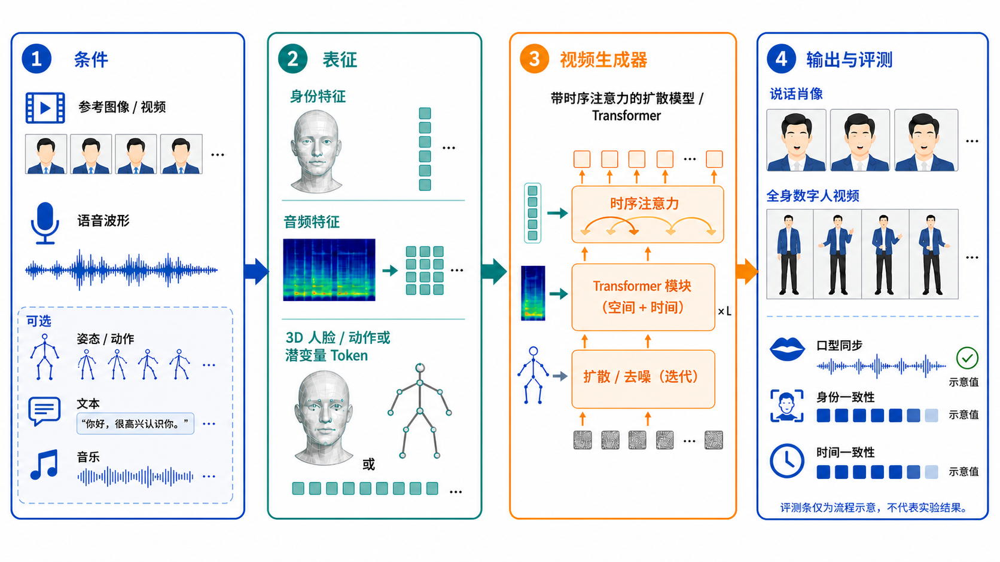

# 数字人与音频驱动人类视频生成

## 任务定义

数字人视频生成任务（digital human / avatar video generation）从一张或多张人物图像、身份参考视频、语音或音乐，以及可选的文本、姿态、表情、动作和场景条件，生成具有稳定身份的人类视频。最常见的子任务是“音频驱动说话人”：给定人物图像 $I$ 和语音 $a_{1:T}$，生成视频 $v_{1:T}$，使嘴型、表情、头部和身体运动与声音同步：

$$
p(v_{1:T}\mid I, a_{1:T}, c),
$$

其中 $c$ 可以包含文本语义、姿态、镜头或风格。这里的“数字人”不是单纯的人脸换脸，也不只是文本到视频中的一个对象类别；它要求跨帧身份保持、可控的人类运动和视听同步，同时具备可用于实际生成的推理效率。

## 调研范围与结论摘要

本页是一份面向视频生成研究的范围综述（scoping review），检索截止 **2026-08-10**。重点是“给定人物视觉条件和音频/动作条件，生成数字人视频”，包括 talking face、portrait animation、singing/expressive avatar、半身和全身人类动画。不纳入 TTS、ASR、对话代理、数字人产品编排，也不把纯音频生成当作本任务。

检索入口包括：arXiv 的音频驱动人脸/人类动画论文、OpenAlex 的相关工作与引用信息、代表论文的官方项目页和数据集主页。优先保留原始论文、顶会论文、公开代码或公开数据，并用高引用的早期工作建立技术谱系；最新预印本单独视为趋势证据，不与成熟基准的结果直接横比。

当前最稳定的结论有三点：

1. **唇形同步已经相对成熟，完整的人类表现仍未解决。** Wav2Lip 这类方法能显著改善嘴型—语音对齐，但表情、视线、头部姿态和身体运动需要额外建模。
2. **扩散模型提高了泛化和视觉质量，却把时序一致性与推理成本变成核心问题。** 参考图像、音频和运动条件需要在同一个视频 latent 中协调，而不是简单拼接。
3. **全身数字人不是把 talking face 放大。** 身体动作由韵律、语义、情绪、人物风格和场景共同决定；现有数据和指标大多仍围绕脸部，导致全身动作的训练与评测明显滞后。

图 1：从参考视觉、语音/音乐和可选运动条件，到身份/音频表示、时空视频生成器以及同步、身份和时序评测的统一视图。

## 从口型同步到全身数字人

| 阶段 | 代表方法 | 技术核心 | 局限 |
|---|---|---|---|
| 参数化人脸与图形学 | 3DMM、blendshape、骨骼和 viseme | 把语音映射为嘴型、表情和姿态，再渲染或驱动角色 | 写实度、身份和复杂光照受表示与资产限制 |
| 早期神经说话人 | MakeItTalk [[1]](#ref-1)、Wav2Lip [[2]](#ref-2) | 从音频预测嘴部/头部运动，或对已有视频做唇形校正 | 主要处理脸部，表情、视线和身体运动较弱 |
| 3D/隐式表示 | AD-NeRF [[3]](#ref-3) 等 | 用 NeRF 或隐式场建模人物和视角，再由音频控制动态 | 训练和渲染成本高，长时序和新姿态困难 |
| 扩散式肖像动画 | SadTalker [[4]](#ref-4)、Hallo [[5]](#ref-5) | 在参考图像约束下联合生成口型、表情、头部姿态和视频细节 | 仍可能出现嘴型错误、身份漂移和运动模式单一 |
| 实时说话脸 | VASA-1 [[6]](#ref-6) | 在可解耦的人脸运动 latent 中生成表情与头部动态 | 以头脸为主，不能自然覆盖完整身体和复杂场景 |
| 通用人类动画 | OmniHuman-1 [[7]](#ref-7) | 将音频、视频等运动条件混合到大规模 DiT 人类视频生成中 | 计算量、可控性、长视频稳定性和可复现性仍是瓶颈 |
| 多条件数字人视频 | 音频 + 文本 + 视觉 + 动作 | 统一条件下生成说话、唱歌、手势或表演视频 | 多条件冲突、长时序一致性、计算成本和身份安全 |

## 技术演化逻辑

数字人视频生成可以拆成三个相互耦合的层次：

1. **身份层**：从参考图像或身份视频中保持脸型、发型、肤色、服饰和整体外观。
2. **语音—运动层**：从 phoneme、韵律、音高、能量和说话人风格中预测口型、表情、头部和身体运动。
3. **视频生成层**：把运动条件渲染成时空一致的视频，并处理遮挡、手部、牙齿、头发、镜头和背景。

早期方法通常只优化局部唇形同步；现代扩散和 Transformer 方法开始直接学习音频到视频的联合分布，从而补足表情和头部运动 [[5]](#ref-5), [[6]](#ref-6)。但音频驱动仍不等于完整的人类动作控制：音频决定说话节奏，却不一定决定手势、视线或语义动作。因此，多条件数字人视频生成需要让语言内容、声学韵律、视觉身份和身体动作互相约束。

## 生成问题的技术拆解

### 1. 条件与表示

**身份条件**可以是单张图像、少量参考帧、短视频或显式 3D 人脸/身体参数。单张图像最方便，但只提供一个视角和一个表情；多帧参考能提高身份稳定性，却会把姿态、光照和背景变化带入生成过程。

**音频条件**至少包含三类信息：

- 内容：phoneme、音素边界和发音部位，主要决定嘴型。
- 韵律：音高、能量、语速、停顿和重音，主要影响张嘴幅度、头动和表情节奏。
- 风格/情绪：说话人 timbre、情绪和表达强度，影响表情、视线和动作幅度，但与内容并不完全可分离。

**运动条件**可以是 2D/3D landmarks、头部姿态、blendshape、SMPL/骨骼、参考视频或文本描述。显式运动表示更容易控制和评测，直接在视频 latent 中生成则更容易保留纹理和非刚体细节。

### 2. 音频到运动的映射

一个常见的中间变量分解是：

$$
z_t^{\text{motion}} = f(a_{t-k:t+k}, e, p_t),
$$

其中 $a$ 是局部音频上下文，$e$ 是表达/情绪条件，$p_t$ 是可选的姿态或人物运动先验。困难在于 $f$ 不是一一映射：同一句话可以配不同的头动、表情和手势，沉默片段也可以有自然的眨眼或姿态变化。因此，模型需要保留多模态运动分布，而不是回归一个平均动作。

早期方法通常采用 audio encoder + landmark/3DMM 回归；后续方法使用 disentangled audio-visual representation，把身份、内容、头姿和表情分开控制；扩散模型则把运动作为条件或 latent 轨迹，在多个可能的运动中采样。实际系统常把“嘴型”与“表演动作”分成不同频率：嘴型需要帧级精确，头部和身体动作可以在更长窗口上平滑生成。

### 3. 视频生成器

当前主流可归纳为四类：

| 生成器 | 优点 | 主要失败模式 | 适用阶段 |
|---|---|---|---|
| 2D warp / landmark renderer | 快、可解释、唇形控制直接 | 新区域、遮挡、视角和纹理质量差 | 早期 talking face、实时基线 |
| 3DMM / NeRF / 3D Gaussian | 几何与视角控制好，身份可显式绑定 | 训练/渲染成本、跨姿态泛化、动态头发和衣服 | 单人高保真、视角控制 |
| GAN / latent renderer | 推理快，能生成锐利局部细节 | 训练不稳定、长时序和开放域泛化弱 | 2020—2022 年的高效头像模型 |
| Diffusion / DiT video model | 泛化、细节、风格和多条件能力强 | 采样慢、身份漂移、局部闪烁、长视频一致性 | 当前肖像到全身视频生成主线 |

扩散路线的关键不是单纯换一个 denoiser，而是把参考图像特征、音频 token、运动 token 与视频时空 token 对齐。Hallo 和类似方法采用层级音频条件来分别影响口型、表情和姿态；OmniHuman-1 一类模型则尝试把不同运动条件混合进更通用的人类视频生成训练中。这也解释了为什么“看起来更真实”并不自动意味着“更可控”：生成器越开放，条件之间的竞争和长期漂移越明显。

### 4. 训练目标

一个实用的多目标训练框架可以写成：

$$
\mathcal{L}=\lambda_{\text{diff}}\mathcal{L}_{\text{video}}+\lambda_{\text{sync}}\mathcal{L}_{\text{sync}}+\lambda_{\text{id}}\mathcal{L}_{\text{id}}+\lambda_{\text{temp}}\mathcal{L}_{\text{temp}}+\lambda_{\text{motion}}\mathcal{L}_{\text{motion}}.
$$

- $\mathcal{L}_{\text{video}}$：扩散噪声/重建/感知损失，保证画质和分布覆盖。
- $\mathcal{L}_{\text{sync}}$：SyncNet 或音视频对比学习损失，约束嘴型与音频。
- $\mathcal{L}_{\text{id}}$：人脸识别 embedding 或参考特征一致性，约束身份。
- $\mathcal{L}_{\text{temp}}$：光流、latent trajectory 或相邻帧特征一致性，减少闪烁。
- $\mathcal{L}_{\text{motion}}$：landmark、3DMM、姿态或动作轨迹监督，增强可控性。

这些目标天然冲突：提高同步损失权重可能牺牲表情自然度；强身份约束可能抑制头部运动；强 temporal loss 又可能把多样动作平均掉。论文中只报告单一总分，通常无法说明模型到底改善了哪一个目标。

## 关键条件与子任务

| 子任务 | 输入 | 输出 | 主要判据 |
|---|---|---|---|
| Lip-sync | 人脸视频或人像 + 语音 | 嘴部同步视频 | 音素与唇形对应、无明显抖动 |
| Talking portrait | 单张人像 + 语音 | 说话头像 | 口型、表情、头部姿态和身份 |
| Singing / expressive avatar | 人像 + 歌声/音乐 | 唱歌或表演视频 | 音乐节奏、情绪、嘴型和身体表现 |
| Full-body human animation | 全身图像/视频 + 音频、姿态或文本 | 全身数字人视频 | 手势、身体运动、服饰和场景一致性 |
| Multi-condition human video | 人像 + 音频、文本、姿态或动作 | 说话、唱歌或表演视频 | 多条件一致性、身份保持和时序稳定性 |

## 代表性方法谱系

| 时间 | 研究转折 | 代表工作 | 贡献与边界 |
|---|---|---|---|
| 2018—2019 | 从图形学控制到神经音视频表示 | Deep Video Portraits [[8]](#ref-8)、ADAVT [[9]](#ref-9) | 证明身份、姿态和音频可以被学习式分解；仍依赖有限视角或较强先验 |
| 2020 | 口型同步成为独立可测目标 | MakeItTalk [[1]](#ref-1)、Wav2Lip [[2]](#ref-2)、Audio-driven head pose [[10]](#ref-10) | 从嘴部校正扩展到头部运动；泛化和自然表情仍有限 |
| 2021 | 显式解耦与 3D/隐式表示 | PC-AVS [[11]](#ref-11)、Audio2Head [[12]](#ref-12)、AD-NeRF [[3]](#ref-3) | 可分别控制音频、身份、表情、头姿和视角；系统复杂度上升 |
| 2022 | 从单一回归到可编辑/可泛化头像 | VideoReTalking [[13]](#ref-13)、StyleTalker [[14]](#ref-14)、SadTalker [[4]](#ref-4) | 处理真实视频、风格和单图像输入；长视频和全身能力不足 |
| 2023 | 扩散模型进入肖像动画主线 | DiffTalk [[15]](#ref-15)、Hallo [[5]](#ref-5) | 视觉质量、跨身份泛化提升；采样成本和时序稳定性成为新瓶颈 |
| 2024 | 实时说话脸与弱条件生成 | VASA-1 [[6]](#ref-6) 等 | 在单图像+语音下生成自然表情和头动；主要仍是头脸而非完整人物 |
| 2025—2026 | 人类视频基础模型与全身化 | OmniHuman-1 [[7]](#ref-7)、OmniAvatar [[16]](#ref-16)、TalkCuts [[17]](#ref-17) | 走向半身/全身、多镜头和多条件生成；公开可复现的统一基准仍不足 |

## 数据集与数据问题

| 数据集 | 主要用途 | 特点 | 主要偏差/限制 |
|---|---|---|---|
| GRID | 早期音视频同步和唇读 | 受控录制、语句模板清晰、对齐容易 | 词汇和场景单一，难代表开放域说话 |
| LRS2 / LRS3 [[20]](#ref-20) | 大规模 in-the-wild 说话视频 | 语种、人物、场景和音频更丰富；适合跨人物泛化 | 压缩、噪声、遮挡、字幕和版权过滤影响质量 |
| VoxCeleb1/2 [[21]](#ref-21) | 说话人身份和开放域视频 | 人物多、场景广，常用于预训练 | 画面分辨率和音画质量不均，动作标注弱 |
| MEAD [[18]](#ref-18) | 情绪说话脸和多视角生成 | 60 位演员、8 类情绪、3 个强度、7 个视角，受控高质量采集 | 演绎情绪与真实自然表达仍有差距 |
| HDTF [[22]](#ref-22) | 高清 talking face、身份和跨人物测试 | 约 400 个公开视频，适合高清肖像生成与同步评测 | in-the-wild 分布复杂，公开版本与预处理方式不完全统一 |
| TalkCuts [[17]](#ref-17) | 多镜头人类说话视频 | 把人类说话视频扩展到 shot、镜头和跨镜头连续性 | 重点从脸部同步转向多镜头，基准仍较新 |

数据的主要瓶颈不是单纯规模，而是**同步且有授权的高质量视频**：脸部需要足够分辨率，音频需要清晰，人物需要有丰富表情和动作，且训练/测试身份不能泄漏。未来数据还需要显式记录音素边界、情绪、视线、头姿、手势、镜头、说话人授权和合成来源。

## 最新趋势

- 从“修正嘴部”转向联合生成嘴型、表情、视线、头部、手势和全身动作。
- 从单一语音条件转向语音、文本、参考视频、姿态、镜头和风格的组合条件。
- 从离线生成转向高效生成：降低首帧延迟和单位视频的推理成本。
- 从单人肖像转向半身/全身、多人物、人—物交互和动态场景。
- 从视觉逼真转向视听、语义和行为的一致性；重点是验证输入声音与输出视频是否匹配。
- 从“能不能生成”转向身份授权、可追溯水印、活体检测和深度伪造风险治理。

## 关键评测

- **音频—视觉同步**：唇形与 phoneme 的对齐、音画错位率、语音内容变化后的嘴型正确性。
- **身份保持**：跨帧/跨镜头的人脸识别相似度，以及发型、服饰和身体比例的稳定性。
- **运动与表现力**：表情、视线、头部、手势和全身动作的自然度、多样性及与韵律/语义的相关性。
- **视频质量**：清晰度、时序一致性、遮挡处理、牙齿与手部质量、背景和镜头稳定性。
- **生成效率**：首帧延迟、单位视频生成时间、显存占用、吞吐和长视频运行稳定性。
- **安全与可信**：身份是否获得授权，生成内容能否被检测和溯源，是否会产生冒充、误导或未经同意的肖像/声音克隆。

单一 lip-sync 分数不能代表数字人质量。至少应将同步、身份、运动、视听质量和生成效率分开报告，并同时提供固定人物、跨人物、不同语言/口音、唱歌、遮挡和长时序测试。

### 指标如何解读

| 维度 | 常用指标/做法 | 不能说明什么 |
|---|---|---|
| Lip-sync | SyncNet 的 LSE-C、LSE-D，音素/嘴唇对齐，人评 | 不代表身份、表情或全身动作自然 |
| 身份 | ArcFace/CosFace 等 face embedding 相似度，跨帧一致性 | 人脸相似不代表服饰、身体和风格一致 |
| 画质 | FID、FVD、LPIPS、PSNR/SSIM、VMAF 和人评 | FVD 对条件遵循和嘴型错误不敏感 |
| 时序 | 光流误差、warping error、特征轨迹方差、长视频人工检查 | 平滑可能只是动作被过度抹平 |
| 表情/动作 | AU、landmark、3DMM/pose 误差，情绪分类或动作识别一致性 | 识别器分数不等于人类观感 |
| 效率 | 首帧延迟、秒/帧、FPS、显存、最大连续时长 | 硬件、分辨率、采样步数不同会严重影响比较 |

建议把“同步—身份—运动—画质—效率”作为五维报告，而不是用一个综合分数排序；这也延续了早期 talking-head benchmark 对身份、同步、画质和自然运动分开评估的原则 [[19]](#ref-19)。尤其要区分 **in-domain reconstruction**、**cross-identity one-shot generation**、**cross-language audio driving** 和 **long-form generation**；这四种设置回答的是不同问题。

## 建议的可复现实验协议

1. **固定输入协议**：统一参考图像分辨率、音频采样率、视频 FPS、片段长度、扩散步数和随机种子。
2. **按身份划分**：训练、验证、测试不能共享人物；另设跨数据集测试，避免只记住背景和说话人。
3. **分层测试集**：清晰正脸、侧脸、遮挡、快速语音、长停顿、唱歌、不同语言/口音、情绪变化和半身/全身。
4. **分开报告输出范围**：只生成嘴部、头像、半身、全身、多人物和多镜头，不把它们混为一个 leaderboard。
5. **做音频反事实测试**：固定身份与参考图，只替换音频内容、语速、情绪或语言，检查嘴型是否随音频改变而身份不变。
6. **做长时序测试**：报告 5 秒、15 秒、30 秒和更长片段的身份漂移、闪烁和动作重复，而不只展示最好的短片。
7. **补充失败集**：公开音频—视频错位、牙齿/舌头、眨眼、手部、发丝、遮挡、边界裁剪和情绪不一致案例。

## 开放问题

1. 音频中的哪些信息应控制嘴型，哪些信息应控制表情、视线和身体动作？如何避免把相关性误当作可编辑控制？
2. 如何在保持身份和可编辑性的同时，支持任意新语音、方言、情绪、唱歌和非语言声音？
3. 如何让全身动作与语言语义、韵律和对话上下文一致，而不是只生成统计上合理的手势？
4. 如何在高效生成中兼顾低延迟、音频上下文和长时间身份/场景一致性？
5. 如何建立包含授权链、声音与肖像来源、可检测水印和滥用测试的标准数据与评测协议？
6. 如何设计更接近真实使用的视频生成测试：跨语言、跨人物、唱歌、遮挡、镜头变化和长时序条件下仍保持视听一致？

## 参考文献

[1] [MakeItTalk: Speaker-Aware Talking-Head Animation](https://arxiv.org/abs/2004.12992). Yang Zhou, Xintong Han, Eli Shechtman, Jose Echevarria, Evangelos Kalogerakis, Dingzeyu Li. ACM TOG (SIGGRAPH Asia). 2020.

[2] [A Lip Sync Expert Is All You Need for Speech to Lip Generation In The Wild](https://arxiv.org/abs/2008.10010). K R Prajwal, Rudrabha Mukhopadhyay, Vinay P. Namboodiri, C. V. Jawahar. ACM Multimedia. 2020.

[3] [AD-NeRF: Audio Driven Neural Radiance Fields for Talking Head Synthesis](https://arxiv.org/abs/2103.11078). Yudong Guo, Keyu Chen, Sen Liang, Yong-Jin Liu, Hujun Bao, Juyong Zhang. ICCV. 2021.

[4] [SadTalker: Learning Realistic 3D Motion Coefficients for Stylized Audio-Driven Single Image Talking Face Animation](https://arxiv.org/abs/2211.12194). Wenxuan Zhang, Xiaodong Cun, Xuan Wang, Yong Zhang, Xi Shen, Yu Guo, et al. CVPR. 2023.

[5] [Hallo: Hierarchical Audio-Driven Visual Synthesis for Portrait Image Animation](https://arxiv.org/abs/2406.08801). Mingwang Xu, Hui Li, Qingkun Su, Hanlin Shang, Liwei Zhang, Ce Liu, et al. arXiv preprint. 2024.

[6] [VASA-1: Lifelike Audio-Driven Talking Faces Generated in Real Time](https://arxiv.org/abs/2404.10667). Sicheng Xu, Guojun Chen, Yu-Xiao Guo, Jiaolong Yang, Chong Li, Zhenyu Zang, et al. NeurIPS. 2024.

[7] [OmniHuman-1: Rethinking the Scaling-Up of One-Stage Conditioned Human Animation Models](https://arxiv.org/abs/2502.01061). Gaojie Lin, Jianwen Jiang, Jiaqi Yang, Zerong Zheng, Chao Liang, Yuan Zhang, et al. ICCV. 2025.

[8] [Deep Video Portraits](https://arxiv.org/abs/1805.11714). Hyeongwoo Kim, Pablo Garrido, Ayush Tewari, Weipeng Xu, Justus Thies, Matthias Nießner, et al. ACM TOG (SIGGRAPH). 2018.

[9] [Talking Face Generation by Adversarially Disentangled Audio-Visual Representation](https://arxiv.org/abs/1807.07860). Hang Zhou, Yu Liu, Ziwei Liu, Ping Luo, Xiaogang Wang. AAAI. 2019.

[10] [Audio-driven Talking Face Video Generation with Learning-based Personalized Head Pose](https://arxiv.org/abs/2002.10137). Ran Yi, Zipeng Ye, Juyong Zhang, Hujun Bao, Yong-Jin Liu. arXiv preprint. 2020.

[11] [Pose-Controllable Talking Face Generation by Implicitly Modularized Audio-Visual Representation](https://openaccess.thecvf.com/content/CVPR2021/html/Zhou_Pose-Controllable_Talking_Face_Generation_by_Implicitly_Modularized_Audio-Visual_Representation_CVPR_2021_paper.html). Hang Zhou, Yasheng Sun, Wayne Wu, Chen Change Loy, Xiaogang Wang, Ziwei Liu. CVPR. 2021.

[12] [Audio2Head: Audio-driven One-shot Talking-head Generation with Natural Head Motion](https://www.ijcai.org/proceedings/2021/0152.pdf). Suzhen Wang, Lincheng Li, Yu Ding, Changjie Fan, Xin Yu. IJCAI. 2021.

[13] [VideoReTalking: Audio-based Lip Synchronization for Talking Head Video Editing In the Wild](https://doi.org/10.1145/3550469.3555399). Kun Cheng, Xiaodong Cun, Yong Zhang, Menghan Xia, Fei Yin, Mingrui Zhu, et al. SIGGRAPH Asia. 2022.

[14] [StyleTalker: One-shot Style-based Audio-driven Talking Head Video Generation](https://arxiv.org/abs/2208.10922). Dongchan Min, Minyoung Song, Eunji Ko, Sung Ju Hwang. arXiv preprint. 2022.

[15] [DiffTalk: Crafting Diffusion Models for Generalized Audio-Driven Portraits Animation](https://openaccess.thecvf.com/content/CVPR2023/html/Shen_DiffTalk_Crafting_Diffusion_Models_for_Generalized_Audio-Driven_Portraits_Animation_CVPR_2023_paper.html). Shuai Shen, Wenliang Zhao, Zibin Meng, Wanhua Li, Zheng Zhu, Jie Zhou, et al. CVPR. 2023.

[16] [OmniAvatar: Efficient Audio-Driven Avatar Video Generation with Adaptive Body Animation](https://arxiv.org/abs/2506.18866). Qijun Gan, Ruizi Yang, Jianke Zhu, Shaofei Xue, Steven Hoi. arXiv preprint. 2025.

[17] [TalkCuts: A Large-Scale Dataset for Multi-Shot Human Speech Video Generation](https://arxiv.org/abs/2510.07249). Jiaben Chen, Zixin Wang, Ailing Zeng, Yang Fu, Xueyang Yu, Siyuan Cen, et al. NeurIPS Datasets and Benchmarks. 2025.

[18] [MEAD: A Large-scale Audio-visual Dataset for Emotional Talking-face Generation](https://wywu.github.io/projects/MEAD/MEAD.html). Kaisiyuan Wang, Qianyi Wu, Linsen Song, Zhuoqian Yang, Wayne Wu, Chen Qian, et al. ECCV. 2020.

[19] [What comprises a good talking-head video generation?: A Survey and Benchmark](https://arxiv.org/abs/2005.03201). Lele Chen, Guofeng Cui, Ziyi Kou, Haitian Zheng, Chenliang Xu. CVPR Workshop on Sight and Sound. 2020.

[20] [LRS3-TED: a large-scale dataset for visual speech recognition](https://arxiv.org/abs/1809.00496). Triantafyllos Afouras, Joon Son Chung, Andrew Zisserman. arXiv preprint. 2018.

[21] [VoxCeleb: A Large-Scale Speaker Identification Dataset](https://www.robots.ox.ac.uk/~vgg/data/voxceleb/). Arsha Nagrani, Joon Son Chung, Andrew Zisserman. INTERSPEECH. 2017.

[22] [Flow-Guided One-Shot Talking Face Generation with a High-Resolution Audio-Visual Dataset (HDTF)](https://github.com/MRzzm/HDTF). Zhimeng Zhang, Lincheng Li, Yu Ding, Changjie Fan. CVPR. 2021.
