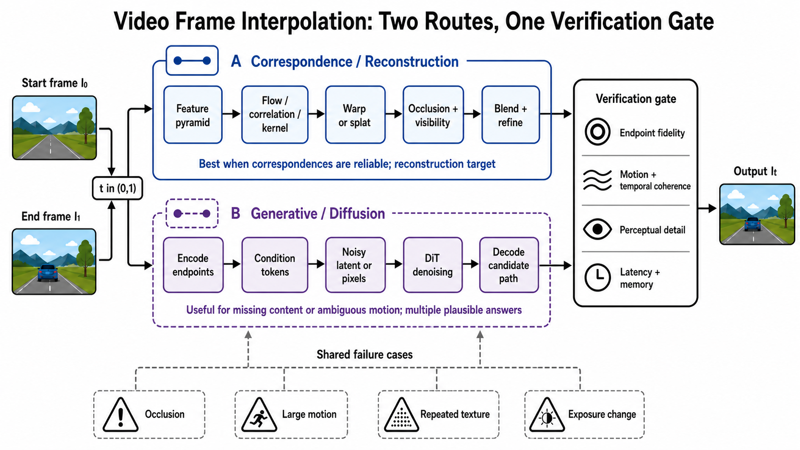
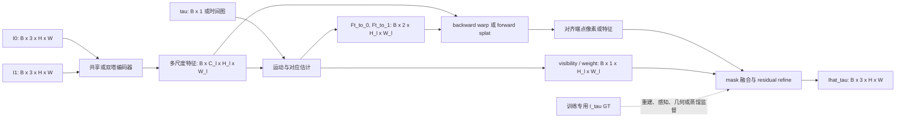
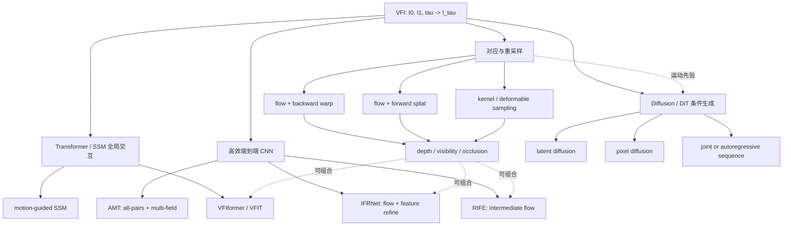
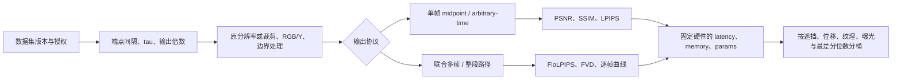

# 视频帧插值：对应关系、生成式路径与可比证据

> 本章冻结于 **2026-08-30（Asia/Shanghai）**。Video Frame Interpolation（VFI）不是“在两张图之间随便生成一段视频”：它首先是带已知前后端点和目标时间的条件重建问题；只有当遮挡、非线性运动或中间路径本来就不唯一时，生成式分布建模才成为必要补充。

检索式、初筛数量、纳入/排除、arXiv 首发时间、正式 venue、官方代码与证据等级见[配套研究记录](../../sources/research_20260830_frame_interpolation.md)。

## 🎯 学习目标

读完本章，应能完成五件事：

1. 用输入可见性和输出时间域区分 VFI、外推、视频超分、缺帧修复与生成式 keyframe transition；
2. 从 tensor 形状推导 backward warp、forward splat、visibility blend 与 diffusion conditioning；
3. 正确解释 SoftSplat、DAIN、RIFE、IFRNet、VFIformer、AMT、EDEN、BiM-VFI 与 LDF-VFI 的机制位置；
4. 判断一个方法究竟支持 midpoint、任意时刻，还是只用递归 midpoint 近似多帧插值；
5. 建立同时覆盖失真、感知、时间一致性、时延、显存与失败尾部的可复核实验。

## 📐 1. 任务定义：已知两个端点，查询中间时间

给定两帧

```math
I_0,I_1\in[0,1]^{B\times3\times H\times W}
```

以及查询时间 $\tau\in(0,1)$，标准双帧 VFI 学习

```math
\hat I_\tau=f_\theta(I_0,I_1,\tau).
```

若一次输出 $K$ 帧，则查询集合为
$`\mathcal T=\lbrace\tau_1,\ldots,\tau_K\rbrace`$，模型可逐时刻运行，也可联合生成
$\hat I_{\mathcal T}$。这里的“前后”只是时间位置；两帧都已知，不存在测试时偷看未来的问题。

### 1.1 五个容易混淆的邻接任务

| 名称 | 测试时已知输入 | 目标位置 | 核心不确定性 | 与 VFI 的边界 |
|---|---|---|---|---|
| **VFI / 帧率上转换** | 查询点两侧的端点 | 两端之间 | 对应、遮挡、时间轨迹 | 本章主体；通常有真实中间帧可监督 |
| **缺帧修复** | 缺口两侧可能有多帧 | 已知缺口 | 缺口长度、压缩/损坏模式 | 若缺一帧可退化为 VFI；任意缺口还需要 mask 与上下文定义 |
| **外推 / video prediction** | 只有过去 | 未来端点之外 | 未来事件不可约多峰 | 不可使用未来锚点；证据难度高于插值 |
| **时空视频超分** | 低帧率且常为低空间分辨率视频 | 时间与空间同时增采样 | 对齐、去退化、细节恢复 | 时间插值只是子模块；还需定义 blur/downsample/noise |
| **生成式 keyframe transition** | 两张关键帧、可选文本/相机条件 | 一条或多条完整过渡 | 中间动作可能没有唯一真值 | 可包含 VFI，但评价不能只用逐像素 GT |

中文“补帧”常同时指上表前三项。论文、工程接口与 benchmark 必须写出：端点是否都可见、时间戳是否输入、输出一帧还是整段、是否存在唯一参考答案。

### 1.2 midpoint、任意时刻与递归 midpoint 不是一回事

- **Center-Time / midpoint VFI**：只学习 $\tau=0.5$；Vimeo90K triplet 是典型设置。
- **Arbitrary-Time VFI**：$\tau$ 是显式条件，训练和测试覆盖多个时间位置。
- **递归 midpoint**：先求 $0.5$，再对子区间求 $0.25,0.75$；它只能自然地产生 $2^n-1$ 帧，且误差和时延随层数累积。
- **联合多帧 VFI**：一次建模多个 $\tau_k$，能显式约束帧间一致性，但显存和训练协议不同。

Super SloMo 通过时间相关的流组合和 visibility map 支持多个查询时刻 [[4]](#ref-4)。VFIformer 原论文则明确只合成中间帧，多帧结果来自递归调用，不能写成原生 arbitrary-time [[11]](#ref-11)。



**图注：** VFI 的两条主路线不是“旧方法/新方法”的替代关系。上路以可对应像素为强先验，适合参考答案明确的重建；下路学习条件分布，能为不可见区域或多解运动提供先验。生成路线可以采样多条合理的中间路径，但两个已观测端点仍是硬条件；身份、几何或文字漂移不能用“多解”开脱。最终两路都必须经过同一个证据门，而不能只展示一条好看的样例。

**图的顺序化文字替代：**

1. 输入起始帧 $I_0$、结束帧 $I_1$ 与目标时间 $\tau$。
2. 对应/重建路线先提取多尺度特征，再估计 flow、correlation 或局部 kernel。
3. 特征或像素经过 backward warp 或 forward splat，随后用 occlusion/visibility 处理碰撞与空洞，并融合、细化为 $\hat I_\tau$。
4. 生成/diffusion 路线先编码两个端点，把端点和时间构造成条件 token，再从噪声 latent 或像素经 DiT 去噪并解码一条候选中间路径。
5. 两条路线都检查端点忠实度、运动与时间一致性、感知细节、端到端时延和峰值显存。
6. 遮挡、大运动、重复纹理与曝光变化会同时破坏两条路线，只是失败形态不同：重建路线更易出现洞、重影或错误复制，生成路线更易出现身份/纹理漂移或不受端点支持的内容。

## 🧩 2. 一条可检查形状的 tensor/data flow



最低限度应在实现文档里写出三件事：flow 的方向、坐标单位和 `align_corners`/边界采样约定。只写“warp 两帧”而不写 $F_{\tau\rightarrow0}$ 还是 $F_{0\rightarrow\tau}$，复现时很容易得到符号相反但仍能运行的代码。

### 2.1 backward warping：目标像素去哪里取值

若网络预测目标网格到端点的流 $F_{\tau\rightarrow0}$，双线性 backward warp 为

```math
\widetilde I_{0\rightarrow\tau}(x)
=I_0\!\left(x+F_{\tau\rightarrow0}(x)\right).
```

同理得到 $\widetilde I_{1\rightarrow\tau}$，再用可见性 $M_\tau$ 与残差 $R_\tau$ 合成

```math
\hat I_\tau
=M_\tau\odot\widetilde I_{0\rightarrow\tau}
+(1-M_\tau)\odot\widetilde I_{1\rightarrow\tau}
+R_\tau.
```

优点是每个目标位置只读取有限源点，双线性采样稳定且可微。缺点是它要求先知道目标到源的对应；新显露区域在两端可能都没有可靠样本，$R_\tau$ 只能根据上下文补全。

### 2.2 forward splatting：源像素投到目标网格

Forward warp 从源点 $x$ 出发，把值投到
$x+F_{0\rightarrow\tau}(x)$。它自然沿物体运动搬运内容，却产生两类冲突：多个源点落到同一目标像素，以及没有任何源点落入的洞。

Softmax Splatting 用可学习的重要性 $Z(x)$ 对碰撞做指数归一化 [[7]](#ref-7)：

```math
\mathcal S(I,F,Z)(y)=
\frac{\sum_x b\!\left(y-x-F(x)\right)e^{Z(x)}I(x)}
{\sum_x b\!\left(y-x-F(x)\right)e^{Z(x)}+\epsilon},
```

其中 $b$ 是双线性 footprint。$Z$ 加上常数不会改变归一化结果；缩放 $Z$ 却会使操作从近似平均逐渐接近 z-buffer。它解决的是**碰撞聚合**，不是自动解决错误 flow、空洞或不可见内容。

## 🗺️ 3. 机制地图：不要按网络名字硬分家



这张图纠正两个常见误分类：**IFRNet 是 encoder–decoder CNN，不是 Transformer**；**AMT 的 Transforms 不是 Transformer**，官方摘要明确称其为 convolution-based model [[9]](#ref-9), [[13]](#ref-13)。

## 🌊 4. 显式运动、遮挡与局部采样

### 4.1 传统 optical flow 是物理代理，不是 VFI 目标本身

Lucas–Kanade 与 Horn–Schunck 分别代表局部常运动/最小二乘和全局平滑正则的经典光流思路 [[1]](#ref-1), [[2]](#ref-2)。Brightness constancy 和局部线性化提供可解性，却会被曝光变化、镜面/透明层、运动模糊、遮挡和大位移破坏。

现代 VFI 因而学习 **task-oriented correspondence**：只要最终插值更好，预测场不必等于物理光流真值。评测必须分别命名 `flow accuracy` 与 `interpolation quality`，不能用后者证明前者正确。

### 4.2 DAIN：让近处表面在碰撞时优先

DAIN 先估计端点双向 flow 与单目 depth，再在 flow projection 中用深度倒数为投到同一位置的向量加权，使更近的表面获得更大权重；随后 warp RGB、depth 与上下文特征，并结合局部 interpolation kernel 合成结果 [[5]](#ref-5)。这一步把遮挡顺序显式写进 projection，但边界仍要保留：

- 单目 depth 是估计值，不是场景真值；
- “近者遮远者”不能描述透明、反射和细丝多层运动；
- DAIN 用 Vimeo90K triplet 的 $\tau=0.5$ 训练，却在公式上支持任意 $\tau$；外推到未训练时间分布仍应单独测。

### 4.3 kernel 与 deformable sampling：把运动藏进局部支持

SepConv 为每个输出像素预测两组可分离一维核，以低于完整二维动态核的存储代价完成局部重采样 [[3]](#ref-3)。AdaCoF 再为多个采样点学习权重和 offset，把固定规则网格推广为 adaptive collaboration of flows [[6]](#ref-6)。这类方法不必产出可视化的显式 flow，但仍受到局部支持半径约束：位移超出采样范围时，核无法凭空找到远处对应。

Kernel、flow 与 deformable convolution 不是互斥类别：都在学习“从哪里取哪些源特征、怎样聚合”。区别是对应被参数化为稠密向量、投影操作，还是带 offset 的局部混合核。

## ⚡ 5. 高效卷积路线：RIFE、IFRNet、FILM 与 AMT

### 5.1 RIFE：直接估计 intermediate flow

RIFE 的 IFNet 不先求 $F_{0\rightarrow1}$ 再手工反演，而是从两端与时间编码直接 coarse-to-fine 估计
$F_{\tau\rightarrow0},F_{\tau\rightarrow1}$；训练时的 privileged teacher 能看真实中间帧的额外信息，部署时 student 不需要它 [[8]](#ref-8)。原论文需要区分两个设置：

- 基础训练固定 $\tau=0.5$；
- `RIFE_m` 在 Vimeo90K septuplet 随机选三帧，并以相对索引构造 $\tau$，才形成真正的 arbitrary-time 训练分布。

论文中的 “real-time” 和 4–27× 加速只对其报告的硬件、分辨率、实现和对手成立。迁移到 4K、FP16、TensorRT 或移动端必须重新计时。

### 5.2 IFRNet：flow 与中间特征共同细化，不含 Transformer

IFRNet 用共享 encoder 提取端点金字塔特征，四级 decoder 从粗到细同时更新双边 intermediate flow 和重建的中间特征；末级输出 blend mask 与 RGB residual，因此不再挂一个大型独立 synthesis network [[9]](#ref-9)。训练信号还包括：

- 任务导向 flow distillation，只吸收有利于帧合成的 teacher flow；
- 真实中间帧特征与重建中间特征之间的 geometry consistency；
- 常规 Charbonnier 重建。

`T` 时间图让架构可查询任意 $\tau$，但正文主实验仍是 $\tau=0.5$，多帧证据位于补充材料。把“接口可输入时间”写成“任意时间已充分验证”会越过证据。

### 5.3 FILM：共享尺度权重处理大运动

FILM 的核心不是先验光流网络，而是尺度不可知的多级特征抽取、双向特征匹配和 GridNet 融合；相同卷积权重跨尺度共享，使粗尺度能够覆盖大位移、细尺度恢复局部细节 [[10]](#ref-10)。它说明“大运动”不必只靠全局 attention，也能用恰当的金字塔和共享参数处理。

### 5.4 AMT：all-pairs correlation + 多组细粒度 flow

AMT 首先构建端点特征间的**双向 all-pairs correlation volumes**，用 bilateral flow 从相关体取值并联合更新 flow 与中间内容特征；随后由一对粗 flow 派生多组细粒度 flow，分别 backward-warp 两端，给遮挡像素多个候选 [[13]](#ref-13)。

名称中的 `T` 是 Transforms。论文明确将 AMT 与 Transformer 方法对比，并称自身为卷积模型；因此它应放在“相关体驱动的高效 flow”路线，而非 attention 路线。

## 🧠 6. Transformer 与状态空间路线：扩大交互，不消灭对应歧义

### 6.1 两个 CVPR 2022 Transformer 容易混名

- **VFIformer**（*Video Frame Interpolation with Transformer*）用 cross-scale window-based attention 在多尺度窗口间交互，扩大有效感受野；其 flow estimator 仍参与最终对齐 [[11]](#ref-11)。
- **VFIT**（*Video Frame Interpolation Transformer*）用 self-attention 学习 content-aware aggregation weights，并进行多尺度合成 [[12]](#ref-12)。

Transformer 的优势是长程匹配与内容自适应聚合；代价取决于 token 数、窗口、分辨率和 attention 实现。不能从“用了 Transformer”直接推出更快、更省显存或支持任意时间。尤其 VFIformer 明确只原生生成 midpoint。

### 6.2 2026 的 SSM/Mamba 前沿

MGMVFI 把 optical flow 用作 Motion-Guided Serialization：先把两端特征采样到运动对齐的中间网格，再让选择性状态空间模型沿更符合轨迹的一维顺序扫描，并以 contextual synthesis 缓解错误 flow [[21]](#ref-21)。截至冻结日，该工作为 2026-08-24 arXiv v1，作者标注 ECCV 2026；在正式 proceedings 可独立核验前，应写成“最新预印本/作者 venue 声明”，不写成已建立共识。

## 🌫️ 7. 生成式 VFI：从单帧条件分布到整段路径

当中间帧存在 disoccluded content、复杂非线性运动或多条同样合理的路径时，最小像素误差倾向于条件均值；diffusion 改为学习

```math
p_\theta(I_\tau\mid I_0,I_1,\tau)
\quad\text{或}\quad
p_\theta(I_{\mathcal T}\mid I_0,I_1,\mathcal T).
```

这并不意味着“幻觉越多越先进”。生成路线给出的是**中间路径的多解**，不是端点的多解：$I_0$ 与 $I_1$ 已被观测，因而是每个样本都必须满足的硬条件。训练中的 conditioning 或 classifier-free guidance 只是实现手段，验收时仍要检查端点身份、几何、文字、物体数量和时间顺序；若允许这些条件漂移，任务已变成 keyframe transition generation，而不是严格 VFI。

### 7.1 LDMVFI 与 VIDIM：两个不同输出粒度

LDMVFI 将中间帧压入 latent，用条件 latent diffusion 生成单帧，并把感知质量与传统 $L_1/L_2$ 重建路线对照；正式出版为 AAAI 2024，第一版 arXiv 在 2023-03 [[15]](#ref-15)。

VIDIM 则把任务定义为由首尾帧生成一段短视频：低分辨率 diffusion 先联合去噪所有待生成帧，再由级联 super-resolution diffusion 提升空间质量，并用首尾条件的 classifier-free guidance 控制端点 [[16]](#ref-16)。“单个 $I_{0.5}$ 的条件生成”和“整段路径联合生成”必须分开评测。

### 7.2 EDEN：tokenizer、DiT 与多间隔训练一起改变

EDEN 先用带 pyramid feature fusion 和 temporal attention 的 Transformer tokenizer 压缩中间帧；DiT 再通过 temporal attention 与 start–end difference embedding 建模大运动 [[17]](#ref-17)。其 tokenizer 使用重建、感知、patch adversarial 与轻量 KL 组合，随后做 multi-resolution / multi-frame-interval fine-tuning。

因此 EDEN 的提升不能只归因于“换成 DiT”：表示、骨干、条件编码和训练分布同时变化。论文报告的 DAVIS、SNU-FILM、DAIN-HD 改善仍绑定其数据构造与指标实现。

### 7.3 LDF-VFI：从 triplet-centric 转向 video-centric

LDF-VFI 以自回归 diffusion transformer 处理完整插值序列，在 chunk 内联合建模、chunk 间递归；Local Diffusion Forcing、skip-concatenate sampling、sparse local attention、tiled VAE encoding 和条件 VAE decoder 分别处理长程一致性、误差累积、计算量、4K 编码与细节恢复 [[18]](#ref-18)。

它在 CVPR 2026 正式页与代码中把 $2\times$ 到 $16\times$ 插值、SNU-FILM-entire 与 X4K-entire 作为序列证据。这个协议不能与单个 triplet 的 PSNR 横向混排行：前者还承担跨帧一致性和递归误差。

### 7.4 2026 年 7–8 月：速度与混合先验成为下一步

| 工作 | 冻结日状态 | 机制变化 | 当前证据边界 |
|---|---|---|---|
| **SPEED** [[19]](#ref-19) | arXiv 2026-07；作者标注 ACM MM 2026 | 一步 pixel diffusion、动态 patch scale、只更新噪声查询的 attention | 作者报告的速度/显存/LPIPS 绑定其硬件与实现；正式会场页尚未在本次注册表中独立核验 |
| **SNM-VFI** [[20]](#ref-20) | arXiv 2026-08；作者标注 ECCV Workshop | 预训练 flow 产生对称非线性中间先验与置信图，再引导预训练 video diffusion；无需任务特定训练 | training-free 指组合阶段，不表示 flow/diffusion 基模没训练，也不保证端点绝对忠实 |
| **MGMVFI** [[21]](#ref-21) | arXiv 2026-08；作者标注 ECCV 2026 | flow-guided serialization + Mamba + context synthesis | 是重建/SSM 路线，不是 diffusion；venue 与 SOTA 主张待正式页和独立复现 |

最新工作共同表明：未来不是“flow 或生成模型二选一”，而是用 flow 提供密集对应与置信度，用生成先验处理不可见区域，再以专用架构降低 diffusion 成本。

## 🧪 8. 训练目标：每个 loss 约束的变量不同

一套可能的组合写成

```math
\mathcal L
=\lambda_r\mathcal L_{\text{rec}}
+\lambda_p\mathcal L_{\text{perc}}
+\lambda_w\mathcal L_{\text{warp}}
+\lambda_g\mathcal L_{\text{geom}}
+\lambda_d\mathcal L_{\text{distill}}
+\lambda_{\text{diff}}\mathcal L_{\text{diff}}.
```

这不是要求所有模型都使用六项，而是一张职责表。

| 目标 | 直接约束 | 常见收益 | 不能证明 |
|---|---|---|---|
| Charbonnier / $L_1$ 重建 | $\hat I_\tau$ 与 GT 的逐像素差 | PSNR、稳定优化 | 感知真实、多模态覆盖 |
| SSIM / Census / photometric | 局部结构或亮度变换下的匹配 | 对小亮度变化更稳 | 遮挡位置对应正确 |
| VGG / LPIPS perceptual | 预训练特征距离 | 纹理锐度、主观质量倾向 | 像素忠实、时间一致 |
| warp/consistency | flow、对齐端点和循环关系 | 运动边界与可解释对应 | flow 等于真实物理运动 |
| geometry / privileged distillation | GT 中间特征或 teacher flow | 中间表示与任务导向运动 | student 部署时拥有 teacher 信息 |
| diffusion noise / velocity / flow matching | 条件分布的去噪向量场 | 多解采样与生成先验 | 单次样本端点忠实、低 NFE |

做消融时至少分开改变：表示空间（pixel/latent）、骨干（CNN/attention/DiT）、条件（端点/时间/flow）、采样步数与训练数据。否则“diffusion 更好”可能只是数据、tokenizer 或解码器更强。

## ⚠️ 9. 六类失败机制：先问哪条假设破了

| 场景 | 被破坏的假设 | 重建路线典型伪影 | 生成路线典型伪影 | 应加的诊断 |
|---|---|---|---|---|
| **遮挡 / 新显露** | 目标内容在至少一个端点可见 | 洞、双边缘、前后景粘连 | 无依据补纹理、物体身份改变 | occlusion-stratified 指标、可见性图、端点反投影 |
| **大运动** | 搜索窗口/金字塔能覆盖位移 | 匹配到错误物体、拉丝 | 动作幅度被缩小或路径重写 | 按 flow magnitude 分桶；原分辨率报告 |
| **重复纹理** | 局部外观对应唯一 | 周期错位、纹理跳格 | 局部看真但全局相位错 | long-range correspondence 与局部放大 |
| **非匀速 / 转向** | 位移可按 $\tau$ 线性缩放 | time-to-location ambiguity、模糊 | 生成平滑但时间位置不对 | arbitrary-time 多 $\tau$ 曲线；加速度/转向子集 |
| **曝光、模糊、反射** | brightness constancy、单层运动 | 鬼影、亮度闪变、错误 flow | 颜色漂移、反射被当实体 | exposure-stratified、flicker 与 flow residual |
| **镜头切换 / 无连续路径** | 两端属于同一连续事件 | 任意 warp 都失败 | 模型虚构过渡事件 | shot-boundary detector；允许拒答或改为 transition generation |

BiM-VFI 用由相对距离与方向描述的 bidirectional motion field 缓解非匀速训练中的 time-to-location ambiguity，并在 fixed-time 与 arbitrary-time 协议分别评测 [[14]](#ref-14)。它没有消除不可观测性：若中间物体从两端都不可见，仍需要先验或额外帧。

## 📊 10. Benchmark 不是一个名字，而是一组数据协议



### 10.1 常用数据集的正确用途

| 数据集/协议 | 常见设置 | 能测什么 | 可比性陷阱 |
|---|---|---|---|
| **Vimeo90K Triplet** [[22]](#ref-22) | 51,312 train、3,782 test，448×256，预测中心帧 | 受控 midpoint 重建与常规训练 | 运动间隔短；同数据训练会奖励 domain fit；不能证明 arbitrary-time |
| **Vimeo90K Septuplet** [[22]](#ref-22) | 每序列 7 帧；随机三帧或多输出 | 多时间戳与多帧训练 | 原项目把 septuplet 设计给多种视频增强任务；论文的三帧抽样规则并不统一 |
| **Middlebury Flow** [[24]](#ref-24) | `OTHER` 本地 GT 或官方 evaluation；IE/NIE | 高质量插值与运动边界 | `OTHER` 与隐藏 evaluation 不是同一表；官网明确不提供唯一默认排名 |
| **UCF101 triplets** [[23]](#ref-23) | DVF 选出的 379 个 256×256 triplet | 跨数据泛化、动作内容 | 它是从动作识别视频派生的小测试集，不能代表完整 UCF101 |
| **Xiph 2K/4K** | 开放编码测试片段的抽帧/裁剪 | 高分辨率自然内容 | 不同工作使用不同片段、中心裁剪、颜色空间和边界；必须发布文件清单 |
| **SNU-FILM** [[25]](#ref-25) | 1,240 triplets；Easy/Medium/Hard/Extreme | 随时间间隔增加的运动难度 | 类别由采样帧率/间隔构造；fixed-time 与 SNU-FILM-arb 不能混写 |
| **DAVIS** [[27]](#ref-27) | 从视频对象分割序列派生 frame pairs/triplets | 非刚体、遮挡、复杂背景、感知质量 | 版本、split、frame gap、resize 因论文而异；DAVIS 不是原生统一 VFI 榜单 |
| **X4K1000FPS / XTest** [[26]](#ref-26) | 4K、1000-fps、大位移；可做多帧倍率 | 极高分辨率与极端 motion | `XTest4K`、中心 crop、`X4K-entire`、2×/8×/16× 是不同协议 |

### 10.2 指标的证据边界

PSNR 由 MSE 单调变换，奖励逐像素对齐；SSIM 比较局部亮度、对比度与结构 [[28]](#ref-28)。LPIPS 在预训练特征空间比较感知距离 [[29]](#ref-29)。三者都只看单帧参考，且对一像素错位的反应不同。

FloLPIPS 用端点/插值视频的 flow distortion 对 LPIPS feature difference 加权，专门面向 VFI 时间伪影 [[30]](#ref-30)。BVI-VFI 的主观数据库显示，常用客观指标与人类判断的相关性仍有限，且动态纹理会改变方法排序 [[31]](#ref-31)。因此：

- 参考答案唯一的 midpoint：至少报告 PSNR、SSIM、LPIPS；
- 多帧/长序列：再报告 FloLPIPS 或明确的视频指标、逐时间位置曲线和接缝；
- 多解生成：增加多样性、端点一致性、人工成对偏好；不以 best-of-$N$ 冒充单样本质量；
- 所有设置：报告均值之外的中位数、最差分位数和失败样例。

2024 的独立 VFI benchmark 工作指出，不同论文的 test set 与误差实现不一致，且真实片段可能违反简单线性运动假设；其主张再次说明“同名 PSNR”不必然可比 [[32]](#ref-32)。

### 10.3 速度、显存和参数量必须有实验账本

| 项目 | 必报字段 |
|---|---|
| 输入 | $H\times W$、帧数、插值倍率、batch、颜色/位深 |
| 模型 | 精确 checkpoint、参数量、MAC/FLOP 计算工具、是否 ensemble/TTA |
| 运行 | GPU/CPU、CUDA/driver、框架、FP32/FP16/BF16、编译或 TensorRT |
| 计时 | warm-up 次数、重复次数、同步方式、network-only 还是含 I/O/codec |
| 内存 | 峰值 allocated/reserved、是否含 decoder 与多帧缓存 |
| 输出 | 中位数与 P95 latency、吞吐、OOM 边界，而不只报平均 FPS |

参数少不必然快：correlation volume、warp/splat kernel、attention、VAE decode 与多步 sampler 的 memory traffic 可能主导。不同论文表中的毫秒数不能直接拼成排行榜。

## 🗓️ 11. 经首发与正式页双重核验的里程碑

| 首发 → 正式出版 | 工作 | 可准确归因的里程碑 |
|---|---|---|
| 2017-08 → ICCV 2017 | **SepConv** [[3]](#ref-3) | 用可分离自适应核把完整二维动态核的内存增长降下来 |
| 2017-11 → CVPR 2018 | **Super SloMo** [[4]](#ref-4) | 双向 flow、任意时间组合、visibility refinement 与多中间帧 |
| 2019-04 → CVPR 2019 | **DAIN** [[5]](#ref-5) | depth-aware flow projection 显式处理碰撞/遮挡顺序 |
| 2019-07 → CVPR 2020 | **AdaCoF** [[6]](#ref-6) | 权重 + offset 的自适应局部采样，连接 kernel 与 flow 思路 |
| 2020-03 → CVPR 2020 | **SoftSplat** [[7]](#ref-7) | 可微、平移不变的重要性归一化 forward splatting |
| 2020-11 → ECCV 2022 | **RIFE** [[8]](#ref-8) | 端到端 intermediate flow、时间编码与 privileged distillation |
| 2022-02 → ECCV 2022 | **FILM** [[10]](#ref-10) | 跨尺度共享的特征抽取与匹配，面向大运动 |
| 2022-05 → CVPR 2022 | **VFIformer / IFRNet** [[11]](#ref-11), [[9]](#ref-9) | 同期分别代表 cross-scale attention 与轻量 CNN flow-feature joint refine；IFRNet 不是 Transformer |
| 2023-03 → AAAI 2024 | **LDMVFI** [[15]](#ref-15) | 将 VFI 明确建模为 latent diffusion 条件生成 |
| 2023-04 → CVPR 2023 | **AMT** [[13]](#ref-13) | 双向 all-pairs correlation 与 multi-field transforms；仍是卷积模型 |
| 2024-04 → CVPR 2024 | **VIDIM** [[16]](#ref-16) | 首尾条件的整段联合 diffusion + 级联超分 |
| 2024-12 → CVPR 2025 | **BiM-VFI** [[14]](#ref-14) | 用 bidirectional motion field 描述非匀速下的位置与方向歧义 |
| 2025-03 → CVPR 2025 | **EDEN** [[17]](#ref-17) | Transformer tokenizer、temporal DiT 和端点差分条件面向大运动 |
| 2026-01 → CVPR 2026 | **LDF-VFI** [[18]](#ref-18) | 从独立 triplet 转向长序列的自回归 DiT 与 Local Diffusion Forcing |
| 2026-07/08 预印本 | **SPEED / SNM-VFI / MGMVFI** [[19]](#ref-19), [[20]](#ref-20), [[21]](#ref-21) | 一步像素 diffusion、flow-guided training-free hybrid、motion-guided SSM 三条尚在快速验证的前沿 |

表中“首发”取 arXiv v1 日期，“正式出版”只取官方 proceedings/期刊页；arXiv comment 中的接收声明若未独立找到正式页，则只留在“预印本”行。这样不会把 2020 首发的 RIFE 错写成 2022 才提出，也不会把 2023 首发的 LDMVFI 错写成 2023 正式 AAAI 论文。

## 🧭 12. 选择路线与验收

| 需求 | 首选起点 | 为什么 | 上线前必须补测 |
|---|---|---|---|
| 720p/1080p 低时延升帧 | RIFE/IFRNet 类轻量 intermediate-flow CNN | 单次前向、部署链成熟、时间输入清楚 | 目标设备 P95、动画/真人域偏移、cut detector |
| 高分辨率大位移 | FILM、AMT、BiM-VFI 或多尺度 hybrid | 粗尺度/全相关/非匀速描述扩大对应范围 | 原生 4K 显存、细线和文字、tile seam |
| midpoint 高保真 | flow/warp/splat + visibility/refine | 强复制先验减少无依据生成 | 遮挡分桶、曝光变化、感知/失真双指标 |
| 任意时刻 retiming | 明确以 $\tau$ 训练的 RIFE_m/IFRNet/BiM 类 | 不依赖递归 midpoint | 多 $\tau$ 曲线、速度均匀性、非匀速子集 |
| 大缺口或多解关键帧过渡 | VIDIM/EDEN/SNM 等生成式路线 | 能补不可见内容并建模路径分布 | 端点身份、样本多样性、人工偏好、拒答机制 |
| 8×–16× 长序列 | 联合多帧或 LDF-VFI 类 sequence model | 显式承担跨帧一致性与 error accumulation | 无重置整段指标、chunk seam、总 wall-clock |

一个可接受的论文/产品结论应按以下顺序给证据：先冻结任务和数据协议；再给与最强同类的等训练/等分辨率比较；然后做机制消融；最后报告失败分桶、系统账本与独立复现。单个 demo、单个平均 PSNR 或作者自报 FPS 都不足以证明“最先进”。

## 🔭 13. 尚未解决的问题

1. **多解但有 GT：** 真实拍摄只记录一条中间路径，怎样同时评价参考忠实与合理的其他路径？
2. **可校准的不确定性：** confidence 应反映 flow 冲突、不可见内容与生成分布，而不只是一个方便融合的 mask。
3. **长序列基准：** triplet 排名无法预测 16× 插值的节奏、接缝和 drift；需要统一的整段协议。
4. **生成先验的守恒：** 怎样允许补全新显露区域，同时禁止端点身份、文字、几何和物体数量漂移？
5. **真正的端侧成本：** 一步 diffusion、轻量 CNN、window attention 和定制 CUDA splat 应在相同编译栈、功耗与热约束下比较。
6. **可拒答 VFI：** 对镜头切换或无连续物理路径的端点，系统应检测并切换到 transition generation，而不是强制输出伪“插值”。

## 参考文献

<a id="ref-1"></a>[1] [An Iterative Image Registration Technique with an Application to Stereo Vision](https://publications.ri.cmu.edu/storage/publications/pub_files/pub3/lucas_bruce_d_1981_1/lucas_bruce_d_1981_1.pdf). Bruce D. Lucas, Takeo Kanade. IJCAI. 1981.

<a id="ref-2"></a>[2] [Determining Optical Flow](https://doi.org/10.1016/0004-3702%2881%2990024-2). Berthold K. P. Horn, Brian G. Schunck. *Artificial Intelligence*. 1981.

<a id="ref-3"></a>[3] [Video Frame Interpolation via Adaptive Separable Convolution](https://openaccess.thecvf.com/content_iccv_2017/html/Niklaus_Video_Frame_Interpolation_ICCV_2017_paper.html). Simon Niklaus, Long Mai, Feng Liu. ICCV. 2017. [arXiv v1](https://arxiv.org/abs/1708.01692).

<a id="ref-4"></a>[4] [Super SloMo: High Quality Estimation of Multiple Intermediate Frames for Video Interpolation](https://openaccess.thecvf.com/content_cvpr_2018/html/Jiang_Super_SloMo_High_CVPR_2018_paper.html). Huaizu Jiang, Deqing Sun, Varun Jampani, Ming-Hsuan Yang, Erik Learned-Miller, Jan Kautz. CVPR. 2018. [arXiv v1](https://arxiv.org/abs/1712.00080).

<a id="ref-5"></a>[5] [Depth-Aware Video Frame Interpolation](https://openaccess.thecvf.com/content_CVPR_2019/html/Bao_Depth-Aware_Video_Frame_Interpolation_CVPR_2019_paper.html). Wenbo Bao, Wei-Sheng Lai, Chao Ma, Xiaoyun Zhang, Zhiyong Gao, Ming-Hsuan Yang. CVPR. 2019. [arXiv v1](https://arxiv.org/abs/1904.00830).

<a id="ref-6"></a>[6] [AdaCoF: Adaptive Collaboration of Flows for Video Frame Interpolation](https://openaccess.thecvf.com/content_CVPR_2020/html/Lee_AdaCoF_Adaptive_Collaboration_of_Flows_for_Video_Frame_Interpolation_CVPR_2020_paper.html). Hyeongmin Lee, Taeoh Kim, Tae-young Chung, Daehyun Pak, Yuseok Ban, Sangyoun Lee. CVPR. 2020. [arXiv v1](https://arxiv.org/abs/1907.10244).

<a id="ref-7"></a>[7] [Softmax Splatting for Video Frame Interpolation](https://openaccess.thecvf.com/content_CVPR_2020/html/Niklaus_Softmax_Splatting_for_Video_Frame_Interpolation_CVPR_2020_paper.html). Simon Niklaus, Feng Liu. CVPR. 2020. [arXiv v1](https://arxiv.org/abs/2003.05534).

<a id="ref-8"></a>[8] [Real-Time Intermediate Flow Estimation for Video Frame Interpolation](https://www.ecva.net/papers/eccv_2022/papers_ECCV/html/95_ECCV_2022_paper.php). Zhewei Huang, Tianyuan Zhang, Wen Heng, Boxin Shi, Shuchang Zhou. ECCV. 2022. [arXiv v1](https://arxiv.org/abs/2011.06294).

<a id="ref-9"></a>[9] [IFRNet: Intermediate Feature Refine Network for Efficient Frame Interpolation](https://openaccess.thecvf.com/content/CVPR2022/html/Kong_IFRNet_Intermediate_Feature_Refine_Network_for_Efficient_Frame_Interpolation_CVPR_2022_paper.html). Lingtong Kong, Boyuan Jiang, Donghao Luo, Wenqing Chu, Xiaoming Huang, Ying Tai, Chengjie Wang, Jie Yang. CVPR. 2022. [arXiv](https://arxiv.org/abs/2205.14620).

<a id="ref-10"></a>[10] [FILM: Frame Interpolation for Large Motion](https://arxiv.org/abs/2202.04901). Fitsum Reda, Janne Kontkanen, Eric Tabellion, Deqing Sun, Caroline Pantofaru, Brian Curless. ECCV. 2022. 官方代码 [](https://github.com/google-research/frame-interpolation).

<a id="ref-11"></a>[11] [Video Frame Interpolation with Transformer](https://openaccess.thecvf.com/content/CVPR2022/html/Lu_Video_Frame_Interpolation_With_Transformer_CVPR_2022_paper.html). Liying Lu, Ruizheng Wu, Huaijia Lin, Jiangbo Lu, Jiaya Jia. CVPR. 2022. [arXiv](https://arxiv.org/abs/2205.07230).

<a id="ref-12"></a>[12] [Video Frame Interpolation Transformer](https://openaccess.thecvf.com/content/CVPR2022/html/Shi_Video_Frame_Interpolation_Transformer_CVPR_2022_paper.html). Zhihao Shi, Xiangyu Xu, Xiaohong Liu, Jun Chen, Ming-Hsuan Yang. CVPR. 2022. [arXiv v1](https://arxiv.org/abs/2111.13817).

<a id="ref-13"></a>[13] [AMT: All-Pairs Multi-Field Transforms for Efficient Frame Interpolation](https://openaccess.thecvf.com/content/CVPR2023/html/Li_AMT_All-Pairs_Multi-Field_Transforms_for_Efficient_Frame_Interpolation_CVPR_2023_paper.html). Zhen Li, Zuo-Liang Zhu, Ling-Hao Han, Qibin Hou, Chun-Le Guo, Ming-Ming Cheng. CVPR. 2023. [arXiv](https://arxiv.org/abs/2304.09790).

<a id="ref-14"></a>[14] [BiM-VFI: Bidirectional Motion Field-Guided Frame Interpolation for Video with Non-uniform Motions](https://openaccess.thecvf.com/content/CVPR2025/html/Seo_BiM-VFI_Bidirectional_Motion_Field-Guided_Frame_Interpolation_for_Video_with_Non-uniform_CVPR_2025_paper.html). Wonyong Seo, Jihyong Oh, Munchurl Kim. CVPR. 2025. [arXiv v1](https://arxiv.org/abs/2412.11365).

<a id="ref-15"></a>[15] [LDMVFI: Video Frame Interpolation with Latent Diffusion Models](https://ojs.aaai.org/index.php/AAAI/article/view/27912). Duolikun Danier, Fan Zhang, David Bull. AAAI. 2024. [arXiv v1](https://arxiv.org/abs/2303.09508).

<a id="ref-16"></a>[16] [Video Interpolation with Diffusion Models](https://openaccess.thecvf.com/content/CVPR2024/html/Jain_Video_Interpolation_with_Diffusion_Models_CVPR_2024_paper.html). Siddhant Jain, Daniel Watson, Eric Tabellion, Aleksander Hołyński, Ben Poole, Janne Kontkanen. CVPR. 2024. [arXiv](https://arxiv.org/abs/2404.01203).

<a id="ref-17"></a>[17] [EDEN: Enhanced Diffusion for High-quality Large-motion Video Frame Interpolation](https://openaccess.thecvf.com/content/CVPR2025/html/Zhang_EDEN_Enhanced_Diffusion_for_High-quality_Large-motion_Video_Frame_Interpolation_CVPR_2025_paper.html). Zihao Zhang, Haoran Chen, Haoyu Zhao, Guansong Lu, Yanwei Fu, Hang Xu, Zuxuan Wu. CVPR. 2025. [arXiv v1](https://arxiv.org/abs/2503.15831).

<a id="ref-18"></a>[18] [Towards Holistic Modeling for Video Frame Interpolation with Auto-regressive Diffusion Transformers](https://openaccess.thecvf.com/content/CVPR2026/html/Peng_Towards_Holistic_Modeling_for_Video_Frame_Interpolation_with_Auto-regressive_Diffusion_CVPR_2026_paper.html). Xinyu Peng et al. CVPR. 2026. [arXiv v1](https://arxiv.org/abs/2601.14959).

<a id="ref-19"></a>[19] [SPEED: One-Step Pixel Diffusion for High-quality Video Frame Interpolation](https://arxiv.org/abs/2607.15585). Zihao Zhang, Haoyu Zhao, Siqian Yang, Yidi Wu, Yudong Jiang, Zuxuan Wu. arXiv preprint; authors mark ACM MM 2026. 2026.

<a id="ref-20"></a>[20] [SNM-VFI: Symmetric Nonlinear Motion-Guided Generative Video Frame Interpolation](https://arxiv.org/abs/2608.13460). Jisoo Jeong et al. arXiv preprint; authors mark ECCV Workshop 2026. 2026.

<a id="ref-21"></a>[21] [Following Motion for Sequential Modeling in Video Frame Interpolation](https://arxiv.org/abs/2608.22861). Jaehyun Park, Nam Ik Cho. arXiv preprint; authors mark ECCV 2026. 2026.

<a id="ref-22"></a>[22] [Video Enhancement with Task-Oriented Flow / Vimeo90K](https://data.csail.mit.edu/tofu/). Tianfan Xue, Baian Chen, Jiajun Wu, Donglai Wei, William T. Freeman. *International Journal of Computer Vision*. 2019. [arXiv v1](https://arxiv.org/abs/1711.09078).

<a id="ref-23"></a>[23] [Video Frame Synthesis Using Deep Voxel Flow](https://openaccess.thecvf.com/content_iccv_2017/html/Liu_Video_Frame_Synthesis_ICCV_2017_paper.html). Ziwei Liu, Raymond A. Yeh, Xiaoou Tang, Yiming Liu, Aseem Agarwala. ICCV. 2017.

<a id="ref-24"></a>[24] [A Database and Evaluation Methodology for Optical Flow](https://vision.middlebury.edu/flow/floweval-ijcv2011.pdf). Simon Baker, Daniel Scharstein, J. P. Lewis, Stefan Roth, Michael J. Black, Richard Szeliski. *International Journal of Computer Vision*. 2011. [官方评测页](https://vision.middlebury.edu/flow/eval/).

<a id="ref-25"></a>[25] [Channel Attention Is All You Need for Video Frame Interpolation](https://ojs.aaai.org/index.php/AAAI/article/view/6693). Myungsub Choi, Heewon Kim, Bohyung Han, Ning Xu, Kyoung Mu Lee. AAAI. 2020. SNU-FILM 官方代码与下载说明 [](https://github.com/myungsub/CAIN).

<a id="ref-26"></a>[26] [XVFI: eXtreme Video Frame Interpolation](https://openaccess.thecvf.com/content/ICCV2021/html/Sim_XVFI_eXtreme_Video_Frame_Interpolation_ICCV_2021_paper.html). Hyeonjun Sim, Jihyong Oh, Munchurl Kim. ICCV. 2021.

<a id="ref-27"></a>[27] [The 2017 DAVIS Challenge on Video Object Segmentation](https://arxiv.org/abs/1704.00675). Jordi Pont-Tuset, Federico Perazzi, Sergi Caelles, Pablo Arbeláez, Alex Sorkine-Hornung, Luc Van Gool. arXiv technical report. 2017.

<a id="ref-28"></a>[28] [Image Quality Assessment: From Error Visibility to Structural Similarity](https://doi.org/10.1109/TIP.2003.819861). Zhou Wang, Alan C. Bovik, Hamid R. Sheikh, Eero P. Simoncelli. *IEEE Transactions on Image Processing*. 2004.

<a id="ref-29"></a>[29] [The Unreasonable Effectiveness of Deep Features as a Perceptual Metric](https://openaccess.thecvf.com/content_cvpr_2018/html/Zhang_The_Unreasonable_Effectiveness_CVPR_2018_paper.html). Richard Zhang, Phillip Isola, Alexei A. Efros, Eli Shechtman, Oliver Wang. CVPR. 2018.

<a id="ref-30"></a>[30] [FloLPIPS: A Bespoke Video Quality Metric for Frame Interpolation](https://arxiv.org/abs/2207.08119). Duolikun Danier, Fan Zhang, David Bull. Picture Coding Symposium. 2022. [DOI](https://doi.org/10.1109/PCS56426.2022.10018062).

<a id="ref-31"></a>[31] [BVI-VFI: A Video Quality Database for Video Frame Interpolation](https://doi.org/10.1109/TIP.2023.3327912). Duolikun Danier, Fan Zhang, David Bull. *IEEE Transactions on Image Processing*. 2023. 官方数据库 [](https://github.com/danier97/BVI-VFI-database).

<a id="ref-32"></a>[32] [Benchmarking Video Frame Interpolation](https://arxiv.org/abs/2403.17128). Simon Kiefhaber, Simon Niklaus, Feng Liu, Simone Schaub-Meyer. arXiv preprint. 2024.
