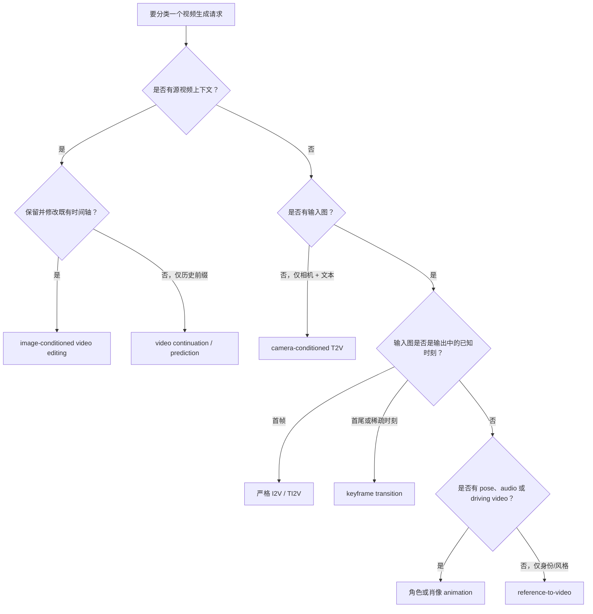
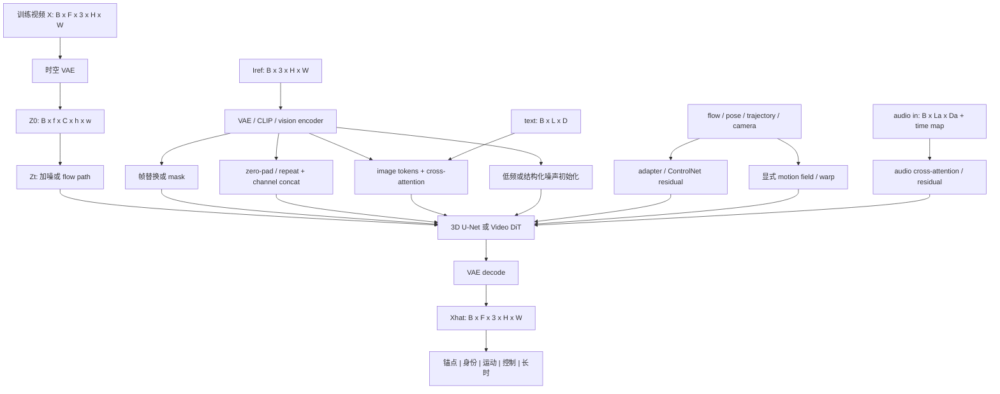
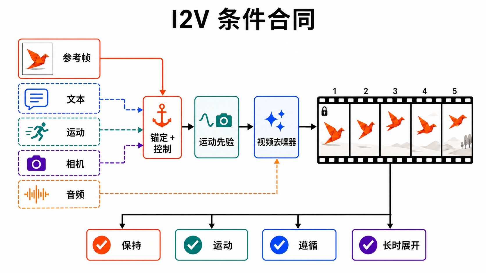

# 图像到视频：条件合同、运动先验与可验证控制

> 本章冻结于 **2026-08-30（Asia/Shanghai）**。Image-to-Video（I2V）不是“把任意图片放进视频模型”：在严格定义下，输入图像是输出视频的**时间锚点**，通常对应首帧；模型既要保留可观察内容，又要生成图外、遮挡后和未来才出现的内容。

检索式、结果数、纳排标准、首发/正式年份裁决、逐篇证据等级和图片审计见[配套研究记录](../../sources/research_20260830_image_to_video.md)。

## 🎯 学习目标

读完本章，应能完成六件事：

1. 用“输入图是否占据输出时间轴”区分 I2V、reference-to-video、角色动画、图像条件编辑与 camera-conditioned generation；
2. 写出可复现的 RGB、latent、文本、运动、相机和音频 tensor 合同；
3. 判断一篇工作采用帧替换、通道拼接、cross-attention、control residual、噪声初始化，还是显式 flow/warp；
4. 解释“保持参考图”与“产生足够运动”为何构成结构性冲突；
5. 把身份漂移、静态偏置、相机/物体运动纠缠、长时漂移定位到具体条件路径；
6. 设计不依赖跨论文排行榜的 I2V 评测与消融协议。

## 📐 1. 严格任务合同：图像是不是时间锚点

给定参考图像

```math
I_{\mathrm{ref}}\in[0,1]^{B\times3\times H\times W},
```

可选文本 $c_{\mathrm{text}}$、运动控制 $c_{\mathrm{motion}}$、相机控制 $c_{\mathrm{cam}}$ 和音频 $c_{\mathrm{audio}}$，I2V 学习条件分布

```math
p_\theta(X_{0:F-1}\mid I_{\mathrm{ref}},c_{\mathrm{text}},
c_{\mathrm{motion}},c_{\mathrm{cam}},c_{\mathrm{audio}}),
```

其中 $X\in[0,1]^{B\times F\times3\times H\times W}$，并且合同声明 $I_{\mathrm{ref}}$ 对应某个已知时间索引，最常见是 $X_0$。若输入图只提供人物外观、画风或产品身份，却不要求成为视频中的实际帧，则更准确的名字是 **reference-to-video**，而不是严格首帧 I2V；当参考用于定义测试时未见主体、输出使用新场景与新时间轴时，进入[开放集视频个性化](personalized-video-generation.md)的身份—运动合同。

### 1.1 三种“锚定”强度不能混写

- **像素硬锚定**：输出文件的首帧直接复制 $I_{\mathrm{ref}}$，因此在同一色彩与尺寸约定下 $X_0=I_{\mathrm{ref}}$。
- **latent 硬锚定**：采样时反复把首个 latent 替换为 $E(I_{\mathrm{ref}})$；解码器有重建误差，所以像素首帧不一定逐位相等。
- **软条件**：图像只经拼接或 attention 进入网络；首帧和后续帧都由模型预测，不能承诺严格复制。

论文若只写 “conditioned on the first frame”，仍必须查看实现究竟属于哪一种。Stable Video Diffusion（SVD）把加噪后的条件图 latent 沿时间复制并与视频 latent 通道拼接；这是强条件路径，却不是自动的像素等式 [[11]](#ref-11)。STIV 的 variable image conditioning 则可接收首个或最初两个已知帧，并用 image-condition dropout 缓解低运动 [[16]](#ref-16)。

### 1.2 邻接任务的可执行边界

| 任务 | 测试时视觉输入 | 输入图是否占输出时间轴 | 主要自由度 | 正确验收 |
|---|---|---:|---|---|
| **严格 I2V / TI2V** | 一张或多张已知时刻图像，可加文本 | 是，常为首帧 | 未来运动、新显露区域、镜头 | 锚点 + 身份 + 运动 + 条件遵循 |
| **first–last / keyframe transition** | 首尾帧或稀疏关键帧 | 是，多个锚点 | 锚点间路径可能多解 | 每个锚点、顺序、转场合理性 |
| [**开放集视频个性化 / reference-to-video**](personalized-video-generation.md) | 外观/身份/风格参考图 | 否 | 场景、构图与时间位置可改变 | 跨姿态身份、属性、绑定与无参考泄漏 |
| **角色/肖像 animation** | 人物图 + pose/audio/driving video | 常是外观参考，不必是首帧 | 受驱动动作、口型或姿态 | 身份、驱动同步、领域外泛化 |
| **image-conditioned video editing** | 源视频 + 编辑图/文字/掩码 | 源视频定义时间轴 | 局部内容变化 | 未编辑区域守恒 + 编辑遵循 |
| **video-prefix continuation / prediction** | 已发生的视频前缀，可加文本/动作 | 前缀占据输出时间轴，未来尚未知 | 前缀后的未来分布 | 前缀守恒、无未来泄漏、多步漂移/校准 |
| **camera-conditioned generation** | 文本 + 相机轨迹，可无源图 | 无源图时不是 I2V | 视点路径和场景生成 | 相机姿态、几何与可见性 |
| **VFI / 插帧** | 已知的前后端点 | 是，且端点两侧都可见 | 端点间中间帧 | 端点约束 + 指定时间重建 |

Animate Anyone 用参考人物图和姿态序列驱动角色，属于 reference-driven character animation；不能用它证明通用场景首帧 I2V 已解决 [[29]](#ref-29)。VACE 同时覆盖视频生成、编辑、参考图和控制信号，只有其“图像作为时间锚点、无源视频”的子协议属于 I2V [[30]](#ref-30)。CameraCtrl 从文本和相机轨迹生成视频，若没有输入锚点图，任务仍是 camera-conditioned T2V [[31]](#ref-31)。



**图的顺序化文字替代：**

1. 先检查是否有源视频：保留并修改既有时间轴属于 video editing；只把已发生片段当历史、生成未知未来属于 continuation/prediction。
2. 若没有源视频，再检查是否有输入图；没有输入图而只有相机与文本，属于 camera-conditioned T2V。
3. 有输入图时，检查它是否明确对应输出时间轴中的帧。
4. 输入图对应首帧时属于严格 I2V；对应首尾或稀疏时刻时属于 keyframe transition。
5. 输入图不占时间轴但另有 pose、audio 或 driving video 时，属于角色/肖像动画。
6. 输入图只给身份或风格时属于 reference-to-video。

## 🧩 2. 一条可检查形状的训练—推理合同

### 2.1 RGB 到视频 latent

训练样本通常是

```math
X\in[0,1]^{B\times F\times3\times H\times W},
\qquad I_{\mathrm{ref}}=X_{:,a},
```

其中 $a$ 是锚点索引。时空 VAE 得到

```math
Z_0=E_v(X)\in\mathbb R^{B\times f\times C\times h\times w},
\qquad Z_I=E_i(I_{\mathrm{ref}})\in\mathbb R^{B\times1\times C_I\times h\times w}.
```

$f$ 不一定等于 $F$：若 VAE 在时间上压缩，RGB 的“第一帧”可能影响一个 latent 时间块。模型文档必须写出时间压缩率、padding 和首帧对齐方式，否则所谓硬锚点可能在解码后扩散到数帧。

扩散训练常构造

```math
Z_t=\alpha_tZ_0+\sigma_t\epsilon,
\qquad \epsilon\sim\mathcal N(0,I),
```

并预测噪声、速度或 flow-matching velocity。核心不是损失名字，而是**哪个条件在什么噪声状态进入网络**。Step-Video-TI2V 把单帧条件编码成 $Z_c\in\mathbb R^{1\times C\times h\times w}$，在时间维补零后与视频 latent 通道拼接，得到送入 DiT 的 $f\times2C\times h\times w$ 条件输入；这是可复核的 tensor 合同，不等于所有 I2V 都必须如此 [[20]](#ref-20)。

### 2.2 条件张量、坐标和时间轴

只写 `camera control` 或 `trajectory condition` 不能复现。下面是一份最小条件合同；具体模型可以只实现其中一部分，但必须为每个启用条件保存 presence mask，并声明训练 dropout 与推理缺省值。

| 条件 | 一个可执行的形状示例 | 必须冻结的语义 |
|---|---|---|
| 已知图像/关键帧 | $I\in[0,1]^{B\times K\times3\times H\times W}$，索引 $`\tau\in\lbrace0,\ldots,F-1\rbrace^{B\times K}`$，有效位 $`M_I\in\lbrace0,1\rbrace^{B\times K}`$ | $\tau$ 对应 RGB 还是 latent 时间；像素/latent/软锚定；多个锚点冲突规则 |
| 文本 | $C_T\in\mathbb R^{B\times L\times D}$，token mask $`M_T\in\lbrace0,1\rbrace^{B\times L}`$ | encoder/tokenizer 版本、原 prompt 与改写 prompt、negative prompt |
| 点轨迹 | $P\in\mathbb R^{B\times F\times N\times d}$，$d=2$ 或 $3$；可见位 $`V\in\lbrace0,1\rbrace^{B\times F\times N}`$ | pixel/归一化/相机/世界坐标；遮挡含义；插值与 FPS |
| 稠密 flow | $U\in\mathbb R^{B\times(F-1)\times2\times H\times W}$，遮挡 $O$ | $x_t\rightarrow x_{t+1}$ 还是反向；resize 后向量缩放；未知区域 |
| 姿态/骨架 | $J\in\mathbb R^{B\times F\times N_J\times d}$，置信度 $Q_J$ | joint 定义、root/相机坐标、缺失点、驱动频率 |
| 相机 | 外参 $T_{wc}\in SE(3)^{B\times F}$、内参 $K_c\in\mathbb R^{B\times F\times3\times3}$，或 Plücker rays $R\in\mathbb R^{B\times F\times6\times h\times w}$ | world-to-camera/camera-to-world、左右手系、长度单位、参考 pose、畸变 |
| 已知音频输入 | waveform $A_{\mathrm{in}}\in\mathbb R^{B\times C_a\times S}$，或 feature $E_a\in\mathbb R^{B\times L_a\times D_a}$ | sample rate、声道、起点、$t/f_{\mathrm{video}}\leftrightarrow s/f_{\mathrm{audio}}$ 映射、静音 mask |

Audio-driven I2V 的合同是 $p(X\mid I,A_{\mathrm{in}},\ldots)$：音频已知，只驱动画面。原生联合音视频则生成新的 $A_{\mathrm{out}}$：

```math
p_\theta(X,A_{\mathrm{out}}\mid I,c_{\mathrm{text}},c_{\mathrm{motion}},c_{\mathrm{cam}}),
\qquad
A_{\mathrm{out}}\in\mathbb R^{B\times C_a\times S}.
```

两者不能都用一个含糊的 $c_{\mathrm{audio}}$ 表示。若视频 codec 有时间压缩，关键帧 mask、轨迹和音频时间戳还要先映射到 latent/chunk 时间轴，而不是按数组长度硬对齐。

### 2.3 六种条件注入位置



**图的顺序化文字替代：**

1. 训练视频先经时空 VAE 得到干净视频 latent，再进入加噪或 flow-matching 路径。
2. 参考图经 VAE、CLIP 或视觉编码器形成像素/latent 条件与语义 token。
3. 图像可通过已知帧替换、通道拼接、cross-attention 或低频噪声初始化进入去噪器。
4. 文本通常通过 cross-attention；flow、姿态、轨迹和相机可通过 adapter、ControlNet residual 或显式 warp 注入；已知音频还必须带 sample-rate 到视频时间的映射。
5. 3D U-Net 或 Video DiT 预测视频 latent，VAE 解码为 RGB 视频。
6. 输出必须分别验收锚点、身份、运动、外部控制和长时稳定性，不能用一个总分替代。

### 2.4 训练时必须声明的四个开关

1. **锚点采样**：总取首帧，还是随机取视频内一帧；随机锚点会改变“未来外推”假设。
2. **图像条件 dropout**：不丢弃条件时，模型容易把参考复制到全部帧；丢弃过强又会削弱身份。
3. **文本/图像联合 CFG 分支**：是 `uncond`、`image-only`、`image+text` 三分支，还是两分支；各 guidance scale 不可互换。
4. **运动分布**：是否按 optical-flow/motion score 分桶，是否过滤静态或镜头切换，帧率是否作为条件。

一个常见的联合 guidance 写法是

```math
\tilde v = v(\varnothing,\varnothing)
+s_I\big[v(I,\varnothing)-v(\varnothing,\varnothing)\big]
+s_T\big[v(I,T)-v(I,\varnothing)\big].
```

这里三次预测的条件状态必须和训练 dropout 一致。把图像也从“无文本分支”中移除，会同时改变身份和文本 guidance 的语义；不同论文的 $s_I,s_T$ 不能只看数值横比。

## 🖼️ 3. 条件合同示意图：四道门同时通过



**图注：** `ANCHOR + CONTROL` 表示参考帧与可选文本/运动/相机在合同层汇合，不代表所有模型共享同一个融合模块；`PRESERVE` 与 `MOVE` 是一对需要联合优化的目标，而不是先后独立完成的功能；`OBEY` 检查文本、轨迹、相机或音频条件是否真的改变了视频；`ROLL OUT` 检查误差是否随时间累积。图中的虚线表示可选条件，已知音频在此作为视频条件；原生联合音视频的输出合同需另行声明。首帧锁图标只表示“已知锚点”，像素硬锁、latent 锚定还是软条件必须由具体实现说明。

**图的顺序化文字替代：**

1. 参考帧是必需输入；文本、运动、相机与音频是可选输入。
2. 参考帧与可选文本、运动和相机控制在合同层汇合，运动先验决定可行变化；已知音频可直接条件化 denoiser。
3. Video denoiser 从锚点和条件展开后续帧，并为新显露区域生成内容。
4. 首帧是否被硬锁定必须由具体实现声明。
5. 输出依次通过参考保持、有效运动、条件遵循与长时稳定四道验证门。

## 🧭 4. 技术路线一：从隐式视频先验到显式运动

### 4.1 真正的 I2V 起点与通用祖先

Vondrick 等人在 NeurIPS 2016 从一张静态图预测最长约一秒的未来视频，是静态图未来合成的早期原型；论文目标是学习 scene dynamics，不应被改写成现代开放域 TI2V 系统 [[1]](#ref-1)。Zhao 等人在 ECCV 2018 明确定义 image-to-video translation，用 structure generation 预测序列结构，再以 residual refinement 细化外观，是更合适的“命名任务”里程碑 [[2]](#ref-2)。

MoCoGAN、SVG 等通用视频生成/预测祖先虽然建立了内容—运动分解和随机未来建模思想，但它们的标准合同没有外部静态参考图，因此本章不把它们计作 I2V 里程碑。**思想祖先**与**任务里程碑**必须分开。

### 4.2 随机未来与窄域动画

cINN 方法以可逆条件网络从单图采样多种可能未来，强调同一输入的随机性，而不是只求一个条件均值 [[3]](#ref-3)。Eulerian motion fields 则把一张图转换为循环、连续的自然动态，擅长流体、云、烟等局部运动；它是高质量窄域 animation，不是任意对象大动作生成器 [[4]](#ref-4)。“poke”交互方法从图像加一个像素级推动动作，预测物体形变和运动，说明运动控制可由稀疏交互提供，但仍依赖可学习的物体动力学分布 [[5]](#ref-5)。

### 4.3 文本把“怎样动”从图像中解耦

Make It Move 将图像用于外观、文本用于动作，并用 motion anchor 连接二者，正式提出可控 text-image-to-video；其 MNIST/CATER 证据适合证明任务可行性，不能直接外推到开放域照片 [[6]](#ref-6)。I2VGen-XL 后来用低分辨率基础模型和高分辨率细化级联，把全局语义、局部细节和文本共同注入；它是 2023 技术报告，而非已核验的正式会议论文 [[10]](#ref-10)。

## 🌊 5. 技术路线二：motion prior 怎样表示

### 5.1 直接在视频 latent 中生成

SVD 从大规模图像/视频预训练的 latent video diffusion 出发，再针对高分辨率 I2V 微调；其 14/25 帧模型、frame-rate 和 motion-bucket 条件及随时间变化的 guidance 都属于作者协议 [[11]](#ref-11)。DynamiCrafter 则把 T2V motion prior 迁移给开放域图像：一条图像语义 token 路径进入 cross-attention，另一条完整图像 latent 与噪声拼接，以同时供给语义和细节 [[9]](#ref-9)。

这类方法的优点是可直接生成遮挡后内容，缺点是 motion 与 appearance 共用去噪网络，定位“为什么不动/为什么变脸”比较困难。

### 5.2 先生成 flow 或 latent motion，再重建视频

LFDM 先用 flow autoencoder 压缩光流，再由 3D U-Net diffusion 生成 latent flow，最后 warp 参考图；显式运动提高可解释性，但 flow 不能单独生成参考图中从未出现的纹理 [[7]](#ref-7)。LaMD 用 motion-decomposed video autoencoder 把视频压缩为低维 latent motion，再扩散采样运动并重建视频；首发于 2023，IJCV 正式发表在 2025 [[8]](#ref-8)。

Motion-I2V 更明确地分成两阶段：第一阶段预测从参考帧到未来帧的 dense trajectories/flow，第二阶段用 motion-augmented temporal attention 沿轨迹传播首帧特征，并可接受稀疏用户轨迹 [[14]](#ref-14)。显式分解带来控制和诊断优势，但错误 motion field 会系统性搬错身份，disocclusion 仍需生成先验补足。

### 5.3 训练免费 adapter 与 feature injection

I2V-Adapter 把已有 T2I/T2V diffusion 通过轻量适配器扩展为图像条件视频，说明“完整重训一个 I2V 基座”不是唯一道路 [[33]](#ref-33)。Unified Text-Image-to-Video 也研究在不训练新模块时，把多张视觉条件放到不同时间位置；这类方法扩展的是**条件接口**，不自动提供新的动力学知识 [[32]](#ref-32)。AnyI2V 更进一步，在已有视频 diffusion 上做 inversion、特征注入、跨帧 query 对齐和语义 mask 优化，使 edge、depth、skeleton、mesh 等条件图也能成为首帧空间控制，并叠加用户轨迹 [[19]](#ref-19)。它的 `any` 指条件图模态灵活，不等于任何真实场景动力学都已解决。

## 🎥 6. 技术路线三：相机、3D 与物体运动解耦

相机运动会让全画面产生一致 flow，物体运动则只作用于局部；仅用文本 “camera pans left” 很容易把两者纠缠。

- **CamCo** 把相机轨迹注入 I2V，并用几何约束改善视点一致性；它仍是 2024 预印本证据 [[15]](#ref-15)。
- **RealCam-I2V** 用单目 metric depth 把参考图重建为可交互 3D 场景，使用户能在统一尺度中画相机轨迹；训练时把相对相机 pose 对齐到 metric scale，推理时用静态场景预览塑造高噪声阶段 [[18]](#ref-18)。
- **CamGeo** 面向稀疏相机关键帧，把预训练 video-to-3D 模型的 pose/depth 几何知识只在训练期蒸馏进视频 backbone；推理时移除教师，避免额外时延 [[25]](#ref-25)。

这些工作仍不等于显式 4D 重建：单目深度可能有尺度和遮挡错误，动态物体也不服从静态场景相机模型。正确评测应分别报告 camera pose adherence、背景几何一致性和独立物体 motion，而不是用一个视觉质量分数替代。若主张扩展到同刻多视角或任意 $(v,t)$ 查询，还需进入[多视角与 4D 生成](multiview-4d-generation.md)的重投影、遮挡、loop-closure 与状态导出协议。

## 🪞 7. 技术路线四：身份保持、关键帧与长视频

### 7.1 身份保持不是只比首帧相似度

本节只拥有“参考是已知时刻锚点”时的保真问题；纯主体参考的适配、多主体绑定、参考姿态/背景泄漏与身份—运动 Pareto 见[开放集视频个性化](personalized-video-generation.md)。

ConsistI2V 用 first-frame spatiotemporal attention 传播参考信息，并从参考图低频成分初始化噪声，以保持布局和风格 [[13]](#ref-13)。它揭示两个尺度：低频结构负责全局布局，局部 token/feature 负责身份细节。只比较第一帧与输出平均 CLIP 相似度，会漏掉手指、文字、纹理和遮挡后重现等局部漂移。

参考条件过强又会造成**静态偏置**。2026 的 DyMoS 观察到后续帧 query 对参考帧 key 分配过多 self-attention，并在早期去噪中对这些 logits 加可调偏置；它是 training-free 干预，证据仍为预印本，不能写成普遍因果定律 [[26]](#ref-26)。

### 7.2 首尾帧和稀疏 keyframe

SEINE 通过随机 mask 训练一个 video diffusion，同一模型可做 prediction、transition 和补全；当首尾帧已知时，它生成的是多解转场，不是只有一个正确中间帧的严格 VFI [[12]](#ref-12)。STIV 的 variable condition 允许首帧或首两帧替换，还能把上一个 clip 的尾帧作为下一段条件滚动生成 [[16]](#ref-16)。

关键帧系统必须记录：锚点索引、是否每步重新覆盖、两个锚点冲突时的优先级、是否允许改变锚点像素。只写 “supports first/last frame” 无法复现。

### 7.3 长视频是误差曲线，不是最长 demo

FramePack 以几何衰减的重要性打包历史帧，使 Transformer 上下文随时长渐近有界，并用 endpoint planning/inverted sampling 抑制漂移 [[21]](#ref-21)。但反向规划会使用未来端点，不再是严格在线因果生成；“能做长视频”也不等于身份、事件和物理状态不漂移。

长视频应画出随时间的曲线：身份相似度、几何/物体数量、motion amplitude、prompt event completion 和 chunk seam error。只展示几十秒精选样例没有失败尾部。

## 🔊 8. 原生音视频与移动端：两个相邻前沿

### 8.1 音频是输入条件，还是共同生成变量

传统 audio-driven portrait animation 把音频作为已知驱动；native audio-video generation 则联合生成 $(X,A)$。Ovi 用两个结构对称的 audio/video DiT，在每个 block 做双向 cross-modal fusion，并对齐不同时间分辨率；它展示的是 2025 预印本中的原生联合生成 [[28]](#ref-28)。LTX-2 报告不对称音频/视频双流、跨模态 attention 与联合 latent 生成，是 2026 的另一条开放技术报告路线；冻结日官方仓库推荐 LTX-2.5，并把 LTX-2.3 列为 legacy，因此论文机制与当前 checkpoint 必须分栏 [[34]](#ref-34)。只有当参考图被声明为输出时间锚点时，这类系统的子协议才是 “I2V + native AV”。评价除画面外还要测 speech/SFX 同步、身份音色、声源事件和静音负例。

### 8.2 一步生成与端侧部署

OSV 先做 latent GAN 预训练，再做 adversarial consistency latent distillation，把多步 I2V 压缩到一步；其正式证据为 CVPR 2025 [[17]](#ref-17)。V-PAE 用 stability priming 和 unified adversarial equilibrium 做大模型单步蒸馏，并专门加入语义头与 conditional score-distillation 处理 I2V 条件帧坍塌，正式发表于 AAAI 2026 [[24]](#ref-24)。

MobileI2V 则组合高压缩 VAE、线性/softmax 混合 attention 和 1–2 步蒸馏，并给出 Core ML/iPhone 16 Pro 的作者设备数据 [[22]](#ref-22)。这些时延不能与数据中心 GPU 或不同分辨率横排；最低系统账本必须包含设备、精度、分辨率、帧数、VAE 是否计时、warm-up、峰值内存和能耗。

## 🗓️ 9. 里程碑：首发年与正式发表年分列

| 首次公开 | 正式发表 | 工作 | 对 I2V 的实际贡献 | 边界 |
|---:|---:|---|---|---|
| 2016 | NeurIPS 2016 | Scene Dynamics [[1]](#ref-1) | 单图未来视频原型 | 原型/祖先，不是现代 TI2V |
| 2018 | ECCV 2018 | Forecast & Refine [[2]](#ref-2) | 明确命名 I2V translation | 单物体与早期低分辨率设置 |
| 2021 | CVPR 2021 | cINNs [[3]](#ref-3) | 同图多种随机未来 | 训练域决定可行动力学 |
| 2021 | CVPR 2021 | Eulerian Motion Fields [[4]](#ref-4) | 循环自然动态 | 窄域 animation |
| 2021 | CVPR 2022 | Make It Move [[6]](#ref-6) | 文本控制 motion 的 TI2V | 证据主要来自合成/简化域 |
| 2023 | CVPR 2023 | LFDM [[7]](#ref-7) | latent flow diffusion + warp | 新显露区域受限 |
| 2023 | ECCV 2024 | DynamiCrafter [[9]](#ref-9) | 开放域 T2V prior + 双图像路径 | 短片、仍可能静态或漂移 |
| 2023 | 技术报告 | I2VGen-XL / SVD [[10]](#ref-10), [[11]](#ref-11) | 级联高分辨率与大规模 latent I2V | 不冒充正式 venue |
| 2024 | TMLR 2024 | ConsistI2V [[13]](#ref-13) | 首帧 attention + 低频初始化 | 保持过强会抑制运动 |
| 2024 | SIGGRAPH 2024 | Motion-I2V [[14]](#ref-14) | 显式 motion field 与轨迹控制 | motion error 会传播 |
| 2024 | CVPR 2025 | OSV [[17]](#ref-17) | 一步 I2V distillation | 速度结论绑定实现 |
| 2024 | ICCV 2025 | STIV [[16]](#ref-16) | 统一 text/image condition 与前缀帧 rollout | rollout 仍会漂移 |
| 2025 | ICCV 2025 | RealCam-I2V / AnyI2V [[18]](#ref-18), [[19]](#ref-19) | metric camera 控制与任意条件图控制 | 3D/条件域各有假设 |
| 2026 | CVPR 2026 | ReasonDiff [[23]](#ref-23) | 非配对/OOD text-image 的时间锚点推理 | 不是普通配对首帧设置 |
| 2026 | AAAI / ICML 2026 | V-PAE / CamGeo [[24]](#ref-24), [[25]](#ref-25) | 单步蒸馏与稀疏相机 3D 蒸馏 | 各解决一个子轴 |

表中没有把通用 T2V、MoCoGAN、SVG 或纯 video editing 当作 I2V 里程碑；它们可以提供 backbone 或思想，但任务合同不同。

## 🔬 10. 代表论文的深读对照

| 工作 | 图像条件怎么进 | motion 从哪里来 | 训练/推理关键点 | 最值得做的反证 |
|---|---|---|---|---|
| LFDM [[7]](#ref-7) | 参考图用于 warp/reconstruction | diffusion 生成 latent flow | 两阶段 flow AE + 3D U-Net | 大 disocclusion 是否出现拉伸/空洞 |
| DynamiCrafter [[9]](#ref-9) | image context cross-attn + full latent concat | 预训练 T2V prior | 双路径平衡语义与细节 | 去掉任一路时身份/运动怎样变 |
| SVD [[11]](#ref-11) | 加噪图 latent 沿时间复制并通道拼接 | 大规模视频预训练 | motion bucket、fps、时间 CFG | 相同图在不同 motion bucket 是否只变镜头 |
| ConsistI2V [[13]](#ref-13) | first-frame spatiotemporal attention | base diffusion prior | 低频参考噪声初始化 | 保持提升是否伴随动态幅度下降 |
| Motion-I2V [[14]](#ref-14) | 首帧 feature 沿轨迹传播 | 显式 flow/trajectory diffusion | motion predictor + video renderer | 错轨迹、交叉轨迹和出画后再入画 |
| STIV [[16]](#ref-16) | known-frame replacement | 统一 DiT/flow matching | image dropout + joint CFG | 首帧/两帧/滚动时的条件状态是否一致 |
| OSV [[17]](#ref-17) | 沿用 I2V 条件 | teacher motion 被一步学生吸收 | GAN pretrain + consistency distillation | 一步是否牺牲小物体和大运动尾部 |
| RealCam-I2V [[18]](#ref-18) | 图像重建 metric 3D 场景 | 指定 camera path + base prior | metric alignment + noise shaping | 深度错误、非刚体和动态前景 |
| ReasonDiff [[23]](#ref-23) | 图像不一定是首帧 | MLLM narrative + temporal anchor | AlignFormer 对齐帧级 latent | 锚点推断错时是否仍保持图像语义 |
| HPSD [[27]](#ref-27) | teacher 有 clean fixed first frame | 从 TI2V teacher 蒸馏到 T2V student | re-noise anchor、student subtrajectory、重置 clean frame | 条件状态切换是否产生边界偏差 |

ReasonDiff 处理的是**非配对测试时图文**：图像可能对应中间时刻，甚至与文本描述的事件没有训练配对；VisionNarrator 先推断逐帧叙事和锚点位置，再由 AlignFormer 做时间对齐 [[23]](#ref-23)。它扩展了 I2V 的锚点合同，不能拿其结果与“图像必为首帧”的表直接横排。

HPSD 则不是新的输出任务，而是 2026 的训练策略：teacher 在 TI2V 轨迹中看到干净首帧，student 的 T2V 状态不兼容；方法在 teacher/student 子轨迹之间重加噪并重新施加 clean first frame，专门处理 condition-state mismatch [[27]](#ref-27)。这说明蒸馏不仅要对齐输出，还要对齐采样状态。

## 📊 11. 评测协议：把“像”和“动”画成 Pareto 前沿

### 11.1 先冻结测试卡

每组结果至少附以下字段：

- **任务模式**：paired first-frame、unpaired/OOD image-text、first–last、reference-only 或 camera-controlled；
- **输出合同**：$F,H,W,fps$、时长、锚点索引、像素/latent/软锚定；
- **条件**：prompt、negative prompt、motion bucket、trajectory/camera/audio 的坐标与时间基准；
- **采样**：sampler、steps、guidance、seed 数、每输入样本数，是否 cherry-pick；
- **系统**：模型/权重版本、VAE、设备、精度、峰值内存、是否含编解码与 I/O；
- **数据**：测试清单、裁剪/resize、图文是否来自同一真实视频、是否与训练集近重复。

### 11.2 五轴指标，不做一个神秘总分

| 轴 | 推荐测量 | 必须同时说明的盲区 |
|---|---|---|
| 锚点与身份 | 首帧像素误差、DINO/CLIP/人脸或实例特征、局部 patch/文字 OCR | VAE 重建、crop 和特征模型版本会改变分数 |
| 运动 | optical-flow 幅度/分布、dynamic degree、人类动作合理性 | 大运动不等于正确运动；镜头抖动可虚增 |
| 时间质量 | flicker、warp error、轨迹平滑、FVD/视频特征 | flow estimator、clip 长度和样本量敏感 |
| 条件遵循 | text-video alignment、点轨迹误差、camera pose error、audio sync | 自动模型可能偏好训练域或静态语义 |
| 长时与系统 | 随时间漂移曲线、seam、失败分位数、时延/显存/能耗 | 最长 demo 与平均时延都隐藏尾部 |

最关键的图不是单个 overall score，而是横轴 `reference fidelity`、纵轴 `motion correctness/amplitude` 的 Pareto 散点；再用颜色编码 camera/text adherence。这样才能看出“高相似度”是否只是复制静帧，“高动态”是否来自身份漂移。

### 11.3 必做消融

1. 图像条件 scale 从弱到强扫一条曲线，而不是只给默认值。
2. 固定 seed 对比 image-only、text-only、image+text，确认条件真正生效。
3. 分别移除 concat、image tokens、motion/camera adapter，定位每条路径。
4. 用静态、局部非刚体、全局刚体、出画再入画、强 camera motion 五个 motion bucket。
5. 对长视频按 1/4、1/2、3/4、末尾切片，报告身份与 motion 曲线。
6. 至少公开随机样例网格、失败尾部和所有 seeds；精选视频只作说明。

## 🧯 12. 从症状反推条件路径

| 症状 | 优先怀疑 | 定位实验 | 不充分的“修复” |
|---|---|---|---|
| 几乎不动/只缩放 | reference-frame dominance、图像 CFG 过强、静态训练偏差 | 降图像 scale；遮断 ref-key attention；固定 prompt 测 motion 曲线 | 单纯增大随机噪声 |
| 主体越动越变样 | 局部身份 token 不足、rollout 上下文丢失、错误 flow | 局部 patch/遮挡重现；短/长 clip 对照 | 只提高全局 CLIP 相似度 |
| 首帧与输入不完全相同 | 软/latent 锚定、VAE 重建、resize/color mismatch | 直接导出第 0 帧与 VAE round-trip 对照 | 宣称“模型记住了首帧” |
| 新显露区拉伸或复制 | warp-only 路径、遮挡/深度错误 | 人工遮挡与大视角测试；禁用生成补全 | 更强平滑正则 |
| 镜头与物体一起漂 | camera/object motion 未分解、pose 尺度不一致 | 静态场景 + 独立动态前景；回估 camera pose | 只加文本 “fixed camera” |
| prompt 动作被忽略 | image condition 压制文本、训练 caption 无动作 | image-only/text-only/joint 三分支 | 盲目提高 text CFG |
| 首尾转场中途跳变 | keyframe 冲突、mask schedule/时间编码不一致 | 对称锚点、交换端点、逐帧条件权重 | 只看首尾截图 |
| chunk 边界闪烁 | 历史打包、VAE context 或 seed 重启 | seam 前后 latent/decoder 单独对照 | 后处理插帧掩盖 |
| 音画事件错位 | 先视频后配音、时间 token/采样率未对齐 | 正负事件、无声、离屏声源测试 | 只测口型样例 |

## 🚀 13. 2026 前沿与仍未解决的问题

截至冻结日，可把前沿分成五条，而不是笼统称“更大模型”：

1. **锚点推理**：ReasonDiff 处理非配对/OOD 图文，先决定图像应出现在哪个时刻，再生成过程 [[23]](#ref-23)。
2. **稀疏相机 + 3D 教师**：CamGeo 只在训练期使用 3D pose/depth 蒸馏，目标是让稀疏 camera keyframe 之间不漂 [[25]](#ref-25)。
3. **条件强度干预**：DyMoS 直接调 reference-key attention；“保持—运动”开始从经验 slider 变成可定位的内部路径 [[26]](#ref-26)。
4. **状态一致的蒸馏**：HPSD 处理 clean anchor teacher 与无 anchor student 的采样状态错配 [[27]](#ref-27)。
5. **一步与端侧**：V-PAE 的正式单步蒸馏和 MobileI2V 的设备实现把评测从 NFE 扩展到 decoder、内存与能耗 [[24]](#ref-24), [[22]](#ref-22)。

仍然开放的问题包括：

- 如何在大幅非刚体运动中保持局部身份，又不把参考纹理贴到所有未来帧？
- 如何用可编辑的 4D 表示统一 camera、geometry、object motion 和 disocclusion？
- 多张参考图互相冲突时，哪个属性属于身份不变量，哪个属于可动状态？
- 长视频能否保持物体永久性、因果状态和事件完成，而非只保持局部画风？
- 原生音视频如何同时守住画面锚点、说话人身份、声源位置与事件同步？
- 怎样建立公开、去训练集近重复、包含失败尾部的 I2V benchmark？

最终判断标准很简单：一段 I2V 结果必须同时回答**保留了什么、改变了什么、为什么这样动、控制是否真的生效、误差怎样随时间增长**。回答不了这五个问题，漂亮 demo 仍不是可复核证据。

## 参考文献

<a id="ref-1"></a>[1] [Generating Videos with Scene Dynamics](https://proceedings.neurips.cc/paper_files/paper/2016/hash/04025959b191f8f9de3f924f0940515f-Abstract.html). Carl Vondrick, Hamed Pirsiavash, Antonio Torralba. NeurIPS. 2016.

<a id="ref-2"></a>[2] [Learning to Forecast and Refine Residual Motion for Image-to-Video Generation](https://openaccess.thecvf.com/content_ECCV_2018/html/Long_Zhao_Learning_to_Forecast_ECCV_2018_paper.html). Long Zhao, Xi Peng, Yu Tian, Mubbasir Kapadia, Dimitris Metaxas. ECCV. 2018.

<a id="ref-3"></a>[3] [Stochastic Image-to-Video Synthesis Using cINNs](https://openaccess.thecvf.com/content/CVPR2021/html/Dorkenwald_Stochastic_Image-to-Video_Synthesis_Using_cINNs_CVPR_2021_paper.html). Michael Dorkenwald, Timo Milbich, Andreas Blattmann, Robin Rombach, Konstantinos G. Derpanis, Björn Ommer. CVPR. 2021.

<a id="ref-4"></a>[4] [Animating Pictures With Eulerian Motion Fields](https://openaccess.thecvf.com/content/CVPR2021/html/Holynski_Animating_Pictures_With_Eulerian_Motion_Fields_CVPR_2021_paper.html). Aleksander Holynski, Brian L. Curless, Steven M. Seitz, Richard Szeliski. CVPR. 2021.

<a id="ref-5"></a>[5] [Understanding Object Dynamics for Interactive Image-to-Video Synthesis](https://openaccess.thecvf.com/content/CVPR2021/html/Blattmann_Understanding_Object_Dynamics_for_Interactive_Image-to-Video_Synthesis_CVPR_2021_paper.html). Andreas Blattmann, Timo Milbich, Michael Dorkenwald, Björn Ommer. CVPR. 2021.

<a id="ref-6"></a>[6] [Make It Move: Controllable Image-to-Video Generation With Text Descriptions](https://openaccess.thecvf.com/content/CVPR2022/html/Hu_Make_It_Move_Controllable_Image-to-Video_Generation_With_Text_Descriptions_CVPR_2022_paper.html). Yaosi Hu, Chong Luo, Zhenzhong Chen. CVPR. 2022.

<a id="ref-7"></a>[7] [Conditional Image-to-Video Generation With Latent Flow Diffusion Models](https://openaccess.thecvf.com/content/CVPR2023/html/Ni_Conditional_Image-to-Video_Generation_With_Latent_Flow_Diffusion_Models_CVPR_2023_paper.html). Haomiao Ni, Changhao Shi, Kai Li, Sharon X. Huang, Martin Renqiang Min. CVPR. 2023.

<a id="ref-8"></a>[8] [LaMD: Latent Motion Diffusion for Image-Conditional Video Generation](https://doi.org/10.1007/s11263-025-02386-7). Yaosi Hu, Zhenzhong Chen, Chong Luo. International Journal of Computer Vision. 2025; arXiv v1 2023.

<a id="ref-9"></a>[9] [DynamiCrafter: Animating Open-domain Images with Video Diffusion Priors](https://www.ecva.net/papers/eccv_2024/papers_ECCV/papers/06298.pdf). Jinbo Xing, Menghan Xia, Yong Zhang, Haoxin Chen, Wangbo Yu, et al. ECCV. 2024; arXiv v1 2023.

<a id="ref-10"></a>[10] [I2VGen-XL: High-Quality Image-to-Video Synthesis via Cascaded Diffusion Models](https://arxiv.org/abs/2311.04145). Shiwei Zhang, Jiayu Wang, Yingya Zhang, Kang Zhao, Hangjie Yuan, et al. Technical report. 2023.

<a id="ref-11"></a>[11] [Stable Video Diffusion: Scaling Latent Video Diffusion Models to Large Datasets](https://arxiv.org/abs/2311.15127). Andreas Blattmann, Tim Dockhorn, Sumith Kulal, Daniel Mendelevitch, Maciej Kilian, et al. Technical report. 2023.

<a id="ref-12"></a>[12] [SEINE: Short-to-Long Video Diffusion Model for Generative Transition and Prediction](https://openreview.net/forum?id=FNq3nIvP4F). Xinyu Chen, Yaohui Wang, Lingjun Zuo, Zhengxin Li, Yuhuan Ma, Yifei Li, Jiaying Liu. ICLR. 2024.

<a id="ref-13"></a>[13] [ConsistI2V: Enhancing Visual Consistency for Image-to-Video Generation](https://openreview.net/forum?id=vqniLmUDvj). Weiming Ren, Huan Yang, Ge Zhang, Cong Wei, Xinrun Du, Wenhao Huang, Wenhu Chen. TMLR. 2024.

<a id="ref-14"></a>[14] [Motion-I2V: Consistent and Controllable Image-to-Video Generation with Explicit Motion Modeling](https://research.nvidia.com/publication/2024-06_motion-i2v-consistent-and-controllable-image-video-generation-explicit-motion). Xiaoyu Shi, Zhaoyang Huang, Fu-Yun Wang, Weikang Bian, Dasong Li, et al. ACM SIGGRAPH. 2024. DOI: `10.1145/3641519.3657497`.

<a id="ref-15"></a>[15] [CamCo: Camera-Controllable 3D-Consistent Image-to-Video Generation](https://arxiv.org/abs/2406.02509). Dejia Xu, Weili Nie, Chao Liu, Sifei Liu, Jan Kautz, Zhangyang Wang, Arash Vahdat. arXiv preprint. 2024.

<a id="ref-16"></a>[16] [STIV: Scalable Text and Image Conditioned Video Generation](https://openaccess.thecvf.com/content/ICCV2025/html/Lin_STIV_Scalable_Text_and_Image_Conditioned_Video_Generation_ICCV_2025_paper.html). Zongyu Lin, Wei Liu, Chen Chen, Jiasen Lu, Wenze Hu, et al. ICCV. 2025; arXiv v1 2024.

<a id="ref-17"></a>[17] [OSV: One Step is Enough for High-Quality Image to Video Generation](https://openaccess.thecvf.com/content/CVPR2025/html/Mao_OSV_One_Step_is_Enough_for_High-Quality_Image_to_Video_CVPR_2025_paper.html). Xiaofeng Mao, Zhengkai Jiang, Fu-Yun Wang, Jiangning Zhang, Hao Chen, et al. CVPR. 2025; arXiv v1 2024.

<a id="ref-18"></a>[18] [RealCam-I2V: Real-World Image-to-Video Generation with Interactive Complex Camera Control](https://openaccess.thecvf.com/content/ICCV2025/html/Li_RealCam-I2V_Real-World_Image-to-Video_Generation_with_Interactive_Complex_Camera_Control_ICCV_2025_paper.html). Teng Li, Guangcong Zheng, Rui Jiang, Shuigen Zhan, Tao Wu, et al. ICCV. 2025.

<a id="ref-19"></a>[19] [AnyI2V: Animating Any Conditional Image with Motion Control](https://openaccess.thecvf.com/content/ICCV2025/papers/Li_AnyI2V_Animating_Any_Conditional_Image_with_Motion_Control_ICCV_2025_paper.pdf). Ziye Li, Hao Luo, Xincheng Shuai, Henghui Ding. ICCV. 2025.

<a id="ref-20"></a>[20] [Step-Video-TI2V Technical Report: A State-of-the-Art Text-Driven Image-to-Video Generation Model](https://arxiv.org/abs/2503.11251). Haoyang Huang, Guoqing Ma, Nan Duan, Xing Chen, Changyi Wan, et al. Technical report. 2025.

<a id="ref-21"></a>[21] [Frame Context Packing and Drift Prevention in Next-Frame-Prediction Video Diffusion Models](https://arxiv.org/abs/2504.12626). Lvmin Zhang, Shengqu Cai, Muyang Li, Gordon Wetzstein, Maneesh Agrawala. arXiv preprint. 2025.

<a id="ref-22"></a>[22] [MobileI2V: Fast and High-Resolution Image-to-Video on Mobile Devices](https://arxiv.org/abs/2511.21475). Shuai Zhang, Bao Tang, Siyuan Yu, Yueting Zhu, Jingfeng Yao, et al. arXiv preprint. 2025.

<a id="ref-23"></a>[23] [Reasoning Diffusion for Unpaired Test Time Out-of-distribution Text-Image to Video Generation](https://openaccess.thecvf.com/content/CVPR2026/html/Pan_Reasoning_Diffusion_for_Unpaired_Test_Time_Out-of-distribution_Text-Image_to_Video_CVPR_2026_paper.html). Zirui Pan, Xin Wang, Yipeng Zhang, Hong Chen, Kecheng Zheng, Wenwu Zhu. CVPR. 2026.

<a id="ref-24"></a>[24] [Phased One-Step Adversarial Equilibrium for Video Diffusion Models](https://ojs.aaai.org/index.php/AAAI/article/view/37318). Jiaxiang Cheng, Bing Ma, Xuhua Ren, Hongyi Henry Jin, Kai Yu, et al. AAAI. 2026.

<a id="ref-25"></a>[25] [CamGeo: Sparse Camera-Conditioned Image-to-Video Generation with 3D Geometry Priors](https://icml.cc/virtual/2026/poster/63132). Xuanyi Liu, Deyi Ji, Liqun Liu, Lanyun Zhu, Xuhang Chen, et al. ICML. 2026. [arXiv version](https://arxiv.org/abs/2605.30895).

<a id="ref-26"></a>[26] [Rebalancing Reference Frame Dominance to Improve Motion in Image-to-Video Models](https://arxiv.org/abs/2605.19398). Wooseok Jeon, Seungho Park, Seunghyun Shin, Sangeyl Lee, Hyeonho Jeong, Hae-Gon Jeon. arXiv preprint. 2026.

<a id="ref-27"></a>[27] [HPSD: Hybrid-Policy Self-Distillation for Text-Image-to-Video Diffusion Models](https://arxiv.org/abs/2608.13205). Jiazi Bu, Pengyang Ling, Yujie Zhou, Yibin Wang, Yuhang Zang, et al. arXiv preprint. 2026.

<a id="ref-28"></a>[28] [Ovi: Twin Backbone Cross-Modal Fusion for Audio-Video Generation](https://arxiv.org/abs/2510.01284). Chetwin Low, Weimin Wang, Calder Katyal. arXiv preprint. 2025.

<a id="ref-29"></a>[29] [Animate Anyone: Consistent and Controllable Image-to-Video Synthesis for Character Animation](https://arxiv.org/abs/2311.17117). Li Hu, Xin Gao, Peng Zhang, Ke Sun, Bang Zhang, Liefeng Bo. arXiv preprint. 2023.

<a id="ref-30"></a>[30] [VACE: All-in-One Video Creation and Editing](https://openaccess.thecvf.com/content/ICCV2025/html/Jiang_VACE_All-in-One_Video_Creation_and_Editing_ICCV_2025_paper.html). Zhen Jiang, Yuting Gao, Jinbo Xing, Hanyuan Liu, Hao He, et al. ICCV. 2025.

<a id="ref-31"></a>[31] [CameraCtrl: Enabling Camera Control for Video Diffusion Models](https://openreview.net/forum?id=Z4evOUYrk7). Hao He, Yinghao Xu, Yuwei Guo, Gordon Wetzstein, Bo Dai, Hongsheng Li, Ceyuan Yang. ICLR. 2025; arXiv v1 2024.

<a id="ref-32"></a>[32] [Unified Text-Image-to-Video Generation: A Training-Free Approach to Flexible Visual Conditioning](https://arxiv.org/abs/2505.20629). Bolin Lai, Sangmin Lee, Xu Cao, Xiang Li, James M. Rehg. arXiv preprint. 2025.

<a id="ref-33"></a>[33] [I2V-Adapter: A General Image-to-Video Adapter for Diffusion Models](https://arxiv.org/abs/2312.16693). Xun Guo, Mingwu Zheng, Liang Hou, Yuan Gao, Yufan Deng, et al. arXiv preprint. 2023.

<a id="ref-34"></a>[34] [LTX-2: Efficient Joint Audio-Visual Foundation Model](https://arxiv.org/abs/2601.03233). Yoav HaCohen, Benny Brazowski, Nisan Chiprut, et al. arXiv preprint. 2026. Official versioned code and weight repository [](https://github.com/Lightricks/LTX-2).
