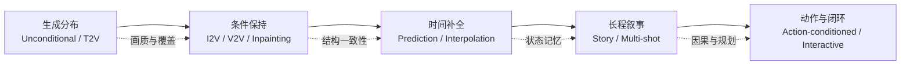

# 生成任务深度路线图

本目录把 [任务与方法分类](../taxonomy.md) 中的 10 个生成任务拆成独立子文档。每篇都按同一条研究线索组织：任务定义、原始方法、深度学习阶段、diffusion / Transformer / foundation model 阶段、最新趋势、评测与开放问题。

这些页面不是产品清单，而是研究地图。阅读时建议先判断任务的条件输入是什么，再看模型到底是在补全像素、生成运动、编辑已有视频，还是模拟动作后的世界。

本轮补充的手动核验记录保存在 [video generation tasks research audit](../../sources/research_20260809_video_generation_tasks_manual.md)。仓库已有正式 BibTeX 与 GitHub star 快照仍以 [引用与代码索引](../bibliography.md) 为准。

各子文档正文采用 `[[1]](#ref-1)` 这类可跳转编号引用；文末参考文献采用 CVPR-like 的编号格式。正式条目来自 [完整 BibTeX](../../bibliography/references.bib)，少数尚未纳入 BibTeX 的最新工作会以论文链接列出。

## 子文档

| 任务 | 子文档 | 核心问题 |
|---|---|---|
| Unconditional video generation | [无条件视频生成](unconditional-video-generation.md) | 没有外部条件时如何建模视频分布 |
| Text-to-video | [文本到视频](text-to-video.md) | 如何把语言约束转成时空视觉内容 |
| Image-to-video | [图像到视频](image-to-video.md) | 如何保持首帧身份和布局，同时生成合理运动 |
| Video prediction | [视频预测](video-prediction.md) | 如何根据历史帧预测多种未来 |
| Frame interpolation | [帧插值](frame-interpolation.md) | 如何在两个关键帧之间补出自然运动 |
| Video-to-video | [视频到视频](video-to-video.md) | 如何编辑视频而不破坏原始结构 |
| Video inpainting | [视频修复与补全](video-inpainting.md) | 如何补全遮挡、删除对象和延展画面 |
| Story / multi-shot generation | [故事与多镜头生成](story-multishot.md) | 如何保持角色、场景、叙事和镜头连续性 |
| Action-conditioned prediction | [动作条件预测](action-conditioned-prediction.md) | 如何预测动作干预后的未来 |
| Interactive world generation | [交互式世界生成](interactive-world-generation.md) | 如何实时响应用户或智能体动作并保持世界状态 |

## 横向比较

一个实用的判断规则：越靠右，模型越不能只靠“看起来合理”来评估；它必须越来越多地接受反事实、状态保持和闭环控制测试。

## 参考文献

[1] Wilson Yan, Yunzhi Zhang, Pieter Abbeel, and Aravind Srinivas. [VideoGPT: Video Generation using VQ-VAE and Transformers](https://arxiv.org/abs/2104.10157). arXiv preprint, 2021.

[2] Jonathan Ho, Tim Salimans, Alexey Gritsenko, William Chan, Mohammad Norouzi, and David J. Fleet. [Video Diffusion Models](https://arxiv.org/abs/2204.03458). arXiv preprint, 2022.

[3] OpenAI. [Video Generation Models as World Simulators](https://openai.com/index/video-generation-models-as-world-simulators/). Technical report, 2024.

[4] [video generation tasks research audit](../../sources/research_20260809_video_generation_tasks_manual.md). 本目录补充来源的手动核验记录.
