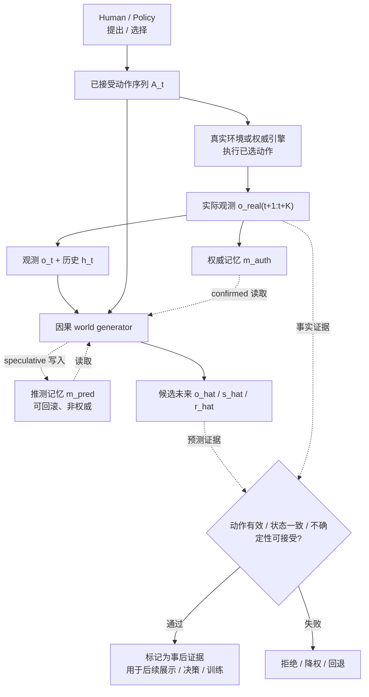
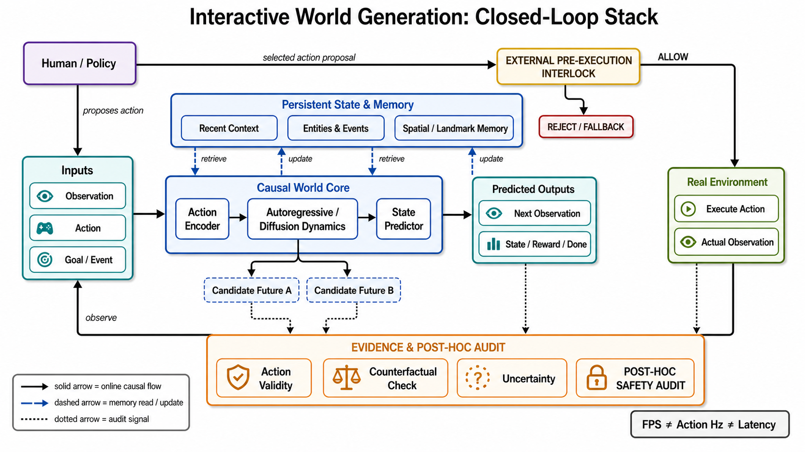
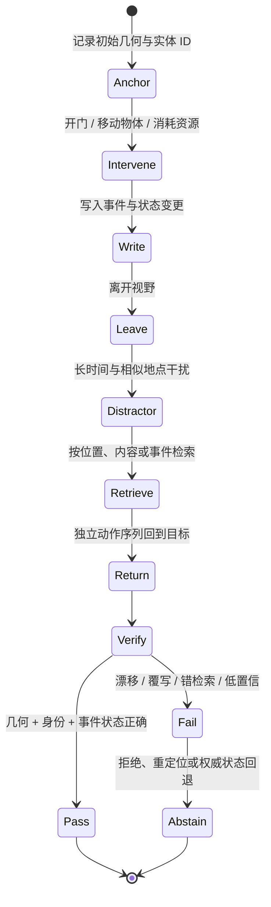

# 交互式世界生成：从动作条件视频到可验证的持久世界

> 本章资料与开放状态冻结于 **2026-08-30（Asia/Shanghai）**。Interactive World Generation（IWG）不是“把视频生成器接上键盘”这么简单：它要求系统在 rollout 中持续接收新动作、按因果顺序更新输出，并使动作后果、空间布局与对象状态可被反事实和回访实验检验。

检索式、结果数、纳入/排除、证据等级、代码/权重开放面和 AI 图 provenance 见[配套研究记录](../../sources/research_20260830_interactive_world_generation.md)。

## 🎯 1. 学习目标

读完本章，应能：

1. 区分交互式世界生成、动作条件预测、learned game engine、一般 world model、4D/scene simulation 与 World Action Model（WAM）；
2. 写出 observation–action–state–memory 的闭环合同，并分别报告 FPS、accepted-action Hz、动作 hold 规则、p95 input-to-first-affected-frame latency 与 rollout horizon；
3. 把 Genie、UniSim、GameNGen、DIAMOND、Oasis、Genie 2/3 和 2026 年系统放进 latent action、diffusion game engine、memory/compression、joint video–action、persistent world 五条机制路线；
4. 设计 action validity、counterfactual intervention、revisitation、uncertainty、model exploitation 与 decision utility 的分层实验；
5. 看到 demo、paper、checkpoint、product/platform 时，知道它们分别能证明什么、不能证明什么。

## 🧭 2. 操作定义与边界

### 2.1 最小操作定义

令 $o_t$ 是当前观测，$A_t=(a_t,\ldots,a_{t+K-1})$ 是与未来 $K$ 个 observation steps 对齐的动作 schedule，$g_t$ 是可选目标或世界事件，$m_t$ 是跨窗口记忆。原始动作事件先在独立的动作时钟上被系统**接受**，再按明示规则对齐到 schedule；因此相邻 $a$ 可以是同一 accepted action 的 hold，而不是 $K$ 次独立输入。交互式世界生成器至少实现

```math
(\hat o_{t+1:t+K},\hat s_{t+1:t+K},\hat r_{t:t+K-1},
\hat d_{t:t+K-1},u_t)
\sim
p_\theta(\cdot\mid h_t,A_t,g_t,m_t),
```

其中 $h_t=(o_0,a_0,\ldots,o_t)$，$\hat s$、$\hat r$、$\hat d$ 可以缺省，但若系统声称可作为环境训练或评估策略，就应说明状态、奖励、终止与约束来自哪里；$u_t$ 表示不确定性或拒绝信号。若接口每个 model chunk 只接收一次动作，必须显式声明 hold semantics，例如 $`a_{t+j}=a_t,\ 0\le j\lt K`$，并给出 hold 时长；不能用单个 $a_t$ 默认代表一段未定义的未来。

预测分支与真实分支的记忆权限也必须拆开：

```math
m^{\mathrm{pred}}_{t+K}
=U_{\mathrm{pred}}(m^{\mathrm{pred}}_t,h_t,A_t,\hat o_{t+1:t+K},q_t),
```

```math
m^{\mathrm{auth}}_{t+K}
=U_{\mathrm{auth}}(m^{\mathrm{auth}}_t,o^{\mathrm{real}}_{t+1:t+K},
s^{\mathrm{auth}}_{t+1:t+K},A_t).
```

$m^{\mathrm{pred}}$ 只是可回滚、带 provenance 的 speculative memory，$q_t$ 记录置信度、事件重要度或位置索引；$m^{\mathrm{auth}}$ 只能由真实观测或权威引擎状态确认。没有真实/权威分支时，就没有 $m^{\mathrm{auth}}$，不应把生成器自写的记忆改名为 ground truth。关键不是公式长短，而是四条系统不变量：

- **在线因果性**：动作在截止时间前提交后，未来输出可依赖它；已提交过去不能被后来动作偷偷改写。
- **可分支性**：相同历史能在不同动作或干预下产生可比较的候选未来。
- **状态连续性**：离屏对象、已发生事件、空间拓扑和资源状态不能只靠“看起来相似”维持。
- **时钟可解释**：视频帧时钟与动作接受时钟是两个时钟；动作提交/接受、hold 区间、模型 chunk、真实执行和评测采样必须有明确时间戳。

只给定完整动作序列、离线一次性预测整段视频的模型是 **action-conditioned prediction**；只有当动作能在 rollout 中途进入并影响后续帧，才满足本章的交互合同。

### 2.2 六个相邻概念不能混写

| 概念 | 典型输入 → 输出 | 必须具备 | 不自动具备 |
|---|---|---|---|
| **交互式世界生成** | 当前观测/记忆 + 在线动作 → 下一观测或 chunk | 因果动作接口、持续 rollout、状态更新 | 正确奖励、可靠 physics、可安全执行 |
| **动作条件视频预测** | 历史 + 预先给定动作序列 → 未来视频 | 动作条件与未来预测 | 中途分支、实时 deadline、环境 API |
| **Learned game engine** | 玩家输入 → 画面，常带奖励/终止 | 可玩的低延迟闭环 | 显式权威状态、规则完整性、跨游戏泛化 |
| **一般 world model** | 历史/动作 → latent 或观测预测 | 学到环境转移或任务相关动力学 | 像素渲染、开放世界、实时交互 |
| **[4D / scene simulation](multiview-4d-generation.md)** | 已捕获/生成场景 + 视角/时间 → novel view 或动态状态 | 时空几何或可渲染表示 | 未见动作的因果后果、对象状态干预 |
| **WAM / policy** | 观测/目标 → 动作，可能联合未来视频 | 提议或输出可执行动作 | 充当环境；动作正确也不证明预测世界正确 |

World Models 与 Dreamer 代表“学动力学供想象和控制”的主线 [[1]](#ref-1), [[2]](#ref-2)；它们不需要生成开放域高清视频。Sora 类视频生成器具有很强视觉先验，但官方“world simulator”表述本身不构成在线动作闭环证据 [[5]](#ref-5)。反过来，learned game engine 即便画面较窄，只要能按动作持续更新，也比离线高保真视频更接近交互合同。

### 2.3 Demo、paper、checkpoint、product/platform 是五层证据

| 层 | 能支持什么 | 不能直接推出什么 |
|---|---|---|
| **Demo / curated video** | 某组输入曾产生可见结果；可暴露 failure clip | 复现性、尾部失败率、指定硬件时延 |
| **Paper / technical report** | 定义、机制、作者实验与消融 | 代码可运行、服务可访问、独立复现 |
| **Code** | 实现接口、依赖、推理路径可审计 | 论文 checkpoint 已发布、论文数字可复现 |
| **Checkpoint / weights** | 指定权重可下载并尝试复现 | 在线 demo 与该权重同规模、同质量、同 license |
| **Product / platform** | 当前用户可访问的服务能力和约束 | 内部模型细节、稳定版本、研究可复现性 |

Oasis 正是典型分层案例：项目页同时展示更大在线 demo，并开放一个 500M 下缩模型的代码与权重；两者不能合并为“开源了 demo 同款模型” [[8]](#ref-8), [[9]](#ref-9), [[10]](#ref-10)。Genie 3 **模型**面没有等价公开 paper/checkpoint/API，20–24 FPS、720p 与持续数分钟是 Google DeepMind 官方模型页主张 [[12]](#ref-12)；**Project Genie 产品面**则是由 Genie 3 驱动的实验性 web 原型：2026-01-29 首发给美国 Google AI Ultra 成年订阅者，2026-05-19 开始向全球符合条件的 Ultra 成年订阅者逐步扩展，并加入美国地点先行的 Street View grounding [[35]](#ref-35), [[36]](#ref-36)。帮助页与官方发布仍把它定位为原型，单次生成限制 60 秒，且不包含模型展示过的全部能力 [[35]](#ref-35), [[37]](#ref-37)。

## 🔁 3. 闭环合同：预测分支与真实执行分支必须分开



**图的顺序化文字替代：**

1. 人或策略在带时间戳的接口上提出动作；系统记录实际接受的序列 $A_t$ 及 hold 区间。
2. 学习世界模型读取当前观测、历史和记忆，生成一个或多个候选未来。
3. 真实环境或权威引擎执行同一个已选动作，得到实际下一观测；Human / Policy 只提出或选择，不冒充环境执行器。
4. 预测与实际结果进入动作有效性、状态一致性和不确定性事后审计；通过的结果仅用于**后续**展示、训练或决策，不能倒回去为已执行动作提供安全互锁。
5. 生成候选只能写可回滚的 $m^{\mathrm{pred}}$；真实观测或权威状态才能写 $m^{\mathrm{auth}}$ 并回写权威历史。

这张合同故意不把模型画成 policy。交互式 world generator 可以供 policy 做 imagined rollout，也可以直接给人提供可玩画面；**选择动作**和**预测动作后果**是两个不同责任。



**图注：** 图把四条容易被 demo 混在一起的路径拆开：实线是在线因果流，虚线是记忆读写，点线是事后审计，顶部独立实线路径是外部执行互锁。Human / Policy 只提出或选择动作；`EXTERNAL PRE-EXECUTION INTERLOCK` 可在真实执行前 `ALLOW` 或 `REJECT / FALLBACK`；Real Environment 执行动作；learned world core 只产生候选后果。底部 `EVIDENCE & POST-HOC AUDIT` 只决定轨迹能否用于**后续**展示、训练或决策，不会倒回去阻断已执行动作。图由 AI 生成并经两轮语义修正；prompt、SHA-256、尺寸、原图与灰度检查见[研究记录](../../sources/research_20260830_interactive_world_generation.md)。

**图的顺序化文字替代：**

1. Human / Policy 提出动作；Inputs 还包括当前 Observation 与 Goal / Event。
2. 输入依次经过 Action Encoder、Autoregressive / Diffusion Dynamics 与 State Predictor，得到 Next Observation 以及可选 State / Reward / Done。
3. Persistent State & Memory 保存 Recent Context、Entities & Events、Spatial / Landmark Memory，并以虚线向核心读取、更新。
4. 核心可生成 Candidate Future A/B，供 Counterfactual Check 比较。
5. Human / Policy 选择的动作先进入 `EXTERNAL PRE-EXECUTION INTERLOCK`；只有 `ALLOW` 才进入 Real Environment，拒绝分支进入 `REJECT / FALLBACK`。Actual Observation 再以实线回到 Inputs。
6. Candidate Future A/B、Predicted Outputs 与 Actual Observation 都以点线进入 `EVIDENCE & POST-HOC AUDIT`，依次检查 Action Validity、Counterfactual、Uncertainty 与 `POST-HOC SAFETY AUDIT`；这条带只审计已产生的候选/轨迹，不冒充执行前互锁。
7. 系统最后分别记录 FPS、accepted-action Hz 与 input-to-first-affected-frame Latency；图上的通用 `Action Hz` 必须按这里的 accepted-action 口径实现，三者不能互相代替。

## 🧬 4. 五条机制路线

### 4.1 可控自回归与 latent action：先解决“动作从哪里来”

Genie 用未标动作的互联网视频训练 spatiotemporal tokenizer、自回归 dynamics model 和 latent action model；11B 模型能按 learned latent action 逐帧控制 [[4]](#ref-4)。它解决了缺少动作标签时如何发现可控变化，但 latent action 的编号没有天然物理单位：不同场景里的同一 latent code 不一定对应相同位移，也不等于机器人控制量。

UniSim 选择另一条数据路线：把图像、导航与机器人数据的互补信息组合起来，既模拟高层指令，也模拟低层控制；论文用生成模拟器训练 VLM policy 与 RL policy，并报告零样本真实部署实验。该工作是 ICLR 2024 Outstanding Paper [[3]](#ref-3)。它证明模拟输出可以服务策略学习，但作者项目 demo 仍不等于一个可下载、可任意调用的通用平台。

Astra 把这一路扩展到异构动作：temporal causal attention 支持 streaming，noise-augmented history 平衡响应与连续性，action-aware adapter 直接注入控制，mixture of action experts 在相机、驾驶和机器人动作之间路由；它已有 ICLR 2026 正式论文 [[15]](#ref-15)。官方仓库已提供 checkpoint 与部分推理/训练路径，但仍列出更多场景完整 pipeline、统一评测和长期记忆为待办 [[16]](#ref-16)。

### 4.2 Diffusion game engine：把下一帧生成器放进 deadline

GameNGen 先用 RL agent 收集 DOOM 轨迹，再训练 diffusion model 根据过去帧和动作预测下一帧；ICLR 2025 正式论文报告单 TPU 20 FPS、多分钟生成和 29.4 next-frame PSNR [[6]](#ref-6)。训练时对条件历史加噪，目的是让模型见过推理时会遇到的轻微错误；这属于 exposure-bias 缓解，不是规则正确性的保证。

DIAMOND 把 diffusion world model 用于 Atari 100k 的 agent training，并在静态 CS:GO 人类游戏数据上训练可玩 neural game engine；正式 NeurIPS 论文报告 mean human-normalized score 1.46，项目页开放代码、agent 与 playable models [[7]](#ref-7), [[30]](#ref-30)。项目也展示了一个关键反例：模型允许连续多次跳跃，agent 可能利用 learned simulator 的规则漏洞；在模型中高分不自动迁移到权威环境。

Oasis 用 spatial autoencoder + latent DiT，结合 Diffusion Forcing 和 dynamic noising 做逐帧键盘条件生成；项目官方报告 20 FPS，同时明确列出远处模糊、不确定对象时序不稳、库存/对象控制不精确和长上下文困难 [[8]](#ref-8)。它公开的 500M artifact 可本地运行，但更大网页 demo 是另一层证据 [[9]](#ref-9), [[10]](#ref-10)。

Matrix-Game 2.0 以约 1200 小时 Unreal/GTA5 数据、frame-level 鼠标键盘条件与少步 causal autoregressive diffusion 推进 streaming；作者报告 25 FPS、分钟级视频，并链接代码与权重 [[13]](#ref-13), [[31]](#ref-31)。这些数字仍是作者指定实现的结果，不能省略硬件、分辨率、chunk 和 deadline 重测。

Vid2World 给出一条更可迁移的 ICLR 2026 路线：它对预训练视频扩散模型同时做 architecture/training-objective causalization，再加 causal action guidance，使同一改造原则能覆盖机器人操作、3D 游戏和开放世界导航 [[32]](#ref-32)。它推进的是“如何把 pretrained video diffusion 变成 causal/actionable model”，不自动证明长时权威状态或任意动作安全。

### 4.3 Memory 与 compression：长视频不是持久世界

固定窗口生成器一旦丢弃旧帧，就可能把离开视野的房间、门的开关状态或对象身份重新采样。2025–2026 的工作形成四种互补记忆：

| 记忆形态 | 代表机制 | 保存什么 | 主要风险 |
|---|---|---|---|
| **短期鲁棒上下文** | GameNGen 条件加噪、Oasis dynamic noising、Astra noise-augmented history | 最近帧与推理误差分布 | 只延缓漂移，不保存很久以前的事实 |
| **压缩历史** | WorldPack trajectory packing + geometric selection | 更多历史帧的压缩视觉证据 | 压缩丢失小对象/事件；pose 依赖与额外时延 |
| **检索式空间记忆** | WorldPlay reconstituted context、Matrix-Game 3.0 camera-aware retrieval、ReWorld landmark bank | 与当前视点相关的旧视图 | 位姿漂移、错误检索、相似地点混淆 |
| **事件/对象状态记忆** | ActWorld event-update 与 object-identity tokens | 交互发生过什么、哪个对象变了 | 写入错误会长期污染；像素仍可能与状态脱节 |

WorldPack 在固定 token budget 中用 trajectory packing 与 FoV/pose 几何选择，把有效上下文从 4 帧扩展到 22 帧；作者报告 packing 使 diffusion inference time 增加 16%，几何选择另有开销 [[17]](#ref-17)。这是空间相关的**压缩视觉记忆**，不是实体数据库；且冻结日只按 arXiv v3 记录，不预先把页面上晚于冻结日的期刊月份写成已发生 venue。

Infinite-World 的 HPMC 在固定预算中递归压缩历史，不要求显式 pose；tri-state uncertainty-aware action label 处理真实视频中的噪声轨迹，再用 30 分钟 revisit-dense 数据激活 loop closure。其 ICML 2026 正式论文报告 1000+ frame coherent memory [[18]](#ref-18)，但该数字仍需与分辨率、动作频率、回访难度和开放 artifact 一起看。

WorldPlay 以 Dual Action Representation、Reconstituted Context Memory、temporal reframing 和 Context Forcing 蒸馏兼顾动作、旧视图与速度；其 ICML 2026 正式论文报告 720p、24 FPS [[14]](#ref-14)。Matrix-Game 3.0 进一步结合误差回灌、自纠错、camera-aware memory、DMD、INT8 与轻量 VAE；项目说明 720p 40 FPS 是 5B 模型在 8 张 DiT GPU 加 1 张 VAE GPU 上的作者结果，不能只摘“40 FPS” [[19]](#ref-19)。冻结日官方仓库已有 inference code，并发布面向 Unreal 第一人称场景的两个 5B 权重（base 与 distilled）；mixed Unreal+real-world 模型和 28B 大模型仍标注为将来发布 [[38]](#ref-38)。

2026-07 的 Matrix-Game 3.5 是更新的 project/technical-report frontier，但不应回写成 Matrix-Game 3.0 的正式论文里程碑。其仓库提出 Patch Memory + Warped PRoPE、静态/动态解耦和 few-step causal distillation，已开放代码、first/third-person 两个 5B base 权重与 three-step first-person distilled checkpoint；但这些仍是 repo/project 自报，依赖 Wan2.2-TI2V-5B 与 Depth-Anything-3，建议至少 40 GB VRAM，没有正式 venue 或本教程的独立速度/长程复现 [[39]](#ref-39)。

ReWorld 把多数 attention heads 限在短窗口、少数 heads 访问全历史，并用 random routing 与 chunk dropping 训练稀疏历史；推理时固定 KV cache 后接 pose-indexed landmark bank，作者报告在 64 秒/384 latent 回访中仍恢复起始视图 [[22]](#ref-22)。截至冻结日，repo 已有 inference code，但 ReWorld generator 与 4-step LoRA 权重均标为 “Coming soon”，不能称端到端可复现 [[23]](#ref-23)。

### 4.4 Joint video–action：环境模型与 policy 在同一 backbone 中相邻，但不相同

DreamZero 以 14B autoregressive video diffusion 同时建模未来视频与机器人动作，作者报告真机 7 Hz 闭环与跨 embodiment 迁移 [[26]](#ref-26)。它更接近 WAM/policy：输出动作是核心产品；本章的 interactive generator 则以“给定动作，环境怎样响应”为核心。联合模型可以共享视觉动力学，但评测必须拆成两栏：

- **environment fidelity**：给定动作后，预测的下一状态是否正确；
- **policy quality**：模型选择的动作是否完成任务且安全。

WAM 教程可用于术语与系统位置的比较，但它是 tutorial，不是性能 benchmark [[29]](#ref-29)。WorldGym 则是 ICLR 2026 的 policy-evaluation environment：它从真实机器人首帧做 action-conditioned autoregressive rollout，用 VLM 给 reward，并检验模型内成功率与真实成功率、policy 排序的相关性 [[33]](#ref-33)。World-In-World 则提供统一在线 planning 和 action API、四个闭环环境，用 task success 检验不同 world model 的决策效用；其正式 ICLR 2026 结果表明视觉质量本身不足以保证任务成功，动作可控性、action–observation post-training 和 inference-time compute 都必须单独验收 [[34]](#ref-34)。任何联合模型都不能用“视频看起来合理”替代 action error，也不能用任务成功率反推所有预测状态都准确。

### 4.5 Persistent、multi-agent 与 robotics world：从相机移动到对象事件

ActWorld 指出许多系统只支持 walk/turn/look，却不能在 rollout 中途可靠地开门、拿盘子或改变对象状态；它用 100K interaction video、hierarchical action-aware memory 与 persistent event/object tokens 缓解 action forgetting [[20]](#ref-20)。这比单纯“镜头回到原处”更接近 persistent world：回访时不仅几何要相似，门还应保持已打开、物体还应在被移动后的位置。

MultiWorld 为多 agent、多 view 增加 Multi-Agent Condition Module 与 Global State Encoder，分别处理多主体控制和跨视角一致 [[21]](#ref-21)。GeniWorld 则把机器人数值动作通过 URDF 渲染成 visual action，试图区分 embodiment kinematics 与环境 dynamics，并把生成器用于 policy evaluation [[27]](#ref-27)。这些工作揭示新的失败面：主体身份交换、视角间状态冲突、动作碰撞、接触顺序错误，以及模型对 policy 排名的系统性偏差。

Sekai2 本身是 2026 数据集报告，不是完成的 interactive model；其价值在于 2,826 小时 real-world exploration、相机轨迹和 982 条带 loop/revisit 的全景序列，为 persistent memory 提供过去稀缺的监督 [[28]](#ref-28)。数据规模不等于闭环能力，必须等模型在冻结协议上验收。

## 🕰️ 5. 里程碑、开放面与证据边界

| 时间 | 工作 | 真正推进 | 冻结日证据面 | 仍未证明 |
|---|---|---|---|---|
| 2018–2020 | World Models、Dreamer | latent dynamics、imagination control | paper/code 生态 | 开放视觉实时世界 |
| 2023–2024 | UniSim | 异构真实数据组成高/低层交互模拟 | ICLR 2024 Outstanding Paper + demo | 通用可下载 simulator |
| 2024 | Genie | 无动作标签视频中的 latent action | ICML paper | 物理单位、实时通用控制 |
| 2024–2025 | GameNGen | diffusion 下一帧进入可玩 deadline | ICLR 2025 + project demo | 跨游戏、权威规则状态 |
| 2024 | DIAMOND | diffusion world 中训练 agent，开放 playable models | NeurIPS + code/weights | 不受 model exploitation |
| 2024 | Oasis | 端到端 Transformer 实时键盘交互 | project + 500M code/weights + larger demo | 两种 artifact 等价、长程可靠 |
| 2024–2026 | Genie 2 / Genie 3 / Project Genie | prompt world、counterfactual、分钟级模型 demo；2026-01 美国首发、05 全球扩展原型 | 模型官方页 + Ultra 产品入口；60 秒原型限制 | 公开 paper/checkpoint/API 与独立复现 |
| 2025–2026 | Matrix 2、Astra、WorldPlay、Vid2World | streaming、异构 action、少步蒸馏、video diffusion causalization | Astra/Vid2World ICLR 2026；WorldPlay ICML 2026；开放面不一 | 公平硬件下统一 latency/action test |
| 2026 | WorldPack、Infinite、Matrix 3/3.5、ReWorld | 压缩、检索、固定预算、Patch Memory 与回访 | Infinite-World ICML 2026；Matrix 3/3.5 都有代码/部分 5B 权重，3.5 仅 project/report；其余开放面不一 | 任意事件的可靠持久状态 |
| 2026 | ActWorld、MultiWorld、GeniWorld | 对象交互、多主体/多视角、机器人动作 | fresh arXiv/project | 高风险真实部署与安全保证 |
| 2026 | iWorld-Bench、WorldRoamBench、WorldGym、World-In-World | action、physics、memory、policy ranking 与闭环 task success | iWorld-Bench ICML 2026；WorldGym/World-In-World ICLR 2026；WorldRoamBench arXiv | 单一总分覆盖所有闭环用途 |

### 5.1 厂商/作者规格不能去掉主语

| 系统 | 作者或官方所报 | 必须同时写出的边界 |
|---|---|---|
| GameNGen | 20 FPS、单 TPU、多分钟 DOOM | author-reported；单游戏；FPS 不等于 action latency [[6]](#ref-6) |
| DIAMOND CS:GO | 约 10 FPS、RTX 3090 | author project claim；381M 含 upsampler；规则漏洞已展示 [[30]](#ref-30) |
| Oasis | 20 FPS | 官方项目 claim；开放 500M 与更大 demo 分开；4K 是未来硬件设想 [[8]](#ref-8) |
| Genie 2 | 一致世界最长约 1 分钟，多数示例 10–20 秒 | 官方 demo claim；展示样本来自 undistilled base，实时 distilled 版画质下降 [[11]](#ref-11) |
| Genie 3 / Project Genie | 模型页：720p、20–24 FPS、持续几分钟；产品原型：60 秒 | 模型 claim 与产品配额分开；Ultra 原型 2026-01 美国首发、05 全球扩展；无等价公开 checkpoint/API [[12]](#ref-12), [[35]](#ref-35), [[36]](#ref-36) |
| Matrix-Game 2.0 | 25 FPS、分钟级 | author-reported；需按实际 checkpoint/硬件重测 [[13]](#ref-13) |
| WorldPlay | 720p、24 FPS | ICML 2026 author-reported result；不等于任意 action Hz [[14]](#ref-14) |
| Matrix-Game 3.0 | 720p、最高 40 FPS、5B | author-reported；8 GPU 做 DiT + 1 GPU 做 VAE；仓库只已发 Unreal first-person base/distilled 5B [[19]](#ref-19), [[38]](#ref-38) |
| Matrix-Game 3.5 | 720p、长时摄像机可控、few-step | project/repo claim；已发 first/third-person 5B base 和 3-step first-person distilled；≥40 GB VRAM；无正式 venue/独立复现 [[39]](#ref-39) |
| ReWorld | 704×1280 streaming；64 秒回访评测 | fresh author report；未给统一可比 FPS；核心权重未发布 [[22]](#ref-22), [[23]](#ref-23) |
| DreamZero | 14B、7 Hz 真机闭环 | 这是 policy action rate，不是视频 render FPS [[26]](#ref-26) |

## 🧠 6. 长程记忆与回访：把“像”升级为“还是同一个世界”



**图的顺序化文字替代：**

1. 在初始视图记录几何锚点、实体 ID 和可干预状态。
2. 执行一个会留下持久后果的动作，例如开门、移动对象或消耗资源，并将事件写入记忆。
3. 离开目标视野，经过足够长的 rollout 和相似地点干扰，使短窗口无法保留全部证据。
4. 用独立动作序列返回，按位置、内容或事件检索旧记忆。
5. 同时核验几何布局、对象身份、事件状态和置信度；画面相似但门重新关闭仍算失败。
6. 失败时应拒绝、重定位或回退到权威状态，而不是强行生成高置信画面。

一个完整 revisit protocol 至少要冻结：初始场景、干预动作、离开距离/时间、干扰地点数量、返回路径、随机种子、允许的视角误差、实体匹配方式和状态真值。只比较首尾 CLIP/DINO 相似度会把“重新画了一间相似房间”误判成记住了同一房间。

内存账本还要分别报告：

- **recent window**：保持多少原始帧或 latent；
- **persistent store**：容量随 rollout 线性增长还是有界；
- **retrieval cost**：每步检索延迟、命中率、错误地点率；
- **write policy**：按时间、位姿、novelty、事件重要度还是置信度写入；
- **state authority**：明确区分可回滚的 $m^{\mathrm{pred}}$ 与只由事实确认的 $m^{\mathrm{auth}}$；并说明记忆只是生成条件/可查询状态，还是决定奖励与终止的权威数据库。

## ⚠️ 7. 典型失败：画面连贯不等于环境可信

### 7.1 Action aliasing、忽略与延迟

Latent action 可能把“向左走”“镜头左转”和“背景向右移动”聚成同一视觉变化；连续控制又可能被离散键位粗化。最低压力测试包括 `no-op`、互为相反的动作、短脉冲、长按、快速切换和同时按键。Genie 2 官方 outtake 中甚至展示 no-op 时幽灵出现，说明“画面有趣”与“动作是唯一因果来源”不同 [[11]](#ref-11)。

### 7.2 Exposure bias 与自我条件污染

训练看到 clean history，部署看到自己生成的 history；小错误被下一个窗口当作事实。条件加噪、error buffer、self-generated rollout 与 distillation 可缓解，但可能牺牲高频细节或引入训练未覆盖的稳态。必须画出 drift–time 曲线，而不是只报第 1 秒和最后 1 帧。

### 7.3 Stochasticity 被错误当作 physics

同一历史和动作可以有多种真实未来，但动作直接控制的状态不应任意漂移。评测要把**受控变量**与**未控随机量**分开：角色位移、门状态、库存变化应高度 action-faithful；云、粒子或 NPC 微动作可以分布式变化。增加 diffusion steps 可改善 mode selection，却不能补齐没学到的规则。

### 7.4 Model exploitation

Policy 会寻找模型误差而非任务解。DIAMOND 的连续跳跃是直观案例 [[30]](#ref-30)。更一般的防线包括：

1. 在 held-out 权威环境重放模型中发现的高收益轨迹；
2. 比较 imagined return 与 real return 的 calibration；
3. 对 OOD action、极端状态和循环行为提高不确定性；
4. 用 ensemble/disagreement 或 action verifier 拒绝可疑分支；
5. 采用 receding horizon，频繁回写真实观测，避免长期开环相信模型。

### 7.5 Persistent hallucination

持久记忆也会把错误永久化：对象被错误识别一次，之后所有回访都忠实重现错误。因而“记住”不是单向加分；写入必须保留来源、时间、置信度与可撤销性，真实观测与权威 state 应优先覆盖纯生成记忆。

### 7.6 Safety 与访问边界

开放世界生成可能复现受版权保护的游戏视觉、生成误导性实景、构造不安全机器人情境或让 policy 在未经校准的模拟器中过拟合。安全 gate 应位于模型外部，能阻断真实执行；生成器的自我评价不是安全证书。上面的闭环栈图是让真实环境提供 ground truth 的受控审计路径，不是高风险部署图；部署时必须把外部 gate 放到动作执行之前。Genie 3 模型未开放与 Project Genie 的 Ultra 原型访问/官方 limitations 说明，模型能力和产品开放状态本身都是系统证据的一部分 [[12]](#ref-12), [[35]](#ref-35), [[36]](#ref-36)。

## 📏 8. 分层评测协议：从 artifact 到真实决策

iWorld-Bench 的 ICML 2026 正式论文用 330K clips、2.1K 高质量样本和六类任务测视觉、轨迹与 memory，并评估 14 个模型 [[24]](#ref-24)。WorldRoamBench 再把 action、vision drift、controllability-gated physics 与 action-decoupled memory 分开，在 10–60 秒连续交互中暴露单一轨迹分数看不到的失败 [[25]](#ref-25)。它们提供重要组件，但项目仍应使用下面的 L0–L7 合同，不把任何 leaderboard 总分当作最终结论。

| 层级 | 要回答的问题 | 最低报告 |
|---|---|---|
| **L0 Artifact / release** | 到底开放了什么？ | demo、paper、code、checkpoint、license、product access 分栏；版本与日期 |
| **L1 Runtime / clock** | 能否按目标 deadline 接受动作并出结果？ | 分辨率、clip/chunk、NFE、硬件、precision、batch、TTFF、p50/p95/p99 latency、p95 input-to-first-affected-frame、jitter、deadline miss、FPS、accepted-action Hz、hold/drop/coalescing 规则、显存 |
| **L2 Open-loop perceptual** | 给真实历史和动作时，画面是否合理？ | PSNR/SSIM/LPIPS、FVD 或视频特征距离、VLM/人评；短/长 horizon 曲线 |
| **L3 State & action fidelity** | 模型是否执行了正确动作并更新正确状态？ | per-frame action confusion、轨迹/位姿误差、对象状态 F1、reward/done error、no-op false change |
| **L4 Counterfactual validity** | 改动作是否产生正确差分？ | 同历史同 seed 的 paired branch、干预方向/幅度、因果可分性、非法动作处理 |
| **L5 Memory & revisitation** | 离开、干预、返回后还是同一世界吗？ | loop-closure pose/geometry、entity ID、event state、相似地点误检、memory bytes/step、retrieval latency |
| **L6 Uncertainty & safety** | 错时是否知道自己错，并阻止高风险执行？ | calibration、coverage–risk、OOD detection、abstention、unsafe-action block、failure severity |
| **L7 Decision utility & transfer** | 世界模型是否真的改善决策？ | policy ranking、regret、planning success、held-out engine replay、real-world transfer 与置信区间 |

### 8.1 FPS、accepted-action Hz 与 latency 三个时钟

若每次模型生成 $K$ 个显示帧耗时 $\Delta t$，平均 render throughput 可写成 $K/\Delta t$ FPS；但用户可能只能在整个 chunk 结束后提交一次新动作，此时 action rate 至多约为 $1/\Delta t$。端到端 latency 还包括输入采集、编码、排队、采样、解码、网络与显示：

```math
L_{\mathrm{e2e}}
=L_{\mathrm{capture}}+L_{\mathrm{queue}}+L_{\mathrm{encode}}
+L_{\mathrm{model}}+L_{\mathrm{decode}}+L_{\mathrm{display}}.
```

因此 24 FPS 不代表 24 Hz 动作响应，更不代表 p95 latency 小于 42 ms。**Accepted-action Hz** 只统计经过排队/限流后真正进入模型或环境的动作，不用 UI 点击率充当；**p95 input-to-first-affected-frame latency** 从动作被接受计时，到首个可归因于该动作的显示帧。公平报告还必须给出动作何时可插入、chunk 内是长按、逐帧采样还是最新值覆盖，过载时是丢弃还是合并、动作影响从哪一帧开始、是否 speculative/丢帧，以及长 rollout 中显存是否增长。

### 8.2 Action validity 与 counterfactual intervention

推荐用成对分支冻结其他变量：

1. 取同一历史 $h_t$、同一初始 latent/noise 和同一 memory snapshot；
2. 分别输入 `no-op`、$a$、反向动作 $a^{-1}$ 和幅度不同的 $a'$；
3. 在可测 state extractor 上比较位姿、速度、对象关系、接触与资源变化；
4. 检查差分方向、响应幅度、延迟和恢复；
5. 在权威引擎或真实数据有对应实验时比较 effect error。

Action verifier 可以检查 state plausibility、action reachability 或 candidate consistency，但它只是额外证据层；若 verifier 与 generator 共享偏差，两者可能一起通过错误分支。Inverse Dynamics Model（IDM）在不同系统中可用于从视频恢复伪动作、对齐动作标签，或对候选 rollout 做动作可达性评估；它不是唯一 planner，也不能单独证明环境 transition 正确。

### 8.3 Open-loop 与 closed-loop 必须成对

Open-loop teacher forcing 测的是 $p_\theta(o_{t+1}\mid o_{\le t}^{\text{real}},a_{\le t})$；closed-loop rollout 测的是模型在自己生成历史上的稳定性。两者应画在同一 horizon 轴上：

- open-loop 好、closed-loop 差：暴露 exposure bias 或 memory 污染；
- 两者都差：基础 dynamics/action alignment 不足；
- perceptual 好、state 差：模型会“画合理画面”，不会执行正确规则；
- state 好、perceptual 差：可能仍适合 latent planning，但不适合面向人的生成环境。

### 8.4 Uncertainty、coverage–risk 与拒绝

对同一历史/动作多次采样，可把不可约随机性与受控状态分开；跨 checkpoint、ensemble 或 dropout disagreement 更接近 epistemic signal。校准不能只对像素 NLL，而应对下游事件：碰撞、对象状态、回访成功、reward error 和 policy failure。报告随着 abstention threshold 变化的 coverage–risk 曲线；若系统从不拒绝，它就没有被实验证明的安全置信机制。

### 8.5 Decision utility：漂亮 rollout 的最终压力测试

至少三种实验逐级增强：

1. **Policy ranking**：世界模型对多个 policy 的排序是否与权威环境一致；报告 Spearman/Kendall 与误排高风险 policy 的比例。
2. **Planning utility**：在模型中选动作，再到 held-out engine/真实环境执行；报告 regret，而不只报告 imagined return。
3. **Transfer**：只在生成环境中训练或用其扩增数据，冻结 policy 后迁移到真实或标准环境；报告成功率、置信区间、失败类型与数据/计算成本。

UniSim、DIAMOND、DreamZero、GeniWorld、WorldGym 与 World-In-World 分别从 simulator-trained policy、world-model RL、joint WAM 真机控制、robot policy evaluation、policy ranking 和标准化闭环 task success 提供局部证据 [[3]](#ref-3), [[7]](#ref-7), [[26]](#ref-26), [[27]](#ref-27), [[33]](#ref-33), [[34]](#ref-34)。它们任务和 action space 不同，不能被压成一个“world model usefulness”总分。

## 🧪 9. 一份可执行的最小实验矩阵

| 轴 | 最小切片 | 为什么需要 |
|---|---|---|
| 场景 | 游戏、合成 3D、真实导航、对象交互各一组 | 防止单一视觉域掩盖机制局限 |
| 动作 | no-op、相反动作、连续幅度、组合键、OOD/非法动作 | 检查忽略、aliasing、饱和与拒绝 |
| 时长 | 1 s、10 s、60 s、模型声称的最长 horizon | 画出误差和资源增长，而非选一帧 |
| 记忆 | 无回访、短 loop、长 loop、相似地点干扰、事件后回访 | 区分纹理连续、空间记忆与事件持久 |
| 随机性 | 固定 seed paired branch + 多 seed 分布 | 区分动作差分与随机外观变化 |
| 时钟 | 低/高分辨率、不同 chunk/hold 规则、batch 1、长会话 | 复核 FPS、accepted-action Hz、p95 first-affected-frame latency 和显存 |
| 决策 | passive viewing、policy ranking、MPC/receding horizon、transfer | 防止把视觉质量外推成控制价值 |
| 安全 | OOD 场景、危险动作、记忆污染、prompt/action injection | 验收拒绝、回退和审计日志 |

每个结果都应保存 model/version、checkpoint SHA、代码 commit、数据切片、随机种子、硬件、precision、动作时间戳、原始 rollout、state trace 和失败样例。只有视频 montage、没有 action log 与 state trace 的实验，最多支持 demo 级结论。

## 🔭 10. 结论与开放问题

交互式世界生成的真正进展不是单一画质或 FPS 纪录，而是把五个对象同时做实：**因果动作接口、可持续生成、持久状态、可校准不确定性、真实决策效用**。到冻结日，研究已经从 Genie 的 latent action、GameNGen/DIAMOND/Oasis 的 neural game engine，推进到 Vid2World 的 video-diffusion causalization、WorldPack/Infinite/WorldPlay/Matrix 3/3.5/ReWorld 的长期记忆，以及 WorldGym/World-In-World 与 ActWorld/MultiWorld/GeniWorld/DreamZero 的闭环评价、对象、多主体和机器人路线；但证据面仍碎片化。

最关键的开放问题是：

1. 没有显式权威 state 时，怎样证明画面中的“门已打开”与环境内部事实一致？
2. 怎样同时保持短期动作响应和长期记忆，而不让错误写入永久污染世界？
3. 怎样让 uncertainty 针对 planning failure 校准，而不只针对像素似然？
4. 怎样防止 policy exploit learned dynamics，并以真实环境回放形成 receding-horizon 纠错？
5. 怎样在多 agent、多 view、对象交互和开放内容下定义可执行的安全边界？
6. 怎样让开放 checkpoint、demo 与产品使用同一套可复核性能合同？

在这些问题解决前，最稳妥的表述是：现代系统已经能生成越来越逼真、可控制、可回访的**候选世界体验**；它们距离传统引擎的权威状态、长时规则可靠性和高风险决策保证仍有明确差距。

## 参考文献

<a id="ref-1"></a>[1] [World Models](https://arxiv.org/abs/1803.10122). David Ha, Jürgen Schmidhuber. arXiv. 2018.

<a id="ref-2"></a>[2] [Dream to Control: Learning Behaviors by Latent Imagination](https://arxiv.org/abs/1912.01603). Danijar Hafner, Timothy Lillicrap, Jimmy Ba, Mohammad Norouzi. ICLR. 2020.

<a id="ref-3"></a>[3] [Learning Interactive Real-World Simulators](https://proceedings.iclr.cc/paper_files/paper/2024/hash/c4d66eae503694424123b93ac0fbaf17-Abstract-Conference.html). Sherry Yang, Yilun Du, Seyed Ghasemipour, et al. ICLR 2024 Outstanding Paper.

<a id="ref-4"></a>[4] [Genie: Generative Interactive Environments](https://proceedings.mlr.press/v235/bruce24a.html). Jake Bruce, Michael D. Dennis, Ashley Edwards, et al. ICML / PMLR 235. 2024.

<a id="ref-5"></a>[5] [Video generation models as world simulators](https://openai.com/index/video-generation-models-as-world-simulators/). OpenAI. Technical report. 2024.

<a id="ref-6"></a>[6] [Diffusion Models Are Real-Time Game Engines](https://iclr.cc/virtual/2025/poster/29770). Dani Valevski, Yaniv Leviathan, Moab Arar, Shlomi Fruchter. ICLR 2025.

<a id="ref-7"></a>[7] [Diffusion for World Modeling: Visual Details Matter in Atari](https://proceedings.neurips.cc/paper_files/paper/2024/hash/6bdde0373d53d4a501249547084bed43-Abstract-Conference.html). Eloi Alonso, Adam Jelley, Vincent Micheli, et al. NeurIPS 2024.

<a id="ref-8"></a>[8] [Oasis: A Universe in a Transformer](https://oasis-model.github.io/). Decart, Etched, et al. Official project report. 2024.

<a id="ref-9"></a>[9] open-oasis: Inference Script for Oasis 500M [](https://github.com/etched-ai/open-oasis). Etched AI. Official code repository.

<a id="ref-10"></a>[10] [Etched/oasis-500m](https://huggingface.co/Etched/oasis-500m). Etched. Official model repository.

<a id="ref-11"></a>[11] [Genie 2: A large-scale foundation world model](https://deepmind.google/blog/genie-2-a-large-scale-foundation-world-model/). Google DeepMind. Official release. 2024.

<a id="ref-12"></a>[12] [Genie 3](https://deepmind.google/models/genie/). Google DeepMind. Official model and limitations page. 2025–2026.

<a id="ref-13"></a>[13] [Matrix-game 2.0: An open-source real-time and streaming interactive world model](https://arxiv.org/abs/2508.13009). Xianglong He, Chunli Peng, Zexiang Liu, et al. arXiv. 2025; revised 2026.

<a id="ref-14"></a>[14] [WorldPlay: Towards Long-Term Geometric Consistency for Real-Time Interactive World Modeling](https://icml.cc/virtual/2026/poster/65111). Wenqiang Sun, Haiyu Zhang, Haoyuan Wang, et al. ICML 2026.

<a id="ref-15"></a>[15] [Astra: General Interactive World Model with Autoregressive Denoising](https://proceedings.iclr.cc/paper_files/paper/2026/hash/7fc516909e0b90c96bcc75a16ebee6a2-Abstract-Conference.html). Yixuan Zhu, Jiaqi Feng, Wenzhao Zheng, et al. ICLR 2026.

<a id="ref-16"></a>[16] Astra [](https://github.com/EternalEvan/Astra). EternalEvan et al. Official code and checkpoint repository.

<a id="ref-17"></a>[17] [WorldPack: Dynamic Frame Compression for Long-context Video World Modeling](https://arxiv.org/abs/2512.02473). Yuta Oshima, Yusuke Iwasawa, Masahiro Suzuki, Yutaka Matsuo, Hiroki Furuta. arXiv v3. 2026.

<a id="ref-18"></a>[18] [Infinite-World: Scaling Interactive World Models to 1000-Frame Horizons via Pose-Free Hierarchical Memory](https://icml.cc/virtual/2026/poster/66617). Ruiqi Wu, Xuanhua He, Meng Cheng, et al. ICML 2026.

<a id="ref-19"></a>[19] [Matrix-Game 3.0: Real-Time and Streaming Interactive World Model with Long-Horizon Memory](https://matrix-game-v3.github.io/). Zile Wang, Zexiang Liu, Jiaxing Li, et al. Author project and technical report. 2026.

<a id="ref-20"></a>[20] [ActWorld: From Explorable to Interactive World Model via Action-Aware Memory](https://arxiv.org/abs/2606.17730). Zhexiao Xiong, Yizhi Song, Hao Kang, et al. arXiv. 2026.

<a id="ref-21"></a>[21] [MultiWorld: Scalable Multi-Agent Multi-View Video World Models](https://arxiv.org/abs/2604.18564). Haoyu Wu, Jiwen Yu, Yingtian Zou, Xihui Liu. arXiv. 2026.

<a id="ref-22"></a>[22] [ReWorld: An Interactive World Model with Long-Horizon Memory](https://arxiv.org/abs/2608.23565). Zhifei Chen, Luozhou Wang, Guibao Shen, et al. arXiv v1. 2026.

<a id="ref-23"></a>[23] ReWorld [](https://github.com/zhifeichen097/ReWorld). Zhifei Chen et al. Official inference-code repository; core checkpoints pending at freeze date.

<a id="ref-24"></a>[24] [iWorld-Bench: A Benchmark for Interactive World Models with a Unified Action Generation Framework](https://icml.cc/virtual/2026/poster/63894). Jianjie Fang, Yingshan Lei, Qin Wan, et al. ICML 2026.

<a id="ref-25"></a>[25] [WorldRoamBench: An Open-World Benchmark for Long-Horizon Stability of Interactive World Models](https://arxiv.org/abs/2606.31672). Ting-Bing Xu, Jiacheng Sui, Zhe Gao, et al. arXiv. 2026.

<a id="ref-26"></a>[26] [World Action Models are Zero-shot Policies](https://arxiv.org/abs/2602.15922). Seonghyeon Ye, Yunhao Ge, Kaiyuan Zheng, et al. arXiv. 2026.

<a id="ref-27"></a>[27] [GeniWorld: A Generalizable Interactive World Model for Robotic Manipulation via Visual Actions](https://arxiv.org/abs/2608.06332). Chenghao Gu, Hanyang Yu, Jingbo Zhang, et al. arXiv v1. 2026.

<a id="ref-28"></a>[28] [Sekai2: From World Exploration to Interactive World Modeling](https://arxiv.org/abs/2608.09449). Kang He, Wenshuo Peng, Zihui Gao, et al. arXiv. 2026.

<a id="ref-29"></a>[29] [From World Models to World Action Models: A Concise Tutorial for Robotics](https://arxiv.org/abs/2607.00836). Xiaoxiong Zhang, Xiong Zeng, Wei Zhang. arXiv v7. 2026.

<a id="ref-30"></a>[30] [DIAMOND Project Page and Playable Models](https://diamond-wm.github.io/). Eloi Alonso et al. Author project and official code links. 2024.

<a id="ref-31"></a>[31] [Matrix-Game 2.0 Project Page](https://matrix-game-v2.github.io/). Skywork AI et al. Author project, code and model links. 2025.

<a id="ref-32"></a>[32] [Vid2World: Crafting Video Diffusion Models to Interactive World Models](https://proceedings.iclr.cc/paper_files/paper/2026/hash/1214d67bb7fa38d40e0b3c2be677e39b-Abstract-Conference.html). Siqiao Huang, Jialong Wu, Qixing Zhou, Shangchen Miao, Mingsheng Long. ICLR 2026.

<a id="ref-33"></a>[33] [WorldGym: World Model as An Environment for Policy Evaluation](https://proceedings.iclr.cc/paper_files/paper/2026/hash/7f5e909ac0324db03506b380c695ffaf-Abstract-Conference.html). Julian Quevedo, Ansh Kumar Sharma, Yixiang Sun, et al. ICLR 2026.

<a id="ref-34"></a>[34] [World-In-World: World Models in a Closed-Loop World](https://proceedings.iclr.cc/paper_files/paper/2026/hash/5b4263be85820683d78675cc18d2efc7-Abstract-Conference.html). Jiahan Zhang, Muqing Jiang, Nanru Dai, et al. ICLR 2026.

<a id="ref-35"></a>[35] [Project Genie: Experimenting with infinite, interactive worlds](https://blog.google/innovation-and-ai/models-and-research/google-deepmind/project-genie/). Google. Official U.S. launch and prototype limitations. 2026-01-29.

<a id="ref-36"></a>[36] [Simulate real-world places with Project Genie and Street View](https://blog.google/innovation-and-ai/models-and-research/google-deepmind/project-genie-expands/). Google. Official global expansion and Street View release. 2026-05-19.

<a id="ref-37"></a>[37] [Get started with Project Genie](https://support.google.com/labs/answer/16875695). Google Labs Help. Current official access and policy page.

<a id="ref-38"></a>[38] Matrix-Game 3.0 code and checkpoints [](https://github.com/SkyworkAI/Matrix-Game/tree/main/Matrix-Game-3). Skywork AI. Official repository and release surface. 2026.

<a id="ref-39"></a>[39] Matrix-Game 3.5: Enhancing Real-Time Streaming Interactive World Models with Patch Memory [](https://github.com/Riemann-Dynamics/Matrix-Game-3.5). Riemann Dynamics. Official code, checkpoints and project/technical-report repository. 2026.
