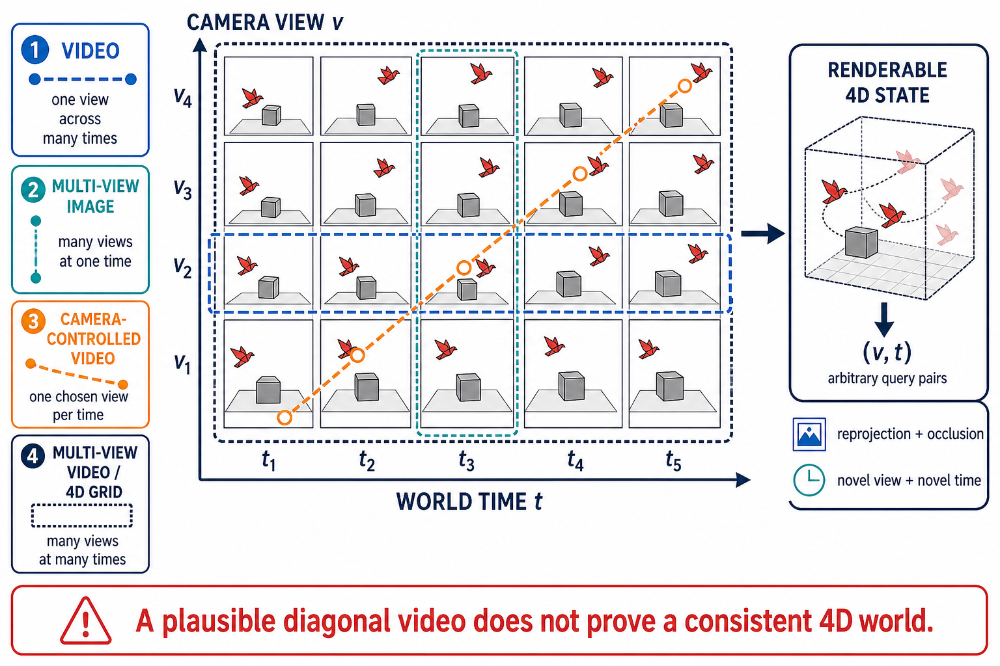

# 多视角与 4D 视频生成：相机 × 时间、可渲染状态与几何证据

> 一手来源复核截至 **2026-08-30**。本章把动态场景重建、多视角视频生成、相机控制视频与 4D 场景生成放进同一坐标系，但不把它们误写成同一个任务。检索、纳排、状态核验和图像验收记录见[研究日志](../../sources/research_20260830_multiview_4d_generation.md)。

## 学习目标

读完本章，应当能够：

1. 用“相机视角 $v$ × 世界时间 $t$”区分普通视频、多视角图像、相机控制视频、多视角视频和可渲染 4D 状态；
2. 判断一个系统是在**重建观测到的动态场景**、**生成未观测视角/时间**，还是只让一条 2D 视频轨迹看起来连贯；
3. 解释 canonical deformation、spacetime field、4D Gaussian、multi-view video diffusion 与几何桥接分别解决哪一层问题；
4. 为跨视角、跨时间、遮挡、几何、生成先验和系统成本建立分开的证据账本；
5. 按“首次公开 / 正式发表 / 工件状态”阅读 2021–2026 的里程碑，不把作者演示当成独立复现。

## 1. 最小任务合同：4D 不是“更长的视频”

把动态场景写成可查询函数：

$$
I_{v,t}=\mathcal R(S_t,K_v),
$$

其中 $S_t$ 是世界在时间 $t$ 的状态，$K_v$ 是相机内外参，$\mathcal R$ 是成像或渲染过程。观测集合与目标集合分别是：

$$
\mathcal Q_{\mathrm{obs}}
=\{(I_i,K_i,t_i)\}_{i=1}^{M},
\qquad
\mathcal Q_{\mathrm{tar}}
=\{(K_j,t_j)\}_{j=1}^{N}.
$$

系统可以直接预测目标像素，也可以先构建可渲染状态 $\hat S_t$ 再查询。二者的输出外观可能相似，证据强度却不同。

**图 1：相机轴与时间轴必须拆开。** 图中的纸鸟与立方体只是教学场景，不代表某一模型的结果。行、列、对角线和完整网格同时使用线型与形状编码，灰度下仍可区分。图像生成提示、SHA-256 和视觉检查见[研究日志](../../sources/research_20260830_multiview_4d_generation.md)。

| 合同 | 覆盖的 $(v,t)$ | 最小输出 | 不能自动推出 |
|---|---|---|---|
| 普通视频 | 一个视角或一条未知相机轨迹，多个时间 | 一段 2D 帧序列 | 任意新视角、几何一致、可回访世界 |
| 多视角静态图像 | 多个视角，一个时间 | 同时刻的视图集合 | 动态、时间插值、运动一致性 |
| 相机控制视频 | 每个时间选择一个相机，即一条对角路径 | 沿指定轨迹的视频 | 同一时刻的其他视角彼此一致 |
| 多视角视频 | 多个视角 × 多个时间 | 稠密或稀疏 $V\times T$ 帧网格 | 已存在显式、可编辑、精确一致的 4D 状态 |
| 可渲染 4D 状态 | 任意允许的 $(v,t)$ 查询 | 动态 radiance / surface / Gaussian / point 状态 | 动作因果、物理可交互或长期持久世界 |

### 1.1 三种“4D”主张必须分级

1. **4D-conditioned pixels**：模型接收相机和时间，直接生成像素。
2. **4D-consistent observations**：多个查询之间通过重投影、轨迹、遮挡和时间循环测试。
3. **Renderable 4D state**：系统输出能被独立渲染器重复查询的动态状态。

第三层仍不等于 world model。改变相机只是观察干预；改变环境动作才是状态干预。`novel view`、`action consequence` 和 `editable state` 必须分别验证。

### 1.2 生成与重建的边界

若所有目标区域都曾在校准观测中出现，主要问题是**重建**；若目标视角暴露了从未观测的背面、遮挡后区域或未来状态，就必须依赖先验进行**生成**。建议把输出像素分成三类：

- $\Omega_{\mathrm{seen}}$：有直接观测支持；
- $\Omega_{\mathrm{reprojected}}$：可由几何重投影支持；
- $\Omega_{\mathrm{hallucinated}}$：没有观测证据，只能由生成先验补齐。

平均 PSNR 会把三类混在一起。可靠报告必须单独标出生成区域，否则“新视角质量”可能只是输入视角附近的插值。

## 2. 为什么这个问题特别难

### 2.1 相机运动与物体运动存在分解歧义

对一个像素轨迹，模型可以解释为相机移动、物体移动、深度变化，或几者组合。若相机外参未知，成像约束近似为：

$$
\tilde p_{i,t}
\sim
K_i[R_{i,t}\mid T_{i,t}]X_t.
$$

只看 2D 重建误差，错误的相机和错误的物体运动可能互相抵消。4DiM 通过 metric-scale pose conditioning 明确相机接口；GenXD 则用空间与时间模块分离相机和对象运动 [[8]](#ref-8), [[10]](#ref-10)。

### 2.2 单目视频缺少同时刻视差

相机在 $t_1$ 看左侧、在 $t_2$ 看右侧时，场景本身也已经变化。模型没有同时刻的左右视图，无法直接把视差与运动分开。D-NeRF 与 Nerfies 用 canonical space 加 deformation field 缩小解空间，但拓扑变化、遮挡和快速非刚性运动仍会破坏单一 canonical 对应 [[1]](#ref-1), [[2]](#ref-2)。

### 2.3 未观测区域没有唯一真值

从单面视频生成完整 360° 动态场景是病态问题。背面纹理、遮挡后的动作与物体内部结构可能有多个合理答案。因此：

- 对输入可见区域，可以要求证据保真；
- 对不可见区域，只能要求条件一致、跨视角自洽、分布合理并报告不确定性；
- 不能把某个生成样本与唯一伪真值的相似度解释为完整恢复准确率。

Full-4D 明确把 single-view video-to-4D 写成“先生成多视角视频，再优化 4DGS”，并引入同步多视角数据弥补监督缺口；截至冻结日仍是预印本 [[26]](#ref-26)。

### 2.4 遮挡、显隐和拓扑变化改变表示

canonical deformation 假设某个持久点可被追踪；物体出现、消失、断裂、流体或布料自接触时，该假设会失效。显式 Gaussian 的 opacity/lifespan、分段 anchor 或局部 canonical space 可以缓解，但不能凭渲染清晰就证明拓扑正确。MoRel 用 anchor relay 处理长序列显隐与内存，4DSurf 用分段与 surface-flow 约束处理大形变 [[23]](#ref-23), [[24]](#ref-24)。

### 2.5 生成先验会把错误“修漂亮”

视频 diffusion 能补细节，却可能让同一物体在不同视角拥有不同背面、让遮挡关系翻转，或把相机运动误当对象运动。CAT4D 的关键不是只生成好看的视图，而是把 camera 和 time 作为联合查询，并把生成网格提升为 deformable 3D Gaussian [[13]](#ref-13)。即使如此，提升后的显式状态只保证对该表示优化目标的一致性，不等于真实几何。

## 3. 五条技术路线不是一条升级链

~~~mermaid
flowchart LR
    accTitle: 多视角与4D生成的五条技术路线
    accDescr: 校准观测、单目视频、图像或文字条件分别进入动态场景重建、生成式提升、直接多视角视频扩散、显式四维生成和长时多视角自回归路线，最后都必须经过视角时间几何和系统证据门。

    O["观测 / 条件 同步多相机 · 单目视频 · 图像 · 文字"]
    C["合同 相机 K · 时间 t · 已见/未见区域"]
    R["A 动态重建 canonical + deformation radiance / Gaussian"]
    L["B 生成式提升 video prior → novel views → optimize 4D state"]
    D["C 直接 V×T diffusion joint view-time attention query pixels"]
    G["D 显式 4D 生成 SDS / feed-forward Gaussians / surfaces"]
    S["E 长时多视角 3D bridge · self-forcing streaming reward/control"]
    X["输出 像素网格或可渲染状态"]
    E["证据门 reprojection · occlusion · geometry novel view/time · cost · uncertainty"]

    O --> C
    C --> R
    C --> L
    C --> D
    C --> G
    C --> S
    R --> X
    L --> X
    D --> X
    G --> X
    S --> X
    X --> E
~~~

顺序化文字替代：先冻结相机、时间与已见/未见区域合同，再选择动态重建、生成式提升、直接视角时间扩散、显式 4D 生成或长时多视角路线；所有路线最终都必须通过同一组几何、遮挡、时间、系统成本和不确定性检查。

### 3.1 路线 A：观测驱动的动态场景重建

D-NeRF 把时间映射到 canonical NeRF 的形变，Nerfies 用弹性正则稳定 casual capture [[1]](#ref-1), [[2]](#ref-2)。2024 年的 4D-GS 把表示推进到可实时 rasterize 的 3D Gaussians + 4D neural voxels + deformation head；其 82 FPS 是作者在 RTX 3090、800×800、特定场景复杂度下的渲染结果，不是任意 4D 系统的统一速度 [[5]](#ref-5)。

这一路线的主要证据来自 held-out camera/time 重建。它擅长复现已捕获场景，不自然地等同于“从文字创造新动态世界”。

### 3.2 路线 B：用生成先验补齐稀疏观测，再提升为 4D

典型管线是：

$$
\text{monocular input}
\rightarrow
\text{novel-view / novel-time samples}
\rightarrow
\hat S_{1:T}
\rightarrow
\mathcal R(\hat S_t,K_v).
$$

Consistent4D 从单目视频优化 cascade DyNeRF，并用插值一致性约束时间；CAT4D 则训练 multi-view video diffusion，先补出 $V\times T$ 观测，再优化 deformable 3D Gaussian [[4]](#ref-4), [[13]](#ref-13)。Free4D、DimensionX 与 GenMOJO 分别探索免微调单图场景、空间/时间解耦生成和多物体遮挡分解 [[18]](#ref-18), [[19]](#ref-19), [[16]](#ref-16)。

主要风险是**生成视图自证**：同一个生成模型既补观测又参与评价，可能让错误看起来彼此一致。最终几何门应使用封存的真实相机、真实多视角或独立 tracking/depth 测量。

### 3.3 路线 C：直接学习 camera-time 条件分布

这一路线直接学习：

$$
p_\theta\!\left(
I^{\mathrm{tar}}
\mid
I^{\mathrm{cond}},K^{\mathrm{cond}},t^{\mathrm{cond}},
K^{\mathrm{tar}},t^{\mathrm{tar}}
\right).
$$

4DiM 混合使用带 pose 的 3D 数据、带 pose+time 的 4D 数据和无 pose 视频；GenXD 以 masked latent conditions 支持可变数量条件视图；SV4D 与 SV4D 2.0 在 view attention 和 frame attention 之间建立联合生成 [[8]](#ref-8)–[[10]](#ref-10), [[17]](#ref-17)。4Real-Video 把目标进一步推进到 generalizable photorealistic 4D video diffusion，而不是每个场景都从头优化 [[14]](#ref-14)。

直接像素生成不要求显式场景状态，速度和泛化可能更好；但若每次查询独立采样，跨查询的一致性不是结构保证。应测试同一 $(v,t)$ 重复查询、闭合相机环和不同 query batching 顺序。

### 3.4 路线 D：从文字或图像直接生成显式 4D 资产

MAV3D 首次把 text-to-video diffusion 的 score distillation 用于 dynamic NeRF，输出可从任意相机渲染的动态 3D 场景 [[3]](#ref-3)。Align Your Gaussians 改用 dynamic 3D Gaussians 与组合 diffusion priors，4Real 用视频模型生成参考、freeze-time 视频和形变，增强场景级照片真实感 [[6]](#ref-6), [[7]](#ref-7)。EG4D 尝试绕开昂贵 SDS，4K4DGen 则把全景 4D 推到作者报告的 4K 360° 渲染合同 [[11]](#ref-11), [[12]](#ref-12)。

这里最常见的误读是把 **renderable** 当成 **reconstructed**。文字生成的 4D 资产没有真实场景真值；其证据应是多视角一致、时间一致、语义、多样性、可编辑性与独立渲染稳定性，而不是“恢复精度”。

### 3.5 路线 E：长时、多视角、流式与在线控制

2026 年的前沿开始同时处理两个扩展轴：

- **视角数扩展**：MV-Forcing 用完成的源视图经过自回归 3D reconstruction bridge，渲染下一目标视角的几何先验，再由 few-step diffusion 精化 [[27]](#ref-27)；
- **时间扩展**：其 spatio-temporal self-forcing 同时面对跨时间和跨视图 exposure bias；
- **4D 奖励**：Stream4D 指出静态 3D reconstruction critic 会奖励冻结运动，因而改用 feed-forward 4D reconstruction reward、motion prior 与 perceptual anchor [[28]](#ref-28)；
- **在线几何控制**：4DStreamCtrl 把相机、对象轨迹与深度统一为 3D point tracks，再蒸馏成四步因果 student [[29]](#ref-29)。

这些截至冻结日均是预印本。作者报告的任意长度、20 FPS 或固定显存不等于独立确认；仍需区分 TTFF、steady-state latency、解码、负载、外部状态和 deadline miss。

驾驶场景把同一组机制放进更严格的 metric geometry 与多相机合同。DriveDreamer4D 用视频 world-model prior 扩充 4D driving representation，DiST-4D 则显式分离空间与时间 diffusion 并加入 metric depth [[15]](#ref-15), [[20]](#ref-20)。它们的域内几何与合成数据价值不能直接外推到开放场景，也不能只凭下游 perception 增益证明每个生成视图都几何正确。

## 4. 表示层：像素一致与状态一致的差别

### 4.1 Canonical state + deformation

令 canonical 状态为 $S_c$，形变为 $D_t$：

$$
X_t=D_t(X_c),
\qquad
I_{v,t}=\mathcal R(D_t(S_c),K_v).
$$

优点是身份与几何可跨时间复用；缺点是 topology change、显隐和大形变会使一一对应失效。分段 canonical、lifespan/opacity 和 residual birth/death 变量是在放松同一假设，不应被隐藏在“4DGS”总称里。

### 4.2 直接 spacetime representation

也可以直接表示 $F(x,y,z,t)$，或让 Gaussian 参数随时间变化：

$$
g_i(t)=
\{\mu_i(t),\Sigma_i(t),\alpha_i(t),c_i(t)\}.
$$

这允许时间依赖的空间、形状、透明度与外观。4D-GS 使用 4D neural voxels 生成 Gaussian deformation；4C4D 在极稀疏四相机条件下针对 geometry/appearance 梯度失衡设计 opacity decay [[5]](#ref-5), [[21]](#ref-21)。表示可微、可渲染，不意味着表面是 watertight，也不意味着同一 Gaussian 对应真实物质点。

### 4.3 Pixel grid + implicit memory

多视角视频 diffusion 可以只保存 latent/KV/state，而不输出 mesh/field/Gaussian。它仍可能在固定 query 分布上很一致。必须如实称为**多视角时序生成器**；只有当状态能被稳定、可重复地查询或导出，才升级为 renderable-state claim。

### 4.4 3D bridge 不是完整 4D state

MV-Forcing 的 reconstruction bridge 在视图之间传递几何先验。桥可以降低跨视图漂移，却可能随时间重建不同的 3D 状态，并不自动形成全局可编辑 4D 资产。应分别报告 bridge 的深度/pose 误差和最终视频的跨视图误差。

## 5. 数据：采样单元是 camera-time graph

### 5.1 最小 manifest

每个样本至少记录：

| 字段 | 必须说明 |
|---|---|
| Scene identity | 场景/对象是否跨 split 泄漏 |
| Camera | 内参、外参、坐标约定、单位、畸变、pose 置信度 |
| Time | 时间戳、同步误差、帧率、rolling shutter |
| Coverage | 相机基线、视角范围、时间长度、遮挡比例 |
| Dynamics | 相机/对象运动强度、刚性/非刚性、显隐与拓扑变化 |
| Provenance | 真实/合成/模型生成、许可证、人物同意与可追溯性 |

### 5.2 四种数据源不能无标签混合

1. **同步多相机动态捕获**：几何证据强，但昂贵且域窄；
2. **带移动相机的单目视频**：规模大，但 pose、深度与相机/物体分解噪声高；
3. **静态多视角图像**：提供空间监督，没有动态对应；
4. **普通视频或合成 4D**：提供时间监督，可能没有真实相机或存在 simulator gap。

CAT4D 与 4DiM 都显式混合这些数据类型；GenXD 还通过 CamVid-30K 的相机/运动挖掘扩展真实视频监督 [[8]](#ref-8), [[10]](#ref-10), [[13]](#ref-13)。混合训练必须保留 source type mask，否则模型可能用静态数据学相机、用视频学运动，却在真正同时变化时失败。

### 5.3 Split 必须按场景、主体与捕获源隔离

相邻帧或同一对象的不同相机不能跨 train/test。生成模型还应检查底座预训练集泄漏；若无法审计，就把结果标成 open-world generalization，而不是严格 unseen-scene 测试。

## 6. 评测：从一条漂亮视频升级到 4D 证据

~~~mermaid
flowchart TD
    accTitle: 多视角4D生成的六道独立证据门
    accDescr: 固定场景与查询网格后依次检查输入证据保真、跨视角重投影、跨时间轨迹和显隐、几何或表面、未见区域生成，以及渲染和构建成本；任一硬门失败都不能用其他平均分抵消。

    A["冻结测试单元 scene · cameras · times · seen/unseen mask"] --> B["G1 输入证据保真 seen-region residual"]
    B --> C["G2 跨视角 reprojection · epipolar · loop closure"]
    C --> D["G3 跨时间 3D tracks · motion · occlusion order"]
    D --> E["G4 状态/几何 depth · surface · pose · topology"]
    E --> F["G5 生成区域 semantic · diversity · uncertainty"]
    F --> G["G6 系统 build time · render FPS · memory · asset size"]
    G --> H{"全部硬门通过？"}
    H -- "否" --> I["降级主张并定位失败 不得用总分掩盖"]
    H -- "是" --> J["报告适用域、置信区间 与未覆盖查询"]
~~~

顺序化文字替代：固定场景、相机、时间和已见/未见 mask 后，依次检查观测保真、跨视角、跨时间、几何、生成区域与系统代价；任一硬门失败就降低能力主张，不能用其他分数平均掉。

### 6.1 六类指标分别测什么

| 证据轴 | 推荐测量 | 常见误读 |
|---|---|---|
| 观测保真 | seen-mask PSNR/SSIM/LPIPS、颜色/曝光校准 | 高 PSNR 不证明未见视角正确 |
| 跨视角 | 重投影误差、epipolar residual、cycle/loop closure、同刻 identity | 单视图美学分不能代替几何 |
| 跨时间 | 2D/3D track、scene flow、速度/加速度、遮挡显隐顺序 | 低 optical-flow error 可能奖励静止 |
| 几何/状态 | depth、pose、Chamfer、surface normal、lifespan/topology | Gaussian render 清晰不等于表面准确 |
| 生成区域 | 语义、人评、diversity、seed stability、uncertainty | 不可见背面没有唯一 ground truth |
| 系统 | 构建/优化时长、每 query 延迟、FPS、VRAM、资产大小 | 渲染实时不等于场景构建实时 |

FV4D、FVD 或论文自定义 learned metric 可以做诊断，但必须给出 extractor、版本、输入采样和与人类 Gold Set 的校准。SV4D 2.0 报告的相对 FV4D/LPIPS 改善属于其协议，不是跨数据集通用常数 [[17]](#ref-17)。

### 6.2 必须覆盖的 query slices

- **in-view / in-time**：相机与时间都在训练覆盖内；
- **novel-view / seen-time**：同一时刻换相机；
- **seen-view / novel-time**：固定相机做时间插值或外推；
- **novel-view / novel-time**：两个轴同时外推；
- **return loop**：离开已见区域后回到旧视点；
- **counter-camera**：固定对象动态，只反转相机路径；
- **freeze-time**：固定世界时间，只移动相机；
- **freeze-camera**：固定相机，只推进世界时间。

若只测对角 camera-time path，就无法定位错误来自相机、对象运动还是二者耦合。

### 6.3 速度必须拆成构建与查询

$$
T_{\mathrm{end\mbox{-}to\mbox{-}end}}
=T_{\mathrm{pose}}
+T_{\mathrm{generation}}
+T_{\mathrm{reconstruction}}
+T_{\mathrm{render/query}}.
$$

4D-GS 的实时结果是训练后渲染；4DStreamCtrl 的 20 FPS 是作者协议下的流式视频生成；二者不是同一 SLO [[5]](#ref-5), [[29]](#ref-29)。报告应同时给出首次可见结果、scene build time、单查询/批查询延迟、分辨率、硬件、包含/排除的解码步骤和长尾。

## 7. 重点论文：问题、机制、证据与边界

### 7.1 D-NeRF / Nerfies：动态场景先被写成可查询坐标场

- **问题**：静态 NeRF 无法让同一空间坐标随时间变化。
- **机制**：D-NeRF 从时间条件映射到 canonical deformation；Nerfies 增加 coarse-to-fine 与 elastic regularization，面向手机 casual capture [[1]](#ref-1), [[2]](#ref-2)。
- **证据**：held-out view/time 渲染。
- **边界**：per-scene optimization、pose 依赖、canonical correspondence 与 topology 限制；它们是动态重建祖先，不是现代文本视频生成器。

### 7.2 MAV3D：生成先验第一次直接优化 text-to-4D

- **问题**：没有大规模 text–4D 配对数据。
- **机制**：用 text-to-video diffusion 的 score distillation 优化 dynamic NeRF [[3]](#ref-3)。
- **里程碑**：任务输入从捕获视频变为文字，输出仍是任意视角可渲染状态。
- **边界**：SDS 优化慢、模式与视角偏置继承教师，作者内部基线不构成开放 checkpoint 复现。

### 7.3 4D-GS / Align Your Gaussians：显式 splat 改变渲染与优化预算

- **4D-GS**：3D Gaussians + 4D neural voxels + lightweight deformation，强调高分辨率实时渲染 [[5]](#ref-5)。
- **AYG**：把 dynamic 3D Gaussian 作为 text-to-4D 表示，并组合图像/视频 diffusion priors [[6]](#ref-6)。
- **关键变化**：表示从隐式 ray marching 转向可快速 rasterize 的显式 primitives。
- **边界**：高 FPS 是 renderer 性能；训练、densification、内存与 topology 仍需独立报告。

### 7.4 4DiM / SV4D / GenXD：空间和时间进入同一个生成器

- **4DiM**：混合 3D、4D 与普通视频数据，在 metric-scale camera pose 和 timestamp 条件下做 novel-view synthesis [[8]](#ref-8)。
- **SV4D**：从单目视频生成多帧多视角网格，再优化 4D 表示 [[9]](#ref-9)。
- **GenXD**：以 multiview-temporal modules 分离相机和对象运动，并接受可变数量条件图 [[10]](#ref-10)。
- **边界**：固定生成窗口、数据稀缺与 query batching 一致性；能生成相机路径不等于能同时生成多视角网格。

### 7.5 CAT4D：先补 camera-time grid，再构建动态状态

- **问题**：单目视频无法为同一时刻提供多视角监督。
- **机制**：multi-view video diffusion 接受任意数量条件图、相机与时间，采样近一致的多视角视频，再优化 deformable 3D Gaussian [[13]](#ref-13)。
- **证据**：novel-view、dynamic reconstruction 与生成演示；论文明确区分自身与普通 camera-controlled video。
- **边界**：基础模型原生窗口有限，额外采样与 per-scene optimization 有成本；生成网格中的共同偏差可能被 4D 优化固化。

### 7.6 4Real-Video / SV4D 2.0：从每场景优化走向可泛化生成

4Real-Video 学习 generalizable photo-realistic 4D video diffusion；SV4D 2.0 改进 view/frame attention、数据、渐进 3D→4D 训练和两阶段 refinement，以应对大运动与遮挡 [[14]](#ref-14), [[17]](#ref-17)。这条路线把成本从测试时优化转移到大规模训练，但没有消除相机标定、数据覆盖与几何验证。

### 7.7 2026：稀疏捕获、前馈状态、长时与流式开始汇合

- **4C4D**：四台便携相机的极稀疏 4DGS，强调几何学习比外观更难 [[21]](#ref-21)；
- **DGGT**：把 pose 从输入改为输出，从无 pose 稀疏图像前馈预测 per-frame Gaussian maps 与相机 [[22]](#ref-22)；
- **MoRel / 4DSurf**：分别处理长时 anchor relay 和大形变表面一致 [[23]](#ref-23), [[24]](#ref-24)；
- **SpaceTimePilot**：用生成式 renderer 在空间与时间查询之间补充动态场景 [[25]](#ref-25)；
- **MV-Forcing / Stream4D / 4DStreamCtrl**：分别把多视角、4D reward 和在线 3D point-track control 接到流式视频路线 [[27]](#ref-27)–[[29]](#ref-29)。

这里的共同变化不是“所有系统都成了 world model”，而是 camera-time consistency 开始进入训练、推理状态和系统合同。

## 8. 里程碑：按合同变化收录

| 首次公开 / 正式发表 | 工作 | 改变了什么 | 当时仍未解决 |
|---|---|---|---|
| 2020 / CVPR 2021 | D-NeRF [[1]](#ref-1) | canonical dynamic radiance field 可按 view/time 查询 | 单场景优化、pose 与拓扑 |
| 2020 / ICCV 2021 | Nerfies [[2]](#ref-2) | casual monocular capture + elastic deformation | 大形变、遮挡、泛化 |
| 2023 / ICML 2023 | MAV3D [[3]](#ref-3) | text-to-video prior → text-to-4D state | SDS 成本与教师偏置 |
| 2023 / ICLR 2024 | Consistent4D [[4]](#ref-4) | 单目 video-to-4D + 插值一致性 | 物体中心、离散监督 |
| 2023 / CVPR 2024 | 4D-GS [[5]](#ref-5) | 高效显式 dynamic Gaussian representation | 构建成本、表面与拓扑 |
| 2024 / NeurIPS 2024 | 4Real [[7]](#ref-7) | 真实视频 prior 推动 scene-level text-to-4D | per-scene pipeline 与一致性 |
| 2024 / ICLR 2025 | 4DiM [[8]](#ref-8) | metric camera × time 条件的通用 NVS | 输出网格/状态与长期扩展 |
| 2024 / ICLR 2025 | SV4D [[9]](#ref-9) | 单目视频 → multi-frame multi-view diffusion | 大运动、遮挡、真实域 |
| 2024 / ICLR 2025 | GenXD [[10]](#ref-10) | 联合 3D/4D 数据与相机/物体运动解耦 | pose 噪声与泛化边界 |
| 2024 / CVPR 2025 | CAT4D [[13]](#ref-13) | 任意 camera-time query → grid → 4DGS | 原生窗口与优化成本 |
| 2024 / CVPR 2025 | 4Real-Video [[14]](#ref-14) | 可泛化 photorealistic 4D video diffusion | 几何与数据可审计性 |
| 2025 / ICCV 2025 | SV4D 2.0 [[17]](#ref-17) | 大运动/遮挡、渐进 3D→4D 训练 | 固定窗口与未见区域不确定性 |
| 2025 / CVPR 2026 | DGGT [[22]](#ref-22) | pose-free feed-forward 4D driving reconstruction | 域外动态与通用场景 |
| 2025 / CVPR 2026 | MoRel [[23]](#ref-23) | 长时 4DGS 的 anchor relay 与有界内存 | 构建/部署统一证据 |
| 2026-05 / 预印本 | Full-4D [[26]](#ref-26) | full-scope 单目视频 → dense $T\times V$ → 4DGS | 工件与独立复现 |
| 2026-07 / 预印本 | MV-Forcing [[27]](#ref-27) | 长时、多视角与双重 exposure bias 联合处理 | 正式 proceedings / 开放运行证据 |
| 2026-08 / 预印本 | Stream4D [[28]](#ref-28) | 动态 4D reward 替代会冻结运动的静态 3D critic | reward 可靠性与跨底座复现 |
| 2026-08 / 预印本 | 4DStreamCtrl [[29]](#ref-29) | 在线相机+对象+深度 3D point-track control | 代码、SLO 与 closed-loop 独立验证 |

里程碑表不收录纯产品演示，也不把“作者说已接收”替代官方 proceedings。预印本如果后来正式发表，应保留首次公开日期并另填正式状态。

## 9. 相邻方向：必须交叉链接，也必须守边界

| 相邻方向 | 共享部分 | 4D 专属追加门 |
|---|---|---|
| [细粒度可控生成](controllable-video-generation.md) | 相机、轨迹、深度条件 | 同刻跨视角、重投影、loop closure、状态导出 |
| [图生视频](image-to-video.md) | 单图锚定、运动生成 | 未见背面、camera-time grid、几何不确定性 |
| [视频到视频](video-to-video.md) | 源视频保持、3D/4D-aware 编辑 | 编辑后所有视角/时间的一致性与状态局部性 |
| [因果与流式](../generative-models/causal-streaming-generation.md) | chunk commit、长期状态、延迟 | 跨视图 commit、4D reward 与 bridge 漂移 |
| [交互世界](interactive-world-generation.md) | 可持续场景、相机观察 | 动作因果、状态转移、deadline 与闭环效用 |
| [物理一致性](../physical-consistency.md) | 轨迹、接触、遮挡 | 几何一致不等于物理正确，需干预和守恒证据 |

GEN3C 使用增量 3D cache 支持精确相机控制，WorldForge 在不训练底座的情况下把视频模型用于 3D/4D 生成，BulletTime 显式解耦 world time 与 camera pose [[30]](#ref-30), [[31]](#ref-31), [[32]](#ref-32)。它们是这张边界表的关键接口，但“相机遵循准确”仍低于“完整 4D 状态正确”。

## 10. GridFork-1：一套可证伪的最小复现实验

> **状态：仅提出，尚未运行。** 本节不是实验结果。

### 10.1 冻结项

- 一个公开 checkpoint；
- 同一组 12 个场景，每场景至少 4 个同步相机与 32 个时间点；
- 统一分辨率、seed、采样步数和输出 query 数；
- 同一 pose/time convention 与 scene-held-out split；
- 独立 depth/track/pose extractor，不使用训练 reward 的同一模型做终评。

### 10.2 只改变的因素

比较四种 query 方案：

1. 每个目标视图独立生成；
2. 同一时间的多视角 joint denoising；
3. 完整 $V\times T$ joint/blocked denoising；
4. 先生成网格，再优化显式 4D state。

### 10.3 四个一票否决测试

1. **闭环相机测试**：相机离开后回到同一 $(v,t)$，身份/几何不能不可逆漂移；
2. **轴交换测试**：freeze-time 与 freeze-camera 不得互相串扰；
3. **遮挡测试**：对象出画再重现时，深度顺序与身份必须保持；
4. **未见区域标注**：所有指标按 seen / reprojected / hallucinated 三个 mask 分开。

### 10.4 必须交付

- camera-time manifest 与坐标变换脚本；
- 原始/生成视图、4D state 和 renderer 版本；
- 每场景重投影、track、depth、LPIPS、几何和人评明细；
- build time、query latency、VRAM、资产大小与失败日志；
- 95% bootstrap confidence interval 和场景级散点，而非只报均值。

若方案 4 只提高训练视图 PSNR，却降低 novel-view/novel-time 或 loop closure，就不能报告“显式状态使 4D 更一致”。

## 11. 常见误区与快速纠正

1. **把相机控制当 4D。** 一条相机路径只采样对角线；至少补 freeze-time 多视角与 loop closure。
2. **把多视角视频当显式状态。** 先问输出能否被独立 renderer 任意查询、重复查询是否稳定。
3. **把渲染实时当构建实时。** 分开 scene build、首次结果、query FPS 和全链路延迟。
4. **把静态 3D critic 用于动态视频。** 它可能通过冻结运动取得高分；需动态 4D 与 motion 测量 [[28]](#ref-28)。
5. **用单一 LPIPS/FVD 证明几何。** 必须加入重投影、epipolar、深度、轨迹和闭环相机测试。
6. **把不可见背面当唯一重建真值。** 标记 hallucinated region，并报告 seed 多样性和不确定性。
7. **把 Gaussian 当物理粒子或表面。** 它首先是渲染 primitive；material correspondence 与 watertight surface 需另证。
8. **把 novel view 当 action consequence。** 相机变化是观察；环境动作必须改变状态并进入闭环。
9. **混用 camera time、world time 与 diffusion time。** 三者单位、调度和干预位置必须独立记录。
10. **把 2026 预印本速度写成已复现事实。** 标作者协议、硬件、包含项、工件状态与冻结日期。

## 12. 仍值得研究的问题

1. 怎样在 topology change 下保留可追踪身份，而不强迫全局 canonical correspondence？
2. 怎样让生成模型对未见表面输出校准分布，而不是单一高置信纹理？
3. 怎样把 view-time joint attention 扩展到无界 $V\times T$，同时保持查询顺序不变性？
4. 怎样把动态 Gaussian、surface、scene graph 与可执行 world state 连接，而不把渲染状态误当因果状态？
5. 怎样构造既覆盖真实复杂动态、又有同步相机/几何真值和许可的 4D 数据？
6. 怎样建立不会奖励静止、抖动或复制输入视图的独立 4D evaluator？
7. 怎样把构建、更新、压缩、传输与渲染纳入同一端到端 SLO？
8. 怎样在多主体、透明/反射、流体和大范围显隐中维持空间—时间一致？

## 13. 最小阅读顺序

1. **先学动态表示**：D-NeRF → Nerfies → 4D-GS。
2. **再学生成先验提升**：MAV3D → Consistent4D → 4Real。
3. **理解 camera-time 生成器**：4DiM → SV4D → GenXD → CAT4D。
4. **看可泛化与复杂场景**：4Real-Video → GenMOJO → SV4D 2.0。
5. **最后读 2026 前沿**：4C4D / DGGT / MoRel → Full-4D → MV-Forcing → Stream4D → 4DStreamCtrl。

每读一篇只回答五个问题：输入观测是什么、输出是像素还是状态、相机与时间怎样进入、未见区域由谁生成、哪项独立测量可以证伪主张。

## 参考文献

[1] Albert Pumarola et al. [D-NeRF: Neural Radiance Fields for Dynamic Scenes](https://openaccess.thecvf.com/content/CVPR2021/html/Pumarola_D-NeRF_Neural_Radiance_Fields_for_Dynamic_Scenes_CVPR_2021_paper.html). CVPR, 2021.

[2] Keunhong Park et al. [Nerfies: Deformable Neural Radiance Fields](https://openaccess.thecvf.com/content/ICCV2021/html/Park_Nerfies_Deformable_Neural_Radiance_Fields_ICCV_2021_paper.html). ICCV, 2021.

[3] Uriel Singer et al. [Text-To-4D Dynamic Scene Generation](https://proceedings.mlr.press/v202/singer23a.html). ICML, 2023.

[4] Yanqin Jiang et al. [Consistent4D: Consistent 360° Dynamic Object Generation from Monocular Video](https://openreview.net/forum?id=sPUrdFGepF). ICLR, 2024.

[5] Guanjun Wu et al. [4D Gaussian Splatting for Real-Time Dynamic Scene Rendering](https://openaccess.thecvf.com/content/CVPR2024/html/Wu_4D_Gaussian_Splatting_for_Real-Time_Dynamic_Scene_Rendering_CVPR_2024_paper.html). CVPR, 2024.

[6] Huan Ling et al. [Align Your Gaussians: Text-to-4D with Dynamic 3D Gaussians and Composed Diffusion Models](https://openaccess.thecvf.com/content/CVPR2024/html/Ling_Align_Your_Gaussians_Text-to-4D_with_Dynamic_3D_Gaussians_and_Composed_CVPR_2024_paper.html). CVPR, 2024.

[7] Heng Yu et al. [4Real: Towards Photorealistic 4D Scene Generation via Video Diffusion Models](https://proceedings.neurips.cc/paper_files/paper/2024/hash/50358459632f7fc1c7e9f9f0ad0cc026-Abstract-Conference.html). NeurIPS, 2024.

[8] Daniel Watson et al. [Controlling Space and Time with Diffusion Models](https://openreview.net/forum?id=d2UrCGtntF). ICLR, 2025.

[9] Yiming Xie et al. [SV4D: Dynamic 3D Content Generation with Multi-Frame and Multi-View Consistency](https://proceedings.iclr.cc/paper_files/paper/2025/hash/5297e56ac65ba2bfa70ee9fc4818c042-Abstract-Conference.html). ICLR, 2025.

[10] Yuyang Zhao et al. [GenXD: Generating Any 3D and 4D Scenes](https://proceedings.iclr.cc/paper_files/paper/2025/hash/ee2841db84cd09a5f6e3e313ce3d79d9-Abstract-Conference.html). ICLR, 2025.

[11] Qi Sun et al. [EG4D: Explicit Generation of 4D Object without Score Distillation](https://proceedings.iclr.cc/paper_files/paper/2025/hash/4c2eb991688a73864e42270d9246d4cb-Abstract-Conference.html). ICLR, 2025.

[12] Renjie Li et al. [4K4DGen: Panoramic 4D Generation at 4K Resolution](https://proceedings.iclr.cc/paper_files/paper/2025/hash/fa41e9d5dfcc97cd9eed99f001aa28e5-Abstract-Conference.html). ICLR, 2025.

[13] Rundi Wu et al. [CAT4D: Create Anything in 4D with Multi-View Video Diffusion Models](https://openaccess.thecvf.com/content/CVPR2025/html/Wu_CAT4D_Create_Anything_in_4D_with_Multi-View_Video_Diffusion_Models_CVPR_2025_paper.html). CVPR, 2025.

[14] Chaoyang Wang et al. [4Real-Video: Learning Generalizable Photo-Realistic 4D Video Diffusion](https://openaccess.thecvf.com/content/CVPR2025/html/Wang_4Real-Video_Learning_Generalizable_Photo-Realistic_4D_Video_Diffusion_CVPR_2025_paper.html). CVPR, 2025.

[15] Guosheng Zhao et al. [DriveDreamer4D: World Models Are Effective Data Machines for 4D Driving Scene Representation](https://openaccess.thecvf.com/content/CVPR2025/html/Zhao_DriveDreamer4D_World_Models_Are_Effective_Data_Machines_for_4D_Driving_CVPR_2025_paper.html). CVPR, 2025.

[16] Wen-Hsuan Chu et al. [Robust Multi-Object 4D Generation for In-the-wild Videos](https://openaccess.thecvf.com/content/CVPR2025/html/Chu_Robust_Multi-Object_4D_Generation_for_In-the-wild_Videos_CVPR_2025_paper.html). CVPR, 2025.

[17] Chun-Han Yao et al. [SV4D 2.0: Enhancing Spatio-Temporal Consistency in Multi-View Video Diffusion for High-Quality 4D Generation](https://openaccess.thecvf.com/content/ICCV2025/html/Yao_SV4D_2.0_Enhancing_Spatio-Temporal_Consistency_in_Multi-View_Video_Diffusion_for_ICCV_2025_paper.html). ICCV, 2025.

[18] Tianqi Liu et al. [Free4D: Tuning-free 4D Scene Generation with Spatial-Temporal Consistency](https://openaccess.thecvf.com/content/ICCV2025/html/Liu_Free4D_Tuning-free_4D_Scene_Generation_with_Spatial-Temporal_Consistency_ICCV_2025_paper.html). ICCV, 2025.

[19] Wenqiang Sun et al. [DimensionX: Create Any 3D and 4D Scenes from a Single Image with Decoupled Video Diffusion](https://openaccess.thecvf.com/content/ICCV2025/html/Sun_DimensionX_Create_Any_3D_and_4D_Scenes_from_a_Single_ICCV_2025_paper.html). ICCV, 2025.

[20] Jiazhe Guo et al. [DiST-4D: Disentangled Spatiotemporal Diffusion with Metric Depth for 4D Driving Scene Generation](https://openaccess.thecvf.com/content/ICCV2025/html/Guo_DiST-4D_Disentangled_Spatiotemporal_Diffusion_with_Metric_Depth_for_4D_Driving_ICCV_2025_paper.html). ICCV, 2025.

[21] Junsheng Zhou et al. [4C4D: 4 Camera 4D Gaussian Splatting](https://openaccess.thecvf.com/content/CVPR2026/html/Zhou_4C4D_4_Camera_4D_Gaussian_Splatting_CVPR_2026_paper.html). CVPR, 2026.

[22] Xiaoxue Chen et al. [DGGT: Feedforward 4D Reconstruction of Dynamic Driving Scenes using Unposed Images](https://openaccess.thecvf.com/content/CVPR2026/html/Chen_DGGT_Feedforward_4D_Reconstruction_of_Dynamic_Driving_Scenes_using_Unposed_CVPR_2026_paper.html). CVPR, 2026.

[23] Sangwoon Kwak et al. [MoRel: Long-Range Flicker-Free 4D Motion Modeling via Anchor Relay-based Bidirectional Blending with Hierarchical Densification](https://openaccess.thecvf.com/content/CVPR2026/html/Kwak_MoRel_Long-Range_Flicker-Free_4D_Motion_Modeling_via_Anchor_Relay-based_Bidirectioanl_CVPR_2026_paper.html). CVPR, 2026.

[24] Renjie Wu et al. [4DSurf: High-Fidelity Dynamic Scene Surface Reconstruction](https://openaccess.thecvf.com/content/CVPR2026/html/Wu_4DSurf_High-Fidelity_Dynamic_Scene_Surface_Reconstruction_CVPR_2026_paper.html). CVPR, 2026.

[25] Zhening Huang et al. [SpaceTimePilot: Generative Rendering of Dynamic Scenes Across Space and Time](https://openaccess.thecvf.com/content/CVPR2026/html/Huang_SpaceTimePilot_Generative_Rendering_of_Dynamic_Scenes_Across_Space_and_Time_CVPR_2026_paper.html). CVPR, 2026.

[26] Tingxi Chen et al. [Full-4D: Generating Full-Scope 4D Scenes from a Single-View Video](https://arxiv.org/abs/2605.25500). arXiv preprint, 2026-05-25.

[27] Gal Fiebelman et al. [MV-Forcing: Long Multi-View Video Generation via 4D-Grounded Spatio-Temporal Self-Forcing](https://arxiv.org/abs/2607.05376). arXiv preprint, 2026-07-06.

[28] Yuanhao Ban et al. [Stream4D: 4D-Consistency for Streaming Autoregressive Diffusion Video Models](https://arxiv.org/abs/2608.19556). arXiv preprint, 2026-08-20.

[29] Shiqian Li et al. [4DStreamCtrl: Interactive Video Generation with Online 4D Control](https://arxiv.org/abs/2608.25479). arXiv preprint, 2026-08-26.

[30] Xuanchi Ren et al. [GEN3C: 3D-Informed World-Consistent Video Generation with Precise Camera Control](https://openaccess.thecvf.com/content/CVPR2025/html/Ren_GEN3C_3D-Informed_World-Consistent_Video_Generation_with_Precise_Camera_Control_CVPR_2025_paper.html). CVPR, 2025.

[31] Chenxi Song et al. [Taming Video Models for 3D and 4D Generation via Zero-Shot Camera Control](https://openaccess.thecvf.com/content/CVPR2026/html/Song_Taming_Video_Models_for_3D_and_4D_Generation_via_Zero-Shot_CVPR_2026_paper.html). CVPR, 2026.

[32] Yiming Wang et al. [BulletTime: Decoupled Control of Time and Camera Pose for Video Generation](https://openaccess.thecvf.com/content/CVPR2026/html/Wang_BulletTime_Decoupled_Control_of_Time_and_Camera_Pose_for_Video_CVPR_2026_paper.html). CVPR, 2026.
