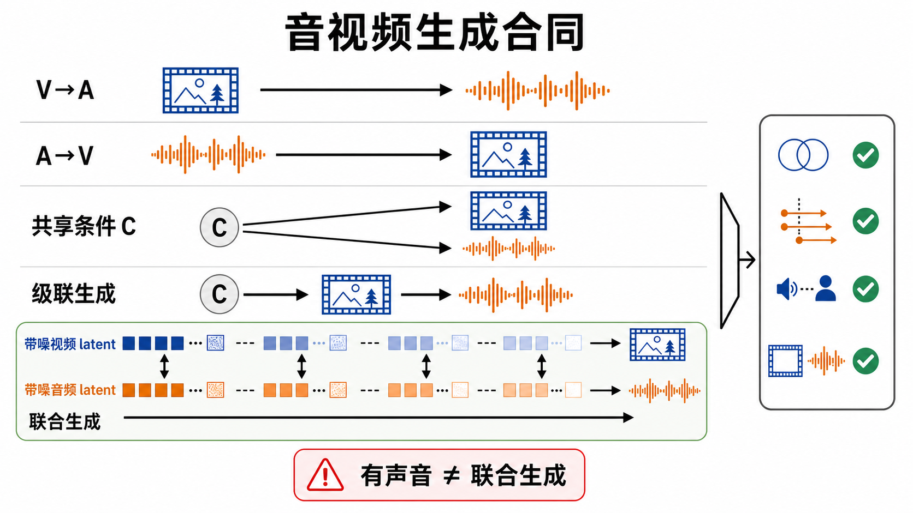
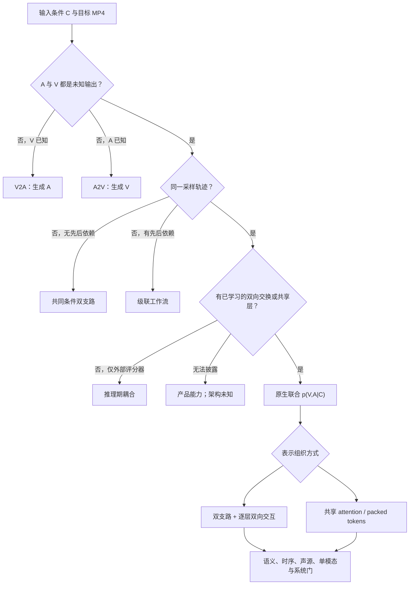

# 原生音视频联合生成：从“有声视频”到同轨迹协同去噪

> 本章冻结于 **2026-08-30（Asia/Shanghai）**。这里把“原生联合”限定为：音频与视频都是待生成变量，并在同一生成轨迹中通过已学习的共享表示或双向信息交换共同演化。产品能输出声音、训练时用了多模态数据、共用一套 token，均不能单独证明这一点。

检索式、纳排规则、逐项证据等级、发布面核验与图片审计见[配套研究记录](../../sources/research_20260830_native_audio_video.md)。

## 学习目标

读完本章，应能完成六件事：

1. 严格区分 V2A、A2V、共同条件双支路、级联产品工作流、推理期耦合与原生联合模型；
2. 写出视频、波形、codec latent、真实时间坐标和 mux 的完整输入输出合同；
3. 比较双塔交互、joint DiT/MMDiT、单流 packed tokens、对齐 latent、流式记忆与推理时搜索；
4. 解释训练目标、同步机制、数据标注和 codec 瓶颈如何共同决定成败；
5. 用互不抵消的评测门检查画面、声音、语义、事件时序、声源绑定与系统延迟；
6. 按冻结版本复现开放模型，并用跨模态干预证伪“原生联合”主张。

## 1. 先判因子化：有声音不等于联合生成

设文本、首帧、参考音色等外部条件统称为 $C$，视频为 $V$，音频为 $A$。同一个 MP4 可以来自完全不同的生成合同。

| 类别 | 概率/执行合同 | 哪个变量在生成 | 典型证据 | 不能声称什么 |
|---|---|---|---|---|
| Video-to-Audio（V2A） | $p_\theta(A\mid V,C)$ | 只生成音频；视频已知且固定 | MMAudio、Movie Gen Audio | 视频会响应新生成的声音 |
| Audio-to-Video（A2V） | $p_\theta(V\mid A,C)$ | 只生成视频；音频已知且固定 | TPoS | 同时生成音频与视频 |
| 共同条件双支路 | $p_{\theta_v}(V\mid C)p_{\theta_a}(A\mid C)$ | 两者都生成，但支路无交换 | 同一 prompt、两次独立采样 | 学到了 $A\leftrightarrow V$ 对应 |
| 级联工作流 | $p_{\theta_v}(V\mid C)p_{\theta_a}(A\mid V,C)$，或反向 | 两阶段先后生成 | 视频模型 + V2A；Movie Gen 家族 | 是单一联合 checkpoint；视频受采样音频反向约束 |
| 推理期耦合 | 两个冻结生成器在采样时由共同评分器对齐 | 两者生成，参数可未联合训练 | Seeing and Hearing | 已学习原生联合表示 |
| 双支路原生联合 | $p_\theta(V,A\mid C)$，每步双向交换 | 两者在同一轨迹共同去噪 | MM-Diffusion、Ovi、LTX-2 | 双塔天然弱于单流；双塔并不等于级联 |
| 单流/共享空间联合 | packed AV tokens 或先对齐再共享层 | 两者在共享层共同更新 | NAVA、MiniMax H3 的官方披露 | 一定共用同一 VAE 或同一种 latent |
| 产品工作流 | 输入 → 未完全披露的服务链 → MP4 | 取决于内部实现 | Veo、Sora、Seedance 等产品页 | 从输出反推训练目标、backbone 或后处理 |

TPoS 是正式的 A2V 例子：已知音频的语义与幅度引导画面变化，音频本身不由模型生成 [[1]](#ref-1)。MMAudio 的题名含“multimodal joint training”，但其任务仍是给定视频和可选文本生成音频；“joint”修饰训练数据组合，不是联合输出变量 [[6]](#ref-6)。AV-Link 可用一个框架在 A2V 与 V2A 两种方向间切换，但每次仍有一侧是已知条件，也不等于同时采样 $(V,A)$ [[7]](#ref-7)。

Movie Gen 更说明产品族与单模型不能混写：技术报告披露独立的 30B 视频模型与 13B Movie Gen Audio；后者读取已生成视频特征、文本和可选音频上下文，因此是强 V2A/后期制作路径，而非一个 AV 联合 backbone [[5]](#ref-5)。

### 1.1 本章的操作性判据

一个系统只有同时满足下列三项，才在本章记为“原生联合”：

1. **双输出：** $V$ 与 $A$ 都是当前任务中的未知生成变量；
2. **同轨迹：** 两者在同一扩散、流匹配或自回归生成轨迹中推进，而不是先完成一侧再调用另一模型；
3. **可定位交互：** 论文、代码或模型卡能定位共享 attention/FFN、联合 token/latent，或逐层双向 cross-attention，而非只展示同步样片。

该判据不要求音频与视频共用一个 VAE。Ovi 和 LTX-2 都使用模态专用 codec/分支，却在每个生成 block 中双向交换；MiniMax H3 的官方模型卡则披露单流 H3-Omni-Transformer 联合预测音视频 latent，但仍使用独立 VisualVAE 与 AudioVAE [[11]](#ref-11) [[13]](#ref-13) [[26]](#ref-26)。因此“单流”不是联合生成的必要条件，“一个模型文件”也不是充分条件。

## 2. 输入、输出、latent 与真实时间合同

批大小为 $B$，视频帧数为 $F$、帧率为 $f_v$，音频声道数为 $C_a$、采样点数为 $S$、采样率为 $f_a$：

```math
V\in[-1,1]^{B\times F\times3\times H\times W},\qquad
A\in[-1,1]^{B\times C_a\times S}.
```

文本 token、可选图像、参考视频和参考音频分别写为

```math
C_t\in\mathbb N^{B\times L_t},\quad
C_i\in[-1,1]^{B\times N_i\times3\times H_i\times W_i},
```

```math
C_v\in[-1,1]^{B\times F_r\times3\times H_r\times W_r},\quad
C_a^{\mathrm{ref}}\in[-1,1]^{B\times C_r\times S_r}.
```

视频 VAE 与音频 VAE/codec 通常给出不同形状与 token 速率：

```math
z_v=E_v(V)\in\mathbb R^{B\times T_v\times H'\times W'\times D_v},
\qquad
z_a=E_a(A)\in\mathbb R^{B\times T_a\times D_a}.
```

真正的同步坐标必须用秒而不是 token 下标。若视频 VAE 时间压缩率为 $r_v$，音频 codec hop 为 $h_a$，则可写

```math
\tau_v(i)=\delta_v+\frac{i\,r_v}{f_v},\qquad
\tau_a(j)=\delta_a+\frac{j\,h_a}{f_a}.
```

实现还需声明首帧的非均匀覆盖、center/causal window、padding、裁切、重采样、声道布局，以及封装时的 mux 偏移 $\delta_{mux}$。LTX-2 的论文例子使用约 25 Hz、128 维音频 latent，并由 16 kHz stereo mel 表示经 vocoder 输出 24 kHz stereo；NAVA 则复用 LTX-2.3 音频 VAE 与 Wan2.2 视频 VAE；MiniMax H3 官方模型卡披露 32 kHz stereo、每声道 40 Hz 音频 latent 和 $4\times16\times16$ 视觉压缩 [[13]](#ref-13) [[16]](#ref-16) [[26]](#ref-26)。跨论文分数若忽略这些 codec 与采样合同，不能直接解释为 backbone 优劣。

### 2.1 联合流匹配的最小形式

对独立噪声 $\epsilon_v,\epsilon_a$ 与共享连续时间 $t\in[0,1]$，可构造

```math
z_v(t)=(1-t)\epsilon_v+t z_v,
\qquad
z_a(t)=(1-t)\epsilon_a+t z_a.
```

联合 denoiser 同时预测两个速度场，并允许每一侧读取另一侧的当前状态：

```math
(\hat u_v,\hat u_a)=f_\theta(z_v(t),z_a(t),C,t),
```

```math
\mathcal L_{AV}=
\lambda_v\lVert \hat u_v-u_v\rVert_2^2+
\lambda_a\lVert \hat u_a-u_a\rVert_2^2.
```

Ovi 的作者稿即以共享 $t$、独立噪声和加权 AV flow-matching loss 训练双塔；Harmony 则把 clean-audio→video 与 clean-video→audio 两个辅助任务加入联合损失，试图缓解两个高噪 latent 同时学习对应关系时的 correspondence drift [[11]](#ref-11) [[15]](#ref-15)。这些是作者提出并在其协议中验证的机制，不是跨模型已独立确认的普遍定律。

## 3. 一张图判清生成合同



**图 1：输出带声音，不足以证明原生联合。** 黑色单向箭头表示条件方向；`SHARED C` 的两支没有交互；`STAGED` 明确先后顺序；只有 `JOINT` 在多个去噪阶段出现双向交换。右侧图标依次代表语义一致、事件时序、声源绑定和单模态质量，任何一项失败都不能被平均分掩盖。



**顺序化文字替代：** 先看音频与视频是否都要生成；若只有一侧未知，就是 V2A 或 A2V。若两侧都未知，再看是否同一轨迹：不在同一轨迹时，无先后依赖是共同条件双支路，有先后依赖是级联。若同轨迹但只靠外部评分器拉近，是推理期耦合；若服务不披露实现，只能记产品能力。只有能定位已学习的双向交换或共享生成层，才进入原生联合；随后再区分双支路和共享/packed 表示，并通过五类验证门。

## 4. 技术路线与里程碑

### 4.1 2023：低分辨率联合扩散建立问题

MM-Diffusion 在 CVPR 2023 提出耦合音频/视频 U-Net，独立加噪、联合反演，并用 random-shift multimodal attention 建立局部对应；官方仓库公开训练、测试、条件生成和 checkpoint [[2]](#ref-2) [[30]](#ref-30)。其输出与数据规模属于早期窄域设定，不能拿 Landscape/AIST++ 上的 FVD、KVD、FAD 直接排 2026 开放域模型，但它明确建立了“两个未知模态共同扩散”的任务起点。

VideoPoet 在 ICML 2024 把视频、图像、音频等离散 token 放入自回归多任务大模型，证明统一词表/序列接口可服务多种生成与编辑任务 [[3]](#ref-3)。不过“同一模型支持多模态 token”只证明表示和任务统一；若某个任务是输入音频再输出视频，仍是 A2V，不能由统一 token 自动推成同步联合采样。

### 4.2 2024：冻结专家的推理耦合，与产品级 staged V2A

Seeing and Hearing 不重训一个联合 backbone，而是在推理时用 ImageBind latent aligner 连接冻结的视频与音频生成器；论文覆盖 Joint-VA、V2A、A2V 和 I2A，但官方仓库截至冻结日只提供 V2A 目录与 AV-Align 评测，完整 joint/A2V/I2A 释放面不能按论文能力表想当然 [[4]](#ref-4) [[31]](#ref-31)。它是重要的“耦合采样”对照：能得到相关输出，却不等于模型内部已学联合表示。

Movie Gen Audio 采用视频特征、文本与音频上下文条件的 flow-matching DiT；报告还披露长音频用重叠窗口扩展，并把语音/人声音乐排除在其主要生成范围之外 [[5]](#ref-5)。它证明高质量同步音频可以来自 staged V2A，也提醒评测必须单列 speech、music、foley 与 ambience 范围。

### 4.3 2025：V2A、双向条件与联合 DiT 分流

MMAudio 把视频特征、文本与 Synchformer 同步特征注入音频 flow-matching Transformer，利用音视频-文本与更大音频-文本数据共同训练；官方代码、训练目录与多档模型均已发布 [[6]](#ref-6) [[32]](#ref-32)。这条路线优化 $p(A\mid V,C)$，适合后期 Foley，却不让生成视频反过来响应声音。

AV-Link 在冻结的音频和视频扩散模型之间加入时间对齐 Fusion Block，可在 A2V 和 V2A 两个方向复用特征 [[7]](#ref-7)。它比两个完全独立模型更共享，但任务调用仍是单向条件。教学上应把“一个框架支持两个方向”和“两个方向同时作为未知量”分开。

JointDiT 针对 image-to-sounding-video，把预训练视频/音频扩散专家拆成输入、专家与输出模块，再以 joint block 让两侧在生成时交互，并提出 joint CFG [[8]](#ref-8)。这是正式联合模型，但任务条件更窄：首图同时锚定画面和可推断声源；截至冻结日项目页可看样例，未核验到官方训练代码或权重 [[33]](#ref-33)。

### 4.4 2025–2026：双塔交互、对齐后共享与单流 packed sequence

JavisDiT 用视频分支、mel-spectrogram 音频分支、双向 cross-modal attention 与层级时空先验共同训练；论文在 ICLR 2026 正式发表。其 JavisScore 把片段分段比较，但论文也报告该评分器自身约 75% 的判别准确率，因此不能当同步真值 [[9]](#ref-9)。官方仓库已发布推理、训练、JavisBench 和预览 checkpoint，并在 2026 升级至 JavisDiT++；评测代码与模型版本必须锁定 [[10]](#ref-10)。

Ovi 的预印本采用相对对称的 twin backbone：视频侧继承 Wan2.2-5B，音频侧从头训练相同尺度结构，逐块双向 cross-attention，并按真实时长缩放音频 RoPE [[11]](#ref-11)。论文原模型报告 5 秒、720p、24 fps；官方仓库后来的 Ovi 1.1 提供 10 秒、960×960 checkpoint、推理与 Gradio，但训练脚本仍在 TODO。两个版本不能混为一个可复现配置 [[12]](#ref-12)。

LTX-2 采用 14B 视频流与 5B 音频流的非对称 DiT，每层依次做模态内 self-attention、文本 cross-attention、双向 AV cross-attention 和 FFN；跨模态 attention 只使用共享时间轴上的 1D RoPE，并用 cross-modality AdaLN 调节交换强度 [[13]](#ref-13)。当前官方仓库已演进到后续 LTX-2.x/2.5 checkpoint，并提供推理和训练/LoRA 工具；复现原论文必须固定旧权重，而不是把新仓库默认模型的能力倒灌给 LTX-2 论文 [[14]](#ref-14)。

Harmony 在 CVPR 2026 把 joint、A2V 与 V2A 三个任务共同训练：已知一侧时提供稳定对应监督，两侧均加噪时学习联合生成；其局部 RoPE 对齐 attention 负责事件时序，全局 reference-audio 路径负责风格，并以 mute/static 负条件构造 SyncCFG [[15]](#ref-15)。这些结果支持“辅助单向任务可帮助其模型”的作者结论，不足以证明所有 backbone 都应采用同一配方。

NAVA 是 2026 年的 Align-then-Fuse MMDiT 预印本：前 10 个层以模态专用投影把 AV token 放入专门对齐空间，后 20 个层共享投影与 Transformer 参数；文本与音色仍作为外部 cross-attention 条件。作者披露 6.3B、约 15M 训练片段与约 107,520 H100 GPU-hours [[16]](#ref-16)。官方仓库、训练/推理代码和模型卡均已发布，因此能审计其结构与入口；论文基准结果仍应写作作者协议结果 [[17]](#ref-17) [[18]](#ref-18)。

OmniVAE 把问题下沉到表示层：视频与音频仍有独立 encoder/decoder，但训练时加入 1/6 秒片段级双向 InfoNCE 与模态语义蒸馏；这些 head 在部署时移除，两套 VAE 独立运行 [[19]](#ref-19)。因此它是“对齐的模态专用 latent”，不是单一 AV latent，也不是一个生成器；论文只通过配套小型联合生成器展示 downstream 收益，不能把 VAE 消融直接外推到所有大模型。代码、模型与项目入口已公开 [[20]](#ref-20)。

MiniMax H3 当前只有官方发布/模型卡等级，没有同等正式技术论文。官方披露 H3-Omni-Transformer 是 33B dense single-stream Transformer，将文本、视觉和音频表示打包成统一序列，联合预测视频与音频 latent；attention/FFN 不含模态专用结构，但输入输出和 AdaLN 仍按模态区分 [[25]](#ref-25) [[26]](#ref-26)。开放的是 768p H3-Base 两个 checkpoint 与代码；H3-Context-IR 和 H3-Regenerate-2K 仍依赖托管服务。故“本地开源 H3”与“官方完整 2K 产品链”必须分开验收。

### 4.5 2026 后沿：流式记忆与推理时扩展

Ripple 预印本把 LTX-2.3 双向教师蒸馏为四步 block-causal 学生：固定滑窗只保留首块 anchor、上一块 KV 和跨模态 recurrent memory；被逐出窗口的 AV KV 经模态内 memory、EMA 更新与 memory-level 双向 attention 压缩 [[23]](#ref-23)。作者在单张 H100、480p 条件下报告约 28 FPS，并在自建 30 秒集上比较 23 秒与教师 332 秒；这仍是作者协议，且论文承认 speech alignment 与 AV sync 略降。冻结日未核验到官方代码或权重，不能写成独立复现实测“实时”。

Inference-Time Scaling for Joint Audio-Video Generation 已发表于 TMLR 2026。它不改变 base generator，而对 JavisDiT/MMDisCo 生成多个候选，以 Best-of-N 或 EvoSearch 搜索；VideoReward-TA 与 JavisScore 共同评分，Adaptive Reward Weighting（ARW）在线校准不同奖励方差 [[21]](#ref-21)。论文实验显示单 verifier 会产生语义/同步不对称与 verifier hacking，但 ITS 需要生成、保存和评分多个高维候选，显著增加算力/显存。官方项目与代码可用于复现 [[22]](#ref-22)。

### 4.6 压缩时间线

| 时间 | 节点 | 本章认定 | 证据边界 |
|---|---|---|---|
| 2023 | TPoS / MM-Diffusion | A2V 对照 / 联合扩散起点 | 低分辨率与窄域，不代表开放域 frontier |
| 2024 | VideoPoet / Seeing and Hearing / Movie Gen | 统一 token、多任务；推理耦合；staged V2A | 三者均不能仅凭“多模态”写成原生联合 backbone |
| 2025 | MMAudio / AV-Link / JointDiT | V2A、双向条件框架、I2SV 联合 DiT 分流 | 任务合同优先于题名中的 joint/unified |
| 2025–2026 | JavisDiT / Ovi / LTX-2 | 双支路联合主干 | 正式论文、预印本与持续更新仓库分开记账 |
| 2026 | Harmony / NAVA / OmniVAE / H3 | 跨任务监督、align-then-fuse、对齐 codec、单流 packed | NAVA/OmniVAE 为预印本；H3 为官方发布 |
| 2026 | ITS / Ripple / VABench | 搜索扩展、流式记忆、系统化评测 | ITS 为正式 TMLR；Ripple 为未开放预印本 |

## 5. 同步不是一个模块：六类机制

### 5.1 共享物理时间坐标

Ovi 按 $T_v/T_a$ 缩放音频 RoPE，LTX-2 在跨模态 attention 中只使用共同时间轴的 1D RoPE，NAVA 也按 token rate 比例重标音频位置 [[11]](#ref-11) [[13]](#ref-13) [[16]](#ref-16)。这只是让“同一秒”更容易相遇，不保证模型知道某一声对应哪一个物体；RoPE 对齐必须与事件/声源监督共同验证。

### 5.2 逐层双向交互

双塔模型可写成

```math
h_v^{l+1}=F_v^l(h_v^l,\mathrm{Attn}(h_v^l,h_a^l),C,t),
```

```math
h_a^{l+1}=F_a^l(h_a^l,\mathrm{Attn}(h_a^l,h_v^l),C,t).
```

Ovi 的对称 twin fusion 与 LTX-2 的非对称双流都满足这类合同 [[11]](#ref-11) [[13]](#ref-13)。判据是交换发生在生成轨迹内部并影响两侧更新，不是“模型图里画了两条线”。

### 5.3 先对齐、后共享

NAVA 先用模态专用 Q/K/V 与 FFN 稳定异构 token，再进入共享投影/共享 Transformer；OmniVAE 则先在 codec 训练期用片段级对比损失整理两个 latent 空间 [[16]](#ref-16) [[19]](#ref-19)。两者作用层级不同：前者是生成 backbone 内融合，后者是生成前的表示预处理。

### 5.4 显式同步先验与负样本

MMAudio 注入 Synchformer 特征，JavisDiT 用同步/错位片段训练层级时空先验，OmniVAE 把同片段作为正对、同视频错时和跨视频片段作为分层负样本 [[6]](#ref-6) [[9]](#ref-9) [[19]](#ref-19)。显式先验可以提升局部时序，但也会继承其训练域偏差；唇同步、乐器动作、撞击和不可见声源不能共用一个“万能同步器”。

### 5.5 训练任务与 CFG

Harmony 用 joint+A2V+V2A 训练，NAVA 混合 audio-only、video-only 与 AV 任务并对 cross-modal attention、音色条件做结构化 dropout；LTX-2 与 NAVA 都在推理时把文本引导和跨模态引导分开调节 [[15]](#ref-15) [[16]](#ref-16) [[13]](#ref-13)。CFG 系数变化可能换取同步却损伤画面/音频多样性，因此必须报告完整 sweep，而非只报最优点。

### 5.6 记忆与选择

Ripple 把滑窗之外的历史压缩进 AV recurrent memory；ITS 则不保存长期内容状态，而在候选空间里用多 verifier 选择 [[23]](#ref-23) [[21]](#ref-21)。前者解决 streaming context，后者解决随机采样质量；二者不能互相替代，也都需要审计奖励/记忆是否累积偏差。

## 6. 数据与 codec：同步上限先由输入决定

### 6.1 数据账本

每个训练片段至少记录：

- 起止时间、原始帧率/采样率、解码与 mux 偏移；
- diegetic / non-diegetic，画内/画外声源，speech/music/SFX/ambience；
- 单声源/多声源、事件 onset/offset、speaker turn 与可见口型；
- 配音、后期 Foley、背景音乐、剪辑点、变速和重编码痕迹；
- 版权、声音/肖像同意、语言、场景类别和过滤原因；
- 感知视频 hash、音频 fingerprint、ASR 文本和跨 split 去重结果。

NAVA 的作者附录披露 OCR/字幕过滤、视觉与音频分标签、AV 对齐评分、近重复聚类，以及从约 100M 视频/20M 音频原始池得到约 15M 片段 [[16]](#ref-16)。这些数字只能描述作者数据管线；数据未公开时，代码开放仍不等于可重训。

真实视频中的相关性也可能是错误监督：画面中鼓槌落下却配了后期音乐，近景人物开口却用画外旁白，快切镜头跨越了音频混响尾部。训练前应将“可见因果声”“可见但无声”“不可见声源”“非叙事配乐”和“未知”分层，而不是把所有同时间窗都标为正配对。

### 6.2 codec 先做重建审计

生成模型之前必须单独测

```math
(\hat V,\hat A)=(D_v(E_v(V)),D_a(E_a(A))).
```

视频侧检查 PSNR/LPIPS/rFVD、运动模糊、文字和首帧覆盖；音频侧检查频响、瞬态、语音可懂度、音乐谐波、stereo 相位与声像。若 codec 已抹掉 20 ms 撞击瞬态、立体声相位或口型细节，backbone 不可能恢复可靠同步。OmniVAE 的消融也显示加入 AV 对比对齐会轻微改变音频重建质量，说明“更易联合建模”和“逐模态重建无损”需要同时报告 [[19]](#ref-19)。

## 7. 推理与产品工作流

### 7.1 离线联合采样

最小日志应保存：模型/commit/checkpoint、codec 版本、prompt 原文、参考素材 hash、seed、solver、步数、$t$ schedule、各模态 CFG、分辨率、帧率、时长、精度、设备、峰值显存、纯 denoising 时间、decode/vocoder/mux 时间。LTX-2 的论文还使用低分辨率 base、latent upscale 与时空 tile refinement；若只计 backbone 单步时间，会漏掉完整成片成本 [[13]](#ref-13)。

### 7.2 流式合同

“28 FPS”不是完整实时证明。流式系统至少报告：

- time-to-first-frame 与 time-to-first-audio；
- 稳态生成率、真实播放率、p50/p95/p99 block latency；
- AV 首包偏移、jitter、buffer 深度和 deadline miss rate；
- 30 秒、1 分钟等超训练时长下的显存是否有界；
- prompt 切换时 memory 是否清空，旧声音/身份是否泄漏；
- encode、denoise、decode、vocoder、mux、传输的端到端时间。

Ripple 使用固定 sliding window、首块 sink、recurrent memory 和 rolling cache，并在 prompt 切换时清零两侧 memory [[23]](#ref-23)。作者的单 H100、480p 结果是重要起点，但需在相同硬件/精度、包含解码和播放缓冲的协议下重测。

### 7.3 产品链不能缩写成一个模型名

MiniMax H3 官方模型卡把完整服务拆成 hosted H3-Context-IR、可本地部署的 768p H3-Base、以及 hosted H3-Regenerate-2K；开放 checkpoint 不能单独复现官方 2K 产品结果 [[26]](#ref-26)。Veo 官方页声明可生成同步音效、环境声与对白，但没有公开足以判断其内部因子化的训练/架构细节 [[27]](#ref-27)。Sora 2 与 Seedance 2.0 的官方发布同样可支持“产品输出带同步音频”的事实，却不能替代 joint backbone 证据 [[28]](#ref-28) [[29]](#ref-29)。

## 8. 评测：五道门不能平均掉

VABench 在 CVPR 2026 覆盖 T2AV、I2AV 与 stereo，含 15 个维度和动物、人声、音乐、环境、同步物理声、复杂场景、虚拟世界七类内容 [[24]](#ref-24)。它比单一总分完整，但自动 evaluator、API 版本和小规模用户研究仍有自己的域与统计限制；本章把它当正式评测框架，不把其一次排行榜当永久模型结论。

| 门 | 必测问题 | 可用指标/实验 | 主要盲点 |
|---|---|---|---|
| 视频 | 清晰、动态、身份、物理与文字是否正常 | VBench 分维、FVD、盲评 | FVD 不定位事件错误；美学会偏静态 |
| 音频 | 语音、Foley、音乐、环境声、stereo 是否可用 | FAD/FD、CLAP、WER、DNSMOS/MOS、声像 | 参考分布与代理模型域偏差 |
| 三角语义 | $C\leftrightarrow V$、$C\leftrightarrow A$、$V\leftrightarrow A$ 是否分别一致 | ViCLIP/CLAP/ImageBind、QA、人工核对 | 全局 embedding 会漏事件顺序和多声源绑定 |
| 时间同步 | onset、offset、口型、节拍、因果延迟是否正确 | Synchformer DeSync、SyncNet/LSE、onset F1、人工逐事件标注 | SyncNet 只适合可见人脸语音；固定窗口会漏长程 |
| 声源/空间 | 声音属于哪个物体、方向和距离是否匹配 | 多物体干预、左右声道/ITD/ILD、mono downmix | 单一 AV 相似度不能区分错误声源 |
| 系统 | 能否在目标设备稳定生成 | wall time、峰值显存、TTFF、p95、deadline | 只报 solver step 或 FPS 会漏 pipeline |

### 8.1 必做的跨模态干预

对同一 prompt 和 seed，至少做四组配对：

1. 把“敲一次”改成“敲三次”，检查画面次数与声音 onset 是否一起改变；
2. 交换两名说话者的台词/参考音色，检查口型、turn-taking 和声源归属；
3. 将音频描述改为静音或不可见画外声，检查视频是否不应被无关同步器强迫运动；
4. 人工将输出音轨平移 $`\lbrace-1,-0.5,0.5,1\rbrace`$ 秒，验证同步指标在正确偏移处有唯一最优。

若修改音频条件只改变最终音轨、视频在所有 seed 下不变，系统可能是 staged V2A；若两侧都变，却只因 prompt 同时改写，则还不能证明 AV 内部双向交换。应进一步对 cross-modal block 做 mask/ablation，并记录两侧变化。

### 8.2 防 evaluator hacking

ITS 论文在其协议中发现：只用文本—视频 verifier 会提高文本画面对齐却几乎不改善 AV，同步 verifier 单独使用又偏向 AV 分数；多 verifier 与 ARW 更平衡，但搜索开销显著增加 [[21]](#ref-21)。因此训练 reward、搜索 verifier 和最终验收器至少应有一套独立来源，并用盲评、held-out 事件和时间平移负对照检查。

## 9. Failure modes：按因果位置定位

| 现象 | 优先怀疑 | 最小诊断 | 可能修复 |
|---|---|---|---|
| 声音整体晚/早 | 解码、重采样、mux offset | impulse + 闪光校准片；测毫秒偏移 | 修正 timebase/PTS，不先改模型 |
| 事件次数不一致 | caption/分段、全局语义捷径 | 1/2/3 次撞击对照 | 时序 caption、onset loss、局部 attention |
| 对象 A 发出对象 B 的声 | 多声源绑定不足 | 交换位置/遮挡/静音单个对象 | source token、区域—声源监督 |
| 口型好但 Foley 差 | sync prior 过窄 | speech 与非语音分层报告 | 多类同步器与事件级负样本 |
| 音频好、视频变静 | loss/CFG/参数容量失衡 | 扫 $\lambda_v,\lambda_a$ 与 guidance | 归一化梯度、非对称容量、分阶段训练 |
| 画面好、音频浑浊 | audio codec/数据带宽 | codec-only 重建与频响 | 更高带宽 codec、专业 SFX 数据 |
| 错误地“逢动必响” | 正配对捷径 | 静默动作与画外声负例 | diegetic 标签、silence/off-screen 数据 |
| 长时身份/音色漂移 | 有限窗口与 memory 污染 | 30/60 秒、插入无关片段 | 可失效 memory、reset 与 long-horizon 训练 |
| 总分高但样片怪异 | verifier hacking | 独立盲评与未优化指标 | 多 verifier、held-out evaluator、预算上限 |
| 产品与本地复现差距大 | hosted preprocessing/upscale | 分别调用/跳过每个服务模块 | 报告 release surface，不混写版本 |

## 10. 2025–2026 frontier 与发布面

### 10.1 研究前沿的五个方向

1. **从 staged V2A 到同轨迹双向交互：** MMAudio/AV-Link 是强条件生成对照，Ovi/LTX-2/JavisDiT 把交换放进 denoising block [[6]](#ref-6) [[7]](#ref-7) [[9]](#ref-9) [[11]](#ref-11) [[13]](#ref-13)。
2. **从永久双塔到 align-then-fuse/single stream：** NAVA 后层共享参数，H3 packed sequence 直接进入单流 Transformer [[16]](#ref-16) [[26]](#ref-26)。
3. **从生成器补同步到 codec 内建对齐：** OmniVAE 把片段级 AV 对比学习前移到表示层 [[19]](#ref-19)。
4. **从离线短片到有界流式 memory：** Ripple 用固定窗口与 cross-modal recurrent memory 换取长程和稳定吞吐 [[23]](#ref-23)。
5. **从一次采样到多目标 test-time search：** ITS 用多 verifier 与 ARW 扩展推理预算，同时暴露 verifier hacking 与成本上限 [[21]](#ref-21)。

### 10.2 冻结日发布面

| 系统 | 证据 | 代码/权重 | 可复现到哪一层 | 关键缺口 |
|---|---|---|---|---|
| MM-Diffusion | CVPR 2023 | 训练、推理、checkpoint | 早期窄域联合扩散 | 数据/分辨率与现代模型不等价 |
| Seeing and Hearing | CVPR 2024 | 仅 V2A 主路径与评测 | 冻结模型的 V2A aligner | joint/A2V/I2A 未完整释放 |
| MMAudio | CVPR 2025 | 训练、推理、权重 | 高质量 V2A | 不是联合视频生成 |
| JointDiT | CVPR 2025 | 项目样例 | 论文方法/展示 | 未核验官方训练代码或权重 |
| JavisDiT | ICLR 2026 | 训练、推理、预览模型、数据 | 240p/4s 论文路线 | repo 主线已升级，需锁旧版本 |
| Ovi | 预印本 | 推理与多 checkpoint | 5s/10s 开放推理 | 训练脚本未发布；论文/1.1 不同 |
| LTX-2 | 预印本 | 推理、权重、trainer | 开放双流 AV 生成/微调 | 当前默认已是后续版本 |
| NAVA | 预印本 | 完整代码、训练、权重、模型卡 | 6.3B Align-then-Fuse | 全量数据不可得、训练成本高 |
| OmniVAE | 预印本 | 代码与模型入口 | codec/下游小型实验 | 尚非大规模联合生成器结论 |
| ITS-AVGen | TMLR 2026 | 项目与代码 | JavisDiT/MMDisCo 搜索 | 多候选开销与 verifier 依赖 |
| Ripple | 预印本 | 未核验官方工件 | 只能审读作者协议 | 实时/长时尚不能独立复现 |
| MiniMax H3 | 官方发布/模型卡 | 两个 H3-Base checkpoint 与代码 | 本地 768p Base | Context-IR、2K regenerate、稀疏 attention 未开 |

证据等级解释：正式发表说明入口经同行评议，不保证结论已独立复现；预印本结果写“作者报告”；官方发布只支持提供方披露。release surface 每次升级都应按 checkpoint、commit 与日期重新冻结。

## 11. 最小复现协议

### 11.1 Phase A：任务与版本预注册

1. 写明 T2AV/I2AV/V2A/A2V，不使用模糊的“sounding video”；
2. 记录 paper version、repo commit、checkpoint SHA256、license 与下载日期；
3. 声明输出时长、分辨率、FPS、采样率、声道、codec、solver、步数和 guidance；
4. 预先写出何种结果会把“原生联合”降级为 staged、共同条件或不可判定。

### 11.2 Phase B：先验收 codec 与时间轴

1. 用闪光+脉冲校准解码、重采样和 mux；
2. 在 speech、music、impact、ambience、stereo 五类各做 codec-only 重建；
3. 保存原始/重建文件、PTS、波形、频谱与视觉差异；
4. codec 门失败即停止，不用 generator 分数掩盖表示损失。

### 11.3 Phase C：32 条最小事件集

- 8 条单声源离散事件：敲击、关门、落地等；
- 8 条周期事件：鼓点、拍手、脚步；
- 8 条 speech：单双人、轮流/重叠、不同语言；
- 8 条困难负例：静默动作、画外声、配乐、多声源遮挡。

每条固定 4 个 seed，并预注册 prompt、参考图/音频 hash。总结果数、失败数与重试均保留，禁止只挑最佳样片。

### 11.4 Phase D：三组模型对照

1. **共同条件基线：** 独立 T2V + T2A；
2. **staged 基线：** 同一 T2V 输出接 MMAudio 或另一 V2A；
3. **候选联合模型：** 原生双流或单流 checkpoint。

三组使用相同目标 prompt、时长、输出格式与最终 mux；音频/视频 codec 不同必须显式记录，不能伪装成严格架构消融。

### 11.5 Phase E：机制消融与证伪

- mask A→V、V→A 或共享 AV attention；
- 关闭对齐 RoPE/同步 prior/AV CFG；
- 时间平移音频条件并检查模型/评分器响应曲线；
- 交换声源、说话人、次数和事件顺序；
- 对 streaming 模型移除 memory、禁用 reset，测 30/60 秒漂移；
- 对 ITS 固定总计算预算，比较 naive、single verifier、multi-verifier。

若关闭 A→V 后视频完全不变、而 V→A 仍能生成好声音，则当前 checkpoint 的实际行为更像 V2A 主导，尽管结构图画了双向箭头。结论应降级为“架构允许双向，但此协议未证明有效双向影响”。

### 11.6 Phase F：报告模板

报告包含：

- 逐门结果与 95% 置信区间，不只给平均总分；
- 每个事件的 onset/offset、声源归属与人工错误标签；
- 完整 wall time、TTFF、峰值显存、设备与软件栈；
- 所有随机 seed、失败样例、OOM/超时和重试；
- 作者报告结果与本地复现结果分栏；
- 可复现层级：paper-only、inference、fine-tune、full-train、full-product。

## 12. 结论

原生音视频生成的核心不是“声音更像”，而是两种时间信号能否在可审计的同一生成过程中共同决定彼此。判断顺序应固定为：**先看因子化，再看轨迹内交互，再看表示和真实时间轴，最后用不可互相抵消的评测门与干预实验验收。**

截至 2026-08-30，领域已从 MM-Diffusion 的早期耦合 U-Net，发展到 Ovi/LTX-2/JavisDiT 的双支路交互、NAVA 的 align-then-fuse、H3 的单流 packed sequence、OmniVAE 的 codec 对齐，以及 Ripple/ITS 的系统与推理扩展；但预印本、官方发布、开放 checkpoint 和完整产品链仍是四种不同证据。真正可靠的 frontier 结论，必须同时写清任务合同、版本、release surface、计算预算与失败样例。

## 参考文献

<a id="ref-1"></a>[1] Jeong et al. [The Power of Sound (TPoS): Audio Reactive Video Generation with Stable Diffusion](https://openaccess.thecvf.com/content/ICCV2023/html/Jeong_The_Power_of_Sound_TPoS_Audio_Reactive_Video_Generation_with_ICCV_2023_paper.html). ICCV, 2023.

<a id="ref-2"></a>[2] Ruan et al. [MM-Diffusion: Learning Multi-Modal Diffusion Models for Joint Audio and Video Generation](https://openaccess.thecvf.com/content/CVPR2023/html/Ruan_MM-Diffusion_Learning_Multi-Modal_Diffusion_Models_for_Joint_Audio_and_Video_CVPR_2023_paper.html). CVPR, 2023.

<a id="ref-3"></a>[3] Kondratyuk et al. [VideoPoet: A Large Language Model for Zero-Shot Video Generation](https://proceedings.mlr.press/v235/kondratyuk24a.html). ICML, 2024.

<a id="ref-4"></a>[4] Xing et al. [Seeing and Hearing: Open-domain Visual-Audio Generation with Diffusion Latent Aligners](https://openaccess.thecvf.com/content/CVPR2024/html/Xing_Seeing_and_Hearing_Open-domain_Visual-Audio_Generation_with_Diffusion_Latent_Aligners_CVPR_2024_paper.html). CVPR, 2024.

<a id="ref-5"></a>[5] Polyak et al. [Movie Gen: A Cast of Media Foundation Models](https://arxiv.org/abs/2410.13720). Technical report, 2024.

<a id="ref-6"></a>[6] Cheng et al. [MMAudio: Taming Multimodal Joint Training for High-Quality Video-to-Audio Synthesis](https://openaccess.thecvf.com/content/CVPR2025/html/Cheng_MMAudio_Taming_Multimodal_Joint_Training_for_High-Quality_Video-to-Audio_Synthesis_CVPR_2025_paper.html). CVPR, 2025.

<a id="ref-7"></a>[7] Haji-Ali et al. [AV-Link: Temporally-Aligned Diffusion Features for Cross-Modal Audio-Video Generation](https://openaccess.thecvf.com/content/ICCV2025/html/Haji-Ali_AV-Link_Temporally-Aligned_Diffusion_Features_for_Cross-Modal_Audio-Video_Generation_ICCV_2025_paper.html). ICCV, 2025.

<a id="ref-8"></a>[8] Wang et al. [Animate and Sound an Image](https://openaccess.thecvf.com/content/CVPR2025/html/Wang_Animate_and_Sound_an_Image_CVPR_2025_paper.html). CVPR, 2025.

<a id="ref-9"></a>[9] Liu et al. [JavisDiT: Joint Audio-Video Diffusion Transformer with Hierarchical Spatio-Temporal Prior Synchronization](https://proceedings.iclr.cc/paper_files/paper/2026/hash/e11afe29671baa67c9f15fa77fc97357-Abstract-Conference.html). ICLR, 2026.

<a id="ref-10"></a>[10] JavisVerse. JavisDiT official repository [](https://github.com/JavisVerse/JavisDiT). Accessed 2026-08-30.

<a id="ref-11"></a>[11] Low et al. [Ovi: Twin Backbone Cross-Modal Fusion for Audio-Video Generation](https://arxiv.org/abs/2510.01284). arXiv preprint, 2025.

<a id="ref-12"></a>[12] Character.AI. Ovi official repository and Ovi 1.1 release [](https://github.com/character-ai/Ovi). Accessed 2026-08-30.

<a id="ref-13"></a>[13] HaCohen et al. [LTX-2: Efficient Joint Audio-Visual Foundation Model](https://arxiv.org/abs/2601.03233). arXiv preprint, 2026.

<a id="ref-14"></a>[14] Lightricks. LTX-2 official repository [](https://github.com/Lightricks/LTX-2). Accessed 2026-08-30.

<a id="ref-15"></a>[15] Hu et al. [Harmony: Harmonizing Audio and Video Generation through Cross-Task Synergy](https://openaccess.thecvf.com/content/CVPR2026/papers/Hu_Harmony_Harmonizing_Audio_and_Video_Generation_through_Cross-Task_Synergy_CVPR_2026_paper.pdf). CVPR, 2026.

<a id="ref-16"></a>[16] Ji et al. [Native Audio-Visual Alignment for Generation](https://arxiv.org/abs/2605.30073). arXiv preprint, 2026.

<a id="ref-17"></a>[17] ERNIE Research. NAVA official repository [](https://github.com/ernie-research/NAVA). Accessed 2026-08-30.

<a id="ref-18"></a>[18] Baidu. [NAVA model card](https://huggingface.co/baidu/NAVA). Accessed 2026-08-30.

<a id="ref-19"></a>[19] Zhan et al. [OmniVAE: An Audio-Video VAE with Cross-Modal Alignment for Joint Generation](https://arxiv.org/abs/2607.23855). arXiv preprint, 2026.

<a id="ref-20"></a>[20] OpenMOSS. OmniVAE official repository [](https://github.com/OpenMOSS/OmniVAE). Accessed 2026-08-30.

<a id="ref-21"></a>[21] Jung et al. [Inference-Time Scaling for Joint Audio-Video Generation](https://openreview.net/forum?id=MHNFjjm5nO). TMLR, 2026.

<a id="ref-22"></a>[22] KAIST Multimodal AI Lab. ITS-AVGen official repository [](https://github.com/kaistmm/ITS-AVGen). Accessed 2026-08-30.

<a id="ref-23"></a>[23] Ding et al. [Ripple: Real-Time Streaming Audio-Video Generation With Cross-Modal Recurrent Memory](https://arxiv.org/abs/2607.26818). arXiv preprint, 2026.

<a id="ref-24"></a>[24] Hua et al. [VABench: A Comprehensive Benchmark for Audio-Video Generation](https://openaccess.thecvf.com/content/CVPR2026/html/Hua_VABench_A_Comprehensive_Benchmark_for_Audio-Video_Generation_CVPR_2026_paper.html). CVPR, 2026.

<a id="ref-25"></a>[25] MiniMax. [MiniMax H3: An Open Model Breaking the Boundaries Between Tasks and Modalities](https://www.minimax.io/blog/minimax-h3). Official release, 2026.

<a id="ref-26"></a>[26] MiniMaxAI. [MiniMax H3 model card and release surface](https://huggingface.co/MiniMaxAI/MiniMax-H3/blob/main/README.md). Accessed 2026-08-30.

<a id="ref-27"></a>[27] Google DeepMind. [Veo](https://deepmind.google/models/veo/). Official model page, accessed 2026-08-30.

<a id="ref-28"></a>[28] OpenAI. [Sora 2](https://openai.com/index/sora-2/). Official product release, 2025.

<a id="ref-29"></a>[29] Seedance Team et al. [Seedance 2.0: Advancing Video Generation for World Complexity](https://arxiv.org/abs/2604.14148). Official preprint, 2026.

<a id="ref-30"></a>[30] ResearchMM. MM-Diffusion official repository [](https://github.com/researchmm/MM-Diffusion). Accessed 2026-08-30.

<a id="ref-31"></a>[31] Xing et al. Seeing and Hearing official repository [](https://github.com/yzxing87/Seeing-and-Hearing). Accessed 2026-08-30.

<a id="ref-32"></a>[32] Cheng et al. MMAudio official repository [](https://github.com/hkchengrex/MMAudio). Accessed 2026-08-30.

<a id="ref-33"></a>[33] Wang et al. [JointDiT project page](https://anonymoushub4ai.github.io/JointDiT/). Accessed 2026-08-30.
