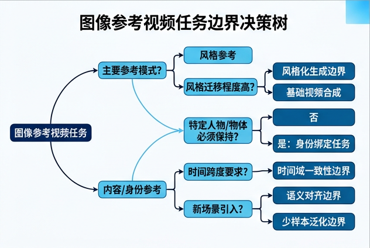
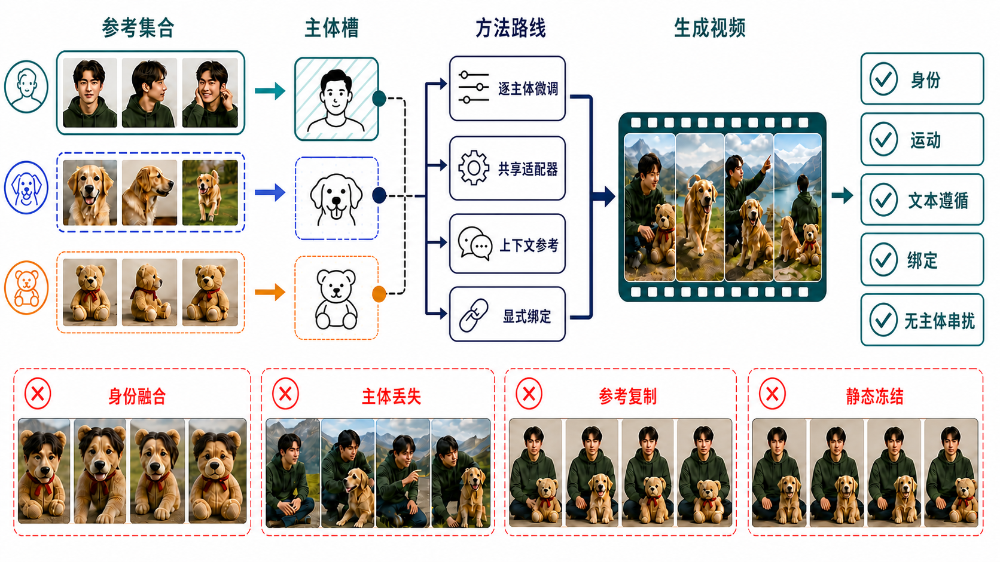
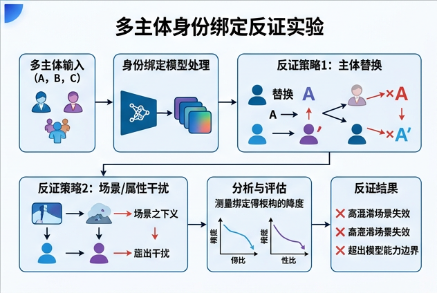

# 开放集视频个性化：主体槽、绑定证据与身份—运动 Pareto

> 本章冻结于 **2026-08-30（Asia/Shanghai）**。它讨论的不是“把一张图当首帧”，而是让一个或多个参考主体进入**新的场景、动作、构图和时间结构**，同时保持可辨认身份、正确角色和自然运动。检索、纳排、代码状态、逐篇反证与主图验收见[研究日志](../../sources/research_20260830_personalized_video_generation.md)。

## 学习目标

读完本章，应当能够：

1. 用“参考是否占输出时间轴”和“是否存在待编辑源视频”区分个性化、I2V、V2V、角色动画与跨镜头一致性；
2. 写出多参考、多主体、可选动作/相机/时间窗和适配预算都不含糊的 tensor 合同；
3. 解释每主体微调、共享 subject encoder、冻结 reference token、身份—运动模块组合、reward/post-training 和多镜头记忆六类路线；
4. 判断 `open-set`、`tuning-free`、`zero-shot`、`open weights` 为什么不是同义词；
5. 用交换参考、空槽、遮挡后重现、背景/姿态扰动和多主体相似矩阵证伪“身份保持”；
6. 把身份、动作、文本、运动、绑定、泄漏、底座能力和系统成本画成 Pareto，而不是只报一个 CLIP/DINO/FaceSim；
7. 按“首次公开 / 正式发表 / 工件状态”阅读 2022–2026 的里程碑，并识别作者结论与表格不一致之处。

## 1. 严格任务合同：参考主体不等于首帧

给定 $N$ 个主体，每个主体有至多 $K$ 张参考图：

```math
R\in[0,1]^{B\times N\times K\times3\times H_r\times W_r},
\qquad
M_R\in\{0,1\}^{B\times N\times K},
```

对应实体描述 $`E=\lbrace e_n\rbrace_{n=1}^{N}`$、文本 prompt $y$，以及可选的动作、相机、关系或时间窗条件 $c$，目标是生成：

```math
X\in[0,1]^{B\times F\times3\times H\times W},
\qquad
p_\theta\!\left(X\mid y,\{R_n,e_n\}_{n=1}^{N},c,a\right).
```

$a$ 是**适配预算**。若方法需要每个主体微调，它至少包含：参考数据量、可训练参数、步数、wall time、峰值显存和保存状态大小。若不需要个案优化，则 $a=0$，但共享模型的训练数据和训练成本仍不能省略。

这一定义有两个硬条件：

1. $R$ 只定义主体身份或关键属性，不要求等于 $X$ 中某个已知时间索引；
2. 没有一段完整源视频规定输出必须沿用的时间轴。

### 1.1 相邻任务的所有权边界

| 任务 | 测试时视觉输入 | 参考是否占输出时间轴 | 主要守恒量 | 本章是否拥有 |
|---|---|---:|---|---:|
| 严格 [I2V](image-to-video.md) | 首帧/关键帧 | 是 | 锚点像素/latent、未来运动 | 否 |
| [V2V](video-to-video.md) | 完整源视频 | 源视频就是时间轴 | 未编辑区域、轨迹、时序 | 否 |
| 角色/数字人动画 | 肖像 + pose/audio/driving | 通常不占首帧，但有强驱动 | 身份、口型/姿态同步 | 邻接 |
| [细粒度可控生成](controllable-video-generation.md) | 深度、轨迹、相机、pose 等 | 视条件而定 | 控制信号坐标、时钟、注入 | 邻接 |
| [故事与多镜头](story-multishot.md) | 角色状态、镜头计划、记忆 | 跨镜头状态 | 事实、角色、道具和镜头连续性 | 邻接 |
| **开放集视频个性化 / S2V** | 一组或多组主体参考 + prompt | **否** | 新情境中的主体身份、绑定与能力保持 | **是** |


**顺序化文字替代：** 有完整源视频并保留其时间轴时进入 V2V；参考图是输出首帧/关键帧时进入 I2V；由姿态、音频或 driving video 主导时进入 animation；跨多个镜头维护事实由故事章负责；只有参考不占时间轴、没有源视频、要在新场景/动作中保持主体时进入本章。进入本章后，再区分每主体优化与摊销式推理，并分别报告适配成本或共享训练成本。

### 1.2 `open-set` 的可证伪含义

本章只接受相对于明确 split 的定义：测试主体、参考集合或捕获源与个性化训练集隔离，并做近重复检查。以下推论都不成立：

- `open-set` $\nRightarrow$ `open weights`；
- `open-set` $\nRightarrow$ `open-vocabulary`；
- `open-set` $\nRightarrow$ `zero-shot`；
- “不在作者的 fine-tuning 数据” $\nRightarrow$ “不在基础视频模型、图像编码器或人脸模型的预训练数据”。

对互联网预训练模型，严格证明某位公众人物从未出现通常不可行。可靠写法是 **identity-disjoint benchmark generalization**，并公开无法审计的底座污染边界。

## 2. 主体槽不是一个向量

一个可执行的主体状态至少包括：

```math
s_n=
\bigl(
z_n^{\mathrm{global}},
Z_n^{\mathrm{local}},
m_n,
b_n,
\tau_n,
q_n
\bigr),
```

其中：

- $z_n^{\mathrm{global}}$：类别、整体轮廓、脸形或全局材质；
- $Z_n^{\mathrm{local}}$：眼睛、纹理、服饰、小配件、产品局部等细节 token；
- $m_n$：主体/脸/局部 mask 及其置信度；
- $b_n$：实体词、参考索引、角色和动作之间的 binding；
- $\tau_n$：主体应出现的时间区间，可为空；
- $q_n$：来源、许可、同意、撤回和审计状态。

把所有参考图压成一个全局向量，容易保类别而丢实例；保留大量局部 token，又容易复制参考的背景、姿态、裁切和光照。真正的难点不是“是否用了图像 encoder”，而是**什么应当不变、什么必须允许变化、每个 token 属于谁、在何时生效**。

### 2.1 最小 tensor 与绑定合同

| 字段 | 示例形状 | 必须冻结的语义 |
|---|---|---|
| Reference images | $R:B\times N\times K\times3\times H_r\times W_r$ | $N$ 是主体槽，$K$ 是每槽视图；缺失用 $M_R$，不能零图冒充有效参考 |
| Subject masks | $M:B\times N\times K\times1\times H_r\times W_r$ | 原图/裁切/分割版本；mask 失败与人工修正必须记录 |
| Entity text | $E:B\times N\times L_e\times D$ | 哪些 token 指向哪个槽；同类主体如何消歧 |
| Subject tokens | $S:B\times N\times L_s\times D$ | encoder、池化、reference order/index embedding、归一化 |
| Slot–word map | $A:B\times N\times L_y$ | 二值/soft assignment；一个词能否指多个主体 |
| Presence interval | $\tau:B\times N\times2$ | 秒、RGB 帧还是 latent index；闭区间/开区间；无时间控制时的缺省值 |
| Output video latent | $Z:B\times f\times C\times h\times w$ | VAE 时间压缩率、reference token 与 video token 的位置约定 |
| Adaptation state | $\phi:B\times N\times P$ 或模块文件 | token/LoRA/adapter/全模型；版本、大小、可删除性 |

若交换 $R_1,R_2$ 与它们的 entity binding，输出中两位主体也应随之交换，而背景、相机和动作语义不应无关改变。这个**置换等变性**比“看起来都有两个人”更接近真正的多主体合同。

## 3. 一张图读懂成功与失败



**图 1：成功不是“参考图像素更像”。** 参考集位于输出时间轴之外；`TUNE / ADAPTER / IN-CONTEXT / BIND` 是可组合或替代的路线。成功视频必须同时保留人物、狗和玩具，又产生新姿态、新动作和新背景。下方四个红框是必须主动构造的反例：`BLEND` 把多个身份融合，`DROP` 丢掉一个槽，`COPY` 复刻参考姿态/背景，`FREEZE` 用几乎静止的视频换取高相似度。生成提示、两轮定向修正、尺寸、SHA-256 与灰度验收见[研究日志](../../sources/research_20260830_personalized_video_generation.md#9-teaching-visual-record)。

**顺序化文字替代：** 三组参考先分别形成主体槽；模型从逐主体调优、共享适配器、上下文参考 token 或显式绑定路线生成新视频；输出必须分别通过身份、运动、prompt、主体—角色绑定和参考泄漏检查；任何身份融合、主体缺失、参考复制或静态冻结都判为失败，不能用其他平均分抵消。

## 4. 为什么个性化天然形成多目标冲突

### 4.1 同片段重建会教会错误捷径

最容易构造的训练对是：从目标视频抽一帧作为 reference，再让模型重建同一视频。此时条件里不仅有身份，还有姿态、背景、构图、光照、遮挡和相机距离。模型可以学习：

```math
\text{reference pixels}
\rightarrow
\text{copy pose/background/crop},
```

而不必学习跨姿态身份。Video Alchemist 明确记录了高分辨率参考导致近景大主体、遮挡参考复刻遮挡、裁切参考导致输出边缘裁切、相似姿态多参考导致低运动等 shortcut，并用模糊、缩放、色彩、亮度、翻转、剪切和旋转缓解 [[14]](#ref-14)。这证明增强是**反泄漏正则**，不证明泄漏已消失。

更强的数据对来自同一身份的**跨片段、跨视角、跨背景**检索：reference 与 target 共享主体，却刻意不共享姿态/背景。OpenS2V-Nexus 用 cross-video association 和合成多视图构造大规模 subject–text–video triples；2026 的 Vera 把这一思路收紧到人类身份的跨片段检索 [[23]](#ref-23), [[33]](#ref-33)。两者仍需数据许可、去重和基础模型污染审计。

### 4.2 身份与运动在去噪时间上争夺控制权

许多工作观察到，早期去噪更影响布局和运动，后期更影响细节。因此：

- CustomCrafter 在早期降低 subject module 权重、后期恢复，以保运动再修身份 [[11]](#ref-11)；
- PersonalVideo 只在后段启用 identity adapter，并用 base-model semantic reward 约束能力退化 [[17]](#ref-17)；
- DualReal 进一步同时按去噪阶段和 DiT 深度调节 identity/motion [[22]](#ref-22)。

这是一种有效工程归纳偏置，不是普适定理。不同 prediction target、scheduler、VAE、DiT 深度和底座可能改变“早运动、晚细节”的分界。必须做 timestep × layer 消融，而不能照搬固定比例。

### 4.3 多参考不仅增加信息，也增加冲突

多视图能补背面和遮挡，却也可能：

- 把同一主体的不同服饰误当不同身份；
- 把两名同类人物的特征平均；
- 让 image token 数量压过文本；
- 因顺序无编码而无法知道 `[R1]` 对应谁；
- 用更多参考换更高相似度，却降低 prompt/动作自由度。

因此横轴不能只有 reference count。至少要联合报告 $K$、视角覆盖、服饰变化、裁切方式、同类主体数量、总 reference token 数和 text/image guidance。

## 5. 六条技术路线

### 5.1 路线 A：每主体 token、LoRA、adapter 或全量微调

Textual Inversion 用一个可学习文本 embedding 表示新概念，DreamBooth 用少量图像微调整个图像扩散模型并配 prior preservation；它们建立了图像个性化祖先，但没有视频运动证据 [[1]](#ref-1), [[2]](#ref-2)。AnimateDiff 把可复用 motion module 接到个性化图像模型，说明“身份模型 + 运动模块”可以组合，却也暴露了静态图 fine-tuning 破坏视频先验的问题 [[3]](#ref-3)。

视频阶段的重要分叉是：

- VideoDreamer 与 CustomVideo 把单/多主体定制带入 T2V；CustomVideo 用共现图、mask 和 attention control 约束两/三主体 [[4]](#ref-4), [[7]](#ref-7)；
- DisenStudio 用 spatial-disentangled cross-attention 与 masked/motion-preserved tuning 减少属性混合 [[8]](#ref-8)；
- Magic-Me 用扩展 identity token、三维相关噪声和 face/tiled refinement 强化人类身份 [[9]](#ref-9)；
- DreamVideo 分开训练 identity adapter 与 motion adapter，可把主体和动作模块重新组合 [[5]](#ref-5)。

优点是少量样本可获得细节；代价是每主体训练、状态存储、撤回和版本管理。训练图太少时，模型还会把“这张脸”学成“这张脸在这张图里的姿态和背景”。

### 5.2 路线 B：共享 subject encoder / reference adapter

VideoBooth 是重要的 feed-forward 图像提示路线：CLIP 图像 embedding 提供粗语义，多尺度图像 latent 作为额外 attention K/V 提供细节，并由首个视频帧向后传播 [[6]](#ref-6)。它避免每个主体优化，但 reference token 仍可能携带构图与背景。

人脸路线进一步利用领域先验：

- ID-Animator 用共享身份编码实现 zero-shot 人类视频身份控制 [[10]](#ref-10)；
- ConsisID 把脸形/关键点类低频信号与 face-recognition+CLIP 的高频/语义信号分开注入 DiT [[13]](#ref-13)；
- MagicMirror 用 identity/structure 双分支与 conditioned adaptive normalization 平衡身份和自然运动 [[18]](#ref-18)。

这类方法对人脸有效，不等于对动物、产品、玩具和虚构角色同样有效。face recognition embedding 还会忽略服饰、身体、道具和角色关系；必须把“人脸身份”与“通用主体身份”分开标注。

### 5.3 路线 C：冻结或 in-context reference token

Video Alchemist 在 DiT 内增加独立 personalization cross-attention，把每张参考图与对应实体词融合，并以 image-index embedding 区分参考 [[14]](#ref-14)。Movie Weaver 则在文本中写入 `[R1]`、`[R2]` anchored tokens，再给每组图像 token 加 concept embedding，显式补上 cross-attention 对 reference order 不敏感的问题 [[15]](#ref-15)。MAGREF 用 masked guidance 与 subject disentanglement 处理任意参考形态，并发布了部分推理工件 [[24]](#ref-24)。

`tuning-free` 只表示新主体推理时不训练，不表示：

- 基础系统训练便宜；
- 任意主体数都验证过；
- 不需要分割、裁切、检测或 prompt 改写；
- 不会复制 reference；
- 权重和训练数据开放。

### 5.4 路线 D：身份、动作与关系模块组合

DreamVideo 把 subject 与 motion adapter 分离；CustomTTT 把 appearance LoRA 与 motion LoRA 放在不同层，并在合并后做 test-time training 修复冲突 [[5]](#ref-5), [[12]](#ref-12)。VideoMage 把 subject LoRA 放在空间层、motion LoRA 放在时间层，以辅助视频正则保留 motion prior，用负 CFG 抑制 motion reference 的外观泄漏，再通过空间—时间 collaborative sampling 组合 [[16]](#ref-16)。

2025–2026 的正式工作继续细化：

- DreamRelation 从 exemplar videos 学两主体的关系，而不只学某个主体的孤立动作 [[21]](#ref-21)；
- DualReal 在 identity 和 motion 训练之间动态切换，并按 denoising stage/DiT depth 混合 [[22]](#ref-22)；
- SMRABooth 分别用自监督主体表征与光流动作表征监督稀疏 LoRA 注入 [[28]](#ref-28)。

关键验收不是“两个模块都装上了”，而是主体 A 是否执行 A 的动作、主体 B 是否执行 B 的动作，且参考 motion video 的外观没有泄漏。只报全帧 CLIP-I 与 Temporal Consistency 看不出角色互换。

### 5.5 路线 E：reward / preference / online RL

PersonalVideo 不再从加噪参考图重建，而是从噪声生成视频，在随机帧施加 identity reward，并用冻结底座的 semantic score distribution 约束动态与语义退化；它仍是每身份优化 [[17]](#ref-17)。MagicID 构造显式身份与动态 preference pairs，通过 hybrid sampling 平衡静态高身份样本与高动态样本 [[19]](#ref-19)。

ID-Crafter 把 post-training 推向多主体：先以层级 attention 汇聚单主体、主体间和跨模态信息，再由 VLM 解析关系，最后在线 RL 强化关键概念 [[26]](#ref-26)。严格 I2V 邻居 IPRO 直接对人脸 scorer 做 reward-guided optimization，只反传最后若干采样步，并以多视角真值脸池与 KL 正则缓解 reward overfit [[30]](#ref-30)。

reward 路线的核心风险是 Goodhart：

```math
\max_\theta r_{\mathrm{id}}(X,R)
\not\Rightarrow
\text{人类认为身份、动作和视频都正确}.
```

因此训练 reward、model selection evaluator 与最终 evaluator 必须尽量独立，并检查静态视频、脸部放大、过度锐化、重复帧和对抗纹理是否骗分。

### 5.6 路线 F：时间窗、长视频与跨镜头主体记忆

AlcheMinT 给每个 reference 指定出现区间，以 VAE reference tokens、实体文字和 interval-dependent positional phase bias 控制主体进入/离开 [[25]](#ref-25)。它把“是谁”扩展为“谁在何时出现”，但主表只验证一/两 reference；时间指标改善与 CLIP reference 分数存在 trade-off。

Gloria 用紧凑 content anchors 维护长视频角色，从训练内外片段提供 anchor cue 以降低复制，再用弱位置偏置区分多 anchor；作者报告超过 10 分钟的视频，但这不是独立复现或任意角色保证 [[27]](#ref-27)。PoCo 把 position embedding 重新解释为 multi-reference/multi-shot context controller，属于个性化与故事章的接口 [[35]](#ref-35)。训练自由的 Keyframe-Anchored challenge 方案则先生成身份保持关键帧，再用多参考插值填充顺序动作 [[34]](#ref-34)。

长视频的身份状态由本章提供；镜头计划、事实更新、道具状态、冲突和回滚仍由[故事与多镜头](story-multishot.md)拥有。

## 6. 里程碑：按合同变化而不是演示画质收录

| 首次公开 / 正式版本 | 工作 | 合同变化 | 仍未解决 |
|---|---|---|---|
| 2022 / 预印本 | Textual Inversion [[1]](#ref-1) | 一个 token 表示新图像概念 | 视频运动、时序与角色绑定 |
| 2022 / CVPR 2023 | DreamBooth [[2]](#ref-2) | 少样本主体微调 + prior preservation | 每主体成本、参考过拟合 |
| 2023 / ICLR 2024 | AnimateDiff [[3]](#ref-3) | 个性化图像模型可接通用 motion module | 运动多样性与模块冲突 |
| 2023-11 / 预印本 | VideoDreamer [[4]](#ref-4) | 语言—视频基础模型上的单/多主体定制 | 正式发表与代码工件 |
| 2023-12 / CVPR 2024 | VideoBooth [[6]](#ref-6) | 无个案微调的 coarse-to-fine image prompt video | binding、泄漏与开放集拆分 |
| 2023-12 / CVPR 2024 | DreamVideo [[5]](#ref-5) | identity 与 motion adapter 可组合 | per-concept 训练与长视频 |
| 2024-01 / TMM 2026 | CustomVideo [[7]](#ref-7) | 共现图 + mask + attention 的多主体定制 | 正式版本较晚、工件与开放集 |
| 2024-05 / ACM MM 2024 | DisenStudio [[8]](#ref-8) | 空间解耦 attention 与多主体动作保持 | 任意主体与免调优 |
| 2024-02 / ECCV 2024 Workshops | Magic-Me [[9]](#ref-9) | 人类 identity token + 视频/脸/瓦片 refinement | 人脸域、适配成本、数据开放 |
| 2024-11 / CVPR 2025 | ConsisID [[13]](#ref-13) | DiT 的频率/层级身份注入，不做每人微调 | 单人脸、指标冲突、底座污染 |
| 2025-01 / CVPR 2025 | Video Alchemist [[14]](#ref-14) | 内建多主体 open-set reference binding | 多主体主定量、copy shortcut |
| 2025-02 / CVPR 2025 | Movie Weaver [[15]](#ref-15) | anchored prompt + concept order，免调优多概念 | 固定模板、多人定量与运动下降 |
| 2025-03 / CVPR 2025 | VideoMage [[16]](#ref-16) | 多主体 + 交互 motion 的 LoRA 组合 | 小规模协议、长动作与适配成本 |
| 2024-11 / ICCV 2025 | PersonalVideo [[17]](#ref-17) | 直接视频 identity/semantic reward | 单身份、每身份优化、公式符号歧义 |
| 2025-01 / ICCV 2025 | MagicMirror [[18]](#ref-18) | DiT 人脸 identity/structure 双分支 | 通用对象与多人角色绑定 |
| 2025 / ICCV 2025 | MagicID / Phantom / DualReal [[19]](#ref-19), [[20]](#ref-20), [[22]](#ref-22) | preference、跨模态 S2V、identity-motion 联训 | evaluator、数据和 matched protocol |
| 2025-05 / NeurIPS 2025 D&B | OpenS2V-Nexus [[23]](#ref-23) | 180-prompt benchmark + 5M 级 S2V 数据基础设施 | proxy 校准、许可和去污染 |
| 2025-12 / CVPR 2026 | AlcheMinT [[25]](#ref-25) | 多 reference 的出现/消失时间窗 | 仅 1/2 reference 表格与软边界 |
| 2025-11 / CVPR 2026 | ID-Crafter [[26]](#ref-26) | 多主体 VLM-grounded online RL | reward 可靠性与复现实证 |
| 2026-03 / CVPR 2026 | Gloria [[27]](#ref-27) | content anchors 支持长时角色一致 | 作者报告的长时结果待独立复现 |
| 2025-12 / CVPR 2026 | SMRABooth [[28]](#ref-28) | object-level subject/motion representation alignment | per-concept LoRA 与域外泛化 |
| 2026-02 / CVPR 2026 | ConsID-Gen [[29]](#ref-29) | 多视图辅助的 I2V identity/geometric consistency | 仍是首帧锚定邻接任务 |
| 2026-06 / CVPR 2026 | IPRO / ID-Sim [[30]](#ref-30), [[31]](#ref-31) | identity reward optimization 与专用 identity metric | 人脸/图像代理不等于时序 binding |
| 2026-07 / 预印本 | Vera [[33]](#ref-33) | 百万对跨片段 human identity 数据 + 多人 binding | 正式发表、通用对象与开放复现 |

“首次公开”记录思想进入公共领域的时间，“正式版本”记录可核验 proceedings；二者不应互相覆盖。产品演示、作者自称 accepted 和项目页占位不计作正式里程碑。

## 7. 重点论文精读：机制、证据与不能外推的结论

### 7.1 Video Alchemist：内建 open-set binding，但主定量仍是单主体

**问题。** 传统方法每主体优化，或只支持一个主体；直接从同视频抽 reference 重建又容易 copy-and-paste。

**机制。** 系统从 caption 提取 subject/object/background entity words；每段取 5%、50%、95% 帧，经 GroundingDINO+SAM 得到分割 reference。图像 token 与对应 word token 融合，加 image-index embedding，再通过独立 personalization cross-attention 注入 rectified-flow DiT。训练池从 86.8M 过滤到作者报告的 37.8M 视频，并以强参考增强抑制泄漏 [[14]](#ref-14)。

**证据。** MSRVTT-Personalization 有 2,130 clips，分别以 Text-S、Vid-S、DINO subject-crop similarity、ArcFace face similarity 与 RAFT optical-flow Dynamic Degree 衡量。缺失主体/脸记零，这比只对成功检测帧求平均更诚实。主比较却只用 1,736 个单主体和 1,285 个单脸样本；多主体主要靠架构、样例与组件消融。

**反证。** 作者自己承认：更多 reference 有时降低文本对齐；多主体比例/构图可能不自然；reference pose/expression 仍会复制；benchmark 不自动测视觉质量。因此安全结论是“架构支持免调优多主体 open-set 条件，单主体/单脸点估计较强”，而不是“已用系统性定量解决多主体角色绑定”。

### 7.2 Movie Weaver：把 reference order 写进 prompt 和 token

**问题。** 普通 cross-attention 对 reference 集合的排列近似不敏感，同类人物容易融合，文本里的“护士”和“轮椅上的人”也不知道该连哪张图。

**机制。** LLM 把实体描述改写为 `person description [R1] ... person description [R2]`；concept embedding 给每组 reference tokens 一个共享的 reference-index encoding。数据只覆盖五种模板：face、face-body、face-body-animal、two-face、two-face-body。作者报告约 228K 预训练视频、651 条高质量微调视频，最终模型 30B，预训练约用 256 张 H100 五天 [[15]](#ref-15)。

**证据。** 在 300 对双脸人工消融中，anchored prompt 与 concept embedding 大幅提高“两个脸可分离”和 reference-face 匹配。唯一自动 matched comparison 却是 97 条 single-face；多概念主比较包含对专有 Vidu 1.5 的定性样例，而且输入张数并不完全对称。

**反证。** 论文展示三人 prompt 只生成两人，因为训练没有超过两人的配置；reference 还会导致 big-face、低运动和动作不遵循。它证明固定配置下 binding 设计有效，不证明任意主体数、任意组合或“谁执行哪个动作”。

### 7.3 ConsisID 与 MagicMirror：人脸身份是一个专门子问题

ConsisID 用关键点与 reference face latent 提供低频轮廓，用 face-recognition backbone、CLIP 和 Q-Former 形成局部高频/语义特征，再在 DiT blocks 中 cross-attend；训练从 coarse 到 fine，并以 face mask 和跨帧 reference 增强避免 copy shortcut [[13]](#ref-13)。作者内部流程得到 130K clips，主 benchmark 是 30 人 × 每人 5 图 × 90 prompts。

其表格必须按方向读：相比 ID-Animator，ConsisID 的 FaceSim 与 CLIPScore 更高，但 face-region FID 为 151.82，对方为 117.46，低者更好。论文正文“全部指标领先”与表格冲突；补充材料也承认 FID 与人感知弱对齐。可靠写法只能逐项报告。

MagicMirror 同样聚焦人脸，以 identity/structure 双分支、轻量跨模态 adapter 和合成 identity pairs→视频两阶段训练接入 Video DiT [[18]](#ref-18)。二者都不能代替通用动物、物体、产品和虚构角色的 identity protocol。

### 7.4 PersonalVideo 与 MagicID：从重建损失转向生成结果偏好

PersonalVideo 从纯噪声生成视频，在随机帧用独立 face model 比较 reference identity，再让定制模型的 semantic reward distribution 接近冻结底座；50 条 LLM simulated prompts 减少只重建参考构图，并把 identity adapter 限定在后段去噪 [[17]](#ref-17)。作者评 20 identities × 50 prompts 的 1,000 视频，并报告 identity、Dynamic Degree、FVD、Temporal Consistency 和 CLIP。

两个边界必须保留：它是每身份 800/4,000-step 优化，不是 tuning-free；论文明确不支持多身份。其 ICR prose 与显示公式的 cosine 优化方向还有符号歧义，本章不把该公式当成可直接实现的定义。

MagicID 用 identity reward 与 dynamic reward 构造 preference pairs：先用静态参考派生样本保证身份，再从 frontier 样本中选择更动态的偏好对 [[19]](#ref-19)。这比只重建静态图更贴近推理分布，但仍必须检查 reward 是否偏好大脸、锐化或有限动作。

### 7.5 VideoMage、DualReal 与 SMRABooth：身份和动作不是独立插件

VideoMage 的 72 个 subject–motion–background 组合、每组合 10 个视频，展示了 spatial subject LoRA、temporal motion LoRA、辅助视频正则、appearance-negative CFG 和 collaborative sampling 的联合价值 [[16]](#ref-16)。它的 Temporal Consistency 接近最佳，却不能判断动作是否由正确主体执行。

DualReal 不把 identity/motion 完全分开，而是轮流训练一个维度并用另一个 frozen prior 约束，再按 denoising stage 与 DiT depth 调节融合 [[22]](#ref-22)。SMRABooth 则引入 object-level self-supervised appearance representation 与 optical-flow motion representation，并稀疏选择 LoRA 注入位置/时刻 [[28]](#ref-28)。三者共同说明“分层”只是起点；最终仍需 role-aware action metric、motion-reference appearance leakage 和模块冲突消融。

### 7.6 OpenS2V-Nexus：评测基础设施比一个总分更重要

OpenS2V-Eval 有 180 个 real/synthetic subject–text cases，覆盖七类 S2V，并用 NexusScore、NaturalScore 和 GmeScore 分开评 subject consistency、自然度和文本相关；OpenS2V-5M 提供作者定义的五百万级 720p subject–text–video triples [[23]](#ref-23)。它还公开 evaluation code 和被测视频，显著提高了可重复比较的可能性。

但 benchmark metric 仍是 evaluator：必须按人/动物/物体、单/多主体、动作强度、遮挡和 reference 难度分层，并校准与人评的一致性。大规模数据也不自动解决许可、近重复、身份同意和基础模型污染。

### 7.7 ID-Crafter：多主体从监督学习进入 VLM-grounded RL

ID-Crafter 先做 intra-subject、inter-subject、cross-modal 三层身份 attention，再让 VLM 提供细粒度语义/关系指导，最后以 online RL 强化关键概念 [[26]](#ref-26)。它是 2026 多主体路线的重要转折：binding 不再只是 token index，也进入 post-training reward。

验证时必须拆解三类贡献：hierarchical attention 是否单独减少 blend，VLM 是否正确识别角色/动作，RL 是否改善 hard cases 而没有牺牲底座运动和多样性。若同一个 VLM 既产生 reward 又做最终评测，只能说明模型迎合该 evaluator。

### 7.8 AlcheMinT：主体时间窗是软相位偏置，不是硬开关

AlcheMinT 把 reference image 经同一 VAE 编码，与 video/text tokens 串接；entity text 加强同类主体 binding；interval-conditioned positional scheme 让 reference 在指定时间窗附近更易被注意 [[25]](#ref-25)。S2VTime 用 t-L2、t-IoU、CLIP-text 与 CLIP-reference 评主体出现区间和相似度。

主表只测一/两 reference，且 WeRoPE 消融表现为时序更准、CLIP 分数更低。标准 RoPE 只提供相对相位结构，不保证 attention 随距离单调衰减；论文中的一个 rotation-mixture 等式和右区间坐标也有数学/记号歧义。没有代码前，安全表述是**作者经验性地用区间相关相位偏置塑造注意分布**，而不是宣称某个线性定理。

S2VTime 的 reference 由 T2I 合成，时间区间由 GroundingDINO+SAM2 追踪；它测“某个实体何时出现”，不测两个同类身份是否互换。补充材料还承认 VAE 时间下采样与平滑相位导致边界误差，因此时间窗是软控制。

### 7.9 Gloria 与 Vera：长时记忆和身份专用数据成为 2026 前沿

Gloria 把角色外观压成 content anchors，以 superset anchoring 防复制、以弱 RoPE 区分多 reference；作者报告跨视角、超过 10 分钟的结果 [[27]](#ref-27)。验证应同时画 identity curve、anchor-copy score、shot boundary error 和每分钟 drift，不能只截取最好片段。

Vera 构建 1,001,891 个跨片段 identity-aligned human image–video pairs，用 Identity-Focal Masked Supervision 聚焦人类身份区域，以 Reference-Aware Layer-wise Attention 稳定 identity readout [[33]](#ref-33)。它报告单/多人身份与自然动作改善，但截至冻结日仍是预印本，且是 human-specific；不能外推到开放域通用主体。

## 8. 多主体 binding：从看图升级为相似矩阵与交换实验

令生成视频在时间 $t$ 检测出 $M_t$ 个主体 crop，reference 槽为 $N$。使用未参与训练 reward 的 evaluator 得到：

```math
S_{n,m,t}
=
\mathrm{sim}
\bigl(g_{\mathrm{eval}}(R_n),
g_{\mathrm{eval}}(\hat X_{m,t})\bigr).
```

只取 $\max_m S_{n,m,t}$ 会忽略两个 reference 同时匹配到一个混合主体。应先做一一匹配，再报告正确槽相对其他槽的 margin：

```math
\Delta_{\mathrm{bind}}
=
\frac{1}{|\mathcal T|}
\sum_{t\in\mathcal T}
\min_n
\left[
S_{n,\pi_t(n),t}
-
\max_{j\ne n}S_{j,\pi_t(n),t}
\right].
```

$`\Delta_{\mathrm{bind}}\gt0`$ 仍不够：还要验证 $\pi_t$ 随时间稳定、主体出画重现后回到同一槽，并且正确主体执行正确动作。


**顺序化文字替代：** 冻结人物、狗、玩具三个 reference slots、prompt、相机和 seed；分别运行原始 binding、交换两组参考、空置/加入无关槽、去背景/改变裁切姿态、遮挡后重现五个条件；对每帧检测、分割和跟踪，构造完整 reference-to-generated-subject 相似矩阵并做一一匹配；最后分别判定身份融合、主体丢失、身份/属性/动作交换、参考泄漏和遮挡后漂移。

## 9. 评测：十个账本不能压成一个平均分

| 账本 | 推荐单位 | 最少报告 | 不能替代 |
|---|---|---|---|
| Presence | subject × expected frame | recall、missing-as-zero、track coverage | identity fidelity |
| Identity | subject crop × frame | median、worst decile、置信区间、real-video calibration | 动作/文本正确 |
| Attribute | 服饰/颜色/局部/产品特征 | slot-specific VQA + 人评 | face identity |
| Drift | track × time / re-entry event | 相对首帧曲线、斜率、遮挡前后差 | 静态一致性 |
| Binding | slot × detected subject × time | assignment、margin、blend/drop/swap rate | 全帧 CLIP |
| Prompt / role | subject × action/relation | 谁做什么、与谁、在哪里、何时 | global text score |
| Motion | subject track × frame | flow、轨迹、多样性、动作成功 | Temporal Consistency |
| Leakage | reference factor × counterfactual | background/pose/crop/copy score | 高 identity score |
| Base retention | personalized vs frozen base | prompt、运动、画质、多样性差值 | 个性化绝对分 |
| System / rights | identity × budget/version | steps、time、VRAM、storage、consent、deletion | 模型画质 |

### 9.1 人脸、通用主体和时间指标要分域

- ArcFace/CurricularFace 类指标适合脸 crop，不覆盖身体、服饰、宠物或产品；
- DINO/CLIP/ID-Sim [[31]](#ref-31) 可用于通用/identity-focused crop，但必须按领域与人评校准；
- optical-flow Dynamic Degree 只测运动量，不测动作是否正确；
- consecutive-frame similarity 可能奖励静止，不能证明自然运动；
- FVD/FID 对实现、样本量和 reference distribution 敏感，不能跨论文表格直接排行；
- t-IoU/t-L2 测实体何时出现，不测同类身份是否交换。

VGBE 2026 Challenge 从单张参考图和文本生成视频，联合考察身份、几何一致性与视觉质量，并对进入决赛的 7 支队伍做源码核验；它评测的是单图条件 I2V，而不是本章定义的 reference-outside-timeline S2V，结果不能直接跨合同外推 [[32]](#ref-32)。

### 9.2 必须发布 Pareto，而不是调权重后的单分数

对每个 route 和 guidance 配置画：

```math
\bigl(
\text{identity},
\text{role/action},
\text{motion},
\text{text},
\text{leakage},
\text{cost}
\bigr).
```

只有在另一个配置六个维度都不差时，才可称为被支配。Movie Weaver 的 reference domination、Video Alchemist 的 reference-count/text trade-off、PersonalVideo 的 identity/dynamics reward、AlcheMinT 的 time/CLIP trade-off，都说明单一 “best” 会隐藏真实选择。

### 9.3 统计与污染协议

最小采样单元是：

```math
\text{subject set}
\times
\text{prompt/control}
\times
\text{seed}
\times
\text{adaptation budget}.
```

同一 subject 的不同 reference/prompt 不是独立身份样本。bootstrap 应以 subject set 为 cluster；多方法比较使用相同 prompt/seed 并报告 paired interval。split 至少按 identity、原视频、捕获源和 near-duplicate group 隔离。若底座预训练不可审计，明确写“无法排除 foundation-model memorization”。

## 10. PersonaBind-1：一套可执行的最小反证实验

> **状态：本章提出，尚未运行。** 下列数值是预注册门槛草案，不是论文或本仓库实测结果；正式使用前应以真实视频与人评校准。

### 10.1 数据与 split

- 48 个有明确许可的 subject identities：12 位同意参与的人、12 只动物、12 个产品/物体、12 个自有 3D/虚构角色；
- 每主体 4 张 reference：正面、侧面、遮挡/极端姿态、不同背景；
- 单主体 16 prompts，多主体 12 prompts，覆盖大动作、相机运动、互动、遮挡、出画重现和近色同类主体；
- 2/3/4-subject cases 分层；每条件 5 seeds；
- identity、原始 capture、background 和 near-duplicate cluster 全部隔离；
- 公开 perceptual hash/embedding 去重阈值、人工复核记录与无法审计的底座范围。

### 10.2 冻结项与唯一变化

冻结 base checkpoint、VAE、分辨率、帧率、长度、prompt、negative prompt、seed、采样步数、reference preprocessing 和 evaluator。只改变：

1. per-subject LoRA/token；
2. amortized adapter/encoder；
3. frozen/in-context reference tokens；
4. explicit multi-subject binding/post-training。

每条路线可有低/中/高三个预算点，但 wall time、trainable/stored parameters 与 inference latency 必须匹配公开。

### 10.3 预注册硬门

1. **Presence gate**：期望出现帧中，所有 subject slots 的 track coverage 至少 90%；漏检人工复核，真实缺失仍记零。
2. **Binding gate**：一一匹配的 binding margin 在至少 95% 可见帧为正；任一 subject 的 blend/drop/swap hard case rate 超过 5% 即失败。
3. **Re-entry gate**：遮挡或出画前后 identity score 的 median drop 不超过真实视频同类事件 95% 区间的上界。
4. **Motion gate**：个性化版本的 subject-level motion 不低于冻结底座同 prompt 分布的第 20 百分位，且动作成功率不因静态复制虚高。
5. **Leakage gate**：替换 reference background/pose/crop 后，主体身份应稳定；输出背景、姿态和边界裁切不得跟随被扰动 factor。像素近复制率高于真实同身份跨片段基线即失败。
6. **Capability gate**：相对冻结底座，prompt/action human preference 与 diversity 任一平均下降超过 5 个百分点，不能宣称“无能力退化”。

阈值不能靠测试集调到恰好过线。若 evaluator 与人评的 Spearman/paired agreement 未达到预注册校准标准，自动门降级为诊断，不作为最终裁决。

### 10.4 必须交付

- 原始 references、masks、许可和 split manifest；
- 原 prompt、改写 prompt、slot mapping、seed 和全部失败视频；
- 逐帧 detection/track、完整 $S_{n,m,t}$、assignment 和置信区间；
- identity、attribute、action、motion、leakage、base-retention 的分账结果；
- adaptation state、参数量、训练/推理 time、峰值 VRAM、磁盘和删除日志；
- evaluator 版本、训练重叠风险、人评问卷与匿名原始投票。

## 11. 数据、工件与可复现状态

截至冻结日：Magic-Me 有官方训练/推理代码但无训练数据；Video Alchemist 公开 MSRVTT-Personalization 评测工件而未公开模型代码/权重；PersonalVideo、AlcheMinT 和 PoCo 的作者仓库仍是不同程度的占位；Movie Weaver 未链接官方代码/权重/数据；MAGREF 公开部分推理代码与 checkpoint，但高分辨率/14B/训练代码仍在计划中；OpenS2V-Nexus 公开评测代码、结果视频和数据子集 [[9]](#ref-9), [[14]](#ref-14), [[17]](#ref-17), [[15]](#ref-15), [[24]](#ref-24), [[25]](#ref-25), [[23]](#ref-23), [[35]](#ref-35)。

复现实验必须把 release surface 分开：

- paper/project page；
- inference code；
- training code；
- checkpoint；
- training data；
- evaluation data/code；
- exact environment/commit/license。

“有 GitHub”不能缩写成“已开源”，“能跑 demo”不能缩写成“可训练复现”。

## 12. 权利、隐私与撤回是任务合同的一部分

人脸和声音可能是生物识别信息；宠物、产品、艺术角色和服饰也可能涉及所有权、商标、著作权或商业秘密。最小治理字段包括：

| 阶段 | 必须记录 |
|---|---|
| 收集 | 来源 URL/文件、许可、主体同意、未成年人/敏感身份、允许用途 |
| 处理 | 人脸/声音/embedding 是否持久化，谁可访问，保留期 |
| 适配 | 生成的 token/LoRA/adapter 与原图映射，版本和删除目标 |
| 生成 | prompt、reference、操作者、时间、模型版本、可见/不可见 provenance |
| 发布 | impersonation 风险、人工复核、watermark/content credential、分发范围 |
| 撤回 | 原图、缓存、embedding、适配权重、索引和派生样本的可验证删除 |

不能把“生成质量高”当作授权。数字人特有的音频、口型、声音克隆和人类授权细则见[数字人章节](digital-human.md)；本章负责通用 subject state 与适配工件的 provenance/revocation。

## 13. 常见误区与快速纠正

1. **把参考图当首帧。** 问它是否必须出现在 $X_0$；是则进入 I2V。
2. **把 `open-set` 写成“底座从未见过”。** 只声明相对于可审计 split 的 identity-disjoint generalization。
3. **只报 CLIP-I/DINO-I。** 加 tracked crops、binding matrix、动作角色、泄漏和 re-entry。
4. **用 Temporal Consistency 证明运动。** 静止视频也可能高分；另报 motion magnitude、diversity 和 action success。
5. **用多张同一人的 reference 证明多主体。** 多视图 identity 与多个 distinct subjects 是不同协议。
6. **把两个人都出现当正确 binding。** 交换 references，检查谁执行谁的动作、属性是否串槽。
7. **把 tuning-free 当低成本/开源。** 报共享训练成本、模型大小、预处理依赖和 release surface。
8. **把强增强当泄漏已消失。** 做背景、姿态、裁切 counterfactual，并测 copy score。
9. **把 face metric 当通用主体。** 人、动物、物体、产品和虚构角色分别校准 evaluator。
10. **照抄论文公式。** 若 prose、表格、损失方向或 RoPE 代数冲突，标注歧义并查代码。
11. **跨论文直接比较点数。** 数据、reference 数、crop、分辨率、帧数和 evaluator 不同；只在 matched protocol 下比较。
12. **把项目页当代码。** 分开核验代码、权重、数据、评测和 commit。

## 14. 仍值得研究的问题

1. 能否学到“身份不变量”和“可编辑属性”的校准分布，而不是把服饰/年龄/光照永久绑定？
2. 如何在同类多主体、交互、遮挡和出画重现中维持 slot identity，同时允许角色关系变化？
3. 如何让 reference token 数随主体/视图扩展，而不压过文本或产生 attention quadratic cost？
4. 如何把 identity、motion、relation、camera 与 temporal presence guidance 正交化，并给出冲突优先级？
5. 如何训练不会奖励大脸、静态、锐化、复制或 evaluator adversarial pattern 的 identity reward？
6. 如何从不可审计的基础模型中估计 memorization，并为公众人物建立更诚实的 open-world protocol？
7. 如何让撤回同时删除 adapter、缓存、embedding、训练索引和派生数据，并给出可验证证明？
8. 如何让长期/多镜头 identity memory 有界、可更新、可回滚，而不把旧服饰和场景写死？
9. 如何为动物、产品、艺术角色和非刚性主体建立与人脸同等可靠的 identity metric？
10. 如何把 subject personalization 与原生音视频中的声音身份联合建模，同时避免跨模态身份串绑？

## 15. 最小阅读顺序

1. **图像祖先与模块化运动**：Textual Inversion → DreamBooth → AnimateDiff。
2. **早期视频定制**：VideoBooth → DreamVideo → CustomVideo → DisenStudio / Magic-Me。
3. **摊销式 open-set**：ConsisID → Video Alchemist → Movie Weaver → Phantom。
4. **身份—运动 Pareto**：CustomCrafter → PersonalVideo → MagicID → VideoMage / DualReal。
5. **数据与评测**：MSRVTT-Personalization → OpenS2V-Nexus → ID-Sim。
6. **2026 前沿**：ID-Crafter → AlcheMinT → Gloria / PoCo → Vera。

每读一篇只回答八个问题：reference 是否占时间轴、是否每主体优化、主体 token 怎样形成、文本如何绑定 reference、训练对是否泄漏、动作由谁控制、多主体如何证伪、工件实际开放到哪一层。

## 参考文献

<a id="ref-1"></a>[1] Rinon Gal et al. [An Image is Worth One Word: Personalizing Text-to-Image Generation using Textual Inversion](https://arxiv.org/abs/2208.01618). arXiv preprint, 2022.

<a id="ref-2"></a>[2] Nataniel Ruiz et al. [DreamBooth: Fine Tuning Text-to-Image Diffusion Models for Subject-Driven Generation](https://openaccess.thecvf.com/content/CVPR2023/html/Ruiz_DreamBooth_Fine_Tuning_Text-to-Image_Diffusion_Models_for_Subject-Driven_Generation_CVPR_2023_paper.html). CVPR, 2023.

<a id="ref-3"></a>[3] Yuwei Guo et al. [AnimateDiff: Animate Your Personalized Text-to-Image Diffusion Models without Specific Tuning](https://openreview.net/forum?id=Fx2SbBgcte). ICLR, 2024.

<a id="ref-4"></a>[4] Hong Chen et al. [VideoDreamer: Customized Multi-Subject Text-to-Video Generation with Disen-Mix Finetuning on Language-Video Foundation Models](https://arxiv.org/abs/2311.00990). arXiv preprint, first public 2023-11-02.

<a id="ref-5"></a>[5] Yujie Wei et al. [DreamVideo: Composing Your Dream Videos with Customized Subject and Motion](https://openaccess.thecvf.com/content/CVPR2024/html/Wei_DreamVideo_Composing_Your_Dream_Videos_with_Customized_Subject_and_Motion_CVPR_2024_paper.html). CVPR, 2024.

<a id="ref-6"></a>[6] Yuming Jiang et al. [VideoBooth: Diffusion-based Video Generation with Image Prompts](https://openaccess.thecvf.com/content/CVPR2024/html/Jiang_VideoBooth_Diffusion-based_Video_Generation_with_Image_Prompts_CVPR_2024_paper.html). CVPR, 2024.

<a id="ref-7"></a>[7] Zhao Wang et al. [CustomVideo: Customizing Text-to-Video Generation with Multiple Subjects](https://doi.org/10.1109/TMM.2026.3668653). IEEE Transactions on Multimedia, 2026; first public as arXiv:2401.09962 in 2024.

<a id="ref-8"></a>[8] Hong Chen et al. [DisenStudio: Customized Multi-Subject Text-to-Video Generation with Disentangled Spatial Control](https://doi.org/10.1145/3664647.3680637). ACM Multimedia, 2024.

<a id="ref-9"></a>[9] Ze Ma et al. [Magic-Me: Identity-Specific Video Customized Diffusion](https://doi.org/10.1007/978-3-031-92808-6_2). ECCV 2024 Workshops, 2024, pp. 19–37.

<a id="ref-10"></a>[10] Xuanhua He et al. [ID-Animator: Zero-Shot Identity-Preserving Human Video Generation](https://arxiv.org/abs/2404.15275). arXiv preprint, 2024.

<a id="ref-11"></a>[11] Tao Wu et al. [CustomCrafter: Customized Video Generation with Preserving Motion and Concept Composition Abilities](https://ojs.aaai.org/index.php/AAAI/article/view/32914). AAAI, 2025.

<a id="ref-12"></a>[12] Xiuli Bi et al. [CustomTTT: Motion and Appearance Customized Video Generation via Test-Time Training](https://ojs.aaai.org/index.php/AAAI/article/view/32182). AAAI, 2025.

<a id="ref-13"></a>[13] Shenghai Yuan et al. [Identity-Preserving Text-to-Video Generation by Frequency Decomposition](https://openaccess.thecvf.com/content/CVPR2025/html/Yuan_Identity-Preserving_Text-to-Video_Generation_by_Frequency_Decomposition_CVPR_2025_paper.html). CVPR Highlight, 2025.

<a id="ref-14"></a>[14] Tsai-Shien Chen et al. [Multi-subject Open-set Personalization in Video Generation](https://openaccess.thecvf.com/content/CVPR2025/html/Chen_Multi-subject_Open-set_Personalization_in_Video_Generation_CVPR_2025_paper.html). CVPR, 2025.

<a id="ref-15"></a>[15] Feng Liang et al. [Movie Weaver: Tuning-Free Multi-Concept Video Personalization with Anchored Prompts](https://openaccess.thecvf.com/content/CVPR2025/html/Liang_Movie_Weaver_Tuning-Free_Multi-Concept_Video_Personalization_with_Anchored_Prompts_CVPR_2025_paper.html). CVPR, 2025.

<a id="ref-16"></a>[16] Chi-Pin Huang et al. [VideoMage: Multi-Subject and Motion Customization of Text-to-Video Diffusion Models](https://openaccess.thecvf.com/content/CVPR2025/html/Huang_VideoMage_Multi-Subject_and_Motion_Customization_of_Text-to-Video_Diffusion_Models_CVPR_2025_paper.html). CVPR, 2025.

<a id="ref-17"></a>[17] Hengjia Li et al. [PersonalVideo: High ID-Fidelity Video Customization without Dynamic and Semantic Degradation](https://openaccess.thecvf.com/content/ICCV2025/html/Li_PersonalVideo_High_ID-Fidelity_Video_Customization_without_Dynamic_and_Semantic_Degradation_ICCV_2025_paper.html). ICCV, 2025.

<a id="ref-18"></a>[18] Yuechen Zhang et al. [MagicMirror: ID-Preserved Video Generation in Video Diffusion Transformers](https://openaccess.thecvf.com/content/ICCV2025/html/Zhang_MagicMirror_ID-Preserved_Video_Generation_in_Video_Diffusion_Transformers_ICCV_2025_paper.html). ICCV, 2025.

<a id="ref-19"></a>[19] Hengjia Li et al. [MagicID: Hybrid Preference Optimization for ID-Consistent and Dynamic-Preserved Video Customization](https://openaccess.thecvf.com/content/ICCV2025/html/Li_MagicID_Hybrid_Preference_Optimization_for_ID-Consistent_and_Dynamic-Preserved_Video_Customization_ICCV_2025_paper.html). ICCV, 2025.

<a id="ref-20"></a>[20] Lijie Liu et al. [Phantom: Subject-Consistent Video Generation via Cross-Modal Alignment](https://openaccess.thecvf.com/content/ICCV2025/html/Liu_Phantom_Subject-Consistent_Video_Generation_via_Cross-Modal_Alignment_ICCV_2025_paper.html). ICCV, 2025.

<a id="ref-21"></a>[21] Yujie Wei et al. [DreamRelation: Relation-Centric Video Customization](https://openaccess.thecvf.com/content/ICCV2025/html/Wei_DreamRelation_Relation-Centric_Video_Customization_ICCV_2025_paper.html). ICCV, 2025.

<a id="ref-22"></a>[22] Wenchuan Wang et al. [DualReal: Adaptive Joint Training for Lossless Identity-Motion Fusion in Video Customization](https://openaccess.thecvf.com/content/ICCV2025/html/Wang_DualReal_Adaptive_Joint_Training_for_Lossless_Identity-Motion_Fusion_in_Video_ICCV_2025_paper.html). ICCV, 2025.

<a id="ref-23"></a>[23] Shenghai Yuan et al. [OpenS2V-Nexus: A Detailed Benchmark and Million-Scale Dataset for Subject-to-Video Generation](https://proceedings.neurips.cc/paper_files/paper/2025/hash/dae77d03bd51a5acfe8519848a3af6c9-Abstract-Datasets_and_Benchmarks_Track.html). NeurIPS Datasets and Benchmarks Track, 2025.

<a id="ref-24"></a>[24] Yufan Deng et al. [MAGREF: Masked Guidance for Any-Reference Video Generation with Subject Disentanglement](https://openreview.net/forum?id=Nbl43eAVaE). ICLR, 2026; first public 2025.

<a id="ref-25"></a>[25] Sharath Girish et al. [AlcheMinT: Fine-grained Temporal Control for Multi-Reference Consistent Video Generation](https://openaccess.thecvf.com/content/CVPR2026/html/Girish_AlcheMinT_Fine-grained_Temporal_Control_for_Multi-Reference_Consistent_Video_Generation_CVPR_2026_paper.html). CVPR, 2026.

<a id="ref-26"></a>[26] Panwang Pan et al. [ID-Crafter: VLM-Grounded Online RL for Compositional Multi-Subject Video Generation](https://openaccess.thecvf.com/content/CVPR2026/html/Pan_ID-Crafter_VLM-Grounded_Online_RL_for_Compositional_Multi-Subject_Video_Generation_CVPR_2026_paper.html). CVPR, 2026.

<a id="ref-27"></a>[27] Yuhang Yang et al. [Gloria: Consistent Character Video Generation via Content Anchors](https://openaccess.thecvf.com/content/CVPR2026/html/Yang_Gloria_Consistent_Character_Video_Generation_via_Content_Anchors_CVPR_2026_paper.html). CVPR, 2026.

<a id="ref-28"></a>[28] Xuancheng Xu et al. [SMRABooth: Subject and Motion Representation Alignment for Customized Video Generation](https://openaccess.thecvf.com/content/CVPR2026/html/Xu_SMRABooth_Subject_and_Motion_Representation_Alignment_for_Customized_Video_Generation_CVPR_2026_paper.html). CVPR, 2026.

<a id="ref-29"></a>[29] Mingyang Wu et al. [ConsID-Gen: View-Consistent and Identity-Preserving Image-to-Video Generation](https://openaccess.thecvf.com/content/CVPR2026/html/Wu_ConsID-Gen_View-Consistent_and_Identity-Preserving_Image-to-Video_Generation_CVPR_2026_paper.html). CVPR, 2026.

<a id="ref-30"></a>[30] Liao Shen et al. [Identity-Preserving Image-to-Video Generation via Reward-Guided Optimization](https://openaccess.thecvf.com/content/CVPR2026/html/Shen_Identity-Preserving_Image-to-Video_Generation_via_Reward-Guided_Optimization_CVPR_2026_paper.html). CVPR, 2026.

<a id="ref-31"></a>[31] Julia Chae et al. [ID-Sim: An Identity-Focused Similarity Metric](https://openaccess.thecvf.com/content/CVPR2026/html/Chae_ID-Sim_An_Identity-Focused_Similarity_Metric_CVPR_2026_paper.html). CVPR, 2026.

<a id="ref-32"></a>[32] Mingyang Wu et al. [VGBE 2026 Challenge on Image-to-Video Consistent Generation: Methods and Results](https://openaccess.thecvf.com/content/CVPR2026W/VGBE/html/Wu_VGBE_2026_Challenge_on_Image-to-Video_Consistent_Generation_Methods_and_Results_CVPRW_2026_paper.html). CVPR Workshops, 2026.

<a id="ref-33"></a>[33] Yulong Xu et al. [Vera: Identity-Faithful Human Subject-to-Video Generation](https://arxiv.org/abs/2607.20247). arXiv preprint, 2026-07-22.

<a id="ref-34"></a>[34] Zhenjie Liu et al. [Keyframe-Anchored Identity Preservation for Sequential-Action Video Generation](https://arxiv.org/abs/2607.17985). arXiv preprint, 2026-07-20.

<a id="ref-35"></a>[35] Binyuan Huang et al. [Rethinking Position Embedding as a Context Controller for Multi-Reference and Multi-Shot Video Generation](https://openaccess.thecvf.com/content/CVPR2026/html/Huang_Rethinking_Position_Embedding_as_a_Context_Controller_for_Multi-Reference_and_CVPR_2026_paper.html). CVPR, 2026.
