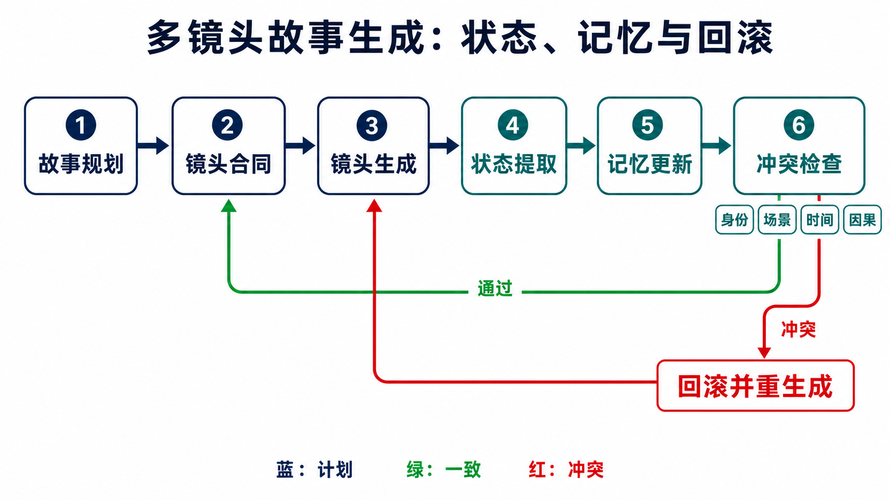

# 故事与多镜头视频生成：从“拼接片段”到可回滚的叙事状态机

> 本章冻结于 **2026-08-30（Asia/Shanghai）**。这里的 multi-shot video 指输出中存在至少两个由硬切或设计转场分隔的镜头；跨镜头允许时空不连续，但人物、场景、道具、剧情和电影语言必须服从同一个可检查的故事状态。精选样片不是完成证明，论文、正式 venue、代码、权重、数据与端到端复现面在本章中分别记录。

检索日期、arXiv/OpenAlex/官方 proceedings/官方项目与仓库入口、纳排规则、逐条证据和链接检查见[配套研究记录](../../sources/research_20260830_story_multishot.md)。

## 学习目标

读完本章，应能完成六件事：

1. 区分长单镜头、视频续写、V2V、story visualization/storyboard 与真正的 multi-shot video；
2. 写出故事、镜头计划、参考、输出视频和跨镜头状态的 tensor/state contract；
3. 比较 pipeline、整段联合生成、逐镜头记忆、storyboard anchoring、流式因果生成与训练免方法；
4. 把“角色一致”拆成身份、外观、空间、道具、事实和剧情进度等可单独失败的约束；
5. 依据正式发表、公开资产和可证伪评测判断 2025–2026 年工作的证据强度；
6. 设计包含状态改写、长间隔召回、冲突与回滚的可复现实验。

## 1. 先判任务：长不等于多镜头

“长视频”“多个事件”“多个场景”和“多镜头”不是同义词。一个连续长镜头可以经过多个房间；同一房间内也可以从全景硬切到人物特写。真正的判断变量是：**输出是否包含显式镜头边界，以及边界两侧是否仍属于一个叙事合同**。

| 任务 | 部署时主要输入 | 输出与边界 | 必须保持什么 | 不能据此声称什么 |
|---|---|---|---|---|
| 长单镜头 | 文本/轨迹/首帧 | 一条连续视频，无计划切镜 | 局部运动、时间与相机连续 | 有镜头调度或跨切叙事记忆 |
| 视频续写 | 已生成/真实视频前缀，可加文本 | 前缀之后的帧；默认边界连续 | 末帧附近的外观、运动和因果 | 已处理角色跨场景回归 |
| Video-to-video | 源视频与编辑条件 | 与源视频时间轴强对应的改写视频 | 源运动、结构或布局，依任务而定 | 从剧本自主规划多个镜头 |
| Story visualization | 多句故事，可加人物参考 | 多张静态故事图 | 跨图人物与剧情一致 | 已生成镜头内运动；StoryGAN 即把任务定义为故事到图像序列 [[1]](#ref-1) |
| Storyboard | 剧本/镜头描述 | 每镜头关键帧或首尾帧对 | 构图、人物、镜头意图 | 已把关键帧可靠动画化 |
| [开放集视频个性化](personalized-video-generation.md) | 主体参考 + prompt，可附控制 | 新时间轴的单片段或候选镜头 | 新情境中的主体身份、属性与绑定 | 自动证明跨镜头事实、道具状态或回滚 |
| Multi-shot video | 故事、镜头表或逐镜头 prompt，可加参考 | 至少两个镜头，含硬切/转场及镜头内运动 | 镜头内动态 + 镜头间叙事状态 + 边界语法 | 自动证明长程因果或电影质量 |

StoryDALL-E 与 Make-A-Story 都属于静态 story visualization/continuation：前者从源图与故事生成后续图像，后者用视觉记忆维持多图一致性 [[2]](#ref-2) [[3]](#ref-3)。Phenaki 能按连续文本生成可变长度视频，但其核心证据是长时间 token 建模，不是显式切镜合同 [[4]](#ref-4)。SEINE 处理首尾条件下的转场/补间，适合连接两个片段，却也不自动成为多镜头叙事器 [[6]](#ref-6)。


**顺序化文字替代：** 先看输出是否真的有运动；静态输出是故事图或 storyboard。若有运动，再排除由源视频时间轴约束的 V2V 和只延续一个前缀的 continuation。剩余输出若没有可定位镜头边界，是长单镜头；有边界但没有共享叙事状态，只是 montage；同时有边界与共享状态，才是本章所称 multi-shot narrative video。

### 1.1 一个重要纠错：SVD 不是 LLM storyboard 证据

Stable Video Diffusion（SVD）论文讨论的是从图像预训练到 image-to-video 的数据与模型缩放 [[5]](#ref-5)。它可以充当“关键帧动画化”的 I2V 基座，但论文没有提出 LLM 剧本分解、镜头表、角色 bible 或跨镜头状态管理。因此：

- “LLM 先写 storyboard，再用 SVD 动画化”是一种可搭建的**系统组合**；
- SVD 本身只能支持 I2V 子模块的事实；
- 若没有规划器、边界定义和跨镜头记忆的独立证据，不能把 SVD 引作多镜头故事生成方法。

## 2. 输入、输出与状态合同

设批大小为 $B$，计划镜头数为 $K$。全局故事输入为 token

```math
S\in\mathbb N^{B\times L_s},
```

故事 bible 为初始状态 $Z_0$，至少包含实体账本、场景账本、叙事事实和风格约束。第 $i$ 个镜头计划可写为

```math
p_i=(y_i,n_i,f_i,h_i,w_i,\tau_i,c_i,R_i,Q_i),
```

其中 $y_i$ 是镜头文本，$n_i$ 是帧数，$f_i$ 是帧率，$h_i,w_i$ 是分辨率，$\tau_i$ 是切镜/转场类型，$c_i$ 是景别、角度、运镜等控制，$R_i$ 是人物/场景/道具参考，$Q_i=(q_i^{start},q_i^{end})$ 是可选 storyboard 首尾帧对。参考图可表示为

```math
R_i\in[0,1]^{B\times N_i^r\times3\times H_r\times W_r}.
```

输出镜头与最终编辑时间线分别为

```math
X_i\in[-1,1]^{B\times n_i\times3\times h_i\times w_i},\qquad
X=\mathrm{Edit}(X_{1:K},\tau_{2:K}).
```

若方法同时生成音频，还必须另写 $A_i\in\mathbb R^{B\times C_a\times L_i^a}$、采样率与音画对齐规则；不能把“后配音”与联合音视频生成混成同一个输出合同。UnityShots 把 opening-shot 长期记忆与前一镜头 tail 短期记忆用于多镜头音视频生成，但截至冻结日其训练代码、权重和 agent 系统仍标为待发布 [[26]](#ref-26)。

### 2.1 可审计状态不是“一张参考图”

单个镜头内如何从参考抽取、适配并绑定主体，属于[开放集视频个性化](personalized-video-generation.md)；本章拥有的是镜头间状态的接受、更新、失效、召回与回滚。

一个实用的已接受状态可以写成

```math
Z_i=(E_i,G_i,O_i,F_i,M_i,D_i,v_i),
```

其中：

- $E_i$：人物身份、衣着、姿态可变项和不可变项；
- $G_i$：场景、时间、天气、空间关系；
- $O_i$：道具所有权、位置与物理状态；
- $F_i$：截至镜头 $i$ 已成立的剧情事实与未解决目标；
- $M_i$：被选择的视觉/latent/KV/关键帧记忆及预算；
- $D_i$：镜头依赖与生成 provenance，包括模型、权重、seed、prompt；
- $v_i$：计划版本。

部署时的逐镜头因果合同是

```math
X_i\sim p_\theta(\cdot\mid S,p_{1:K},R_{\le i},Z_{i-1}),\qquad
Z_i=U(Z_{i-1},X_i,p_i,V_i),
```

其中验证结果 $V_i$ 必须为“接受”后才允许更新 $Z_i$。真实未来镜头像素不得进入因果系统；holistic 方法可以同时读取所有镜头 prompt 和参考，但不能把测试集未来真值当条件。论文若只说“用了 memory”而不报告存什么、保留多少、何时清除、是否 stop-gradient、拒绝样本是否写入，长程结果就无法复现。

## 3. 机制路线：先看条件如何跨过镜头边界

### 3.1 规划器 + 独立镜头生成器

VideoStudio 用大语言模型把用户描述变成多场景脚本，抽取共享实体、生成参考图，再逐场景合成 [[7]](#ref-7)。VideoGen-of-Thought（VGoT）进一步把一句话扩写为带人物、背景、关系、相机和 HDR 属性的动态 storyline，经关键帧与 I2V 生成镜头，并处理相邻 latent 边界 [[9]](#ref-9)。其正式发布面是 arXiv、官方仓库及 NeurIPS 2025 NextVid workshop oral，不应写成 NeurIPS 主会论文；arXiv:2503.15138 是作者注明误作新论文提交的重复版本，本章只引用规范记录 arXiv:2412.02259。

这一路线的优点是可替换规划器、T2I 与 I2V 子模块，失败也容易定位；缺点是语言计划、关键帧和运动之间存在三次分布转换，人物参考“看起来相同”不等于道具状态或剧情事实被执行。

### 3.2 一次联合生成：把切镜写进 backbone

ShotAdapter 把 transition tokens 与局部注意掩码加入扩散模型，让每个镜头拥有独立文本/长度条件，同时允许跨镜头信息交换 [[10]](#ref-10)。它已正式发表于 **CVPR 2025**，DOI 为 `10.1109/CVPR52734.2025.02645`；将其仅标为 arXiv 会低估证据级别。

2026 年的直接联合路线进一步分化：

- HoloCine 用 Window Cross-Attention 把各 shot prompt 限制到对应时间窗，并用 Sparse Inter-Shot Self-Attention 交换稀疏跨镜头信息；官方仓库已发布 14B 全量/稀疏模型与推理代码 [[15]](#ref-15)。
- MultiShotMaster 用 Multi-Shot Narrative RoPE 表示切镜后的时间不连续，再以位置感知 RoPE、参考 token 与 mask 支持主体、动作、背景、镜头数和时长控制；CVPR 2026 论文、训练/推理代码与 1.3B/14B 权重均公开 [[17]](#ref-17)。
- ShotDirector 把 6-DoF/内参相机控制、层级剪辑模式 prompt 与 shot-aware mask 放入统一多镜头生成，并构建 ShotWeaver40K [[20]](#ref-20)。

联合生成可以让注意力直接覆盖不同镜头，但成本随总帧数上升；全局 attention 也可能把本应在切点重置的运动、背景或姿态错误地延续到下一镜头。“看见全片”不是自动拥有结构化事实记忆。

### 3.3 逐镜头生成 + 选择性视觉记忆

Corgi 缓存已生成关键帧，为后续多场景片段提供 memory [[11]](#ref-11)。OneStory 把 I2V 作为逐镜头生成器：Frame Selection 从历史镜头选择语义相关帧，Adaptive Conditioner 再把重要区域压成条件 patch；论文报告可扩展到十个镜头和分钟级故事 [[16]](#ref-16)。截至冻结日，OneStory 已有 CVPR 2026 正式论文与项目页，但项目页仍写“model and data will be released”，未找到官方公开权重或数据仓，因此不能记为已发布模型。

StoryMem 的 Iterative Memory-to-Video 先做语义关键帧选择与审美过滤，再通过 latent 拼接和负 RoPE shift 把 memory 注入基于 Wan2.2 的 LoRA；官方仓库和 MI2V/MM2V 权重已公开 [[22]](#ref-22)。EM-Vid 则把实体建成可更新 memory，针对实体跨镜头回归这一更具体问题 [[34]](#ref-34)。

记忆路线的关键不只是“记得更多”，而是：

1. **选择**：当前镜头真正需要哪些人物、场景或道具证据；
2. **压缩**：固定预算内保留 identity 与状态，而不是整段复制；
3. **更新**：接受新事实，同时保留不可变约束；
4. **失效**：衣服已更换、杯子已打碎后，旧状态不能继续被检索；
5. **防污染**：拒绝镜头、临时重试和错误识别不能写回长期 memory。

### 3.4 Storyboard anchoring：先定关键状态，再补运动

STAGE 的 STEP² 为每个镜头预测首尾关键帧对，multi-shot memory pack 与双编码器在镜头间传递条件，随后调用现成视频生成器动画化 [[18]](#ref-18)。配套 ConStoryBoard 在正式论文中描述为约 100K 电影片段，标注故事进度与电影属性，并有偏好子集 [[19]](#ref-19)。截至冻结日，官方 Hugging Face 已公开 STEP² 模型和 ConStoryBoard 数据；仓库可运行 STEP² 推理，但完整多镜头生成、训练与 DPO 代码仍列为未来工作。故可复现的是“storyboard 生成层”，不是论文图中的全部端到端系统。

DreamShot 也利用视频扩散先验生成个性化 storyboard，区分 Text-to-Shot 与 Reference-to-Shot，并强化角色注意一致性；它的输出仍是故事板图像，不应因使用视频 prior 就归入视频输出方法 [[21]](#ref-21)。

### 3.5 流式因果生成与训练免控制

ShotStream 以双向 next-shot teacher 蒸馏因果 student，分开全局跨镜头 cache 与局部镜头内 cache，并通过位置不连续标记、intra-shot 到 inter-shot self-forcing 做流式生成 [[23]](#ref-23)。官方仓库称其已被 ECCV 2026 接收，代码、训练/推理配置和 Wan2.1-T2V-1.3B 检查点已公开；但作者同时说明开源实现使用公开基座，而论文原模型训练含内部数据，因此“可运行”不等于完全复现实验表。

CausalCine 用内容感知历史 KV memory routing 与少步蒸馏做在线导演式生成，但截至冻结日只核验到论文/项目页，未核验到官方代码或权重 [[24]](#ref-24)。CineWeaver 不再训练新模型，而是操纵位置编码和 attention 实现切镜、shot-routed reference conditioning 与 anchor memory；同样只有论文/项目面，尚不能声称公开可复现 [[25]](#ref-25)。

## 4. 规划—生成—记忆—冲突—回滚

下面是本综述综合现有路线提出的**工程验收状态机**，不是任何一篇论文已经完整实现的功能。它把影片生成视为带版本的事务：只有通过验证的镜头才能提交到长期状态。



**图 1：把跨镜头一致性变成可检查的循环。** 图中“通过”只表示候选镜头满足当前合同，不代表整部影片已经正确；“冲突”路径必须回到受影响的生成步骤，而不能把失败结果写入长期记忆。下方 Mermaid 给出带版本、依赖和失效传播的规范版本。


**顺序化文字替代：** 故事先编译为角色、场景、道具设定和带依赖的镜头 DAG；每个镜头只从最近一次已接受状态取条件。候选通过身份、事实、动作、相机和切点验证后才原子提交。局部画质失败只重试当前镜头；若发现设定或上游事实错误，则回到最早受影响镜头，撤销它及所有后继镜头与记忆，升级计划版本后重算。被拒绝结果永不污染长期状态。

### 4.1 为什么要回滚而不是“在下一镜头修一下”

假设镜头 2 中钥匙被模型错误地放进左口袋，镜头 5 又要求角色从右口袋取出钥匙。若只改镜头 5，会同时留下视觉历史和剧本事实两个互斥版本。正确处理是：

1. 判断“钥匙位置”是否是镜头 2 的可局部重渲染错误，还是剧本本身未定义；
2. 若是渲染错误，恢复 $Z_1$ 并重做镜头 2；
3. 使依赖该状态的镜头 3–5 失效，而不是把旧视觉 memory 继续传下去；
4. 若用户改了设定，升级 plan version，并记录哪些镜头因依赖变化而重算。

现有论文多处理“相似性记忆”，很少公开这种依赖级 rollback；因此这应作为系统里程碑，而不是默认已有能力。

## 5. 里程碑：能力、证据与发布面必须同时过线

一个工作只有在满足以下判据时，才应被写成“领域里程碑”，而非仅列为新论文：

1. **任务增量可证伪**：例如显式切点、可控镜头数、长间隔人物回归或在线追加 prompt；
2. **机制与增量对应**：消融能区分 boundary token、memory、reference routing 或 distillation 的作用；
3. **评价不偷换任务**：不能只用逐帧美学证明叙事，也不能只用身份相似度证明状态正确；
4. **证据级别明确**：正式 proceedings、arXiv、项目页、代码、权重和数据分别标注；
5. **复现合同足够**：输入格式、镜头时长、采样、seed、memory 预算、硬件和评价器版本可重跑；
6. **失败可见**：至少报告长间隔、遮挡、换装、多人交互、道具状态和切镜边界中的失败。

### 5.1 按可检验能力重排的时间线

| 时间 | 工作 | 新增的可检验能力 | 证据与边界 |
|---|---|---|---|
| 2019 | StoryGAN [[1]](#ref-1) | 多句故事到多张图，建立静态邻域任务 | CVPR；无视频运动 |
| 2022–2024 | Phenaki、VideoStudio、MEVG [[4]](#ref-4) [[7]](#ref-7) [[8]](#ref-8) | 长 prompt、自动多场景 pipeline、多个事件连接 | 长/多事件不自动等于显式多镜头 |
| 2024–2025 | VGoT [[9]](#ref-9) | 自动 storyline→关键帧→I2V→边界处理 | arXiv + workshop + 开源 pipeline |
| 2025 | ShotAdapter [[10]](#ref-10) | 直接多镜头扩散、transition token 与局部注意 | CVPR 2025；正式 venue 已核验 |
| 2025 | Corgi、EchoShot、CineTrans、AnimeShooter [[11]](#ref-11) [[12]](#ref-12) [[13]](#ref-13) [[14]](#ref-14) | 缓存记忆、人物参考、转场控制、层级动漫数据 | 任务范围各异，不能混成一个通用系统 |
| 2026 CVPR | HoloCine、OneStory、MultiShotMaster、STAGE、ShotDirector [[15]](#ref-15) [[16]](#ref-16) [[17]](#ref-17) [[18]](#ref-18) [[20]](#ref-20) | holistic、适应性记忆、直接可控、首尾 storyboard、导演式相机/剪辑 | 同一 venue，不同输入/输出合同与发布面 |
| 2026 流式 | ShotStream、CausalCine [[23]](#ref-23) [[24]](#ref-24) | 因果 cache、在线 prompt、低步生成 | 前者有公开实现但数据不完全；后者尚无公开实现 |
| 2026 训练免 | CineWeaver [[25]](#ref-25) | 在既有模型中以位置/attention 操纵切镜和参考 | 论文/项目面；代码未核验 |
| 2026 评测 | MuSS、MSVBench、EntityBench、PersonaShot [[27]](#ref-27) [[28]](#ref-28) [[29]](#ref-29) [[30]](#ref-30) | 电影数据、层级诊断、长间隔实体与人物叙事评测 | 多数仍为预印本，指标需人类校准 |
| 2026-08 | LogiShot、SEAM [[31]](#ref-31) [[32]](#ref-32) | 上下文视频逻辑条件、prompt 层记忆图/回写 | 最新预印本；后者主要是 storyboarding/prompt 系统 |

2025–2026 的 frontier 不是单一排行榜，而是三条互相牵制的轴：一次生成能否全局协调、逐镜头系统能否维护可更新状态、流式系统能否在低延迟下避免 exposure drift。PoCo 还把多参考与多镜头放到同一位置条件接口，提示“参考属于谁、在何时生效”本身就是核心建模问题 [[33]](#ref-33)；参考槽、绑定与身份泄漏验收见[开放集视频个性化](personalized-video-generation.md)，本章仍以跨镜头状态为最终合同。

## 6. 数据、评测与最常见的证据错位

### 6.1 公开数据/benchmark 不能只报规模

| 资源 | 主要对象 | 公开状态（冻结日） | 最适合测什么 | 不能单独证明什么 |
|---|---|---|---|---|
| ConStoryBoard [[19]](#ref-19) | 电影镜头的首尾帧、故事进度、电影属性与偏好 | 官方 HF 数据仓可访问；文件面已核验 | storyboard 构图与跨镜头状态 | 完整镜头内运动、版权可迁移性 |
| ST-Bench / StoryMem [[22]](#ref-22) | 30 个 GPT-5 故事、每个 8–12 镜头，共 300 prompts | 官方仓库公开 | 固定故事上的长程跨镜头对比 | 真实拍摄分布与大规模统计效力 |
| MuSS [[27]](#ref-27) | 3,000+ 影片、30K+ 多镜头片段、1,000+ 小时，含主体/电影叙事轨 | 论文报告；官方仓库仅先发数据构建代码 | 主体一致与电影叙事双轨评测 | 数据、benchmark 代码或权重已完整发布 |
| MSVBench [[28]](#ref-28) | 层级脚本、参考图与 LMM+专家指标 | 预印本协议 | 多方法的内容/电影/一致性诊断 | evaluator 在新模型上始终校准 |
| EntityBench [[29]](#ref-29) | 140 episodes、2,491 shots、最长 50 镜头、回归间隔最长 48 | 官方仓库公开 | 长间隔实体保持与 fidelity gate | 全部叙事质量或相机语言 |
| PersonaShot [[30]](#ref-30) | 约千个多镜头人物片段、16 个物理/情感/电影语法指标 | 预印本 | 人物驱动故事的细分失败 | 非人物故事、独立复现的一致结论 |

论文自报的相关性或优胜率必须写成“作者报告”。例如 MSVBench 报告其聚合分数与人类判断达到 94.4% Spearman 相关，但这仍需在未参与校准的新模型、不同长度与文化语境上重新验证 [[28]](#ref-28)。

### 6.2 四层评价，不让一个分数包办故事

| 层级 | 需要测的变量 | 推荐证据 |
|---|---|---|
| 镜头内 | 文本、动作、运动、几何、画质 | 每镜头独立 prompt/动作标注；运动与物理诊断 |
| 边界 | 切点位置、转场类型、前后污染、节奏 | frame-level cut detector + 人工复核；边界误差帧数 |
| 状态 | 身份、衣着、场景、道具、事实、情绪 | 实体级 matching + 状态问答 + 长间隔回归分桶 |
| 叙事/电影 | 因果、进度、镜头功能、相机/剪辑意图 | 盲评 pairwise + 脚本事件覆盖 + 电影属性遵循 |

身份相似度高可能只是把参考正面照复制到每个镜头；这会提高 consistency，却降低动作、构图和叙事变化。MuSS 因而同时设计 reference-subject、inter-shot consistency 与 anti-copy/paste 指标，强调 fidelity 与变化要一起看 [[27]](#ref-27)。

## 7. 失败模式：先定位是计划错、渲染错还是记忆错

| 失败 | 可见症状 | 可能机制原因 | 最小诊断 |
|---|---|---|---|
| 身份漂移 | 脸、发型、服装或体型变化 | reference routing 弱；错误实体被检索 | 固定背景，仅改变人物回归间隔 1/4/8 |
| 状态反转 | 道具复原、伤口消失、门重新关闭 | memory 只存外观，不存事实；旧状态未失效 | 设计不可逆状态变化并在远镜头追问 |
| 边界融化 | 两镜头在中间混合，姿态/背景拖影 | 连续时间位置编码跨过硬切；无 reset token | 单一主体、相反背景的硬切测试 |
| 过度复制 | 所有镜头构图和姿态近似参考 | memory 权重过大；相似度指标奖励捷径 | 固定身份，强制景别/动作/视角正交变化 |
| 局部遗忘 | 近镜头正确，远镜头人物或道具消失 | FIFO/context budget 挤出关键状态 | 控制干扰镜头数并记录 recall curve |
| 剧情跳步 | 结果漂亮但关键事件缺失/乱序 | 规划器未建依赖；生成器只追逐局部 prompt | 对每个事件记录前置条件、完成证据与顺序 |
| 相机冲突 | prompt 要推镜却得到主体变大或场景运动 | 相机、主体运动、编辑模式条件纠缠 | 静态场景 + 6-DoF/内参分解测试 |
| 错误累积 | 第一个小错在后续变成新“事实” | 生成帧无验证即写入 memory | 对照 accept-gated 与 unconditional update |
| 评估器幻觉 | LMM 给高分但人物/动作明显错误 | 低帧采样、身份盲区、语言偏置 | 人工逐帧 adjudication + evaluator 置信区间 |

## 8. 一个可复现、可证伪的实验

### 8.1 研究问题

在相同人物参考和故事事件下，哪一种状态传递方式能在**更长回归间隔**中维持身份与不可逆事实，同时仍服从新镜头的动作、构图和切镜要求？

### 8.2 固定测试集

建立 12 个原创、可公开的 8 镜头故事，避免训练电影版权：

- 4 个单人物故事：换装、受伤/恢复、携带/丢失道具；
- 4 个双人物故事：所有权交换、座位互换、情绪改变；
- 4 个场景故事：开/关门、昼夜/天气变化、物体移动。

每个故事都提供角色正面/侧面参考、场景参考、8 条镜头 prompt、硬切/溶解标记、景别与相机意图。把关键实体在间隔 $`g\in\lbrace1,3,6\rbrace`$ 后重新召回；每个条件运行 4 个固定 seeds。原始 prompt、编译后 prompt、负面条件、模型 commit、权重哈希和随机种子全部保存。

### 8.3 分轨比较，不强行伪装成同合同排行榜

1. **直接多镜头轨**：MultiShotMaster 公开 1.3B 权重，固定总帧数和 shot allocation；
2. **逐镜头记忆轨**：StoryMem 公开 MI2V/MM2V LoRA，固定 `max_memory_size`，另做 2/5/10 的消融；
3. **流式轨**：ShotStream 公开 Wan2.1-1.3B 实现，分别测首次出帧、稳态 FPS 与长度漂移；
4. **规划 pipeline 轨**：VGoT 固定 LLM 输出而不在每个 seed 重新规划；
5. **storyboard 子任务轨**：STAGE 只评价 STEP² 首尾帧，不把未公开完整 pipeline 的结果混入视频轨。

不同基座、分辨率与计算预算不能汇成一个“总冠军”。应同时报告原生设置和预算配平设置，并把不兼容合同留空而不是插值造分。

### 8.4 指标与判定

- **边界遵循**：切点误差、转场分类、边界前后污染帧数；
- **身份/场景**：每个实体在不同 $g$ 下的 reference 与 inter-shot 相似度，人工复核 copy/paste；
- **状态事实**：预注册 24 个二值/多选状态问题，由三名不知道方法名的标注者判断；
- **动作与镜头**：逐 shot 事件覆盖、景别、视角和相机意图遵循；
- **叙事顺序**：依赖 DAG 中满足的有向边比例；
- **代价**：峰值显存、总生成秒数、首次出帧、每镜头重试次数；
- **失败传播**：人为向镜头 3 注入错误，比较无门控、accept-gated update 与 rollback 三种系统在镜头 4–8 的污染率。

最小成功标准应在实验前固定：相对无记忆基线，$g=6$ 的状态正确率显著提高；同时动作/构图遵循不下降到预注册非劣界以下；错误镜头被拒绝后，后继污染率下降；结论在至少三个 seed 和逐故事 bootstrap 区间下成立。若只提高脸部相似度、却复制构图或漏掉剧情，不算故事一致性成功。

## 9. 截至冻结日的结论

1. **多镜头的独特难点是“允许视觉不连续，却要求状态连续”**；长视频或高画质都不能代替这项证据。
2. 2025 的 ShotAdapter 把切镜结构写进扩散 backbone；2026 的 HoloCine、MultiShotMaster、OneStory、STAGE 与 ShotStream 分别推进 holistic、直接控制、选择性记忆、storyboard anchoring 与流式因果生成。
3. 目前没有一条路线同时解决全局规划、角色/场景 bible、可编辑镜头生成、结构化状态更新、冲突检测和依赖级回滚；把它们画成一个系统时必须标明哪些是综述综合设计。
4. 发布面高度不均：MultiShotMaster、StoryMem、ShotStream 与 STAGE 子模块有实际公开资产；OneStory、CausalCine、CineWeaver 主要是论文/项目；MuSS 只先发数据构建代码。论文中的“will release”不等于已发布。
5. 下一阶段最有价值的 benchmark 不是再评一遍美学，而是测试状态改写、长间隔召回、不可逆事实、边界污染、错误写入与回滚。

## 参考文献

<a id="ref-1"></a>[1] [StoryGAN: A Sequential Conditional GAN for Story Visualization](https://openaccess.thecvf.com/content_CVPR_2019/html/Li_StoryGAN_A_Sequential_Conditional_GAN_for_Story_Visualization_CVPR_2019_paper.html). Yitong Li et al. CVPR. 2019.

<a id="ref-2"></a>[2] [StoryDALL-E: Adapting Pretrained Text-to-Image Transformers for Story Continuation](https://www.ecva.net/papers/eccv_2022/papers_ECCV/html/8009_ECCV_2022_paper.php). Adyasha Maharana et al. ECCV. 2022.

<a id="ref-3"></a>[3] [Make-A-Story: Visual Memory Conditioned Consistent Story Generation](https://openaccess.thecvf.com/content/CVPR2023/papers/Rahman_Make-a-Story_Visual_Memory_Conditioned_Consistent_Story_Generation_CVPR_2023_paper.pdf). Tanzila Rahman et al. CVPR. 2023.

<a id="ref-4"></a>[4] [Phenaki: Variable Length Video Generation From Open Domain Textual Descriptions](https://openreview.net/forum?id=vOEXS39nOF). Ruben Villegas et al. ICLR. 2023.

<a id="ref-5"></a>[5] [Stable Video Diffusion: Scaling Latent Video Diffusion Models to Large Datasets](https://arxiv.org/abs/2311.15127). Andreas Blattmann et al. arXiv. 2023.

<a id="ref-6"></a>[6] [SEINE: Short-to-Long Video Diffusion Model for Generative Transition and Prediction](https://openreview.net/forum?id=FNqOlrRswV). Zongxin Yang et al. ICLR. 2024.

<a id="ref-7"></a>[7] [VideoStudio: Generating Consistent-Content and Multi-Scene Videos](https://www.ecva.net/papers/eccv_2024/papers_ECCV/html/7783_ECCV_2024_paper.php). Yuwei Wang et al. ECCV. 2024.

<a id="ref-8"></a>[8] [Generating Multi-Event Videos with Text-to-Video Models](https://www.ecva.net/papers/eccv_2024/papers_ECCV/papers/06012.pdf). Weijia Wu et al. ECCV. 2024.

<a id="ref-9"></a>[9] [VideoGen-of-Thought: Step-by-step Generating Multi-shot Video with Minimal Manual Intervention](https://arxiv.org/abs/2412.02259); official repository [](https://github.com/DuNGEOnmassster/VideoGen-of-Thought); [NextVid workshop oral](https://neurips.cc/virtual/2025/131787). Mingzhe Zheng et al. arXiv / NeurIPS NextVid Workshop. 2024–2025.

<a id="ref-10"></a>[10] [ShotAdapter: Text-to-Multi-Shot Video Generation with Diffusion Models](https://openaccess.thecvf.com/content/CVPR2025/html/Kara_ShotAdapter_Text-to-Multi-Shot_Video_Generation_with_Diffusion_Models_CVPR_2025_paper.html); [project page](https://shotadapter.github.io/). Ozgur Kara et al. CVPR. 2025.

<a id="ref-11"></a>[11] [Corgi: Cached Memory Guided Video Generation for Multi-Scene Long Video](https://openaccess.thecvf.com/content/WACV2025/html/Wu_Corgi_Cached_Memory_Guided_Video_Generation_WACV_2025_paper.html). Jianzong Wu et al. WACV. 2025.

<a id="ref-12"></a>[12] [EchoShot: Multi-Shot Portrait Video Generation](https://proceedings.neurips.cc/paper_files/paper/2025/hash/1fe6f635fe265292aba3987b5123ae3d-Abstract-Conference.html); official repository [](https://github.com/D2I-ai/EchoShot). NeurIPS. 2025.

<a id="ref-13"></a>[13] [CineTrans: Towards Cinematic Text-to-Video Generation via Multi-Shot Transition](https://arxiv.org/abs/2508.11484). arXiv. 2025.

<a id="ref-14"></a>[14] [AnimeShooter: A Unified Framework for Story-to-Anime Video Generation](https://arxiv.org/abs/2506.03126). arXiv. 2025.

<a id="ref-15"></a>[15] [HoloCine: Holistic Generation of Cinematic Multi-Shot Long Video Narratives](https://openaccess.thecvf.com/content/CVPR2026/html/Meng_HoloCine_Holistic_Generation_of_Cinematic_Multi-Shot_Long_Video_Narratives_CVPR_2026_paper.html); official repository [](https://github.com/yihao-meng/HoloCine). Yihao Meng et al. CVPR. 2026.

<a id="ref-16"></a>[16] [OneStory: Coherent Multi-Shot Video Generation with Adaptive Memory](https://openaccess.thecvf.com/content/CVPR2026/html/An_OneStory_Coherent_Multi-Shot_Video_Generation_with_Adaptive_Memory_CVPR_2026_paper.html); [project page](https://zhaochongan.github.io/projects/OneStory/). Chongan An et al. CVPR. 2026.

<a id="ref-17"></a>[17] [MultiShotMaster: A Controllable Multi-Shot Video Generation Framework](https://openaccess.thecvf.com/content/CVPR2026/html/Wang_MultiShotMaster_A_Controllable_Multi-Shot_Video_Generation_Framework_CVPR_2026_paper.html); official repository [](https://github.com/KlingAIResearch/MultiShotMaster); [official weights](https://huggingface.co/KlingTeam/MultiShotMaster). Xiaoyan Wang et al. CVPR. 2026.

<a id="ref-18"></a>[18] [STAGE: Storyboard-Anchored Generation for Cinematic Multi-shot Narrative](https://openaccess.thecvf.com/content/CVPR2026/html/Zhang_STAGE_Storyboard-Anchored_Generation_for_Cinematic_Multi-shot_Narrative_CVPR_2026_paper.html); official repository [](https://github.com/escapistmost/Storyboard-Anchored-Generation). Peixuan Zhang et al. CVPR. 2026.

<a id="ref-19"></a>[19] [ConStoryBoard official dataset](https://huggingface.co/datasets/escapist413/ConStoryBoard); [STAGE official model](https://huggingface.co/escapist413/STAGE). STAGE authors. 2026.

<a id="ref-20"></a>[20] [ShotDirector: Directorially Controllable Multi-Shot Video Generation with Cinematographic Transitions](https://openaccess.thecvf.com/content/CVPR2026/html/Wu_ShotDirector_Directorially_Controllable_Multi-Shot_Video_Generation_with_Cinematographic_Transitions_CVPR_2026_paper.html). CVPR. 2026.

<a id="ref-21"></a>[21] [DreamShot: Personalized Storyboard Synthesis with Video Diffusion Prior](https://openaccess.thecvf.com/content/CVPR2026/html/Huang_DreamShot_Personalized_Storyboard_Synthesis_with_Video_Diffusion_Prior_CVPR_2026_paper.html). CVPR. 2026.

<a id="ref-22"></a>[22] [StoryMem: Multi-shot Long Video Storytelling with Memory](https://arxiv.org/abs/2512.19539); official repository [](https://github.com/Kevin-thu/StoryMem); [official weights](https://huggingface.co/Kevin-thu/StoryMem). Kaiwen Zhang et al. arXiv. 2025.

<a id="ref-23"></a>[23] [ShotStream: Streaming Multi-Shot Video Generation for Interactive Storytelling](https://arxiv.org/abs/2603.25746); official repository [](https://github.com/KlingAIResearch/ShotStream); [official weights](https://huggingface.co/KlingTeam/ShotStream). Yawen Luo et al. ECCV 2026 accepted / arXiv. 2026.

<a id="ref-24"></a>[24] [CausalCine: Causal Streaming Multi-Shot Video Generation via In-Context Directing](https://arxiv.org/abs/2605.12496); [project page](https://yihao-meng.github.io/CausalCine/). arXiv. 2026.

<a id="ref-25"></a>[25] [CineWeaver: Cinematic Narrative Synthesis via Training-Free Multi-Shot Video Generation](https://arxiv.org/abs/2607.26529); [project page](https://cineweaver.github.io/). arXiv. 2026.

<a id="ref-26"></a>[26] [UnityShots: Unified Multi-shot Audio-Video Generation](https://arxiv.org/abs/2606.21661); official repository [](https://github.com/JIA-Lab-research/UnityShots). arXiv. 2026.

<a id="ref-27"></a>[27] [MuSS: A Large-Scale Dataset and Cinematic Narrative Benchmark for Multi-Shot Subject-to-Video Generation](https://arxiv.org/abs/2604.23789); official repository [](https://github.com/zhang-haojie/MuSS). Haojie Zhang et al. arXiv. 2026.

<a id="ref-28"></a>[28] [MSVBench: Benchmarking Multi-Shot Video Generation](https://arxiv.org/abs/2602.23969). arXiv. 2026.

<a id="ref-29"></a>[29] [EntityBench: Benchmarking Long-Horizon Entity Consistency in Multi-Shot Video Generation](https://arxiv.org/abs/2605.15199); official repository [](https://github.com/Catherine-R-He/EntityBench/). arXiv. 2026.

<a id="ref-30"></a>[30] [PersonaShot: Evaluating Physical, Affective, and Cinematic Continuity in Multi-Shot Character-Centric Video](https://arxiv.org/abs/2608.16717). arXiv. 2026.

<a id="ref-31"></a>[31] [LogiShot: Long-Horizon Multi-Shot Video Generation with Logical Context Conditioning](https://arxiv.org/abs/2608.08820). arXiv. 2026.

<a id="ref-32"></a>[32] [SEAM: Structured Episodic Agent Memory for Long-Horizon Storyboarding](https://arxiv.org/abs/2608.22725); [SEAM-Bench](https://huggingface.co/datasets/Jackyqq/SEAM-Bench). arXiv. 2026.

<a id="ref-33"></a>[33] [Rethinking Position Embedding as a Context Controller for Multi-Reference and Multi-Shot Video Generation](https://openaccess.thecvf.com/content/CVPR2026/html/Huang_Rethinking_Position_Embedding_as_a_Context_Controller_for_Multi-Reference_and_CVPR_2026_paper.html). CVPR, 2026.

<a id="ref-34"></a>[34] [EM-Vid: Entity-Centric Memory for Multi-Shot Video Generation](https://arxiv.org/abs/2605.23610). arXiv. 2026.
