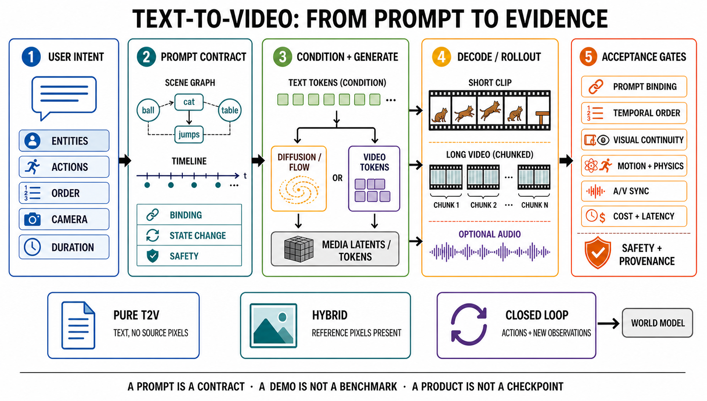

# 文本到视频：从语言契约到可验收的时空生成

> **证据快照：2026-08-30。** 本章讨论“只有文本、随机种子和生成配置，没有来源像素”的纯文本到视频（text-to-video, T2V）。厂商产品能力、论文结果、公开代码与可下载权重是四种不同证据；除非明确说明，本章不把其中一种替代另一种。

## 先把任务说准确

纯 T2V 接收文本 $y$、随机变量 $z$ 与生成配置 $s$，输出视频 $\hat{x}_{1:T}$；原生音视频模型还可以同时输出音频 $\hat{a}$：

```math
(\hat{x}_{1:T},\hat{a}) = G_\theta(y,z,s),
\qquad
s=(T,H,W,f,\rho,\gamma,\text{seed},\ldots)
```

这里 $T,H,W,f$ 分别是帧数、高、宽和帧率，$\rho$ 表示采样/求解配置，$\gamma$ 表示条件引导。**如果输入里出现首帧、参考图、姿态、深度或来源视频，就不再是纯 T2V，而是混合条件生成；如果模型还持续接收动作和新观测并影响下一步，则进入交互式 world model。**

一句话概括：T2V 不是“写一句话、得到一段看起来相关的视频”，而是把开放语言编译为可检查的实体、属性、关系、事件、镜头和声音约束，再在时空生成过程中尽可能同时满足它们。



*图 1　T2V 的条件—证据契约。图中的 diffusion/flow 与 video-token 是可替换或混合的生成路线，不是必然的先后阶段；`MEDIA LATENTS / TOKENS` 是系统级抽象，`OPTIONAL AUDIO` 既可能来自联合音视频模型，也可能来自明确标注的 staged video-to-audio 路径，不能由图反推具体架构。该图由生成模型制作并经原尺寸、灰度和文字检查；制作记录见[研究日志](../../sources/research_20260830_text_to_video.md)。*

图 1 的顺序文本替代如下：用户意图先被拆成实体、关系、动作、时间、镜头与声音要求；prompt compiler 将它们变成可版本化的条件契约；文本编码器、可选控制器和生成器据此产生媒体 latent/token；解码或滚动生成输出视频与可选音频；最后分别检查 prompt binding、时间顺序、视觉连续、运动/物理、音视频同步、成本/延迟以及安全/来源。只有文本输入的是纯 T2V；加入来源像素的是混合生成；动作与新观测闭环才是 world model。

## 三条边界：条件、来源像素和反馈

~~~mermaid
flowchart TD
    accTitle: T2V task boundary by condition and feedback
    accDescr: A decision tree separates pure text-to-video from reference-conditioned generation, video editing, and closed-loop world models.

    q0{是否持续接收动作与新观测?}
    q0 -- 是 --> wm[动作条件或交互式 world model]
    q0 -- 否 --> q1{除文本外是否有内容或结构条件?}
    q1 -- 否 --> t2v[纯 T2V]
    q1 -- 首帧或参考图 --> i2v[I2V / TI2V]
    q1 -- 来源视频 --> v2v[V2V / 编辑 / 修复]
    q1 -- 姿态/深度/轨迹 --> ctrl[结构控制的视频生成]
    t2v --> open[开放式创作: 约束是否实现]
    wm --> intervene[闭环预测: 动作后果是否可干预且可复现]

    classDef decision fill:#fff7ed,stroke:#c2410c,color:#431407,stroke-width:2px
    classDef pure fill:#ede9fe,stroke:#7c3aed,color:#2e1065,stroke-width:2px
    classDef hybrid fill:#dbeafe,stroke:#2563eb,color:#172554,stroke-width:2px
    classDef closed fill:#dcfce7,stroke:#16a34a,color:#14532d,stroke-width:2px
    class q0,q1 decision
    class t2v,open pure
    class i2v,v2v,ctrl hybrid
    class wm,intervene closed
~~~

顺序替代：先问系统是否持续接收动作与新观测；只要存在这种在线反馈，就进入动作条件或交互式 world model，再在该任务内部记录观测是像素、状态还是二者兼有。没有闭环反馈时，再判断是否含文本以外的来源内容或结构条件：首帧/参考图转到 I2V/TI2V，来源视频转到 V2V、编辑或修复，姿态/深度/轨迹属于结构控制生成；只有文本、seed 和生成配置时才是纯 T2V。

| 任务 | 最小输入 | 主要验收对象 | 本仓库入口 |
|---|---|---|---|
| 纯 T2V | 文本、seed、生成配置 | 文本事实、事件与镜头是否实现 | 本章 |
| I2V / TI2V | 文本 + 首帧/参考图 | 来源身份、布局与外观能否保持，同时产生合理运动 | [图像到视频](image-to-video.md) |
| 结构控制生成 | 文本 + 姿态/深度/分割/轨迹等 | 控制信号是否实现且未破坏外观与时间一致性 | [任务分类](../taxonomy.md) |
| V2V / 编辑 | 来源视频 + 指令/控制 | 未编辑区域是否保存，目标变化是否成立 | [视频到视频](video-to-video.md) |
| 故事/多镜头 | 脚本、分镜、角色/场景记忆 | 跨镜头身份、状态和因果是否连续 | [故事与多镜头](story-multishot.md) |
| 视频预测 | 历史观测 | 未来分布是否校准，而不只是画面好看 | [视频预测](video-prediction.md) |
| 交互式 world model | 状态/观测 + 动作 + 反馈 | 动作后果、闭环稳定性、规划效用与延迟 | [交互式世界生成](interactive-world-generation.md) |

这条边界也解释了为什么 MoCoGAN、VideoGPT、Stable Video Diffusion 或 MAGI-1 不能不加说明地列为“纯 T2V 里程碑”：它们分别是通用视频生成祖先、token 生成祖先、主要 I2V 系统或文本条件 I2V/连续生成系统，对 T2V 很重要，但解决的条件契约不同。

## 技术路线不是一条时间轴

现代系统通常同时选择一种表示、一种序列分解、一种训练目标、一种骨干和一种部署方式。把模型只分成“GAN、Transformer、Diffusion”会混淆表示、骨干和目标；即使都叫 Video DiT，full、factorized、window、sparse、linear 与 hybrid attention 的连边和成本也不同。更准确的路线矩阵如下。

| 路线 | 生成变量与分解 | 文本如何进入 | 代表工作 | 真正推进 | 主要瓶颈 |
|---|---|---|---|---|---|
| 直接条件 GAN | 一次生成短视频或时空特征 | 文本 embedding 与噪声拼接/调制 | Video Generation from Text [[1]](#ref-1)、TGANs-C [[2]](#ref-2) | 首次把开放 caption 与视频生成直接连接 | 低分辨率、训练不稳定、语义与运动容易模式坍塌 |
| 离散 token 自回归 | $`p(q_{1:N}\mid y)=\prod_i p(q_i\mid q_{\lt i},y)`$ | 文本 token 与视频 token 统一序列或交叉注意力 | CogVideo [[3]](#ref-3)、VideoPoet [[9]](#ref-9) | 语言—视觉统一与多任务接口 | token 数与上下文成本高，误差会沿序列累积 |
| masked token | 反复并行预测被 mask 的视频 token | Phenaki 由文本控制 MaskGIT 式填充；MAGVIT 原论文只使用已知帧/部分视频/类别条件 | Phenaki [[7]](#ref-7)；MAGVIT（技术祖先）[[8]](#ref-8) | 变长文本视频与并行条件补全 | 置信度校准、迭代调度和长程一致性仍困难 |
| 像素/级联 diffusion | 直接生成低分辨率 RGB，再做插帧/空间超分 | cross-attention、条件调制 | Video Diffusion Models [[4]](#ref-4)、Make-A-Video [[5]](#ref-5)、Imagen Video [[6]](#ref-6) | 高保真时空去噪、从图文/无文本视频迁移并扩大分辨率 | 多阶段接口复杂、采样慢、误差可能被插帧/超分放大 |
| latent video diffusion | 压缩视频 latent 上去噪 | 文本编码器 + cross-attention | Align your Latents [[10]](#ref-10) | 显著降低时空计算并复用图像先验 | codec 损失细节；图像先验不等于运动与物理先验 |
| 时空 DiT + diffusion/flow objective | latent patch 上做 v/噪声预测或 flow velocity 回归 | 多文本编码器、联合/双流 token | CogVideoX（v-prediction）[[12]](#ref-12)；HunyuanVideo、Wan、Step-Video-T2V（flow 路线）[[14]](#ref-14)–[[16]](#ref-16) | 规模化 Transformer、不同长宽比与现代系统工程 | 目标并不统一；训练/推理成本、数据治理和部署内存仍高 |
| 分块/因果/滚动生成 | chunk 条件于历史 chunk 或压缩状态 | 文本 + 历史窗口/记忆 | SkyReels-V2 [[18]](#ref-18)、MAGI-1 [[19]](#ref-19) | 把有限窗口扩展为连续输出 | “能继续生成”不等于叙事正确或永不漂移 |
| 原生联合音视频 | 联合或双流建模视频与音频 | 文本同时控制两个模态 | Ovi [[27]](#ref-27)、LTX-2 [[28]](#ref-28) | 对白、音效和画面可在生成阶段耦合 | 同步、多说话人绑定、采样率差异与联合评测 |

路线之间可以组合：例如“连续 latent + chunk factorization + flow matching + hybrid Video DiT + preference post-training”是一套合法配置，而不是五个互斥模型类别。机制细节见[生成模型路线](../generative-models.md)、[Video DiT 与骨干扩展](../generative-models/video-dit-backbones.md)、[视频基础模型](../foundation-models.md)与[因果/流式生成](../generative-models/causal-streaming-generation.md)。

## 从 prompt 到视频张量：训练和推理的数据契约

一个可复现实验必须保存的不只是 prompt，还包括 prompt 的结构化版本、数据过滤版本、编码器、codec、噪声/流时间、采样器与 seed。

~~~mermaid
flowchart TB
    accTitle: Text-to-video training and inference contract
    accDescr: The chart traces raw video-text data through base training, makes preference post-training optional, and shows that version-matched runtime prompt tokens enter inference together with the frozen generator and sampling configuration.

    raw[视频 + 标题/字幕/ASR/OCR] --> shot[镜头切分与时间对齐]
    shot --> govern[授权/去重/安全/质量过滤]
    govern --> caption[多粒度 caption + 事件结构]
    caption --> pair[(clip, prompt, metadata)]
    pair --> codec[video codec / tokenizer]
    pair --> text[text encoder / prompt compiler]
    codec --> latent[latent / token tensor]
    text --> cond[condition tokens]
    latent --> objective{基础训练目标}
    cond --> objective
    objective --> diff[diffusion / flow loss]
    objective --> ar[AR / masked likelihood]
    diff --> pretrained[pretrained generator]
    ar --> pretrained
    preference[偏好对 / reward data] --> post[DPO / RL / reward post-train]
    pretrained --> post
    post --> model[versioned generator]
    pretrained -->|可选: 直接冻结| model
    runtime[运行时原始 prompt] --> runtext[版本化 compiler / text encoder]
    runtext --> runcond[inference condition tokens]
    model --> infer[seed + solver + guidance + length]
    runcond --> infer
    infer --> output[video + optional audio]
    output --> record[事实表 + 失败标签 + 成本/延迟]

    classDef data fill:#dbeafe,stroke:#2563eb,color:#172554
    classDef train fill:#ede9fe,stroke:#7c3aed,color:#2e1065
    classDef gate fill:#fff7ed,stroke:#c2410c,color:#431407
    classDef out fill:#dcfce7,stroke:#16a34a,color:#14532d
    class raw,shot,govern,caption,pair,codec,text,latent,cond,preference,runtime,runtext,runcond data
    class objective,diff,ar,pretrained,post,model train
    class infer gate
    class output,record out
~~~

顺序替代：原始视频及标题、字幕、ASR、OCR 先做镜头切分、授权/去重/安全/质量过滤，再由 captioner 编译多粒度事件描述；视频经 codec 得到 latent/token，文本经编码器得到条件；基础模型用 diffusion/flow 或 AR/masked likelihood 训练。偏好对或 reward data 可以再与预训练生成器进入 DPO/RL 后训练，也可以跳过该阶段直接冻结基础模型。推理时，原始用户 prompt 必须经版本匹配的 compiler/text encoder 产生 condition tokens，与冻结生成器、seed、求解器、guidance 和长度共同进入采样，最后记录事实命中、失败类型、成本和延迟。

一个足以复现实验的最小记录可写成：

~~~yaml
task: pure_text_to_video
model_surface: checkpoint|code|api|paper_only
model_version: exact_name_or_hash
prompt_raw: "A red ball rolls right into a blue box. Static camera."
prompt_compiler_version: none_or_hash
facts:
  entities: [red_ball, blue_box]
  initial_relation: red_ball_left_of_blue_box
  event_order: [roll_right, enter_box]
  final_state: red_ball_inside_blue_box
  camera: static
negative_constraints: [no_extra_ball, no_camera_pan]
generation:
  seed: 3407
  frames: 81
  fps: 24
  resolution: [1280, 720]
  solver: exact_name
  steps: 30
  guidance: 5.0
acceptance:
  semantic_facts: per_fact_boolean
  temporal_order: manual_plus_program
  identity_persistence: tracked
  audiovisual_sync: not_applicable
  safety_and_provenance: checked
~~~

没有这些字段，“A 比 B 更好”的结果很可能只是 prompt 改写、seed 选择、帧率插值、后处理或产品版本不同。

## 里程碑：标准是新增了什么可检验能力

这里的“里程碑”不是按知名度排名，而是要求至少改变一项可检验能力：条件接口、时空表示、可扩展训练、长度机制、后训练方式或音视频输出。年份采用“首个公开版本 / 正式发表”规则。

| 年份 | 工作 | 为什么是里程碑 | 当时仍未解决 |
|---:|---|---|---|
| 2017/2018 | Video Generation from Text [[1]](#ref-1)、TGANs-C [[2]](#ref-2) | 证明开放文本可以直接条件化短视频生成，并开始区分外观与运动判别 | 分辨率低、动作简单、组合关系弱 |
| 2022/2023 | CogVideo [[3]](#ref-3) | 将预训练文本—图像 token 模型扩展到文本—视频自回归生成 | token 成本与长序列误差 |
| 2022 | Video Diffusion Models [[4]](#ref-4) | 系统建立视频 diffusion 与时空超分路线，并展示图像—视频联合训练收益 | 不是面向所有开放 T2V 契约的完整产品系统 |
| 2022/2023 | Make-A-Video [[5]](#ref-5) | 用图文先验和无文本视频学习运动，减少严格配对视频文本依赖 | caption—动作细粒度对齐仍弱 |
| 2022 | Imagen Video [[6]](#ref-6) | 级联扩散把 T2V 推到高清、多帧率时空超分 | 级联昂贵，公开复现面有限 |
| 2022/2023 | Phenaki [[7]](#ref-7) | 用 causal tokenizer 与 masked token 支持可变长度和连续 prompt | 长度增加仍伴随身份、状态和叙事漂移 |
| 2023 | Align your Latents [[10]](#ref-10) | 建立以图像 LDM 为底座、加入时序层的视频 latent diffusion 实用范式 | 图像生成先验不能自动学会真实运动 |
| 2024 | Lumiere [[11]](#ref-11) | Space-Time U-Net 一次生成完整时间跨度，减少关键帧后插值的接口误差 | 仍受有限窗口、计算和封闭权重约束 |
| 2024 | CogVideoX [[12]](#ref-12)、Movie Gen [[13]](#ref-13)、HunyuanVideo [[14]](#ref-14) | 大规模 DiT/flow、文本编码与系统工程成为主线 | 不同发布面使横向复现不对称 |
| 2025 | Step-Video-T2V [[16]](#ref-16)、Open-Sora 2.0 [[17]](#ref-17)、Wan [[15]](#ref-15) | 训练配方、开源工程与较大模型的技术报告更完整 | 论文自报成本/质量不等于独立复现；开放程度不一致 |
| 2025 | SkyReels-V2 [[18]](#ref-18)、MAGI-1 [[19]](#ref-19) | 分块、Diffusion Forcing 或 chunk-AR 将研究推向连续生成 | MAGI-1 主要是文本条件 I2V；无限续写不保证无限一致 |
| 2025/2026 | Ovi [[27]](#ref-27)、LTX-2 [[28]](#ref-28)、Sora 2 [[29]](#ref-29)、Veo 3.1 [[30]](#ref-30) | 联合/产品级同步音视频成为独立技术分支 | 开放论文、公开权重、产品声明与独立测试必须分栏 |
| 2024–2026 | InstructVideo、T2V-Turbo、VideoDPO、VPO、DynamicsBoost [[20]](#ref-20) [[22]](#ref-22)–[[26]](#ref-26) [[31]](#ref-31) | 后训练从“更像数据”转向人类/机器偏好、prompt 优化、速度和动态合理性 | reward hacking、偏好覆盖和跨模型泛化仍是核心风险 |

### 早期条件 GAN：证明接口，不代表现代质量

Video Generation from Text 将句子表示、随机变量与视频生成器连接，TGANs-C 又用帧、视频与运动相关的判别信号强化文本条件 [[1]](#ref-1) [[2]](#ref-2)。它们的重要性是把研究问题从“无条件运动纹理”改成“语言约束的时空内容”；但低分辨率和小数据使它们无法可靠回答多对象、长事件或镜头语言。MoCoGAN 的内容—运动 latent 分解是关键技术祖先，却不是开放文本条件系统，不能代替这两项直接 T2V 证据。

### Token 路线：统一模态，但上下文是硬成本

CogVideo 延续 CogView2 的离散视觉 token 与 Transformer，采用多帧率层次训练，把文本—图像预训练迁移到视频 [[3]](#ref-3)。Phenaki 的 C-ViViT 压缩视频，MaskGIT 式生成器根据一串 prompt 生成可变长度视频 [[7]](#ref-7)。VideoPoet 更进一步把图像、视频和音频任务表达为 token 到 token 的自回归建模 [[9]](#ref-9)。共同优点是接口统一，缺点是原始时空 token 数巨大：更强压缩会丢失细节，更弱压缩会让注意力、KV cache 和误差传播变贵。

### Diffusion、latent 与 DiT/flow：三条正交扩展

Video Diffusion Models 把图像 diffusion 架构时空化，并用联合图像—视频训练与时空超分展示了可扩展路线 [[4]](#ref-4)。Make-A-Video 把成对图文数据中的语义先验和无文本视频中的运动先验拆开学习 [[5]](#ref-5)；Imagen Video 则以多个级联扩散模块提升空间和时间分辨率 [[6]](#ref-6)。

Align your Latents 在预训练图像 LDM 中插入时间层，并在压缩 latent 中训练，形成后来大量 T2V 系统的工程母版 [[10]](#ref-10)。Lumiere 的 Space-Time U-Net 直接在完整时空体上生成低分辨率视频，再做空间超分，避免“先稀疏关键帧、再时间插值”的部分边界误差 [[11]](#ref-11)。

2024–2025 的规模化主路径扩展到 Transformer/DiT，并大量采用 flow matching；这不是“U-Net 被线性淘汰”，U-Net、hybrid 与任务专用架构仍并存。CogVideoX 公开了 joint full attention 与模态专属 Expert AdaLN，后者不是 MoE [[12]](#ref-12)；HunyuanVideo 讨论 dual-stream→single-stream full attention、文本编码和系统训练 [[14]](#ref-14)；Wan 给出大规模视频模型族，Wan2.2 又沿噪声时间切 high/low-noise expert [[15]](#ref-15)；Step-Video-T2V 报告 30B 模型、Video-VAE、双语编码器、视觉 token 3D full self-attention、独立文本 cross-attention、flow matching 与 Video-DPO [[16]](#ref-16)。这些系统结果同时来自 codec、数据、backbone、objective、post-train 和执行栈，不应把作者 benchmark 直接写成 backbone 排名；内部结构和公平比较见[Video DiT 专章](../generative-models/video-dit-backbones.md)。

## 数据与 prompt compiler：模型先学到的是 caption 的盲区

视频—文本对通常来自标题、字幕、ASR、OCR、网页元数据或自动 caption。它们分别偏向主题、对白、屏幕文字或静态外观，不一定说明谁在什么时候做了什么。一个现代训练管线至少需要：

1. 用镜头边界去掉无标注转场，保存原始时间戳和帧率；
2. 做近重复、泄漏、授权、肖像、未成年人和安全过滤；
3. 区分主体运动、相机运动、剪辑和加速/慢放；
4. 生成短 caption、密集事件 caption、镜头 caption 与声音 caption；
5. 保存 captioner、提示模板、过滤器和数据 manifest 的版本；
6. 在训练/验证/测试之间按来源与近重复簇分组，而不是随机切 clip；
7. 用人工抽样估计 caption 的实体、属性、动作、顺序与否定错误率。

Prompt compiler 在推理端执行相反方向：把用户自然语言拆成原子约束，并显式补全镜头、时长、节奏和声音。它可能提高 prompt following，但也可能偷偷改变用户意图。因此应同时保存原 prompt、编译后 prompt、编译器版本和差异；VPO 从 prompt optimization 角度对齐生成模型 [[24]](#ref-24)，Prompt-A-Video 用偏好对齐的 LLM 优化 prompt [[25]](#ref-25)，二者都说明“改模型”和“改输入”必须分开归因。

## 条件注入：语言不是生成机制

文本条件常经 T5/CLIP/LLM 编码器形成 token，再通过 cross-attention、AdaLN/FiLM、前缀 token 或双流—单流融合进入生成器。应检查四类错位：

| 错位 | 例子 | 诊断方法 | 可能修复 |
|---|---|---|---|
| 实体遗漏 | 三只猫只生成两只 | 原子事实计数、检测/跟踪与人工复核 | 数据重加权、结构化 prompt、对象 token |
| 属性串位 | 红球/蓝盒颜色交换 | 实体—属性配对检查 | 局部 cross-attention、布局/区域条件 |
| 时间坍缩 | “先开门再坐下”同时发生 | 事件起止时间与偏序图 | 密集时间 caption、阶段 token、长上下文 |
| 镜头—主体混淆 | 要求推镜却让人物前进 | 相机估计与主体光流分解 | 独立相机条件、轨迹或 3D 表示 |

Classifier-free guidance 或更强文本编码器只能改变条件强度，不能保证组合关系、因果和物理成立。过强 guidance 还可能降低多样性、放大饱和或造成运动僵硬。

## 后训练：SFT、偏好、蒸馏和 RL 解决的不是同一件事

预训练优化的是数据分布拟合；后训练开始直接优化可用性，但 reward 只能覆盖它测得到的内容。

~~~mermaid
flowchart TD
    accTitle: Post-training routes and evidence risks for T2V
    accDescr: Supervised tuning, preference optimization, reward optimization, prompt optimization, and distillation target different failure modes and each has a distinct validation risk.

    pre[预训练生成器] --> sft[SFT: 高质量/难例/指令数据]
    pref[偏好数据: 人类或 MLLM 成对选择] --> rm[Video reward model]
    pref --> dpo[DPO / diffusion-DPO]
    pre --> dpo
    pre --> rl[RL / GRPO 类更新]
    rm --> rl
    pre --> distill[蒸馏/少步一致性]
    sft --> updated[更新后的生成器]
    dpo --> updated
    rl --> updated
    distill --> updated
    pref --> promptopt[Prompt optimizer]
    promptopt --> optprompt[optimized prompt]
    pre --> frozen[冻结/版本化生成器]
    optprompt --> frozen
    updated --> candidate[候选模型或系统]
    frozen --> candidate
    candidate --> stress{留出难例与外部评测}
    stress -->|通过| release[冻结模型/编译器/评测版本]
    stress -->|失败| risk[reward hacking / 多样性下降 / 偏好过拟合]

    classDef base fill:#dbeafe,stroke:#2563eb,color:#172554
    classDef route fill:#ede9fe,stroke:#7c3aed,color:#2e1065
    classDef gate fill:#fff7ed,stroke:#c2410c,color:#431407
    classDef pass fill:#dcfce7,stroke:#16a34a,color:#14532d
    class pre,pref,rm base
    class sft,dpo,rl,distill,promptopt,optprompt,updated,frozen,candidate route
    class stress,risk gate
    class release pass
~~~

顺序替代：预训练生成器可走高质量 SFT、直接偏好 DPO、reward-model 加 RL，或少步蒸馏，这些路线会更新生成器；prompt optimizer 则产生优化后的 prompt，送入冻结的版本化生成器，改变的是候选系统输入而非模型权重。两类候选都必须在未用于奖励训练的难例与外部评测上检查；通过后冻结模型、编译器与评测版本，失败则定位 reward hacking、多样性下降、语义篡改或偏好过拟合。

| 工作 | 更新对象 | 训练信号 | 应如何解释证据 |
|---|---|---|---|
| InstructVideo [[20]](#ref-20) | 视频 diffusion 模型 | 人类反馈下的奖励微调 | CVPR 正式论文；说明指令对齐路线，不代表覆盖所有物理/组合性 |
| MLLM feedback / VideoPrefer [[21]](#ref-21) | VideoRM 与生成器 | 论文报告 135k MLLM 偏好标注 | NeurIPS 正式论文；数据规模和提升是作者报告 |
| T2V-Turbo [[22]](#ref-22) | 少步生成器 | 混合奖励 + 一致性蒸馏 | 重点是少步效率；必须同分辨率、时长、硬件比较 latency |
| VideoDPO [[23]](#ref-23) | diffusion generator | 覆盖多维偏好的 DPO | CVPR 正式论文；偏好维度仍受标注器覆盖限制 |
| VPO [[24]](#ref-24) | prompt optimizer | 对齐后的 prompt 偏好 | 主要改变输入；不能把收益全归因于视频 backbone |
| Prompt-A-Video [[25]](#ref-25) | preference-aligned LLM | 生成更适合特定模型的 prompt | 应同时报告原 prompt 与优化 prompt 的任务保真度 |
| Systematic Post-Train Framework [[26]](#ref-26) | SFT→Video-Diffusion GRPO/RLHF→prompt→推理 | 多阶段系统配方 | 2026 arXiv 技术报告；是可研究路线，不是同行评审共识 |
| DynamicsBoost [[31]](#ref-31) | continuation preference optimization | 从续写构造动态偏好对 | CVPR 2026 正式论文；提升为作者协议下结果 |

后训练的最低防错协议包括：奖励训练/调参/最终测试三套 prompt 分离；每个 prompt 多 seed；同时报告胜率置信区间、多样性与失败率；用独立 evaluator 复核 reward model；检查拒绝率、安全和创意坍缩；对 prompt optimizer 单独做“是否篡改语义”的人工审计。

## 长视频：时长、连续性、故事性是三项不同能力

“可生成 60 秒”只描述输出时长，不能推出角色在 60 秒内一致，更不能推出事件形成故事。应把三个目标分开：

- **可延展性**：计算图或窗口允许继续输出；
- **状态连续性**：身份、场景、道具、几何与已发生事件不漂移；
- **叙事正确性**：多个事件和镜头按脚本因果/时间结构完成。

Phenaki 通过连续 prompt 与 masked token 展示变长视频 [[7]](#ref-7)。SkyReels-V2 使用 Diffusion Forcing 等设计讨论“infinite-length”生成 [[18]](#ref-18)，但这里的 infinite 是架构/作者主张：滚动窗口能继续采样，不是数学上保证内容永不漂移。MAGI-1 用 chunk-autoregressive denoising 扩展连续生成 [[19]](#ref-19)，其公开任务契约主要是带文本的 I2V/视频续写，因此在本章列为相邻长视频机制，不列为纯 T2V 里程碑。

长视频实验至少报告：窗口/重叠长度、是否重编码历史、是否缓存 KV/latent、首帧或历史像素条件、每分钟身份断裂/场景跳变/重复循环次数、事件完成率、状态回归率以及累计延迟。跨镜头脚本、角色圣经和外部 memory 见[故事与多镜头生成](story-multishot.md)。

## 原生音视频：联合生成不等于“生成后配音”

音视频系统至少有三类，证据不能混用：

| 类型 | 因子化 | 优点 | 主要失败 | 例子 |
|---|---|---|---|---|
| 先视频、后音频 | $p(v\mid y)p(a\mid v,y)$ | 可复用成熟视频模型，编辑链清晰 | 对白/音效受既成画面限制，误差单向传播 | Movie Gen Video 与独立 Audio 13B 路线 [[13]](#ref-13) |
| 联合/双流生成 | $p(v,a\mid y)$ 或耦合双流 | 生成阶段直接交换节奏、事件与声音信息 | 两种采样率与 token 密度不平衡，同步难评 | Ovi [[27]](#ref-27)、LTX-2 [[28]](#ref-28) |
| 产品级原生音频声明 | 未公开或只公开部分系统细节 | 可观察最终用户能力 | 架构、数据和权重不可独立复现 | Sora 2 [[29]](#ref-29)、Veo 3.1 [[30]](#ref-30) |

Ovi 报告 twin-DiT 跨模态融合，LTX-2 报告不对称双流与交叉注意力；两者均应按各自公开论文/代码/权重面复核 [[27]](#ref-27) [[28]](#ref-28)。Sora 2 与 Veo 3.1 的同步对白/音效属于官方产品或 model-card 声明，不能反推出公开 checkpoint 的能力 [[29]](#ref-29) [[30]](#ref-30)。评测还必须分开检查：事件—音效时点、口型—语音同步、说话人身份、声源方向、音乐节拍、无声要求、音频伪影与视频质量；一个平均“AV score”不能定位这些错误。

## 2024–2026 发展现状：先看发布面，再看结果

截至证据快照日，T2V 已从单个生成器演变为 caption/data engine、视频 codec、DiT/flow、后训练、推理优化、音频、安全与产品层组成的系统。下面只列与本章机制判断直接相关的样本，不构成产品推荐或统一排行榜。

| 系统/工作 | 首次公开 | 任务/机制意义 | 公开证据面 | 不能据此推出 |
|---|---:|---|---|---|
| CogVideoX [[12]](#ref-12) | 2024 | expert Transformer、3D causal VAE、开放 T2V 路线 | 论文、代码/权重（按具体版本核验） | 所有产品版本都等于论文 checkpoint |
| Movie Gen [[13]](#ref-13) | 2024 | 30B 视频模型族；另有 video-to-audio 模型 | 技术报告/样例 | 一个原生联合 AV checkpoint |
| HunyuanVideo [[14]](#ref-14) | 2024 | 大规模开源 DiT/flow 系统说明 | 技术报告、代码/权重（按仓库版本） | 作者 benchmark 是独立复现 |
| Wan [[15]](#ref-15) | 2025 | T2V/I2V 模型族与较完整开放生态 | 预印本、代码/权重（按版本） | 不同尺寸、任务 checkpoint 可互换 |
| Step-Video-T2V [[16]](#ref-16) | 2025 | 30B T2V 系统、Video-VAE、flow 与 Video-DPO | 技术报告及作者发布面 | “最多 204 帧”自动等于任意长视频稳定 |
| Open-Sora 2.0 [[17]](#ref-17) | 2025 | 报告以约 20 万美元训练商业级候选系统 | 预印本、代码/权重按仓库清单 | 成本与“商业级”作者声明已独立验证 |
| SkyReels-V2 [[18]](#ref-18) | 2025 | Diffusion Forcing、运动 RL、长视频系统 | 预印本/作者发布 | 无限长度无累计漂移 |
| Ovi [[27]](#ref-27) | 2025 | 开放联合音视频双流路线 | 预印本、项目/发布面按版本 | 等于封闭产品的全部音视频能力 |
| LTX-2 paper / versioned artifacts [[28]](#ref-28) | 2026 | 联合音视频 foundation model 与效率路线 | 预印本 + 官方版本化代码/权重仓库；冻结日推荐 LTX-2.5，LTX-2.3 已列为 legacy | 当前 artifact 等同论文 checkpoint；作者展示等于独立安全/质量测试 |
| Sora 2 [[29]](#ref-29) | 2025 | 官方声明同步对白/音效、多镜头控制 | 官方产品页、system card | 公共权重、完整训练配方或当前持续可用；官方页已记录产品可用性变化 |
| Veo 3.1 / Lite [[30]](#ref-30) | 2025/2026 更新 | 官方 model card 声明 T2V/I2V 与原生音频 | 官方产品/model card | 开放 checkpoint 或跨供应商统一协议领先 |

更完整的参数、许可证、checkpoint 与当前可复现面应查[视频基础模型](../foundation-models.md)和[开放模型资源](../../resources/open-models.md)。**paper-only、demo、API/product、code、weights、training data/recipe** 应作为六个独立布尔字段，而不是一个含糊的“开放”。

## 评测：把 prompt 变成事实，把观感变成多道门

T2V-CompBench 用 1,400 个 prompt 和七类组合性维度分析复杂属性、对象、动作和关系 [[32]](#ref-32)；VBench 建立多维自动/人工评测套件 [[33]](#ref-33)；FETV 与 EvalCrafter 也推动了细粒度与综合评估 [[34]](#ref-34) [[35]](#ref-35)。WACV 2026 的 compositional-video 工作是这一分支的后续方法样本，而不是可替代统一协议的“最新榜首” [[36]](#ref-36)。这些 benchmark 是诊断工具，不是跨论文直接抄一个总分的许可证：模型版本、帧数、分辨率、prompt、裁剪、帧率和评价器版本必须匹配。

### 推荐的七道验收门

1. **语义事实**：实体数、属性绑定、空间关系、否定条件；
2. **时间事实**：动作方向、事件偏序、持续时间、最终状态；
3. **视觉连续性**：身份、纹理、文字、背景与遮挡恢复；
4. **运动/物理**：接触、碰撞、重力、材料、相机与主体运动分离；
5. **音视频**：事件同步、口型、说话人/声源绑定和静音要求；
6. **安全/来源**：拒绝策略、肖像/版权、训练/输出来源与水印；
7. **系统 SLO**：端到端延迟、首帧时间、吞吐、峰值显存、失败/重试率和成本。

### 配对实验而不是挑最好看的样例

- 冻结 prompt 清单、原子事实表、模型/API 版本和日期；
- 对同一 prompt 使用相同 seed 集；API 不开放 seed 时增加样本量并说明；
- 同时报告逐事实命中率、全事实严格成功率和每类失败率；
- 人评采用盲法随机次序，报告受试者数、配对胜率与 bootstrap 置信区间；
- 自动 judge 先在人工标注子集上校准，并报告假阳性/假阴性；
- 不把插帧、超分、prompt optimizer 或外部音频的收益归给基础 T2V；
- 对成本/速度固定输出时长、像素数、硬件、精度、steps 与并发。

推荐至少保存两个数：每项事实平均命中率，以及所有必要事实同时成立的严格成功率。后者常远低于平均分，更接近真实可用性。

## 失败定位：从现象倒查哪一层

| 现象 | 优先排查 | 证伪实验 |
|---|---|---|
| 画面漂亮但漏动作 | caption/prompt compiler 或文本条件过弱 | 保持 seed，逐项加入动作阶段；检查训练 caption 是否包含阶段 |
| 多对象属性交换 | 实体绑定与区域注意力 | 交换颜色/左右关系做最小对照，不改变其他词 |
| 动作正确但主体漂移 | codec、时序注意力或滚动记忆 | 固定 prompt，比完整窗口与分块生成的 ID 断裂率 |
| 长视频循环/回到旧状态 | 短历史窗口、记忆压缩或训练片段过短 | 增加历史/显式状态，测每分钟回归次数 |
| 相机运动替代主体运动 | 数据 caption 未区分相机与物体 | 加静态相机负约束并用相机估计验证 |
| 偏好优化后画面相似 | reward 过窄或 DPO/RL 强度过大 | 固定质量门，比较跨 seed 多样性和 mode coverage |
| 音效正确但时点错 | 音视频 token 对齐或级联误差 | 用可定位碰撞事件测同步偏差分布，而非单一相似度 |
| benchmark 高但真实 prompt 失败 | 评价器/训练数据污染或 prompt 分布窄 | 去重后的私有留出集 + 改写/否定/反事实 stress test |

## 仍未解决的研究问题

- **组合泛化**：模型能否在没见过的实体—属性—动作组合上保持绑定，而不是记忆常见共现？
- **可验证状态**：长视频是否有可读写的世界状态，还是只在像素层延续纹理？
- **反事实与因果**：只改一个动作或条件时，结果是否只发生相应变化？这也是 T2V 通向 world model 的关键断点。
- **奖励可信度**：MLLM/VideoRM 是否真的测到物理和事件，还是偏好锐利、饱和、强运动等表面代理？
- **联合音视频因果**：声音是否由可见事件产生并绑定正确声源，而非仅在语义上“相配”？
- **开放可复现性**：权重、codec、文本编码器、prompt compiler、安全过滤与推理配方能否作为一个可运行系统被版本化？
- **来源与治理**：训练授权、人物同意、生成来源和编辑链能否在系统全生命周期保留？

## 最小阅读与复现路径

1. 先读[任务分类](../taxonomy.md)，用“条件来源 × 来源像素关系 × 反馈时域”确定边界；
2. 读 Video Diffusion Models、Make-A-Video、Phenaki 和 Align your Latents，分别理解 diffusion、迁移、token/变长和 latent 路线；
3. 读 CogVideoX/HunyuanVideo/Step-Video-T2V，并配合[Video DiT 与骨干扩展](../generative-models/video-dit-backbones.md)，逐项写出 token、attention、fusion、position、active params 与 execution manifest；
4. 读 InstructVideo、T2V-Turbo、VideoDPO 与 2026 post-train framework，比较 SFT、偏好、蒸馏和 RL；
5. 读 SkyReels-V2/MAGI-1，但先确认它们的输入契约再讨论“长视频”；
6. 读 Ovi/LTX-2 与 Sora 2/Veo model card，练习区分公开方法证据与产品声明；
7. 用 30–100 个结构化 prompt、每个至少 4 个 seed 做一次配对复现，输出逐事实结果、严格成功率、失败标签和成本，而不是只做 montage。

## 参考文献

<a id="ref-1"></a>[1] [Video Generation From Text](https://ojs.aaai.org/index.php/AAAI/article/view/12233). Yitong Li, Martin Min, Dinghan Shen, David Carlson, Lawrence Carin. AAAI. 2018.

<a id="ref-2"></a>[2] [To Create What You Tell: Generating Videos from Captions](https://doi.org/10.1145/3123266.3127905). Yingwei Pan, Zhaofan Qiu, Ting Yao, Houqiang Li, Tao Mei. ACM Multimedia. 2017. [arXiv version](https://arxiv.org/abs/1804.08264), 2018.

<a id="ref-3"></a>[3] [CogVideo: Large-scale Pretraining for Text-to-Video Generation via Transformers](https://arxiv.org/abs/2205.15868). Wenyi Hong et al. ICLR. 2023.

<a id="ref-4"></a>[4] [Video Diffusion Models](https://proceedings.neurips.cc/paper_files/paper/2022/hash/39235c56aef13fb05a6adc95eb9d8d66-Abstract-Conference.html). Jonathan Ho et al. NeurIPS. 2022.

<a id="ref-5"></a>[5] [Make-A-Video: Text-to-Video Generation without Text-Video Data](https://arxiv.org/abs/2209.14792). Uriel Singer et al. ICLR. 2023.

<a id="ref-6"></a>[6] [Imagen Video: High Definition Video Generation with Diffusion Models](https://arxiv.org/abs/2210.02303). Jonathan Ho et al. arXiv preprint. 2022.

<a id="ref-7"></a>[7] [Phenaki: Variable Length Video Generation From Open Domain Textual Description](https://openreview.net/forum?id=vOEXS39nOF). Ruben Villegas et al. ICLR. 2023.

<a id="ref-8"></a>[8] [MAGVIT: Masked Generative Video Transformer](https://arxiv.org/abs/2212.05199). Lijun Yu et al. CVPR. 2023.

<a id="ref-9"></a>[9] [VideoPoet: A Large Language Model for Zero-Shot Video Generation](https://proceedings.mlr.press/v235/kondratyuk24a.html). Dan Kondratyuk et al. ICML. 2024.

<a id="ref-10"></a>[10] [Align your Latents: High-Resolution Video Synthesis with Latent Diffusion Models](https://openaccess.thecvf.com/content/CVPR2023/html/Blattmann_Align_Your_Latents_High-Resolution_Video_Synthesis_With_Latent_Diffusion_Models_CVPR_2023_paper.html). Andreas Blattmann et al. CVPR. 2023.

<a id="ref-11"></a>[11] [Lumiere: A Space-Time Diffusion Model for Video Generation](https://arxiv.org/abs/2401.12945). Omer Bar-Tal et al. arXiv preprint. 2024.

<a id="ref-12"></a>[12] [CogVideoX: Text-to-Video Diffusion Models with An Expert Transformer](https://arxiv.org/abs/2408.06072). Zhuoyi Yang et al. ICLR. 2025.

<a id="ref-13"></a>[13] [Movie Gen: A Cast of Media Foundation Models](https://arxiv.org/abs/2410.13720). Meta Movie Gen team. Technical report. 2024.

<a id="ref-14"></a>[14] [HunyuanVideo: A Systematic Framework For Large Video Generative Models](https://arxiv.org/abs/2412.03603). HunyuanVideo team. Technical report. 2024.

<a id="ref-15"></a>[15] [Wan: Open and Advanced Large-Scale Video Generative Models](https://arxiv.org/abs/2503.20314). Wan team. arXiv preprint. 2025.

<a id="ref-16"></a>[16] [Step-Video-T2V Technical Report: The Practice, Challenges, and Future of Video Foundation Model](https://arxiv.org/abs/2502.10248). Step-Video team. Technical report. 2025.

<a id="ref-17"></a>[17] [Open-Sora 2.0: Training a Commercial-Level Video Generation Model in \$200k](https://arxiv.org/abs/2503.09642). Open-Sora team. arXiv preprint. 2025.

<a id="ref-18"></a>[18] [SkyReels-V2: Infinite-length Film Generative Model](https://arxiv.org/abs/2504.13074). SkyReels team. arXiv preprint. 2025.

<a id="ref-19"></a>[19] [MAGI-1: Autoregressive Video Generation at Scale](https://arxiv.org/abs/2505.13211). Sand.ai team. arXiv preprint. 2025.

<a id="ref-20"></a>[20] [InstructVideo: Instructing Video Diffusion Models with Human Feedback](https://openaccess.thecvf.com/content/CVPR2024/html/Yuan_InstructVideo_Instructing_Video_Diffusion_Models_with_Human_Feedback_CVPR_2024_paper.html). Hangjie Yuan et al. CVPR. 2024.

<a id="ref-21"></a>[21] [Boosting Text-to-Video Generative Model with MLLMs Feedback](https://proceedings.neurips.cc/paper_files/paper/2024/hash/fbe2b2f74a2ece8070d8fb073717bda6-Abstract-Conference.html). NeurIPS. 2024.

<a id="ref-22"></a>[22] [T2V-Turbo: Breaking the Quality Bottleneck of Video Consistency Model with Mixed Reward Feedback](https://proceedings.neurips.cc/paper_files/paper/2024/hash/8a57aa8e8b57e64a42e95f7dceb0adb9-Abstract-Conference.html). Jiachen Li et al. NeurIPS. 2024.

<a id="ref-23"></a>[23] [VideoDPO: Omni-Preference Alignment for Video Diffusion Generation](https://openaccess.thecvf.com/content/CVPR2025/html/Liu_VideoDPO_Omni-Preference_Alignment_for_Video_Diffusion_Generation_CVPR_2025_paper.html). Jiawei Liu et al. CVPR. 2025.

<a id="ref-24"></a>[24] [VPO: Aligning Text-to-Video Generation Models with Prompt Optimization](https://openaccess.thecvf.com/content/ICCV2025/html/Cheng_VPO_Aligning_Text-to-Video_Generation_Models_with_Prompt_Optimization_ICCV_2025_paper.html). ICCV. 2025.

<a id="ref-25"></a>[25] [Prompt-A-Video: Prompt Your Video Diffusion Model via Preference-Aligned LLM](https://openaccess.thecvf.com/content/ICCV2025/html/Ji_Prompt-A-Video_Prompt_Your_Video_Diffusion_Model_via_Preference-Aligned_LLM_ICCV_2025_paper.html). ICCV. 2025.

<a id="ref-26"></a>[26] [A Systematic Post-Train Framework for Video Generation](https://arxiv.org/abs/2604.25427). arXiv preprint. 2026.

<a id="ref-27"></a>[27] [Ovi: Twin Backbone Cross-Modal Fusion for Audio-Video Generation](https://arxiv.org/abs/2510.01284). Ovi team. arXiv preprint. 2025.

<a id="ref-28"></a>[28] [LTX-2: Efficient Joint Audio-Visual Foundation Model](https://arxiv.org/abs/2601.03233). Yoav HaCohen, Benny Brazowski, Nisan Chiprut, et al. arXiv preprint. 2026. Official versioned code and weight repository [](https://github.com/Lightricks/LTX-2).

<a id="ref-29"></a>[29] [Sora 2](https://openai.com/index/sora-2/) and [Sora 2 System Card](https://openai.com/index/sora-2-system-card/). OpenAI. Official product/system evidence. 2025; availability page updated in 2026.

<a id="ref-30"></a>[30] [Veo](https://deepmind.google/models/veo/) and [Veo 3.1 Lite Model Card](https://deepmind.google/models/model-cards/veo-3-1-lite/). Google DeepMind. Official product/model-card evidence. 2025–2026.

<a id="ref-31"></a>[31] [DynamicsBoost: Dynamic Plausible Video Generation via Annotation-Free Continuation Preference Optimization](https://openaccess.thecvf.com/content/CVPR2026/html/Li_DynamicsBoost_Dynamic_Plausible_Video_Generation_via_Annotation-Free_Continuation_Preference_Optimization_CVPR_2026_paper.html). CVPR. 2026.

<a id="ref-32"></a>[32] [T2V-CompBench: A Comprehensive Benchmark for Compositional Text-to-video Generation](https://openaccess.thecvf.com/content/CVPR2025/html/Sun_T2V-CompBench_A_Comprehensive_Benchmark_for_Compositional_Text-to-video_Generation_CVPR_2025_paper.html). Kaiyue Sun et al. CVPR. 2025.

<a id="ref-33"></a>[33] [VBench: Comprehensive Benchmark Suite for Video Generative Models](https://openaccess.thecvf.com/content/CVPR2024/html/Huang_VBench_Comprehensive_Benchmark_Suite_for_Video_Generative_Models_CVPR_2024_paper.html). Ziqi Huang et al. CVPR. 2024.

<a id="ref-34"></a>[34] [FETV: A Benchmark for Fine-Grained Evaluation of Open-Domain Text-to-Video Generation](https://proceedings.neurips.cc/paper_files/paper/2023/hash/c481049f7410f38e788f67c171c64ad5-Abstract-Datasets_and_Benchmarks.html). Yuanxin Liu et al. NeurIPS Datasets and Benchmarks. 2023.

<a id="ref-35"></a>[35] [EvalCrafter: Benchmarking and Evaluating Large Video Generation Models](https://openaccess.thecvf.com/content/CVPR2024/html/Liu_EvalCrafter_Benchmarking_and_Evaluating_Large_Video_Generation_Models_CVPR_2024_paper.html). Yaofang Liu et al. CVPR. 2024.

<a id="ref-36"></a>[36] [Synthesizing Compositional Videos from Text Description](https://openaccess.thecvf.com/content/WACV2026/html/Singh_Synthesizing_Compositional_Videos_from_Text_Description_WACV_2026_paper.html). WACV. 2026.
