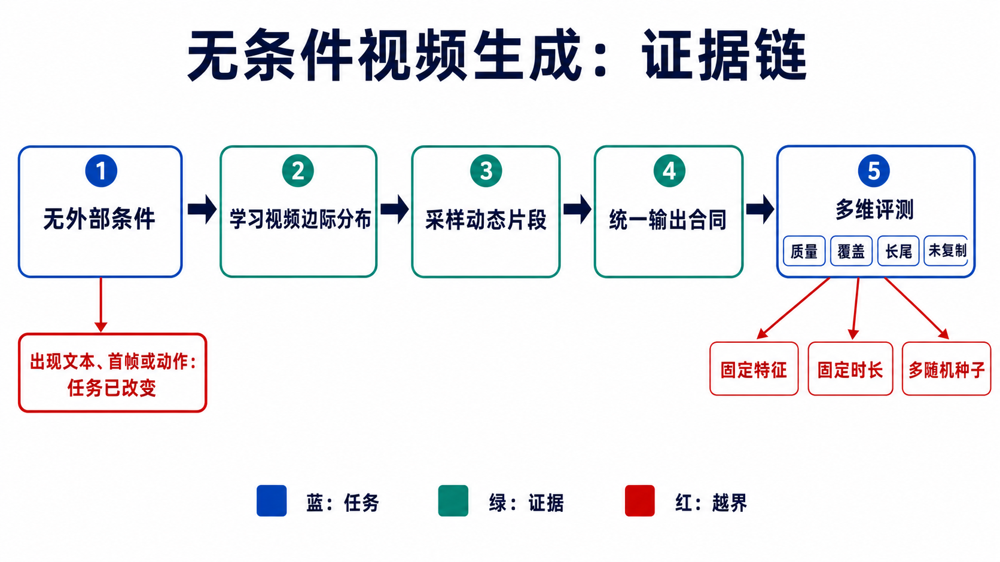
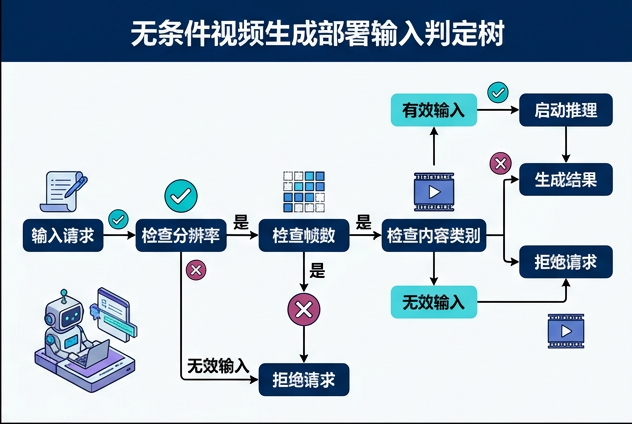
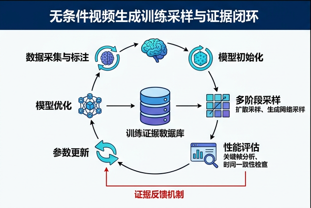

# 无条件视频生成：从边际分布到可审计的动态先验

> 本章冻结于 **2026-08-30（Asia/Shanghai）**。这里把“无条件”限定为：部署采样时没有样本特定的外生语义、图像、视频前缀、动作或状态输入，模型独立采样完整视频 $X$。数据集范围、训练条件、首帧来源和评测协议都必须显式声明；只把 condition 置空，不足以证明模型学的是严格边际分布 $p(X)$。

检索式、纳排记录、逐项证据等级、官方代码核查和排除项见[配套研究记录](../../sources/research_20260830_unconditional_video.md)。

## 🎯 学习目标

读完本章，应能完成六件事：

1. 根据部署 API 区分纯 $p(X)$、类别/域条件、自条件、T2V、I2V、视频预测和 world model；
2. 写出包含数据策略、随机源、训练目标、采样器、解码器和停止规则的训练/采样合同；
3. 用“能力发生了什么可验证变化”组织 Video Textures、GAN、token、masked、diffusion、DiT 与 flow 路线；
4. 解释 FVD、IS、precision/recall、density/coverage 分别测什么、漏掉什么；
5. 识别数据重复、域标签、首帧泄漏、tokenizer 上限、clip/FPS 不一致和长尾记忆化；
6. 设计一个不依赖精选样片、能够被第三方复跑的无条件视频生成实验。

## 📐 1. 严格任务边界：先看部署时“喂了什么”

设一段 RGB 视频为

```math
X=x_{1:T}\in[0,1]^{B\times T\times3\times H\times W}.
```

严格的纯无条件目标是学习边际分布

```math
p_\theta(X)\approx p_{\mathrm{data}}^{\Pi}(X),
```

其中 $\Pi$ 是完整数据策略：数据版本、划分、去重、帧率、片段长度、裁切和分辨率。部署时只允许从预先声明、与某个目标样本无关的随机源采样

```math
z\sim p(z),\qquad \hat X=S_\theta(z;T,H,W,\mathrm{fps}).
```

$T,H,W,\mathrm{fps}$ 是全局采样规格，不是样本语义条件。若用户挑选某个类别、首帧、文本、动作或参考视频，分布已变成条件分布。

### 1.1 相邻任务的判定表

| 任务 | 部署时样本特定输入 | 概率合同 | 本章如何处理 |
|---|---|---|---|
| **Pure unconditional** | 独立噪声/随机 token；固定 BOS；全局长度和分辨率 | $p_\theta(X)$ | 核心任务 |
| **Domain-restricted generation** | 运行时可不再输入域名，但训练集已固定为域 $D=d$ | $p_\theta(X\mid D=d)$ | 可称“该域内操作无条件”，不可外推为开放世界 $p(X)$ |
| **Class conditional** | 类别 $c$ 或可选择的域 token | $p_\theta(X\mid c)$ | 相邻任务；指标不得冒充纯无条件结果 |
| **Self-conditioned generation** | 仅模型先前生成的帧/token/state | $`p(X)=\prod_t p(x_t\mid x_{\lt t})`$ | 若历史也源自同一随机采样，仍是联合分布的一种分解 |
| **Learned-token conditional** | 从参考样本、身份、轨迹或检索结果推得的 token | $p_\theta(X\mid u)$ | token 名字再抽象，也仍是外生条件 |
| **Text-to-video** | 文本、语言 embedding | $p_\theta(X\mid y_{\text{text}})$ | T2V，不是无条件 |
| **Image-to-video / prediction** | 首帧、视频前缀或未来边界 | $p_\theta(x_{2:T}\mid x_1)$ 或 $p_\theta(Y\mid X_{\text{past}})$ | I2V/预测；除非另有可独立采样的 $p(x_1)$ 并联合报告 |
| **World model** | 历史状态/观测、动作，常含 reward/termination | $p(o_{t+1},s_{t+1},r_t\mid h_t,a_t)$ | 需要闭环决策证据，不能由一段随机视频替代 |

三个容易被术语遮住的例外：

- **自条件不是外部条件。** 自回归模型用自己先前生成的 token，并未改变它对联合 $p(X)$ 的建模资格；但 teacher forcing 的真实前缀只可存在于训练路径。
- **token 是否“条件”取决于来源。** 每个样本都重新从固定 prior 抽取的 latent 是随机变量；从目标视频优化/编码得到、或由用户选择的 token 是条件。一个跨样本固定的可训练 BOS/null embedding 只是实现常量。
- **classifier-free guidance 的 null 分支不是自动等价。** 条件模型采样 $p_\theta(X\mid\varnothing)$，是否等价于专门训练的边际 $p_\theta(X)$ 取决于 condition dropout、数据混合和 guidance；必须单独验证，不能只改提示词就换任务标签。



**图 1：从任务定义到证据的最短链。** “无外部条件”约束部署输入；统一输出合同之后，质量、覆盖、长尾与未复制必须分开评测，并固定特征、时长和随机种子。下方判定树进一步区分类别、文本、图像前缀、动作和自条件。


**顺序化文字替代：**

1. 先检查一次部署采样是否接收样本特定的外生信息。
2. 若没有，再检查首帧到末帧是否都由同一模型和独立随机源生成；满足时才进入 pure $p(X)$。
3. 模型把自己已生成的历史回灌，仍只是 $p(X)$ 的自条件分解。
4. 类别/域、文本、参考图/前缀、动作/状态和参考样本 token，分别属于不同条件任务。
5. Sora 和 Cosmos 位于相邻条件系统分支，不是这棵树里的 pure $p(X)$ 里程碑。

### 1.2 为什么 Sora、Cosmos 不能直接列作无条件里程碑

Sora 的官方技术报告把系统描述为接受文本以及图像/视频条件的 video generation model；它对时空 patch、大规模视频表示和 scaling 的讨论可启发无条件模型，但公开接口与证据不是一项受控的 pure $p(X)$ benchmark [[34]](#ref-34)。Cosmos 则是面向 physical AI 的 world foundation model 平台/家族，服务于条件生成、世界建模和下游适配；“预训练时看过大量视频”不等于“公开证明了无条件边际采样” [[35]](#ref-35)。二者应放在**邻接技术与可迁移组件**一栏，而非直接里程碑表。

## 🧾 2. 训练与采样合同：模型名不能代替实验定义

一项可复现结果至少要同时冻结下面六组字段。

| 合同层 | 必填字段 | 缺失后的歧义 |
|---|---|---|
| 数据 $\Pi$ | 数据版本、许可、source-level split、去重、域/标签是否使用 | 训练-测试重复、把类别条件当无条件 |
| clip | $T,H,W$、原始/目标 FPS、stride、crop、色彩范围 | 同名数据集实际不是同一任务 |
| 随机源 | prior、seed 列表、每个 seed 的样本数 | 无法区分多样性与挑样 |
| 训练 | 架构、参数量、tokenizer/decoder 是否冻结、目标、更新步、batch、compute | 不能归因于生成目标还是算力 |
| 采样 | 迭代步、temperature/top-$k$、guidance、KV/state reset、长度扩展规则 | 速度、质量和长期漂移不可复跑 |
| 输出/评价 | 解码器、后处理、生成总数、real split、feature extractor、置信区间 | FVD/IS 等数字不可比 |

### 2.1 五类生成目标的统一写法

GAN 直接把固定 prior 映射到视频，并通过判别器匹配数据分布：

```math
\min_G\max_D\;
\mathbb E_{X\sim p_{\mathrm{data}}^\Pi}\log D(X)
+\mathbb E_{z\sim p(z)}\log\bigl(1-D(G(z))\bigr).
```

VQ/token 路线先学习离散表示 $u=Q(E(X))$，再建模 token 联合分布：

```math
p_\theta(u)=\prod_{i=1}^{N}p_\theta(u_i\mid u_{<i}),
\qquad \hat X=D(u).
```

其中排序 $i$ 必须说明是时间优先、空间优先还是分块；decoder 重建误差是生成上限的一部分。VQ-VAE 给出了离散 codebook 与 learned prior 的基础 [[12]](#ref-12)。

Masked token 模型学习被遮位置的条件分布：

```math
\mathcal L_{\mathrm{mask}}
=\mathbb E_{u,M}\left[-\sum_{i\in M}
\log p_\theta(u_i\mid u_{\bar M},M)\right].
```

部署时通过多轮 mask schedule 逐步填满所有位置；若某些可见 token 来自真实首帧，它就是 I2V/预测，而非 pure $p(X)$。

Diffusion 对加噪视频或 latent 去噪。以常见 $\epsilon$ 参数化为例：

```math
x_\tau=\alpha_\tau X+\sigma_\tau\epsilon,\qquad
\mathcal L_{\mathrm{diff}}
=\mathbb E\|\epsilon-\epsilon_\theta(x_\tau,\tau)\|_2^2.
```

DDPM 奠定了该训练/采样框架 [[18]](#ref-18)；视频实现还必须说明时间卷积/注意力、噪声是否跨帧相关，以及 sampler 的实际 function evaluations。

Flow matching 则回归概率路径上的速度场。对直线插值

```math
x_\tau=(1-\tau)\epsilon+\tau X,
\qquad u^*(x_\tau,\tau)=X-\epsilon,
```

学习 $v_\theta\approx u^*$，再积分 $\mathrm d x/\mathrm d\tau=v_\theta(x,\tau)$。Flow Matching 提供了通用连续归一化流训练框架 [[24]](#ref-24)；它减少到多少步、是否仍需首帧，必须由具体视频系统证明。


**顺序化文字替代：**

1. 原始视频先按 source ID 去重和划分，再按固定 $T,H,W,$ FPS 与 crop 生成 clip。
2. 同一数据合同分别训练 GAN、AR/masked token、diffusion/DiT 或 flow 模型。
3. 冻结 checkpoint 后，只用预先登记的独立 seeds 和采样规则生成全部样本。
4. 生成视频与固定 held-out real set 一起计算分布指标和置信区间。
5. 生成视频还要对训练集做时空近邻与复制审计；两条证据都通过，才形成有边界的结论。

## 🧭 3. 里程碑不是模型清单：每次转折改变了什么

### 3.1 从“重排一段素材”到“学习可采样动态源”

Video Textures 在一段给定视频内部寻找相似帧并重排转移，从而制造更长或可循环的结果；它依赖源视频，不是从数据集学出的完整 $p(X)$ [[1]](#ref-1)。Dynamic Textures 用线性动态系统与观测模型刻画烟、水、火等随机纹理，真正引入了可采样的动态生成过程，但适用范围仍是窄域平稳纹理 [[2]](#ref-2)。这里的可验证转折是：**从 source-specific resynthesis 走向 learned stochastic dynamics**，而不是“第一次生成了会动的图像”。

### 3.2 GAN：从完整片段采样到结构化运动、尺度与连续时间

Generating Videos with Scene Dynamics（常称 VGAN）用 3D 卷积一次从噪声生成短视频，并把静态背景与前景/遮罩拆开；它使“从头采样完整 clip”成为深度视频生成的明确实验对象 [[3]](#ref-3)。TGAN 再把 temporal generator 产生的逐帧 latent 交给 image generator，显式分开时间 latent 的产生与帧渲染 [[4]](#ref-4)。MoCoGAN 用跨帧固定的 content latent、递归 motion latent 和图像/视频两类判别器强化内容—运动归纳偏置；这不等于因果上可识别的“真实解耦” [[5]](#ref-5)。

DVD-GAN 的空间判别器检查少量全分辨率帧、时间判别器检查空间降采样的完整视频，从而把对抗训练推进到 Kinetics-600 规模；但生成器明确接收 class embedding，因此它是**类别条件尺度里程碑**，不是 pure $p(X)$ 里程碑 [[6]](#ref-6)。论文还报告 UCF-101 结果受训练视频复制影响，这正说明高 IS 不能替代记忆化审计。

DIGAN 以时空坐标驱动的隐式神经表示生成连续视频，并设计 dynamics-aware discriminator [[7]](#ref-7)；StyleGAN-V 用连续时间 motion 表示与稀疏帧训练查询任意时间戳 [[8]](#ref-8)。任意时间戳可查询只证明表示连续，不自动证明任意长语义一致。LongVideoGAN 先生成长低分辨率视频，再用短窗口高分辨率生成器细化，证明分层时空预算能延长输出并抑制静止/形变退化 [[9]](#ref-9)。RAVEN 用显式—隐式混合 triplane 和高效卷积路线继续探索较长的窄域无条件生成；其 2025 正式会议记录与作者代码可核，但不能从少数域外推到开放世界 [[10]](#ref-10)。2025 年的 Inference-based GAN Video Generation 则尝试 VAE–GAN 混合与 Markov recall；截至冻结日仍是预印本，应标为探索证据 [[11]](#ref-11)。

### 3.3 离散 token：从可数似然到并行 masked 解码

VideoGPT 把 3D 卷积/轴向注意力 VQ-VAE 与 GPT 式时空自回归 prior 组合；官方代码把 `n_cond_frames=0` 与可选 `class_cond` 分开，因而能明确实例化非帧条件的 token 合同 [[13]](#ref-13)。TATS 用 3D-VQGAN 和 time-sensitive Transformer，将短 clip 训练扩展到很长的 token 续写；“能产生数千帧”仍需与长期身份、事件和非周期运动正确性分开评价 [[14]](#ref-14)。可验证转折是：**生成对象从像素张量变为离散时空词表，显式 likelihood 与 KV cache 成为可能**；代价是 tokenizer 失真、token 数量和串行采样。

MAGVIT 用 3D tokenizer 和 masked generator 统一多种视频任务，以迭代填 mask 代替逐 token 串行生成 [[15]](#ref-15)。但其 UCF generation 使用类别条件，Kinetics 结果又主要是 frame prediction，因此不能把整张任务表当 pure unconditional 证据。MAGVIT-v2 的 lookup-free quantization 说明 tokenizer 设计能显著改变后续视觉生成上限，但其核心比较并不是一项独立的无条件视频里程碑 [[16]](#ref-16)。

MAGI 在帧内采用 masked 建模、帧间保持因果自回归，并用 Complete Teacher Forcing、动态间隔和噪声处理暴露偏差；CVPR 2025 论文给出了无条件 UCF-101 实验 [[17]](#ref-17)。它同时显示：较长样例主要在简单或首帧条件设置下展示，非周期运动仍会退化；而换用不同 VAE 会显著改变 FVD。可验证转折是：**masked 并行性与 frame-causal rollout 可以共存**，不是“masked 模型已经解决长视频”。

### 3.4 Diffusion、latent、DiT 与 flow：稳定训练不等于任务边界消失

Video Diffusion Models 把 factorized space–time U-Net diffusion 用于无条件 UCF-101/Kinetics，也展示从无条件模型用 reconstruction guidance 改做视频预测，清楚分开边际模型与条件适配 [[19]](#ref-19)。MCVD 通过 mask past/future 统一预测、插值和无条件分支，说明**同一参数化可以覆盖多任务，但每个 mask 合同仍是不同分布** [[20]](#ref-20)。

PVDM 先把视频投影为多个 2D latent，再在 latent 空间扩散，从而降低视频去噪成本并做无条件长片段生成 [[21]](#ref-21)。DiT 在图像 latent patch 上证明 Transformer 可随计算规模扩展 [[22]](#ref-22)；Latte 再系统比较视频空间—时间 Transformer 分解，并公开类别条件与无条件配置/代码 [[23]](#ref-23)。因此“DiT”应理解为 denoiser 骨架转折，不能仅凭架构名把一个 T2V checkpoint 改写成无条件结果。

Generative Video Bi-flow 用双向 ODE 学帧间流，正式论文展示从首帧推进的生成；官方代码采样脚本明确从测试集提供首帧。严格合同因此是 $p(x_{2:T}\mid x_1)$，若没有另一个可独立采样并联合评估的 $p(x_1)$，它不是完整 pure $p(X)$ 系统 [[25]](#ref-25)。这也是“论文实验标签”和“部署 API 审计”可能不同的实例。

2026 年 SSM Meets Video Diffusion Models 用双向 temporal state-space module 替代时间注意力，在 MineRL、GQN、CARLA 等低分辨率窄域研究 256 帧无条件生成；它提供了长序列内存/计算的正式证据，同时论文也承认长无条件数据稀缺与超长 FVD 可靠性不足 [[26]](#ref-26)。这是有价值的**架构探针**，不是开放域高分辨率 foundation milestone。

### 3.5 按“可验证转折”重排后的里程碑

| 可验证转折 | 代表证据 | 直接支持 pure $p(X)$？ | 结论边界 |
|---|---|---|---|
| 源视频重排 → 可采样动态源 | Video Textures → Dynamic Textures | 前者否；后者为窄域随机纹理 | 不覆盖对象级开放语义 |
| 噪声 → 完整短 clip | VGAN、TGAN | 是，受具体实验域限制 | 低分辨率、短时、GAN coverage 脆弱 |
| 内容/运动归纳偏置 | MoCoGAN | 是 | 分解是架构偏置，不是因果可识别证明 |
| 双判别器扩到复杂数据 | DVD-GAN | **否，类别条件** | 可借鉴尺度设计，指标不可移植 |
| 连续时间坐标与分层长视频 | DIGAN、StyleGAN-V、LongVideoGAN | 是，窄域 | 连续查询/更长输出不等于长期事件正确 |
| 视频 → 离散 token likelihood | VideoGPT、TATS | 是，取决于配置 | tokenizer 上限与串行成本必须单报 |
| AR → masked 并行填充 | MAGVIT、MAGI | MAGVIT 相关表多为条件；MAGI 有 UCF 无条件实验 | 任务表和较长条件样例不能混算 |
| 像素 diffusion → projected latent | VDM、PVDM | 是 | clip/FPS、autoencoder 和 sampler 决定可比性 |
| U-Net → factorized video Transformer | DiT 机制、Latte 视频验证 | Latte 有无条件配置 | DiT 名称本身不是任务证据 |
| diffusion path → flow/ODE | Flow Matching、Video Bi-flow | 通用机制是；Bi-flow 系统需首帧 | 首帧来源必须进入合同 |
| 时间注意力 → temporal SSM | SSM Meets VDM | 是，低分辨率窄域 | 256 帧效率证据不可外推到开放域 |

## 📊 4. 评价：一个平均距离不能同时证明质量、覆盖和未复制

### 4.1 FVD：先冻结 feature 与 clip，再谈数字

FVD 在视频 feature 空间拟合真实/生成高斯分布并计算 Fréchet 距离 [[27]](#ref-27)：

```math
\mathrm{FVD}=\|\mu_r-\mu_g\|_2^2+
\mathrm{Tr}\left(\Sigma_r+\Sigma_g-
2(\Sigma_r\Sigma_g)^{1/2}\right).
```

它至少要绑定：I3D/其他 encoder 的实现和 checkpoint、输入值域、clip 长度、FPS、分辨率/crop、生成/真实样本数、真实 split、是否有 source 重复，以及 seeds/置信区间。同一模型仅改变这些字段，就可能得到不同数字。CVPR 2024 的系统研究还表明，常用 FVD 对单帧内容质量可能比对某些时间扰动更敏感；因此应配合 temporal corruption stress test 和更适合动作的自监督视频 feature，而不是直接弃用 FVD [[32]](#ref-32)。

### 4.2 IS：可分类且多类，不代表像真实分布

Inception Score 为

```math
\mathrm{IS}=\exp\left(
\mathbb E_X\mathrm{KL}
\bigl(p(y\mid X)\,\|\,p(y)\bigr)
\right),
```

奖励单样本分类器置信度与样本集类别分散度 [[28]](#ref-28)。它不直接读取真实视频分布，依赖分类器标签空间；生成器复制清晰训练视频也可能得高分。DVD-GAN 对 UCF-101 的记忆化观察正是反例 [[6]](#ref-6)。

### 4.3 Fidelity 与 coverage 要拆开

生成分布的 precision/recall 把“生成样本多像真实流形”和“真实流形有多少被覆盖”分开 [[29]](#ref-29), [[30]](#ref-30)。Density/Coverage 用近邻计数缓解某些离群点与 support 估计问题 [[31]](#ref-31)。这些方法最初主要在图像 feature 上提出；移到视频时必须声明 video encoder、距离、$k$、clip contract，并用合成 temporal corruption 检查 feature 是否真的感知运动。

建议最小指标面板如下：

| 问题 | 主指标 | 配套审计 | 不能推出的结论 |
|---|---|---|---|
| 平均分布是否接近 | FVD + bootstrap/seed CI | 两种 video features、temporal corruption sanity check | 个体视频都连贯 |
| 类别可辨识/集合熵 | IS（只在 classifier 域适配时） | 与真实集、train copy baseline 对照 | 覆盖真实分布、未记忆 |
| 保真与覆盖是否平衡 | Precision + Recall | PR curve、多个 $k$、feature sensitivity | 长尾类别均被覆盖 |
| 局部密度/流形覆盖 | Density + Coverage | 按 source/domain/motion 分层 | 物理正确或因果有效 |
| 是否复制训练视频 | 时空 nearest-neighbor、replication rate | train/test 双近邻、人工复核 top matches | 没有更隐蔽的成员泄漏 |
| 长时是否退化 | 分段 FVD/PR、运动能量、身份/轨迹漂移 | 16/64/256 帧同 seed 前缀比较 | 任意长度都稳定 |

### 4.4 长尾与记忆化必须进入主协议

“随机抽很多视频再算一个均值”会淹没罕见动作和小众场景。先在**评估前**按可观测属性分层：类别/域、运动幅度、镜头切换、source exposure、重复簇大小；同时报告 macro recall/coverage、最低分位组和组间差距。没有可靠标签时，可用冻结视频 embedding 聚类，但要把聚类模型和人工 spot-check 一并发布。

每个生成样本都应在训练库与 held-out 库中检索最近邻，至少分别比较：单帧外观、短时运动片段、整 clip embedding，以及速度改变/轻微裁切后的匹配。WACV 2025 的研究表明，视频 diffusion 可同时发生空间和时间复制，无条件设置也不能豁免 [[33]](#ref-33)。复制率阈值不应事后为某模型调节；top-$k$ 匹配要连同时间对齐和原视频 ID 公开。

## ⚠️ 5. 数据与协议陷阱

| 陷阱 | 它如何制造“进步” | 最低防线 |
|---|---|---|
| 同一 source video 被切进 train/test | 背景、演员、镜头几乎相同 | 在切 clip 之前按 source/重复簇划分 |
| 忽略/使用类别标签没有声明 | class-conditional 结果被写成 unconditional | 发布训练/采样函数签名与 label ablation |
| 测试首帧进入 sampler | 续写被算成完整采样 | 审计首帧来源；必要时联合 $p(x_1)p(x_{2:T}\mid x_1)$ |
| train real set 用于 FVD | 记忆化模型获得不公平优势 | 主结果用固定 held-out set，同时单列 train-FVD 仅诊断 |
| FPS、长度、crop 不一致 | 慢动作/重复帧让动态更容易 | 发布解码脚本、时间戳和最终 tensor hash |
| 不同生成样本数 | FVD 有明显有限样本偏差 | 同 $N$ 比较并画 $N$–metric 曲线 |
| tokenizer/decoder 不同 | 生成器差异与压缩上限混在一起 | 报 reconstruction-only FVD/PSNR/LPIPS 与吞吐 |
| best-of-$K$ 或人工挑样 | 失败样本被隐藏 | 固定 seeds、保留全量 manifest，精选样例另标 |
| guidance/temperature 后调 | 质量—多样性点被选择性报告 | 预注册 sweep，报告 Pareto curve 而非单点 |
| 长视频只评短窗口 | 周期循环和后段崩坏不可见 | 同时报完整长度、前/中/后段与跨段一致性 |
| 只用一种 feature | feature 盲区被当真实改进 | 至少一项时间敏感 feature + corruption sanity check |

## 🧯 6. 失败分析：从症状回到可证伪原因

| 症状 | 候选原因 | 最有信息量的检查 | 可操作修正 |
|---|---|---|---|
| 视频几乎静止但单帧很清晰 | 时间判别/feature 太弱；训练域多静态 | time-shuffle/duplicate-frame stress test；运动能量分布 | 增强时间判别/损失，按运动分层采样 |
| 周期性循环、越长越明显 | 短 clip 训练；固定周期位置编码 | 自相关峰、跨周期最近邻、长度外推曲线 | 随机时间间隔、层级长程状态、长窗口训练 |
| 人物/物体身份缓慢漂移 | latent 状态容量不足；局部窗口看不到历史 | 长间隔 identity/track consistency | 持久 memory、分层 content state、跨段损失 |
| 帧块边界跳变 | block sampler 状态重置或 overlap 融合错误 | 对齐 chunk 边界画误差/feature jump | 跨块 KV/state，随机化训练边界，overlap 一致性 |
| 高 precision、低 recall | GAN/token sampler mode dropping 或温度过低 | PR curve、类别/运动组 macro recall | 多样性正则、调 sampler 并报告 Pareto front |
| FVD 好但时间倒放/打乱也相近 | 评价 feature 内容偏置 | 原/打乱/冻结/倒放的 metric delta | 增加时间敏感 encoder 与轨迹诊断 |
| 指标好且样片“过于熟悉” | train replication/duplicate leakage | train/test 时空最近邻与 source ID | 源级去重、holdout 重建、复制率主表化 |
| token 模型边缘闪烁或细节封顶 | tokenizer 量化/decoder 上限 | reconstruction-only 视频与生成视频同评 | 改 tokenizer；先修重建再扩大 prior |
| diffusion/flow 采样闪烁 | 时空噪声/速度场与少步 solver 不匹配 | 步数 sweep、局部截断误差、帧间高频 | temporal parameterization、蒸馏后重新训练/校准 |
| 长尾动作消失 | 训练曝光少且平均损失主导 | exposure 分桶的 recall/coverage | 去重后重采样、组鲁棒目标、尾部验证集 |

## 🔭 7. 2025–2026 边界与当前研究价值

截至冻结日，本次检索没有发现一个同时满足“正式发表、开放域高分辨率、长视频、部署 API 为 pure $p(X)$、协议公开且有充分记忆化审计”的单一 foundation milestone。可核的进展更具体：MAGI（CVPR 2025）验证 masked-frame/causal-time 组合；RAVEN（ICIP 2025）继续压低窄域长视频 GAN 成本；Video Bi-flow（ICCV 2025）探索 ODE 路线但仍需首帧；2026 temporal SSM 工作把无条件序列延到 256 帧低分辨率模拟域 [[10]](#ref-10), [[17]](#ref-17), [[25]](#ref-25), [[26]](#ref-26)。预印本可以提示方向，不能与 formal proceeding 合并成同一证据等级。

无条件视频生成今天很少是产品入口，却仍有四类不可替代的研究价值：

1. **边际动态先验探针。** 没有文本/首帧可“兜底”时，更容易看见模型是否只会静态外观、短循环和训练复制。
2. **组件隔离实验。** 固定数据后，可单独比较 tokenizer、时间模块、sampler、flow path 与 decoder，而不被条件编码器变化混淆。
3. **条件模型的基线。** $p(X)$ 与 $p(X\mid c)$ 的差距能量化 condition 带来的信息，但 null branch 必须单测。
4. **长尾与治理压力测试。** 随机采样暴露训练分布的偏差、隐私复制和罕见事件覆盖，适合做生成系统上线前的审计基线。

它不直接证明物理因果、可控编辑或闭环规划。若研究问题需要动作干预、目标完成或反事实，就应转入 world model/interactive generation 协议，而不是继续提高一个无条件平均分。

## 🧪 8. 一个可复跑的最小实验

下面给出 UCF-101 上的**标签丢弃、source-level split** 实验模板。它不是新的 SOTA 声明，而是用来比较三种生成范式的审计基线。

### 8.1 预注册合同

```yaml
task: pure_unconditional_video_generation
dataset: UCF-101, pinned archive checksum
split: official split-1, then source/duplicate-cluster audit before clipping
labels: never passed to train or sample API
clip:
  frames: 16
  target_fps: 25
  resolution: 64x64
  crop: deterministic center-square then resize for evaluation
train_models:
  - adversarial_spatiotemporal_baseline
  - discrete_token_prior
  - latent_diffusion_or_DiT
seeds: [11, 23, 37, 53, 71]
sample_count_per_seed: 2048
sample_api: sample(seed, batch_size, frames, height, width, fps)
forbidden_sample_args: [class_id, text, image, video_prefix, action, train_example]
evaluation:
  real_set: fixed held-out clip manifest
  primary: [FVD, precision, recall, density, coverage]
  diagnostic: [IS, temporal_corruption_sensitivity, train_replication]
  uncertainty: seed distribution plus source-cluster bootstrap
artifacts: [config, environment, checkpoint_hash, clip_manifest, seed_manifest, all_samples]
```

若 official split 或文件名 group 仍含近重复，应先以重复簇为单位重新划分，并把相对标准 benchmark 的偏离单列。固定 2,048 样本便于与部分历史论文对照，但主结论还应补充样本数曲线（例如 2,048/5,000/10,000）；不能把不同 $N$ 的 FVD 直接排序。

### 8.2 三个对照与两个上限

- **对照 A：** 时空 GAN，保留图像/视频判别器，但不输入标签。
- **对照 B：** 同一训练 clip 的 VQ tokenizer + AR 或 masked prior；报告 token 数和每视频解码步。
- **对照 C：** latent diffusion/DiT，固定 autoencoder、噪声日程与 sampler sweep。
- **上限 1：** 各 tokenizer/autoencoder 的 held-out reconstruction-only 指标，防止把压缩损失归给 prior。
- **上限 2：** real-vs-real split/bootstrapped FVD 与 PR/DC，暴露 feature 和有限样本噪声地板。

算力不可能完全匹配时，同时报告参数量、训练 FLOPs/设备时、峰值显存、采样 wall time 和 neural function evaluations；不要只用“训练步数相同”。

### 8.3 验收门

1. sample API 静态检查与运行 trace 都没有 label/text/image/prefix/action；首帧必须出现在生成文件而不是数据 loader 输入。
2. train/test 以 source/重复簇划分，所有 clip manifest 带原视频 ID、起始时间、FPS 和 hash。
3. 固定 seeds 生成的全量样本可下载；论文样例能由 manifest 定位，且没有 best-of 过滤。
4. FVD/PR/DC 的 encoder、checkpoint、预处理、$N$、$k$ 和 bootstrap 代码齐全；temporal corruption 必须能让至少一个主 feature 显著变差。
5. 对每个生成样本完成训练集时空近邻审计，公开最接近的 top matches；复制嫌疑由盲审规则复核。
6. 长度测试复用同一 seed 的前缀，分别生成 16/64/256 帧；报告失败率和后段退化，不只截取最好的 16 帧。
7. 只有在质量、coverage、复制率、效率和不确定区间共同改善时，才写“总体进步”；单一 FVD 改善只能写成该协议下的局部结果。

## 📚 参考文献

<a id="ref-1"></a>[1] [Video Textures](https://doi.org/10.1145/344779.345012). Arno Schödl, Richard Szeliski, David H. Salesin, Irfan Essa. SIGGRAPH. 2000.

<a id="ref-2"></a>[2] [Dynamic Textures](https://doi.org/10.1023/A:1021669406132). Gianfranco Doretto, Alessandro Chiuso, Ying Nian Wu, Stefano Soatto. *International Journal of Computer Vision*. 2003.

<a id="ref-3"></a>[3] [Generating Videos with Scene Dynamics](https://proceedings.neurips.cc/paper_files/paper/2016/hash/04025959b191f8f9de3f924f0940515f-Abstract.html). Carl Vondrick, Hamed Pirsiavash, Antonio Torralba. NeurIPS. 2016.

<a id="ref-4"></a>[4] [Temporal Generative Adversarial Nets with Singular Value Clipping](https://openaccess.thecvf.com/content_iccv_2017/html/Saito_Temporal_Generative_Adversarial_ICCV_2017_paper.html). Masaki Saito, Eiichi Matsumoto, Shunta Saito. ICCV. 2017. Official code [](https://github.com/pfnet-research/tgan).

<a id="ref-5"></a>[5] [MoCoGAN: Decomposing Motion and Content for Video Generation](https://openaccess.thecvf.com/content_cvpr_2018/html/Tulyakov_MoCoGAN_Decomposing_Motion_CVPR_2018_paper.html). Sergey Tulyakov, Ming-Yu Liu, Xiaodong Yang, Jan Kautz. CVPR. 2018.

<a id="ref-6"></a>[6] [Adversarial Video Generation on Complex Datasets](https://arxiv.org/abs/1907.06571). Aidan Clark, Jeff Donahue, Karen Simonyan. Technical report / arXiv preprint. 2019.

<a id="ref-7"></a>[7] [Generating Videos with Dynamics-aware Implicit Generative Adversarial Networks](https://openreview.net/forum?id=Czsdv-S4-w9). Yu-Jhe Li, Chih-Yao Ma, Yen-Yu Lin, Ming-Hsuan Yang. ICLR. 2022.

<a id="ref-8"></a>[8] [StyleGAN-V: A Continuous Video Generator with the Price, Image Quality and Perks of StyleGAN2](https://openaccess.thecvf.com/content/CVPR2022/html/Skorokhodov_StyleGAN-V_A_Continuous_Video_Generator_With_the_Price_Image_Quality_CVPR_2022_paper.html). Ivan Skorokhodov et al. CVPR. 2022.

<a id="ref-9"></a>[9] [LongVideoGAN: Generating Videos of More Than 1 Minute](https://papers.nips.cc/paper_files/paper/2022/hash/ce208d95d020b023cba9e64031db2584-Abstract-Conference.html). Tim Brooks et al. NeurIPS. 2022.

<a id="ref-10"></a>[10] [RAVEN: Rethinking Adversarial Video Generation with Efficient 3D Neural Networks](https://arxiv.org/abs/2401.06035). Partha Ghosh, Soubhik Sanyal, Cordelia Schmid, Bernhard Schölkopf. arXiv; ICIP program record. 2024/2025. [Official ICIP 2025 record](https://cmsworkshops.com/ICIP2025/view_paper.php?PaperNum=1891).

<a id="ref-11"></a>[11] [Inference-based GAN Video Generation](https://arxiv.org/abs/2512.21776). Jingbo Yang, Adrian G. Bors. arXiv preprint. 2025.

<a id="ref-12"></a>[12] [Neural Discrete Representation Learning](https://proceedings.neurips.cc/paper/2017/hash/7a98af17e63a0ac09ce2e96d03992fbc-Abstract.html). Aaron van den Oord, Oriol Vinyals, Koray Kavukcuoglu. NeurIPS. 2017.

<a id="ref-13"></a>[13] [VideoGPT: Video Generation using VQ-VAE and Transformers](https://arxiv.org/abs/2104.10157). Wilson Yan, Yunzhi Zhang, Pieter Abbeel, Aravind Srinivas. arXiv preprint. 2021. Official code [](https://github.com/wilson1yan/VideoGPT).

<a id="ref-14"></a>[14] [Long Video Generation with Time-Agnostic VQGAN and Time-Sensitive Transformer](https://www.ecva.net/papers/eccv_2022/papers_ECCV/html/5950_ECCV_2022_paper.php). Songwei Ge et al. ECCV. 2022.

<a id="ref-15"></a>[15] [MAGVIT: Masked Generative Video Transformer](https://openaccess.thecvf.com/content/CVPR2023/html/Yu_MAGVIT_Masked_Generative_Video_Transformer_CVPR_2023_paper.html). Lijun Yu et al. CVPR. 2023. Official code [](https://github.com/google-research/magvit).

<a id="ref-16"></a>[16] [Language Model Beats Diffusion — Tokenizer is Key to Visual Generation](https://research.google/pubs/language-model-beats-diffusion-tokenizer-is-key-to-visual-generation/). Lijun Yu et al. ICLR. 2024.

<a id="ref-17"></a>[17] [Taming Teacher Forcing for Masked Autoregressive Video Generation](https://openaccess.thecvf.com/content/CVPR2025/html/Zhou_Taming_Teacher_Forcing_for_Masked_Autoregressive_Video_Generation_CVPR_2025_paper.html). Daquan Zhou et al. CVPR. 2025. [Project page](https://magivideogen.github.io/).

<a id="ref-18"></a>[18] [Denoising Diffusion Probabilistic Models](https://proceedings.neurips.cc/paper/2020/hash/4c5bcfec8584af0d967f1ab10179ca4b-Abstract.html). Jonathan Ho, Ajay Jain, Pieter Abbeel. NeurIPS. 2020.

<a id="ref-19"></a>[19] [Video Diffusion Models](https://proceedings.neurips.cc/paper_files/paper/2022/hash/39235c56aef13fb05a6adc95eb9d8d66-Abstract-Conference.html). Jonathan Ho et al. NeurIPS. 2022.

<a id="ref-20"></a>[20] [MCVD: Masked Conditional Video Diffusion for Prediction, Generation, and Interpolation](https://proceedings.neurips.cc/paper_files/paper/2022/hash/944618542d80a63bbec16dfbd2bd689a-Abstract-Conference.html). Vikram Voleti, Alexia Jolicoeur-Martineau, Chris Pal. NeurIPS. 2022.

<a id="ref-21"></a>[21] [Video Probabilistic Diffusion Models in Projected Latent Space](https://openaccess.thecvf.com/content/CVPR2023/html/Yu_Video_Probabilistic_Diffusion_Models_in_Projected_Latent_Space_CVPR_2023_paper.html). Sihyun Yu et al. CVPR. 2023.

<a id="ref-22"></a>[22] [Scalable Diffusion Models with Transformers](https://openaccess.thecvf.com/content/ICCV2023/html/Peebles_Scalable_Diffusion_Models_with_Transformers_ICCV_2023_paper.html). William Peebles, Saining Xie. ICCV. 2023.

<a id="ref-23"></a>[23] [Latte: Latent Diffusion Transformer for Video Generation](https://openreview.net/forum?id=ntGPYNUF3t). Xin Ma et al. *Transactions on Machine Learning Research*. 2025. Official code [](https://github.com/Vchitect/Latte).

<a id="ref-24"></a>[24] [Flow Matching for Generative Modeling](https://openreview.net/forum?id=PqvMRDCJT9t). Yaron Lipman et al. ICLR. 2023.

<a id="ref-25"></a>[25] [Generative Video Bi-flow](https://openaccess.thecvf.com/content/ICCV2025/html/Liu_Generative_Video_Bi-flow_ICCV_2025_paper.html). Bo Liu et al. ICCV. 2025. Official code [](https://github.com/ryushinn/ode-video).

<a id="ref-26"></a>[26] [SSM Meets Video Diffusion Models: Efficient Long-Term Video Generation with Structured State Spaces](https://doi.org/10.1007/s00354-026-00326-8). Yuta Oshima, Shohei Taniguchi, Masahiro Suzuki, Yutaka Matsuo. *New Generation Computing*. 2026. Official code [](https://github.com/shim0114/SSM-Meets-Video-Diffusion-Models).

<a id="ref-27"></a>[27] [Towards Accurate Generative Models of Video: A New Metric & Challenges](https://arxiv.org/abs/1812.01717). Thomas Unterthiner et al. arXiv preprint. 2018.

<a id="ref-28"></a>[28] [Improved Techniques for Training GANs](https://proceedings.neurips.cc/paper/2016/hash/8a3363abe792db2d8761d6403605aeb7-Abstract.html). Tim Salimans et al. NeurIPS. 2016.

<a id="ref-29"></a>[29] [Assessing Generative Models via Precision and Recall](https://proceedings.neurips.cc/paper_files/paper/2018/hash/f7696a9b362ac5a51c3dc8f098b73923-Abstract.html). Mehdi S. M. Sajjadi et al. NeurIPS. 2018.

<a id="ref-30"></a>[30] [Improved Precision and Recall Metric for Assessing Generative Models](https://proceedings.neurips.cc/paper/2019/hash/0234c510bc6d908b28c70ff313743079-Abstract.html). Tuomas Kynkäänniemi et al. NeurIPS. 2019.

<a id="ref-31"></a>[31] [Reliable Fidelity and Diversity Metrics for Generative Models](https://proceedings.mlr.press/v119/naeem20a.html). Muhammad Ferjad Naeem et al. ICML. 2020.

<a id="ref-32"></a>[32] [On the Content Bias in Fréchet Video Distance](https://openaccess.thecvf.com/content/CVPR2024/html/Ge_On_the_Content_Bias_in_Frechet_Video_Distance_CVPR_2024_paper.html). Songwei Ge et al. CVPR. 2024.

<a id="ref-33"></a>[33] [Frame by Familiar Frame: Understanding Replication in Video Diffusion Models](https://openaccess.thecvf.com/content/WACV2025/html/Rahman_Frame_by_Familiar_Frame_Understanding_Replication_in_Video_Diffusion_Models_WACV_2025_paper.html). Shafin Rahman et al. WACV. 2025.

<a id="ref-34"></a>[34] [Video Generation Models as World Simulators](https://openai.com/index/video-generation-models-as-world-simulators/). OpenAI. Technical report. 2024.

<a id="ref-35"></a>[35] [Cosmos World Foundation Model Platform for Physical AI](https://arxiv.org/abs/2501.03575). NVIDIA research team. arXiv preprint. 2025.
