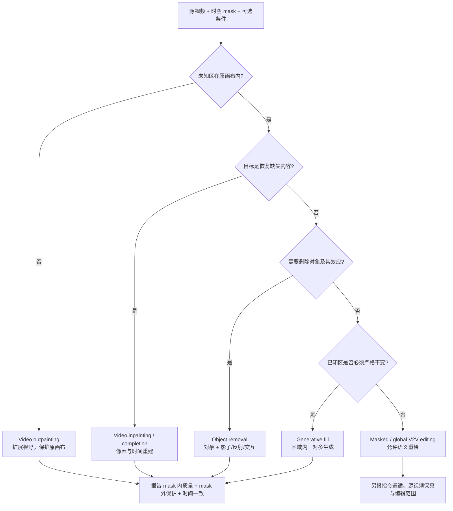
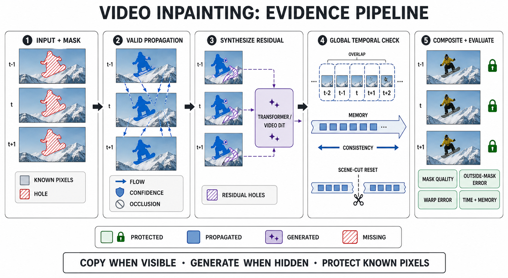
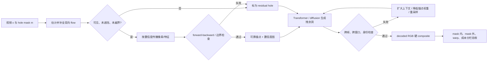

# 视频修复与补全：从可见像素传播到世界效应消除

> 本章资料与 venue / artifact 状态核验截至 **2026-08-30**。这里的 video inpainting 指：给定源视频、逐帧缺失区域及可选语义条件，在保护已知区域的同时补全未知区域。对象移除、扩画幅、V2V 编辑和产品中的 generative fill 与它相邻，但验收合同并不相同。

检索式、纳入/排除、证据等级、图像生成记录和冻结日验证见[配套研究记录](../../sources/research_20260830_video_inpainting.md)。

## 🎯 1. 学习目标

读完本章，应能：

1. 区分 video inpainting、object removal、completion / outpainting、masked V2V editing 与 generative fill；
2. 解释为什么可靠系统通常先传播可见像素，再生成真正不可见的 residual holes；
3. 把 STTN、FuseFormer、E²FGVI、ProPainter、diffusion 与 Video DiT 放进同一条机制谱系，而不是只背论文名；
4. 写出 mask、flow、置信度、重建、时序和已知区保护的 tensor 合同；
5. 设计包含 DAVIS / YouTube-VOS、受控 mask、长视频、scene cut、mask 外误差、人评和成本的公平协议；
6. 识别“画面自然”“对象真的消失”“副作用被消除”“物理后果合理”四个逐级增强、但不能互相替代的证据命题。

## 🧭 2. 先分清六个相邻任务

设视频

$$
x\in[0,1]^{T\times H\times W\times 3},
\qquad
m\in\{0,1\}^{T\times H\times W\times 1},
$$

并约定 $m_{tij}=1$ 表示允许补全的洞，$\bar m=1-m$ 表示必须保护的已知区域。模型看到的是

$$
\tilde x=\bar m\odot x,
\qquad
y\sim p_\theta(y_m\mid x_{\bar m},m,c),
$$

其中 $c$ 可以是文字、参考图、对象 ID、深度或轨迹。若目标只是还原被人工遮住的原视频，$x_m$ 有唯一可观测 ground truth；若删除真实对象后补出从未被相机看到的背景，任务是一对多条件生成，原视频并不存在唯一正确答案。

| 任务 | 输入与允许改变区 | 正确目标 | 不能偷换成 |
|---|---|---|---|
| **Video inpainting** | 视频 + 时空 mask；通常只改 $m$ | 还原或生成与已知上下文一致的缺失内容 | 每帧独立 image fill |
| **Object removal** | 对象 mask，必要时还要扩大到影子、反射、折射和交互影响 | 对象及其可归因痕迹消失，背景连续 | 只把对象像素涂掉 |
| **Video completion** | 任意缺失的时空单元，可能是空间洞、整帧或片段 | 补齐缺失体积 | 仅空间 inpainting |
| **Video outpainting** | 原画布外区域未知、原画布内已知 | 扩大视野并保持原画布 | 对原画面做全局重绘 |
| **Masked V2V editing** | 视频 + mask + 编辑条件 | 在局部执行替换、增添或重绘 | 必然恢复原始内容 |
| **Generative fill** | 产品级区域选择 + prompt / reference | 产生一个用户可接受的候选 | 可复现实验协议或唯一模型能力 |

对象 mask $m_{\text{obj}}$ 常常小于真正需要修改的支持集：

$$
m_{\text{edit}}
\supseteq
m_{\text{obj}}
\cup m_{\text{shadow}}
\cup m_{\text{reflection}}
\cup m_{\text{interaction}}.
$$

2025–2026 年对象移除研究的关键进展，正是从“补对象轮廓里的像素”走向“发现并消除对象造成的环境效应” [[28]](#ref-28), [[29]](#ref-29), [[30]](#ref-30), [[31]](#ref-31), [[32]](#ref-32), [[34]](#ref-34)。



**图的顺序化文字替代：** 先判断未知区是否在原画布外；若在外，是 outpainting。若在原画布内，再判断目标是否恢复缺失内容；是则属于 inpainting / completion。若不是，再判断是否删除对象及其副作用；是则属于 object removal。其余任务按已知区是否必须严格不变，分成区域内 generative fill 与更一般的 masked / global V2V editing。前三类和区域生成至少共同报告 mask 内质量、mask 外保护与时间一致；V2V 还要单独报告指令遵循和编辑范围。

## 🖼️ 3. 一张图读懂现代证据管线



**图注：** 现代 video inpainting 的安全默认顺序是“可见则复制、不可见才生成、已知区最终锁定”。图中的 `MASK QUALITY` 是对输入 mask 覆盖、边界和时间连续性的诊断，不是输出保护证据；`OUTSIDE-MASK ERROR` 才直接检验已知区是否被改动。颜色之外还使用了斜线、箭头、闪光和锁作为冗余编码。该图由 AI 生成，prompt、文件哈希、尺寸与原图视觉检查见[研究记录](../../sources/research_20260830_video_inpainting.md)。

**图的顺序化文字替代：**

1. 输入是连续视频帧与逐帧 hole mask；mask 外为已知像素。
2. 在相邻或远端参考帧中估计/补全 flow，只传播通过置信度与遮挡检查的像素。
3. 传播后仍不可达的 residual holes 才交给 Transformer 或 Video DiT 生成。
4. 重叠时间窗共享 memory 并做双向一致性检查；遇到 scene cut 时切断旧 flow 与 memory。
5. 解码后硬合成已知区，分别测 mask 内质量、mask 外误差、warp error、耗时与内存，而不是只看整体画质。

## 🧩 4. 四阶段 tensor 合同与误差传播

### 4.1 有效像素传播：先回答“别的帧是否真的看见了这里”

设 $F_{s\rightarrow t}$ 把参考帧 $s$ warp 到目标帧 $t$，$W(\cdot,F)$ 是可微采样器。参考像素是否可用不能只由 mask 决定，还要乘上遮挡、越界、forward–backward consistency 和 flow confidence：

$$
v_{s\rightarrow t}
=
W(\bar m_s,F_{s\rightarrow t})
\odot q_{s\rightarrow t},
\qquad 0\le q\le1.
$$

多个参考帧可以按置信度归一化聚合：

$$
b_t
=
\frac{\sum_{s\in\mathcal R(t)}
w_{s\rightarrow t}\odot
W(x_s,F_{s\rightarrow t})}
{\sum_{s\in\mathcal R(t)}w_{s\rightarrow t}+\epsilon},
\qquad
w=v.
$$

这里 $q$ 已包含在 $v$ 中，不再重复相乘；$b_t$ 是有证据的 propagated background，不是网络凭空生成的背景。Deep Flow-Guided Video Inpainting 先补全时空 flow 再传播像素 [[3]](#ref-3)；FGVC 先完成 motion edge，再构造保边的分段平滑 flow，并通过 non-local flow connection 越过局部运动边界 [[8]](#ref-8)。

### 4.2 Missing-region synthesis：只生成传播够不到的残余洞

传播可覆盖度可以写成 $a_t=\max_s v_{s\rightarrow t}$，剩余缺失区为

$$
r_t=m_t\odot(1-a_t).
$$

若 $r_t\approx0$，复制/warp 比重新绘制更容易保持纹理与身份；若一个区域在所有帧都被遮挡，flow 没有信息可搬运，必须用 learned prior 生成。STTN 用全视频 joint spatial–temporal attention 同时补多帧 [[7]](#ref-7)；FuseFormer 用重叠的 Soft Split / Soft Composition 把 patch 边界以内的细粒度信息带进 Transformer 和 feed-forward block [[9]](#ref-9)。二者都扩大了搜索与合成能力，但 attention 找到“相似 token”不等于找到了几何上正确、可见且未被污染的来源。

### 4.3 Global temporal consistency：局部帧对齐还不够

时间一致至少包含三种尺度：

- **短期对应**：相邻帧经 flow warp 后不闪烁；
- **中期遮挡闭环**：对象离开遮挡、重新出现时，纹理和身份不跳变；
- **长期状态**：跨窗口、长镜头和重复出现的文字/图案不漂移。

ProPainter 把图像域传播、特征域传播和 mask-guided sparse Transformer 组合起来，让远端可见像素先被利用，再由 Transformer 处理剩余区域 [[12]](#ref-12)。Diffusion / DiT 则在更强生成先验中联合去噪整段 latent，但若窗口间没有共享锚点、重叠去噪或显式 memory，仍会在边界重新采样出不同背景。

### 4.4 Outside-mask protection：模型输出后还要有系统级不变量

最强的像素级保护是解码后的硬合成：

$$
\hat x
=
\bar m\odot x
+
m\odot y_\theta.
$$

它能令最终 RGB 的 mask 外误差在理想算术下为零，但不能自动解决四个问题：mask 边界颜色不连续、压缩/色彩空间 round-trip、mask 误标、以及生成区域对影子/反射的真实影响。若在 latent diffusion 中仅把下采样后的 $m_z$ 拼给模型，causal VAE 的时空压缩还可能把洞与已知区混在同一 latent cell。VideoRepainter 明确把直接 mask 下采样造成的歧义作为问题，并使用 symmetric condition 处理 [[19]](#ref-19)。

扩散推理还可在每个去噪步重新锚定已知 latent：

$$
z_{k-1}
\leftarrow
m_z\odot z^{\text{gen}}_{k-1}
+
(1-m_z)\odot z^{\text{src}}_{k-1}.
$$

但最终验收仍要回到 decoded RGB；“latent 被锁住”不等于用户看到的像素没有被 decoder 改动。

### 4.5 训练损失不是一个总分

不同论文不会同时使用下列全部项，但可用这张账本检查监督落在哪里：

$$
\mathcal L
=
\lambda_h\mathcal L_{\text{hole}}
+\lambda_v\mathcal L_{\text{valid}}
+\lambda_f\mathcal L_{\text{flow}}
+\lambda_w\mathcal L_{\text{warp}}
+\lambda_p\mathcal L_{\text{perc}}
+\lambda_a\mathcal L_{\text{adv/diff}}.
$$

| 项 | 直接约束 | 典型盲点 |
|---|---|---|
| $\mathcal L_{\text{hole}}$ | 有 GT 时的洞内重建 | 对一对多补全会惩罚合理替代 |
| $\mathcal L_{\text{valid}}$ | 模型原始输出的已知区保持 | 硬 composite 后为零，可能掩盖模型泄漏 |
| $\mathcal L_{\text{flow}}$ | 已知/合成 flow 与边界 | 遮挡处没有唯一 flow GT |
| $\mathcal L_{\text{warp}}$ | 相邻或跨帧对应一致 | flow 自己错时会奖励错误对齐 |
| $\mathcal L_{\text{perc}}$ | 深层特征与纹理 | 可能放过细文字和精确颜色 |
| adversarial / diffusion | 感知真实或条件分布 | 不保证 source fidelity 或 mask 外不变 |

E²FGVI 把 flow completion、feature propagation 与 content hallucination 三个模块端到端联合优化 [[10]](#ref-10)。这降低了分阶段手工流水线的接口误差，却没有消除错误传播：错误 flow 会复制错误纹理，错误纹理会成为 attention 的高置信锚点，生成器再把它扩散到残余洞；窗口把错误结果当下一段条件时，局部伪影还会变成长程漂移。



**图的顺序化文字替代：** 视频和 mask 先产生双向 flow；只有可见、未遮挡且未越界的对应才进入传播。传播结果还要通过 forward–backward 与边界检查，不可靠位置回到 residual hole。可靠锚点与残余洞共同进入 Transformer 或 diffusion；跨帧、跨窗口和身份检查失败时，应降低错误锚点权重、扩大上下文或重采样。通过后在 decoded RGB 上硬合成，并把洞内、洞外、时序和成本分开验收。

## 🧬 5. 技术路线：不是“传统方法被 DiT 取代”

### 5.1 Patch / exemplar：把视频当三维时空纹理

Space-Time Video Completion 用可见时空块采样和全局一致优化填补大洞，奠定了“视频是 $x$-$y$-$t$ 体积”的问题形式 [[1]](#ref-1)。Newson 等人的全局 patch-based functional 改善复杂动态纹理、移动背景和高分辨率视频的自动补全效率 [[2]](#ref-2)。

这类方法的优势是直接复用真实纹理，不需要大规模训练；当源视频里从未出现目标内容、patch 对应发生语义错配或洞很大时，它无法凭低层相似性创造正确结构。现代 attention 可以看作可学习的 non-local retrieval，但它仍继承“参考中是否有可用证据”的根本限制。

### 5.2 Flow / alignment：沿真实运动搬运，而不是逐帧猜

2019–2020 年的关键问题是怎样把其他帧的真实内容对齐回来：

- Deep Flow-Guided Video Inpainting：补全 flow，再沿轨迹传播像素 [[3]](#ref-3)；
- Deep Video Inpainting（VINet）：联合学习时间结构与空间细节 [[4]](#ref-4)；
- Copy-and-Paste Networks：学习跨帧 alignment，再复制 reference content [[5]](#ref-5)；
- FGVC：显式完成 flow edge，并加入远时刻 non-local connection [[8]](#ref-8)。

它们对静态背景、相机运动后重新显露的区域和可追踪纹理很强；对无纹理、镜面、快速非刚体、运动边界、长时全遮挡和 scene cut 则容易失去可靠 correspondence。

### 5.3 3D convolution 与 non-local attention：学习生成和全局搜索

Free-Form Video Inpainting 把 3D gated convolution、temporal PatchGAN 与自由形状动态 mask 放进统一训练设置 [[6]](#ref-6)。STTN 把多帧 patch 组成 joint spatial–temporal token，自注意力一次搜索整段参考 [[7]](#ref-7)。FuseFormer 用重叠 tokenization 减少 hard patch split 带来的模糊边缘 [[9]](#ref-9)。

这一代将“哪里复制”和“怎样合成”交给网络共同学习，能处理 flow 不稳定的局部；代价是全局 attention 随 $T,H,W$ 增长，且被 mask 污染的 query 可能检索到错误参考。FGT++ 再把 flow discrepancy、flow-guided feature propagation 与时空解耦 attention 结合，表明 flow 和 Transformer 是互补关系 [[13]](#ref-13)。

### 5.4 端到端 hybrid：传播负责证据，Transformer 负责缺口

E²FGVI 的三个可训练阶段是 flow completion、feature propagation、content hallucination [[10]](#ref-10)。ProPainter 进一步使用快速 recurrent flow completion、图像/特征 dual-domain propagation 和 mask-guided sparse video Transformer [[12]](#ref-12)。这条路线至今仍是重要强基线，因为它把真实像素保真、可解释 motion correspondence 和 learned hallucination 分工，而不是让大生成模型重画整帧。

“模型参数更小/旧”不等于系统必然落后：若任务是固定机位、真实背景可在别帧观察、mask 外必须逐像素保持，传播型方法可能比开放式生成更符合合同。反过来，若大 mask 在所有帧都遮挡同一内容，传播无论多准都没有信息源。

### 5.5 Diffusion：把不可见内容变成条件分布

AVID 用 motion module、可调 structure guidance 和 Temporal MultiDiffusion 处理文字引导及任意时长窗口 [[14]](#ref-14)。FloED 以 flow branch 先恢复运动，再通过多尺度 adapter 引导 inpainting diffusion，并提出 latent interpolation 与 attention cache 降低作者设置内的成本 [[16]](#ref-16)。VipDiff 则用 flow 约束反向扩散中的噪声优化，在不微调预训练 diffusion 的情况下产生多种候选 [[18]](#ref-18)。

DiffuEraser 将传统方法的先验结果作为初始化和弱条件，再扩大时间感受野，用生成先验修复大洞与结构 [[17]](#ref-17)。准确的结论不是“diffusion 不需要 flow”，而是：flow 可以继续提供可观测证据，diffusion 负责没有对应关系的分布式生成。

### 5.6 Video DiT 与统一条件接口

VideoPainter 用只占 backbone 参数一小部分的 context encoder 处理 masked video，将背景上下文注入预训练 Video DiT，并用 target-region ID resampling 支持长视频身份保持；作者同时发布 VPData / VPBench（超过 390K clips） [[20]](#ref-20)。VACE 用 Video Condition Unit 与 Context Adapter 把 reference-to-video、V2V 与 masked V2V 放进统一 DiT 接口 [[21]](#ref-21)。

这里必须保留两条边界：

1. VACE 的 masked V2V 能执行 inpainting-like workflow，但它的里程碑首先是**统一接口**，不是专用 video inpainting benchmark 上自动胜过所有模型；
2. DiTPainter 和 EraserDiT 展示了从头训练的轻量 DiT、循环位置偏移等探索，但截至冻结日分别是 arXiv preprint / technical report，应与 SIGGRAPH、CVPR、ICCV 正式工作分栏 [[22]](#ref-22), [[23]](#ref-23)。

VideoCanvas 将任意时刻、任意空间 patch 作为 in-context condition，统一 inpainting、outpainting、transition 和任意帧条件；它截至冻结日仍按 arXiv 预印本引用，不把“统一任务定义”写成所有子任务已被解决 [[24]](#ref-24)。

## ⏳ 6. 长视频不是把短窗口循环调用

设基础模型窗口长 $L$、步长 $S<L$。第 $k$ 个窗口覆盖 $[kS,kS+L)$。最简单的 output blending 是对已完成 RGB 做加权平均；更强的 co-denoising 是让重叠 latent 在每个 solver step 共享或协调噪声轨迹。两者都叫 overlap 时，实际含义完全不同，必须报告。

| 风险 | 表面现象 | 最小处理 | 必须记录 |
|---|---|---|---|
| 窗口接缝 | 颜色、纹理或物体形状突然变 | overlap + 同一锚点 / co-denoising | $L,S$、blend 权重、是否共享 noise |
| 反复编解码 | 细节逐段变软、色偏积累 | 保留原始 source latent / 最少 round-trip | codec、重编码次数 |
| 身份漂移 | 人脸、纹理、logo 每段重采样 | keyframe、ID / reference memory | memory 内容与淘汰策略 |
| 错误传播 | 前窗伪影成为后窗“真值” | confidence decay、周期性 source re-anchor | re-anchor / reset 位置 |
| scene cut | 跨镜头 flow 把前景搬进新场景 | 切镜检测后清空 flow、KV 和 track | detector、阈值、漏检/误检 |
| 可变 mask | 物体快速移动时残留边缘 | mask union / dilation 与 uncertainty | 形态学参数、时间降采样方式 |

AVID 的 Temporal MultiDiffusion、VideoPainter 的 ID resampling 和 Unified Long Video Inpainting and Outpainting 的 overlap-and-blend high-order co-denoising，分别代表窗口采样、身份锚定和重叠求解三种不同策略 [[14]](#ref-14), [[20]](#ref-20), [[25]](#ref-25)。“any-length”或“arbitrarily long”表示算法接口可继续运行，不证明质量不会随时长下降；应报告最长实际测量点、无重置 drift curve 和接缝分位数。

Outpainting 还多一个几何问题。Unboxed 用 3D Gaussian Splatting 支持静态区扩展，再处理动态对象与视频去噪 [[26]](#ref-26)；Seen-to-Scene 重新结合 flow completion 与生成模型，强调先传播已看见的内容、再生成未看见的区域 [[27]](#ref-27)。这些是 outpainting 的直接里程碑，不应倒写成狭义 hole restoration 的普适优胜。

## 🎭 7. 2025–2026：对象之外的副作用与反事实后果

### 7.1 从对象轮廓扩展到影子、反射、光和透明效应

ROSE 将对象副作用分成影子、反射、光、透明与镜面等类型，并用 3D 渲染产生配对监督和 effect mask [[28]](#ref-28)。Object-WIPER 是 training-free 路线：利用预训练视频 DiT 的 visual–text cross-attention 与 visual self-attention 定位效果 token，反演后重置前景 token，并在去噪时复制背景 token；其 CVPR 2026 论文还提出 WIPER-Bench 与 TokSim [[29]](#ref-29)。

SVOR 针对真实 mask 缺陷、突然运动和副作用，提出时间窗 mask union、与生成分支解耦的 denoising-aware segmentation，以及无配对背景预训练后再用合成配对数据精调的两阶段 curriculum [[30]](#ref-30)。EffectErase 则构建作者报告的 60K paired VOR dataset，把视频对象插入作为移除的逆向辅助任务，并用 insertion–removal consistency 学习受影响区域 [[31]](#ref-31)。

EffectLearner（2026-08 预印本）再让 VLM 先生成结构化 object–effect context，再指导 DiT eraser，并加入 motion-aware mask / consistency；其最新性和作者报告结果不能替代正式 venue 与独立复现 [[34]](#ref-34)。

### 7.2 从视觉痕迹扩展到物理交互后果

若删除撞倒杯子的球，只擦掉球、影子和反射仍不够；杯子是否还应倒下是一个反事实动力学问题。VOID 用模拟器生成“有对象/无对象”的 counterfactual paired videos，由 VLM 找出受移除影响的区域，再指导视频 diffusion 生成物理上更合理的后果 [[32]](#ref-32)。

这项工作推进了问题定义，但仍不能从视觉偏好直接证明模型学会普适因果：模拟器覆盖、VLM effect localization、真实视频域差和一对多反事实都要分别验证。对象删除若被用于安全决策，更需要受控干预或真实环境对照；创作视频“看起来合理”只支持生成质量命题。

### 7.3 评测也从全局分数转向局部 removal coherence

PROVE 指出，full-reference 指标可能奖励保留原对象或 copy-paste，no-reference 指标可能偏好模糊，而全局时间指标会被大量未修改背景稀释。其 RC-S 在局部滑窗特征上比较修复区与背景，RC-T 跟踪相邻帧共享修复区的分布，并提供 PROVE-M / PROVE-H 两层 benchmark [[33]](#ref-33)。这是 2026 年的重要评测节点，但 RC 指标也不是“真相函数”：必须与对象残留检测、mask 外保持、GT 指标和盲人评共同校准。

## 🏁 8. 建议性的技术里程碑

下表把“改变任务定义、证据流或评测合同”的节点视为 milestone；单纯分辨率变高、demo 更漂亮或通用模型新增一个 UI 按钮不单列。

| 时间 | 代表工作 | 真正改变 | 当时仍未解决 |
|---|---|---|---|
| 2004 / 2007 | Space-Time Video Completion [[1]](#ref-1) | 将大洞补全写成全局时空 patch 一致优化 | 语义生成弱，计算重 |
| 2014 | Video Inpainting of Complex Scenes [[2]](#ref-2) | 面向动态纹理、移动对象/背景的自动全局 patch 优化 | 源视频无可复制内容时失败 |
| 2019 | DFVI / VINet / CPNet / FVI [[3]](#ref-3), [[4]](#ref-4), [[5]](#ref-5), [[6]](#ref-6) | deep flow、alignment、3D gated conv 与自由动态 mask 进入主线 | flow 误差、远距遮挡和大洞 |
| 2020 | STTN / FGVC [[7]](#ref-7), [[8]](#ref-8) | joint 时空 attention 与保 motion-edge 的 non-local flow 成为两条互补路线 | 全局 attention 成本、query 污染 |
| 2021 | FuseFormer [[9]](#ref-9) | overlap token 的细粒度融合缓解硬 patch 边缘 | 大洞仍缺生成先验 |
| 2022 | E²FGVI / DEVIL [[10]](#ref-10), [[11]](#ref-11) | flow–propagation–hallucination 端到端；评测开始控制相机/背景运动和 mask 属性 | 平均榜单仍掩盖失败尾部 |
| 2023 | ProPainter [[12]](#ref-12) | 图像/特征双域传播 + sparse Transformer 形成强 hybrid | 长视频 memory 与全遮挡内容 |
| 2024 | AVID / language-driven VI / FloED [[14]](#ref-14), [[15]](#ref-15), [[16]](#ref-16) | 文字、任意时长窗口和 flow-guided diffusion 进入直接任务 | 成本、窗口漂移、mask grounding |
| 2025 | DiffuEraser / VipDiff / VideoRepainter / VideoPainter [[17]](#ref-17), [[18]](#ref-18), [[19]](#ref-19), [[20]](#ref-20) | 传统先验 + diffusion、training-free 多样性、关键帧传播、Video DiT context injection | 各自协议不同，不能用单榜合并排序 |
| 2025 | VACE 与统一 completion [[21]](#ref-21), [[24]](#ref-24) | masked V2V 成为基础模型条件接口；任意时空 patch 被统一描述 | 通用接口不保证专用任务上限 |
| 2025–2026 | ROSE / Object-WIPER / SVOR / EffectErase [[28]](#ref-28), [[29]](#ref-29), [[30]](#ref-30), [[31]](#ref-31) | 从对象 mask 扩展到影子、反射、光与 imperfect mask | effect taxonomy、真实配对数据与泛化 |
| 2026 | VOID / PROVE [[32]](#ref-32), [[33]](#ref-33) | 从外观副作用扩展到交互反事实；从全局分数扩展到局部 removal coherence | 因果真实性与人类判断仍需独立验证 |
| 2026-08 前沿观察 | EffectLearner [[34]](#ref-34) | VLM 结构化推理对象效应，再指导 DiT eraser | 新近预印本；venue、数据域和独立复现未定 |

里程碑不是淘汰关系。Patch retrieval、flow、feature propagation、Transformer、diffusion、Video DiT、VLM reasoner 和 3D scene representation 可以出现在同一系统；关键是每个模块是否有明确输入、置信度、失败回退和独立消融。

## 🧪 9. 数据、mask 与公平评测协议

### 9.1 DAVIS 与 YouTube-VOS 不是为 inpainting 原生采集的 GT

DAVIS [[35]](#ref-35) 和 YouTube-VOS [[36]](#ref-36) 原本是视频对象分割数据。inpainting 工作通常把它们的干净 RGB 当 ground truth，再施加合成 stationary / curve / moving object masks。因此，同名“DAVIS 结果”仍可能因年份版本、训练/验证子集、分辨率、帧数、mask 文件和 crop 不同而不可比较。

至少公开：

- 数据版本、视频 ID、train/val/test split 与下载日期；
- 解码器、帧率、resize/crop、色彩空间和压缩设置；
- 每条视频的 mask seed、面积比、速度、形变、边界 dilation 与是否来自另一视频；
- 是否以原对象 segmentation 当洞，以及 target object 是否仍出现在可见上下文；
- 结果选择是单 seed、固定 $N$ 个样本、平均还是 best-of-$N$。

### 9.2 Mask 必须覆盖不同信息条件

| Mask slice | 测到什么 | 典型作弊或混淆 |
|---|---|---|
| Stationary square / blob | 相机/背景运动能否显露洞后内容 | 面积和位置过固定 |
| Moving object-like | 对象移除与时间 mask 传播 | segmentation 本身泄漏对象形状 |
| Free-form curve | 不规则细洞、划痕、字幕/水印 | 只测细纹，不测大不可见区 |
| Persistent large mask | 没有可复制来源时的生成先验 | 与小洞结果平均后被稀释 |
| Intermittent / defective | mask 漏帧、抖动和误差鲁棒性 | 预先做 union 但不报告 |
| Boundary outpainting | 新视野、几何和相机运动 | 与内部洞使用同一指标 |
| Scene-cut crossing | memory 是否错误跨镜头传播 | 测试集通常已去掉切镜 |
| Effect-expanded | 影子、反射、透明、交互影响 | 只给 object silhouette |

DEVIL 专门把 camera motion、background motion、mask displacement、pose motion 和 size 分 slice 评测，并包含 1,250 个 45–90 帧 landscape clips [[11]](#ref-11)。它比随机平均更能定位 failure mode，但仍不覆盖人物身份、文字、反射和 2026 年对象效应任务。

### 9.3 指标要按证据问题分栏

| 问题 | 建议指标 | 必须说明的边界 |
|---|---|---|
| 有 GT 的洞内重建 | masked PSNR / SSIM / LPIPS [[37]](#ref-37) | 只在 $m$ 内计算；一对多任务不应只靠 GT 距离 |
| 已知区保护 | outside-mask $L_1$/PSNR/LPIPS + mask 边缘 ring error | 同时报告模型原始输出与 hard composite 后结果 |
| 分布真实与视频特征 | VFID / FVD [[38]](#ref-38) | 写明 I3D/特征网络、checkpoint、clip 长、sample 数；“VFVD”不是可省略实现的统一名称 |
| 时间稳定 | masked warp error、patch consistency、track/identity drift | flow 错误会污染 warp metric；低纹理常数输出也可能很稳 |
| 对象/效应移除 | residual detector/segmenter、TokSim、RC-S / RC-T | 需在 WIPER/PROVE/自建 benchmark 上做人评校准 |
| 生成多样性 | 相同条件多 seed 的 coverage、pairwise LPIPS/feature diversity | 闪烁不是有意义多样性；best-of-$N$ 单列 |
| 人类判断 | 随机双盲 pairwise：自然度、移除完整、时间稳定、source 保真 | 报样本量、受试者、ties、置信区间与展示顺序 |
| 运行成本 | wall time、s/frame、FPS、峰值 VRAM、NFE、能耗 | 绑定 GPU、精度、分辨率、帧数、I/O、codec 和预处理 |

推荐显式计算 mask 外误差：

$$
E_{\text{out}}
=
\frac{\lVert\bar m\odot(\hat x-x)\rVert_1}
{3\sum\bar m+\epsilon},
$$

并另取 mask 边缘内外各 $d$ 像素的 ring，检查边缘漏色。全帧 PSNR 会被大量不变背景主导；全局 temporal score 同样可能看不见只发生在洞内的一帧闪烁。

### 9.4 最小可复核实验矩阵

1. **三条基线**：copy/nearest warp、专用传播模型、生成式 diffusion / DiT；
2. **两种信息条件**：洞在别帧可见 vs 全时不可见；
3. **至少六个 slice**：小/大 mask、慢/快运动、低/高相机运动、短/长遮挡、无/有切镜、干净/缺陷 mask；
4. **三条输出路径**：model raw、decoded hard composite、人工修正后版本，不得混报；
5. **长视频曲线**：随帧数或窗口数画 mask LPIPS、$E_{\text{out}}$、warp error、ID drift、峰值显存和累计时间；
6. **失败尾部**：平均值之外报告 p90/p95、最差预注册样例与首次失效窗口；
7. **消融**：flow、confidence、propagation、global attention、overlap、memory、known-region anchor 分别关闭；
8. **人评校准**：指标排序与盲人评不一致时，不以单一自动分数裁决。

## ⚠️ 10. 典型失败模式及其根因

| 失败 | 可能根因 | 定位实验 | 修复方向 |
|---|---|---|---|
| 洞内拖影/鬼影 | flow 穿过运动边界、旧对象被复制 | 看 completed flow、confidence 与 object residual | edge-aware flow、双向检查、effect-expanded mask |
| 大洞结构塌陷 | 所有帧均不可见，传播没有证据 | 按 temporal visibility 分 slice | 强生成 prior、参考图/文字、明确一对多采样 |
| 逐帧闪烁 | 每帧独立采样或噪声不共享 | 固定单帧质量，比较 masked warp/track | joint denoise、flow adapter、共享 noise/memory |
| 窗口接缝 | overlap 只在 RGB 后处理，latent 状态不一致 | seam-only 指标与窗口边界可视化 | co-denoising、共享锚点、重叠状态融合 |
| mask 外颜色变化 | VAE/decoder、全帧重绘、色彩 round-trip | raw 与 hard-composite 的 $E_{\text{out}}$ 分栏 | decoded RGB composite、保留原始编码 |
| 边缘 halo | mask 太紧、alpha/运动模糊未覆盖 | 多 dilation 半径曲线 | soft/uncertain boundary、边缘损失与 blend |
| 影子/反射残留 | $m_{\text{edit}}=m_{\text{obj}}$ 假设错误 | effect-labeled benchmark | effect localization / reasoning [[28]](#ref-28), [[29]](#ref-29), [[34]](#ref-34) |
| 突然运动仍残留对象 | 时间下采样漏掉某帧 mask | 注入 mask dropout / jitter | temporal mask union、mask degradation [[30]](#ref-30) |
| 相机旋转后背景不对 | 2D flow 无法解释视差与新视野 | 按 camera motion / depth 分 slice | 3D/4D scene prior、深度与多视图锚定 |
| scene cut 后出现旧纹理 | 跨镜头复用 flow/KV/reference | 人工插入切镜并读 cache | cut reset、shot-level 独立处理 |
| 人脸/身份漂移 | 生成器在每段重新采样 ID | face/track embedding 随时间曲线 | keyframe、ID reference、长期 memory |
| 文字变形 | perceptual loss 对精确 glyph 不敏感 | OCR 字符准确率 + track | copy-first、高分辨率局部重算、OCR constraint |
| 物理交互错误 | 只删视觉对象，没有反事实状态 | collision/contact counterfactual set | 受影响区推理、配对模拟与世界状态建模 [[32]](#ref-32) |

## 🛡️ 11. 从论文 demo 到可交付系统的验收

### 输入合同

- mask 是 hole=1 还是 known=1；逐帧尺寸、alpha 与时间戳必须显式；
- source video、mask、prompt、reference 的帧率和 crop 完全对齐；
- 记录自动 segmentation、人工修改、dilation 和 effect expansion；
- scene cut 前后拆 shot，除非方法明确建模跨镜头语义而非像素 correspondence。

### 运行账本

- flow / segmentation / VLM / diffusion / decoder 各自版本与权重；
- window、stride、overlap、reference sampling、seed、NFE、guidance；
- 是否逐视频优化、LoRA、外部图像编辑器、人工关键帧或 best-of-$N$；
- 峰值显存、预处理/生成/后处理时间和失败重试次数。

### 输出不变量

1. decoded RGB 中，mask 外与源视频逐像素或在预注册容差内一致；
2. mask 边界没有残色、halo、对象碎片和 sudden alpha jump；
3. 对象移除同时检查影子、反射、折射、光照和接触/碰撞后果；
4. 窗口接缝、scene cut、遮挡结束和对象再出现位置逐帧审阅；
5. 交付源视频、mask、raw output、hard-composite output、配置和失败案例，而不只交一个精选 MP4。

## 🔬 12. 仍未解决的研究问题

1. **可见性与生成的软切换**：怎样让 flow confidence 真正校准，而不是错误复制与生成二选一？
2. **大洞的一对多评测**：没有唯一 GT 时，怎样同时衡量合理性、覆盖度和 source compatibility？
3. **真实对象效应**：长尾影子、反射、液体、烟雾、布料形变和间接光如何获得配对监督？
4. **反事实动力学**：删除参与碰撞或支撑的对象后，哪些下游状态应该改变，哪些必须保持？
5. **长视频状态**：应保存像素、flow、feature、DiT KV、对象 graph、3D scene 还是它们的置信度混合？
6. **跨镜头编辑**：怎样在切断低层 correspondence 的同时保持同一角色、地点和创作意图？
7. **文字与规则结构**：怎样保证小字体、logo、网格、建筑线条和重复纹理不被“语义正确但像素错误”的先验重画？
8. **评价与人类感知**：RC、TokSim、VFID/FVD、warp 和 VLM judge 在哪些 slice 会系统性失真？
9. **权利与可追溯性**：被删除/补出的内容如何保留 provenance、版本、mask 与操作日志？

## 📚 13. 建议阅读路径

### 建立机制直觉

```text
Space-Time Completion / Newson
        → DFVI / FGVC
        → STTN / FuseFormer
        → E²FGVI / ProPainter
        → AVID / FloED / DiffuEraser
        → VideoPainter / VACE
        → effect-aware removal / counterfactual deletion
```

### 做研究时的最短闭环

1. 先用 E²FGVI / ProPainter 建立 copy-first 强基线；
2. 用 AVID、FloED、DiffuEraser 理解 flow 与 diffusion 的互补；
3. 用 VideoPainter、VACE 理解 Video DiT 的 context injection 与统一条件接口；
4. 用 DEVIL、PROVE 和自建 visibility / scene-cut slice 做诊断，而非只追平均榜单；
5. 对 object removal 再加入 WIPER/ROSE/SVOR/EffectErase 类 effect benchmark；
6. 若声称物理或因果正确，加入受控 counterfactual 数据，不以创作型人评替代干预证据。

## 参考文献

<a id="ref-1"></a>[1] [Space-Time Video Completion](https://www.wisdom.weizmann.ac.il/~vision/VideoCompletion.html). Yonatan Wexler, Eli Shechtman, Michal Irani. CVPR. 2004；扩展版发表于 TPAMI 2007。

<a id="ref-2"></a>[2] [Video Inpainting of Complex Scenes](https://arxiv.org/abs/1503.05528). Alasdair Newson, Andrés Almansa, Matthieu Fradet, Yann Gousseau, Patrick Pérez. SIAM Journal on Imaging Sciences. 2014.

<a id="ref-3"></a>[3] [Deep Flow-Guided Video Inpainting](https://openaccess.thecvf.com/content_CVPR_2019/html/Xu_Deep_Flow-Guided_Video_Inpainting_CVPR_2019_paper.html). Rui Xu, Xiaoxiao Li, Bolei Zhou, Chen Change Loy. CVPR. 2019.

<a id="ref-4"></a>[4] [Deep Video Inpainting](https://openaccess.thecvf.com/content_CVPR_2019/html/Kim_Deep_Video_Inpainting_CVPR_2019_paper.html). Dahun Kim, Sanghyun Woo, Joon-Young Lee, In So Kweon. CVPR. 2019.

<a id="ref-5"></a>[5] [Copy-and-Paste Networks for Deep Video Inpainting](https://openaccess.thecvf.com/content_ICCV_2019/html/Lee_Copy-and-Paste_Networks_for_Deep_Video_Inpainting_ICCV_2019_paper.html). Sungho Lee, Seoung Wug Oh, DaeYeun Won, Seon Joo Kim. ICCV. 2019.

<a id="ref-6"></a>[6] [Free-Form Video Inpainting with 3D Gated Convolution and Temporal PatchGAN](https://openaccess.thecvf.com/content_ICCV_2019/html/Chang_Free-Form_Video_Inpainting_With_3D_Gated_Convolution_and_Temporal_PatchGAN_ICCV_2019_paper.html). Ya-Liang Chang, Zhe Yu Liu, Kuan-Ying Lee, Winston Hsu. ICCV. 2019.

<a id="ref-7"></a>[7] [Learning Joint Spatial-Temporal Transformations for Video Inpainting](https://www.ecva.net/papers/eccv_2020/papers_ECCV/html/2590_ECCV_2020_paper.php). Yanhong Zeng, Jianlong Fu, Hongyang Chao. ECCV. 2020.

<a id="ref-8"></a>[8] [Flow-edge Guided Video Completion](https://www.ecva.net/papers/eccv_2020/papers_ECCV/papers/123570698.pdf). Chen Gao, Ayush Saraf, Jia-Bin Huang, Johannes Kopf. ECCV. 2020.

<a id="ref-9"></a>[9] [FuseFormer: Fusing Fine-Grained Information in Transformers for Video Inpainting](https://openaccess.thecvf.com/content/ICCV2021/html/Liu_FuseFormer_Fusing_Fine-Grained_Information_in_Transformers_for_Video_Inpainting_ICCV_2021_paper.html). Rui Liu et al. ICCV. 2021.

<a id="ref-10"></a>[10] [Towards an End-to-End Framework for Flow-Guided Video Inpainting](https://openaccess.thecvf.com/content/CVPR2022/html/Li_Towards_an_End-to-End_Framework_for_Flow-Guided_Video_Inpainting_CVPR_2022_paper.html). Zhen Li, Cheng-Ze Lu, Jianhua Qin, Chun-Le Guo, Ming-Ming Cheng. CVPR. 2022.

<a id="ref-11"></a>[11] [The DEVIL Is in the Details: A Diagnostic Evaluation Benchmark for Video Inpainting](https://openaccess.thecvf.com/content/CVPR2022/html/Szeto_The_DEVIL_Is_in_the_Details_A_Diagnostic_Evaluation_Benchmark_CVPR_2022_paper.html). Ryan Szeto, Jason J. Corso. CVPR. 2022.

<a id="ref-12"></a>[12] [ProPainter: Improving Propagation and Transformer for Video Inpainting](https://openaccess.thecvf.com/content/ICCV2023/html/Zhou_ProPainter_Improving_Propagation_and_Transformer_for_Video_Inpainting_ICCV_2023_paper.html). Shangchen Zhou, Chongyi Li, Kelvin C. K. Chan, Chen Change Loy. ICCV. 2023.

<a id="ref-13"></a>[13] [Exploiting Optical Flow Guidance for Transformer-Based Video Inpainting](https://arxiv.org/abs/2301.10048). Kaidong Zhang, Jialun Peng, Jingjing Fu, Dong Liu. TPAMI. 2024.

<a id="ref-14"></a>[14] [AVID: Any-Length Video Inpainting with Diffusion Model](https://openaccess.thecvf.com/content/CVPR2024/html/Zhang_AVID_Any-Length_Video_Inpainting_with_Diffusion_Model_CVPR_2024_paper.html). Zhixing Zhang et al. CVPR. 2024.

<a id="ref-15"></a>[15] [Towards Language-Driven Video Inpainting via Multimodal Large Language Models](https://openaccess.thecvf.com/content/CVPR2024/html/Wu_Towards_Language-Driven_Video_Inpainting_via_Multimodal_Large_Language_Models_CVPR_2024_paper.html). Jianzong Wu et al. CVPR. 2024.

<a id="ref-16"></a>[16] [Coherent Video Inpainting Using Optical Flow-Guided Efficient Diffusion](https://arxiv.org/abs/2412.00857). Bohai Gu, Hao Luo, Song Guo, Peiran Dong, Qihua Zhou. arXiv preprint. 2024；版本核验至 v3（2025-03）。

<a id="ref-17"></a>[17] [DiffuEraser: A Diffusion Model for Video Inpainting](https://arxiv.org/abs/2501.10018). Xiaowen Li, Haolan Xue, Peiran Ren, Liefeng Bo. arXiv preprint. 2025.

<a id="ref-18"></a>[18] [VipDiff: Towards Coherent and Diverse Video Inpainting via Training-free Denoising Diffusion Models](https://arxiv.org/abs/2501.12267). Chaohao Xie, Kai Han, Kwan-Yee K. Wong. WACV. 2025.

<a id="ref-19"></a>[19] [Keyframe-Guided Creative Video Inpainting](https://openaccess.thecvf.com/content/CVPR2025/html/Guo_Keyframe-Guided_Creative_Video_Inpainting_CVPR_2025_paper.html). Yuwei Guo et al. CVPR. 2025.

<a id="ref-20"></a>[20] [VideoPainter: Any-length Video Inpainting and Editing with Plug-and-Play Context Control](https://doi.org/10.1145/3721238.3730673). Yuxuan Bian, Zhaoyang Zhang, Xuan Ju, Mingdeng Cao, Liangbin Xie, Ying Shan, Qiang Xu. SIGGRAPH Conference Papers. 2025.

<a id="ref-21"></a>[21] [VACE: All-in-One Video Creation and Editing](https://openaccess.thecvf.com/content/ICCV2025/papers/Jiang_VACE_All-in-One_Video_Creation_and_Editing_ICCV_2025_paper.pdf). Zeyinzi Jiang, Zhen Han, Chaojie Mao, Jingfeng Zhang, Yulin Pan, Yu Liu. ICCV. 2025.

<a id="ref-22"></a>[22] [DiTPainter: Efficient Video Inpainting with Diffusion Transformers](https://arxiv.org/abs/2504.15661). Xian Wu, Chang Liu. arXiv preprint. 2025.

<a id="ref-23"></a>[23] [EraserDiT: Fast Video Inpainting with Diffusion Transformer Model](https://arxiv.org/abs/2506.12853). Jie Liu, Zheng Hui. Technical report. 2025.

<a id="ref-24"></a>[24] [VideoCanvas: Unified Video Completion from Arbitrary Spatiotemporal Patches via In-Context Conditioning](https://arxiv.org/abs/2510.08555). Minghong Cai et al. arXiv preprint. 2025；版本核验至 v2（2026-05）。

<a id="ref-25"></a>[25] [Unified Long Video Inpainting and Outpainting via Overlapping High-Order Co-Denoising](https://arxiv.org/abs/2511.03272). Shuangquan Lyu, Steven Mao, Yue Ma. arXiv preprint. 2025.

<a id="ref-26"></a>[26] [Unboxed: Geometrically and Temporally Consistent Video Outpainting](https://openaccess.thecvf.com/content/CVPR2025/html/Yu_Unboxed_Geometrically_and_Temporally_Consistent_Video_Outpainting_CVPR_2025_paper.html). Zhongrui Yu, Martina Megaro-Boldini, Robert W. Sumner, Abdelaziz Djelouah. CVPR. 2025.

<a id="ref-27"></a>[27] [Seen-to-Scene: Keep the Seen, Generate the Unseen for Video Outpainting](https://arxiv.org/abs/2604.14648). Inseok Jeon, Minhyeok Lee, Seunghoon Lee, Minseok Kang, Suhwan Cho, Sangyoun Lee. CVPR Findings. 2026.

<a id="ref-28"></a>[28] [ROSE: Remove Objects with Side Effects in Videos](https://arxiv.org/abs/2508.18633). Chenxuan Miao et al. arXiv preprint. 2025.

<a id="ref-29"></a>[29] [Object-WIPER: Training-Free Object and Associated Effect Removal in Videos](https://openaccess.thecvf.com/content/CVPR2026/papers/Kushwaha_Object-WIPER_Training-Free_Object_and_Associated_Effect_Removal_in_Videos_CVPR_2026_paper.pdf). Saksham Singh Kushwaha, Sayan Nag, Yapeng Tian, Kuldeep Kulkarni. CVPR. 2026.

<a id="ref-30"></a>[30] [From Ideal to Real: Stable Video Object Removal under Imperfect Conditions](https://arxiv.org/abs/2603.09283). Jiagao Hu et al. arXiv preprint. 2026.

<a id="ref-31"></a>[31] [EffectErase: Joint Video Object Removal and Insertion for High-Quality Effect Erasing](https://henghuiding.com/EffectErase/). Yang Fu, Yike Zheng, Ziyun Dai, Henghui Ding. CVPR. 2026.

<a id="ref-32"></a>[32] [VOID: Video Object and Interaction Deletion](https://arxiv.org/abs/2604.02296). Saman Motamed, William Harvey, Benjamin Klein, Luc Van Gool, Zhuoning Yuan, Ta-Ying Cheng. arXiv preprint. 2026.

<a id="ref-33"></a>[33] [PROVE: A Perceptual RemOVal cohErence Benchmark for Visual Media](https://arxiv.org/abs/2605.14534). Fuhao Li et al. ACM Multimedia. 2026.

<a id="ref-34"></a>[34] [EffectLearner: World-Aware Object-Effect Reasoning for Real-World Video Object Removal](https://arxiv.org/abs/2608.05565). Feier Wu et al. arXiv preprint. 2026.

<a id="ref-35"></a>[35] [A Benchmark Dataset and Evaluation Methodology for Video Object Segmentation](https://openaccess.thecvf.com/content_cvpr_2016/html/Perazzi_A_Benchmark_Dataset_CVPR_2016_paper.html). Federico Perazzi et al. CVPR. 2016.

<a id="ref-36"></a>[36] [YouTube-VOS: Sequence-to-Sequence Video Object Segmentation](https://arxiv.org/abs/1809.00461). Ning Xu et al. ECCV. 2018.

<a id="ref-37"></a>[37] [The Unreasonable Effectiveness of Deep Features as a Perceptual Metric](https://openaccess.thecvf.com/content_cvpr_2018/html/Zhang_The_Unreasonable_Effectiveness_CVPR_2018_paper.html). Richard Zhang, Phillip Isola, Alexei A. Efros, Eli Shechtman, Oliver Wang. CVPR. 2018.

<a id="ref-38"></a>[38] [Towards Accurate Generative Models of Video: A New Metric and Challenges](https://arxiv.org/abs/1812.01717). Thomas Unterthiner et al. arXiv preprint. 2018.
