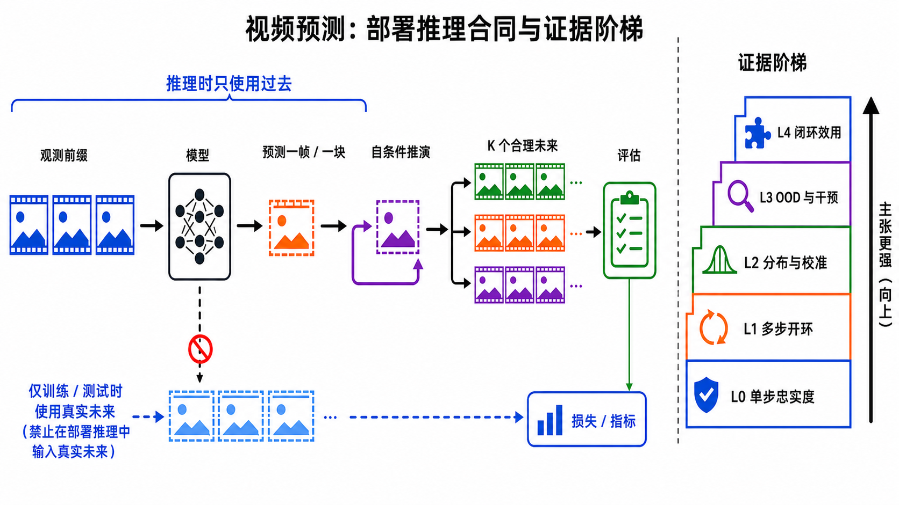
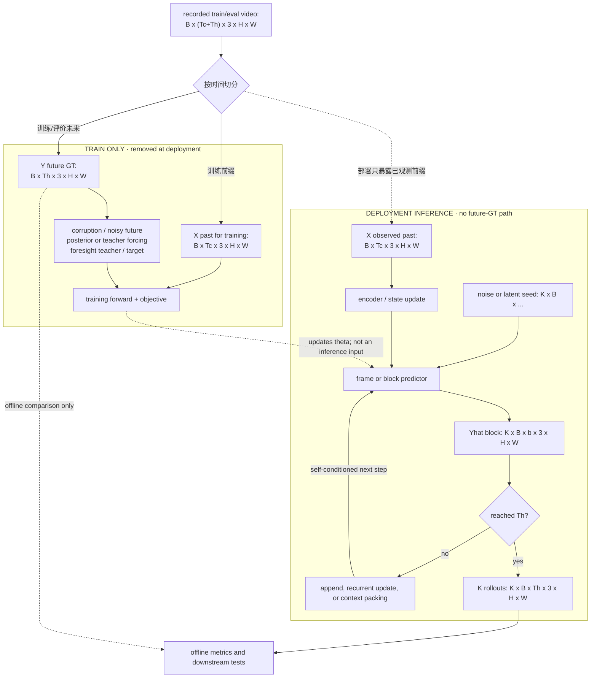
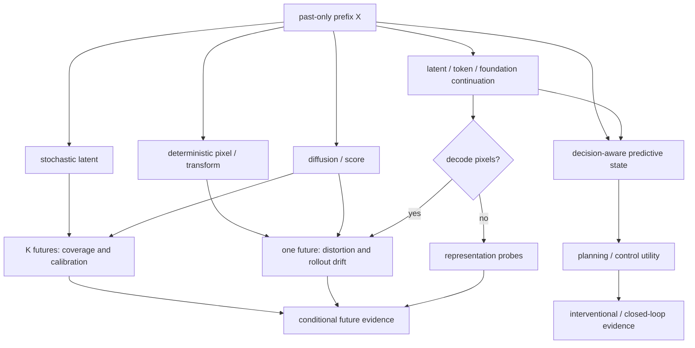

# 视频预测：从过去可见帧到可检验的未来分布

> 本章冻结于 **2026-08-30（Asia/Shanghai）**。这里的 video prediction 特指：部署时只看见观测前缀，预测其后的未来观测或与未来观测对应的状态。画面“像视频”只是最低门槛；若要声称模型学会长期动力学、物理或规划，还必须逐级补上分布、干预和闭环证据。

检索式、结果数、纳排规则、逐篇标题/ID/venue 核验、FramePack 版本史、图片生成记录和验收命令见[配套研究记录](../../sources/research_20260830_video_prediction.md)。

## 🎯 学习目标

读完本章，应能完成六件事：

1. 用“测试时可见什么”和“输出是什么”区分预测、插值、条件生成、latent prediction 与 world model；
2. 写出逐帧、分块、一次性和随机 rollout 的完整 tensor contract，并发现未来帧泄漏；
3. 把 deterministic pixel/transform、stochastic latent、diffusion/score、latent/token/foundation continuation 与 decision-aware prediction 放进同一坐标系；
4. 解释 teacher forcing、scheduled sampling、self forcing 与 Diffusion Forcing 解决的是不同问题；
5. 按单步保真、多步开环、分布校准、OOD/干预、闭环效用五级组织证据；
6. 对任何“长视频世界模型”主张提出可复现的里程碑验收，而不是接受精选样例。

## 📐 1. 精确定义：过去是唯一的推理输入

设 RGB 观测前缀和未来目标分别为

$$
X=x_{1:T_c}\in[0,1]^{B\times T_c\times3\times H\times W},\qquad
Y=x_{T_c+1:T_c+T_h}.
$$

确定性预测器输出一个点估计

$$
\hat Y=f_\theta(X),
$$

随机预测器则学习条件分布 $p_\theta(Y\mid X)$，测试时应报告
$K$ 个独立或有设计的样本
$\{\hat Y^{(k)}\}_{k=1}^{K}$。严格限制针对的是**部署推理**：真实未来 $Y$
或其编码不得作为部署路径的模型输入。训练期可以把 $Y$ 用于损失目标、扩散加噪/腐蚀输入、变分 posterior、teacher forcing，或构造 stop-gradient foresight teacher/target，但这些都必须标为 **train-only** 并在部署时移除。离线评价可以用 $Y$ 比较预测，也不得回流到当次推理。

“预测一帧”和“预测一块”还需显式写出块长 $b$：

$$
\hat x_{t+1:t+b}\sim
p_\theta(\cdot\mid c_t),\qquad
c_{t+b}=U(c_t,\hat x_{t+1:t+b}).
$$

$U$ 可以把生成帧追加到滑动窗口、更新递归状态，或把历史压缩进固定预算的 memory。若训练时 $U$ 接收真实帧、测试时却接收生成帧，就存在 forcing gap；若论文没有写清 $b$、窗口长度、状态是否重置和采样随机性，所谓“长 rollout”不可复现。

### 1.1 六个相邻概念的边界

| 名称 | 测试时条件 | 输出 | 何时属于本章 | 最常见的越界表述 |
|---|---|---|---|---|
| **Video prediction** | 仅过去观测；可另有已声明外生变量 | 未来像素或对应未来状态 | 目标时间严格晚于最后一帧条件 | 把测试未来帧的 feature 当成“辅助条件” |
| **Video frame interpolation（VFI）** | 查询时刻两侧都有真实端点 | 端点之间的帧 | 不属于；它是双侧条件重建 | 用插值结果证明外推能力 |
| **Future frame synthesis** | 术语本身不限定条件 | 一个或多个“未来”画面 | 只有 past-only 时才与 prediction 同义 | 文本、终点图、pose 或完整轨迹也输入，却仍叫无条件预测 |
| **Action-conditioned prediction** | 过去观测加未来动作 $a_{T_c:T_c+T_h-1}$ | 动作条件下的未来 | 是预测的条件化子类，合同为 $p(Y\mid X,A)$ | 与被动 $p(Y\mid X)$ 混算；把相关性当干预效应 |
| **World model** | 状态/观测、动作，常含 reward/termination | 可用于决策的状态转移或观测 | 只有预测进入 planning/control 并验证 utility 时 | 一段逼真视频直接升级成“可规划世界模型” |
| **Latent state prediction** | 过去像素或 latent | 未来 $z$、token、trajectory | $z_t$ 与未来观测/任务目标有明确定义 | 没有 decoder 或 probe 仍声称像素正确 |
| **Generative continuation** | 图像/视频前缀，可叠加文本等 | 视觉上合理的后续 | 只在条件合同与真实未来分布匹配时 | 把 prompt adherence、审美或任意续写当预测准确性 |

一个随机预测器当然会“生成续写”，但生成续写并不自动是预测证据。前者可追求条件下的可看性；后者必须说明数据生成过程、时间因果方向，以及采样分布是否覆盖真实可能未来。

若提供未来动作，合同变为

$$
p_\theta(Y\mid X,A),\qquad
A=a_{T_c:T_c+T_h-1}\in\mathbb R^{B\times T_h\times d_a}.
$$

这允许比较不同动作的反事实后果，但仍不保证因果可识别：行为策略覆盖不足、动作与隐藏状态混杂、观测缺失，都可能让模型只记住数据相关性。PlaNet 把 stochastic/deterministic latent dynamics 接到 online planning，是“预测如何成为决策模型”的早期正式范例；它不是被动视频预测 benchmark 的同义词 [[9]](#ref-9)。



**图注：** 该 PNG 只画**部署推理主路径 + 离线评价**，因此左侧先检查“未来真值不进入部署推理”，再检查模型是否以自己的输出继续 rollout，并为多峰未来保留多个样本。图中没有展开训练期的 corruption/posterior/teacher/target 分支；完整训练合同见下方 Mermaid。右侧是主张强度而非单一排行榜：L0 好看不能推出 L4 可用于决策；每上升一级都要增加新的实验，而不是替换一项指标。

**图的顺序化文字替代：**

1. 观测前缀是推理时唯一的真实视频输入。
2. 模型预测下一帧或下一块，并把自己的生成结果用于下一次预测。
3. 随机模型从同一前缀产生 $K$ 个可能未来，再交给评估器。
4. 真实未来在这张“部署推理 + 离线评价”图中只进入 loss/metric，不能回到当次部署推理；训练期可有另外的 train-only 未来监督路径。
5. 证据依次从 L0 单步保真、L1 多步开环、L2 分布与校准、L3 OOD 与干预，上升到 L4 闭环效用。

## 🧩 2. Tensor、训练与 rollout 合同



**顺序化文字替代：**

1. 把完整训练片段沿时间切成 $X$ 与 $Y$，并保留原始时间戳/FPS。
2. 在 train-only 分支中，$Y$ 可进入加噪/腐蚀、posterior、teacher forcing、foresight teacher/target 或损失；它们只用来学习参数。
3. 部署时删除整个 train-only 分支，只把 $X$、随机种子和已生成状态交给 predictor，输出长度为 $b$ 的帧块。
4. 把预测块追加、递归更新或压缩进上下文，再预测下一块。
5. 重复到 $T_h$，得到形状为 $K\times B\times T_h\times3\times H\times W$ 的样本集；离线评价再与 $Y$ 比较，不回流到该次 rollout。

### 2.1 四种实现合同

| 合同 | 训练输出 | 推理状态 | 关键复现字段 | 典型风险 |
|---|---|---|---|---|
| **Direct / one-shot** | 一次输出全部 $T_h$ 帧 | 无自回灌 | $T_h$ 是否固定、时间位置编码 | 训练视野之外无法自然延长 |
| **Frame autoregression** | 下一帧 $b=1$ | 生成帧或 recurrent state | warm-up、窗口、状态 reset、sampling | 误差逐帧复合，吞吐低 |
| **Block autoregression** | 下一块 $b>1$ | 生成块与压缩历史 | 块重叠、边界融合、block FPS | 块内一致但块间跳变 |
| **Latent/token rollout** | $z$ 或离散/连续 token | latent KV cache 或 state | encoder 是否冻结、decoder、token 顺序 | latent 好但像素/物理不可读 |

Latent 合同至少应写成

$$
z_t=E(x_t),\quad
\hat z_{T_c+1:T_c+T_h}=g_\theta(z_{1:T_c}),\quad
\hat x_t=D(\hat z_t)\ \text{（若声称像素预测）}.
$$

如果 $E$ 在训练中同时看见未来或是非因果序列编码器，必须说明未来信息只构造 stop-gradient target，还是进入了 predictor 的输入。Video-Mirai 的做法属于训练期 foresight distillation：冻结的非因果 encoder 读取完整 rollout 构造目标，但部署 predictor 仍只看因果历史；这是一种训练监督，不是测试时预知未来 [[24]](#ref-24)。

### 2.2 forcing 不是一个开关

| 名称 | 当前预测所见历史 | 主要目标 | 不能自动保证什么 |
|---|---|---|---|
| **Teacher forcing** | 真实历史帧/token | 稳定的单步最大似然或重建训练 | 自回灌时的状态分布一致 |
| **Scheduled sampling** | 按课程混合真实与生成历史 | 缩小 train–test 输入差异 [[7]](#ref-7) | 一致概率估计、无偏梯度或长期稳定 |
| **Self forcing** | 训练也条件于模型自己生成的输出 | 直接优化 rollout 分布 | 所有架构都能低成本训练 |
| **Diffusion Forcing** | 每个 token 可处于不同噪声等级 | 用统一扩散目标训练因果序列模型 [[15]](#ref-15) | 与 scheduled/self forcing 完全等价 |
| **Causal distillation** | 因果 student 学双向/多步 teacher | 减少每帧去噪步数、支持流式生成 | student 已学到真实可干预动力学 |

Self Forcing 用自回归 rollout、KV cache、少步 diffusion 和 stochastic gradient truncation 训练 video-level objective，正式发表于 NeurIPS 2025 [[19]](#ref-19)。Diffusion Forcing 则给序列中每个 token 独立噪声等级，使过去不必全部加噪、未来可以逐个或分块生成；它优化的是扩散式序列目标，不能只因为名字相似就写成“scheduled sampling 的扩散版” [[15]](#ref-15)。

## 🧭 3. 技术路线：表示、随机性与 rollout 是三条正交轴



**顺序化文字替代：**

1. 所有路线都从只含过去的前缀开始。
2. 确定性像素/变换方法输出一个未来；随机 latent 与 diffusion 输出一个条件分布。
3. latent/token 路线若解码到像素，就接受像素与分布评价；若不解码，只能接受 representation probe。
4. decision-aware 路线把预测状态接入规划或控制，接受 success、return、regret 和安全评价。
5. 多条路线可以组合；例如 latent diffusion 既属于 latent 表示，也属于 score-based 随机建模。

### 3.1 Deterministic pixel 与 transform：先验强、基线仍然重要

ConvLSTM 把二维卷积写进 LSTM 的输入到状态、状态到状态转移，在降水 nowcasting 上展示了空间递归预测 [[1]](#ref-1)。它奠定的是 tensor 归纳偏置，不是“通用世界模型”。PredNet 用分层 predictive coding 预测下一帧并研究无监督表征 [[4]](#ref-4)。SimVP 则用纯 CNN encoder–translator–decoder 和 MSE 在统一协议中取得强结果，提醒我们：复杂 recurrent/attention 结构若没有严格同分辨率、同 horizon、同训练预算对照，不能凭新颖性宣称进步 [[12]](#ref-12)。

逐像素 L1/L2 在多未来场景会把互斥运动平均成模糊图。Beyond MSE 组合多尺度、gradient-difference 与 adversarial loss，使预测更锐利；原论文结果不能被概括为“对抗损失解决了模糊和长期预测” [[2]](#ref-2)。锐利度提高也可能来自生成未被历史支持的纹理。

Transform 路线不直接从零画下一帧，而是预测如何搬运已观测像素。Finn 等人的 DNA/CDNA/STP 在机器人交互数据上学习 action-conditioned pixel motion：局部动态卷积核、多个变换加 mask，或空间变换参数 [[3]](#ref-3)。它们在物体延续和局部运动上有强先验，但对新显露区域、拓扑变化、光照与不可复制内容仍需生成分支。

### 3.2 Stochastic latent：把不可约多未来显式化

Deep Kalman Filters 先把变分推断与非线性 stochastic state transition 接到序列观测，提供了 latent state-space 的通用概率模板 [[8]](#ref-8)。SV2P 把随机 latent variable 加入多帧真实视频预测，同时研究 action-free 与 action-conditioned 设置 [[5]](#ref-5)。SVG 的 learned prior 进一步令每时刻 latent prior 依赖历史，并把 deterministic dynamics 与 stochastic residual 分开 [[6]](#ref-6)。一般目标可写成

$$
\mathbb E_{q_\phi(Z\mid X,Y)}[\log p_\theta(Y\mid X,Z)]
-\sum_t\mathrm{KL}\!\left(q_\phi(z_t\mid X,Y_{\le t})\,\|\,
p_\theta(z_t\mid X,\hat Y_{<t})\right).
$$

训练 posterior 看见真实未来，部署 prior 看不见；二者错配、posterior collapse 与 best-of-$K$ 挑样都会让“多样”看起来比实际分布校准更好。至少同时报告 sample-average、best-of-$K$、$K$ 值、样本内/样本间多样性，以及覆盖与准确的权衡。

这条 direct stochastic-future 路线在 2019–2026 又分成 deep hierarchy、fully latent residual dynamics、clockwork/event temporal abstraction 与 object/module latent。categorical RSSM 是共享变分 state-space 数学、但以 action/reward/return 验收的相邻控制支线；LPWM 的 object-particle + latent-action ELBO 是二者的桥接点。严格纳入门、论文协议和 `Forking-Squares-v1` 反证实验见[变分随机视频生成](../generative-models/variational-generation.md)。名字里只有 VAE/latent、但没有 future-aware posterior + 不看未来的 deployment prior + KL/ELBO 的系统，不应并入 direct 主线。

### 3.3 Diffusion / score：高保真条件分布与高昂 rollout

Video Diffusion Models 把 image diffusion 扩展到时空生成并包含 conditional video prediction，正式发表于 NeurIPS 2022 [[13]](#ref-13)。其标准噪声目标是

$$
y^{(\tau)}=\alpha_\tau y+\sigma_\tau\epsilon,\qquad
\mathcal L=\mathbb E\|\epsilon-\epsilon_\theta(y^{(\tau)},\tau,X)\|_2^2.
$$

这里的 diffusion time $\tau$ 与视频时间 $t$ 不同。推理时每个未来帧/块需要多次去噪；长视频再乘以 autoregressive block 数，延迟与误差都会增长。

**MCVD 是这条路线不可跳过的节点。** Masked Conditional Video Diffusion 独立掩掉整段过去条件或整段未来条件：只掩未来执行预测，只掩过去执行 backward prediction，两侧都掩执行无条件生成，两侧都保留执行插值。它以非递归 2D convolution 对帧块条件生成，再以 block-wise autoregression 延长视频，正式发表于 NeurIPS 2022 [[14]](#ref-14)。统一 mask 接口不等于四项任务难度相同，也不消除块间 drift；比较时必须锁定 condition length、prediction block、递归次数与采样预算。

CausVid 从慢的双向 diffusion teacher 蒸馏 few-step causal student，配合 distribution matching 与 ODE initialization，正式发表于 CVPR 2025 [[17]](#ref-17)。它证明高质量生成 backbone 可以被改造成更流式的自回归模型；但其速度和画质数字是特定硬件、分辨率、步数与数据协议的系统结果，不是任意预测任务的常数。

### 3.4 Latent、token 与 foundation continuation：压缩了输出，不免除合同

VideoGPT 将视频 VQ-VAE token 交给自回归 Transformer [[10]](#ref-10)；NOVA 则不依赖量化码本，在时间上逐帧自回归、帧内按 set 双向建模，正式发表于 ICLR 2025 [[16]](#ref-16)。这类模型把高维像素分解为可扩展 token 顺序，但 token likelihood、prompt adherence 和主观画质都不能单独证明对一个真实未来分布的校准。

FramePack 更具体地处理固定 context budget。它按帧重要性压缩输入历史，使更多帧进入固定长度上下文，并以 endpoint、调整后的采样顺序和离散历史等设计抑制长程 drift；它可用于现有 next-frame/section video diffusion 的微调 [[18]](#ref-18)。边界必须写清：

- **首发**：arXiv v1 于 2025-04-17 发布，题名为 *Packing Input Frame Context in Next-Frame Prediction Models for Video Generation*；
- **正式版本**：最终题名为 *Frame Context Packing and Drift Prevention in Next-Frame-Prediction Video Diffusion Models*，作者表扩展，发表于 NeurIPS 2025；
- **功能**：它是 context packing 加 drift-prevention sampling，不是物理预测、分布校准或闭环规划证据；
- **因果边界**：某些 anti-drift 变体会先生成远端 section 再填中间段，因而不等于严格按时间顺序输出的在线 causal predictor。

2026 年的 Re2Pix 先预测冻结 foundation representation，再用 latent diffusion 渲染，并用 nested dropout 与 mixed supervision 缩小“真实 representation 训练、预测 representation 测试”的差距 [[29]](#ref-29)。这类 decomposition 很有希望，但 representation target、rendering target 和 rollout utility 必须分别验收。

### 3.5 Decision-aware prediction：从观测似然走向可行动状态

只预测对决策足够的状态可以避开不可控纹理。V-JEPA 2 先在大规模 action-free 视频上训练 joint-embedding predictor，再用小规模机器人轨迹后训练 V-JEPA 2-AC 并进行 planning [[20]](#ref-20)。因此“action-free V-JEPA 2 能理解视频”和“V-JEPA 2-AC 能按动作规划”是两层证据，不能合成一句“被动视频直接学会控制”。

决策合同至少包含

$$
z_{t+1}\sim p_\theta(z_{t+1}\mid z_t,a_t),\qquad
\hat r_t=r_\theta(z_t,a_t),\qquad
a_{t:t+H-1}^*=\arg\max_A\mathbb E\sum_h\gamma^h\hat r_{t+h}.
$$

只有当 action intervention 会在 latent rollout 中产生正确、可区分的后果，并在真实环境提升 success/return 或降低 planning regret，才到达“world model utility”。

## 📚 4. 代表工作精读矩阵

| 工作 | 输入 → 输出 | 训练与 forcing | Rollout | 它真正建立的证据 | 主要限制 |
|---|---|---|---|---|---|
| ConvLSTM, 2015 [[1]](#ref-1) | 雷达历史 → 未来图 | supervised sequence loss | recurrent state | 空间卷积递归适合网格时序 | 特定 nowcasting；点估计会平滑 |
| Beyond MSE, 2016 [[2]](#ref-2) | 历史帧 → 未来帧 | multiscale + GDL + adversarial | recurrent/direct 依设置 | 锐度需要超越纯 MSE | 锐利不等于分布正确 |
| DNA/CDNA/STP, 2016 [[3]](#ref-3) | 视频 + 动作 → 像素运动 | 真实机器人交互监督 | action-conditioned AR | 复制/warp 先验有利于物体运动 | 新显露内容和长程漂移 |
| SV2P, 2018 [[5]](#ref-5) | 历史，可选动作 → 随机未来 | latent-variable variational training | 多帧 recurrent | 真实视频多未来需要随机变量 | posterior/prior mismatch；评测依赖 $K$ |
| SVG-LP, 2018 [[6]](#ref-6) | 历史 → per-step latent + future | learned prior 与 posterior | stochastic recurrent | history-dependent prior 分离确定/随机因素 | 长 rollout 仍积累状态误差 |
| PlaNet, 2019 [[9]](#ref-9) | 图像 + 动作 → latent/reward | latent dynamics learning | imagined planning | prediction 可按 task utility 验证 | 属于控制合同，不是纯视频画质榜 |
| VideoGPT, 2021 [[10]](#ref-10) | VQ video token → token | next-token likelihood | token AR | 离散 latent 支持生成与预测 | 量化损失、长 token 序列；仅 arXiv 来源 |
| FitVid, 2021 [[11]](#ref-11) | 历史，可选动作 → future | deterministic/stochastic ablation | recurrent | 简化架构仍可成强基线 | CoRR/arXiv；不应误写成正式 ICLR 接收 |
| SimVP, 2022 [[12]](#ref-12) | past tensor → future tensor | end-to-end MSE | one-shot | 纯 CNN 在固定协议下很强 | 单未来与短 horizon 不能覆盖不确定性 |
| Video Diffusion Models, 2022 [[13]](#ref-13) | noisy future + condition → future | diffusion score objective | conditional sampling | 扩散可统一生成与条件预测 | 多步采样昂贵 |
| MCVD, 2022 [[14]](#ref-14) | masked past/future blocks → missing block | condition dropout masks | block AR | 同一 score model 支持预测/回溯/插值/无条件 | 任务共享不等于无 drift 或公平协议 |
| Diffusion Forcing, 2024 [[15]](#ref-15) | token-wise noise states → sequence | 独立噪声等级的因果 diffusion | variable-length AR | 训练/采样/引导可在统一序列框架组合 | 不是通用长期正确性保证 |
| NOVA, 2025 [[16]](#ref-16) | continuous visual tokens → frame sets | temporal causal, spatial bidirectional | frame-by-frame AR | 无量化的 next-frame tokenization 可扩展 | foundation generation ≠ calibrated forecasting |
| CausVid, 2025 [[17]](#ref-17) | past/cache + noise → next block | bidirectional teacher → causal student | few-step causal AR | 双向 backbone 可蒸馏成流式 student | teacher/data/protocol 依赖强 |
| FramePack, 2025 [[18]](#ref-18) | packed frame context → next section | fine-tuning + sampling redesign | fixed-budget long context | 历史压缩与 anti-drift 可分开设计 | 部分采样次序非严格在线；无闭环证据 |
| Self Forcing, 2025 [[19]](#ref-19) | self-generated history → next video block | rollout training + truncated gradients | rolling KV cache | 训练直接面对自身误差分布 | 训练代价与系统主张需逐配置复现 |

矩阵中的“2025”同时包含首发年和正式发表年一致的工作；若二者不一致，应像 FramePack 一样分开记录。论文名旁的年份不是“技术被发明的唯一时刻”，而是本章可核验的版本节点。

## 📏 5. 评价：五级 evidence ladder

### L0：单步/短期视觉保真

固定相同 resolution、FPS、color range、crop 和 horizon，报告 PSNR/SSIM（失真）、LPIPS（感知），必要时补 motion/flow consistency。它们回答“与这一条 GT 多像”，不回答“是否覆盖其他可能未来”。PSNR 更高而图像更糊并不矛盾。

### L1：多步 open-loop 稳定性

让模型在第一个预测之后只吃自己的输出，按 horizon 曲线报告而非一个平均数：

- metric-vs-time 与 bootstrap confidence interval；
- time-to-failure、首个 identity/state/topology violation；
- 物体永久性、遮挡后重现、相机运动与边界连续性；
- block boundary、context eviction 和重编码时刻的分段误差。

必须同时给 teacher-forced one-step 与 self-conditioned rollout；否则无法判断改进来自模型本身，还是测试时持续喂 GT。

### L2：条件分布、覆盖与校准

对每个前缀采样 $K$ 次，报告 $K$、seed 和 sampling temperature。可组合：

- sample-average distortion 与 best-of-$K$；后者是 oracle，$K$ 越大通常越占优；
- conditional FVD/KVD 或 feature-distribution distance；
- diversity under fixed prefix 与同一模型的 unconditional diversity 分开；
- event/state 的 coverage、precision、Brier score、NLL 或 empirical coverage；
- human pairwise preference，但要随机次序、盲测并报告受试者数/区间。

FVD 只有在 feature extractor、clip length、FPS、resolution、preprocessing 与样本数完全一致时才可横向比较。单条真实未来不可能独自证明多峰分布是否正确。

### L3：OOD、反事实与干预

把外观 shift 与 dynamics shift 分开：新纹理/背景、未见速度/碰撞参数、长尾事件、动作序列、相机扰动。对 action-conditioned 模型执行 matched-state action swap，检查预测差异是否与真实干预后果一致。只在自然视频上“看起来物理”仍属于观察性证据。

### L4：闭环 utility

把预测接入同一 planner/policy，在真实或可信 simulator 中比较 success、return、planning regret、collision/constraint violation、latency 与 compute。控制变量至少包括 encoder、planner 搜索预算、action horizon 和真实观测重规划频率。只有这一层能直接支持“对决策有用”。

## 🧪 6. 数据与协议陷阱

1. **相邻片段泄漏**：同一原视频切出的相邻 clip 分散在 train/test，背景和演员几乎重复；应按 source video、scene 或 episode 分组切分。
2. **FPS 偷换**：同样预测 16 帧，在 4 FPS 与 25 FPS 上代表完全不同时间跨度；必须同时报告帧数和秒数。
3. **未来条件泄漏**：双向 encoder、光流预计算、全片段 normalization、未来 caption/trajectory 或 cache 可能泄漏 $Y$。
4. **动作对齐**：动作究竟作用于 $x_t\rightarrow x_{t+1}$ 还是前一间隔必须写明；控制频率与视频 FPS 不同时需给 resampling 规则。
5. **随机 crop 改变物理**：裁剪可让对象“凭空消失”，水平翻转可能改变驾驶/文字语义；增强需要按任务审计。
6. **压缩和去重**：测试集近重复、不同 codec/bitrate 或关键帧结构会改变低层指标；需 source-level dedup 和解码版本记录。
7. **可变长度挑样**：只展示幸存的长样本会形成 survivorship bias；预注册停止条件，并保留所有失败 rollout。
8. **模型选择泄漏**：在 test FVD 上挑 checkpoint、guidance、temperature 或 best seed 等同调参；应有 validation split。
9. **不等价算力**：diffusion step、sample 数 $K$、context length、cache、分辨率与硬件都影响质量和速度；同时报告端到端延迟、吞吐和峰值显存。

## 🔬 7. 失败模式：从画面症状定位合同错误

| 失败模式 | 可观察症状 | 优先诊断 | 反证实验 |
|---|---|---|---|
| 均值模糊 | 多个运动方向被平均 | 点估计 + L2 是否面对多峰未来 | 改为 $K$ 样本并测 coverage，而非只换锐化器 |
| 自回归漂移 | 颜色、身份、尺度逐步偏移 | train–test forcing gap 与重编码误差 | teacher-forced 与 self-conditioned 曲线对照 |
| 物体永久性失败 | 遮挡后对象消失或换身份 | context eviction、memory retrieval | 延长遮挡并控制外观相似 distractor |
| 冻结/运动坍缩 | 镜头变静、背景保持但动作停止 | 静态重建奖励或 mode collapse | 按运动幅度分层，测 trajectory/flow |
| 幻觉细节 | 锐利纹理不受历史支持 | perceptual/adversarial/guidance 过强 | mask 历史线索，检查条件敏感性 |
| 块边界跳变 | 每 $b$ 帧出现相位/亮度突变 | block AR、overlap 和 cache reset | 按 block boundary 对齐绘制误差 |
| 动作忽略 | 换动作后未来几乎不变 | policy bias、condition dropout | matched prefix 的 action swap |
| 时间捷径 | 预测复制最后一帧仍得高分 | 数据静态比例、短 horizon | motion-stratified baseline 与 copy-last |
| 不确定性失真 | 样本多样但事件频率错误 | temperature、posterior/prior gap | reliability diagram 与 held-out event frequency |
| metric hacking | best-of-$K$ 很好，平均样本很差 | oracle selection | 固定 $K$，同时报告 average、best 与 compute |

## 🗺️ 8. 可复核的里程碑，不是线性“代际替代”

一个工作只有满足下列判据才进入主里程碑：它改变了任务合同、表示/概率建模、rollout/forcing 或证据层级之一；有可定位的一手版本；后续工作仍可明确继承或反驳该变化。单纯更大模型、精选 demo 或不可比的单项 SOTA 不构成里程碑。

| 时间 | 可核验节点 | 判据对应的变化 |
|---|---|---|
| 2015 | ConvLSTM；Scheduled Sampling [[1]](#ref-1), [[7]](#ref-7) | 空间递归状态；首次系统处理训练/生成输入错配 |
| 2016 | Beyond MSE；DNA/CDNA/STP [[2]](#ref-2), [[3]](#ref-3) | 从像素均值损失转向感知/对抗；显式变换像素 |
| 2018 | SV2P；SVG-LP [[5]](#ref-5), [[6]](#ref-6) | 将多未来写成 history-conditioned latent distribution |
| 2019 | PlaNet [[9]](#ref-9) | latent prediction 通过 online planning 接受 utility 检验 |
| 2021 | VideoGPT；FitVid [[10]](#ref-10), [[11]](#ref-11) | token AR 与强简化基线；二者正式 venue 状态需分别记录 |
| 2022 | SimVP；Video Diffusion Models；MCVD [[12]](#ref-12), [[13]](#ref-13), [[14]](#ref-14) | 简单架构对照；score-based future；mask 统一多视频条件任务 |
| 2024 | Diffusion Forcing [[15]](#ref-15) | token-specific noise 统一因果生成、rolling 与 guidance |
| 2025 | NOVA、CausVid、FramePack、Self Forcing [[16]](#ref-16)-[[19]](#ref-19) | 连续 token AR、因果蒸馏、固定预算历史、rollout-aligned training |
| 2026 | PHANTOM、trajectory prediction、Causal Forcing 与新预印本前沿 [[21]](#ref-21), [[22]](#ref-22), [[25]](#ref-25) | 联合物理状态、先预测动力学轨迹、正式因果扩散训练；长期记忆/4D reward 仍在快速验证 |

## 🔭 9. 2026 frontier：哪些已经正式，哪些仍只是强假说

### 9.1 已有正式 proceedings 的方向

PHANTOM 联合推断/预测 latent physical state 与未来 RGB，发表于 CVPR 2026；它把“物理变量是否正确”加入像素之外的显式接口，但论文 benchmark 仍不能推出任意真实世界物理泛化 [[21]](#ref-21)。*Envisioning the Future, One Step at a Time* 用自回归 diffusion 先预测稀疏 point trajectories，并在 OWM 上生成多样长轨迹，发表于 CVPR 2026；它代表“先预测动力学结构，再渲染外观”的证据路线 [[22]](#ref-22)。PhysInOne 则把短/长期 future frame、物理属性与迁移放在同一视觉物理 suite 中，为协议统一提供正式基准 [[23]](#ref-23)。

Causal Forcing 也已有 ICML 2026 正式接收页；它强调 causal teacher/ODE initialization 与自回归生成分布的匹配，不再按只有 arXiv 的前沿计算 [[25]](#ref-25)。

### 9.2 截止冻结日仍为预印本的前沿

- **训练期未来监督而非推理泄漏**：Video-Mirai 用 frozen non-causal foresight encoder 从完成 rollout 构造 stop-gradient target，部署结构保持因果 [[24]](#ref-24)。
- **分钟级记忆**：Ring Forcing 针对 object permanence 与 memory capacity，让模型训练时从环形时间结构检索远距信息；其分钟级一致性是 2026-08-27 新预印本的作者结果，尚无正式 venue [[26]](#ref-26)。
- **避免静态奖励冻结运动**：Stream4D 以 feed-forward 4D reconstruction reward、motion prior 和 perceptual anchor 优化自回归 diffusion；截至冻结日是 2026-08-20 预印本 [[27]](#ref-27)。
- **显式动力学分布**：GARFIELD 将 scene kinematics 写成可查询 latent distribution，可接受稀疏约束；这比单条像素续写更接近可校准 future state。其 arXiv 页由作者标注“accepted to ECCV 2026”，但截至冻结日未核到对应的正式 proceedings/会议页，因此本章仍按 E2 预印本处理 [[28]](#ref-28)。
- **representation-first rendering**：Re2Pix 先预测 foundation representations，再条件生成像素，直面 GT representation 与 predicted representation 的 train–test gap；截至冻结日仍是预印本 [[29]](#ref-29)。
- **时间抽象**：SUNTA 以 surprise 触发 nested temporal abstraction，作者报告超训练长度 rollout；需要统一协议下复核 memory、compute 和失败尾部 [[30]](#ref-30)。

这组工作共同把前沿从“下一帧更清楚”推向四个可检验问题：远距状态是否可检索、运动是否被静态画质奖励压死、预测 representation 是否能被稳定渲染、训练期 foresight 是否真正不泄漏到部署。它们不是同一排行榜，也不应把 arXiv 日期写成正式发表 venue。

## ✅ 10. 最小可复现实验与验收门

### 10.1 实验合同

```text
input:  B x Tc x 3 x H x W, RGB, [0,1], fps=..., seconds=Tc/fps
target: B x Th x 3 x H x W; train-only supervision allowed; never deployment input
extra:  actions? timestamps? text? camera? declare every condition
model:  pixel/latent/token; deterministic/stochastic; frame/block b=...
train:  forcing policy; loss; corruption/posterior/teacher/target paths; augmentations
test:   self-conditioned; context update; K; seed; steps; guidance
report: horizon curves; distribution metrics; failure tail; latency/VRAM
split:  source-video/scene/episode grouped; duplicates audited
```

### 10.2 声明与最低证据

| 想写的结论 | 最低验收门 |
|---|---|
| “短期预测更准” | 同协议 L0 指标、置信区间、copy-last/SimVP 类强基线 |
| “长 rollout 更稳” | L1 self-conditioned horizon curve、time-to-failure、所有样本 |
| “能表达多未来” | 固定 $K$ 的 L2 coverage/calibration，加 average 与 best-of-$K$ |
| “理解物理” | state/trajectory probe，加 dynamics OOD 与受控 intervention |
| “是 world model” | 明确 action/reward/state 合同，加 L4 closed-loop utility |
| “实时/流式” | 因果输出顺序、端到端首帧/稳态延迟、硬件、步数、峰值显存 |

最后的审稿问题只有一句：**如果把所有未来真值、精选 seed 和视觉修辞拿走，模型还能在自己的状态分布上保持正确，并为可重复的预测或决策带来收益吗？**

## 参考文献

<a id="ref-1"></a>[1] [Convolutional LSTM Network: A Machine Learning Approach for Precipitation Nowcasting](https://proceedings.neurips.cc/paper_files/paper/2015/hash/07563a3fe3bbe7e3ba84431ad9d055af-Abstract.html). Xingjian Shi et al. NeurIPS. 2015.

<a id="ref-2"></a>[2] [Deep multi-scale video prediction beyond mean square error](https://arxiv.org/abs/1511.05440). Michael Mathieu, Camille Couprie, Yann LeCun. ICLR. 2016.

<a id="ref-3"></a>[3] [Unsupervised Learning for Physical Interaction through Video Prediction](https://proceedings.neurips.cc/paper/2016/hash/d9d4f495e875a2e075a1a4a6e1b9770f-Abstract.html). Chelsea Finn, Ian Goodfellow, Sergey Levine. NeurIPS. 2016.

<a id="ref-4"></a>[4] [Deep Predictive Coding Networks for Video Prediction and Unsupervised Learning](https://arxiv.org/abs/1605.08104). William Lotter, Gabriel Kreiman, David Cox. arXiv:1605.08104; ICLR conference version. 2017.

<a id="ref-5"></a>[5] [Stochastic Variational Video Prediction](https://openreview.net/forum?id=rk49Mg-CW). Mohammad Babaeizadeh et al. ICLR. 2018.

<a id="ref-6"></a>[6] [Stochastic Video Generation with a Learned Prior](https://proceedings.mlr.press/v80/denton18a.html). Emily Denton, Rob Fergus. ICML. 2018.

<a id="ref-7"></a>[7] [Scheduled Sampling for Sequence Prediction with Recurrent Neural Networks](https://proceedings.neurips.cc/paper/2015/hash/e995f98d56967d946471af29d7bf99f1-Abstract.html). Samy Bengio et al. NeurIPS. 2015.

<a id="ref-8"></a>[8] [Deep Kalman Filters](https://arxiv.org/abs/1511.05121). Rahul G. Krishnan, Uri Shalit, David Sontag. arXiv:1511.05121. 2015.

<a id="ref-9"></a>[9] [Learning Latent Dynamics for Planning from Pixels](https://proceedings.mlr.press/v97/hafner19a.html). Danijar Hafner et al. ICML. 2019.

<a id="ref-10"></a>[10] [VideoGPT: Video Generation using VQ-VAE and Transformers](https://arxiv.org/abs/2104.10157). Wilson Yan et al. arXiv:2104.10157. 2021.

<a id="ref-11"></a>[11] [FitVid: Overfitting in Pixel-Level Video Prediction](https://arxiv.org/abs/2106.13195). Mohammad Babaeizadeh et al. arXiv:2106.13195 / CoRR. 2021.

<a id="ref-12"></a>[12] [SimVP: Simpler Yet Better Video Prediction](https://openaccess.thecvf.com/content/CVPR2022/html/Gao_SimVP_Simpler_Yet_Better_Video_Prediction_CVPR_2022_paper.html). Zhangyang Gao et al. CVPR. 2022.

<a id="ref-13"></a>[13] [Video Diffusion Models](https://proceedings.neurips.cc/paper_files/paper/2022/hash/39235c56aef13fb05a6adc95eb9d8d66-Abstract-Conference.html). Jonathan Ho et al. NeurIPS. 2022.

<a id="ref-14"></a>[14] [MCVD - Masked Conditional Video Diffusion for Prediction, Generation, and Interpolation](https://proceedings.neurips.cc/paper_files/paper/2022/hash/944618542d80a63bbec16dfbd2bd689a-Abstract-Conference.html). Vikram Voleti, Alexia Jolicoeur-Martineau, Christopher Pal. NeurIPS. 2022.

<a id="ref-15"></a>[15] [Diffusion Forcing: Next-token Prediction Meets Full-Sequence Diffusion](https://proceedings.neurips.cc/paper_files/paper/2024/hash/2aee1c4159e48407d68fe16ae8e6e49e-Abstract-Conference.html). Boyuan Chen et al. NeurIPS. 2024.

<a id="ref-16"></a>[16] [NOVA: Autoregressive Video Generation without Vector Quantization](https://openreview.net/forum?id=JE9tCwe3lp). Zhengcong Fei et al. ICLR. 2025.

<a id="ref-17"></a>[17] [From Slow Bidirectional to Fast Autoregressive Video Diffusion Models](https://openaccess.thecvf.com/content/CVPR2025/html/Yin_From_Slow_Bidirectional_to_Fast_Autoregressive_Video_Diffusion_Models_CVPR_2025_paper.html). Tianwei Yin et al. CVPR. 2025.

<a id="ref-18"></a>[18] [Frame Context Packing and Drift Prevention in Next-Frame-Prediction Video Diffusion Models](https://proceedings.neurips.cc/paper_files/paper/2025/hash/2bde8fef08f7ebe42b584266cbcfc909-Abstract-Conference.html). Lvmin Zhang et al. NeurIPS. 2025. [arXiv version history](https://arxiv.org/abs/2504.12626).

<a id="ref-19"></a>[19] [Self Forcing: Bridging the Train-Test Gap in Autoregressive Video Diffusion](https://proceedings.neurips.cc/paper_files/paper/2025/hash/f4823f831af67a3ef15e41a85434422a-Abstract-Conference.html). Xuan Yang et al. NeurIPS. 2025.

<a id="ref-20"></a>[20] [V-JEPA 2: Self-Supervised Video Models Enable Understanding, Prediction and Planning](https://arxiv.org/abs/2506.09985). Mahmoud Assran et al. arXiv:2506.09985. 2025.

<a id="ref-21"></a>[21] [PHANTOM: Physics-Infused Video Generation via Joint Modeling of Visual and Latent Physical Dynamics](https://openaccess.thecvf.com/content/CVPR2026/html/Shen_PHANTOM_Physics-Infused_Video_Generation_via_Joint_Modeling_of_Visual_and_CVPR_2026_paper.html). Ying Shen et al. CVPR. 2026.

<a id="ref-22"></a>[22] [Envisioning the Future, One Step at a Time](https://openaccess.thecvf.com/content/CVPR2026/html/Baumann_Envisioning_the_Future_One_Step_at_a_Time_CVPR_2026_paper.html). Stefan Andreas Baumann et al. CVPR. 2026.

<a id="ref-23"></a>[23] [PhysInOne: Visual Physics Learning and Reasoning in One Suite](https://openaccess.thecvf.com/content/CVPR2026/html/Zhou_PhysInOne_Visual_Physics_Learning_and_Reasoning_in_One_Suite_CVPR_2026_paper.html). Siyuan Zhou et al. CVPR. 2026.

<a id="ref-24"></a>[24] [Video-Mirai: Autoregressive Video Diffusion Models Need Foresight](https://arxiv.org/abs/2606.03971). arXiv:2606.03971. 2026.

<a id="ref-25"></a>[25] [Causal Forcing: Autoregressive Diffusion Distillation Done Right for High-Quality Real-Time Interactive Video Generation](https://icml.cc/virtual/2026/poster/65646). ICML. 2026. [arXiv:2602.02214](https://arxiv.org/abs/2602.02214).

<a id="ref-26"></a>[26] [Ring Forcing: Towards Precise Long-Term Memory for Autoregressive Video Diffusion](https://arxiv.org/abs/2608.26794). arXiv:2608.26794. 2026.

<a id="ref-27"></a>[27] [Stream4D: 4D-Consistency for Streaming Autoregressive Diffusion Video Models](https://arxiv.org/abs/2608.19556). arXiv:2608.19556. 2026.

<a id="ref-28"></a>[28] [Schrödinger's Cat: Probabilistic Representation and Prediction of Potential Scene Kinematics](https://arxiv.org/abs/2607.25984). arXiv:2607.25984. 2026.

<a id="ref-29"></a>[29] [Representations Before Pixels: Semantics-Guided Hierarchical Video Prediction](https://arxiv.org/abs/2604.11707). arXiv:2604.11707. 2026.

<a id="ref-30"></a>[30] [SUNTA: Hierarchical Video Prediction with Surprise-based Chunking](https://arxiv.org/abs/2607.02087). arXiv:2607.02087. 2026.
