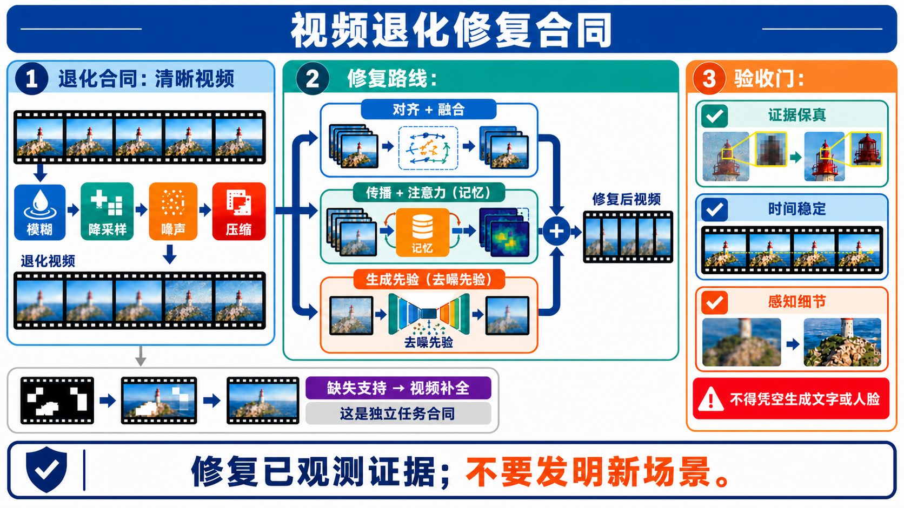
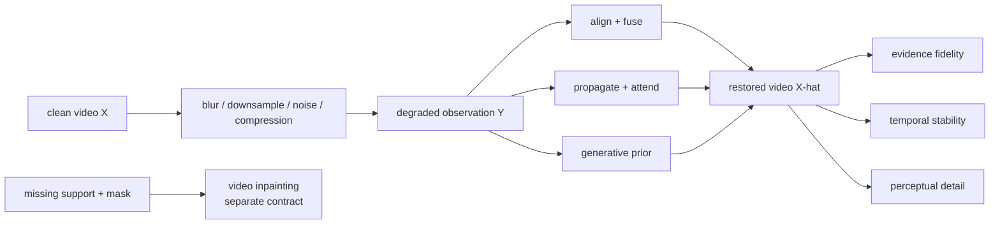
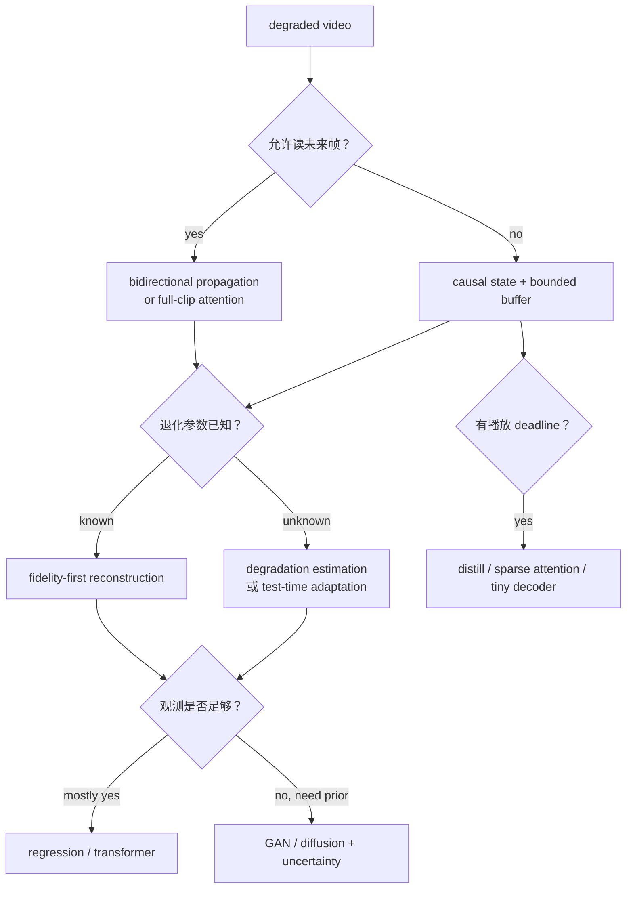

# 视频退化修复：从观测模型到生成先验与证据守恒

> **冻结日期：2026-08-30。** 本页讨论 degradation inverse restoration：输入通常仍在每个时空位置保留观测，但这些观测被降采样、模糊、噪声、压缩、低照度、恶劣天气或复合退化污染；目标是在不改写事件、文字、身份与几何的前提下恢复高质量视频。它不等同于以 mask 指定缺失支持的[视频补全](video-inpainting.md)，也不等同于允许语义变化的[视频编辑](video-to-video.md)。

本章的检索式、纳排规则、正式发表状态、关键断言和图片验收见[配套研究记录](../../sources/research_20260830_video_restoration.md)。

## 1. 先固定任务合同

### 1.1 从干净视频到退化观测

令高质量视频为 $`X=\lbrace x_t\rbrace_{t=1}^{T}`$，观测视频为 $`Y=\lbrace y_t\rbrace_{t=1}^{T'}`$。通用前向模型可写成

```math
Y=\mathcal C_q\!\left(\mathcal S_r\!\left(\mathcal B_k(X)\right)+N;\,m\right),
```

其中：

- $\mathcal B_k$ 表示空间变化、时间变化或相机/物体运动相关的模糊；
- $\mathcal S_r$ 表示空间降采样，若还降低帧率则必须另写时间采样算子；
- $N$ 表示传感器、量化、信号相关或压缩前后的噪声；
- $\mathcal C_q$ 表示 codec、量化与传输过程，$m$ 可包含帧类型、运动向量等 metadata；
- 参数 $\phi=(k,r,N,q,m)$ 可以已知、部分已知或完全未知，且算子次序会改变问题。

restorer 接收 $(Y,\widehat\phi,C)$，输出

```math
(\widehat X,U,A)=f_\theta(Y,\widehat\phi,C),
```

其中 $U$ 是不确定性或风险图，$A$ 是退化估计、窗口边界、随机种子与后处理记录。若论文不报告它假定的 $\mathcal D_\phi$，那么“真实世界修复”无法被复现；若用生成先验补出高频细节却不标记不确定区域，也不能把结果当作历史或取证意义上的真实恢复。

### 1.2 五类相邻任务不能只靠“输入也是视频”合并

| 任务 | 观测合同 | 允许模型做什么 | 一票否决式错误 |
|---|---|---|---|
| 退化逆问题修复 | $Y=\mathcal D_\phi(X)+N$；通常全帧有观测 | 去噪、去模糊、去压缩、超分、复合恢复 | 改写文字、身份、物体数量或事件；逐帧闪烁 |
| Inpainting / completion | $Y=M\odot X$；缺失支持由 mask 给出或估计 | 在缺失区生成合理内容，保留已知区 | mask 外变化、边界 seam、对象残留 |
| 帧插值 | 已知两侧时刻，目标是缺失时间坐标 | 估计中间状态或多条可能路径 | 端点不守恒、时间位置错误 |
| 视频编辑 | 完整源视频 + 指令/参考 | 在指定范围产生反事实变化 | 未请求区域变化、编辑未生效 |
| 美学增强 | 可能没有可逆的真实退化模型 | 改色、调光、风格化或主观锐化 | 把审美变化宣称为证据恢复 |

码流损坏是重要桥接案例：若 metadata 先定位损坏区，再用 pseudo-mask 补全并精修边界，它是“corruption detection + completion + restoration”的混合系统，而不是两类任务等价的证明。M-GDM 正式把这一设置定义为 blind bitstream-corrupted video recovery [[23]](#ref-23)。

### 1.3 三个验收轴必须独立



**图注：** restoration 的目标不是单纯“变清晰”。传统回归路线容易过平滑；GAN/diffusion 路线能补出锐利纹理，却可能稳定地生成从未存在的文字、牙齿、窗格或人脸细节。合格协议必须同时报告 evidence fidelity、temporal stability 与 perceptual detail，任何一项都不能替代另外两项。



**顺序化文字替代：** 干净视频先经过明确的退化算子形成观测；系统再从对齐融合、时序传播/注意力或生成先验中选择路线；恢复结果同时通过证据保真、时间稳定和感知细节三道门。若输入是由 mask 定义的缺失像素，则转入独立的视频补全合同。

## 2. 退化不是一个标签，而是一份可复现协议

| 退化族 | 必须声明的参数 | 最容易被忽略的现实因素 | 反事实压力测试 |
|---|---|---|---|
| 空间超分 | scale、kernel、先 blur 还是先 resize | 非整数缩放、镜头 MTF、ISP sharpening | 改变 kernel 与 scale，检查文字/纹理是否乱造 |
| 去模糊 | exposure、运动轨迹、空间/时间变化 | rolling shutter、depth discontinuity、饱和 | 静态背景与快速对象分开评测 |
| 去噪 | Gaussian/Poisson/read noise、强度与色彩空间 | RAW 到 sRGB 的非线性、暗电流、热像素 | 未见 ISO/曝光和跨相机测试 |
| 去压缩 | codec、QP/bitrate、GOP、chroma subsampling | frame type、packet loss、反复转码 | I/P/B 帧、场景切换与二次压缩分层 |
| 天气/低照度 | 雨、雾、雪、raindrop、曝光、照度 | 多种退化共存、训练天气偏置 | seen/unseen weather 与真实拍摄双测试 |
| 复合盲退化 | 算子集合、次序、参数分布 | 训练合成器覆盖不了真实分布 | hold-one-degradation-out 与顺序置换 |
| AIGC 伪影 | warp、结构错误、局部闪烁的构造来源 | 没有唯一“干净真值” | 结构修复前后的人体、文字、物体计数审计 |

同一组网络结构在 bicubic $\times4$ 上的结论，不能自动迁移到 unknown blur + compression + noise。RealBasicVSR 的贡献之一正是指出长程传播会把真实退化和伪影一起放大，并在传播前加入 cleaning module [[8]](#ref-8)。DiffVSR 则把复杂退化下的学习负担拆成渐进训练阶段，而不是只换更大的架构 [[21]](#ref-21)。

## 3. 多帧为什么有用，也为什么会害人

### 3.1 信息来自亚像素位移与互补可见性

相邻帧中的同一结构可能落在不同采样位置，并在某些帧更清晰、噪声更小或未被遮挡。若 $W_{s\rightarrow t}$ 将支持帧 $s$ 对齐到目标帧 $t$，一种抽象融合写法是

```math
h_t=\sum_{s\in\mathcal N(t)} a_{s,t}\odot
W_{s\rightarrow t}(\psi(y_s)),
\qquad
\widehat x_t=g(h_t,y_t),
```

其中 $a_{s,t}$ 必须反映遮挡、匹配置信度和退化强度。若运动估计错了，融合会产生 ghosting；若所有支持帧都丢失同一高频，网络只能依赖先验，不能称为从观测中恢复。

### 3.2 五条方法路线是可组合维度

| 路线 | 核心机制 | 优点 | 主要代价 / 失败 |
|---|---|---|---|
| Sliding-window 对齐融合 | flow、deformable conv/attention、correlation 对齐邻帧 | 并行、局部诊断清楚 | 窗口外信息丢失；大运动与遮挡误对齐 |
| Recurrent propagation | hidden feature 前后传播，必要时二阶或网格回访 | 资源随长度增长较慢、可利用长程信息 | error/artifact accumulation；双向版本不是在线 |
| Full-clip / hybrid Transformer | 窗内全局注意 + clip 间递归或 deformable attention | 长依赖与局部效率折中 | 显存、窗口边界与训练长度外推 |
| GAN / diffusion generative prior | 以自然图像/视频先验补全不可观测高频 | 感知细节强、可处理重退化 | 幻觉、随机闪烁、低 PSNR、采样慢 |
| Causal / distilled streaming | 只读历史、少步/一步、稀疏注意与轻量 decoder | 可接近播放 deadline | 无未来帧、漂移、质量—延迟权衡 |

BasicVSR 把传统 VSR 归纳成 propagation、alignment、aggregation、upsampling 四个组件 [[4]](#ref-4)；BasicVSR++ 用二阶网格传播与 flow-guided deformable alignment 加强前两项 [[7]](#ref-7)。RVRT 不是简单“Transformer 取代 recurrence”，而是在局部 clip 内并行、clip 间递归，并用 guided deformable attention 对齐 [[9]](#ref-9)。这些路线仍可与 GAN、diffusion 或不同退化训练器组合。

## 4. 技术路线与 paper review

### 4.1 2017–2020：从逐帧处理到显式时空信息利用

Deep Video Deblurring 用端到端 CNN 聚合邻帧，配套高帧率拍摄再合成模糊的数据，把“跨帧可见信息”带入视频去模糊 [[1]](#ref-1)。EDVR 的 PCD alignment 与 TSA fusion 成为显式多尺度 deformable alignment 的代表，并在 REDS restoration challenge 中统一面对 SR 与 deblurring [[2]](#ref-2)。FastDVDnet 则说明视频去噪不一定先显式估 flow：两级时空去噪器可隐式吸收运动，同时以单模型处理多噪声水平 [[3]](#ref-3)。

这一时期的关键不是“CNN 已经过时”，而是建立三个至今仍有效的诊断问题：支持帧怎样对齐、遮挡区怎样降权、时间信息怎样聚合。生成先验并没有取消这些问题。

### 4.2 2021–2022：传播、盲退化与 Transformer 枢纽

BasicVSR 提供简洁的双向 recurrent baseline，显示长程传播和 flow alignment 在固定计算下很强 [[4]](#ref-4)。Deep Blind VSR 把未知退化显式拉进任务，而 COMISR 把压缩信息纳入 VSR，提醒真实视频不是“先 bicubic 再干净保存” [[5]](#ref-5) [[6]](#ref-6)。

BasicVSR++ 的二阶连接能在遮挡和边界处访问更多历史，但多次传播也增加错误积累路径 [[7]](#ref-7)。RealBasicVSR 用预清洗与动态 refinement 处理真实退化，并发布无 GT 的 VideoLQ 作为现实输入集；这类集合适合盲人评与 no-reference 诊断，不能凭没有 GT 就只报一个美学分 [[8]](#ref-8)。VRT 与 RVRT 把窗口注意、并行 clip 与 recurrence 引入统一 restoration，后者直接在 SR、deblurring、denoising 三任务验证 [[9]](#ref-9) [[10]](#ref-10)。

### 4.3 2024：生成先验进入 VSR，但保真问题没有消失

SATeCo 冻结预训练图像 SR 的 U-Net/VAE，只训练 spatial feature adaptation 与 temporal feature alignment，以低清视频同时约束 latent denoising 和 pixel reconstruction [[13]](#ref-13)。Upscale-A-Video 加入局部时序层与全局 flow-guided latent propagation，并显式提供 noise level 和 text prompt 来调节 fidelity–generation trade-off [[14]](#ref-14)。MGLD-VSR 从运动约束引导 latent diffusion，StableVSR 则以 temporal-aware diffusion synthesis 生成感知细节；两者均在 ECCV 2024 正式发表 [[15]](#ref-15) [[16]](#ref-16)。

这些工作证明生成先验能提升感知细节，不证明细节来自原视频。最小证伪应包括：把恢复结果重新经过同一退化器，看能否回到观测；对小文字、人脸、重复纹理和周期运动逐帧跟踪；对同一输入换 seed，检查不确定高频是否稳定。

FMA-Net 处理联合 video SR + deblurring，并用 flow-guided dynamic filtering 学时空变化的退化/恢复核 [[11]](#ref-11)。Blur-aware sparse Transformer 直接面向去模糊中的稀疏时空相关；VD-Diff 则把 wavelet-aware dynamic Transformer 与紧凑 diffusion prior 组合到同一 deblurring 系统，说明“结构恢复”和“高频生成”即使同模，也仍要分开验收 [[12]](#ref-12) [[17]](#ref-17)。Diff-TTA 把 diffusion reverse process 与 test-time adaptation 结合到 video adverse weather removal，说明“未知退化”也可能要求在线适配，而不只是更宽的训练分布 [[18]](#ref-18)。

### 4.4 2025–2026：任意分辨率、复杂退化、少步与 streaming

VideoGigaGAN 从大规模图像 upsampler 引入生成细节，同时增加时序模块抑制逐帧闪烁；其 $8\times$ 结果属于作者协议，不能脱离数据与人工评价写成普遍倍率上限 [[19]](#ref-19)。PatchVSR 把低清 patch 与缩放后的全局视频分成双条件流，以 patch 位置和多 patch joint modulation 支持高分辨率输出 [[20]](#ref-20)。这解决固定基础模型分辨率与计算范围问题，却新增 patch seam、全局语义误判和边界一致性风险。

DiffVSR 用 progressive learning 拆解复杂退化、内容和时间建模负担，并用 interweaved latent transition 保持时间一致 [[21]](#ref-21)。TurboVSR 使用高压缩 autoencoder、首帧/后续帧 factorized conditioning 与 shortcut model，把论文设置中的 2 秒 1080p 处理压到秒级；这个数字依赖 H20、片段长度、步数与编码/解码口径，不能直接横比只报 denoiser 的 FPS [[22]](#ref-22)。SeedVR 提出任意长度/分辨率的 diffusion-transformer restoration，但截至冻结日仍按预印本处理 [[24]](#ref-24)。FLAIR 将 conditional diffusion 用于 face video restoration，是身份敏感的专门分支；脸更清晰不等于身份细节更真实，不能将其结果外推为通用 restoration 证据 [[29]](#ref-29)。

2026 年的进展开始把 generative VSR 的三项旧债分开处理：

- DGAF-VSR 把对齐后的邻帧特征作为 dense guidance，强调生成先验仍需充分利用观测证据 [[26]](#ref-26)；
- STCDiT 用 motion-aware 分段 VAE reconstruction 与 anchor-frame guidance 提高结构保真 [[27]](#ref-27)；
- SeedVR2 用 adaptive window attention 与 adversarial post-training 把通用 restoration 压到一步，并在 ICLR 2026 正式发表；“一步”仍不等于无生成幻觉 [[30]](#ref-30)；
- FlashVSR 通过三阶段蒸馏、locality-constrained sparse attention 与轻量条件 decoder 做一步 streaming VSR，作者在单张 A100、768×1408 条件下报告 17 FPS [[25]](#ref-25)；
- DTG-Restore 把 unconditional branch 放到更干净的 diffusion timestep，作为 training-free refinement，并建立 GenWarp480 诊断生成视频的 warp/结构伪影 [[28]](#ref-28)。

“实时”“training-free”“一步”分别描述服务速度、参数更新和 NFE，三者不能互换。FlashVSR 是训练后的一步模型；DTG-Restore 不训练新模型但仍要运行外部 restoration 与 diffusion refinement。

## 5. 评测：清晰、稳定、真实不是一个数

### 5.1 合成退化与真实退化必须分开

| 设置 | 可以回答 | 不能回答 |
|---|---|---|
| 已知合成退化 + paired GT | 在指定 kernel/noise/codec 上的重建误差 | 对未知相机、ISP、转码与复合退化的泛化 |
| 未见合成参数 / 组合 | 对 degradation shift 的局部稳健性 | 真实世界覆盖是否充分 |
| 真实 paired capture | 特定设备/光学系统下的 fidelity | 其他设备与不可配准动态场景 |
| 真实 unpaired / no-GT | 人工可接受度、伪影与时序稳定 | 新细节是否忠于不可见的真实高频 |
| AIGC artifact benchmark | 对生成 warp、结构错位的修复能力 | 对真实相机噪声或历史素材的保真 |

训练和测试不能复用同一个 degradation generator 的随机种子、kernel bank 或 codec 配置。更强协议应有 generator-held-out、parameter-held-out、order-held-out 和 real-capture 四层，并公开 clean source、退化配置和失败样例。

### 5.2 指标矩阵

| 证据轴 | 指标 / 检查 | 必须配套的压力测试 |
|---|---|---|
| 像素/结构 fidelity | PSNR、SSIM、LPIPS、DISTS；重退化一致性 $\Vert\mathcal D(\widehat X)-Y\Vert$ | 小文字、细线、脸、重复纹理、饱和和运动边界 |
| Temporal stability | flow-warp error、tLPIPS、flicker spectrum、track consistency | scene cut、遮挡、快速运动、周期纹理、长片段 |
| Perceptual detail | 盲人评、pairwise preference、no-reference VQA | 锐化 halo、塑料纹理、伪细节与 evaluator stress test |
| Task utility | OCR、face/ID、检测/跟踪、压缩后再分析 | 原始低清基线、oracle GT、跨设备/跨域 |
| Efficiency | p50/p95 latency、FPS、峰值显存、NFE、功耗代理 | cold/warm、解码/编码、tile/window seam、长片段 |
| Uncertainty / safety | 多 seed 方差、risk map、拒绝率、人工复核 | 证件、医疗、新闻、监控与历史档案场景 |

PSNR 高可能对应过平滑；感知分高可能来自合理但错误的纹理；低 flicker 甚至可能来自把细节固定错。报告至少应包含一项 fidelity、一项 temporal 和一项 perceptual 指标，并展示它们之间的 Pareto 曲线，而不是挑一个最优点。

### 5.3 幻觉审计

对每个 restoration 系统执行五项检查：

1. **Re-degradation consistency**：用声明的 $\mathcal D_\phi$ 重新退化 $\widehat X$，是否回到 $Y$；
2. **Seed sensitivity**：不同 seed 是否改变文字、人脸、物体部件等事实性内容；
3. **Identity/OCR ledger**：逐帧记录人脸 embedding、OCR 字符与置信度，不只看一张放大图；
4. **Temporal spectrum**：检查高频细节是在物体坐标中稳定，还是黏在屏幕坐标或逐帧闪烁；
5. **Downstream counterfactual**：若恢复让 detector/OCR 结果变化，必须与 GT 或人工核验比较，不能把“更自信”当“更正确”。

## 6. 离线、双向、因果与 streaming

双向传播和 full-clip attention 可以读取未来帧，因此通常不适合低延迟直播。在线系统在时刻 $t$ 只能使用 $Y_{\le t+b}$，其中 $b$ 是公开缓冲区；必须报告 first-frame latency、steady-state throughput、window seam、状态增长和 scene-cut reset。



**顺序化文字替代：** 若允许未来帧，可选双向传播或整段注意；否则使用因果状态和有界缓冲。已知退化优先 fidelity-first 重建，未知退化需估计或测试时适配。当观测不足才引入生成先验并报告不确定性；在线 deadline 还要求少步、稀疏注意和端到端延迟验收。

## 7. Milestone：按任务合同变化，而不是按宣传画质排序

| 首次公开 → 正式发表 | 工作 | 真正改变了什么 | 证据边界 |
|---|---|---|---|
| 2017 → CVPR 2017 | Deep Video Deblurring [[1]](#ref-1) | 邻帧端到端聚合 + 高帧率合成模糊数据 | 合成 blur 不能覆盖所有真实 shutter/rolling-shutter |
| 2019 → CVPRW 2019 | EDVR [[2]](#ref-2) | PCD alignment + TSA fusion；REDS restoration 枢纽 | workshop 正式论文；并非统一所有真实退化 |
| 2020 → CVPR 2020 | FastDVDnet [[3]](#ref-3) | 无显式 flow 的快速多噪声级视频去噪 | 主要围绕噪声，不自动解决 SR/blur |
| 2021 → CVPR 2021 | BasicVSR [[4]](#ref-4) | 传播、对齐、聚合、上采样四组件基线 | 双向传播依赖未来帧 |
| 2022 → CVPR 2022 | BasicVSR++ / RealBasicVSR [[7]](#ref-7) [[8]](#ref-8) | 二阶网格传播；真实退化清洗与训练权衡 | regression 细节与真实未知高频仍有限 |
| 2022 → NeurIPS 2022 | RVRT [[9]](#ref-9) | clip 内并行、clip 间递归的通用 restoration Transformer | 非 streaming；测试长度与显存需另报 |
| 2022 预印本 → TIP 2024 | VRT [[10]](#ref-10) | parallel video restoration Transformer 跨 SR/denoise/deblur | 首次公开年与正式年必须分开 |
| 2023 预印本 → CVPR 2024 | Upscale-A-Video / SATeCo [[13]](#ref-13) [[14]](#ref-14) | 生成先验 + 局部/全局时间约束；冻结图像先验适配 | 感知锐利不等于事实恢复 |
| 2024 → CVPR/ECCV 2024 | FMA-Net、MGLD-VSR、StableVSR [[11]](#ref-11) [[15]](#ref-15) [[16]](#ref-16) | 复合 SR+blur、motion-guided latent diffusion、时间一致细节 | 路线各自绑定退化与 benchmark |
| 2024 预印本 → CVPR 2025 | VideoGigaGAN [[19]](#ref-19) | 将大型图像 GAN upsampler 扩到时间一致 $8\times$ VSR | 首次公开不是 CVPR 2024 正式论文 |
| 2025 → CVPR/ICCV 2025 | PatchVSR、DiffVSR、TurboVSR [[20]](#ref-20) [[21]](#ref-21) [[22]](#ref-22) | patch 级高分辨率、复杂退化学习、少步高压缩 | 系统数字需绑定硬件、步数、分辨率和片长 |
| 2025 预印本 | SeedVR [[24]](#ref-24) | diffusion Transformer 的通用/任意长度与分辨率主张 | 截止冻结日仍按预印本，不写成正式发表 |
| 2026 → ICLR/CVPR 2026 | SeedVR2、FlashVSR、DGAF-VSR、STCDiT、DTG-Restore [[25]](#ref-25)–[[28]](#ref-28) [[30]](#ref-30) | adversarial 一步、streaming、dense aligned guidance、结构锚定、training-free refinement | 作者协议结果，尚非同一公开 benchmark 下的独立排名 |

## 8. 失败诊断表

| 症状 | 优先怀疑 | 最小定位实验 | 不充分的“修复” |
|---|---|---|---|
| 细节清楚但字变了 | generative prior 过强、condition 太弱 | OCR + re-degradation + 多 seed | 再加锐化或只报 VQA |
| 帧间闪烁 | 独立采样、VAE/decoder 不一致 | 同一 track 的 feature/颜色时间曲线 | 仅做 RGB 平滑，导致拖影 |
| 运动边界 ghosting | flow/offset 错、遮挡权重失效 | 可视化 warp 与 visibility mask | 扩大窗口但不改置信度 |
| 长视频后伪影放大 | recurrent error accumulation | 逐帧误差/频谱随时间曲线 | 只截取前 16 帧展示 |
| 真实视频出现油画感 | 训练退化过窄、损失偏像素 | hold-out codec/camera/ISP | 增大模型但不扩退化 |
| 4K tile 有接缝 | patch 缺全局上下文、noise 不共享 | seam-only heatmap 与重叠消融 | 输出后模糊接缝 |
| 速度数字很好但不可播 | 只计 denoiser、忽略 VAE/I/O | 端到端 cold/warm p95 | 只报单帧平均 FPS |
| AIGC 人体“修好”但动作变 | 结构先验改写事件 | pose/track/action before–after | 只做人像偏好评分 |

## 9. 最小可复现实验：RestorationFork-1

### 9.1 固定变量

- 同一 clean video 集、train/val/test split、长度与 crop；
- 同一四类训练退化：blur、downsample、noise、compression，公开参数与次序；
- 同一参数量级、训练步数、输入帧数与输出 scale；
- 三个模型：单帧 baseline、时序 regression、时序 generative prior；
- 不允许用 test degradation 选择 seed 或调 prompt。

### 9.2 四层测试

1. **Matched synthetic**：与训练同族但未见参数；
2. **Held-out composition**：未见算子次序与组合；
3. **Codec/camera shift**：不同 codec、bitrate、ISP 或设备；
4. **Real no-GT**：盲人评、OCR/ID、flicker、失败率与人工复核。

### 9.3 必交付记录

```text
model / checkpoint / commit:
degradation generator + exact order:
input/output resolution, frames, fps:
future-frame access / buffer:
tile, overlap, scene-cut reset:
sampler / NFE / seed:
VAE + post-processing:
PSNR / LPIPS / temporal metric:
OCR / identity / hallucination failures:
cold and warm p50/p95 latency:
peak memory / hardware:
```

只有当 generative route 在感知质量上改善，同时没有显著增加 OCR/身份错误、时间闪烁和 re-degradation error，才可支持“更好的 restoration”；否则只能写“更受偏好的 enhancement”。

## 10. 研究与工程停止规则

1. 只在 bicubic 或单一 Gaussian noise 上测试：不能写“真实世界修复”。
2. 只报 PSNR/SSIM：不能写“感知质量最好”；只报 no-reference VQA：不能写“忠实恢复”。
3. 只展示 cherry-picked zoom：不能写“时间一致”，必须给视频级指标与长片段失败。
4. 输出新增可辨识文字、面孔或对象部件：在人工复核前不得进入证据、医疗、新闻或档案工作流。
5. “任意长度”只表示接口能继续跑：没有 drift、memory 与 seam 曲线时不能写“长期稳定”。
6. “实时”必须包含 I/O、预处理、VAE、restorer、后处理和编码的端到端 p95；单个 kernel FPS 不够。
7. 训练代码或模型未公开：只能写作者报告，不写“已复现”。
8. 同名 restoration / enhancement / inpainting 未拆合同：停止横向排名，先重建任务表。

## 11. 推荐阅读路线

1. 用 BasicVSR 理解 propagation、alignment、aggregation、upsampling 四个基本组件。
2. 用 BasicVSR++、RealBasicVSR 与 RVRT 比较传播增强、真实退化和 hybrid Transformer。
3. 用 SATeCo、Upscale-A-Video、MGLD-VSR 比较图像 diffusion prior 怎样获得时间能力。
4. 用 VideoGigaGAN、PatchVSR、DiffVSR 与 TurboVSR理解细节、分辨率、复杂退化和效率的四方权衡。
5. 用 SeedVR2、DGAF-VSR、STCDiT、FlashVSR 与 DTG-Restore 核验 2026 的“一步后训练、观测证据、结构锚、streaming、AIGC refinement”分叉。
6. 最后执行 RestorationFork-1；没有幻觉审计和真实退化层，就不要把 enhancement 写成 recovery。

相邻章节：[视频补全](video-inpainting.md)、[帧插值](frame-interpolation.md)、[视频编辑](video-to-video.md)、[图像到视频](image-to-video.md)、[因果流式生成](../generative-models/causal-streaming-generation.md)与[评测指南](../evaluation.md)。

## 参考文献

<a id="ref-1"></a>[1] [Deep Video Deblurring for Hand-Held Cameras](https://openaccess.thecvf.com/content_cvpr_2017/html/Su_Deep_Video_Deblurring_CVPR_2017_paper.html). CVPR. 2017.

<a id="ref-2"></a>[2] [EDVR: Video Restoration with Enhanced Deformable Convolutional Networks](https://openaccess.thecvf.com/content_CVPRW_2019/html/NTIRE/Wang_EDVR_Video_Restoration_With_Enhanced_Deformable_Convolutional_Networks_CVPRW_2019_paper.html). CVPR Workshops. 2019.

<a id="ref-3"></a>[3] [FastDVDnet: Towards Real-Time Deep Video Denoising without Flow Estimation](https://openaccess.thecvf.com/content_CVPR_2020/html/Tassano_FastDVDnet_Towards_Real-Time_Deep_Video_Denoising_Without_Flow_Estimation_CVPR_2020_paper.html). CVPR. 2020.

<a id="ref-4"></a>[4] [BasicVSR: The Search for Essential Components in Video Super-Resolution and Beyond](https://openaccess.thecvf.com/content/CVPR2021/html/Chan_BasicVSR_The_Search_for_Essential_Components_in_Video_Super-Resolution_and_CVPR_2021_paper.html). CVPR. 2021.

<a id="ref-5"></a>[5] [Deep Blind Video Super-Resolution](https://openaccess.thecvf.com/content/ICCV2021/html/Pan_Deep_Blind_Video_Super-Resolution_ICCV_2021_paper.html). ICCV. 2021.

<a id="ref-6"></a>[6] [COMISR: Compression-Informed Video Super-Resolution](https://openaccess.thecvf.com/content/ICCV2021/html/Li_COMISR_Compression-Informed_Video_Super-Resolution_ICCV_2021_paper.html). ICCV. 2021.

<a id="ref-7"></a>[7] [BasicVSR++: Improving Video Super-Resolution with Enhanced Propagation and Alignment](https://openaccess.thecvf.com/content/CVPR2022/html/Chan_BasicVSR_Improving_Video_Super-Resolution_With_Enhanced_Propagation_and_Alignment_CVPR_2022_paper.html). CVPR. 2022.

<a id="ref-8"></a>[8] [Investigating Tradeoffs in Real-World Video Super-Resolution](https://openaccess.thecvf.com/content/CVPR2022/html/Chan_Investigating_Tradeoffs_in_Real-World_Video_Super-Resolution_CVPR_2022_paper.html). CVPR. 2022.

<a id="ref-9"></a>[9] [Recurrent Video Restoration Transformer with Guided Deformable Attention](https://proceedings.neurips.cc/paper_files/paper/2022/hash/02687e7b22abc64e651be8da74ec610e-Abstract-Conference.html). NeurIPS. 2022.

<a id="ref-10"></a>[10] [VRT: A Video Restoration Transformer](https://arxiv.org/abs/2201.12288). arXiv first release, 2022; IEEE Transactions on Image Processing, 2024, [DOI](https://doi.org/10.1109/TIP.2024.3372454).

<a id="ref-11"></a>[11] [FMA-Net: Flow-Guided Dynamic Filtering and Iterative Feature Refinement with Multi-Attention for Joint Video Super-Resolution and Deblurring](https://openaccess.thecvf.com/content/CVPR2024/html/Youk_FMA-Net_Flow-Guided_Dynamic_Filtering_and_Iterative_Feature_Refinement_with_Multi-Attention_CVPR_2024_paper.html). CVPR. 2024.

<a id="ref-12"></a>[12] [Blur-aware Spatio-temporal Sparse Transformer for Video Deblurring](https://openaccess.thecvf.com/content/CVPR2024/html/Zhang_Blur-aware_Spatio-temporal_Sparse_Transformer_for_Video_Deblurring_CVPR_2024_paper.html). CVPR. 2024.

<a id="ref-13"></a>[13] [Learning Spatial Adaptation and Temporal Coherence in Diffusion Models for Video Super-Resolution](https://openaccess.thecvf.com/content/CVPR2024/html/Chen_Learning_Spatial_Adaptation_and_Temporal_Coherence_in_Diffusion_Models_for_CVPR_2024_paper.html). CVPR. 2024.

<a id="ref-14"></a>[14] [Upscale-A-Video: Temporal-Consistent Diffusion Model for Real-World Video Super-Resolution](https://openaccess.thecvf.com/content/CVPR2024/html/Zhou_Upscale-A-Video_Temporal-Consistent_Diffusion_Model_for_Real-World_Video_Super-Resolution_CVPR_2024_paper.html). CVPR. 2024.

<a id="ref-15"></a>[15] [Motion-Guided Latent Diffusion for Temporally Consistent Real-World Video Super-Resolution](https://eccv.ecva.net/virtual/2024/poster/2534). ECCV. 2024.

<a id="ref-16"></a>[16] [StableVSR: Enhancing Perceptual Quality in Video Super-Resolution through Temporally-Consistent Detail Synthesis Using Diffusion Models](https://eccv.ecva.net/virtual/2024/poster/1051). ECCV. 2024.

<a id="ref-17"></a>[17] [Rethinking Video Deblurring with Wavelet-Aware Dynamic Transformer and Diffusion Model](https://www.ecva.net/papers/eccv_2024/papers_ECCV/html/6210_ECCV_2024_paper.php). ECCV. 2024.

<a id="ref-18"></a>[18] [Genuine Knowledge from Practice: Diffusion Test-Time Adaptation for Video Adverse Weather Removal](https://openaccess.thecvf.com/content/CVPR2024/html/Yang_Genuine_Knowledge_from_Practice_Diffusion_Test-Time_Adaptation_for_Video_Adverse_CVPR_2024_paper.html). CVPR. 2024.

<a id="ref-19"></a>[19] [VideoGigaGAN: Towards Detail-rich Video Super-Resolution](https://openaccess.thecvf.com/content/CVPR2025/html/Xu_VideoGigaGAN_Towards_Detail-rich_Video_Super-Resolution_CVPR_2025_paper.html). arXiv first release, 2024; CVPR, 2025.

<a id="ref-20"></a>[20] [PatchVSR: Breaking Video Diffusion Resolution Limits with Patch-wise Video Super-Resolution](https://openaccess.thecvf.com/content/CVPR2025/html/Du_PatchVSR_Breaking_Video_Diffusion_Resolution_Limits_with_Patch-wise_Video_Super-Resolution_CVPR_2025_paper.html). CVPR. 2025.

<a id="ref-21"></a>[21] [DiffVSR: Revealing an Effective Recipe for Taming Robust Video Super-Resolution against Complex Degradations](https://openaccess.thecvf.com/content/ICCV2025/html/Li_DiffVSR_Revealing_an_Effective_Recipe_for_Taming_Robust_Video_Super-Resolution_ICCV_2025_paper.html). ICCV. 2025.

<a id="ref-22"></a>[22] [TurboVSR: Fantastic Video Upscalers and Where to Find Them](https://openaccess.thecvf.com/content/ICCV2025/html/Wang_TurboVSR_Fantastic_Video_Upscalers_and_Where_to_Find_Them_ICCV_2025_paper.html). ICCV. 2025.

<a id="ref-23"></a>[23] [Blind Bitstream-corrupted Video Recovery via Metadata-guided Diffusion Model](https://openaccess.thecvf.com/content/CVPR2025/html/Wang_Blind_Bitstream-corrupted_Video_Recovery_via_Metadata-guided_Diffusion_Model_CVPR_2025_paper.html). CVPR. 2025.

<a id="ref-24"></a>[24] [SeedVR: Seeding Infinity in Diffusion Transformer towards Generic Video Restoration](https://arxiv.org/abs/2501.01320). arXiv preprint. 2025.

<a id="ref-25"></a>[25] [FlashVSR: Towards Real-time Diffusion-Based Streaming Video Super Resolution](https://openaccess.thecvf.com/content/CVPR2026/html/Zhuang_FlashVSR_Towards_Real-time_Diffusion-Based_Streaming_Video_Super_Resolution_CVPR_2026_paper.html). CVPR. 2026.

<a id="ref-26"></a>[26] [Rethinking Diffusion Model-Based Video Super-Resolution: Leveraging Dense Guidance from Aligned Features](https://openaccess.thecvf.com/content/CVPR2026/html/Xu_Rethinking_Diffusion_Model-Based_Video_Super-Resolution_Leveraging_Dense_Guidance_from_Aligned_CVPR_2026_paper.html). CVPR. 2026.

<a id="ref-27"></a>[27] [STCDiT: Spatio-Temporally Consistent Diffusion Transformer for High-Quality Video Super-Resolution](https://openaccess.thecvf.com/content/CVPR2026/html/Chen_STCDiT_Spatio-Temporally_Consistent_Diffusion_Transformer_for_High-Quality_Video_Super-Resolution_CVPR_2026_paper.html). CVPR. 2026.

<a id="ref-28"></a>[28] [DTG-Restore: Training-Free Diffusion Refinement for Generative Video Super-Resolution](https://openaccess.thecvf.com/content/CVPR2026/html/Yesiltepe_DTG-Restore_Training-Free_Diffusion_Refinement_for_Generative_Video_Super-Resolution_CVPR_2026_paper.html). CVPR. 2026.

<a id="ref-29"></a>[29] [FLAIR: A Conditional Diffusion Framework with Applications to Face Video Restoration](https://openaccess.thecvf.com/content/WACV2025/html/Zou_FLAIR_A_Conditional_Diffusion_Framework_with_Applications_to_Face_Video_WACV_2025_paper.html). WACV. 2025.

<a id="ref-30"></a>[30] [SeedVR2: One-Step Video Restoration via Diffusion Adversarial Post-Training](https://proceedings.iclr.cc/paper_files/paper/2026/hash/444d69470b24ded080183c907b711bbf-Abstract-Conference.html). ICLR. 2026.
