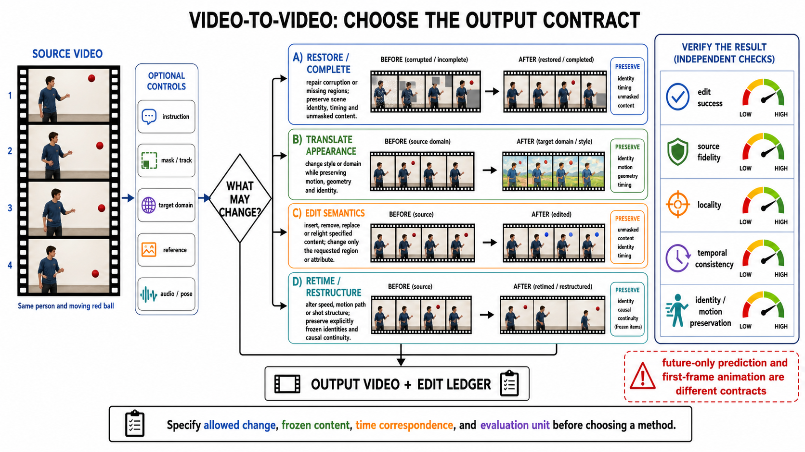

# 视频到视频编辑：把“改变”与“守恒”写进同一份合同

> **冻结日期：2026-08-30。** 本页把 video-to-video（V2V）限定为：源视频定义待修改的既有时间轴，系统按指令、掩码、参考或控制信号产生反事实视频，并能说明哪些内容应改变、哪些内容必须保留。若源视频只是驱动信号、历史前缀或可被丢弃的提示，就不能仅因输出也是视频而称为 V2V 编辑。

从 Video Rewrite 的局部口型替换 [[1]](#ref-1)、时空补全 [[2]](#ref-2) 和 vid2vid 的条件域翻译 [[3]](#ref-3)，到扩散模型的测试时特征注入、原生视频编辑 DiT / flow、三维运动控制与流式编辑，能力主线并不是“画面越来越漂亮”，而是**可编辑自由度扩大时，源视频中的身份、几何、运动和因果关系还能否守恒**。

检索式、纳排规则、正式 venue、2025–2026 release surface、负面核验、图片记录与验证命令见[配套研究记录](../../sources/research_20260830_video_to_video.md)。

## 1. 先写任务合同，再选择模型

### 1.1 严格输入、输出与区域合同

一次可审计的 V2V 请求写成

```math
T_{\mathrm{V2V}}=(X,U,M,R,C,H)\rightarrow(Y,\Delta,D),
```

其中：

- $`X=\lbrace x_t\rbrace_{t=1}^{T}`$ 是完整源视频，决定输出的时间轴；
- $U$ 是自然语言编辑指令，可为空；
- $`M=\lbrace m_t\rbrace`$ 是可选时空掩码，需声明是**硬边界**还是**软提示**；
- $R$ 是外观、身份、材质或风格参考，可为多图、多视频或前一轮结果；
- $C$ 是轨迹、点、框、姿态、深度、法线、相机、音频等显式控制；
- $H$ 是多轮历史或流式状态，必须区分“已接受状态”和临时预览；
- $`Y=\lbrace y_t\rbrace_{t=1}^{T'}`$ 是编辑视频；$\Delta$ 是机器可读的改动范围；$D$ 是种子、模型、条件、轮次和撤销信息。

对时间重映射、插帧或变速，$T'$ 可以不同于 $T$，但必须给出源—目标时间映射。否则默认 $T'=T$ 且逐帧对齐。令 $E_t$ 为允许编辑区，$P_t=\Omega\setminus E_t$ 为保留区：

```math
\mathcal L=\mathcal L_{\mathrm{edit}}(Y,U,R,C,E)
+\lambda_p\mathcal L_{\mathrm{preserve}}(Y,X,P)
+\lambda_t\mathcal L_{\mathrm{temporal}}(Y,X).
```

硬掩码表示 $`y_t(p)=x_t(p),\ p\in P_t`$，应在解码后再做一次已知像素合成；软掩码只表示“主要改这里”，允许影子、反射、遮挡和接触区域随对象一起变化。只给对象轮廓而不说明环境效应，无法判断 mask 外变化是错误还是必要编辑。

### 1.2 四个正交轴，不把任务名混成方法名

| 轴 | 选项 | 必须固定的合同 |
|---|---|---|
| 编辑范围 | local / masked；global | 局部任务报告 mask 外泄漏；全局任务列出仍需保留的身份、布局、运动或镜头 |
| 编辑内容 | appearance；object；motion；camera / geometry | “换材质”和“改轨迹”不能共用一个模糊的文本相似度验收；restoration 是邻接合同而非编辑内容标签 |
| 条件接口 | instruction；mask / box；reference；track / pose / depth / camera；组合条件 | 说明哪个条件具有冲突时优先级，以及条件是否逐帧对齐 |
| 会话形态 | one-shot；multi-turn；streaming | 多轮需保存状态与撤销点；流式需声明可见未来、缓冲区和端到端延迟 |

多参考不等于多轮：前者在同一轮提供多个条件，后者要求第 $k$ 轮只改变本轮目标并保留前 $1\ldots k-1$ 轮已接受结果。streaming 也不等于 long video：离线滑窗可以处理长视频，却使用未来帧；真正在线系统必须按因果可见性报告延迟。

### 1.3 什么算、什么不算 V2V

| 输入—输出关系 | 是否属于本页的严格 V2V | 判据 |
|---|---:|---|
| 源 RGB 视频 + 指令 / 参考 / 控制 → 同一场景的反事实视频 | 是 | 源视频不可被移除；需同时验收 edit success 与 preservation |
| 局部对象替换、删除、重着色或动作修改 | 是 | 编辑区与保留区可写明；删除若目标是恢复遮挡背景，也与 inpainting 相交 |
| 全局风格、天气或域翻译 | 是，但属于 global edit | 不能用“全画面都变”免除结构、身份和运动守恒 |
| 超分、去模糊、去噪、去压缩或复合低质恢复 | 邻接任务 | 全帧通常仍有退化观测；详见[视频退化修复](video-restoration.md) |
| 缺失像素补全、对象移除后背景生成、outpainting | 邻接任务 | 未知支持由 mask 指定或估计；详见[视频补全](video-inpainting.md) |
| 单图 / 首帧 + 文本 → 视频 | 否 | 图像是时间锚点而非待编辑视频；详见[图像到视频](image-to-video.md) |
| 语义图 / pose / depth 视频 → RGB 视频 | 视合同而定 | 若源 RGB 不参与或可丢弃，是 conditional synthesis / translation；vid2vid 属于历史上的 video translation [[3]](#ref-3) |
| 相机轨迹 + 文本 → 新场景 | 否 | 是 camera-conditioned generation |
| 源视频 + 新相机轨迹 → 同一动态场景的新视图 | 是，属于 camera / geometry edit | 必须保持同一对象状态并检验显露区和三维几何；ReCamMaster 是这一交叉点 [[26]](#ref-26) |
| 视频前缀 → 未知未来 | 否 | 是 prediction / continuation，源帧是历史而非被修改对象 |
| driving video + 人像参考 → 新人物动画 | 通常否 | driving video 提供动作控制；若还要编辑 driving video 本身才进入 V2V |
| 主体参考集 + prompt → 新时间轴视频 | 否 | 没有完整源视频可守恒；属于[开放集视频个性化](personalized-video-generation.md) |


**顺序化文字替代：** 先确认存在完整源视频；再确认输出修改的是这条既有时间轴，而非把它当驱动或历史。若目标只是恢复原内容，再判断是全帧退化观测的 restoration，还是由 mask 指定缺失支持的 inpainting。其余按局部、全局、运动或相机 / 视角编辑分流，每一支都同时写出编辑目标和守恒目标。

## 2. 方法选择器：控制越强，证据合同越具体



**图注：** 四条路线先写“允许改变什么”和“必须保留什么”，再交付输出视频与 edit ledger。A 路是邻接任务入口，图中的 `restoration / completion` 必须继续拆成[全帧退化逆问题](video-restoration.md)与[mask 缺失支持补全](video-inpainting.md)，不能共用一份验收；B–D 分别扩大到外观、语义与时间/运动结构。右侧五个验收轴彼此独立，不能用 edit success 掩盖整帧重绘。未来预测与首帧动画不修改完整源时间轴，属于不同合同。

**图的顺序化文字替代：**

1. 输入先固定完整源视频；instruction、mask/track、target domain、reference、audio/pose 只是可选控制。
2. 若目标是逆转 blur、noise、downsample 或 compression，进入 degradation restoration；若目标是补 mask 缺失支持，进入 completion / inpainting。两者都冻结身份与时序，但只有后者具有 mask 外像素硬保护。
3. 若只改变风格或域，进入 appearance translation，并保留身份、运动、几何和时间。
4. 若增删、替换或重照明指定内容，进入 semantic edit，并把改动限制在请求区域或属性及其必要环境效应。
5. 若改变速度、运动路径或镜头结构，进入 retime / restructure，并显式冻结身份和因果连续性。
6. 所有路线都输出 edit ledger，并分别验收 edit success、source fidelity、locality、temporal consistency 和 identity/motion preservation。


**顺序化文字替代：** 先由 mask 外是否需要像素级锁定决定是否使用 mask-aware 路线。没有专用训练数据时优先考虑 inversion 与测试时注入；大幅语义变化优先原生编辑模型；首帧或关键帧驱动的小改动可走对应传播。运动、相机和材质分解需要更具体的 2D / 3D / RGBX 控制。最后按离线、多轮长视频或因果流式选择状态管理。上方 PNG 用于快速识别输出关系；本 Mermaid 保留“任务合同 → 控制自由度 → 时序形态”的可编辑精确分支。

## 3. 八条机制路线及各自的守恒假设

### 3.1 传播与 warp：把少量可靠编辑扩散到时间轴

这一路线先编辑首帧、关键帧或稀疏锚点，再用光流、对应特征或 I2V 模型传播。优点是接口直观、可复用成熟图像编辑器；弱点是遮挡、显露区、快速非刚性运动和长程漂移。AnyV2V 把图像编辑与视频传播解耦 [[10]](#ref-10)，FlowV2V 将一致编辑重写为 flow-driven I2V [[12]](#ref-12)，FFP-300K 则把首帧传播扩展为大规模配对训练问题 [[13]](#ref-13)。

**隐藏假设：** 第一帧包含未来所需身份和材质，且对应关系可跨遮挡恢复。若编辑目标只在后半段出现，首帧传播合同本身就不充分。

### 3.2 GAN 与 paired translation：从逐帧映射走向时间判别

vid2vid 把语义图、姿态等输入序列翻译为 RGB 视频，并用时序判别、前帧与光流约束增强连续性 [[3]](#ref-3)。它建立了“结构条件 + 时间一致”的工程范式，却依赖配对域、固定任务和训练分布；对任意自然语言反事实编辑并不天然适用。把 vid2vid 当作现代 instruction-based V2V 的同义词，会掩盖“源 RGB 是否必须保留”的合同差异。

### 3.3 分层、atlas 与显式合成：先把可编辑对象从视频中拆出来

Layered Neural Atlases 把前景和背景映射到统一 atlas，用户在二维 atlas 上编辑后再投影回视频 [[4]](#ref-4)；Text2LIVE 学习文本驱动的编辑层并与原视频合成 [[5]](#ref-5)。这类方法的优势是改动可解释、可局部撤销，失败通常来自分层错误、拓扑变化、长时遮挡和非朗伯反射。它提醒后续生成模型：**可合成的显式 delta 比只返回一段新视频更接近非破坏性编辑。**

### 3.4 测试时 attention / feature injection：借图像扩散先验而不重训视频模型

FateZero 在反演轨迹中融合注意力，保留布局和运动 [[7]](#ref-7)；Pix2Video 在图像扩散特征上建立帧间一致性 [[8]](#ref-8)；TokenFlow 用扩散特征对应传播编辑 token [[9]](#ref-9)。这些方法把“源视频信息”注入去噪过程，适合文本外观编辑和低成本迁移，但大动作、遮挡、新对象交互与长视频会暴露二维对应的上限。

**关键区别：** attention injection 保留的是模型内部对应，不等于硬 mask 外像素守恒；视觉上相似也不等于身份、几何或运动轨迹没有漂移。

### 3.5 Diffusion inversion 与测试时适配：先找回源视频，再沿条件方向移动

Dreamix 通过加噪、混合微调与视频扩散实现视频到视频、图像到视频和主体驱动编辑 [[6]](#ref-6)。StableV2V 强调编辑前后形状稳定 [[11]](#ref-11)，AnyV2V 则把 inversion、图像编辑和时间传播模块化 [[10]](#ref-10)。路线的主要误差来自：反演重建误差、编辑方向和源运动纠缠、每视频优化成本，以及不同随机种子导致的不可归因差异。

Dreamix 的逐视频反演/微调仍围绕已有源时间轴验收；若优化对象是开放集主体表示，并在全新时间轴中生成，则归入[开放集视频个性化](personalized-video-generation.md)。

实验必须先报告 **reconstruction-only**：在不施加编辑时，反演—解码能否重建 $X$。否则后续变化无法区分是编辑成功还是反演损失。

### 3.6 原生 editing DiT / rectified flow：把源、目标和条件共同 token 化

Movie Gen 把视频生成与精确编辑纳入同一媒体基础模型族 [[14]](#ref-14)。VACE 用统一条件接口覆盖生成、参考和视频编辑，并在 ICCV 2025 正式发表 [[15]](#ref-15)。2026 年，EditVerse 把异构编辑样本统一为 token 序列 [[16]](#ref-16)，UNIC 把源视频、带噪目标和多模态条件共同建模 [[17]](#ref-17)，Ditto 用大规模合成数据训练原生指令编辑器 [[19]](#ref-19)，EasyV2V 用序列拼接、LoRA 与时空 mask 兼容局部 / 全局及可选参考 [[18]](#ref-18)。

原生模型能执行更大语义变化，却不能因为“端到端”就省略编辑区域合同。VIVA 用 VLM instructor 与强化学习提升指令对齐 [[20]](#ref-20)，CoT-Edit 把指令规划为框、mask 和编辑步骤 [[21]](#ref-21)，EditCtrl 只更新 mask token 并用低分辨率全局上下文控制计算量 [[45]](#ref-45)：三者分别把语义规划、空间定位和计算边界显式化。

### 3.7 多参考、3D / 4D 与内禀分解：从像素相关走向可控制世界状态

MotionFollower 用 pose / appearance controllers 和 score guidance 改变主体运动并保留外观与背景 [[22]](#ref-22)；MotionV2V 构造 motion counterfactual，以稀疏轨迹改变对象运动同时保留外观 [[23]](#ref-23)；3D Point Tracks 方法进一步把深度、遮挡与源 / 目标三维点轨迹写入运动合同 [[24]](#ref-24)。TrajectoryCrafter [[25]](#ref-25) 与 ReCamMaster [[26]](#ref-26) 面向新轨迹 / 新相机视角，只有当它们保持同一动态场景状态时才属于 V2V 的 novel-view edit。

V-RGBX 先把视频分解为反照率、法线、材质和照明，再做 intrinsic-aware 编辑 [[27]](#ref-27)；V2Edit 同时面向视频和三维场景 [[28]](#ref-28)。这一路线更适合检验遮挡、光照和几何，却要求可靠深度、相机或内禀估计。所谓“4D-aware”若没有跨视角 / 时间的几何证据，仍可能只是更强的视频先验。

编辑主张一旦扩展到“所有视角、所有时刻保持同一变化”，就要从像素保持合同升级为 camera-time grid、重投影、遮挡、loop closure 与可渲染状态合同；完整测试见[多视角与 4D 生成](multiview-4d-generation.md)。

### 3.8 记忆、多轮与流式：状态管理成为模型合同的一部分

Memory-V2V 用外部记忆、检索、动态 token 化和压缩支持长视频多轮一致性 [[29]](#ref-29)。EgoEdit 面向第一视角数据、流式模型与评测 [[30]](#ref-30)。LiveEdit 以双向到因果蒸馏和自回归 mask cache 逼近实时流式编辑 [[31]](#ref-31)，JoyAI 使用自回归扩散、因果 VAE 和有界 KV cache [[32]](#ref-32)，EditStream 则统一交互式视频生成与编辑 [[33]](#ref-33)。

“实时”必须拆成捕获到显示的端到端延迟、稳态 FPS、首帧时间、分辨率、窗口长度、峰值显存和硬件；论文中的作者报告速度不能替代本地复测。离线模型一次处理完整 clip 的 FPS 也不能证明在线因果性。

## 4. 能力转折点：每次扩大自由度，都留下新的守恒债务

| 时间 | 能力转折 | 代表证据 | 当时没有解决、今天仍需验收的项 |
|---|---|---|---|
| 1997–2004 | 从局部口型重排走向通用时空洞补全 | Video Rewrite [[1]](#ref-1)；Space-Time Completion [[2]](#ref-2) | 长遮挡、语义重绘、用户可控边界 |
| 2018 | paired video translation 把时间判别和条件序列纳入训练 | vid2vid [[3]](#ref-3) | 新域泛化、自然语言开放编辑、源 RGB 守恒 |
| 2021–2022 | atlas / edit layer 让改动可合成、可定位 | Layered Neural Atlases [[4]](#ref-4)；Text2LIVE [[5]](#ref-5) | 复杂拓扑、显露区、长程非刚体 |
| 2023–2024 | 图像扩散先验通过 inversion、attention 和 feature propagation 迁移到视频 | Dreamix [[6]](#ref-6)；FateZero [[7]](#ref-7)；Pix2Video [[8]](#ref-8)；TokenFlow [[9]](#ref-9)；AnyV2V [[10]](#ref-10) | 大动作、对象交互、反演误差、逐视频成本 |
| 2024–2025 | 视频基础模型与统一条件接口允许更大幅、多任务编辑 | Movie Gen [[14]](#ref-14)；VACE [[15]](#ref-15) | 精确 mask 外守恒、训练数据可追溯、可复现实验成本 |
| 2025–2026 | 原生编辑数据 / 模型把 instruction、mask、reference 共同训练 | EditVerse [[16]](#ref-16)；UNIC [[17]](#ref-17)；EasyV2V [[18]](#ref-18)；Ditto [[19]](#ref-19) | 组合指令、罕见交互、真实人工编辑对、许可边界 |
| 2025–2026 | 控制从外观推进到运动、相机、三维轨迹和内禀属性 | MotionFollower [[22]](#ref-22)；MotionV2V [[23]](#ref-23)；3D tracks [[24]](#ref-24)；V-RGBX [[27]](#ref-27) | 接触与碰撞、遮挡、拓扑变化、真实 4D 一致性 |
| 2026 | 多轮、长视频与因果流式成为一等协议 | Memory-V2V [[29]](#ref-29)；EgoEdit [[30]](#ref-30)；LiveEdit [[31]](#ref-31)；JoyAI [[32]](#ref-32)；EditStream [[33]](#ref-33) | 非破坏性状态、撤销、跨轮漂移、统一实时测量 |

这条时间线不是 SOTA 排名。早期显式分层方法在可解释 delta 和撤销上可能优于大模型；新模型扩大了指令覆盖，并未自动偿还 preservation、geometry 或 provenance 的债务。

## 5. 2025–2026 冻结快照：正式发表、预印本与 release surface 分开写

| 工作 | 截至冻结日的证据状态 | 核心贡献 | 可公开复现边界 |
|---|---|---|---|
| VACE | ICCV 2025 正式论文 [[15]](#ref-15) | 统一生成、参考与编辑条件 | 官方仓库有推理、预处理、Gradio、权重与 benchmark；未见完整预训练管线 [[37]](#ref-37) |
| MotionFollower / TrajectoryCrafter / ReCamMaster | ICCV 2025 正式论文 [[22]](#ref-22) [[25]](#ref-25) [[26]](#ref-26) | 运动轨迹、通用轨迹和相机重定位 | 需逐项目核对数据、相机 / 深度前处理和权重，不把项目 demo 当复现 |
| VE-Bench / FiVE-Bench | AAAI 2025 / ICCV 2025 正式论文 [[34]](#ref-34) [[35]](#ref-35) | 主观对齐质量与细粒度编辑评测 | 是评测协议，不是编辑模型 |
| V2Edit / FlowV2V | 2025 arXiv 预印本 [[28]](#ref-28) [[12]](#ref-12) | 视频—3D 联合编辑；flow-driven I2V | 不因年份相同写成正式 proceedings |
| EditVerse / UNIC / IVEBench | ICLR 2026 正式论文 [[16]](#ref-16) [[17]](#ref-17) [[36]](#ref-36) | 统一数据 / 条件建模；现代 instruction benchmark | 数据、权重与训练 recipe 仍需按各官方发布面核验 |
| EasyV2V / Ditto / MotionV2V / 3D Point Tracks / EditCtrl / VIVA / CoT-Edit / V-RGBX / EgoEdit / FFP-300K | CVPR 2026 正式论文 [[18]](#ref-18) [[19]](#ref-19) [[23]](#ref-23) [[24]](#ref-24) [[45]](#ref-45) [[20]](#ref-20) [[21]](#ref-21) [[27]](#ref-27) [[30]](#ref-30) [[13]](#ref-13) | 原生编辑、数据扩展、运动 / 3D、mask 计算、规划、内禀属性、流式第一视角、首帧传播 | “有 proceedings”不等于“有完全一致的训练代码与 checkpoint” |
| Memory-V2V | arXiv v3；Adobe Research 页面标注 ECCV 2026，但页面公开日期晚于冻结日 [[29]](#ref-29) | 外部记忆与多轮一致 | 冻结日官方仓库仍写 Code coming soon [[41]](#ref-41) |
| LiveEdit | arXiv v2；官方仓库标注 accepted to ECCV 2026 [[31]](#ref-31) [[46]](#ref-46) | 双向到因果蒸馏、流式 cache | 仓库公开推理 / 训练 / checkpoint；作者速度需本地复测 |
| JoyAI-Video-Edit | 2026-08 arXiv 预印本 [[32]](#ref-32) | 开放式自回归扩散编辑 | 官方仓库公开部署与权重；完整训练代码 / 数据在冻结日仍为 TODO [[43]](#ref-43) |
| EditStream | 2026-08 arXiv 预印本 [[33]](#ref-33) | 交互式生成—编辑统一自回归框架 | 官方项目页在冻结日写 Code soon、Data & Model soon [[47]](#ref-47) |

### 5.1 这些论文真正改变了什么

- **数据成为能力瓶颈。** Ditto-1M 与 EditVerse 不再把编辑当成生成模型的附带推理技巧，而是训练原生 source→target 关系 [[16]](#ref-16) [[19]](#ref-19)。收益是大幅编辑和组合条件；代价是合成配对偏差、数据许可和巨大训练成本。Ditto 论文报告超过 12,000 GPU-days，这是作者报告，不是本页复测值。
- **mask 从输入提示变成算力边界。** EasyV2V 的时空 mask 统一 local / global 编辑 [[18]](#ref-18)，EditCtrl 只在 masked token 上执行主要计算，并保留低分辨率全局上下文 [[45]](#ref-45)。但 mask 外 token 不更新仍不保证解码后像素完全不变，硬合同需要输出合成和误差审计。
- **运动编辑从文本形容词走向反事实轨迹。** MotionV2V 的问题是“同一对象如果沿另一条轨迹运动会怎样” [[23]](#ref-23)；3D Point Tracks 显式处理深度与遮挡 [[24]](#ref-24)。这比用 CLIP 判断“moves left”更可检验，但仍未自动解决接触、碰撞与拓扑变化。
- **规划与执行被拆开。** CoT-Edit 先生成计划、框和 mask，再调用编辑器 [[21]](#ref-21)；VIVA 用视觉语言反馈训练编辑器 [[20]](#ref-20)。需要分别测 planner 的定位错误和 renderer 的生成错误，不能只报最终偏好分。
- **在线编辑把未来信息变成公平性问题。** EgoEdit、LiveEdit、JoyAI 与 EditStream 的可见未来和缓存不同 [[30]](#ref-30) [[31]](#ref-31) [[32]](#ref-32) [[33]](#ref-33)。离线基线若看到完整视频，不能与严格因果模型只按 FPS 横比。

## 6. 评价：至少八个维度，不能压成一个“总体质量”

VE-Bench 收集 8 个模型、24 位标注者和 28,080 个主观分数，用于研究自动指标与人类判断的对齐 [[34]](#ref-34)。FiVE-Bench 由 74 个真实源视频和 26 个生成源视频构成，覆盖 6 类编辑与 420 组 prompt / mask [[35]](#ref-35)。IVEBench 包含 600 个源视频、32–1024 帧、8 个主类和 35 个子类，强调现代指令编辑的时长与任务覆盖 [[36]](#ref-36)。这些规模来自论文，不应外推为“已覆盖所有真实编辑”。

| 维度 | 要回答的问题 | 推荐证据 | 常见误判 |
|---|---|---|---|
| Preservation | 不该改的区域是否保持？ | 对齐后的 mask 外 PSNR / LPIPS；DINO 特征；背景轨迹；人审 | 全局 CLIP 高分掩盖背景漂移 |
| Edit success | 指令、参考或控制是否真的实现？ | 编辑区 VLM / task classifier；参考身份；轨迹 / pose / camera 误差；成对人审 | 只看 prompt 相似度，模型可通过重绘整帧得分 |
| Temporal | 变化是否跨帧连续且不拖影？ | flow-warp error、flicker 频谱、长程 correspondence、scene-cut 分层报告 | 短 clip 平均值掩盖后半段漂移 |
| Identity | 主体身份、服装与可接受属性是否保留？ | face / person / object embedding、关键属性标注、跨遮挡重现 | 人脸分数替代通用对象身份 |
| Geometry | 深度、遮挡、相机和显露区是否自洽？ | depth / normal、2D / 3D tracks、camera pose、occlusion ordering | 单帧美观被误当三维一致 |
| Physics | 接触、支撑、碰撞、影子和反射是否随编辑变化？ | 事件标注、接触点轨迹、前后因果检查、人审失败 taxonomy | FVD / VBench 不能诊断具体物理错误 |
| Latency | 交互是否真的可用？ | cold / warm 首帧时间、稳态 FPS、端到端延迟、峰值显存、分辨率和硬件 | 只报去噪 kernel FPS；忽略 VAE、传输和缓存预热 |
| Undo / multi-turn | 连续编辑能否非破坏地撤销？ | 每轮 delta、accepted-state checkpoint、逆操作误差、跨轮漂移曲线 | 把上一轮压成有损视频后仍称“无损历史” |

### 6.1 局部编辑的最低分解

至少分别报告

```math
E_{\mathrm{out}}=d(Y\odot(1-M),X\odot(1-M)),
```

```math
S_{\mathrm{edit}}=s(Y\odot M,U,R,C),
```

以及时序边界误差 $E_{\partial M}$。若软 mask 允许影子或反射外溢，应另给扩张环 $\mathrm{dilate}(M)-M$，不能悄悄把它并入背景平均值。全局编辑也要定义锚点集合，例如脸部身份、对象轨迹、相机或场景布局。

### 6.2 多轮非破坏性协议

设第 $k$ 轮的已接受状态为 $S_k=(Y_k,\Delta_k,D_k)$。新编辑从 $S_k$ 派生临时分支 $\tilde S_{k+1}$；用户接受后才写入 $S_{k+1}$。撤销是恢复 $S_k$ 或重新应用可逆 delta，而不是再输入一句“改回去”。建议测试：

1. **顺序交换：** 对互不相交的编辑 $a,b$，比较 $a\rightarrow b$ 与 $b\rightarrow a$；
2. **循环撤销：** $a\rightarrow b\rightarrow\mathrm{undo}(b)$ 与 $a$ 的差异；
3. **区域隔离：** 第 $k$ 轮只重测新区域，也重测所有已接受区域；
4. **长程重现：** 对象遮挡后再出现时，身份和前轮属性是否回来；
5. **状态压缩：** 固定历史 token / memory 预算，画出质量—内存—轮数曲线。

### 6.3 streaming 公平协议

统一输入帧率和分辨率，分别设置 look-ahead $L=0$、有限 $L$ 和 full-context；报告 capture→encode→edit→decode→display 的分段与总延迟。发生 scene cut、指令切换或 mask 突变时，检查 cache 是否重置。对作者报告的 LiveEdit、JoyAI 或 EditStream 速度，只能写“在其硬件和设置下报告”，本地未复测前不能写成通用实时结论。

## 7. 一套可复现、可归因的实验矩阵

### 7.1 固定样本，而不是为每个方法挑最擅长的 demo

建立带版本号的 source suite，至少分层覆盖：静态 / 运动相机、刚体 / 非刚体、单 / 多对象、短 / 长遮挡、室内 / 户外、真实 / 生成视频、人物 / 动物 / 通用对象、低 / 高纹理。每个源视频配同一组合同：

1. **零编辑：** 空指令或 identity instruction，测纯重建与方法固有漂移；
2. **局部外观：** 小 mask 换色 / 材质，测 mask 外守恒和边界；
3. **对象增删 / 替换：** 测显露区、影子、反射和遮挡；
4. **全局外观：** 天气 / 风格变化，但锁定身份、布局和原运动；
5. **2D / 3D 运动：** 同一对象改轨迹，测几何、接触和速度；
6. **相机编辑：** 同一动态场景改视角，测姿态和新显露区；
7. **多轮：** 三个互不相交编辑、一个重叠编辑、一次撤销；
8. **流式：** 指令切换、scene cut、长期运行和突发遮挡。

只比较共同支持的条件。一个仅文本全局编辑器不能因不接受 mask 而在 mask 精确度上被判为实现错误，但应明确标成“不支持该合同”，不能把缺失接口记成零分后再算综合排名。

### 7.2 每条路线的最低对照

| 路线 | 必做对照 / 消融 | 要隔离的因果项 |
|---|---|---|
| propagation / warp | 只编辑关键帧；无 flow；不同锚点间隔；遮挡开 / 关 | 改善来自图像编辑器还是时间传播 |
| inversion / injection | reconstruction-only；无 attention / feature injection；相同 seed | 编辑收益与反演误差分离 |
| native editor | source condition 移除；mask / reference / instruction 分别移除；同骨干生成基线 | 原生编辑训练是否真正利用源视频 |
| motion / 3D | 2D track 对照 3D track；真值深度对照估计深度；遮挡子集 | 几何条件贡献与估计器误差 |
| multi-turn memory | 无记忆；固定窗口；不同压缩率；轮次交换 | 一致性来自记忆还是重生成 |
| streaming | full-context 上界；相同 look-ahead；cache reset；冷 / 热启动 | 质量—延迟权衡和未来信息泄漏 |

### 7.3 复现记录必须能重放

每次运行保存：论文版本、仓库 URL 与 commit SHA、checkpoint 哈希、依赖 lockfile / 容器、GPU 与驱动、输入文件哈希、解码后分辨率 / FPS / 色彩空间、prompt / negative prompt、mask 定义、参考排序、所有 seed、采样器 / 步数 / guidance、窗口 / overlap / cache、峰值显存、分段耗时和失败日志。批量结果同时保存逐样本指标；只给平均数无法定位哪类编辑崩溃。

报告三种复现层级：

- **R0 文档复核：** 能定位论文、配置、权重与许可，但未运行；
- **R1 推理复现：** 用官方 checkpoint 完成固定样本和哈希记录；
- **R2 训练 / 微调复现：** 数据版本、训练代码、预算与指标可重跑。

本页的 release surface 审计属于 R0；没有下载全部权重、执行 GPU 推理或复跑作者速度。

## 8. Release surface：有论文不等于可完整复现

以下状态按 2026-08-30 的官方页面与默认分支快照记录；“未见”只表示在核验位置没有发现，不能证明私有资产不存在。

| 项目 | 冻结快照 | 已公开 | 负面核验 / 限制 |
|---|---|---|---|
| VACE | `48eb44f1c4be87cc65a98bff985a26976841e9f3`，Apache-2.0 [[37]](#ref-37) | 推理、预处理、Gradio、权重、benchmark | 未见完整预训练 recipe；依赖上游基础模型与许可 |
| AnyV2V | `bc540befacafddb9689ee86a396e7738bfed0e4f`，MIT [[38]](#ref-38) | 模块化推理代码与示例 | 复现还依赖外部图像编辑 / I2V 组件，不是单一自包含 checkpoint |
| StableV2V | `68aff43cd01aed58159f57fee626e5f1bb72aef3`，MIT [[39]](#ref-39) | 代码、权重与 DAVIS-Edit 资源 | 任务和数据规模不等于开放式原生 instruction editor |
| Ditto | `4b1c86eee134d1f1e8c3db35a4eef750cec13f16`，CC BY-NC-SA [[40]](#ref-40) | 推理、训练、数据说明与模型权重 | 非商业许可；大规模训练预算未在本页复跑 |
| Memory-V2V | `a9cb5430ba8d05669a5cbafc8967cff2858d5d0a` [[41]](#ref-41) | 论文、项目说明 | README 仍写 Code coming soon，不能标记为代码可复现 |
| EgoEdit | `8e90b19e6dfe46fa06f2c4915ebdadb5d3de5d72`，非商业条款 [[42]](#ref-42) | 数据 / benchmark 相关资源 | 冻结日未核验到与论文模型完全对应的官方 checkpoint |
| JoyAI-Video-Edit | `114a1f605acacbf494b46c383fab49df6240268c`，Apache-2.0 [[43]](#ref-43) | 部署代码与权重 | README 的完整训练代码 / 数据仍为 TODO；30 FPS 等为作者设置报告 |
| MotionV2V | `f2efa3d3ce641f34ae9b177c2df84d39e688e82c` [[44]](#ref-44) | 项目页素材 | 默认分支未见推理代码或权重，不能把网页结果当本地复现 |
| EditCtrl | `e0a31e6abcc8684dd319772eabf916b5d9dc616a`，Apache-2.0 [[45]](#ref-45) | 公开重实现、推理接口 | README 明示是 public reimplementation，不是内部精确 checkpoint |
| LiveEdit | 官方仓库与 checkpoint [[46]](#ref-46) | 推理、训练与模型资源 | 需按其硬件重测端到端延迟；接受状态不等于冻结日已有正式 proceedings 页面 |
| EditStream | 官方项目页 [[47]](#ref-47) | 论文、视频与说明 | 页面写 Code soon、Data & Model soon，冻结日不可做 R1 |

## 9. 失败诊断：先判断破坏了哪条合同

| 现象 | 优先检查 | 可能机制原因 | 针对性对照 |
|---|---|---|---|
| mask 外颜色或纹理漂移 | 硬 / 软 mask、解码后合成 | 全局 cross-attention、VAE 重建误差 | identity edit；已知像素硬合成 |
| 主体跨帧换脸 / 换纹理 | 长程身份、遮挡后重现 | 局部对应短视、memory 被压缩 | 遮挡子集；延长锚点间隔 |
| 动作改了但身体拉伸 | 2D / 3D 轨迹、深度和遮挡 | 只有屏幕空间控制，无几何约束 | 真值 / 估计深度对照；3D track 对照 |
| 新视角暴露重复纹理 | 相机姿态和 disocclusion | 把新视图当二维重绘 | 固定相机误差；多视角重投影 |
| 删除对象但影子 / 反射残留 | soft edit support | mask 只覆盖对象轮廓 | mask 扩张环；副作用标注 |
| 多轮后早期编辑消失 | accepted state、轮次 delta | 每轮从压缩 RGB 重生成或历史截断 | 轮次交换；undo cycle |
| 流式遇 scene cut 污染 | cache 生命周期 | 旧 KV / mask cache 未重置 | 人工 cut；强制 reset 对照 |
| 指令分数高但整帧重绘 | preservation 指标 | 目标函数只奖励语义匹配 | 配对人审；mask 外特征和轨迹 |

## 10. 尚未解决的研究问题

1. **可证明的编辑局部性。** 如何让 hard mask 成为架构或采样不变量，而不只是训练提示？
2. **组合因果编辑。** 改变对象运动后，影子、接触、碰撞和相机遮挡应如何联动，又如何避免无关背景重生成？
3. **真实编辑数据。** 合成 before / after 对能扩规模，但会复制生成器偏差；真实创作轨迹、许可与隐私如何兼顾？
4. **多轮可逆状态。** 未来系统应保存 latent scene graph、分层 delta、外部记忆还是完整版本树？“撤销”能否不依赖再生成？
5. **4D 证据。** 如何用可观测的多视角重投影、3D 轨迹和遮挡顺序证明模型真的维护动态场景，而不是视频先验碰巧连贯？
6. **流式公平性。** 如何统一 look-ahead、缓存、VAE、传输和显示延迟，使不同论文的 FPS 可比？
7. **评价可解释性。** 如何把 VLM 偏好与像素、身份、几何、物理和人类工作流中的可撤销性结合，而不制造新的单一总分？

## 11. 建议阅读路径

- **理解任务边界：** 先读本页第 1 节，再读[图像到视频](image-to-video.md)、[开放集视频个性化](personalized-video-generation.md)、[视频退化修复](video-restoration.md)、[视频补全](video-inpainting.md)和[任务分类](../taxonomy.md)。
- **理解测试时编辑：** Dreamix → FateZero → Pix2Video → TokenFlow → AnyV2V。
- **理解原生编辑模型：** VACE → EditVerse / UNIC → EasyV2V / Ditto → EditCtrl / VIVA / CoT-Edit。
- **理解运动与几何：** MotionFollower → MotionV2V → 3D Point Tracks → ReCamMaster → V-RGBX。
- **理解工作流状态：** Layered Neural Atlases / Text2LIVE → Memory-V2V → EgoEdit / LiveEdit / JoyAI / EditStream。
- **做实验前：** 先读 VE-Bench、FiVE-Bench 与 IVEBench，再按第 7 节冻结样本和版本。

## 参考文献

<a id="ref-1"></a>[1] [Video Rewrite: Driving Visual Speech with Audio](https://doi.org/10.1145/258734.258880). SIGGRAPH, 1997.

<a id="ref-2"></a>[2] [Space-Time Video Completion](https://graphics.stanford.edu/courses/cs448a-06-winter/wexler-completion-cvpr04.pdf). CVPR, 2004.

<a id="ref-3"></a>[3] [Video-to-Video Synthesis](https://proceedings.neurips.cc/paper/2018/hash/d86ea612dec96096c5e0fcc8dd42ab6d-Abstract.html). NeurIPS, 2018.

<a id="ref-4"></a>[4] [Layered Neural Atlases for Consistent Video Editing](https://arxiv.org/abs/2109.11418). ACM TOG (SIGGRAPH Asia), 2021.

<a id="ref-5"></a>[5] [Text2LIVE: Text-Driven Layered Image and Video Editing](https://text2live.github.io/). ECCV, 2022.

<a id="ref-6"></a>[6] [Dreamix: Video Diffusion Models are General Video Editors](https://arxiv.org/abs/2302.01329). arXiv, 2023.

<a id="ref-7"></a>[7] [FateZero: Fusing Attentions for Zero-shot Text-based Video Editing](https://openaccess.thecvf.com/content/ICCV2023/html/QI_FateZero_Fusing_Attentions_for_Zero-shot_Text-based_Video_Editing_ICCV_2023_paper.html). ICCV, 2023.

<a id="ref-8"></a>[8] [Pix2Video: Video Editing using Image Diffusion](https://openaccess.thecvf.com/content/ICCV2023/html/Ceylan_Pix2Video_Video_Editing_using_Image_Diffusion_ICCV_2023_paper.html). ICCV, 2023.

<a id="ref-9"></a>[9] [TokenFlow: Consistent Diffusion Features for Consistent Video Editing](https://arxiv.org/abs/2307.10373). ICLR, 2024.

<a id="ref-10"></a>[10] [AnyV2V: A Tuning-Free Framework For Any Video-to-Video Editing Tasks](https://arxiv.org/abs/2403.14468). TMLR, 2024.

<a id="ref-11"></a>[11] [StableV2V: Stablizing Shape Consistency in Video-to-Video Editing](https://arxiv.org/abs/2411.11045). arXiv, 2024.

<a id="ref-12"></a>[12] [Consistent Video Editing as Flow-Driven Image-to-Video Generation](https://arxiv.org/abs/2506.07713). arXiv, 2025.

<a id="ref-13"></a>[13] [FFP-300K: Scaling First-Frame Propagation for Generalizable Video Editing](https://openaccess.thecvf.com/content/CVPR2026/html/Huang_FFP-300K_Scaling_First-Frame_Propagation_for_Generalizable_Video_Editing_CVPR_2026_paper.html). CVPR, 2026.

<a id="ref-14"></a>[14] [Movie Gen: A Cast of Media Foundation Models](https://arxiv.org/abs/2410.13720). arXiv, 2024.

<a id="ref-15"></a>[15] [VACE: All-in-One Video Creation and Editing](https://openaccess.thecvf.com/content/ICCV2025/html/Jiang_VACE_All-in-One_Video_Creation_and_Editing_ICCV_2025_paper.html). ICCV, 2025.

<a id="ref-16"></a>[16] [EditVerse: Unifying Image and Video Editing and Generation with In-Context Learning](https://arxiv.org/abs/2509.20360). ICLR, 2026.

<a id="ref-17"></a>[17] [UNIC: Unified In-Context Video Editing](https://arxiv.org/abs/2506.04216). ICLR, 2026.

<a id="ref-18"></a>[18] [EasyV2V: A High-quality Instruction-based Video Editing Framework](https://openaccess.thecvf.com/content/CVPR2026/html/Mai_EasyV2V_A_High-quality_Instruction-based_Video_Editing_Framework_CVPR_2026_paper.html); [official project](https://snap-research.github.io/easyv2v/). CVPR, 2026.

<a id="ref-19"></a>[19] [Scaling Instruction-Based Video Editing with a High-Quality Synthetic Dataset](https://openaccess.thecvf.com/content/CVPR2026/html/Bai_Scaling_Instruction-Based_Video_Editing_with_a_High-Quality_Synthetic_Dataset_CVPR_2026_paper.html). CVPR, 2026.

<a id="ref-20"></a>[20] [VIVA: VLM-Guided Instruction-Based Video Editing with Reward Optimization](https://openaccess.thecvf.com/content/CVPR2026/html/Cong_VIVA_VLM-Guided_Instruction-Based_Video_Editing_with_Reward_Optimization_CVPR_2026_paper.html). CVPR, 2026.

<a id="ref-21"></a>[21] [CoT-Edit: Let CoT Guide Instruction Video Editing](https://openaccess.thecvf.com/content/CVPR2026/html/Liang_CoT-Edit_Let_CoT_Guide_Instruction_Video_Editing_CVPR_2026_paper.html). CVPR, 2026.

<a id="ref-22"></a>[22] [MotionFollower: Editing Video Motion via Score-Guided Diffusion](https://openaccess.thecvf.com/content/ICCV2025/html/Tu_MotionFollower_Editing_Video_Motion_via_Score-Guided_Diffusion_ICCV_2025_paper.html). ICCV, 2025.

<a id="ref-23"></a>[23] [MotionV2V: Editing Motion in a Video](https://openaccess.thecvf.com/content/CVPR2026/html/Burgert_MotionV2V_Editing_Motion_in_a_Video_CVPR_2026_paper.html). CVPR, 2026.

<a id="ref-24"></a>[24] [Generative Video Motion Editing with 3D Point Tracks](https://openaccess.thecvf.com/content/CVPR2026/html/Lee_Generative_Video_Motion_Editing_with_3D_Point_Tracks_CVPR_2026_paper.html). CVPR, 2026.

<a id="ref-25"></a>[25] [TrajectoryCrafter: Redirecting Camera Trajectory for Monocular Videos via Diffusion Models](https://openaccess.thecvf.com/content/ICCV2025/html/Yu_TrajectoryCrafter_Redirecting_Camera_Trajectory_for_Monocular_Videos_via_Diffusion_Models_ICCV_2025_paper.html). ICCV, 2025.

<a id="ref-26"></a>[26] [ReCamMaster: Camera-Controlled Generative Rendering from A Single Video](https://openaccess.thecvf.com/content/ICCV2025/html/Bai_ReCamMaster_Camera-Controlled_Generative_Rendering_from_A_Single_Video_ICCV_2025_paper.html). ICCV, 2025.

<a id="ref-27"></a>[27] [V-RGBX: Video Editing with Accurate Controls over Intrinsic Properties](https://openaccess.thecvf.com/content/CVPR2026/html/Fang_V-RGBX_Video_Editing_with_Accurate_Controls_over_Intrinsic_Properties_CVPR_2026_paper.html). CVPR, 2026.

<a id="ref-28"></a>[28] [V2Edit: Versatile Video Diffusion Editor for Videos and 3D Scenes](https://arxiv.org/abs/2503.10634). arXiv, 2025.

<a id="ref-29"></a>[29] [Memory-V2V: Memory-Augmented Video-to-Video Diffusion for Consistent Multi-Turn Editing](https://arxiv.org/abs/2601.16296); [Adobe Research record](https://research.adobe.com/publication/memory-v2v-memory-augmented-video-to-video-diffusion-for-consistent-multi-turn-editing/). arXiv / institutional record, 2026.

<a id="ref-30"></a>[30] [EgoEdit: Dataset, Real-Time Streaming Model, and Benchmark for Egocentric Video Editing](https://openaccess.thecvf.com/content/CVPR2026/html/Li_EgoEdit_Dataset_Real-Time_Streaming_Model_and_Benchmark_for_Egocentric_Video_CVPR_2026_paper.html). CVPR, 2026.

<a id="ref-31"></a>[31] [LiveEdit: Towards Real-Time Diffusion-Based Streaming Video Editing](https://arxiv.org/abs/2606.26740). arXiv, 2026.

<a id="ref-32"></a>[32] [JoyAI-Video-Edit: Real-Time Open-Ended Video Editing with Autoregressive Diffusion](https://arxiv.org/abs/2608.03974). arXiv, 2026.

<a id="ref-33"></a>[33] [EditStream: A Unified Autoregressive Framework for Interactive Video Generation and Editing](https://arxiv.org/abs/2608.21424). arXiv, 2026.

<a id="ref-34"></a>[34] [VE-Bench: Subjective-Aligned Benchmark Suite for Text-Driven Video Editing Quality Assessment](https://arxiv.org/abs/2408.11481). AAAI, 2025.

<a id="ref-35"></a>[35] [FiVE-Bench: A Fine-grained Video Editing Benchmark for Evaluating Emerging Diffusion and Rectified Flow Models](https://openaccess.thecvf.com/content/ICCV2025/html/Li_FiVE-Bench_A_Fine-grained_Video_Editing_Benchmark_for_Evaluating_Emerging_Diffusion_ICCV_2025_paper.html). ICCV, 2025.

<a id="ref-36"></a>[36] [IVEBench: Modern Benchmark Suite for Instruction-Guided Video Editing Assessment](https://arxiv.org/abs/2510.11647). ICLR, 2026.

<a id="ref-37"></a>[37] VACE official repository [](https://github.com/ali-vilab/VACE). GitHub, accessed 2026-08-30.

<a id="ref-38"></a>[38] AnyV2V official repository [](https://github.com/TIGER-AI-Lab/AnyV2V). GitHub, accessed 2026-08-30.

<a id="ref-39"></a>[39] StableV2V official repository [](https://github.com/AlonzoLeeeooo/StableV2V). GitHub, accessed 2026-08-30.

<a id="ref-40"></a>[40] Ditto official repository [](https://github.com/EzioBy/Ditto). GitHub, accessed 2026-08-30.

<a id="ref-41"></a>[41] Memory-V2V official repository [](https://github.com/DoHunLee1/Memory-V2V). GitHub, accessed 2026-08-30.

<a id="ref-42"></a>[42] EgoEdit official repository [](https://github.com/snap-research/EgoEdit). GitHub, accessed 2026-08-30.

<a id="ref-43"></a>[43] JoyAI-Video-Edit official repository [](https://github.com/jd-opensource/JoyAI-Video-Edit). GitHub, accessed 2026-08-30.

<a id="ref-44"></a>[44] MotionV2V official repository [](https://github.com/RyannDaGreat/MotionV2V). GitHub, accessed 2026-08-30.

<a id="ref-45"></a>[45] [EditCtrl paper](https://arxiv.org/abs/2602.15031) and public reimplementation [](https://github.com/yehonathanlitman/EditCtrl). CVPR / GitHub, 2026.

<a id="ref-46"></a>[46] LiveEdit official repository [](https://github.com/cp-cp/LiveEdit). GitHub, accessed 2026-08-30.

<a id="ref-47"></a>[47] [EditStream official project page](https://real-time-video-research.github.io/editstream/). Accessed 2026-08-30.
