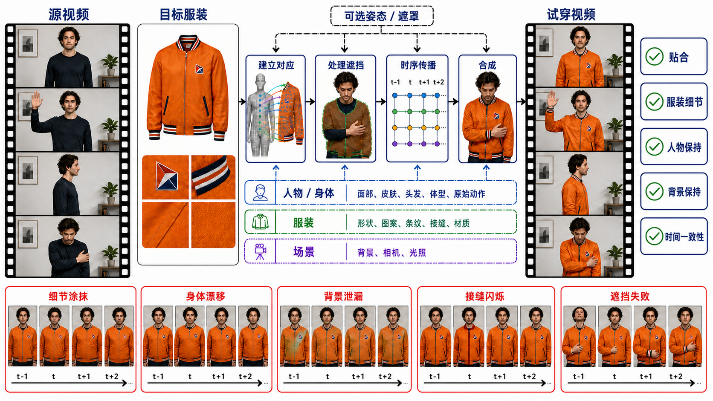

# 视频虚拟试衣：服装—人物—场景的时序守恒

> 本章冻结于 **2026-08-30（Asia/Shanghai）**。它讨论的不是“逐帧把衣服贴上去”，而是把**目标服装作为新的保真对象**，同时守住人物、体型、动作、相机、背景、遮挡关系和时间轴。检索、纳排、代码/数据状态、逐篇反证、流程图验收和未复现边界见[研究日志](../../sources/research_20260830_video_virtual_try_on.md)。

## 学习目标

读完本章，应当能够：

1. 区分 source-video VVT、pose-driven try-on animation、image VTON、通用 V2V、人物动画与 3D 试衣；
2. 写出人物视频、目标服装、多视图、动态编辑域、姿态/解析/指令与输出时间轴都不含糊的 tensor 合同；
3. 用人物/体型、目标服装、场景、时序交互和系统五本账解释“什么必须保持、什么允许变化”；
4. 解释 flow/warp、图像模型加视频引导、latent diffusion、video DiT、pose/3D/detail、长视频 memory、MLLM/reward 与交互控制八条路线；
5. 按“首次公开—正式发表—工件实际开放”而不是宣传顺序提取 2019–2026 里程碑；
6. 识别 paired reconstruction、unpaired transfer、源服装泄漏、正面筛选和合成 benchmark 带来的证据偏差；
7. 设计服装、人物、背景、遮挡/重现、窗口 seam、长程漂移和端到端延迟的可证伪评测；
8. 说明视觉试衣为什么不能证明真实尺码、舒适度、压力、面料物理或退货率下降。

## 1. 两种任务合同，只有一种是严格 V2V

### 1.1 Source-video VVT：源视频定义时间轴

给定人物源视频、一个或多个目标服装参考，以及可选条件：

```math
X_s\in[0,1]^{B\times T\times3\times H\times W},
\qquad
G\in[0,1]^{B\times K\times3\times H_g\times W_g},
```

```math
C=\{M^{body},M^{garment},P,D,S,I,Q\},
```

其中 $M$ 是可选人物/服装/编辑 mask，$P$ 是骨架，$D$ 是 DensePose 或其他几何，$S$ 是 parsing/结构线，$I$ 是自然语言指令，$Q$ 是质量、许可和来源元数据。目标是：

```math
Y\in[0,1]^{B\times T\times3\times H\times W},
\qquad
p_\theta(Y\mid X_s,G,C),
```

并满足：

- $Y$ 与 $X_s$ 具有相同时间戳、帧序、帧率和相机运动；
- 原衣服是**允许变化项**，目标衣服成为新的 fidelity object；
- 人脸、皮肤、头发、体型、手、动作、背景和非目标服饰是守恒项；
- 编辑域随姿态、布料形变与遮挡动态变化，不是固定矩形。

这是严格 [V2V](video-to-video.md) 的专项，因为完整源视频规定了输出反事实的时间轴。

### 1.2 Pose-driven try-on animation：驱动序列定义新时间轴

历史上的 FW-GAN 接口更接近：

```math
Y\sim p_\theta(Y\mid x_{person},G,P_{1:T}),
```

即人物图 + 目标服装 + 驱动姿态序列。它仍是视频虚拟试衣，因为要让同一件目标服装跨时间变形；但没有完整源 RGB 视频需要逐像素守住，所以不是严格 V2V [[1]](#ref-1)。

### 1.3 相邻任务的唯一所有权

| 任务 | 输入锚点 | 新的保真对象 | 必须守住 | 本章是否拥有 |
|---|---|---|---|---:|
| image VTON | 人物图 + 服装图 | 单帧目标服装 | 单帧人物与背景 | 否；不能证明时序 |
| pose/audio 人物动画 | 人物图/视频 + driving | 原人物/原服饰的动画 | 身份、pose/audio 同步 | 邻接；不必迁移新服装 |
| generic video inpainting | 视频 + mask/文本 | 缺失内容 | mask 外区域 | 邻接；没有服装/体型合同 |
| 视频个性化 | 主体参考 + 新 prompt | 人物/对象身份 | 新场景中的主体绑定 | 邻接；服装通常是可编辑属性 |
| 3D cloth simulation | 体型/布料/碰撞/物理参数 | 可计算布料状态 | 力学与接触 | 邻接；视觉 VVT 不等于物理求解 |
| story/multishot | 跨镜头角色与服装状态 | 叙事事实 | 镜头间 outfit state | 邻接；单镜头落地归 VVT |
| **source-video VVT** | 源人物视频 + 目标服装 | **目标服装** | **人物、体型、动作、场景、时间** | **是** |
| **pose-driven VVT** | 人物图 + 服装 + pose 序列 | **目标服装** | **人物身份、驱动、服装时序** | **是** |

~~~mermaid
flowchart TD
    accTitle: 视频虚拟试衣任务边界决策树
    accDescr: 先判断是否存在目标服装，再判断是否有完整源人物视频；有源视频且要求同时间轴换装时进入严格V2V专项，无源视频但有人物图和姿态序列时进入试衣动画。单帧、普通补全、身份个性化和物理仿真分别路由到邻接任务。

    Q0["视觉条件的视频请求"] --> G{"是否有目标服装参考？"}
    G -- "否" --> N["人物动画 / 个性化 / 通用编辑"]
    G -- "是" --> V{"是否有完整人物源视频？"}
    V -- "是，保留同一时间轴" --> SV["source-video VVT<br/>严格 V2V 专项"]
    V -- "否" --> P{"人物图 + pose/driving sequence？"}
    P -- "是" --> PA["pose-driven try-on animation<br/>VVT，但非严格 V2V"]
    P -- "否，只需一张图" --> IV["image VTON<br/>无时序证据"]
    SV --> PHY{"是否声称真实尺码/舒适/力学？"}
    PA --> PHY
    PHY -- "是" --> SIM["还需测量、服装规格、3D cloth 或实穿试验"]
    PHY -- "否，仅视觉换装" --> LED["进入五本守恒账与时序评测"]
~~~

**顺序化文字替代：** 先检查是否给出目标服装；没有目标服装时，通常是人物动画、个性化或通用编辑。有完整人物源视频并要求同一时间轴换装时，进入 source-video VVT；只有人物图和姿态/驱动序列时，进入 pose-driven VVT；只有单帧输出则是 image VTON。任何关于真实尺码、舒适度或物理布料的主张，还必须增加测量、规格、物理模拟或实穿证据。

### 1.4 最小 tensor 与时钟合同

| 字段 | 示例形状 | 必须冻结的语义 |
|---|---|---|
| Source RGB | $X_s:B\times T\times3\times H\times W$ | 原始/转码版本、fps、时间戳、色彩空间、裁剪与相机 |
| Garment references | $G:B\times K\times3\times H_g\times W_g$ | SKU/视图、正背面、细节 crop、颜色配置、来源与许可 |
| Target person | $n^*:B$ 或指令中的实体槽 | 多人视频中换谁；不能靠“最大人物”隐式猜测 |
| Dynamic edit support | $E:B\times T\times1\times H\times W$ | 服装、裸露皮肤、头发/手/包之间的动态支持域 |
| Pose/geometry | $P,D:B\times T\times C_p\times h_p\times w_p$ | 坐标系、置信度、缺失值、时间平滑、是否仅离线使用 |
| Garment structure | $S_g:B\times K\times C_s\times h_s\times w_s$ | mask、edge、logo/text、landmark 或 3D proxy 的生成版本 |
| Instruction | $I:B\times L$ | 目标人物、服装组合、保留/变化项与冲突优先级 |
| Output | $Y:B\times T\times3\times H\times W$ | 必须映射回源时间戳；不能悄悄丢帧、改速或裁切 |
| Stream state | $H_k,A,W_k$ | active window、短期 cache、长期外观锚和清空/更新规则 |

如果方法在内部使用时间压缩率 $r_t$ 的 VAE，RGB 第 $t$ 帧与 latent 第 $\lfloor t/r_t\rfloor$ 个 token 的对齐、窗口边界和重复/平均规则都必须公开。否则“64 帧”可能是 RGB 帧、latent 帧或重复解码后的显示帧，系统比较会失真。

## 2. 五本守恒账：平均好看不等于换装成功

### 2.1 人物与体型账

必须保存：脸、肤色、头发、手、肩宽、腰臀、四肢比例、身体轮廓、源 pose/动作和非目标人物。服装变化不能成为重绘身体的许可证。

对源视频的非编辑支持域 $\bar E_t=1-E_t$，可定义：

```math
L_{preserve}
=\frac{\sum_t\|\bar E_t\odot(Y_t-X_{s,t})\|_1}
{\sum_t\|\bar E_t\|_1+\epsilon},
```

但这个量依赖 $E_t$ 是否准确，只能作为区域诊断，不能替代脸、体型、皮肤/头发和手的独立检查。

### 2.2 目标服装账

至少拆成：类别、整体廓形、领口、袖长、下摆、颜色、图案/logo/文字、缝线、面料视觉、褶皱和多件服装层次。单视图未显示的背面细节属于**不可辨识变量**；模型生成合理背面是先验补全，不是“恢复了真实背面”。

对可见服装 crop $R_t$ 和参考视图 $G_k$，可以用校准后的 embedding 做检索：

```math
s_t^{garment}=\max_k\cos\bigl(\phi(R_t\odot Y_t),\phi(G_k)\bigr),
```

但 CLIP/DINO 只是一层证据；logo/文字还需 OCR/字符级比较，线条、纹理、面料和前后视图需要专门标注与人工复核 [[33]](#ref-33), [[34]](#ref-34)。

### 2.3 场景与非目标内容账

背景、相机、光照趋势、道具、包、鞋、裤子或未指定的其他服饰应保持。多人场景还要检查非目标人物是否被换装或消失。`BG-L1` 与 `BG-DINO` 的支持域必须写明是 garment 外、full-human 外还是人工稳定背景；三者不可混用。

### 2.4 时序与交互账

它不是“相邻帧相似”这一件事，而是：

- 服装纹理随人体/相机运动而运动，而非粘在屏幕坐标；
- 手臂、手、头发、包带与服装的前后遮挡顺序正确；
- 被遮住的 logo/边缘在重现后回到同一身份；
- 转身、出画再入画和 zoom 后不换色、不换版型；
- 分段、overlap、autoregressive 或 rolling window 的 seam 不可见；
- 动作幅度和速度与源视频一致，不能靠静止/平滑刷高分。

### 2.5 系统账

离线总耗时、第一可见结果（TTFF）、持续吞吐、每次更新抖动、P50/P95、峰值显存和状态大小要分开报告：

```math
TTFF=t_{decode\ input}+t_{parse/pose/mask}+t_{lookahead}
+t_{first\ denoise}+t_{decode\ output}+t_{I/O}.
```

只报 denoiser FPS，会漏掉解析、DensePose、mask smoothing、关键帧试衣、前视缓冲和视频编解码。

## 3. 一张图读懂“对应—遮挡—传播—合成”



**图 1：VVT 不是一条平均损失，而是多账本硬合同。** `CORRESPOND` 负责把参考服装结构映射到每帧人体；`OCCLUDE` 决定手、头发、包与衣物的前后层次；`PROPAGATE` 在转身、遮挡和窗口间维持状态；`SYNTHESIZE` 只在动态支持域内产生合理像素。蓝/橙/绿三本账分别记录人物/体型、目标服装和场景；右侧五道门不可互相抵消。生成/修正意图、尺寸、SHA-256 与灰度验收见[研究日志](../../sources/research_20260830_video_virtual_try_on.md#11-teaching-visual-record)。

**顺序化文字替代：** 人物视频和目标服装先与可选 pose/mask 一起进入对应估计；系统再判断每帧可见区域与遮挡顺序，把服装状态跨帧和窗口传播，最后在动态编辑域合成。输出依次检查贴合、服装细节、人物/体型、背景和时序；出现细节模糊、身体重绘、背景泄漏、窗口闪烁或遮挡顺序错误，任何一项都判失败。

## 4. 为什么逐帧 image VTON 必然不够

逐帧模型优化的是：

```math
\hat Y_t=f_\theta(X_{s,t},G,C_t),
```

却没有约束 $\hat Y_t$ 与 $\hat Y_{t-1}$ 共享同一件“动态服装状态”。即使每帧都像一张好图，也会出现：

1. **坐标歧义：** 同一 logo 在人体坐标、服装 UV、相机坐标和像素坐标间无显式对应；
2. **遮挡歧义：** 当前帧看不见袖口时，下一帧要恢复哪一版细节没有记忆；
3. **随机采样抖动：** 独立 noise、scheduler 与 cross-attention 产生细微颜色/纹理漂移；
4. **非刚性形变：** flow 能传播可见像素，却不能解释新露出的布料表面；
5. **mask 抖动：** parsing/DensePose 的单帧误差被模型放大成轮廓闪烁；
6. **大背景占比：** SSIM/LPIPS 可能很高，因为模型复制了大部分源图，即使衣服错了；
7. **长视频分段：** 每个 clip 局部合理，但没有序列级外观锚时会跨窗口换色、换纹理。

WildVidFit 说明图像网络可以借助 VideoMAE、相邻 latent 对齐和 co-denoising 获得时序改善，但它在 VVT 上并未全面超过 ClothFormer；这个结果正好说明“图像质量强 + 视频先验”是一条路线，不是对 video-native 建模的普遍替代 [[7]](#ref-7)。

## 5. 四个核心机制：对应、可见性、记忆与生成

### 5.1 对应不是一个 flow

参考服装到视频帧的映射可写成：

```math
\Pi_t:(u_g,v_g,k)\mapsto(x_t,y_t,v_t),
```

其中 $(u_g,v_g)$ 是参考/UV 坐标，$k$ 是参考视图，$(x_t,y_t)$ 是输出像素，$v_t\in[0,1]$ 是可见性。真实系统通常只近似其中一部分：

- 2D flow/warp 对已见纹理有效；
- human/garment landmarks 给出稀疏结构；
- DensePose 提供人体表面而非服装表面；
- DINO/CLIP token 提供语义/局部外观而非精确 UV；
- textured 3D proxy 提供多视角对应，但受重建、人体拟合和不可见面影响；
- DiT attention 可以隐式学对应，但可解释性和反事实控制更弱。

### 5.2 遮挡是有向关系，不是 mask 相减

在一个像素邻域内，可能存在：

```math
\text{hand}\succ\text{sleeve}\succ\text{torso},
\qquad
\text{hair}\succ\text{collar},
\qquad
\text{bag strap}\succ\text{coat},
```

其中 $a\succ b$ 表示 $a$ 应显示在 $b$ 前面。只给 garment mask 不能告诉模型顺序；手臂交叉、头发扫过领口和抓衣动作需要 pose、深度、分层表示或足够的时空先验。评测必须故意翻转遮挡顺序，而不是只看无遮挡正面。

### 5.3 短期记忆与长期外观锚解决不同问题

短期 cache 适合传播速度、手臂/衣物交互和最近遮挡；长期锚适合保持颜色、logo 和整体 dressed appearance。若只用短期 FIFO，早期状态会被逐出；若只用固定外观 reference，动作和遮挡会僵硬。LiveVVT 的 temporal memory 与 garment/frontal-try-on global memory 正是这一区分的代表，但完整 memory 也带来吞吐与 LPIPS 代价 [[29]](#ref-29)。

### 5.4 生成器必须学会“保留”而不只是“画衣服”

常见条件化位置包括：

- channel concat：noisy latent + agnostic/source + mask；
- temporal concat：person token 与 garment token 作为同一视频序列；
- reference UNet/encoder：单独提取 garment feature；
- cross-attention：语义、局部 crop、pose 或 MLLM task token；
- self-attention：garment token 与 video token 全时空交互；
- RoPE/position encoding：区分帧、空间、服装/人物 token；
- loss/reward：mask-aware loss、temporal regularizer、human/MLLM preference。

把条件接进去不等于条件被正确使用。最小消融要分别移除 garment、source、pose/mask、temporal module、memory 和 reward，并观察每本账，而不是只报一个平均 VFID。

## 6. 八条技术路线

### 6.1 A：显式 flow/warp + GAN

FW-GAN 通过 flow-navigated warping 连接人物、服装与 pose sequence [[1]](#ref-1)。ShineOn 对 practical video-based try-on 的设计选择做了较早系统审查 [[2]](#ref-2)。MV-TON 用 memory refinement 传播前帧信息 [[3]](#ref-3)。ClothFormer 把抗遮挡 warp、appearance-flow tracking 和双流 Transformer 组合起来，使对应与时序不再完全藏在生成器里 [[4]](#ref-4)。

优点是几何责任清楚、已见纹理可直接传播；缺点是大姿态、宽松衣物、拓扑变化和新露表面会让 warp 产生洞、拉伸和复制伪影。它仍是诊断 baseline：如果 video DiT 连已见 logo 的随动都不如 flow，说明大模型容量没有转化为正确对应。

### 6.2 B：image VTON + temporal guidance

WildVidFit 用图像 try-on 网络、VideoMAE 重建 guidance、相邻帧 latent 相似度和 temporal co-denoising；它不做任务特定的视频 clip 时序训练，但 TikTok 视频帧进入联合训练，不能简写成“完全不用视频数据” [[7]](#ref-7)。Dressing in the Wild by Watching Dance Videos 也利用跨帧自监督从舞蹈视频学习人物/服装关系，是这一旁支的重要数据思想 [[5]](#ref-5)。

该路线适合视频数据少、图像数据多的场景。风险是视频先验只鼓励平滑，不保证目标服装身份、源动作或正确遮挡。

### 6.3 C：双分支 latent diffusion

ViViD 用 garment encoder、pose encoder、temporal module 和 image-video joint training，建立 9,700-pair 数据规模 [[6]](#ref-6)。GPD-VVTO 从图像阶段进入视频阶段，用 DINOv2 语义/局部服装特征和 garment-aware temporal attention [[9]](#ref-9)。Tunnel Try-on 用人体 tunnel crop、位置编码和环境 encoder 减少大背景稀释，但“commercial-level”只能保留为作者表述 [[8]](#ref-8)。

双分支把目标服装与 person/video 分开编码，适合保留局部纹理；代价是两个条件空间可能错位，pose/mask 误差会级联，clip diffusion 仍需要分段。

### 6.4 D：native video DiT / conditional inpainting

VITON-DiT 把无配对舞蹈视频与 Diffusion Transformer 引入 in-the-wild VVT [[11]](#ref-11)。Fashion-VDM 用 split CFG 和 8→16→32→64 帧渐进训练 [[10]](#ref-10)。SwiftTry 用 temporal attention 与 ShiftCaching 减少长视频重复计算 [[12]](#ref-12)。CatV2TON 用 temporal concatenation 统一图像/视频，MagicTryOn 则用全时空 DiT、细/粗 garment condition 和 garment-aware RoPE [[13]](#ref-13), [[16]](#ref-16)。ViTI 与 DreamVVT 继续探索 conditional DiT inpainter 和 stage-wise in-the-wild 训练 [[17]](#ref-17), [[18]](#ref-18)。

Video DiT 的优势是直接在时空 token 中融合 source、garment 与 motion；风险是算力大、训练数据/底座能力混杂、窗口 seam 和条件泄漏不易定位。

### 6.5 E：pose / 3D / keyframe detail

DPIDM 把人体与服装骨架注入每层 pose-aware spatial/temporal attention，并加 temporal-shift 与相邻帧正则 [[14]](#ref-14)。3DV-TON 从关键帧 try-on 构建可动画 textured 3D proxy，再给 diffusion 提供逐帧 guidance [[15]](#ref-15)。KeyTailor 选择关键帧并注入 garment/background 细节，配套 ViT-HD 高分辨率数据 [[20]](#ref-20)。Eevee 面向 close-up 高分辨率场景，并提出更细的 garment identity 诊断 [[21]](#ref-21)。

这条路线更直接地解决“衣服怎样贴合/重现”；代价是 pose、3D、关键帧和 source-garment region 可能成为新的 shortcut。KeyTailor 的 paired GDDE 尤其需要源服装泄漏反事实。

### 6.6 F：长视频、anchor、memory 与 rolling stream

CatV2TON 用 overlap、previous-frame guidance 和 AdaCN；SwiftTry 试图减少 overlap 重算。VFR 以 segment-autoregressive prefix 与 360-degree anchor 延长到分钟级，但“arbitrarily long”是架构主张，不等于有限内存永不漂移 [[19]](#ref-19)。LiveVVT 用 bounded-look-ahead rolling window、短期 temporal cache 和持久 garment/dressed memory，把每次更新成本与总长度解耦 [[29]](#ref-29)。

必须分别报告：是否需要未来输入、look-ahead 帧数、first chunk、每次更新、持续 FPS、cache 大小、累计漂移和重新锚定策略。

### 6.7 G：coarse/no auxiliary priors、MLLM 与 reward

TripVVT 用 coarse human mask、pose 与 garment/line encoder，重点是 in-the-wild triplet supervision [[22]](#ref-22)。UniVVT 在推理时移除 mask/pose/warp，用 MLLM perceiver 和 semantic bridge；但离线训练数据构造仍使用 DensePose inpainting [[27]](#ref-27)。InstructVVT 把目标人物和换装意图写成 instruction，以 MLLM edit token、garment token 和 source latent 条件化，并用 DiffusionNFT 做 try-on reward post-training [[28]](#ref-28), [[37]](#ref-37)。

“无推理先验”改善接口和上游错误传播，但不自动意味着更小、更快、更物理或训练数据无合成偏差。MLLM reward 必须与未参与训练的人工 gold set 校准。

### 6.8 H：交互、多服装、wearable 与相机控制

FashionChameleon 研究实时切换多件服装及 KV cache refresh/withdraw/disentangle [[23]](#ref-23)。iTryOn 处理手与服装的接触及时间戳指令 [[24]](#ref-24)。OmniTryOn 把衣服、包、鞋和脸纳入统一 anything-try-on 接口 [[25]](#ref-25)。TryOnCrafter 用可渲染 4D try-on proxy 支持相机轨迹控制 [[26]](#ref-26)。

任务面扩大后，不能用一个总分掩盖对象差异：鞋需要脚部接触，包需要背带/手部层次，脸部替换涉及生物身份与同意，相机控制需要视角可见性和新表面一致性。

## 7. 2019–2026：里程碑不是一张排行榜

| 年份 | 里程碑 | 技术增量 | 最重要的证据边界 |
|---:|---|---|---|
| 2019 | FW-GAN [[1]](#ref-1) | flow/warp + GAN；pose-driven VVT | 人物图 + pose 序列，不是完整 source-video V2V |
| 2021 | ShineOn / MV-TON [[2]](#ref-2), [[3]](#ref-3) | practical design 与 memory refinement | 低分辨率/早期协议，不代表当前真实场景 |
| 2022 | ClothFormer [[4]](#ref-4) | 抗遮挡 warp、flow tracking、双流 Transformer | 当前官方仓不是可运行实现 |
| 2024 | ViViD [[6]](#ref-6) | 大规模高分辨率 VVT 数据 + video diffusion | VVT 表格与后续重算不可直接横排 |
| 2024 | WildVidFit / GPD-VVTO [[7]](#ref-7), [[9]](#ref-9) | 图像先验引导视频、garment-aware temporal diffusion | 视频数据/私有数据和 metric protocol 不同 |
| 2024 | Fashion-VDM [[10]](#ref-10) | split CFG、单次 64 帧 | 作者明确 agnostic input 与不可见面失败 |
| 2025 | SwiftTry / CatV2TON [[12]](#ref-12), [[13]](#ref-13) | cache/overlap、统一 image-video DiT | speed 绑定硬件；ViViD-S 只测正面 |
| 2025 | DPIDM [[14]](#ref-14) | 人—衣动态 pose interaction | 60.5% 只对应一项 VFID-I 相对下降 |
| 2025 | 3DV-TON / MagicTryOn [[15]](#ref-15), [[16]](#ref-16) | textured 3D guidance、强 video DiT 细节 | 前者关键 pipeline 未全开；后者仍高成本 |
| 2026 | KeyTailor [[20]](#ref-20) | 关键帧细节 + ViT-HD | paired garment-region shortcut；方法代码未发布 |
| 2026 | TripVVT [[22]](#ref-22) | 10K 反向三元组与 hard benchmark | 合成 source/重建 garment；表文冲突 |
| 2026 | UniVVT / InstructVVT [[27]](#ref-27), [[28]](#ref-28) | 去推理几何先验、指令与 reward | 合成 teacher/MLLM 依赖；仍非实时 |
| 2026 | LiveVVT [[29]](#ref-29) | bounded rolling diffusion 与双 memory | 非严格零前视；预处理/计时硬件未完整披露 |

一个工作可以是机制里程碑，却没有开放代码；也可以开放 inference，却没有训练或数据；还可以在 preprint 首发后才正式发表。教材必须把这三条时间线分开。

## 8. 重点 paper review：读贡献，也读表格反证

### 8.1 ViViD：数据规模是增量，评测闭环仍旧窄

ViViD 的 9,700 对、1,213,694 帧、832x624 和三类服装把 VVT 从 791 个 256x192 走秀片段推到更有训练价值的规模。模型把 garment latent/mask、CLIP image embedding、DensePose 与 temporal module 分工，并交替采样 image/video 数据；图像 batch 冻结 temporal module，视频 batch 训练 24 帧时序 [[6]](#ref-6)。

但论文主表仍在旧 VVT 上做 paired reconstruction。高 SSIM 可能同时受背景复制、同衣服重建和低复杂度动作帮助。安全结论是“建立了更大公开数据与可用 diffusion baseline”，不是“证明跨衣服、背视角、长期重现已解决”。

### 8.2 CatV2TON：统一架构不等于统一证据

CatV2TON 的 temporal concatenation 很干净：person/video 与 garment 条件以时间 token 进入同一 DiT，自注意力承担融合；训练参数不足 backbone 的五分之一。长视频把上一 clip 尾帧作为下一 clip prompt，再用 AdaCN 校正 clip 统计 [[13]](#ref-13)。

关键限制来自数据与消融：ViViD-S 从 7,759 个训练视频中筛出 6,064 个、513,896 个**正面帧**，测试仅 180 个 64-frame frontal clips。背面、转身重现和强遮挡不能由该表证明。AdaCN full variant 也不是每个指标都改善；这提示 clip normalization 可能在 seam 与局部重建之间做 Pareto 交换。

### 8.3 DPIDM：姿态交互有效，但比较不是完全 matched

DPIDM 不只把 pose image 加到输入，而是训练 garment landmark estimator，把 human/garment pose 注入 attention，分别建模帧内 fit 与跨帧 pose dynamics。它在 VVT 上报告 VFID-I 0.506，相对 GPD-VVTO 1.280 降低 60.5% [[14]](#ref-14)。

这个数字有三层边界：只是一项指标；DPIDM 用 SD1.5，GPD-VVTO 用 SD2.1；ViViD baseline 的 SSIM 0.949 仍高于 DPIDM 0.930。更重要的是，论文删除了 ViViD 背身测试片段。正确读法是“显式 pose interaction 对该协议的时序分布指标有明显贡献”，不是“整体、所有姿态、所有服装领先 60.5%”。

### 8.4 KeyTailor：细节注入可能变成目标泄漏

KeyTailor 的 GDDE 从输入视频关键帧的 garment region 提取动态细节，CBDO 维护背景。paired protocol 中，源人物视频已经穿着 ground-truth/reference garment，因此 GDDE 可能直接看见答案；unpaired protocol 中，它又可能把源衣服细节注入新衣服 [[20]](#ref-20)。

因此最有价值的补实验不是再报一项 VFID，而是四组反事实：保留源 garment crop、把它遮掉、换成冲突 logo、跨视频打乱；同时目标 garment 固定。若输出随 source crop 而非 target reference 变化，就暴露 shortcut。论文“0.2057B trainable”也不能简写成轻量推理：约 14.6B 参数仍参与生成，64 帧作者耗时 281.65 秒且未给 timing GPU。

### 8.5 TripVVT：数据更难，但不是现实换衣复拍

TripVVT-10K 的每条 121-frame triplet 是“真实 target + 合成不同服装 source + 重建 garment reference”。它能用真实视频作为 ground truth，构造跨服装监督；同时也继承 Nano Banana/Wan-Animate 的外观、动作和失败偏差。TripVVT-Bench 只有 100 个同流水线 held-out case [[22]](#ref-22)。

论文还给出罕见的表文冲突：文字称移除 pose 的定量影响较小，表中 VFID-I 却从 20.72 恶化到 33.66，SSIM 从 0.854 降到 0.576，LPIPS 从 0.105 升到 0.274。教材以表格为证据，并把 prose 记作错误总结。相同 benchmark 在 InstructVVT 中重评的 CLIP/LPIPS 也大幅变化，所以不能跨 PDF 复制排名。

### 8.6 UniVVT 与 InstructVVT：去推理先验，不是去掉先验

UniVVT 用 Qwen3-VL perceiver、semantic bridge 与 Wan2.1-Fun-Control，推理时不需要 mask、pose 或 warping；三阶段分别做 semantic alignment、joint adaptation 和 flexible-resolution LoRA [[27]](#ref-27), [[36]](#ref-36)。然而训练 triplet 的 source 由 DensePose-conditioned inpainter 合成，几何先验只是移到离线数据构造。17.7–38.1x 也只比较 conditioning/preprocessing，不含 diffusion 生成。

InstructVVT 进一步用自然语言指向目标人物与服装语义。训练包含约 100K CatVTON 图 triplet、10K MagicTryOn ViViD 视频 triplet 和 TripVVT-10K；其中 10K generated video 没有额外质量过滤。79.4% 是四方法 shortlist 的 first-place vote，不是表内所有方法的胜率。reward 与人工的 Spearman 只有 0.368，说明可作为优化信号但远非可靠 oracle [[28]](#ref-28), [[37]](#ref-37)。

三段 supervised training 各用 8 张 H100，RL 阶段则用 40 张 H100；论文没有给出推理采样步数与端到端 latency。Full RL 相比 no-RL 的 VFID-R 与 CLIP-F 还略退，因此只能说“多数账本改善”，不能写成全面 Pareto 改进。

### 8.7 LiveVVT：实时主张必须拆成缓冲、前视与预处理

LiveVVT 的 active window 含四个不同 noise level 的 chunk，每个 chunk 对应三个 latent frames；每次联合去噪后只发出最前 chunk。窗口内仍是双向 attention，窗口间才因果递推。因此它是 **bounded look-ahead**，不是零未来帧的 strict causal [[29]](#ref-29)。

作者在 512x384 报告首块 1.56 秒、持续 22.39 FPS、每次更新约 0.5 秒；但论文只明确训练用八张 A100-80GB，没有清楚绑定 timing hardware，也未证明 mask、DensePose、agnostic frame、A-pose keyframe 和编解码全部计入。全 memory 将 FPS 从 26.74 降到 22.39、LPIPS 从 0.088 变差到 0.099，同时改善 VFID/SSIM。这是典型质量—效率 Pareto，不应只取最好听的一边。

## 9. 数据集：先问监督是怎样构造的

VITON-HD 与 DressCode 是高分辨率 image VTON 数据祖先，适合学习单帧服装细节，却不能凭逐帧测试证明 video temporal consistency [[30]](#ref-30), [[31]](#ref-31)。视频数据又有四种本质不同的监督：

1. **同衣服 paired reconstruction：** 源视频与 ground truth 穿同一件衣服；像素指标可算，但复制 source garment 是捷径；
2. **真实跨衣服 capture：** 同一人物/动作在不同衣服下复拍；最接近目标，却很难严格同步；
3. **合成 cross-garment triplet：** 用图像/视频生成器制造不同衣服 source；规模大，但带 teacher bias；
4. **unpaired transfer：** 任意目标衣服，无像素 ground truth；必须依赖分账指标与人工评测。

### 9.1 核心数据账本

| 数据 | 规模/协议 | 能证明什么 | 不能证明什么 |
|---|---|---|---|
| VVT | 791 clips，256x192，常用 661/130；总帧记载冲突：205,675 vs 190,101 | 历史 paired baseline | 高分辨率、复杂背景、广泛动作或真实 cross-garment；跨论文帧数口径不明 |
| ViViD | 9,700 pairs，1,213,694 frames，832x624，7,759/1,941 | 三类服装与更大 video training | 论文删除 back view 后仍与完整 split 可比 |
| ViViD-S | 6,064 train videos/513,896 frontal frames；180 test clips，每条 64 frontal frames | 控制正面条件下的 clip 比较 | 背面、强遮挡、完整 test distribution |
| WildVidFit TikTok | 从 300+ 选 165 upper-body videos；130/35 | dance、复杂 pose/遮挡 | 未筛选 TikTok 分布、全身/多品类 |
| TikTokDress | SwiftTry 发布的高分辨率动态集 | 长视频效率和舞蹈动作 | 离开其服装/人群/拍摄域的保证 |
| HR-VVT | 130 high-resolution videos | 3D-guidance 对照 | 大规模总体结论 |
| ViT-HD | 15,070 clips，810x1080，13,070/2,000 | close/high-resolution detail | 收集过滤后的严重遮挡或街景泛化 |
| TripVVT-10K | 10,031 triplets，121 frames，720x1280，30 类 | 跨衣服与复杂场景训练 | 真实 before/after capture、无 teacher 污染 |
| TripVVT-Bench | 100 held-out cases | 固定 hard-case 比较 | 独立分布和窄置信区间 |
| TryAny-Bench | 1,460 paired videos，1,243/217 | 多 wearable/object 接口 | 单一 garment-only 排名 |

### 9.2 Split 必须隔离三种身份

不能按 frame 随机拆分。至少以联合键分组：

```math
group=(person\ identity, capture\ session, garment/SKU).
```

否则同一视频的相邻帧、同一电商 SKU 的近重复图或同一人物同一拍摄会同时落入 train/test。对互联网预训练底座，还要做近重复检索并承认无法完全审计的污染边界。

### 9.3 正面筛选不是无害清洗

CatV2TON 的 ViViD-S 主动保留正面连续帧；DPIDM 也删除 ViViD 背身测试片段但未报告剩余数。这样可减少 agnostic mask 错误，却同时删除了最能检验背面、重现和大形变的样本。两者数值不能与原始完整 split 直接横排。

## 10. 评测：每项能力声明对应一组难作弊的证据

### 10.1 先分 paired 与 unpaired

Paired reconstruction 有像素对齐 ground truth，可报 SSIM/LPIPS；unpaired transfer 没有“这个人穿另一件衣服但动作完全相同”的真实像素视频，不能伪造 SSIM/LPIPS。两条 track 必须分表，不能把 paired 高分写成跨衣服成功。

### 10.2 五本账的最小指标组

| 账本 | 自动诊断 | 人工/规则诊断 | 受控破坏 |
|---|---|---|---|
| 目标服装 | garment crop DINO/CLIP retrieval；OCR；edge/line；VGID 类指标 | 类别、领袖下摆、logo/文字、面料、前后视图 | 单帧换 logo、改纹理、遮挡后重现 |
| 人物/体型 | face/ID、body silhouette、skin/hair/hand、pose/flow | 人脸、肩腰比例、四肢、非目标人物 | 体型膨胀、脸替换、皮肤暴露 |
| 背景/非目标 | outside-region L1/DINO、object persistence | 相机、光照、道具、包、鞋、其他衣物 | 背景 patch 替换、相机轻移 |
| 时序/交互 | flow-warp error、tLPIPS、seam、re-entry recovery | 手/头发/包遮挡顺序、动作幅度 | order 反转、边界闪烁、静态化 |
| 系统 | TTFF、P50/P95 update、FPS、jitter、VRAM、state | 首个可用结果与连续性 | 加长视频、换硬件、计入预处理 |

CLIP 更适合粗语义，不足以验证小字/logo；DINOv2 对局部结构更敏感，也不是服装计量仪 [[33]](#ref-33), [[34]](#ref-34)。LPIPS 是感知 patch 距离，依赖像素对齐，且背景可主导均值 [[35]](#ref-35)。FVD/VFID 依赖 feature backbone、样本数、帧数、分辨率与预处理；不同表中即使名字相同也可能处于完全不同尺度 [[32]](#ref-32)。

### 10.3 现有数值为什么不能组成 SOTA 排名

- VFID-ResNeXt 至少存在约 100 倍尺度漂移：同一个 VVT/FW-GAN 被报为 0.1215 与 12.15，VVT/ClothFormer 被报为 0.0505 与 5.048。ViViD 又不只是简单缩放：CatV2TON 重跑是 `VFID-I 3.793 / VFID-R 0.0348 / SSIM 0.822 / LPIPS 0.107`，原表则是 `3.405 / 5.074 / 0.949 / 0.068`。
- MagicTryOn Turbo 的作者实测是单张 H20、624x832、64 帧用 6.69 秒，即约 9.57 generated FPS；这不能改写成 24/30 FPS 实时，也未说明是否计入预处理与 I/O。
- MagicTryOn 报 624x832、64 帧；UniVVT 明说定量在 512x384，却复用相近 baseline 数字；InstructVVT 又在其表述的 180x61 帧、832x624 协议下复用部分 VFID。若没有冻结输出、预处理和 evaluator，不能解释为严格 matched rerun。
- TripVVT 与 InstructVVT 对同一 TripVVT-Bench 的 CLIP-I、CLIP-F 和 LPIPS 数值明显漂移。
- `CLIP-F` 的相邻帧相似会奖励静止或过平滑；必须同时测 source motion/flow agreement。
- `BG-L1`/`BG-DINO` 取决于 garment mask、full-human mask 还是 stable-background mask，支持域不一致。
- Gemini/MLLM judge 的模型版本、prompt、抽帧与自身训练数据都会改变分数。

因此正文只在**同一论文、同一表、同一协议**内讨论相对变化，并把跨论文数字当作协议案例，不做总榜。

~~~mermaid
flowchart TD
    accTitle: 视频虚拟试衣的多账本评测流程
    accDescr: 先冻结输入输出与预处理版本，再分 paired 和 unpaired；随后并行检查目标服装、人物体型、背景、时序交互和系统性能，任何安全或身份硬失败都直接拒绝，只有全部门通过才进入人工盲评和统计报告。

    F["冻结 source / garment / instruction<br/>seed / fps / resolution / preprocessing"] --> S{"paired reconstruction<br/>还是 unpaired transfer？"}
    S -- "paired" --> P["SSIM / LPIPS + 五账本"]
    S -- "unpaired" --> U["不报像素 GT 指标<br/>五账本 + human"]
    P --> G["目标服装<br/>结构 / logo / text / material"]
    U --> G
    P --> B["人物与体型<br/>ID / skin / hair / hand / silhouette"]
    U --> B
    P --> C["场景与非目标<br/>background / camera / props"]
    U --> C
    P --> T["时序与交互<br/>motion / occlusion / seam / re-entry"]
    U --> T
    P --> R["系统<br/>TTFF / P95 / FPS / memory"]
    U --> R
    G --> H{"是否存在硬失败？"}
    B --> H
    C --> H
    T --> H
    R --> H
    H -- "身份错、裸露、目标衣服错、严重泄漏" --> X["拒绝；平均分不得抵消"]
    H -- "全部通过" --> M["盲化人工成对比较<br/>分层 bootstrap CI + failure gallery"]
~~~

**顺序化文字替代：** 首先冻结源视频、服装、指令、seed、分辨率、帧率与预处理版本；再把 paired reconstruction 与 unpaired transfer 分开，后者不使用像素 ground truth 指标。两条 track 都并行检查目标服装、人物/体型、背景/非目标内容、时序交互和系统性能。任何身份错误、非自愿暴露、目标服装错误或严重泄漏都直接拒绝；全部硬门通过后，才进行盲化人工比较、置信区间与失败样本报告。

### 10.4 人工评测也要可审计

至少公开：参与者数量、样本数量、每人比较数、方法 shortlist、随机顺序、是否可暂停/逐帧/放大、评分 rubric、冲突处理、置信区间和原始匿名统计。InstructVVT 的 79.4% 只来自四方法 shortlist；不在 shortlist 的方法标 `–`，不能被解释为输了。

## 11. `TryOnLedger-1`：一个可执行的 matched protocol

### 11.1 两条 track

- **P-track：paired reconstruction。** 目标服装与源服装相同，测像素/细节重建和时序；必须增加 source-copy counterfactual。
- **U-track：unpaired transfer。** 目标服装在类别、颜色、logo、领口或长度上与源服装冲突；不报 SSIM/LPIPS，测分账与盲评。

### 11.2 数据分层

每个组合至少覆盖：

- 上衣、下装、连衣裙、宽松/贴身、多层服装；
- 不同肤色、体型、年龄呈现、性别表达与行动能力；
- 正面、侧面、背面、180/360 转身；
- 手臂交叉、手抓/拉衣服、头发扫过领口、包带压衣、坐下；
- 快速运动、motion blur、zoom、相机移动；
- 出画再入画、多人遮挡和目标人物歧义；
- 16-frame、64-frame、10-second、60-second 与 streaming；
- window 边界正好落在转身、遮挡或 zoom 的 adversarial placement。

### 11.3 冻结变量

对每个方法保存 machine-readable manifest：

~~~yaml
task: video_virtual_try_on
track: paired_or_unpaired
source_video_sha256: ...
garment_reference_sha256: ...
target_person_id: ...
instruction: ...
input_fps: ...
output_fps: ...
resolution: ...
frames: ...
preprocess_versions:
  parsing: ...
  pose: ...
  densepose: ...
  mask_smoothing: ...
model_revision: ...
weights_sha256: ...
sampler: ...
steps: ...
guidance: ...
seed: ...
window_and_overlap: ...
lookahead_frames: ...
hardware: ...
precision: ...
evaluator_versions: ...
~~~

### 11.4 四类 matched baseline

1. explicit flow/warp + temporal synthesis；
2. latent diffusion with garment branch + temporal attention；
3. native video DiT / conditional inpainting；
4. long/streaming route with overlap、anchor 或 memory。

比较时统一输入、预处理、帧、分辨率、seed 数、硬件和 evaluator。若模型必须使用独有的 pose/mask，则把条件成本和失败率记在系统账，而不是强行删掉其必要输入。

### 11.5 十个受控反事实

| 反事实 | 只改变 | 希望证伪 |
|---|---|---|
| source garment hide | 遮掉源服装 crop | 模型复制源衣服而非看 target |
| source garment swap | 源 crop 换冲突 logo/颜色 | source-garment leakage |
| target reference swap | 交换 target garment | 条件是否真正控制输出 |
| target multi-view drop | 去掉背面/细节图 | 不可见面是否被错误声称恢复 |
| pose corruption | 丢 5% keypoints/局部 DensePose | 上游 estimator robustness |
| mask jitter | 轮廓膨胀/缩小/时间抖动 | mask 错误传播 |
| occlusion order flip | 手/头发/包带次序翻转 | visibility reasoning |
| window shift | 同一事件移到 clip 边界 | seam 与 overlap 依赖 |
| motion freeze | 保留外观但降低动作 | temporal metric 是否奖励静态 |
| long re-entry | 遮挡/出画后隔很久重现 | memory 恢复与漂移 |

### 11.6 硬门与统计

每本账先设**校准阈值**，不是凭经验写死一个万能数值。安全/身份/暴露/目标人物错误为 hard reject；其他指标报告分层均值、中位数、P5/P95、failure rate 和 person/session/SKU-cluster bootstrap 置信区间。不要把每帧当独立样本，否则置信区间会虚假变窄。

## 12. 工件与可复现性：`有 GitHub` 不是一个等级

| 等级 | 最低定义 | VVT 中的典型例子 |
|---|---|---|
| R0 | 论文/项目页 | 只能核文字和展示 |
| R1 | inference code | 可运行作者 pipeline，但依赖外部权重/预处理 |
| R2 | inference + weights + config | 可复现固定 demo/benchmark |
| R3 | 再加 evaluation scripts/outputs | 可核 matched 指标 |
| R4 | 再加 training code/data recipe | 可审训练和主要消融 |
| R5 | 环境、manifest、版本、许可、日志齐全 | 接近完整公开复现 |

截至冻结日：SwiftTry 的训练/推理/评测、权重和 TikTokDress 是较完整公开面；ViViD 有 inference、weights、dataset，但 README 没有完整训练入口；CatV2TON 有 inference/eval/weights，没有训练代码；3DV-TON 的核心 textured-3D guidance pipeline 仍 TODO；KeyTailor 只确认 ViT-HD 已发布；TripVVT 有 data/benchmark、没有模型代码/权重；LiveVVT 官方仓仍是占位。全量逐项快照见[研究日志](../../sources/research_20260830_video_virtual_try_on.md#9-artifact-status-at-the-freeze-date)；中央[引用与代码索引](../bibliography.md)的 VVT 专区留待跨页整合时生成。

工件开放度不是质量分，但决定一个 claim 能否独立复核。项目页动图、`Code coming soon` 和 inference-only release 不能写成“完整开源”。

## 13. 真实物理、产品与安全边界

### 13.1 视觉 plausibility 不等于 fit

从 RGB 输出最多能证明“看起来像穿上了”。真实试穿还需要：

- 人体测量与不确定性；
- SKU 尺码表和服装版型；
- 面料厚度、弹性、弯曲、摩擦、重量；
- 缝线、开口、层次、碰撞和接触；
- 真实试穿的压力、活动范围、舒适度与主观反馈。

所以不能从 VFID/CLIP、人类观感或一段 360 视频推断尺码合身、材料真实、舒适或减少退货。

### 13.2 不可见表面要表达不确定性

只有正面商品图时，背面 logo、拉链、缝线和纹理没有观测证据。系统应：

1. 请求背面/侧面/细节图；或
2. 明确把背面标为生成性补全；或
3. 输出多种可能与不确定性；

而不是把最自然的一种 hallucination 当作真实商品事实。

### 13.3 同意、暴露与身份

VVT 安全边界至少包括：

- 只对有权处理的人物视频执行换装；
- 禁止非自愿 `try-off`、nudification 或扩大裸露区域；
- 保持原视频已覆盖区域的最小暴露原则；
- 对脸、生物特征、未成年人和多人背景做更严格同意；
- 记录 garment/logo/品牌素材许可与生成 provenance；
- 支持删除源视频、mask、embedding、cache、adapter、输出和审计索引；
- 按肤色、体型、服装文化、行动能力和遮挡条件报告 failure rate。

### 13.4 商品真伪与商标

生成结果不能暗示某商品真实具有未观测的背面、材质或垂坠，也不能把错误 logo/文字当作品牌展示。电商使用应保留 SKU/参考图版本、模型版本、人工批准和“视觉模拟”标记。

## 14. 十五个常见误解

1. **“每帧 image VTON 都好看，所以视频成功。”** 没测遮挡、重现、运动和 seam。
2. **“SSIM 高说明目标衣服更准。”** 背景和源复制可能主导。
3. **“VFID 更低就是跨论文 SOTA。”** backbone、帧数、分辨率、样本和预处理不同。
4. **“ViViD-S 证明背面恢复。”** 它主动筛正面连续帧。
5. **“DPIDM 整体提升 60.5%。”** 只是一项 VFID-I 相对 GPD-VVTO 的下降。
6. **“TripVVT-10K 是现实换衣复拍。”** 是真实 target + 合成 source 的反向 triplet。
7. **“TripVVT 去 pose 影响小。”** 论文表格显示多项大幅恶化。
8. **“KeyTailor paired 细节证明跨衣服迁移。”** 关键帧 garment region 可能直接看见目标纹理。
9. **“无 mask/pose 就是无先验。”** UniVVT 把 DensePose 移到离线数据构造；MLLM 仍是强先验。
10. **“端到端就轻量/实时。”** MLLM + 大 DiT 仍可很慢。
11. **“LiveVVT 严格因果、零等待。”** 它有 bounded look-ahead、首块 1.56 秒及前处理条件。
12. **“22.39 FPS 能在普通设备复现。”** timing GPU 和预处理计入范围未完整披露。
13. **“InstructVVT 79.4% 赢所有方法。”** 只在四方法 shortlist 中计 first-place vote。
14. **“相邻帧越像，时序越好。”** 静态/过平滑也会变像。
15. **“视觉试衣证明真实合身。”** 没有人体测量、SKU 尺码和 cloth physics 证据。

## 15. 仍值得研究的问题

1. 如何学习 garment-centric canonical state，使 logo、文字、缝线和材质在大形变/遮挡后可恢复？
2. 如何联合估计 garment surface correspondence、visibility 和不确定性，而不是把它们都藏进 attention？
3. 单视图不可见表面应如何表示多模态可能性，并在拿到新视图后更新而不跳变？
4. 能否把人体/服装/场景三本状态正交化，减少 source-garment、body-shape 和 background leakage？
5. 如何用少量真实 cross-garment 同步数据校准大规模合成 triplet，而不继承 teacher 风格？
6. 如何建立包含背面、宽松衣物、多人、包/头发、手抓和出画重现的 identity/session/SKU-disjoint benchmark？
7. 如何让 temporal metric 不奖励静止、blur、慢动作或重复帧？
8. 如何让 garment metric 同时识别类别、局部 logo/text、线条、面料和 3D 版型，并经过人工校准？
9. 如何在 MLLM/reward 训练中避免与 benchmark、生成 teacher 和 evaluator 同源造成闭环自证？
10. 如何把 window seam、cache eviction、anchor refresh 和 error accumulation 写成可解释状态机？
11. 能否做到严格 causal VVT，并把 look-ahead、buffer、preprocess 和 decode 全计入 P95 SLO？
12. 如何在服装切换时安全地撤回旧 garment KV，避免多服装 cache 串色？
13. 如何把手—衣接触、褶皱/碰撞与 2D video prior 结合，同时保留可运行速度？
14. 如何验证视觉输出与真实尺码/舒适/材料之间的相关性，而不越过证据边界？
15. 如何证明删除人物/服装素材后，训练索引、cache、embedding、输出和衍生状态都被清除？

## 16. 最小阅读顺序

1. **边界与显式对应：** FW-GAN → MV-TON → ClothFormer。
2. **图像先验与 diffusion：** WildVidFit → GPD-VVTO → ViViD → Fashion-VDM。
3. **video DiT：** VITON-DiT → SwiftTry → CatV2TON → MagicTryOn。
4. **几何与细节：** DPIDM → 3DV-TON → KeyTailor → Eevee。
5. **数据与语义：** TripVVT → UniVVT → InstructVVT。
6. **长视频与交互：** VFR → FashionChameleon / iTryOn → TryOnCrafter → LiveVVT。

每读一篇只回答十个问题：输入合同是什么、源时间轴是否必须保持、编辑域怎样得到、目标 garment token/geometry 从哪里来、遮挡怎样处理、跨帧/跨窗口状态在哪里、训练 pair 是否泄漏、paired/unpaired 如何分、速度包含什么、代码/权重/数据/评测实际开放到哪一层。

## 参考文献

<a id="ref-1"></a>[1] Haoye Dong et al. [FW-GAN: Flow-Navigated Warping GAN for Video Virtual Try-On](https://openaccess.thecvf.com/content_ICCV_2019/html/Dong_FW-GAN_Flow-Navigated_Warping_GAN_for_Video_Virtual_Try-On_ICCV_2019_paper.html). ICCV, 2019.

<a id="ref-2"></a>[2] Gaurav Kuppa et al. [ShineOn: Illuminating Design Choices for Practical Video-Based Virtual Clothing Try-On](https://openaccess.thecvf.com/content/WACV2021W/GHB/html/Kuppa_ShineOn_Illuminating_Design_Choices_for_Practical_Video-Based_Virtual_Clothing_Try-On_WACVW_2021_paper.html). WACV Workshop, 2021; first public 2020.

<a id="ref-3"></a>[3] Xiaojing Zhong et al. [MV-TON: Memory-Based Video Virtual Try-On Network](https://arxiv.org/abs/2108.07502). ACM Multimedia, 2021.

<a id="ref-4"></a>[4] Jianbin Jiang et al. [ClothFormer: Taming Video Virtual Try-On in All Module](https://openaccess.thecvf.com/content/CVPR2022/html/Jiang_ClothFormer_Taming_Video_Virtual_Try-On_in_All_Module_CVPR_2022_paper.html). CVPR, 2022.

<a id="ref-5"></a>[5] Xin Dong et al. [Dressing in the Wild by Watching Dance Videos](https://openaccess.thecvf.com/content/CVPR2022/html/Dong_Dressing_in_the_Wild_by_Watching_Dance_Videos_CVPR_2022_paper.html). CVPR, 2022.

<a id="ref-6"></a>[6] Zixun Fang et al. [ViViD: Video Virtual Try-On Using Diffusion Models](https://arxiv.org/abs/2405.11794). arXiv preprint, first public 2024-05-20.

<a id="ref-7"></a>[7] Zijian He et al. [WildVidFit: Video Virtual Try-On in the Wild via Image-Based Controlled Diffusion Models](https://www.ecva.net/papers/eccv_2024/papers_ECCV/html/2554_ECCV_2024_paper.php). ECCV, 2024.

<a id="ref-8"></a>[8] Zhengze Xu et al. [Tunnel Try-On: Excavating Spatial-Temporal Tunnels for High-Quality Virtual Try-On in Videos](https://arxiv.org/abs/2404.17571). ACM Multimedia, 2024.

<a id="ref-9"></a>[9] Yuanbin Wang et al. [GPD-VVTO: Preserving Garment Details in Video Virtual Try-On](https://doi.org/10.1145/3664647.3680701). ACM Multimedia, 2024.

<a id="ref-10"></a>[10] Johanna Karras et al. [Fashion-VDM: Video Diffusion Model for Virtual Try-On](https://doi.org/10.1145/3680528.3687623). SIGGRAPH Asia, 2024.

<a id="ref-11"></a>[11] Jun Zheng et al. [VITON-DiT: Learning In-the-Wild Video Try-On from Human Dance Videos via Diffusion Transformers](https://arxiv.org/abs/2405.18326). arXiv preprint, 2024.

<a id="ref-12"></a>[12] Hung Nguyen et al. [SwiftTry: Fast and Consistent Video Virtual Try-On with Diffusion Models](https://ojs.aaai.org/index.php/AAAI/article/view/32663). AAAI, 2025; first public 2024.

<a id="ref-13"></a>[13] Zheng Chong et al. [CatV2TON: Taming Diffusion Transformers for Vision-Based Virtual Try-On with Temporal Concatenation](https://arxiv.org/abs/2501.11325). arXiv preprint; official repository labels a CVPR 2025 Workshop appearance.

<a id="ref-14"></a>[14] Dong Li et al. [Pursuing Temporal-Consistent Video Virtual Try-On via Dynamic Pose Interaction](https://openaccess.thecvf.com/content/CVPR2025/html/Li_Pursuing_Temporal-Consistent_Video_Virtual_Try-On_via_Dynamic_Pose_Interaction_CVPR_2025_paper.html). CVPR, 2025.

<a id="ref-15"></a>[15] Min Wei et al. [3DV-TON: Textured 3D-Guided Consistent Video Try-On via Diffusion Models](https://doi.org/10.1145/3746027.3754754). ACM Multimedia, 2025.

<a id="ref-16"></a>[16] Guangyuan Li et al. [MagicTryOn: Harnessing Diffusion Transformer for Garment-Preserving Video Virtual Try-On](https://arxiv.org/abs/2505.21325). arXiv preprint, 2025.

<a id="ref-17"></a>[17] Cheng Zou et al. [Video Virtual Try-On with Conditional Diffusion Transformer Inpainter](https://arxiv.org/abs/2506.21270). arXiv preprint, 2025.

<a id="ref-18"></a>[18] Tongchun Zuo et al. [DreamVVT: Mastering Realistic Video Virtual Try-On in the Wild via a Stage-Wise Diffusion Transformer Framework](https://arxiv.org/abs/2508.02807). arXiv preprint, 2025.

<a id="ref-19"></a>[19] Jun-Kun Chen et al. [Virtual Fitting Room: Generating Arbitrarily Long Videos of Virtual Try-On from a Single Image—Technical Preview](https://arxiv.org/abs/2509.04450). arXiv preprint, 2025.

<a id="ref-20"></a>[20] Qingdong He et al. [The Devil Is in the Details: Enhancing Video Virtual Try-On via Keyframe-Driven Details Injection](https://openaccess.thecvf.com/content/CVPR2026/html/He_The_devil_is_in_the_details_Enhancing_Video_Virtual_Try-On_CVPR_2026_paper.html). CVPR, 2026; first public 2025.

<a id="ref-21"></a>[21] Jianhao Zeng et al. [Eevee: Towards Close-Up High-Resolution Video-Based Virtual Try-On](https://arxiv.org/abs/2511.18957). arXiv preprint, 2025; official repository labels CVPR 2026 Findings.

<a id="ref-22"></a>[22] Dingbao Shao et al. [TripVVT: A Large-Scale Triplet Dataset and a Coarse-Mask Baseline for In-the-Wild Video Virtual Try-On](https://arxiv.org/abs/2604.27958). arXiv preprint, 2026; the project page labels ECCV 2026, while proceedings were not verified at the freeze date.

<a id="ref-23"></a>[23] Quanjian Song et al. [FashionChameleon: Towards Real-Time and Interactive Human-Garment Video Customization](https://arxiv.org/abs/2605.15824). arXiv preprint, 2026.

<a id="ref-24"></a>[24] Jun Zheng et al. [iTryOn: Mastering Interactive Video Virtual Try-On with Spatial-Semantic Guidance](https://arxiv.org/abs/2605.21431). ICML, 2026.

<a id="ref-25"></a>[25] Changliang Xia et al. [OmniTryOn: Video Try-On Anything at Once!](https://arxiv.org/abs/2606.08514). arXiv preprint, 2026.

<a id="ref-26"></a>[26] Hao Sun et al. [TryOnCrafter: Unleashing Camera Trajectories for Realistic Video Virtual Try-On via a Renderable 4D Try-On Proxy](https://arxiv.org/abs/2606.26092). arXiv preprint, 2026.

<a id="ref-27"></a>[27] Yushe Cao et al. [UniVVT: A Unified End-to-End Framework for High-Fidelity Video Virtual Try-On](https://arxiv.org/abs/2608.05745). arXiv preprint v2, 2026.

<a id="ref-28"></a>[28] Dingbao Shao et al. [InstructVVT: Instruction-Driven Video Virtual Try-On without Auxiliary Spatial Priors](https://arxiv.org/abs/2608.14070). arXiv preprint, 2026.

<a id="ref-29"></a>[29] Yushe Cao et al. [LiveVVT: High-Fidelity Video Virtual Try-On in Real Time](https://arxiv.org/abs/2608.26714). arXiv preprint, 2026.

<a id="ref-30"></a>[30] Seunghwan Choi et al. [VITON-HD: High-Resolution Virtual Try-On via Misalignment-Aware Normalization](https://openaccess.thecvf.com/content/CVPR2021/html/Choi_VITON-HD_High-Resolution_Virtual_Try-On_via_Misalignment-Aware_Normalization_CVPR_2021_paper.html). CVPR, 2021.

<a id="ref-31"></a>[31] Davide Morelli et al. [Dress Code: High-Resolution Multi-Category Virtual Try-On](https://openaccess.thecvf.com/content/CVPR2022W/CVFAD/html/Morelli_Dress_Code_High-Resolution_Multi-Category_Virtual_Try-On_CVPRW_2022_paper.html). CVPR Workshop, 2022.

<a id="ref-32"></a>[32] Thomas Unterthiner et al. [Towards Accurate Generative Models of Video: A New Metric and Challenges](https://arxiv.org/abs/1812.01717). arXiv preprint, 2018.

<a id="ref-33"></a>[33] Alec Radford et al. [Learning Transferable Visual Models From Natural Language Supervision](https://proceedings.mlr.press/v139/radford21a.html). ICML, 2021.

<a id="ref-34"></a>[34] Maxime Oquab et al. [DINOv2: Learning Robust Visual Features without Supervision](https://arxiv.org/abs/2304.07193). arXiv preprint, 2023.

<a id="ref-35"></a>[35] Richard Zhang et al. [The Unreasonable Effectiveness of Deep Features as a Perceptual Metric](https://openaccess.thecvf.com/content_cvpr_2018/html/Zhang_The_Unreasonable_Effectiveness_CVPR_2018_paper.html). CVPR, 2018.

<a id="ref-36"></a>[36] Team Wan et al. [Wan: Open and Advanced Large-Scale Video Generative Models](https://arxiv.org/abs/2503.20314). arXiv preprint, 2025.

<a id="ref-37"></a>[37] Kaiwen Zheng et al. [DiffusionNFT: Online Diffusion Reinforcement with Forward Process](https://arxiv.org/abs/2509.16117). arXiv preprint, 2025.
