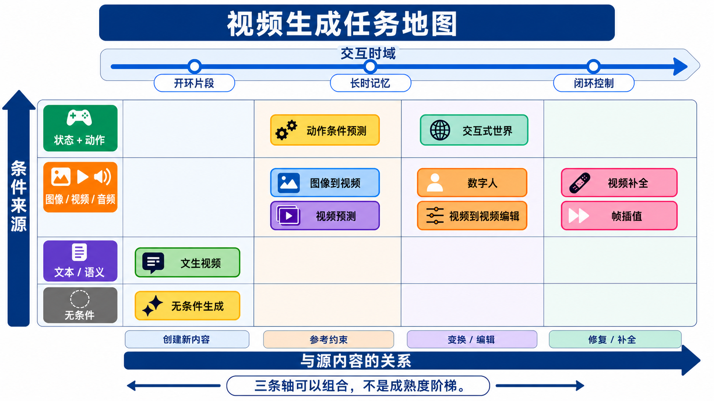
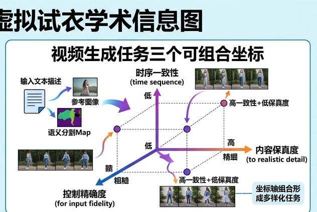
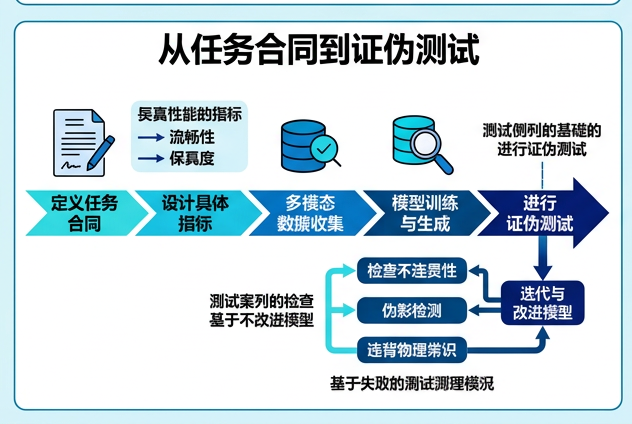

# 视频生成任务地图：条件来源 × 源内容关系 × 交互时域

> 一手来源复核截至 **2026-08-30**。本页是任务定义与验收入口，不是模型排行榜。检索式、纳排标准、图像生成与视觉验收记录见[研究日志](../sources/research_20260830_task_application_taxonomy.md)。

视频任务不应被排成“无条件 → 文生视频 → 图生视频 → 编辑 → 世界模型”的单线升级链。更可靠的描述是先给每个任务写出三个坐标：

1. **条件来源**：模型依据什么信息生成；
2. **与源内容的关系**：从零创作、受参考约束、变换已有内容、恢复退化观测，还是补全缺失支持；
3. **交互时域**：一次性输出片段、依赖长期记忆，还是进入动作—观测闭环。

同一个模型可以支持多个任务，同一个任务也可以由多种模型机制实现。任务由**输入、输出、必须保留什么以及怎样判错**定义，不由“用了 DiT、Diffusion 或 Flow”定义。

## 1. 三轴地图：先定位任务，再选择模型



**图 1：任务是坐标，不是等级。** 中央卡片给出非穷尽的常见主坐标，不表示任务只能接受一种输入；图中的 `Video Inpainting` 是缺失支持补全，整帧 blur、noise、downsample 或 compression 的退化恢复已在下方任务表及[专门合同图](tasks/video-restoration.md)中独立建模。上方 `INTERACTION HORIZON` 是独立第三轴，因此没有用连线把每个任务永久绑定到某个时域。生成图经过两轮纠错：首稿纠正了插帧、预测和数字人的条件位置，次稿删除了会暗示固定关系的虚线。图像提示词、版本和 SHA-256 见[研究日志](../sources/research_20260830_task_application_taxonomy.md)。


顺序化文字替代：先写条件来源，再写输出与源素材之间的关系，然后写系统是一次性生成、跨段记忆还是动作—观测闭环；三项合成任务合同。任务合同规定哪些内容必须改变、哪些内容不得改变以及需要什么证据。AR、masked、diffusion、flow、GAN 或混合系统只是实现方案，不能反向替代任务定义。

## 2. 三个坐标分别回答什么

### 2.1 条件来源：模型究竟看到了什么

一个任务可以同时使用多类条件。令条件集合为

```math
C \subseteq \{
\text{text},\text{image},\text{video},\text{audio},
\text{mask},\text{camera},\text{trajectory},\text{state},\text{action}
\}.
```

| 条件类别 | 典型信息 | 不能自动推出的能力 |
|---|---|---|
| 无或类别标签 | 随机种子、类别 | 不能推出语义可控、参考保持或动作响应 |
| 文字 / 语义 | 主体、动作、关系、镜头、风格 | 文字对齐不证明身份保持、几何正确或长期状态记忆 |
| 图像 / 视频 / 音频 | 外观、构图、历史、语音、音乐 | 给过参考不等于模型确实使用了参考；需反事实消融 |
| mask / 轨迹 / 相机 | 局部区域、运动路径、视角 | 控制接口存在不等于控制误差小或未编辑区不泄漏 |
| 状态 / 动作 | 环境状态、控制量、策略指令 | 动作条件不等于动作因果正确，更不等于闭环可用 |

条件需要记录**单位与时间对齐**。例如，“音频驱动”至少要说明采样率、音频窗口、视频帧率与延迟；“动作条件”要说明动作频率、坐标系、离散/连续定义和观测—动作对齐。

### 2.2 与源内容的关系：输出必须保留什么

横轴不是审美风格强弱，而是输出相对已有素材的合同：

| 关系 | 最小合同 | 典型任务 | 首要错误 |
|---|---|---|---|
| 从零创作 | 不存在必须逐像素继承的源视频 | 无条件、T2V | 语义、运动、多样性或物理失败 |
| 参考约束 | 保留参考中的身份、构图、状态或历史 | I2V、视频预测 | 条件被忽略、身份漂移、历史断裂 |
| 变换 / 编辑 | 只改变指令指定的属性或区域 | V2V、数字人、重定向 | 过度编辑、未指定区域变化、动作串扰 |
| 退化恢复 | 全帧通常仍有观测；恢复同一场景的未退化信号 | 超分、去模糊、去噪、去压缩 | 幻觉文字/身份/结构、闪烁、退化分布外失效 |
| 缺失补全 | 已知区域是硬约束，缺失支持需合理补齐 | inpainting、outpainting | mask 外泄漏、边界接缝、遮挡恢复错误 |

“参考约束”“变换”“退化恢复”和“缺失补全”之间可以重叠。VACE 把 reference、editing 与 mask 组织进统一条件接口，说明一个模型可以组合任务；码流修复也可能先估计损坏 mask 再补全。这不意味着不同任务的观测模型、保留合同和评测可以合并 [[5]](#ref-5)。

### 2.3 交互时域：何时提交，能否回滚

| 时域 | 输出方式 | 系统必须报告 | 典型风险 |
|---|---|---|---|
| Open-loop clip | 给定全部条件后一次生成固定片段 | 时长、分辨率、帧率、采样次数、随机种子 | cherry-pick、短片段掩盖漂移 |
| 长期记忆 | 多段生成或滚动预测，后段依赖前段状态 | 记忆窗口、压缩/淘汰策略、段间 seam、漂移曲线 | 忘记对象、身份与事件，错误累积 |
| Closed-loop control | 每轮接收动作并在 deadline 内返回新观测 | 动作率、TTFF、逐帧/逐块延迟、deadline miss、状态一致性 | 看起来实时但动作无效，平均 FPS 掩盖长尾延迟 |

Genie 把视频 tokenizer、autoregressive dynamics 与 latent action model 组合成可逐帧控制的生成环境；它的里程碑是**接口与交互合同**改变，而不是“画面比普通 T2V 更漂亮” [[4]](#ref-4)。

## 3. 全仓库任务的最小合同

下表中的“主坐标”用于定位，不排除额外条件或混合模式。

| 任务 | 主条件 | 源内容关系 | 常见时域 | 必须输出 | 一票否决式错误 | 专章 |
|---|---|---|---|---|---|---|
| 无条件视频生成 | 无 / 类别 | 从零创作 | open-loop | 分布中的新视频样本 | 训练样本记忆、模式坍塌、类别泄漏 | [无条件生成](tasks/unconditional-video-generation.md) |
| 文本到视频 | 文字 | 从零创作 | open-loop，可扩展多镜头 | 满足主体、关系、动作、镜头的片段 | 只出现关键词但关系/时间顺序错误 | [文生视频](tasks/text-to-video.md) |
| 原生音视频生成 | 文字，可附图像 / 音频 / 音色参考 | 从零创作或参考约束 | open-loop 到流式 | 在同一生成过程中相互耦合、同步的画面与声音 | 实际只是视频后配音；事件、说话人与声源错绑 | [原生音视频](tasks/native-audio-video-generation.md) |
| 图像到视频 | 首帧或参考图，常附文字 | 参考约束 | open-loop | 保持外观/构图并生成合理运动 | 参考身份或布局漂移、首帧不连续 | [图生视频](tasks/image-to-video.md) |
| 开放集视频个性化 | 一组或多组主体参考 + 文字，可附动作 / 相机 | 参考约束但不占输出时间轴 | open-loop，可扩展多镜头 | 新场景、新动作中保持主体身份与正确绑定 | 参考姿态/背景复制、静态化、多主体融合或丢失 | [开放集视频个性化](tasks/personalized-video-generation.md) |
| 细粒度可控生成 | 文字 / 图像 + 相机、轨迹、姿态或几何序列 | 从零创作、参考约束或变换 | open-loop，可扩展在线控制 | 按明确坐标与时间轴执行指定视角或运动的视频 | 控制被忽略、坐标误读、主体/背景串扰、遮挡与出画后失控 | [细粒度可控生成](tasks/controllable-video-generation.md) |
| 多视角 / 4D 生成 | 单目/多目图像视频、相机与时间，可附文字 | 参考约束、重建或生成未见区域 | 离线 query grid 到长时流式 | 多相机 × 多时间视频，或可按 $(v,t)$ 查询的动态状态 | 一条相机路径伪装成 4D；重投影、遮挡、loop closure 或几何失败 | [多视角与 4D](tasks/multiview-4d-generation.md) |
| 视频到视频编辑 | 源视频 + 指令 / 参考 / 轨迹 | 变换 / 编辑 | open-loop 或跨段记忆 | 指定变化后的完整视频 | 未编辑区域变化、时间传播不一致 | [视频编辑](tasks/video-to-video.md) |
| 视频退化修复 | 低质量视频 + 可选退化参数 / metadata | 退化恢复 | 离线双向或因果流式 | 同一时间轴的高质量视频 | 幻觉文字/人脸/结构、时间闪烁、真实退化失效 | [视频退化修复](tasks/video-restoration.md) |
| 视频补全 | 视频 + 时空 mask | 缺失补全 | open-loop 或长视频分段 | 缺失区域及其时间延续 | mask 外像素被改、边界 seam、重现被删对象 | [视频补全](tasks/video-inpainting.md) |
| 帧插值 | 两侧或多侧已知帧 + 时间位置 | 时间补全 | 固定区间 | 已知时刻之间的中间帧 | 端点不守恒、遮挡层次反转、时间位置错误 | [帧插值](tasks/frame-interpolation.md) |
| 视频预测 | 过去帧，可有上下文 | 参考约束 / 时间延展 | open-loop 到长期 rollout | 一个或多个可能未来 | 把多模态未来平均成模糊唯一答案 | [视频预测](tasks/video-prediction.md) |
| 动作条件预测 | 历史观测 + 动作序列 | 参考约束 / 时间延展 | 长期 rollout | 给定动作后的未来观测 | 换动作而未来不变，或动作单位/坐标错位 | [动作条件预测](tasks/action-conditioned-prediction.md) |
| 故事与多镜头 | 剧本、分镜、角色/场景参考 | 从零创作 + 参考约束 | 长期记忆 | 多个镜头与叙事关系 | 单镜头漂亮但人物、道具、因果跨镜头断裂 | [故事与多镜头](tasks/story-multishot.md) |
| 数字人 | 身份参考 + 音频 / 文字 / 姿态 | 参考约束 + 变换 | clip 到长期表演 | 身份稳定、同步且语义匹配的人体视频 | 未授权身份、口型/身体错拍、多人串扰 | [数字人](tasks/digital-human.md) |
| 交互式世界 | 初始状态 + 连续动作 | 参考约束 + 状态变换 | closed-loop | 可持续响应的观测流与状态 | 动作无因果效应、回访失忆、deadline miss | [交互世界](tasks/interactive-world-generation.md) |

Video Diffusion Models 曾在同一研究框架里覆盖无条件生成、文本条件和视频预测；Stable Video Diffusion 又展示基础视频表示对 I2V 与相机控制适配的价值 [[1]](#ref-1) [[2]](#ref-2)。这类共享说明**模型可迁移**，不能把任务的输入输出与验收合同合并。

## 4. 十组最容易混淆的边界

### 4.1 I2V 与帧插值

- I2V 通常只有首帧/参考图，未来存在多种合理答案。
- 插值同时知道前后端点，目标时刻被夹在已知观测之间。
- 插值必须检查端点守恒、遮挡显隐与精确时间位置；I2V 更强调参考身份、运动合理性和多样性。

### 4.2 I2V 与开放集视频个性化

- 严格 I2V 中的参考图是已知时刻或首帧锚点；个性化中的参考只定义主体，输出使用全新时间轴。
- 个性化可做逐主体调优或无调优推理，但必须报告适配数据、步数、额外状态与测试主体隔离。
- I2V 锚点保真不能证明开放集绑定；个性化身份分高也不能证明首帧守恒。详见[开放集视频个性化](tasks/personalized-video-generation.md)。

### 4.3 视频编辑、退化修复与视频补全

- 编辑允许把已知内容改成另一种内容，但要遵守指令范围。
- 退化修复把整段低质量视频视为观测证据，目标是逆转 blur、downsample、noise、compression 等退化；需同时检查 fidelity、时间稳定和生成幻觉。
- 视频补全把已知像素视为硬证据，只在 mask 内补全；mask 外误差应单独报告。
- “统一模型都能做”只说明接口复用，不取消重退化一致性、幻觉审计或 outside-mask protection 等任务专属指标。

### 4.4 视频预测与普通条件生成

- 预测条件来自真实过去，未来要与过去状态连续。
- T2V 的文字通常不提供逐时刻真实状态；生成一个合理视频不等于预测给定场景的未来。
- 单一 ground truth 不能完整覆盖随机未来；应分栏报告概率覆盖/校准，以及固定预算 best-of-$N$。后者只是一种 coverage/search oracle，不是 calibration。
- 若模型声称 stochastic latent，还要核对训练 posterior 是否看真实未来、部署 prior 是否只看历史，以及测试是否严格从 prior 采样；完整分类门见[变分随机视频生成](generative-models/variational-generation.md)。

### 4.5 动作条件预测与交互世界

动作条件预测可以离线读取完整动作序列；交互世界还要求每一步在 deadline 内返回，并把返回结果作为下一步状态。2015 年的 Atari 工作把动作显式注入高维视频预测，是重要任务里程碑，但不等于今天端到端、低延迟的交互系统 [[3]](#ref-3)。

### 4.6 数字人与通用 I2V / V2V

数字人同时增加身份、音视频同步、语义表演、人体结构和同意/冒用风险。OmniHuman-1.5 引入由多模态模型构造的结构化语义条件，以超越只跟随音频节奏的低层同步；其结果仍是作者报告的 2025 预印本证据 [[6]](#ref-6)。

### 4.7 长视频与多镜头叙事

- 延长单镜头主要测试持续运动、对象存在和漂移。
- 多镜头允许切镜，却必须保持人物、道具、地点、事件顺序与镜头意图。
- 把若干独立短片拼接起来不构成多镜头叙事系统，除非存在跨镜头状态合同和冲突处理。

### 4.8 原生联合音视频与视频后配音

- Video-to-audio 学习 $p(a\mid v,y)$：画面已经确定，声音只能追随它；这仍可产生高质量同步音频，但不是联合生成视频。
- 原生联合系统要公开支持 $p(v,a\mid y)$ 的耦合机制，例如生成期间的双向 cross-attention、共享去噪状态或跨模态递归记忆；“最终文件同时有声有画”不构成机制证据。
- 交换音频条件、打乱时间或删除声音事件时，必须分别观察音频与视觉节奏是否响应；只报一个平均 AV score 会掩盖口型、事件 onset、说话人和声源方向的不同错误。Ovi 是双 backbone 交互的预印本例子，但其作者结果仍不等于所有产品的联合机制 [[12]](#ref-12)。

### 4.9 视觉运动控制与环境动作

- 相机 pose、2D/3D 轨迹、pose/depth/flow 等控制信号描述“希望画面怎样变化”，通常可在生成前一次性给完整序列。
- 环境 action 则必须对应状态转移；若进一步声称交互，还要在模型返回新观测后重新规划。
- 因此，准确沿轨迹移动不证明模型学会动作因果，反之，动作条件模型也未必提供可编辑的摄影机或对象路径。VideoComposer 展示多种时空条件的统一接口，但每种控制仍需独立误差与串扰测试 [[10]](#ref-10)。

### 4.10 相机控制视频、多视角视频与可渲染 4D 状态

- 相机控制视频每个世界时间只选择一个相机位置，覆盖的是 camera–time 平面上的一条路径。
- 多视角视频要求同一世界时间存在多个彼此一致的视图；只让一条路径看起来合理不能证明其余视图存在。
- 可渲染 4D 状态还要把多视角时序提升为可重复查询的 dynamic radiance、surface、Gaussian 或其他状态表示。
- 因此应分别测试 freeze-time 多视角、freeze-camera 时间推进、novel-view/novel-time、重投影、遮挡与 loop closure。完整的五路线、里程碑和 `GridFork-1` 见[多视角与 4D 专章](tasks/multiview-4d-generation.md)。

## 5. 任务合同：一页纸写清“什么算成功”

建议为每个实验写六元组：

```math
\mathcal T=(I,O,K,\Delta,H,E),
```

其中：

- $I$：输入与时间对齐；
- $O$：输出变量、时长、帧率和分辨率；
- $K$：必须保持的不变量，例如身份、mask 外像素或世界状态；
- $\Delta$：允许/要求发生的变化；
- $H$：clip、长期记忆或闭环时域；
- $E$：能证伪任务主张的评测协议。


### 5.1 保持账本与变化账本

对每个属性 $j$，先声明它属于必须保持集合 $K$ 还是允许改变集合 $\Delta$。编辑任务可把综合损失写成：

```math
L_{\text{task}}
=
\lambda_{\Delta}L_{\text{requested change}}
+
\lambda_K L_{\text{preservation}}
+
\lambda_t L_{\text{temporal}}
+
\lambda_s L_{\text{safety}}.
```

该式不是统一训练配方，而是验收账本：某个平均分上升不能抵消身份泄漏、mask 外变化或动作无效等硬失败。

### 5.2 反事实条件测试

固定随机种子和其他输入，只改变一个条件：

- 改动作，未来是否按动作改变；
- 改音频，口型/节奏是否改变而身份保持；
- 移动 mask，变化是否随 mask 移动；
- 改相机轨迹，主体动作是否不被错误改写；
- 去掉参考，身份分数是否显著下降。

若输出几乎不变，条件可能被忽略；若无关属性也大幅改变，系统存在控制串扰。

## 6. 里程碑按“任务合同改变”收录

本页不因参数量、演示热度或单一分数收录里程碑。至少满足一项：引入新条件接口、建立新保留合同、把输出推进到新的交互时域，或提供能改变评测方式的证据。

| 首次公开 / 正式发表 | 工作 | 任务合同上的变化 | 当时仍未解决 |
|---|---|---|---|
| 2015 / NeurIPS 2015 | Action-Conditional Video Prediction | 把动作作为显式控制量注入未来帧预测 [[3]](#ref-3) | Atari 域、像素误差偏置、随机未来和现实控制迁移 |
| 2022 / NeurIPS 2022 | Video Diffusion Models | 同一 diffusion 框架覆盖无条件、文字条件、预测与扩展 [[1]](#ref-1) | 计算成本、长时状态、任务专属协议仍分离 |
| 2023 / NeurIPS 2023 | VideoComposer | 把文字、空间条件、运动向量和条件序列放入可组合时空控制接口 [[10]](#ref-10) | 控制信号仍会冲突，精确 3D 相机/遮挡与大规模 DiT 迁移尚未解决 |
| 2023 / 技术报告 | Stable Video Diffusion | 大规模视频预训练并展示 I2V / 相机适配 [[2]](#ref-2) | 参考保持不稳定，开放权重能力与产品能力不能混同 |
| 2023 / SIGGRAPH 2024 | MotionCtrl | 在一个控制器中显式分离相机姿态与对象轨迹，并发布适配多个视频底座的工件 [[11]](#ref-11) | 2D/相对控制、估计噪声、遮挡与新视角几何仍限制精度 |
| 2024 / ICML 2024 | Genie | 从无动作标签视频学习 latent actions，形成逐帧可控环境 [[4]](#ref-4) | 低分辨率域、动作语义、现实转移与部署时延 |
| 2024 / ICLR 2024 | UniSim | 以统一 action-in/video-out 接口组合多域数据并支持交互模拟 [[7]](#ref-7) | “universal”是接口范围，不是模拟一切；声音等能力明确缺失 |
| 2025 / ICCV 2025 | VACE | 统一 reference、editing 与 masked editing 条件接口 [[5]](#ref-5) | 统一模型不保证每个任务都达到专用模型的硬约束上限 |
| 2025 / 技术报告 | OmniHuman-1.5 | 从低层音频节奏扩展到音频、图像与文字的语义表演条件 [[6]](#ref-6) | 长时身份、同意/冒用、复杂多人及独立复现 |
| 2025 / 预印本 | Ovi | 在 twin backbone 中逐块双向交换音频与视频信息，使“有声视频”进入公开可检查的联合生成合同 [[12]](#ref-12) | 仍是作者预印本与工件证据；同步、音色与开放域安全需独立复核 |
| 2025 / 技术报告 | DreamGen | 把视频世界模型生成的 neural trajectories 转成伪动作并评测下游策略 [[8]](#ref-8) | 视频正确性、逆动力学误差与真实策略收益仍会级联 |
| 2026 / 技术报告 | Cosmos 3 | 在同一 omnimodal 家族中组合语言、图像、视频、音频和动作输入输出 [[9]](#ref-9) | 技术报告/作者榜单不等于独立闭环复现 |

DreamGen 的价值不在“生成了机器人视频”本身，而在把生成视频、latent action / inverse dynamics 与政策学习串成可检验链；作者报告的下游收益必须保留数据、机器人和评测设置边界 [[8]](#ref-8)。Cosmos 3 则是截至复核日的重要 2026 前沿，但应写成机构技术报告和开放发布面，而不是已形成同行评审共识 [[9]](#ref-9)。

## 7. 每条轴对应不同证据

| 主张 | 最少要报告 | 反例 / 压力测试 | 不能用什么代替 |
|---|---|---|---|
| 条件遵循 | 条件解析、组合提示、关系与时间顺序准确率 | 同 seed 单变量干预、否定词、稀有组合 | CLIP 类平均分或最佳样例 |
| 参考保持 | 身份/结构/颜色/状态分项与置信区间 | 遮挡、旋转、出画再入画、长时漂移 | 单帧相似度 |
| 开放集主体保持 | 身份/属性、prompt/运动、时间漂移、绑定、泄漏和适配成本 | 参考交换、遮挡后重现、新姿态/背景、多主体冲突 | 单帧人脸或 CLIP 相似度 |
| 局部编辑 / 补全 | 目标区变化 + 非目标区误差 | 移动 mask、细边界、快速运动、scene cut | 整段感知质量平均分 |
| 退化修复 | paired fidelity + temporal stability + perceptual detail + hallucination | 未见 kernel/codec/相机、文字、人脸、快速运动、多 seed | 只报 PSNR 或只报无参考美学分 |
| 随机未来 | 多样性、覆盖、校准、best-of-$N$ 与平均性能 | 罕见事件、多分支动作、不可观测状态 | 对单一未来的 MSE |
| 动作响应 | 状态转移、动作可辨识度、反事实差异 | 无动作/反动作/无效动作、动作延迟扰动 | “看起来像游戏/机器人” |
| 长期记忆 | 对象存在、身份、拓扑、事件账本随时间曲线 | 回访、跨段 prompt、长尾 horizon | 5 秒短片质量 |
| 闭环交互 | TTFF、deadline miss、p95/p99 latency、动作率、任务成功 | 峰值负载、快速动作切换、错误恢复 | 平均 FPS |

完整的统计、主观评测、世界模型证据阶梯与部署 SLO 见[评测指南](evaluation.md)。

## 8. 如何从问题进入专章

1. 写出你的 $I,O,K,\Delta,H,E$；若写不清，先不要挑模型。
2. 在第三节找到最近任务，再用第四节排除容易混淆的邻居。
3. 进入对应专章，查看机制路线、数据、协议和最新论文；参考只定义主体且不占输出时间轴时见[开放集视频个性化](tasks/personalized-video-generation.md)，超分/去模糊/去噪/去压缩见[视频退化修复](tasks/video-restoration.md)，mask 缺失区见[视频补全](tasks/video-inpainting.md)，显式相机/轨迹/姿态条件见[细粒度可控生成](tasks/controllable-video-generation.md)，联合画面与声音见[原生音视频](tasks/native-audio-video-generation.md)。若问题是“同一真实历史怎样产生多个概率可信的未来”，先读[变分随机视频生成](generative-models/variational-generation.md)，再回到[视频预测](tasks/video-prediction.md)选择 task protocol。
4. 若一个系统同时支持多个任务，为每个任务分别验收，不共享一个总分。
5. 若目标涉及动作或现实决策，继续阅读[World Model](world-models.md)、[物理一致性](physical-consistency.md)和[相关应用](applications.md)。

## 参考文献

<a id="ref-1"></a>[1] [Video Diffusion Models](https://proceedings.neurips.cc/paper_files/paper/2022/hash/39235c56aef13fb05a6adc95eb9d8d66-Abstract-Conference.html). Jonathan Ho, Tim Salimans, Alexey Gritsenko, William Chan, Mohammad Norouzi, David J. Fleet. NeurIPS. 2022.

<a id="ref-2"></a>[2] [Stable Video Diffusion: Scaling Latent Video Diffusion Models to Large Datasets](https://arxiv.org/abs/2311.15127). Andreas Blattmann, Tim Dockhorn, Sumith Kulal, Daniel Mendelevitch, Maciej Kilian, Dominik Lorenz, et al. arXiv preprint. 2023.

<a id="ref-3"></a>[3] [Action-Conditional Video Prediction using Deep Networks in Atari Games](https://proceedings.neurips.cc/paper_files/paper/2015/hash/6ba3af5d7b2790e73f0de32e5c8c1798-Abstract.html). Junhyuk Oh, Xiaoxiao Guo, Honglak Lee, Richard L. Lewis, Satinder Singh. NeurIPS. 2015.

<a id="ref-4"></a>[4] [Genie: Generative Interactive Environments](https://proceedings.mlr.press/v235/bruce24a.html). Jake Bruce, Michael D. Dennis, Ashley Edwards, Jack Parker-Holder, Yuge Shi, Edward Hughes, et al. ICML. 2024.

<a id="ref-5"></a>[5] [VACE: All-in-One Video Creation and Editing](https://openaccess.thecvf.com/content/ICCV2025/html/Jiang_VACE_All-in-One_Video_Creation_and_Editing_ICCV_2025_paper.html). Zeyinzi Jiang, Zhen Han, Chaojie Mao, Jingfeng Zhang, Yulin Pan, Yu Liu. ICCV. 2025.

<a id="ref-6"></a>[6] [OmniHuman-1.5: Instilling an Active Mind in Avatars via Cognitive Simulation](https://arxiv.org/abs/2508.19209). Jianwen Jiang, Weihong Zeng, Zerong Zheng, Jiaqi Yang, Chao Liang, Wang Liao, et al. arXiv preprint. 2025.

<a id="ref-7"></a>[7] [Learning Interactive Real-World Simulators](https://openreview.net/forum?id=sFyTZEqmUY). Sherry Yang, Yilun Du, Kamyar Ghasemipour, Jonathan Tompson, Leslie Kaelbling, Dale Schuurmans, et al. ICLR. 2024.

<a id="ref-8"></a>[8] [DreamGen: Unlocking Generalization in Robot Learning through Video World Models](https://arxiv.org/abs/2505.12705). Joel Jang, Seonghyeon Ye, Zongyu Lin, Jiannan Xiang, Johan Bjorck, Yu Fang, et al. arXiv preprint. 2025.

<a id="ref-9"></a>[9] [Cosmos 3: Omnimodal World Models for Physical AI](https://arxiv.org/abs/2606.02800). NVIDIA et al. Technical report. 2026.

<a id="ref-10"></a>[10] [VideoComposer: Compositional Video Synthesis with Motion Controllability](https://proceedings.neurips.cc/paper_files/paper/2023/hash/180f6184a3458fa19c28c5483bc61877-Abstract-Conference.html). Xiang Wang, Hangjie Yuan, Shiwei Zhang, Dayou Chen, Jiuniu Wang, Yingya Zhang, et al. NeurIPS. 2023.

<a id="ref-11"></a>[11] [MotionCtrl: A Unified and Flexible Motion Controller for Video Generation](https://arxiv.org/abs/2312.03641). Zhouxia Wang, Ziyang Yuan, Xintao Wang, Yaowei Li, Tianshui Chen, Menghan Xia, et al. First preprint 2023; SIGGRAPH Conference Papers. 2024. [Official project and release surface](https://wzhouxiff.github.io/projects/MotionCtrl/).

<a id="ref-12"></a>[12] [Ovi: Twin Backbone Cross-Modal Fusion for Audio-Video Generation](https://arxiv.org/abs/2510.01284). Ovi team. arXiv preprint. 2025. Official code and weights [](https://github.com/character-ai/Ovi).
